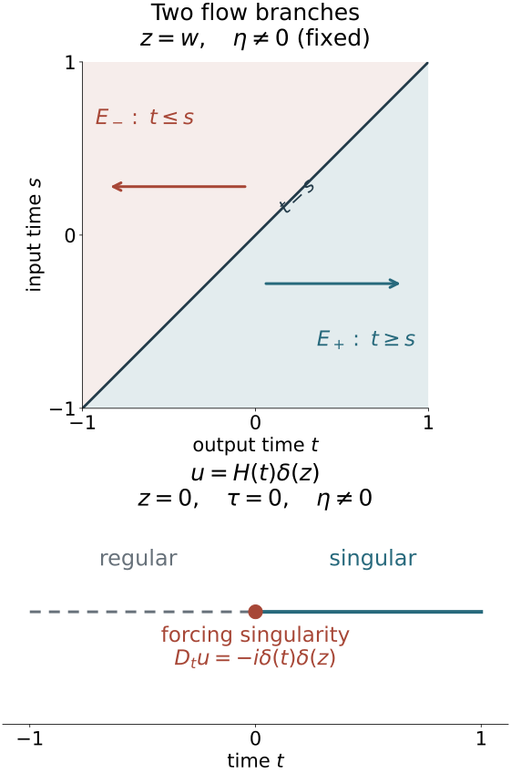

# Singularities along a real characteristic direction

A real principal symbol selects characteristic curves in phase space. Away from singularities of the forcing, a distributional solution retains its smoothness or singularity along each such curve. We prove this by finding the exact wavefront of two signed fundamental kernels, using one cutoff for a whole transport tube, and applying the full canonical conjugation already constructed.

The geometric inputs are the homogeneous coordinate theorem in [Prescribed canonical coordinates and isotropic fibers](../20261005-restored-prescribed-coordinates/prescribed-canonical-coordinates-and-isotropic-fibers.md), Section 3, and its real-symbol application in [Real and complex symplectic normal forms of functions](../20261005-restored-function-normal-forms/real-and-complex-symplectic-function-normal-forms.md), Section 1. They retain the nonradial condition and marked covector. [Graph operators, continuity and Egorov](../20261005-restored-graph-egorov/graph-operators-continuity-and-egorov.md), Sections 6–7 and equations GT1–GT17, supplies both graph inverses and the complete removal of lower terms.

The full Fourier cutoff and coordinate proofs are [T0 and W1–W4 in Coordinate transport and directional localization](../20261004-free-intrinsic-graph/prerequisites/coordinate-and-wavefront-localization.md). [Conic parametrices, K2–K4](../20261004-free-intrinsic-graph/prerequisites/conic-parametrices-and-localization.md) give the actual elliptic inverse. The retained [tensor wavefront and exact projection proof](tensor-wavefront-and-projection.md) supplies WF8–WF10, including the converse for a constant factor. Its earlier tensor-product and support proof is [GK25 in Scalar kernels and strong topology](../20261005-restored-analytic-composition/scalar-kernels-and-strong-topology.md). The full ordinary composition, amplitude and proper-kernel estimates remain the exact O3–O6 providers of the earlier conic proof. [Positive manifold order reducers](../20261005-restored-invariant-folds/invariant-fold-continuity-and-sobolev-transfer.md#5-reduce-every-real-sobolev-estimate-to-order-minus-one-sixth) and their two-sided inverses supply the real-order reduction below.

All these proofs and their transitive prerequisites are included; the [proof map](proof-map.json) identifies their exact locators. The tensor-wavefront companion is a retained AN-03 GFDL component. The receiving propagation proof and its examples remain independently written.

The source antecedents are the reprint of Hörmander IV, Theorem 26.1.1 and Propositions 26.1.2–26.1.3. The argument concerns ordinary symbols with the specified homogeneous principal part and arbitrary scalar lower terms. Sobolev propagation, prescribed singular rays, compact global tubes and the full propagation parametrix have their own later proofs.

## 1. The two fundamental solutions retain their signs

For the nonradial model take \(n\ge2\). Write \(x=(t,z)\), \(y=(s,w)\) in \(\mathbb R\times\mathbb R^{n-1}\), with \(D_t=-i\partial_t\). The separate radial example below has dimension one. Set
\[
 E_+(t,z;s,w)=iH(t-s)\delta(z-w),\qquad
 E_-(t,z;s,w)=-iH(s-t)\delta(z-w).
 \tag{RP1}
\]
Here the value chosen for \(H(0)\) is irrelevant to the distribution. The identity \(H'=\delta\) follows from \(-\int_0^\infty\varphi'(t)dt=\varphi(0)\) for every compact smooth test. Differentiation in the output variable gives
\[
 D_t E_+=D_t E_-=\delta(t-s)\delta(z-w).
 \tag{RP2}
\]
Integration by parts in the input variable gives the same identity for \(E_\pm D_s\). Thus they are both left and right fundamental solutions on compactly supported distributions. For example, for a compact smooth \(f\),
\[
 (E_+f)(t,z)=i\int_{-\infty}^t f(s,z)\,ds,\qquad
 (E_-f)(t,z)=-i\int_t^\infty f(s,z)\,ds.
 \tag{RP3}
\]
The formulas have the indicated forward and backward supports. Pairing with a compact output test gives a smooth input test on the compact support of the input distribution, proving their distributional meaning. After inserting that input support cutoff, every test derivative is bounded by a finite integral of the original output derivatives. This also proves continuity into local distributions. More explicitly, after pairing with an output test \(\phi\), the transpose of \(E_+\) is \(i\int_s^\infty\phi(t,w)\,dt\), and that of \(E_-\) is \(-i\int_{-\infty}^s\phi(t,w)\,dt\). A compact input-support cutoff makes these compact tests without changing their pairing. Their derivatives and all output-test seminorms have the stated bounded-integral estimates. Differentiating in \(s\) gives \(-i\phi(s,w)\) in both cases. Therefore the distributional derivative rule gives \(E_\pm D_s f=f\) for every compactly supported distribution \(f\); the output derivative similarly gives \(D_tE_\pm f=f\). They are not asserted to be globally properly supported on the entire time axis.

For \(f\) supported in \([a,b]\times K\) and a bounded output time interval \(J\), Cauchy–Schwarz gives
\[
 \|E_\pm f\|_{L^2(J\times\mathbb R^{n-1})}
 \le |J|^{1/2}(b-a)^{1/2}\|f\|_{L^2}.
 \tag{RP4}
\]
For each output time the integral over the input interval has length at most \(b-a\); integrate its squared bound over \(J\) and \(z\). No endpoint trace of an arbitrary spacetime \(L^2\) function is used.

## 2. The exact kernel wavefront has a diagonal and a flow part

Let
\[
 \Delta=\{(t,z;\tau,\eta;t,z;\tau,\eta):
                    (\tau,\eta)\ne0\},
\]
and
\[
 C_0=\{(t,z;0,\eta;s,z;0,\eta):\eta\ne0\}.
 \tag{RP5}
\]
The prime on a kernel wavefront relation reverses the input covector. Then
\[
 \operatorname{WF}'(E_+)=\Delta\cup(C_0\cap\{t\ge s\}),\qquad
 \operatorname{WF}'(E_-)=\Delta\cup(C_0\cap\{t\le s\}).
 \tag{RP6}
\]

To prove the upper inclusions, use the invertible linear coordinates
\(v=t-s\), \(r=z-w\), \(s,w\). The kernel is a constant smooth factor in the last coordinates and a multiple of \(H(v)\delta(r)\), or \(H(-v)\delta(r)\). The tensor estimate WF9 gives only zero covectors in the constant variables. The Heaviside factor is smooth away from its jump; a compact localization of the delta factor has constant nonzero Fourier transform, so its wavefront contains exactly every nonzero conormal at its support. When \(v>0\), the first forward factor is smooth and nonzero; the remaining wavefront is \(\tau=0,\eta\ne0,r=0\). When \(v<0\) the forward kernel vanishes. At \(v=r=0\) the only possible nonzero covectors are arbitrary \((\tau,\eta)\). The exact coordinate wavefront rule W3 transports these statements. In particular the singular covector in \((v,r,s,w)\) is \((\tau,\eta,0,0)\); in the original output/input variables it is
\[
(\tau,\eta;-\tau,-\eta).
\tag{RP6a}
\]
Reversing the input covector therefore gives exactly the diagonal or the stated flow relation, with neither a zero input-only nor a zero output-only direction. The backward case reverses \(v\).

Both parts occur. Away from \(v=0\), the exact projection converse WF10 and the elementary transform of \(\delta(r)\) give every nonzero conormal direction \((0,\eta)\). At \(v=r=0\), the localized transform in the singular variables is
\[
 \int_0^\infty e^{-iv\tau}b(v,0)\,dv.
 \tag{RP7}
\]
For a smooth cutoff with \(b(0,0)\ne0\), integration by parts gives the leading term \(b(0,0)/(i\tau)\) as \(|\tau|\to\infty\), with an error of order \(|\tau|^{-2}\); the expression is independent of \(\eta\). To make the error explicit, write \(h(v)=b(v,0)\) and integrate twice. The remainder after \(h(0)/(i\tau)\) has absolute value at most
\[
|\tau|^{-2}\left(|h'(0)|+\int_0^\infty|h''(v)|\,dv\right).
\tag{RP7a}
\]
All endpoint terms at infinity vanish by compact support. The nonzero leading coefficient thus excludes rapid decrease on either temporal-frequency ray. Hence no cone with \(\tau\ne0\) has rapid decrease, whatever its \(\eta\) component. In a cone about \((0,\eta_0)\), choose a fixed temporal frequency at which RP7 is nonzero and let \(\eta=R\eta_0\). Such a temporal frequency exists: the compactly supported function \(H(v)b(v,0)\) is nonzero, and Fourier inversion forbids an identically zero transform. This proves failure of rapid decrease in those cones too. For a cutoff depending also on \(s,w\), take a fixed Fourier frequency in those smooth variables whose partial transform has nonzero value at \(v=r=0\). Fourier inversion again supplies it. The same calculation then applies, so it proves the statement for every cutoff nonzero at the original point. All diagonal directions therefore occur.

The difference has a simpler relation:
\[
 E_+-E_-=i\delta(z-w)
   =(2\pi)^{-(n-1)}\int e^{i(z-w)\cdot\eta}\,i\,d\eta.
 \tag{RP8}
\]
It has wavefront exactly \(C_0'\). In the course's convention, its amplitude order zero, \(n-1\) phase variables and ambient dimension \(2n\) give Lagrangian order
\[
 0+\frac{n-1}{2}-\frac{2n}{4}=-\frac12.
 \tag{RP9}
\]
If a smooth kernel cutoff vanishes near the diagonal, each retained forward or backward kernel is locally a smooth coefficient times RP8, or zero: on \(z=w\) away from the diagonal, \(t-s\) has a fixed nonzero sign locally. A locally finite partition makes these representations agree. Thus the cutoff kernel is in \(I^{-1/2}(C_0')\). This statement is about its conormal order; the full fundamental solution still has the additional diagonal part RP6.

## 3. A distribution with a smooth time derivative is constant modulo a smooth function

Let \(I\) be an open interval. If \(D_t v=g\in C^\infty(I\times Z)\), choose \(t_*\in I\) and put
\[
 G(t,z)=i\int_{t_*}^t g(s,z)\,ds.
 \tag{RP10}
\]
Every derivative is obtained either by differentiating this integral on a compact interval or by differentiating its endpoint. Hence \(G\) is smooth and \(D_tG=g\).

For \(h=v-G\), one has \(\partial_t h=0\). Choose \(\theta\in C_c^\infty(I)\) with integral one. If \(\varphi\in C_c^\infty(I\times Z)\), the test
\[
 \varphi(t,z)-\theta(t)\int_I\varphi(s,z)\,ds
\]
has integral zero in \(t\). Its time primitive is a compactly supported smooth test, so its pairing with \(h\) is zero by the derivative equation. Define \(c\in\mathcal D'(Z)\) by \(c(\psi)=h(\theta\otimes\psi)\). The preceding identity proves
\[
 v=1\otimes c+G,
 \qquad
 \operatorname{WF}(v)=
 \{(t,z;0,\eta):t\in I,(z,\eta)\in\operatorname{WF}(c)\}.
 \tag{RP11}
\]
The equality follows from the retained [exact constant-factor converse WF10](tensor-wavefront-and-projection.md), including the required permutation of variables. The primitive used in the zero-integral test argument is \(\int_{-\infty}^t\) of that test after extension by zero. It vanishes before and after its compact time support, because its total time integral is zero; differentiation under the finite integral proves all tangential derivatives and keeps one compact support. It does not rely on a restriction \(v(t_*,\cdot)\) that might be undefined beforehand.

## 4. Localize a whole transport tube without changing its time equation

Suppose \(D_t u=f\), and the compact segment
\[
 K=\{(t,z_0;0,\eta_0):t\in[a,b]\}\quad(\eta_0\ne0)
 \tag{RP12}
\]
is disjoint from \(\operatorname{WF}(f)\). Closedness and conicity of that set give slightly larger time and base neighborhoods and an angular neighborhood \(V\) of \(\eta_0\), together with \(\epsilon>0\), on which \(f\) is regular for all high frequencies satisfying
\[
 \eta/|\eta|\in V,\qquad |\tau|<\epsilon|\eta|.
 \tag{RP13}
\]
This is a common neighborhood for the whole compact segment: normalize the covectors, cover its compact time slice by finitely many regular neighborhoods, and take smaller common base and angular neighborhoods and the minimum of their positive temporal apertures. Choose the neighborhoods before constructing the operator.

Take a smooth order-zero frequency symbol \(b(\tau,\eta)\) supported in a smaller closed part of RP13, and equal to one near \((0,\eta_0)\) at high frequencies. A cutoff near the frequency origin removes the irrelevant bounded frequencies. Choose compact tangential cutoffs \(\psi,\psi_1\) supported in the regular base neighborhood, both equal to one near \(z_0\), and with \(\psi_1=1\) near \(\operatorname{supp}\psi\). Let \(T\) be the proper representative of \(\psi(z)b(D_t,D_z)\psi_1(z)\) obtained with a kernel cutoff depending only on \((t-s,z-w)\). Its kernel depends on the two time variables only through \(t-s\), including the proper cutoff. For its distribution kernel \(K\), \((\partial_t+\partial_s)K=0\); integration by parts in \(s\) makes this exactly the operator commutator identity. Thus
\[
 [D_t,T]=0.
 \tag{RP14}
\]
Its full symbol is smoothing outside the chosen angular region and compact output base neighborhood. It equals the identity microlocally near the smaller retained tube: all local derivatives of its cutoffs there are the corresponding derivatives of the constant one, and the full separated-support remainders are smoothing. Here are the complete-symbol details. Let the proper cutoff be \(\kappa(t-s,z-w)\), equal to one for small differences and compactly supported in the difference variables. The left-symbol expansion of the amplitude
\(\psi(z)\kappa(t-s,z-w)b(\tau,\eta)\psi_1(w)\)
has term of order zero \(\psi(z)b(\tau,\eta)\): on its diagonal all positive difference derivatives of \(\kappa\) vanish, and every positive derivative of \(\psi_1\) vanishes near \(\operatorname{supp}\psi\). Hence every higher expansion term is zero there. The full amplitude remainder has order \(-N\) for every chosen \(N\), with every base and frequency derivative on compact sets, by O4. Thus the full left symbol is \(\psi b+S^{-\infty}\). Outside \(\operatorname{supp}\psi\) the kernel is zero. Near the retained tube \(\psi=b=1\) at large frequencies, so its difference from the identity has a full smoothing symbol on that cone. The bounded-frequency part and the separated-support proper-cutoff change have smooth kernels by the same O4 estimate. This proves the microsupport and identity claims at every order.

Choose an open interval \(I_0\) containing \([a,b]\), with compact closure inside the regular time neighborhood, and a compact time cutoff \(\rho\) equal to one on a neighborhood of \(\overline I_0\). Its derivative has positive distance from that closure. Put \(v=T(\rho u)\); the tangential input cutoff makes the input compactly supported. Then
\[
 D_t v=T(\rho f)-iT(\rho' u).
 \tag{RP15}
\]
On \(I_0\times\mathbb R^{n-1}\), the second term is smooth: its input and output time supports are separated, so the proper pseudodifferential kernel is smooth there. The first is smooth too. W4 confines its wavefront to the full microsupport of \(T\), which lies in the chosen regular cone and compact output base neighborhood. On that neighborhood \(\rho f\) is regular by RP13, so there are no permitted nonzero wavefront directions. Outside the compact output base support the term vanishes. Thus the derivative in RP15 is actually smooth throughout this cylinder.

The preceding section gives \(v=1\otimes c+G\) there. At every covector of the retained tube, \(v-u\) is microlocally regular because \(\rho=1\) and \(T-I\) is microlocally smoothing. Thus \(u\) and \(v\) have the same wavefront membership on this tube, and RP11 proves that
\[
 (t,z_0;0,\eta_0)\in\operatorname{WF}(u)
 \quad\text{has the same truth value for every }t\in[a,b].
 \tag{RP16}
\]
This proves model propagation for a microlocally smooth right-hand side; it does not incorrectly assume \(f\) is smooth in every direction or use an undefined Cauchy trace.

## 5. Return to the original real principal symbol

**Theorem 5.1 (smooth propagation for a real principal symbol).** Let \(m\in\mathbb R\), let \(P\in\Psi^m_{1,0}(X)\) be properly supported, and suppose its principal symbol \(p\) is real and homogeneous of degree \(m\). For \(u\in\mathcal D'(X)\), put \(f=Pu\). Then \(\operatorname{WF}(u)\setminus\operatorname{WF}(f)\) lies in \(\operatorname{Char}(P)=\{p=0\}\). On every connected bicharacteristic interval contained in \(\operatorname{Char}(P)\setminus\operatorname{WF}(f)\), either every point is singular for \(u\) or every point is regular. The full lower terms may be complex. Zero Hamilton fields and radial characteristic curves are included.

**Proof.** Let \(P\in\Psi^m_{1,0}(X)\) be properly supported, with real homogeneous principal symbol \(p\), and let \(Pu=f\). The exact conic elliptic inverse K3, combined with both wavefront exclusions W4, gives
\[
 \operatorname{WF}(u)\setminus\operatorname{WF}(f)
             \subset\{p=0\}.
 \tag{RP17}
\]
Use a properly supported elliptic scalar operator \(Q\) of order \(1-m\) with positive homogeneous principal symbol \(q\). The positive manifold construction linked above supplies \(Q\) in every real order, together with a proper two-sided parametrix; coordinate changes and all lower-order frame terms are included there. The ordinary-symbol product \(QP\) has real homogeneous principal symbol \(qp\), of degree one. Ellipticity gives \(\operatorname{WF}(Qf)=\operatorname{WF}(f)\). On \(p=0\),
\[
 H_{qp}=qH_p.
 \tag{RP18}
\]
Thus its characteristic curves are the same curves with a positive change of parameter. It suffices to prove the assertion in order one.

At a characteristic point \(c\) where \(H_p(c)\) is independent of the radial field, Theorem 1.1 of [Real and complex symplectic normal forms of functions](../20261005-restored-function-normal-forms/real-and-complex-symplectic-function-normal-forms.md), using the complete homogeneous prescribed-coordinate theorem in Section 3 of [Prescribed canonical coordinates and isotropic fibers](../20261005-restored-prescribed-coordinates/prescribed-canonical-coordinates-and-isotropic-fibers.md), gives a homogeneous canonical map \(\kappa\) from a neighborhood of \((0,e_n)\), with \(p\circ\kappa=\xi_1\). The complete lower-term construction in [Graph operators, continuity and Egorov](../20261005-restored-graph-egorov/graph-operators-continuity-and-egorov.md#removing-lower-terms-in-a-straightened-characteristic-direction), equations GT1–GT17, then gives proper graph operators \(A,B\) of orders \(\mu,-\mu\), both inverse identities, and both full conjugation identities on smaller matched cones. Set \(v=Bu\). The exact algebraic identity is
\[
 D_tv=(D_t-BPA)Bu+BP(AB-I)u+Bf.
\]
Use nested cutoffs in the matched cones. The first defect is smoothing there by full conjugation; the second is regular there by the graph inverse and proper wavefront mapping. Contributions from outside the larger cutoff cone are separated from the retained graph and are smoothing by that same kernel calculus. Hence \(D_tv-Bf\) is regular on the retained input cone, while \(u-Av=(I-AB)u\) is regular on the retained output cone. The exact properly supported graph wavefront mapping in Section 2 of [Kernels, adjoints and clean composition](../20261005-restored-analytic-composition/clean-composition-of-fourier-integral-operators.md) and the graph inverse in Section 6 of the graph-operator lesson give
\[
 \operatorname{WF}(v)=\kappa^{-1}\operatorname{WF}(u),\qquad
 \operatorname{WF}(D_tv)=\kappa^{-1}\operatorname{WF}(f)
 \tag{RP19}
\]
there. The identities are restricted to these matched cones; no equality outside the cutoff domain is claimed. Apply RP16 to a sufficiently short model segment in their common interior. The symplectic identity sends \(\partial_t=H_{\xi_1}\) to \(H_p\), so regularity and singularity are constant along the corresponding original segment while its right-hand side remains regular.

The remaining characteristic points do not require an impossible homogeneous straightening. If \(H_p(c)=0\), its integral curve is constant. If \(H_p(c)=\alpha R(c)\), the homogeneous order-one field has \([R,H_p]=0\); along the ray through \(c\) it equals \(\alpha R\). Its local integral curve is therefore the radial dilation of \(c\), and uniqueness retains that ray. Both wavefront sets are conic, so their difference is constant along it. Before order reduction the same conclusion follows from the positive reparametrization RP18.

Consequently regularity and singularity propagate along every connected bicharacteristic interval in \(\{p=0\}\setminus\operatorname{WF}(f)\). To pass from local segments to such an interval, the subsets where \(u\) is regular and singular are both relatively open by the proved local constancy; connectedness makes one empty. The statement stops at a singularity of the right-hand side. Sobolev propagation, realization of prescribed singular rays, global compact-tube conjugation and the full Section 26.1 parametrix remain separate targets.

*The upper panel shows the base projection of the two flow parts in (RP6), at fixed \(z=w\) and nonzero \(\eta\): the forward branch has \(t\ge s\), and the backward branch has \(t\le s\). The full diagonal also carries \(\tau\ne0\); those covectors are not displayed by this base projection. The lower panel fixes \(z=0,\tau=0,\eta\ne0\) for Exercise 6.2. A forcing singularity at \(t=0\) separates a regular negative-time interval from a singular positive-time interval, as the precise hypothesis in (RP16) allows. The original diagram illustrates these proved model formulas; it is not a picture of the full cotangent relation.*

## 6. Exercises with complete solutions

**Exercise 6.1 (introductory: the forward jump).** For compact smooth \(f\), verify both fundamental-solution signs and compute \((E_+-E_-)f\). Explain why the answer has zero time derivative.

**Solution.** Differentiating RP3 gives \(-i\partial_tE_+f=f\) and \(-i\partial_tE_-f=f\). The input integration-by-parts identity gives \(E_\pm D_tf=f\), since the compact input has no boundary term at infinity. Their difference is \(i\int_{\mathbb R}f(s,z)ds\), independent of the output time. Its time derivative is zero, exactly as RP8 requires. The time integral need not vanish; two fundamental solutions can differ by a nontrivial homogeneous solution.

**Exercise 6.2 (intermediate: propagation ends at a forcing singularity).** On \(\mathbb R\times\mathbb R^{n-1}\), \(n\ge2\), set \(u=H(t)\delta(z)\). Compute \(D_tu\), its wavefront, and the characteristic wavefront of \(u\) on each side of \(t=0\).

**Solution.** \(D_tu=-i\delta(t)\delta(z)\), whose Fourier transform after localization at the origin is the nonzero constant \(-i\) times the cutoff value there. Its wavefront contains every nonzero covector over \((0,0)\), and none elsewhere. For \(t>0\), \(u=1\otimes\delta(z)\), so WF10 gives exactly \((t,0;0,\eta)\), \(\eta\ne0\). For \(t<0\) it vanishes. At the origin the localized RP7 computation gives all nonzero \((\tau,\eta)\). Along a characteristic \(\tau=0\), singularity is constant separately on \(t>0\) and \(t<0\), with different states. It can change at the excluded forcing singularity. Claiming invariance through that point would give a false statement of the propagation theorem.

**Exercise 6.3 (advanced: a radial characteristic is not a straightened chart).** In dimension one let \(P=xD_x\), \(p=x\xi\), and \(u=H(x)\). Verify \(Pu=0\), find the Hamilton field at \((0,\xi)\), and explain why propagation still holds although the nonradial coordinate theorem does not apply.

**Solution.** \(D_xH=-i\delta_0\) and \(x\delta_0=0\), so \(Pu=0\). The convention gives \(H_p=x\partial_x-\xi\partial_\xi\), which is \(-R\) at \(x=0,\xi\ne0\). Each characteristic ray is preserved by its dilation flow. The wavefront of \(H\) is both nonzero cotangent rays at \(x=0\), as the one-dimensional RP7 asymptotic shows. It is constant on those rays. A homogeneous map to the marked one-dimensional model \((0,e_1)\) with \(p\circ\kappa=\xi_1\) is impossible: the source has principal value zero, while that target's momentum is one. No failed normal-form hypothesis is silently restored by the propagation statement.

## References

- Lars Hörmander, *The Analysis of Linear Partial Differential Operators IV: Fourier Integral Operators*, reprint of the corrected second printing (1994), Springer eBook ISBN 978-3-642-00136-9 (2009), Section 26.1, Theorem 26.1.1 and Propositions 26.1.2–26.1.3. The signed fundamental kernels and canonical reduction are the mathematical antecedents; the full Fourier converse, distributional primitive, common-tube cutoff proof and worked exercises here are independently written.
- The exact written programme proofs used above are identified by their lesson titles, sections and equations at the point of use. The AN-03 proof providers retain their GFDL 1.2 terms; their retained tensor-wavefront proof is supplied as a separate companion, with its complete notices.

*Original lesson by GPT-6.1 Sol (OpenAI), Ultra, October 2026. Restored source and proof review by GPT-6 Astra (OpenAI), Ultra, 5 October 2026. All three original solutions remain. Human review and the wider course remain unfinished.*
