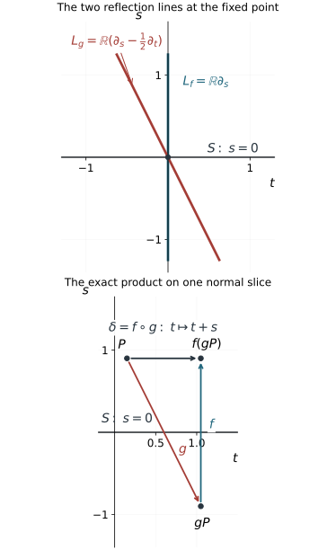

# Simultaneous reflections and flat corrections

Two folding projections give two sheet exchanges on the same critical hypersurface. Putting each exchange separately into reflection coordinates does not supply coordinates for the pair. The missing information is how their two reflection lines meet. When those lines are distinct, the pair has a precise simultaneous local form: one exchange changes the sign of the normal coordinate; the other also shifts a tangential coordinate by that normal coordinate.

We prove the smooth and homogeneous coordinate theorems here. The proof separates normalization of all normal Taylor coefficients from removal of the remaining flat error. The second step requires an actual smooth solution of a difference equation; a formal Taylor series alone cannot finish it. The arguments support the subsequent folded symplectic geometry. No symplectic coordinate theorem is asserted in this lesson.

The primary source is the reprint of Hörmander III, corrected second printing (1994), Appendix C.4, Theorems C.4.6–C.4.8 PDF pages 509–515 in this exact edition. We use the single-involution reflection theorem proved in [Folds, reflections and uniform smooth descent](../20261005-restored-smooth-descent/folds-reflections-and-uniform-descent.md). The remaining ingredients are local differential calculus, smooth flows, the inverse function theorem and the explicit constructions below.

The [proof map](proof-map.json) binds all results and exercises to their exact current programme proofs. In particular, the [flow and coordinate companion F0](../20261005-restored-submanifolds/flows-constant-rank-and-leaves.md) gives the transverse flow chart, using the complete [smooth-flow providers NF1–NF7](../20261005-restored-phase-space/finite-coordinate-flows.md). All series and remainder arguments required below are proved here, with the earlier compact-parameter calculus and smooth cutoffs explicitly bound in the map.

## 1. The simultaneous model and its reflection lines

Let \(f,g\) be smooth involutions near \(p\) in a \(d\)-dimensional manifold. Suppose their local fixed sets are the same hypersurface \(S\). At a point of \(S\), their differentials are the identity on \(TS\), and each has a one-dimensional minus-one eigenspace. Call these lines \(L_f,L_g\).

**Theorem 1.1 (two distinct reflections).** If \(L_f(p)\ne L_g(p)\), there are smooth coordinates \((t,z,s)\), centered at \(p\), where \(z\in\mathbb R^{d-2}\), such that

\[
S=\{s=0\},\qquad
f(t,z,s)=(t,z,-s),\qquad
g(t,z,s)=(t+s,z,-s).
\tag{1.1}
\]

The assertion concerns germs: compositions are taken after shrinking their domains as needed. In particular \(d\ge2\). The two reflection lines in these coordinates are

\[
L_f=\mathbb R\partial_s,\qquad
L_g=\mathbb R(\partial_s-\tfrac12\partial_t).
\tag{1.2}
\]

The product in the order \(\delta=f\circ g\) is

\[
\delta(t,z,s)=(t+s,z,s).
\tag{1.3}
\]

It fixes \(S\) but is a translation along each nearby constant-\(s\) slice. Reversing the product changes the shift to \(-s\).

**Figure 1.1.** The upper panel shows the two exact minus-one eigenlines at the marked point in (1.2). The lower panel holds \(z\), and any later radial coordinate, fixed: \(P=(0.15,0.9)\), \(gP=(1.05,-0.9)\), and \(f(gP)=(1.05,0.9)\). The horizontal arrow records the product shift \(t\mapsto t+s\). The straight arrows join points identified by maps; they are not flow trajectories. These coordinates explain why the two reflection lines must remain distinct in Theorem 1.1. The proof occupies Sections 2–5.

The individual minus-one lines are transverse to \(S\). Their span meets \(TS\) in one line, which becomes the \(t\) direction. This tangential direction is intrinsic to the pair, although its coordinate scale is a choice.

## 2. Normalize the first normal coefficients

Use the single-involution theorem to arrange

\[
f(w,s)=(w,-s),\qquad S=\{s=0\},
\]

where \(w\in\mathbb R^{d-1}\). Since \(g\) fixes \(S\), its differential there has block form

\[
dg(w,0)=
\begin{pmatrix}I&a(w)\\0&-1\end{pmatrix}.
\tag{2.1}
\]

Thus its reflection line is spanned by \((a(w),-2)\). Distinctness from the reflection line of \(f\) says exactly that \(a(p)\ne0\). Shrink so that the tangential vector field \(a\) is nonvanishing.

Write the next scalar coefficient as \(A(w)\). Taylor's formula gives

\[
g(w,s)=\bigl(w+s a(w)+O(s^2),\,
                 -s+s^2 A(w)+O(s^3)\bigr).
\tag{2.2}
\]

All remainders are smooth; their stated orders mean divisibility by the indicated powers of \(s\).

Choose a hypersurface in the \(w\) space transverse to \(a\), and solve along its local flow the equations

\[
a c=A c,\qquad a U_1=c,\qquad a U_j=0\quad(2\le j\le d-1),
\tag{2.3}
\]

with initial values \(c=1\), \(U_1=0\), and \(U_2,\ldots,U_{d-1}\) local coordinates on that hypersurface. The first solution is the exponential of an integral of \(A\), so \(c\ne0\). More explicitly, in a transverse flow chart \(w=\varphi_\tau(\zeta)\), the field \(a\) is \(\partial_\tau\). Set \(c(\tau,\zeta)=\exp(\int_0^\tau A(\varphi_v(\zeta))\,dv)\), \(U_1(\tau,\zeta)=\int_0^\tau c(v,\zeta)\,dv\), and \(U_j(\tau,\zeta)=\zeta_j\) for the spectator indices. The complete flow theorem and compact-interval differentiation prove joint smoothness. The fundamental theorem of calculus verifies all equations and initial data in (2.3). The differential of \(U=(U_1,\ldots,U_{d-1})\) is invertible: it maps the transverse directions to their coordinate directions, and maps \(a\) to \((c,0,\ldots,0)\).

Consequently

\[
u(w,s)=(U(w),s c(w))
\tag{2.4}
\]

is a local diffeomorphism and commutes with \(f\). Let \(g_0(t,z,s)=(t+s,z,-s)\). In \(g_0u\), the first component is \(U_1+s c\) and the last is \(-s c\). In \(ug\), the tangential components are \(U+s\,dU(a)+O(s^2)\), while the last is

\[
-s c+s^2(Ac-a c)+O(s^3).
\]

Equations (2.3) make these match through the required orders. In the resulting coordinates,

\[
g=g_0+O_2.
\tag{2.5}
\]

Here \(O_k\) denotes a vector error whose tangential components are divisible by \(s^k\) and whose last component is divisible by \(s^{k+1}\). This unequal weighting records that the normal variable already vanishes on the fixed hypersurface. A coordinate change commuting with \(f\) and fixing \(S\) respects these orders.

**Weighted-remainder verification.** Write such a coordinate change as \(U=(B(w,s),sC(w,s))\), where \(B,C\) are smooth and even in \(s\). The factorization of its odd last component follows from the integral division formula proved in the descent lesson. Since it is a local diffeomorphism preserving \(S\), \(C\) is nonzero there; hence its normal coordinate is a smooth nonvanishing multiple of \(s\). Evenness gives \(\partial_sB=O(s)\), and \(\partial_w(sC)=O(s)\). If two maps preserving \(S\) differ by \(O_k\), integrate the differential of \(U\) along the straight segment between their values. The tangential difference has order at least \(s^k\), and the normal difference has order at least \(s^{k+1}\). This proves preservation under left composition. Right composition preserves divisibility because its normal coordinate is a nonvanishing smooth multiple of \(s\). The inverse of \(U\) has the same parity, since \(Uf=fU\) implies \(U^{-1}f=fU^{-1}\), so the same proof applies to conjugation. Taylor's integral formula supplies each stated smooth divisible remainder; these are assertions about smooth functions, not just pointwise estimates.

## 3. Remove all Taylor coefficients, then realize the coordinates

Suppose for some \(k\ge2\) that

\[
g=g_0+s^k\bigl(h(t,z),s H(t,z)\bigr)+O_{k+1},
\tag{3.1}
\]

where \(h\) has \(d-1\) components. Such a representation follows by taking the first nonzero normal coefficient of the current smooth error.

**Lemma 3.1 (one normal-order correction).** If \(k\) is even, the involution identity forces \(h=H=0\). If \(k\) is odd, a coordinate change commuting with \(f\) removes the displayed error.

**Proof.** When \(k\) is even, direct composition, using \(g_0^2=I\), gives

\[
g^2(t,z,s)=(t,z,s)+2s^k\bigl(h(t,z),-sH(t,z)\bigr)+O_{k+1}.
\tag{3.2}
\]

Evaluating \(h,H\) at the shifted tangential argument changes only the next weighted order. Since \(g^2=I\), both coefficients vanish.

For odd \(k\), necessarily \(k\ge3\), put

\[
u(t,z,s)=(t,z,s)+s^{k-1}\bigl(v(t,z),sV(t,z)\bigr).
\tag{3.3}
\]

Its tangential correction is even in \(s\); its normal component is odd. It therefore commutes exactly with \(f\), and its differential on \(S\) is the identity. To the orders needed,

\[
u^{-1}=I-s^{k-1}(v,sV)+O_{2k-2}.
\]

Because \(2k-2\ge k+1\), substitution and Taylor expansion yield

\[
u g u^{-1}
=g_0+s^k\bigl(h+\partial_t v-Ve_t,\,
                         s(H-\partial_t V)\bigr)+O_{k+1},
\tag{3.4}
\]

where \(e_t=(1,0,\ldots,0)\) in the tangential space. First solve

\[
\partial_t V=H,\qquad
\partial_t v=Ve_t-h
\tag{3.5}
\]

by integration in \(t\), with zero initial data at \(t=0\). These smooth solutions cancel the entire displayed coefficient. The new error is \(O_{k+1}\). \(\square\)

Repeating the lemma defines a formal coordinate change in the normal variable. Each subsequent correction begins at a higher normal order, so every specified coordinate coefficient eventually stabilizes. The tangential coordinates are formally even in \(s\); the normal coordinate is formally odd. The constant and first-order coefficients are those of the identity after the first normalization.

**Finite-jet justification.** On one fixed smaller tangential box, every integration in (3.5) is over the segment from \(0\) to \(t\), so all coefficient functions are defined on that same box. The correction at odd order \(k\) starts at normal order \(k-1\) tangentially and \(k\) normally. For any chosen finite normal jet, only finitely many corrections can affect it. Its compositions are ordinary Taylor compositions of smooth functions and therefore have compatible stabilized coefficients as the chosen order increases. Inverses have the same property: the inverse identities determine their finite jets recursively, beginning with the invertible first jet. Thus each finite jet of the desired conjugacy is an actual finite identity. No convergence of the sequence of coordinate maps on a common open set is assumed.

We now need an actual smooth map with exactly these jets.

**Lemma 3.2 (parameter Borel realization with parity).** Let \(c_j(w)\) be arbitrary smooth coefficient functions on a parameter neighborhood. There is a smooth function \(F(w,s)\) with normal Taylor coefficients \(c_j(w)\). If all odd coefficients, or all even coefficients, vanish, \(F\) can respectively be chosen even, or odd, in \(s\).

**Proof.** Work first on a relatively compact parameter neighborhood, and multiply each coefficient by a fixed parameter cutoff equal to one on a smaller neighborhood. All its derivatives then have finite bounds. Choose an even smooth cutoff \(\chi\) equal to one near zero and supported in \((-1,1)\). We construct

\[
F(w,s)=\sum_{j=0}^{\infty}
                \chi(s/\varepsilon_j)c_j(w)s^j.
\tag{3.6}
\]

The finitely many terms with small \(j\) cause no convergence issue. For large \(j\), choose \(0<\varepsilon_j\le2^{-j}\) so small that every derivative of the \(j\)-th term with at most \(\lfloor j/2\rfloor\) total derivatives in \((w,s)\) is bounded by \(2^{-j}\).

This is possible: a derivative with \(q\le j/2\) normal differentiations is bounded on its support by a fixed finite coefficient bound times \(\varepsilon_j^{\,j-q}\). Differentiating the cutoff introduces inverse powers of \(\varepsilon_j\), but the remaining power of \(s\) supplies precisely the same exponent \(j-q>0\). There are only finitely many derivative bounds at each stage.

For any fixed derivative order, the resulting tail converges uniformly by comparison with \(\sum 2^{-j}\). To justify termwise differentiation, take a compact coordinate box inside the parameter neighborhood and a compact \(s\) interval. The partial sums and each prescribed first derivative converge uniformly there. Apply the fundamental theorem of calculus to each partial sum along a coordinate segment and pass to the limit under its bounded integral. The limiting first partial is therefore the actual derivative of the limiting function. Repeat with the derivative partial sums. This proves smoothness and every termwise derivative by induction, with joint parameter dependence. At \(s=0\), the cutoff of every term is constant near zero; its \(q\)-th normal derivative is zero unless \(j=q\), when it is \(q!c_q(w)\). This proves the prescribed jets, including their parameter derivatives. Evenness of \(\chi\) gives the stated parity term by term. \(\square\)

Apply the lemma to every coordinate component of the formal change. Its realization commutes exactly with \(f\) by parity and is a local diffeomorphism by its identity first jet. The finite-jet justification above applies to this smooth realization and its actual inverse. Every finite normal jet of its conjugated map agrees with the stabilized conjugacy identity. Those coefficients are identities of smooth tangential functions, so all their tangential derivatives also agree. Thus the difference is flat in every mixed derivative, and we have now arranged

\[
f(t,z,s)=(t,z,-s),\qquad g-g_0\text{ flat on }S.
\tag{3.7}
\]

“Flat on \(S\)” means that every mixed derivative of the difference is zero there. This completes Taylor normalization but not Theorem 1.1: a nonzero smooth flat error may still remain.

## 4. Solve the flat difference equation with all derivatives

The product \(\delta=f\circ g\) in (3.7) has form

\[
\delta(y)=Ay+p(y),\qquad
y=(t,z,s),\qquad Ay=(t+s,z,s),
\tag{4.1}
\]

where \(p\) is flat at \(s=0\). The linear map \(A=I+N\) has \(N^2=0\), hence

\[
A^k=I+kN,\qquad \|A^k\|\le C(k+1).
\tag{4.2}
\]

This polynomial growth is what permits the correction series.

**Lemma 4.1 (flat difference inverse).** For any smooth germ \(h\) flat on \(s=0\), there is a smooth germ \(W\), also flat on that hypersurface, such that

\[
W-W\circ\delta=h.
\tag{4.3}
\]

**Proof.** Multiply \(p\) and \(h\) by smooth cutoffs supported in a coordinate box, equal to one on a smaller box. Extend them by zero to all of \(\mathbb R^d\), and use (4.1) to define the extended map. This changes no germ being solved. There is a constant \(M_0\) such that \(p=h=0\) when \(|t|>M_0\). For each derivative order \(r\) and integer \(M\), flatness and Taylor's integral remainder give

\[
|D^\alpha p(y)|+|D^\alpha h(y)|
\le C_{r,M}|s|^M,\qquad |\alpha|\le r.
\tag{4.4}
\]

The constants can be chosen uniformly in all tangential variables, because the extensions have compact support. For example, apply the integral Taylor formula to \(D^\alpha p\) in its normal variable through order \(M-1\); every boundary coefficient is zero. The resulting remainder is \(s^M/(M-1)!\) times the integral of \((1-u)^{M-1}\partial_s^M D^\alpha p(t,z,us)\) on \(0\leq u\leq1\). The compact support bounds this last derivative uniformly. The same argument applies to \(h\). Multiplying by the cutoff preserves all zero boundary jets by the product rule.

We first control a number of iterates proportional to \(1/|s|\). For a fixed positive \(K\), write

\[
\delta^k(y)=A^k y+e_k(y),\qquad e_0=0.
\]

The exact recurrence and its summed version are

\[
e_{k+1}=Ae_k+p(\delta^k(y)),\qquad
e_k=\sum_{j=0}^{k-1}A^{k-1-j}p(\delta^j(y)).
\tag{4.5}
\]

Fix a derivative order \(r\) and a desired power \(L\). At an initial point with \(s\ne0\), bootstrap the bounds

\[
|(e_j)_s|\le |s|/2,\qquad
\max_{|\alpha|\le r}|D^\alpha e_j|\le1
\]

for the preceding iterates \(j<k\le K/|s|\). The first bound keeps the last coordinate of each iterate within \(3|s|/2\). For \(r\ge1\), the second, together with (4.2), gives

\[
|D\delta^j|\le C_K/|s|,\qquad
|D^\alpha\delta^j|\le1\quad(2\le|\alpha|\le r).
\]

The repeated chain rule in (4.4) thus bounds each derivative through order \(r\) of \(p\circ\delta^j\) by \(C_{r,M,K}|s|^{M-r}\). For \(r=0\), the same bound follows directly from the zeroth-order estimate in (4.4), without a derivative bootstrap. Formula (4.5) and the sum of the matrix norms in (4.2) give

\[
\max_{|\alpha|\le r}|D^\alpha e_k|
\le C_{r,M,K}|s|^{M-r-2},
\qquad k\le K/|s|.
\tag{4.6}
\]

Choose \(M>r+L+3\). For sufficiently small \(|s|\), this improves both bootstrap bounds strictly, including the normal-component bound. Induction from \(e_0=0\) therefore proves them through all the required iterates. In particular, for every fixed \(r,L,K\),

\[
\max_{|\alpha|\le r}|D^\alpha e_k|
=O(|s|^L),\qquad k\le K/|s|.
\tag{4.7}
\]

The choice of how small \(|s|\) must be can depend on \(r,L\); for zeroth-order escape one fixed sufficiently small neighborhood is enough.

For initial \(|t|\le1\), choose \(K>2M_0+6\). At an integer \(k\) comparable to \(K/|s|\), the leading \(t\) coordinate \(t+ks\) has passed the support strip in the direction of the sign of \(s\). The error in (4.7) is small. Up to this time, (4.4) also gives \(|p_t(\delta^j y)|<|s|/4\), while the normal coordinate differs from \(s\) by less than \(|s|/2\). Thus each step in \(t\) has the sign of \(s\). Once outside the strip, \(p=0\), the last coordinate stays fixed and nonzero, and the remaining iterates are exact translations moving farther away. They can never return to the support of \(h\).

Define, for \(s\ne0\),

\[
W(y)=\sum_{k=0}^{\infty}h(\delta^k(y)).
\tag{4.8}
\]

This series is locally finite away from \(s=0\). More precisely, work on an open initial box with \(|t|<1\) and sufficiently small \(|s|\). For a fixed point with \(s\ne0\), choose the finite escape time with a strict margin beyond the support strip. Continuity of those finitely many iterates preserves both that margin and the sign of the last coordinate on a neighborhood of the point. All later iterates there are exact translations moving away from the strip. The same finite index therefore cuts off the series on that neighborhood. Differentiation of this locally finite sum introduces no derivative of a point-dependent stopping time. On the initial box only \(O(1/|s|)\) terms can contribute. The derivative estimates already proved show, for arbitrary \(r,M\),

\[
|D^\alpha(h\circ\delta^k)(y)|
\le C_{r,M}|s|^{M-r},\qquad |\alpha|\le r,
\]

for the contributing iterates. Therefore

\[
|D^\alpha W(y)|\le C_{r,M}|s|^{M-r-1}.
\tag{4.9}
\]

Taking \(M\) arbitrarily large shows that every derivative tends to zero faster than any fixed power as \(s\to0\).

Set \(W=0\) on \(s=0\). These bounds give a smooth extension with all jets zero. Explicitly, proceed by derivative order: the previously extended derivative has normal difference quotient tending to zero by (4.9) with exponent greater than one, while its tangential derivative on \(s=0\) is zero. The derivatives away from the hypersurface extend continuously and equal these derivatives there. Induction gives full smoothness.

Finally, the locally finite series telescopes:

\[
W(y)-W(\delta(y))=h(y).
\]

This holds on \(s=0\) as well, since both sides vanish. For the germ identity choose a further neighborhood of the origin whose image under \(\delta\) lies inside the initial box just used; this is possible because \(\delta(0)=0\) and \(\delta\) is continuous. On that common domain the two series are the same forward orbit with the first term removed, so telescoping is legitimate. Restrict further so that the cutoff extensions coincide with the original \(p,h\). This proves (4.3) for the original germ. \(\square\)

The proof controls all derivatives, including differentiation in the step-size variable \(s\). Counting the terms alone would bound function values but would not establish a smooth correction. The flatness in (4.4) absorbs both the derivative growth of the shear iterates and the growing number of contributing terms.

## 5. Construct the actual simultaneous coordinates

We finish the proof of Theorem 1.1, starting from (3.7). A function \(w\) invariant under \(\delta=f\circ g\) satisfies

\[
w\circ f=w\circ g,
\tag{5.1}
\]

by composing \(w\circ f\circ g=w\) with \(g\). If \(w\) satisfies this identity, then

\[
P_\varepsilon w=\tfrac12(w+\varepsilon w\circ f),
\qquad \varepsilon\in\{1,-1\},
\tag{5.2}
\]

has parity \(\varepsilon\) under both \(f\) and \(g\). Indeed

\[
(P_\varepsilon w)\circ g
=\tfrac12(w\circ f+\varepsilon w)
=\varepsilon P_\varepsilon w,
\]

and the same equality under \(f\) follows directly.

For each spectator coordinate \(z_j\), and for the normal coordinate \(s\), take \(w_0=z_j\) or \(w_0=s\). The defect \(h=w_0-w_0\circ\delta\) is flat by (4.1). Solve \(W-W\circ\delta=h\) by Lemma 4.1. Then

\[
w=w_0-W
\]

is exactly invariant under \(\delta\) and has the same jets as \(w_0\). Apply \(P_+\) for \(z_j\) and \(P_-\) for \(s\). The resulting functions \(\widetilde z_j,\widetilde s\) are respectively even and odd under both involutions, and differ from the old coordinates by flat functions. Flatness is preserved in these steps. Products and sums preserve zero boundary jets. For composition with a smooth map preserving \(S\), its normal component is \(s\) times a smooth function by the same integral division formula; on a smaller compact box its magnitude is \(O(|s|)\). The repeated chain rule and arbitrary-power flat bounds then show that every derivative of the composed error is still arbitrarily small in powers of \(|s|\). An inverse coordinate map preserving \(S\) has this property as well. These observations justify both the parity averages and the next coordinate conjugation.

Keep the old \(t\), which is even under \(f\), and use \((t,\widetilde z,\widetilde s)\) as coordinates. Their differential on \(S\) is unchanged, so they form a coordinate system. Relabel them \((t,z,s)\). Now

\[
f(t,z,s)=(t,z,-s),\qquad
g(t,z,s)=(t+s+r(t,z,s),z,-s),
\tag{5.3}
\]

where \(r\) is flat. The product is \(\delta(t,z,s)=(t+s+r,z,s)\).

The remaining defect

\[
h=t-t\circ\delta+s=-r
\]

is flat. Solve \(W-W\circ\delta=h\), and put \(w=t-W\). Then

\[
w-w\circ\delta=-s,\qquad
w\circ g-w\circ f=s.
\tag{5.4}
\]

The second equality follows from the first by composition with \(g\), using \(s\circ g=-s\). Also the first says \(w\circ f\circ g=w+s\). Thus the even average

\[
\widetilde t=\tfrac12(w+w\circ f)
\]

satisfies

\[
\widetilde t\circ f=\widetilde t,\qquad
\widetilde t\circ g=\widetilde t+s.
\tag{5.5}
\]

It differs from \(t\) by a flat function. Replacing \(t\) by \(\widetilde t\) is a final local diffeomorphism and proves exactly (1.1). \(\square\)

Every coordinate identity is now an identity of smooth functions on a neighborhood. The Taylor realization, the flat difference inverse and the two parity averages have distinct roles; each is necessary to the argument given here.

## 6. Invariant transverse slices and homogeneous coordinates

**Corollary 6.1 (a slice preserved by both exchanges).** Under Theorem 1.1, let \(v\in T_pS\) lie outside \(L_f(p)+L_g(p)\). There is a hypersurface \(Y_1\) through \(p\), transverse to \(v\), preserved by both \(f\) and \(g\). Their restrictions to \(Y_1\) have the same fixed hypersurface and distinct reflection lines.

**Proof.** In simultaneous coordinates, the span of the two reflection lines is \(\mathbb R\partial_t+\mathbb R\partial_s\). Since \(v\in T_pS\), its \(s\) component is zero. Being outside that span means that its \(z\) component is nonzero. Choose a linear functional \(\ell\) on the \(z\) space with \(\ell(v_z)\ne0\), and set

\[
Y_1=\{\ell(z)=0\}.
\tag{6.1}
\]

Both maps fix \(z\), so preserve this hypersurface. It is transverse to \(v\). Both reflection lines are tangent to it, and their induced maps retain the forms in (1.1), with one fewer spectator coordinate. Their common fixed set is \(s=0\) within \(Y_1\). \(\square\)

Here a **conic manifold** has dilation-invariant neighborhoods with smooth equivariant charts into open cones in \(\mathbb R^d\setminus\{0\}\): in each such chart positive dilation is ordinary multiplication. This is the source's Definition 21.1.8. It specifies the local geometry along an entire positive ray that the homogeneous conclusion uses.

Write its positive dilations as \(D_\tau\), with radial vector field \(R=\left.\partial_u D_{e^u}\right|_{u=0}\). A map is homogeneous here if it commutes with these dilations. A function of degree \(j\) obeys \(a(D_\tau y)=\tau^j a(y)\) wherever this is defined.

**Theorem 6.2 (homogeneous simultaneous coordinates).** Suppose \(f,g\) are homogeneous involutions with the same conic fixed hypersurface \(S\), and

\[
L_f(p),\quad L_g(p),\quad \mathbb R R(p)
\]

are linearly independent. Then \(d\ge3\). There are coordinates \((t,z,s,\rho)\) in a conic neighborhood of the ray through \(p\), with \(\rho>0\), such that \(t,z,s\) have degree zero, \(\rho\) has degree one, and

\[
\begin{aligned}
f(t,z,s,\rho)&=(t,z,-s,\rho),\\
g(t,z,s,\rho)&=(t+s,z,-s,\rho).
\end{aligned}
\tag{6.2}
\]

Here \(z\in\mathbb R^{d-3}\), the degree-zero coordinates vanish on the marked ray, and \(\rho(p)=1\).

**Proof.** Homogeneity makes \(S\) conic, so \(R(p)\in T_pS\). The hypothesis permits Corollary 6.1 with \(v=R(p)\). Choose its invariant hypersurface \(Y_1\), transverse to \(R\). On \(Y_1\), simultaneous coordinates for the induced pair give \(t,z,s\) with the forms in (6.2).

The map

\[
(y,u)\longmapsto D_{e^u}y,\qquad y\in Y_1,
\tag{6.3}
\]

has invertible differential at \((p,0)\): its \(Y_1\) directions span \(T_pY_1\), and its \(u\) direction is the transverse vector \(R(p)\). It therefore gives a local product with the radial direction. Extend \(t,z,s\) constantly along dilation orbits, and define \(\rho(D_{e^u}y)=e^u\). These are smooth coordinates with the asserted degrees. To justify the full conic extension, use one of the equivariant cone charts \(v\). Choose a linear functional \(\lambda\) positive at the marked vector and restrict to the subcone \(\lambda(v)>0\). Put \(r_0=\lambda(v)\) and \(q=v/r_0\), so \(q\) lies in the affine hyperplane \(\lambda(q)=1\). The differential of \(q\) has precisely the radial line as kernel. Its restriction to \(Y_1\) is therefore invertible at \(p\), by transversality. The inverse theorem writes a smaller piece of \(Y_1\) uniquely as \(r_0=b(q)>0\). Its positive saturation has coordinates \((q,r_0)\) with \(q\) in this fixed smaller patch and \(r_0>0\). Every point has a unique representation \(D_{e^u}y\), where \(y=(q,b(q))\) and \(u=\log(r_0/b(q))\). This proves the product's smoothness and injectivity on the whole saturated patch, as well as the asserted degrees of the extended coordinates.

Because \(Y_1\) is invariant and both maps commute with dilations, applying \(f\) or \(g\) changes the slice coordinates by their already proved formulas and leaves \(u\), hence \(\rho\), fixed. This proves (6.2). \(\square\)

The radial independence is a separate hypothesis. Distinct reflection lines alone give ordinary simultaneous coordinates, but do not ensure that an invariant slice can be chosen transverse to the radial direction. The coordinates here also carry no symplectic normalization. A folded symplectic form and the two target projections require further arguments.

## 7. Exercises with complete solutions

**Exercise 7.1 (first level: the order of the product).** For (1.1), compute \(df,dg\), their minus-one lines, and both ordered products. Identify the tangent line in the sum of the reflection lines.

**Solution.** On the \((t,s)\) plane, the matrices are

\[
df=\begin{pmatrix}1&0\\0&-1\end{pmatrix},
\qquad
dg=\begin{pmatrix}1&1\\0&-1\end{pmatrix}.
\]

The first minus-one line is spanned by \((0,1)\). Solving \(dg(a,b)=-(a,b)\) gives \(2a+b=0\), hence the second is spanned by \((-1/2,1)\). All spectator directions have eigenvalue one. The products are \(f g(t,z,s)=(t+s,z,s)\) and \(g f(t,z,s)=(t-s,z,s)\). The two lines span the \((t,s)\) plane, whose intersection with \(TS=\{ds=0\}\) is precisely the \(t\) axis.

**Exercise 7.2 (second level: the first normalization is exact in a model).** Near \((t,s)=(0,0)\), let

\[
f(t,s)=(t,-s),\qquad
g(t,s)=\bigl(t+\log(1+s),-s/(1+s)\bigr).
\]

Verify that \(g\) is an involution, determine \(a,A\) in (2.2), and find a simultaneous coordinate change by (2.3).

**Solution.** If \(s_*=-s/(1+s)\), then \(1+s_*=1/(1+s)\). The two logarithmic increments cancel, and \(-s_* /(1+s_*)=s\), so \(g^2=I\). Its fixed set is \(s=0\) near zero. Taylor expansion gives \(a=1\), \(A=1\). The equations are \(c'=c\), \(U_1'=c\), with \(c(0)=1,U_1(0)=0\), so \(c=e^t,U_1=e^t-1\).

Set \(T=e^t-1\), \(S=s e^t\). Its Jacobian is \(e^{2t}>0\). It commutes with reflection because \(T\) is even and \(S\) odd in \(s\). Under \(g\),

\[
T_*=(1+s)e^t-1=T+S,\qquad
S_*=-\frac{s}{1+s}(1+s)e^t=-S.
\]

Thus these are exact simultaneous coordinates, not merely a first-jet normalization.

**Exercise 7.3 (second level: a nonlinear spectator).** For coordinates \((t,z,s)\), let

\[
U(t,z,s)=\bigl(t(1+s^2),\,z+t s^2,\,s\bigr).
\]

Compute \(g=U^{-1}g_0U\), show that it is an involution with fixed set \(s=0\), and identify the first formal correction.

**Solution.** The inverse is \(t=T/(1+S^2)\), \(z=Z-T S^2/(1+S^2)\), \(s=S\). Consequently

\[
g(t,z,s)=\left(t+\frac{s}{1+s^2},
                   z-\frac{s^3}{1+s^2},-s\right).
\]

Conjugation proves \(g^2=I\), or substitution cancels both odd shifts. Its last component shows that fixed points have \(s=0\); then both other components are fixed. Also \(U\) commutes with \(f\). The first error relative to \(g_0\) has \(k=3\), \(h=(-1,-1)\), \(H=0\). Equations (3.5) are solved by \(V=0,v=(t,t)\). Formula (3.3) is exactly the displayed \(U\), which removes all the errors in this example.

**Exercise 7.4 (second level: why even errors vanish).** Suppose a prospective involution in two variables has

\[
g(t,s)=\bigl(t+s+\alpha(t)s^2+O(s^3),
                  -s+\beta(t)s^3+O(s^4)\bigr).
\]

Compute the first weighted error of \(g^2\), and deduce what the involution identity forces.

**Solution.** The second application evaluates \(\alpha,\beta\) at \(t+s+O(s^2)\); replacing this argument by \(t\) changes only the next respective orders. The tangential error is \(2\alpha(t)s^2+O(s^3)\), while the normal error is \(-2\beta(t)s^3+O(s^4)\). Thus \(g^2=I\) forces \(\alpha=\beta=0\). This is the \(k=2\) case of (3.2); treating the two components as having the same error order would miss the normal coefficient.

**Exercise 7.5 (third level: solve a homological equation).** With one spectator \(z\), solve (3.5), with zero data at \(t=0\), for

\[
h=(t+z,t^2),\qquad H=z+t.
\]

Write the \(k=3\) coordinate correction and check its parity.

**Solution.** Integration gives

\[
\begin{aligned}
V&=zt+t^2/2,\\
v_t&=zt^2/2+t^3/6-t^2/2-zt,\\
v_z&=-t^3/3.
\end{aligned}
\]

Here the subscript on \(v_t\) denotes its \(t\) component, not a derivative. Direct differentiation gives \(\partial_t V=z+t\), \(\partial_t v_t=V-(t+z)\), and \(\partial_t v_z=-t^2\). The correction is \(u=(t+s^2v_t,z+s^2v_z,s+s^3V)\). Its first two components are even in \(s\), and its last is odd. It commutes with \(f\), and its first differential on \(S\) is the identity. Substitution in (3.4) removes the \(k=3\) error.

**Exercise 7.6 (third level: all Taylor coefficients are not an identity).** Set \(b(s)=e^{-1/s^2}\) for \(s\ne0\), \(b(0)=0\), and

\[
g(t,z,s)=(t+s(1+b(s)),z,-s).
\]

Show that \(g\) is an involution, has the same infinite normal jets as \(g_0\), and is different from it on every neighborhood. Find an exact simultaneous coordinate change.

**Solution.** The function \(b\) is smooth, even and flat. The shift \(s(1+b(s))\) is odd, so its contributions from the two applications of \(g\) cancel. Thus \(g^2=I\) and its fixed set is \(s=0\). The error \(s b(s)\) is flat but is nonzero whenever \(s\ne0\), proving the two claims about jets and neighborhoods.

Set \(U(t,z,s)=(t/(1+b(s)),z,s)\). Its denominator is positive and its differential on \(S\) is the identity. It commutes with \(f\). Under \(g\), its first component changes by exactly \(s\); the last changes sign. Hence \(Ug=g_0U\). This particular flat error admits a short explicit correction; Lemma 4.1 handles a general flat error depending on all coordinates.

**Exercise 7.7 (third level: a shrinking-step sum).** For the exact shear \(\delta(t,s)=(t+s,s)\), let \(h(t,s)=b(s)\psi(t)\), where \(b\) is as in Exercise 7.6 and \(\psi\) is smooth and supported in \([-2,2]\). Construct \(W\) for (4.3) on \(|t|\le1\). Bound its values and explain why it is smoothly flat.

**Solution.** For \(s\ne0\),

\[
W(t,s)=b(s)\sum_{k=0}^{\infty}\psi(t+ks).
\]

There are at most \(1+3/|s|\) possible nonzero terms, so

\[
|W(t,s)|\le(1+3/|s|)\|\psi\|_\infty e^{-1/s^2}.
\]

Telescoping gives \(W(t,s)-W(t+s,s)=b(s)\psi(t)\). For a fixed number \(r\) of differentiations, derivatives of the summands have powers of \(k\) of degree at most \(r\), and derivatives of \(b\) are \(b\) times polynomials in \(1/s\). Since contributing \(k\) are \(O(1/|s|)\), every derivative of \(W\) is bounded by \(C_r e^{-1/s^2}|s|^{-M_r}\) for a finite integer \(M_r\). This tends to zero faster than any fixed power. Extension by zero at \(s=0\) is therefore smooth with all derivatives zero, using the difference-quotient argument from Lemma 4.1.

**Exercise 7.8 (third level: the transverse slice hypothesis).** In the four-dimensional model \((t,z_1,z_2,s)\), take \(v=(2,1,-3,0)\). Find the invariant slice of Corollary 6.1. Explain why \(v=\partial_t\) cannot be transverse to an invariant slice on which both induced reflection lines are retained.

**Solution.** The functional \(\ell(z)=z_1-3z_2\) has \(\ell(v_z)=1+9=10\). Thus \(Y_1=\{z_1-3z_2=0\}\) is transverse to \(v\), and is preserved because both maps fix the spectators. Both reflection lines lie in its tangent and remain distinct. In contrast, a slice retaining both reflection lines has tangent containing their span, hence containing \(\partial_t\). It cannot be transverse to \(v=\partial_t\). The exclusion in Corollary 6.1 expresses a necessary condition for this specified slice construction.

**Exercise 7.9 (fourth level: the radial coordinate is essential).** On \((t,z,s,\rho)\), \(\rho>0\), let \(D_\tau(t,z,s,\rho)=(t,z,s,\tau\rho)\) and use (6.2). Verify the radial independence. Explain why all the coordinates cannot have degree zero, and why the homogeneous theorem cannot satisfy its hypotheses in dimension two.

**Solution.** The radial vector is \(R=\rho\partial_\rho\). The reflection lines are spanned by \(\partial_s\) and \(\partial_s-\frac12\partial_t\). These three vectors are independent, and both maps commute with \(D_\tau\). The coordinates \(t,z,s\) have degree zero and \(\rho\) degree one by direct substitution.

If all coordinates had degree zero, their differentials would annihilate the nonzero vector \(R\); their coordinate differential could not be invertible. At least one radial coordinate is necessary. In dimension two, two distinct lines already span the tangent space, so no third radial line can be independent. The ordinary two-involution theorem can apply in dimension two, while the hypotheses of Theorem 6.2 require dimension at least three.

## 8. What has been proved

The full smooth simultaneous coordinate theorem is now proved through its first coefficients, every higher normal coefficient, smooth realization with parity, flat iteration estimates, and actual final coordinate identities. An invariant transverse slice gives the homogeneous theorem with the exact degrees and radial hypothesis. The arguments do not yet normalize a degenerate closed two-form, produce symplectic charts on both targets of a canonical relation, or establish an Airy operator bound. Those are subsequent targets.

## References and component notices

- Lars Hörmander, *The Analysis of Linear Partial Differential Operators III: Pseudo-Differential Operators*, reprint of the corrected second printing (1994), Appendix C.4, Theorems C.4.6–C.4.8; Definition 21.1.8. Exact locators are recorded in [source provenance](source-provenance.json).
- The original coordinate figure retains its embedded DejaVu and STIX font outlines under their respective [DejaVu notice](figures/notices/LICENSE_DEJAVU.txt) and [STIX notice](figures/notices/LICENSE_STIX.txt).

*Original lesson, exercises and coordinate artwork: GPT-6.1 Sol (OpenAI), Ultra, September 2026, CC0. Restoration, supporting details and exact programme prerequisite review: GPT-6 Astra (OpenAI), Ultra, 5 October 2026. Human mathematical review remains pending. The cited book is a mathematical source; its text and files are not included in this reader.*
