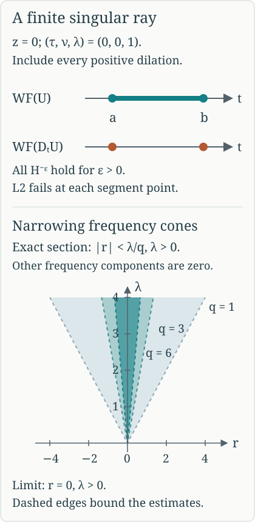

# A finite ray with an exact Sobolev threshold

Propagation constrains how an existing singularity travels. We now construct a solution with a singularity at every point of a chosen finite characteristic, with forcing singularities at precisely its two endpoints. The solution has every Sobolev order below a prescribed threshold and fails at that threshold itself. An explicit positive-frequency Gaussian profile provides the critical singularity; a convergent regularization series closes its time interval without adding unwanted covector directions.

Read [One canonical tube along a compact characteristic](../20261005-restored-compact-tube/compact-homogeneous-characteristic-tubes.md), Sections 1–5 and CT16–CT20, for the canonical map and both full conjugating graph inverses on one finite tube. Section 1 of [Sobolev regularity along real characteristics](../20261005-restored-sobolev-propagation/sobolev-regularity-along-real-characteristics.md), SP1–SP2, proves the fixed-order Fourier criterion and proper graph equivalence; Section 2, SP3–SP5, proves the constant-factor L2 test. Sections 3–5 of [Singularities along a real characteristic direction](../20261005-restored-real-principal/real-principal-type-kernels-and-propagation.md), RP11–RP18, supply the constant-factor wavefront formula, model propagation and positive elliptic reduction. Section 2 of [Kernels, adjoints and clean composition](../20261005-restored-analytic-composition/clean-composition-of-fourier-integral-operators.md) supplies the proper kernel wavefront mapping, and Theorem 5.1 of [Graph operators, continuity and Egorov](../20261005-restored-graph-egorov/graph-operators-continuity-and-egorov.md) supplies mapping at every real Sobolev order.

The complete analytic prerequisites are the Schwartz estimates, Gaussian evaluation and Fourier inversion Q1–Q4, including their exact polar substitution proof; [measure and complete L2, M0–M8](../20261004-free-intrinsic-graph/prerequisites/measure-and-l2.md); and the [full Fourier extension L1–L3](../20261004-free-intrinsic-graph/prerequisites/fourier-l2.md). The [cutoff and proper-operator estimates W1–W4](../20261004-free-intrinsic-graph/prerequisites/coordinate-and-wavefront-localization.md), [tensor estimates WF8–WF10](../20261005-restored-real-principal/tensor-wavefront-and-projection.md), and [all-real Sobolev bounds G1](../20261005-cauchy-foundations/sharp-lower-bound.md#g1-global-sobolev-bounds-with-the-original-norms) supply the exact localization, product and compact multiplication arguments. Smooth cutoff construction is [P14.3](../20261004-free-stationary-phase/exponential-prerequisite-completions.md); finite compact covers and inverse maps are included in [the foundation completions](../20261004-free-stationary-phase/prerequisite-completions.md). All used proofs have exact current locators in the [proof map](proof-map.json), and linked components retain their licences.

We use scalar ordinary symbols and scalar half densities. The mathematical antecedent is the approved purchased Hörmander IV, Theorem 26.1.5 with its final conjugation on. The proof here includes the profile estimates, support choices and endpoint argument.

## 1. A profile singular only in one positive direction

Put \(d=n-1\ge1\), \(k=d-1\), and split transverse coordinates and covectors as \(z=(y,v)\), \(\eta=(\nu,\lambda)\), with \(y,\nu\in\mathbb R^k\). When \(k=0\), all Gaussian factors and integrals in these variables have their empty-dimensional value one. Let \(\beta=(d+1)/4=n/4\). Choose a smooth \(h\) vanishing for \(\lambda\le1\) and equal to one for \(\lambda\ge2\), with \(0\le h\le1\). Define a tempered distribution by its Fourier transform, with phase \(-z\cdot\eta\):
\[
 \widehat c(\nu,\lambda)
   =h(\lambda)\lambda^{-\beta}
       \exp\!\left(-\frac{|\nu|^2}{4\lambda}\right)
       \quad(\lambda>0),
 \qquad \widehat c=0\quad(\lambda\le0).
 \tag{SR1}
\]
This is a smooth polynomially bounded function of the full covector, because the cutoff removes a neighborhood of zero and of negative \(\lambda\). It therefore defines a tempered distribution by inverse Fourier transformation.

**Sobolev norms.** Gaussian scaling \(\nu=\sqrt\lambda\,\zeta\) gives
\[
 \int_{\mathbb R^k}e^{-|\nu|^2/(2\lambda)}d\nu
       =(2\pi\lambda)^{k/2},
 \qquad -2\beta+k/2=-1.
 \tag{SR2}
\]
For every \(\epsilon>0\), the weight
\((1+|\nu|^2+\lambda^2)^{-\epsilon}\le\lambda^{-2\epsilon}\)
on the support at large \(\lambda\). Thus the squared \(H^{-\epsilon}\) norm is bounded by a constant times
\(\int_1^\infty\lambda^{-1-2\epsilon}d\lambda<\infty\), with the bounded-frequency part finite as well. In contrast the unweighted norm equals a positive constant times
\(\int_2^\infty\lambda^{-1}d\lambda\), which diverges. Plancherel therefore gives
\[
 c\in H^{-\epsilon}(\mathbb R^d)\text{ for every }\epsilon>0,
 \qquad c\notin L^2(\mathbb R^d).
 \tag{SR3}
\]

**Smoothness and L2 away from the origin.** Integrating the Gaussian in \(\nu\) gives the oscillatory representation
\[
 c(y,v)=C_k\int_1^\infty
             h(\lambda)\lambda^{\beta-1}
             e^{-\lambda|y|^2}e^{iv\lambda}d\lambda,
 \qquad C_k=(2\pi)^{-d}(4\pi)^{k/2}>0.
 \tag{SR4}
\]
For the normalization, the one-dimensional Gaussian Fourier integral satisfies \(G'(y)=-2\lambda yG(y)\), by integration by parts in \(\nu\). Its value at zero is \((4\pi\lambda)^{1/2}\): the square of the real Gaussian integral is its two-dimensional polar-coordinate integral, equal to \(\pi\), and scaling gives this value. Solve this differential equation and multiply the one-dimensional factors. To justify the remaining integrations, first insert a smooth cutoff \(\chi(\lambda/L)\), equal to one near zero and compactly supported, into (SR1). The resulting Gaussian integral is absolutely integrable in \((\nu,\lambda)\), so Fubini gives (SR4) with that cutoff. The cut-off Fourier profiles converge to (SR1) in tempered distributions by their polynomial bound and dominated convergence against Schwartz tests. This gives (SR4) as their distributional limit. The power is \(k/2-\beta=\beta-1\).

When \(y\ne0\), the integral and every local coordinate derivative converge absolutely. When \(v\ne0\), integrate by parts \(M\) times in \(\lambda\). Derivatives of its amplitude are finite sums of powers of \(\lambda\) times polynomials in \(\sqrt\lambda y\) times the Gaussian. In particular
\[
 \left|\partial_\lambda^M
       \bigl(h(\lambda)\lambda^{\beta-1}e^{-\lambda|y|^2}\bigr)\right|
 \le C_M\lambda^{\beta-1-M}e^{-\lambda|y|^2/2}
 \tag{SR5}
\]
for \(\lambda\ge1\), with a change of constant on the fixed cutoff band. For derivatives of order \(l\) in \(v\) and multi-order \(\alpha\) in \(y\), the analogous bound has exponent \(\beta-1+l+|\alpha|/2-M\). Choose \(M>\beta+l+|\alpha|/2\). Its integral is finite uniformly on compact coordinate sets. Consequently repeated integration by parts defines all derivatives smoothly where \(v\ne0\).

For a precise oscillatory justification first cut off \(\lambda\) at scale \(L\). Derivatives striking that cutoff are supported where \(\lambda\) is comparable to \(L\); after \(M\) integrations their integral is bounded by \(C L^{\beta+l+|\alpha|/2-M}\), which tends to zero with the same choice of \(M\). Thus the integrated expressions are the actual inverse Fourier distribution (SR1), not a formal integral. This proves smoothness away from \((y,v)=0\).

For \(v\ne0\), (SR5) also gives
\(|c(y,v)|\le C_M|v|^{-M}e^{-|y|^2/2}\)
when \(M>\beta\). For \(|y|\ge\delta>0\), absolute integration in (SR4) gives \(|c(y,v)|\le C_\delta e^{-|y|^2/2}\), uniformly in \(v\). Combine these estimates to get a Gaussian times \(\min(1,|v|^{-M})\) on that region. On its bounded \(y\) complement, outside any fixed ball about the origin, \(|v|\) is bounded away from zero and the first estimate applies. For \(k=0\), the first estimate alone applies outside an interval about zero. Therefore \(c\) is in L2 outside every neighborhood of zero. Its failure in (SR3) must occur in every such neighborhood.

**The full wavefront direction and fixed-order failure.** Outside a conic neighborhood of \(e_d=(0,1)\), the nonzero part of (SR1) has \(|\nu|\ge a\lambda\) for some \(a>0\). Then \(|\nu|^2/\lambda\) is bounded below by a positive constant times \(|\nu|+\lambda\). The Gaussian dominates every power there, including all fixed covector derivatives. Negative \(\lambda\) gives zero. The complete cutoff-localization estimate in the preceding programme proofs preserves this rapid decay after multiplying \(c\) by a compact coordinate cutoff. Hence
\(WF(c)\subset\{(0;\lambda e_d):\lambda>0\}\), since we have already proved smoothness at every other base point.

It is also not microlocally L2 at \((0;e_d)\). If it were, SP1 would give an L2 estimate in a cone there. Every other direction is wavefront regular. Take a finite unit-sphere cover and a common smaller base cutoff. The L2 cone estimate survives this smaller cutoff: in the convolution formula WF2 split the input frequency into the original cone and its complement. On a smaller cone, the first part is bounded in L2 by the Schwartz cutoff transform's L1 norm. Explicitly, Cauchy–Schwarz with measure \(|b(\xi-\eta)|d\eta\) gives \(|b*f(\xi)|^2\le\|b\|_1\int|b(\xi-\eta)||f(\eta)|^2d\eta\); Tonelli then gives \(\|b*f\|_2\le\|b\|_1\|f\|_2\). The complementary part is rapidly decreasing by angular separation and the polynomial distribution bound. The same argument with a weight \(\langle\xi\rangle^r\), using \(\langle\xi\rangle^r\le C_r\langle\xi-\eta\rangle^{|r|}\langle\eta\rangle^r\), proves the fixed-order version. Rapid decrease on the other finitely many cones survives by WF2. The resulting full local L2 Fourier norm would make \(c\) locally L2 at zero, contradicting the preceding paragraph. Thus the one positive direction is present in both the smooth and order-zero singular sets. Positive conicity gives every \(\lambda>0\).

## 2. Regularize the endpoint layers without new directions

Let \(a<b\). On \(\mathbb R_t\times\mathbb R_z^d\) choose a locally finite partition near the open axis \((a,b)\times\{0\}\) by \(\psi_j\in C_c^\infty((a,b)\times\mathbb R^d)\), \(j\in\mathbb Z\), such that their supports tend to \((a,0)\) as \(j\to-\infty\) and to \((b,0)\) as \(j\to+\infty\). One construction takes dyadic time bands near each endpoint, a finite central cover and a smooth time partition, then transverse cutoffs equal to one near zero whose radii are comparable to the band distances from the endpoint. At each interior point only finitely many bands meet; taking the smaller transverse radius among them gives \(\sum_j\psi_j=1\) on an open neighborhood of that point of the axis. All supports lie in one bounded set.

**An explicit partition with these support limits.** Write \(\ell=b-a>0\) and put
\[
 T(t)=\frac{\ell}{b-t}-\frac{\ell}{t-a},\qquad
 g_j(t)=\frac{\vartheta(T(t)-j)}
                 {\sum_{i\in\mathbb Z}\vartheta(T(t)-i)},\qquad
 \psi_j(t,z)=g_j(t)\kappa(z/r_j).
 \tag{SRA1}
\]
Choose \(\vartheta\ge0\) smooth, supported in \((-1,1)\), positive on \([-1/2,1/2]\), and \(\kappa=1\) for \(|z|\le1/2\), supported in \(|z|<1\). The cutoff proof P14.3 constructs these functions. The derivative \(T'(t)=\ell/(b-t)^2+\ell/(t-a)^2\) is positive, and the endpoint limits are minus and plus infinity. The intermediate-value and inverse-function proofs therefore make \(T:(a,b)\to\mathbb R\) a smooth increasing bijection with smooth inverse. At each value of \(T\) a nearest integer is within \(1/2\), so the denominator is positive; locally only finitely many integers contribute. Each time support lies in the compact inverse image \(T^{-1}([j-1,j+1])\). Let \(d_j>0\) be the distance of this compact interval from \(\{a,b\}\), and take \(0<r_j\le\min(d_j/4,(1+|j|)^{-1})\). The time supports approach the indicated endpoints, and the transverse radii tend to zero. Near a fixed interior time there are only finitely many active indices. On the smaller ball where their \(\kappa\)'s are all one, their sum is exactly \(\sum g_j=1\). This proves every stated support and local partition property. All \(r_j\) may be reduced further to put the supports in any prescribed neighborhood of the closed segment.

Put \(u_j=\psi_j(1\otimes c)\). These are compactly supported and in \(H^{-\epsilon}(\mathbb R^n)\) for every \(\epsilon>0\). Indeed first multiply the constant time factor by a compact time cutoff. Its Fourier transform is Schwartz; integrating its squared modulus in the time covector and using (SR3) bounds the negative Sobolev norm on the product space. The exact compact-multiplier theorem then permits \(\psi_j\). The complete constant-factor wavefront proof and cutoff theorem give only covectors \((0;\lambda e_d)\), \(\lambda>0\), over their compact axis support.

Let \(q_j=1+|j|\). Choose a compact smooth convolution kernel \(\varphi\), supported in a unit ball, with integral one, and set \(\varphi_\delta(x)=\delta^{-n}\varphi(x/\delta)\). For each \(j\) choose \(\delta_j>0\) small enough that, for
\[
 v_j=\varphi_{\delta_j}*u_j,\qquad U_j=u_j-v_j,
 \tag{SR6}
\]
all of the following hold:

- The enlarged supports remain inside \((a,b)\times\mathbb R^d\), and they still tend to the indicated endpoint as \(j\to\pm\infty\).
- \(\|U_j\|_{H^{-1/q_j}}\le2^{-q_j}\).
- Outside \(\mathcal C_j=\{\lambda>0: |(\tau,\nu)|<\lambda/q_j\}\), for every multi-index \(|\alpha|\le q_j\),
\[
 \left|\partial_\xi^\alpha\widehat U_j(\xi)\right|
       \le2^{-q_j}\langle\xi\rangle^{-q_j}.
 \tag{SR7}
\]

These are finitely many requirements for each \(j\). To retain the support limits, also choose \(\delta_j\) less than the distance of \(\operatorname{supp}u_j\) from the time endpoints and less than \(1/q_j\). The enlarged supports then remain compact in the open interval and converge to the same endpoint base points. The norm requirement follows by dominated convergence from
\(\widehat U_j=(1-\widehat\varphi(\delta_j\xi))\widehat u_j\), because \(u_j\in H^{-1/q_j}\). For (SR7), the compact wavefront criterion makes every derivative of \(\widehat u_j\) rapidly decreasing outside the fixed cone \(\mathcal C_j\). Here is the compactness step: each normalized covector outside this cone is regular at every point of the compact support; cover that support by finitely many regular base neighborhoods, choose a subordinate partition and a common smaller angular neighborhood, and sum their WF2 estimates. A finite angular cover finishes the whole closed complement. For a covector derivative, repeat this argument for \((-ix)^\alpha u_j\), which has no additional wavefront directions. The convolution multiplier and its derivatives are uniformly bounded for \(0<\delta\le1\); after the product rule their weighted tails there are uniformly small beyond a sufficiently large radius. On the bounded covector set, the multiplier tends to zero and its positive derivatives tend to zero uniformly as \(\delta\to0\). This proves convergence to zero in each of the finitely many weighted suprema used in (SR7). Decrease \(\delta_j\) once to satisfy all requirements simultaneously.

The series
\[
 U=\sum_{j\in\mathbb Z}U_j
 \tag{SR8}
\]
converges in every \(H^{-\epsilon}(\mathbb R^n)\): for all sufficiently large \(|j|\), \(1/q_j<\epsilon\), and the embedding estimate gives \(\|U_j\|_{H^{-\epsilon}}\le2^{-q_j}\); the remaining finitely many summands belong to that space. For completeness, multiplication by the positive weight \(\langle\xi\rangle^{-\epsilon}\) identifies \(H^{-\epsilon}\) with the complete L2 space proved in L1–L3: its inverse is the polynomially bounded multiplier \(\langle\xi\rangle^\epsilon\), acting on tempered distributions. Thus the summable norm bound gives an actual limit. Every such convergence implies convergence in tempered distributions, since Cauchy–Schwarz pairs the weighted Fourier function with the oppositely weighted Schwartz transform. Uniqueness of this distributional limit shows that the limits for different \(\epsilon\)'s are one and the same \(U\), rather than a different distribution at each order. Its support is compact and contained in a bounded subset with \(a\le t\le b\).

On any closed cone avoiding the positive last covector direction, \(\mathcal C_j\) is disjoint from that cone for sufficiently large \(|j|\). Equation (SR7) gives summable bounds in every rapidly decreasing derivative seminorm on it. The finite initial terms have the same rapid decay there. Distributional Fourier transformation of the Sobolev-convergent series agrees with these convergent functions on that cone. Compact cutoff localization consequently gives no wavefront direction except the positive last one, even at the endpoints.

Away from the two endpoint base points, the supports of the summands are locally finite. Each \(v_j\) is smooth: \(v_j(x)=\langle u_j,\varphi_{\delta_j}(x-\cdot)\rangle\), and the difference quotients of this compactly supported smooth test converge in every test seminorm to its derivatives. Distributional continuity therefore permits every \(x\)-derivative. The pairing vanishes when the two supports are disjoint, giving precisely the asserted enlarged support. Near every interior axis point,
\(U=1\otimes c-\sum_jv_j\), with the last sum locally finite and smooth. Away from the axis in the interior, \(c\) is smooth. Outside the closed interval all summands vanish. It follows that
\[
 WF(U)=\{(t,0;0,\lambda e_d): a\le t\le b,\ \lambda>0\},
 \qquad U\in H^{-\epsilon}\text{ for every }\epsilon>0.
 \tag{SR9}
\]
The inclusion was just proved. Interior equality and failure of microlocal L2 follow from the constant-factor criterion and the interior smooth difference. The failure persists at the endpoints by openness of fixed-order microlocal membership: membership at an endpoint would give membership at sufficiently nearby interior axis points. Smooth wavefront equality at the endpoints also follows directly by closure from the interior singular rays. Thus \(U\) is not microlocally L2 at any point of the whole displayed segment.

The derivative \(D_tU\) is smooth except possibly at \((a,0)\) and \((b,0)\), because the interior model is time independent up to a smooth function. Pseudolocality and (SR9) therefore leave only the two endpoint positive rays. Each is actually present. If the derivative were microlocally smooth at one of them, its open regular set would include a short straight time segment across that endpoint. The full model propagation theorem would carry the smoothness of \(U=0\) just outside \([a,b]\) to an interior axis point, contradicting (SR9). Therefore
\[
 WF(D_tU)=\{(a,0;0,\lambda e_d),(b,0;0,\lambda e_d):\lambda>0\}.
 \tag{SR10}
\]
This construction does not multiply by a discontinuous time indicator. It retains the one positive transverse direction while concentrating the forcing at the two endpoints.

*At the fixed model covector \((\tau,\nu,\lambda)=(0,0,1)\), the upper two rows display the exact base points in (SR9) and (SR10). Positive dilation supplies every \(\lambda>0\). The lower panel is an exact two-dimensional section of the cones in (SR7), with \(r\) one signed component of \((\tau,\nu)\) and all other components zero: \(|r|<\lambda/q\). It shows their narrowing toward the positive \(\lambda\)-axis as \(q\) increases. These cones control Fourier estimates; their boundaries are not asserted to be wavefront directions or support boundaries. The construction follows the regularization mechanism of Hörmander IV, Theorem 26.1.5, with the complete estimates given here.*

## 3. Transfer through the full canonical tube

**Theorem 3.1 (a prescribed finite singular ray).** Let \(P\in\Psi^m_{1,0}(X)\) be properly supported, with real homogeneous scalar principal symbol \(p\) of degree \(m\). Let \(\gamma\) be a nontrivial compact bicharacteristic segment in \(\{p=0\}\) whose projection to the positive cosphere bundle is injective. Write \(\Gamma\) for the cone generated by the segment and \(\Gamma'\) for the cone generated by its two endpoints. For every \(s\in\mathbb R\) there is a distributional half density \(u\) such that
\[
 \begin{gathered}
 u\in H^{s-\epsilon}_{\mathrm{loc}}(X)\quad(\epsilon>0),
 \qquad WF(u)=\Gamma,\qquad WF(Pu)=\Gamma',\\
 u\text{ is not microlocally }H^s
       \text{ at any point of }\Gamma.
 \end{gathered}
 \tag{SR11}
\]
The lower-order terms may be complex. The nontrivial injective segment excludes a radial or stationary projected curve, precisely as proved in Section 1 of the compact-tube lesson.

**Proof.** First take \(m=1\). Choose the compact-tube operators with graph orders \(\mu=-s\) and \(-\mu=s\), and set \(u=AU\). Proper graph continuity gives \(u\in H^{s-\epsilon}_{\rm loc}(X)\) for every \(\epsilon>0\). Wavefront mapping gives \(WF(u)\subset\Gamma\). The inverse identity \(BA-I\), applied on the whole model segment, and inverse graph mapping show that every model singular ray must have its image in \(WF(u)\); hence equality holds.

If \(u\) were microlocally \(H^s\) at one image point, the inverse graph of order \(s\) would make \(Bu\) microlocally L2 at its model point. Since \(Bu-U\) is smooth there, this contradicts (SR9).

The full intertwining defect \(PA-AD_t\) is smoothing on the paired segment. Since all of \(WF(U)\) lies on that segment, insert nested graph cutoffs equal to one there. The defect applied to the retained part is smooth; the complementary input is smooth, and separated graph supports give a smoothing remainder. These are the full microsmoothing and proper kernel estimates in Section 4 and CT19–CT20 of the compact-tube lesson. Thus, on the whole retained tube,
\[
 Pu=AD_tU\pmod {C^\infty},\qquad
 B Pu=D_tU\pmod {C^\infty}.
 \tag{SR12}
\]
Outside the full segment, pseudolocality already gives smoothness from \(WF(u)\). The first identity and graph mapping confine \(WF(Pu)\) to the image endpoint rays. The second identity, (SR10) and inverse graph mapping force both image endpoint rays to be present. Thus the forcing wavefront set is exactly \(\Gamma'\).

For order \(m\), use the positive elliptic reduction \(P_1=QP\), \(\operatorname{ord}Q=1-m\), proved in the Sobolev propagation lesson. Its principal Hamilton field on the characteristic set is a positive multiple of \(H_p\). On a compact segment this gives a smooth positive time reparametrization with the same endpoints and cosphere-injective image. Apply the order-one construction to \(P_1\), with the same target threshold \(s\). Elliptic wavefront equivalence for \(Q\) gives \(WF(P_1u)=WF(Pu)\), retaining the exact endpoint forcing set. This retains the arbitrary prescribed threshold, regularity at all lower orders, failure at the stated order at every segment point, and both exact wavefront sets.

This proves the theorem. Cosphere injectivity is used for one homogeneous canonical tube over the entire closed segment, including both endpoints. The result specifies both wavefront sets and actual failure at the chosen order; it does not replace the later propagation parametrix or solvability arguments.

## 4. Exercises with complete solutions

### Exercise 4.1. Locate the critical exponent

**Level: intermediate.** Replace \(\lambda^{-\beta}\) in (SR1) by \(\lambda^{-g}\), for a real number \(g\), retaining the same cutoff and Gaussian. Call the resulting distribution \(c_g\). Find exactly the real orders \(r\) for which \(c_g\in H^r(\mathbb R^d)\), including whether the critical endpoint is attained. Recover (SR3) and explain why it supplies an actual threshold rather than only a supremum.

**Solution.** Put \(\nu=\sqrt\lambda\,\zeta\) in the squared norm. For \(\lambda\ge2\),
\[
 \int_{\mathbb R^k}
 (1+|\nu|^2+\lambda^2)^r e^{-|\nu|^2/(2\lambda)}d\nu
       \asymp_r \lambda^{2r+k/2}.
 \tag{SR13}
\]
Indeed, after scaling, the factor in parentheses divided by \(\lambda^2\) is \(1+\lambda^{-2}+|\zeta|^2/\lambda\). For \(r\ge0\), its \(r\)-th power is bounded above by a constant times \((1+|\zeta|^2)^r\), integrable against the Gaussian, and bounded below by one. For \(r<0\), it is bounded above by one; restricting to \(|\zeta|\le1\) gives a uniform positive lower bound. In dimension \(k=0\) the same inequalities hold with the integral replaced by one. The fixed cutoff band is finite for every order. Therefore the remaining high-frequency integral is comparable to
\[
 \int_2^\infty\lambda^{2r-2g+k/2}d\lambda,
 \qquad
 c_g\in H^r\quad\Longleftrightarrow\quad
 r<g-\frac{k+2}{4}=g-\frac n4.
 \tag{SR14}
\]
At equality the exponent is \(-1\), so the norm diverges logarithmically. Taking \(g=n/4\) gives every negative order and failure of L2. Section 1 additionally locates that failure at the origin in the single positive direction. Thus the critical example fails at the supremum itself; no claim that a supremum is attained can be inferred from the orders below it.

### Exercise 4.2. A sharp time indicator adds temporal directions

**Level: advanced.** Let \(c\) be (SR1), and define the tensor distribution \(W(t,z)=\mathbf 1_{[a,b]}(t)c(z)\). Prove that \((a,0;\tau,0)\) and \((b,0;\tau,0)\) belong to \(WF(W)\) for every \(\tau\ne0\). Explain why this cannot replace (SR8).

**Solution.** The tensor product is defined because its factors use separate variables. In every neighborhood of zero there is \(\theta\in C_c^\infty(\mathbb R^d)\) supported there with \(\langle c,\theta\rangle\ne0\); otherwise \(c\) would vanish on a neighborhood and would be locally L2 there, contrary to Section 1. Transverse averaging gives
\[
 \int\theta(z)W(t,z)dz
       =\langle c,\theta\rangle\mathbf 1_{[a,b]}(t).
 \tag{SR15}
\]
The right side has both nonzero temporal directions at each endpoint. For a compact time cutoff \(b_0\) nonzero at \(a\), supported away from \(b\), integration by parts gives its Fourier transform the leading term \(e^{-ia\tau}b_0(a)/(i\tau)\), with error \(O(|\tau|^{-2})\), as \(\tau\to\pm\infty\). The calculation at \(b\) has the opposite sign and the same nonzero magnitude. Thus neither temporal cone has rapid decrease.

To use (SR15) rigorously, insert a compact time cutoff in the averaging kernel \(\theta(z)\delta(t-s)\). It is proper near the chosen endpoint and has only the twisted relation
\((t;\tau)\leftarrow(t,z;\tau,0)\), with \(\tau\ne0\) and \(z\in\operatorname{supp}\theta\); it has no covectors on a forbidden kernel axis. The elementary delta transform and tensor estimate prove this relation exactly as for SP4. The proper kernel wavefront theorem therefore forces an input covector \((a,z;\tau,0)\in WF(W)\) with \(z\in\operatorname{supp}\theta\). Choose such tests in successively smaller balls, for either fixed nonzero \(\tau\). Closedness of the wavefront set gives \((a,0;\tau,0)\). The same argument gives \((b,0;\tau,0)\). These purely temporal covectors are absent from (SR9), whose temporal component is zero and transverse last component is positive. The regularization series avoids exactly this jump obstruction.

### Exercise 4.3. Choose the graph order for the requested threshold

**Level: intermediate.** Let \(A\) be a proper elliptic graph operator of order \(\mu\), with inverse \(B\) of order \(-\mu\) on the compact model segment. Apply it to (SR8). Determine the exact threshold of \(AU\), including failure at the threshold, and choose \(\mu\) to obtain threshold \(s\). What happens if one instead chooses \(\mu=s\)?

**Solution.** Graph continuity maps \(H^{-\epsilon}\) to \(H^{-\mu-\epsilon}_{\mathrm{loc}}\) for every \(\epsilon>0\). If \(AU\) were microlocally \(H^{-\mu}\) at an image point, the operator \(B\) would map it to order \(-\mu-(-\mu)=0\) at the model point. Its full inverse identity makes \(BAU-U\) smooth there, contradicting the failure of L2 proved in Section 2. Thus the exact output threshold is \(-\mu\), with failure at that order at every image ray. Membership at any higher order would imply membership at the threshold by the defining Sobolev weight, so that too is excluded. To obtain threshold \(s\), choose \(\mu=-s\) and \(\operatorname{ord}B=s\). Choosing \(\mu=s\) instead produces threshold \(-s\). For example, the intended threshold two needs graph order minus two; graph order two would produce threshold minus two. The sign follows from the full Sobolev mapping and inverse, not from the graph's principal symbol alone.

## References and source use

Lars Hörmander, *The Analysis of Linear Partial Differential Operators IV: Fourier Integral Operators*, approved corrected second printing (1994), Springer eBook ISBN 978-3-642-00136-9 (2009), Theorem 26.1.5, printed 61 and 63, PDF 72 and 74. The finite-interval regularization and canonical transfer are credited to this treatment; the retained programme exposition supplies the Gaussian Fourier profile, all conic derivative estimates, endpoint forcing converse and three complete original exercises.

*Preserved programme exposition, all fifteen original displays, all three original solutions and the original SVG illustration retained. Current source and proof review: GPT-6 Astra (OpenAI), Ultra, 5 October 2026 UTC. Independent human review and the wider course remain unfinished.*
