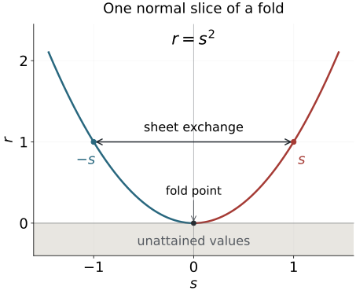

# Folds, reflections and uniform smooth descent

A fold identifies two nearby points and has one critical hypersurface where the two sheets meet. A smooth function on the source descends through this identification precisely when it is invariant under the sheet exchange. For Fourier-integral amplitudes, existence of a descended smooth function is only part of the task: its derivatives must obey uniform symbol bounds. We prove both statements, including an explicit extension across the unattained side of the target.

[Phase space and generating families](../20261005-restored-phase-space/phase-space-and-generating-families.md) supplies the manifold, tangent and cotangent conventions. [Homogeneous submanifold normal forms](../20261005-restored-submanifolds/homogeneous-submanifold-normal-forms.md) explains characteristic directions and function-preserving symplectic pairs; we will need the fold facts here before constructing simultaneous symplectic fold coordinates. [Cubic scaling and necessary continuity](../20261005-restored-cubic-scaling/cubic-scaling-and-necessary-continuity.md) shows why the order \(-1/6\) is a possible necessary threshold when corank is two. The present lesson supplies supporting smooth geometry and amplitude realization, not the later Airy continuity theorem.

The primary source is the approved purchased reprint of the corrected second printing (1994), [Hörmander III, Appendix C.4], especially the fold coordinate theorem, the fold involution and smooth descent. We give full proofs and a derivative-controlled extension suitable for parameter-dependent ordinary symbols. The simultaneous normal form of two distinct involutions and the full homogeneous canonical-relation fold normal form remain separate targets.

The [homogeneous fold companion P0–P2](homogeneous-fold-phase-and-order.md) proves the phase nondegeneracy, radial Jacobian, full ordinary symbol estimates and actual kernel order used in §6. The [proof map](proof-map.json) binds every result and exercise to its exact current programme proofs, including the inverse-function theorem, parameter calculus, smooth cutoffs and oscillatory construction.

## 1. The fold condition is a Hessian in a quotient

Let \(f:Y\to X\) be smooth. At \(y_0\), write
\[
K=\ker df(y_0),\qquad
Q=T_{f(y_0)}X/df(y_0)(T_{y_0}Y).
\tag{1.1}
\]
For \(v\in K\), choose a smooth curve \(\gamma\) with \(\gamma(0)=y_0\), \(\gamma'(0)=v\). In local coordinates, the second derivative of \(f\circ\gamma\), taken modulo the range of \(df(y_0)\), is
\[
\mathcal H_f(v)=[d^2f(y_0)(v,v)]\in Q.
\tag{1.2}
\]
The term \(df(y_0)\gamma''(0)\) vanishes in this quotient, so the result is independent of the acceleration of the curve. A source coordinate change adds only a term in that range. A target coordinate change acts on (1.2) by its differential: its additional quadratic term involves \(df(y_0)v=0\) and vanishes. Thus \(\mathcal H_f\) is an intrinsic quadratic map from \(K\) to \(Q\).

**Definition 1.1 (fold).** The map has a fold at \(y_0\) if \(\dim K=\dim Q=1\) and \(\mathcal H_f\) is nonzero. These dimensions force \(\dim Y=\dim X=d\); the differential has rank \(d-1\).

This condition tests curvature in the missing output direction. A large second derivative in an output direction already in the range does not establish a fold.

**Theorem 1.2 (ordinary fold coordinates).** At a fold, there are source coordinates \((z,s)\in\mathbb R^{d-1}\times\mathbb R\), and target coordinates \((Z,r)\), both centered at the marked points, such that
\[
f(z,s)=(z,s^2).
\tag{1.3}
\]
The attained target germ is \(r\geq0\). The critical set is \(s=0\), and its image is \(r=0\).

**Proof.** Choose a target linear change so that its first \(d-1\) component differentials are independent and its last component differential is zero at the marked point. Use those first components as the source coordinates \(z\), completing them by a coordinate \(s\). The map is then \((z,s)\mapsto(z,g(z,s))\), with \(dg(0)=0\). The kernel is the \(s\) direction, so the fold Hessian says \(g_{ss}(0)\neq0\).

The equation \(g_s(z,s)=0\) has a unique smooth solution \(s=c(z)\), by the implicit function theorem. Replace the source variable by \(t=s-c(z)\). Taylor's formula with an integral remainder gives
\[
g(z,c(z)+t)=g(z,c(z))+t^2 A(z,t),
\quad
A(z,t)=\int_0^1(1-u)g_{ss}(z,c(z)+ut)\,du.
\tag{1.4}
\]
The target change \(r=R-g(Z,c(Z))\) removes the first term. The function \(A\) is smooth and \(A(0,0)\neq0\). Shrink the neighborhood so its sign is constant; reverse the target \(r\) coordinate if necessary. Then \(A>0\). The source change \(s_*=t\sqrt{A(z,t)}\) has nonzero derivative in \(t\) at the marked point, hence is a local diffeomorphism. In these coordinates the last output is \(s_*^2\), proving (1.3). Differentiating (1.3) gives all the critical-set and image assertions. ∎

If \(d=1\), the \(z\) variables are absent and the proof applies with the same one-variable formulas.

**Corollary 1.3 (a determinant test).** For equal-dimensional source and target, suppose \(df(y_0)\) has rank \(d-1\). In any local coordinate systems, let \(J=\det df\). The map is a fold if and only if \(dJ(y_0)v\neq0\) for a nonzero kernel vector \(v\).

**Proof.** With the first \(d-1\) components used as source coordinates, the map is \((z,s)\mapsto(z,g(z,s))\). Its determinant is \(g_s\), and the kernel at the marked point is the \(s\) direction. Hence \(dJ(v)\neq0\) is exactly \(g_{ss}(0)\neq0\), the nonzero quotient Hessian. Under either coordinate change the determinant is multiplied by a smooth nonvanishing factor. At \(J=0\), its derivative is multiplied by that same factor, so the test is invariant. In fold coordinates it also proves that the kernel line is transverse to the critical hypersurface. ∎

## 2. The sheet exchange determines a reflection line

In (1.3), the two source points over \((z,r)\), for \(r>0\), are \((z,\sqrt r)\) and \((z,-\sqrt r)\). The sheet exchange is
\[
\iota(z,s)=(z,-s),\qquad f\circ\iota=f,
\qquad \iota^2=\mathrm{id}.
\tag{2.1}
\]
It is a smooth involution with fixed set \(s=0\).

**Proposition 2.1 (intrinsic fold involution).** There is a unique nonidentity smooth map germ near the fold point satisfying \(f\circ\iota=f\). It is the involution (2.1), expressed in the original coordinates. On its fixed hypersurface, its minus-one differential eigenspace is the kernel line of \(df\).

**Proof.** A map preserving (1.3) must keep \(z\) fixed and send \(s\) to a function \(h\) with \(h^2=s^2\). On each of the two connected local sets \(s>0\), \(s<0\), continuity forces \(h/s\) to be a constant sign. Smoothness at \(s=0\) forces these two signs to agree, since they give the two one-sided normal derivatives. Thus the only smooth germs are identity and reflection. This proves uniqueness independently of the chosen fold coordinates. Its square and fixed set follow from (2.1). At a fixed point its differential is identity on \(z\) and minus identity on \(s\), while \(\ker df\) is the \(s\) line. ∎

We call that minus-one line the **reflection line**. For a fold family it is a smooth line bundle on the critical hypersurface.

**Figure 2.1.** The graph of the exact one-variable normal slice \(r=s^2\), with \(z\) held fixed in Theorem 1.2. The arrow exchanges the points \(s=-1\) and \(s=1\), which both have output \(r=1\); it is an identification, not a flow trajectory. The critical point is the origin. The shaded negative target values have no source preimage. Theorem 5.1 requires equal function values on the two sheets, and Theorem 4.2 constructs a smooth extension into the unattained side. The drawing shows a normal-form slice rather than an entire higher-dimensional fold.

**Theorem 2.2 (one involution is a reflection).** Let \(\iota\) be a smooth involution with a fixed point \(p\), whose local fixed set is a hypersurface. There are smooth coordinates \((z,s)\) centered at \(p\) with \(\iota(z,s)=(z,-s)\).

**Proof.** The differential \(L=d\iota(p)\) satisfies \(L^2=I\). Its dual space is the direct sum of its plus-one and minus-one eigenspaces, with projections \((I\pm L^*)/2\). Start with local coordinate functions \(u_j\) vanishing at \(p\). Their symmetric and antisymmetric combinations
\[
u_j^+=(u_j+u_j\circ\iota)/2,
\qquad u_j^-=(u_j-u_j\circ\iota)/2
\tag{2.2}
\]
have differentials spanning those two eigenspaces. Select a basis from these differentials. The corresponding functions are a coordinate system by the inverse function theorem. Each chosen coordinate is exactly even or odd under \(\iota\), not just even or odd to first order.

In this coordinate system the fixed set is precisely the simultaneous zero set of the odd coordinates. Its codimension therefore equals their number. The hypersurface hypothesis makes that number one. Naming the odd coordinate \(s\) gives the assertion. The construction also proves that the reflection line is transverse to the fixed hypersurface. ∎

The map \((z,s)\mapsto(z,s^2)\) consequently realizes any such single involution locally as the sheet exchange of a fold. Two involutions with the same fixed hypersurface can have different reflection lines; their simultaneous normalization requires a further theorem.

## 3. Even and odd functions become smooth functions of the square

Let \(a(s,z)\) be smooth for \(|s|<s_0\), with additional parameters \(z\) in an open set. We work on compact parameter sets and a smaller interval \(|s|\leq s_1<s_0\). Parameter multi-indices are denoted by \(\alpha\).

**Lemma 3.1 (division of an odd function).** If \(a\) is odd in \(s\), there is a smooth even function \(b\) with \(a=sb\), given by
\[
b(s,z)=\int_0^1\partial_s a(us,z)\,du.
\tag{3.1}
\]
For each \(j,\alpha\), its derivative is bounded by a constant times the supremum of \(|\partial_s^{j+1}\partial_z^\alpha a|\) on the same interval and parameter set.

**Proof.** Since \(a(0,z)=0\), the fundamental theorem of calculus gives \(a(s,z)=s\int_0^1a_s(us,z)du\). The integral is smooth, including at zero. For \(s\neq0\), oddness of \(a\) makes \(a(s,z)/s\) even; continuity extends this parity to zero. Differentiation under the integral supplies a factor \(u^j\), bounded by one, and proves the stated estimate. ∎

**Lemma 3.2 (smooth square descent on the attained side).** If \(a\) is even in \(s\), then
\[
F(r,z)=a(\sqrt r,z),\qquad 0\leq r\leq s_1^2,
\tag{3.2}
\]
is smooth up to \(r=0\). For every \(p,\alpha\),
\[
\sup|\partial_r^p\partial_z^\alpha F|
\leq C_p\sup|\partial_s^{2p}\partial_z^\alpha a|.
\tag{3.3}
\]
Its boundary derivatives are
\[
\partial_r^p F(0,z)=
\frac{p!}{(2p)!}\partial_s^{2p}a(0,z).
\tag{3.4}
\]

**Proof.** On even smooth functions define
\[
(La)(s,z)=\frac12\int_0^1\partial_s^2a(us,z)\,du.
\tag{3.5}
\]
Evenness gives \(a_s(0,z)=0\), so for \(s\neq0\) this is \(a_s(s,z)/(2s)\). The integral proves that \(La\) is itself smooth and even, without dividing by a vanishing coordinate. Each prescribed \(j\)-th \(s\) derivative of \(La\) is bounded by one half the corresponding \((j+2)\)-th derivative bound of \(a\).

For \(r>0\), the chain rule gives \(\partial_r^p F(r,z)=(L^pa)(\sqrt r,z)\). The right-hand side extends continuously to \(r=0\), with all parameter derivatives. Repeating the fundamental theorem of calculus from \(r=0\) shows that these continuous extensions are the actual successive one-sided derivatives. This proves smoothness up to the boundary and the finite-derivative estimate (3.3), for example with \(C_p=2^{-p}\).

For the boundary value, the even Taylor expansion through order \(2p\) is
\[
a(s,z)=\sum_{j=0}^p
\frac{\partial_s^{2j}a(0,z)}{(2j)!}s^{2j}
\ +\ o(s^{2p}).
\]
Substitute \(s=\sqrt r\) and use the proved boundary smoothness. Comparison of Taylor coefficients gives (3.4). ∎

For a general \(a\), write
\[
a_e=(a(s,z)+a(-s,z))/2,
\qquad a_o=(a(s,z)-a(-s,z))/2.
\]
Lemmas 3.1–3.2 give unique smooth attained-side functions \(F_0,F_1\) with
\[
a(s,z)=F_0(s^2,z)+sF_1(s^2,z).
\tag{3.6}
\]
Their \(p\)-th square-variable derivative bounds use finitely many derivatives of \(a\): at most \(2p\) for \(F_0\), and \(2p+1\) for \(F_1\). We next extend these functions to negative \(r\), retaining such bounds.

## 4. An explicit extension matches every boundary jet

Fix \(0<\delta<s_1^2\). Let \(\chi\) be a smooth function on the closed half-line, equal to one near zero and supported in \([0,\delta)\). For a smooth \(F\) on \([0,\delta]\), we will extend its germ at zero. The cutoff is fixed independently of \(F\) and of all parameters.

Put \(b_k=-2^k\). For \(0\leq k\leq N\), the Lagrange coefficient for evaluating a degree-\(N\) polynomial at 1 from its values at these nodes is
\[
a_{k,N}=\prod_{\substack{0\leq j\leq N\\j\neq k}}
\frac{1+2^j}{2^j-2^k}.
\tag{4.1}
\]
To verify the interpolation identity directly, define the polynomial \(\ell_{k,N}(t)=\prod_{j\ne k}(t-b_j)/(b_k-b_j)\). Its value at \(b_i\) is one if \(i=k\), and zero otherwise. For a polynomial \(P\) of degree at most \(N\), the polynomial \(P(t)-\sum_{k=0}^N P(b_k)\ell_{k,N}(t)\) has degree at most \(N\) and vanishes at all \(N+1\) distinct nodes. It is zero: if a polynomial vanishes at \(c\), the elementary identity \(t^j-c^j=(t-c)\sum_{i=0}^{j-1}t^{j-1-i}c^i\) factors out \(t-c\); successive distinct roots would otherwise force its degree to be at least \(N+1\). Evaluate this identity at \(t=1\) and take \(P(t)=t^p\). Thus, for every integer \(0\leq p\leq N\),
\[
\sum_{k=0}^N a_{k,N}(-2^k)^p=1.
\tag{4.2}
\]

**Lemma 4.1 (rapid coefficients with all moments).** For fixed \(k\), the limit \(a_k=\lim_{N\to\infty}a_{k,N}\) exists. There is a constant \(C\) independent of \(k,N\) such that
\[
|a_{k,N}|\leq C2^{-k(k+1)/2},
\qquad |a_k|\leq C2^{-k(k+1)/2}.
\tag{4.3}
\]
For each integer \(p\geq0\), the following sums converge absolutely and satisfy
\[
\sum_{k=0}^\infty|a_k|2^{kp}<\infty,
\qquad
\sum_{k=0}^\infty a_k(-2^k)^p=1.
\tag{4.4}
\]

**Proof.** For \(j<k\), the absolute factor in (4.1) is
\[
2^{j-k}\frac{1+2^{-j}}{1-2^{j-k}};
\]
for \(j>k\), it is \((1+2^{-j})/(1-2^{k-j})\). The product of the powers for \(j<k\) is \(2^{-k(k+1)/2}\). The numerator products are bounded by \(\prod_{j=0}^\infty(1+2^{-j})<\infty\). The denominator products, on each side, are bounded below by the positive number \(\prod_{j=1}^\infty(1-2^{-j})\).

For completeness, the first product converges because \(\log(1+t)\leq t\) for \(t\geq0\) and \(\sum2^{-j}<\infty\). The second has a nonzero limit: \(|\log(1-t)|\leq2t\) for \(0\leq t\leq1/2\), so its logarithms have a finite sum. These observations prove the uniform bound (4.3). For fixed \(k\), the tail factors for \(j>k\) also have summable logarithms, so their product converges and the limit \(a_k\) exists.

For \(k\geq2p+1\), the exponent \(-k(k+1)/2+kp\) is at most \(-k\). Thus the weighted bound has a geometric tail and is summable. Extend \(a_{k,N}\) by zero for \(k>N\). Given a finite \(K\), the terms \(0\leq k\leq K\) converge individually as \(N\to\infty\). For \(K\geq2p\), the absolute sum of the remaining terms, for both the finite coefficients and their limits, is at most \(C\sum_{k>K}2^{-k}\), independently of \(N\). First take the finite-head limit and then let \(K\to\infty\) in (4.2), with \(N\geq p\). This proves its infinite moment identity and absolute convergence without an unproved interchange of limits. ∎

**Theorem 4.2 (controlled half-line extension).** For \(r<0\), define
\[
(EF)(r,z)=\sum_{k=0}^\infty
a_k\chi(-2^kr)F(-2^kr,z),
\tag{4.5}
\]
and for \(r\geq0\) set \((EF)(r,z)=F(r,z)\). This defines a linear smooth extension near zero. Every mixed derivative on the negative side is bounded by finitely many derivatives of \(F\) on \([0,\delta]\); specifically, for a compact parameter set \(K\),
\[
\sup_{-\delta\leq r\leq0,\ z\in K}
|\partial_r^p\partial_z^\alpha EF|
\leq C_{p,\chi}
\max_{0\leq j\leq p}
\sup_{0\leq r\leq\delta,\ z\in K}
|\partial_r^j\partial_z^\alpha F|.
\tag{4.6}
\]
All derivatives at zero agree with the given right-hand derivatives.

**Proof.** For each fixed \(r<0\), only finitely many summands are nonzero, because \(-2^kr\) eventually exceeds the cutoff support. Define \(H=\chi F\) on the nonnegative half-line and extend it by zero beyond \(\delta\). It is smooth at that far endpoint, since \(\chi\) vanishes in a neighborhood of it. Formula (4.5) can thus be differentiated without evaluating \(F\) outside its domain. Its \(p\)-th derivative is
\[
\sum_{k=0}^\infty
a_k(-2^k)^p\partial_r^p\partial_z^\alpha H(-2^kr,z).
\tag{4.7}
\]
The product rule for \(H\) and the first sum in (4.4) give (4.6), uniformly all the way to zero.

As \(r\uparrow0\), each term in (4.7) tends to
\(a_k(-2^k)^p\partial_r^p\partial_z^\alpha F(0,z)\), because \(\chi\) is one near zero. The common summable bound gives uniform convergence of this limit on compact parameter sets. The moment identity (4.4) makes the resulting sum exactly \(\partial_r^p\partial_z^\alpha F(0,z)\).

Hence every derivative from the negative side has the correct continuous boundary value. The fundamental theorem of calculus glues the first derivatives across zero; induction glues all successive derivatives and their parameter derivatives. The result is jointly smooth. Linearity follows directly from the fixed coefficients and cutoff. ∎

The extension is unique on the attained side \(r\geq0\), but generally not on \(r<0\). A smooth function supported on the negative side and flat at zero can be added without changing its pullback under \(r=s^2\). If the original \(F\) vanishes for some parameter values, (4.5) vanishes there too: the construction does not enlarge parameter supports.

## 5. Invariance is exactly the smooth descent condition

**Theorem 5.1 (descent through a fold).** Let \(f\) have a fold at \(y_0\), and let \(\iota\) be its fold involution. A smooth function \(a\) near \(y_0\) has the form \(a=v\circ f\), with \(v\) smooth in a full target neighborhood, if and only if \(a\circ\iota=a\).

**Proof.** Necessity follows from \(f\circ\iota=f\). For sufficiency use Theorem 1.2 to write \(f(z,s)=(z,s^2)\). Invariance means evenness in \(s\). Lemma 3.2 gives a smooth function \(F(r,z)=a(\sqrt r,z)\) up to the attained-side boundary; Theorem 4.2 extends it to negative \(r\). Set \(v(Z,r)=EF(r,Z)\) in the target coordinates. Then \(v\circ f=a\). The coordinate maps are smooth, so this is a smooth target germ in the original coordinates as well. ∎

This proof supplies parameter bounds in fixed fold coordinates. It does not assert that arbitrary frequency-dependent changes of fold coordinates preserve an ordinary symbol class without their own derivative estimates.

**Corollary 5.2 (even/odd decomposition in a full neighborhood).** For every smooth \(a(s,z)\) there are smooth functions \(F_0,F_1\) on a full neighborhood of \(r=0\) such that
\[
a(s,z)=F_0(s^2,z)+sF_1(s^2,z)
\tag{5.1}
\]
for small \(s\). They can be chosen linearly in \(a\), with each prescribed mixed derivative bounded by finitely many mixed derivatives of \(a\), and without increasing its parameter support.

**Proof.** Split into even and odd parts. Divide the odd part by \(s\) using Lemma 3.1. Descend both even functions by Lemma 3.2 and extend each using Theorem 4.2. All operations are linear, and their finite-derivative estimates compose. On \(r\geq0\), the functions are fixed by the given even and odd parts; hence (5.1) is exact on a smaller source neighborhood. The parameter support assertion follows at each step. ∎

For example, \(a(s,z)=c(z)+s d(z)+s^2 e(z)+s^3 h(z)\) has attained-side coefficients \(F_0(r,z)=c(z)+r e(z)\), \(F_1(r,z)=d(z)+r h(z)\). The same statement holds for smooth nonanalytic functions, by the proved extension rather than an assumed convergent Taylor series.

## 6. Uniform ordinary symbols descend with the Airy order shifts

We now make the frequency estimates explicit. Let \(a(s,x,\xi)\) be smooth for \(|s|<s_0\), with ordinary symbol order \(\nu\) in \(\xi\), uniformly with all derivatives in \(s\) and on compact \(x\) sets. Thus for every \(j,\alpha,\beta\),
\[
|\partial_s^j\partial_x^\alpha\partial_\xi^\beta a(s,x,\xi)|
\leq C_{j\alpha\beta}\langle\xi\rangle^{\nu-|\beta|}
\tag{6.1}
\]
on the smaller fixed \(s\) interval. Cone cutoffs and compact base cutoffs may be included. Smooth low-frequency extensions are harmless, so the following assertions are made on a high-frequency cone where
\[
\rho=\xi_n\geq1,\qquad |\xi|\leq C\rho,\qquad
|\xi_1/\rho|<\delta_1,\qquad n\geq2.
\tag{6.2}
\]
Choose \(\delta_1\) sufficiently small for the preceding square-variable constructions.

**Proposition 6.1 (symbol-controlled square coefficients).** The functions in (5.1) can be chosen so that, for every \(p,\alpha,\beta\),
\[
|\partial_r^p\partial_x^\alpha\partial_\xi^\beta F_j(r,x,\xi)|
\leq C_{p\alpha\beta}\langle\xi\rangle^{\nu-|\beta|},
\qquad j=0,1,
\tag{6.3}
\]
for \(|r|\) in a fixed smaller interval. Each such constant is controlled by finitely many seminorms in (6.1). In particular
\[
c_j(x,\xi)=F_j(\xi_1/\rho,x,\xi)\in S^\nu.
\tag{6.4}
\]

**Proof.** All parity, division, square-descent and extension operations act in the \(s,r\) variables with fixed kernels and cutoffs. They commute with \(x,\xi\) differentiation. Apply their estimates to \(\partial_x^\alpha\partial_\xi^\beta a\), multiply by the weight \(\langle\xi\rangle^{-\nu+|\beta|}\), and take the supremum. This proves (6.3) with finite seminorm control, including for negative \(\nu\).

The ratio \(r(\xi)=\xi_1/\rho\) is homogeneous of degree zero and smooth on the cone. Its derivatives satisfy
\[
|\partial_\xi^\gamma r(\xi)|
\leq C_\gamma\rho^{-|\gamma|}
\quad (|\gamma|\geq1).
\tag{6.5}
\]
This can be read directly from the quotient, or from homogeneity on the compact normalized cone \(\rho=1\). In the repeated chain rule for (6.4), a derivative of total frequency order \(|\beta|\) is a sum of terms consisting of a derivative of \(F_j\) of external frequency order \(|\beta_0|\), square-variable order \(p\), and a product of ratio derivatives of total order \(|\beta|-|\beta_0|\). Equations (6.3)–(6.5), and \(\rho\asymp\langle\xi\rangle\) on the high-frequency cone, bound each term by \(C\langle\xi\rangle^{\nu-|\beta|}\). Base derivatives are unchanged. This proves (6.4). Ordinary symbol cutoffs on a smaller cone give the localized assertion, with a smooth extension at bounded frequencies. ∎

The square root itself has singular derivatives at the boundary. The estimates use the descended function \(F_j\), whose derivatives were proved smooth and uniformly bounded; they do not differentiate \(\sqrt{\xi_1/\rho}\) as if it were a smooth function across \(\xi_1=0\).

Consider the fold phase
\[
\Phi(x,y,s,\xi)=(x-y)\cdot\xi+s\xi_1-s^3\rho/3,
\qquad \rho>0.
\tag{6.6}
\]
On its critical set in \(s\), \(\xi_1=s^2\rho\). An unscaled coefficient for an FIO of order \(m\) has order \(\nu=m+1/2\); [companion P0–P2](homogeneous-fold-phase-and-order.md) proves this now, using the homogeneous variable \(\tau=\rho s\), the Jacobian \(ds=\rho^{-1}d\tau\), all ordinary symbol derivatives and the normalized kernel order. The intrinsic half-density calculation remains part of the later fold model. Here we identify precisely what this already justified coefficient order entails.

**Theorem 6.2 (realize the critical coefficient).** Suppose \(a(s,x,\xi)\) satisfies (6.1) with \(\nu=m+1/2\). On a smaller cone there are ordinary symbols
\[
b_0\in S^{m+1/6},\qquad b_1\in S^{m-1/6}
\tag{6.7}
\]
such that on \(\xi_1=s^2\rho\), for small \(s\),
\[
a(s,x,\xi)=
\rho^{1/3}b_0(x,\xi)-is\rho^{2/3}b_1(x,\xi).
\tag{6.8}
\]
Conversely any symbols of those orders give an unscaled smooth coefficient of order \(m+1/2\) by the right-hand side of (6.8), uniformly for \(s\) in a compact interval. Compact base support can be retained in both directions.

**Proof.** Choose the functions \(F_0,F_1\) from Proposition 6.1 and set
\[
b_0=\rho^{-1/3}F_0(\xi_1/\rho,x,\xi),
\qquad
b_1=i\rho^{-2/3}F_1(\xi_1/\rho,x,\xi).
\tag{6.9}
\]
The powers of \(\rho\) are ordinary symbols of their displayed orders on this cone. Thus the orders are \(\nu-1/3=m+1/6\) and \(\nu-2/3=m-1/6\), respectively. On the critical set the ratio is \(s^2\). Substitution into the right-hand side of (6.8) gives \(F_0(s^2,x,\xi)+sF_1(s^2,x,\xi)\), because \((-i)i=1\). This is exactly \(a\). Cone cutoffs equal to one on a smaller critical germ retain the identity there.

Conversely \(\rho^{1/3}b_0\) and \(\rho^{2/3}b_1\) both have order \(m+1/2\). Multiplication by \(s\) and its derivatives on a compact interval preserves that order, as do base derivatives. A fixed smooth \(s\) cutoff supplies compact \(s\) support if desired. The parameter-preserving constructions and multiplication retain compact base support. ∎

This realizes the coefficient **on the critical set**. It does not yet identify two full oscillatory integrals away from that set, sum all lower-order corrections, prove the noncompact \(s\) tail is smoothing, or establish an Airy bound. Those analytic statements have their own proofs. In particular, the negative \(i\) sign in (6.8) and the positive \(i\) in the definition of \(b_1\) serve different roles and must not be interchanged.

## 7. Exercises with complete solutions

**Exercise 7.1 (Hessian in the missing output; introductory).** For \(f(z,s)=(z,z^2+s^2)\) at zero, compute the kernel, cokernel and quotient Hessian. Compare it with \(g(z,s)=(z,z^2+s^3)\). Why does a nonzero second derivative in \(z\) not make the latter a fold?

**Solution.** Both differentials have matrix \(\left(\begin{smallmatrix}1&0\\0&0\end{smallmatrix}\right)\) at zero. The kernel is the \(s\) line and the cokernel is the second output line modulo the first. For \(f\), the Hessian on a kernel vector \((0,v)\) is \((0,2v^2)\), giving a nonzero quotient class when \(v\neq0\). Thus it is a fold. For \(g\), the same kernel Hessian is zero, so it is not a fold. Its \(z^2\) curvature lies in a direction of the source outside the kernel and is irrelevant to the fold test. Subtracting \(Z^2\) from the second target coordinate leaves the maps \((z,s^2)\) and \((z,s^3)\), which display the distinction exactly.

**Exercise 7.2 (actual nonlinear fold coordinates; intermediate).** Near zero let
\[
f(y,s)=(y+s,(y+s)^2+s^2(1+s)^2).
\]
Find an exact source change and target change to (1.3), the critical set near zero and its kernel line. Give the fold involution in the original variables.

**Solution.** Set \(z=y+s\), \(t=s(1+s)\) on the source and \((Z,r)=(Z,R-Z^2)\) on the target. The source Jacobian determinant is \(1+2s\), nonzero near zero; the target determinant is one. The transformed map is exactly \((z,t^2)\). The critical set near zero is \(s=0\). Its kernel there is spanned by \(-\partial_y+\partial_s\), since it keeps \(z\) fixed. The local inverse of \(t=s+s^2\) is \(s=(-1+\sqrt{1+4t})/2\). Thus write
\[
s_*=\frac{-1+\sqrt{1-4s-4s^2}}2,
\qquad \iota(y,s)=(y+s-s_*,s_*).
\]
The positive square-root branch near zero is smooth. It satisfies \(s_*(1+s_*)=-s(1+s)\), hence keeps \(t^2\) and \(z\) fixed. Applying it twice restores \(t\), and therefore \(s,y\), so it is the intrinsic involution. Its reflection line at the critical set is the computed kernel, not the original coordinate \(s\) line alone.

**Exercise 7.3 (invariance and nonuniqueness; introductory).** For the fold \((z,s)\mapsto(z,s^2)\), decide whether \(a(z,s)=1+s\) descends smoothly. Show that \(a(z,s)=1+s^2\) has two different smooth full-neighborhood descents with the same pullback.

**Solution.** The first function is not invariant under \(s\mapsto-s\), so it cannot be a pullback. For the second, one descent is \(v_1(z,r)=1+r\). Define \(h(r)=e^{-1/r^2}\) for \(r<0\) and zero for \(r\geq0\). It is smooth and flat at zero: each negative-side derivative is a polynomial in \(1/r\) times \(e^{-1/r^2}\), and hence tends to zero. Then \(v_2=1+r+h(r)\) is a different smooth descent, with the same pullback because \(s^2\geq0\). The attained-side descent is unique; its extension to the other side is not.

**Exercise 7.4 (a smooth function invisible to its Taylor series; intermediate).** Let \(a(s)=e^{-1/s^2}\) for \(s\neq0\) and \(a(0)=0\). Show that it descends through \(s^2\), although its Taylor series at zero is identically zero. Give a full smooth descent without appealing to analytic continuation.

**Solution.** The function is even and smooth, with all derivatives zero at zero. On \(r>0\), its unique descent is \(F(r)=e^{-1/r}\), since \(r=s^2\). Set \(F(r)=0\) for \(r\leq0\). Every positive-side derivative is a polynomial in \(1/r\) times \(e^{-1/r}\), which tends to zero as \(r\downarrow0\); thus this is a full smooth function. Its pullback equals \(a\), which is nonzero for \(s\neq0\). A convergent-series argument using the zero Taylor series would miss that entire flat remainder. The smooth descent theorem covers it.

**Exercise 7.5 (boundary derivatives and finite derivative cost; intermediate).** For \(a(s)=\cos s\), compute the first three square-variable Taylor coefficients and \(F''(0)\). For an odd amplitude, how many source \(s\) derivatives suffice to control a prescribed \(p\)-th square derivative of its odd coefficient?

**Solution.** The attained-side descent has expansion \(F(r)=1-r/2+r^2/24+O(r^3)\). Formula (3.4) gives \(F''(0)=2!\,a^{(4)}(0)/4!=1/12\), agreeing with the expansion. For an odd amplitude, division by \(s\) costs one derivative by Lemma 3.1, and \(p\) square derivatives cost at most \(2p\) more by Lemma 3.2. Thus \(2p+1\) source derivatives suffice on the fixed interval, for each fixed parameter derivative. The result is a finite seminorm bound, not a statement that one derivative bound controls all higher derivatives.

**Exercise 7.6 (the extension moments in a finite model; advanced).** For nodes \(-1,-2,-4\), compute the finite coefficients (4.1) at \(N=2\). Verify their moments for powers zero, one and two. What fails if the last coefficient is discarded?

**Solution.** The coefficients are \(a_{0,2}=5\), \(a_{1,2}=-5\), \(a_{2,2}=1\). Their zeroth moment is \(5-5+1=1\); their first is \(-5+10-4=1\); and their second is \(5-20+16=1\). If the last coefficient is discarded, the zeroth moment becomes zero, so the negative-side value of a constant profile would fail to match its boundary value. All prescribed moments matter for smooth gluing. The infinite construction matches every derivative, whereas a fixed finite interpolation formula matches only finitely many polynomial moments.

**Exercise 7.7 (symbol order is retained despite a square root; advanced).** Let \(a(s,\xi)=\langle\xi\rangle^\nu(1+s^2+s+s^3)\), on the cone (6.2). Compute attained-side \(F_0,F_1\), and verify explicitly that their critical restrictions have ordinary symbol order \(\nu\). Explain why a direct derivative of \(\sqrt{\xi_1/\rho}\) is unnecessary.

**Solution.** The even part is \(\langle\xi\rangle^\nu(1+s^2)\), and the odd part divided by \(s\) is \(\langle\xi\rangle^\nu(1+s^2)\). Hence both attained-side coefficients are \(F_j(r,\xi)=\langle\xi\rangle^\nu(1+r)\), and we may use those polynomial expressions as full extensions near zero. Their restrictions are \(\langle\xi\rangle^\nu(1+\xi_1/\rho)\). The ratio is bounded and each frequency derivative of it loses one power of \(\rho\asymp\langle\xi\rangle\); the product rule gives order \(\nu\). The parity and division steps removed the square-root singularity before frequency restriction. Differentiating a raw square root at \(\xi_1=0\) would not be a legitimate smooth-symbol calculation.

**Exercise 7.8 (both Airy coefficient orders and the odd sign; intermediate).** Take unscaled order \(\nu=m+1/2\). Derive the two orders in (6.7), and check that (6.9) reproduces \(a=F_0(s^2)+sF_1(s^2)\) on the critical set. What happens if \(b_1\) is defined with \(-i\) instead?

**Solution.** Multiplication by \(\rho^{-1/3}\) gives order \(m+1/2-1/3=m+1/6\). Multiplication by \(\rho^{-2/3}\) gives order \(m+1/2-2/3=m-1/6\). In the prescribed formula, \(-is\rho^{2/3}b_1=-is\rho^{2/3}i\rho^{-2/3}F_1=sF_1\). Thus it has the correct odd coefficient. Defining \(b_1=-i\rho^{-2/3}F_1\) would give \((-i)(-i)sF_1=-sF_1\), reversing the odd term. The representation sign and the solving formula cannot be chosen independently.

**Exercise 7.9 (two reflections are distinct data; advanced).** In coordinates \((z,s)\), set \(f(z,s)=(z,-s)\) and \(g(z,s)=(z+s,-s)\). Find their common fixed set, their reflection lines there, and their composition. Can a coordinate change make both involutions the same reflection?

**Solution.** Both fixed sets are \(s=0\). For \(df\), the minus-one line is \(\mathbb R\partial_s\). For \(dg=\left(\begin{smallmatrix}1&1\\0&-1\end{smallmatrix}\right)\), solve \((v_z+v_s,-v_s)=(-v_z,-v_s)\); this gives \(v_s=-2v_z\), so its line is \(\mathbb R(\partial_s-\tfrac12\partial_z)\). They are independent. Their composition \(g\circ f\) is \((z-s,s)\), a nonidentity shear. If a single coordinate change conjugated both to the same reflection, their composition would conjugate to identity, which is impossible. The single-involution theorem supplies separate coordinates for each; it does not supply their simultaneous normal form.

## References

- [Hörmander III, Appendix C.4] Lars Hörmander, *The Analysis of Linear Partial Differential Operators III: Pseudo-Differential Operators*, approved purchased reprint of the corrected second printing (1994), Springer, Definition C.4.1, Theorem C.4.2, Corollary C.4.3 and Theorems C.4.4–C.4.5. The explicit controlled extension here proves the needed uniform parameter statement directly. Theorems C.4.6–C.4.8 and §21.4 supply the later simultaneous geometry targets.
- [Hörmander IV, §25.3] Lars Hörmander, *The Analysis of Linear Partial Differential Operators IV: Fourier Integral Operators*, Springer, approved purchased reprint of the corrected second printing (1994), equations 25.3.7–25.3.12 for the later Airy representation, coefficient orders and negative-\(i\) odd critical coefficient. The complete representation and continuity proofs remain separate from the smooth critical-coefficient realization proved here.

*Written by GPT-6.1 Sol (OpenAI), Ultra, September 2026. Restoration and exact programme prerequisite review: GPT-6 Astra (OpenAI), Ultra, 5 October 2026. Human mathematical review remains pending. Original text and coordinate figure: public domain (CC0).*
