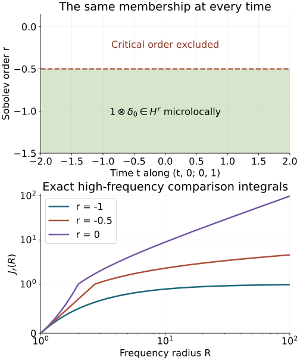

# Sobolev regularity along real characteristics

Smooth propagation says where a solution is singular. Sobolev propagation keeps track of how many derivatives it has at each characteristic covector. We prove the exact gain from the forcing by an L2 time primitive and distributional averaging, then use the full canonical conjugation with the required graph orders. No initial time slice of an arbitrary distribution is taken.

Read [Singularities along a real characteristic direction](../20261005-restored-real-principal/real-principal-type-kernels-and-propagation.md), Sections 2–5, for the exact kernel wavefront, distributional time-constant proof, common transport tube and radial cases. [Graph operators, continuity and Egorov](../20261005-restored-graph-egorov/graph-operators-continuity-and-egorov.md), Theorems 3.1, 5.1, 6.1 and equations GT1–GT17, supplies local L2 and every-real-order Sobolev mapping, both graph inverses and full lower-term conjugation. Section 2 of [Kernels, adjoints and clean composition](../20261005-restored-analytic-composition/clean-composition-of-fourier-integral-operators.md) supplies the proper wavefront mapping used for time averaging.

The complete [global Sobolev bounds, G1](../20261005-cauchy-foundations/sharp-lower-bound.md#g1-global-sobolev-bounds-with-the-original-norms), with compact proper localization, supply every real operator order and the actual distributional action. The [Fourier cutoff and conic operator proofs T0, T2 and W1–W4](../20261004-free-intrinsic-graph/prerequisites/coordinate-and-wavefront-localization.md) and [complete elliptic inverse K2–K3](../20261004-free-intrinsic-graph/prerequisites/conic-parametrices-and-localization.md) supply the membership tests proved explicitly below. The [tensor-wavefront companion WF8–WF10](../20261005-restored-real-principal/tensor-wavefront-and-projection.md) includes the exact constant-factor converse. [Measure and L2, M0–M8](../20261004-free-intrinsic-graph/prerequisites/measure-and-l2.md), [Fourier L1–L3](../20261004-free-intrinsic-graph/prerequisites/fourier-l2.md), and [ordinary calculus O1–O6](../20261004-free-intrinsic-graph/prerequisites/ordinary-operator-calculus.md) give the integration, norms and all differentiated remainders. These are included earlier programme proofs, with exact current dependencies in the [proof map](proof-map.json). Their component notices remain in place.

The source antecedent is the approved purchased edition of Hörmander IV, Theorem 26.1.4. We use ordinary symbols, a real homogeneous scalar principal symbol and proper representatives on matched cones. Realization of prescribed singular rays and the compact global tube have separate later proofs.

## 1. Fix an order and test actual membership

For a fixed real \(r\), say that \(u\) is microlocally \(H^r\) at a nonzero covector \(\gamma\) if it decomposes as \(u=h+k\), with \(h\in H^r_{\mathrm{loc}}\) and \(\gamma\notin\operatorname{WF}(k)\). The exact equivalent operator test is that some proper order-zero operator, elliptic at \(\gamma\), maps \(u\) into \(H^r_{\mathrm{loc}}\). Here and below the operator may be supported in a compact coordinate chart.

**Complete membership and order-shift tests.** If \(u=h+k\) is the defining decomposition, choose an order-zero proper conic cutoff \(A\) elliptic at \(\gamma\), with its entire microsupport inside the wavefront-regular neighborhood of \(k\). The exact W4 inclusion makes \(Ak\) smooth. The compactly localized G1 bound gives \(Ah\in H^r_{\mathrm{loc}}\). Hence \(Au\in H^r_{\mathrm{loc}}\). Conversely, suppose \(Au\in H^r_{\mathrm{loc}}\) for such an elliptic test. The full K3 construction gives a proper inverse \(B\) of order zero on a smaller cone. Then \(h=BAu\in H^r_{\mathrm{loc}}\), while \(k=(I-BA)u\) is regular at \(\gamma\) by the full smoothing symbol and W4. This is the required decomposition. Properness permits all inputs to be multiplied by one compact cutoff for each output localization, so the stated local bound is exactly the proved global bound applied to compact symbols, plus a smooth separated-support kernel.

More generally a proper operator \(C\) of order \(q\) sends microlocal \(H^r\) to microlocal \(H^{r-q}\). Apply its proved Sobolev bound to \(h\) and pseudolocality to \(k\). If \(C\) is elliptic at \(\gamma\), use its proper order-\(-q\) inverse and \(u=BCu+(I-BC)u\) to prove the reverse implication. This proves the full elliptic order-shift test, including the inverse defect. The same \(k\) is regular on an open conic neighborhood of \(\gamma\), so the fixed-order regular set is open and conic.

We use membership at the stated order, not the supremum of possible orders. A finite supremum need not be attained. This distinction is essential in the critical examples below.

For later examples, the exact local Fourier criterion is also useful. A compact base cutoff \(\chi\) equal to one near the point and a cone \(V\) about its covector give the criterion
\[
 \int_V\langle\xi\rangle^{2r}|\widehat{\chi u}(\xi)|^2d\xi<\infty.
 \tag{SP1}
\]
To prove necessity, use the defining decomposition \(u=h+k\), choose the support of \(\chi\) and the closed retained angular cone inside the wavefront-regular neighborhood of \(k\), and apply the actual W1 Fourier cutoff estimate. It makes \(\widehat{\chi k}\) rapidly decreasing there. Compact multiplication bounds \(\chi h\) in \(H^r\), so the displayed integral is finite. For sufficiency, choose an order-zero angular Fourier multiplier \(\beta\), supported in \(V\) and equal to one near the retained covector above a fixed radius. The bounded-frequency piece is harmless because a compact distribution has a smooth polynomially bounded Fourier transform. The displayed integral therefore puts \(\beta(D)(\chi u)\) in \(H^r\). A compact output cutoff makes this an order-zero test elliptic at the point, to which the membership test just proved applies. Changes to a proper kernel are smoothing on the retained base neighborhood. This proves the criterion at each fixed real order; it makes no inference about attaining a supremum.

For a proper graph operator \(B\) of order \(q\), elliptic on matched cones with inverse \(A\) of order \(-q\), the exact criterion is
\[
 u\text{ is }H^r\text{ at }\kappa\gamma
 \quad\Longleftrightarrow\quad
 Bu\text{ is }H^{r-q}\text{ at }\gamma.
 \tag{SP2}
\]
Indeed, apply graph continuity Theorem 5.1 of [Graph operators, continuity and Egorov](../20261005-restored-graph-egorov/graph-operators-continuity-and-egorov.md) to the regular part of the defining decomposition; properness supplies common compact input supports for each output cutoff. The proper kernel wavefront theorem in Section 2 of [Kernels, adjoints and clean composition](../20261005-restored-analytic-composition/clean-composition-of-fourier-integral-operators.md) maps its wavefront-regular remainder away from the matched input covector. Conversely apply \(A\) to the decomposition of \(Bu\), using its order and graph relation, and use \(u-ABu\), regular on the retained output cone. Thus both implications include the full inverse defect. No global invertibility outside the matched cones is asserted.

## 2. A constant distribution has the same microlocal L2 state at every time

Let \(c\in\mathcal D'(Z)\), let \(I\) be an interval, and write \(w=1\otimes c\). At every \(t_0\in I\) and nonzero \(\eta_0\),
\[
 w\text{ is }L^2\text{ at }(t_0,z_0;0,\eta_0)
 \quad\Longleftrightarrow\quad
 c\text{ is }L^2\text{ at }(z_0,\eta_0).
 \tag{SP3}
\]
For the reverse implication, decompose \(c=h+k\) near the covector, with \(h\in L^2_{\mathrm{loc}}(Z)\). Then \(1\otimes h\) is locally L2 on the cylinder. The exact constant-factor wavefront formula WF10, also used in RP11 in [Singularities along a real characteristic direction](../20261005-restored-real-principal/real-principal-type-kernels-and-propagation.md), excludes the desired covector from \(\operatorname{WF}(1\otimes k)\). This is the required decomposition.

For the forward implication, write \(w=h+k\) with \(h\) locally L2 and \(k\) regular at the displayed covector. Choose a sufficiently small time interval about \(t_0\), a base neighborhood about \(z_0\), and an angular neighborhood of \(\eta_0\), so that \(k\) is regular at every covector with temporal component zero in these neighborhoods. Take \(\theta\in C_c^\infty(I)\) supported in that small time interval with integral one. Insert compact tangential cutoffs equal to one near \(z_0\). Time averaging has kernel
\[
 K_\theta(z;s,y)=\theta(s)\delta(z-y).
 \tag{SP4}
\]
Its twisted wavefront relation permits only output \((z,\eta)\) and input \((s,z;0,\eta)\), \(\eta\ne0\): the smooth temporal factor gives zero temporal covector, the delta has every nonzero conormal covector, and the input reflection changes its tangential minus sign. This follows from the same tensor upper estimate and exact constant-factor converse used for RP6; there are no covectors on either forbidden axis. After the stated cutoffs the kernel is proper.

The proper wavefront mapping theorem therefore makes the average of \(k\) regular at \((z_0,\eta_0)\). The average of \(h\) is locally L2 by Fubini and Cauchy–Schwarz:
\[
 \left\|\int\theta(s)h(s,\cdot)ds\right\|_{L^2(Z_0)}
 \le\|\theta\|_{L^2(I)}\|h\|_{L^2(\operatorname{supp}\theta\times Z_0)}.
 \tag{SP5}
\]
The average of \(w\) equals \(c\) because the integral of \(\theta\) is one. This supplies the defining L2 decomposition of \(c\) and proves SP3. It uses a smooth integral of distributions, never a restriction to one time slice.

## 3. The transport equation retains an L2 primitive

On a bounded interval \(I=(a,b)\), suppose \(D_tv=g\in L^2(I\times\mathbb R^{n-1})\). Fix \(t_*\in I\) and define, for almost every \(z\),
\[
 G(t,z)=i\int_{t_*}^t g(s,z)ds.
 \tag{SP6}
\]
Fubini makes this independent of changing the L2 representative of \(g\). For every \(t\), Cauchy–Schwarz bounds the squared integral by \(|I|\int_I|g(s,z)|^2ds\). Integrating in \(t,z\) gives
\[
 \|G\|_{L^2(I\times\mathbb R^{n-1})}
 \le |I|\|g\|_{L^2(I\times\mathbb R^{n-1})}.
 \tag{SP7}
\]
Testing against compact smooth functions and using Fubini proves \(D_tG=g\): the time derivative of the primitive is \(ig\), with the convention \(D_t=-i\partial_t\).

The zero-mean-test argument of Section 3 of [Singularities along a real characteristic direction](../20261005-restored-real-principal/real-principal-type-kernels-and-propagation.md) applies to \(v-G\), which is still a distribution with zero time derivative. It gives
\[
 v=1\otimes c+G.
 \tag{SP8}
\]
Adding an L2 function changes none of the microlocal L2 states, by the defining decomposition and its reverse. Thus SP3 proves that L2 regularity of \(v\) at \((t,z_0;0,\eta_0)\) is independent of \(t\in I\).

## 4. A common cutoff turns microlocal forcing regularity into an actual L2 equation

Suppose \(D_tu=f\), and \(f\) is microlocally L2 at every point of a compact model segment
\[
 K=\{(t,z_0;0,\eta_0):t\in[a,b]\},\qquad\eta_0\ne0.
 \tag{SP9}
\]
The complement of its order-zero L2 singular set is open and conic by the membership test. The finite compact-segment argument from Section 4 of [Singularities along a real characteristic direction](../20261005-restored-real-principal/real-principal-type-kernels-and-propagation.md) therefore gives a common slightly larger time/base/angular neighborhood of L2 regularity. Construct precisely the same time-independent proper operator \(T\), full angular cutoff and compact tangential cutoffs, with microsupport in a smaller closed part of that neighborhood. Choose \(I_0\) containing \([a,b]\), with compact closure in the larger interval, and \(\rho=1\) near \(\overline I_0\) with derivative support separated from it. Then
\[
 v=T(\rho u),\qquad
 D_tv=T(\rho f)-iT(\rho'u).
 \tag{SP10}
\]
The commutator is exactly zero, rather than lower order, because the kernel cutoff and the Fourier symbol are independent of absolute time. The separated temporal term is smooth on a neighborhood of \(\overline I_0\); its compact tangential output support makes it L2 there.

We verify the L2 assertion for the first term, which cannot follow from smooth wavefront pseudolocality alone. Choose an additional compact time cutoff \(\vartheta\) equal to one near \(\overline I_0\), supported inside the common forcing-regular interval where \(\rho=1\). The normalized full microsupport of this localized \(T\) is compact and lies in the forcing's microlocally L2 region. Cover it by finitely many open conic sets on each of which a defining decomposition \(\rho f=h_j+k_j\) has \(h_j\in L^2_{\mathrm{loc}}\) and \(k_j\) wavefront-regular. Choose a smooth degree-zero angular/base partition subordinate to these finitely many cones, with sum one on a neighborhood of the entire normalized microsupport; extend it radially above a common frequency radius and use a smooth low-frequency cutoff. Quantize its members as proper order-zero \(\Pi_j\). Their sum is the identity microlocally there: all derivatives of the sum agree with the constant one on that neighborhood, the bounded-frequency part is smoothing, and proper kernel changes are smoothing. Compact base cutoffs are retained. This establishes the full identity needed in the composition below. The full conic calculus T2 and ordinary composition O3–O6 give
\[
 \vartheta T(\rho f)
 =\sum_j\vartheta T\Pi_j h_j+R,
 \qquad R\in C^\infty,
 \tag{SP11}
\]
on the chosen compact cylinder. Here \(T\Pi_j k_j\) is regular on the retained microsupport; off it the localized operator is smoothing. The error from \(I-\sum_j\Pi_j\) is smoothing by separated conic supports and the complete composition remainder, not just by equality of principal symbols. Properness and the compact input cutoff in \(\rho f\) make all smoothing outputs well-defined and bounded on this cylinder. Each regular summand is L2 by the exact proper order-zero bound G1, with compact input/output localizations. Their finite sum and the smooth compact-base remainder are L2. Thus the right-hand side of SP10 belongs to \(L^2(I_0\times\mathbb R^{n-1})\).

Near \(K\), \(v-u\) is microlocally regular because the full symbol of \(T-I\) is smoothing there and \(\rho=1\). Apply SP8 and SP3. Consequently the microlocal L2 state of \(u\) is constant along the model segment. All input regularity assumptions concern the original joint time/tangential covector, including its temporal component zero.

## 5. The exact gain is m minus one

**Theorem 5.1 (Sobolev propagation).** Let \(P\in\Psi^m_{1,0}(X)\) be proper, with real homogeneous principal symbol \(p\), and let \(Pu=f\). Fix \(s\in\mathbb R\). On a connected bicharacteristic interval in \(\{p=0\}\) where \(f\) is microlocally \(H^s\), if \(u\) is microlocally \(H^{s+m-1}\) at one point, it is so at every point. Complex scalar lower terms, radial curves and zero Hamilton fields are included.

**Proof.** Choose a positive elliptic \(Q\) of order \(1-m\) as in RP18 in [Singularities along a real characteristic direction](../20261005-restored-real-principal/real-principal-type-kernels-and-propagation.md), and put
\[
 P_1=QP,\qquad r=s+m-1.
 \tag{SP12}
\]
Its real homogeneous principal symbol has degree one and the same characteristic curves with positive reparametrization. By the elliptic order-shift test above, \(Qf\) is \(H^r\) at exactly the corresponding points where \(f\) is \(H^s\).

At a nonradial point, use the same exact canonical map for \(P_1\), and choose the full conjugating graph operators with
\[
 \operatorname{ord}(A)=-r,\qquad
 \operatorname{ord}(B)=r.
 \tag{SP13}
\]
The lower-term construction GT1–GT17 allows every real initial graph order. Set \(v=Bu\). Equation SP2 says that the desired \(H^r\) regularity of \(u\) is exactly L2 regularity of \(v\) in the matched cone. The exact defect identity is
\[
 D_tv=(D_t-BP_1A)Bu+BP_1(AB-I)u+BQf.
 \tag{SP14}
\]
The first two terms are microlocally smooth on the retained input cone, with nested cutoffs using the matched cones in Section 5 of [Singularities along a real characteristic direction](../20261005-restored-real-principal/real-principal-type-kernels-and-propagation.md). The last is microlocally L2, since the total order of \(BQ\) is
\[
 r+(1-m)=s.
 \tag{SP15}
\]
Use SP2 for \(B\) and the elliptic order-shift test for \(Q\); both inverse directions are available. Thus \(D_tv\) is microlocally L2 on the corresponding small model segment. Section 4 propagates L2 there, and SP2 transports it back to \(H^r\) regularity for \(u\).

Zero Hamilton fields have constant integral curves. Radial order-one Hamilton curves stay on a dilation ray by the homogeneity/uniqueness proof in Section 5 of [Singularities along a real characteristic direction](../20261005-restored-real-principal/real-principal-type-kernels-and-propagation.md); fixed-order Sobolev regularity is conic, so it is constant there. Positive order reduction preserves this conclusion at every real \(m\). The local model gives the same regularity state in both directions on each sufficiently short segment. Therefore the regular and singular subsets are both relatively open along the connected forcing-regular interval, and one is empty. This proves the assertion at the exact order \(s+m-1\), including its endpoint, rather than merely every smaller order.

Off the characteristic set the elliptic conic inverse gives \(u\in H^{s+m}\) from \(f\in H^s\). This is a different gain and follows from the same elliptic inverse test. No global Sobolev norm bound uniform on a noncompact curve is claimed.

### Exact model of an unattained critical order

Fix \(d=1\), \(c=\delta_0(z)\) and \(v(t,z)=1\otimes c\). Its nonzero characteristic direction \((t,0;0,1)\) is constant in the transverse variables as \(t\) varies. Exercise 6.2 proves microlocal \(H^r\) membership exactly for \(r<-1/2\), on this whole curve. The upper panel draws precisely that membership set; its vertical coordinate is the Sobolev order, not a cotangent coordinate.

**The same threshold in every dimension and cone.** The convergence assertion in Exercise 6.2 also has a direct proof without a polar-coordinate formula. In dimension \(d\), the shell \(2^k\le|\eta|<2^{k+1}\) lies in a coordinate box of volume \(C_d2^{kd}\); on it \(\langle\eta\rangle^{2r}\) is bounded above and below by fixed positive multiples of \(2^{2kr}\). This proves the upper bound by a constant times \(\sum_{k\ge0}2^{k(2r+d)}\). Inside any nonempty open angular cone choose a coordinate box \(B\) of positive volume with \(1<|\eta|<2\). The boxes \(2^kB\) lie in disjoint shells, have exact volume \(2^{kd}|B|\) by the coordinate-box measure formula, and give the matching lower bound. Countable additivity and the integral bounds for nonnegative functions justify both sums. A geometric sum with ratio \(q<1\) is bounded by \(1/(1-q)\), by multiplying its finite sums by \(1-q\); if \(q\ge1\), every summand is at least one. Thus convergence is exactly \(2r+d<0\), and equality fails on every such cone. All measure statements are the full box and nonnegative-integral proofs M2–M3 linked above.

For clarity, the joint-frequency comparison in that exercise needs no additional inequality theorem: for every \((\tau,\eta)\),
\(\langle\eta\rangle^2\le\langle(\tau,\eta)\rangle^2\le
\langle\tau\rangle^2\langle\eta\rangle^2\).
Raising to a fixed real power gives the upper bound by
\(\langle\eta\rangle^{2r}\max(1,\langle\tau\rangle^{2r})\).
On every fixed bounded \(\tau\)-interval it also gives a lower bound by a positive constant times \(\langle\eta\rangle^{2r}\). Fourier decay of the compact smooth temporal cutoff and a bounded interval where its squared transform has positive integral prove the two comparisons used there. Such an interval exists by Plancherel for every nonzero cutoff. The bounded interval lies in each smaller cone about temporal frequency zero once \(|\eta|\) is sufficiently large.

The lower panel shows the exact radial comparison integrals
\[
 J_r(R)=\int_1^R \rho^{2r}\,d\rho
 =\begin{cases}
 (R^{2r+1}-1)/(2r+1),&2r+1\ne0,\\
 \log R,&2r+1=0,
 \end{cases}\qquad R\ge1.
 \tag{SPA1}
\]
These are comparison integrals for the high-frequency tail, not the entire Sobolev norm. For \(\rho\ge1\), \(1\le\langle\rho\rangle/\rho\le\sqrt2\), so they have exactly the same convergence test as the original weight. The formula follows by the proved [real-power derivative and logarithm integral](../20261004-free-stationary-phase/exponential-prerequisite-completions.md), followed by the [fundamental theorem of calculus](../20261004-free-stationary-phase/proof-map.html#FTC-TAYLOR-COMPACT-PARAMETERS). If \(2r+1<0\), \(J_r(R)\) increases to \(-1/(2r+1)\); at equality it diverges logarithmically, and for \(2r+1>0\) it diverges as a positive power. The bounded-frequency part is finite. The two frequency rays have the same test, so every nonempty one-dimensional cone has the stated exact threshold.

*For \(1\otimes\delta_0\), fixed \(z=0,\tau=0,\eta=1\): regularity at each fixed order is independent of \(t\). The dashed critical line is excluded. The displayed finite-radius curves are exact values of \(J_r\); their infinite-radius behavior is proved above. The lower horizontal axis is logarithmic; its vertical axis is linear from zero to one and logarithmic above one. The figure depicts this model and does not assert a uniform norm estimate on arbitrary noncompact bicharacteristics.*

## 6. Exercises with complete solutions

**Exercise 6.1 (introductory: a primitive does not require a trace).** If \(D_tv=g\in L^2(I\times Z)\) on a bounded interval, prove that \(v\) is L2 throughout a smaller cylinder whenever it is L2 in some smaller time slab with the same base set. Do not restrict \(v\) to a single time.

**Solution.** SP6–SP8 give \(v=1\otimes c+G\) with \(G\in L^2\). Choose a smooth unit-integral time weight supported in the slab where \(v\) is L2. Cauchy–Schwarz bounds its average of \(v-G\) in \(L^2(Z)\), and that average is \(c\). Hence \(1\otimes c\) is L2 on every bounded time interval and so is \(v\). The same calculation after compact spatial cutoffs proves the local statement. Every operation is distributional averaging or an L2 integral; no pointwise trace is used.

**Exercise 6.2 (intermediate: the critical Sobolev order is not attained).** Let \(d=n-1\ge1\) and \(c=\delta_0\) on \(\mathbb R^d\). Find the exact local Sobolev membership of \(c\), and the state of \(1\otimes c\) along its characteristic direction. Explain the distinction between a threshold and membership at it.

**Solution.** A spatial cutoff equal to one near zero leaves \(c\) unchanged, and its Fourier transform is one. Thus its squared \(H^r\) norm is proportional to \(\int\langle\eta\rangle^{2r}d\eta\), finite exactly when \(2r+d<0\). On any nonempty angular cone the same radial integral decides finiteness; at \(r=-d/2\) it is \(\int_1^\infty R^{-1}dR\), which diverges. For a nonzero compact temporal cutoff \(\theta\), the Fourier transform of \(\theta(t)c(z)\) is \(\widehat\theta(\tau)\). Peetre's inequality bounds the temporal weighted integral above by \(C_r\langle\eta\rangle^{2r}\). On a bounded temporal frequency interval where \(\widehat\theta\) has positive squared integral, it is bounded below by a positive constant times that weight. A cone about temporal covector zero contains this bounded temporal-frequency interval for every sufficiently large tangential frequency in a smaller angular cone. Every base cutoff nonzero at the point reduces, after multiplication by the tangential delta, to a nonzero smooth temporal cutoff. Thus the same upper and lower estimates apply to every such test, and the critical radial integral decides membership near temporal covector zero. The threshold is \(-d/2\) at every time, but membership there fails; every smaller order holds. Constancy of a numerical supremum alone would not prove the exact-order theorem.

**Exercise 6.3 (advanced: account for all operator orders).** Suppose \(P\) has order \(m\), \(f\) has microlocal order \(H^s\), and the positive elliptic reduction is \(Q\) of order \(1-m\). Find the graph orders that turn both the reduced forcing and the claimed solution regularity into L2, and explain the error caused by using graph order \(s\) for every \(m\).

**Solution.** The reduced forcing \(Qf\) lies in \(H^{s+m-1}\). Set \(r=s+m-1\), choose \(B\) of order \(r\) and \(A\) of order \(-r\). Then \(B\) maps the reduced forcing and an \(H^r\) solution into L2. Its composition with \(Q\) has total order \(r+1-m=s\), exactly matching the original forcing. If one instead used order \(s\), the reduced forcing would map into \(H^{m-1}\). For \(m<1\) this does not guarantee L2; for \(m>1\) it does guarantee local L2, but an order-\(s\) graph operator tests solution membership in \(H^s\), which is weaker than the claimed \(H^{s+m-1}\). Only when \(m=1\) do these orders coincide. Thus that choice does not establish the exact-order theorem for general \(m\). The gain \(m-1\) is forced by these full order calculations, not by a principal-symbol slogan.

## References

- Lars Hörmander, *The Analysis of Linear Partial Differential Operators IV: Fourier Integral Operators*, approved purchased corrected second printing (1994), Springer eBook ISBN 978-3-642-00136-9 (2009), Theorem 26.1.4 PDF 71–72; hypotheses in Theorem 26.1.1 PDF 68. The exact Sobolev exponents and reduction are the mathematical antecedents. The distributional averaging, explicit norm bounds, finite full-microsupport partition and worked exercises here are independently written.
- The preceding programme proofs are identified by their lesson titles, sections and equations at the point of use. AN-03 providers retain their GFDL 1.2 terms; their expression is not reproduced here.

*Original lesson by GPT-6.1 Sol (OpenAI), Ultra, October 2026. Restored source and proof review by GPT-6 Astra (OpenAI), Ultra, 5 October 2026. All three original full solutions remain unchanged. Human review and the wider course remain unfinished.*
