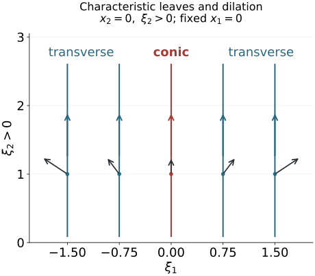

# Homogeneous submanifold normal forms

A submanifold of phase space can contain symplectic directions, directions on which its restricted form vanishes, and pairs of transverse normal directions. Constant rank makes these three blocks persist locally. Homogeneous coordinates can straighten them when the canonical one-form is nonzero on the submanifold. This gives characteristic foliations and the missing geometry behind sharp constant-rank FIO estimates.

We use the signs \(\omega=d\xi\wedge dx\), \(\iota_{H_f}\omega=-df\), and \(\{f,g\}=H_fg\) from [Phase space and generating families](../20261005-restored-phase-space/phase-space-and-generating-families.md). That lesson proves symplectic bases, reduction, Hamiltonian commutators and ordinary Darboux coordinates. [Corank geometry and sufficient continuity](../20261005-restored-corank-continuity/corank-geometry-and-sufficient-continuity.md) supplies homogeneous Darboux coordinates with a prescribed tangent map and the sharp flat operator family. [Graph operators, continuity and Egorov](../20261005-restored-graph-egorov/graph-operators-continuity-and-egorov.md) supplies the order-zero graph quantizations and microlocal inverses used in the final operator argument.

The primary sources are the reprints of the corrected second printings (1994): [Hörmander III, §21.2] and the constant-rank discussion in [Hörmander IV, §25.3]. We prove the full submanifold normal form with constant restricted rank and a nonzero restricted canonical one-form, its ordinary counterpart, and the characteristic-foliation consequences. The single canonical pair constructed below is a supporting case of [Hörmander III, Theorem 21.1.9]; extending arbitrary already prescribed canonical functions remains a separate target.

The [flow, bundle and leaf companion F0–F3](flows-constant-rank-and-leaves.md) supplies the complete supporting proofs: tangent fields preserve submanifolds, commuting fields have joint flow coordinates, dilation gives the stated pushforward weights, constant-rank kernels and quotients are smooth bundles, and local plaques assemble into unique maximal connected immersed leaves. The constant-rank coordinate argument is proved in [Prescribed phase representation F1](../20261004-free-intrinsic-graph/prerequisites/prescribed-phase-representation.md). The [proof map](proof-map.json) binds each result and exercise to its exact current earlier proofs.

## 1. Three linear blocks describe a subspace

Let \(E\) be a subspace of a symplectic vector space \((S,\omega)\) of dimension \(2N\). Write
\[
Z=E\cap E^\omega,\qquad \dim Z=k,\qquad
\operatorname{rank}(\omega|_E)=2\ell.
\tag{1.1}
\]
Then \(\dim E=k+2\ell\). The radical \(Z\) is isotropic. Since \((E+E^\omega)^\omega=Z\), the quotient
\[
\mathcal N_E=(E+E^\omega)/Z
\tag{1.2}
\]
is symplectic, with dimension \(2(N-k)\). Its two mutually orthogonal symplectic summands are \(E/Z\) and \(E^\omega/Z\), of dimensions \(2\ell\) and \(2(N-k-\ell)\).

Here is the explicit decomposition. Choose sections of the two quotient maps with images \(E_0\subset E\) and \(E_1\subset E^\omega\). Their restricted forms are nondegenerate, and they are orthogonal because \(E_1\subset E^\omega\). The orthogonal complement \(W=(E_0\oplus E_1)^\omega\) is symplectic of dimension \(2k\), contains \(Z\), and makes \(Z\) Lagrangian. Consequently
\[
S=W\oplus E_0\oplus E_1,
\qquad E=Z\oplus E_0.
\tag{1.3}
\]
Choose a Lagrangian basis of \(Z\) in \(W\) and complete it to symplectic pairs. Choose symplectic bases in the other two blocks. The corresponding coordinates give
\[
E=\{p_1=\cdots=p_k=0,\quad
q_{k+\ell+1}=\cdots=q_N=p_{k+\ell+1}=\cdots=p_N=0\}.
\tag{1.4}
\]
The free \(q_1,\ldots,q_k\) are the radical block; the next \(\ell\) free coordinate pairs are the symplectic block. There are \(N-k-\ell\) absent normal pairs.

In particular \(E\) is coisotropic exactly when \(k+\ell=N\). If it is not coisotropic, the restricted form on \(E^\omega\) has positive rank. For a local defining family \(f_i\) of a submanifold with tangent space \(E\), the Hamilton vectors \(H_{f_i}\) span \(E^\omega\). The identity
\[
\omega(H_{f_i},H_{f_j})=\{f_i,f_j\}
\tag{1.5}
\]
therefore shows that some pair of defining functions has a nonzero Poisson bracket at that point. If \(E\) is coisotropic, all these brackets vanish there.

This also proves the usual Lagrangian-containment test. An isotropic subspace extends to a Lagrangian by symplectic basis extension. If \(E\) is coisotropic, extend the isotropic \(E^\omega\) to a Lagrangian \(L\). Taking orthogonals gives \(L=L^\omega\subset(E^\omega)^\omega=E\). Conversely containment in, or containment of, a Lagrangian implies isotropy, or coisotropy, respectively by taking orthogonals.

## 2. Construct one homogeneous canonical pair by flows

Work in a conic symplectic neighborhood, a transverse slice times positive dilation rays. Its radial field \(R\) satisfies \(\mathcal L_R\omega=\omega\), and its canonical one-form is \(\lambda=\iota_R\omega\), with \(d\lambda=\omega\).

**Lemma 2.1 (a zero-valued momentum coordinate).** Suppose \(f\) is homogeneous of degree one, \(f(c)=0\), \(df(c)\neq0\), and \(R_c,H_f(c)\) are independent. There is a degree-zero function \(q\), with \(q(c)=0\), such that
\[
\{f,q\}=1.
\tag{2.1}
\]
The conic slice \(\Sigma=\{q=f=0\}\) is symplectic. Near the point there is a homogeneous symplectic product decomposition
\[
(S,\omega)\simeq(\Sigma,\omega_\Sigma)\times
(\mathbb R^2,dp\wedge dq),\qquad p=f.
\tag{2.2}
\]
The coordinate \(q\) has degree zero, \(p\) degree one, and dilation acts on \(\Sigma\) by its restricted action.

**Proof.** Homogeneity implies \([R,H_f]=0\). Indeed apply \(\mathcal L_R\) to \(\iota_{H_f}\omega=-df\):
\[
\iota_{[R,H_f]}\omega
=-d(Rf)+df=0.
\]
The two commuting independent real fields admit joint flow coordinates by companion F1, using the complete flow law and variational equation. Choose a codimension-two local slice transverse to their span at \(c\). Apply first the \(H_f\) flow with time \(b\), then the \(R\) flow with time \(a\). The differential of this map, in \((a,b,z)\), is invertible at \((0,0,c)\). Commutativity gives \(R=\partial_a\), \(H_f=\partial_b\) in the resulting coordinates. Set \(q=b\). It has \(Rq=0\), \(H_fq=1\), and value zero at \(c\); extend along rays to the smaller conic neighborhood. This proves (2.1).

The differentials \(df,dq\) are independent. Their Hamilton plane is symplectic since \(\omega(H_f,H_q)=\{f,q\}=1\), and the tangent to \(\Sigma\) is its orthogonal. Thus \(\omega_\Sigma\) is nondegenerate. Both \(q\) and \(f\) vanish on \(\Sigma\), so homogeneity makes \(R\) tangent there. It remains nonzero. The slice is a conic symplectic manifold.

The fields \(H_f,H_q\) commute, because their bracket is \(H_{\{f,q\}}=H_1=0\). For \(z\in\Sigma\) define
\[
\Psi(q,p,z)=\exp(qH_f)\exp(-pH_q)z.
\tag{2.3}
\]
Along \(H_f\), \(q\) increases at speed one and \(f\) is constant. Along \(H_q\), \(q\) is constant and \(f\) decreases at speed one, since \(\{q,f\}=-1\). Thus the parameters in (2.3) are exactly the values of \(q\) and \(p=f\). The inverse function theorem makes \(\Psi\) a local diffeomorphism.

Its parameter tangents are \(\partial_q=H_f\) and \(\partial_p=-H_q\), with \(\omega(\partial_p,\partial_q)=1\). They are orthogonal to the transported \(T\Sigma\), because its vectors annihilate \(dq,df\). Hamiltonian flows preserve the form on those transported vectors. Therefore
\[
\Psi^*\omega=\omega_\Sigma+dp\wedge dq.
\tag{2.4}
\]
Finally \([R,H_q]=-H_q\), by the same contraction calculation with \(Rq=0\). The pushforward computation in companion F1 has the sign needed here: the pullback satisfies the bracket ODE, and its inverse gives the pushforward weight. If \(M_t\) denotes dilation, its pushforward sends \(H_f\) to \(H_f\) and \(H_q\) to \(tH_q\). Hence
\[
M_t\Psi(q,p,z)=\Psi(q,tp,M_tz).
\]
This proves the homogeneous product statement. The flow maps and identities are first constructed near the normalized point and then extended equivariantly along rays; no completeness of either Hamiltonian field on the whole manifold is assumed. ∎

Apply the proved homogeneous Darboux theorem on \(\Sigma\) to obtain ordinary homogeneous canonical coordinates for its remaining pairs. Together with \(q,p\), these give homogeneous coordinates on \(S\) while retaining \(p=f\) exactly. This is a function-preserving construction for one zero-valued momentum; the hypothesis of independence from \(R\) is used in constructing \(q\).

We will also use the following elementary modification. If \(g(z)\) is degree zero on \(\Sigma\), extend it independently of \(q,p\). Then \(Q=q-g(z)\) has degree zero and
\[
\{p,Q\}=1.
\tag{2.5}
\]
Its zero slice with \(p=0\) has the same symplectic product construction, using the commuting fields \(H_p,H_Q\). This avoids treating a changed base coordinate as canonical without checking its bracket.

## 3. Straighten the entire constant-rank submanifold

**Theorem 3.1 (homogeneous submanifold normal form).** Let \(V\) be a smooth conic submanifold of a conic symplectic manifold of dimension \(2N\). Suppose \(\omega|_V\) has constant rank \(2\ell\) near \(c\), and \(\lambda_c|_{T_cV}\neq0\). Put \(k=\dim V-2\ell\). There are homogeneous symplectic coordinates in a conic neighborhood of \(c\) in which
\[
V=\{p_1=\cdots=p_k=0,\quad
q_{k+\ell+1}=\cdots=q_N=p_{k+\ell+1}=\cdots=p_N=0\}.
\tag{3.1}
\]
All assertions concern a sufficiently small submanifold germ. In particular \(\ell\geq1\), and at least one shared momentum \(p_{k+1},\ldots,p_{k+\ell}\) is nonzero at the marked point.

**Proof.** The linear decomposition gives \(k+\ell\leq N\). The radial field is tangent to \(V\), and \(\lambda(v)=\omega(R,v)\). If \(\ell=0\), the restricted form is zero and \(\lambda|_{TV}=0\), contrary to the hypothesis. Also \(R_c\) is outside the radical of \(\omega|_{T_cV}\). These conditions persist on a smaller neighborhood.

Choose a homogeneous degree-one defining family \(f_1,\ldots,f_r\), with independent differentials on \(V\), where \(r=2N-\dim V\). To obtain it, intersect \(V\) with a transverse radial slice, use local defining functions there, extend them to degree zero along rays, and multiply by a positive degree-one radial coordinate. On \(V\) their differentials still span the conormal bundle.

We induct on \(N\). The base with no remaining constraints is the homogeneous Darboux theorem. There are two reductions.

**Remove a symplectic normal pair when \(k+\ell<N\).** By the linear discussion, choose \(f_1,f_2\) with \(\{f_1,f_2\}(c)\neq0\). Since both vanish on \(V\), \(Rf_2(c)=0\). Thus \(H_{f_1}(c)\) cannot be proportional to \(R_c\). Lemma 2.1 gives product coordinates \((q,p,z)\) with \(p=f_1\).

On \(p=0\), the equation \(f_2=0\) can be solved for \(q\), because \(\partial_qf_2=\{f_1,f_2\}\neq0\). Write its solution as \(q=g(z)\). The zero set is dilation invariant, and dilation leaves \(q\) unchanged, so uniqueness makes \(g\) degree zero. Extend \(g\) independently of \(p,q\), and replace \(q\) by \(Q=q-g(z)\). Equation (2.5) holds, and both \(Q,p\) vanish on \(V\).

The symplectic slice \(\Sigma_* =\{Q=p=0\}\) contains \(V\). Its dimension is \(2(N-1)\). The restricted form on \(V\) still has rank \(2\ell\), and \(V\) still has dimension \(k+2\ell\). Its canonical one-form is the restriction of \(\lambda\), because the radial field is tangent to \(\Sigma_*\). Hence the induction hypothesis applies within this slice. Restore the absent pair \((Q,p)\) as the last normal pair. This gives (3.1) in the original dimension.

**Separate a characteristic direction when \(k+\ell=N\) and \(k>0\).** Here \(V\) is coisotropic. Choose a nonzero defining differential \(df_1(c)\). Since \(f_1\) vanishes on \(V\), \(H_{f_1}\in(TV)^\omega\subset TV\); it is a characteristic vector field. It cannot be proportional to \(R_c\), because \(R_c\) is outside that radical. Lemma 2.1 gives product coordinates with \(p=f_1\), \(H_{f_1}=\partial_q\), and \(V\subset\{p=0\}\).

Companion F0 proves that tangency of this smooth field makes its local flow preserve \(V\), by solving on \(V\) and applying ambient uniqueness. Thus
\[
V=\{(q,0,z):z\in V_0\}
\tag{3.2}
\]
locally, where \(V_0=V\cap\{q=p=0\}\) is a smooth conic submanifold of the symplectic slice. One can check smoothness directly: \(\partial_q\) is a nonzero tangent to \(V\), so its zero-time section is transverse and has dimension \(\dim V-1\). The form restricted to \(V\) has no \(q\) component when \(p=0\), so its rank on \(V_0\) is still \(2\ell\). Its radical dimension is \(k-1\).

The restricted canonical one-form is nonzero on \(TV_0\). At \(q=p=0\), the radial field lies in the slice and the product primitive is \(\lambda_\Sigma+p\,dq\); the form annihilates the removed \(\partial_q\) direction. Nonvanishing on \(TV\) must therefore come from \(TV_0\). Apply induction on the slice, then restore \(q\) as a free radical coordinate and \(p=0\) as its defining constraint. This gives (3.1).

The only remaining case is \(k=0\), \(\ell=N\), when \(V\) is open and homogeneous Darboux applies immediately. Each reduction lowers the ambient half dimension by one, so the induction terminates. Finally the canonical one-form in (3.1) restricts to \(\sum_{j=k+1}^{k+\ell}p_jdq_j\). Its nonzero value at the marked point requires a nonzero momentum in that shared block. ∎

**Theorem 3.2 (ordinary counterpart).** For any smooth submanifold of a symplectic manifold with constant restricted rank \(2\ell\), ordinary symplectic coordinates give (3.1), without a homogeneity or canonical-one-form hypothesis.

**Proof.** The same two reductions work with ordinary defining functions. A nonzero Hamiltonian field has a local flow coordinate \(q\) satisfying \(H_fq=1\), without requiring an additional radial field. The pair product (2.3)–(2.4) is still symplectic. In the first reduction solve \(q=g(z)\) and keep \(\{p,q-g\}=1\). In the coisotropic reduction, the flow preserves \(V\), giving the same cylindrical description. No radial properties are required of the reduced slice. Induct down to an open submanifold, using ordinary Darboux; the zero-dimensional final slice is allowed. Thus the argument also covers isotropic and Lagrangian submanifolds. ∎

The ordinary statement does not silently assert that its coordinates respect the given dilation action. Homogeneous isotropic straightening when the canonical one-form vanishes is a further result.

## 4. Characteristic leaves and their symplectic quotients

For a constant-rank restricted form define
\[
\mathcal Z_v=T_vV\cap(T_vV)^\omega.
\tag{4.1}
\]
It is a smooth rank-\(k\) vector bundle: in any smooth frame it is the kernel of a matrix of constant rank. Companion F2 proves this with an invertible minor and an explicit smooth kernel frame.

**Theorem 4.1 (characteristic foliation).** The bundle \(\mathcal Z\) is the tangent bundle of a local foliation of \(V\) by isotropic leaves of dimension \(k\). Under Theorem 3.1 these leaves are transverse to the radial field. For an arbitrary conic \(V\) of constant restricted rank, each maximal connected characteristic leaf is either everywhere transverse to the radial field or is dilation invariant.

**Proof.** In the coordinates of Theorem 3.2, the free \(q_1,\ldots,q_k\) directions are exactly the radical. Their coordinate slices form a foliation. Companion F3 proves that these local plaques assemble into unique maximal connected immersed leaves, including the Hausdorff and countable-atlas properties of each leaf. On chart overlaps their transverse coordinates have zero derivative along plaques, so the fundamental theorem of calculus makes their local leaf components agree. The leaves are intrinsic; they need not be embedded in the ambient subspace topology. The restricted form vanishes on their tangent spaces, giving isotropy and dimension \(k\).

Under Theorem 3.1, \(\lambda|_{TV}\neq0\) means \(R\notin\mathcal Z\) at every point in the smaller working neighborhood. This gives radial transversality there.

For general conic \(V\), dilation preserves \(\mathcal Z\), since it scales the form by a positive scalar. It consequently takes maximal connected leaves to maximal connected leaves. If \(R_v\in\mathcal Z_v\) at one point \(v\) of a leaf \(B\), then along its whole positive ray,
\[
R_{M_tv}=dM_t(R_v)\in\mathcal Z_{M_tv}.
\]
The ray is a curve tangent to the foliation, hence stays in \(B\). The leaf \(M_tB\) intersects \(B\) at \(M_tv\), so their maximality makes them equal. Thus \(B\) is dilation invariant, and \(R\) is tangent everywhere on it. If no point of \(B\) has this tangency, the radial field is everywhere transverse to it. ∎

There is a local symplectic leaf space. In a foliation chart the form \(\omega|_V\) annihilates the leaf directions and is invariant under their fields: for a leaf field \(Z\),
\[
\mathcal L_Z(\omega|_V)=d\iota_Z(\omega|_V)+\iota_Zd(\omega|_V)=0.
\]
Its coefficients therefore depend only on transverse variables. It descends to a closed nondegenerate form on the local quotient by the leaves, of dimension \(2\ell\). This statement does not require a global Hausdorff quotient.

**Proposition 4.2 (the symplectic quotient bundle).** The fibers
\[
\mathcal N_{V,v}=
\frac{T_vV+(T_vV)^\omega}{\mathcal Z_v}
\tag{4.2}
\]
form a smooth symplectic vector bundle of rank \(2(N-k)\). It splits orthogonally into \(TV/\mathcal Z\) and \((TV)^\omega/\mathcal Z\), of ranks \(2\ell\) and \(2(N-k-\ell)\). On a characteristic leaf \(B\), it is the symplectic normal bundle \((TB)^\omega/TB\).

**Proof.** Companion F2 proves that constant rank makes \(\mathcal Z\), \(TV+(TV)^\omega\), and their quotient smooth bundles, and that the descended fiber forms are smooth in quotient frames. Their fiber forms descend with radical exactly \(\mathcal Z\), by (1.2). The two quotient subbundles and their ranks are those of the linear decomposition, and their intersection is zero. On a leaf, \(TB=\mathcal Z\) and
\[
TV+(TV)^\omega=\mathcal Z^\omega
\]
by taking orthogonals and comparing dimensions. Formula (4.2) then equals \((TB)^\omega/TB\), with the same form, as claimed. ∎

For a coisotropic submanifold, the characteristic distribution is \((TV)^\omega\). Hamilton fields of defining functions span it. Its quotient \(TV/(TV)^\omega\) is the tangent symplectic space of the local reduced manifold. For an isotropic submanifold the characteristic bundle is all of \(TV\); the quotient bundle is its usual symplectic normal bundle.

## 5. An exact coisotropic model checks the flow construction

On \(T^*\mathbb R^2\), near \(\xi_1>0\), set
\[
f=\xi_2-x_2\xi_1,\qquad V=\{f=0\}.
\tag{5.1}
\]
Every smooth hypersurface in a symplectic manifold is coisotropic: its one-dimensional orthogonal is spanned by the Hamilton field of a defining function, which lies in the tangent because it differentiates that function to zero. Here
\[
H_f=-x_2\partial_{x_1}+\partial_{x_2}+\xi_1\partial_{\xi_2},
\qquad \{f,x_2\}=1.
\]
The complete homogeneous canonical coordinates are
\[
Q_1=x_1+x_2^2/2,\qquad Q_2=x_2,\qquad
P_1=\xi_1,\qquad P_2=\xi_2-x_2\xi_1.
\tag{5.2}
\]
Directly,
\[
P_1dQ_1+P_2dQ_2=\xi_1dx_1+\xi_2dx_2.
\tag{5.3}
\]
Thus the map preserves both the one-form and the symplectic form. It sends \(V\) to \(P_2=0\). Its characteristic curves have fixed \((Q_1,P_1)\) and varying \(Q_2\). They are transverse to dilation because \(P_1>0\), while the reduced symplectic form is \(dP_1\wedge dQ_1\).

This computes an actual coordinate map rather than specifying its differential alone. It verifies \(H_f=\partial_{Q_2}\), the unchanged defining momentum \(P_2=f\), and the signs in the product construction.

## 6. Constant-rank canonical relations have the sharp corank threshold

Let \(C\) be a conic canonical relation with the full punctured-cotangent closure convention and neither individual lifted radial vector tangent. Suppose its common two-form \(\sigma_C\) has constant rank \(2n\) in the working germ. Write \(n_1=\dim X\), \(n_2=\dim Y\), \(a=n_1-n\), \(b=n_2-n\), and \(k=a+b\).

**Proposition 6.1 (flatten the constant-rank relation).** Separate homogeneous canonical changes on the two sides take the working relation to
\[
C_{\mathrm{flat}}=
\{(x',x'',\eta',0;y'=x',y'',\eta',0):\eta'\neq0\},
\tag{6.1}
\]
with \(n\) shared variables and \(a,b\) free kernel variables.

**Proof.** The pointwise identities of the linear relation lemma give projection ranks \(n_1+n\), \(n_2+n\), both constant. The constant-rank coordinate proof in prescribed-phase F1 therefore supplies smooth local projection images \(\Sigma_1,\Sigma_2\). Its proof applies to any smooth map of constant rank: choose independent output coordinates, complete them to input coordinates by the inverse theorem, and use zero transverse derivatives for the remaining outputs. In a rank chart, a map of rank \(r\) has image a coordinate \(r\)-plane; shrinking the domain gives the embedded image germ and surjective tangent map. Dilation preserves these image germs, and their tangent spaces equal the pointwise projection images \(K_j^\omega\). Choose a smaller image branch on a transverse radial slice and saturate it by positive dilation. This gives the conic embedded germ in use; no globally embedded projection image is asserted.

Each image is coisotropic, since \((K_j^\omega)^\omega=K_j\subset K_j^\omega\). The radial exclusion says that its canonical one-form is nonzero on its tangent space, as proved in the corank lesson. Theorem 3.1 makes the two images respectively \(\xi''=0\) and \(\eta''=0\), after reordering the shared pairs to the first \(n\) positions. The kernel spaces are now exactly the individual horizontal \(x''\) and \(y''\) directions.

These individual coordinate vector fields are tangent to \(C\) at every point, so companion F0 makes their local translation flows preserve it. Consequently \(C\) is locally independent of \(x'',y''\) and is the product of these free variables with a reduced relation \(D\) in the shared cotangent variables. The reduced relation has dimension \(2n\), is Lagrangian for the difference of the shared forms, and has locally bijective projections: the only original projection kernels were precisely the removed free directions. It is therefore a homogeneous canonical graph \(\chi\) between the shared \(n\)-dimensional cotangent cones.

Apply \(\chi\) as a canonical change to the input shared variables and leave its remaining \((y'',\eta'')\) pairs fixed. This product map is symplectic and homogeneous on a cone where the shared covector is nonzero. In the resulting input coordinates the graph becomes the identity. This gives (6.1). ∎

**Theorem 6.2 (sharp constant-rank order).** On this germ, every compactly localized ordinary scalar half-density operator in \(I^m(C')\) is \(L^2\) bounded if and only if
\[
m\leq-k/4.
\tag{6.2}
\]
The same sharp assertion holds for bundles whose two ranks are positive at the working point. It is a statement about **every** operator in the class, not a claim that every individual operator above the threshold is unbounded.

**Proof.** Sufficiency is the corank-continuity theorem. For necessity, flatten the germ by Proposition 6.1. In flat coordinates the proved tensor model of the corank lesson has partial amplitude order \(\mu=m+k/4\). If \(\mu>0\), choose compact nonzero base factors and an angular multiplier equal to \(\langle\eta'\rangle^\mu\) near a shared direction. Its fixed-norm modulated inputs have output norms growing like \(R^\mu\). Add input and output base cutoffs equal to one on the tested supports. This makes the kernel support compact and preserves that lower bound.

More explicitly, use the compact modulated input \(v(y')w(y'')e^{iR\omega\cdot y'}\) from the corank model. An input cutoff equal to one on its fixed support changes none of these inputs. After demodulation and division by \(R^\mu\), the output converges in \(L^2\) to the model's nonzero compactly supported product \(q(x')v(x')h(x'')\), times its nonzero averaging constant. Choose the output cutoff equal to one on that product's support. Multiplication by this bounded cutoff preserves the convergence and its nonzero limit. All base factors can be chosen inside arbitrarily small interior coordinate sets, and the angular multiplier can equal one near the chosen shared ray while being supported in the required smaller cone.

 The angular cutoff confines its wavefront to the small working graph cone, so it gives a localized unbounded operator \(\widetilde A\in I^m(C_{\mathrm{flat}}')\).

Quantize the two full homogeneous canonical changes by proper elliptic order-zero graph operators \(U_X,U_Y\), from the original charts to the flat charts, with microlocal inverses \(V_X,V_Y\). Set
\[
A=V_X\widetilde A U_Y.
\tag{6.3}
\]
The graph-factor composition theorem gives order \(m\) and the original relation \(C\). Choose interior base and conic supports so that
\[
U_X A V_Y=\widetilde A+S,
\tag{6.4}
\]
where \(S\) has a smooth localized kernel. This follows from the two microlocal inverse identities and the wavefront composition theorem on the working cones. Proper supports keep common compact sets for all these operators. In particular the compact kernel support of \(\widetilde A\) and properness of each graph factor make the kernel support of \(V_X\widetilde A U_Y\) compact: over the two compact intermediate projections, properness gives compact sets of exterior base points. Local smooth inverse errors on these supports have bounded kernels. Additional interior cutoffs may be taken equal to one on those compact sets.

If every localized original \(I^m(C')\) operator were bounded, \(A\) would be bounded. Both graph factors in (6.4) are locally bounded, and \(S\) is bounded on the fixed compact supports. Thus \(\widetilde A\) would be bounded, contradicting the actual modulated family. This forces \(\mu\leq0\), hence (6.2). Extension by zero from interior coordinate products realizes the same local counterexample on the original manifolds.

For positive-rank bundles, place the scalar construction in one input/output frame component. Smooth compact metric equivalence and the elliptic frame identifications retain its lower bound. A zero-rank bundle has no such nonzero component, which is why the necessity statement explicitly excludes that trivial case. ∎

When rank changes, the projection images need not be submanifolds of a fixed dimension, and Proposition 6.1 does not apply. The weaker universal necessary corank bound requires the cubic scaling of the partial phase. Its quantifier over every operator and its different constant remain essential.

## 7. Exercises with complete solutions

**Exercise 7.1 (three blocks; introductory).** In ambient dimension ten, a subspace has dimension six and restricted-form rank four. Find \(k,\ell\), the three block dimensions, the rank of the form on its orthogonal, and the quotient dimension in (1.2). Is it coisotropic?

**Solution.** Here \(N=5\), \(\ell=2\), \(k=6-4=2\). The blocks \(W,E_0,E_1\) have dimensions \(4,4,2\), respectively. Its orthogonal has dimension four, radical dimension two, and restricted-form rank two. The quotient \(\mathcal N_E\) has dimension \(2(N-k)=6\), splitting as four plus two. Since \(k+\ell=4<5\), the subspace is not coisotropic; it has one absent symplectic normal pair.

**Exercise 7.2 (test the one-form hypothesis; intermediate).** Take the nonzero cotangent fiber \(V=\{x=0,\xi\neq0\}\subset T^*\mathbb R^N\). Compute its restricted two-form, canonical one-form, characteristic distribution and radial behavior. Explain which normal-form theorem applies directly.

**Solution.** Tangents are purely vertical, so \(\omega|_V=0\) and \(\lambda|_{TV}=\xi\,dx|_{TV}=0\). Hence \(k=N\), \(\ell=0\), and the characteristic distribution is all of \(TV\). The radial field \(\sum\xi_j\partial_{\xi_j}\) is tangent to these leaves. Theorem 3.1 does not apply because its one-form hypothesis fails. The ordinary Theorem 3.2 applies and the general characteristic-foliation theorem describes dilation-invariant leaves. A homogeneous isotropic normal form requires its own proof; one cannot use a theorem assuming nonzero restricted one-form for this fiber.

**Exercise 7.3 (retain a defining function exactly; intermediate).** For (5.1), compute \(H_f\), check the pair bracket with \(q=x_2\), and verify all four coordinate brackets in (5.2).

**Solution.** The coordinate formula gives \(H_f=-x_2\partial_{x_1}+\partial_{x_2}+\xi_1\partial_{\xi_2}\), so \(\{f,x_2\}=1\). The pair brackets are \(\{P_1,Q_1\}=1\), \(\{P_2,Q_2\}=1\). All cross brackets vanish: \(\{P_1,Q_2\}=0\), \(\{P_2,Q_1\}=H_f(x_1+x_2^2/2)=-x_2+x_2=0\), and \(\{P_1,P_2\}=\{Q_1,Q_2\}=0\). Thus the map is symplectic. Its base variables have degree zero and its momenta degree one, and \(P_2=f\) as an actual function, not just as a first-order approximation.

**Exercise 7.4 (see both induction reductions; advanced).** In \(T^*\mathbb R^3\), near \(p_2>0\), let
\[
V=\{p_1=0,\quad q_3=p_3=0\}.
\]
Give homogeneous degree-one defining functions, identify a nonzero defining bracket, and describe the normal-pair and characteristic reductions.

**Solution.** Choose \(f_1=p_3\), \(f_2=q_3p_2\), \(f_3=p_1\). Their differentials are independent on \(V\), because \(p_2>0\), and they define it there. The bracket \(\{f_1,f_2\}=p_2\) is nonzero. The first reduction keeps the canonical pair \((q_3,p_3)\) and restricts to its zero symplectic slice. There \(V\) is the coisotropic hypersurface \(p_1=0\) in \(T^*\mathbb R^2\). Its characteristic field is \(H_{p_1}=\partial_{q_1}\); separating that free coordinate leaves the open shared pair \((q_2,p_2)\). The original restricted rank is two, radical dimension one, and canonical one-form \(p_2dq_2\) is nonzero. Thus the two reductions preserve the exact dimension/rank data required by the theorem.

**Exercise 7.5 (characteristic generators need not commute; advanced).** On \(V=\{p_2=p_3=0\}\subset T^*\mathbb R^3\), near \(p_1>0\), take defining functions \(f=p_2\), \(g=(1+q_2^2)p_3\). Compute their Hamilton fields on \(V\), their commutator there and the characteristic leaves.

**Solution.** On \(V\), \(H_f=\partial_{q_2}\) and \(H_g=(1+q_2^2)\partial_{q_3}\); the additional frequency term \(-2q_2p_3\partial_{p_2}\) vanishes there. Their commutator is \(2q_2\partial_{q_3}\), usually nonzero, but still in the characteristic distribution. Equivalently \(\{f,g\}=2q_2p_3\) vanishes on \(V\), and its Hamilton field there gives the same commutator. Leaves have fixed \((q_1,p_1)\) and free \((q_2,q_3)\). The chosen defining fields span the leaves but do not commute; the commuting coordinate fields arise after choosing canonical normal-form constraints.

**Exercise 7.6 (quotient bundle along a leaf; intermediate).** For the dimensions in Exercise 7.1, compute the rank of \(\mathcal N_V\), its two summands and its restriction to a characteristic leaf. Explain why quotienting the whole tangent space of the ambient manifold by \(TV\) would be a different construction.

**Solution.** The bundle has rank six, with symplectic summands of ranks four and two. A characteristic leaf has tangent dimension \(k=2\); its symplectic normal bundle has rank \(2(N-k)=6\), agreeing with the restriction in Proposition 4.2. The ambient quotient \(TS/TV\) has rank \(10-6=4\). The form does not generally descend to that quotient, because \(TV\) is not the radical of the ambient form. Formula (4.2) first restricts to \(TV+(TV)^\omega\) and only then quotients its radical \(\mathcal Z\).

**Exercise 7.7 (a translated quotient graph; intermediate).** In two dimensions on each side, let
\[
C=\{(x_1,x_2;\eta,0;
y_1=x_1-a,y_2;\eta,0):\eta\neq0\}.
\]
Find the corank, the canonical input change that flattens the relation, and the exact lifting/averaging operator with kernel \(h(x_2)\ell(y_2)\delta(x_1-y_1-a)\). Give its critical FIO order and norm.

**Solution.** There is one shared cotangent pair and one kernel variable on each side, so \(k=2\). The reduced graph takes \((y_1,\eta)\) to \((y_1+a,\eta)\). The homogeneous canonical input change \(\widetilde y_1=y_1+a\), \(\widetilde\eta=\eta\), leaving \(y_2,\eta_2\) fixed, makes the shared graph identity. The operator is
\[
Au(x_1,x_2)=h(x_2)\int\ell(y_2)u(x_1-a,y_2)\,dy_2.
\]
Its partial amplitude has order zero, giving FIO order \(-k/4=-1/2\); the normalized amplitude includes \((2\pi)^{1/2}\) to produce this exact delta kernel. Translation is unitary and the averaging functional has norm \(\|\ell\|_2\), so the operator norm is \(\|h\|_2\|\ell\|_2\). Equality follows by taking the \(y_2\) factor proportional to \(\overline\ell\). The positive-corank threshold is attained by an actual bounded operator.

**Exercise 7.8 (the quantifier in sharpness; introductory).** If \(m>-k/4\), can a nonzero smooth compact kernel still define a bounded operator in \(I^m(C')\)? Explain why that does not contradict Theorem 6.2.

**Solution.** A smooth compact kernel is smoothing, has empty wavefront set and belongs to the zero-symbol part of every FIO order class associated with \(C'\). It is Hilbert–Schmidt and therefore bounded, even for that declared order \(m\). The theorem states that **every** localized operator of order \(m\) is bounded exactly below the threshold. Above it the constructed positive-order flat multiplier supplies an unbounded member. It does not assert unboundedness of each member, and a bounded smoothing member does not establish a necessary geometric inequality for the whole class.

**Exercise 7.9 (one foliation, two radial behaviors; advanced).** On the conic hypersurface \(V=\{x_2=0,\xi_2>0\}\subset T^*\mathbb R^2\), compute the characteristic leaves. Decide which are dilation invariant and which are transverse to the radial field. Check where the homogeneous one-form hypothesis holds.

**Solution.** The restricted form is \(d\xi_1\wedge dx_1\), of constant rank two. Its radical is \(\mathbb R\partial_{\xi_2}\). Leaves have fixed \((x_1,\xi_1)\) and vary over \(\xi_2>0\). The radial vector is \(\xi_1\partial_{\xi_1}+\xi_2\partial_{\xi_2}\). If \(\xi_1=0\), it is tangent to the leaf, and dilation preserves that leaf. If \(\xi_1\neq0\), it has a nonzero transverse component and is everywhere transverse on the leaf. The canonical one-form restricted to \(TV\) is \(\xi_1dx_1\), so Theorem 3.1 applies exactly on the \(\xi_1\neq0\) region; Theorem 4.1 covers both kinds of leaves. For the degree-one defining function \(f=x_2\xi_2\), the field on \(V\) is \(-\xi_2\partial_{\xi_2}\). Where \(\xi_1=0\) it is proportional to the radial field, showing directly why Lemma 2.1's independent-field hypothesis cannot be dropped.

**Figure 7.1.** An actual two-dimensional coordinate slice \(x_1=0\) of the three-dimensional hypersurface in Exercise 7.9. Vertical colored arrows point along \(\partial_{\xi_2}\); black arrows are positive multiples of \(R=(\xi_1,\xi_2)\). Dilation preserves the central leaf \(\xi_1=0\) and crosses every other leaf. The local leaf map is \((x_1,\xi_1,\xi_2)\mapsto(x_1,\xi_1)\), with reduced form \(d\xi_1\wedge dx_1\). The figure depicts the exact example underlying Theorem 4.1, with no identification of this slice with the full ambient manifold.

## References

- [Hörmander III, §21.2] Lars Hörmander, *The Analysis of Linear Partial Differential Operators III: Pseudo-Differential Operators*, reprint of the corrected second printing (1994), Springer, Proposition 21.2.1, Proposition 21.2.3, Theorem 21.2.4, Theorems 21.2.6–21.2.7 and the following symplectic-bundle discussion. The single canonical-pair construction also uses the context of Theorem 21.1.9.
- [Hörmander IV, §25.3] Lars Hörmander, *The Analysis of Linear Partial Differential Operators IV: Fourier Integral Operators*, Springer, reprint of the corrected second printing (1994), constant-rank sharpness discussion following Theorem 25.3.8.

*Written by GPT-6.1 Sol (OpenAI), Ultra, September 2026. Restoration and exact programme prerequisite review: GPT-6 Astra (OpenAI), Ultra, 5 October 2026. Original text and coordinate figure: public domain (CC0).*
