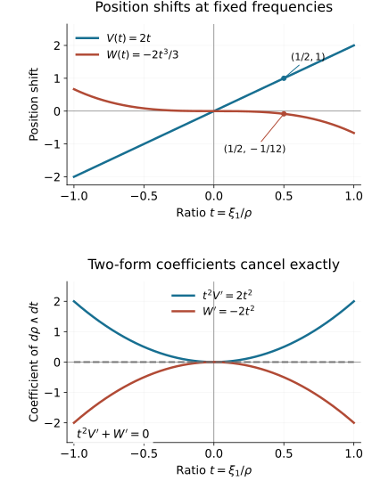

# Two reflections in folded symplectic coordinates

A pair of sheet exchanges determines more than a pair of reflection lines. When both exchanges preserve the same folded two-form, their shared tangential direction is the characteristic line of that form. We use this fact to construct canonical spectator coordinates, isolate the remaining two-dimensional change, and normalize it by an actual smooth inverse of a cubic integral. The homogeneous version also changes the last position coordinate; its cubic correction is forced by preservation of the two-form.

The primary source is the reprint of Hörmander III, corrected second printing (1994), Theorems 21.4.4 and 21.4.10, printed pages 307–309 and 316–318, PDF pages 322–324 and 331–333 in this exact edition. We supply the commuting-flow details for the spectator construction and a separate construction of the last two homogeneous positions. [Folded forms and symplectic target coordinates](../20261005-restored-folded-forms/folded-forms-and-symplectic-targets.md) proves the folded Darboux theorem and its single-involution version. [Simultaneous reflections and flat corrections](../20261005-restored-simultaneous-reflections/simultaneous-reflections-and-flat-corrections.md) proves full simultaneous smooth and homogeneous coordinates for the two involutions, including the flat correction.

Our convention is \(\iota_{H_a}\sigma=-da\), \(\{a,b\}=H_ab\). Hamiltonian fields are initially defined off the critical hypersurface, where \(\sigma\) is nondegenerate. Whenever we use a field on that hypersurface, we prove its smooth extension. All maps and flows are local germs, with neighborhoods shrunk for the finitely many required compositions.

The [proof map](proof-map.json) gives exact current proof dependencies for every construction and solution. The earlier [flow and bundle companion F0–F2](../20261005-restored-submanifolds/flows-constant-rank-and-leaves.md) proves the smooth transverse and commuting-flow charts used here. The differential-form companion F0–F2 and [phase-space lesson](../20261005-restored-phase-space/phase-space-and-generating-families.md) supply Cartan's formula, flow pullbacks and Hamiltonian commutator identities. The [smooth-descent lesson](../20261005-restored-smooth-descent/folds-reflections-and-uniform-descent.md) supplies division with all smooth parameters. These existing proofs are reused directly.

## 1. The two reflection lines identify the characteristic line

Let \(M\) have dimension \(2n\), and let \(\sigma\) be a closed two-form. Near \(c\), assume
\[
 \sigma^n=m\mu,\qquad m(c)=0,\quad dm(c)\ne0,\qquad
 (\sigma^{n-1})|_{T_c\Gamma}\ne0,\qquad \Gamma=\{m=0\},
 \tag{1.1}
\]
with \(\mu\) nowhere zero. Shrink so that the restricted rank condition holds along \(\Gamma\). The preceding folded-form lesson proves
\[
 E=\ker\sigma|_\Gamma,\quad \dim E=2,\qquad
 K=\ker\sigma_\Gamma,\quad \dim K=1,\qquad
 E\cap T\Gamma=K.
 \tag{1.2}
\]
For \(n=1\), the restricted exterior-power condition is automatic.

Let \(f,g\) be smooth involutions, both with local fixed set \(\Gamma\), such that
\[
 f^*\sigma=\sigma,\qquad g^*\sigma=\sigma,\qquad
 L_f(c)\ne L_g(c).
 \tag{1.3}
\]
Here \(L_f,L_g\) are their minus-one eigenlines along \(\Gamma\). Each is transverse to \(\Gamma\). If \(v\in L_f\), invariance gives \(\sigma(v,w)=0\) for every \(w\in T\Gamma\); the same follows for every ambient \(w\), since \(v\) and \(T\Gamma\) span the tangent space. Thus \(L_f\subset E\), and similarly \(L_g\subset E\). Distinctness persists locally, and consequently
\[
 E=L_f+L_g,\qquad (L_f+L_g)\cap T\Gamma=K.
 \tag{1.4}
\]

If \(a\) is invariant under both involutions, \(da\) annihilates both reflection lines on \(\Gamma\). It therefore annihilates \(K\). This gives a useful differential restriction on common invariant functions before any canonical coordinate is constructed.

The full simultaneous coordinate theorem gives another chart
\[
 f(t,z,r)=(t,z,-r),\qquad g(t,z,r)=(t+r,z,-r).
 \tag{1.5}
\]
On \(\Gamma\), the \(t\) direction is the intersection in (1.4), hence is \(K\). We will use \(z\) to extend characteristic-constant functions as common invariants.

## 2. Smooth Hamiltonian fields and their commuting-flow sections

First use the single-involution folded Darboux theorem to choose ordinary coordinates \((x,s,\xi')\), centered at \(c\), with
\[
 \sigma=s\,ds\wedge dx_1+\sum_{j=2}^n d\xi_j\wedge dx_j,
 \qquad f(x,s,\xi')=(x,-s,\xi').
 \tag{2.1}
\]
Thus \(K=\mathbb R\partial_{x_1}\) on \(\Gamma=\{s=0\}\).

For \(s\ne0\),
\[
 H_a=\frac1s(a_s\partial_{x_1}-a_{x_1}\partial_s)
       +\sum_{j=2}^n(a_{\xi_j}\partial_{x_j}
                                      -a_{x_j}\partial_{\xi_j}).
 \tag{2.2}
\]
If \(a\) is even in \(s\) and \(a_{x_1}|_{s=0}=0\), then
\[
 a_s=s\,a_{ss}|_{s=0}+O(s^3),\qquad a_{x_1}=O(s^2).
\]
Division in (2.2) is smooth, and the normal component vanishes on \(\Gamma\). For the full parameter statement, Taylor's integral identity gives \(a_s(y,s)/s=\int_0^1 a_{ss}(y,vs)\,dv\). Evenness gives \(\partial_s a_{x_1}(y,0)=0\), so \(a_{x_1}(y,s)/s=s\int_0^1(1-v)a_{x_1ss}(y,vs)\,dv\). The hypotheses remove the two constant terms. Both integrals are smooth with every derivative in \(y,s\), by the compact-parameter differentiation proof already available. Thus the extension is smooth, rather than merely bounded. In particular \(H_a\) is tangent to \(\Gamma\), and there
\[
 H_a=a_{ss}|_\Gamma\,\partial_{x_1}
       +\sum_{j=2}^n(a_{\xi_j}\partial_{x_j}
                                      -a_{x_j}\partial_{\xi_j})|_\Gamma.
 \tag{2.3}
\]
Every common invariant function satisfies these conditions: it is \(f\)-even and its restriction is characteristic-constant by Section 1. Its smooth Hamiltonian field is invariant under \(f,g\), since this is true off \(\Gamma\) by the contraction equation and then everywhere by continuity.

We will repeatedly solve equations along commuting fields. Suppose \(A_1,\ldots,A_k\) are commuting smooth fields, independent at the marked point, and a section \(N\) of codimension \(k\) is transverse to their span. The actual map
\[
 (u,z)\longmapsto
 \exp(u_1A_1)\cdots\exp(u_kA_k)z,\qquad z\in N,
 \tag{2.4}
\]
is a local diffeomorphism. Commutativity makes the order immaterial. A function constant along all fields is uniquely determined by its data on \(N\); equations \(A_i a=b_i\) with constant compatible right-hand sides are solved by adding \(\sum_i b_i u_i\). This proves the local existence and uniqueness we use, rather than assuming a simultaneous differential system has a solution.

If an involution preserves the field distribution, the section, the initial data and the differential equations with their right-hand sides, uniqueness proves invariance. Preservation of the distribution alone would not suffice for a nonzero right-hand side. Antisymmetric data give an antisymmetric solution when the equations transform accordingly. The same argument controls degrees under dilation: apply a dilation to the function, divide by its prescribed degree factor, and check the identical equations and initial data. A distribution may be preserved even when its individual fields have different weights. More explicitly, if \([R,A_i]=w_iA_i\), then \(D_{\kappa*}A_i=\kappa^{-w_i}A_i\). For a proposed degree-\(\delta\) solution \(a\), its transformed function \(a_\kappa=\kappa^{-\delta}a\circ D_\kappa\) satisfies \(A_i a_\kappa=\kappa^{-\delta-w_i}(A_i a)\circ D_\kappa\). Hence the equation is preserved when its right-hand side has degree \(\delta+w_i\), or is zero. Together with the homogeneous initial data this proves the stated degree by uniqueness. The commuting-flow and pushforward identities used here are proved in companion F1.

For a smooth canonical pair \(p,q\) with \(\{p,q\}=1\), the fields \(H_p,H_q\) commute, are tangent to \(\Gamma\) in our applications, and span a symplectic plane even on \(\Gamma\):
\[
 \sigma(H_p,H_q)=-dp(H_q)=1.
 \tag{2.5}
\]
The section \(p=q=0\) is transverse to that plane. Its tangent is the \(\sigma\)-orthogonal of the plane. The map
\[
 (q,p,z)\longmapsto \exp(qH_p)\exp(-pH_q)z
 \tag{2.6}
\]
therefore splits the full form as \(dp\wedge dq\) plus its restriction to the section. Indeed the two flow derivatives are \(H_p,-H_q\), their mixed pairing is \(-1\) in that order, their pairings with section tangents vanish, and the flows preserve \(\sigma\). This argument needs no inverse of \(\sigma\) on \(\Gamma\).

The contractions \(\iota_{H_p}\sigma=-dp\) and \(\iota_{H_q}\sigma=-dq\) extend to the fold by continuity. Cartan's formula therefore proves that their actual smooth flows preserve \(\sigma\) everywhere. Their commutator is zero off the fold by the Hamiltonian identity, and zero on it by smoothness. A field tangent to \(\Gamma\) preserves \(\Gamma\) under its local flow: its restriction solves the same smooth initial-value problem and uniqueness applies.

For several canonical pairs, the corresponding fields all commute. Their common zero section and the product version of (2.6) give the same splitting. All these assertions follow on the full neighborhood, not just off the fold.

## 3. Construct all ordinary spectator pairs

The restrictions of \(x_j,\xi_j\), \(j\ge2\), to \(\Gamma\) are constant along \(K\). In (1.5), they are functions of \(z\) alone on \(r=0\). Extend those functions independently of \(t,r\), and call the resulting functions \(X_j,P_j\). They are common invariants and satisfy
\[
 X_j|_\Gamma=x_j,\qquad P_j|_\Gamma=\xi_j.
 \tag{3.1}
\]
Their full differentials agree with those of the old coordinates on \(\Gamma\): tangential agreement follows from (3.1), and both have zero normal derivative because they are \(f\)-even.

We construct \(p_2,q_2,\ldots,p_n,q_n\) in that order. Suppose the earlier pairs have been constructed, are common invariants, satisfy all canonical bracket relations, and agree with \(\xi_i,x_i\) on \(\Gamma\). Let
\[
 N_{j-1}=\{p_2=q_2=\cdots=p_{j-1}=q_{j-1}=0\}.
\]
For \(j=2\), this is the full neighborhood. Define \(p_j\) by extending \(P_j|_{N_{j-1}}\) constantly along the earlier Hamiltonian flows. Formula (2.4) and the canonical splitting prove existence, smoothness and
\[
 \{p_i,p_j\}=\{q_i,p_j\}=0,\qquad i<j.
 \tag{3.2}
\]
The section and seed are common invariants, so is \(p_j\).

On \(\Gamma\), each earlier field changes its own old spectator coordinate and possibly \(x_1\), but leaves \(x_j,\xi_j\) unchanged when \(j>i\). This follows from (2.3) and the induction hypothesis. Hence propagation retains \(p_j|_\Gamma=\xi_j\). It also gives
\[
 H_{p_j}|_\Gamma=\partial_{x_j}
                              +C_j\partial_{x_1}.
 \tag{3.3}
\]
The field is smooth, tangent to \(\Gamma\), and tangent to \(N_{j-1}\) by (3.2).

On that section, solve
\[
 H_{p_j}q_j=1,\qquad q_j=0\quad\hbox{on }X_j=0.
 \tag{3.4}
\]
The initial hypersurface is transverse: at \(\Gamma\), \(H_{p_j}X_j=1\). Extend the solution constantly along the earlier fields. Commutativity makes the equations compatible. Its equation and initial hypersurface are invariant under both involutions, so \(q_j\) is a common invariant. For the extension off \(N_{j-1}\), \(H_{p_j}\) commutes with every earlier field by (3.2), is tangent to the section, and its equation has the constant right-hand side one. Consequently the product flow transports that equation to the full neighborhood. The earlier zero equations and the new equation therefore hold together; no unsolved simultaneous differential system is being assumed.

On \(\Gamma\cap N_{j-1}\), the old function \(x_j\) solves (3.4), by (3.3), with the same data. Uniqueness and subsequent propagation show \(q_j|_\Gamma=x_j\). Thus
\[
 \{p_j,q_j\}=1,\qquad
 H_{q_j}|_\Gamma=-\partial_{\xi_j}+D_j\partial_{x_1}.
 \tag{3.5}
\]
The new field is again smooth and tangent to \(\Gamma\), and its canonical plane is transverse to the new zero section. This proves the induction, including all cross brackets, all symmetries and the full section transversality. In particular the resulting \(2n-2\) spectator functions are independent.

## 4. Complete the ordinary theorem and normalize the remaining shift

**Theorem 4.1 (ordinary simultaneous folded form).** Under (1.1)–(1.3), there are coordinates \((q,p)\), centered at \(c\), in which
\[
 \sigma=p_1\,dp_1\wedge dq_1+\sum_{j=2}^n dp_j\wedge dq_j,
 \tag{4.1}
\]
\[
 f(q,p)=(q,-p_1,p'),\qquad
 g(q,p)=(q_1+p_1,q',-p_1,p').
 \tag{4.2}
\]

**Proof.** Let \(N=\{p_2=q_2=\cdots=p_n=q_n=0\}\). In (1.5), the normal function \(r\) is odd under both involutions, with nonzero normal differential. Extend \(r|_N\) constantly along all spectator fields to obtain \(p_1\). The section is invariant, so \(p_1\) is odd under both exchanges. It commutes with every spectator function, vanishes precisely on \(\Gamma\), and has nonzero normal differential there: the spectator flows are diffeomorphisms preserving \(\Gamma\).

Write \(p_1=s\,a\), where \(a\) is smooth, \(f\)-even and nonzero. Although \(H_{p_1}\) is singular, the field
\[
 Y=p_1H_{p_1}
 \tag{4.3}
\]
is smooth by (2.2). In fact its folded-plane coefficients are \(a(a+s a_s)\) in the \(x_1\) direction and \(-s a a_{x_1}\) in the \(s\) direction. Its spectator coefficients have a factor \(s^2\). This proves smoothness of every coefficient and derivative. At \(\Gamma\) it is \(a^2\partial_{x_1}\). It is invariant under both exchanges and commutes with all spectator fields; these facts first follow off \(\Gamma\) and extend smoothly.

On the two-dimensional section \(N\), solve
\[
 Yq_1=1,\qquad q_1=0\quad\hbox{on }x_1=0,
 \tag{4.4}
\]
and extend constantly along the spectator flows. The initial curve is transverse to \(Y\), and is invariant under \(f\). Thus \(q_1\) is smooth and \(f\)-even. Its differential along the characteristic direction is nonzero. Together with the spectator coordinates and \(p_1\), it is a full coordinate system near \(c\).

Off \(\Gamma\) the brackets are exactly those of (4.1): the spectator brackets are canonical, all cross brackets vanish, and
\[
 \{p_1,q_1\}=1/p_1.
\]
Inverting this bracket matrix gives (4.1) there; both sides are smooth, so it holds on \(\Gamma\) as well. When \(n=1\), the spectator construction is empty and the same two-dimensional argument applies directly.

The second exchange fixes every spectator coordinate and sends \(p_1\) to \(-p_1\). Write its remaining position as \(q_1+G(q,p)\). Preservation of (4.1) gives
\[
 p_1\,dp_1\wedge dG=0.
\]
Off \(\Gamma\), this forces every derivative of \(G\) except its \(p_1\) derivative to vanish. Continuity gives the same conclusion at \(\Gamma\); on a product neighborhood \(G=G(p_1)\) is smooth. The fixed set and \(g^2=I\) imply \(G(0)=0\) and \(G(-u)=-G(u)\). The reflection lines are distinct exactly when \(G'(0)\ne0\).

Temporarily write the remaining position as \(t\) and its normal momentum as \(u\). Make a map from new variables to old variables,
\[
 \kappa(t,\tau)=(tA(\tau),B(\tau)).
 \tag{4.5}
\]
It commutes with \(f\) if \(A\) is even and \(B\) odd. It preserves the folded form if
\[
 B B'A=\tau.
 \tag{4.6}
\]
To conjugate the old exchange to \((t+\tau,-\tau)\), we need
\[
 G(B)=\tau A=\frac{\tau^2}{BB'}.
 \tag{4.7}
\]
Multiplication and integration give the exact equation
\[
 \frac{\tau^3}{3}=\int_0^{B(\tau)}vG(v)\,dv.
 \tag{4.8}
\]
Define
\[
 G_1(b)=3\int_0^1 r^2\,\frac{G(br)}{br}\,dr,
 \tag{4.9}
\]
where the divided odd function is extended smoothly at zero. Then \(G_1\) is smooth and even, \(G_1(0)=G'(0)\ne0\), and the integral in (4.8) equals \(b^3G_1(b)/3\). The signed real cube root of \(G_1\) is smooth near zero because \(G_1\) has a fixed nonzero sign. The map
\[
 b\longmapsto b\,G_1(b)^{1/3}
\]
is smooth, odd, with nonzero derivative at zero. Its actual local inverse is \(B(\tau)\), smooth and odd with a simple zero.

Write \(B=\tau b(\tau)\) with \(b\) even and nonzero. Then
\[
 A=\frac{1}{b(b+\tau b')}
 \tag{4.10}
\]
is smooth, even and nonzero at zero. Differentiating (4.8) proves (4.7); (4.6) holds by definition. The full Jacobian of (4.5) is nonzero at \(\tau=0\), since \(A(0)B'(0)\ne0\). Thus it is an actual diffeomorphism and a full folded-form equivalence. Its inverse as a coordinate change completes (4.1)–(4.2). Negative \(G'(0)\) is included by the signed cube root. \(\square\)

## 5. Build the homogeneous canonical coordinates

Assume now that \(M\) is conic with a nonzero radial field \(R\), that \(\sigma\) has degree one, that \(f,g\) commute with dilation, and that
\[
 R_c,\quad L_f(c),\quad L_g(c)
 \quad\hbox{are linearly independent}.
 \tag{5.1}
\]
Since \(R\) is tangent to \(\Gamma\), (1.4) implies \(R_c\notin K_c\). The homogeneous single-involution theorem therefore applies, with \(n\ge2\). Choose the chart (2.1) with
\[
 \deg x_j=0,\quad \deg s=\tfrac12,\quad
 \deg\xi_j=1\ (j\ge2),\qquad (x,s,\xi')(c)=(0,0,e_n).
 \tag{5.2}
\]
The last momentum is positive after shrinking the conic neighborhood.

The homogeneous simultaneous involution theorem supplies coordinates \((t,z,r,\rho)\), where \(t,z,r\) have degree zero and \(\rho>0\) has degree one, with
\[
 f(t,z,r,\rho)=(t,z,-r,\rho),\qquad
 g(t,z,r,\rho)=(t+r,z,-r,\rho).
 \tag{5.3}
\]
Again the \(t\) direction on \(\Gamma\) is \(K\). The restrictions of the old spectators are functions of \(z,\rho\), independent of \(t\). Extend them independently of \(t,r\). The functions \(X_j,P_j\) in (3.1) are now common invariants with their exact degrees zero and one. The function
\[
 \eta=r\sqrt{\rho}
 \tag{5.4}
\]
has degree \(1/2\), is odd under both exchanges and has a simple normal zero.

Construct \(p_2,q_2,\ldots,p_{n-1},q_{n-1},p_n\) by Section 3. The intermediate zero sections are conic. For a homogeneous Hamiltonian of degree \(d\),
\[
 [R,H_a]=(d-1)H_a.
 \tag{5.5}
\]
This follows by dilating its contraction equation. Each distribution used in the construction is preserved by dilation, and the equations and initial data have their assigned degrees. Uniqueness in (2.4) gives
\[
 \deg p_j=1,\qquad \deg q_j=0.
\]
In particular \(p_n(c)=1\); it commutes with all earlier pairs and is positive locally. Its field is smooth and
\[
 H_{p_n}|_\Gamma=\partial_{x_n}+C_n\partial_{x_1}.
 \tag{5.6}
\]
We have not chosen \(q_n\). Keeping \(p_n\) nonzero avoids imposing a nonconic zero level for that momentum.

Let
\[
 N_0=\{p_2=q_2=\cdots=p_{n-1}=q_{n-1}=0\},
\]
a four-dimensional section; for \(n=2\), it is the whole neighborhood. The earlier fields together with \(H_{p_n}\) commute. Their common transverse section is
\[
 T=N_0\cap\{X_n=0\}.
 \tag{5.7}
\]
The earlier-field transversality follows from the canonical pairs; the last direction is transverse by \(H_{p_n}X_n=1\) at \(\Gamma\). Both \(T\) and the seed \(\eta|_T\) respect the involutions and dilation. Extend that seed constantly along all these flows, and call the result \(h\). Then \(h\) has degree \(1/2\), is odd under \(f,g\), has a simple normal zero, and commutes with every earlier pair and \(p_n\).

As in (4.3), \(Y=hH_h\) is smooth, nonzero along \(K\) on \(\Gamma\), invariant under both exchanges, and has degree zero as a vector field. It commutes with the earlier fields and \(H_{p_n}\). On \(N_0\), solve
\[
 Yq_1=1,\qquad H_{p_n}q_1=0,\qquad
 q_1=0\quad\hbox{on }X_n=x_1=0.
 \tag{5.8}
\]
At \(\Gamma\), \(Y\) is a nonzero multiple of \(\partial_{x_1}\), \(YX_n=0\), and \(H_{p_n}X_n=1\). Thus the initial two-dimensional section is transverse to both fields. Their commuting product flow proves existence and uniqueness. Extend along the earlier flows. The initial section is conic and \(f\)-invariant, so \(q_1\) has degree zero and is \(f\)-even. The seed is not required to be \(g\)-invariant.

The remaining position needs one more smooth field. Although \(H_{q_1}\) is singular, evenness of \(q_1\) and (2.2) show that
\[
 Z=hH_{q_1}
 \tag{5.9}
\]
is smooth. To check its full extension, write \(h=s a\) with smooth even nonzero \(a\). Formula (2.2) gives the folded-plane part \(a(q_{1,s}\partial_{x_1}-q_{1,x_1}\partial_s)\); all its spectator coefficients have a factor \(s\). Evenness gives \(q_{1,s}|_\Gamma=0\), while \(Yq_1=1\) gives \(q_{1,x_1}|_\Gamma=a^{-2}\). Thus \(Z|_\Gamma=-a^{-1}\partial_s\). On \(\Gamma\) it is transverse to the fold. Off \(\Gamma\),
\[
 \{h,q_1\}=1/h,\qquad
 Z h=-1,\quad Zq_1=0,\quad Yh=0,\quad Yq_1=1.
 \tag{5.10}
\]
The singular bracket terms cancel:
\[
 [Y,Z]
 =h^2H_{1/h}-h\,H_{q_1}(h)H_h
 =-H_h+H_h=0.
 \tag{5.11}
\]
The other commutators with \(H_{p_n}\) and the earlier fields are zero because all corresponding brackets vanish and those fields kill \(h\). These identities extend smoothly. We also have
\[
 [R,Z]=-\tfrac12 Z,\qquad f_*Z=-Z.
 \tag{5.12}
\]

The fields \(Y,Z,H_{p_n}\) are independent on \(N_0\): they change \(q_1,h,X_n\), respectively, with an invertible derivative matrix at the marked point. For \(Z X_n=0\) there, use \(f\)-evenness of \(X_n\) and the fact that the limiting field \(Z\) is in the normal \(f\)-reflection line. Thus
\[
 B=N_0\cap\{h=q_1=X_n=0\}
\]
is a transverse one-dimensional conic section, with \(p_n\) as a coordinate. Indeed \(R\) is tangent to this section: all its defining functions have homogeneous zero values there. Since \(Rp_n=p_n\) and \(p_n(c)=1\), \(dp_n\) is nonzero on its tangent line. This proves the remaining coordinate assertion without introducing a zero level for the positive last momentum. Define \(q_n\) by the compatible equations
\[
 Yq_n=0,\qquad Zq_n=0,\qquad H_{p_n}q_n=1,
 \qquad q_n|_B=0,
 \tag{5.13}
\]
then extend constantly along the earlier fields. The commuting-flow map (2.4) proves smooth existence and uniqueness. Dilation preserves the distribution and equations: \(Y,H_{p_n}\) have weight zero and the equation for the weight \(-1/2\) field \(Z\) has zero right-hand side. It follows that \(q_n\) has degree zero. The change \(Z\mapsto-Z\) under \(f\) likewise leaves (5.13) unchanged, so \(q_n\) is \(f\)-even.

All brackets are now those of
\[
 \sigma=h\,dh\wedge dq_1+\sum_{j=2}^n dp_j\wedge dq_j.
 \tag{5.14}
\]
For the last cross bracket, \(Zq_n=0\) says \(\{q_1,q_n\}=0\) off the fold, while \(Yq_n=0\) says \(\{h,q_n\}=0\); the other equations give the remaining brackets. The full coordinate differential is nonzero at \(\Gamma\): the earlier pairs give their independent transverse directions, and on \(N_0\) the coordinates \(h,q_1,p_n,q_n\) are independent by the three flow directions and \(dp_n|_B\ne0\). Inverting the bracket matrix off the fold proves (5.14), then smoothness proves it everywhere.

Finally set
\[
 x_j=q_j,\quad \xi_j=p_j\ (j\ge2),\qquad
 \xi_1=h\sqrt{p_n/2}.
 \tag{5.15}
\]
This is a full smooth coordinate change near \(p_n=1\). Every \(x_j\) has degree zero and every \(\xi_j\) degree one, with marked values \((0,e_n)\). Since \(h^2/2=\xi_1^2/\xi_n\), the form becomes
\[
 \sigma=d(\xi_1^2/\xi_n)\wedge dx_1
                                  +\sum_{j=2}^n d\xi_j\wedge dx_j.
 \tag{5.16}
\]
The first exchange fixes all coordinates except the sign of \(\xi_1\); the second fixes all momenta except that sign and all positions except possibly \(x_1,x_n\).

The conic domain can be made explicit. First perform the finitely many commuting-flow constructions on a common neighborhood of \(c\), using their nonzero transverse differentials and shrinking the flow boxes. The degree identities just proved hold wherever a point and its nearby dilation remain in that neighborhood. On the transverse section \(p_n=1\), the full coordinate map is a local diffeomorphism after omitting the fixed coordinate \(p_n\). Shrink this section once, then use the unique positive-ray product proved in the simultaneous-reflection lesson, §6. Extend each coordinate along those rays with its stated degree. The coordinate \(p_n>0\) recovers the dilation factor, and the normalized coordinates recover the point of the section, so the extended map is a diffeomorphism onto its conic image. It agrees with the local construction by the degree identities. The form and involution identities extend to the whole positive saturation by homogeneity. This justifies a full conic neighborhood without requiring uniform unscaled flow times along an unbounded ray.

## 6. The homogeneous shift and its full normalization

Write the second exchange in the coordinates of Section 5 as
\[
 g(x,\xi)=(x_1+v(x,\xi),x_2,\ldots,x_{n-1},x_n+w(x,\xi),
                                  -\xi_1,\xi_2,\ldots,\xi_n).
\]
Preservation of (5.16) gives
\[
 d(\xi_1^2/\xi_n)\wedge dv+d\xi_n\wedge dw=0.
 \tag{6.1}
\]
For \(\xi_1\ne0\), the two displayed momentum differentials are independent. Comparing the coefficients involving each position differential and each spectator momentum differential forces \(v,w\) to be independent of all positions and of \(\xi_2,\ldots,\xi_{n-1}\). Continuity extends that conclusion to the fold. Homogeneity of degree zero then gives smooth functions of the ratio
\[
 t=\xi_1/\xi_n,\qquad v=V(t),\quad w=W(t).
\]
Involution and the fixed set give \(V,W\) odd and zero at zero. Equation (6.1) becomes
\[
 t^2 V'(t)+W'(t)=0.
 \tag{6.2}
\]
Distinctness of reflection lines is \(V'(0)\ne0\). If \(V=2t\), (6.2) and \(W(0)=0\) force \(W=-2t^3/3\).

**Theorem 6.1 (homogeneous simultaneous folded form).** Under (1.1)–(1.3) and (5.1), there are homogeneous coordinates of degrees zero and one, marked \((0,e_n)\), in which (5.16) holds, \(\xi_n>0\), and
\[
 f(x,\xi)=(x,-\xi_1,\xi'),\qquad
 g(x,\xi)=
 (x_1+2t,x_2,\ldots,x_{n-1},x_n-\tfrac23t^3,
                                     -\xi_1,\xi'),\quad t=\xi_1/\xi_n.
 \tag{6.3}
\]

**Proof.** Keep the spectators and \(\xi_n\) fixed. Define a map from new to old variables by
\[
 \begin{split}
 x_1^{\mathrm{old}}&=x_1 S(t),\\
 x_n^{\mathrm{old}}&=x_n+x_1 T(t),\\
 \xi_1^{\mathrm{old}}&=\xi_n R(t),\qquad
 \xi_n^{\mathrm{old}}=\xi_n .
 \end{split}
 \tag{6.4}
\]
Here \(R\) will be odd with a simple zero; \(S,T\) will be even. It is homogeneous and commutes with \(f\). Put \(U=R^2\). Preservation of the form is equivalent to
\[
 US+T=t^2,\qquad US'+T'=0,\qquad U'S=2t.
 \tag{6.5}
\]
One can see sufficiency even at the level of primitives:
\[
 \lambda=(\xi_1^2/\xi_n)dx_1+\sum_{j=2}^n\xi_jdx_j.
\]
Substitution of (6.4) changes its first and last terms to
\[
 \xi_n\{(US+T)dx_1+dx_n+x_1(US'+T')dt\}.
\]
Thus the first two identities in (6.5) give the exact pullback of \(\lambda\), and hence of \(\sigma=d\lambda\). The third identity and the first imply the second by differentiation. Necessity follows from the same full expression: put \(C=US+T-t^2\) and \(D=US'+T'\). The difference of the pulled-back and original primitives is \(\xi_n(C\,dx_1+x_1D\,dt)\). Its exterior derivative has coefficient \(C\) in \(d\xi_n\wedge dx_1\), and coefficient \(\xi_n(C'-D)\) in \(dt\wedge dx_1\). These independent coefficients must vanish when the two-forms agree. Hence \(C=D=0\); differentiating \(C=0\) then gives \(U'S=2t\). This proves the asserted equivalence as well as sufficiency.

Choose
\[
 S=\frac{2t}{U'},\qquad T=t^2-\frac{2tU}{U'}.
 \tag{6.6}
\]
If \(R=t\,r(t)\), with \(r\) smooth, even and nonzero, these formulas are smooth and even across zero: \(U'=2t\,r(r+tr')\). They give \(S(0)=1/r(0)^2\ne0\) and \(T(0)=0\). The full map (6.4) is a diffeomorphism near the marked point; its Jacobian in \(x_1,x_n,\xi_1,\xi_n\) is nonzero there because \(S(0)R'(0)\ne0\).

To obtain first shift \(2t\), the conjugacy equation is
\[
 V(R)=2tS=\frac{2t^2}{RR'}.
\]
It integrates exactly to
\[
 \frac{2t^3}{3}=\int_0^{R(t)}vV(v)\,dv.
 \tag{6.7}
\]
Define \(V_1(b)=3\int_0^1 r^2 V(br)/(br)\,dr\). As in (4.9), it is smooth and even, with \(V_1(0)=V'(0)\ne0\). Thus (6.7) is
\[
 t=R\,[V_1(R)/2]^{1/3}.
\]
Its signed-root map has a smooth odd inverse \(R(t)\) with a simple zero. Formulas (6.6) now define a full smooth homogeneous equivalence preserving the primitive and commuting with \(f\).

The conjugated second exchange has first shift \(2t\), is still an involution, and still preserves the folded form. Its last shift is odd, zero at zero, and satisfies (6.2). It is consequently \(-2t^3/3\). Equivalently direct conjugacy gives \(W(R)=W_{\mathrm{new}}+2tT\). This proves (6.3) on the full conic neighborhood. \(\square\)

The last position correction in (6.3) is necessary. Keeping only the first shift \(2t\) would change the form by \(2t^2\,d\xi_n\wedge dt\). The term \(d\xi_n\wedge d(-2t^3/3)\) cancels it exactly.

## 7. Exact models, radial independence and the diagram

For the model (5.16), write \(\rho=\xi_n>0\), \(t=\xi_1/\rho\). On the fold, the ambient radical is
\[
 E=\mathbb R\partial_{x_1}+\mathbb R\partial_{\xi_1},
 \qquad K=\mathbb R\partial_{x_1}.
\]
The model has a simple top-power zero, since
\[
 \sigma^n=n!\frac{2\xi_1}{\rho}\,
 d\xi_1\wedge dx_1\wedge\bigwedge_{j=2}^n(d\xi_j\wedge dx_j).
 \tag{7.1}
\]
The restricted form has rank \(2n-2\). At \((0,e_n)\), the reflection lines of (6.3) are
\[
 L_f=\mathbb R\partial_{\xi_1},\qquad
 L_g=\mathbb R(\partial_{\xi_1}-\partial_{x_1}),
 \qquad R_c=\partial_{\xi_n}.
 \tag{7.2}
\]
They are linearly independent. The canonical one-form is precisely the primitive in Section 6. Its restricted value at the marked point is \(dx_n\), so is nonzero.

Both model maps are involutions. Their product in the order \(f\circ g\) preserves \(t,\rho\) and sends
\[
 x_1\longmapsto x_1+2t,\qquad
 x_n\longmapsto x_n-\tfrac23t^3.
 \tag{7.3}
\]
This product is a translation in the two position coordinates when the frequencies are fixed; it is a symplectic map for the folded form. The shifts use linear and cubic powers of the ratio; both shifts and both positions have degree zero under dilation.

**Figure 7.1.** Spectators and the positive frequency \(\rho\) are fixed. The upper panel plots the exact shifts \(V(t)=2t\) and \(W(t)=-2t^3/3\) in the product (7.3). The lower panel plots the two contributions \(t^2V'=2t^2\) and \(W'=-2t^2\) to (6.2); their sum is identically zero. These are coordinate shifts and differential-form coefficients, rather than source trajectories. At \(t=1/2\), the shifts are \(1\) and \(-1/12\); the cancellation terms are \(1/2\) and \(-1/2\). The formula locators are (6.1)–(6.3) and (7.3); Exercise 8.8 derives a nonlinear example before normalization.

The nonzero radial condition has a substantive role. On an ordinary folded plane times a symplectic spectator plane, take \(q>0\),
\[
 \sigma=u\,du\wedge dq+d\rho\wedge dz,\qquad
 D_\kappa(q,z,u,\rho)=(\kappa q,z,u,\kappa\rho).
 \tag{7.4}
\]
This form has degree one and satisfies the fold rank conditions. Put
\[
 f(q,z,u,\rho)=(q,z,-u,\rho),\qquad
 g(q,z,u,\rho)=(q(1+u)^3,z,-u/(1+u),\rho).
 \tag{7.5}
\]
Both maps are homogeneous involutions preserving the form. Their fixed set is \(u=0\), and their reflection lines are distinct for \(q>0\). At \((q,z,u,\rho)=(1,0,0,0)\), however, the nonzero radial vector is \(\partial_q\), in their span. The restricted one-form \(\iota_R\sigma|_{T\Gamma}=\rho\,dz\) is zero there. The model of Theorem 6.1 has a nonzero restricted one-form, so no homogeneous equivalence can take this example to that marked model. The ordinary theorem still applies.

## 8. Exercises with complete solutions

**Exercise 8.1 (introductory: the intrinsic direction).** Under (1.1)–(1.3), prove (1.4) without using Poisson brackets. Show that a common invariant function is constant along the characteristic leaves on \(\Gamma\).

**Solution.** Invariance under \(df\), which is identity on \(T\Gamma\) and minus identity on \(L_f\), makes \(\sigma(v,w)=0\) for \(v\in L_f,w\in T\Gamma\). Alternation gives \(\sigma(v,v)=0\); these vectors span \(TM\), so \(L_f\subset E\). The same holds for \(g\). Distinct lines span the two-dimensional \(E\), whose intersection with \(T\Gamma\) is the one-dimensional \(K\). If \(a\circ f=a\), then \(da(v)=da(df\,v)=-da(v)\) for \(v\in L_f\), so \(da(v)=0\), and similarly for \(L_g\). Thus \(da|_K=0\). Integrating that differential equation along any local nonzero field spanning \(K\) proves constancy on its local leaves.

**Exercise 8.2 (intermediate: the regularity condition).** In the four-dimensional ordinary chart with form \(s\,ds\wedge dx+d\rho\wedge dz\), set \(a=s^2(1+x^2)+\rho\). Compute \(H_a\) and its restriction to the fold. Compare it with \(H_b\) for \(b=x\).

**Solution.** The derivatives are \(a_s=2s(1+x^2)\), \(a_x=2xs^2\), \(a_\rho=1\), \(a_z=0\). Formula (2.2) gives
\[
 H_a=2(1+x^2)\partial_x-2xs\partial_s+\partial_z.
\]
It is smooth, tangent to \(s=0\), and there equals \(2(1+x^2)\partial_x+\partial_z\). The spectator translation remains nonzero while a characteristic component is allowed. For \(b=x\), \(H_b=-s^{-1}\partial_s\); it has no smooth extension. Evenness alone does not suffice: \(b_x|_\Gamma=1\). Multiplication by \(s\) gives the smooth transverse field \(sH_b=-\partial_s\), the mechanism later used for \(Z\).

**Exercise 8.3 (intermediate: canonical pairs by full flows).** Let smooth fields \(H_p,H_q\) satisfy \(\{p,q\}=1\) in a folded neighborhood. With \(\sigma(H_p,H_q)=1\), verify the pullback identity in (2.6), including the sign, and explain why it is valid on the fold.

**Solution.** On the section \(p=q=0\), the two fields are transverse and the section tangent is their \(\sigma\)-orthogonal. Along the map, the derivatives in \(q,p\) are \(H_p,-H_q\), because the fields commute. Their pairing is \(-1\), equal to \((dp\wedge dq)(\partial_q,\partial_p)\). A transported section tangent pairs to zero with both fields because both flows preserve \(\sigma\). The remaining section pairings give the restricted form. Hence the pullback is \(dp\wedge dq+\sigma|_N\). The derivative is invertible by transversality. All fields, flows and forms used are smooth on the full neighborhood; preservation follows from \(d\iota_{H_p}\sigma=-d^2p=0\), including on the fold by the extended contraction equation. No nondegenerate ambient inverse on the fold was used.

**Exercise 8.4 (advanced: a negative cubic derivative).** In the ordinary final normalization, take \(G(b)=-8b\). Find \(B,A\) exactly and verify both preservation of \(u\,du\wedge dt\) and conjugacy to the shift \(\tau\).

**Solution.** The integral in (4.8) is \(-8B^3/3\), so \(B=-\tau/2\). Then \(BB'=\tau/4\), giving \(A=4\). The map is \(\kappa(t,\tau)=(4t,-\tau/2)\), with nonzero Jacobian \(-2\), and
\[
 B\,dB\wedge d(4t)=(-\tau/2)(-d\tau/2)\wedge4dt
                                    =\tau\,d\tau\wedge dt.
\]
The old shift is \(G(B)=4\tau=\tau A\), so \(g\kappa=\kappa g_0\), with \(g_0(t,\tau)=(t+\tau,-\tau)\). The real signed cube root covers this case smoothly; a choice of positive cube root would not solve the equation.

**Exercise 8.5 (advanced: nonlinear ordinary normalization).** Let \(G(b)=b+3b^3\). Give the exact implicit normalizing coordinate and the first nontrivial terms of \(B(\tau)\) and \(A(\tau)\).

**Solution.** Equation (4.8) reads
\[
 \tau^3=B^3+\tfrac95 B^5,\qquad
 \tau=B(1+\tfrac95B^2)^{1/3}.
\]
The latter map is smooth, odd, with derivative one at zero, so its local inverse is the full \(B\). Expansion gives \(\tau=B+\tfrac35B^3+O(B^5)\), hence
\[
 B=\tau-\tfrac35\tau^3+O(\tau^5),\qquad
 BB'=\tau-\tfrac{12}{5}\tau^3+O(\tau^5),\qquad
 A=1+\tfrac{12}{5}\tau^2+O(\tau^4).
\]
Differentiating the exact implicit equation, rather than just the truncated expansion, proves \(BB'A=\tau\) and \(G(B)=\tau A\) for the full maps.

**Exercise 8.6 (advanced: the transverse homogeneous field).** Starting with \(\{h,q_1\}=1/h\), derive (5.10)–(5.12). Why does the equation \(Zq_n=0\) not obstruct degree zero for \(q_n\)?

**Solution.** Set \(Y=hH_h,Z=hH_{q_1}\). Then \(H_hh=H_{q_1}q_1=0\) and \(H_{q_1}h=-1/h\), giving \(Yh=0,Yq_1=1,Zh=-1,Zq_1=0\). The identity \([H_h,H_{q_1}]=H_{1/h}=-h^{-2}H_h\) makes
\[
 [Y,Z]=h^2(-h^{-2}H_h)-h(-1/h)H_h=0.
\]
The fields are smooth by the division arguments in Sections 4–5, so the identities extend to \(\Gamma\). Since \(\deg h=1/2,\deg q_1=0\), (5.5) gives \([R,Y]=0\) and \([R,Z]=-Z/2\). Under \(f\), \(h\) is odd and \(q_1\) even, so \(Y\) is invariant and \(Z\) changes sign. Dilation multiplies \(Z\) by its weight factor but leaves its zero equation unchanged. The other two fields in (5.13) have weight zero, the nonzero right-hand side is one, and the section and zero data are conic. Uniqueness therefore gives degree zero for \(q_n\).

**Exercise 8.7 (intermediate: the required last shift).** In dimension four, with \(\rho>0\), consider the model primitive \(\lambda=\rho t^2dx+\rho dz\). Compute the pullback by \(g_0(x,z,t,\rho)=(x+2t,z,-t,\rho)\). Find the position correction that makes it preserve \(\lambda\) and verify that the corrected map is an involution.

**Solution.** The pullback is
\[
 g_0^*\lambda=\rho t^2d(x+2t)+\rho dz
                         =\lambda+2\rho t^2dt.
\]
Its exterior derivative differs by \(2t^2d\rho\wedge dt\), so \(g_0\) does not preserve the two-form. A shift \(z\mapsto z+W(t)\) adds \(\rho W'(t)dt\). Thus \(W'=-2t^2\), and the fixed-set condition gives \(W=-2t^3/3\). Both shifts are odd. Applying the corrected map twice cancels them and restores \(t\), so it is an involution. It preserves the primitive exactly, not only its derivative.

**Exercise 8.8 (advanced: full nonlinear homogeneous normalization).** Take \(V(b)=2b+4b^3\). Find \(W(b)\), the exact implicit \(R(t)\), and the first nontrivial terms of \(R,S,T\). Check the full conjugacy equations by differentiating identities.

**Solution.** Equation (6.2) gives \(W'=-2b^2-12b^4\), so
\[
 W(b)=-\tfrac23b^3-\tfrac{12}{5}b^5.
\]
Equation (6.7) gives
\[
 t^3=R^3+\tfrac65 R^5,\qquad
 t=R(1+\tfrac65R^2)^{1/3}.
\]
This is a smooth odd invertible map near zero. Its inverse has
\[
 R=t-\tfrac25t^3+O(t^5),\qquad
 U=R^2=t^2-\tfrac45t^4+O(t^6).
\]
Consequently
\[
 S=1+\tfrac85t^2+O(t^4),\qquad
 T=-\tfrac45t^4+O(t^6).
\]
For the full functions, (6.6) gives \(U'S=2t\), \(US+T=t^2\), and hence \(US'+T'=0\); these are exact primitive-preservation identities. Differentiating the implicit integral gives \(V(R)RR'=2t^2\), equivalently \(V(R)=2tS\). Finally let \(F=W(R)-2tT\). Using \(W'(R)=-R^2V'(R)\), the derivative of \(V(R)=2tS\), and the two identities for \(T\), one obtains
\[
 F'=-U(2S+2tS')-2T-2tT'
    =-2(US+T)=-2t^2.
\]
As \(F(0)=0\), \(F=-2t^3/3\), proving the last full conjugacy equation. The expansions alone would not prove these full identities.

**Exercise 8.9 (advanced: a true excluded radial example).** Verify every assertion about (7.4)–(7.5), including the independent reflection lines and the obstruction to the homogeneous marked model.

**Solution.** The top power is \(2u\,du\wedge dq\wedge d\rho\wedge dz\), with simple zero \(u=0\), and the restricted form is \(d\rho\wedge dz\), of rank two. Dilation multiplies each term by \(\kappa\), and its radial field is \(q\partial_q+\rho\partial_\rho\), nonzero for \(q>0\). Both maps commute with dilation. Set \(B(u)=-u/(1+u)\) and \(A(u)=(1+u)^3\). On a small neighborhood of zero, \(B(B(u))=u\), \(A(B(u))A(u)=1\), and the only fixed normal value is zero. Thus \(g^2=I\) and its fixed set is \(\Gamma\). Since \(BB'A=u\), its full folded-plane pullback is
\[
 B\,dB\wedge d(qA)=BB'A\,du\wedge dq
                                      =u\,du\wedge dq.
\]
The spectator form is unchanged, so both involutions preserve \(\sigma\). At \(u=0\), the reflection lines are \(\mathbb R\partial_u\) and \(\mathbb R(\partial_u-\tfrac32q\partial_q)\); they are distinct for \(q>0\). Their span contains the radial vector at the marked point \((1,0,0,0)\). The primitive is \(\iota_R\sigma=-qu\,du+\rho\,dz\); its restricted value at that point is zero. A homogeneous form equivalence intertwines radial fields and preserves this restricted-one-form condition. The marked model has nonzero restricted value \(dx_n\), so such an equivalence is impossible. All other hypotheses, including distinct reflection lines, hold for this excluded example.

**Exercise 8.10 (intermediate: exact top power and product order).** Derive (7.1)–(7.3), including all constants, and compute the shifts and cancellation coefficients at \(t=1/2\).

**Solution.** We have
\[
 d(\xi_1^2/\rho)=\frac{2\xi_1}{\rho}d\xi_1
                                -\frac{\xi_1^2}{\rho^2}d\rho.
\]
In the top exterior power, the second term is killed by the spectator \(d\rho\wedge dx_n\). Choosing the first folded factor and each of the \(n-1\) spectator factors gives \(n!\), proving (7.1). At the marked point the differential of \(g\) sends a variation in \(\xi_1\) to \(2\partial_{x_1}-\partial_{\xi_1}\); its minus-one line is therefore \(\partial_{\xi_1}-\partial_{x_1}\). The cubic shift has zero differential there. The first reflection line and radial vector are as in (7.2). In \(f\circ g\), \(g\) makes the two shifts and flips \(t\); \(f\) flips it back without another shift, giving (7.3). At \(t=1/2\), \(V=1,W=-1/12\), and \(t^2V'=1/2,W'=-1/2\). In the opposite product order \(g\circ f\), both position shifts have the opposite signs.

The simultaneous folded-form proofs are local on the stated ordinary or conic neighborhoods. The complete canonical relation fold theorem, Airy representation and continuity results remain subsequent work.

## References and component notices

- Lars Hörmander, *The Analysis of Linear Partial Differential Operators III: Pseudo-Differential Operators*, reprint of the corrected second printing (1994), Theorems 21.4.4 and 21.4.10; printed 307–309 and 316–318, PDF 322–324 and 331–333. The exact edition used is recorded in [source provenance](source-provenance.json).
- The original homogeneous-shift figure retains its embedded DejaVu font outlines under the DejaVu notice.

*Original lesson, exercises and coordinate artwork: GPT-6.1 Sol (OpenAI), Ultra, September 2026, CC0. Restoration, supporting details and exact programme prerequisite review: GPT-6 Astra (OpenAI), Ultra, 5 October 2026. The cited book and linked prerequisite components retain their own rights; no book text or file is included in this reader.*
