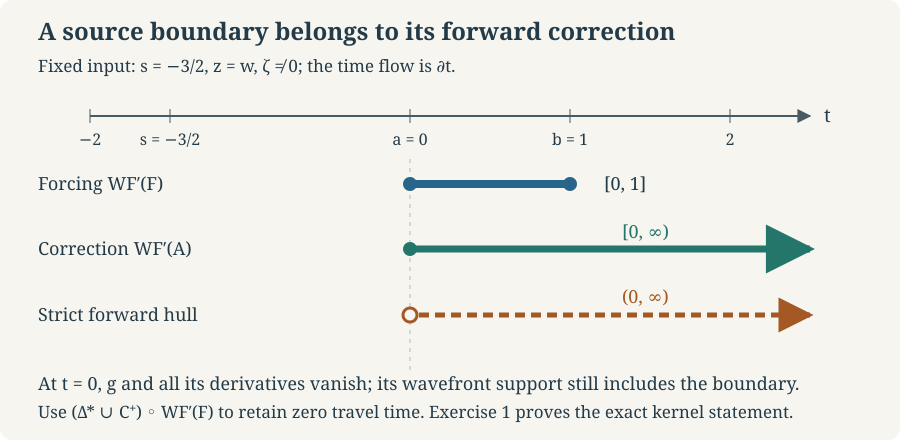

# Directional transport for characteristic symbols

The global time coordinates in Global time and the bicharacteristic relation let us solve a symbol equation on the entire characteristic relation. A correction propagates the forcing forward or backward, including the forcing point itself. That last qualification matters when the source has a sharp boundary in its wavefront support, even though every scalar coefficient is smooth.

We use the complete global time and invariant-radius proof in the preceding lesson, Sections 1–6. The density derivative and scalar subprincipal transport formula, with their full supporting proof, are in [Hamilton fields and subprincipal transport](../20261005-restored-subprincipal-transport/hamilton-fields-and-subprincipal-transport.md), Sections 1–7. The precise density degree and symbol quotient are in [Gaussian lines, densities and invariant symbols](../20261005-restored-gaussian-symbols/gaussian-lines-and-invariant-symbols.md), Sections 6–7. The kernel mapping, input-covector sign and adjoint statements are proved in Kernels, adjoints and clean composition, Sections 1–3. All estimates below use ordinary symbols and are local on compact subsets of the conic quotient.

The flat-line construction below uses the actual locally constant Maslov transitions in the Gaussian lesson, Section 4, and the path and homotopy proof I0–I4. The full constant transverse kernel and its exact wavefront, Sections 1–2, supplies the distribution model used in the exercises. [Fourier cutoffs and pseudolocality W1–W4](../20261004-free-intrinsic-graph/prerequisites/coordinate-and-wavefront-localization.md) prove smooth multiplication, closedness of wavefront and the local differential-operator inclusion used there. The complete weighted Fourier and duality proof, Section S1, supplies the all-real Sobolev spaces.

[Compact parameter integration](../20261004-free-stationary-phase/integration-prerequisite-completions.md), the [scalar power and cutoff constructions](../20261004-free-stationary-phase/exponential-prerequisite-completions.md), and the preceding lesson's complex exponential calculation supply all elementary operations below. The [proof map](proof-map.json) records each exact current provider.

Self-checked by the writing AI.

## 1. Signed time on the relation

Assume the global real principal type and compact-return hypotheses of the preceding lesson. The empty characteristic set has no transport equation to solve. In the nonempty case the base dimension is at least two, as proved there.

Normalize the real principal symbol to degree one as in the preceding lesson. The symbol equation below concerns this degree-one problem; reduction of a general operator's order is a later step in the full parametrix construction. Write its characteristic manifold as \(N\simeq\Omega\times\mathbb R_+\), where \(\Omega\subset M_0\times\mathbb R\) has open interval fibers \(I(q)\), contains \(t=0\), and its Hamilton field is \(\partial_t\). The positive radius \(R\) is invariant along that field. The characteristic relation has coordinates

\[
 \mathcal C=\{(q,t,s,R):t,s\in I(q),\ R>0\},
 \qquad \Delta_N=\{t=s\}.
 \tag{DT1}
\]

Here the second endpoint is the input. Thus

\[
 \mathcal C^+=\{t>s\},\qquad
 \mathcal C^-=\{t<s\},\qquad
 \mathcal C=\mathcal C^+\sqcup\Delta_N\sqcup\mathcal C^-.
 \tag{DT2}
\]

These are intrinsic descriptions: the forward maximal flow time is unique, and changing its origin adds the same number to \(t\) and \(s\). Positive multiplication of the principal symbol preserves the sign; negative multiplication reverses it. Interchanging the endpoints interchanges the two open relations.

The lifted first-factor field on \(\mathcal C\) is \(V=(H_p,0)=\partial_t\). Its zero-time section for the present construction is the characteristic diagonal, not the section \(t=0\) used to choose the global coordinate on \(N\). For fixed \((q,s,R)\), its time variable is \(t-s\), on the open interval \(I(q)-s\).

## 2. The full symbol-line equation

Let \(L=M_{\mathcal C}\otimes\Omega_{\mathcal C}^{1/2}\) be the symbol line, with its dilation action and the flat Maslov derivative. A kernel of order \(r\) on \(X\times X\), where \(\dim X=n\), has intrinsic symbol order \(\nu=r+n/2\). Let \(c\) be a smooth complex degree-zero coefficient. We solve

\[
 \mathcal T a=f,\qquad
 \mathcal T=\frac1i\mathcal L_V+c,
 \qquad a|_{\Delta_N}=0,
 \qquad f\in S^\nu(\mathcal C;L).
 \tag{DT3}
\]

No global nonvanishing section of the Maslov line is needed. Here is the local frame construction and its gluing. The quotient of the \(t\)-flow has coordinates \((q,s,R)\). Cover its \((q,s)\) domain by small contractible coordinate balls. Above any such ball the homotopy \(t\mapsto s+\theta(t-s)\), \(0\leq\theta\leq1\), retracts the whole time domain onto its diagonal section; every intermediate time belongs to \(I(q)\). The positive radial interval is contractible as well.

The whole domain above one such ball is contractible by an explicit three-stage deformation. First send \(t\) to \(s\) along the displayed interval, keeping \((q,s,R)\) fixed. Next send \(R\) to one by \(R\mapsto(1-\theta)R+\theta\), which stays positive. Finally contract the coordinate ball to its center in its Euclidean coordinates, retaining \(t=s\) and \(R=1\). Every stage stays in the actual domain. This also gives path connectedness and contracts every closed loop.

A flat line on this domain has a parallel nonzero frame. To verify this directly, continue a constant local frame along a path, multiplying by the locally constant overlap factors. Subdividing a path changes no product. For a homotopy of two paths, cover its compact parameter square by finitely many frame neighborhoods and subdivide into sufficiently small rectangles. The transition product around each rectangle is one by the cocycle identity. Cancelling internal edges makes the products along the two paths equal. Contractibility makes continuation independent of the path. For the subdivision just used, pull the frame neighborhoods back to an open cover of the compact parameter square. There is a positive mesh size for which every small rectangle lies in a member: otherwise sets of diameter tending to zero would fail, and a convergent subsequence of points in them would contradict the open neighborhood of its limit. A finite square grid finer than that size therefore suffices. Choose one frame at each grid vertex to compare transports. The four-edge product around each rectangle is one in its single local frame; conversion at vertices cancels. The product on the whole boundary is one after internal edges cancel with their reversals. The same argument on a strip shows independence of path subdivisions. In a local frame the resulting section has constant nonzero coefficient, hence is smooth and parallel. Choose the initial frame at \(R=1\), extend along positive dilation, and then along the \(t\)-flow; the Maslov dilation frames are degree zero. The dilation identification agrees with this continuation, since the local conic Maslov frames and their transitions have degree zero. Dilation and time continuation commute: their two paths bound the corresponding rectangle in the same contractible domain. Thus \(e\) is simultaneously parallel under the time flow and invariant under dilation. Denote this frame by \(e\).

In a quotient coordinate chart choose the half-density frame

\[
 w=e\,R^{(n-1)/2}|dq\,dt\,ds\,dR|^{1/2}.
 \tag{DT4}
\]

Scaling \(R\) multiplies the coordinate half density by \(\lambda^{1/2}\) and its scalar factor by \(\lambda^{(n-1)/2}\). Hence \(w\) has degree \(n/2\). It is constant under the \(t\)-flow, so \(\mathcal L_V w=0\). On overlapping charts its transition factor is independent of \(t\) and has degree zero. Indeed the quotient coordinate Jacobian depends only on \((q,s)\), and the parallel Maslov transition is constant along \(t\) and dilation. We keep the globally fixed time and invariant radius from the preceding lesson; only the quotient coordinates change. The full Jacobian is triangular with the quotient Jacobian and unit entries for \(t\) and \(R\). Its absolute square root is smooth, positive and independent of \(t,R\). On compact overlap sets it and its inverse have every derivative bounded. This verifies the stated scalar orders in both frames, not just their homogeneity.

Write \(f=wg\), \(a=wu\), with \(g\in S^r\). Multiplying (DT3) by \(i\) gives \((\partial_t+ic)u=ig\). Its unique zero-diagonal solution is

\[
 C(q,t,s)=\int_s^t c(q,b,s)\,db,
 \qquad
 u(q,t,s,R)=i e^{-iC(q,t,s)}
       \int_s^t e^{iC(q,b,s)}g(q,b,s,R)\,db.
 \tag{DT5}
\]

The coefficient \(c\) is permitted to depend on the input time \(s\). It is independent of \(R\). Differentiating (DT5) gives \(\partial_tu+icu=ig\) with the displayed signs and gives zero at \(t=s\). Conversely multiplying a homogeneous solution by \(e^{iC}\) makes its derivative zero, and its initial value makes it identically zero.

In particular differentiation of the moving lower limit gives the exact formulas
\[
\partial_t C=c(q,t,s),\qquad
\partial_s C=-c(q,s,s)+\int_s^t\partial_3c(q,b,s)\,db .
\tag{DTA1}
\]
Here \(\partial_3\) differentiates the last, input-time argument of \(c\); the integration variable is its second argument. The complex factors use \(e^{iC}=e^{-\operatorname{Im}C}(\cos(\operatorname{Re}C)+i\sin(\operatorname{Re}C))\). The proved exponential identities give its nonzero inverse and all derivatives for arbitrary complex \(c\).

For a compact set of \((q,t,s)\) in the relation, all interpolation points \((q,s+\theta(t-s),s)\) form a compact set in its actual domain. On this set every derivative of \(C\) and its exponential factors is bounded. Use the equivalent integral over \(0\leq\theta\leq1\) with the prefactor \(t-s\). Each base derivative differentiates only bounded time factors, exponentials or a base derivative of \(g\); each radial derivative differentiates only \(g\). Consequently

\[
 |\partial_{q,t,s}^\alpha\partial_R^k u|
 \leq C_{\alpha,k}R^{r-k},\qquad R\geq1.
 \tag{DT6}
\]

This proves all symbol derivatives, including derivatives in the moving lower endpoint \(s\). To see the bound without an endpoint exception, put \(b=s+\theta(t-s)\) in both integrals. For example,
\[
\int_s^t e^{iC(q,b,s)}g(q,b,s,R)\,db
=(t-s)\int_0^1
 e^{iC(q,s+\theta(t-s),s)}
 g(q,s+\theta(t-s),s,R)\,d\theta .
\tag{DTA2}
\]
Every mixed derivative of order at most \(j\) is a finite sum of integrals of derivatives of \(g\) of order at most \(j\), times bounded smooth factors and polynomials in \(\theta,t-s\). The earlier compact-parameter theorem justifies each differentiation under this fixed integral. After \(k\) radial derivatives, all these terms have order \(r-k\). The same proof works at \(t=s\) and for \(t<s\), because the signed prefactor already contains the orientation. For each output seminorm it uses only finitely many input seminorms on that compact interpolation set, so the solution map is linear and continuous in the local symbol topology. If \(g\) is exactly homogeneous, so is \(u\). A change of the invariant positive radial coordinate preserves these estimates by the full chain-rule proof in the preceding lesson. On an overlap the scalar transition is independent of \(t\); multiplying (DT5) by that transition gives the solution in the other frame. Uniqueness therefore glues the local sections into one global \(a\in S^\nu(\mathcal C;L)\). This proves (DT3) in full.

## 3. The closed directional hull

For a symbol section, its microsupport is the closed conic set outside which it is rapidly decreasing, with every symbol derivative, in some base/angular neighborhood. This is a local condition on neighborhoods, not a test of one coefficient's value at an isolated base point. It is independent of our frame: on a compact conic-quotient neighborhood the transition and its inverse have bounded derivatives, and multiplication by the fixed radial degree merely shifts a requested decay exponent by a fixed amount. The coordinate chain-rule estimates from the preceding lesson preserve arbitrary decay as well. By definition its complement is open and dilation invariant, so microsupport is closed and conic.

Let \(S\) be a closed conic subset of the full ambient punctured product cotangent space, contained in \(\mathcal C^+\). Define

\[
 \mathcal H_+(S)=
 \{(q,t,s,R):\exists b\in[s,t],\ (q,b,s,R)\in S\}
 = (\Delta^*\cup\mathcal C^+)\circ S.
 \tag{DT7}
\]

The full cotangent diagonal \(\Delta^*\) permits zero travel time. In (DT7) it acts only on characteristic points. Since \(S\subset\mathcal C^+\), any witnessing time satisfies \(s<b\leq t\). Thus \(\mathcal H_+(S)\subset\mathcal C^+\).

This hull is closed, despite the open forward relation. Suppose points of the hull converge in the ambient punctured cotangent space. They lie in the closed relation \(\mathcal C\), so their limit does too. In a compact relation-coordinate neighborhood, their pairs of times and invariant radii stay in a compact set. Every possible witness lies in its compact interpolation image from Section 2. Choose the coordinate neighborhood with compact closure inside the actual relation domain. Its interpolation image is compact by the continuous map \((q,t,s,R,\theta)\mapsto(q,s+\theta(t-s),s,R)\); interval convexity keeps that whole image in the domain. Select a convergent subsequence of witnesses. Closedness of \(S\) puts the limit witness in \(S\). It still satisfies \(s<b\leq t\), and proves that the limit point belongs to the hull. This also excludes a limit on the characteristic diagonal.

**Directional transport theorem.** If \(\operatorname{microsupp}f\subset S\), then the solution of (DT3) satisfies

\[
 \operatorname{microsupp}a\subset\mathcal H_+(S).
 \tag{DT8}
\]

**Proof.** Fix a point outside the closed hull. Its compact interpolation segment contains no point of \(S\). For \(t\geq s\), any source point on that segment would witness membership in (DT7). For \(t<s\), every point of the segment is on the opposite side of the diagonal and is outside \(S\). The same remains true in a sufficiently small neighborhood of the target point: failure would give a convergent sequence of segment witnesses and a limiting member of \(S\). For these decay estimates normalize the invariant radius to \(R=1\). Conicity makes membership in \(S\) or its hull unchanged by this normalization. The target has a precompact quotient neighborhood whose compact interpolation image misses \(S\): a contrary sequence has a convergent subsequence at \(R=1\) and contradicts the already established exclusion. The same finitely many quotient neighborhoods then control all \(R\geq1\). Cover the resulting compact interpolation image by finitely many neighborhoods where \(f\), and therefore every local scalar coefficient \(g\), decreases faster than every power of \(R\). Formula (DT5), its differentiated forms from (DT6), and bounded interval lengths give that same arbitrary decay for \(a\). This proves (DT8). ∎

For backward forcing use

\[
 \mathcal H_-(S)=
 \{(q,t,s,R):\exists b\in[t,s],\ (q,b,s,R)\in S\}
 = (\Delta^*\cup\mathcal C^-)\circ S.
 \tag{DT9}
\]

The same proof, with reversed interval orientation, applies. Both hulls include \(S\) itself. Replacing them by the strict compositions \(\mathcal C^\pm\circ S\) can incorrectly delete a source boundary. The complete flat example below exhibits the failure. The reflexive hull is still contained in the open signed relation whenever the original closed source microsupport is so contained.

### Exact distribution facts used in the exercises

Write \(K_0=\delta(z-w)\), constant in \(t,s\). The earlier flat-kernel proof gives exactly its conormal wavefront, including every nonzero transverse direction and exclusion of all other directions. If \(a(t,s)\) is smooth, pseudolocality gives \(\operatorname{WF}(aK_0)\subset\operatorname{WF}(K_0)\), and the product vanishes near a point outside \(\operatorname{supp}a\). At a point where \(a\ne0\), multiply back by the local smooth reciprocal of \(a\) to obtain the reverse inclusion. Every point of \(\operatorname{supp}a\) is a limit of points where \(a\ne0\). Fix the same nonzero transverse covector along this sequence and use closedness of wavefront. This proves the exact equality at the whole support, including a boundary where every derivative of \(a\) vanishes. Applied to \(a(t,s)=g(t)h(s)\), its support is \(\operatorname{supp}g\times\operatorname{supp}h\): nonzero points in each factor can be chosen independently in every product neighborhood.

The smooth functions in Exercise 1 exist by the full flat cutoff construction: use \(g(t)=\eta(t)\eta(1-t)\), where \(\eta(t)=e^{-1/t}\) for \(t>0\) and zero otherwise. The earlier derivative proof makes it smooth and flat at zero. A positive compact bump around \(-3/2\), with support strictly inside \((-2,-1)\), supplies \(h\). Smooth functions are also ordinary symbols of order zero in the transverse frequency, with every local derivative bound. The phase \((z-w)\zeta\) has nondegenerate phase equation \(z=w\). These facts justify both the distribution and the stated ordinary conormal order of the example.

For Exercise 2, the compact time convolution is first computed on Schwartz functions, where product integration gives its actual Fourier multiplier. The complete weighted Fourier proof extends this bounded multiplier to every \(H^s\). It agrees with convolution as a distribution: testing against a compact smooth function permits integration over the compact time support of the kernel, and Schwartz approximation converges in the distribution pairing. Compactly supported inputs can alternatively be mollified with support in one fixed slightly larger compact set. The input and output multipliers estimated in that exercise therefore give the claimed continuous map on the actual distribution spaces, including negative \(s\). The constant in each such localized estimate depends on the chosen compact supports.

## 4. Exercises with complete solutions

**1. Zero travel time at a forcing boundary.** Take \(X=\mathbb R_t\times\mathbb R_z\), \(P=D_t=-i\partial_t\), and choose smooth functions \(g,h\) with \(g>0\) on \((0,1)\), \(\operatorname{supp}g=[0,1]\), \(h\) supported in \((-2,-1)\), and \(h(-3/2)\neq0\). They may be chosen flat at every support endpoint. Put

\[
 K_F(t,z;s,w)=g(t)h(s)\delta(z-w).
 \tag{DT10}
\]

Find its wavefront relation and prove that no correction satisfying \(PA-F\in C^\infty\) can have wavefront contained in \(\mathcal C^+\circ\operatorname{WF}'(F)\). Exhibit a correction with the reflexive bound.

The figure fixes \(s=-3/2\), \(z=w\), and a nonzero transverse covector. Filled endpoints belong to the wavefront support; the open circle is excluded. It shows a slice of the exact kernel relation, not the scalar coefficient's pointwise value. Proof: this exercise, (DT10)–(DT12).

**Solution.** The characteristic relation is \(((t,z;0,\zeta),(s,z;0,\zeta))\), with \(\zeta\neq0\). At any point where \(g(t)h(s)\neq0\), the kernel is elliptic conormal to \(z=w\), and has precisely these covectors. Outside the support of that coefficient it vanishes in a neighborhood. Closedness of wavefront and approach from points with nonzero coefficient show that

\[
 \operatorname{WF}'(F)=
 \{((t,z;0,\zeta),(s,z;0,\zeta)):
 t\in[0,1],\ s\in\operatorname{supp}h,\ \zeta\neq0\}.
 \tag{DT11}
\]

In particular it contains \(t=0\), even though every derivative of \(g\) vanishes there. The support is closed in the ambient punctured cotangent space and lies in \(\mathcal C^+\), since every input time is negative. A strict forward composition makes its output time strictly larger than some time in \([0,1]\); on the fixed-input slice it gives exactly \(t>0\), and excludes \(t=0\).

Pseudolocality gives \(\operatorname{WF}'(F)\subset\operatorname{WF}'(A)\) whenever \(PA-F\) is smooth. Thus the proposed strict inclusion cannot hold for any such correction. An actual correction is

\[
 K_A(t,z;s,w)=i h(s)\left(\int_s^t g(b)\,db\right)\delta(z-w).
 \tag{DT12}
\]

Applying \(-i\partial_t\) gives (DT10) exactly. Since \(s<0\) on the input support, the integral is zero for \(t\leq0\) and positive for \(t>0\). Its wavefront support on that slice is \([0,\infty)\), including the boundary by the same closedness argument. This is exactly the reflexive hull (DT7). The kernel is an ordinary conormal distribution of order \(-1/2\): its one phase variable contributes amplitude order zero, and the kernel base dimension is four, giving \(0-4/4+1/2=-1/2\). This places the example in the actual degree-one scalar FIO setting, not merely in an unrelated support model.

**2. Signed fundamental kernels and adjoints.** On \(\mathbb R_t\times\mathbb R_z^{n-1}\), with \(n\geq2\), verify both parametrix identities, the formal adjoints, the difference order and local Sobolev continuity for

\[
 E^+(t,z;s,w)=iH(t-s)\delta(z-w),\qquad
 E^-(t,z;s,w)=-iH(s-t)\delta(z-w).
 \tag{DT13}
\]

**Solution.** Differentiation in \(t\), using \(H'=\delta\), gives \(D_tE^\pm=I\). For the right identity integrate \(E^\pm(-i\partial_s f)\) by parts on compact smooth inputs. Its kernel is \(i\partial_sE^\pm\), which is the identity delta in both cases. Thus these are two-sided inverses on the indicated compact tests, with no residual. Conjugation and interchange of the two endpoints give \((E^+)^*=E^-\) and \((E^-)^*=E^+\).

Their difference is \(i\delta(z-w)\), constant in both time variables. Its conormal phase has \(n-1\) frequency variables and base dimension \(2n\), so its Lagrangian order is \((n-1)/2-2n/4=-1/2\). Its amplitude is the nonzero constant \(i\), so it is elliptic everywhere on the characteristic relation. This is the claimed \(1/2-m\) with \(m=1\).

For compact input and output supports, the time differences belong to a bounded interval. Multiply \(H(r)\) by a smooth cutoff equal to one on that interval. The resulting time convolution is a finite measure, tensor the transverse identity. Its Fourier multiplier is bounded by its total variation, hence is bounded on every \(H^s\), for every real \(s\), by the defining weighted Fourier norm.

Here is also the full compact multiplier bound used to localize this estimate. The elementary inequalities \(\langle\xi\rangle\leq\sqrt2\langle\xi-v\rangle\langle v\rangle\) and their version with \(\xi\) and \(\xi-v\) interchanged give

\[
 \langle\xi\rangle^s\langle\xi-v\rangle^{-s}
 \leq2^{|s|/2}\langle v\rangle^{|s|},\qquad s\in\mathbb R.
 \tag{DT14}
\]

For a compact smooth multiplier \(\chi\), its Fourier transform is rapidly decreasing by repeated integration by parts. Thus \(k(v)=2^{|s|/2}\langle v\rangle^{|s|}|\widehat\chi(v)|\) is integrable. The weighted Fourier transform of \(\chi u\) is bounded by convolution of \(k\) with \(\langle\xi\rangle^s|\widehat u(\xi)|\), up to the fixed inverse Fourier constant. Cauchy–Schwarz under the integral gives \(|k*F|^2\leq\|k\|_1(|k|*|F|^2)\); integration in \(\xi\) gives \(\|k*F\|_2\leq\|k\|_1\|F\|_2\). This proves the multiplier bound for every real \(s\). Input and output localization now proves \(H^s_{\mathrm{comp}}\to H^s_{\mathrm{loc}}\) continuously. It does not assert a uniform estimate on the unbounded full time axis. For \(n=1\), the characteristic relation is empty and the difference is the smooth constant kernel \(i\).

**3. Why the symbol frame needs a radial power.** In (DT1), \(\dim q=2n-3\). Compute the dilation degree of \(|dq\,dt\,ds\,dR|^{1/2}\), determine the factor needed for degree \(n/2\), and show that transport has no density divergence in the resulting frame.

**Solution.** Only \(R\) changes under positive dilation. The Jacobian is \(\lambda\), so the half density has degree \(1/2\). Multiplication by \(R^{(n-1)/2}\) gives degree \((n-1)/2+1/2=n/2\), as in (DT4). The vector field is \(\partial_t\), with zero coordinate divergence, and it differentiates neither the radial power nor a parallel Maslov frame. Therefore \(\mathcal L_V(wu)=w\partial_tu\). For a kernel of order \(r\), its symbol order is \(r+n/2\); dividing by this frame leaves scalar order \(r\). Omitting the radial power would instead leave scalar order \(r+(n-1)/2\), and would assign the wrong order to the transport coefficient.

## 5. From directional symbols to a full parametrix

The directional symbol equation above supplies one receiving step of a global FIO correction. The full construction must additionally realize successive symbol sections by kernels while retaining microsupport in the closed directional hull, sum the resulting lower-order kernels with those same controls, construct the local diagonal inverses and their exact residual orders, and prove the compact-middle composition needed for uniqueness of operators that are not properly supported. It must then prove both parametrix identities, every Sobolev mapping order and the nonvanishing symbol of their difference on the entire relation. These are substantive construction steps, rather than consequences of the scalar integral alone.

## References and scope

Hörmander IV, Theorem 26.1.14, Lemmas 26.1.15–26.1.16 and the following signed-component extension, printed 70–73/PDF 81–84, are the consulted antecedents. This lesson proves the directional symbol transport step and gives complete flat kernel calculations. The literal strict composition bound in Lemma 26.1.16 omits the forcing boundary in Exercise 1; (DT7)–(DT9) retain zero travel time and still remain inside the prescribed open signed relation. This is a concrete support qualification, with an explicit kernel counterexample and exact source locator. The full global parametrix theorem remains to be constructed. The exposition, examples and figure are independently written, eligible for the course's CC0 dedication.
