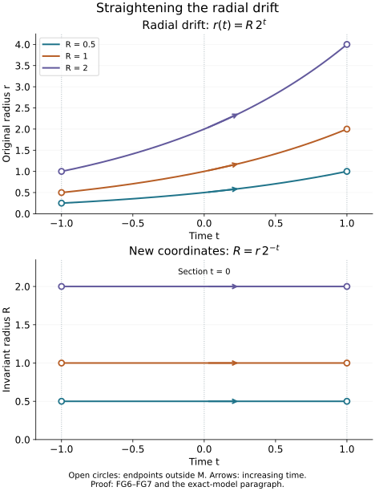

# Global time and the bicharacteristic relation

A compact characteristic tube supplies coordinates along one finite segment. A global propagation construction needs compatible geometry along every segment. The compact return condition in the preceding [global solvability lesson](../20261006-restored-global-solvability/global-solvability-modulo-smooth.md) gives precisely that geometry: a smooth space of trajectories, one section meeting each trajectory, and an invariant positive radial variable. We prove the global statements before using them in a parametrix.

All manifolds here are Hausdorff and second countable, smooth and without boundary. The full [finite-coordinate flow proofs NF1–NF7](../20261005-restored-phase-space/finite-coordinate-flows.md) include existence, uniqueness, all parameter derivatives, maximal continuation, the flow law and coordinate gluing. The [finite inverse and implicit proofs P2–P3](../20261004-free-stationary-phase/prerequisite-completions.md) supply every local inverse used below. [PS5](../20261004-free-intrinsic-graph/prerequisites/global-principal-symbol.md) constructs compact exhaustions and smooth subordinate partitions on the actual Hausdorff second-countable manifolds. The [choice and Baire proofs](../20261004-free-tangent-zoom/prerequisites/complete-test-spaces.md) include the countable selection used in the dimension argument.

[Compactness and finite calculus](../20261004-free-stationary-phase/prerequisite-completions.md), [integration with all compact parameters](../20261004-free-stationary-phase/integration-prerequisite-completions.md), [real powers, logarithms and exponentials](../20261004-free-stationary-phase/exponential-prerequisite-completions.md), and the [full trigonometric proofs](../20261004-free-stationary-phase/exponential-prerequisite-completions.md) supply the scalar calculations. The [Hamilton identities](../20261005-restored-phase-space/phase-space-and-generating-families.md) and [normalized characteristic lifts](../20261005-restored-compact-solvability/compact-set-solvability-from-characteristic-escape.md) give the exact symplectic convention and all-real-order reduction. We supply the global quotient, affine averaging, invariant-radius and relation arguments here; their [proof map](proof-map.json) connects the exact earlier proofs.

Self-checked by the writing AI.

## 1. Three descriptions of a global flow

Let \(v\) be a smooth vector field on a manifold \(M\), with maximal flow \(\phi_t(y)\) on its open domain \(D\subset M\times\mathbb R\). An integral curve is complete here when it is taken on its maximal interval. A stationary curve is included among periodic curves. Consider the following conditions.

**(A)** No complete integral curve is relatively compact. For each compact \(K\subset M\), there is a compact \(K'\subset M\) containing every finite curve interval with both endpoints in \(K\).

**(B)** There are no periodic integral curves, and the same-trajectory relation

\[
 \mathcal R=\{(\phi_t(y),y):(y,t)\in D\}
 \tag{FG1}
\]

is a closed embedded smooth submanifold of \(M\times M\).

**(C)** There is a smooth manifold \(M_0\) and an open set \(\Omega\subset M_0\times\mathbb R\) containing \(M_0\times\{0\}\), such that each fiber \(I(q)=\{t:(q,t)\in\Omega\}\) is an interval, and a diffeomorphism \(M\simeq\Omega\) carries \(v\) to \(\partial_t\).

**Theorem 1.1.** Conditions (A), (B) and (C) are equivalent. Every nonempty component satisfying them has dimension \(d\geq1\); its trajectory space has dimension \(d-1\), and its relation has dimension \(d+1\). An empty manifold satisfies the conditions vacuously.

We will also use the stronger explicit consequence: under any of these conditions, the map

\[
 F:D\longrightarrow M\times M,
 \qquad F(y,t)=(\phi_t(y),y)
 \tag{FG2}
\]

is a proper injective immersion, and is a diffeomorphism onto \(\mathcal R\).

## 2. Compact return gives a proper relation

Under (A), \(v\) has no zero and no periodic orbit. Both would give a complete curve in a compact set. There is also no relatively compact positive or negative half-curve. To prove this, first use the compact ODE continuation argument to extend a trapped half-curve indefinitely in its outward time. For times \(t_j\to+\infty\), choose \(\phi_{t_j}(y)\to z\). For each finite \(T\), the shifted intervals \([t_j-T,t_j+T]\) lie eventually in the half-curve. Compact bounds and continuous dependence give the solution through \(z\) on \([-T,T]\), still in the same compact set. Unique solutions for different \(T\) agree. Their union is a complete compact curve, contradicting (A). Use \(-v\) for the negative half.

The differential of (FG2) is injective. Its second component determines the variation in \(y\), and the remaining time variation is a multiple of the nonzero vector \(v(\phi_t(y))\). The map itself is injective because equality of two times on one trajectory would give a periodic orbit.

We prove properness, including the maximal-domain issue. Suppose

\[
 y_j\longrightarrow y,\qquad
 \phi_{t_j}(y_j)\longrightarrow x.
 \tag{FG3}
\]

The endpoint sequences and their limits lie in one compact \(K\). Every intervening interval lies in the compact \(K'\) from (A). After taking a subsequence, \(t_j\) has a limit in the extended real line. If that limit is \(+\infty\), compact ODE continuation and continuous dependence show that the positive half-curve through \(y\) exists for every finite positive time and remains in \(K'\). This contradicts the preceding half-curve argument. The negative infinite limit is excluded in the same way.

Thus \(t_j\to T\in\mathbb R\). The entire bounded-time interval through \(y\) remains in \(K'\); uniform short-time rectangles covering \(K'\) continue it across any supposed finite maximal endpoint. Consequently \((y,T)\in D\), and continuity gives \(\phi_T(y)=x\). Every sequence in the inverse image of a compact set therefore has a convergent subsequence whose limit is still in \(D\). The compact target does supply convergent endpoint subsequences: cover it by finitely many coordinate neighborhoods whose closures are compact inside larger charts, and use finite-dimensional sequential compactness on one closure containing infinitely many sequence terms. The same local argument applies on any of our manifolds. The sequence together with its limit is compact directly from the open-cover definition, so the endpoint sets used above really lie in a compact \(K\). This proves compactness directly: second countability gives a countable subcover of any open cover of that inverse image; if no finite initial subfamily covered it, points chosen outside the first \(j\) members would have a convergent subsequence, contradicting eventual membership in a cover member containing its limit. This is properness.

A proper injective immersion is an embedding in this case without any extra quotient assumption. Around each domain point, an invertible derivative minor supplies local immersion coordinates. Properness prevents a sequence of other domain points from entering its image neighborhood while escaping those coordinates: a convergent image sequence has a convergent inverse subsequence, and injectivity identifies its only possible limit. Thus the inverse on the image is continuous, and the local immersion inverses make it smooth. The image is closed by the same compact subsequence argument. This proves (A) implies (B) and the stated property of \(F\).

For completeness, (B) also gives this property. Under (B), the absence of periodic and stationary curves is an assumption. The injectivity and differential-rank calculation therefore applies independently of (A); the argument in this paragraph does not use the return bound it will prove. Write \(d=\dim M\). The smooth map \(F:D\to\mathcal R\) has rank \(d+1\). The dimension of \(\mathcal R\) is exactly \(d+1\), rather than an unstated additional hypothesis in (B). If it were larger on an open component, select at each source point a square derivative minor of full source dimension. The inverse theorem makes those target components coordinates on a small source neighborhood; the remaining target components become smooth functions of them. Its image is therefore a graph of positive codimension in the larger-dimensional relation chart. Compact subpieces have compact images with empty interior, hence nowhere dense. Countably many such compact subpieces cover the relevant open subset of \(D\), by its countable coordinate exhaustion. Their images cannot cover an open manifold. More precisely, restrict to one nonempty relation chart of the proposed larger dimension. Its inverse image under \(F\) is an open second-countable manifold. Refine its countable precompact coordinate cover so that each compact closure maps into one of the full-minor graph charts just constructed. The restriction of \(F\) is smooth into the embedded relation: in an ambient submanifold chart the normal coordinates of its image are identically zero, and its remaining coordinates are smooth. Each compact graph image is closed in the relation chart and has empty interior there; a transverse target coordinate can be varied off its graph in every neighborhood. These images give precisely the countable closed nowhere-dense cover excluded in the next argument. Here the needed Baire argument is elementary: in a coordinate ball, successively choose nonempty closed smaller balls avoiding the first, second and subsequent nowhere dense sets, with radii tending to zero and each contained in the preceding interior. The first ball is compact; the nested balls have a common point, which avoids every set. This proves the contradiction. The opposite dimension inequality already follows from the injective differential.

The inverse function theorem now makes the bijection \(F:D\to\mathcal R\) a local diffeomorphism, hence a diffeomorphism. Because \(\mathcal R\) is closed in \(M\times M\), \(F\) is proper as a map to that product. A relatively compact complete curve would extend for all real time by compact continuation, and \(F(y,t_j)\), with \(|t_j|\to\infty\), would contradict properness. For compact \(K\), put \(E=F^{-1}(K\times K)\), compact in \(D\). The set

\[
 \{(y,\theta t):(y,t)\in E,\ 0\leq\theta\leq1\}
 \tag{FG4}
\]

is compact, is contained in \(D\) by the interval property of maximal times, and its flow image is compact. That image contains every return interval in question. This proves (B) implies (A).

## 3. The quotient and one global section

Assume the equivalent conditions just proved. Give \(M_0=M/\mathcal R\) its quotient topology, with projection \(\pi\). Saturation of an open subset of \(M\) is open: it is the union of its images under the local flow diffeomorphisms. Thus \(\pi\) is open. It follows that the images of a countable base in \(M\) form a countable base in \(M_0\).

The quotient is Hausdorff. If \(y\) and \(z\) belong to different trajectories, closedness of \(\mathcal R\) gives neighborhoods \(U,V\) with \((U\times V)\cap\mathcal R=\varnothing\). The open sets \(\pi(U),\pi(V)\) are disjoint and separate their classes.

Choose a small smooth transversal \(S\) through \(y\). The flow box follows from the smooth local flow and the inverse theorem: the derivative of \((s,t)\mapsto\phi_t(s)\) at \((y,0)\) has the transversal tangent space and \(v(y)\) as complementary columns. Shrink the box so that \(\pi|_S\) is injective. Indeed, the continuous inverse of (FG2) near \((y,y)\) forces any relation pair in \(S\times S\) to have a sufficiently small time, and in a flow box such a curve meets \(S\) only once. The image \(\pi(S)\) is open because it is the image of the open flow box. The same reasoning with smaller transversal subsets proves that \(\pi|_S\) is a homeomorphism onto its image.

These charts form a smooth atlas of dimension \(d-1\). To check a transition, fix the finite time taking one representative to the other transversal. Apply that fixed-time smooth flow to nearby representatives, then use the second flow box's smooth transversal projection. It gives exactly the representative on the second transversal, by the uniqueness just proved. The reversed construction is its smooth inverse. The quotient is therefore a Hausdorff, second-countable smooth manifold, and \(\pi\) is locally the projection of a flow box. Each quotient chart supplies a smooth local section \(\sigma_i\).

For the partition in the next paragraph, choose the small balls in PS5 inside the given section domains; its construction then makes each closed support lie inside one such domain. If \(M_0\) is zero dimensional, it is a countable discrete manifold. Choose one origin on each trajectory and use its singleton as a section domain; the singleton weights give the smooth locally finite partition directly. This includes the one-dimensional components of \(M\).

Each trajectory has an intrinsic affine time coordinate: choosing any point as origin gives its open maximal interval, and changing the origin translates time. Differences of times are unique because there is no periodic orbit. Let \(\{\chi_i\}\) be the smooth nonnegative locally finite partition of unity on \(M_0\), with supports inside the local section domains. Define the section \(\sigma(q)\) to be the affine weighted average of the finitely many \(\sigma_i(q)\) with nonzero weights.

This averaging is meaningful even for an incomplete trajectory. In any time coordinate on that trajectory all the relevant points lie in its open interval. Their convex combination lies in the same interval. Translation of the origin changes each time and its average by the same amount, so it gives the same point of the trajectory. Near a fixed \(q\), use one local section as origin. The other section times are smooth by the smooth inverse of \(F\), and only finitely many partition supports occur. Their weighted sum is smooth; terms extend by zero outside their support domains. Thus \(\sigma\) is a global smooth section, with \(\pi\sigma=\mathrm{id}\). At a point outside a section domain, the closed support of its partition weight has a neighborhood disjoint from that point. Its weighted term is identically zero there. This is why extension by zero remains smooth even if the unweighted time function has no limit at the boundary of its domain.

Put

\[
 \Omega=\{(q,t):(\sigma(q),t)\in D\},\qquad
 G(q,t)=\phi_t(\sigma(q)).
 \tag{FG5}
\]

The domain is open, contains time zero, and has interval fibers. Every point lies on one selected trajectory, so \(G\) is onto. Unique times and unique trajectory classes make it injective. Locally its transversal columns and flow column are independent, so it is a local diffeomorphism. Its local inverses agree by injectivity, giving a global smooth inverse. It carries \(\partial_t\) to \(v\). This proves (A) and (B) imply (C).

Finally, (C) implies (A). A complete vertical trajectory cannot be relatively compact: an infinite time endpoint makes its time coordinate unbounded; a finite maximal endpoint approached inside a compact subset of \(\Omega\) has a limit in that open set and therefore permits continuation. For the return condition, pairs of endpoints in a compact \(K\subset\Omega\) with the same \(q\) form a closed subset of \(K\times K\), hence a compact set. Their interval interpolation \((q,(1-\theta)t_1+\theta t_2)\), \(0\leq\theta\leq1\), has compact image contained in \(\Omega\) by fiber convexity. It is the required \(K'\). Theorem 1.1 is proved in full.

## 4. A radial coordinate constant along the flow

Let \(M\) now be a smooth conic manifold: the positive scaling action is free and has smooth local product coordinates, with Hausdorff second-countable quotient \(M_s\). Let \(v\) commute with this action, and suppose its induced field on \(M_s\) satisfies Theorem 1.1. Choose a smooth positive degree-one function \(r\) on \(M\). Such a function exists: local positive radial coordinates transform by positive smooth degree-zero factors; a subordinate smooth partition on \(M_s\) makes their locally finite positive weighted sum a global degree-one function. In a cotangent cone one can simply use a positive smooth cotangent norm.

The map \(y\mapsto(\pi_s(y),r(y))\) is an equivariant diffeomorphism to \(M_s\times\mathbb R_+\): every positive scaling orbit meets \(r=1\) exactly once, with smooth inverse in the local products. By Theorem 1.1 write \(M_s\simeq\Omega\subset M_0\times\mathbb R\). In these coordinates scaling invariance gives

\[
 v=\partial_t+a(q,t)r\partial_r,\qquad
 b(q,t)=-\int_0^t a(q,s)\,ds,\qquad R=r e^{b(q,t)}.
 \tag{FG6}
\]

The interval from zero to \(t\) stays in \(\Omega\). Integration with parameters makes \(b\) smooth. Direct differentiation gives \(vR=0\), while \(R\) stays positive and has degree one. The inverse is \(r=R e^{-b(q,t)}\), so this is an equivariant diffeomorphism, and in the resulting coordinates

\[
 M\simeq\Omega\times\mathbb R_+,\qquad v=\partial_t.
 \tag{FG7}
\]

No completeness in the original radial variable is assumed. The transformation is defined on the full actual interval fibers and retains their finite endpoints.

## 5. Transport on the whole conic manifold

Let \(c\) be smooth, complex and homogeneous of degree zero. In (FG7) it is independent of \(R\). For any real \(\mu\), define \(S^\mu(M)\) by the local estimates in conic product coordinates, on every compact set of \((q,t)\) and for \(R\geq1\):

\[
 |\partial_{q,t}^{\alpha}\partial_R^k f|
 \leq C_{\alpha,k}R^{\mu-k}.
 \tag{FG8}
\]

These estimates are invariant under conic coordinate changes. To see every derivative, write the old coordinates as \(z=z(z')\), \(R=h(z')R'\), where \(h>0\) and \(z=(q,t)\). On a fixed compact set, \(h,h^{-1}\) and all derivatives needed in a given estimate are bounded. Each \(R'\)-derivative supplies one old radial derivative and a bounded factor \(h\). A derivative in \(z'\) either differentiates a bounded coefficient, supplies an old base derivative, or supplies an old radial derivative together with one factor \(R'\). Repeated differentiation therefore gives finite terms of the form \((R')^\ell A(z')\partial_z^\beta\partial_R^{k+\ell}f\). The old estimate bounds each by a constant times \((R')^{\mu-k}\), since \(R\) and \(R'\) are comparable. If \(R'\geq1\) corresponds to \(R<1\), it lies in a bounded interval with a positive lower bound; smoothness on that compact interval gives the same inequality after enlarging the constant. This proves all orders of the coordinate invariance. We assert compact local symbol bounds, with no uniform bound over the whole time axis.

For \(f\in S^\mu(M)\), put

\[
 C(q,t)=\int_0^t c(q,s)\,ds,\qquad
 u(q,t,R)=e^{-C(q,t)}\int_0^t e^{C(q,s)}f(q,s,R)\,ds.
 \tag{FG9}
\]

For the complex integrating factor, use the actual definition
\[
e^C=e^{\operatorname{Re}C}
       \bigl(\cos(\operatorname{Im}C)+i\sin(\operatorname{Im}C)\bigr).
\tag{FGA1}
\]
The earlier real exponential and trigonometric derivative identities give \(\partial e^C=e^C\partial C\) for every real parameter derivative. Their product identities give \(e^Ce^{-C}=1\). Repeated differentiation is therefore a finite sum of products of derivatives of \(C\) and this same exponential; on each compact interpolation set all these factors are bounded. This justifies the complex factor without imposing a reality assumption on \(c\).

Then \(u\in S^\mu(M)\), \(u|_{t=0}=0\), and \((v+c)u=f\). The last equation follows by the product rule and the fundamental theorem, with the displayed signs. For the estimates, a compact set \(E\subset\Omega\) has a compact interpolation image \(\{(q,\theta t):(q,t)\in E,0\leq\theta\leq1\}\subset\Omega\). On it all derivatives of \(c,C,e^{\pm C}\) are bounded. Each differentiated integral is a finite sum of endpoint derivatives and integrals of derivatives, of bounded lengths. Each radial derivative falls only on \(f\), and gives exactly \(R^{\mu-k}\). This proves every estimate in (FG8). If \(f\) is exactly homogeneous of degree \(\mu\), so is \(u\).

The relation manifold in these coordinates consists of \((q,t,s,R)\) with \(t,s\in I(q)\). The field \((v,0)\) is \(\partial_t\). On this full conic relation its trajectory labels are \((q,s,R)\). After quotienting by positive dilation, the radial coordinate disappears and the trajectory labels are \((q,s)\). In particular its projected flow domain is
\[
\widetilde\Omega
 =\{(q,s,t):(q,s)\in\Omega,\ (q,t)\in\Omega\}.
\tag{FGA2}
\]
This is open over the manifold of labels \((q,s)\in\Omega\). Its \(t\)-fiber is the same interval \(I(q)\), which contains zero. It thus has exactly condition (C) of Theorem 1.1, and the full conic relation has the radial product above. Applying the already proved construction gives the relation-manifold straightening and transport assertion, with the radial variable retained in the full trajectory quotient.

## 6. The characteristic relation is closed and Lagrangian

Return to a proper scalar operator with real homogeneous principal symbol \(p\) of any real degree \(m\). Assume global real principal type and the compact return condition of the preceding global solvability theorem. Following the traditional terminology, these two conditions say that the domain is **pseudoconvex with respect to the operator**. They concern characteristic geometry, rather than convexity of its base coordinates.

Let \(N=\{p=0\}\subset T^*X\setminus0\). If it is empty, the characteristic relation is empty and the assertions below are vacuous. Otherwise \(dp\) is nonzero at each point of \(N\): a zero would make \(H_p\) vanish there and give a complete stationary characteristic in a compact base set, contrary to global real principal type. The written inverse and implicit theorem therefore makes \(N\) a smooth hypersurface. Choose a positive degree-one norm \(w\). For the radial Euler field \(E=\sum_j\xi_j\partial_{\xi_j}\), homogeneity gives \(dp(E)=mp=0\) on \(N\), whereas \(dw(E)=w>0\). Thus the differentials of \(p\) and \(w\) are independent on \(N\cap\{w=1\}\). The same implicit theorem makes that section a smooth manifold of dimension \(2n-2\), and scaling identifies it with the quotient \(N_s\).

Set \(\widetilde p=w^{1-m}p\). On \(N\), its Hamilton field is \(w^{1-m}H_p\), so it gives the same unparametrized trajectories. The full normalization, radial exclusion and homogeneous lifting argument in [compact-set solvability](../20261005-restored-compact-solvability/compact-set-solvability-from-characteristic-escape.md), Section 1, applies. The projected field on \(N_s\) has no compact complete trajectory. A compact endpoint set in \(N_s\) projects into a compact base set; the assumed return bound confines all intervening base points to a compact set, whose cosphere bundle is compact. Thus that projected field satisfies (A).

If \(n=1\), a nonempty characteristic cosphere is zero dimensional; its projected field would vanish and violate escape. Thus the nonempty case has \(n\geq2\). It follows that \(N\) has (FG7) coordinates, and its same-trajectory relation \(\mathcal C\) has coordinates \((q,t,s,R)\) as in Section 5. It is a closed embedded conic submanifold of \(N\times N\), of dimension \(2n\). Indeed \(\dim N=2n-1\), \(\dim N_s=2n-2\) and \(\dim M_0=2n-3\); adding two times and one radius gives \(2n\).

We prove closedness also in the larger \(T^*(X\times X)\setminus0\), where one covector could a priori tend to zero. Suppose relation pairs have a limit there. Their base endpoints lie in a compact set \(K\); pseudoconvexity confines every connecting interval to a compact \(K'\). On the characteristic unit cosphere over \(K'\), the positive invariant radius satisfies

\[
 0<c\leq R/w\leq C<\infty.
 \tag{FG10}
\]

It has the same value at the two endpoints. Consequently their cotangent norms have ratios between \(c/C\) and \(C/c\). One cannot tend to zero while the other tends to a nonzero covector. Both limit covectors are therefore nonzero, lie in \(N\), and closedness in \(N\times N\) puts the limit in \(\mathcal C\). This proves the claimed ambient closedness with the zero-section issue included.

Use \(\omega=\sum_jd\xi_j\wedge dx_j\) and the difference symplectic form \(\omega\oplus(-\omega)\) on the two cotangent factors. For the convention \(H_p=\sum_j(\partial_{\xi_j}p\,\partial_{x_j}-\partial_{x_j}p\,\partial_{\xi_j})\), the contraction is \(\iota_{H_{\widetilde p}}\omega=-d\widetilde p\). Here is a coordinate proof that Hamilton flow preserves \(\omega\). Order coordinates as \((x,\xi)\), put \(J=\left(\begin{smallmatrix}0&I\\-I&0\end{smallmatrix}\right)\), and write \(S\) for the symmetric Hessian of \(\widetilde p\). The variational equation is \(\dot Y=JSY\); the matrix of \(\omega\) is \(-J\). Consequently the derivative of \(Y^T(-J)Z\) is zero, since \((JS)^T(-J)+(-J)JS=-S+S=0\). This proves preservation in each cotangent chart. A finite flow interval is covered by finitely many such charts; composing their local flow maps proves preservation on the entire interval.

Parameterize a relation neighborhood by \((y,\tau)\mapsto(\phi_\tau(y),y)\), \(y\in N\). For two variations \((Y,a),(Z,b)\), the equal-time terms cancel by symplectic invariance. The remaining mixed terms are \(-a\,d\widetilde p(D\phi_\tau Z)+b\,d\widetilde p(D\phi_\tau Y)\), zero because both transported variations are tangent to \(N\). The two-time term is zero by skew symmetry. Thus the difference form vanishes on \(\mathcal C\). Its dimension is half the ambient dimension, so \(\mathcal C\) is Lagrangian.

The kernel convention identifies \((x,\xi;y,\eta)\) with \((x,y;\xi,-\eta)\in T^*(X\times X)\). It pulls the product cotangent symplectic form back to \(\omega\oplus(-\omega)\), so the corresponding kernel relation is also Lagrangian, with the stated sign on the input covector. We have proved that the bicharacteristic relation is a homogeneous canonical relation, closed even where the product cotangent space allows only one nonzero component. Replacing \(p\) by a real smooth nonvanishing multiple changes trajectory parameters but preserves this relation; uniqueness on each characteristic curve proves that assertion, including a reversal by a negative multiple. On any fixed compact segment a real nonvanishing multiplier and its reciprocal are bounded, so integration of its reciprocal gives the local change of clock throughout that segment. Exhausting a maximal trajectory by its compact segments proves equality of the whole unparametrized trajectories, even if the new maximal time interval has different endpoints. These geometric results do not yet construct its Fourier-integral parametrix.

The construction also respects a symplectic diffeomorphism \(\kappa\) defined on the full characteristic domain. If \(q=p\circ\kappa^{-1}\), preservation of the symplectic form gives \(\iota_{\kappa_*H_p}\omega=-dq\). Nondegeneracy makes \(\kappa_*H_p=H_q\). Uniqueness of the flow then carries the full same-trajectory relation by \(\kappa\times\kappa\), with the new maximal time domain. If \(\kappa\) commutes with positive dilation, this also preserves the homogeneous structure. When a map is defined only on a smaller open set, the assertion applies to trajectory intervals contained in that set.

### An exact model of the invariant radius

Take the conic manifold \(M=(-1,1)\times\mathbb R_+\), with coordinates \((t,r)\), dilation \((t,r)\mapsto(t,\lambda r)\), and \(v=\partial_t+(\log2)r\partial_r\). The projected field is \(\partial_t\) on the open interval; its trajectory space is a single point. Formula (FG6) gives \(R=r2^{-t}\), so its curves are \(r(t)=R2^t\). The upper panel draws the three actual curves with \(R=1/2,1,2\). The lower panel draws their images, where \(R\) is constant and the field is \(\partial_t\). The section \(t=0\) meets every curve exactly once. Arrowheads specify increasing time, not the magnitude of a velocity vector.

The open circles at \(t=-1,1\) show excluded endpoints; they are outside \(M\). Their radii in the upper panel are exactly \(R/2\) and \(2R\). A maximal curve approaches these missing boundary points, so its image is not relatively compact in \(M\). The dotted lines mark those boundaries and the zero-time section; the drawing only truncates the otherwise positive radial axis. This is a coordinate example of (FG6)–(FG7), not an identification of these two coordinates with a cotangent chart. The real power and derivative identities used here are the earlier complete scalar proofs.

## 7. Exercises with complete solutions

**1. A quotient that fails to be Hausdorff.** In the slit plane \(X=\mathbb R^2\setminus\{(0,y):y\geq0\}\), take \(v=\partial_x\). Explain why no complete trajectory is relatively compact, but the trajectory quotient is not Hausdorff. Identify the missing hypothesis in Theorem 1.1.

**Solution.** Below height zero, a trajectory is the full horizontal line. At nonnegative height it is one of the two open half-lines. Each maximal trajectory has an unbounded base direction, so none is relatively compact. Let the two quotient points be the negative and positive half-lines at height zero. Any open saturated neighborhoods of these trajectories contain points at sufficiently small negative heights near \((-1,0)\) and \((1,0)\), respectively. For a common sufficiently small negative height these two points lie on the same full horizontal trajectory. The quotient neighborhoods therefore intersect, and the two classes cannot be separated. The compact return condition fails: the intervals from \((-1,-1/j)\) to \((1,-1/j)\) have endpoints in the two compact vertical segments, but their midpoints approach the excluded origin and escape every compact subset of \(X\). This is exactly the missing second clause of (A), rather than a periodic orbit or a zero of \(v\).

**2. Radial drift and resonant scalar transport.** On \(\mathbb R\times\mathbb R_+\), let \(v=\partial_t+\alpha r\partial_r\), with real constant \(\alpha\), and \(c=\beta\in\mathbb C\). Find the invariant radius and solve \((v+\beta)u=r^\mu\), \(u(0,r)=0\), for real \(\mu\), including \(\mu\alpha+\beta=0\).

**Solution.** The invariant radius is \(R=r e^{-\alpha t}\). In its coordinates, the forcing is \(R^\mu e^{\mu\alpha t}\), and (FG9) gives

\[
 u(t,r)=
 \begin{cases}
 r^\mu(1-e^{-(\mu\alpha+\beta)t})/(\mu\alpha+\beta),&\mu\alpha+\beta\ne0,\\
 t r^\mu,&\mu\alpha+\beta=0.
 \end{cases}
 \tag{FG11}
\]

For a function \(r^\mu h(t)\), the left side is \(r^\mu[h'(t)+(\mu\alpha+\beta)h(t)]\). Both displayed branches satisfy this scalar equation with right side one and zero initial value. The solution is homogeneous of degree \(\mu\); every radial derivative has order \(\mu-k\) on compact time sets. Exponential growth on an unbounded time axis does not contradict these local symbol bounds. The resonant branch also follows from the limit \((1-e^{-\delta t})/\delta\to t\).

**3. The free transport canonical relation.** For \(n\geq2\), use \(x=(t,z)\) on \(\mathbb R^n\) and \(P=D_t\). Write its characteristic relation, check its dimension and symplectic form, and verify ambient closedness.

**Solution.** The characteristic covectors are \((0,\zeta)\), with \(\zeta\ne0\), and trajectories change only \(t\). The relation is

\[
 \mathcal C=\{((t,z;0,\zeta),(s,z;0,\zeta)):
 t,s\in\mathbb R,\ z\in\mathbb R^{n-1},\ \zeta\ne0\}.
 \tag{FG12}
\]

Its coordinates have dimension \(2+(n-1)+(n-1)=2n\). The two transverse symplectic terms cancel because both factors have the same \(z,\zeta\), and the longitudinal terms vanish since both longitudinal covectors are zero. Thus it is Lagrangian for the difference form. Its endpoint covector norms are equal; in a product cotangent limit with at least one nonzero component, both retain the same nonzero \(\zeta\). The relation remains closed. For compact endpoints, the transverse coordinates stay in a compact projection and the longitudinal coordinate lies between two bounded endpoint values, giving the compact return bound. When \(n=1\), the characteristic set for \(D_t\) is empty, so the displayed nonzero transverse-covector model has no points.

## References and current scope

Hörmander IV, Definition 26.1.10, Lemmas 26.1.11–26.1.12 and their two remarks, and Proposition 26.1.13, printed 67–69/PDF 78–80, supply the mathematical antecedents. The quotient dimension, proper embedding, smooth affine section, all symbol derivatives and ambient zero-section exclusion are developed here in full, using the exact written programme foundations. The exposition and exercises are independently written; no source error or new theorem is claimed. The cited AN-03 proofs are licensed under GFDL 1.2 only, with no invariant sections, front-cover texts or back-cover texts. Their expression and assets are not reproduced here. Original expression is eligible for the course's CC0 dedication.

The next analytic step is to construct a Fourier-integral parametrix on this relation and solve its successive symbol transport equations. The geometric and scalar transport results proved here supply the global coordinates for that construction.

The new exact-model drawing and its reproducible source are original programme work under CC0. Its embedded font retains the [DejaVu licence](figures/LICENSE_DEJAVU.txt).
