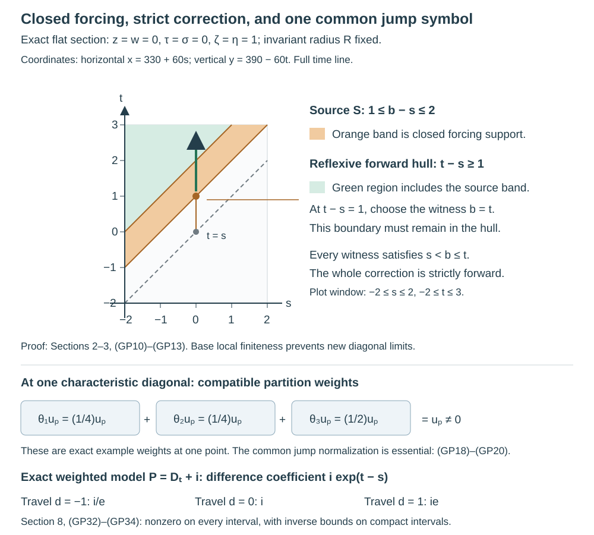

# Global signed parametrices from local delayed errors

A local inverse creates the identity at zero travel time and an ordinary Lagrangian error at a strictly positive travel time. We now assemble those local inverses, correct the entire error, and recover both inverse identities. The main support issue is that a locally finite construction must remain locally finite in the base, even when all cotangent directions are included.

The complete local construction is in [Local signed parametrices and their delayed errors](../20261006-restored-local-signed/local-signed-parametrices-and-delayed-errors.md), Sections 1–4. The distribution realization, ordinary lower-term transport and closed-support asymptotic correction are in [From directional symbols to global kernel corrections](../20261006-restored-kernel-corrections/global-kernel-corrections-from-directional-symbols.md), Sections 1–4. [Global time and the bicharacteristic relation](../20261006-restored-global-flow/global-time-and-bicharacteristic-relation.md), Sections 1–6, supplies the global trajectory coordinates and ambient closedness. [Corank geometry and sufficient continuity](../20261005-restored-corank-continuity/corank-geometry-and-sufficient-continuity.md), Sections 3–5, proves the full corank bound on every real Sobolev scale. [Comparing global parametrices through a compact middle](../20261006-restored-compact-middle/comparing-global-parametrices-through-a-compact-middle.md), Sections 1–5, proves the actual compact-middle products, same-sign comparison and adjoint conversion. We use those proofs at their precise scopes.

The exact PDO inputs are the complete [conic inverse and support-preserving summation proofs K1–K4](../20261004-free-intrinsic-graph/prerequisites/conic-parametrices-and-localization.md), [full coordinate and wavefront calculus T0–T3 and W1–W4](../20261004-free-intrinsic-graph/prerequisites/coordinate-and-wavefront-localization.md), [proper quantization and products OP3–OP6](../20261004-free-intrinsic-graph/prerequisites/ordinary-operator-calculus.md), [compact exhaustion and smooth partitions PS5](../20261004-free-intrinsic-graph/prerequisites/global-principal-symbol.md), and [graph continuity and proper inverse reconstruction](../20261005-restored-graph-egorov/graph-operators-continuity-and-egorov.md). Their retained component notices specify the original terms, including GFDL 1.2 where applicable. The [proof map](proof-map.json) identifies the exact current proofs. The assembly and support arguments below are independently written.

For the diagonal symbol normalization and ellipticity we also use [Kernels, adjoints and clean composition](../20261005-restored-analytic-composition/clean-composition-of-fourier-integral-operators.md), Sections 1–9, for the full relation bound and zero-excess symbol product; [Gaussian lines, densities and invariant symbols](../20261005-restored-gaussian-symbols/gaussian-lines-and-invariant-symbols.md), Sections 6–7, for the exact symbol-line quotient and noncharacteristic Fourier test; and [Recognizing a Lagrangian distribution intrinsically](../20261005-restored-intrinsic-regularity/intrinsic-lagrangian-regularity.md), Sections 2–3, for the full frequency-graph criterion and intersection of all orders. The degree-zero frame used below is obtained from [Directional transport for characteristic symbols](../20261006-restored-directional-transport/directional-transport-for-characteristic-symbols.md), Sections 1–3. All of these are preceding complete written programme proofs at the stated scopes.

Let \(X\) be a Hausdorff, second-countable smooth manifold without boundary. Work with scalar complex half densities, \(D=-i\partial\), and a properly supported \(P\in\Psi^1_{1,0}(X)\). Its principal representative \(p\) is real and homogeneous of degree one; all lower terms may be arbitrary ordinary complex symbols of order zero. Assume global real principal type: no maximal characteristic strip remains over a compact base set. Also assume compact return:
\[
 \forall K\Subset X\ \exists K'\Subset X:\quad
 \text{every characteristic interval with both base endpoints in }K
 \text{ stays over }K'.
 \tag{GP1}
\]
The notation \(K\Subset X\) here means a compact subset, not an assertion that \(K\) is open. We may enlarge either compact to a compact neighborhood when a cutoff is needed.

Put \(N=\{p=0\}\subset T^*X\setminus0\). The preceding geometry proves that \(N\) is smooth, \(H_p\) is independent of the radial field on it, and its characteristic relation \(C\) is a closed conic Lagrangian, with no covector axis in its ambient closure. Write \(C_+\) and \(C_-\) for strict forward and backward travel. They omit the characteristic diagonal \(\Delta_N\). Let \(\Delta^*\) be the full cotangent diagonal. The empty-characteristic case is the usual proper elliptic parametrix and will be included below.

## 1. A conic partition with exact lower-order control

Choose a locally finite cover by relatively compact coordinate neighborhoods \(U_a\), with smaller compact sets \(K_a\subset U_a\) covering the base through the interiors of the \(K_a\). Such a cover is obtained from a compact exhaustion: cover each closed band of the exhaustion by finitely many neighborhoods contained in a slightly larger band. Only finitely many resulting neighborhoods meet any fixed compact base set. Smooth partitions with compact supports on these bands are supplied by the programme manifold partition proof.

Over each \(K_a\), the cosphere is compact. Cover it by finitely many interior conic patches, each of one of two kinds: an elliptic patch where \(p\ne0\), or a characteristic patch where the local signed construction applies on a larger matched cone. Shrink the supports inside those larger cones. Index all these finitely many choices over all \(a\) by \(j\). Their base neighborhoods \(U_j\) form a locally finite family, even though the cotangent cover has infinitely many members globally. Choose nonnegative degree-zero functions \(\theta_j\), supported in the smaller conic patches, such that
\[
 \sum_j\theta_j=1\quad\text{on }T^*X\setminus0.
 \tag{GP2}
\]
To construct them, multiply a compact base partition by finite angular partitions over its compact supports. Dividing the resulting nonnegative functions by their positive locally finite sum gives (GP2). Every derivative on a compact normalized set is a derivative of a finite sum; homogeneous extension gives ordinary symbol estimates. No uniform bound across all of \(X\) is required.

Quantize each \(\theta_j\), with a smooth low-frequency cutoff, as a proper \(Q_j\in\Psi^0\), using a kernel cutoff supported in \(K_j\times K_j\) for some compact \(K_j\subset U_j\). The complete conic calculus gives
\[
 \operatorname{WF}(Q_j)\subset\operatorname{supp}\theta_j,
 \qquad Q=\sum_jQ_j\in\Psi^0,\qquad
 \sigma_0(Q)=1.
 \tag{GP3}
\]
The sum is a distributional sum that is finite on each compact base product. Its support is proper in both projections: a compact set meets finitely many \(U_j\), and the corresponding finitely many support rectangles are compact. The principal identity alone leaves a lower-order error, so we now remove it.

The programme elliptic inverse theorem supplies a proper \(B\in\Psi^0\) with
\[
 QB-I,\quad BQ-I\in\Psi^{-\infty}.
 \tag{GP4}
\]
We can choose a common proper kernel cutoff for \(B\), equal to one near the diagonal, so that
\[
 z\in K_j,\ (z,y)\in\operatorname{supp}K_B
 \quad\Longrightarrow\quad y\in U_j.
 \tag{GP5}
\]
A simultaneous choice can be described without making infinitely many successive restrictions. The family of closed sets \(K_j\times(X\setminus U_j)\) is locally finite in \(X\times X\): near a given first coordinate only finitely many \(K_j\) occur. Therefore
\[
 \mathcal F=\bigcup_j K_j\times(X\setminus U_j)
 \quad\text{is closed},\qquad
 \Delta_X\cap\mathcal F=\varnothing.
 \tag{GPA1}
\]
Indeed a neighborhood meets only finitely many members, whose union is closed there; this proves global closedness. The diagonal exclusion is precisely \(K_j\subset U_j\). Intersect the open complement of \(\mathcal F\) with a proper diagonal neighborhood. The nested smooth cutoff construction of PS5 gives a cutoff supported inside that intersection and equal to one on a smaller diagonal neighborhood. A closed subset of the original proper support remains proper. This enforces every condition (GP5) at once.

Here is the support choice. At any \(z_0\), local finiteness leaves only finitely many \(K_j\) meeting a small neighborhood of \(z_0\). For each retained \(j\), its compact \(K_j\) lies in the open \(U_j\), so a positive neighborhood of the diagonal above \(K_j\) has its second projection inside \(U_j\). Intersect these finitely many conditions locally, and intersect with a pre-existing proper diagonal neighborhood. This gives an open neighborhood of the whole diagonal. A smooth cutoff equal to one on a smaller diagonal neighborhood and supported in it is constructed by a locally finite compact chart-product partition. Multiplying \(K_B\) by that cutoff changes only its off-diagonal smooth kernel. Thus (GP4) survives and (GP5) holds.

Set \(T_j=Q_jB\). The full separated-cone calculus, rather than a principal-support argument, gives
\[
 \operatorname{WF}(T_j)\subset\operatorname{supp}\theta_j,\qquad
 \operatorname{supp}K_{T_j}\subset U_j\times U_j,\qquad
 \sum_jT_j=I+S,\quad K_S\in C^\infty.
 \tag{GP6}
\]
Each \(T_j\) has compact kernel support: properness of \(B\) makes its inputs over \(K_j\) compact, and (GP5) keeps them inside \(U_j\). Its output is in \(K_j\). The sum and its compositions are locally finite. Its principal class is \(\theta_j\), since \(\sigma_0(B)=1\). The smooth proper error \(S=QB-I\) is retained explicitly. We need no convergent Neumann series and do not silently replace a principal partition by an exact operator identity.

## 2. Assemble the elliptic and characteristic pieces

On an elliptic patch, let \(B_j\in\Psi^{-1}\) be a proper conic inverse for \(P\), defined on a larger cone than the full microsupport of \(T_j\). Choose all kernel cutoffs inside the retained coordinate neighborhood. The compact support of \(T_j\) and an additional output cutoff equal to one near its output support give
\[
 F_{j,+}=F_{j,-}=B_jT_j,\qquad PF_{j,\pm}-T_j\in C^\infty.
 \tag{GP7}
\]
For clarity, the extra output cutoff can create a commutator with \(P\). Its derivatives lie away from the output support of \(T_j\). The kernel of \(B_jT_j\) has diagonal wavefront only over that support; hence the commutator product is smooth by the full conic kernel bound. This proves (GP7) with compact input and output supports inside \(U_j\), rather than assuming a conic inverse controls its entire kernel.

On a characteristic patch use the preceding local lemma with this full \(T_j\). Its fixed smaller cone allows one displacement scale \(\varepsilon_j>0\) before any composition. The graph factors and their kernel cutoffs may be chosen inside the larger coordinate neighborhood, and properness restricts each compact intermediate support. Shrinking the base support of \(\theta_j\) at the original cover construction leaves room for all these support cutoffs. We obtain
\[
 \begin{split}
 &\operatorname{supp}K_{F_{j,\pm}}\subset U_j\times U_j,\qquad
 \operatorname{WF}'(F_{j,\pm})\subset\Delta^*\cup C_\pm,\\
 &PF_{j,\pm}=T_j+R_{j,\pm},\quad
 R_{j,\pm}\in I^{-1/2}(X\times X,C'),\quad
 \operatorname{WF}'(R_{j,\pm})\subset C_\pm,\\
 &F_{j,+}-F_{j,-}\in I^{-1/2}(X\times X,C'),\qquad
 F_{j,\pm}:H^s_{\mathrm{comp}}\longrightarrow H^s_{\mathrm{loc}}
 \quad(s\in\mathbb R).
 \end{split}
 \tag{GP8}
\]
The residual is the actual difference \(PF_{j,\pm}-T_j\). It includes every smooth conjugation and support error. The singular part is the transported displacement-cutoff derivative, separated from zero model travel time by \(\varepsilon_j/2\). Its order and sign are those of the local lemma. Since \(P\) is proper, the residual's support may extend beyond \(U_j\) in the output, but its wavefront does not: PDO action in the first variable is pseudolocal.

Define
\[
 F_\pm=\sum_jF_{j,\pm},\qquad
 R_\pm=S+\sum_jR_{j,\pm}.
 \tag{GP9}
\]
For elliptic \(j\), use the smooth residual from (GP7) in this formula. The first sum is finite on each compact output set, and on each compact input set, by base local finiteness. It is therefore a proper kernel, continuous on distributions, and it has the same signed wavefront inclusion as its summands. The residual sum is also locally finite. Indeed, a compact output set for \(P\) involves a compact middle set by properness of \(P\); only finitely many \(F_{j,\pm}\) meet that set. Subtracting the locally finite \(T_j\) and adding \(S\) proves the assertion directly for the actual residual kernels.

Using (GP6) and (GP8), with their smooth terms retained, gives
\[
 PF_\pm=I+R_\pm,\qquad
 R_\pm\in I^{-1/2}(X\times X,C'),\qquad
 \operatorname{WF}'(R_\pm)\subset C_\pm.
 \tag{GP10}
\]
The order statement is local on every compact product, where it is a finite sum of ordinary amplitudes. To justify the strict wavefront inclusion, fix a compact product and a normalized characteristic diagonal point above it. Only finitely many singular residual pieces can occur near that product. Each is smooth on a neighborhood of that point, because its closed wavefront omits the diagonal. Intersect these finitely many neighborhoods. The resulting neighborhood is free of the wavefront of the entire sum. Equivalently, in the finitely many retained canonical patches there is a positive minimum of the local travel gaps after passing to a compact normalized neighborhood. Gaps can shrink at infinity; they cannot shrink through infinitely many contributing pieces on this compact product.

The exact difference also satisfies
\[
 F_+-F_-\in I^{-1/2}(X\times X,C').
 \tag{GP11}
\]
The elliptic pieces cancel exactly. The characteristic pieces are locally finite ordinary distributions of the displayed order. For every fixed input compact and output compact, only finitely many local norm bounds enter, so
\[
 F_\pm:H^s_{\mathrm{comp}}(X)\longrightarrow H^s_{\mathrm{loc}}(X)
 \quad\text{continuously for every real }s.
 \tag{GP12}
\]
This statement follows from the compact-displacement measure bound and the graph bounds already proved, together with the stronger order-minus-one elliptic bounds. It includes all negative and noninteger orders.

## 3. Correct the closed strict residual

Let \(S_\pm=\operatorname{WF}'(R_\pm)\). It is closed in the full punctured product cotangent space because it is an actual wavefront set. The preceding strict inclusion, together with ambient closedness of \(C\), puts it entirely inside \(C_\pm\). Apply the complete kernel correction theorem at \(r=-1/2\):
\[
 G_\pm\in I^{-1/2}(X\times X,C'),\qquad
 PG_\pm-R_\pm\in C^\infty,\qquad
 \operatorname{WF}'(G_\pm)\subset
 \mathcal H_\pm(S_\pm)\subset C_\pm.
 \tag{GP13}
\]
The hull is reflexive at its forcing end. In global trajectory coordinates \((q,t,s,R)\), forward membership means that some source time \(b\) satisfies \(s<b\leq t\). Equality \(b=t\) is allowed, while equality \(b=s\) is excluded by strictness of the source wavefront. The compact interpolation argument in the directional lesson proves that this hull is closed even in the ambient product, and stays away from the characteristic diagonal. It accounts for the zero-time forcing boundary; no strict-composition shortcut is used.

We verify the geometric hypotheses needed for the precise Sobolev bound of \(G_\pm\). Parameterize \(C\) locally by \((y,a)\mapsto(\phi_a(y),y)\), with \(y\in N\). The common restricted symplectic form is the pullback of \(\omega|_N\). Since \(N\) is a regular characteristic hypersurface,
\[
 \ker(\omega|_{TN})=\mathbb R H_p.
 \tag{GP14}
\]
This follows from nondegeneracy of \(\omega\): the symplectic orthogonal of \(TN=\ker dp\) is the line spanned by \(H_p\), and that line lies in \(TN\) because \(dp(H_p)=0\). Pullback to the relation has this one-dimensional kernel and the independent time-direction kernel. Thus its corank is exactly two.

The kernel of the second relation projection consists of vectors \((aH_p,0)\), and that of the first consists of \((0,bH_p)\). Neither individual lifted radial vector is tangent to \(C\): if \((R_x,0)\) were tangent, then \(R_x\) would be proportional to \(H_p(x,\xi)\), contradicting the nonradial condition. The other side is identical. This also proves the radial hypothesis at the diagonal; it is not inferred merely from conicity of the paired radial vector.

The sufficient corank theorem now gives, for all real \(s\),
\[
 G_\pm:H^s_{\mathrm{comp}}(X)\longrightarrow H^s_{\mathrm{loc}}(X),
 \qquad -\frac12+\frac{2}{4}=0.
 \tag{GP15}
\]
For fixed compact base localizations, the normalized closed relation is compact and avoids both covector axes by the proved invariant-radius comparison. A finite phase cover therefore supplies the actual finite norm bound required by that theorem. The correction need not be proper; the displayed compact-input to local-output mapping is its actual domain.

Set \(E_\pm=F_\pm-G_\pm\). We have constructed actual kernels with
\[
 \begin{split}
 &PE_\pm-I\in C^\infty,\qquad
 \operatorname{WF}'(E_\pm)\subset\Delta^*\cup C_\pm,\\
 &E_\pm:H^s_{\mathrm{comp}}\longrightarrow H^s_{\mathrm{loc}}
 \quad(s\in\mathbb R),\\
 &E_+-E_-\in I^{-1/2}(X\times X,C').
 \end{split}
 \tag{GP16}
\]
Every sign is fixed by the original Hamilton orientation. No proper-support assertion is made for \(E_\pm\). Its action on compact inputs and its smooth output on compact smooth inputs follow from the kernel wavefront bound, which has no output-only covector. The absence of input-only covectors similarly gives the needed smooth action of its transpose.

## 4. The adjoint construction gives both identities and uniqueness

The construction above applies to \(P^*\). Properness survives adjoint, its principal symbol is again the same real \(p\), and its ordinary complex lower terms remain within the class. Thus it produces forward and backward right parametrices for \(P^*\), with precisely the wavefront and mapping bounds in (GP16). Take the adjoint of the opposite-sign right parametrix to obtain the matching-sign left parametrix for \(P\).

The complete compact-middle comparison theorem now applies without any missing existence premise. On every compact external product it inserts a compact cutoff equal to one on the return strip from (GP1). Its commutator support cannot meet a characteristic interval between the two external endpoints; its smooth error products are defined by the proved wavefront restriction and compact integration. It therefore makes the matching right and left kernels agree modulo a smooth kernel. Properness of \(P\) preserves smoothness when it acts on either variable of that difference. Consequently
\[
 PE_\pm-I,\quad E_\pm P-I\in C^\infty(X\times X).
 \tag{GP17}
\]
This is both-sidedness, with the same actual kernels as in (GP16). We have used no reassociation of an uncut triple product.

If another right or left parametrix has wavefront contained in \(\Delta^*\cup C_+\), compare it with the corresponding left or right parametrix just constructed. The same theorem gives equality modulo a smooth kernel. The backward statement is identical. Thus same-sign uniqueness is also unconditional once the above constructions have been supplied.

## 5. The diagonal jump fixes a common nonzero symbol

We need a compatible symbol normalization before summing the local differences. Noncharacteristicity of each nonzero summand alone would not prevent cancellation. Let \(L_C\) be the invariant Maslov and half-density symbol line of \(C'\). Along \(\Delta_N\) there is a distinguished nonzero symbol section \(u_p\), fixed by the positive Hamilton orientation and the identity's diagonal symbol.

Here is its construction and the compatibility check. In any homogeneous canonical normal form \(p=\tau\), with coordinates \(x=(t,z)\), \(y=(s,w)\), the signed model difference is \(i\delta(z-w)\). With the course normalization its phase amplitude is
\[
 i(2\pi)^{1/2},\qquad
 \Phi=(z-w)\cdot\zeta,\qquad \zeta\in\mathbb R^{n-1}\setminus0.
 \tag{GP18}
\]
The corresponding section of \(L_C\) at \(t=s\) is nonzero, of intrinsic degree \(\mu=(n-1)/2\). Transport it by the graph symbol isomorphisms of the canonical map and its inverse, with the ordered product normalized by \(AB=I\) modulo smoothing. This defines \(u_p\) in that original cone.

To see independence of the normal form, compare two such maps. Their transition is a homogeneous canonical map preserving \(\tau\), hence carrying \(H_\tau=\partial_t\) exactly to \(\partial_t\). On \(\{\tau=0\}\) it induces a canonical map of the reduced \((z,\zeta)\) coordinates independent of \(t\); its time coordinate changes by a function of the reduced coordinates. More explicitly, if \(\kappa\) is the transition, \(\tau\circ\kappa=\tau\) and symplectic naturality give \(\kappa_*\partial_t=\partial_t\). Integrating this equality on the working time interval and then restricting to \(\tau=0\) gives
\[
 \kappa(t,z,0,\zeta)
   =\bigl(t+f(z,\zeta),\,\kappa_0(z,\zeta),\,0\bigr),
 \qquad \kappa_0^*\omega_{\mathrm{red}}=\omega_{\mathrm{red}}.
 \tag{GPA2}
\]
Here the display groups the reduced position and covector together; the final entry is the normal covector \(\tau\). The reduced symplectic identity is the restriction of \(\kappa^*\omega=\omega\), since \(d\tau\) vanishes on the characteristic tangent space. Its top exterior power preserves reduced symplectic volume, the time derivative is one, and the normal coordinate \(\tau\) is unchanged. Thus no extra normal or time density factor occurs in the characteristic identity matching. The graph-symbol factors can be ordinary symbols: their full inverse identity still makes their ordered product one modulo one lower order on that diagonal. The invariant composition and symbol-line theorems apply to these classes, so homogeneity is required of the distinguished section, not of every quantizing graph amplitude.

At a matched characteristic diagonal the two endpoint shifts agree. Thus the transverse identity relation in (GP18) is carried to the transverse identity relation. The symbol product on this reduced identity is the product of a graph symbol and its inverse. The full zero-excess symbol theorem identifies that product with the identity symbol, including its phase-sign, Maslov and half-density factors. The inverse graph's Maslov factor is the inverse of the first, and its density factor is the inverse under the canonical matching identification. Therefore the transported \(i(2\pi)^{1/2}\) sections agree. This checks the actual symbol-line transformation, rather than identifying two scalar coefficients in unrelated frames.

Equivalently, the normalization is the jump map taking (GP18) to \(1\): applying \(D_t\) to \(iH(t-s)\delta(z-w)\) produces the full identity delta. Both canonical maps preserve \(p=\tau\) and its exact positive Hamilton direction, so this identity coefficient and its graph-symbol transformation give the same jump normalization. There is no free phase or positive scalar to choose in one summand. The sections \(u_p\) therefore patch over \(\Delta_N\).

For a local characteristic piece, the complete local difference and zero-excess graph symbol product give
\[
 \sigma(F_{j,+}-F_{j,-})|_{\Delta_N}
   =\theta_j u_p\pmod{S^{\mu-1}}.
 \tag{GP19}
\]
The leading class of \(T_j\) is exactly \(\theta_j\), and the graph inverse product is the normalization just checked. Elliptic patches have \(\theta_j=0\) on \(N\), because their closed conic supports lie inside \(p\ne0\). All sums near a fixed compact normalized diagonal are finite. Hence (GP2) implies
\[
 \sigma(F_+-F_-)|_{\Delta_N}=u_p
 \pmod{S^{\mu-1}}.
 \tag{GP20}
\]
In a compact symbol-line trivialization, \(u_p\) is homogeneous and nonzero. Compactness gives \(|u_p|\geq cR^\mu\), where \(R\) is the positive invariant radius. The ordinary lower-order error is at most \(CR^{\mu-1}\), so increasing the radius gives the lower bound \((c/2)R^\mu\). Differentiating the scalar reciprocal, with the full ordinary derivative estimates, gives an inverse symbol of order \(-\mu\). This proves ordinary noncharacteristicity, including its uniform inverse bound.

The correction kernels \(G_\pm\) have closed wavefront disjoint from \(\Delta_N\). They are smoothing on a neighborhood of each diagonal point, so their symbol classes there are rapidly decreasing. Thus \(D=E_+-E_-\) has the same elliptic diagonal symbol (GP20). Its equation \(PD\in C^\infty\), together with the full ordinary product formula, gives in a degree-zero time-parallel symbol-line frame
\[
 \frac1i\partial_t a+c(q,t,s,R)a
   \in S^{\mu-1},\qquad c\in S^0.
 \tag{GP21}
\]
Such a frame is obtained from the degree-\(n/2\) time-parallel frame of the directional lesson by multiplying it by \(R^{-n/2}\). The invariant radius is constant along the output characteristic, so this rescaling preserves time parallelism. In this degree-zero frame the scalar symbol \(a\) has order \(\mu\). The coefficient \(c\) is the ordinary, possibly nonhomogeneous, coefficient already treated by the kernel correction theorem.

Fix a finite characteristic interval from \((q,s,R)\) to \((q,t,R)\), and a compact normalized neighborhood of its endpoints. Its interpolation image is compact in the actual open trajectory domain. Let \(h\in S^{\mu-1}\) be the full left side in (GP21). Variation of constants gives
\[
 a(q,t,s,R)
 =e^{-i\int_s^t c(q,b,s,R)\,db}\,a(q,s,s,R)
 +i\int_s^t e^{-i\int_v^t c(q,b,s,R)\,db}
             h(q,v,s,R)\,dv.
 \tag{GP22}
\]
This follows by differentiating the displayed expression, with the same \(D=-i\partial\) convention. The complete moving-endpoint estimates in the directional lesson bound the second term in \(S^{\mu-1}\), with all derivatives. The exponentials and their inverses lie in \(S^0\); their moduli are bounded above and below on this compact interpolation image because the complex coefficient \(c\) is uniformly bounded there. The first term therefore has a lower bound \(c'R^\mu\). At sufficiently large radius the second term cannot destroy half of that bound. The reciprocal estimates include all parameter derivatives: differentiating \(a\,a^{-1}=1\) expresses each positive-order derivative of \(a^{-1}\) as \(-a^{-1}\) times a sum of products of derivatives of \(a\) and lower derivatives of \(a^{-1}\). Induction gives \(R^{-\mu-\beta}\) for \(\beta\) radial derivatives, with ordinary compact bounds for the remaining normalized parameters. The lower bound is uniform on the chosen compact interpolation neighborhood, so the induction uses one common high-frequency threshold for each finite family of estimates. Reciprocal differentiation again supplies every inverse symbol estimate. This proves that \(D\) is noncharacteristic at the target relation point. The backward interval uses the same oriented integral, and every relation point lies on one such finite interval starting at the characteristic diagonal.

Consequently
\[
 E_+-E_-\in I^{-1/2}(X\times X,C')
 \text{ is noncharacteristic everywhere},\qquad
 \operatorname{WF}'(E_+-E_-)=C.
 \tag{GP23}
\]
The implication from a noncharacteristic symbol to the full Lagrangian wavefront follows from the exact Fourier graph test in the programme symbol theorem. At a strict forward point, \(E_-\) is wavefront regular by its backward inclusion; the difference's singularity must therefore belong to \(E_+\). The reverse-sign argument is identical. Finally PDO pseudolocality in the first variable gives
\[
 \Delta^*=\operatorname{WF}'(I)
 =\operatorname{WF}'(PE_\pm)
 \subset\operatorname{WF}'(E_\pm).
 \tag{GP24}
\]
Adding a smooth kernel to the identity does not change its wavefront. This reasoning includes all noncharacteristic diagonal directions and all characteristic diagonal directions. Combining the inclusions and exclusions proves the exact equality
\[
 \operatorname{WF}'(E_\pm)=\Delta^*\cup C_\pm.
 \tag{GP25}
\]
If \(N\) is empty, take the same proper elliptic inverse for both signs. Its elliptic PDO symbol gives precisely \(\Delta^*\); the difference is smooth and the noncharacteristic assertion on the empty \(C\) is vacuous.

## 6. Positive reduction retains every real operator order

Let now \(P\in\Psi^m_{1,0}(X)\) be proper with real homogeneous principal symbol \(p\) of arbitrary degree \(m\in\mathbb R\), and retain global real principal type and (GP1). Choose a smooth positive cotangent norm \(w\), and quantize the positive symbol \(q=w^{1-m}\), with a low-frequency extension, as a proper elliptic \(Q\in\Psi^{1-m}\). The programme conic calculus gives a proper two-sided inverse \(B\in\Psi^{m-1}\) modulo smooth kernels. The normalized \(P_1=QP\) is proper, has principal symbol \(p_1=qp\) of degree one, and has arbitrary ordinary lower terms of order zero. On \(N\), \(H_{p_1}=qH_p\). The positive multiplier preserves oriented characteristic strips, including their maximal base paths, and hence preserves escape and compact return.

Apply the entire proved normalized construction to \(P_1\), obtaining \(E_{1,\pm}\), and set
\[
 E_\pm=E_{1,\pm}Q.
 \tag{GP26}
\]
This is an actual input-side composition: \(Q\) sends compact inputs to compact inputs, and its diagonal relation matches the kernel of \(E_{1,\pm}\) without a forbidden zero endpoint. Its two-sided identities follow with every smooth term retained. Write \(BQ=I+S\), \(QB=I+T\), with \(S,T\) smooth and proper. Multiplying \(QP E_{1,\pm}=I+\text{smooth}\) by \(B\) yields
\[
 PE_{1,\pm}=B+\text{smooth}-SPE_{1,\pm}
            =B+\text{smooth}.
 \tag{GP27}
\]
The last product is smooth: over a compact output set the smooth proper \(S\) confines its middle input to a compact set, and \(PE_{1,\pm}\) has no input-only wavefront covector. The full compact-middle matching theorem therefore has no possible remaining singular external pair. Properness also preserves smoothness of the other product errors. Multiplying (GP27) on the input by \(Q\) proves \(PE_\pm-I\) smooth. Directly,
\[
 E_\pm P=E_{1,\pm}(QP)=I+\text{smooth},
 \tag{GP28}
\]
where the actual composition is defined because \(P_1\) is proper. This retains both identities without swapping the order of \(P\) and \(Q\).

For every real \(s\), the precise scale sequence is
\[
 H^s_{\mathrm{comp}}
 \xrightarrow{\ Q\ }H^{s+m-1}_{\mathrm{comp}}
 \xrightarrow{\ E_{1,\pm}\ }H^{s+m-1}_{\mathrm{loc}}.
 \tag{GP29}
\]
It gives the exact gain \(m-1\), including orders below one. Composing the ordinary signed difference with \(Q\) has excess zero and order
\[
 -\frac12+(1-m)=\frac12-m.
 \tag{GP30}
\]
Its symbol is the ordered product with the positive elliptic symbol of \(Q\); the product remains noncharacteristic everywhere on \(C'\). Thus its wavefront is exactly \(C\), and the previous argument using the two signs and \(PE_\pm=I+\text{smooth}\) proves (GP25) for the original order \(m\).

Same-sign uniqueness for the order-\(m\) operator follows directly from the compact-middle theorem, whose argument permits any real PDO order. Alternatively a right parametrix \(A\) for \(P\) gives \(AB\) as a right parametrix for \(QP\): use \(PAB=B+\text{smooth}\), then \(Q B=I+\text{smooth}\). Compare it with \(E_{1,\pm}\), and compose with \(Q\); the proper smooth error products and absence of zero endpoints give \(A-E_\pm\) smooth. The matching left comparison uses the already constructed right side. Neither argument claims proper support for the resulting signed parametrices.

## 7. Opposite signs on disconnected characteristic parts

Suppose \(N=N_+\sqcup N_-\), with both parts relatively open. They are also relatively closed, since each is the other's complement. They are automatically conic: the positive dilation orbit of any point is connected, so its image cannot meet both disjoint relatively open-and-closed parts. Similarly an entire characteristic strip stays in one part, since its parameter interval is connected. These facts justify the homogeneous sign choice without imposing a new assumption on the given decomposition.

Let \(\epsilon=1\) on \(N_+\) and \(\epsilon=-1\) on \(N_-\). Refine the characteristic cones in Section 1 so that each cone's intersection with \(N\) lies in one part. This is possible with finitely many cones over each compact base band: the two closed normalized characteristic parts there are disjoint, and every characteristic point has an interior neighborhood in its own part. The elliptic cones still cover the complement of \(N\). In the first construction take the forward local kernel on \(N_+\) and the backward local kernel on \(N_-\); in the second take the opposite choices.

The resulting residual has closed wavefront in the corresponding union of strict relations. To apply the proved one-direction correction, split that actual residual into two ordinary kernels according to its characteristic part. A degree-zero smooth conic cutoff equal to one on a neighborhood of \(N_+\) and zero on a neighborhood of \(N_-\) exists by the same compact-band partition construction. Quantize it properly, with full symbol locally equal to those constants modulo smoothing on the two respective parts. To spell out that full-symbol choice, work on the cosphere using a smooth positive cotangent radius. The two characteristic parts are disjoint closed sets there. The compact exhaustion and subordinate partitions of PS5 give disjoint open neighborhoods and a smooth function equal to one on a smaller neighborhood of the first set and zero on a smaller neighborhood of the second. Extend homogeneously and insert a low-frequency cutoff. Use coordinate quantizations with the base partition on the left and an auxiliary cutoff equal to one near each partition support on the right. In a cone where the angular function is locally constant, all its symbol derivatives vanish; the complete coordinate-change and product expansions reduce to that constant times the identity, modulo a rapidly decreasing full remainder. The base partition sums to one, and the auxiliary cutoffs have vanishing derivatives near their corresponding supports. Consequently the resulting global operator \(A\) satisfies \(A-I\) microlocally smoothing near \(N_+\) and \(A\) microlocally smoothing near \(N_-\), at every symbol order. Proper diagonal cutoffs change only smooth off-diagonal kernels. The split is the actual equality \(R=AR+(I-A)R\). Properness defines both products, and the full wavefront calculus excludes the unwanted characteristic part, including every lower-order term. This construction uses no uniform separation of the two parts at spatial infinity.

Acting in the output variable splits \(R=R^{(+)}+R^{(-)}\), with wavefront in \(N_+\times N_+\) and \(N_-\times N_-\), respectively. This is a full-symbol separation; a principal cutoff alone would leave unwanted lower terms. Both wavefront sets are closed in the ambient punctured cotangent product, since the characteristic parts are relatively closed and \(C\) has no axis in its closure.

Apply the forward correction to the \(N_+\) forcing and the backward correction to the \(N_-\) forcing. Their closed reflexive hulls remain within their own characteristic parts, because the whole trajectory remains in that part. Their sum supplies the required correction, with the same order and every-real mapping bounds. Reverse both directions for the second kernel. For \(P^*\), use the opposite sign on each part; its adjoint then has the matching signs for \(P\). The compact-middle argument applies with this union: every singularly matched interval has endpoints and middle point on one characteristic strip, hence in one part, with one common orientation. Compact return excludes the commutator there exactly as before.

At the characteristic diagonal the first difference symbol is now \(\epsilon u_p\) modulo one lower order. This follows term by term from (GP19), because reversing the two local choices negates their difference. Within each part all characteristic summands have the same sign, and their partition weights sum to one on \(N\). Since \(\epsilon\) is constant along each strip and has modulus one, the transport proof and uniform inverse bounds remain valid. The two-sided parametrices therefore satisfy
\[
 \begin{split}
 \operatorname{WF}'(E_+)
 &=\Delta^*\cup\bigl(C_+\cap(N_+\times N_+)\bigr)
              \cup\bigl(C_-\cap(N_-\times N_-)\bigr),\\
 \operatorname{WF}'(E_-)
 &=\Delta^*\cup\bigl(C_-\cap(N_+\times N_+)\bigr)
              \cup\bigl(C_+\cap(N_-\times N_-)\bigr).
 \end{split}
 \tag{GP31}
\]
Their difference is noncharacteristic of order \(1/2-m\) on the entire \(C'\); they have the exact gain \(m-1\); and uniqueness holds modulo a smooth kernel within each prescribed mixed-sign wavefront class. Empty parts are allowed. No characteristic relation crosses between the two parts.

## 8. A complex lower term changes the weight, not the relation

On \(X=\mathbb R_t\times\mathbb R^{n-1}_z\), \(n\geq2\), take
\[
 P=D_t+i a(t),\qquad
 A(t,s)=\int_s^t a(v)\,dv,\qquad a\in C^\infty(\mathbb R;\mathbb C).
 \tag{GP32}
\]
Its principal symbol is \(\tau\). Characteristic strips have \(z,\zeta\) fixed, \(\tau=0\), \(\zeta\ne0\), and \(t\) varying over the full line. They escape every compact base set. Between endpoints in one compact set, \(t\) stays in its bounded interval and \(z\) stays in its compact transverse projection, proving (GP1).

The exact kernels are
\[
 E_+=iH(t-s)e^{A(t,s)}\delta(z-w),\qquad
 E_-=-iH(s-t)e^{A(t,s)}\delta(z-w).
 \tag{GP33}
\]
Differentiating in \(t\) gives the identity delta and a Heaviside term \(a(t)E_\pm\). Its multiplication by \(-i\) cancels \(i a(t)E_\pm\). Thus \(PE_\pm=I\). For the input-side action on a compact test, integration by parts gives \(i\partial_sE_\pm+i a(s)E_\pm\); the derivative of the weight is \(-a(s)e^{A(t,s)}\), so these terms again cancel and the differentiated Heaviside gives the identity. Hence \(E_\pm P=I\) on compact tests, with no remainder.

Their ordinary difference is
\[
 E_+-E_-=i e^{A(t,s)}\delta(z-w)\in I^{-1/2}(C').
 \tag{GP34}
\]
The weight never vanishes. On a compact time product it and its inverse have bounded derivatives, so the difference is noncharacteristic at every characteristic pair. It has the exact relation \(C\); the individual kernels have the full diagonal and their respective strict signs.

To verify the real-order bound directly, choose \(\lambda(t)=\exp(\int_0^t a(v)\,dv)\), so \(e^{A(t,s)}=\lambda(t)/\lambda(s)\). For fixed input and output compacts, insert a compact-displacement cutoff equal to one on all their time differences, and transverse cutoffs equal to one on the retained supports. The Heaviside factor with that displacement cutoff is convolution by a finite compactly supported measure, bounded at every real Sobolev order by its total variation. Multiplication by the compactly localized \(\lambda\), \(1/\lambda\), and spatial cutoffs is bounded at every such order by the programme PDO theorem. Their product proves \(H^s_{\mathrm{comp}}\to H^s_{\mathrm{loc}}\), with the actual kernel in (GP33).

For \(a=1\), the transported difference coefficient at travel times \(d=-1,0,1\) is respectively \(i/e,i,ie\). It has a uniform inverse bound on every compact interval, and no bound uniform over the entire time line is implied. This is exactly the distinction used in the compact transport proof (GP22).

*Exact coordinate section.* The upper panel fixes \(z=w=0\), \(\tau=\sigma=0\), \(\zeta=\eta=1\), and one positive invariant radius. Its affine coordinates are \(x=330+60s\), \(y=390-60t\). The orange source has \(1\leq b-s\leq2\); its full forward reflexive hull is \(t-s\geq1\), shown in green, including the orange band. At the lower closed boundary, \(b=t=s+1\) is a valid witness. The gray line is the omitted characteristic diagonal. This is an exact flat section of the hull mechanism in Sections 2–3, not an asserted global time metric on an arbitrary manifold. The lower panels show exact example partition weights at one characteristic diagonal, with their common symbol normalization from (GP18)–(GP20), and the exact coefficients of the weighted model (GP32)–(GP34). Hörmander IV, printed 72–73/PDF 83–84, supplies the global-construction antecedent; the coordinate drawing and receiving calculations are original.

## 9. Three support and order tests

**1. Lower terms in a partition (intermediate).** On \(\mathbb R^n\), let \(\theta_1,\theta_2\) be homogeneous degree-zero angular cutoffs with sum one. Suppose two proper quantizations satisfy \(Q_1+Q_2=I+A\), with \(A\in\Psi^{-1}\). Explain why this alone does not justify replacing their sum by the identity in a signed parametrix construction. Construct the corrected pieces and identify the exact residual.

**Solution.** A nonzero order-minus-one kernel can have diagonal wavefront. It is not a smooth kernel merely because its order is lower. If \(PF_{j,\pm}=Q_j+R_{j,\pm}\), summation gives \(PF_\pm=I+A+\sum R_{j,\pm}\). The term \(A\) prevents the residual from being an ordinary characteristic kernel with wavefront confined to strict travel. The proper elliptic inverse of \(Q=I+A\) gives \(B\in\Psi^0\), \(QB-I=S\in\Psi^{-\infty}\). Use \(T_j=Q_jB\) and construct the local kernels with their full microsupport. Then \(\sum T_j=I+S\), and the exact residual is \(R_\pm=S+\sum(PF_{j,\pm}-T_j)\). Its smooth term is harmless in the ordinary class; the previous diagonal order-minus-one term has actually been removed. The inverse construction is an asymptotic symbol sum with full differentiated remainders, not an asserted convergence of \(\sum(-A)^k\).

**2. Strict errors can accumulate on the diagonal (advanced).** In the flat \(D_t\) model with one transverse coordinate, choose \(a\in C_c^\infty((1,2))\), \(a\geq0\), \(\int a=1\). Compare the sequence
\[
 R_j(t,z;s,w)=2^j a(2^j(t-s))\,\delta(z-w)
 \tag{GP35}
\]
with a base-locally-finite residual sum. Show exactly what becomes singular at zero travel time.

**Solution.** Every fixed \(R_j\) vanishes on a neighborhood of \(t=s\). Its transverse conormal wavefront has positive travel time in \((2^{-j},2^{1-j})\), so it lies in the strict forward relation. For a compact test \(\Phi(t,z,s,w)\), changing variables \(v=2^j(t-s)\) gives
\[
 \langle R_j,\Phi\rangle
 =\int a(v)\Phi(s+2^{-j}v,w,s,w)\,dv\,ds\,dw
 \longrightarrow\int\Phi(s,w,s,w)\,ds\,dw.
 \tag{GP36}
\]
Dominated convergence applies on a fixed compact set and a bounded \(v\)-interval. The limit is \(\delta(t-s)\delta(z-w)\), the identity kernel. Its wavefront is the full cotangent diagonal, including time-frequency directions absent from the individual transverse conormals. Thus strict wavefront containment of every term does not control this limit. Here infinitely many terms occur above the same compact base product, and their shrinking gaps violate the finite-neighborhood argument in Section 2. A base-locally-finite sum has finitely many contributing singular pieces on that product; intersecting their diagonal-regular neighborhoods supplies a genuine common neighborhood. A sequence of smooth or strict kernels is not a substitute for that property.

**3. Corank and real operator order (introductory).** For a characteristic relation of a nonradial scalar principal symbol, verify the normalized correction order that preserves \(H^s\). Suppose a positive elliptic operator \(Q\) of order \(1-m\) is used to normalize a proper order-\(m\) operator by \(P_1=QP\). Determine the side and order of a right parametrix obtained from a two-sided normalized parametrix \(E_1\).

**Solution.** The relation has corank two by (GP14). The sufficient shift for an order-\(r\) FIO is \(-r-2/4\), so \(r=-1/2\) gives zero. For normalization let \(B\) be a proper two-sided parametrix of \(Q\), of order \(m-1\). From \(QP E_1=I+\text{smooth}\), proper multiplication by \(B\) gives \(PE_1=B+\text{smooth}\): the extra term \((BQ-I)PE_1\) is smooth because its first factor has a smooth proper kernel and the other kernel has no input-only covector. Hence \(E=E_1Q\) satisfies \(PE=BQ+\text{smooth}=I+\text{smooth}\), while \(EP=E_1(QP)=I+\text{smooth}\). The input \(Q\) has order \(1-m\), so it sends \(H^s_{\mathrm{comp}}\) to \(H^{s+m-1}_{\mathrm{comp}}\). The normalized \(E_1\) preserves that real order. Thus the gain is exactly \(m-1\). If its signed difference is of order \(-1/2\), composition on the input with \(Q\) has excess zero and gives order \(1/2-m\). Sections 5–7 supply the full ellipticity and mixed-sign assertions, with every required inverse bound and support choice.

## 10. The complete scalar theorem and the wider programme

Under the stated global real-principal-type and compact-return hypotheses, we have derived actual signed two-sided parametrices, uniqueness modulo smooth kernels, their exact wavefront sets, every-real gain \(m-1\), and a globally noncharacteristic ordinary difference of order \(1/2-m\). We have also supplied the opposite orientations on a relatively open-and-closed characteristic decomposition. Every conclusion retains arbitrary ordinary complex lower terms and arbitrary real operator order. This completes the scalar global propagation-parametrix construction at its stated scope.

The full AN-04 assignment remains active beyond this scalar theorem. Restored first-order, Cauchy, complex-phase and boundary providers remain available; their existence does not by itself close all remaining source items or extensions. The remaining item-level mathematical coverage and dependencies require their own exact review. Completion of this bounded lesson is not completion of the wider course.

## References and scope

Hörmander IV, Theorem 26.1.14 and its disconnected-sign extension, printed 70–73/PDF 81–84, supply the antecedents for global assembly, residual correction, exact gain, adjoint comparison, elliptic difference and opposite characteristic signs. The complete local and correction proofs are the preceding programme lessons cited above; the full PDO and corank providers are given with exact scopes. The conic partition, support cutoff, finite residual argument, corank computation, common diagonal jump normalization, ordinary inverse-bound transport, exact order reduction, mixed-sign receiving argument and complete exercises here are independently written.

*Written by GPT-6.1 Sol (OpenAI), Ultra, October 2026; restoration and additional support and symbol details by GPT-6 Astra (OpenAI), Ultra. Self-checked by the writing AI. Original text: public domain CC0.*
