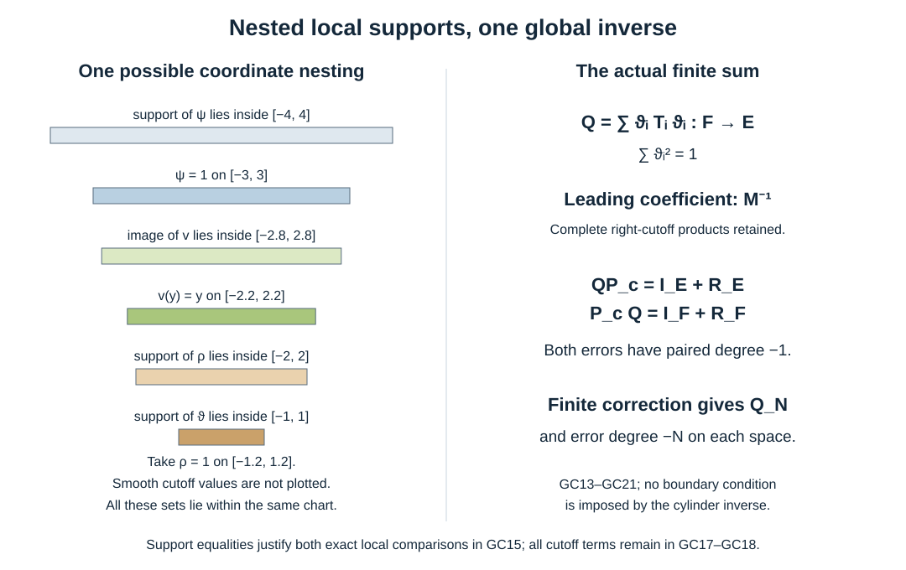

# Global collar inverses with complete normal coefficients

Original exposition: AN-04 course project, GPT-6 Astra (OpenAI), Ultra, 7 October 2026. This text, its original diagram and check script are dedicated under CC0 1.0 Universal. Earlier linked components keep their own licences.

We construct an actual inverse to any prescribed finite error order for an elliptic collar polynomial. The construction preserves its original leading bundle map, all tangential coefficient operators and both error spaces. In particular, its normal expansion includes the tangential smoothing parts that can still produce a singular normal diagonal. This supplies the global input for the later half-space argument; an inverse on the full cylinder does not yet impose a boundary condition.

## 1. The original operator and the proved inputs

Let \(Y\) be a compact smooth manifold without boundary, with finite-rank complex bundles \(E_Y,F_Y\), Hermitian norms and a positive smooth density. Fix a collar and identifications of the bundles there with their pullbacks from \(Y\). Preferred coordinates, frames and density expressions on \(Y\) are independent of the inward normal coordinate \(r\). Write \(D_r=-i\partial_r\). On a neighborhood of \(r=0\), including a small negative interval, the given operator is
\[
 P^b=\sum_{j=0}^{m}P_j(r)D_r^{m-j}:E_Y\longrightarrow F_Y,
 \quad m\ge1,\quad P_j(r)\in\Psi_{\rm phg}^{j},
 \quad P_0(r)=M(y,r).
 \tag{GC1}
\]
Here \(M\) is a bundle-map multiplication operator. All families are smooth, with the full local symbol and kernel seminorms. The homogeneous polynomial of total degree \(m\) is elliptic at \(r=0\), for every nonzero real \((\eta,\kappa)\). A tangential homogeneous term of positive degree is assigned its continuous value zero at \(\eta=0\); the degree-zero leading normal coefficient is exactly \(M\). The entire lower-order tangential symbols remain in GC1.

For an original manifold \(X\) with boundary \(Y\), suppose \(P=P^b+P^i\), where both kernel variables of \(P^i\) stay outside a fixed narrower collar. We retain \(P^i\) and the given extension of the coefficient families. Our construction agrees with this original \(P\) near the boundary; it does not require an elliptic operator on a topological double of \(X\).

The [mixed-calculus companion](../20261007-mixed-boundary-calculus/mixed-boundary-calculus.md), MB:B1–F1, proves inversion, exact composition, the enhanced first-frequency derivative estimate, distributional action and every real two-weight Sobolev map. The [normal inverse companion](../20261007-normal-inverse-expansions/normal-inverse-expansions.md), NI:N1–N4 and NI:F1–F3, proves the actual two-tail inverse and its complete separated kernels, together with the ordered formal inverse. The [paired product companion](../20261007-paired-normal-composition/paired-normal-composition.md), PN:C1–Q1, proves the class \(\mathcal L^a\), its actual composition and both local inverse errors in \(\mathcal L^{-1}\), including every differentiated remainder. We use its notation
\[
 R=1+|(\eta,\kappa)|,\quad T=1+|\eta|,\qquad
 \partial_x^\beta\partial_\eta^\alpha\partial_\kappa^v a
       =O(R^{q-v}T^{b-|\alpha|})\quad(a\in S^{q,b}).
 \tag{GC2}
\]
The Fourier, integral and finite smooth cutoff proofs are the earlier P3:L1–L3, P3:M4 and U001:U001-A4. Exact ordinary tangential symbols and operator products are P2:OP3–OP6. The proof map fixes their full versions and dependencies. In dimension zero, the tangential integrals have one point; the same arguments are finite bundle-matrix calculations.

## 2. One elliptic cylinder, with the original coefficients

At \((\eta,\kappa)=(0,1)\), the principal polynomial is \(M(y,0)\). Thus it is invertible. The unit sphere bundle over compact \(Y\), including unit input vectors, is compact by a finite trivializing cover and the Euclidean compactness theorem. The minimum of the norm of the principal polynomial applied to a unit vector is consequently positive. Continuity gives a common interval \([-\delta,\delta]\) on which this lower bound and the inverse of \(M\) remain uniform.

Choose \(0<2\delta_0<\delta\), also inside the collar where the interior kernel is absent, and a smooth even function \(0\le\nu\le1\), equal to one for \(|r|\le\delta_0\) and zero for \(|r|\ge2\delta_0\). The finite cutoff construction supplies \(\nu\). Set
\[
 h(r)=\int_0^r\nu(s)\,ds,\qquad
 P_c=\sum_{j=0}^mP_j(h(r))D_r^{m-j}.
 \tag{GC3}
\]
Then \(h=r\) on \([-\delta_0,\delta_0]\), \(|h|\le2\delta_0<\delta\), and \(h\) is constant on either sufficiently distant half-line. Every derivative is bounded. The chain rule gives uniform coefficient seminorms on the whole normal line. GC3 has the same original coefficient operators at the displayed parameter values, in the same order. It agrees with \(P\) in the smaller original collar. Its principal polynomial is uniformly elliptic on the full cylinder because \(h(\mathbb R)\) lies in the compact interval just checked.

In statements about the cylinder inverse, abbreviate the actual families \(P_j(h(r))\) by \(P_j\), and \(M(y,h(r))\) by \(M\). In particular \(\delta=-i\partial_r\) differentiates these composed families, with every derivative of \(h\) included. Section 8 returns to the original coefficients \(P_j(r)\) explicitly.

The cylinder polynomial belongs to \(\mathcal L^m\). Its complete normal coefficients are precisely the finite list \(P_j\), followed by zeros. On a normal cone, any omitted term with \(j\ge L\) has bound \(|\kappa|^{m-j-v}T^{j-|\alpha|}\le C|\kappa|^{m-L-v}T^{L-|\alpha|}\); this proves every PN1 remainder by finite summation. The global mixed bounds use \(T^j|\kappa|^{m-j}\le R^m\), with the same derivative count. At separated tangential supports each coefficient kernel is smooth, and its actual normal polynomial has the identical coefficients and PN2 remainders. The leading multiplication kernel is zero there. Thus the global polynomial satisfies both parts of the paired class definition.

The rest of this construction fixes \(P_c\). Independence statements below compare choices for this same operator; they do not identify different cylinder extensions away from their common original collar.

## 3. Exact local models and their genuine matrix inverses

Choose finitely many coordinate balls with bundle frames and compact smaller cores covering \(Y\). In the \(i\)-th ball choose nested supports for scalar functions \(\vartheta_i,\rho_i,\psi_i\), with \(\rho_i=1\) near \(\operatorname{supp}\vartheta_i\), and with \(\psi_i=1\) on a larger closed ball containing \(\operatorname{supp}\rho_i\). Choose all cores small enough that this larger ball and a neighborhood of it remain inside the chart. A finite nonnegative subordinate partition \(\lambda_i\) exists by U001-A4; put
\[
 \vartheta_i=\frac{\lambda_i}{(\sum_k\lambda_k^2)^{1/2}},
       \qquad \sum_i\vartheta_i^2=1.
 \tag{GC4}
\]
The denominator is positive everywhere, and smooth square roots and the chain rule prove smoothness. Refine the balls before choosing the cutoffs if necessary.

In these actual frames and density coordinates, let \(p_{ij}(y,r,\eta)\) be the exact left symbol of \(\psi_iP_j\psi_i\), using those cylinder families. One obtains it by Fourier transformation in the compact kernel's tangential input-output difference. Ordinary tangential calculus gives \(p_{ij}\in S^j\), smoothly and uniformly in \(r\), including its smoothing symbol part. For \(j=0\) this symbol is exactly \(\psi_i^2M\).

There is a smooth map \(v_i:\mathbb R^d\to\) the region where \(\psi_i=1\), equal to the identity on a neighborhood of \(\operatorname{supp}\rho_i\), with compact image and bounded derivatives. To construct it, take a coordinate ball centered at \(y_i\), choose \(\zeta_i=1\) on the required smaller ball and supported in a slightly larger ball where \(\psi_i=1\), and set \(v_i(y)=y_i+\zeta_i(y)(y-y_i)\). Convexity of the larger ball keeps its image inside that ball; away from it the map is constant. Define
\[
 p_i(y,r,\eta,\kappa)
     =\sum_{j=0}^m p_{ij}(v_i(y),r,\eta)\kappa^{m-j},
       \qquad P_i=\operatorname{Op}(p_i).
 \tag{GC5}
\]
All global base estimates now follow from the chain rule on a compact image. Each frequency derivative has the enhanced order \(S^{m-1,0}\), by PN:E0. This extension keeps the same elliptic polynomial evaluated at an actual base point; it does not interpolate elliptic matrices along an unchecked convex combination.

Let \(H_i\) be its full homogeneous principal polynomial. There are constants \(c_i>0,C_i\ge0\), uniform in the model's base variables, such that
\[
 \|H_i(x,\xi)u\|\ge c_i|\xi|^m\|u\|,\qquad
 \|p_i(x,\xi)-H_i(x,\xi)\|\le C_iR^{m-1}.
 \tag{GC6}
\]
For the second estimate, a positive-degree tangential coefficient of degree \(j\ge1\) differs from its leading homogeneous term by \(O(T^{j-1})\), also when \(|\eta|\le1\), where both bounded expressions are compared directly. Multiplying by \(|\kappa|^{m-j}\) gives at most \(R^{m-1}\). The \(j=0\) coefficient is exactly \(M\), so has no remainder. Finite summation proves GC6; no derivative of a homogeneous term at \(\eta=0\) is needed for this zeroth-order comparison.

Put \(s_i=\max(1,2^mC_i/c_i)\). For \(s=|\xi|\ge s_i\), the ordered factorization \(p_i=H_i(I+H_i^{-1}(p_i-H_i))\) has the second summand of norm at most \(1/2\), since \(R/s\le2\). The proved matrix geometric inverse yields
\[
 |\xi|^m\|p_i^{-1}\|\le2/c_i,
       \qquad \|p_i^{-1}\|\le(2^{m+1}/c_i)R^{-m}.
 \tag{GC7}
\]
Choose a smooth \(\theta_i\) zero for \(|\xi|\le2s_i\), one for \(|\xi|\ge3s_i\), and define \(\tau_i=\theta_i p_i^{-1}\). Its support has an open neighborhood of invertibility. MB:B2–B3 and NI:N3–N4 give the full mixed estimates, the enhanced derivatives and its common two-tail expansion, with ordered coefficients \(c_{in}\in S^n_{\rm tan}\) and \(c_{i0}=M_i^{-1}\).

Quantize \(\tau_i\), and multiply its normal kernel by a smooth cutoff equal to one near \(r=s\), supported in \(|r-s|\le L_i\). Call the resulting operator \(T_i\). PN:C1 proves that this changes each compact localization only by a smooth full kernel and preserves all normal coefficients. The estimates are uniform along the cylinder: every coefficient seminorm was uniform in \(r\), the normal difference stays in a fixed bounded interval for the retained kernel, and the integration-by-parts estimates away from the normal diagonal have those same uniform constants. Consequently PN:E1–E2 gives the actual identities
\[
 T_iP_i=I_E+R_{E,i},\qquad P_iT_i=I_F+R_{F,i},
       \qquad R_{E,i},R_{F,i}\in\mathcal L^{-1}.
 \tag{GC8}
\]
The separate source and target frame transfers are understood in each identity.

## 4. Preferred chart changes preserve every remainder

We verify the transport needed to patch the actual operators. Let \(y=\psi(v)\) be the inverse tangential coordinate change, with \(r\) unchanged. On a sufficiently small compact coordinate product, write
\[
 \psi(v)-\psi(w)=L(v,w)(v-w),\qquad
 L(v,w)=\int_0^1D\psi(w+t(v-w))\,dt.
 \tag{GC9}
\]
After shrinking around the diagonal, \(L\) is invertible and both it and its inverse have bounded derivatives. Indeed \(L(v,v)=D\psi(v)\); the determinant is continuous and nonzero there. Compactness supplies finitely many such products. The old phase becomes the new tangential phase by the exact change \(\eta_{\rm old}=L^{-T}\zeta\), leaving \(\kappa\) untouched. The transported amplitude includes the factor
\[
 \frac{|\det D\psi(w)|}{|\det L(v,w)|},
 \tag{GC10}
\]
times the separate smooth target frame at \(v\) and inverse source frame at \(w\). This includes the actual input-density change; with other smooth density conventions the corresponding ratios are retained. On the diagonal GC10 equals one. No scalar density factor is inserted into the leading multiplication map.

On the compact coordinate product the old and new \(T\) weights are comparable, as are the \(R\) weights, since \(L^{-T}\) and its inverse are bounded. A base derivative of \(L^{-T}\zeta\) inserts a factor of size \(T\) together with a tangential frequency derivative costing \(T^{-1}\). Iterating the chain rule proves that the transformed amplitude of any \(S^{a,b}\) symbol has exactly the same \(R^{a-v}T^{b-|\alpha|}\) estimates after all derivatives. Matrix and density factors contribute only bounded base derivatives.

Here is the full passage from that amplitude \(A(v,w,r,\eta,\kappa)\) to a left symbol, including normal remainders. Its exact expression is
\[
 a'(v,r,\eta,\kappa)=(2\pi)^{-d}\operatorname{Os}\iint
       e^{-ih\cdot\zeta}A(v,v+h,r,\eta+\zeta,\kappa)
                          \,dh\,d\zeta.
 \tag{GC11}
\]
The \(h\) support is compact. Apply \((1-\Delta_h)^J\) to the amplitude and divide by \((1+|\zeta|^2)^J\); integration by parts proves equality to this absolutely convergent expression. After any prescribed derivatives, the amplitude estimates and both signed Peetre inequalities of PN5 give an integrable bound
\(CR^{a-v}T^{b-|\alpha|}(1+|\zeta|)^{K-2J}\).
Choose \(2J>K+d\). Derivatives in \(h\) satisfy the same weight estimate by the paired chain-rule calculation, so increasing \(J\) does not raise the displayed \(R,T\) powers. Compact symbol approximation, Fourier inversion and these bounds identify GC11 with the actual transported kernel and justify every differentiation. This proves transport of \(S^{a,b}\), including signed real orders, without an ordinary isotropic estimate being applied to the mixed class.

Suppose now that \(a\) satisfies PN1 at degree \(a_0\). In the normal cone split \(\zeta\) into \(|\zeta|\le\varepsilon|\kappa|\) and its complement, exactly as PN:T1. In the small-shift region, choose the cone constant large enough that the old transformed frequency remains in its normal cone. Each differentiated length-\(K_0\) remainder, including derivatives of \(L\), has the bound
\[
 C|\kappa|^{a_0-K_0-v}T^{K_0-|\alpha|}
             (1+|\zeta|)^{K-2J}.
 \tag{GC12}
\]
The chain-rule factors again pair \(T\) with \(\partial_\eta\). Choose \(J\) after the requested derivatives and \(K_0\), then integrate. In the complementary region use the original global mixed bounds; arbitrary integrations by parts in \(h\) make its integral and the removed coefficient tails decay to any prescribed normal power. Negative tangential exponents are retained by the two-sided Peetre bounds. Derivatives of the shift cutoff gain the prescribed inverse normal power and are supported in that already controlled region. This proves every PN1 remainder for the transported left symbol.

The coefficient in GC11 at each normal power is the exact tangential transport of the complete coefficient operator, with GC10 and both frame factors. It is in \(\Psi^{p}\) at index \(p\), by the same amplitude estimate with tangential order \(p\). It is not merely the pointwise cotangent transform of a principal symbol. Away from the tangential diagonal, transport the actual kernel in its two independent tangential variables. Smooth substitutions, density factors and all their derivatives preserve PN2, since the normal phase \((r-s)\kappa\) is unchanged. Products not lying in one small coordinate neighborhood are of this separated type. Thus \(\mathcal L^{a_0}\), its full compatible coefficient operators and all separated-kernel remainders are preserved by the preferred chart/frame/density transfers. Smooth normal properness changes are already PN:C1.

## 5. The global operator and both complete error formulas

Use the actual bundle transfers to regard \(\vartheta_iT_i\vartheta_i\) as a map from \(F_Y\) to \(E_Y\), extended by zero outside its tangential chart supports, and set
\[
 Q=\sum_i\vartheta_iT_i\vartheta_i:F_Y\longrightarrow E_Y.
 \tag{GC13}
\]
This is a finite actual kernel sum. It is normally proper, since \(Y\) is compact and the finitely many normal supports have a common finite width. Section 4 and PN composition imply \(Q\in\mathcal L^{-m}\). Its complete normal coefficients are
\[
 \mathcal Q_n(r)=\sum_i\vartheta_i\operatorname{Op}_y(c_{in}(r))\vartheta_i
        \in\Psi^n(F_Y,E_Y),\qquad \mathcal Q_0=M^{-1}.
 \tag{GC14}
\]
All transfers and the complete right tangential product are part of GC14. The equality for \(n=0\) follows because each \(c_{i0}\) is multiplication by the original bundle inverse and \(\sum_i\vartheta_i^2=1\). Right cutoff composition preserves every remainder by PN:T1; Section 4 proves compatibility across charts. PN:C1 gives the corresponding full separated kernels. This establishes an expansion of the actual finite sum, not a formally patched coefficient series.

The local models agree with the true cylinder polynomial exactly under the nested tangential supports:
\[
 \vartheta_iP_c\rho_i=\vartheta_iP_i\rho_i,
        \qquad \rho_iP_c\vartheta_i=\rho_iP_i\vartheta_i.
 \tag{GC15}
\]
Indeed \(\psi_i=1\) on both supports, and \(v_i\) is the identity on the relevant output support. The symbol was taken from the exact cut-off coefficient kernel, so its smoothing part also agrees. Since the scalar cutoffs do not depend on \(r\), no normal derivatives of them occur in GC15.

For any scalar tangential cutoff \(f(y)\), the complete commutators have the paired orders
\[
 [P_c,f]\in\mathcal L^{m-1},\qquad
 [P_i,f]\in\mathcal L^{m-1},\qquad
 [T_i,f]\in\mathcal L^{-m-1}.
 \tag{GC16}
\]
The last and the local polynomial assertion are PN:E2. For the global polynomial, the top coefficient \([M,f]\) is zero and \([P_j,f]\in\Psi^{j-1}\) for \(j\ge1\), by the exact tangential commutator formula PN8. Reindexing \(j-1\) gives degree \(m-1\), the full finite expansion and every PN1 estimate. The separated coefficient kernels are smooth tangentially with normal polynomial degree at most \(m-1\), so PN2 also holds globally. Section 4 gives the same result in overlapping frames.

Define the local errors as in GC8. Insert \(\rho_i+(1-\rho_i)=1\), use GC15, and move the middle scalar cutoff once. This gives two different exact identities:
\[
 \begin{aligned}
 \vartheta_iT_i\vartheta_iP_c
   ={}&\vartheta_i^2
       +\vartheta_i^2R_{E,i}\rho_i
       +\vartheta_i[T_i,\vartheta_i]P_i\rho_i\\
     &+\vartheta_iT_i\vartheta_i,P_c,
 \end{aligned}
 \tag{GC17}
\]
\[
 \begin{aligned}
 P_c\vartheta_iT_i\vartheta_i
   ={}&\vartheta_i^2
       +\vartheta_iR_{F,i}\vartheta_i
       +\rho_i[P_i,\vartheta_i]T_i\vartheta_i\\
     &+(1-\rho_i)[P_c,\vartheta_i]T_i\vartheta_i.
 \end{aligned}
 \tag{GC18}
\]
To verify GC17, write \(\vartheta_iP_c(1-\rho_i)=\vartheta_i,P_c\), replace its remaining \(\rho_i\) part by GC15, and use \(T_i\vartheta_i=\vartheta_iT_i+[T_i,\vartheta_i]\). Then \(T_iP_i=I_E+R_{E,i}\) and \(\vartheta_i^2\rho_i=\vartheta_i^2\) give the displayed result. For GC18 first use \((1-\rho_i)P_c\vartheta_i=(1-\rho_i)[P_c,\vartheta_i]\), then GC15, then \(P_i\vartheta_i=\vartheta_iP_i+[P_i,\vartheta_i]\), and finally \(P_iT_i=I_F+R_{F,i}\). This verifies every factor and sign without merging the two error spaces.

Each nonidentity term in GC17–GC18 is in \(\mathcal L^{-1}\): its order is either \(-1\), \((-m-1)+m\), or \(-m+(m-1)\), by GC16 and PN:K1. These are paired-class statements, so they include every normal remainder and the separated kernels, not just the global mixed-symbol bound. Summing and using GC4 proves
\[
 QP_c=I_E+\mathcal R_E,\qquad P_cQ=I_F+\mathcal R_F,
     \quad \mathcal R_E\in\mathcal L^{-1}(E_Y),
     \quad \mathcal R_F\in\mathcal L^{-1}(F_Y).
 \tag{GC19}
\]
All identities act on smooth compactly supported sections and on distributions, with their proper operator compositions.

## 6. Arbitrary finite gain and exact choice independence

The actual hypotheses of PN:Q1 are now proved for this global seed. For every integer \(N\ge1\), set
\[
 Q_N=Q\sum_{j=0}^{N-1}(-\mathcal R_F)^j
       =\sum_{j=0}^{N-1}(-\mathcal R_E)^jQ\in\mathcal L^{-m}.
 \tag{GC20}
\]
The equality follows from \(\mathcal R_EQ=Q\mathcal R_F\); no factors are commuted. Its two actual errors are
\[
 P_cQ_N=I_F-(-\mathcal R_F)^N,\qquad
 Q_NP_c=I_E-(-\mathcal R_E)^N,
          \quad \mathcal R_F^N,\mathcal R_E^N\in\mathcal L^{-N}.
 \tag{GC21}
\]
The first \(N\) normal coefficients are the unique complete ordered inverse coefficients of NI:F2. In particular the second coefficient, once \(N\ge2\), is
\[
 C_1=-M^{-1}P_1M^{-1}-m\,\delta(M^{-1}),
       \qquad \delta=-i\partial_r.
 \tag{GC22}
\]
All products in this formula are complete tangential operator products. The first correction removes the possibly partition-dependent \(\mathcal Q_1\); Exercise 1 verifies the cancellation explicitly.

Construct \(\widetilde Q_N\) using different model extensions, frequency or properness cutoffs, preferred charts, frames or square partition, for the same fixed \(P_c\). Both have the proved GC21 errors. Direct expansion gives
\[
 Q_N-\widetilde Q_N
  =(Q_NP_c-I_E)\widetilde Q_N
       -Q_N(P_c\widetilde Q_N-I_F)
       \in\mathcal L^{-m-N}(F_Y,E_Y).
 \tag{GC23}
\]
PN composition proves the order of each term. Thus the class modulo exactly that lower order is independent of these choices. The same proof applies to any proper degree-\(-m\) operator with both errors of degree \(-N\) for \(P_c\). Individual lower-order full symbols may depend on the construction. Nothing here sums an infinite operator series or declares a finite error smooth.

## 7. All real two-weight Sobolev orders

The local norms are those proved in MH:B1–B3:
\(\|u\|_{s,t}=\|\operatorname{Op}(w_{s,t})u\|_2\), with
\(w_{s,t}=(1+|\eta|^2+\kappa^2)^{s/2}(1+|\eta|^2)^{t/2}\).
These smooth quadratic weights are comparable to \(R^sT^t\); they are not numerically identical to them.

They give equivalent norms under compactly localized preferred chart and frame changes for every real \(s,t\). We prove this including the output outside the coordinate patch. Initially let \(u\) be smooth and supported in a fixed tangential chart core, and let \(U\) be the actual transfer to the new chart, extended by zero there. Write \(W=\operatorname{Op}(w_{s,t})\) in the new coordinates. Choose a compact output cutoff \(\chi\) inside that chart, equal to one on a neighborhood of the tangential support of \(Uu\). On its support the inverse transfer is defined. Put \(A=U^{-1}\chi WU\) and \(B=(1-\chi)WU\), including the fixed input-core cutoff in these operators. Section 4 places \(A\) in \(S^{s,t}\), with all seminorms, because its amplitude argument allowed arbitrary real second order. The transfer and its inverse are bounded on the indicated local \(L^2\) spaces by change of variables, the positive upper and lower Jacobian bounds and the bounded frame matrices.

The full output tail \(B\) has its own estimate. Take the Fourier transform only in \(r\); the chart transfer is independent of \(r\), so it leaves \(\kappa\) fixed. If the new input point corresponding to the old variable \(y\) is \(\phi(y)\), the tangential phase in this tail is \((v-\phi(y))\cdot\eta\), with \(|v-\phi(y)|\ge\epsilon>0\). Its amplitude contains the actual input Jacobian and frame factors and the weight \(w_{s,t}(\eta,\kappa)\). Integrate by parts \(N\) times in \(\eta\) using this nonzero separation. After any prescribed base derivatives, with their finite frequency cost \(T^D\), and \(j\) normal-frequency derivatives, the integrand is bounded by \(CR^{s-j}T^{t+D-N}\) times separation factors. Since \(\langle\kappa\rangle\le R\le2\langle\kappa\rangle T\), choose \(N>t+D+|s-j|+d\) to make the integral at most \(C\langle\kappa\rangle^{s-j}\). Increasing \(N\) also gives arbitrary decay in the unbounded output variable \(v\), because the input core is compact and the separation grows like \(1+|v|\) there. These estimates include all derivatives of the cutoffs, frame matrices and coordinate map.

Thus the tail kernel is smooth in both tangential variables, compactly supported in its input variable, rapidly decreasing in its output variable, and has normal-frequency order \(s\). Fourier transformation in the input-output tangential difference gives every negative tangential symbol order. Indeed, integrate by parts in the compact smooth input variable; derivatives of the Fourier phase and output-variable derivatives insert only finitely many frequency or coordinate powers, absorbed by taking more input derivatives and using the already arbitrary output decay. The same inequalities comparing \(R\) and \(\langle\kappa\rangle\) show that its left symbol lies in \(S^{s,b}\) for every real \(b\), with every derivative. In particular it is in \(S^{s,t}\). MB:F1 bounds both \(A\) and \(B\) from the old \(H_{(s,t)}\) norm to \(L^2\). Since \(WUu=UAu+Bu\), we obtain the full norm estimate
\[
 \|Uu\|_{s,t,\mathrm{new}}
       \le C\|Au\|_2+\|Bu\|_2
       \le C'\|u\|_{s,t,\mathrm{old}}.
 \tag{GC24}
\]
Apply the same argument to the inverse chart transfer for the reverse bound, then extend by the proved local Hilbert density. In tangential dimension zero no separated tangential tail occurs. This verifies the entire coordinate norm; restricting the output of the weight operator to the coordinate core alone would not have proved GC24.

Define the cylinder norm using a finite tangential partition and the local full-line normal norms. The comparison just proved and MB:F1 for scalar cutoffs prove equivalence for different such partitions: express each localized section as the finite sum of its products with the second partition, apply GC24 on each overlap, and sum the squared estimates with the finite Cauchy–Schwarz inequality. Completeness follows by completing these compatible local Hilbert spaces with their equal overlap distributions. More explicitly, a norm-Cauchy sequence converges in every local Hilbert space by MH:B3; their continuous distributional embeddings identify equal overlap limits, which glue by the finite partition, and the same norm estimates give convergence to that section. Smooth compactly supported sections are dense by local Schwartz approximation and the finite partition: multiply each Schwartz approximant by smooth cutoffs expanding in the normal variable. This converges in the Schwartz topology, hence in each of the polynomially weighted Hilbert norms. Negative orders use the same Hilbert construction, not a separate formal interpretation.

The complete local and separated symbols of \(P_c,Q_N,\mathcal R_E^N,\mathcal R_F^N\) now give, by MB:F1 and the finite chart argument,
\[
 \begin{aligned}
 P_c &:H_{(s+m,t)}(E_Y)\to H_{(s,t)}(F_Y),\\
 Q_N &:H_{(s,t)}(F_Y)\to H_{(s+m,t)}(E_Y),\\
 \mathcal R_E^N &:H_{(s,t)}(E_Y)\to H_{(s+N,t)}(E_Y),\\
 \mathcal R_F^N &:H_{(s,t)}(F_Y)\to H_{(s+N,t)}(F_Y).
 \end{aligned}
 \tag{GC25}
\]
For a separated kernel, tangential Fourier transformation gives every negative tangential order: repeated integration by parts in its smooth compact tangential variable bounds its symbol by \(\langle\kappa\rangle^{a-v}T^{-K}\) for arbitrary \(K\). The inequalities \(\langle\kappa\rangle\le R\le2\langle\kappa\rangle T\) transfer this to \(S^{a,b}\) for any fixed \(b\), so the same MB:F1 bound applies. This retains those kernels in the finite partition. All cylinder estimates are uniform in the normal variable by GC3 and the fixed-width proper supports. Density extends GC21 to the displayed common Hilbert domains. The improvement is in \(s\); no additional improvement in \(t\) has been assumed.

## 8. Localization back to the original collar

Attach only the small negative collar to \(X\), extend the fixed pullback bundles there, and retain the given coefficient families for negative \(r\). Extend \(P^i\) by zero across this seam, which is smooth since both of its kernel variables stay away from it. This gives \(\widehat P\) agreeing with the original operator on \(X\), and with \(P_c\) wherever \(|r|<\delta_0\).

Choose \(z\in C_c^\infty((-\delta_0,\delta_0))\), equal to one near zero, and let \(S_N=zQ_Nz\), extended by zero as a compact normal kernel on \(\widehat X\). Since tangential coefficients commute with \(z(r)\), the exact differential commutator is
\[
 [\widehat P,z]=\sum_{j=0}^m\sum_{\ell=1}^{m-j}
       \binom{m-j}{\ell}P_j(r)(D_r^\ell z)D_r^{m-j-\ell}
            \in\mathcal L^{m-1}.
 \tag{GC26}
\]
There is no derivative of \(P_j\) here, because it stands to the left of the normal differential power. At normal index \(j+\ell-1\) relative to degree \(m-1\), its tangential order is \(j\le j+\ell-1\); the finite polynomial and every differentiated mixed estimate give the asserted paired order, including separated kernels. The interior term has zero composition with \(z\). Direct multiplication of GC21 yields
\[
 \begin{aligned}
 S_N\widehat P&=z^2I_E-z(-\mathcal R_E)^Nz
                         +zQ_N[z,\widehat P],\\
 \widehat P S_N&=z^2I_F-z(-\mathcal R_F)^Nz
                         +[\widehat P,z]Q_Nz.
 \end{aligned}
 \tag{GC27}
\]
The displayed commutator errors have degree \(-1\); their order is not improved merely by choosing a larger \(N\). If \(\chi\) is supported where \(z=1\), then \([z,\widehat P]\chi=0\) and \(\chi[\widehat P,z]=0\) exactly: the derivatives of \(z\) are supported away from \(\chi\), and normal differential operators do not enlarge normal support. Thus
\[
 \chi(S_N\widehat P-I_E)\chi\in\mathcal L^{-N},\qquad
 \chi(\widehat P S_N-I_F)\chi\in\mathcal L^{-N}.
 \tag{GC28}
\]
These are full-extension, two-sided localized identities. Zero extension from the half-collar produces normal boundary distributions when \(\widehat P\) differentiates it. The complete source-jet formula, one-sided layer maps and traces remain to be supplied before using GC28 as part of a boundary problem.

## 9. Four exercises with complete solutions

**1. Removal of the first partition coefficient.** Let \(\mathcal Q_1\) be the actual second coefficient in GC14. Compute the first normal coefficient of each error in GC19 and the second coefficient of \(Q_2\).

**Solution.** The proved product formula PN12 gives
\[
 F_1=M\mathcal Q_1+mM\delta(M^{-1})+P_1M^{-1},\qquad
 E_1=\mathcal Q_1M-mM^{-1}\delta M+M^{-1}P_1.
 \tag{GC29}
\]
These live on \(F_Y\) and \(E_Y\), respectively. Differentiating \(MM^{-1}=I_F\) proves \(F_1M=ME_1\), with exactly the displayed order. The second coefficient of \(Q_2=Q-Q\mathcal R_F\) is \(\mathcal Q_1-M^{-1}F_1\). Expanding cancels \(\mathcal Q_1\) and gives GC22. The left form \(Q-\mathcal R_EQ\) gives the same result by the exact intertwining identity. Thus the cancellation applies to the complete tangential operator, including its smoothing part.

**2. Why two cutoff terms must be retained.** Explain why \(\vartheta_iT_i\vartheta_iP_c\) need not equal \(\vartheta_i^2T_iP_i\), even if the local model is exact on the chart core.

**Solution.** The input may lie outside \(\operatorname{supp}\rho_i\), where a tangential pseudodifferential coefficient can still connect it to the core at the same normal coordinate. That contribution is \(\vartheta_iT_i\vartheta_i,P_c\). On the retained input core, moving the middle cutoff across \(T_i\) gives \(\vartheta_i[T_i,\vartheta_i]P_i\rho_i\). Both terms appear in GC17; their paired degrees are \(-1\), by GC16 and PN composition. Their small order makes them correctable, but does not make either identity term vanish. A diagonal matrix cutoff and a matrix with a nonzero off-diagonal entry already give a nonzero commutator.

**3. A variable leading coefficient in the cutoff commutator.** For \(P=M(r)D_r^3+A(r)D_r+B(r)\), compute \([P,z]\).

**Solution.** Apply the ordinary product rule three times, retaining every coefficient on the left:
\[
 [P,z]=M\bigl(3(D_rz)D_r^2+3(D_r^2z)D_r+D_r^3z\bigr)
                      +A(D_rz).
 \tag{GC30}
\]
The \(B\) term commutes with the scalar multiplier. No derivative of \(M\) or \(A\) occurs; such terms would result from moving coefficients through \(D_r\), which this operator does not do. The support of every displayed coefficient lies where a positive derivative of \(z\) is nonzero. This proves the exact vanishing used in GC28 when an adjacent normal cutoff is supported in the constant-one region.

**4. Changing the normal coordinate can change this class.** In one tangential dimension, take a smoothing operator \(K\) whose smooth kernel \(k(y,z)\) is nonzero at two distinct nearby tangential points. Put \(P=D_r^2+D_y^2+KD_r\). Explain why the change \(v=y\), \(s=a(y)r\), for suitable nonconstant \(a>0\), can take \(P\) outside the fixed-normal-coordinate mixed class.

**Solution.** The principal polynomial is \(\kappa^2+\eta^2\), and \(KD_r\) is an allowed lower tangential coefficient of the original normal polynomial. Its kernel is \(k(y,z)D_r\delta(r-r')\). Choose the two points so that \(a(y)\ne a(z)\), and a nonzero old normal value \(r_0\). Under the change, this nonzero distribution has a singularity on \(s/a(v)=s'/a(w)\), at \(s=a(v)r_0\ne a(w)r_0=s'\). Smooth invertible density and coordinate factors leave a nonzero highest normal derivative of the delta distribution: test it against a function with a nonzero first derivative in a defining normal variable. It is supported on the displayed hypersurface and vanishes off it. A smooth function with that support would vanish by continuity, since the complement is dense. Thus this term remains singular there. The transformed differential part has kernel on the full diagonal, so cannot cancel this off-diagonal singularity. Every \(S^{2,0}\) kernel is smooth where \(s\ne s'\), by arbitrarily many normal-frequency integrations by parts, as PN:C1 proved. Hence the transformed operator is not in that mixed class. This explains why the fixed collar is part of the hypotheses; it does not obstruct the preferred tangential transfers proved in Section 4.

## 10. The resulting input for the boundary argument

The left panel gives an explicit possible nesting of coordinate support regions in one tangential chart; it plots support bounds rather than cutoff values. The right panel records the actual global construction and both error spaces, GC13 and GC19–GC21. Its leading coefficient is the original \(M^{-1}\). The complete proof retains all cutoff, density and frame factors hidden by a schematic picture.

We now have an actual normally proper global seed, its two paired degree-\(-1\) errors, all finite improvements, complete normal coefficients, choice independence at the stated degree, all-real cylinder Sobolev maps and the exact localized return to the original collar. Half-space volume and supported-source maps, full normal source jets, one-sided traces and the stable boundary projection are subsequent analytic steps. None is inferred solely from the cylinder identities.

The approved mathematical source is Lars Hörmander, *The Analysis of Linear Partial Differential Operators III*, Springer 2007, ISBN 978-3-540-49938-1. AN-03's existing *Generalized collar Fredholm calculus*, Sections 14 and 16, was read for the original collar object, nested local models and both global errors. This independently written proof uses the current AN-04 mixed, two-tail and paired-product proofs, with explicit transport of every remainder. Exact source versions and transitive programme proofs are recorded in the accompanying map. A source citation supplies credit; the proofs used here are present above or in the exact earlier components.
