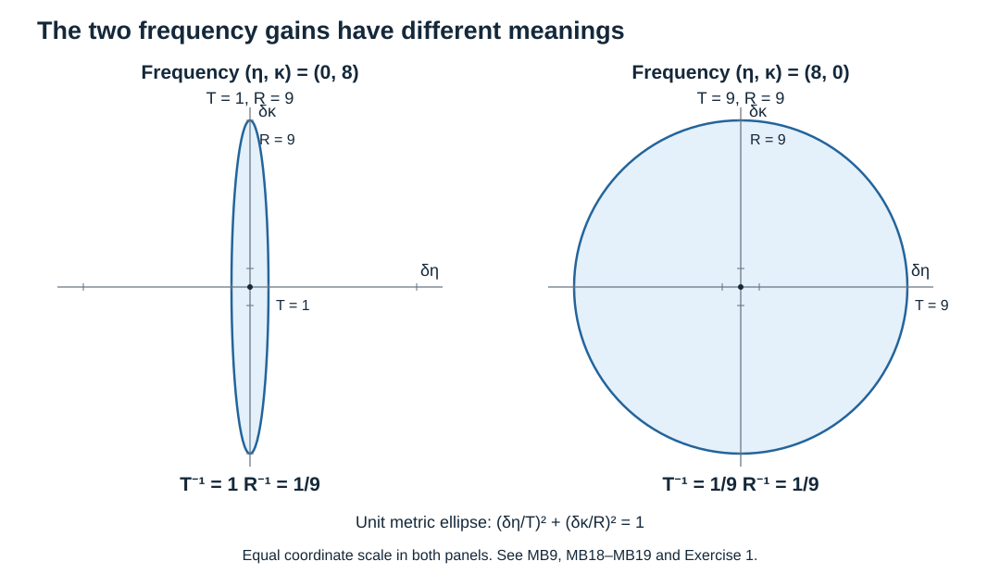

# Mixed symbols: inversion, composition and the full Sobolev scale

Original receiving exposition: AN-04 course project, GPT-6 Astra (OpenAI), Ultra, 7 October 2026. This new text and its accompanying original diagram and check script are dedicated under CC0 1.0 Universal. Earlier programme components linked below retain their own notices and licences.

The purpose is to keep the normal and tangential frequency estimates distinct when constructing a boundary parametrix. The complete proofs below supply mixed inversion, actual operator composition, both kinds of composition error, and boundedness for every pair of real Sobolev orders. The later half-space parametrix and elliptic boundary theorem require further proofs; this companion does not assert those conclusions.

## A. Coordinates and exact earlier inputs

Use \(x=(y,r)\in\mathbb R^{n-1}\times\mathbb R\), \(\xi=(\eta,\kappa)\), \(n\ge1\), and
\[
 R=1+|\xi|,\qquad T=1+|\eta|,\qquad
 Q=(1+|\xi|^2)^{1/2},\qquad \lambda=(1+|\eta|^2)^{1/2}.
 \tag{MB1}
\]
For \(n=1\), the tangential variable is absent and \(T=\lambda=1\). Coefficients are maps between fixed finite-dimensional complex Hermitian spaces, with operator norms; products have the displayed order. The Fourier transform is \(\widehat u(\xi)=\int e^{-ix\cdot\xi}u(x)\,dx\), inverse coefficient \((2\pi)^{-n}\), and \(D=-i\partial\). Define
\[
 a\in S^{m,b}\quad\Longleftrightarrow\quad
 \|\partial_x^\beta\partial_\eta^\alpha\partial_\kappa^v a(x,\xi)\|
 \le C_{\beta\alpha v}R^{m-v}T^{b-|\alpha|}
 \quad\hbox{for every }\beta,\alpha,v.
 \tag{MB2}
\]
The estimates are global in the base variable. Write \(p_{m,b,L}\) for the maximum of the weighted suprema with total derivative order at most \(L\).

The following earlier proofs are used at their stated scope. Their exact versions and the transitive dependency graph are recorded in the accompanying proof map.

- [Two-weight foundations, Sections 2–4](../20261005-mixed-halfspace-foundations/two-weight-hilbert-spaces-and-traces.md): bracket comparison for signed orders; \(w_{s,t}=Q^s\lambda^t\in S^{s,t}\); complete spaces \(H_{(s,t)}\); and the onto isometry \(J_{s,t}=w_{s,t}(D):H_{(s,t)}\to L^2\), with Schwartz density and a continuous embedding in tempered distributions. These are nodes MH:B1–B3.
- [Quadratic multiplier proof, Sections 5–8](../20261004-free-intrinsic-graph/prerequisites/gauss-transform-estimates.md): the exact phase-dual hypotheses G12–G13, the global finite-seminorm estimate G21, and the full Taylor remainder G22. These are P2:QG5–QG8 and their proved predecessors. Section C below verifies these hypotheses for the mixed metric.
- [Fourier proof, Sections L1–L3](../20261004-free-intrinsic-graph/prerequisites/fourier-l2.md): inversion, tempered-distribution compatibility and Plancherel, nodes P3:L1–L3. [Ordinary operator proof](../20261004-free-intrinsic-graph/prerequisites/ordinary-operator-calculus.md), node P2:OP0, proves uniqueness of a distribution kernel from its products of test functions; only that uniqueness statement is used here.
- [Hilbert-coefficient packet proof, Section H3](../20261007-restored-first-order-systems/hilbert-coefficient-calculus-and-positivity.md): node SY:H9 proves the global \(L^2\) bound from finitely many bounded derivatives, including its explicit packet synthesis and Schur estimate. We use that bounded-derivative statement, which does not assume ordinary positive frequency-decay order.

Thus no operator result for an ordinary isotropic symbol class is silently applied to a mixed class.

## B. Products, inverses and the extra derivative hypothesis

Leibniz's rule and \(\|AB\|\le\|A\|\|B\|\) give
\[
 S^{m,b}S^{d,e}\subset S^{m+d,b+e},\qquad
 p_{m+d,b+e,L}(ab)\le C_Lp_{m,b,L}(a)p_{d,e,L}(b).
 \tag{MB3}
\]
Each summand has exactly the required powers because the derivative indices split between the two factors. The seminorms make each class complete: a Cauchy sequence and all its derivatives converge uniformly on compact sets; the fundamental theorem of calculus identifies the limits as derivatives of one smooth function. Passing to the limit in each weighted inequality, then applying it to the difference from a fixed sequence member, proves convergence in every seminorm.

Let \(p\in S^{m,0}(\operatorname{End}E)\). Choose \(\chi\in C_c^\infty(\mathbb R^n)\), put \(\theta=1-\chi\), and suppose \(p\) is invertible on a neighborhood of \(\mathbb R^n_x\times\operatorname{supp}\theta\), with
\[
 \|p(x,\xi)^{-1}\|\le C R^{-m}
 \quad\hbox{on }\mathbb R^n_x\times\operatorname{supp}\theta.
 \tag{MB4}
\]
Define \(q=\theta p^{-1}\) there and zero wherever \(\theta\) vanishes outside that neighborhood. This defines a smooth global function: each point of the closed support has a neighborhood with a smooth inverse (the determinant formula), and each point outside that support has a neighborhood on which \(\theta=0\). The definitions agree on overlaps.

For a combined base/frequency multiindex \(\mu\ne0\), differentiating \(pp^{-1}=I\) isolates the last derivative:
\[
 \partial^\mu p^{-1}
 =-p^{-1}\sum_{0<\nu\le\mu}\binom\mu\nu
          (\partial^\nu p)(\partial^{\mu-\nu}p^{-1}).
 \tag{MB5}
\]
Induct on \(|\mu|\). If \(\mu\) contains \(v\) normal and \(|\alpha|\) tangential frequency derivatives, every term on the right is bounded by a constant times \(R^{-m-v}T^{-|\alpha|}\): the two inverse factors contribute \(-2m\), the symbol contributes \(m\), and the frequency derivative indices add. This proves all inverse seminorms on the support in MB4. Derivatives hitting \(\theta\) have compact frequency support, where any fixed additional powers of \(R,T\) are bounded. Consequently
\[
 q\in S^{-m,0},\qquad pq=qp=\theta I.
 \tag{MB6}
\]
Only finitely many seminorms of \(p\), the inverse bound and cutoff derivatives enter any one seminorm of \(q\).

An additional assumption often available for a normal polynomial is
\[
 \partial_{\xi_j}p\in S^{m-1,0}\quad(1\le j\le n).
 \tag{MB7}
\]
This assertion includes all further derivatives in the indicated symbol norm. The normal case already follows from MB2; the tangential cases are stronger. The exact formula
\[
 \partial_{\xi_j}q=(\partial_{\xi_j}\theta)p^{-1}
                 -\theta p^{-1}(\partial_{\xi_j}p)p^{-1}
 \tag{MB8}
\]
and the just-proved derivative bounds show \(\partial_{\xi_j}q\in S^{-m-1,0}\). The compact-frequency first term has that order as well. This proof respects matrix order throughout; it never commutes a derivative of \(p\) with its inverse.

## C. The mixed metric and a uniformly controlled Gauss family

On the phase space \(X=(x,\xi)\), use the positive quadratic form
\[
 g_X(\delta x,\delta\eta,\delta\kappa)
   =|\delta x|^2+T^{-2}|\delta\eta|^2+R^{-2}|\delta\kappa|^2.
 \tag{MB9}
\]
No derivative of the possibly nonsmooth functions \(R,T\) is taken. Coordinate derivatives bounded by MB2 imply directional metric seminorm bounds by expanding each direction in its \(g_X\)-orthonormal coordinate basis and using Cauchy–Schwarz; at derivative order \(k\) the factor is at most \((2n)^{k/2}\). Conversely, insert the coordinate vectors. Thus MB2 is exactly the metric symbol class with weight \(R^mT^b\), with equivalent finite seminorms.

If \(g_X(Y-X)\le1/16\), then \(|\eta_Y-\eta_X|\le T_X/4\), \(|\kappa_Y-\kappa_X|\le R_X/4\). The triangle inequality and \(T_X\le R_X\) give \(|R_Y-R_X|\le R_X/2\), and \(|T_Y-T_X|\le T_X/4\). Thus both weight ratios lie between \(1/2\) and \(3/2\), the metrics compare within factor four, and every fixed real-power weight is locally comparable. These are the required slow-variation and local weight conditions.

For arbitrary \(X,Y\), both ratios of either frequency weight are at most \(1+|\xi_X-\xi_Y|\). Consider
\[
 G_t=\exp\bigl(it\langle D_x,D_\xi\rangle\bigr),\qquad |t|\le2.
 \tag{MB10}
\]
The phase is \(A_t(u,v)=t\,u\cdot v\); its symmetric map sends \((u,v)\) to \(t(v,u)/2\). For \(t\ne0\) the phase-dual metric of G1 is therefore exactly
\[
 g_X^{A_t}(\delta x,\delta\xi)
  =\frac4{t^2}\bigl(T^2|\delta y|^2+R^2|\delta r|^2
                         +|\delta\xi|^2\bigr).
 \tag{MB11}
\]
It dominates \(g_X\). Also \(g_Y^{A_t}(X-Y)\ge|\xi_X-\xi_Y|^2\). The ratio estimates imply G13 for the metric with exponent one and for \(R^mT^b\) with exponent \((|m|+|b|)/2\), since \((1+s)^2\le2(1+s^2)\). All constants are independent of \(t\) in this interval. The precise small parameter is
\[
 h_t(X)=\begin{cases}|t|/(2T),&n\ge2,\\ |t|/(2R),&n=1.\end{cases}
 \tag{MB12}
\]
Indeed it is the largest absolute eigenvalue of the phase map after normalizing the metric: each paired tangential block contributes \(|t|/(2T)\), and the normal block contributes \(|t|/(2R)\). Thus \(h_t\le1\).

Apply the proved G21–G22 with these verified data. On every mixed class, \(G_t\) is bounded by finitely many symbol seminorms, uniformly for \(|t|\le2\). For every output seminorm and integer \(N\ge0\),
\[
 G_ta-\sum_{j<N}\frac{(it\langle D_x,D_\xi\rangle)^j}{j!}a
       =O(|t|^N)\quad\hbox{in }S^{m,b}.
 \tag{MB13}
\]
The stronger target weight from G22 is retained when needed; MB13 follows by \(h_t\le|t|/2\). At \(t=0\) define \(G_0=I\) directly.

These extensions agree with the Fourier multiplier on tempered distributions. To see this without an unstated density assumption, multiply by cutoffs \(\chi_0(x/j)\chi_0(\xi/j)\) equal to one near zero. Their products with a fixed symbol are bounded in its class and converge locally with all derivatives. On the support of a differentiated frequency cutoff, \(R,T\le Cj\), so every factor \(j^{-1}\) has the required normal or tangential weight. Polynomial growth also gives convergence in tempered distributions by integration against Schwartz tests. The earlier G21 bounded-set continuity gives the same local limit as the continuous Fourier multiplier. Hence the two extensions agree. In particular \(G_tG_s=G_{t+s}\), as follows from multiplication of their Fourier symbols.

The \(N=1,2\) instances of MB13 and this group identity show, in every symbol seminorm,
\[
 \frac d{dt}G_ta=iG_t\langle D_x,D_\xi\rangle a.
 \tag{MB14}
\]
For example, subtract the first-order Taylor polynomial of \(G_h\), divide by \(h\), and apply the uniform bound for \(G_t\); the error is \(O(|h|)\). The first-order estimate proves continuity of the derivative. Repeating with differentiated inputs proves smoothness to every order. This also justifies integrations of this family by ordinary Riemann sums in the complete symbol spaces.

## D. Actual composition and its two different error estimates

Let \(a\in S^{m,b}(\operatorname{Hom}(F,G))\) and \(c\in S^{d,e}(\operatorname{Hom}(E,F))\). Treat \((x,\xi)\) as external parameters, apply the previous Gauss multiplier in the variables \((z,\zeta)\) to \(a(x,\zeta)c(z,\xi)\), and restrict to \((z,\zeta)=(x,\xi)\). Denote the result by \(C_t(a,c)\). The fixed-parameter input has mixed weight \(R(\zeta)^mT(\zeta)^b\) times the external factor \(R(\xi)^dT(\xi)^e\). Thus the constants in Section C apply uniformly in the parameters after dividing by that factor. For matrices, apply the scalar estimates to each pairing with unit input and output vectors; the product estimate is uniform in those vectors.

Each derivative after restriction splits between an external derivative and a derivative in the transformed variables. A normal derivative decreases the sum of normal orders by one and a tangential derivative decreases the sum of tangential orders by one, whichever factor is differentiated. Base derivatives have no cost. The finite multinomial expansion and G21 therefore give
\[
 C_t(a,c)\in S^{m+d,b+e},\qquad
 p_{m+d,b+e,L}(C_t(a,c))
   \le C_Lp_{m,b,J_L}(a)p_{d,e,J_L}(c),\quad |t|\le1.
 \tag{MB15}
\]
Smooth dependence on external parameters follows by the same bounds on one more derivative and the fundamental theorem of calculus. The extension is continuous on bounded sets for local smooth convergence, by G21 and its derivative statement. This establishes a well-defined bilinear operation, before writing an oscillatory integral.

For compactly supported smooth symbols, Fourier inversion identifies it as
\[
 C_t(a,c)(x,\xi)=(2\pi)^{-n}\operatorname{Os}\iint
       e^{-iz\cdot\theta}a(x,\xi+\theta)c(x+tz,\xi)\,dz\,d\theta.
 \tag{MB16}
\]
For general symbols the displayed oscillatory value means the bounded compact approximation just proved. Equivalently it is the Gauss multiplier limit; this specifies the regularization. In particular \(C_0(a,c)=ac\). The derivative identity MB14 gives, with the factors still in their original order,
\[
 C_1(a,c)-ac
   =\sum_{j=1}^n\int_0^1 C_t(\partial_{\xi_j}a,D_{x_j}c)\,dt.
 \tag{MB17}
\]
The sign is fixed by \(iD_{z_j}D_{\zeta_j}(ac)=(\partial_{\zeta_j}a)(D_{z_j}c)\). The integral follows from the fundamental theorem of calculus in each seminorm, or from Riemann sums and completeness as above.

For a tangential derivative of \(a\), MB15 places the integrand in \(S^{m+d,b+e-1}\). A normal derivative places it in \(S^{m+d-1,b+e}\), which embeds continuously in the former class because \(T/R\le1\), with the same comparison after every further derivative. Therefore
\[
 C_1(a,c)-ac\in S^{m+d,b+e-1}.
 \tag{MB18}
\]
If instead every \(\partial_{\xi_j}a\in S^{m-1,b}\), MB17 proves the stronger, different estimate
\[
 C_1(a,c)-ac\in S^{m+d-1,b+e}.
 \tag{MB19}
\]
Every estimate is continuous with finite seminorm control. No asymptotic summation is used in either conclusion. When \(n=1\), only the normal term occurs and the improvement MB19 holds without an extra hypothesis.

## E. Schwartz operators, adjoints and distributional domains

For \(a\in S^{m,b}\) define left quantization by
\[
 A u(x)=(2\pi)^{-n}\int e^{ix\cdot\xi}a(x,\xi)\widehat u(\xi)\,d\xi,
       \qquad u\in\mathcal S.
 \tag{MB20}
\]
All derivatives of a mixed symbol have a polynomial frequency bound uniform in \(x\). The integral and its base derivatives therefore converge absolutely on Schwartz inputs. To bound a seminorm with factor \(x^\gamma\), integrate the corresponding \(\xi\)-derivatives onto \(a(x,\xi)\widehat u(\xi)\), including the polynomial frequency factors introduced by base differentiation. Each resulting term is a symbol derivative with polynomial growth times a rapidly decreasing derivative of \(\widehat u\). Choose its decay order larger than that growth plus \(n\). The integral is uniformly bounded in \(x\) by finitely many input Schwartz seminorms and finitely many symbol seminorms. This proves \(A:\mathcal S\to\mathcal S\) continuously.

The same calculation gives uniform Schwartz operator bounds for bounded symbol families. If such symbols converge locally smoothly, dominated frequency integration gives convergence of every output derivative on compact base sets for a fixed Schwartz input. A uniform bound on one additional base weight makes the weighted tails small outside a large ball. The convergence is consequently in every Schwartz seminorm.

For compact phase-space symbols, substitute MB20 twice. The compact base support of the inner symbol and the compact frequency supports justify Fubini. Put \(z=x_{\mathrm{inner}}-x\) and \(\theta=\xi_{\mathrm{outer}}-\xi\). The resulting phase is \(-z\cdot\theta\); its symbol is exactly MB16 at \(t=1\). Thus \(\operatorname{Op}(a)\operatorname{Op}(c)=\operatorname{Op}(C_1(a,c))\). For general symbols take the compact approximants from Section C. The preceding uniform Schwartz bounds allow a varying intermediate input; MB15 gives a bounded, locally convergent family of composed symbols. Taking the limit proves the same exact identity on \(\mathcal S\).

Conjugating and exchanging the two variables of the distribution kernel similarly gives the left adjoint symbol
\[
 a^\dagger=G_1(a^*),\qquad a^\dagger\in S^{m,b},\qquad
 (Au,v)_{L^2}=(u,\operatorname{Op}(a^\dagger)v)_{L^2}
 \quad(u,v\in\mathcal S).
 \tag{MB21}
\]
For compact symbols the formula is obtained by the same substitution and Fourier inversion as MB16, now applied to \(a(x+z,\xi+\theta)^*\). Both sides pass to the general limit by the just-proved Schwartz convergence and Section C. Thus the adjoint preserves Schwartz space as well. Transposing it defines the continuous action of \(A\) on \(\mathcal S'\), with the usual complex-duality convention. This action agrees with MB20 on tests. The kernel uniqueness proof P2:OP0 and Fourier inversion show that equal operators on tests have the same distribution kernel and left symbol; hence composition is associative and the adjoint of a product has the reversed operator order. Transposition then extends the exact product identity to \(\mathcal S'\). All occurrences of the operator below refer to this one distributional action.

## F. Every real two-weight Sobolev order

Fix arbitrary real \(s,t,m,b\). The earlier MH:B2–B3 proofs give \(J_{s,t}\) and its exact inverse on \(\mathcal S,\mathcal S'\), and the complete normed domains. For a symbol \(a\in S^{m,b}\), first multiply on the right by the Fourier multiplier with symbol \(w_{-s-m,-t-b}\). Its exact symbol is the pointwise product: direct substitution in MB20 proves this without a remainder. Apply Section D to the left multiplier \(w_{s,t}\). We obtain
\[
 J_{s,t}\operatorname{Op}(a)J_{-s-m,-t-b}
      =\operatorname{Op}(d_{s,t}),\qquad d_{s,t}\in S^{0,0}.
 \tag{MB22}
\]
Indeed the intermediate symbol has orders \((-s,-t)\), and MB15 adds the left orders \((s,t)\). Every derivative of \(d_{s,t}\) is bounded since \(R,T\ge1\); finitely many such bounds are controlled by finitely many seminorms of \(a\). The proved packet theorem SY:H9 therefore bounds the right side on \(L^2\). For different coefficient spaces, put the symbol in the corresponding off-diagonal block on their finite Hermitian direct sum and restrict the resulting operator bound to the input and output summands. This introduces no new hypothesis.

For Schwartz \(u\), apply that bound to \(J_{s+m,t+b}u\) and use the exact isometries. We have proved
\[
 \|\operatorname{Op}(a)u\|_{(s,t)}
   \le C_{s,t,m,b}p_{m,b,J}(a)\|u\|_{(s+m,t+b)}.
 \tag{MB23}
\]
Schwartz density and completeness extend the map to the whole displayed input space. If \(u_j\to u\) there, the continuous embedding in \(\mathcal S'\) and Section E show that the limiting output equals the already-defined distribution \(Au\). Thus extensions obtained with any different Sobolev indices agree on their common domains. No nonnegative-order restriction, hidden \(L^2\) domain, or replacement of the two weights by one weight is present.

## G. Four exercises with complete solutions

**1. A tangential error that has no full-frequency decay.** In dimension two, take \(a(\eta,\kappa)=\eta/(1+\eta^2)^{1/2}\) and \(c(y,r)=e^{iy}\). Find the exact composition and decide whether its error is in \(S^{-1,0}\).

**Solution.** Derivatives of \(a\) in \(\eta\) have the bounds of order zero in \(T\), by the real-power derivative proof MH:B2 and Leibniz; every normal derivative is zero. Thus \(a,c\in S^{0,0}\). Fourier transformation of multiplication by \(e^{iy}\) shifts the tangential frequency by one, so the exact left product symbol is \(e^{iy}a(\eta+1,\kappa)\). Its difference from \(ac\) equals \(e^{iy}/\sqrt2\) at \(\eta=0\), for every \(\kappa\). An \(S^{-1,0}\) bound would force it to tend to zero as \(|\kappa|\to\infty\), a contradiction. MB18 is nevertheless valid. The missing hypothesis is precisely MB19's full-frequency derivative bound: \(\partial_\eta a(0,\kappa)=1\) has no such decay.

**2. The normal sign.** With \(a=\kappa I\) and \(c=e^{ir}I\), compute the composition error and its order.

**Solution.** \(D_r(e^{ir}u)=e^{ir}D_ru+e^{ir}u\). Hence the symbol is \((\kappa+1)e^{ir}I\), and the error is \(e^{ir}I\). Here \(a\in S^{1,0}\) and every frequency derivative has order \((0,0)\), including the zero tangential derivatives. MB19 correctly gives \(S^{0,0}\). In MB17 the sole nonzero term is \(C_t(I,D_re^{ir}I)=e^{ir}I\), verifying the sign and the integral coefficient.

**3. A matrix order check.** At a point suppose \(p=\left(\begin{smallmatrix}2&1\\0&1\end{smallmatrix}\right)\) and one base derivative is \(B=\left(\begin{smallmatrix}0&0\\1&0\end{smallmatrix}\right)\). Calculate the inverse derivative.

**Solution.** The inverse is \(M=\left(\begin{smallmatrix}1/2&-1/2\\0&1\end{smallmatrix}\right)\). Formula MB5 yields
\[
 -MBM=\begin{pmatrix}1/4&-1/4\\-1/2&1/2\end{pmatrix}.
 \tag{MB24}
\]
It differs from \(-M^2B\). This is a pointwise algebra check of the ordered identity; no unbounded affine coefficient is asserted to satisfy the global hypotheses.

**4. Signed Sobolev orders.** For \(a(\xi)=Q^{-3/2}\lambda^{5/4}I\), determine its exact action from \(H_{(s-3/2,t+5/4)}\), with arbitrary real \(s,t\).

**Solution.** It is \(J_{-3/2,5/4}\). The literal weight product gives \(w_{s,t}a=w_{s-3/2,t+5/4}I\). Its map to \(H_{(s,t)}\) is therefore an onto isometry, not merely a bounded map, with inverse \(J_{3/2,-5/4}\). This includes negative and nonintegral \(s,t\) because the earlier multiplier and Hilbert proofs cover every real index.

## H. Reading the two gains geometrically

At a fixed frequency, MB9 restricted to frequency increments is \(|\delta\eta|^2/T^2+|\delta\kappa|^2/R^2\). The diagram shows its exact unit ellipses in dimension two at \((\eta,\kappa)=(0,8)\) and \((8,0)\), translated to an increment plane with the same scale in both panels. Their semiaxes are \((1,9)\) and \((9,9)\), respectively. These are metric ellipses, not characteristic sets of a differential operator. The first panel explains why a tangential gain \(T^{-1}\) need not give the full-frequency gain \(R^{-1}\); Section G.1 proves the operator counterexample. The exact inclusion used in MB18 is \(R^{-1}\le T^{-1}\).

## I. Mathematical credit and receiving scope

The mathematical source is the approved Lars Hörmander, *The Analysis of Linear Partial Differential Operators III*, Springer 2007, ISBN 978-3-540-49938-1, the mixed calculus associated with Chapter 20 and Appendix B.2. The existing AN-03 programme treatments *Mixed-symbol inversion*, *Mixed-symbol composition*, and *Mixed symbols on every real two-parameter Sobolev scale* were consulted to check the complete hypotheses and required orders. Their current source hashes and the sections actually read are recorded in the proof map. This receiving text uses an independent organization and proof exposition; it does not copy their inherited text or change their licences.

All mathematical inputs used here are proved either above or in the exact earlier programme results listed in Section A and expanded in the dependency map. Source credit is not used in place of a proof. The next boundary step is to establish the full normal Laurent calculus, half-space mapping and trace identities needed by the elliptic boundary parametrix. Those remaining results, and the final U051 dependency integration, are not claimed by MB23.
