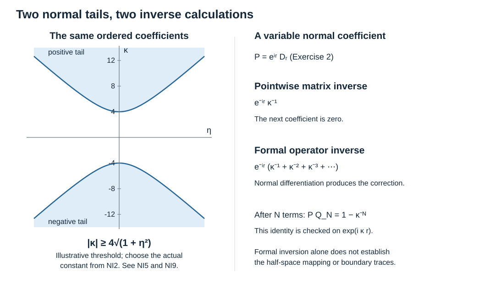

# Normal inverse expansions: actual tails and ordered operator coefficients

Original exposition: AN-04 course project, GPT-6 Astra (OpenAI), Ultra, 7 October 2026. This text, its original figure and finite check script are dedicated under CC0 1.0 Universal. Earlier linked components keep their own terms.

A boundary inverse has two different coefficient calculations. Inverting a matrix-valued polynomial at each frequency produces an actual function with a uniform expansion. Inverting the normal differential operator also differentiates its variable coefficients. We prove both calculations, their finite remainders and the precise connection that must still be supplied by the analytic operator calculus.

## 1. Hypotheses, notation and earlier proofs

Write \(x=(y,r)\), \(\xi=(\eta,\kappa)\), with \(r\) normal and \(\kappa\) its dual frequency. Put \(T=1+|\eta|\), \(R=1+|(\eta,\kappa)|\), and \(D_r=-i\partial_r\). The tangential dimension \(d\) may be zero, in which case \(T=1\). All base estimates below are uniform on a fixed base set; parameters range over fixed compact sets. Coefficients are finite matrices between Hermitian spaces \(E,F\); no two matrix factors are exchanged.

The [mixed-calculus companion](../20261007-mixed-boundary-calculus/mixed-boundary-calculus.md), MB:B1–B2, proves complete mixed symbol estimates for products and cutoff inverses. The [ordinary tangential operator proofs](../20261004-free-intrinsic-graph/prerequisites/ordinary-operator-calculus.md), P2:OP3–OP6, supply associative, properly supported tangential composition, with parameter derivatives and the sum of orders. Use those exact operator products for the coefficients in Sections 4–6. Finite-dimensional matrix algebra and differential rules are the earlier U001:F0-ALG and U001:F0-DIFF proofs. The [Fourier programme proofs](../20261004-free-intrinsic-graph/prerequisites/fourier-l2.md), P3:L1–L3, fix inversion and distributional compatibility. Exact prerequisite versions and their complete dependency graph accompany this text.

For the actual matrix inverse let \(m\ge1\) be an integer and
\[
 p(x,\eta,\kappa)=\sum_{j=0}^m a_j(x,\eta)\kappa^j,
 \qquad a_m(x,\eta)=M(x):E\longrightarrow F.
 \tag{NI1}
\]
Assume \(a_j\) has tangential symbol order \(m-j\): every \(\partial_x^\beta\partial_\eta^\alpha a_j\) is bounded by a constant times \(T^{m-j-|\alpha|}\). The leading matrix \(M\) is invertible, with its inverse and every base derivative uniformly bounded. These hypotheses apply to a compact collar chart after the stated extension of its coefficients. We do not infer real ellipticity at arbitrary frequencies merely from invertibility of \(M\).

## 2. Actual inversion on both large-normal-frequency regions

Define the endomorphism coefficients \(b_j=M^{-1}a_{m-j}\) for \(1\le j\le m\). Choose a fixed \(A\ge1\) so large that
\[
 \sum_{j=1}^m A^{-j}\sup_{x,\eta}T^{-j}\|b_j(x,\eta)\|
       \le\tfrac12 .
 \tag{NI2}
\]
The supremum is finite for each \(j\), so such an \(A\) exists: each term tends to zero as \(A\) increases, and the sum is finite. On \(|\kappa|\ge AT\), set \(Z=\sum_{j=1}^m b_j\kappa^{-j}\). Then \(\|Z\|\le1/2\), and ordered multiplication gives
\[
 p=M(I_E+Z)\kappa^m,
 \qquad p^{-1}=\kappa^{-m}(I_E+Z)^{-1}M^{-1}.
 \tag{NI3}
\]
The inverse is actual: the partial geometric sums \(\sum_{q=0}^{N-1}(-Z)^q\) have two-sided errors \((-Z)^N\), whose norms tend to zero; completeness of the finite matrix space gives an inverse of norm at most two. This argument works for negative \(\kappa\) as well as positive \(\kappa\).

For each integer \(\ell\ge0\) define
\[
 U_0=I_E,\qquad
 U_\ell=-\sum_{j=1}^{\min(m,\ell)}b_jU_{\ell-j}\quad(\ell\ge1),
 \qquad c_\ell=U_\ell M^{-1}:F\longrightarrow E.
 \tag{NI4}
\]
Induction and the tangential Leibniz rule give \(U_\ell,c_\ell\) tangential order \(\ell\), with every base derivative retained. This finite recurrence is not an infinite convergence assertion.

**Two-tail remainder theorem.** For every integer \(L\ge1\), multiindices \(\alpha,\beta\), and integer \(v\ge0\),
\[
 \left\|\partial_x^\beta\partial_\eta^\alpha\partial_\kappa^v
  \left(p^{-1}-\sum_{\ell=0}^{L-1}c_\ell\kappa^{-m-\ell}\right)\right\|
 \le C_{L\alpha\beta v}|\kappa|^{-m-L-v}T^{L-|\alpha|}
 \quad (|\kappa|\ge AT).
 \tag{NI5}
\]
The same coefficients occur on both signed tails. In particular, the negative power of \(T\) when \(|\alpha|>L\) is part of the conclusion.

**Proof.** The signed integer power has the exact derivative
\(\partial_\kappa^v\kappa^{-j}=(-j)(-j-1)\cdots(-j-v+1)\kappa^{-j-v}\). Thus a differentiated \(b_j\kappa^{-j}\) is bounded by
\(C T^{j-|\alpha|}|\kappa|^{-j-v}\), on either tail. Because \(T/|\kappa|\le A^{-1}\), derivatives of \(Z\) satisfy \(C T^{-|\alpha|}|\kappa|^{-v}\). Apply the differentiated inverse identity MB5 to \(I+Z\), starting with inverse norm at most two. At every induction step the tangential and normal derivative counts split among finitely many factors and add back to \((\alpha,v)\). It follows that
\[
 \|\partial_x^\beta\partial_\eta^\alpha\partial_\kappa^v(I+Z)^{-1}\|
       \le C_{\alpha\beta v}T^{-|\alpha|}|\kappa|^{-v}.
 \tag{NI6}
\]
Let \(V_L=\sum_{\ell<L}U_\ell\kappa^{-\ell}\). By NI4, all powers \(\kappa^{-n}\) with \(1\le n<L\) cancel in \((I+Z)V_L-I\). The remainder is a finite sum
\[
 E_L=(I+Z)V_L-I
       =\sum_{n=L}^{L+m-1}e_n\kappa^{-n},\qquad e_n\in S_{\rm tan}^n.
 \tag{NI7}
\]
This notation includes zero end coefficients. Each differentiated summand is bounded by \(C T^{n-|\alpha|}|\kappa|^{-n-v}\), which is at most a constant times \(T^{L-|\alpha|}|\kappa|^{-L-v}\). The exact residual identity
\((I+Z)^{-1}-V_L=-(I+Z)^{-1}E_L\), NI6 and Leibniz's rule yield that bound for the inverse difference. Multiplication on the right by \(M^{-1}\) and by the scalar \(\kappa^{-m}\), retaining every derivative, proves NI5. ∎

This proof gives the stronger order-zero bound for the inverse on the high-normal region as well: differentiating NI3 and using NI6 gives \(C|\kappa|^{-m-v}T^{-|\alpha|}\). If \(\tau=\theta p^{-1}\) is a global mixed inverse from MB:B2, choose \(A\) also larger than the outer radius of the compact frequency support of \(1-\theta\). Then \(\tau=p^{-1}\) throughout this region, so NI5 applies to \(\tau\) without a cutoff error there.

## 3. Separated tangential kernels retain their normal expansions

Assume now that \(\tau\in S^{-m,0}\) is such a global mixed inverse and agrees with NI3 for \(|\kappa|\ge AT\). Take compactly supported smooth tangential cutoffs \(f(y),g(z)\) with distance between their supports at least \(\varepsilon>0\). Take a smooth normal cutoff \(h(r,s)\) supported in a fixed compact strip. Define the partial Fourier kernel
\[
 K(y,z,r,s,\kappa)=h(r,s)f(y)g(z)(2\pi)^{-d}
       \operatorname{Os}\int e^{i(y-z)\cdot\eta}
                    \tau(y,r,\eta,\kappa)\,d\eta .
 \tag{NI8}
\]
Let \(K_\ell\) be the same expression with \(c_\ell\) in place of \(\tau\). For every combined base derivative \(\gamma\), integer \(v\ge0\), and integer \(L\ge1\),
\[
 \left|\partial_{y,z,r,s}^\gamma\partial_\kappa^v
   \left(K-\sum_{\ell<L}K_\ell\kappa^{-m-\ell}\right)\right|
       \le C_{\gamma v L}|\kappa|^{-m-L-v},\qquad |\kappa|\ge A'.
 \tag{NI9}
\]
All \(K_\ell\) are smooth on the separated chart pair, and the same \(K_\ell\) work on both tails. In tangential dimension zero the separated cutoff product is empty, so this assertion is vacuous.

**Proof.** Separate the integral into low and high tangential frequencies using a smooth cutoff in \((1+|\eta|^2)/\kappa^2\). Choose its inner and outer radii so that the low support lies in \(|\kappa|\ge AT\); this is possible using \(T\le\sqrt2(1+|\eta|^2)^{1/2}\). The transition has \(T\) comparable to \(|\kappa|\). Every tangential derivative of the cutoff costs \(T^{-1}\) there and every normal-frequency derivative costs \(|\kappa|^{-1}\); these assertions follow directly by its chain rule. No derivative of \(1+|\eta|\) is taken.

Base differentiation in NI8 inserts a fixed polynomial in \(\eta\), bounded by \(CT^D\), and differentiates the smooth cutoffs. Since \(|y-z|\ge\varepsilon\), integration by parts can transfer any number \(N\) of \(\eta\)-derivatives from the exponential to the amplitude, using
\(e^{i(y-z)\cdot\eta}=(i|y-z|^2)^{-1}(y-z)\cdot\partial_\eta e^{i(y-z)\cdot\eta}\). Derivatives of its coefficients are bounded on the separated support. On the low part, NI5 bounds the resulting absolute remainder integral by
\[
 C|\kappa|^{-m-L-v}\int_{\mathbb R^d}T^{L+D-N}\,d\eta .
 \tag{NI10}
\]
Choose \(N>L+D+d\). The integral converges: split into \(|\eta|\le1\) and dyadic shells, whose volumes grow at most like \(2^{jd}\). If some transferred derivatives fall on the splitting cutoff, the transition bounds give exactly the same estimate.

On the high part \(T\ge c|\kappa|\), the original mixed estimates bound the differentiated inverse by \(CR^{-m-v}T^{-N}\le CT^{-m-v-N}\). Including the base cost, its tail integral is at most \(C|\kappa|^{d-m-v-N+D}\). For each subtracted coefficient the corresponding bound is
\(C|\kappa|^{-m-\ell-v}\int_{T\ge c|\kappa|}T^{\ell+D-N}\,d\eta\), at most \(C|\kappa|^{-m-v+d+D-N}\), provided \(N>\ell+D+d\). Select \(N>L+D+d\) to satisfy all of these inequalities and the desired power. The transition terms obey the same bounds. This replaces each truncated coefficient integral by its full separated integral and proves NI9.

The same integrations with \(N>\ell+D+d\), but without a frequency split, prove smoothness of \(K_\ell\) and identify all derivatives under an absolutely convergent regularized integral. Increasing \(N\) supplies consistency of the different regularizations by integration by parts on compact frequency cutoffs and vanishing tails. This completes the proof. ∎

Tangential separation has made the coefficient kernels smooth in \(y,z\). It has not removed the normal diagonal: inverse Fourier transformation in \(\kappa\) can still be singular at \(r=s\). NI9 retains the normal expansion needed at that diagonal.

The corresponding \(L=0\) bound \(C|\kappa|^{-m-v}\) follows from the \(L=1\) estimate and the leading smooth coefficient \(K_0\kappa^{-m}\), after every requested derivative.

## 4. An associative algebra for normal differentiation

We now use complete tangential operators, rather than pointwise matrix symbols. Let \(\mathcal A\) be an algebra of smooth normal-parameter families of properly supported tangential operators, with actual composition as its product and derivation \(\delta A=-i\partial_r A\). On a fixed compact tangential manifold, or in a fixed proper localization, the earlier P2 operator proofs ensure that \(\delta(AB)=(\delta A)B+A(\delta B)\), order adds under composition, and \(\delta\) preserves tangential order. For different bundles embed their arrows in the corresponding blocks of the endomorphism algebra of their direct sum. All constructions below preserve the input and output blocks.

Consider series \(F=\sum_{j\le J}F_j\kappa^j\) bounded above in integer normal degree. A coefficient of any given output degree will be a finite sum; no analytic convergence is asserted. To prove associativity without assuming it, let such series act on \(\mathcal A((z^{-1}))\), the formal series in a central indeterminate \(z\), bounded above in degree. Extend \(\delta\) coefficient by coefficient and set \(\Lambda=z+\delta\). Its inverse is well-defined coefficient by coefficient:
\[
 \Lambda^{-1}=\sum_{q\ge0}(-1)^qz^{-1-q}\delta^q.
 \tag{NI11}
\]
Since \(z\) and \(\delta\) commute, multiplication by \(z+\delta\) cancels consecutive terms on either side and leaves the identity. More generally, for every integer \(p\),
\[
 \Lambda^p=\sum_{q\ge0}\binom pq z^{p-q}\delta^q,
 \qquad \binom pq=\frac{p(p-1)\cdots(p-q+1)}{q!}.
 \tag{NI12}
\]
For \(p\ge0\) this is finite binomial multiplication. For negative \(p\), NI11 and downward induction prove the same identity: multiplying by \(z+\delta\) uses precisely Pascal's relation \(\binom pq+\binom p{q-1}=\binom{p+1}q\), which follows from the displayed falling factorials. Each coefficient requires finitely many operations.

For left multiplication by a coefficient \(B\), Leibniz's rule in NI12 yields
\[
 \Lambda^p B=\sum_{k\ge0}\binom pk(\delta^kB)\Lambda^{p-k}.
 \tag{NI13}
\]
To verify every coefficient, expand \(\delta^{k+j}(Bh)\). The term with \(k\) derivatives on \(B\) and \(j\) on \(h\) has coefficient
\(\binom p{k+j}\binom{k+j}k=\binom pk\binom{p-k}j\), directly from falling factorials. Summing the remaining \(j\)-terms gives NI13. This proof works for negative \(p\) because the calculation at a fixed formal degree is finite.

Represent \(F\) by \(T_F=\sum_{j\le J}F_j\Lambda^j\). The action is well-defined: for input degree at most \(H\), a fixed output degree receives terms only from \(j\) between that degree minus \(H\) and \(J\), and finitely many input degrees and derivative counts. Moreover \(T_F1=\sum F_jz^j\), so this representation is injective. NI13 gives the explicit product law
\[
 (A\kappa^p)\star(B\kappa^q)
     =\sum_{k\ge0}\binom pk A(\delta^kB)\kappa^{p+q-k},
 \qquad T_{F\star G}=T_FT_G.
 \tag{NI14}
\]
Composition of the represented linear maps is associative; injectivity proves that \(\star\) is associative as well. The coefficient identity operators are its identities. In particular \(\kappa\star B=B\kappa+\delta B\), exactly the normal differential product rule. This constructs the formal algebra, including negative powers, rather than treating that product rule as an unproved calculus.

## 5. Both formal inverse recursions and their finite errors

Let
\[
 P=\sum_{j=0}^m P_j\kappa^{m-j}:E\longrightarrow F,
 \qquad P_0=M,
 \qquad P_j\in\Psi_{\rm tan}^j,
 \tag{NI15}
\]
where \(M\) is an invertible bundle map and all families are smooth in \(r\). This is the full differential operator with coefficient \(P_j\) at normal degree \(m-j\). Seek \(C=\sum_{\ell\ge0}C_\ell\kappa^{-m-\ell}:F\to E\).

A right inverse \(P\star C=I_F\) is determined successively by
\[
 C_0=M^{-1},\qquad
 C_\ell=-M^{-1}
   \sum_{\substack{j+h+k=\ell,\ 0\le j\le m,\ h,k\ge0\\h<\ell}}
     \binom{m-j}k P_j\,\delta^k C_h
       \quad(\ell\ge1).
 \tag{NI16}
\]
Indeed the coefficient of \(\kappa^{-\ell}\) in the product is the displayed sum plus \(MC_\ell\); the only excluded term has \(j=k=0,h=\ell\). Every other \(h\) is strictly smaller. A left inverse \(L\star P=I_E\) is similarly determined by
\[
 L_0=M^{-1},\qquad
 L_\ell=-
   \left(\sum_{\substack{h+j+k=\ell,\ 0\le j\le m,\ h,k\ge0\\h<\ell}}
      \binom{-m-h}k L_h\,\delta^kP_j\right)M^{-1}.
 \tag{NI17}
\]
The sums are finite and the generalized binomial in NI17 is essential. A summand in either formula has tangential order at most \(j+h=\ell-k\le\ell\). Multiplication by \(M^{-1}\) preserves that bound. Induction proves \(C_\ell,L_\ell\in\Psi_{\rm tan}^\ell(F,E)\), including all smoothing parts of their complete tangential products and all normal-parameter derivatives.

Associativity proves equality of the two constructed inverses:
\(L=L\star(P\star C)=(L\star P)\star C=C\). Thus every coefficient is common to the two recursions. Their first values are
\[
 C_0=M^{-1},\qquad
 C_1=-M^{-1}P_1M^{-1}-m\,\delta(M^{-1})
    =-M^{-1}P_1M^{-1}+mM^{-1}(\delta M)M^{-1}.
 \tag{NI18}
\]
The last equality follows by differentiating \(MM^{-1}=I_F\). All arrows and products have their original order.

There is also a useful finite construction. Put \(Q_0=M^{-1}\kappa^{-m}\), \(R_F=P\star Q_0-I_F\), \(R_E=Q_0\star P-I_E\). Both errors have normal degree at most \(-1\). They are on different spaces and need not be equal. Associativity gives \(R_E\star Q_0=Q_0\star R_F\). Thus for every integer \(N\ge1\),
\[
 Q_N=Q_0\star\sum_{j=0}^{N-1}(-R_F)^{\star j}
       =\sum_{j=0}^{N-1}(-R_E)^{\star j}\star Q_0,
 \tag{NI19}
\]
and exact finite geometric multiplication gives
\[
 P\star Q_N=I_F-(-R_F)^{\star N},\qquad
 Q_N\star P=I_E-(-R_E)^{\star N}.
 \tag{NI20}
\]
Both errors have degree at most \(-N\). Solving for the coefficients of degrees \(-m\) through \(-m-N+1\) in the first identity repeats NI16, so those coefficients in \(Q_N\) are exactly \(C_0,\ldots,C_{N-1}\). The other identity gives the same conclusion from NI17. This is a finite error calculation in the constructed formal algebra, not an assertion of convergence in an operator topology.

## 6. Three exercises with complete solutions

**1. A genuinely ordered coefficient.** For an \(r\)-independent operator \(P=M\kappa^2+F\kappa+H\), find \(C_2\), retaining the full tangential operators.

**Solution.** All \(\delta\)-terms vanish. NI16 gives \(C_0=M^{-1}\), \(C_1=-M^{-1}FM^{-1}\), and
\[
 C_2=M^{-1}FM^{-1}FM^{-1}-M^{-1}HM^{-1}.
 \tag{NI21}
\]
For example \(F\in\Psi^1\) and \(H=D_y^2+I\in\Psi^2\) satisfy the stated orders. Neither \(F\) nor \(H\) is replaced by its value at zero tangential frequency; multiplication by \(M(y)\) generally does not commute with them.

**2. Why the two inverse calculations differ.** Take \(m=1\), \(M(r)=e^{ir}\), and \(P=e^{ir}D_r\), with no tangential variables. Compare the pointwise inverse with the first two formal operator coefficients.

**Solution.** The pointwise symbol is \(e^{ir}\kappa\), so NI3 gives \(e^{-ir}\kappa^{-1}\) and no further pointwise coefficients. But \(\delta(e^{-ir})=-e^{-ir}\), and NI18 gives \(C_0=e^{-ir}\), \(C_1=e^{-ir}\). More generally NI16 gives \(C_\ell=e^{-ir}\) for every \(\ell\). The formal symbol is \(e^{-ir}\sum_{\ell\ge0}\kappa^{-1-\ell}\), the large-frequency expansion of \(e^{-ir}(\kappa-1)^{-1}\). Directly,
\[
 e^{ir}D_r\bigl(e^{-ir}\kappa^{-1}e^{i\kappa r}\bigr)
      =(1-\kappa^{-1})e^{i\kappa r}.
 \tag{NI22}
\]
For the partial sum through \(\ell=N-1\), the same calculation gives \((1-\kappa^{-N})e^{i\kappa r}\). This verifies the normal derivative sign and the finite residual. These are high-frequency and formal calculations; no inverse across the zero of \(\kappa-1\), or choice of a global inverse of \(D_r\), is asserted.

**3. The same coefficients on the two tails.** Let \(m=2\), \(M=I\), and \(p=\kappa^2I+B\kappa+C\), with fixed matrices that need not commute. Find the first four pointwise coefficients.

**Solution.** NI4 gives
\[
 U_0=I,\quad U_1=-B,\quad U_2=B^2-C,\quad
 U_3=-B^3+BC+CB.
 \tag{NI23}
\]
The expansion is \(\sum_{\ell=0}^3U_\ell\kappa^{-2-\ell}\) plus the remainder from NI5 with \(L=4\). Both \(BC\) and \(CB\) are needed. The coefficient \(U_\ell\) itself has no tail-dependent sign: the signed power \(\kappa^{-2-\ell}\) already accounts for that sign. The estimate uses its absolute value only after differentiation.

## 7. Geometry and the remaining analytic step

The left panel shows the two regions \(|\kappa|\ge4(1+\eta^2)^{1/2}\) in a two-dimensional frequency slice. The drawn threshold is an illustrative smooth bracket version: NI5 uses \(|\kappa|\ge AT\), and \(T\le\sqrt2(1+\eta^2)^{1/2}\) converts one sufficient threshold to the other. One chooses the constant from NI2; the picture does not assign the constant four to every operator. The two regions use identical ordered coefficients and signed powers. The right panel records the exact difference established in Exercise 2.

Sections 2–3 are actual differentiated estimates for a local inverse and its tangentially separated kernel. Sections 4–5 are complete formal operator identities. To construct the boundary parametrix, one must additionally prove that actual normally proper operator products preserve these two-tail expansions with coefficients given by NI14, together with the mixed error orders and the one-sided mapping and trace estimates. Those results are not consequences of formal inversion alone and remain the next receiving step. Neither a tangentially smooth kernel nor a formal inverse is substituted for them.

## 8. Mathematical credit

The approved source is Lars Hörmander, *The Analysis of Linear Partial Differential Operators III*, Springer 2007, ISBN 978-3-540-49938-1, the collar and mixed boundary calculus associated with Chapter 20. The existing AN-03 programme chapter *Generalized collar Fredholm calculus*, Sections 15–16, was read to compare the full ordered coefficients and differentiated hypotheses. This text uses an independent organization: actual residual estimates precede a faithful representation proof of the formal algebra. Exact source-version records and programme-proof dependencies are in the accompanying map. The cited book supports the mathematical development; the proofs used here are present above or in exact earlier programme lessons.
