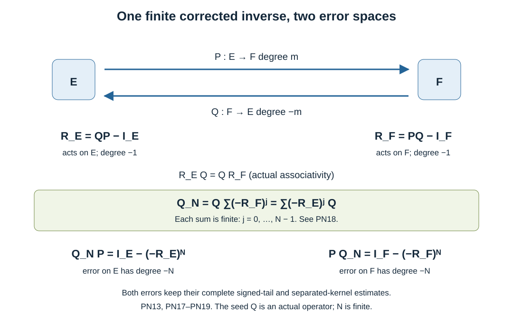

# Actual products with matching normal expansions

Original exposition: AN-04 course project, GPT-6 Astra (OpenAI), Ultra, 7 October 2026. This text, its original diagram and check script are dedicated under CC0 1.0 Universal. Linked earlier components retain their own licences.

The normal inverse companion proved actual estimates for a first inverse and a formal algebra for its coefficients. We now prove that actual operator products realize that algebra, with differentiated remainders and the tangentially separated kernels retained. We also prove the additional order gain in both local inverse errors. A finite correction then remains an actual operator with controlled errors on both sides.

## 1. The class and the exact earlier inputs

Use a fixed product collar with coordinates \((y,r)\), frequency \((\eta,\kappa)\), and weights \(T=1+|\eta|\), \(R=1+|(\eta,\kappa)|\). Tangential dimension is \(d\ge0\), and \(\delta=-i\partial_r\). All statements are on compact localizations, uniformly with every base and parameter derivative. Preferred changes of tangential coordinates, frames and densities are independent of \(r\). Operators act between the specified bundles and are properly supported in the normal variable. Multiplication of coefficients always means the complete tangential operator product.

For an integer \(a\), define \(\mathcal L^a\) by the following concrete kernel requirements. On a common tangential chart the exact localized left symbol \(f\) belongs to the global mixed class \(S^{a,0}\). It has a single sequence of compatible complete tangential operators \(F_p(r)\in\Psi^p\), with exact local symbols \(f_p\), such that, for every integer \(L\ge1\),
\[
 \left\|\partial_{y,r}^\beta\partial_\eta^\alpha\partial_\kappa^v
  \left(f-\sum_{p<L}f_p\kappa^{a-p}\right)\right\|
 \le C_{L\alpha\beta v}|\kappa|^{a-L-v}T^{L-|\alpha|},
 \qquad |\kappa|\ge C T .
 \tag{PN1}
\]
The same sequence occurs for positive and negative \(\kappa\). For disjoint compact tangential input and output supports, the actual kernel has a left normal Fourier amplitude smooth in both tangential variables, with bounds \(C\langle\kappa\rangle^{a-v}\) after every base derivative and \(v\) frequency derivatives. Its expansion has the kernels of those same \(F_p\) and satisfies
\[
 \left|\partial_{y,z,r,s}^\gamma\partial_\kappa^v
  \left(k_F-\sum_{p<L}k_{F_p}\kappa^{a-p}\right)\right|
       \le C_{L\gamma v}|\kappa|^{a-L-v}.
 \tag{PN2}
\]
The normal amplitude is reduced to a left amplitude near \(r=s\), then multiplied by a normal properness cutoff equal to one there. Its input density and frame factors are included in \(k_{F_p}\) and differentiated in \(\gamma\). The compatible coefficient operators in this definition include their tangential smoothing parts; principal symbols alone do not specify them.

The [mixed-calculus companion](../20261007-mixed-boundary-calculus/mixed-boundary-calculus.md), MB:B1–B3 and MB:C2–F1, supplies all mixed product and inverse estimates, exact operator products on Schwartz functions and distributions, and the full two-weight mapping theorem. The [normal inverse companion](../20261007-normal-inverse-expansions/normal-inverse-expansions.md), NI:N3–N4 and NI:F1–F3, supplies actual two-tail inverse estimates, separated kernels and the proved formal coefficient algebra. The [ordinary tangential calculus](../20261004-free-intrinsic-graph/prerequisites/ordinary-operator-calculus.md), P2:OP3–OP6, supplies exact complete tangential composition. Fourier inversion, Fubini and domination are the earlier P3:L1–L3 and P3:M4 proofs; finite Taylor's formula is U001:FTC-TAYLOR-COMPACT-PARAMETERS. The accompanying map fixes the exact versions and transitive dependencies.

Two elementary consequences will be useful. First, \(\mathcal L^{a-1}\subset\mathcal L^a\): insert a zero leading coefficient, move old index \(p\) to index \(p+1\), and use \(T\ge1\) in PN1. Second, coefficients are unique. At fixed \((y,r,\eta)\), divide the difference of two expansions by its first possible power of \(\kappa\) and let \(\kappa\to+\infty\); PN1 makes the remaining difference tend to zero. Induction identifies every complete local coefficient symbol. PN2 identifies their separated kernels in the same manner. These local and separated kernel pieces cover the coefficient operator, proving uniqueness as an actual tangential operator.

On a single chart PN2 follows from PN1 and the mixed bounds by the proof of NI9, now for any integer \(a\). Here is the adjustment for positive orders: in the high tangential region \(T\ge c|\kappa|\) one has \(R\asymp T\), so the original differentiated symbol is bounded by \(CT^{a-v-N}\) after \(N\) tangential integrations by parts. Its integral, with a fixed base derivative cost \(T^D\), is bounded by \(C|\kappa|^{a-v-N+D+d}\). Each subtracted coefficient gives that same power. Choose \(N>L+D+d\). The low region is bounded by \(C|\kappa|^{a-L-v}\int T^{L+D-N}d\eta\), exactly as in NI10. This proves PN2 for local symbols, including all derivatives and both signs. The \(L=0\) bound follows from \(L=1\) and the leading coefficient.

Away from \(r=s\), repeated normal-frequency integration by parts makes these kernels smooth in all variables. For a common-chart symbol, choose the number of normal derivatives so that its full frequency order, including every requested derivative, is integrable; the factor \((r-s)^{-N}\) is bounded on the separated normal supports. For a tangentially separated amplitude only the one normal frequency is integrated and the same argument applies. Consequently changing a normal cutoff away from \(r=s\) changes a compactly localized kernel by a smooth full kernel. Its Fourier transform decays with every frequency derivative faster than every inverse power, by repeated integration by parts in the input-output differences. Such a kernel belongs to every \(\mathcal L^a\) with zero coefficients.

## 2. An absolute integral for the exact local product

Take localized symbols \(f\in S^{a,0}\), \(g\in S^{b,0}\). The base support of the second factor is compact; the output base is in a fixed compact set. Define its shifted base Fourier transform
\[
 \widehat g_x(\zeta,\omega;\eta,\kappa)
  =\iint e^{-i(w\cdot\zeta+t\omega)}
          g(y+w,r+t,\eta,\kappa)\,dw\,dt,
 \quad x=(y,r).
 \tag{PN3}
\]
All derivatives of its compact base amplitude obey the original symbol bounds. Applying \((1-\Delta_w-\partial_t^2)^J\) and integrating by parts therefore gives arbitrary decay in \((\zeta,\omega)\), with finitely many original seminorms. The exact product symbol is
\[
 (f\# g)(x,\eta,\kappa)
  =(2\pi)^{-d-1}\iint
       f(x,\eta+\zeta,\kappa+\omega)
       \widehat g_x(\zeta,\omega;\eta,\kappa)
            \,d\zeta\,d\omega .
 \tag{PN4}
\]
This integral is absolutely convergent after the preceding integrations by parts. To check every derivative, use the two-sided triangle inequalities
\[
 \frac{T(\eta+\zeta)^c}{T(\eta)^c}
       \le(1+|\zeta|)^{|c|},\qquad
 \frac{R(\eta+\zeta,\kappa+\omega)^c}{R(\eta,\kappa)^c}
       \le(1+|(\zeta,\omega)|)^{|c|}
 \quad(c\in\mathbb R).
 \tag{PN5}
\]
After allocating a fixed set of derivatives, their extra factors have at most a fixed polynomial growth of degree \(K\) in the shift. Take \(2J>K+d+1\). The resulting integrable majorant proves differentiation under the integral and its finite-seminorm bound. Formula PN4 agrees with the actual composition by MB:E2, initially by Fubini on compact symbols and then by bounded approximation. Input cutoffs, densities and frames are part of the localized symbols; none is discarded. Pieces requiring different tangential charts are addressed in Section 5.

The purely tangential version is the exact product \(f\#_{\rm tan}g\), integrating only \((w,\zeta)\) with \(r,\kappa\) held fixed. In particular it retains every tangential smoothing contribution. It obeys the same parameter bounds, since one merely chooses \(2J>K+d\).

## 3. Complete tangential coefficients on the normal cones

For the purely tangential product, take \(|\kappa|\ge C'T(\eta)\). Split \(\zeta\) with a smooth cutoff supported where \(|\zeta|\le\varepsilon|\kappa|\). Choose \(C'\) large and \(\varepsilon\) small relative to both input cone constants. Then the shifted and unshifted factors both satisfy PN1 on the smaller region.

Insert length-\(L\) expansions there. A product of coefficients at indices \(p,q\) has powers \(|\kappa|^{a+b-p-q}\) and tangential order \(p+q\). Every term with \(p+q\ge L\) has the bound
\[
 C|\kappa|^{a+b-L-v}T^{L-|\alpha|}
 \tag{PN6}
\]
after any fixed requested derivatives: transfer the shifted weights by PN5 and use \(T/|\kappa|\le1/C'\) for the excess index. The remainder in either original expansion gives the same bound, by the absolute tangential Fourier estimate just proved. The factors of \((1+|\zeta|)^K\) caused by weight transfer are absorbed by increasing \(J\).

In the larger shift region use the original global mixed bounds, not the high-normal expansion. They give a majorant \(C|\kappa|^D T^{-|\alpha|}(1+|\zeta|)^{K-2J}\), with fixed \(D,K\). Its integral over \(|\zeta|\ge c|\kappa|\) is bounded by \(C|\kappa|^{D+K-2J+d}T^{-|\alpha|}\). Increasing \(J\) makes this smaller than every prescribed inverse normal power, with the original negative tangential derivative weight retained. The same bound applies to the removed tails of each complete coefficient product. Restoring them therefore gives the actual \(F_pG_q\), rather than a truncated tangential symbol. Derivatives of the splitting cutoff have support in the larger shift region and gain a further \(|\kappa|^{-1}\) for each normal-frequency derivative. These estimates prove PN6, with all derivatives, for the complete tangential product at every length.

We will also use a parameter variant of this estimate. Let
\[
 P_u(f,g)(y,\eta)=(2\pi)^{-d}\int
       f(y,\eta+u\zeta)\widehat g_y(\zeta;\eta)\,d\zeta,
       \qquad 0\le u\le1.
 \tag{PN7}
\]
This is the tangential Gauss product with a scaled base shift after a change of variables; the displayed form fixes the compact base support independently of \(u\). At \(u=0\), Fourier inversion gives \(fg\). The preceding Peetre comparisons and shift split are uniform in \(u\), because \(|u\zeta|\le|\zeta|\), and every differentiation of the shifted factor introduces at most the bounded factor \(u\). Thus all the tangential cone estimates hold uniformly, including at zero by dominated convergence. Differentiating this absolute integral and using the Fourier identity for \(D_y g\) gives
\[
 f\#_{\rm tan}g-fg
       =\sum_{j=1}^d\int_0^1
              P_u(\partial_{\eta_j}f,D_{y_j}g)\,du.
 \tag{PN8}
\]
The same argument permits an extra fixed tangential weight \(T^c\) in either input: it adds \(c\) to every coefficient order and to the remainder exponent. This follows directly by using PN5 with that exponent in the same integrable majorant. It will keep the order of a tangential coefficient of the original differential operator visible below.

## 4. Normal moments and the actual coefficient formula

In PN4 split both shifts at small fixed multiples of \(|\kappa|\). On the complement of the smaller shift region, the base Fourier decay gives an arbitrarily rapid normal remainder by the proof in Section 3 with dimension \(d+1\). This explicitly covers \(\kappa+\omega=0\); no asymptotic expansion is used near that shifted zero.

In the smaller region, Taylor-expand the first factor in \(\omega\) to degree \(L-1\). The integral remainder is
\[
 \frac{\omega^L}{(L-1)!}\int_0^1(1-\theta)^{L-1}
        \partial_\kappa^L f(x,\eta+\zeta,\kappa+\theta\omega)
           \,d\theta .
 \tag{PN9}
\]
Here \(R(\eta+\zeta,\kappa+\theta\omega)\asymp|\kappa|\), uniformly in \(\theta\). The original mixed estimate, PN5 for the tangential derivatives, and the rapid base Fourier decay of \(g\) bound the remainder, including every requested derivative, by an integrable majorant of the form
\[
 C|\kappa|^{a+b-L-v}T^{-|\alpha|}
    (1+|(\zeta,\omega)|)^{K+L-2J}.
 \tag{PN10}
\]
Choose \(2J>K+L+d+1\), increasing it for the finitely many prescribed derivatives. Integration in both shifts and in \(\theta\) proves this stronger remainder, hence PN6 since \(T\ge1\). Differentiating a shift cutoff is supported in the already rapid part. Higher base derivatives do not change orders; each additional normal-frequency derivative lowers the normal power, and each tangential-frequency derivative carries the corresponding PN5 weight. This verifies PN10 for the full differentiated remainder.

For each Taylor term restore the full frequency moment. The complementary cutoff piece remains arbitrarily rapid by the same Fourier bound, now absorbing its fixed factor \(\omega^\ell\). Fourier inversion and \(\omega^\ell e^{-it\omega}=i^\ell\partial_t^\ell e^{-it\omega}\) give exactly \(\delta^\ell g\) at \(t=0\), including the sign \((-i)^\ell\). Thus the restored term is
\[
 \frac1{\ell!}\bigl(\partial_\kappa^\ell f\bigr)
                         \#_{\rm tan}(\delta^\ell g).
 \tag{PN11}
\]
This is not a delta identity for a truncated moment: the removed part was estimated first and then restored. Normal properness cutoffs are one near the moment point and have vanishing derivatives there. Their remaining pieces are smooth full kernels by Section 1.

Apply Section 3 to the complete tangential products in PN11, expanding to length \(L-\ell\). The differentiated monomial has the exact factor
\(\partial_\kappa^\ell\kappa^{a-p}/\ell!=\binom{a-p}\ell\kappa^{a-p-\ell}\), on both signed tails. Each original remainder or term of index at least \(L\) is bounded by PN6. We obtain the common sequence
\[
 (F\circ G)_n
   =\sum_{p+q+\ell=n}\binom{a-p}\ell
                     F_p\,\delta^\ell G_q,
       \qquad (F\circ G)_n\in\Psi^n.
 \tag{PN12}
\]
The sum is finite even when \(a-p<0\). Its order is at most \(p+q\le n\), and the product is complete tangential composition. This proves PN1 for the actual product. The global mixed order \(S^{a+b,0}\) is MB:D1–E2; it controls the frequencies outside the normal cones as well.

## 5. Both separated-kernel configurations

For disjoint external tangential supports, partition the compact intermediate tangential region into sufficiently small pieces. On each piece either the first kernel is separated from the output support or the second is separated from the input support. This follows from their positive separation: a piece of diameter less than one third of that separation cannot meet both neighborhoods.

In the first configuration take the partial Fourier transform of the smooth intermediate input variable of the first kernel. Repeated tangential integration by parts gives every negative tangential frequency order. In particular, a remainder of length \(L\) has bounds
\(C|\kappa|^{a-L-v}\langle\zeta\rangle^{-N}\) for arbitrary \(N\), with every external derivative, directly from PN2. The whole separated amplitude has the same estimate with \(\langle\kappa\rangle^{a-v}\) instead. In the other configuration transform the smooth intermediate output variable of the second kernel; keep the matrix product in its original order. The identical scalar majorants apply without commuting the factors.

On \(|\zeta|\le C|\kappa|\), the other factor has normal scale comparable to \(|\kappa|\). Choose the arbitrary negative tangential order below the dimension, every external derivative cost and every tangential polynomial growth order of that factor. The integral is absolutely convergent and its remainder is bounded by \(C|\kappa|^{a+b-L-v}\). On \(|\zeta|\ge c|\kappa|\), one has \(R\asymp\langle\zeta\rangle\); the tail integral is bounded by \(C|\kappa|^{a+b+D+d-N-v}\), where \(D\) is the fixed external derivative cost. Increase \(N\) to get any requested inverse normal power. The same estimates apply to restored full coefficient kernels. Now the normal Fourier argument of Section 4 applies to these amplitudes, with the same moment signs and differentiated remainder.

For clarity, the normal shift in this calculation is split before applying these tangential bounds. When its magnitude is small relative to the external normal frequency, both shifted normal scales are comparable; otherwise repeated integration by parts in the compact intermediate normal variable gives arbitrary decay, exactly as in PN3–PN10. A normal derivative is distributed between the two amplitudes and their splitting cutoffs; each term lowers the sum of normal powers by its derivative count. The arbitrary tangential decay absorbs every fixed external tangential derivative and every derivative of the compact partition. Thus the same bounds hold for each prescribed mixed derivative, with a finite choice of integration-by-parts orders.

The finite intermediate integral for each coefficient is precisely the off-diagonal kernel of PN12, with the original density. If an intermediate normal point lies away from the external normal diagonal, a cutoff separates at least one factor in its normal variables. That factor has a smooth full kernel by Section 1. Composing it with the other properly supported factor stays smooth: integrate the smooth factor against the distribution kernel, or apply the transpose operator to its compact smooth parameter family; the Schwartz continuity and all parameter derivatives are MB:E1–E2. Compact localization again gives rapid full Fourier decay. Consequently all normal properness pieces away from the diagonal are smooth; the potentially singular normal diagonal is retained. Summing the finite partition proves PN2, both mixed kernel requirements and therefore
\[
             F\circ G\in\mathcal L^{a+b}.
 \tag{PN13}
\]
This proves actual proper composition globally in the fixed preferred collar atlas, not only its common-chart symbol part.

## 6. The extra order in both local inverse errors

Consider the actual normal polynomial with tangential coefficients
\[
 P=\sum_{j=0}^m P_j(r)D_r^{m-j},\qquad
 P_j\in\Psi^j,\quad P_0=M(y,r),
 \tag{PN14}
\]
in a fixed coordinate model, where \(m\) is a nonnegative integer and \(M:E\to F\) is pointwise invertible with uniform bounds on the base region in use. Take the uniform symbol estimates on that model; subsequent compact localizations are made on both sides of the operator identities. Retain complete symbols \(p_j\), and suppose its full symbol \(p=\sum p_j\kappa^{m-j}\) has a cutoff inverse \(\tau=\theta p^{-1}\) under the hypotheses of MB:B2. Let \(T_0\) be its normally proper quantization. By NI:N3–N4 and Section 1, \(P\in\mathcal L^m\) and \(T_0\in\mathcal L^{-m}\). Full compact-frequency terms from \(\theta-1\) give smooth full kernels and have zero normal coefficients.

Every frequency derivative of \(p\) is in \(S^{m-1,0}\). For a tangential derivative, the term \(p_0=M\) vanishes; each remaining term has order \(T^{j-1}\kappa^{m-j}\le R^{m-1}\), and the same comparison holds after further derivatives. Normal differentiation has the asserted gain directly. MB:B3 gives the same enhanced gain for every frequency derivative of \(\tau\), at order \(-m-1\). MB:D2 therefore proves that both local errors have global mixed order \(-1\). We must also prove the improved tangential exponent in all their normal remainders; leading-coefficient cancellation alone would not prove that claim.

For the first side, normal differentiation of the actual operator product is finite and exact:
\[
 \sigma(PT_0)=\sum_{j=0}^m\sum_{\ell=0}^{m-j}
   \binom{m-j}\ell\kappa^{m-j-\ell}
                 \bigl(p_j\#_{\rm tan}\delta^\ell\tau\bigr)
       \quad\bmod\hbox{ smooth full kernels}.
 \tag{PN15}
\]
For \(\ell=0\), subtract \(p\tau=\theta I_F\). Formula PN8 gives a tangential derivative on \(p_j\), so \(j=0\) contributes zero and the other coefficients have order \(j-1\). At tail index \(q\) of \(\tau\), the product has normal power \(\kappa^{-j-q}\) and tangential order at most \(j+q-1\). For \(\ell\ge1\), the normal power is \(\kappa^{-j-q-\ell}\) and the tangential order at most \(j+q\), again at most one less than the negative normal index.

Here is the corresponding full remainder bound. To leave a remainder of length \(L\) in order \(-1\), expand the first type to length \(N=L-j+1\), when this number is positive. Its remainder is bounded by
\(|\kappa|^{-j-N-v}T^{N+j-1-|\alpha|}
 =|\kappa|^{-L-1-v}T^{L-|\alpha|}\).
For the second type use \(N=L-j-\ell+1>0\); its tangential exponent is \(N+j=L-\ell+1\le L\). If \(N\le0\), the entire term is in the remainder by the unexpanded cone bound and \(T/|\kappa|\le1/C\). The uniform PN7 estimates justify the integrated tangential remainder in the first type. This proves every derivative of PN1 with degree \(-1\), not just the coefficient orders, for \(PT_0-I_F\).

For the opposite side, write the exact symbol as
\(\sum_j(\tau\# p_j)\kappa^{m-j}\), since multiplication on the right by \(D_r^{m-j}\) multiplies the left symbol exactly. Taylor-expand its normal shift to length \(L+1\) by Section 4. The integral remainder, after the exterior normal power, is bounded by
\[
 C|\kappa|^{-L-1-j-v}T^{j-|\alpha|}
       \le C'|\kappa|^{-L-1-v}T^{L-|\alpha|}.
 \tag{PN16}
\]
The first inequality is PN10 with the second factor's fixed tangential order \(j\); for the second use \((T/|\kappa|)^j\le1\) and \(T^L\ge1\). Every moment with \(\ell\ge1\) is treated by the same index count as above, retaining the ordered complete tangential product.

In the zeroth normal moment subtract \(\tau p=\theta I_E\) and use PN8 with its derivative on \(\tau\). Its leading normal coefficient is \(M^{-1}(y,r)\), so a tangential frequency derivative kills it. Differentiating a length-\(N+1\) expansion and shifting index shows that \(\partial_\eta\tau\) has degree \(-m-1\), coefficients of order at most their new index, and remainder \(|\kappa|^{-m-1-N-v}T^{N-|\alpha|}\). Its global mixed order is already \(-m-1\) by MB:B3. Multiplying the parameter tangential product by \(\kappa^{m-j}\) gives degree \(-j-1\) with a fixed extra tangential order \(j\). Use length \(N=L-j>0\) to obtain exactly the right side of PN16 with tangential exponent \(L-|\alpha|\); when \(N\le0\) the unexpanded estimate suffices. This proves every requested remainder for \(T_0P-I_E\). Section 1 gives the matching separated-kernel estimates. We have proved
\[
 R_F=PT_0-I_F\in\mathcal L^{-1}(F,F),\qquad
 R_E=T_0P-I_E\in\mathcal L^{-1}(E,E).
 \tag{PN17}
\]
The same argument proves \([P,\varphi]\in\mathcal L^{m-1}\) and \([T_0,\varphi]\in\mathcal L^{-m-1}\) for scalar tangential cutoffs \(\varphi(y)\) independent of \(r\). For \(P\), differentiate the tangential coefficient and use that \(M\) commutes with \(\varphi\). For \(T_0\), PN8 puts the derivative on \(\tau\), whose improved expansion was just proved. All properness errors remain smooth full kernels.

## 7. Finite corrections as actual operators

Suppose an actual normally proper seed \(Q:F\to E\) of degree \(-m\) has been constructed, with leading coefficient \(M^{-1}\), and its actual errors \(R_F=PQ-I_F\), \(R_E=QP-I_E\) both belong to \(\mathcal L^{-1}\). This includes the local construction above. A global seed still requires its finite chart and bundle patching to be checked; that construction is not assumed from an old manifest.

Associativity of actual composition gives \(R_EQ=QR_F\). For every integer \(N\ge1\), form the literal finite operator
\[
 Q_N=Q\sum_{j=0}^{N-1}(-R_F)^j
          =\sum_{j=0}^{N-1}(-R_E)^jQ.
 \tag{PN18}
\]
Repeated use of PN13 and the filtration in Section 1 proves \(Q_N\in\mathcal L^{-m}\), \(R_F^N,R_E^N\in\mathcal L^{-N}\). Exact finite multiplication gives the two distinct identities
\[
 PQ_N=I_F-(-R_F)^N,\qquad
 Q_NP=I_E-(-R_E)^N.
 \tag{PN19}
\]
Thus both error powers have actual mixed, two-tail and separated-kernel bounds at every length. PN12 is exactly the formal product NI14. Comparing coefficients in PN19 and using invertibility of \(M\) therefore gives the first \(N\) coefficients of the unique ordered formal inverse NI16–NI18. In each product the constant term is its own identity; it is only the corresponding difference from that identity whose coefficients vanish through normal degree \(-N+1\). No infinite series of operators has been summed, and neither finite error has been declared a smooth full kernel.

## 8. Three exercises with complete solutions

**1. The first product coefficient.** Write the first two complete normal coefficients of \(FG\), for \(F\in\mathcal L^a\), \(G\in\mathcal L^b\).

**Solution.** PN12 at indices zero and one gives
\[
 (FG)_0=F_0G_0,\qquad
 (FG)_1=F_1G_0+F_0G_1+aF_0\delta G_0.
 \tag{PN20}
\]
The last term has the normal differentiation sign already fixed in PN11. In particular, for \(a=-m\), its scalar coefficient is \(-m\). All three products are complete tangential operator products.

**2. Two errors and one intertwining identity.** For any composable actual operators \(P,Q\), expand \((QP-I_E)Q\) and \(Q(PQ-I_F)\), then compute both errors of \(Q_2=Q-Q(PQ-I_F)\).

**Solution.** Both expressions equal \(QPQ-Q\), without exchanging any factors. Hence \(Q_2=Q-(QP-I_E)Q\). Multiplying on the left by \(P\) gives \(I_F-(PQ-I_F)^2\); multiplying on the right gives \(I_E-(QP-I_E)^2\). These are different endomorphisms on their respective bundles, even though they arise from one corrected inverse. If the initial errors have degree \(-1\), PN13 gives degree \(-2\) for both squares. Equality of the squares is neither needed nor implied.

**3. A normal diagonal that tangential separation does not remove.** Take a nonzero smooth compact tangential kernel \(k(y,z)\) supported where \(y\ne z\), and the normal identity. Describe its normal amplitude and its degree.

**Solution.** The full kernel is \(k(y,z)\delta(r-s)\). The normal Fourier amplitude is the constant \(k(y,z)\), in the convention with inverse coefficient \((2\pi)^{-1}\). It belongs to \(\mathcal L^0\), with leading coefficient the smoothing tangential operator of kernel \(k\), and all later coefficients zero; the tangential coefficient is in \(\Psi^0\) as required. Compact proper normal localization preserves the diagonal. The full kernel is not smooth at \(r=s\), since its nonzero delta factor is a distribution concentrated on that hypersurface. Thus replacing every tangentially separated piece by a smooth full error would lose this example and its leading coefficient.

## 9. What the identities now justify

The diagram records PN18–PN19 for actual operators, with the two error endomorphisms on their own spaces. The input to that finite correction is the actual seed \(Q\), not only its leading coefficient \(M^{-1}\). The examples and the separated-kernel proof explain why the errors must remain in their proved normal classes.

The next receiving steps are the finite global seed patching, upper-analytic subtraction, half-space volume and supported-source bounds, full normal source jets, and one-sided traces. Those are separate analytic statements. PN19 supplies their actual finite inverses and errors once the seed hypotheses are established, but does not replace those further proofs or certify U051 by itself.

The approved mathematical source is Lars Hörmander, *The Analysis of Linear Partial Differential Operators III*, Springer 2007, ISBN 978-3-540-49938-1. AN-03's existing *Generalized collar Fredholm calculus*, Sections 17–18, was read to check the complete product and kernel requirements. This independent exposition uses an absolute base-Fourier integral and separate finite polynomial arguments for the two local errors. Exact source-version records and programme dependencies accompany the proof map. A citation is credit, not a substitute for any proof above.
