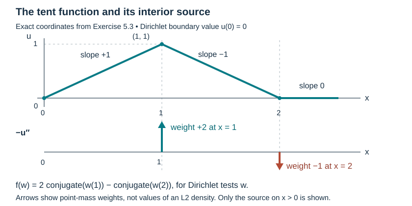

# Localize the boundary form before taking an energy estimate

An energy argument must first establish that its test function is allowed at the boundary. This lesson proves that step and the exact localization defect for a variable-coefficient second-order form. It permits complex lower terms, an indefinite principal form and a source in the natural dual space. It applies to both homogeneous Dirichlet and weak Neumann problems.

The quadratic-form method is explained in [András Vasy's free primary paper](https://math.stanford.edu/~andras/psmcrrb.pdf), Section 4, especially Lemmas 4.2 and 4.4. The exact current AN-03-based programme proofs of [lacunary symbols, smooth action and boundary jets](../20261005-local-boundary-calculus/boundary-tests-and-lacunary-symbols.md), [actual adjoints and composition](../20261005-local-boundary-calculus/boundary-adjoints-composition-and-distributions.md), and [L2 and Sobolev bounds](../20261005-local-boundary-calculus/boundary-bounds-and-conormal-action.md) supply the localizer calculus. They retain Claude's original CC0 proofs with the recorded editorial contributions and complete current prerequisite connections. We use those proofs directly. The estimates below are complete form estimates; the sharper microlocal orders in Vasy's lemmas, and the general parabolic propagation premise RW4, remain further work.

The [proof map](proof-map.json) gives the exact earlier versions and dependency chain. Elementary inputs are the complete [Lebesgue, L2 and Fourier proofs](../20261004-free-intrinsic-graph/prerequisites/measure-and-l2.md), [smooth compact cutoffs](../20261004-free-stationary-phase/proof-map.html#U001-A4), and [differential rules, integration by parts and the fundamental theorem](../20261004-free-stationary-phase/proof-map.html#FTC-TAYLOR-COMPACT-PARAMETERS). The earlier [half-space support and duality chapter](../20261005-mixed-halfspace-foundations/halfspace-support-and-duality.md), H6, identifies the precise Sobolev space used here. Linked components keep their individual licences.

## 1. Specify the form, source and domain

Let \(X=[0,\infty)_x\times\mathbb R^{n-1}_z\), with Lebesgue measure and \(D_j=-i\partial_j\). The normal index is \(n\), so \(D_n=D_x\). The inner product \((v,w)=\int_Xv\overline w\) is linear in its first argument. Give \(H^1(X)\) the norm

\[
\|v\|_1^2=\|v\|_{L^2}^2+\sum_{j=1}^n\|D_jv\|_{L^2}^2.
\tag{BF1}
\]

Use either \(V_D=H^1_0(X)\), the closure of smooth functions compactly supported in the interior, or \(V_N=H^1(X)\). Both carry (BF1). Write \(V\) for the selected space, and \(V^*\) for its continuous antidual: a member \(f\) is antilinear in the test variable and

\[
\|f\|_{V^*}=\sup_{0\ne w\in V}\frac{|f(w)|}{\|w\|_1}.
\tag{BF2}
\]

Take smooth bounded coefficients \(g_{ij},\ell_j,m_i,c\). They may be complex; the principal wave case has a real symmetric, indefinite matrix \(g\). Define

\[
q(u,w)=\sum_{i,j}(g_{ij}D_ju,D_iw)
       +\sum_j(\ell_jD_ju,w)
       +\sum_i(m_iu,D_iw)+(cu,w).
\tag{BF3}
\]

This form is continuous on \(H^1\times H^1\). In fact Cauchy–Schwarz bounds its absolute value by \(C_q\|u\|_1\|w\|_1\), where \(C_q\) can be the sum of the sup norms of all displayed coefficients. A weak solution means exactly

\[
u\in V,\qquad q(u,w)=f(w)\quad\hbox{for every }w\in V,
\qquad f\in V^*.
\tag{BF4}
\]

For interior tests, the corresponding differential expression is
\(P=\sum_{i,j}D_i g_{ij}D_j+\sum_j\ell_jD_j+\sum_iD_i m_i+c\), with products denoting composition. Its coefficient derivatives are included. Definition (BF4), rather than a formal integration by parts, specifies its boundary realization. The Neumann choice is the natural boundary condition of this complete form. If \(m_i\) is nonzero it contributes to the natural boundary term; one must not silently substitute a different conormal condition.

### 1.1. The weak-derivative domain is the required restriction space

Here \(H^1(X)\) means the L2 functions whose intrinsic distributional derivatives on \(x>0\) are in L2, with (BF1). We verify that this is the exact restriction space \(\overline H_{(1)}(X)\) used by the localizer theorem. Put \(h(\eta)=(1+|\eta|^2)^{1/2}\). Tangential Plancherel gives \(\|h(D_z)u\|^2=\|u\|^2+\sum_{j<n}\|D_ju\|^2\). For weak tangential derivatives this follows by zero extension in the normal variable: its tangential derivatives are the zero extensions of those of \(u\). To verify that assertion against a smooth test meeting \(x=0\), first multiply the test by a smooth cutoff vanishing for \(x<\varepsilon\), apply the interior weak identity, and then let \(\varepsilon\downarrow0\). No tangential derivative hits that normal cutoff, and L2 Cauchy–Schwarz gives convergence of both integrals. The full-space distributional Fourier derivative identity now proves the stated Plancherel equality. In dimension one the sum is empty and \(h=1\).

The exact H5 quotient identification in the half-space chapter therefore gives \(u\in\overline H^{(0,1)}\), with norm \(\|h(D_z)u\|\), and \(D_xu\in\overline H^{(0,0)}\), with its L2 norm. H6, (HS10), at \(r=1,q=0\), gives \(u\in\overline H^{(1,0)}=\overline H_{(1)}\) and \(\|u\|_{\overline H_{(1)}}^2\le2\|u\|_1^2\). Conversely every whole-space \(H_{(1)}\) extension restricts to the indicated weak derivatives and bounds (BF1); infimizing gives \(\|u\|_1\le\|u\|_{\overline H_{(1)}}\). Thus both spaces coincide and their norms differ by at most \(\sqrt2\). This also gives completeness. Proposition 10.2(a) of the localizer chapter supplies restricted-Schwartz density in this norm. The closure defining \(V_D\) is a closed subspace of this same Hilbert space; no trace theorem or zero extension of a general Neumann-domain function is assumed.

## 2. An allowed localizer and its actual commutators

Let \(a\in S^0_{\mathrm{la}}\) be the AN-03 lacunary symbol, and set \(A=T_a\). In that convention the compressed symbol is \(a(z,x,\eta,x\xi_x)\); denote its last, compressed momentum by \(\zeta\). Thus \(\partial_\zeta a\) differentiates the last slot before compression. The complete AN-03 adjoint theorem gives the actual \(L^2(X)\) adjoint \(A^*=T_{a^\dagger}\), with \(a^\dagger\in S^0_{\mathrm{la}}\). Both operators are bounded on \(L^2\) and \(H^1\).

**Realizing the bounded adjoint.** The earlier adjoint identity initially holds on restricted Schwartz tests. Given arbitrary \(u,v\in L^2(X)\), choose such tests converging in L2. The two order-zero bounds and Cauchy–Schwarz pass the identity to the limit, so the bounded operator \(T_{a^\dagger}\) is the actual Hilbert adjoint on all of L2. It is unique: the difference of two candidates pairs to zero against every L2 vector, hence against itself. The integer-order theorem and the norm equivalence just proved give the claimed H1 bounds in the precise norm (BF1). These bounds, including those of the adjoint, use finitely many symbol seminorms.

The AN-03 boundary-jet identity at order zero says that a smooth input with zero boundary value has output with zero boundary value. This gives preservation of \(V_D\) by continuity. More explicitly, an interior smooth compact input has all its boundary jets zero; its output is a restricted Schwartz function with all those jets zero. Such a function belongs to \(H^1_0\): extend it by zero, translate it slightly into the interior, mollify with a smaller compact kernel and then cut off at large radius. Fourier dominated convergence for translation and mollification, followed by the product rule for the cutoff, gives convergence in \(H^1\). Approximate a general \(u\in H^1_0\) by its defining interior smooth sequence and use the \(H^1\) bound of \(A\). The same argument applies to \(A^*\). For \(V_N\) their \(H^1\) bounds already give preservation. Therefore

\[
A:V\longrightarrow V,\qquad A^*:V\longrightarrow V,
\qquad A^*Au\in V.
\tag{BF5}
\]

No preservation of a strong Neumann derivative is asserted here.

For \(j<n\), the exact commutator is

\[
C_j^A:=[D_j,A]=-iT_{\partial_{z_j}a}.
\tag{BF6}
\]

The normal direction has an additional term:

\[
C_n^A:=[D_x,A]
 =-iT_{\partial_xa}-iT_{\partial_\zeta a}D_x.
\tag{BF7}
\]

These identities are AN-03 Theorem 5.1(b), with the commutator order reversed. Derivatives of a lacunary symbol remain lacunary; \(\partial_\zeta a\) has order \(-1\). The order-zero \(L^2\) theorem applies also to this lower-order symbol. Consequently every \(C_j^A\) is bounded \(H^1\to L^2\). The same statements hold for \(C_i^{A^*}=[D_i,A^*]\), using \(a^\dagger\).

For a bounded coefficient \(h\), write \(K_h=[h,A]\). Multiplication by \(h\) and \(A\) are bounded on \(L^2\), so

\[
\|K_h\|_{L^2\to L^2}\le2\|h\|_\infty\|A\|_{L^2\to L^2}.
\tag{BF8}
\]

This elementary bound makes no claim about a microlocal gain or a small constant. The commutator identities extend to all \(H^1\) by the AN-03 density and bounds: approximate by restricted Schwartz functions, and pass to the limit in each \(L^2\) expression. Hence \(D_jAu=AD_ju+C_j^Au\) holds for weak derivatives, including at the normal direction in the interior distributional sense.

## 3. The complete localization defect

For \(u\in V\), set \(v=Au\). Define \(\Delta_A(u)=q(v,v)-q(u,A^*v)\). Then

\[
\begin{aligned}
\Delta_A(u)={}&\sum_{i,j}\big[
 (K_{g_{ij}}D_ju,D_iv)+(g_{ij}C_j^Au,D_iv)
 -(g_{ij}D_ju,C_i^{A^*}v)\big]\\
 &+\sum_j\big[(K_{\ell_j}D_ju,v)+(\ell_jC_j^Au,v)\big]\\
 &+\sum_i\big[(K_{m_i}u,D_iv)-(m_iu,C_i^{A^*}v)\big]
 +(K_cu,v).
\end{aligned}
\tag{BF9}
\]

**Complete proof.** For one principal term, substitute \(D_jv=AD_ju+C_j^Au\) and \(D_iA^*v=A^*D_iv+C_i^{A^*}v\). The \(L^2\) adjoint identity moves the first occurrence of \(A^*\) to the first factor. The difference of the resulting leading terms is
\((g_{ij}AD_ju-Ag_{ij}D_ju,D_iv)=(K_{g_{ij}}D_ju,D_iv)\).
The two remaining principal terms are exactly those in the first line of (BF9).

For the \(\ell_j\) term, move \(A^*\) from the test to the first factor and substitute \(D_jv\); this gives \((K_{\ell_j}D_ju+\ell_jC_j^Au,v)\). For the \(m_i\) term, substitute \(D_iA^*v\) and again move \(A^*\), giving \((K_{m_i}u,D_iv)-(m_iu,C_i^{A^*}v)\). The zeroth-order difference is \((cu,A^*v)\) subtracted from \((cAu,v)\), hence \((K_cu,v)\). Sum these identities. Every factor belongs to \(L^2\) by Section 2, so the adjoint pairings are valid for the original \(H^1\) input. No differential integration by parts is used. ∎

If \(u\) is a weak solution, (BF5) makes \(A^*v\) an admissible test in (BF4). Thus the actual form identity is

\[
q(Au,Au)=f(A^*Au)+\Delta_A(u).
\tag{BF10}
\]

It uses the \(L^2\) adjoint \(A^*\), whose preservation of the form domain was proved. It does not replace \(f(A^*Au)\) by an unjustified \(L^2\) pairing with a rough source.

## 4. All constants and the uniform-family statement

Put \(d_j=\|C_j^A\|_{H^1\to L^2}\), \(d_i^*=\|C_i^{A^*}\|_{H^1\to L^2}\), \(k_h=\|K_h\|_{L^2\to L^2}\), and define the finite number

\[
\begin{aligned}
E_A={}&\sum_{i,j}\big(k_{g_{ij}}+\|g_{ij}\|_\infty(d_j+d_i^*)\big)\\
 &+\sum_j\big(k_{\ell_j}+\|\ell_j\|_\infty d_j\big)
 +\sum_i\big(k_{m_i}+\|m_i\|_\infty d_i^*\big)+k_c.
\end{aligned}
\tag{BF11}
\]

Applying Cauchy–Schwarz to each term in (BF9), with \(\|D_ju\|\le\|u\|_1\) and \(\|D_iv\|\le\|v\|_1\), gives

\[
|\Delta_A(u)|\le E_A\|u\|_1\|Au\|_1.
\tag{BF12}
\]

Let \(M_* =\|A^*\|_{V\to V}\). By (BF2), \(|f(A^*Au)|\le M_*\|f\|_{V^*}\|Au\|_1\). Combining this with (BF10) proves

\[
|q(Au,Au)|
 \le\big(M_*\|f\|_{V^*}+E_A\|u\|_1\big)\|Au\|_1.
\tag{BF13}
\]

For every \(\epsilon>0\), Young's elementary inequality \(ab\le\epsilon b^2+a^2/(4\epsilon)\), proved by expanding \((\sqrt\epsilon b-a/(2\sqrt\epsilon))^2\ge0\), yields

\[
|q(Au,Au)|\le\epsilon\|Au\|_1^2
 +\frac{\big(M_*\|f\|_{V^*}+E_A\|u\|_1\big)^2}{4\epsilon}.
\tag{BF14}
\]

These are form bounds, not coercivity claims. An indefinite wave form can have zero value at a nonzero function. A separate positive-commutator or normal-energy estimate must control the desired derivative norm before the first term in (BF14) can be absorbed.

The same proof is uniform for any family \(a_\lambda\) bounded in \(S^0_{\mathrm{la}}\). The AN-03 adjoint transform is continuous, so \(a_\lambda^\dagger\) is bounded in the same class. Its \(L^2\), \(H^1\) and commutator constants are controlled by finitely many uniform symbol seminorms. Bound each \(k_h\) by (BF8); then \(M_*\) and \(E_A\) have common finite bounds. This proves uniformity under precisely that hypothesis. A shrinking spatial/frequency window whose symbol seminorms diverge does not satisfy it merely because its individual members have order zero.

## 5. Exercises with complete solutions

**Exercise 5.1 (basic: see the defect exactly).** On the half-line take \(q(u,w)=\int_0^\infty u'\overline{w'}\), let \(A\) be multiplication by a real smooth compactly supported \(\chi\), and take real \(u\in H^1\). Compute \(q(Au,Au)-q(u,A^*Au)\). Explain why the defect cannot generally be omitted.

**Solution.** Here \(A^*=A\). Expand the products in weak derivatives:
\[
| (\chi u)' |^2=\chi^2(u')^2+2\chi\chi'uu'+(\chi')^2u^2,
\qquad u'(\chi^2u)'=\chi^2(u')^2+2\chi\chi'uu'.
\tag{BF15}
\]
Their difference integrates to \(\int(\chi')^2u^2\). Product rules are valid for \(H^1\) by smooth approximation; all terms are integrable by Cauchy–Schwarz and the bounded coefficients. Choose a smooth compact \(u\) nonzero where \(\chi'\ne0\); the defect is positive. Thus even a real multiplication localizer creates a nonzero form remainder. For complex \(u\) the same calculation gives this value for the real part; an imaginary cross term can remain in the full defect. ∎

**Exercise 5.2 (intermediate: a Neumann localizer can fail strongly).** Let smooth compact \(u\) equal one near \(x=0\), so \(u'(0)=0\). Take smooth compact real \(\chi\) with \(\chi(0)=1\), \(\chi'(0)=1\), and put \(v=\chi u\). Compute \(v'(0)\), and compare \((Lv,v)\) with \(q(v,v)\), for \(L=-\partial_x^2\) and the form in Exercise 5.1.

**Solution.** The product rule gives \(v'(0)=\chi'(0)u(0)+\chi(0)u'(0)=1\). Thus this allowed \(H^1\) localizer fails to preserve the strong Neumann condition. Integrating the smooth compact function once gives
\[
(Lv,v)=\int_0^\infty|v'|^2\,dx+v'(0)\overline{v(0)}
       =q(v,v)+1.
\tag{BF16}
\]
The sign follows from \(\int-v''\overline v=-[v'\overline v]_0^\infty+\int|v'|^2\). Replacing the form by the interior differential pairing would discard the displayed boundary contribution. The weak solution can still be tested with \(A^*v\in H^1\); (BF10) already accounts for its actual form defect and requires no false strong boundary condition on \(v\). ∎

**Exercise 5.3 (advanced: the natural source need not be in L2).** In the Dirichlet form space on the half-line take
\[
u(x)=\begin{cases}x,&0\le x\le1,\\2-x,&1\le x\le2,\\0,&x\ge2.\end{cases}
\tag{BF17}
\]
Find its weak source for \(q(u,w)=\int u'\overline{w'}\). Prove that the source is in \(V_D^*\) but is not represented by an \(L^2\) function.

**Solution.** This continuous piecewise affine function has compact support, trace zero and derivative \(1,-1,0\) on the three open intervals. Its zero extension belongs to \(H^1(\mathbb R)\) because the function has no jumps; translating it into the interior and smoothing as in Section 2 proves \(u\in H^1_0(X)\). For an interior smooth test, integration of its derivative on the two intervals gives
\[
q(u,w)=2\overline{w(1)}-\overline{w(2)}
       =f(w),\qquad f=2\delta_1-\delta_2.
\tag{BF18}
\]
For the absolutely continuous representative of any \(w\in H^1_0(X)\), \(w(0)=0\) and \(|w(a)|\le\sqrt a\|w'\|_{L^2(0,a)}\). This follows first for smooth tests by the fundamental theorem and Cauchy–Schwarz, then by \(H^1\) approximation, whose values converge uniformly on each bounded interval by that same bound. Therefore \(|f(w)|\le(2+\sqrt2)\|w\|_1\), and the identity extends to every \(w\in V_D\).

If an \(L^2\) function represented \(f\), choose a fixed smooth bump \(\phi\) supported in \((-1/4,1/4)\) with \(\phi(0)=1\), and set \(w_h(x)=\phi((x-1)/h)\), \(0<h<1\). It misses \(x=2\), so \(f(w_h)=2\), while \(\|w_h\|_{L^2}=\sqrt h\|\phi\|_{L^2}\). Cauchy–Schwarz for the proposed \(L^2\) representative would make \(|f(w_h)|\) tend to zero. This is a contradiction. Thus the dual norm in (BF13)–(BF14) includes sources that a formal \(L^2\) pairing would exclude. ∎

## 6. What the next boundary estimate must add

The domain preservation, exact full-coefficient defect and dual-source bound are now proved at the form level. To establish the analytic criterion in [the parabolic-window chapter](../20261007-restored-parabolic-windows/parabolic-wavefront-windows-and-rays.md), the receiving argument must still microlocalize these terms with their exact orders, retain uniform microsupport bounds, quantify the normal-energy gain, handle the shrinking two-scale cutoff seminorms and pass the regularized inequalities to the original solution. The preceding uniform-family statement does not supply any of those estimates for a family whose required seminorms diverge. Higher-contact and nonunique generalized rays retain the distinctions already proved in the geometric chapter.

## 7. The source of the tent function

This is Exercise 5.3 in exact coordinates: the graph joins \((0,0)\), \((1,1)\) and \((2,0)\), then stays zero. Its interior derivative jumps by \(-2\) at \(1\) and \(+1\) at \(2\), so \(-u''=2\delta_1-\delta_2\) on \(x>0\). The lower arrows show these distributional weights, not values of a density function. At the boundary \(u(0)=0\), and Dirichlet tests vanish there. The caption does not identify the interior source with the second derivative of a zero extension on the whole line. The displayed source belongs to the form antidual and has no L2 representative, by the complete proof above.

## Sources and contribution

Vasy's Section 4, PDF pages 23–26, proves sharper microlocal estimates: Lemma 4.2 uses a half-order difference between the localizers of the solution and source, and Lemma 4.4 changes the source order while retaining an epsilon-weighted solution term. This lesson proves its own complete global form identity and bounds. It does not import those analytic conclusions or their external prerequisites as programme proofs. The exact admitted PDF was read; its text and figures are not reproduced here.

The AN-03 programme components retain their original CC0 proofs by Claude Opus 5.5 (Anthropic) and the recorded Codex contributions. Their mathematical antecedent, the approved Hörmander III, 2007 eBook, Section 18.3, is a valid source and citation. The form argument and all three solved exercises are by GPT-6.1 Sol (OpenAI), Ultra. Restoration, exact current prerequisite connections, the explicit H1 identification and the coordinate diagram are by GPT-6 Astra (OpenAI), Ultra, October 2026. These additions and the independent form exposition are CC0-1.0; earlier linked components retain their own terms.
