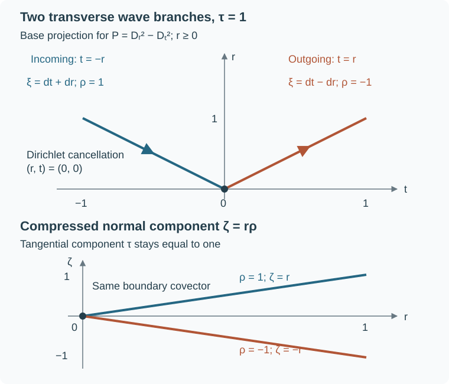

# Boundary reflection and compressed wavefronts

A singular wave meeting a noncharacteristic boundary has two normal covectors above the same tangential covector. At a transverse hyperbolic point, Dirichlet data couple these two branches. If the forcing and the boundary value are smooth there, regularity on either branch forces regularity on the other and at the boundary itself. This is the microlocal reflection law.

We prove that law for an arbitrary scalar second-order differential operator with smooth coefficients and real principal symbol. The lower-order coefficients may be complex. No global time function, positive energy, formal self-adjointness or globally Lorentzian signature is assumed. We then prove propagation along broken bicharacteristics with discrete transverse reflections. The construction of a distribution singular on a prescribed entire broken ray is a subsequent topic; glancing points require a different analysis.

The preceding proofs used here are Sections 7–9 of Higher-order Cauchy problems: roots, jets and propagation: complete simple-root factorization, commuting tangential tests, forced propagation, intrinsic jets and distributional Cauchy uniqueness. Sections 3–5 of [Singularities along a real characteristic direction](../20261005-restored-real-principal/real-principal-type-kernels-and-propagation.md) supply propagation on general interior characteristic pieces, including radial and stationary curves. The exact compressed coordinate law is in [Stretched kernels and compressed geometry](../20261005-global-boundary-operators/stretched-kernels-and-compressed-geometry.md). The [normal extension and tangential action proofs](../20261005-boundary-wavefront-and-tangential/normal-extension-and-tangential-action.md) retain (GE26), all intrinsic actions and their precise domains; the [smooth tester theorem](../20261005-boundary-wavefront-and-tangential/smooth-testers-and-boundary-consequences.md) supplies the two-sided criterion. Elliptic boundary regularity from rough data, Sections 2–7, proves the intrinsic normal inclusion, one common collar for all tangentially smoothing normal-jet errors, the full low-regularity bootstrap and the local differential theorem with redundant boundary data. Its equation (EW32) is exactly the elliptic identity used below. These are complete programme proofs at the exact versions in the proof map. References below to the global-boundary lesson mean the current compressed-geometry and normal-extension components just linked; the cited (GE26) is in Section 1 of the latter. The smooth parameter-dependent flow argument in Section 1 of [Energy and existence with a timelike Dirichlet boundary](../20261007-restored-mixed-dirichlet/mixed-dirichlet-cauchy-energy-preparation.md) also applies to the Hamilton field used below.

## 1. Two normal roots above one boundary covector

Let \(X\) be a smooth manifold with boundary, of dimension \(n\ge2\), and let \(P\) be a scalar second-order differential operator with smooth coefficients. Its homogeneous principal symbol \(p(x,\xi)\) is real. Write \(q_x(\xi,\theta)\) for its symmetric polarization. The boundary is noncharacteristic:
\[
 p(x,\nu)\ne0\qquad
 (x\in\partial X,\quad0\ne\nu\in N_x^*\partial X).
 \tag{RF1}
\]
All arguments are local. On a connected small boundary patch, multiply \(P\) by a constant sign so that its principal form is positive on boundary conormals. This does not change any wavefront or data-regularity assertion.

We first construct normal coordinates without assuming that \(q_x\) is nondegenerate on the entire cotangent space. Start with a boundary defining function \(r_0\ge0\), and prescribe on the boundary the covector
\[
 \xi_0(y)=\frac{dr_0}{\sqrt{p(y,dr_0)}}.
 \tag{RF2}
\]
It has principal square one and annihilates boundary tangent vectors. Extend the coefficients across the boundary and flow this initial cotangent submanifold by \(V=H_p/2\). The local existence, uniqueness and smooth dependence proof cited above applies to this smooth vector field on a bounded cotangent coordinate box. It gives a smooth map \((s,y)\mapsto(x(s,y),\xi(s,y))\) for a common small interval. At \(s=0\),
\[
 Vr_0=q_y(\xi_0,dr_0)=\sqrt{p(y,dr_0)}>0.
 \tag{RF3}
\]
The base map \((s,y)\mapsto x(s,y)\) therefore has an invertible differential: the \(y\)-directions span the boundary and the \(s\)-direction is transverse. The smooth inverse function theorem supplies product coordinates \((r,y)\), with \(r=s\), on a smaller neighborhood, and \(r\ge0\) on \(X\).

Here is why the transported covector is \(dr\). Let \(\theta=\xi\,dx\) be the canonical one-form, using \(H_p=p_\xi\partial_x-p_x\partial_\xi\). Then
\[
 \iota_Vd\theta=-\tfrac12dp,\qquad
 \theta(V)=p,\qquad \mathcal L_V\theta=\tfrac12dp.
 \tag{RF4}
\]
The flow preserves \(p=1\). On the initial submanifold \(\theta\) vanishes in all \(y\)-directions. The last identity in (RF4) shows that it remains zero in those directions, because the pullback of \(dp\) there is zero. Its value in the \(s\)-direction is one. Consequently the pulled-back one-form is \(ds\), and the covector at \(x(s,y)\) is \(dr\). The coordinates \(y\) are constant on these base flow curves, so
\[
 p(x,dr)=1,\qquad q_x(dr,dy_j)=0,\qquad
 p(r,y;\rho,\eta)=\rho^2-R(r,y,\eta).
 \tag{RF5}
\]

The one-form calculation can also be verified directly, without invoking a formula for its Lie derivative. In a cotangent coordinate chart write \(X_j=\partial_{y_j}x\) and \(\Xi_j=\partial_{y_j}\xi\) along the flow. Differentiating the actual scalar pairing and then differentiating the quadratic Euler identity gives
\[
 \begin{aligned}
 \frac{d}{ds}(\xi\cdot X_j)
 &=-\tfrac12p_x\cdot X_j
   +\tfrac12\sum_{i,k}\xi_i
       \bigl(p_{\xi_i x_k}(X_j)_k
             +p_{\xi_i\xi_k}(\Xi_j)_k\bigr)\\
 &=\tfrac12\bigl(p_x\cdot X_j+p_\xi\cdot\Xi_j\bigr)
   =\tfrac12\partial_{y_j}p=0,\\
 \xi\cdot\partial_s x&=\tfrac12\xi\cdot p_\xi=p=1.
 \end{aligned}
 \tag{RFA1}
\]
Indeed \(\sum_i\xi_i p_{\xi_i x_k}=2p_{x_k}\) and \(\sum_i\xi_i p_{\xi_i\xi_k}=p_{\xi_k}\), obtained by differentiating \(\sum_i\xi_i p_{\xi_i}=2p\) in \(x_k\) and \(\xi_k\). The initial tangential pairings are zero. The displayed identities therefore prove that the pulled-back covector takes value zero on every \(\partial_{y_j}\) and one on \(\partial_s\), which characterizes \(ds\). Since the base differential is invertible, this proves \(\xi=dr\) in the base chart. Finally \(V y_j=q_x(dr,dy_j)=0\), because the transported base coordinates \(y_j\) are constant on the flow. This establishes both equalities before (RF5) without an invertibility hypothesis on the full quadratic form.

Here \(R\) is a smooth real quadratic form in the tangential covector \(\eta\). No definiteness of \(R\) is asserted. The leading normal coefficient of the differential operator is now exactly one. Its full expression is \(D_r^2+C(r)D_r+B(r)\), where \(D=-i\partial\), \(C\) is multiplication by a smooth function and \(B\) is a tangential differential family of order at most two. Its principal tangential symbol is \(-R\).

At the boundary set \(R_0(y,\eta)=R(0,y,\eta)\), for \(\eta\ne0\). The elliptic, hyperbolic and glancing regions are respectively
\[
 \mathcal E=\{R_0<0\},\qquad
 \mathcal H=\{R_0>0\},\qquad
 \mathcal G=\{R_0=0\}.
 \tag{RF6}
\]
At \(q=(y,\eta)\in\mathcal H\) there are exactly two characteristic lifts:
\[
 \ell_\pm(q)=(0,y;\pm\sqrt{R_0(y,\eta)},\eta),\qquad
 H_pr=2\rho.
 \tag{RF7}
\]
The plus lift enters \(X\) as the Hamilton parameter increases; the minus lift leaves it. These names refer to the chosen Hamilton parameter, which need not be physical time. On either branch, putting \(\lambda_\pm=\pm\sqrt R\) gives
\[
 p=(\rho-\lambda_\pm)(\rho+\lambda_\pm),\qquad
 H_p=2\lambda_\pm H_{\rho-\lambda_\pm}
        \quad\text{on }\rho=\lambda_\pm.
 \tag{RF8}
\]
Thus \(r\) parametrizes both short characteristic germs, with tangential flow generated by \(\partial_r-H_{\lambda_\pm}\). The sign in (RF8) reverses one Hamilton orientation but leaves its unparameterized germ unchanged.

The root interchange has an invariant formula. If \(\xi\) is characteristic over a boundary point and \(\nu\ne0\) is a boundary conormal, define
\[
 \mathscr R\xi
  =\xi-2\frac{q_x(\xi,\nu)}{p(x,\nu)}\nu.
 \tag{RF9}
\]
Restriction to \(T_x\partial X\) is unchanged. Expanding the quadratic form shows \(p(x,\mathscr R\xi)=p(x,\xi)\), while \(q_x(\mathscr R\xi,\nu)=-q_x(\xi,\nu)\). Applying the formula twice gives \(\mathscr R^2=I\). Rescaling \(\nu\), or multiplying \(p\) by a nonzero scalar, leaves the formula unchanged. In (RF5) it is precisely \((\rho,\eta)\mapsto(-\rho,\eta)\). At a glancing lift the two covectors coincide; transversality, rather than merely the existence of this algebraic involution, is what the proof needs.

## 2. What boundary regularity measures

In product coordinates, an interior covector \(\rho\,dr+\eta\,dy\) has compressed components
\[
 \pi(r,y;\rho,\eta)=(r,y;r\rho,\eta).
 \tag{RF10}
\]
This is the dual coordinate system of the vector fields \(r\partial_r,\partial_y\). At \(r=0\), both finite normal lifts of \(q=(y,\eta)\) project to \((0,y;0,\eta)\). We identify this embedded nonzero tangential bundle with \(T^*\partial X\setminus0\). The intrinsic coordinate law, the conormal test space \(\mathcal A\), its dual \(\mathcal A'\), and the compressed wavefront \(\operatorname{WF}_b\) are the exact ones in the global-boundary prerequisite. In the interior the compression is invertible and \(\operatorname{WF}_b\) is the image of the ordinary wavefront.

Use the noncharacteristic extension class
\[
 \mathcal N(X)=\{u\in\mathcal A'(X):
    \operatorname{WF}_b(u)|_{\partial X}
      \subset T^*\partial X\setminus0\}.
 \tag{RF11}
\]
For \(u\in\mathcal N\), intrinsic derivatives and properly supported tangential operators preserve this class; intrinsic normal jets exist. The precise differential and trace inclusions proved in the prerequisites are
\[
 \operatorname{WF}_b(D_ru)\subset\operatorname{WF}_b(u),
 \qquad
 \operatorname{WF}(\gamma_k u)
       \subset\operatorname{WF}_b(u)|_{\partial X},
 \quad \gamma_k u=(D_r^ku)|_{r=0}.
 \tag{RF12}
\]
The derivative here is intrinsic. A supported representative satisfies
\[
 D_r(H(r)u)=H(r)D_ru-i\delta(r)\gamma_0u.
 \tag{RF13}
\]
Removing the displayed boundary delta is necessary when identifying the intrinsic derivative. We never replace it by the uncorrected derivative of a zero extension.

Two consequences will be used repeatedly. First, for \(w\in\mathcal N\), a properly localized tangentially smoothing family maps \(w\) to a function smooth in a sufficiently small compact collar. Indeed tangential smoothing removes every nonzero tangential boundary covector, and (RF11) excludes the other boundary covectors. If interior wavefront points persisted arbitrarily close to the compact boundary support, their normalized compressed covectors would have a convergent subsequence, contradicting closedness of \(\operatorname{WF}_b\). The output is therefore in \(\mathcal A\) as well as \(\mathcal A'\); the proved equality \(\mathcal A\cap\mathcal A'=C^\infty\) supplies smoothness up to the boundary. Proper support and separated base supports contribute the same type of smoothing terms. This argument concerns a small collar; tangential smoothing alone does not smooth an arbitrary distribution with pure normal singularities.

Second, if a compact boundary cone misses \(\operatorname{WF}_b(w)\), every tangential tester supported in a smaller such cone maps \(w\) to a smooth function in a common smaller collar. The exact tangential tester theorem removes the nonzero tangential boundary points, and the preceding closedness argument finishes the collar. These statements apply to every intrinsic jet in (RF12). The common collar can be fixed before choosing the finite collection of errors: Sections 2–3 of the elliptic boundary regularity companion prove that the original input and all its intrinsic normal derivatives have no pure-normal interior covectors on one compact collar. Every tangentially smoothing normal-jet remainder is smooth on that same collar, by the full Fourier kernel estimate (EW7). For a finite family of source tests, use one fixed elliptic source tester and its full parameter-dependent tangential parametrix as in (EW9); the residuals obey that common-collar argument. Thus a separate order-dependent shrinking has not replaced smoothness on one open neighborhood. They give control over all normal covectors seen by the tangential test.

Suppose now that
\[
 u,f\in\mathcal N(X),\qquad Pu=f,\qquad
 \gamma_0u=b\in\mathcal D'(\partial X).
 \tag{RF14}
\]
At an elliptic boundary covector, the exact result is
\[
 \mathcal E\cap\operatorname{WF}_b(u)
   =\mathcal E\cap
       \bigl(\operatorname{WF}_b(f)\cup\operatorname{WF}(b)\bigr).
 \tag{RF15}
\]
Here and below the boundary restriction of \(\operatorname{WF}_b(f)\) is understood. To apply the proved elliptic-boundary theorem, freeze (RF5) at an elliptic \(q\). With \(a=\sqrt{-R_0}>0\), the bounded normal solutions of
\[
 (D_r^2+a^2)v=0\quad(r\ge0)
\]
form the one-dimensional space spanned by \(e^{-ar}\). The Dirichlet evaluation sends this solution to one, hence is an isomorphism on that space. There is no real characteristic lift. Thus \(q\) is outside the boundary characteristic set in Section 7 of the elliptic boundary regularity companion. Its complete coefficient completion and regularity proof give the inclusion from left to right in (RF15), for this locally elliptic cone even when the original operator is not elliptic elsewhere. The ordinary differential and trace inclusions (RF12) give the reverse inclusion. The input retains the original operator's full lower-order terms and the class \(\mathcal N\); no elliptic global boundary hypothesis is added to (RF14).

## 3. Two factorized equations with the same boundary test

Fix \(q_0\in\mathcal H\). Choose a small compact base-cone neighborhood of its positive tangential ray such that
\[
 R(r,y,\eta)\ge c|\eta|^2>0,\qquad 0\le r\le\varepsilon,
 \tag{RF16}
\]
on the slightly larger cone that will contain both transported germs. This follows by continuity and homogeneity after shrinking. The positive root \(\sqrt R\) is a smooth homogeneous symbol of order one there, with a uniform separation \(2\sqrt R\ge2\sqrt c|\eta|\).

The bounded simple-root calculus applies after a local extension. Choose an angular and base cutoff supported where (RF16) holds, equal to one near the chosen cone, and replace \(R\) outside it by a fixed positive multiple of \(|\eta|^2\). The convex combination remains positive with a uniform lower bound. Complete it smoothly at bounded frequencies and extend the full lower-order coefficients with proper base cutoffs. This makes a bounded tangential symbol family with two globally separated real principal roots. It agrees with the original complete differential family on the smaller base-cone region. After a tangential localization, the discrepancies have only tangentially smoothing coefficients multiplying the displayed finite normal jets. They act smoothly by Section 2. Hence the local extension is a device for applying the exact calculus, rather than a change to the equation under study.

Section 7 of the higher-order Cauchy lesson, applied to the two simple roots with \(m=2\), gives two factorizations:
\[
 \begin{aligned}
 P&=(D_r-A_+)(D_r-A_-)+\Omega,\\
 P&=(D_r-\widetilde A_-)(D_r-\widetilde A_+)
                                      +\widetilde\Omega,
 \end{aligned}
 \tag{RF17}
\]
microlocally in the chosen tangential cone. The remainders have tangential order minus infinity and no normal derivative. The principal symbols of \(A_\pm\) and \(\widetilde A_\pm\) are \(\pm\sqrt R\). The two full operators of a given sign can differ at order zero. Interchanging factors without recomputing those lower terms would not give (RF17).

For clarity, the receiving use of the factorization algorithm retains its full remainder. If the present defect is a tangential \(R_N\in S^{2-N}\), correcting the left root by a symbol of order \(1-N\) cancels its leading value at that root, since the derivative of the principal polynomial there is \(\pm2\sqrt R\). Exact left polynomial division supplies the order-\(1-N\) correction to the right factor, including derivatives of its coefficients in \(r\). The remaining defect is tangential of order \(1-N\). Repeating and summing with bounds on every \(r\)-derivative gives actual symbols; comparison with every finite stage makes the final defect belong to all negative tangential orders. This is the \(m=2\) instance of the complete ordered algorithm (HC16)–(HC17), not a formal root factorization.

For this second-order operator the absence of a normal derivative in the remainder has an exact algebraic check. Set \(A_+=-C-A_-\) after choosing the right factor. Normal differentiation acts on the coefficient family as well as on its input, so the complete operator identity is
\[
 \begin{aligned}
 (D_r-A_+)(D_r-A_-)
 &=D_r^2-(A_++A_-)D_r+i\partial_rA_-+A_+A_-,\\
 P-(D_r-A_+)(D_r-A_-)
 &=B-i\partial_rA_-+CA_-+A_-^2.
 \end{aligned}
 \tag{RFA2}
\]
Every product here is an actual ordered tangential operator product. Its normal degree is zero, before any symbolic approximation. The leading tangential equation is \(a_-^2-R=0\). If the remaining symbol is \(e_N\) of order \(2-N\), a correction of order \(1-N\) with leading value \(-e_N/(2a_-)\) cancels that defect. The gap estimate (RF16) justifies this division and its differentiated symbol bounds. Derivatives of the correction and lower composition terms have order at most \(1-N\); its square has that order as well for \(N\geq1\). Iteration with all normal-parameter derivatives and the proved symbol summation gives a full \(A_-\). Reimpose \(A_+=-C-A_-\) on the summed operators. Formula (RFA2) then still cancels the normal coefficient exactly, and comparison with every finite stage makes the remaining tangential symbol smoothing. For the second ordering start with the right factor \(\widetilde A_+\), whose principal root is \(+\sqrt R\), and set \(\widetilde A_-=-C-\widetilde A_+\). This repeats the same ordered calculation with the other root; it does not interchange two already constructed full factors.

Put
\[
 L_+=D_r-A_+,\qquad \widetilde L_-=D_r-\widetilde A_-.
 \tag{RF18}
\]
There are proper tangential order-zero families \(Q_+(r)\) and \(\widetilde Q_-(r)\), with microsupport in arbitrarily small tubes transported by their respective principal flows, such that
\[
 [L_+,Q_+]\in\Psi^{-\infty}_{\mathrm{tan}},\qquad
 [\widetilde L_-,\widetilde Q_-]
           \in\Psi^{-\infty}_{\mathrm{tan}},\qquad
 Q_+(0)=\widetilde Q_-(0)=Q_0.
 \tag{RF19}
\]
Choose \(Q_0\) elliptic at \(q_0\), with arbitrarily small microsupport. The principal commuting equation is
\[
 (\partial_r-H_{\lambda_+})q_{+,0}=0,\qquad
 (\partial_r-H_{\lambda_-})\widetilde q_{-,0}=0.
 \tag{RF20}
\]
It transports the same initial symbol along the two different flows. To retain the full prescribed initial operator, begin with a symbol expansion of \(Q_0\). At each successive order, solve the inhomogeneous scalar transport equation with the corresponding prescribed initial coefficient; the leading commutator is \(-i(\partial_r-H_\lambda)\) on that correction. All other contributions drop one order, because the symbol is scalar and the difference between the full generator and its real order-one principal part has order zero. The parameter-aware asymptotic sum gives the full commuting test, with its initial value equal to \(Q_0\) modulo tangential smoothing. Subtract that initial smoothing difference as a smooth \(r\)-family constant near zero. Its commutator is still tangentially smoothing. Thus the last equality in (RF19) is an exact operator equality. Proper cutoff errors retain the same smoothing qualification on a smaller tube. This is precisely the commuting-test construction in Section 8 of the Cauchy lesson, with its initial condition specified here.

Assume \(q_0\) misses the forcing and boundary-data wavefronts. Shrink the tubes and collar so that their boundary closures miss those sets. Define two intrinsic distributions
\[
 v=Q_+(D_r-A_-)u,\qquad
 \widetilde v=\widetilde Q_-(D_r-\widetilde A_+)u.
 \tag{RF21}
\]
All derivatives and tangential actions preserve \(\mathcal N\). Equations (RF17)–(RF19) give the actual equations
\
 \begin{aligned}
 L_+v&=Q_+f-Q_+\Omega u
                   +[L_+,Q_+u,\\
 \widetilde L_-\widetilde v
   &=\widetilde Q_-f-\widetilde Q_-\widetilde\Omega u
           +[\widetilde L_-,\widetilde Q_-]
                         (D_r-\widetilde A_+)u.
 \end{aligned}
 \tag{RF22}
\]
Every term on the right is smooth in a smaller collar. For the forcing terms this is the compact-cone tester assertion of Section 2. For the other terms it is tangential smoothing on \(\mathcal N\), with the indicated intrinsic jets retained.

Here is the support convention for the global first-order Cauchy theorem used below. Extend the two root families to bounded symbols on the whole tangential chart space, as above, and realize them with a uniform proper kernel cutoff. Choose the initial test with compact output base support; its complete transported symbol remains in a fixed compact base set on the short normal interval. Its proper realization and the initial smoothing correction can have output support in a slightly larger fixed compact set. The equations (RF22) then have compact tangential output support in a further fixed set: the first-order operator applied to such a test enlarges it only by the fixed proper kernel range. Include all these input and output sets in the common collar just proved. The full-symbol comparison with the original operator adds only the already controlled tangentially smoothing normal-jet terms. The right sides are therefore smooth functions in every global tangential Sobolev space, with all normal derivatives, on each closed shorter interval. The smooth Cauchy solutions are legitimate inputs to the all-order theorem, while the original tested distributions have compact tangential support. This supplies the compact-time Schwartz test topology in the distributional uniqueness argument; no spatially unbounded smooth datum is silently assigned a finite global Sobolev norm.

At the boundary, (RF19) and the intrinsic trace action give
\[
 \gamma_0\widetilde v-\gamma_0v
      =Q_0\bigl(A_-(0)-\widetilde A_+(0)\bigr)b.
 \tag{RF23}
\]
The right side is smooth because \(b\) is regular on the microsupport of \(Q_0\). Both tests must have the same full boundary operator for the normal derivative of \(u\) to cancel exactly. Principal-symbol equality alone would leave an uncontrolled lower-order boundary term.

## 4. Regularity of either germ determines the reflection

**Transverse reflection theorem.** Under (RF1) and (RF14), let
\[
 q_0\in\mathcal H\setminus
        \bigl(\operatorname{WF}_b(f)\cup\operatorname{WF}(b)\bigr).
 \tag{RF24}
\]
There is a sufficiently short source-free collar in which the following three assertions are equivalent: \(q_0\notin\operatorname{WF}_b(u)\); the inward characteristic germ from \(\ell_+(q_0)\) is regular; the outward characteristic germ from \(\ell_-(q_0)\) is regular. Equivalently, a singular boundary point under (RF24) has singularities on both germs. Each germ remains entirely singular or entirely regular along any connected interior continuation that avoids the forcing wavefront before its next boundary encounter. General interior propagation is Theorem 5.1 of the real-characteristic lesson; the simple-root argument alone is needed only in the small normal collar.

**Proof.** If \(q_0\) is regular in the compressed sense, its regular set contains a compressed conic neighborhood. Both lifted germs converge to this point under (RF10), so their short interior pieces are regular. The general interior propagation theorem extends their regularity along source-free continuations.

Conversely suppose the plus germ is regular. Use the first distribution \(v\) in (RF21). Its equation has smooth right side by (RF22). Away from pure normal covectors, its first-order principal symbol is \(\rho-\sqrt R\), so ordinary elliptic regularity confines \(\operatorname{WF}(v)\) in the small transported tube to that graph. The no-pure-normal and ordinary/tangential compatibility arguments in Section 8 of the Cauchy lesson justify this use of ordinary ellipticity on a compact subcollar with \(r>0\). First shrink the compact input and output collars: (RF11), (RF12) and closedness exclude pure normal interior wavefront covectors of \(u\) and its relevant intrinsic jets there, since such covectors would otherwise accumulate at a forbidden pure compressed normal boundary point. On a compact subcollar away from zero, proper localization consequently has bounded normal slopes and smooth normal slices in a common negative tangential Sobolev scale. Tangential spatially smoothing tails are fully smooth on these localized inputs. Moreover \(\operatorname{WF}(v)\subset\operatorname{WF}(u)\) on this smaller tube, modulo the already smooth terms. A point on the regular plus germ is therefore regular for \(v\) at its graph lift. This interior-slice argument does not assume a uniform ordinary normal-frequency bound all the way to \(r=0\).

Choose a small positive slice \(r=r_1\). Shrink the initial microsupport of \(Q_0\) so that the entire graph over the transported support of \(Q_+(r_1)\) lies in a regular neighborhood of that point. The other normal lifts over this support are regular by first-order ellipticity. High normal slopes are regular by the preceding localization. The noncharacteristic pullback theorem now gives a smooth boundary-cone slice of \(v\) at \(r_1\). Since \(Q_+\) is smoothing outside the tube, the properly localized output slice is fully smooth. This step uses regularity over every normal lift seen by the spatial test, rather than taking a slice from regularity at only one arbitrary covector.

Solve \(L_+w=L_+v\) backward from this smooth slice. The scalar first-order Cauchy theorem at every Sobolev order makes \(w\) smooth down to \(r=0\), and the distributional uniqueness argument in Section 9 of the Cauchy lesson identifies it with \(v\) on the smaller collar. That argument applies after reversing the normal coordinate and retains its compact-time Schwartz test topology. Thus \(v\) is smooth up to the boundary and \(\gamma_0v\) is smooth. Equation (RF23) makes \(\gamma_0\widetilde v\) smooth as well. The smooth forward Cauchy solution of \(\widetilde L_-\widetilde w=\widetilde L_-\widetilde v\) agrees with \(\widetilde v\) by the same distributional uniqueness proof. We have proved
\[
 v,\widetilde v\in C^\infty\quad\text{in a smaller collar}.
 \tag{RF25}
\]

Recovering \(u\) is a separate step. Both \(Q_+\) and \(\widetilde Q_-\) are elliptic over a common sufficiently small base-cone neighborhood of \(q_0\) for \(r\) near zero. Choose a tangential localizer \(a(r,y,D_y)\), elliptic there, with microsupport inside that common region. Proper tangential parametrices for the two tests, applied to (RF21) and (RF25), give
\[
 a(D_r-A_-)u\in C^\infty,\qquad
 a(D_r-\widetilde A_+)u\in C^\infty.
 \tag{RF26}
\]
The parametrix remainders act on the actual \(\mathcal N\) jets, so Section 2 turns them into smooth functions in a smaller collar. Subtract the two displayed outputs. The normal derivative cancels and gives
\[
 a(\widetilde A_+-A_-)u\in C^\infty,\qquad
 \sigma_1(\widetilde A_+-A_-)=2\sqrt R\ne0.
 \tag{RF27}
\]
An order-minus-one tangential parametrix, with a further smaller conic cutoff, gives a smooth tangential order-zero elliptic test of \(u\). Its smoothing errors again act smoothly on \(\mathcal N\). The exact tester criterion removes \(q_0\) from \(\operatorname{WF}_b(u)\). This proves the converse from the plus germ.

If the minus germ is regular, start with \(\widetilde v\), solve its Cauchy equation backward from a small positive slice, and use (RF23) to obtain the initial value of \(v\). Solve that equation forward and repeat (RF26)–(RF27). This proves the converse from the minus germ, without reversing the order of the full factors. Interior continuation uses the full real-symbol propagation theorem stated in the prerequisites, with \(m=2\); it does not require a normal simple-root chart along the entire continuation. The theorem follows.

The proof also explains why a statement only about \(\gamma_1u\) would be insufficient. The boundary comparison (RF23) transmits initial regularity between the two scalar equations; the equations transmit that regularity throughout a collar; and the elliptic difference of their full outputs recovers \(u\) there. All three steps are needed to reach compressed boundary regularity.

## 5. Propagation along a broken bicharacteristic

A **transverse broken bicharacteristic** is a continuous compressed curve \(\gamma:I\to\widetilde T^*X\setminus0\), with discrete reflection parameters, having the following properties. Between reflection parameters it is the compression of a characteristic \(H_p\)-trajectory, with its Hamilton orientation and positive scaling consistently retained. At a reflection parameter its two limits have full lifts \(\xi_-\) and \(\xi_+\) over one boundary base point, satisfying
\[
 \xi_+=\mathscr R\xi_-,\qquad
 \xi_-|_{T\partial X}=\xi_+|_{T\partial X}=\eta\ne0,\qquad
 (y,\eta)\in\mathcal H.
 \tag{RF28}
\]
One piece leaves \(X\) and the next enters it. The two limits of (RF10) agree, so the compressed curve is continuous. A change of smooth positive parameter on an interior piece does not alter the curve. Discreteness here means local finiteness inside \(I\): every compact subinterval contains only finitely many reflections. Accumulation at an endpoint outside \(I\) is not an interior reflection in this definition. Glancing contact is excluded.

Define the source set in the compressed bundle by
\[
 \Sigma=\operatorname{WF}_b(f)
         \cup\operatorname{WF}(b),
 \tag{RF29}
\]
where the second set lies in the embedded tangential boundary bundle. Let \(J\subset I\) be a connected interval with \(\gamma(J)\cap\Sigma=\varnothing\). Then
\[
 \gamma(J)\subset\operatorname{WF}_b(u)
 \quad\text{or}\quad
 \gamma(J)\cap\operatorname{WF}_b(u)=\varnothing.
 \tag{RF30}
\]

**Proof.** Pull back the regular set along \(\gamma\). It is open because the wavefront is closed. At an interior parameter, Theorem 5.1 of the real-characteristic lesson makes regularity constant on a small interval: \(P\) is properly supported because it is differential, has a real homogeneous principal symbol of order two, and its ordinary forcing wavefront agrees with the compressed one in the interior. That theorem retains arbitrary complex lower terms, and its radial or stationary cases use conicity and flow uniqueness rather than an impossible normal straightening. At a reflection parameter, Section 4 makes regularity on either adjacent germ equivalent to regularity at the boundary and on the other germ. Thus regularity is constant on a small parameter neighborhood there too. The singular set is also open in \(J\): a singular interior point propagates in both directions locally, and a singular reflection has both neighboring germs singular. The two disjoint sets are open, cover \(J\), and connectedness forces one to be empty. Equivalently, any two parameters in \(J\) can be joined through finitely many interior pieces and reflections on the compact interval between them. This proves (RF30), including noncompact connected \(J\).

The conclusion concerns the whole compressed curve. At a reflection the ordinary interior wavefront has two different normal covectors. It becomes a single continuous curve only after the normal covector is compressed. The elliptic equality (RF15) and the transverse law (RF30) account for the two open regions \(\mathcal E\) and \(\mathcal H\). Neither supplies propagation at \(\mathcal G\).

## 6. Flat waves and a trace that misses singularities

For the flat wave operator on \(r\ge0\), use coordinates \((r,t,z)\) and
\[
 P=D_r^2+|D_z|^2-D_t^2,\qquad
 R=\tau^2-|\eta|^2.
 \tag{RF31}
\]
Its hyperbolic boundary region is \(|\tau|>|\eta|\). Reflection keeps \((\tau,\eta)\) and changes the sign of \(\rho\). Its glancing set is \(|\tau|=|\eta|\). The elliptic region is \(|\tau|<|\eta|\). For a characteristic lift with \(\tau>0\), physical time has derivative \(H_pt=-2\tau\). Consequently the physical-time slope is
\[
 \frac{dr}{dt}=-\frac{\rho}{\tau}.
 \tag{RF32}
\]
The plus normal root is incoming in increasing physical time, although it is inward in increasing \(H_p\)-parameter. This distinction prevents an orientation error.

In two dimensions the exact Dirichlet wave
\[
 u(r,t)=\delta(t-r)-\delta(t+r)
 \tag{RF33}
\]
satisfies \(Pu=0\) and \(\gamma_0u=0\). Its two hypersurfaces are disjoint for \(r>0\), so there is no interior cancellation. Their conormal covectors are
\[
 \lambda(dt-dr)\quad(t=r),\qquad
 \lambda(dt+dr)\quad(t=-r),\qquad \lambda\ne0.
 \tag{RF34}
\]
The asserted wavefronts have a direct Fourier verification. A localization of \(\delta(t)\) at zero has constant Fourier transform equal to the nonzero cutoff value, so both nonzero one-dimensional covector directions occur. Away from zero it vanishes. Tensoring with the smooth constant in the other coordinate gives exactly zero covector in that coordinate, by the complete tensor/projection theorem in the real-characteristic lesson. The invertible linear maps \((r,t)\mapsto(r,t-r)\) and \((r,t)\mapsto(r,t+r)\), with their exact cotangent transforms, give (RF34). Their distinct interior supports prevent cancellation. Differentiation and these submersion pullbacks are continuous on distributions, so the displayed wave equation follows from the same derivative calculation as for an arbitrary smooth one-variable function.

They compress to the same boundary covectors \((t=0;\tau=\lambda)\). The distribution is smooth as an \(r\)-dependent tangential distribution and is extendible across zero by its displayed full-space formula. Since \(Pu=0\) and the boundary is noncharacteristic, (GE26) of the global-boundary lesson supplies its intrinsic representative in \(\mathcal N\). Its intrinsic traces agree with the displayed tangential-distribution limits, by interior injectivity and the trace theorem. Direct differentiation yields
\[
 \gamma_1u=2i\delta'(t).
 \tag{RF35}
\]
The singular normal trace records the reflected pair even though the Dirichlet trace vanishes. Closedness gives the boundary points of its compressed wavefront, while (RF34) gives both neighboring germs. This verifies the theorem with zero forcing and zero boundary value.

*The upper panel is the base projection of (RF33)–(RF34), in the positive covector section \(\tau=1\). Arrows follow increasing physical time, rather than increasing \(H_p\)-parameter. The incoming lift has \(\rho=1\), the outgoing lift \(\rho=-1\), and both have tangential component one. The lower panel plots the exact compressed components \(\zeta=r\) and \(\zeta=-r\) from (RF10); it omits the base time component, which is \(-r\) and \(r\) respectively. Both full branches meet the single boundary point \((r,t;\zeta,\tau)=(0,0;0,1)\). These are coordinate sections, with no assertion that the uncompressed covectors agree. Positive dilation recovers the whole positive cone; (RF34) also has its negative cone. The general reflection theorem is Section 4, following the mathematical antecedent of Hörmander III, Theorem 24.2.1, printed 424–425.*

There is also a useful warning in the opposite direction. Set \(a(r)=e^{-1/r^2}\) for \(r>0\), smoothly continued by zero at \(r=0\), and
\[
 w(r,t)=a(r)\delta(t).
 \tag{RF36}
\]
Every intrinsic normal trace is zero, because each derivative of \(a\) is flat at zero. The class assertion can be checked directly. A conormal test of any fixed order, and each of its finitely many required tangential derivatives, has at most a fixed power growth in \(1/r\) on a compact collar. Pairing its tangential restriction with \(\delta(t)\) and integrating against \(a(r)\) is continuous in that test topology, since \(a\) decays faster than every power. This proves the dual conormal requirement. For an actual compressed tester, the needed uniform estimate can be given directly. Multiply \(a\) by a compact normal cutoff equal to one near zero and extend by zero to negative \(r\); denote the resulting smooth compact function by \(A\). Every derivative is zero at zero: successive derivatives of \(e^{-1/r^2}\) are that exponential times a polynomial in \(1/r\), and the series inequality \(e^x\ge x^j/j!\) with arbitrarily large \(j\) proves the assertion. Repeated integration by parts makes \(\widehat A(\rho)\) rapidly decreasing with every prescribed power.

Fix a compressed boundary covector whose normal component \(\zeta\) is nonzero. Choose a smooth order-zero full compressed symbol \(c(r,t,\eta,\zeta)\), elliptic there, with its high-frequency support in \(|\eta|\le C|\zeta|\). The local realization and full conic cutoff proofs in the global-boundary calculus provide such a tester, with a full symbol supported in a slightly larger such cone modulo a residual symbol. In the left coordinate quantization its action on the compact input \(A(r)\delta(t)\), before harmless outer cutoffs, is
\[
 (T_cw)(r,t)=(2\pi)^{-2}
   \int e^{i(t\eta+r\rho)}c(r,t,\eta,r\rho)
                       \widehat A(\rho)\,d\eta\,d\rho.
 \tag{RFA3}
\]
The formula is first justified with compact frequency cutoffs. For \(0\le r\le r_0\), the main cone has \(|\eta|\le C(1+r|\rho|)\). Its \(\eta\)-length is at most \(C'(1+|\rho|)\). Any fixed number of ordinary \(r,t\) derivatives of the integrand adds at most a fixed polynomial in \(|\eta|+|\rho|\): differentiating \(r\rho\) contributes a factor \(\rho\), while every base or frequency derivative of the order-zero symbol has its uniform symbol bound. On that cone the absolute differentiated integral is thus bounded by an integral of \(C_N(1+|\rho|)^N|\widehat A(\rho)|\), finite for each fixed \(N\). For the residual symbol off the cone, take its \(\eta\)-decay order greater than all requested derivative orders plus two; its integral has the same type of polynomial \(\rho\)-bound. These estimates are uniform down to zero. Dominated convergence removes the frequency cutoffs and gives every ordinary derivative continuously up to \(r=0\). The output is smooth.

One may make the operator properly supported by compact input and output coordinate multipliers; take the input multiplier one on the compact support already fixed. The local lacunary realization, its residual discrepancy and the coordinate identification are precisely the full local-to-global operator statements GB:C3–C6. All residual terms act smoothly on this dual input by GB:D1 and the dual/conormal intersection theorem; their complete symbol estimates were also allowed above. A smooth output is an admissible conormal tester output. Hence the selected covector is absent from the compressed wavefront. Since every point outside the equator has \(\zeta\ne0\), this proves \(w\in\mathcal N\) using the actual compressed quantization, rather than assuming that a logarithmic-coordinate Fourier transform alone defines the boundary wavefront.

Nevertheless \(w\) is singular at every \((r,0;0,\tau)\), \(r>0\), \(\tau\ne0\). These wavefronts approach \((0,0;0,\tau)\) in the compressed bundle, making that boundary point singular by closedness. Its forcing is
\[
 Pw=-a''(r)\delta(t)+a(r)\delta''(t).
 \tag{RF37}
\]
For every \(r>0\), this is a nonzero combination of \(\delta\) and \(\delta''\); its Fourier polynomial is \(-a''-a\tau^2\), whose leading coefficient is nonzero. It is singular in both positive and negative tangential directions. Hence its compressed boundary wavefront contains the same candidate. The source-regularity hypothesis (RF24) fails. Vanishing traces therefore do not imply compressed regularity, and this example does not contradict the theorem.

## 7. Exercises with complete solutions

### Exercise 1. Reflection before normalizing coordinates

At a fixed boundary point let
\[
 p(\rho,\eta)=a\rho^2+2\rho\ell(\eta)+c(\eta),
 \qquad a\ne0,
 \tag{RF38}
\]
where \(\ell\) is linear and \(c\) is quadratic. Compute the two normal roots, the transverse region and the reflection map. Verify all assertions without setting the mixed term to zero.

**Solution.** The discriminant quantity is \(\Delta(\eta)=\ell(\eta)^2-a c(\eta)\). For \(\Delta>0\), the roots are
\[
 \rho_\pm=\frac{-\ell(\eta)\pm\sqrt\Delta}{a},
 \qquad \partial_\rho p(\rho_\pm,\eta)=\pm2\sqrt\Delta.
 \tag{RF39}
\]
They are distinct and transverse. Reflection is \(\rho\mapsto-\rho-2\ell/a\), fixing \(\eta\). Its square is the identity and it interchanges the roots. Substitution in (RF38) preserves \(p\), and it changes the sign of \(a\rho+\ell\), exactly as (RF9) requires. For \(\Delta<0\) there is no real lift. For \(\Delta=0\) the root has zero normal velocity and the transverse theorem cannot be applied. Adding a multiple of the defining conormal changes the chosen normal coordinate \(\rho\), but \(q(\xi,\nu)^2-p(\nu)p(\xi)=\Delta\) is unchanged under \(\xi\mapsto\xi+s\nu\). Thus these three regions are intrinsic; scaling \(\nu\) scales the discriminant by its positive square.

### Exercise 2. The reflection law for an anisotropic wave

For a positive definite symmetric matrix
\[
 G=\begin{pmatrix}g&h^T\\h&K\end{pmatrix},
 \qquad
 p(\rho,\tau,\eta)=g\rho^2+2\rho h^T\eta
                         +\eta^TK\eta-\tau^2,
 \tag{RF40}
\]
find the reflected normal covector and the normal physical-time velocities. Describe the hyperbolic region.

**Solution.** Positive definiteness gives \(g>0\) and the Schur complement \(K-hh^T/g>0\): for \(z\ne0\), evaluate the positive quadratic form on \((-h^Tz/g,z)\). Put
\[
 A(\tau,\eta)=\tau^2-\eta^T(K-hh^T/g)\eta.
 \tag{RF41}
\]
Completing the square gives \(p=g(\rho+h^T\eta/g)^2-A\). The hyperbolic region is \(A>0\), with roots \(-h^T\eta/g\pm\sqrt{A/g}\). Formula (RF9) gives \(\rho'=-\rho-2h^T\eta/g\), rather than generally \(-\rho\). Since \(\partial_\rho p=2(g\rho+h^T\eta)\) and \(\partial_\tau p=-2\tau\), the two normal physical-time velocities are \(\mp\sqrt{gA}/\tau\). Here \(\tau\ne0\) in the hyperbolic region, by positivity of the Schur complement. The magnitudes agree and the signs reverse. This is reflection in the principal metric; using a Euclidean covector reflection would retain an incorrect mixed term.

### Exercise 3. An elliptic Dirichlet singularity is confined to the boundary

Let \(P=D_r^2+|D_y|^2\) on \(r\ge0\), and let \(b\) be a compactly supported tangential distribution. Define \(u\) by the tangential Fourier formula
\[
 \widehat u(r,\eta)=e^{-r|\eta|}\widehat b(\eta).
 \tag{RF42}
\]
Prove the equation, the trace and interior smoothness, then determine its compressed boundary wavefront.

**Solution.** The Fourier transform of \(b\) has polynomial growth. For \(r>0\), differentiating (RF42) any number of times gives polynomial factors times an exponentially decreasing function at infinity. Fourier inversion is therefore smooth on each strip \(r\ge\delta>0\), including all tangential and normal derivatives. At \(r=0\), dominated integration against a Schwartz tangential test gives \(u(r)\to b\) in distributions, and every normal derivative has a distributional limit with Fourier transform \((-|\eta|)^k\widehat b\). The multiplier at zero frequency is locally integrable with at most polynomial growth, so these limits exist for each \(k\). Distributional differentiation gives \(D_r^2\widehat u=-|\eta|^2\widehat u\), proving \(Pu=0\) for \(r>0\).

The family is extendible across zero as a distribution: integrate its continuous tangential-distribution values against a compact smooth normal test on \(r\ge0\), and set the extension zero for \(r<0\). This is continuous on compact smooth tests because the polynomial Fourier bound is uniform for \(r\ge0\). The equation has zero source, the boundary is noncharacteristic, and this interior distribution is extendible. The exact noncharacteristic extension theorem (GE26) in Section 5 of the global-boundary lesson therefore supplies its unique intrinsic extension in \(\mathcal N\). No raw derivative of the zero extension is used to assert the equation across the boundary. Here \(R_0=-|\eta|^2\), so every nonzero tangential covector is elliptic. Apply (RF15) with \(f=0\) and \(\gamma_0u=b\). It gives exactly \(\operatorname{WF}_b(u)|_{\partial X}=\operatorname{WF}(b)\). Interior smoothness shows that the entire compressed wavefront is this boundary set. The growing normal exponential is excluded by the bounded-solution Dirichlet map used in Section 2; it was not used to manufacture interior regularity.

### Exercise 4. A reflected ray in a strip

For \(P=D_r^2-D_t^2\) on \(0\le r\le L\), \(L>0\), parametrize a characteristic that starts at \((t,r)=(0,r_*)\), \(0<r_*<L\), with tangential covector \(\tau=1\) and initial \(\rho=-1\), using increasing physical time. Reflect it at each endpoint of the strip. Give its first three reflections and prove the wavefront alternative when both Dirichlet values and the forcing are regular along the resulting finite broken segment.

**Solution.** The physical velocity is \(dr/dt=-\rho\), so the first piece has \(r=r_*+t\), \(\rho=-1\), until \(t_1=L-r_*\). Reflection changes \(\rho\) to \(1\), and the next piece has \(r=L-(t-t_1)\) until \(t_2=2L-r_*\). Reflection changes \(\rho\) back to \(-1\), giving \(r=t-t_2\) until \(t_3=3L-r_*\). At the upper wall the inward defining coordinate is \(L-r\); its normal covector is the negative of the displayed \(\rho\), but the invariant map (RF9) still interchanges the two full lifts. At both walls \(\tau=1\) is nonzero and hyperbolic, and its compressed normal component is zero. There are finitely many transverse reflections on every finite time interval. To obtain the Hamilton orientation required in Section 5, reverse the physical-time parametrization: with \(s=-t/2\), each interior piece has \(dt/ds=-2\) and \(dr/ds=2\rho\), exactly the base components of \(H_p\). The reversed connected segment is therefore a broken bicharacteristic in that definition, with the same image and reflection points. If its image avoids the forcing wavefront and the two boundary-data wavefronts, (RF30) says the entire segment is singular or the entire segment is regular. A regular point between the second and third reflections, for example, forces regularity through both earlier reflections to the initial point. This is propagation of regularity for a given solution; it does not itself construct a solution with this prescribed wavefront.

Source and credit: Hörmander, *The Analysis of Linear Partial Differential Operators III*, Springer, 2007, ISBN 978-3-540-49938-1, Section 24.2, especially the elliptic identity \(24.2.4\), Theorem 24.2.1 and Definition 24.2.2, printed pages 423–426. The source was consulted directly for the statement, class, factor order, full boundary comparison and broken-ray scope. The complete receiving arguments above use the written programme proofs and independently written exposition. Theorem 24.2.3, including prescribed broken-ray singularities and its endpoint forcing, and the glancing analysis beginning in Section 24.3 remain further substantive obligations of this course.

*Written by GPT-6.1 Sol (OpenAI), Ultra; restoration and receiving additions by GPT-6 Astra (OpenAI), Ultra, October 2026. Self-checked by the writing AI. Original exposition, solved exercises and figure: CC0-1.0. Linked components retain their own terms.*
