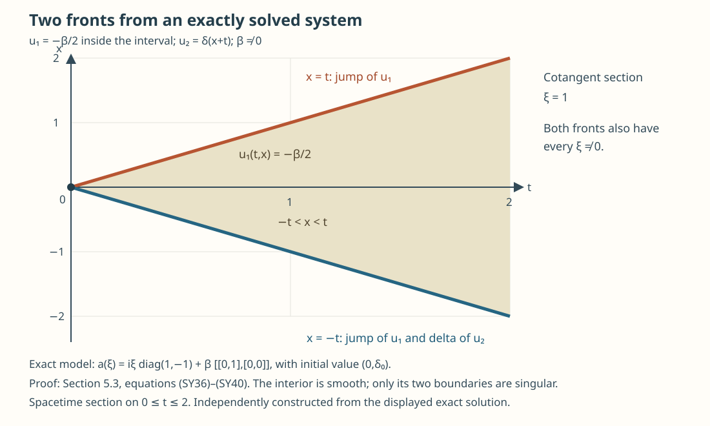

# First-order systems and ordered evolution

A matrix equation can exchange energy between components. Positivity must therefore control the Hermitian quadratic form of its symbol. We prove the forward Cauchy theorem with that condition, construct its evolution in the correct coefficient order, and distinguish it from the additional hypotheses needed to solve backwards. An explicit coupled two-speed equation shows why a system's singularities need not follow a single scalar Hamiltonian.

The scalar energy and Hilbert representation arguments are proved in First-order Cauchy problems: energy and wavefront transport, Sections 1–3. The complete companion [Hilbert coefficients, ordered calculus and the sharp lower bound](hilbert-coefficient-calculus-and-positivity.md), H1–H5, supplies the exact separable-Hilbert Fourier scale, full ordered products and adjoints, global Sobolev bounds and dimension-independent positivity estimate at \((\rho,\delta)=(1,0)\). It receives the classical scope of AN-03's *Positivity through a moving family of scalar probes*, Sections 1–6, using the already included scalar proofs and explicit norm-valued constructions. The [integration and duality companion](../20261005-cauchy-foundations/integration-and-duality.md) proves every Banach integral, Fubini, Hahn–Banach, primitive, approximation and Hilbert representation step used below. The [proof map](proof-map.json) records their exact dependencies and retained component notices.

Hörmander III, §23.1, Lemma 23.1.1, Theorem 23.1.2 and Corollary 23.1.3, printed 385–388/PDF 400–403 in the approved 2007 eBook, supply the scalar source comparison. The complete Hilbert receiving proofs are written here and in the companion; citations do not replace them.

## 1. Hilbert coefficients and the uniform Hermitian condition

Let \(K\) be a separable complex Hilbert space, with inner product linear in its first entry. Finite systems correspond to \(K=\mathbb C^N\), with its Euclidean norm. Put
\[
 \mathcal H^s=H^s(\mathbb R^n;K),\qquad
 E_s=\langle D\rangle^s I_K,\qquad
 \|v\|_s^2=(2\pi)^{-n}\int
       \langle\xi\rangle^{2s}\|\widehat v(\xi)\|_K^2\,d\xi. \tag{SY1}
\]
Hilbert-valued Plancherel, Schwartz density, completeness and separability are proved in companion H1. The Sobolev dual is \(\mathcal H^{-s}\), under the pairing extending the integrated \(K\) inner product. In particular \(E_{2s}:\mathcal H^s\to\mathcal H^{-s}\) is an isometry, and
\(\langle v,E_{2s}v\rangle=\|v\|_s^2\).

Consider, on \(0\leq t\leq T<\infty\),
\[
 P u=\partial_tu+A(t)u=f,\qquad
 A(t)=\operatorname{Op}(a(t)),\qquad u(0)=\phi. \tag{SY2}
\]
Left quantization uses \(D=-i\partial\) and the inverse Fourier coefficient \((2\pi)^{-n}\). The hypotheses are:

1. The functions \(a(t,x,\xi)\) are norm-smooth in \((x,\xi)\), with values in \(\mathcal L(K)\), and form a bounded subset of the global ordinary class \(S^1_{1,0}(K,K)\).
2. Every spatial and frequency derivative of \(a(t)\) is continuous in \(t\), locally in \((x,\xi)\), in operator norm.
3. There is one finite \(C\geq0\) such that
\[
 h(t,x,\xi):=\tfrac12(a+a^*)(t,x,\xi)\geq-C I_K
 \quad\hbox{as a Hermitian form, uniformly in }t,x,\xi. \tag{SY3}
\]

For a finite system, distributional continuity of the matrix entries is equivalent to hypothesis 2 under hypothesis 1. Indeed on each compact set the uniformly bounded derivatives give precompactness of each entry and its derivatives, by Arzelà–Ascoli. Every subsequential smooth limit equals the prescribed distributional limit. If local smooth convergence failed, a failing sequence would have a convergent subsequence with the wrong limit, a contradiction. There are finitely many entries, so their smooth convergence is convergence in matrix operator norm. The compactness step can be made explicit using the complete finite-grid proof. For each compact box and each derivative, a bound for one additional derivative gives equicontinuity. On a finite grid, bounded scalar values have convergent subsequences; refining the grids and using equicontinuity gives uniform convergence on the box. A diagonal subsequence handles the countably many derivative orders and exhaustion boxes. The fundamental theorem along segments identifies the limiting derivatives. This yields the asserted local smooth subsequence for each of the finitely many entries. For general \(K\), hypothesis 2 is the stated norm hypothesis; weak matrix-coefficient continuity is not substituted for it.

The entrywise calculus is not the positivity argument. Applying the full Hilbert-valued sharp lower bound HS10 in companion H5, with \(m=0\), to \(a+C I_K\), gives a finite uniform \(c\) such that
\[
 \operatorname{Re}\langle A(t)v,v\rangle
       \geq-c\|v\|_0^2,\qquad v\in\mathcal H^1. \tag{SY4}
\]
The provider first proves this on \(K\)-valued Schwartz functions. Its order-one mapping bound and Schwartz density in \(\mathcal H^1\) pass both sides to the asserted domain. Its constants depend on finitely many operator-norm symbol seminorms and on \(C,n\), without a factor counting the dimension of \(K\). This neither asserts positivity of left quantization nor tests the eigenvalues of \(a\) alone. The Jordan example in Exercise 16 of the preceding scalar lesson proves why those replacements fail.

The same exact calculus proves
\[
 \sup_t\|A(t)\|_{\mathcal H^s\to\mathcal H^{s-1}}\leq M_s,
 \qquad A(t)v\longrightarrow A(t_0)v
       \text{ in }\mathcal H^{s-1}\quad(v\in\mathcal H^s). \tag{SY5}
\]
Here is the time-continuity step. For a Schwartz vector, norm-valued dominated frequency integration gives local convergence of every output derivative. The global symbol seminorms uniformly control every output Schwartz seminorm; one extra position weight makes the complement of a large position ball uniformly small. This proves Schwartz convergence. Approximate an arbitrary \(v\) in \(\mathcal H^s\) by Schwartz vectors and use the uniform \(2M_s\) bound on the error. For a varying continuous vector \(v(t)\), adding the fixed-vector and varying-vector errors gives continuity of \(A(t)v(t)\) in \(\mathcal H^{s-1}\). Operator-norm continuity between these Sobolev spaces is not assumed.

## 2. The energy estimate and the formal adjoint

For any real \(s\), the scalar multipliers \(E_s\) commute with the coefficient operators pointwise. The ordered composition theorem therefore gives
\[
 B_s(t)=E_sA(t)E_{-s}=A(t)+R_s(t),\qquad
 R_s(t)\in\operatorname{Op}(S^0(K,K)), \tag{SY6}
\]
uniformly in \(t\). The leading product is
\(\langle\xi\rangle^s a\langle\xi\rangle^{-s}=a\); every other product term and the first finite remainder lose at least one order. Consequently the Sobolev bound for \(R_s\), together with (SY4), gives
\[
 \operatorname{Re}\langle B_s(t)v,v\rangle
       \geq-c_s\|v\|_0^2,\qquad v\in\mathcal H^1. \tag{SY7}
\]
The constant is uniform in \(t\). No two matrix coefficients have been commuted in this calculation.

Let \(u\in C^1([0,T];\mathcal H^s)\cap C([0,T];\mathcal H^{s+1})\). Applying (SY7) to \(E_su\), with \(f=Pu\), gives
\[
 \frac{d}{dt}\|u(t)\|_s^2
 \leq2\|f(t)\|_s\|u(t)\|_s+2c_s\|u(t)\|_s^2. \tag{SY8}
\]
Take \(c_s\geq0\) by increasing it. With \(w(t)=e^{-c_st}u(t)\) and
\(M(t)=\max_{0\leq r\leq t}\|w(r)\|_s\), integration gives
\[
 M(t)^2\leq\|u(0)\|_s^2+
             2M(t)\int_0^t e^{-c_sr}\|f(r)\|_s\,dr. \tag{SY9}
\]
The nonnegative root is at most
\(\|u(0)\|_s+2\int_0^t e^{-c_sr}\|f(r)\|_sdr\), including when \(M=0\). Thus for any \(\lambda>\max(0,2c_s)\),
\[
 \begin{split}
 e^{-\lambda t}\|u(t)\|_s
 &\leq e^{-\lambda t/2}\|u(0)\|_s\\
 &\quad+2\int_0^t
        e^{-\lambda(t-r)/2}e^{-\lambda r}\|f(r)\|_s\,dr. 
 \end{split} \tag{SY10}
\]
For \(1\leq p<\infty\), extend the weighted forcing by zero to the half-line and apply Minkowski's integral inequality. The kernel's \(L^p\) norm is
\((2/(p\lambda))^{1/p}\leq(2/\lambda)^{1/p}\). Its maximum is one. Hence
\[
 \left(\frac{\lambda}{2}\int_0^T
       \|e^{-\lambda t}u(t)\|_s^pdt\right)^{1/p}
 \leq\|u(0)\|_s+
         2\int_0^T e^{-\lambda t}\|Pu(t)\|_sdt. \tag{SY11}
\]
For \(p=\infty\), the left side is
\(\max_{[0,T]}e^{-\lambda t}\|u(t)\|_s\), with no prefactor. The threshold depends on \(s\) and the displayed uniform bounds, and is independent of \(p\). On a subinterval, translating its initial time gives the same estimate and threshold.

The formal Hilbert adjoint is an operator, rather than simply the quantization of the pointwise adjoint. Specifically the complete adjoint formula HS4 in companion H2 gives
\[
 A(t)^*|_{\mathcal S(K)}
   =\operatorname{Op}(a^\dagger(t))|_{\mathcal S(K)},\qquad
 a^\dagger=a^*+r^\dagger,\quad r^\dagger\in S^0(K,K). \tag{SY12}
\]
It has the required strong time continuity. Its form has the same real part as \(A\)'s form on \(\mathcal H^1\); its symbol also obeys (SY3) with a changed constant because \(r^\dagger\) is uniformly bounded. The energy estimate therefore applies to the reversed adjoint equation
\(-v_t+A(t)^*v=g\), with \(v(T)=0\). Replacing \(t\) by \(T-r\) yields a forward equation with coefficient \(A(T-r)^*\). It does not replace the coefficient by \(-A\).

## 3. Existence, the trace and uniqueness for integrable forcing

**Theorem.** Under hypotheses 1–3, for every \(s\in\mathbb R\),
\(\phi\in\mathcal H^s\) and \(f\in L^1((0,T);\mathcal H^s)\), there is exactly one
\[
 u\in C([0,T];\mathcal H^s),\qquad
 u_t\in L^1((0,T);\mathcal H^{s-1}), \tag{SY13}
\]
satisfying (SY2) in distributions with the displayed trace. It is absolutely continuous with values in \(\mathcal H^{s-1}\), and satisfies (SY11) for every \(p\). All constants have the uniform dependence described above.

**Proof.** The Hilbert representation construction in Section 3 of the preceding lesson uses separability and Hilbert norms, rather than scalar coefficient multiplication. We give its receiving construction explicitly, so every domain and the vector trace are identified.

Choose smooth tests \(v\) vanishing near \(T\), allowed to be nonzero at \(0\), with smooth compactly supported spatial components in finite-dimensional spans of \(K\). Put \(g=-v_t+A^*v\). The reversed adjoint energy estimate at order \(-s\) gives
\[
 \max_{[0,T]}\|v(t)\|_{-s}
       \leq C_{s,T}\|g\|_{L^1\mathcal H^{-s}}. \tag{SY14}
\]
Thus this test map is injective. On its range define the conjugate-linear functional
\[
 \mathcal F(g)=\int_0^T\langle f(t),v(t)\rangle\,dt+
                         \langle\phi,v(0)\rangle. \tag{SY15}
\]
It is well defined and bounded by
\(K_0\|g\|_{L^1\mathcal H^{-s}}\), where
\(K_0=C_{s,T}(\|f\|_{L^1\mathcal H^s}+\|\phi\|_s)\).
Apply the complex Hahn–Banach theorem to its conjugate, and then conjugate back, to extend it to the whole \(L^1\) space with the same bound.

The finite time interval and separability of \(\mathcal H^{-s}\) make
\(L^2((0,T);\mathcal H^{-s})\) a separable Hilbert space. Its completeness follows by choosing a Cauchy subsequence with summable successive \(L^2\) distances: Minkowski bounds the \(L^2\) norm of the pointwise sum of its distances, so that sum is finite almost everywhere; Hilbert completeness gives a pointwise limit and the same tail estimate gives \(L^2\) convergence. Step functions on rational intervals with coefficients in a countable dense subset prove separability and density. Restrict the extended functional to this \(L^2\) space, where its bound is \(K_0\sqrt T\). The orthonormal-basis Hilbert representation proof in the preceding lesson now gives a representing \(u\in L^2\mathcal H^s\), using the Sobolev dual isometry in (SY1).

The \(L^1\) bound implies \(\|u(t)\|_s\leq K_0\) almost everywhere. Otherwise on a positive-measure set \(B\) where this norm exceeds \(K_0+\epsilon\), the vector
\[
 g(t)=1_B(t)\frac{E_{2s}u(t)}{\|u(t)\|_s} \tag{SY16}
\]
is strongly measurable, belongs to \(L^2\mathcal H^{-s}\), has norm \(1_B\), and pairs with \(u\) to give \(\int_B\|u(t)\|_sdt>K_0|B|\). This contradicts the extended bound. Bounded simple Hilbert-valued functions are dense in \(L^1\), so the representation extends to all \(L^1\). In particular
\[
 \int_0^T\langle u,-v_t+A^*v\rangle\,dt
   =\int_0^T\langle f,v\rangle\,dt+\langle\phi,v(0)\rangle. \tag{SY17}
\]
No formula for the dual of an arbitrary Banach-valued \(L^1\) space is being assumed.

Interior tests imply \(u_t=f-Au\). The strong continuity in (SY5) makes \(Au\) strongly measurable: approximate \(u\) pointwise by strongly measurable simple vectors, apply \(A(t)\) to each, and use the uniform operator bound. It belongs to \(L^\infty\mathcal H^{s-1}\). Thus \(u_t\in L^1\mathcal H^{s-1}\). Subtracting the Bochner primitive of \(f-Au\) from \(u\) gives a vector distribution with zero derivative. Scalarizing against a countable separating orthonormal family shows it equals a single constant vector almost everywhere: choose one time in the common full-measure set to identify its coordinates with an actual Hilbert vector. Hence \(u\) has an absolutely continuous \(\mathcal H^{s-1}\) representative. Integrating that representative by parts in (SY17) gives \(u(0)=\phi\) in \(\mathcal H^{s-1}\); the allowed finite-component spatial tests separate this Sobolev duality.

For smooth time-dependent Schwartz data, do the same construction at order \(s+2\). The resulting vector is \(L^\infty\mathcal H^{s+2}\) and has continuous representative in \(\mathcal H^{s+1}\). Its equation gives
\(u_t=f-Au\in C\mathcal H^s\). Thus it belongs to the domain
\(C^1\mathcal H^s\cap C\mathcal H^{s+1}\) of the energy lemma, with the correct trace; (SY11) applies. This obtains the energy domain before using high-order uniqueness.

Approximate arbitrary \(\phi\) in \(\mathcal H^s\) and \(f\) in Bochner \(L^1\mathcal H^s\) by such data. Spatial Schwartz density, strongly measurable simple approximation and scalar smooth \(L^1\) approximation give this density. Applying the maximum estimate to differences makes the solutions Cauchy in \(C\mathcal H^s\). Their limit has the trace. The integrated equation passes to the limit because \(Au_j\to Au\) uniformly in \(\mathcal H^{s-1}\) and \(f_j\to f\) in \(L^1\mathcal H^s\). Uniform convergence also passes every finite-\(p\) energy norm and the maximum norm to the limit, while \(L^1\) convergence passes its forcing term.

If \(u\) is the difference of two continuous solutions, its homogeneous equation and (SY5) imply
\(u\in C^1\mathcal H^{s-1}\cap C\mathcal H^s\). Its initial value is zero. The energy estimate at order \(s-1\), now on its proven domain, gives \(u=0\). This proves existence, uniqueness, the trace, (SY13) and (SY11). ∎

For homogeneous forcing and data in \(\bigcap_s\mathcal H^s\), apply the theorem at each integer order, identify the solutions by uniqueness at a common lower order, and use the equation to obtain \(C^1\) time dependence at every spatial Sobolev order. If all time derivatives of the symbol are uniformly ordinary of order one on compact time intervals, differentiating the equation inductively gives higher time regularity. Integrable forcing alone gives the absolutely continuous statement (SY13).

## 4. Ordered evolution, forcing and reversible systems

For \(0\leq r\leq t\leq T\), let \(U(t,r)\phi\) be the unique homogeneous solution with value \(\phi\) at \(r\). Translating the theorem's time origin proves uniform boundedness on each \(\mathcal H^s\):
\[
 \|U(t,r)\|_{\mathcal H^s\to\mathcal H^s}
       \leq e^{\lambda_s(t-r)},\qquad U(r,r)=I. \tag{SY18}
\]
Uniqueness, applied with the value at an intermediate time as data, proves the coefficient order
\[
 U(t,q)U(q,r)=U(t,r),\qquad r\leq q\leq t. \tag{SY19}
\]
The rightmost operator acts first. Differentiating in the final time gives
\[
 \partial_tU(t,r)\phi=-A(t)U(t,r)\phi
       \quad\hbox{in }\mathcal H^{s-1},\qquad \phi\in\mathcal H^s. \tag{SY20}
\]
This formula is a strong derivative one spatial order lower; it is not an operator-norm derivative on \(\mathcal H^s\).

We need joint strong continuity before integrating in the initial time. For \(h\in\mathcal H^{s+1}\), the integrated equation and the uniform bound at order \(s+1\) show
\[
 \|U(r,r')h-h\|_s\leq
       C_s|r-r'|\|h\|_{s+1}\qquad(r'\leq r). \tag{SY21}
\]
Schwartz density and the uniform \(\mathcal H^s\) bound extend convergence to every fixed \(h\in\mathcal H^s\), uniformly as the two times meet. When both initial times precede \(t\), (SY19) and (SY21) control their difference; interchange their roles if their order is reversed. For varying final time, the integrated equation gives the same estimate for smooth \(h\), uniformly in the initial time, and density gives continuity for arbitrary \(h\). If a varying initial time crosses a fixed final time near the diagonal, both factors tend strongly to \(I\) by (SY21) and its final-time version. These arguments prove joint strong continuity of \(U(t,r)h\) on the closed time triangle.

For \(f\in L^1\mathcal H^s\), the forcing formula is
\[
 u(t)=U(t,0)\phi+\int_0^t U(t,r)f(r)\,dr. \tag{SY22}
\]
The integral is Bochner in \(\mathcal H^s\). Joint strong continuity applied first to simple approximants of \(f\), followed by the uniform bound, proves strong measurability of its integrand. Dominated convergence on a common interval and absolute continuity of the integral over the intervening short interval prove continuity in \(t\). To verify its equation, use the integrated version of (SY20),
\[
 U(t,r)h=h-\int_r^t A(\tau)U(\tau,r)h\,d\tau
       \quad\hbox{in }\mathcal H^{s-1}. \tag{SY23}
\]
The double-integral norm is bounded by a constant times \(T\|f\|_{L^1\mathcal H^s}\). Bochner Fubini therefore gives for the forced integral \(w\)
\[
 w(t)=\int_0^t f(r)\,dr-\int_0^t A(\tau)w(\tau)\,d\tau. \tag{SY24}
\]
It has zero initial value and derivative \(f-Aw\) one order lower. Adding the homogeneous part and invoking uniqueness proves (SY22).

Forward accretivity does not supply reverse evolution of the original equation. For reverse time the coefficient is \(-A\), whereas the duality construction used \(A^*\). If both
\[
 -C I_K\leq\tfrac12(a+a^*)\leq C I_K, \tag{SY25}
\]
hold, the forward theorem applies to \(-a(T-r)\) too. Solving the final-value problem in reverse time defines \(U(t,r)\) for all ordered pairs of times in the square. Forward and reverse uniqueness give
\[
 U(t,r)^{-1}=U(r,t),\qquad
 U(t,q)U(q,r)=U(t,r)\quad(0\leq r,q,t\leq T). \tag{SY26}
\]
The same bounds hold with \(|t-r|\) and an enlarged uniform threshold.

A principal Hermitian system has this stronger property if
\[
 a(t,x,\xi)=i b_1(t,x,\xi)+c(t,x,\xi),\qquad
 b_1=b_1^*\in S^1(K,K),\quad c\in S^0(K,K), \tag{SY27}
\]
with the same time hypotheses and uniform bounds. Its pointwise Hermitian real part is \((c+c^*)/2\), so (SY25) holds. This proves the two-sided energy evolution without choosing eigenvectors or differentiating spectral projections. A general such principal symbol may have several branches and crossings; a scalar wavefront-flow theorem is not a consequence of (SY27).

A fixed positive symmetrizer also has a precise receiving statement for finite systems. Suppose a constant Hermitian matrix \(S>0\), independent of \(t,x,\xi\), obeys
\[
 \tfrac12(Sa+a^*S)\geq-C S. \tag{SY28}
\]
Let \(R=S^{1/2}\), obtained by unitary diagonalization of the fixed positive matrix. The compact Rayleigh-quotient and induction proof in companion H6 supplies this diagonalization and every square-root norm bound. With \(v=Ru\) the coefficient is \(a_R=RaR^{-1}\), and
\[
 \tfrac12(a_R+a_R^*)
   =R^{-1}\tfrac12(Sa+a^*S)R^{-1}\geq-C I. \tag{SY29}
\]
The global symbol and time hypotheses are preserved by these fixed bounded factors. Apply the theorem to \(v\) and \(Rf\), then translate back to \(u\). Its Sobolev energy is exactly \(\|Ru\|_s\), equivalent to \(\|u\|_s\) with constants determined by the smallest and largest eigenvalues of \(S\). A two-sided bound in (SY28) gives reversible evolution in this norm. No position-dependent or frequency-dependent symmetrizer is asserted by this constant-matrix argument.

## 5. Three systems with complete solutions

### 5.1. An accretive system that cannot be uniformly reversed

**Exercise (basic).** In one space dimension put
\[
 P_0=\tfrac12\begin{pmatrix}1&1\\1&1\end{pmatrix},
 \qquad B=\begin{pmatrix}1&0\\0&-1\end{pmatrix},\qquad
 a(\xi)=\langle\xi\rangle P_0+i\xi B. \tag{SY30}
\]
Check the forward hypotheses, decide whether the factors commute, and show that for every \(t>0\) the inverse of the homogeneous evolution is unbounded on every \(H^s(\mathbb R;\mathbb C^2)\).

**Solution.** The matrix \(P_0\) is the orthogonal projection onto \((1,1)\); hence the Hermitian real part is exactly \(\langle\xi\rangle P_0\geq0\). The symbol is uniformly ordinary of order one, with constant time dependence. The forward theorem applies. The commutator is
\[
 P_0B-BP_0=\begin{pmatrix}0&-1\\1&0\end{pmatrix}\ne0. \tag{SY31}
\]
Thus the forward multiplier is \(e^{-ta(\xi)}\), rather than a product of the two exponentials in an arbitrary order. Differentiating the squared norm of a Fourier vector solving \(w'=-a(\xi)w\) gives
\(-2\langle\xi\rangle\|P_0w\|^2\leq0\). The forward multiplier is contractive, at each frequency and therefore on every \(H^s\).

The inverse matrix at each frequency is \(e^{ta(\xi)}\). Its determinant has modulus \(e^{t\operatorname{Re}\operatorname{tr}a(\xi)}=e^{t\langle\xi\rangle}\). The determinant identity follows, for instance, by triangularizing the fixed complex matrix and exponentiating its diagonal entries. The product of its two singular values is that modulus, so
\[
 \|e^{ta(\xi)}\|\geq e^{t\langle\xi\rangle/2}. \tag{SY32}
\]
For each large frequency choose a unit vector realizing the finite matrix norm there. Continuity in frequency makes the same fixed vector give at least half this lower bound on a small interval. Choose a smooth Fourier bump supported in that interval and normalize its \(H^s\) norm to one. Its inverse image then has \(H^s\) norm tending to infinity. If a bounded inverse of the forward evolution existed, it would agree with this pointwise inverse on these bumps, a contradiction. Thus a forward well-posed problem may have no bounded reverse solution operator. The duality proof remains valid because its reversed operator is \(A^*\). ∎

### 5.2. A fixed symmetrizer with an unbounded Euclidean real part

**Exercise (intermediate).** Let
\[
 B=\begin{pmatrix}0&1\\4&0\end{pmatrix},\qquad
 S=\begin{pmatrix}4&0\\0&1\end{pmatrix},\qquad a(\xi)=i\xi B. \tag{SY33}
\]
Show that the Euclidean condition (SY3) fails, solve the problem using the fixed symmetrizer, and identify its two spatial speeds.

**Solution.** The Euclidean Hermitian real part is
\[
 \tfrac{i\xi}{2}(B-B^*)
   =\tfrac{i\xi}{2}\begin{pmatrix}0&-3\\3&0\end{pmatrix}. \tag{SY34}
\]
Its eigenvalues are \(3|\xi|/2\) and \(-3|\xi|/2\), so no frequency-independent lower bound exists. However
\(SB=\begin{pmatrix}0&4\\4&0\end{pmatrix}\) is Hermitian. Equation (SY28) holds with both bounds zero. For \(R=\operatorname{diag}(2,1)\),
\[
 B_R=RBR^{-1}=\begin{pmatrix}0&2\\2&0\end{pmatrix}=B_R^*,
 \qquad U(t,r)=R^{-1}e^{-i(t-r)DB_R}R. \tag{SY35}
\]
The Fourier multiplier in the middle is unitary. Thus \(U(t,r)\) preserves \(\|Ru\|_s\), and its Euclidean operator norm is at most
\(\|R^{-1}\|\|R\|=2\) at every real Sobolev order, in either time direction.

The vectors \((1,2)\) and \((1,-2)\) are eigenvectors of \(B\), with eigenvalues \(2\) and \(-2\). Decompose the data in these fixed polarizations. Since \(iD=\partial_x\), the polarized equations are
\(\partial_tu_\pm\pm2\partial_xu_\pm=0\). Their solutions are translated by
\(x=y\pm2(t-r)\). The eigenvectors are not an orthonormal Euclidean basis; the fixed \(S\) energy supplies the correct uniform norm. ∎

### 5.3. Lower-order coupling and two singular fronts

**Exercise (advanced).** Fix \(\beta\in\mathbb C\setminus\{0\}\) and consider
\[
 \partial_tu+
 \left[
   iD\begin{pmatrix}1&0\\0&-1\end{pmatrix}
   +\beta\begin{pmatrix}0&1\\0&0\end{pmatrix}
 \right]u=0,\qquad
 u(0)=\begin{pmatrix}0\\\delta_0\end{pmatrix}. \tag{SY36}
\]
Compute the full Fourier evolution, its continuous value at \(\xi=0\), and the fixed-time singularities. Determine the exact Sobolev threshold of the first component for \(t>0\).

**Solution.** The principal coefficient is Hermitian before multiplication by \(i\). The order-zero Hermitian real part has eigenvalues \(\pm|\beta|/2\), so both directions satisfy the theorem. At frequency \(\xi\), solve the triangular ordinary differential equation in its prescribed order:
\[
 \begin{split}
 \widehat u_2(t,\xi)&=e^{it\xi}\widehat\phi_2(\xi),\\
 \widehat u_1(t,\xi)&=e^{-it\xi}\widehat\phi_1(\xi)
        -\beta\frac{\sin(t\xi)}{\xi}\widehat\phi_2(\xi).
 \end{split} \tag{SY37}
\]
Indeed multiplying the first equation by \(e^{it\xi}\) gives
\(\partial_t(e^{it\xi}\widehat u_1)
=-\beta e^{2it\xi}\widehat\phi_2\); integrate this identity and multiply back. The quotient has continuous value \(t\) at zero. Thus the evolution matrix is
\[
 U(t,0;\xi)=
 \begin{pmatrix}
 e^{-it\xi}&-\beta\sin(t\xi)/\xi\\
 0&e^{it\xi}
 \end{pmatrix},\qquad U(t,0;0)=I-t\beta
                    \begin{pmatrix}0&1\\0&0\end{pmatrix}. \tag{SY38}
\]
The sign and the zero-frequency value agree with the initial derivative \(-a(\xi)\).

With the displayed delta data, Fourier inversion gives the exact distributions
\[
 u_2(t,x)=\delta(x+t),\qquad
 u_1(t,x)=-\frac{\beta}{2}\,1_{[-t,t]}(x)\quad(t>0). \tag{SY39}
\]
The value assigned to the interval's endpoints does not affect its distribution. The identity
\(\int_{-t}^t e^{-ix\xi}dx=2\sin(t\xi)/\xi\) proves the formula with the stated Fourier constants. Distributionally,
\(\partial_t1_{[-t,t]}=\delta(x-t)+\delta(x+t)\) and
\(\partial_x1_{[-t,t]}=\delta(x+t)-\delta(x-t)\).
Consequently \((\partial_t+\partial_x)u_1=-\beta\delta(x+t)\), which is exactly canceled by the off-diagonal coefficient in (SY36). The second equation and the initial trace are immediate; the interval tends to zero in distributions as \(t\downarrow0\).

The second component is singular only at \(x=-t\), in every nonzero cotangent direction. The first component is smooth in the interval's interior and exterior, with a nonzero jump at both endpoints. A localized jump has Fourier leading term equal to a nonzero multiple of \((i\xi)^{-1}\), plus a rapidly decreasing term, by one integration by parts after differentiating it to a delta plus a smooth function. This proves that each endpoint has both nonzero cotangent directions. Taking the union of the components' wavefront sets gives
\[
 \operatorname{WF}_x u(t)=
    \{(t,\xi):\xi\ne0\}\ \cup\ \{(-t,\xi):\xi\ne0\},
    \qquad t>0. \tag{SY40}
\]
The polarization of the delta input belongs to the negative-speed branch, but the order-zero coupling creates a weaker singularity on the positive-speed front too.

The first component belongs to \(H^s(\mathbb R)\) exactly when \(s<1/2\). Its Fourier transform is bounded near zero and has magnitude bounded by \(C|\xi|^{-1}\) at infinity, proving sufficiency. For necessity, on a fixed positive fraction of each high-frequency period, \(|\sin(t\xi)|\geq1/2\). There the weighted squared integrand is bounded below by a positive multiple of \(|\xi|^{2s-2}\); summing those comparable periodic pieces diverges precisely for \(2s-2\geq-1\). Similarly the delta component has threshold \(s<-1/2\). The full initial datum and solution therefore lie in every \(H^s(\mathbb R;\mathbb C^2)\) with \(s<-1/2\), as required for the energy theorem. The off-diagonal multiplier gains one Sobolev order for fixed \(t>0\); that mapping claim does not declare it an ordinary pseudodifferential symbol, since its frequency derivatives retain the oscillating fronts. ∎

The figure shows (SY39) on \(0\leq t\leq2\), with its exact fronts \(x=t\) and \(x=-t\). The shaded interior is the constant first component \(-\beta/2\); the negative-speed boundary also carries the delta in the second component. The cotangent section is \(\xi=1\); (SY40) holds for every nonzero \(\xi\). This is a spacetime section of the explicit solution, not a claim about the canonical relation of every system.

The determinant identity used in Section 5.1 also follows directly from companion H6: multilinearity gives \((\det e^{ta})'=(\operatorname{tr}a)\det e^{ta}\), and its value at zero is one. This establishes the exact growth factor used in the example without an additional spectral prerequisite.

## 6. What the energy theorem supplies for a Cauchy parametrix

For a Hermitian principal system, (SY13), (SY22) and (SY26) supply the exact continuous solution and the correction of an integrable residual, at every real Sobolev order. They retain all ordinary complex order-zero coefficients and their ordering. This is the analytic correction mechanism needed after a system's oscillatory kernel has been constructed.

The construction of that kernel still has mathematical content: branch separation or crossings, phase functions, transported polarizations, ordinary symbol remainders, parameter-uniform support and the resulting canonical relations must be proved under their own stated hypotheses. Sections 4–8 of the preceding lesson prove one scalar homogeneous Hamiltonian's transported tests, and are not silently applied to a general matrix principal symbol. The present lesson supplies the Hilbert and finite-system energy/existence/evolution extension; it leaves those broader systems and FIO Cauchy constructions visible as remaining work in the full course.

*Written by GPT-6.1 Sol (OpenAI), Ultra; restoration and Hilbert prerequisite proofs by GPT-6 Astra (OpenAI), Ultra, October 2026. Self-checked by the writing AI. Original text: CC0 1.0; linked components retain their own terms.*
