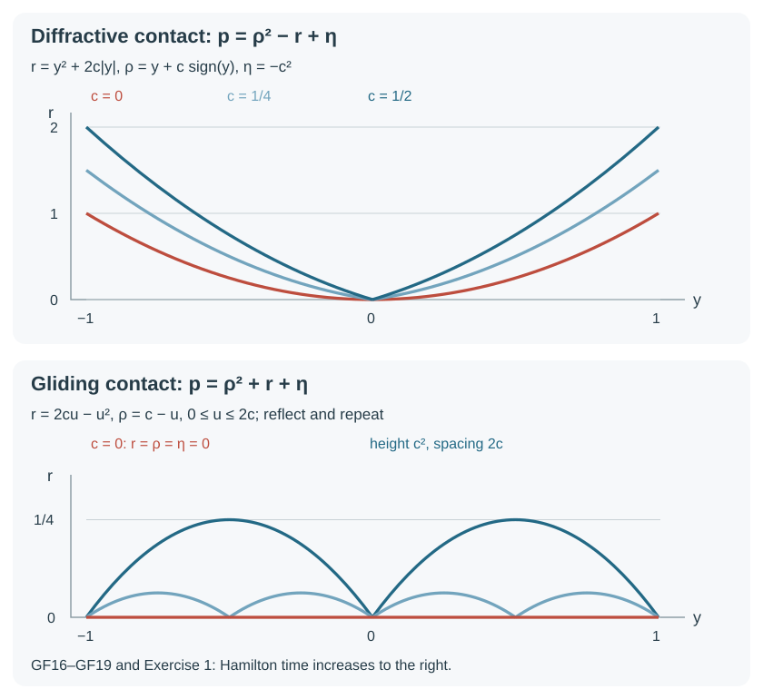
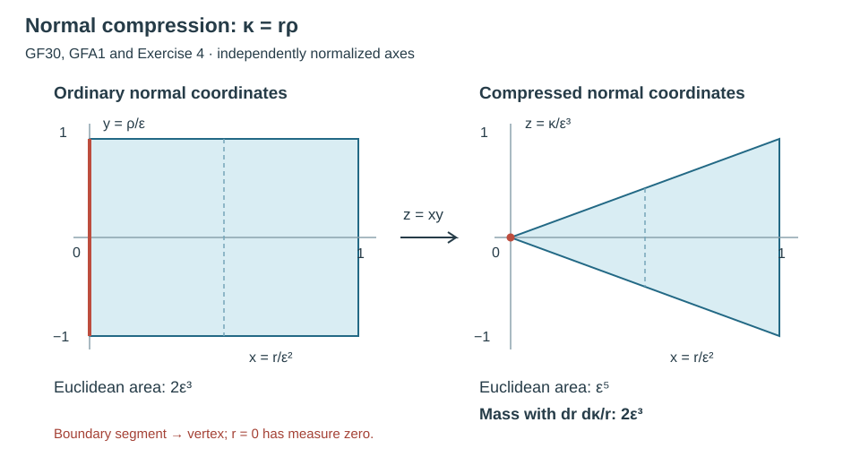
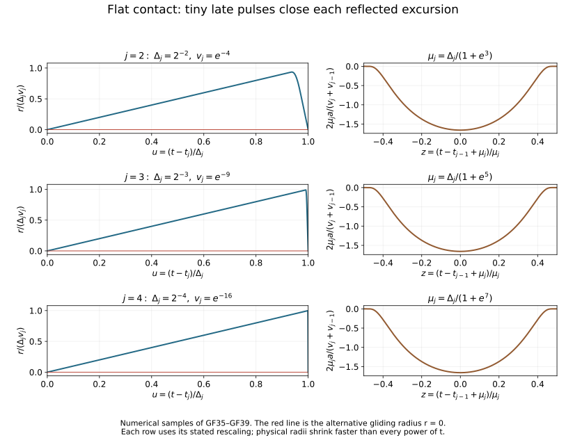

# Tangency, gliding and generalized characteristic motion

Transverse reflection exchanges two distinct normal covectors. At tangency those covectors coincide, and nearby reflected rays can either converge to an ordinary tangent ray or remain close to the boundary for an increasing number of reflections. The sign of the second normal acceleration distinguishes these possibilities. Higher contact requires estimates that compare the full motion with its tangential gliding flow.

We develop the geometric flow, its compactness and existence, finite-contact uniqueness and a smooth infinite-contact example with two different continuations. The principal symbol may have stationary tangential points. The geometric entry hypothesis is a nondegenerate double normal root; no positive energy or definiteness of the entire symbol is imposed. The quantitative proofs use a fully justified symplectic quadratic normal form. For the original scalar second-order differential operators, the preceding normal-coordinate argument already gives that form without a general preparation theorem.

Read Sections 1–2 of [Phase space and generating families](../20261005-restored-phase-space/phase-space-and-generating-families.md) for the symplectic sign and linear algebra, Section 2 of [Prescribed canonical coordinates and isotropic fibers](../20261005-restored-prescribed-coordinates/prescribed-canonical-coordinates-and-isotropic-fibers.md) for full ordinary coordinate completion, and Section 4 of [Real and complex symplectic normal forms](../20261005-restored-function-normal-forms/real-and-complex-symplectic-function-normal-forms.md) for the parameter-aware cutoff-series construction used below. The actual smooth local flow, every parameter derivative and inverse-flow argument are supplied in Section 1 of [Energy and existence with a timelike Dirichlet boundary](../20261007-restored-mixed-dirichlet/mixed-dirichlet-cauchy-energy-preparation.md); only its generic local smooth-field proof is used here. Section 1 of [Boundary reflection and compressed wavefronts](../20261007-restored-boundary-reflection/boundary-reflection-preparation.md) supplies the normal form for real quadratic principal symbols and the invariant transverse reflection. The present lesson supplies the additional preparation, comparison, compactness and existence arguments.

The mathematical source is the approved Springer 2007 edition of Hörmander III, ISBN 978-3-540-49938-1, Section 24.3, printed 430–442 (PDF pages 445–457), especially Lemmas 24.3.1, 24.3.4–24.3.5, Definitions 24.3.6–24.3.7, Proposition 24.3.8, Theorem 24.3.9, Propositions 24.3.12–24.3.13, Corollary 24.3.14 and Lemma 24.3.15. The source is comparison and credit; the complete receiving proofs below are programme content. This geometry is the prerequisite for diffractive and general glancing propagation. It does not itself assert that a solution's wavefront follows every generalized trajectory or that every infinite-contact trajectory is a limit of transverse broken rays.

The [measure foundation M0–M4 and M8](../20261004-free-intrinsic-graph/prerequisites/measure-and-l2.md) supplies countable covers, completed Lebesgue measure, monotone and dominated convergence, and compatibility with compact integrals. The [complete substitution and null-image proofs P19.4 and P21.3–P21.4](../20261004-free-stationary-phase/change-of-variables-prerequisite-completions.md) supply the coordinate-volume facts. We prove below their precise extension to the open reflected clock domains, including the exceptional wall-hit slices. The [matrix exponential proof A9](../20261005-restored-quadratic-forms/spectral-algebra-and-contour-projections.md) supplies the full convergent linear flow used in the comparison estimate. All selected locators and hypotheses are bound in the proof map.

## 1. Prepare a double normal root without changing the boundary

Use
\[
 \omega=d\alpha,\qquad \iota_{H_f}\omega=-df,\qquad
 \{f,g\}=H_fg.
 \tag{GF1}
\]
Let a symplectic manifold have a smooth boundary defined by \(\phi\ge0\), with \(d\phi\ne0\). At a chosen point assume
\[
 p=0,\qquad H_p\phi=0,\qquad H_\phi^2p\ne0.
 \tag{GF2}
\]
Here \(p\) is real and smooth. It need not have nonzero tangential differential. Prescribed-coordinate completion first makes \(r=\phi\) one position coordinate. Its conjugate momentum is \(u\), and all other coordinates, including \(r\), are parameters \(z\) for the following scalar argument. Thus \(H_\phi=-\partial_u\) and (GF2) says \(p=p_u=0\), \(p_{uu}\ne0\) at the mark.

**Quadratic preparation lemma.** A real smooth \(F(u,z)\) with those three properties can be written
\[
 F(u,z)=g(u,z)\bigl((u-b(z))^2-S(z)\bigr),
 \qquad g\ne0,
 \tag{GF3}
\]
where \(b,S\) are real and smooth, with \(b=S=0\) at the mark. The neighborhood is a fixed local neighborhood of the data.

**Proof.** Solve \(F_u(T(z),z)=0\) near zero. The parameter inverse-function argument applies since \(F_{uu}\ne0\); equivalently a uniformly contracting iteration for \(u-\lambda^{-1}F_u(u,z)\), \(\lambda=F_{uu}(0,0)\), gives the root, and differentiation of its fixed-point identity gives every parameter derivative. Taylor's integral formula gives
\(F=F(T,z)+(u-T)^2A(u,z)\), where \(A\) is smooth and has a fixed nonzero sign \(\varepsilon\). Put \(v=(u-T)\sqrt{|A|}\) and \(s(z)=-\varepsilon F(T,z)\). Then \(F=\varepsilon(v^2-s)\), and \(u=\beta(v,z)\) is a smooth inverse near the mark, with \(\beta_v\ne0\).

We need the following exact smooth decomposition, not a formal root expansion:
\[
 \beta(v,z)=B_0(v^2,z)+vB_1(v^2,z),\qquad B_1(0,0)\ne0,
 \tag{GF4}
\]
with both \(B_j\) smooth also at negative first arguments. To prove it, take the even part of \(\beta\) and the odd part divided by \(v\). The latter is smooth by the integral formula for a first-order zero and is even. For any smooth even \(h(v,z)\), Taylor expansion to arbitrarily high even order shows that \(h(\sqrt{x},z)\), \(x\ge0\), is smooth up to \(x=0\), with coefficients \(\partial_v^{2j}h(0,z)/(2j)!\). This includes every parameter derivative: after any fixed number of \(x\)-derivatives, a Taylor remainder of sufficiently high order still tends to zero with the required power of \(x\).

Extend these jets to both signs of \(x\) by the cutoff-series construction in the cited programme section. Explicitly, on a compact parameter patch the series \(\sum_j c_j(z)x^j\chi(x/\delta_j)\) has those jets when \(\chi=1\) near zero and positive radii tend to zero fast enough that each differentiated term of order at most \(j/2\), including parameter derivatives, is bounded by \(2^{-j}\). Each fixed derivative series converges uniformly after finitely many terms; its jets follow by differentiating at zero. Subtract this smooth sum from \(h(\sqrt{x},z)\) for \(x\ge0\). The difference and all derivatives are flat at zero. Extending that difference by zero for \(x<0\) is smooth, by the differentiated Taylor bounds. Adding it back gives the required exact extension. Apply this to both even functions. In particular \(B_1(0,z)=\beta_v(0,z)\).

Set \(b(z)=B_0(s(z),z)\), \(S(z)=s(z)B_1(s(z),z)^2\). Write \(D_j(v^2,s,z)\) for the smooth divided difference of \(B_j\), namely its first derivative integrated along the real segment from \(s\) to \(v^2\). Then
\[
 (\beta(v,z)-b(z))^2-S(z)
 =(v^2-s)\left[B_1(s,z)^2+2vB_1(s,z)D
                         +(v^2-s)D^2\right],\quad
 D=D_0+vD_1.
 \tag{GF5}
\]
The bracket is nonzero near the mark since its value there is \(B_1(0,0)^2\). Taking \(g\) to be \(\varepsilon\) divided by that bracket, expressed in \((u,z)\), proves (GF3) exactly for positive, zero and negative \(s\). No holomorphic extension or selection of nonsmooth square-root branches is used. \(\square\)

Now prescribe \(r\) and \(\rho=u-b(z)\). They are a canonical pair because \(b\) is independent of \(u\). Ordinary prescribed-coordinate completion retains them exactly. Also \(H_rS=0\), so \(S\) is independent of the new \(\rho\). Dividing by the nonzero full function \(g\) therefore gives
\[
 p_0(r,y;\rho,\eta)=\rho^2-R(r,y,\eta),\qquad r\ge0.
 \tag{GF6}
\]
This is a geometric multiplication and symplectic coordinate change; the symbol \(R\) is a general smooth real function. For an original quadratic principal symbol, the preceding normal coordinates retain its quadratic homogeneity directly. On the characteristic set, \(H_p=gH_{p_0}\). A nonzero smooth factor changes the parameter consistently, with reversal if its sign is negative. All subsequent normalized statements transfer by that smooth nonvanishing change of parameter. We use the name \(p\) for \(p_0\) below.

## 2. Contact order and the invariant gliding field

Write \(z=(y,\eta)\), \(R_0(z)=R(0,z)\), \(R_1(z)=\partial_rR(0,z)\), and let \(H_R^z\) act in the tangential symplectic variables. Then
\[
 H_p=2\rho\partial_r+R_r\partial_\rho-H_R^z,
 \qquad H_pr=2\rho,\qquad H_p^2r=2R_r.
 \tag{GF7}
\]
On \(p=0\), identify the two boundary points with momenta \(\rho=\pm\sqrt{R_0(z)}\). Interior points are retained. Continuous compressed coordinates are \((r,z,r\rho)\); adjoining \(\rho^2=R(r,z)\) gives a redundant useful continuous coordinate. The glancing set is \(G=\{r=\rho=R_0=0\}\), and the hyperbolic boundary set has \(R_0>0\).

Define
\[
 G^k=\{p=0:\ H_p^j\phi=0\ (0\le j<k)\},\quad k\ge2,
 \qquad G^\infty=\bigcap_{k\ge2}G^k.
 \tag{GF8}
\]
These are closed sets; \(G\) need not be a smooth hypersurface within the reduced space. At \((0,z,0)\), for every integer \(m\ge0\),
\[
 (0,z,0)\in G^{m+2}
 \iff R_0(z)=0,\quad(-H_{R_0})^jR_1(z)=0\ (0\le j<m),
 \qquad H_p^{m+2}r=2(-H_{R_0})^mR_1
 \quad\hbox{there}.
 \tag{GF9}
\]
**Proof.** Along the ordinary smooth Hamilton orbit from the point, \(r''=2R_r(r,z)\), while \(z'=-H_R^z(r,z)\). Let \(\bar z'=-H_{R_0}(\bar z)\) have the same initial value. If the first \(m+1\) jets of \(r\) vanish, the tangential equations imply that the first \(m+2\) jets of \(z-\bar z\) vanish: differentiate the difference equation, using that its coefficients are smooth and its inhomogeneous difference is divisible by \(r\). Thus the \(m\)-jet of \(R_r(r,z)\) equals that of \(R_1(\bar z)\). Conversely, if the first \(m\) jets of the latter vanish, differentiating the two equations inductively from \(r(0)=r'(0)=0\) gives vanishing of the first \(m+1\) jets of \(r\), and the next jet is twice the displayed derivative of \(R_1\). The induction starts with \(r''(0)=2R_1\); this proves both directions and the formula. \(\square\)

If \(\phi\) is replaced by \(h\phi\), \(h>0\), and \(p\) by \(gp\), \(g\ne0\), the first nonzero contact derivative of order \(k\) becomes \(hg^kH_p^k\phi\). Indeed the restricted new Hamilton field is \(gH_p\), and every other differentiated product term contains a lower contact derivative. Thus order is intrinsic, and the sign at order two is unchanged. Set
\[
 G_d=\{r=\rho=R_0=0,\ R_1>0\},\qquad
 G_g=\{r=\rho=R_0=0,\ R_1<0\}.
 \tag{GF10}
\]
They are the diffractive and gliding parts of \(G\setminus G^3\). At \(G_d\), the ordinary tangent orbit has positive \(r\) on both punctured sides. At \(G_g\), its ordinary extension has negative \(r\) on both sides and is outside the manifold.

There is an invariant replacement for that outside motion. The constraint space \(C=\{\phi=H_p\phi=0\}\) is symplectic near the mark: the bracket of its two constraints is \(-H_\phi^2p\ne0\), so their Hamilton vectors form a nondegenerate two-plane complementary to \(TC\). Its Hamilton field for \(p|_C\), on \(G=C\cap\{p=0\}\), is
\[
 H_p^G=H_p+\frac{H_p^2\phi}{H_\phi^2p}H_\phi,
 \qquad H_p^G=-H_{R_0}\quad\hbox{in (GF6)}.
 \tag{GF11}
\]
Both constraint derivatives vanish for this vector: \(H_\phi H_p\phi=-H_\phi^2p\). For any vector tangent to \(C\), its contraction with \(\omega\) is \(-dp\), since the added Hamilton field pairs to \(-d\phi=0\). This proves the restricted Hamilton interpretation and tangency to the zero set even when that set is singular.

At a glancing point, replacing \((\phi,p)\) by \((h\phi,gp)\) changes the numerator in (GF11) by \(g^2h\), the denominator by \(h^2g\), and \(H_\phi\) by \(h\); hence
\[
 H_{gp}^G=gH_p^G\quad\hbox{on }G.
 \tag{GF12}
\]
This proves independence from the defining function and consistent parameter change. In \(G^3\), \(R_1=0\), so \(H_p^G=H_p\).

## 3. Define motion through reflections and tangencies

A **generalized characteristic arc** is a continuous compressed characteristic curve on an interval \(I\). Its ordinary lift \(\gamma\) is defined outside a set \(B\) of reflection times. Each time in \(B\) is isolated within \(B\); its two limits are the distinct hyperbolic roots with the same tangential data, and the neighboring points are interior. At every other time the lift is differentiable and obeys
\[
 \gamma'=H_p\quad\hbox{in the interior and at }G_d,
 \qquad
 \gamma'=H_p^G\quad\hbox{at }G\setminus G_d.
 \tag{GF13}
\]
The set \(B\) may accumulate at a glancing time not belonging to \(B\). The compressed curve is the primary continuous object. The zero-length normal momentum at glancing has a unique lift; at a hyperbolic reflection either one-sided lift is specified instead of a single normal momentum.

For every such arc, the tangential variables are continuously differentiable, with
\[
 z'=-H_R^z(r,z).
 \tag{GF14}
\]
Reflection changes only \(\rho\); at \(r=0\) the right side is exactly the gliding field. The normal coordinate is continuous and locally Lipschitz, with one-sided derivatives \(2\rho(t\pm0)\) at reflections. The product \(r\rho\) has matching one-sided derivatives \(2\rho^2+rR_r\) there. Consequently, on a fixed compact coordinate set,
\[
 r,\ z,\ r\rho,\ \rho^2=R(r,z)
 \quad\hbox{have uniform Lipschitz bounds},\qquad
 |\rho(t)|-|\rho(s)|=O(|t-s|^{1/2}).
 \tag{GF15}
\]
For the last assertion use \(|\sqrt a-\sqrt b|\le\sqrt{|a-b|}\) for \(a,b\ge0\). The bounds on the other variables follow from their bounded derivatives and one-sided derivatives. A continuous scalar function whose upper one-sided difference quotients are bounded by \(M\), with the corresponding lower bounds, is \(M\)-Lipschitz: subtract \((M+\epsilon)t\), and a first positive increase would give a nonnegative right difference quotient at its last running minimum, a contradiction. Let \(\epsilon\) tend to zero. This elementary argument applies also across accumulating isolated reflections. The tangential right side is continuous in \((r,z)\), so its integral equation proves (GF14) through those accumulation times.

These statements concern compact normalized coordinates. In a homogeneous characteristic cone choose a compact positive-cosphere section before using a uniform bound. No uniform bound on unnormalized covectors is being asserted.

## 4. Strict diffractive and gliding estimates

Suppose first that \(R_r\ge c>0\) in the coordinate region. A reflected orbit at time zero has outgoing \(\rho(+0)\ge0\), incoming \(\rho(-0)\le0\). Integrating \(\rho'=R_r\) and \(r'=2\rho\) gives
\[
 r(t)\ge ct^2\quad(t\ne0)
 \tag{GF16}
\]
as long as the orbit stays in the region. It cannot have another boundary contact there: \(\rho\) increases after the reflection in positive time and decreases on the backward orbit. Ordinary tangent orbits starting at \(G_d\) satisfy the same bound on both sides. Nearby reflected orbits with their initial normal roots tending to zero therefore converge to that ordinary tangent orbit, by smooth flow dependence on each side and continuity of the vanishing jump. This supplies the local motion and its uniqueness at \(G_d\).

Suppose instead \(-C_1\le R_r\le-c<0\). Put
\[
 E=\rho^2-rR_r,
 \qquad m(\rho^2+r)\le E\le M(\rho^2+r),
 \quad m=\min(1,c),\quad M=\max(1,C_1).
 \tag{GF17}
\]
On an ordinary segment,
\(E'=-r(dR_r/dt)\); the two terms \(2\rho R_r\) cancel exactly. Derivatives of \(R_r\) along \(H_p\) are bounded on the compact region. Hence \(|E'|\le C E\). At a reflection \(r=0\) and \(\rho\) only changes sign, so \(E\) is continuous. Integration on the segments gives, in either direction,
\[
 \rho(t)^2+r(t)\le \frac{M}{m}e^{C|t-s|}
                               (\rho(s)^2+r(s)).
 \tag{GF18}
\]
At a gliding point both normal quantities vanish. If a generalized arc left the boundary arbitrarily near that time, an interior component of \(\{r>0\}\), together with its adjoining hyperbolic reflections, would obey (GF18). Taking a preceding or succeeding limiting normal state zero in that connected component forces its energy to vanish, a contradiction. Equivalently extend \(E\) by zero on the closed glancing-time set and apply the same integral inequality on its complementary intervals. Thus the arc stays at \(r=\rho=0\) locally and equals the unique smooth orbit of \(-H_{R_0}\).

For a nearby broken arc with \(r(0)\le\epsilon^2\), \(|\rho(0)|\le\epsilon\), (GF18) gives uniform \(r=O(\epsilon^2)\), \(|\rho|=O(\epsilon)\) on a fixed shorter interval. The tangential field differs from its boundary value by \(O(\epsilon^2)\). Comparing with the gliding orbit having the same tangential initial data and integrating its Lipschitz difference equation gives
\[
 z(t)-\bar z(t)=O(\epsilon^2),\qquad
 z'(t)-\bar z'(t)=O(\epsilon^2).
 \tag{GF19}
\]
This is uniform tangential \(C^1\) convergence, not convergence of the discontinuous full normal momentum in a differentiable topology. If tangential initial data also vary, add their initial difference with the usual bounded exponential factor.

*The two panels are canonical models \(p=\rho^2-r+\eta\) and \(p=\rho^2+r+\eta\), with the tangential coordinate equal to Hamilton time. The plotted radii are the exact formulas in Exercise 1. Blue reflected curves have \(c>0\); the red curve is their \(c=0\) limit. Normal momentum and its sign reversal are stated in the solution. The lower panel contains repeated parabolic excursions of height \(c^2\) and time spacing \(2c\); its limit is boundary gliding. These are coordinate sections of characteristic curves, not a wave amplitude.*

## 5. Compare higher contact with the gliding orbit

For a generalized arc starting at a glancing point, let \(\bar z'=-H_{R_0}(\bar z)\), \(\bar z(0)=z(0)\), and set
\[
 e(t)=R_1(\bar z(t)),\qquad f(t)=|z(t)-\bar z(t)|.
 \tag{GF20}
\]
On a compact smaller region, smoothness and (GF14) give upper one-sided inequalities
\[
 r'\le2|\rho|,\qquad
 (|\rho|)'\le |e(t)|+C_2f+C_3r,\qquad
 f'\le C_0f+C_1r.
 \tag{GF21}
\]
At reflections \(|\rho|\) is continuous. At gliding times its derivative is zero; elsewhere the displayed bound follows from the normal Hamilton equation. At higher glancing times the defining derivative is zero. The bounds therefore hold in the integrated one-sided sense across all times.

For clarity, the required comparison is fully scalar and finite-dimensional. Let \((X,V,F)\) solve
\[
 X'=2V,\qquad V'=|e|+C_2F+C_3X,\qquad
 F'=C_0F+C_1X.
 \tag{GF22}
\]
Begin with initial values slightly larger than \((r(0),|\rho(0)|,0)\), and add a positive constant to each right side. Up to a hypothetical first crossing, each difference has nonnegative derivative apart from its own nonnegative initial margin; at the first zero the strict added term gives a positive inward derivative, preventing the crossing. This is the standard first-contact argument, now with every coefficient nonnegative. Let the margins and added terms tend to zero by the linear integral equation. It follows that \((r,|\rho|,f)\le(X,V,F)\).

The constant matrix in (GF22) has nonnegative entries. Its exponential has nonnegative entries by its power series. On \(0\le t\le T\), its entry carrying \(V\) to \(X\) is bounded by \(Ct e^{At}\); the entry carrying \(V\) to \(F\) is bounded by \(Ct^2e^{At}\), since that path first goes through \(X\); the entry carrying \(X\) to \(F\) is bounded by \(Ct e^{At}\). These bounds follow directly by grouping the first nonzero matrix powers and bounding the remaining series by \(e^{At}\). Variation of constants thus proves
\[
 \begin{split}
 r(t)&\le Ce^{At}\left[r(0)+t|\rho(0)|+
                         \int_0^t(t-s)|e(s)|\,ds\right],\\
 |\rho(t)|&\le Ce^{At}\left[r(0)+|\rho(0)|+
                         \int_0^t|e(s)|\,ds\right],\\
 f(t)&\le Ce^{At}\left[tr(0)+t^2|\rho(0)|+
                         \int_0^t(t-s)^2|e(s)|\,ds\right].
 \end{split}
 \tag{GF23}
\]
Apply the same argument after reversing the time parameter for negative time. If the initial point belongs to \(G^k\), \(k\ge3\), (GF9) gives \(e(t)=O(|t|^{k-2})\), hence
\[
 r(t)=O(|t|^k),\qquad |\rho(t)|=O(|t|^{k-1}),\qquad
 z(t)-\bar z(t)=O(|t|^{k+1}).
 \tag{GF24}
\]
The estimates retain the tangential drift and are valid through reflection accumulation. If \(e\) vanishes identically, all three differences vanish. In particular a point of \(G^3\) with \(H_p^G=0\) can only have the constant generalized continuation. The same conclusion at \(G_g\) follows from (GF18) and smooth gliding-flow uniqueness.

## 6. Finite contact determines the continuation

**Monotonicity lemma.** Start at \(G^3\). If \(e\) is nondecreasing for small positive time, the generalized arc is the ordinary Hamilton orbit. If \(e\) is nonincreasing, it is the gliding orbit.

**Proof for increasing \(e\).** Its initial value is zero, so \(e\ge0\). Formula (GF23) implies \(r=O(t^2e(t))\), \(|\rho|=O(te(t))\), \(f=O(t^3e(t))\), and consequently
\[
 R_r(r(t),z(t))=e(t)+O(t^2e(t)).
 \tag{GF25}
\]
It is nonnegative for sufficiently small \(t\). On every ordinary segment \(\rho'\ge0\), while any hyperbolic reflection would make a positive jump in \(\rho\). Since the limiting initial value is zero, \(\rho\) cannot be negative. Such a reflection would require a negative incoming root, so none is possible. Any remaining boundary interval has \(R_r=0\), where \(H_p^G=H_p\). The complete arc therefore satisfies the ordinary smooth Hamilton equation, including boundary times, and equals its unique solution.

**Proof for decreasing \(e\).** An initial interval on which \(e=0\) has zero normal motion by (GF23); restart at its right endpoint if necessary. Where \(e<0\), put \(h=\rho^2-rR_r\). Formula (GF25), with \(|e|\), shows that \(R_r=e+O(t^2|e|)<0\), \(h\ge0\), and \(h/e^2=O(t^2)\). Comparing the actual and boundary tangential equations, as in (GF14), gives
\(dR_r(r,z)/dt=e'(t)+O(t|e(t)|)\) on ordinary pieces: the normal velocity costs \(O(t|e|)\), the tangential differences \(O(t^2|e|)\), and the position differences \(O(t^2|e|)\). Thus, using \(e'/e\ge0\), \(r\le h/(-R_r)\), and \(h'=-r(dR_r/dt)\),
\[
 h'\le \left(2\frac{e'}e+Ct\right)h,\qquad
 \left(\frac h{e^2}\right)'\le Ct\frac h{e^2}.
 \tag{GF26}
\]
Indeed the coefficient before \(h\) is at most \((e'/e)(1+O(t^2))+Ct\), which is bounded by the displayed coefficient after shrinking. At reflections \(h\) is continuous. Extend it by zero on the closed glancing-time set; the same integrated inequality holds on its complementary intervals. Starting at a positive \(s\) and letting \(s\downarrow0\), the estimate \(h(s)/e(s)^2=O(s^2)\) forces \(h=0\). If the negative interval begins after an initial zero interval, use elapsed time from that endpoint in the identical argument. Hence \(r=\rho=0\), and the tangential motion is the gliding orbit. \(\square\)

At a point of exact finite contact \(k\), meaning \(G^k\setminus G^{k+1}\), (GF9) gives
\[
 e(t)=a t^{k-2}+O(t^{k-1}),\qquad
 a=\frac{H_p^kr(\gamma(0))}{2(k-2)!}\ne0.
 \tag{GF27}
\]
On either punctured side it is monotone after shrinking, with a fixed sign there. Applying the lemma in the forward and reversed directions proves that the motion on that side is the ordinary Hamilton orbit when the corresponding gliding orbit lies in \(G_d\), and the gliding orbit when it lies in \(G_g\). The ordinary orbit then has positive \(r\), with the leading coefficient prescribed by (GF9); in the gliding case it would have negative \(r\). These two choices do not introduce another branch.

**Finite-contact uniqueness theorem.** A generalized arc meeting no point of \(G^\infty\) is uniquely determined by one compressed point, with either one-sided root specified at a hyperbolic reflection. Interior smooth-flow uniqueness, transverse reflection, the strict estimates and the finite-contact lemma prove local uniqueness at every point. Two arcs that agree at one time have a relatively open set of agreement; at any endpoint of that set, compressed continuity and the appropriate local uniqueness extend it. Hence they agree on their whole common interval. A point of \(G\setminus G_d\) with zero gliding field gives a constant arc by the preceding comparison; this statement also covers stationary infinite contact.

## 7. Limits of characteristic arcs remain characteristic

**Compactness theorem.** Suppose generalized arcs are defined on a common compact interval and stay in a fixed compact normalized coordinate set. Some subsequence of their compressed curves converges uniformly. Every such compressed limit has a unique generalized lift away from its hyperbolic reflection times, and ordinary lifts converge uniformly on compact time sets containing no such reflection.

First choose a subsequence for which the bounded Lipschitz coordinates in (GF15) converge. Here is the compactness argument explicitly. At a countable dense set of times, successive finite-dimensional bounded subsequences have convergent values; take the diagonal subsequence. A finite time grid of mesh less than \(\epsilon/(3M)\) then makes convergence uniform by the common Lipschitz constant \(M\). The resulting continuous coordinate limits satisfy \(\rho^2=R(r,z)\), and \(r\rho\) determines the signed root wherever \(r>0\).

At an interior time the full states converge locally, and the smooth Hamilton integral equation passes to the limit. At a boundary point with positive limiting \(\rho^2\), the roots stay uniformly separated. The local ordinary flow has a unique simple boundary intersection by \(r'=2\rho\ne0\); its implicit hitting time and the reflected outgoing data depend smoothly on the incoming data. A common smaller time neighborhood therefore contains exactly one reflection for all sufficiently late curves. Their hitting times converge, their two roots have the prescribed limits, and convergence is uniform away from that limiting reflection. Such reflection times form a discrete set locally where \(R_0>0\), hence at most a countable set globally.

At a point of \(G_d\), the strict diffractive estimate gives the ordinary tangent limit on a common smaller neighborhood. At a point of \(G_g\), the gliding energy estimate gives the unique gliding limit and tangential equation. At a point of \(G^3\), the comparison estimate applied to nearby initial data and then passed to the limit gives \(r=O(|t-t_0|^3)\), \(|\rho|=O(|t-t_0|^2)\). Thus the lifted normal coordinates are differentiable there with derivative zero; the tangential integral equation gives derivative \(-H_{R_0}\). This proves exactly (GF13), including all possible accumulation times, rather than merely containment in the characteristic set.

For uniform ordinary convergence away from limiting hyperbolic reflection times, cover the closed glancing-time set by a neighborhood where the limiting normal magnitude is arbitrarily small. Uniform convergence of \(\rho^2\) makes both signed roots uniformly small there; the tangential coordinates already converge uniformly. The complement is a compact union covered by finitely many interior or root-separated reflected flow charts; exclude the reflection times and use the already proved convergence on their compact subintervals. This proves the asserted uniform convergence without choosing a nonexistent normal sign at a reflection itself.

## 8. Almost every initial state has a finite reflected continuation

Assume in a convex coordinate neighborhood that one tangential position \(y_d\) satisfies
\[
 \partial_{\eta_d}p\ge c_0>0.
 \tag{GF28}
\]
It is a strictly increasing clock. On a fixed clock section \(y_d=s\), solve \(p=0\) for \(\eta_d\); the implicit derivative is nonzero. The reduced coordinates are \((r,y_1,\ldots,y_{d-1};\rho,\eta_1,\ldots,\eta_{d-1})\), and their symplectic form is
\[
 d\rho\wedge dr+\sum_{j<d}d\eta_j\wedge dy_j.
 \tag{GF29}
\]
Indeed \(dy_d=0\) on the section. A variable-time Hamilton map between two transverse sections of \(p=0\) preserves the restricted form: differentiating the variable time adds multiples of \(H_p\), whose contraction with each energy-tangent vector is \(-dp=0\), while a fixed-time Hamilton map preserves \(\omega\). At a transverse wall section the form is \(\sum_jd\eta_j\wedge dy_j\); reflection is the identity in these variables. Composing incoming and outgoing section maps therefore proves that every finite transverse reflected clock map with both endpoints in the interior is smooth and symplectic. Hitting times are smooth by their nonzero normal derivative, so this interior-endpoint domain is open. The map is injective by reversing the same ordinary flow and reflection rules. Its Jacobian preserves Liouville volume, since it preserves the top exterior power of (GF29).

**Clock slices that land exactly on a wall.** The interior-endpoint qualification matters. An initial state with \(r=0\) belongs to a coordinate hyperplane, hence to a null set in the reduced clock section. For a fixed target clock, consider an interior initial state whose finite transverse path has its last reflection exactly at that target. Keep its finitely many earlier hits fixed as smooth hitting-time branches. Extend the last incoming ordinary segment a little through \(r=0\), using a smooth extension of the coefficients. The resulting map to the target clock is a local symplectic diffeomorphism in the ordinary reduced coordinates, by the preceding variable-time calculation. Therefore the initial states with target radius zero form locally a smooth hypersurface: they are the inverse image of the regular coordinate \(r=0\). The implicit coordinate theorem identifies that hypersurface with a smooth image of a coordinate hyperplane. The complete \(C^1\) null-image theorem consequently proves its nullity.

These local neighborhoods have a countable subcover. Indeed the rational coordinate boxes form a countable base; for each basis box contained in one of the neighborhoods choose one such neighborhood. Every point is in a basis box so chosen, and each selected hypersurface piece is null. This covers every finite transverse itinerary landing on that fixed clock wall, without a bound on the number of earlier reflections. Countable subadditivity proves that their union is null. A finite or countable family of clock grids has the same property. Outside these null sets the initial and grid states used in the volume argument are interior, so the smooth clock maps just proved apply. Boundary initial states will still be recovered by limits in the existence argument; no boundary state is removed from its conclusion.

**Measure transfer on the entire reflected domain.** Here is the precise extension of the compact substitution theorem used below. If \(F:U\to V\) is a smooth diffeomorphism of open coordinate sets with \(|\det DF|=1\), then every open \(O\subset V\) satisfies
\[
 |F^{-1}(O)|=|O|.
 \tag{GFA1}
\]
To prove it, enumerate rational boxes whose closures lie in \(O\) and whose interiors cover \(O\). Each compact closure has a smooth function \(0\le\psi_j\le1\), supported in \(O\) and equal to one on that closure, by the complete finite cutoff construction. Then
\[
 f_k=1-\prod_{j=1}^k(1-\psi_j),\qquad
 0\le f_k\uparrow\mathbf1_O.
 \tag{GFA2}
\]
Each \(f_k\) is compactly supported in \(O\). Its pullback has compact support in \(U\), since \(F^{-1}\) is continuous. Compact chart substitution and M8 give \(\int_U f_k(F(x))\,dx=\int_V f_k(y)\,dy\) for the same Lebesgue integral. Monotone convergence M3 proves (GFA1), including infinite measures. This argument does not substitute an unproved general measurable change-of-variables theorem.

For a fixed clock pair, combine all interior-endpoint finite transverse paths into their open domain \(U\). The map is injective by reversed reflected uniqueness and is locally a symplectic diffeomorphism. Its image is open, and its inverse is smooth on the inverse charts, so it is exactly a diffeomorphism of the kind in (GFA1), even if \(U\) has infinitely many components. Enlarge the normal strip below slightly to an open strip with the same \(O(\epsilon^3)\) volume bound, and intersect it with this open image. Formula (GFA1) bounds the measure of the entire inverse image by that one strip volume. Equivalently the countably many disjoint open components have disjoint images, and their measures add. The null wall-hit sets proved above cover the omitted clock endpoints. Thus no factor for the number of reflection itineraries appears.

Take a small compact initial clock box and a slightly larger coordinate box containing all short arcs under consideration. Bound the Hamilton coordinate velocities there. Tangential coordinates and \(r\) stay in the larger box for a common short time; \(\rho^2=R(r,z)\) bounds the normal magnitude there. A reflected continuation cannot stop before the chosen short target clock except by approaching \(G\). Away from \(|\rho|=0\), each reflection requires a uniform positive time before the normal derivative can reverse sign again, since \(|\rho'|\) is bounded. Thus infinitely many reflections in a finite interval force their normal magnitudes to tend to zero. The compressed Lipschitz bounds then give a limiting glancing state.

The reduced volume of the normal strip
\[
 0\le r\le C\epsilon^2,\qquad |\rho|\le C\epsilon,
 \quad\hbox{with the other reduced coordinates bounded},
 \quad\hbox{is }O(\epsilon^3).
 \tag{GF30}
\]
Suppose a continuation approaches a glancing point before its target clock. Use clock grid spacing \(\epsilon\), and choose the last grid section preceding a point with arbitrarily small \(r\) and \(|\rho|\). Clock and Hamilton elapsed times are comparable by (GF28) and the upper clock bound. On the finite reflected portion between these sections, \(|\rho|\) changes by at most \(C\epsilon\): its absolute value is continuous through each reflection and has bounded derivative on each segment. Integrating \(|r'|\le2|\rho|\) then gives \(r\le C\epsilon^2\) at that grid section. This reasoning uses only the already existing reflected portion, not a presumed continuation beyond glancing.

The inverse image of that strip has the same volume by the symplectic clock map. The domain may have many reflection itineraries, but it is open and the combined map is injective; its countably many coordinate components have disjoint images, so volume preservation applies to their union. There are \(O(\epsilon^{-1})\) grid sections, including the initial section if needed. Therefore all initial states whose short continuation fails are contained in sets of measure
\[
 O(\epsilon^{-1})O(\epsilon^3)=O(\epsilon^2)
 \quad\hbox{for every sufficiently small }\epsilon.
 \tag{GF31}
\]
Their outer measure is zero. Apply the same argument backward. Almost every initial reduced state has a finite transverse broken arc over the whole common short clock interval. Its clock map is smooth symplectic on an open full-measure domain. This statement concerns that domain; it does not extend a single smooth map through infinite-contact nonuniqueness.

*The added volume diagram uses the exact coordinates \(x=r/\epsilon^2\), \(y=\rho/\epsilon\) and \(z=\kappa/\epsilon^3=xy\), with \(\kappa=r\rho\), for the unit-constant strip in (GF30). The rectangle \(0<x<1,\ |y|<1\) maps to the triangle \(0<x<1,\ |z|<x\). Their physical Euclidean areas are \(2\epsilon^3\) and \(\epsilon^5\), respectively. The preserved measure on the triangle has density \(dr\,d\kappa/r\) and mass \(2\epsilon^3\), as proved in Exercise 4 and (GFA1). The normal boundary segment collapses to the vertex. Axes are separately normalized; other reduced coordinates are suppressed. The diagram illustrates the measure calculation, not the trajectories or a smooth extension at \(r=0\).*

**Local existence at every point.** The full-measure states are dense even at the boundary of the reduced half-space: every relative neighborhood has a positive-volume interior part. Approximate any initial state by them, parameterize each arc by Hamilton time from that initial clock, and use a common smaller Hamilton interval supplied by the two clock bounds. Compactness from Section 7 gives a generalized arc through the chosen compressed state, with the indicated one-sided root at a hyperbolic reflection. At glancing, the lift is unique at the initial time. If the tangential gliding field is nonzero, a fixed linear tangential symplectic change makes (GF28) hold; this preserves the normal form and the boundary. If that field vanishes, use the constant gliding arc at \(G_g\) or \(G^3\), and the ordinary tangent orbit at \(G_d\). Interior and hyperbolic points already have their local ordinary or reflected continuations. Thus no nonzero tangential-differential hypothesis is needed for local existence.

Maximal continuations have the usual finite-time escape property. If one stayed in a compact coordinate region up to a finite endpoint, its compressed Lipschitz coordinates would have a limit. The local existence just proved supplies a continuation from that state, with the incoming root at a hyperbolic endpoint, and one joins it to the original arc. At a glancing join the strict or higher-contact estimates give the required derivative at the joining time. This contradicts maximality. Consequently a finite maximal endpoint leaves every compact subset of the phase domain. Under absence of \(G^\infty\), local uniqueness gives a genuine flow. In clock neighborhoods its arcs are limits of transverse broken arcs by the same dense approximation and uniqueness. This approximation statement requires the clock hypothesis: for the permitted smooth symbol \(p=\rho^2+r\), the characteristic set in \(r\ge0\) has only \(r=\rho=0\). Its constant gliding arcs exist and are unique, but there are no interior characteristic rays to approximate them. Thus stationary gliding existence does not imply transverse approximation. We also make no universal approximation assertion for all nonunique infinite-contact continuations.

## 9. Construct a trajectory inside a closed characteristic set

The next geometric theorem is what later wavefront arguments will need. Work in a normalized clock neighborhood satisfying (GF28), and let \(F\) be a relatively closed subset of its characteristic set. Put \(D=G_g\cup G^3\), a relatively closed set because its complement within \(G\) is \(G_d\). Assume:

- At each point of \(F\setminus D\), the short ordinary, reflected or diffractive characteristic segment belongs to \(F\).
- For every compact \(K\subset F\cap D\) and \(\epsilon>0\), there is \(\delta>0\) and, for every \(q\in K\), points \(q_t\in F\), \(|t|\le\delta\), with \(q_0=q\) and
\[
 \left|\frac{Q(q_t)-Q(q)}t-Q(H_p^G(q))\right|<\epsilon,
 \qquad 0<|t|\le\delta,
 \tag{GF32}
\]
where \(Q=(r,z)\) drops just the normal momentum, and \(Q(H_p^G(q))\) means those vector components. No continuity or differentiability of the choices \(q_t\) is assumed.

**Closed-set trajectory theorem.** Through every \(q\in F\) there is a generalized arc entirely in \(F\), maximally continued in both directions. In this clock neighborhood it leaves every compact subset of \(F\) at each maximal endpoint.

**Proof.** Fix a compact working region and choose the uniform \(\delta\) in (GF32) for a slightly larger compact subset of \(F\cap D\). Decrease it so that \(\delta\le\epsilon\). From a point outside \(D\), follow its ordinary/reflected/diffractive continuation in \(F\) until it leaves the working region or has a limiting point in \(D\). That limit exists by the compressed coordinate bounds; a finite terminal point outside \(D\) would continue by the first assumption. At a point in \(D\), take the supplied point \(q_\delta\), and interpolate linearly in the full coordinate space between the two endpoints for time \(\delta\). Both endpoints are in \(F\); the interpolating segment is not asserted to lie in \(F\).

Here are the precise error estimates making that interpolation legitimate. Its reduced slope differs from the gliding vector by at most \(\epsilon\). Its normal position is \(O(\epsilon\delta)\), since the anchor has \(r=0\) and the gliding normal component is zero. At the endpoint, smooth Taylor expansion of \(R\), using \(R=0\) and its zero derivative along \(H_p^G\) at the anchor, gives \(\rho^2=O(\epsilon\delta+\delta^2)\). Hence \(|\rho|=O(\epsilon)\) throughout the interpolated segment, as \(\delta\le\epsilon\). The residual \(p\) is \(O(\epsilon^2)\), its distance from \(F\) is \(O(\epsilon)\), and its equations satisfy
\[
 z'=-H_R^z(r,z)+O(\epsilon),\qquad
 r'=2\rho+O(\epsilon).
 \tag{GF33}
\]
Its \(r\rho\) derivative is bounded, because \(r=O(\epsilon\delta)\), \(\rho=O(\epsilon)\), and the linear normal slope is \(O(\epsilon/\delta)\). These bounds hold uniformly over the compact anchor set.

Continue from the endpoint, using exact arcs outside \(D\) and another such interpolation upon reaching \(D\). The clock increases at a uniformly positive rate: on exact pieces by (GF28), on interpolations by (GF32) with \(\epsilon<c_0/2\). Each interpolation has the same positive duration \(\delta\); therefore only finitely many are needed before leaving the working region in a uniformly bounded time. Exact pieces may themselves have infinitely many reflections accumulating at their next anchor, but their compressed bounds and limiting anchor remain valid. The terminal interpolation can end just outside the working compact set; its endpoint belongs to \(F\) and is \(O(\epsilon)\) from that set's boundary. Perform the construction also backward.

Let \(\epsilon\downarrow0\). The reduced coordinates \((r,z)\) have uniform Lipschitz bounds, and \(\rho^2-R(r,z)=O(\epsilon^2)\). The product \(r\rho\) has uniform bounds as just proved. A diagonal time-grid subsequence therefore converges uniformly in the compressed coordinates on the common bounded intervals. Every limit lies in \(F\), since each interpolating piece has distance \(O(\epsilon)\) from \(F\), and the exact pieces lie there. Away from \(D\), there are eventually no interpolations, so ordinary/reflected/diffractive flow charts give the required limit equations.

In a strict gliding region, the normal energy \(E\) of Section 4 remains \(O(\epsilon^2)\) on these approximations if they start near a limiting gliding state. Each interpolation starts at a zero normal state and ends with normal energy \(O(\epsilon^2)\); exact pieces multiply that bound by at most the fixed exponential in (GF18). There is no sum of errors at successive interpolations, because each new anchor has zero normal energy. Thus the limiting normal state is zero on a common smaller interval, and the limiting tangential equation from (GF33) is exactly the gliding equation.

It remains to justify the derivative at a limiting point in \(G^3\); this cannot be inferred just from characteristic containment. The tangential integral equations pass to the limit everywhere. Outside the countable hyperbolic reflection times, the signed normal momentum also converges pointwise: use \(r\rho/r\) where \(r>0\), and \(\rho^2\to0\) at glancing. It is uniformly bounded. The normal integral equation in (GF33) therefore passes by dominated convergence, giving \(r'=2\rho\) in the integral sense. On a closed set where \(r=0\), its integral derivative is zero; on the open complementary intervals it is the ordinary normal derivative. This gluing identity can also be checked directly by summing the integrals over the disjoint open intervals: their absolute integrals are bounded by the common derivative bound times the total interval length.

For completeness, the integrals used in this last step have their proved domains. Each approximating signed normal component is piecewise continuous away from its at most countable transverse hits and continuous at glancing accumulation, because its squared magnitude tends to zero there. It is therefore measurable: give it either value at the countable hits and use continuity on the remaining relative set. The limit is measurable by M3, is bounded on the common finite interval, and converges pointwise off the countable limiting hyperbolic hits. Each singleton is null by M2. Thus M3 applies with the actual constant integrable majorant on that finite interval. The resulting normal integral equation makes \(r\) Lipschitz and absolutely continuous directly: sums of increments on disjoint intervals are bounded by the uniform integrand bound times their total length. At any glancing point the signed limit \(\rho\) is continuous, since \(\rho^2=R(r,z)\to0\); at an interior point it is smooth. The normal integral equation hence gives \(r'=2\rho\) at every nonreflection point by the ordinary continuous-integrand difference quotient. The tangential integrand is continuous everywhere. These facts justify the derivatives and countable exceptional set in the next calculation.

Consequently \(R(r,z)\) is absolutely continuous and
\(R'=R_rr'=2R_r\rho\) almost everywhere. The tangential terms cancel because \(z'=-H_R^z\). The smooth-composition chain rule here follows by Taylor expansion on a time partition: the quadratic errors tend to zero since the maximum increment tends to zero while the total variation stays bounded, and the first-order sums tend to the integral of the displayed derivatives. At a \(G^3\) point, taken as time zero, \(R_r(0)=0\) and the Lipschitz reduced coordinates give \(|R_r(t)|\le C|t|\). Regularize the square root to obtain
\[
 \left|\frac d{dt}\sqrt{R(t)+a}\right|\le C|t|,
 \quad a>0,\qquad
 \sqrt{R(t)}=O(t^2)\quad(a\downarrow0).
 \tag{GF34}
\]
Thus \(|\rho(t)|=O(t^2)\); the signed normal momentum has derivative zero at the point, and \(r(t)=O(|t|^3)\). Together with the tangential equation this is precisely the generalized derivative \(H_p^G=H_p\) there. The limit is a generalized arc, not merely an approximate orbit.

Its endpoints are in \(F\) on the boundary of the working compact region. Extending with increasing compact neighborhoods gives a maximal arc in \(F\). A finite endpoint inside a compact subset of \(F\) would have a limiting state and the same compact-region construction would extend it. An infinite time endpoint cannot stay in a fixed compact subset either, because the clock has a positive lower rate there. This proves the stated escape property. \(\square\)

The theorem is geometric. To apply it to \(\operatorname{WF}_b(u)\), the differential equation must supply both hypotheses, including the quantitative gliding tangency condition (GF32). The transverse reflection theorem alone does not supply that condition. Those analytic propagation proofs are subsequent work.

## 10. Smooth infinite contact can have two continuations

Here is an explicit homogeneous real quadratic example. It also shows why the finite-contact qualification cannot be removed just by saying that the coefficients are smooth.

Let \(t_j=2^{-j}\), \(v_j=e^{-j^2}\), \(j\ge1\), and for \(j\ge2\) set
\[
 \Delta_j=t_{j-1}-t_j=2^{-j},\qquad
 \mu_j=\frac{\Delta_jv_j}{v_j+v_{j-1}}.
 \tag{GF35}
\]
Choose a nonnegative even smooth bump \(\kappa\) supported in \([-1/2,1/2]\), with integral one. Thus its first moment is zero. Put
\[
 \psi_j(t)=\mu_j^{-1}\kappa\left(
             \frac{t-t_{j-1}+\mu_j}{\mu_j}\right),\qquad
 a(t)=-\frac12\sum_{j\ge2}(v_j+v_{j-1})\psi_j(t),
 \quad a(t)=0\ (t\le0).
 \tag{GF36}
\]
The supports are disjoint and contained in \((t_j,t_{j-1})\), since \(3\mu_j/2<\Delta_j\). For every derivative order \(m\),
\[
 \|a^{(m)}\|_{(t_j,t_{j-1})}
 \le C_m(v_j+v_{j-1})\mu_j^{-m-1}
 \le C_m\exp(-j^2+C_m'j).
 \tag{GF37}
\]
The last inequality follows from \(v_j/v_{j-1}=e^{-2j+1}\) and \(\Delta_j=2^{-j}\). It tends to zero faster than \(t_j^N\) for every fixed \(m,N\). Extending every derivative by zero at \(t=0\) is smooth: the difference quotient of the \(m\)-th derivative tends to zero by the bound with \(N=2\), giving the next derivative inductively. Hence \(a\) is \(C^\infty\), flat at zero and nonpositive everywhere. No finite differentiability approximation is used.

On each interval \([t_j,t_{j-1}]\), define
\[
 r(t)=v_j(t-t_j)+2\int_{t_j}^t(t-s)a(s)\,ds,
 \qquad \rho(t)=\tfrac12r'(t).
 \tag{GF38}
\]
The normalization and first moment of \(\psi_j\) give exactly
\[
 r(t_j)=r(t_{j-1})=0,\qquad
 r'(t_j)=v_j,\quad r'(t_{j-1})=-v_{j-1},\qquad
 r''=2a\le0.
 \tag{GF39}
\]
For the endpoint value, \(\int(t_{j-1}-s)\psi_j(s)ds=\mu_j\), and the definition of \(\mu_j\) cancels \(v_j\Delta_j\) exactly. Concavity and the positive initial and negative final derivatives show \(r>0\) between the endpoints. At \(t_j\) the incoming momentum \(-v_j/2\) is reflected to \(+v_j/2\), so adjacent intervals match the exact reflection law.

Take the original cotangent coordinates \((r,t,w;\rho,\eta,\sigma)\), \(r\ge0\), and the real degree-two principal symbol
\[
 p=\rho^2-r a(t)\sigma^2+\eta\sigma.
 \tag{GF40}
\]
It is the symbol of \(D_r^2-r a(t)D_w^2+D_tD_w\), and the boundary conormal coefficient is one. Its full quadratic form is nondegenerate: the \((\eta,\sigma)\) block has determinant \(-1/4\). Along \(\sigma=1\), set
\[
 \eta(t)=r(t)a(t)-\rho(t)^2,\qquad
 w(t)=\int_0^t[-r(s)a(s)-\rho(s)^2]ds.
 \tag{GF41}
\]
Then \(p=0\), \(t'=1\), \(r'=2\rho\), \(\rho'=a\), \(\eta'=ra'\), \(w'=-2ra+\eta\), \(\sigma'=0\): the \(\eta\) equation follows by differentiating (GF41), with exact cancellation of \(2\rho a\). At every reflection \(r=0\), the momentum \(\eta=-\rho^2\) is continuous, as are \(w\) and all tangential data. These are actual Hamilton pieces of the same homogeneous symbol.

The bounds \(0\le r\le\Delta_jv_j\), \(|\rho|\le v_{j-1}/2\), together with (GF37), show that the normal and tangential differences from the initial state tend to zero faster than every power of \(t\) at zero. Indeed \(|ra|+\rho^2\le C_m\exp(-2j^2+C_mj)\) on the intervals; its integral bounds \(w\), and (GF41) bounds \(\eta\). In particular the curve is differentiable there with the gliding derivative. Here \(R_1=a(t)\sigma^2\), and the tangential gliding field at \(\sigma=1,\eta=0\) differentiates \(a\) in \(t\); (GF9) and flatness prove that all ordinary normal contact derivatives at the initial point vanish. Its infinitely many transverse reflections accumulate at that \(G^\infty\) point.

A second generalized continuation through the same full initial state is
\[
 r=\rho=\eta=w=0,\quad\sigma=1,\quad t=s.
 \tag{GF42}
\]
It is the gliding orbit: wherever \(a<0\) the point is in \(G_g\), and where \(a=0\) it is in \(G^3\). Both continuations agree with this gliding orbit for \(t\le0\), but the first has \(r>0\) on every positive interval between reflections. Hence smoothness, real principal type and nondegenerate quadratic form do not imply uniqueness at infinite contact. This example proves the nonuniqueness phenomenon directly; it is not a claim that every nonunique generalized arc has or lacks a transverse-ray approximation.

*The diagram displays the exact dyadic intervals and the defining normal-profile mechanism in (GF35)–(GF39). For its numerical profile samples choose \(\kappa(z)=C\exp[-1/(1-4z^2)]\) on \(|z|<1/2\), zero outside, where \(C\) is the reciprocal of its integral. The plotted time and radius scalings are stated explicitly; the samples illustrate the smooth integral and do not replace the exact moment identities or flatness bounds. The complete homogeneous Hamilton lift, covectors and two continuations are (GF40)–(GF42).*

## 11. Graded exercises with complete solutions

### Exercise 1. Distinguish the two signs of quadratic contact

**Level: intermediate.** For \(p_d=\rho^2-r+\eta\) and \(p_g=\rho^2+r+\eta\), use \(y\) as Hamilton time. Start a reflection at \(y=0,r=0\), with normal magnitude \(c>0\). Find the radii and normal momenta. Identify the \(c\downarrow0\) limits and verify the quantitative scales in the preceding estimates.

**Solution.** In both cases \(y'=1\), and \(\eta=-c^2\). For the diffractive sign, \(\rho'=1\), so the incoming and outgoing pieces are
\[
 r(y)=y^2+2c|y|,\qquad
 \rho(y)=y+c\operatorname{sgn}y\quad(y\ne0).
 \tag{GF43}
\]
They solve \(p_d=0\), have the correct reflection limits, and tend uniformly on bounded intervals to the tangent ordinary orbit \(r=y^2,\rho=y\). At zero that orbit has \(H_p^2r=2>0\).

For the gliding sign, on the excursion after each reflection at \(y=2kc\),
\[
 u=y-2kc\in[0,2c],\qquad r=2cu-u^2,\qquad
 \rho=c-u.
 \tag{GF44}
\]
Now \(\rho'=-1\), \(\rho^2+r=c^2\), and the jump at each wall exchanges \(-c\) for \(+c\). Thus \(r\le c^2\), \(|\rho|\le c\), and \(|r\rho|\le c^3\). The tangential momentum is constant and \(y'=1\). The limit is boundary gliding \(r=\rho=\eta=0\), not the ordinary tangent orbit \(r=-y^2\), which is outside. This checks the signs, the normal scales and the tangential convergence; it does not claim convergence of the normal momentum derivatives across its jumps.

### Exercise 2. Solve a finite higher-contact model

**Level: advanced.** Let \(k\ge3\), \(\epsilon\in\{1,-1\}\), and \(p=\rho^2-r\epsilon y^{k-2}+\eta\). Construct the generalized arc through \((r,y;\rho,\eta)=(0,0;0,0)\), and distinguish even and odd \(k\).

**Solution.** Here \(y'=1\), \(\rho'=\epsilon y^{k-2}\), and the gliding arc is \(r=\rho=\eta=0\). The ordinary orbit from zero is
\[
 r=\frac{2\epsilon y^k}{k(k-1)},\qquad
 \rho=\frac{\epsilon y^{k-1}}{k-1},\qquad
 \eta=\frac{(k-2)y^{2k-2}}{k(k-1)^2}.
 \tag{GF45}
\]
Substitution gives \(p=0\); differentiating the last expression gives \(\eta'=r\epsilon(k-2)y^{k-3}\), since \(\epsilon^2=1\). Its first nonzero normal derivative is order \(k\). On either side select this ordinary orbit if \(\epsilon y^{k-2}>0\), and the gliding orbit if that quantity is negative. These choices have matching derivatives at zero as required by (GF13). For even \(k\), \(\epsilon=1\) gives ordinary interior motion on both sides, and \(\epsilon=-1\) gives gliding on both sides. For odd \(k\), the two sides have opposite choices. Formula (GF45) has positive \(r\) exactly on its selected ordinary side. The finite-contact theorem proves uniqueness; an arbitrary extra choice of reflection at zero would violate the glancing definition.

### Exercise 3. Compute an exact preparation multiplier

**Level: advanced.** Suppose the inverse Morse coordinate is \(u=\beta(v)=v+bv^2\), with constant real \(b\), near zero, and \(F(u,z)=v(u)^2-z\). Produce the exact quadratic preparation in \(u\), including its nonzero full multiplier. Explain the difference between preparation and merely matching two real roots.

**Solution.** The derivative of \(\beta\) at zero is one, so the inverse is smooth. The even/odd decomposition is \(B_0(s)=bs\), \(B_1(s)=1\). Therefore
\[
 Q(u,z)=(u-bz)^2-z,\qquad
 Q(\beta(v),z)=(v^2-z)\bigl[1+2bv+b^2(v^2-z)\bigr].
 \tag{GF46}
\]
The bracket has value one at zero and is nonzero nearby. Hence
\[
 F(u,z)=\frac{Q(u,z)}{1+2bv(u)+b^2(v(u)^2-z)}.
 \tag{GF47}
\]
This exact smooth identity holds for negative \(z\), when no real roots exist, and at \(z=0\), when the two roots coincide. A proof based only on matching roots for \(z>0\) would not justify the smooth full multiplier through those other parameter values. If \(z\) consists of the parameters other than a normal momentum, shifting that momentum by \(bz\) is a prescribed canonical pair with the unchanged normal position; full canonical completion supplies the remaining coordinates.

### Exercise 4. Keep the correct volume after compression

**Level: intermediate.** In a reduced clock section, compare the Liouville measure of \(0<r<\epsilon^2\), \(|\rho|<\epsilon\) with the Euclidean area after \(\kappa=r\rho\). Determine which measure belongs in the almost-everywhere continuation proof.

**Solution.** The ordinary reduced volume in these two coordinates is \(2\epsilon^3\). For \(r>0\),
\[
 d\rho\wedge dr=r^{-1}d\kappa\wedge dr,\qquad
 \int_0^{\epsilon^2}\int_{-r\epsilon}^{r\epsilon}
                  \frac{d\kappa\,dr}{r}=2\epsilon^3,
 \quad
 \int_0^{\epsilon^2}2r\epsilon\,dr=\epsilon^5.
 \tag{GF48}
\]
The last quantity is Euclidean area in compressed coordinates, not Liouville measure. The clock maps preserve the symplectic volume with density \(1/r\) there. Multiplying the correct strip bound \(O(\epsilon^3)\) by \(O(\epsilon^{-1})\) clock sections gives \(O(\epsilon^2)\), as in (GF31). Compression is continuous at the boundary, but its coordinate Jacobian does not allow replacing the preserved measure by ordinary Euclidean compressed area.

Written by GPT-6.1 Sol (OpenAI), Ultra; restoration and receiving additions by GPT-6 Astra (OpenAI), Ultra, October 2026. Original exposition, examples, diagrams, the four original solved exercises and these additions are dedicated under CC0 1.0 Universal. Exact programme prerequisites retain their recorded licences. Author validation and actual reader inspection are recorded separately; independent mathematical review is not implied.

Source and credit: Hörmander, *The Analysis of Linear Partial Differential Operators III*, approved Springer 2007 edition, ISBN 978-3-540-49938-1, Section 24.3, printed 430–442 (PDF pages 445–457). The quadratic preparation argument uses the existing programme's full parameter-aware cutoff-series and prescribed-coordinate constructions. The infinite-contact force profile is independently constructed here to demonstrate the known failure of uniqueness; the source gives a different convex-boundary polygon example. No protected book expression or asset is reproduced. Diffractive/glancing wavefront propagation and existence of singular distributions on arbitrary limiting rays require their subsequent analytic proofs, which remain part of the active full assignment.
