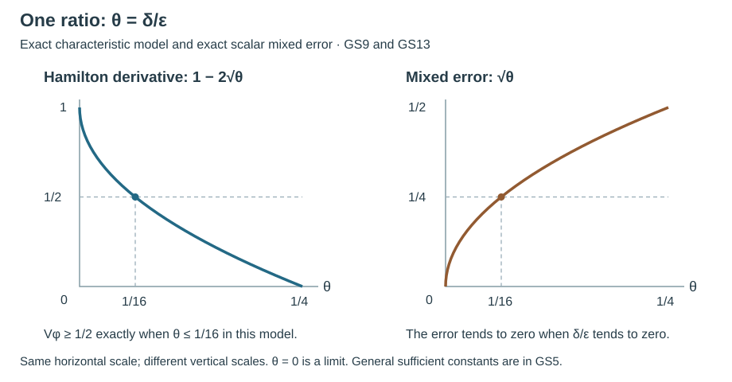

# Localizing near a glancing ray: two scales and the normal derivative

A propagation estimate must choose where its symbol is supported and how fast that symbol changes along the Hamilton field. Near a tangency, these are different decisions. Shrinking every localization parameter independently can destroy the sign of the derivative that should control the solution.

The freely accessible [correction by András Vasy](https://math.stanford.edu/~andras/psmc-corr.pdf), dated December 1, 2008, identifies a missing derivative of a squared normal coordinate in his boundary-propagation argument. Its repaired localization distinguishes a longitudinal width from a narrower distance to glancing. The present section gives a complete elementary receiving argument and an exact smooth quadratic model. Vasy's full theorem concerns the wave equation on manifolds with corners and a boundary Sobolev calculus; those additional hypotheses and operators are not replaced by the elementary lemmas here.

The [geometric generalized-flow chapter](../20261007-restored-generalized-glancing/generalized-glancing-flow-preparation.md) supplies the characteristic geometry. For the computations below we need only differentiation of smooth real functions, the Hamilton field convention
\[
 H_p=\partial_\xi p\cdot\partial_x-\partial_xp\cdot\partial_\xi,
 \tag{GS1}
\]
and Cauchy–Schwarz in a complex Hilbert space. The exact foundations are the [Hamilton convention and coordinate calculation](../20261005-restored-phase-space/phase-space-and-generating-families.md), the [differential rules F0-DIFF](../20261004-free-stationary-phase/proof-map.html#F0-DIFF), [positive roots P8](../20261004-free-stationary-phase/elementary-proof-completions.md) and [positive real powers P14.2](../20261004-free-stationary-phase/exponential-prerequisite-completions.md). The [complete pointwise Hilbert proof BI13a](../20261005-cauchy-foundations/integration-and-duality.md) proves Cauchy–Schwarz for every complex Hilbert space, without separability and including zero vectors; its inner product is linear in the first entry. In particular it applies to \(RAv\) and \(v\) below. The bound \(\|Rw\|\leq\|R\|\|w\|\) is the definition of the operator norm, also at \(w=0\). Each result used is proved here or in these exact earlier programme proofs, bound in the [proof map](proof-map.json).

## 1. A quantitative derivative lemma

Let \(V\) be a continuous real vector field on an open subset of a smooth manifold, and let \(t,\Omega\) be real \(C^1\) functions with \(\Omega\geq0\). Fix \(c>0\), \(C>0\) and \(A,B>0\). On the region being considered assume
\[
 Vt\geq c,\qquad
 |V\Omega|\leq C\Omega^{1/2}
       \big(\Omega^{1/2}+|t|+\Omega^{1/4}\big).
 \tag{GS2}
\]
The fourth root here is a bound on a derivative, not a claim that \(\Omega^{1/4}\) is smooth. For \(0<\epsilon,\delta\leq1\), set
\[
 \phi_{\epsilon,\delta}=t+\frac{\Omega}{\epsilon^2\delta},
 \qquad
 \mathcal R_{\epsilon,\delta}
 =\{\Omega^{1/2}\leq A\epsilon\delta,\ |t|\leq B\delta\}.
 \tag{GS3}
\]
Only points where (GS2) holds are included in the following assertion.

**Lemma 1.1.** Throughout \(\mathcal R_{\epsilon,\delta}\),
\[
 V\phi_{\epsilon,\delta}
 \geq c-C\left(
 A^2\delta+AB\frac{\delta}{\epsilon}
       +A^{3/2}\sqrt{\frac{\delta}{\epsilon}}\right).
 \tag{GS4}
\]
In particular, \(V\phi_{\epsilon,\delta}\geq c/2\) if
\[
 \delta\leq\frac{c}{6CA^2},\qquad
 \frac{\delta}{\epsilon}\leq
 \min\left\{\frac{c}{6CAB},
             \left(\frac{c}{6CA^{3/2}}\right)^2\right\}.
 \tag{GS5}
\]

**Complete proof.** Differentiate (GS3) before making any support estimate:
\[
 V\phi=Vt+\frac{V\Omega}{\epsilon^2\delta}.
\]
Write \(s=\Omega^{1/2}\). On the stated region, \(s\leq A\epsilon\delta\), \(|t|\leq B\delta\) and \(\Omega^{1/4}\leq(A\epsilon\delta)^{1/2}\). Consequently the magnitude of the second term is at most
\[
 \frac{C}{\epsilon^2\delta}
 A\epsilon\delta
 \left(A\epsilon\delta+B\delta+(A\epsilon\delta)^{1/2}\right)
 =C\left(A^2\delta+AB\frac{\delta}{\epsilon}
       +A^{3/2}\sqrt{\frac{\delta}{\epsilon}}\right).
\]
This proves (GS4). The three terms on the last right-hand side are each at most \(c/6\) under (GS5); their sum is at most \(c/2\). No differentiation of a fourth root was used. If the derivative bound has \(C=0\), the conclusion follows directly from \(V\phi=Vt\), without any division by \(C\). ∎

The order of choice is explicit. First choose \(\delta\) small. Next choose \(\epsilon\) so that \(\delta/\epsilon\) is sufficiently small. Both parameters may tend to zero: for example, \(\epsilon=\delta^q\) with \(0<q<1\) satisfies every fixed positive ratio threshold once \(\delta\) is small enough. A rule requiring only \(\epsilon\to0\) and \(\delta\to0\) omits a necessary relationship for this estimate.

## 2. An exact quadratic model detects the missing term

Use coordinates \((t,y,x;\tau,\zeta,\rho)\) on \(T^*\mathbb R^3\), with the physical side \(x\geq0\), and work near \((x,\rho,\tau,\zeta)=(0,0,1,1)\). Take the real homogeneous symbol
\[
 p=\tau^2-(1-x)\zeta^2-\rho^2,
 \qquad V=(2\tau)^{-1}H_p.
 \tag{GS6}
\]
Restrict to a small neighborhood with \(\tau>0\) and \(|x|<1/2\). Thus normalization is smooth and the tangential spatial coefficient \(1-x\) stays positive. The boundary covector in question is nonzero. Direct differentiation, keeping every normal term, gives
\[
 H_p=2\tau\partial_t-2(1-x)\zeta\partial_y
                  -2\rho\partial_x-\zeta^2\partial_\rho,
 \quad Vt=1,
 \quad Vx=-\rho/\tau.
 \tag{GS7}
\]
The slice \(\tau=\zeta=1\) is invariant under this field, since \(p\) is independent of \(t,y\). On its characteristic set, \(p=0\) is exactly \(x=\rho^2\). At \(x=\rho=0\), \(H_px=0\) and \(H_p^2x=2\zeta^2>0\): the model has a strict quadratic boundary tangency. We are using a coordinate section of a homogeneous characteristic set, not identifying the slice with the entire conic geometry.

Set \(\Omega=x^2\). On this invariant characteristic slice, (GS7) gives
\[
 V\Omega=-2x\rho,\qquad
 |V\Omega|=2x^{3/2}=2\Omega^{3/4}.
 \tag{GS8}
\]
Thus (GS2) holds there with \(c=1,C=2\), because its right-hand side includes \(2\Omega^{3/4}\). The derivative of \(x^2\) has not vanished just because \(x\) is small.

At a point with \(x=\epsilon\delta\), \(\rho=+\sqrt{\epsilon\delta}\), \(t=0\), \(\tau=\zeta=1\), we are on \(p=0\) and on the boundary of the region \(\Omega^{1/2}\leq\epsilon\delta\). The exact derivative is
\[
 V\phi_{\epsilon,\delta}
 =1-2\sqrt{\delta/\epsilon}.
 \tag{GS9}
\]
It is at least \(1/2\) when \(\delta/\epsilon\leq1/16\). If \(\epsilon=\delta^q\) with \(q>1\), it tends to \(-\infty\); all the points used still approach the same glancing covector. For \(q=1\) and unit proportionality it equals \(-1\). The failure comes from the normal derivative, not from a change in the support, a zero covector or a nonsmooth symbol. At the opposite normal root the normal contribution reverses sign, giving \(V\phi=1+2\sqrt{\delta/\epsilon}\); this is another reason to retain the full Hamilton expression.

## 3. A normal energy estimate is squared; a mixed error is not

Let \(\mathcal H\) be a complex Hilbert space. Let \(A\) be a linear operator with \(v\) in its domain and \(Av\in\mathcal H\), and let \(R\) be a bounded operator on \(\mathcal H\). Fix \(K,M\geq0\), \(E\geq0\), and assume
\[
 \|Av\|^2\leq K\epsilon\delta\,\|v\|^2+E^2,
 \qquad \|R\|\leq M/\epsilon.
 \tag{GS10}
\]
Here \(E\) explicitly records the uncontrolled remainder; it is not silently discarded.

**Lemma 3.1.** For every \(\gamma>0\),
\[
 |\langle RAv,v\rangle|
 \leq\left(M\sqrt K\sqrt{\delta/\epsilon}+\gamma\right)\|v\|^2
       +\frac{M^2}{4\gamma\epsilon^2}E^2.
 \tag{GS11}
\]
If an additional mixed error satisfies \(\|Fv\|\leq L\), then it contributes at most \(\gamma\|v\|^2+L^2/(4\gamma)\).

**Complete proof.** From (GS10) and \(\sqrt{a+b}\leq\sqrt a+\sqrt b\) for nonnegative \(a,b\),
\[
 \|Av\|\leq\sqrt{K\epsilon\delta}\,\|v\|+E.
\]
Cauchy–Schwarz and the bound on \(R\) give
\[
 |\langle RAv,v\rangle|
 \leq M\sqrt K\sqrt{\delta/\epsilon}\,\|v\|^2
       +(M/\epsilon)E\|v\|.
\]
The elementary identity
\[
 0\leq(\sqrt\gamma\,b-a/(2\sqrt\gamma))^2
\]
gives \(ab\leq\gamma b^2+a^2/(4\gamma)\). Apply it with \(a=ME/\epsilon\), \(b=\|v\|\) to prove (GS11). For the final assertion, Cauchy–Schwarz gives \(|\langle Fv,v\rangle|\leq L\|v\|\); use the same inequality. These arguments require no self-adjointness of \(R\) or \(A\). ∎

For an energy inequality
\[
 \beta\|v\|^2\leq S+|\langle RAv,v\rangle|,
 \qquad\beta>0,\ S\geq0,
 \tag{GS12}
\]
choose \(\gamma=\beta/4\). If \(M^2K\delta/\epsilon\leq\beta^2/16\), then (GS11) and (GS12) imply
\[
 \|v\|^2\leq\frac{2S}{\beta}
          +\frac{2M^2}{\beta^2\epsilon^2}E^2.
 \tag{GS13}
\]
Indeed the coefficient to be absorbed is at most \(\beta/4+\beta/4=\beta/2\); subtract it from the left and divide. If \(M=0\) or \(K=0\), the same proof works with the corresponding coefficient zero. In an actual microlocal estimate, one must still prove (GS10), identify \(E\) in the correct Sobolev and source norms, and control it uniformly in any regularization parameter. This elementary absorption result alone does not prove propagation at the boundary.

The square root in (GS11) is sharp under its stated information. On \(\mathcal H=\mathbb C\), choose \(v=1\), \(A=\sqrt{\epsilon\delta}\,I\), \(R=\epsilon^{-1}I\) and \(E=0\). Then \(K=M=1\), (GS10) holds with equality, and the mixed error equals \(\sqrt{\delta/\epsilon}\). The ratio of this exact value to \(\delta\) is \(1/\sqrt{\epsilon\delta}\), so a bound proportional to \(\delta\) fails uniformly as both widths shrink.

*With \(\theta=\delta/\epsilon\), the left curve is the exact characteristic-model value \(V\phi=1-2\sqrt\theta\) from (GS9); its marked threshold is \(\theta=1/16\), where the value is \(1/2\). The right curve is the exact scalar mixed error \(\sqrt\theta\) in the sharp example following (GS13). Both panels show \(0\leq\theta\leq1/4\); the endpoint \(\theta=0\) is a limit of positive widths. The horizontal axes agree and the vertical scales are stated separately. The curves are exact quadratic parametrizations in \(u=\sqrt\theta\), not sampled evidence for the general estimates. The left threshold is specific to this model, while (GS5) gives the sufficient bound for general constants.*

## 4. Exercises with complete solutions

**Exercise 1 (entry level: preserve the normal derivative).** In (GS6), verify all four terms of (GS7), the invariant slice, the sign of \(H_p^2x\) at glancing and (GS9). Determine precisely when \(\epsilon=K_0\delta\), \(K_0>0\), gives the bound \(V\phi\geq1/2\) at the points used in (GS9).

**Solution.** The momentum derivatives are \(2\tau\), \(-2(1-x)\zeta\), \(-2\rho\); the only nonzero base derivative is \(\partial_xp=\zeta^2\). This gives (GS7) by (GS1). The field has no \(\partial_\tau,\partial_\zeta\) terms, so both momenta stay fixed. On their unit slice, \(p=x-\rho^2\). Further, \(H_p(-2\rho)=2\zeta^2\), proving strict tangency into \(x>0\). Since \(V\Omega=2xVx=-2x\rho\), division by \(\epsilon^2\delta\) at the stated point yields (GS9). With \(\epsilon=K_0\delta\), that value is \(1-2/\sqrt{K_0}\). It is at least \(1/2\) exactly when \(K_0\geq16\). For any such fixed \(K_0\), taking \(\delta\) sufficiently small with \(\delta\leq1/K_0\) ensures both \(\epsilon\leq1\) and membership in the chosen local neighborhood. The requirement concerns this exact model; (GS5) is a separate sufficient bound for the general derivative hypothesis.

**Exercise 2 (intermediate: a norm cannot be replaced by its square).** Verify the one-dimensional sharp example after (GS13). Take \(\epsilon=\delta^{1/2}\). Compare the exact mixed error with a proposed \(C\delta\) bound for a fixed \(C\), and explain why the complete energy inequality (GS12) still needs the remainder term in (GS13).

**Solution.** Scalar operator norms are absolute values. Thus \(\|Av\|^2=\epsilon\delta\), \(\|R\|=\epsilon^{-1}\), while \(|\langle RAv,v\rangle|=\epsilon^{-1}\sqrt{\epsilon\delta}=\delta^{1/4}\). The ratio to \(\delta\) is \(\delta^{-3/4}\), which exceeds every fixed \(C\) for small \(\delta\). Applying a squared norm bound directly to an unsquared Cauchy–Schwarz factor is the invalid step. For nonzero \(E\), Young's inequality produces the explicit coefficient \(2M^2/(\beta^2\epsilon^2)\); it can grow as the transverse width shrinks. An actual boundary proof must therefore show that its lower-order/source controls remain adequate after that coefficient is included, rather than replacing \(E\) by zero.

## Sources and mathematical contribution

[Vasy's complete freely readable paper](https://math.stanford.edu/~andras/psmcrrb.pdf), Section 7, gives the wave-boundary normal-energy and tangential-propagation setting. Its [December 1, 2008 correction](https://math.stanford.edu/~andras/psmc-corr.pdf), pages 1–2, supplies the specific omitted-term and localization warning used here. Those source files are readings and retain their own rights. They are not redistributed or textually adapted in this lesson. The parameterized lemmas, exact homogeneous coordinate-section calculation and two teaching exercises were written by GPT-6.1 Sol (OpenAI), Ultra. Restoration, exact prerequisite bindings and the scale diagram are by GPT-6 Astra (OpenAI), Ultra, October 2026. This independent exposition and diagram are dedicated under CC0-1.0. The full geometric and analytic programme arguments retain their individual source and licence bindings.
