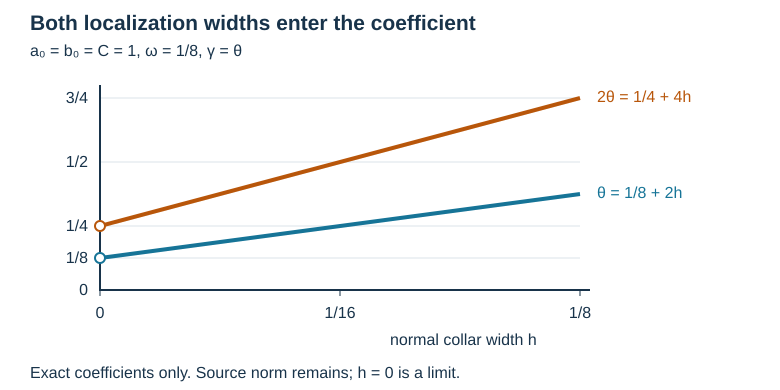

# Why normal energy becomes small near a tangential characteristic

A glancing symbol has little normal momentum. To use that geometric statement in a proof, we need an estimate for the normal derivative of an actual function. The remainder matters: a localization of a solution usually has a nonzero source, even when the original equation is homogeneous.

The normal-energy argument in [András Vasy’s freely readable paper](https://math.stanford.edu/~andras/psmcrrb.pdf), Lemma 7.1, combines coefficient freezing, a tangential symbol that vanishes at glancing, and controlled lower-order terms. This lesson proves the coefficient-freezing mechanism completely for a model in which the tangential Fourier transform gives an exact calculation. It then connects that calculation to the [two-scale estimate](../20261007-restored-glancing-cutoff/glancing-cutoff-scales-preparation.md). The general boundary pseudodifferential calculus and the full propagation theorem still require their complete receiving arguments.

Use \(D=-i\partial\), and put \(z=(t,y)\in\mathbb R\times\mathbb R^d\). Our Fourier convention is
\[
 \widehat v(x,\tau,\eta)=(2\pi)^{-(d+1)/2}
       \int e^{-i(t\tau+y\cdot\eta)}v(x,t,y)\,dt\,dy.
 \tag{NE1}
\]
The exact earlier proofs are [Schwartz Fourier estimates and inversion, Q3–Q4](../20261004-free-stationary-phase/quadratic-stationary-phase.md), [Parseval, Appendix A.2, and smooth cutoffs, A.4](../20261004-free-stationary-phase/stationary-phase-and-critical-manifolds.md), and [the complete inverse maps and multiplier adjoints, L1–L3](../20261004-free-intrinsic-graph/prerequisites/fourier-l2.md). Product integration is proved in [M4](../20261004-free-intrinsic-graph/prerequisites/measure-and-l2.md); arbitrary-complex-Hilbert Cauchy–Schwarz is proved in [BI13a](../20261005-cauchy-foundations/integration-and-duality.md). These existing components retain their own notices, including the GFDL-1.2 notices on the earlier AN-03 component. No prerequisite is replaced by an external citation. The [proof map](proof-map.json) records the exact versions and dependencies.

**Normalization and parameters.** Put \(n=d+1\). The earlier convention is \(Ff(\xi)=\int e^{-iz\cdot\xi}f(z)\,dz\), with inverse \(G\) carrying \((2\pi)^{-n}\). Thus \(\mathcal F=(2\pi)^{-n/2}F\) and \(\mathcal F^{-1}=(2\pi)^{n/2}G\) are inverse maps and \(\langle u,v\rangle=\int\mathcal Fu\,\overline{\mathcal Fv}\). This follows by substituting those two constants into (FL2) and (FL5), whose factors cancel exactly. For our smooth collar families the Schwartz seminorm estimates in Q3 hold uniformly after every normal derivative. Their absolutely integrable majorants justify those derivatives and the subsequent integration in \(x\); M4 supplies Fubini. The ordinary product rule and fundamental theorem used for integration by parts have their complete earlier proofs in [F0-DIFF and FTC-TAYLOR-COMPACT-PARAMETERS](../20261004-free-stationary-phase/proof-map.html#FTC-TAYLOR-COMPACT-PARAMETERS).

## 1. A boundary-compatible exact energy identity

Fix \(0<h\leq h_*\). On the collar \(0\leq x\leq h_*\), let \(a(x)\) be a smooth real function and \(B(x)\) a smooth real symmetric \(d\)-by-\(d\) matrix. Suppose
\[
 a(x)\geq a_0>0,\qquad
 B(0)\geq b_0 I>0,\qquad
 \|B(x)-B(0)\|_{\mathrm{op}}\leq Cx,
 \quad C\geq0.
 \tag{NE2}
\]
The inequality for \(B(0)\) is in the sense of quadratic forms. Take
\[
 P=D_t^2-\sum_{j,k=1}^d D_{y_j}B_{jk}(x)D_{y_k}
              -D_xa(x)D_x.
 \tag{NE3}
\]
The last expression denotes composition, so its normal term is \(\partial_x(a\partial_x)\) when written using ordinary derivatives. A derivative of \(a\) is included.

Let \(v\) be smooth, compactly supported in \(0\leq x<h\), and Schwartz in \(z\), uniformly with all derivatives on the collar. Require either
\[
 v(0,z)=0 \quad\hbox{or}\quad a(0)\partial_xv(0,z)=0.
 \tag{NE4}
\]
All norms and inner products are on \([0,\infty)\times\mathbb R^{d+1}\), using Lebesgue measure and an inner product linear in its first argument. Direct integration by parts gives
\[
 \int a(x)|D_xv|^2\,dx\,dz
 =\int\big(\tau^2-\eta^TB(x)\eta\big)|\widehat v|^2\,dx\,d\tau\,d\eta
          -\operatorname{Re}\langle Pv,v\rangle.
 \tag{NE5}
\]

**Complete proof.** Integration in \(t\) gives \(\langle D_t^2v,v\rangle=\|D_tv\|^2\). Integration in \(y\) gives the real quadratic form \(\sum_{j,k}\int B_{jk}D_{y_k}v\,\overline{D_{y_j}v}\). For the normal term,
\[
 \int -\partial_x(a\partial_xv)\,\overline v\,dx\,dz
 =\int a|\partial_xv|^2\,dx\,dz
      -\int[a\partial_xv\,\overline v]_{x=0}^{x=\infty}\,dz.
\]
The upper boundary term vanishes by compact support. The lower one vanishes under either condition in (NE4). Substitute these identities in (NE3), take real parts and use Plancherel in the tangential variables to obtain (NE5). Compact support and Schwartz decay justify every integration and interchange of integrals. ∎

The boundary condition is part of the identity. Without it the displayed boundary product must be retained.

## 2. A complete normal-energy estimate

Let \(0\leq\omega\leq1\), and suppose that the tangential Fourier support of \(v\) is contained in
\[
 \mathcal C_\omega=
 \{(\tau,\eta):|\tau|\geq1,\quad
       |\tau^2-\eta^TB(0)\eta|\leq\omega\tau^2\}.
 \tag{NE6}
\]
Write \(T=|D_t|\) for the Fourier multiplier \(|\tau|\). Its inverse is used only on this support, so there is no zero-frequency singularity.

**The actual inverse multiplier.** Let \(\sigma\) be the smooth step constructed in Appendix A.4: it is zero on \(( -\infty,0]\), one on \([1,\infty)\), and lies between zero and one. Define \(\psi(\tau)=\sigma((4\tau^2-1)/3)\) and \(m(\tau)=\psi(\tau)/|\tau|\) for \(\tau\ne0\), extending it by zero near zero. This is a real smooth function, zero for \(|\tau|\leq1/2\), equal to \(|\tau|^{-1}\) for \(|\tau|\geq1\). All its derivatives are bounded: outside the compact transition interval they are derivatives of \(|\tau|^{-1}\) or zero, and on the transition interval smoothness gives finite suprema. For any tangential Schwartz function, Leibniz's rule bounds each weighted derivative of \(m\widehat v\) by a finite sum of Schwartz seminorms of \(\widehat v\). The inverse Fourier estimates therefore show that \(\mathcal F^{-1}(m\widehat v)\) is Schwartz. The same argument holds after every normal derivative and uniformly on the collar.

On the support (NE6) this operator is exactly \(T^{-1}\), and its square is \(T^{-2}\). Multiplication does not enlarge frequency support. It also does not enlarge normal support, because it acts separately at each \(x\). It commutes with \(\partial_x\), with the coefficients \(a(x),B(x)\), and with each tangential derivative; this follows either by differentiating the absolutely convergent transform integrals or by commuting scalar frequency multiplication. Hence it commutes with \(P\). Evaluation at \(x=0\) and the normal derivative commute as well, so both boundary conditions in (NE4) persist. Finally, Parseval gives \(\langle T^{-1}u,v\rangle=\int m\widehat u\,\overline{\widehat v}=\langle u,T^{-1}v\rangle\) on these supported functions. The bounded extension on the entire \(L^2\) space is supplied by L3; its values off the specified support have no effect here.

Set
\[
 \theta=\omega+\frac{2C}{b_0}h.
 \tag{NE7}
\]

**Lemma 2.1.** Under (NE2), (NE4) and (NE6), for every \(\gamma>0\),
\[
 \|T^{-1}D_xv\|^2
 \leq\frac{\theta+\gamma}{a_0}\|v\|^2
       +\frac{1}{4a_0\gamma}\|T^{-2}Pv\|^2.
 \tag{NE8}
\]
When \(\theta>0\), choosing \(\gamma=\theta\) makes the first coefficient \(2\theta/a_0\). When \(\theta=0\), (NE8) with an arbitrary positive \(\gamma\) remains the statement; no division by zero is made.

**Complete proof.** On \(\mathcal C_\omega\), positivity of \(B(0)\) gives
\[
 b_0|\eta|^2\leq\eta^TB(0)\eta
          \leq(1+\omega)\tau^2\leq2\tau^2.
\]
For \(0\leq x<h\), the freezing error therefore satisfies
\[
 \tau^2-\eta^TB(x)\eta
 \leq\omega\tau^2+Cx|\eta|^2
 \leq\theta\tau^2.
 \tag{NE9}
\]
Only an upper bound is needed; the left-hand side may be negative.

Put \(w=T^{-1}v\). Fourier multiplication preserves its support, decay, normal support and either boundary condition. Because all coefficients depend only on \(x\), \(P\) commutes exactly with \(T^{-1}\). Applying (NE5) to \(w\), then using (NE9) and (NE2), gives
\[
 a_0\|D_xw\|^2
 \leq\theta\|Tw\|^2+|\langle Pw,w\rangle|
 =\theta\|v\|^2+|\langle T^{-2}Pv,v\rangle|.
 \tag{NE10}
\]
The last equality uses the real self-adjoint multiplier \(T^{-1}\); every term is integrable under the stated support and regularity. Cauchy–Schwarz and
\[
 rs\leq\gamma s^2+\frac{r^2}{4\gamma},
 \qquad r,s\geq0,
\]
give (NE8) after division by \(a_0\). The scalar inequality follows by expanding \((\sqrt\gamma s-r/(2\sqrt\gamma))^2\geq0\), so it introduces no additional proof dependency. ∎

This model exposes both kinds of localization. A narrow tangential cone alone does not control the coefficient-freezing error unless the normal collar is also small.

*An exact coefficient comparison in (NE7)–(NE8): choose \(a_0=b_0=C=1\), \(\omega=1/8\), \(h_*\geq1/8\), and \(\gamma=\theta\). For \(0<h\leq1/8\), the blue line is \(\theta=1/8+2h\); the orange line is the coefficient \(2\theta=1/4+4h\) of \(\|v\|^2\). The value at \(h=0\) is a limiting value only. These are exact coefficients, not measured solution energies. The source contribution \(\|T^{-2}Pv\|^2/(4\theta)\) remains in the bound and is not plotted. A narrow cone leaves a separate collar cost.*

## 3. The exact input to the two-scale mixed-error argument

Take \(0<\epsilon,\delta\leq1\), put
\[
 h=\epsilon\delta\leq h_*,\qquad
 \omega=\epsilon\delta,\qquad
 K=\frac{2+2C/b_0}{a_0},\qquad A=T^{-1}D_x.
 \tag{NE11}
\]
Choosing \(\gamma=\epsilon\delta\) in (NE8) yields
\[
 \|Av\|^2\leq K\epsilon\delta\,\|v\|^2+E^2,
 \qquad
 E^2=\frac{\|T^{-2}Pv\|^2}{4a_0\epsilon\delta}.
 \tag{NE12}
\]
This is now a proved instance of the normal-energy hypothesis in the preceding scale lemma. The source norm is part of the result.

Suppose a bounded operator \(R\) satisfies \(\|R\|\leq M/\epsilon\), and an energy inequality has the form
\[
 \beta\|v\|^2\leq S+|\langle RAv,v\rangle|,
 \qquad\beta>0,\quad S\geq0.
 \tag{NE13}
\]
If \(M^2K\delta/\epsilon\leq\beta^2/16\), then
\[
 \|v\|^2\leq\frac{2S}{\beta}
       +\frac{M^2}{2a_0\beta^2\epsilon^3\delta}
           \|T^{-2}Pv\|^2.
 \tag{NE14}
\]

**Complete proof.** Taking a square root in (NE12), then applying Cauchy–Schwarz, gives
\[
 |\langle RAv,v\rangle|
 \leq M\sqrt K\sqrt{\delta/\epsilon}\,\|v\|^2
            +(M/\epsilon)E\|v\|.
\]
Apply the scalar inequality proved above with \(\gamma=\beta/4\). The coefficient of \(\|v\|^2\) is at most \(\beta/4+\beta/4=\beta/2\), by the stated ratio condition. Subtract it from (NE13), divide by \(\beta/2\), and insert the exact value of \(E^2\) from (NE12). This proves (NE14), including \(M=0\). ∎

The factor \(\epsilon^{-3}\delta^{-1}\) shows why a proof cannot silently discard the localized source. Uniformity in a separate regularization parameter follows from (NE8)–(NE14) for any family satisfying the same hypotheses and uniform source bounds with fixed \(\epsilon,\delta\). It does not establish uniformity as both localization widths tend to zero.

For coefficients depending on \(t,y\), the commutation used in (NE10) acquires additional terms. For a general second-order operator with complex lower-order terms, the source \(Pv\) and its norm must also be replaced by the appropriate full equation and controlled errors. Those are substantive parts of the remaining boundary proof.

## 4. A localized homogeneous solution has a source

Take \(a=1\) and \(B=I\). In the strict hyperbolic part of (NE6), let
\[
 \kappa(\tau,\eta)=\sqrt{\tau^2-|\eta|^2}>0.
 \tag{NE15}
\]
For this example assume the strict frequency region has nonempty interior. In particular, for \(d\geq1\) and \(0<\omega\leq1\), the point \(\tau=2\), \(\eta=(2\sqrt{1-\omega/2},0,\ldots,0)\) satisfies \(0<\tau^2-|\eta|^2<\omega\tau^2\); continuity gives a small ball with closure in that region. Appendix A.4 supplies a nonzero smooth bump supported in that ball. For \(d=0,\omega=1\), a small interval about \(\tau=2\) works instead. At \(\omega=0\) there is no strict hyperbolic region and no nonzero packet of the stated kind; the general estimate still includes that endpoint. A normal cutoff exists explicitly: with the same step \(\sigma\), take \(\chi(x)=1-\sigma(3x/h-1)\) for \(x\geq0\). It equals one for \(x\leq h/3\) and zero for \(x\geq2h/3\), is real and smooth up to the boundary, and has support strictly inside the collar.

Choose a nonzero smooth compactly supported amplitude \(q(\tau,\eta)\) in that region, with \(|\tau|>1\), and a real smooth cutoff \(\chi\) supported in \([0,h)\), equal to one near zero. Define an actual Schwartz tangential packet by
\[
 \widehat v(x,\tau,\eta)
       =q(\tau,\eta)\chi(x)\sin(\kappa x).
 \tag{NE16}
\]
The Fourier support is unchanged, and the Dirichlet condition holds. On this support \(\kappa\) is smooth. Compact frequency support and repeated integration by parts in frequency prove the required tangential Schwartz decay.

Before the normal cutoff, the sine factor solves the homogeneous equation at each frequency. After the cutoff, direct differentiation gives
\[
 \widehat{Pv}
 =q\big(\chi''(x)\sin(\kappa x)
                  +2\kappa\chi'(x)\cos(\kappa x)\big).
 \tag{NE17}
\]
The two cutoff derivatives belong to the source in (NE12). They cannot be removed by calling the unlocalized sine a solution.

## 5. Exercises with complete solutions

**Exercise 1 (entry level: retain the full source weight).** Let \(a_0=b_0=1\), \(C=0\), \(M=\beta=1\), \(h=\omega=\epsilon\delta\). Derive the exact sufficient ratio condition and the coefficient of the source norm in (NE14). Set \(\epsilon=\delta^{1/2}\), and determine how that coefficient behaves as \(\delta\to0\).

**Solution.** Formula (NE11) gives \(K=2\). The absorption condition is \(2\delta/\epsilon\leq1/16\), or \(\delta/\epsilon\leq1/32\). The source coefficient is \(1/(2\epsilon^3\delta)\). With \(\epsilon=\delta^{1/2}\), the ratio is \(\delta^{1/2}\), so the condition holds for \(\delta\leq1/1024\), with the collar bound imposed as well. The source coefficient is \(\tfrac12\delta^{-5/2}\). The small mixed coefficient and the large source weight coexist; one does not remove the other.

**Exercise 2 (intermediate: check the cutoff equation).** Verify (NE17) and show that the packet in (NE16) cannot have \(Pv=0\) unless it is zero. Explain the role of this fact in (NE12).

**Solution.** In the partial Fourier transform, \(P\) is \(\kappa^2+\partial_x^2\). Expanding the second derivative of \(\chi\sin(\kappa x)\) cancels its \(-\kappa^2\chi\sin(\kappa x)\) term and leaves exactly (NE17). If the resulting source vanished, for each frequency the function \(f(x)=q\chi(x)\sin(\kappa x)\) would solve \(f''+\kappa^2f=0\). Beyond the cutoff support both \(f\) and \(f'\) are zero. The derivative of \(|f'|^2+\kappa^2|f|^2\) is \(2\operatorname{Re}((f''+\kappa^2f)\overline{f'})=0\); hence that nonnegative energy is zero everywhere and \(f=0\). For a frequency where \(q\ne0\), the prescribed \(\chi=1\) near zero and \(\kappa>0\) contradict this. Thus the nonzero packet has a nonzero source. Formula (NE12) accounts for that source with its exact normalization instead of applying a homogeneous estimate to a localized function.

## Sources and contribution

[Vasy’s paper](https://math.stanford.edu/~andras/psmcrrb.pdf), Lemma 7.1, PDF pages 42–44, supplies the mathematical motivation for normal-energy smallness and coefficient freezing. Its [December 1, 2008 correction](https://math.stanford.edu/~andras/psmc-corr.pdf), pages 1–2, supplies the corrected mixed-error scale mechanism. These freely accessible readings retain their own rights; their prose, PDF files and images are not redistributed or textually adapted here. The linked programme Fourier and measure proofs retain their own component notices, including the GFDL-1.2 notices on the earlier AN-03 component. This exact collar model, proofs and solved exercises were written by GPT-6.1 Sol (OpenAI), Ultra. Restoration, exact prerequisite bindings, the inverse-multiplier details and the coefficient diagram are by GPT-6 Astra (OpenAI), Ultra, October 2026. The independent exposition and diagram are CC0-1.0. The model is a supporting treatment; the full assigned boundary-propagation theorem remains open.
