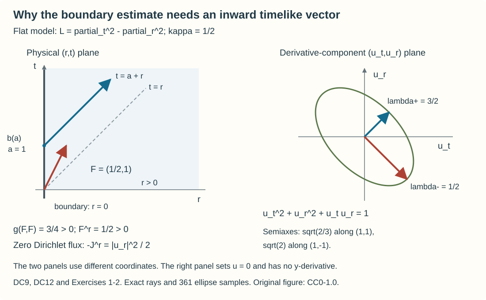

# Energy and existence with a timelike Dirichlet boundary

A wave equation has two kinds of data surfaces. A spacelike surface supplies initial data; a timelike surface supplies boundary data throughout the evolution. An inward timelike multiplier makes the latter surface contribute a positive normal-derivative flux. That flux is the essential ingredient in constructing a solution from Dirichlet data.

We prove the mixed existence theorem at its full stated regularity, including localization and global assembly. The energy proof does not describe reflected or glancing wavefronts. Those require the subsequent boundary microlocal arguments.

The exact preceding proofs are Section 4 of Higher-order Cauchy problems: roots, jets and propagation, for supported/restricted Sobolev spaces, one-sided multipliers, traces, coordinate changes and normal recovery, and Section 6 of that lesson for the interior local Cauchy construction and uniqueness. The complete [two-weight Hilbert and trace proofs](../20261005-mixed-halfspace-foundations/two-weight-hilbert-spaces-and-traces.md) and half-space support, duality and one-sided multiplier proofs H1–H7 supply those precise prerequisites. The functional extension is the complete complex Hahn–Banach proof in [Section 5 of Integration and duality](../20261005-cauchy-foundations/integration-and-duality.md); its Sections 15–17 supply Banach-valued integration and Hilbert-space identification. The full [Hilbert representation proof T1](../20261004-free-canonical-composition/compactness-and-essential-norms.md) supplies the representing vector. All referenced components retain their own notices. Their exact current proof entries are linked by the accompanying proof map.

## 1. Geometry and the full mixed theorem

Let \(X\) be a smooth \(n\)-dimensional manifold with smooth boundary, \(n\ge2\), and let \(P\) be a scalar differential operator of order two with smooth coefficients and real principal symbol \(p\). Let \(\phi:X\to\mathbb R\) be smooth. Assume that
\[
 \begin{gathered}
 P\text{ is strictly hyperbolic relative to }d\phi,\qquad
 p(x,d\phi)>0,\qquad \phi\text{ is proper},\\
 p(x,\nu)<0\quad
 (x\in\partial X,\quad 0\ne\nu\in N_x^*\partial X).
 \end{gathered}\tag{DC1}
\]
Multiplication of \(P\) by a smooth nonzero scalar can provide the displayed sign normalization. We fix it throughout. Lower-order coefficients can be complex; formal self-adjointness is not assumed. A bar on a local Sobolev space means restriction of a full-space Sobolev distribution in each boundary chart, with the quotient norm. It is not a supported zero extension.

Write \(q_x(\xi,\eta)\) for the polarization of \(p\), \(q_x(\xi)=p(x,\xi)\). Strict quadratic hyperbolicity has a useful equivalent form. Decompose
\[
 \xi=a\,d\phi+\theta,\qquad q_x(\theta,d\phi)=0.
\]
The discriminant of \(q_x(\xi+\lambda d\phi)\), as a polynomial in \(\lambda\), is
\[
 4\{q_x(\xi,d\phi)^2-q_x(d\phi)q_x(\xi)\}
       =-4q_x(d\phi)q_x(\theta).
 \tag{DC2}
\]
Thus \(q_x\) is negative definite on the orthogonal complement of \(d\phi\). Its signature is \((1,n-1)\), and the converse follows from the same formula. In Lorentz coordinates its two timelike cones are \(\tau>|z|\) and \(\tau<-|z|\); choose the first by \(q_x(\xi,d\phi)>0\). The closed forward cone is convex. Cauchy–Schwarz gives nonnegative pairing of two of its vectors, with equality for nonzero vectors only when both are parallel and null.

The inverse matrix of \(q_x\) defines the tangent Lorentz metric \(g_x\). A tangent vector is future timelike when its metric square is positive and its application to \(\phi\) is positive. A hypersurface is spacelike when its nonzero conormals have positive \(q_x\)-square, and timelike when they have negative square. These definitions concern the conormal, rather than a Euclidean normal.

At the boundary, the metric-normal vector \(q_x^\sharp\nu\) is spacelike. Its orthogonal complement is \(T_x\partial X\), so the induced metric there has signature \((1,n-2)\). The tangential projection of \(d\phi\) has square
\[
 q_x(d\phi)-\frac{q_x(d\phi,\nu)^2}{q_x(\nu)}>0.
 \tag{DC3}
\]
In particular \(\phi|_{\partial X}\) has no critical point, and its level sets meet the boundary transversely. This also constructs a future timelike vector tangent to the boundary: apply \(q_x^\sharp\) to that projection. The formula is independent of the choice of nonzero defining conormal. Extend it through boundary coordinate charts and blend with \(q_x^\sharp d\phi\) in the interior. Smooth partitions and convexity of the future cone give a smooth timelike field \(W\), tangent to \(\partial X\), normalized by \(W\phi=1\).

Here is the smooth flow argument needed for the compact collars. In a coordinate box, extend the smooth field across a boundary chart and take a smaller closed box. On it the field and its first derivative have bounds \(M,L\). For initial points in a still smaller box choose a common \(\delta>0\) with \(M\delta\) less than the distance to the outer box and \(L\delta<1\). On continuous paths with that initial point the map
\[
 \mathcal T_y v(t)=y+\int_0^t W(v(\tau))\,d\tau,
 \qquad |t|\le\delta,
\]
preserves the outer box and contracts in the supremum norm with factor \(L\delta\). Its successive iterates are uniformly Cauchy: each successive difference is at most \(L\delta\) times the previous one, and the resulting geometric series converges. Their limit solves the integral equation; the same inequality makes two solutions equal. Differentiating the integral equation in \(t\) gives the differential equation.

The initial-point difference is bounded by \(|y-\widetilde y|/(1-L\delta)\). Difference quotients of the integral equation therefore converge uniformly to the unique solution of
\[
 V(t)=I+\int_0^t DW(v(\tau))V(\tau)\,d\tau.
\]
Indeed the coefficients in their equations converge uniformly by continuity of \(DW\), and the same contraction bound controls the difference from \(V\). This proves the first parameter derivative and its continuity. Inductively, a derivative of order \(k\) satisfies an integral equation with the same linear coefficient \(DW(v)\); its other terms are finite products of already constructed lower derivatives and derivatives of \(W\). The contraction bound proves existence, convergence of difference quotients and continuity at every order. Time derivatives follow from \(v'=W(v)\). Thus the local solution map is smooth. Uniqueness gives the composition law and the opposite-time inverse, so each fixed-time map is a local diffeomorphism.

On every finite interval of flow time the trajectory of \(W\) stays in a compact \(\phi\)-slab, since \(W\phi=1\) and \(\phi\) is proper. Finitely many smaller coordinate boxes cover that slab and give one positive lower bound for their local existence times. A trajectory approaching a finite endpoint can therefore be extended by starting in one of those boxes at a time closer to the endpoint than this common bound. This excludes a finite maximal endpoint. The boundary and interior are preserved: in a boundary coordinate \(r\ge0\), tangency and the fundamental theorem of calculus give \(W^r=r a(x)\) with smooth \(a\). Along a trajectory,
\[
 r(t)=r(0)\exp\!\left(\int_0^t a(v(\tau))\,d\tau\right).
\]
Zero remains zero and a positive \(r\) remains positive, in either time direction. The map \((t,x)\mapsto\operatorname{Fl}^W_t(x)\), \(x\in M_c=\{\phi=c\}\), has inverse \(y\mapsto(\phi(y)-c,\operatorname{Fl}^W_{c-\phi(y)}(y))\). Both maps are smooth and preserve the boundary. It therefore gives the compact product collars used in Section 7.

**Mixed Dirichlet–Cauchy theorem.** For every real \(s\ge0\), if
\[
 f\in\overline H^s_{\mathrm{loc}}(X^\circ),\qquad
 b\in H^{s+1}_{\mathrm{loc}}(\partial X),\qquad
 f=b=0\text{ where }\phi<a,
 \tag{DC4}
\]
there is a unique
\[
 u\in\overline H^{s+1}_{\mathrm{loc}}(X^\circ),\qquad
 u=0\text{ where }\phi<a,\qquad Pu=f,\qquad \gamma u=b.
 \tag{DC5}
\]
The boundary value is the continuous restricted Sobolev trace. Its strict threshold \(s+1>1/2\) is satisfied. The theorem prescribes vanishing past Cauchy data, rather than arbitrary independent data at the corner of an initial and boundary surface. Its proof occupies Sections 2–7.

## 2. The positive Lorentz flux

The algebra behind the estimate is finite dimensional. If \(q\) has signature \((1,n-1)\), and \(a,b\) are timelike covectors in the same cone, then
\[
 B_{a,b}(\zeta)
     =2q(\zeta,a)q(\zeta,b)-q(\zeta)q(a,b)
 \tag{DC6}
\]
is positive definite. To see the positivity explicitly, make a Lorentz change of coordinates taking \(b\) to \((b_0,0)\), \(b_0>0\), and write \(a=(a_0,A)\), \(a_0>|A|\), \(\zeta=(\tau,Z)\). Then
\[
 B_{a,b}(\zeta)
  =b_0\{a_0(\tau^2+|Z|^2)-2\tau A\cdot Z\}
  \ge b_0(a_0-|A|)(\tau^2+|Z|^2).
 \tag{DC7}
\]
For completeness, the required coordinates follow by completing the positive line through \(b\) with a basis of its negative definite orthogonal complement and applying finite Gram–Schmidt in the negative metric. The scalar coefficient in (DC7) is strictly positive. Applying the real inequality to the real and imaginary parts proves the Hermitian version for complex \(\zeta\).

There is also an exact converse. If (DC6) is positive definite for a real quadratic form, its values on \(a\) and \(b\) say that \(q(a)q(a,b)>0\) and \(q(b)q(a,b)>0\). Change the sign of \(q\), if necessary, so all three factors are positive; this leaves \(B_{a,b}\) unchanged. On \(q(\zeta,a)=0\), positivity says \(q(\zeta)<0\) for \(\zeta\ne0\). Splitting off the positive line through \(a\) gives Lorentz signature. The positive pairing of \(a,b\) places them in the same timelike cone.

We now work in coordinates \(x=(r,y,t)\), \(r>0\), with tangential variables \(z=(y,t)\). It is convenient to write the differential operator with ordinary derivatives:
\[
 L=\sum_{\alpha,\beta}g^{\alpha\beta}(x)\partial_\alpha\partial_\beta
          +\sum_\alpha c^\alpha(x)\partial_\alpha+c^0(x),
 \qquad g^{\alpha\beta}=g^{\beta\alpha}\in\mathbb R.
 \tag{DC8}
\]
If \(P=\sum g^{\alpha\beta}D_\alpha D_\beta+\) lower terms, \(D=-i\partial\), then \(L=-P\) has this form, with changed lower terms and forcing. Thus the quadratic form governing the geometry is \(q(\xi)=\sum g^{\alpha\beta}\xi_\alpha\xi_\beta\). We keep this convention when writing Green's formula.

For the half-space model assume that the coefficients are smooth, bounded with every derivative, and constant outside a compact set; that \(g^{rr}=-1\); and that \(q\) has Lorentz signature and \(g^{tt}>0\) everywhere. The inverses and cone margins are uniformly bounded: this follows on the compact set by continuity and outside it from the constant matrix.

Choose a smooth future timelike vector \(F\) with \(F^r>0\) on \(r=0\), constant outside a compact set. Such a vector exists at each boundary point. First choose a future timelike boundary-tangent vector, then add a small inward vector; openness of the timelike cone preserves timelikeness. Extend through boundary collars and use convex combinations in the future cone, with a constant vector at infinity. The strict positive normal component and the timelike margins have positive uniform lower bounds on the boundary.

For complex smooth \(u\) set
\[
 \begin{aligned}
 J^\alpha(u)
 &=2\operatorname{Re}\left(
     \sum_\beta g^{\alpha\beta}\partial_\beta u\,
                       \overline{Fu}\right)
       -F^\alpha\sum_{\beta,\gamma}
              g^{\beta\gamma}\partial_\beta u\,
                                  \overline{\partial_\gamma u}
       +F^\alpha|u|^2 .
 \end{aligned}\tag{DC9}
\]
The quadratic sum is real. Differentiate the first two terms. The terms containing a second derivative of \(u\) and a first derivative in \(Fu\) cancel pairwise by symmetry; the remaining second derivative is \(2\operatorname{Re}(L_{\rm prin}u\,\overline{Fu})\). Differentiating coefficients or \(F\) leaves quadratic forms in first derivatives. The derivative of the mass term contributes \((\operatorname{div}F)|u|^2+2\operatorname{Re}(u\,\overline{Fu})\). Absorb the lower terms of \(L\) into these remainders. Therefore, exactly,
\[
 \operatorname{div}J
       =2\operatorname{Re}(Lu\,\overline{Fu})+R(u),\qquad
 |R(u)|\le C(|du|^2+|u|^2).
 \tag{DC10}
\]
The remainder can also be displayed explicitly. With repeated indices summed and \(u_\alpha=\partial_\alpha u\), the cancellation gives
\[
\begin{aligned}
 R(u)={}&2\operatorname{Re}\bigl((\partial_\alpha g^{\alpha\beta})u_\beta\overline{Fu}
       +g^{\alpha\beta}u_\beta\overline{(\partial_\alpha F^\gamma)u_\gamma}\bigr)\\
 &-(\partial_\alpha F^\alpha)g^{\beta\gamma}u_\beta\overline{u_\gamma}
       -F^\alpha(\partial_\alpha g^{\beta\gamma})u_\beta\overline{u_\gamma}\\
 &+(\partial_\alpha F^\alpha)|u|^2+2\operatorname{Re}(u\overline{Fu})
       -2\operatorname{Re}\bigl((c^\alpha u_\alpha+c^0u)\overline{Fu}\bigr).
\end{aligned}\tag{DCA1}
\]
The two expressions containing \(g\), \(F\), a first derivative and a second derivative cancel after interchanging the symmetric indices of \(g\) and relabeling the summed indices. Each remaining product in (DCA1) has at most one derivative on either factor of \(u\); the fixed coefficient bounds and \(2ab\le a^2+b^2\) prove (DC10).

The constants depend on finitely many fixed coefficient and multiplier bounds. There is no dependence on a future weight parameter.

The flux across \(t=\mathrm{constant}\) is positive:
\[
 J^t(u)\ge c(|du|^2+|u|^2).
 \tag{DC11}
\]
Indeed (DC6) applies to \(d u\), the metric-dual covector of \(F\), and \(dt\), and \(F^t>0\) controls the mass term. Uniform cone margins make the lower constant uniform. More generally \(J^\alpha n_\alpha\) is positive for every outward future timelike conormal \(n\), uniformly on compact sets with a fixed positive cone margin. This observation will control artificial spacelike faces in Section 6.

If \(b=u|_{r=0}\), the tangential derivatives there are \(d_zb\), while the normal derivative is free. Expanding (DC9), using \(g^{rr}=-1\), gives
\[
 -J^r(u)|_{r=0}
       \ge \tfrac12 F^r|\partial_r u|^2
                       -C(|d_zb|^2+|b|^2).
 \tag{DC12}
\]
The coefficient of \(|\partial_r u|^2\) is exactly \(F^r\) before the cross terms are estimated. Each cross term is bounded by \(F^r|\partial_r u|^2/2\) plus a fixed multiple of \(|d_zb|^2\). If \(b=0\), the exact flux is \(F^r|\partial_r u|^2\). The outward conormal of \(r>0\) is \(-dr\), which fixes this sign.

## 3. Weighted energy and rough uniqueness

Here is the integration formula for the domains used below. For a smooth compact vector field \(V\) in a coordinate patch where the domain is \(x_j<g(\widehat x)\), iterated integration and the fundamental theorem give
\[
 \int_{x_j<g(\widehat x)}\operatorname{div}V\,dx
   =\int\left(V^j-\sum_{k\ne j}V^k\partial_k g\right)
                (g(\widehat x),\widehat x)\,d\widehat x .\tag{DCA2}
\]
Indeed the \(j\)-derivative integrates to its upper endpoint. For \(k\ne j\), differentiate \(\int_{-\infty}^{g(\widehat x)}V^k\,dx_j\) and integrate that full \(k\)-derivative to zero; its variable upper endpoint supplies the displayed minus sign. The outward normal is \((e_j-\sum_{k\ne j}\partial_k g\,e_k)/(1+|\nabla g|^2)^{1/2}\), while the graph area element is \((1+|\nabla g|^2)^{1/2}d\widehat x\), as follows by the Gram determinant of its tangent vectors. Thus (DCA2) is precisely the outward flux formula. Opposite graph inequalities reverse its sign. A finite smooth partition of a compact boundary reduces all smooth faces to such graph patches; the derivatives of the partition cancel because their sum is zero. Intersections of finitely many transverse faces have surface measure zero. Truncate or round them within strips whose measure tends to zero; bounded smooth fields and their derivatives pass to the limit. Spatial cutoff limits handle the stated rapid decay.

For the positive artificial faces used in Section 6, a weighted version also covers tangential face intersections. In the surrounding flat slab multiply (DC13) by a product of smooth nonnegative approximations to the indicators of \(\psi<c\) and \(|x_{\rm sp}|+v_0t<R_0\), each decreasing in its defining function. Integration by parts produces the extra term \(-d\omega\cdot J\). Each derivative of the product is a nonpositive scalar times the outward future timelike conormal of one face, multiplied by the other nonnegative cutoffs. The extra terms are therefore nonnegative and may be discarded before taking any limit. The radial function is smooth on its transition layer when \(R_0-v_0t>0\); the cutoff is constant near its center. Dominated convergence in the volume and physical-boundary integrals gives the required energy inequality on the intersection. No transversality or convergence of an artificial face trace is needed for this inequality. This is the version used in the rough-solution exhaustion below.

Integrate
\[
 \lambda e^{-\lambda t}J^t+
       \operatorname{div}(e^{-\lambda t}J)
 =e^{-\lambda t}\{2\operatorname{Re}(Lu\,\overline{Fu})+R(u)\}
 \tag{DC13}
\]
over \(\Omega_{a,T}=\{r>0,\ a<t<T\}\). Initially take \(u\) smooth up to \(r=0\), compact in the spatial variables, and zero before \(a\). Spatial cutoffs followed by a limit also allow Schwartz decay. The divergence theorem, (DC11)–(DC12), and
\[
 2|Lu|\,|Fu|
       \le \varepsilon\lambda |du|^2+
                          C_\varepsilon\lambda^{-1}|Lu|^2
\]
give, for \(\lambda\ge\lambda_0\),
\[
 \begin{aligned}
 &\lambda\int_{\Omega_{a,T}}e^{-\lambda t}(|du|^2+|u|^2)
   +e^{-\lambda T}\int_{t=T,r>0}(|du|^2+|u|^2)
   +\int_{r=0,a<t<T}e^{-\lambda t}|\partial_ru|^2\\
 &\qquad\le C\lambda^{-1}
                    \int_{\Omega_{a,T}}e^{-\lambda t}|Lu|^2
      +C\int_{r=0,a<t<T}e^{-\lambda t}(|d_zb|^2+|b|^2).
 \end{aligned}\tag{DC14}
\]
Choose \(\varepsilon\) to absorb less than half the positive derivative term, and then choose \(\lambda_0\) to absorb \(R\). For nonzero initial data the initial flux is added on the right. We have kept the normal boundary derivative and the terminal energy, rather than just the volume norm.

Reversing time uses a past timelike multiplier that is still inward at \(r=0\). It is not the negative of \(F\). The same construction supplies it. Its \(J^t\) is negative definite; with weight \(e^{\lambda t}\), the positive volume term is \(-\lambda J^t\). For the formal adjoint \(L^*\), a smooth \(v\) with \(\gamma v=0\) and \(v=0\) for \(t\ge T\) therefore satisfies, on \(Q=\{r>0,t>0\}\),
\[
 T^{-1}\bigl(\|dv\|_{L^2(Q)}^2+\|v\|_{L^2(Q)}^2\bigr)
       +\|\partial_rv|_{r=0}\|_{L^2(t>0,y)}^2
       \le CT\|L^*v\|_{L^2(Q)}^2,
 \qquad 0<T\le T_0.
 \tag{DC15}
\]
Take \(\lambda=1/T\), with \(T_0\le1/\lambda_0\). On the part where \(v\) is nonzero, the weight lies between \(1\) and \(e\); the initial flux is nonnegative and can be dropped. The adjoint retains \(g^{rr}=-1\) and the same principal geometry.

We next justify uniqueness for an actual \(H^1\) solution. Suppose \(u\in H^1(\Omega_{a,T})\), \(Lu=0\), \(\gamma u=0\), \(u=0\) for \(t<a\), and the spatial support is compact. Tangentially convolve with
\[
 J_\epsilon u(r,z)=\int\eta(h)u(r,z-\epsilon h)\,dh,\qquad
 \eta\in C_c^\infty,\quad \int\eta=1,\quad h_t>0
                         \text{ on }\operatorname{supp}\eta .
 \tag{DC16}
\]
This retains the past support and the zero Dirichlet trace. Normal recovery (HC48), with seed total order one and zero forcing, gives \(u\in\overline H^{(m,1-m)}_{\mathrm{loc}}\) for every integer \(m\). For fixed \(\epsilon\), convolution gives arbitrary tangential order. Thus \(J_\epsilon u\) has every normal and tangential Sobolev order on compact collars and is smooth up to the boundary. To verify its use at a given compact set, choose nested larger collar cutoffs in advance for each finite requested order. The smoothing multiplier acts only tangentially, and the local normal-recovery estimate on those collars bounds the required normal derivatives before convolution. A final spatial cutoff can be chosen where \(u\) is identically zero, so introduces no error for sufficiently small \(\epsilon\).

Here is the complete commutator argument on the actual first derivatives. For a bounded smooth coefficient \(A(r,z)\) and \(v\in L^2\), integration by parts in \(h_\beta\) gives
\[
 \begin{aligned}
 [A,J_\epsilon]\partial_\beta v(z)
  =\int\bigg\{
       \frac{A(z)-A(z-\epsilon h)}{\epsilon}
                                      \partial_\beta\eta(h)
       +(\partial_\beta A)(z-\epsilon h)\eta(h)
           \bigg\}v(z-\epsilon h)\,dh .
 \end{aligned}\tag{DC17}
\]
The suppressed \(r\) is a parameter. The mean value formula bounds this operator uniformly on \(L^2(dr\,dz)\) by
\[
 \|\nabla_z A\|_\infty
       \left(\int |h|\,|\partial_\beta\eta(h)|\,dh
                        +\int|\eta(h)|\,dh\right).
 \tag{DC18}
\]
For smooth compact \(v\), translation convergence and the mean value formula give the limiting coefficient
\[
 \sum_j(\partial_jA)\int h_j\partial_\beta\eta
          +(\partial_\beta A)\int\eta=0.
 \]
Uniform boundedness and \(L^2\) density prove strong convergence to zero for every \(v\in L^2\), also after integrating in \(r\). The simpler commutators \([A,J_\epsilon]v\) have the same strong convergence by the two strong approximation identities.

In \([L,J_\epsilon]u\), the pure normal second derivative disappears because \(g^{rr}\) is constant. Every other second-order term has a tangential derivative. Commute it as in (DC17) on one of the first derivatives of \(u\), which is in \(L^2\). First- and zero-order terms use the simpler commutators. Hence
\[
 LJ_\epsilon u=[L,J_\epsilon]u\longrightarrow0
                       \quad\text{in }L^2(\Omega_{a,T}).
 \tag{DC19}
\]
All convolutions in this region use earlier times, so no unprescribed future values enter the estimate. Apply (DC14) on any fixed finite interval to \(J_\epsilon u\), and pass to its \(L^2\) limit. It follows that \(u=0\). This proof supplies the rough uniqueness statement without assuming an \(L^2\) second derivative or substituting an ambient derivative for an intrinsic boundary derivative.

## 4. The one-sided estimate at every real Sobolev order

Let \(\eta\) denote the frequency dual to \(y\), and \(\tau\) the frequency dual to \(t\). Define
\[
 h(\eta)=(1+|\eta|^2)^{1/2},\qquad
 R(\eta,\tau)=(h(\eta)^2+\tau^2)^{1/2},\qquad
 E_\sigma=(h(D_y)-iD_t)^\sigma,\quad \sigma\in\mathbb R.
 \tag{DC20}
\]
The power uses the right-half-plane logarithm. Its modulus is exactly \(R^\sigma\). By (HC39)–(HC42), with \(t\) the one-sided variable, \(E_\sigma\) and \(E_{-\sigma}\) preserve support in \(t\le T\), and
\[
 \|E_\sigma v\|_{L^2(t>0,y)}
          =\|v|_{t>0}\|_{\overline H^\sigma(t>0,y)}.
 \tag{DC21}
\]
The supported antidual is \(\dot H^{-\sigma}\), with the full-space norm and support \(t\ge0\). We also use these isometries under the integral in \(r>0\). If \(y\) has no coordinates, \(h=1\).

The symbols in (DC20) need not be ordinary isotropic symbols of order \(\sigma\). The following direct Fourier estimate supplies exactly the commutator bound needed here. Write \(e_\sigma(\zeta)=(h(\eta)-i\tau)^\sigma\). For \(\delta=\zeta-\theta\), first derivatives and the bracket comparison along the segment give
\[
 \begin{aligned}
 |\nabla e_\sigma(\theta+\rho\delta)|
       &\le C_\sigma R(\theta+\rho\delta)^{\sigma-1},\\
 R(\theta)\left|
        \frac{e_\sigma(\zeta)}{e_\sigma(\theta)}-1\right|
       &\le C_\sigma|\delta|\langle\delta\rangle^{|\sigma-1|},
               \qquad 0\le\rho\le1 .
 \end{aligned}\tag{DC22}
\]
For the bracket comparison use
\(R(\theta+\rho\delta)\le \sqrt2R(\theta)\langle\delta\rangle\)
and the same inequality with the two points interchanged. The derivative of \(h\) is bounded by one; differentiating the complex power gives the first bound for every real \(\sigma\), including negative values. Integrating that derivative along the segment and dividing by \(|e_\sigma(\theta)|=R(\theta)^\sigma\) proves the second. For \(\sigma=0\) the difference is zero.

For a model coefficient \(A(r,z)\), subtract its constant value at infinity. Its partial Fourier transform in \(z\) then has rapid decay uniform in \(r\), from repeated integration by parts and compact support. The exact Fourier kernel of \(E_\sigma[A,E_{-\sigma}]\partial_\beta\), \(\beta\) tangential, is
\[
 (2\pi)^{-\dim z}
   \left\{\frac{e_\sigma(\zeta)}{e_\sigma(\theta)}-1\right\}
               i\theta_\beta\,\widehat A_r(\zeta-\theta).
 \tag{DC23}
\]
Equations (DC22) and \(|\theta_\beta|\le R(\theta)\) bound it by an integrable function of \(\zeta-\theta\), uniform in \(r\). Without \(\partial_\beta\) the same bound works since \(R\ge1\). Both kernel marginals are bounded by its integral. Weighted Cauchy–Schwarz in the kernel integral, followed by integration in the other variable, therefore proves the \(L^2\) operator bound by that integral. This is also a proof for the constant-coefficient remainder, which commutes and contributes zero.

Every term of \(L^*\) other than the constant pure normal term has at most one normal derivative. Thus, as exact operators on smooth functions,
\[
 K_\sigma=E_\sigma[L^*,E_{-\sigma}]
       =\sum_\alpha A_{\sigma,\alpha}(r,z,D_z)\partial_\alpha
                         +A_{\sigma,0}(r,z,D_z),\qquad
 \|K_\sigma w\|_{L^2(Q)}
       \le C_\sigma(\|dw\|_{L^2(Q)}+\|w\|_{L^2(Q)}).
 \tag{DC24}
\]
To obtain this representation for a tangential second-order term, absorb one tangential derivative into (DC23); for a mixed normal–tangential term absorb its tangential derivative and leave \(\partial_r\) on \(w\). First-order terms use (DC23) or its derivative-free version. All resulting operators preserve support in \(t\le0\), because their constituent multipliers, differential operators and coefficient multiplications do. Their restriction to \(t>0\) depends only on the input there. Extend the actual \(L^2\) first derivatives by zero in time before applying their whole-space bounds. This proves the bound in (DC24), without differentiating that zero extension.

For \(\gamma v=0\), \(v=0\) for \(t\ge T\), put \(w=E_\sigma v\). This is smooth with rapid tangential decay, has zero Dirichlet trace, and still vanishes after \(T\). The exact identity is
\[
 L^*w=E_\sigma L^*v-K_\sigma w.
 \tag{DC25}
\]
Apply (DC15). After squaring the triangle inequality, its error term is at most \(C_\sigma T(\|dw\|^2+\|w\|^2)\). Choose \(T_\sigma>0\) so that \(C_\sigma T_\sigma^2\) is less than half the coercivity constant; absorb this term. Finally
\(\|E_1w\|^2\le2(\|h(D_y)w\|^2+\|\partial_tw\|^2)\),
and \(E_\sigma\) commutes with the normal trace. We obtain
\[
 T^{-1}\int_{r>0}\|E_{\sigma+1}v(r,\cdot)\|_{L^2(t>0,y)}^2\,dr
       +\|E_\sigma\partial_rv(0,\cdot)\|_{L^2(t>0,y)}^2
       \le C_\sigma T
          \int_{r>0}\|E_\sigma L^*v(r,\cdot)\|_{L^2(t>0,y)}^2\,dr ,
 \quad 0<T\le T_\sigma .
 \tag{DC26}
\]
This is the all-real one-sided estimate. Its constants and permitted interval depend on \(\sigma\); no uniform estimate over all real orders is asserted.

## 5. Supported existence and the actual Dirichlet trace

For the model assume \(f\in\overline H^s(r>0,z)\), \(s\ge0\), with support \(t\ge0\), and \(b\in H^{s+1}(\mathbb R_z)\) with the same support. Fourier comparison of full-space weights, followed by the restriction infimum, gives
\[
 f\in L^2(r>0;\dot H^s_z),\qquad
 \|f\|_{L^2_rH^s_z}\le\|f\|_{\overline H^s(r>0,z)} .
 \tag{DC27}
\]
An extension across \(r=0\) is used only to prove this inequality. Its restriction for \(r>0\) is the given \(f\), and the vanishing at negative time places that restriction in the supported tangential space. No zero extension in positive isotropic order is assumed.

For a smooth test \(v\), compact in \(r,z\), zero on \(r=0\) and for \(t\ge T\), define the conjugate-linear functional
\[
 \ell(L^*v)
       =\int_Q f\,\overline v\,dr\,dz
                    +\int_{r=0,t>0}b\,\overline{\partial_rv}\,dz .
 \tag{DC28}
\]
All integrals denote the supported/restricted dual pairings when required. Green's sign is positive here: the outward conormal is \(-dr\), the coefficient of \(\partial_r^2\) in \(L\) is \(-1\), and \(v=0\) eliminates every other boundary contribution.

Apply (DC26) with \(\sigma=-s-1\), and use (HC42) under the integral in \(r\) and on the boundary. Then
\[
 |\ell(L^*v)|
   \le C_s\{T\|f\|_{L^2_rH^s_z}
                        +\sqrt T\|b\|_{H^{s+1}_z}\}
          \left(\int_{r>0}
            \|E_{-s-1}L^*v\|_{L^2(t>0,y)}^2\,dr\right)^{1/2}.
 \tag{DC29}
\]
In particular two tests with the same restricted \(L^*v\) give the same functional. Extend it from that linear image to
\(\mathcal H=L^2(r>0;\overline H^{-s-1}(t>0,y))\)
with the same bound by the programme's complex Hahn–Banach theorem, applied to its complex conjugate. This theorem applies to an arbitrary subspace; closed range or injectivity of \(L^*\) is not assumed.

Hilbert representation, the one-sided isometry (DC21), and its supported/restricted duality represent the extension by a single
\[
 u\in L^2(r>0;\dot H^{s+1}_z),\qquad
 \|u\|_{L^2_rH^{s+1}_z}
       \le C_s(T\|f\|_{L^2_rH^s_z}
                             +\sqrt T\|b\|_{H^{s+1}_z}).
 \tag{DC30}
\]
The representation under the integral is on the complete Hilbert space \(\mathcal H\), equivalently the scalar \(L^2\) space furnished by (DC21); it is not a pointwise choice of unrelated functionals. The resulting distribution has support \(t\ge0\), and satisfies (DC28) for every test in the declared class. Interior tests give \(Lu=f\) for \(0<t<T\). For tests crossing \(t=0\), the same identity holds: the supported solution and forcing are zero for negative time, so the full tangential dual pairing is already the positive-time pairing. Thus the equation holds across \(t=0\) as well, on \(r>0,t<T\). There are no undeclared initial delta terms.

The seed in (DC30) is the mixed space \(\overline H^{(0,s+1)}\), with \(r\) now the normal variable. Use (HC48) with order \(\mu=2\) and
\[
 (r_1,q_1)=(0,s+1),\qquad
 (r_2,q_2)=(s+2,0),\qquad
 (a_1,b_1)=(s+1,0).
 \tag{DC31}
\]
The required inequalities are \(s+1\le s+2\), \(s+1\le s+1\), and \(s+1\le s+2\). The leading coefficient is the invertible constant \(-1\). Hence \(u\in\overline H^{s+1}_{\rm loc}(r>0,t<T)\), including the physical boundary and the initial time. This is the missing normal regularity, not just a tangential regularity assertion.

It remains to identify the trace from the weak identity. Since \(s+1\ge1\), \(u\) is locally \(H^1\) and has the actual continuous boundary trace. For a smooth \(v\) with zero trace, one integration by parts moves one derivative of \(u\); a second moves the derivative of \(v\). Smooth \(H^1\) approximations up to the boundary justify the first formula and its trace term. For clarity, the required approximations have elementary constructions. A restricted \(H^1\) function has a full-space \(H^1\) extension on each smaller boundary patch; smooth approximation there, restriction and the proved continuous trace give approximation of both the function and its boundary trace. If a compact smooth test \(v\) has zero trace, then \(v(r,z)=r a(r,z)\) near \(r=0\), by integrating \(\partial_rv\) along the normal segment. Take \(\chi_\delta(r)=0\) for \(r<\delta/2\), \(\chi_\delta=1\) for \(r>\delta\), with \(|\chi_\delta'|\le C/\delta\). Then \(\chi_\delta v\) is an interior test and tends to \(v\) in \(H^1\): the unmodified derivatives are lost only in a strip of thickness \(\delta\), and \(|\chi_\delta'v|\le C\) there, so its \(L^2\) norm is \(O(\delta^{1/2})\). A finite boundary partition proves the localized assertion. These are the exact density statements needed in the two integrations, rather than a presumed normal derivative trace of \(u\).

The distribution \(Lu=f\in L^2_{\rm loc}\) can be paired with this \(v\): zero-trace smooth \(v\) belongs to \(H^1_0\) on the localized domain and is approximated in \(H^1\) by interior tests. The coefficient bounds make the once-integrated formula continuous in that norm. We therefore obtain
\[
 \int u\,\overline{L^*v}
       =\int f\,\overline v
                   +\int_{r=0}\gamma u\,\overline{\partial_rv}.
 \tag{DC32}
\]
Subtract (DC28). Every compact smooth boundary test occurs as \(\partial_rv|_{r=0}\), by taking \(v=r\chi(r)h(z)\) with \(\chi=1\) near zero. Thus \(\gamma u=b\) for \(0<t<T\), and across the initial time as distributions. This proves local supported existence at every \(s\ge0\). Rough uniqueness from Section 3 identifies its realizations whenever both are defined on a region with the required support control.

## 6. Causal localization near a curved boundary

Two localization facts are needed before compact-slab assembly.

First, the energy estimate controls a shrinking spatial ball. On a fixed small model patch all coefficients are bounded. Choose \(v_0\) large enough that the covector
\[
 v_0\,dt+d|x_{\rm sp}|
 \]
is future timelike wherever \(|x_{\rm sp}|>0\) on the patch: divide by \(v_0\), use compact positivity of \(q(dt)\), and bound the remaining perturbation. The outward conormal of
\[
 |x_{\rm sp}|+v_0t<R_0
 \tag{DC33}
\]
is therefore future timelike. The flux through this artificial face is nonnegative by (DC11). Corners are handled by integrating over the finitely many smooth faces and rounding the intersections, or by a limit of regular level domains; the intersections have surface measure zero and the bounded smooth integrands pass to the limit. The ball's center is not on its lateral face while \(R_0-v_0t>0\).

Intersect this region with \(0<t<T\) and \(\psi<c\), where \(d\psi\) is future timelike. Its extra face has outward conormal \(d\psi\), again with nonnegative flux. If forcing and boundary data vanish there, and the solution is zero before \(t=0\), weighted energy forces the solution to be zero in that region.

This assertion also holds for the \(H^1\) solution constructed in Section 5. To check the passage to rough data, work first on a strict region \(\psi<c-\delta\) with all artificial faces a positive distance inside the coefficient patch. Use the retarded tangential smoothing (DC16). The forcing is zero on a larger neighborhood of this strict region, so the zero-forcing normal recovery argument from Section 3 makes the smoothed solution smooth there. No arbitrary normal smoothness is inferred from a merely \(L^2\) forcing elsewhere. Its commutator residual tends to zero in \(L^2\). The smoothed forcing is zero in this strict region for small \(\epsilon\), since its convolution arguments stay inside \(\psi<c\). On the physical boundary the smoothed datum and its tangential derivatives are zero there too. The initial energy is zero. Apply the smooth flux estimate, discard its positive artificial faces, and pass to the \(L^2\) limit. Exhaust the open region by these strict regions and let \(\delta\downarrow0\). This proves the claimed domain-of-dependence statement without imposing data on an incoming artificial timelike edge.

Second, let \(x_0\in\partial X\), \(a_0=\phi(x_0)\). Choose boundary coordinates with \(r=0\) on \(\partial X\) and \(\phi-a_0\) as the temporal coordinate; (DC3) and the smooth inverse theorem justify them. Replace that temporal coordinate by
\[
 t=\phi-a_0+\kappa |x_{\rm sp}|^2,\qquad
 \phi=a_0+t-\kappa|x_{\rm sp}|^2,\qquad \kappa>0.
 \tag{DC34}
\]
At \(x_0\), \(dt=d\phi\); after shrinking, its levels remain spacelike. The boundary remains \(r=0\). Multiply the operator by the smooth positive function \((-g^{rr})^{-1}\) to obtain \(g^{rr}=-1\). On a sufficiently small patch its other principal coefficients are uniformly close to their value at \(x_0\). Blend them with that constant matrix outside the patch. The convex interpolation stays in its small open Lorentz and \(g^{tt}>0\) neighborhood and preserves \(g^{rr}=-1\). Extend the lower terms with compact smooth cutoffs. This gives exactly the global half-space model of Section 2 agreeing with the local equation.

If \(f,b\) vanish for \(\phi<a_0\), their compact localization in this patch has support
\(t\ge\kappa|x_{\rm sp}|^2\), hence \(t\ge0\).
Zero continuation past artificial coordinate edges is legitimate because the localization is compactly contained there. Across \(r=0\) we keep the restriction space, rather than performing a positive-order zero extension. The chart and multiplication bounds in the exact Section 4 prerequisite preserve the stated Sobolev classes.

Section 5 constructs the model solution with zero past in \(t\). In a smaller shrinking ball, apply the first localization fact with \(\psi=\phi\) and \(c=a_0\). The original forcing and boundary datum are zero where \(\phi<a_0\); consequently the solution is zero there as well. The equation and Dirichlet value hold on a neighborhood of \(x_0\). We have proved local existence with the required \(\phi\)-support.

For local uniqueness, take a zero-forcing, zero-Dirichlet \(H^1\) solution zero for \(\phi<a_0\). In
\[
 V_\epsilon=\{|x_{\rm sp}|<\epsilon,\ |t|<\kappa\epsilon^2\}
 \tag{DC35}
\]
its support has \(\kappa|x_{\rm sp}|^2\le t\). Fix \(T<\kappa\epsilon^2\). Choose a spatial cutoff equal to one for
\(|x_{\rm sp}|\le\sqrt{T/\kappa}\)
and whose derivative is supported between that radius and \(\epsilon\). Its commutator with the equation vanishes on \(t<T\), because the solution is zero there for \(\phi<a_0\). After extending by zero through that cutoff edge, Section 3 gives zero on \(t<T\). Let \(T\uparrow\kappa\epsilon^2\); the negative-time part is already zero. Thus the solution vanishes on \(V_\epsilon\). These neighborhoods form a fundamental system at \(x_0\). Interior points have the analogous supported local existence and one-sided uniqueness from Section 6 of the higher-order Cauchy lesson, with \(m=2\). All statements here are local; arbitrary incoming data beyond a chart have not been silently excluded.

## 7. Gluing across compact time slabs

We now prove (DC5) globally. Properness makes each \(M_c=\{\phi=c\}\) and every finite slab compact. The tangent flow \(W\) in Section 1 supplies product collars of these sets, with their boundary. Cover \(M_c\) by finitely many local existence neighborhoods from Section 6, using the interior Cauchy neighborhoods at interior points. All local solutions solve the same residual equation and boundary data and vanish below \(c\).

Here are the details that make them compatible. Refine the cover on \(M_c\) to finitely many relatively compact smaller patches whose closures remain in the original solution neighborhoods. For each pair of original neighborhoods, the common part of these closed smaller patches on \(M_c\) is compact. At each point of that common part, the difference of the two local solutions satisfies the local zero-data uniqueness theorem in their intersection. It vanishes in a neighborhood of the point. A finite subcover makes it vanish in a neighborhood of the entire common compact set. There are only finitely many pairs. Product flow coordinates and compactness therefore allow one further shrinking of all patch collars so that every remaining overlap lies in a region of equality. Patches whose smaller closed level sets are disjoint have disjoint sufficiently short collars. The local solutions consequently agree and glue on a full neighborhood of \(M_c\). Extend the glued solution by its already zero value to the entire past side.

Choose a smooth temporal cutoff \(\chi\) equal to one just above \(c\) and zero before the future edge of this neighborhood; use the zero past to define \(w=\chi u_{\rm local}\) globally. Since \(M_c\) is compact, the relevant support is in a compact slab. The full real-order coordinate and localization bounds make \(w\in\overline H^{s+1}_{\rm loc}\). Its trace is \(\chi b_{\rm residual}\). The new residuals are
\[
 f_{\rm new}=f_{\rm residual}-Pw,\qquad
 b_{\rm new}=b_{\rm residual}-\gamma w .
 \tag{DC36}
\]
They have the original classes: \([P,\chi]\) is first order and maps \(\overline H^{s+1}\) to \(\overline H^s\), while the boundary expression is smooth multiplication of \(b_{\rm residual}\in H^{s+1}\). They are zero below \(c+\delta\) for some \(\delta>0\), where \(\chi=1\) and the local equation and trace are exact. Each local model has already been translated back to the original equation \(Pu=f_{\rm residual}\) before gluing. No cutoff discontinuity or initial distribution has been introduced.

The same positive \(\delta\) can be chosen for starts \(c\) in any fixed compact interval. To verify this, cover its compact slab by finitely many of the smaller coefficient charts. The strict cone margins, coordinate radii, smooth cutoff bounds and the time bound in (DC26) have positive minima after these finite choices. Shifting \(c\) changes only the additive constant in (DC34). Shrink to flow collars inside those fixed margins and use a finite refinement on the compact slab for their overlaps. Local uniqueness on the fixed smaller neighborhoods gives the same permitted overlap shrinkings for all sufficiently close start levels. A finite cover of the start-level interval then gives a positive minimum band width. This argument depends on geometry and the fixed order \(s\), not on the magnitudes of the residuals.

Start at \(c=a\). Apply this finite-band correction, then restart on the residuals at the next higher level. On each finite slab only finitely many steps are required by the preceding uniform width. Repeating over successive finite intervals gives levels tending to \(+\infty\) and a locally finite sum of corrections. This sum belongs to \(\overline H^{s+1}_{\rm loc}\), solves the full equation and boundary condition, and is zero for \(\phi<a\). For \(P\), undo the sign change and any local scalar normalization when applying the model construction; the local equations being glued are always the original \(Pu=f\).

Finally suppose the difference of two solutions is nonzero. It is \(H^1_{\rm loc}\), has zero equation and zero boundary value, and is zero below \(a\). Let \(c\) be the supremum of levels below which it is zero. If \(c\) is finite, local uniqueness at every point of the compact \(M_c\) and a finite flow collar force it to be zero below \(c+\delta\), a contradiction. The distributional zero assertion passes to the open past of \(c\) by union of the earlier levels, which is exactly the hypothesis of local uniqueness there. Therefore \(c=+\infty\), and the two solutions agree. This completes the full mixed theorem. \(\square\)

The left panel uses the exact flat metric \(dt^2-dr^2\) and \(\kappa=1/2\). The vertical boundary is timelike, the ray \(t=a+r\) is null, and the drawn multiplier has metric square \(1-\kappa^2=3/4\) and inward component \(1/2\). For zero Dirichlet data its outward energy flux is \(-J^r=|u_r|^2/2\). The right panel is a different plane: its coordinates are the real derivative components \((u_t,u_r)\), with \(u=0\) and no \(y\)-derivative. Its unit-energy ellipse is \(u_t^2+u_r^2+u_tu_r=1\). The eigenvalues are \(3/2\) along \((1,1)\) and \(1/2\) along \((1,-1)\); the respective unit-energy semiaxes have lengths \(\sqrt{2/3}\) and \(\sqrt2\). These formulas follow from (DC9), (DC12) and the full calculations in Exercises 1–2. The figure samples the exact ellipse; it does not depict a general curved-boundary propagation theorem.

## 8. Graded examples and complete solutions

**Exercise 1 (the inward multiplier).** For
\(L=\partial_t^2-\partial_r^2-\Delta_y\), \(r>0\),
take \(F=\partial_t+\kappa\partial_r\). Determine the permitted \(\kappa>0\), the temporal energy density, and the boundary flux for zero Dirichlet data. Explain the failure at \(\kappa=0\) and \(\kappa=1\).

**Solution.** The metric square of \(F\) is \(1-\kappa^2\), so it is future timelike and inward precisely when \(0<\kappa<1\). Formula (DC9) gives
\[
 J^t=|\partial_tu|^2+|\partial_ru|^2+|\nabla_yu|^2
                +2\kappa\operatorname{Re}
                    (\partial_tu\,\overline{\partial_ru})+|u|^2.
 \tag{DC37}
\]
The temporal–normal quadratic block has eigenvalues \(1-\kappa\) and \(1+\kappa\); its other coefficients are one. For \(\gamma u=0\), every tangential derivative on the boundary is zero and \(-J^r=\kappa|\partial_ru|^2\). At \(\kappa=0\) the volume energy remains coercive but supplies no normal boundary derivative. At \(\kappa=1\) that derivative is present, but the temporal–normal block has a zero eigenvalue. The simultaneous volume and boundary bounds require both strict inequalities.

**Exercise 2 (a wave supplied by the boundary).** In one spatial dimension let \(b\in H^{s+1}(\mathbb R)\), \(s\ge0\), with support \(t\ge0\). Show that
\[
 u(t,r)=b(t-r),\qquad r>0,
 \tag{DC38}
\]
is the zero-past Dirichlet solution of \(\partial_t^2u-\partial_r^2u=0\). Establish its local spacetime Sobolev regularity, not just a formal trace.

**Solution.** Distributional chain differentiation gives equal second \(t\) and \(r\) derivatives. If \(t<0\), \(t-r<0\), so \(u=0\). The \(H^{s+1}\) boundary trace is \(b\): the normal slices are translations of \(b\), continuous in that norm by Fourier dominated convergence. To check the full local norm, use coordinates \(w=t-r,r\). A compact cutoff of the form \(\chi_1(w)\chi_2(r)\) gives the tensor product \(b(w)\chi_1(w)\chi_2(r)\). Its Fourier transform is the product of the two transforms. For \(k=s+1\ge0\),
\[
 \langle(\tau,\xi)\rangle^{2k}
                 \le C_k\langle\tau\rangle^{2k}
                                   \langle\xi\rangle^{2k},
\]
so its full \(H^k\) norm is bounded by the product of the two \(H^k\) norms. Smooth multiplication preserves the first norm, and the second is finite. Linear coordinate change and a finite partition into such product patches prove \(\overline H^{s+1}_{\rm loc}\) up to \(r=0\), including at \(t=0\). The uniqueness theorem identifies it with the constructed mixed solution. This example shows why vanishing initial data alone do not determine a solution on a timelike boundary: the ongoing datum \(b\) sends a characteristic wave into the domain.

**Exercise 3 (normal recovery and the boundary exponent).** Starting only from (DC30) and \(Lu=f\in\overline H^s\), reproduce the three normal-recovery inequalities and the available boundary trace order. Explain why replacing the hypothesis on \(b\) by the ordinary trace target is not justified by this proof.

**Solution.** The seed has normal order zero and total order \(s+1\); the forcing pair for an order-two equation is \((s+2,0)\). The target \((s+1,0)\) has normal order at most \(s+2\) and total order at most both \(s+1\) and \(s+2\), exactly (DC31). Thus full interior order is \(s+1\), and (HC47) gives \(\gamma u\in H^{s+1/2}_{\rm loc}\), since \(s+1>1/2\). The boundary functional in (DC28), however, pairs the normal derivative of an adjoint test in \(\overline H^{-s-1}\) with a supported datum in \(H^{s+1}\). The weaker ordinary trace target does not furnish that dual bound. Therefore neither the theorem's boundary exponent nor its proof can be weakened by simply reading off the isotropic trace loss. No optimality claim for arbitrary geometries follows from this sufficient estimate.

**Exercise 4 (a moving wall approaching a characteristic surface).** For the wave equation on \(x>vt\), put \(r=x-vt\), keep \(t\), and compute the transformed operator. Determine when the wall is timelike and exhibit an inward future timelike vector. Explain which strict margin degenerates as \(v\uparrow1\).

**Solution.** The old derivatives are \(\partial_t-v\partial_r\) and \(\partial_r\). Hence
\[
 L=\partial_t^2-2v\partial_t\partial_r
                      +(v^2-1)\partial_r^2,\qquad
 q(\tau,\xi)=(\tau-v\xi)^2-\xi^2.
 \tag{DC39}
\]
Its matrix has determinant \(-1\) and inverse
\[
 \begin{pmatrix}1-v^2&-v\\-v&-1\end{pmatrix}.
 \]
The wall conormal \(dr\) has square \(v^2-1\), so the theorem applies to the wall precisely for \(|v|<1\). For example choose
\(\kappa=(1-|v|)/2>0\) and \(F=\partial_t+\kappa\partial_r\).
Its tangent metric square is \(1-(v+\kappa)^2>0\), its temporal component is one, and its inward component is positive. Dividing \(L\) by \(1-v^2\) provides the normalization \(g^{rr}=-1\), with the forcing divided by the same factor. As \(v\uparrow1\), the wall conormal becomes null, this normalizer is unbounded, and no positive inward timelike component has a uniform margin: necessarily \(0<\kappa<1-v\). Thus the constants of the normalized estimate cannot be carried uniformly to the characteristic wall by this argument. The equation remains strictly hyperbolic relative to \(dt\); the separate boundary hypothesis is the one that fails.

The antecedents are Hörmander, *The Analysis of Linear Partial Differential Operators III*, Springer 2007 edition, ISBN 978-3-540-49938-1, Section 24.1, printed 416–423: the mixed theorem, Lorentz flux lemma, energy estimate, rough and local uniqueness, all-real adjoint estimate and local existence. The global proof above writes out the compact-slab assembly rather than sending the reader to an external proof. Appendix B.2 supplies historical context for the mixed spaces; their full required proofs are in the exact preceding programme lesson. The direct Fourier commutator calculation and all four examples are independently written exposition of this known theory. No research novelty or historical error is asserted. Reflected, glancing, infinite-order-contact and parameter-dependent boundary statements are not proved by this energy theorem.

*Written by GPT-6.1 Sol (OpenAI), Ultra; restoration, additional receiving proofs and the figure by GPT-6 Astra (OpenAI), Ultra, October 2026. Self-checked by the writing AI. Original text and figure: CC0-1.0; linked components retain their own terms.*
