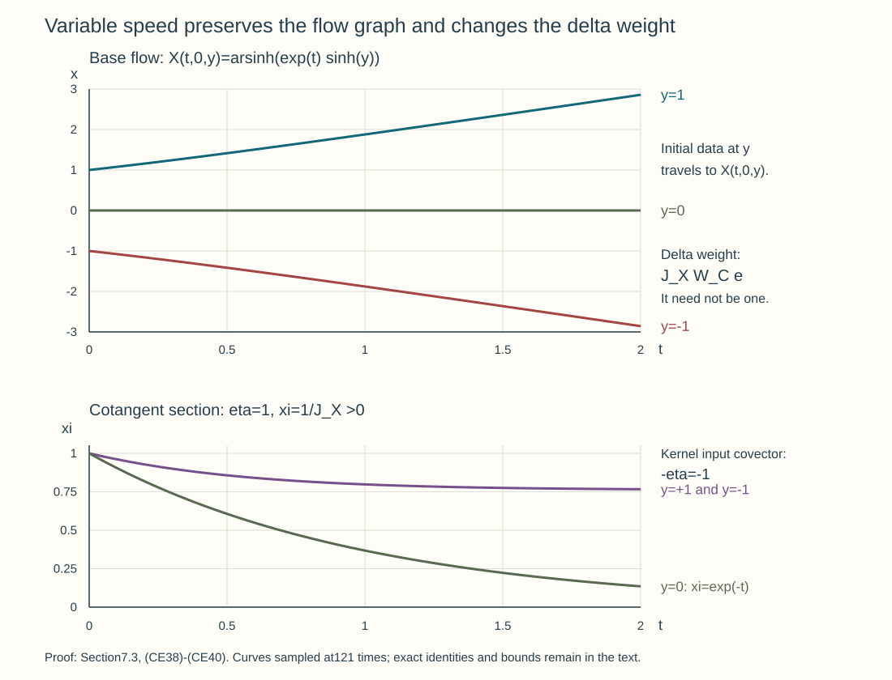

# Oscillatory Cauchy kernels and exact evolution

An oscillatory kernel describes the exact Cauchy evolution of a scalar homogeneous principal direction, including arbitrary complex finite-matrix lower terms. We construct its short-time phase and full ordinary amplitude, normalize the initial kernel, and correct every smooth residual with the ordered evolution. Finite-time composition retains the canonical graph, Maslov data and every wavefront direction, even when one mixed phase no longer covers the graph.

The analytic provider is [First-order systems and ordered evolution](../20261007-restored-first-order-systems/first-order-systems-and-ordered-evolution.md), Sections 1–4, especially (SY13) and (SY18)–(SY29). The exact stationary remainder is Sections 5–6 of [Stationary phase and critical manifolds](../20261004-free-stationary-phase/stationary-phase-and-critical-manifolds.md). We use Sections 2–3 and 5–7 of [Graph operators, continuity and Egorov](../20261005-restored-graph-egorov/graph-operators-continuity-and-egorov.md), Sections 2–3 of One canonical tube along a compact characteristic, Sections 1–9 of [Clean composition of Fourier-integral operators](../20261005-restored-analytic-composition/clean-composition-of-fourier-integral-operators.md), and Sections 6–7 of [Gaussian lines and invariant symbols](../20261005-restored-gaussian-symbols/gaussian-lines-and-invariant-symbols.md). All are written programme proofs; the parameter, support and ordinary lower-term receiving arguments are supplied here. Hörmander III, §23.1, and IV, §§25.2–25.3, provide the Cauchy and graph-calculus mathematical context.

The systems lesson includes the complete [Hilbert coefficient calculus and positivity proof](../20261007-restored-first-order-systems/hilbert-coefficient-calculus-and-positivity.md). Its ordered products, adjoints and global Sobolev bounds apply in particular to the finite matrices here. The [integration and duality companion](../20261005-cauchy-foundations/integration-and-duality.md) proves the Banach integrals, differentiation and density statements used in the correction. The [exact proof map](proof-map.json) records the earlier locators and the complete receiving arguments below; every linked component retains its own notice.

## 1. The equation and derivatives in both evolution parameters

Let \(J\) be a compact time interval and let \(K=\mathbb C^N\). Write
\[
 \mathcal H^s=H^s(\mathbb R^n;\mathbb C^N),\qquad
 P=\partial_t+A(t),\qquad
 a(t,x,\xi)=i b(t,x,\xi)I_N+c(t,x,\xi). \tag{CE1}
\]
Here \(b\) is real and ordinary order one, \(c\) is an arbitrary complex matrix symbol of order zero, and all time derivatives form bounded ordinary symbol families on \(J\). Assume \(b\) has a real homogeneous degree-one principal part \(b_1\), with \(b-\chi_0b_1\in S^0\) for a cutoff \(\chi_0\) zero near zero and one at large frequency. Its uniform bounds and every time derivative are those stated in Section 2. Left quantization and \(D=-i\partial\) retain the course convention. The operator adjoint can differ from pointwise adjoint quantization by an order-zero term.

The Hermitian real parts of \(a\) and \(-a\) are uniformly bounded below, since they are respectively the real parts of \(c\) and \(-c\). The systems theorem therefore gives both time directions, with unique consistent evolution
\[
 U(t,r):\mathcal H^s\longrightarrow\mathcal H^s,\qquad
 U(t,q)U(q,r)=U(t,r),\qquad
 U(r,r)=I. \tag{CE2}
\]
For each real \(s\) one has, after increasing a finite nonnegative constant,
\[
 \|U(t,r)\|_{\mathcal H^s\to\mathcal H^s}
       \leq e^{C_s|t-r|}\qquad(t,r\in J). \tag{CE3}
\]
This is a Sobolev norm estimate. It does not assert operator-norm continuity of the two-parameter family.

We need the initial-time derivative on sufficiently regular vectors. For \(h\in\mathcal H^{s+1}\), the integrated equation and strong coefficient continuity give
\[
 \frac{U(r+\varepsilon,r)h-h}{\varepsilon}
       \longrightarrow -A(r)h\quad\hbox{in }\mathcal H^s. \tag{CE4}
\]
The statement holds from either side because both directions are available. To verify it, write the quotient as the average of
\(-A(q)U(q,r)h\) over the oriented interval from \(r\) to \(r+\varepsilon\). Joint strong continuity of \(U\) at order \(s+1\), boundedness of \(A(q):\mathcal H^{s+1}\to\mathcal H^s\), and strong continuity of its fixed-vector action imply convergence of the integrand in \(\mathcal H^s\).

Integrating the equation from its initial time \(r+\varepsilon\) to \(r\) gives
\[
 U(r,r+\varepsilon)h-h
       =-\int_{r+\varepsilon}^{r}
          A(q)U(q,r+\varepsilon)h\,dq
       =\int_r^{r+\varepsilon}
          A(q)U(q,r+\varepsilon)h\,dq. \tag{CE5}
\]
Thus its quotient tends to \(+A(r)h\). By (CE2),
\[
 U(t,r+\varepsilon)h-U(t,r)h
       =U(t,r)\bigl(U(r,r+\varepsilon)h-h\bigr).
\]
The outer operator is bounded on \(\mathcal H^s\). Hence
\[
 \partial_r U(t,r)h=U(t,r)A(r)h,\qquad
 \partial_t U(t,r)h=-A(t)U(t,r)h, \tag{CE6}
\]
as strong derivatives in \(\mathcal H^s\) for \(h\in\mathcal H^{s+1}\). The final-time derivative also follows directly from the equation. The coefficient belongs on the right in the first formula and on the left in the second.

These formulas imply smooth dependence with a finite spatial-order loss for every finite derivative. More precisely, for a total of \(j\) time derivatives, \(U(t,r)h\) is jointly \(C^j\) in \(\mathcal H^s\) when \(h\in\mathcal H^{s+j}\). Proceed by induction. At a differentiation step (CE6) introduces at most one order-one coefficient; differentiating an existing coefficient introduces a time derivative of an order-one symbol. Uniform mapping bounds control all finite products between the required Sobolev spaces. Joint strong continuity of each product follows by adding its fixed-vector and varying-vector differences, one factor at a time. Thus the derivatives supplied inductively are continuous in both parameters.

For smooth vectors this statement holds at every order. It also holds for a smooth \(\mathcal H^\infty\)-valued parameter family: apply the product rule at any chosen finite Sobolev order, after choosing enough higher spatial orders. No assertion about differentiating \(U\) in operator norm on one fixed \(\mathcal H^s\) is needed.

**Extra spatial orders give norm control.** The coefficient hypothesis implies that \(A(t)\) and every time derivative vary continuously in the norm \(\mathcal H^{q+1}\to\mathcal H^q\). To see this, apply the mean value formula to each of the finitely many symbol seminorms in the proved Sobolev bound; the next time derivative has a uniform bound in those seminorms. The integrated equation, the uniform evolution bound and (CE6) give
\[
 \|U(t+h,t)-I\|_{\mathcal H^{q+1}\to\mathcal H^q}
       \le C_q|h|,\qquad
 \|U(t+h,t)-I+hA(t)\|_{\mathcal H^{q+2}\to\mathcal H^q}
       \le C_q h^2. \tag{CEA1}
\]
Both integrals are oriented when \(h<0\). For the second estimate, subtract \(A(t)\) from \(A(v)U(v,t)\) in the integrated equation. The part \(A(v)-A(t)\) is \(O(|v-t|)\) with one spatial loss; the part \(A(v)(U(v,t)-I)\) has the same bound with two losses by the first estimate at order \(q+1\). Integrating proves the claim.

The composition law moves these estimates to either endpoint of \(U(t,r)\); at the initial endpoint the sign and right factor are those of (CE5)–(CE6). They prove norm differentiability after allowing the additional spatial order, including continuity of each differentiated product. Repeated difference quotients and the coefficient mean value formula prove the corresponding statement for any fixed number of endpoint derivatives, using a sufficiently high finite input Sobolev order. More explicitly, at each step subtract a product by changing one factor at a time; a coefficient difference costs one spatial order, and a difference of an evolution factor is controlled by the first bound in (CEA1). Its derivative remainder is controlled by the second. Finitely many such products occur at each step, so finitely many extra orders suffice. Composing on the right with a family having every output Sobolev order gives norm-smooth parameter families in any prescribed target order. This is the estimate needed for the smoothing correction.

## 2. A homogeneous phase on one short time interval

Make the principal-symbol hypothesis precise. The function \(b_1(t,x,\xi)\) is real, smooth for \(\xi\ne0\), positively homogeneous of degree one, and has uniform ordinary symbol bounds for \(|\xi|\geq1\), including all time derivatives on \(J\). Let \(\chi_0(\xi)\) be zero near zero and one for \(|\xi|\geq2\). Assume \(b-\chi_0b_1\in S^0\), and set \(C=c+i(b-\chi_0b_1)I_N\). The exact full operator is \(i\operatorname{Op}(\chi_0b_1)+\operatorname{Op}(C)\), with \(C\in S^0\). No homogeneous expansion of \(C\) is imposed. Choose the eventual amplitude's bounded-frequency cutoff sufficiently large that all stationary covectors in (CE8) lie where \(\chi_0=1\); its initial low-frequency difference is smoothing.

Let
\[
 \dot X=b_{1,\xi}(q,X,\Xi),\qquad
 \dot\Xi=-b_{1,x}(q,X,\Xi),\qquad
 (X,\Xi)(r)=(y,\eta). \tag{CE7}
\]
The smooth flow and parameter theorem is the one received in Sections 2–3 of One canonical tube along a compact characteristic. Here the uniform global symbol bounds give its entire finite-time domain. Indeed \(|\dot X|\leq C\) and \(|\dot\Xi|\leq C|\Xi|\). Gronwall, also applied with the time direction reversed, gives
\[
 |X(q)-y|\leq C|q-r|,\qquad
 e^{-C|q-r|}|\eta|\leq|\Xi(q)|\leq e^{C|q-r|}|\eta|. \tag{CE8}
\]
The trajectory stays in a bounded spatial ball and a compact annulus away from zero on every finite interval. Local existence can therefore be continued through the interval; a finite endpoint could not leave every compact subset of the coefficient domain. Homogeneity and uniqueness show that \(X\) has degree zero and \(\Xi\) degree one in \(\eta\).

The time-dependent flow is canonical as well. Its variational matrix \(F(q)\) satisfies \(\dot F=J_0\,b_1''(q)\,F\), where \(J_0=\begin{pmatrix}0&I\\-I&0\end{pmatrix}\) in position-frequency coordinates and the symplectic matrix for \(d\xi\wedge dx\) is \(-J_0\). Since \(b_1''\) is symmetric, differentiation gives \(\frac d{dq}(F^T(-J_0)F)=0\). At the initial time \(F=I\), so the whole flow preserves this form. Uniqueness gives its inverse by reversing the endpoints. Positive dilation commutes with it because \(b_1\) has degree one; contracting the form identity with the radial field also preserves the tautological one-form at fixed endpoints. Thus the graph used below is a homogeneous canonical graph, including for a time-dependent Hamiltonian.

For clarity, the uniform derivative bounds needed next are also part of this receiving application. Set \(\lambda=|\eta|\), \(\theta=\eta/\lambda\), and \(\zeta=\Xi/\lambda\). The equations for \((X,\zeta)\) are independent of \(\lambda\); (CE8) confines \(\zeta\) to a fixed compact annulus. Their coefficients and all derivatives are uniformly bounded there, even as \(y\) varies in \(\mathbb R^n\). Differentiating their integral equations gives a linear variational equation for the highest derivative and finite products of already bounded lower derivatives. Gronwall proves every \(y,\theta,t,r\) derivative by induction. Passing from finitely many sphere charts to \(\eta\) derivatives costs \(\lambda^{-1}\) each time. Hence all derivatives of \(X-y\) have degree-zero symbol bounds, and those of \(\Xi\) have degree-one bounds. This argument also proves uniform bounds for the inverse flow.

The variational equation at \(q=r\) has \(X_y=I\) and \(\Xi_y=0\). Its integrated form therefore gives
\[
 \sup_{y,\eta\ne0}\|X_y(t,r,y,\eta)-I\|
       \leq C_1|t-r|. \tag{CE9}
\]
Choose one \(\varepsilon>0\), independent of \(r,y,\eta\), so that the right side is below \(1/2\) when \(|t-r|<\varepsilon\). For fixed \(t,r,\eta\), the map \(y\mapsto X(t,r,y,\eta)\) is globally invertible. To prove surjectivity and uniqueness, write \(X=y+G(y)\); (CE9) makes \(G\) Lipschitz with constant below \(1/2\). The equation \(X=x\) is the contraction equation \(y=x-G(y)\) on the complete space \(\mathbb R^n\). Its unique fixed point depends smoothly on parameters by the inverse-function theorem and the uniform invertibility of \(X_y\). Denote it by \(Y(t,r,x,\eta)\), and put
\[
 \Xi_*(t,r,x,\eta)
       =\Xi(t,r,Y(t,r,x,\eta),\eta).
\]
Implicit differentiation and the preceding estimates give every degree-zero bound for \(Y-x\), and every degree-one bound for \(\Xi_*\), on compact spatial sets. The determinant of \(Y_x=X_y^{-1}\) is positive: it is continuous, never zero and equals one on the diagonal.

Define the action with its moving initial point,
\[
 S(t,r,x,\eta)=Y\cdot\eta+
       \int_r^t\bigl(\Xi(q)\cdot\dot X(q)
                       -b_1(q,X(q),\Xi(q))\bigr)\,dq. \tag{CE10}
\]
The trajectory here starts at \((Y,\eta)\) and ends at \((x,\Xi_*)\). Euler's identity makes the integrand zero, so \(S=Y\cdot\eta\). We keep the action formula to verify all derivatives and their signs. For a variation of a trajectory at fixed integration variable, integration by parts gives
\[
 \delta\!\int(\Xi\cdot\dot X-b_1)\,dq
       =[\Xi\cdot\delta X]_r^t,
\]
since the two interior coefficients are exactly the two equations in (CE7). When the endpoints vary, the resulting boundary terms are \(\Xi_*\cdot dx-b_1(t,x,\Xi_*)dt\) and \(-\eta\cdot dY+b_1(r,Y,\eta)dr\). Adding \(d(Y\cdot\eta)\) cancels the \(dY\) term. Thus
\[
 dS=\Xi_*\cdot dx+Y\cdot d\eta
       -b_1(t,x,\Xi_*)dt+b_1(r,Y,\eta)dr. \tag{CE11}
\]
In particular
\[
 S_x=\Xi_*,\quad S_\eta=Y,\quad
 S_t+b_1(t,x,S_x)=0,\quad
 S(r,r,x,\eta)=x\cdot\eta. \tag{CE12}
\]
The mixed Hessian satisfies \(S_{\eta x}=Y_x\), so it is invertible, with uniform inverse bounds. The phase
\[
 \Phi(t,r,x,y,\eta)=S(t,r,x,\eta)-y\cdot\eta \tag{CE13}
\]
is real, homogeneous and nondegenerate. Its critical equation is \(Y-y=0\); its derivative in \(y\) is \(-I\). On that set its output and input kernel covectors are respectively \(\Xi_*\) and \(-\eta\). It therefore parametrizes exactly the graph of (CE7), with the input reflection convention of the kernel calculus.

On each compact output set all derivatives of \(S\) obey the degree-one phase estimates. More uniformly, \(S-x\cdot\eta=(Y-x)\cdot\eta\) has those bounds globally in \(x\). The short-time construction works in all normalized covector directions at once. It does not require a single generating phase for arbitrary long times.

## 3. Ordered amplitudes and every ordinary remainder

Choose a matrix symbol \(\beta(x,\eta)\in S^0\), with compact base support. Quantize it with fixed compact input localization equal to one near that base support, and a kernel cutoff equal to one near the diagonal; call the resulting proper operator \(B\). The eventual full-kernel application uses \(\beta=\chi(x)I_N\), so \(B\) can be taken to be multiplication by \(\chi\). Bounded-frequency differences are included in the initial smoothing error.

Write \(T(v)\) for the integral with phase (CE13), normalization \((2\pi)^{-n}\), and matrix left amplitude \(v(t,r,x,\eta)\). We now construct \(v\); a homogeneous expansion of the lower coefficient \(C\) would be an unjustified extra hypothesis.

**The full amplitude action.** Acting with \(P\) on the integral, remove \(e^{iS}\) from its output amplitude. The eikonal equation cancels its order-one multiplication term. Its order-preserving transport part is
\[
 \mathcal L v=\partial_tv+w\cdot\partial_xv+d\,v,\qquad
 w=b_{1,\xi}(t,x,S_x),\qquad
 d=C(t,x,S_x)+\frac12\sum_{j,k}
          b_{1,\xi_j\xi_k}(t,x,S_x)S_{x_jx_k}I_N. \tag{CE14}
\]
The remaining full amplitude action, denoted \(\mathcal E\), maps \(S^a\) to \(S^{a-1}\), with all finite differentiated remainder bounds uniform in \(t,r\). Thus the full action is \(\mathcal T=\mathcal L+\mathcal E\), modulo amplitudes of arbitrarily negative order and the separated-support smooth terms handled below.

Here is the precise stationary-phase application proving this statement. For the near-diagonal part of an ordinary symbol \(q\), the amplitude before removing its phase is
\[
 (2\pi)^{-n}\iint
  e^{i((x-z)\cdot\xi+S(z,\eta)-S(x,\eta))}
       q(t,x,\xi)v(t,r,z,\eta)\,dz\,d\xi. \tag{CE15}
\]
Put \(\eta=\lambda\theta\), \(\xi=\lambda\zeta\). The unique critical point is \(z=x,\ \zeta=S_x(t,r,x,\theta)\). Its Hessian in \((z,\zeta)\) is
\[
 \begin{pmatrix}S_{zz}&-I\\-I&0\end{pmatrix};
\]
it has determinant of absolute value one and signature zero, as is seen by replacing \(\zeta\) by \(\zeta-\tfrac12S_{zz}z\) in its quadratic form. The critical value is zero. Bounds (CE8) keep the stationary \(\zeta\) uniformly away from zero. Use a fixed compact neighborhood of that critical point in the normalized variables; all parameters then meet Sections 5–6 of [Stationary phase and critical manifolds](../20261004-free-stationary-phase/stationary-phase-and-critical-manifolds.md).

The symbol-parameter remainder there applies to \(q(t,x,\lambda\zeta)v(t,r,z,\lambda\theta)\) directly. It does not require this amplitude to be classical. Each stationary coefficient loses one \(\lambda\) order. Its full remainder, after any fixed \(\lambda,\theta,x,t,r\) derivatives, loses the prescribed number of orders. Changing back from radial/angular derivatives gives the corresponding ordinary \(\eta\)-symbol estimates.

The first two coefficients can also be read directly by Taylor expansion at \(z=x\). With \(D=-i\partial\), the contribution of \(i b_1\) through order zero is
\[
 i b_1(t,x,S_x)v+
      b_{1,\xi}(t,x,S_x)\cdot\partial_xv+
      \frac12\sum_{j,k}b_{1,\xi_j\xi_k}(t,x,S_x)
                              S_{x_jx_k}v. \tag{CE16}
\]
The full \(C\) contributes \(C(t,x,S_x)v\) through order zero; each of its other coefficients loses at least one order. The time derivative contributes \(iS_tv+\partial_tv\). This proves (CE14) with its sign. The half-density identification agrees with the supporting calculation in Sections 6–7 of [Hamilton fields and subprincipal transport](../20261005-restored-subprincipal-transport/hamilton-fields-and-subprincipal-transport.md); here the full ordinary matrix coefficient remains in its displayed left-multiplication order.

For the coefficient signs in (CE16), put \(z=x+h\), \(\xi=S_x(x,\eta)+\omega\) and \(R(h)=S(x+h,\eta)-S(x,\eta)-S_x(x,\eta)\cdot h\). The Fourier pairing for the bilinear phase \(-h\cdot\omega\), followed by Taylor's formula, gives the finite coefficients
\[
 \sum_\alpha\frac{\partial_\xi^\alpha q(t,x,S_x)}{\alpha!}
   \left.D_h^\alpha\!\left(e^{iR(h)}v(t,r,x+h,\eta)\right)\right|_{h=0}.
 \tag{CEA2}
\]
This formula is read to a finite order with the stationary remainder just proved, not as a convergent infinite series. Since \(R(0)=R_h(0)=0\), the first derivative hits only \(v\). In the second derivative the phase contribution is \(-iS_{x_jx_k}v\). Substituting \(q=i b_1\) therefore gives the positive first-derivative term and positive half-Hessian term in (CE16). Each derivative of \(R\) of order at least two has frequency order one. In a term with \(|\alpha|\ge3\), at most \(\lfloor|\alpha|/2\rfloor\) such factors occur; together with \(\partial_\xi^\alpha b_1\) its order is at most \(1-|\alpha|+\lfloor|\alpha|/2\rfloor\le-1\). The second derivative terms falling only on \(v\) have the same lower order. For \(q=C\), every nonleading term is of order at most minus one relative to \(v\). This proves the stated transport part while keeping all factors of the matrix symbol on the left.

The normalized tails in (CE15) require an estimate as well. On bounded \(\zeta\) away from the critical point, at least one of the \(z,\zeta\) phase gradients has a uniform positive lower bound. The nonstationary integration operator of the stationary-phase lesson gains an arbitrary power of \(\lambda^{-1}\); any fixed parameter derivatives consume only finitely many such powers. For \(|\zeta|\) large, the \(z\) gradient is \(-\zeta+S_z(z,\theta)\), comparable to \(|\zeta|\). Repeated \(z\) integration first makes the \(\zeta\) integral absolutely convergent, including all symbol and parameter derivatives, and gives any required \(\lambda^{-1}\) power. Near \(\zeta=0\), the critical covector is excluded by (CE8); use the same nonstationary argument, separating bounded physical \(\xi\) where necessary. Each such contribution has every prescribed lower symbol order. These estimates justify the compact stationary calculation and its full remainder.

Here are uniform bounds at the two noncompact ends of that calculation. On the compact \(z\) support put \(\psi=(x-z)\cdot\zeta+S(z,\theta)-S(x,\theta)\). There are constants \(0<c<C\) with \(c\le |S_z(z,\theta)|\le C\). Choose a cutoff for \(|\zeta|<c/2\), another for \(|\zeta|>2C+1\), and a remaining compact annular part. On the first part integrate only in \(z\), using
\[
 L_z=\frac{\psi_z\cdot\partial_z}{i\lambda|\psi_z|^2},
 \qquad L_ze^{i\lambda\psi}=e^{i\lambda\psi}.
 \tag{CEA3}
\]
Every differentiated coefficient of its transpose is \(O(\lambda^{-1})\) there. In particular these integrations do not differentiate \(q(t,x,\lambda\zeta)\) in \(\zeta\). All of its required derivatives have at worst a fixed polynomial growth in \(\lambda\), even when the physical frequency \(\lambda\zeta\) is bounded. The compact \(\zeta,z\) integrations and the prefactor \(\lambda^n\) therefore give a bound \(C\lambda^{n+\max(m,0)+a-K+\ell}\) after \(K\) integrations, for \(q\in S^m\), \(m=0\) or \(1\), and \(v\in S^a\). Here \(\ell\) is a fixed nonnegative integer covering the already prescribed parameter derivatives. Increasing \(K\) gives every required negative power.

On \(|\zeta|>2C+1\), the same field and all its \(z\) derivatives have size \(O(\lambda^{-1}\langle\zeta\rangle^{-1})\). The differentiated integrand is bounded by \(C\lambda^{n+m+a-K+\ell}\langle\zeta\rangle^{m-K+\ell}\); choose \(K>n+m+\ell\) for integrability, and increase it further for any desired decay in \(\lambda\). On the remaining compact annulus, outside the fixed critical neighborhood, the full normalized phase gradient is bounded away from zero and the complete nonstationary estimate applies. There \(q(t,x,\lambda\zeta)\) has the usual uniform radial and angular symbol bounds because \(\zeta\) stays away from zero. Each fixed \(\lambda,\theta,x,t,r\) differentiation has only a finite cost in the preceding estimates. Choose \(K\) after those derivative counts; converting radial and angular derivatives to \(\eta\) derivatives proves rapid decrease in every ordinary symbol seminorm. Compact smooth cutoffs justify the integrations first, and the integrable bounds justify removing them. This closes the small-physical-frequency and large-normalized-frequency tails separately.

Every finite stationary coefficient is a differential expression in \(v\) at the same \((x,\eta)\). Its support is therefore inside the closed support of \(v\). Support-preserving symbol sums provide full residual representatives with that same support, modulo \(S^{-\infty}\). All corrections below consequently remain over the fixed transported support of \(\beta\). Separated physical kernel pieces are smooth with the global output bounds proved at the end of this section.

In using such representatives, keep the actual amplitude transform and the summation choice distinct. At a point outside the closed support of \(v\), all of its jets vanish, so every stationary coefficient is zero. Summing these local differential coefficients with frequency cutoffs leaves that same closed support; the complete stationary remainder shows that its difference from the actual transform is \(S^{-\infty}\), with every parameter derivative. At the next correction step this difference remains a smoothing error. A characteristic with initial \((y,\eta)\) outside the support of \(\beta\) stays outside this transported closed support at every intermediate time, so the integral (CE21) vanishes there. Finally the remainder estimate for the actual transform, which is a continuous finite-seminorm estimate, applies to \(v-v^{[j]}\). No continuity of an arbitrary choice of asymptotic summation is required.

**The leading matrix and density.** The characteristic curves of \(w\), with fixed initial \(\eta\), are \(x=X(t,r,y,\eta)\). Put
\[
 \rho(t,r,x,\eta)=\det(Y_x)^{1/2},\qquad
 H=C(t,X,\Xi)-\tfrac12\operatorname{tr}
                       b_{1,x\xi}(t,X,\Xi)I_N. \tag{CE17}
\]
The positive square root is well defined on the short-time interval. Along a characteristic, Jacobi's determinant identity gives
\(\dot\rho=-\tfrac12(\operatorname{div}_x w)\rho\).
The chain rule gives
\[
 \operatorname{div}_x w
  =\operatorname{tr}b_{1,x\xi}
     +\sum_{j,k}b_{1,\xi_j\xi_k}S_{x_jx_k}.
\]
The determinant identity here has a direct finite-dimensional proof. Let \(D=\partial_yX(t,r,y,\eta)\); then \(\dot D=w_xD\). Differentiating the determinant by multilinearity in its rows gives \(\partial_t\det D=(\operatorname{tr}w_x)\det D\): off-diagonal row substitutions have two identical rows and vanish. The determinant is positive on this short interval and \(Y_x=D^{-1}\) along the curve. Differentiating \(\rho=(\det D)^{-1/2}\) gives precisely the displayed negative half-divergence. The inverse and positive square root are legitimate throughout by (CE9).

Thus \(\mathcal L(\rho M)=\rho(\dot M+HM)\). Let
\[
 \dot M=-HM,\qquad M(r,r,y,\eta)=I_N,\qquad
 \dot M^{-1}=M^{-1}H. \tag{CE18}
\]
The ordered finite-matrix existence, inverse and parameter proofs used in GT3–GT8 of Section 7 of [Graph operators, continuity and Egorov](../20261005-restored-graph-egorov/graph-operators-continuity-and-egorov.md) apply to this coefficient along each characteristic. It is uniformly order zero: an \(x\) derivative of the flow frequency costs one \(|\eta|\), canceled by a frequency derivative of \(C\); each \(\eta\) derivative loses one order. The homogeneous scalar correction in \(H\) has the same bounds. The coefficient and every time derivative are uniform on the fixed interval.

For completeness, differentiating the ordered equation gives the highest parameter derivative its same left coefficient \(H\), with forcing equal to finite products of a differentiated \(H\) and lower derivatives of \(M\). Their frequency weights add to the required total negative derivative count. Variation of constants and induction prove every \(S^0\) bound for \(M\). Differentiating \(MM^{-1}=I_N\) gives every inverse bound with the products in their actual order. The undifferentiated estimates are
\[
 \|M\|+\|M^{-1}\|\leq2e^{C|t-r|}. \tag{CE19}
\]
Time and mixed derivatives follow from (CE18). The density \(\rho\) and its inverse are homogeneous order zero, uniformly bounded with all derivatives, by (CE9). Set
\[
 v_0(t,r,x,\eta)
       =\rho(t,r,x,\eta)M(t,r,Y,\eta)\beta(Y,\eta).
                                                        \tag{CE20}
\]
It lies in \(S^0\), solves \(\mathcal Lv_0=0\), and equals \(\beta(x,\eta)\) on the diagonal.

**Correct the full ordinary residual.** Suppose \(v^{[j-1]}=v_0+\cdots+v_{j-1}\) has full residual \(f_j\in S^{-j}\), for \(j\geq1\), with a support-preserving representative as just described. Solve along the same characteristics, with zero initial value,
\[
 v_j(t,r,X,\eta)
  =-\rho(t,r,X,\eta)M(t,r,y,\eta)
       \int_r^t M(q,r,y,\eta)^{-1}
           \rho(q,r,X(q),\eta)^{-1}
           f_j(q,r,X(q),\eta)\,dq. \tag{CE21}
\]
The integral is oriented for \(t<r\). Differentiating in \(t\) proves \(\mathcal Lv_j=-f_j\), with all factors kept in order. Every differentiated integrand has order \(-j\), by the bounds for \(\rho,M\), the homogeneous flow and \(f_j\); the finite integration interval and its endpoint derivatives preserve that order. Hence \(v_j\in S^{-j}\) and \(v_j(r,r)=0\). The new residual is \(\mathcal Ev_j\), modulo \(S^{-\infty}\), and therefore belongs to \(S^{-j-1}\). Starting with \(f_1=\mathcal Ev_0\) proves the induction at every order.

Use parameter-aware support-preserving summation:
\[
 v=v_0+\sum_{j\geq1}(1-\vartheta(\eta/R_j))v_j,\qquad
 v-v^{[j]}\in S^{-j-1}. \tag{CE22}
\]
Here \(\vartheta\) equals one near zero. Choose increasing radii to bound the first \(j\) spatial, frequency and time-parameter derivatives of the \(j\)-th tail in order \(-j+1\) by \(2^{-j}\). Compact parameter sets and the one common spatial support supply these seminorms; a diagonal choice treats all derivatives. For every fixed order the high-index tails are summable in that order, while the finitely many bounded-frequency differences are smoothing. These estimates prove every asserted differentiated remainder. The radii are independent of \(t,r\), so every correction still vanishes on \(t=r\).

The full amplitude action is order preserving after eikonal cancellation. For every \(j\), applying its finite differentiated remainder bounds to \(v-v^{[j]}\), and using the already corrected partial residual, shows that \(\mathcal Tv\in S^{-j-1}\). Thus the actual residual is smoothing to every order. This is an asymptotic sum in decreasing ordinary symbol orders; neither a homogeneous lower-symbol expansion nor convergence of an operator Neumann series is asserted.

**Proper localization and the global output estimate.** The input base support of \(\beta\) is compact. Bounds (CE8) place all transported amplitude supports in one compact output set for the whole short-time parameter domain. Multiply by an input cutoff equal to one near that initial compact set and retain a near-diagonal proper representative of \(B\). When \(y\) is outside that set, the phase gradient \(\Phi_\eta=Y-y\) is bounded away from zero on the amplitude support. Integration by parts gives a smooth discarded kernel, with every derivative and arbitrarily high inverse-frequency gain. The resulting \(V=T(v)\), with this input cutoff, has compact support in both spatial variables and is uniformly order-zero graph bounded on every Sobolev scale by Sections 3 and 5 of the graph lesson. Smooth-vector parameter differentiation gives finite-order graph operators, and strong continuity follows from the same finite-seminorm bounds and density.

At the initial slice the phase is exactly \((x-y)\cdot\eta\), and the amplitude is \(\beta\) modulo the fixed bounded-frequency cutoff. Therefore \(V(r,r)-B=S(r)\) has a compact smooth kernel, with every parameter derivative.

Inside a slightly larger compact output set, the full amplitude calculation makes \(PV\) a smooth kernel with all parameter derivatives. Outside it, only the nonlocal tail of \(A V\) remains. The kernel of a uniform ordinary PDO, away from its spatial diagonal, has bounds
\[
 |\partial_x^\alpha\partial_z^\gamma K_A(x,z)|
       \leq C_{\alpha\gamma L}|x-z|^{-L}
       \quad(|x-z|\geq\delta>0),                         \tag{CE23}
\]
for every \(L\): integrate the Fourier kernel by parts in \(\xi\) enough times that the differentiated order-one symbol is integrable, and then enough additional times to obtain the prescribed spatial power. The same proof includes all time derivatives. Here \(z\) ranges in the compact output support of \(V\). In the resulting \(z\) integral, \(S_z\) is comparable to \(|\eta|\) by (CE8). Repeated \(z\) integration gains arbitrary inverse powers of \(|\eta|\); (CE23) simultaneously retains arbitrary decay in the exterior \(x\). Each fixed \(x,y,t,r\) derivative consumes only finitely many such powers. Consequently the complete residual \(R=PV\) has a kernel rapidly decreasing in \(x\), compactly supported in \(y\), with all differentiated bounds.

These are genuine global output estimates. Fourier transformation and integration by parts in both spatial variables make the residual kernel's two-frequency transform rapidly decreasing. Cauchy–Schwarz with Sobolev weights then proves \(R(t,r)\chi:H^{-M}\to H^k\) for every \(M,k\), and the same bound for every parameter derivative; it also applies to \(S(r)\chi\). Smooth dependence in these norms follows by the same estimates applied to Taylor's parameter remainder. Thus \(S,R\) satisfy exactly the correction hypothesis below.

The reduced graph symbol in the natural symplectic half-volume frame is
\[
 v_0|\det S_{x\eta}|^{-1/2}=M(t,r,Y,\eta)\beta(Y,\eta),
                                                        \tag{CE24}
\]
since \(|\det S_{x\eta}|^{1/2}=\rho\). This is the density conversion proved in Section 2 of the graph lesson. Where \(\beta\) has an order-zero inverse, (CE19) and the derivative estimates give every inverse bound for this symbol. It is elliptic in the ordinary symbol sense; pointwise invertibility alone has not been substituted for ellipticity.

## 4. Exact correction of a smoothing residual

Fix an ordinary order-zero matrix operator \(B\), bounded on every \(\mathcal H^s\). A compactly localized conic test is the eventual application. Suppose a constructed family \(V(t,r)\) has the following **precise** properties on a neighborhood of the diagonal in \(J^2\):

1. \(V(t,r)\) is strongly continuous \(\mathcal H^s\to\mathcal H^s\), for every real \(s\), with uniform bounds on compact parameter sets. On smooth vectors it is differentiable in \(t\), and its equation is consistent on the full Sobolev distribution scale.
2. The initial family and the residual are
\[
 V(r,r)=B+S(r),\qquad
 (\partial_t+A(t))V(t,r)=R(t,r). \tag{CE25}
\]
3. For every \(\chi\in C_c^\infty(\mathbb R^n)\), every nonnegative integer \(M\), and every real \(k\), the operators
\[
 S(r)\chi,\quad R(t,r)\chi:
       \mathcal H^{-M}\longrightarrow\mathcal H^k \tag{CE26}
\]
are bounded and depend smoothly on the displayed parameters in these operator norms. All finite parameter derivatives obey the same bounds on compact parameter sets.

Condition 3 includes the global output norm needed by the energy correction. A smooth kernel known only locally in its two spatial variables need not have it. In the oscillatory construction, proper spatial localization and the off-diagonal symbol estimates must prove this condition, rather than silently identify every locally smooth kernel with a global Sobolev smoothing operator.

For compactly supported \(\phi\in\mathcal H^s\), initially take smooth data and put
\[
 W(t,r)\phi=V(t,r)\phi-U(t,r)S(r)\phi
       -\int_r^t U(t,q)R(q,r)\phi\,dq. \tag{CE27}
\]
Choose one compactly supported \(\chi\) equal to one on the data support. Condition (CE26) supplies all the needed bounds for \(S(r)\phi\) and \(R(q,r)\phi\). The integral is Bochner in any desired output Sobolev space. For \(t<r\), the integral is oriented; its sign is already contained in the limits. A conclusion for arbitrary globally supported data would additionally require the corresponding global smoothing bounds.

The exact Duhamel verification in the systems lesson shows that applying \(P\) to the last integral gives \(R(t,r)\phi\). The middle term is homogeneous. At \(t=r\), the integral vanishes, and (CE25) cancels \(S(r)\phi\). Consequently
\[
 P W(\,\cdot\,,r)\phi=0,\qquad
 W(r,r)\phi=B\phi. \tag{CE28}
\]
By uniqueness in the systems theorem, \(W(t,r)\phi=U(t,r)B\phi\). Density and the uniform Sobolev bounds extend the identity to every compactly supported datum in its applicable \(\mathcal H^s\). Every compactly supported distribution has some finite negative Sobolev order: its finite distributional order bounds its Fourier transform by a polynomial, and a sufficiently negative weighted square integral is finite. Thus
\[
 U(t,r)B-V(t,r)
       =-U(t,r)S(r)
          -\int_r^t U(t,q)R(q,r)\,dq \tag{CE29}
\]
is an identity on all compactly supported distributional data. A statement that only \(PV\) is smoothing would have missed the independent initial correction \(S\).

Here is the full kernel regularity conclusion. Let \(\chi\) have compact support. The right side of (CE29), after right multiplication by \(\chi\), maps \(\mathcal H^{-M}\) into \(\mathcal H^k\) for every \(M,k\). Indeed its norm is bounded by the uniform \(\mathcal H^k\) evolution bound times the smoothing norms in (CE26), with the length of the time interval for the integral. Increasing \(k\) arbitrarily retains the bound; no derivatives are charged to the original datum beyond its one fixed finite negative order.

To see that these bounds give an actual jointly smooth spatial kernel, consider the column data \(\chi(y)\delta_y e_\ell\), \(1\leq\ell\leq N\). A localized map \(y\mapsto\delta_y\) is \(C^m\) into \(H^{-M}\) whenever \(M>n/2+m\). Its derivative of order \(\alpha\) is \((-1)^{|\alpha|}\partial_x^\alpha\delta_y\); Fourier differentiation and the integrability of \(\langle\xi\rangle^{-2M+2|\alpha|}\) prove the assertion, including difference quotients by dominated convergence. For any prescribed finite number of \(y\) derivatives, choose such an \(M\) and apply (CE29). Its output is \(C^m\) in \(y\), with values in every \(\mathcal H^k\).

For a prescribed number \(d\) of \(x\) derivatives, choose \(k>n/2+d\). Fourier Cauchy–Schwarz gives continuous evaluation of all those derivatives in \(x\); the integrability of \(\langle\xi\rangle^{-2k+2d}\) proves the bound. It also gives their continuity in \(x\), by dominated convergence of the Fourier integral. Since \(m,d\) were arbitrary, the columns define a smooth kernel in \((x,y)\).

This is the distribution kernel of the operator, not merely a family of point tests. For a compactly supported smooth input \(\phi\), its vector distribution is the Bochner integral of \(\delta_y\phi(y)\) in a sufficiently negative Sobolev space. Fourier testing verifies the identity. Applying the bounded smoothing operator commutes with that integral, giving the kernel action. The resulting identity extends to compact distributions by continuity. We have proved
\[
 K_{U(t,r)B}-K_{V(t,r)}
       \in C^\infty(\mathbb R^n_x\times\mathbb R^n_y)
       \quad\hbox{locally in }y. \tag{CE30}
\]
No assumption of exact proper support for \(U\) is hidden here. A nonlocal smoothing part of \(A\) can create smooth spatial tails in the exact evolution.

The kernel is smooth in \(t,r\) as well. For the first term of (CE29), all parameter derivatives of \(S(r)\chi\) have arbitrarily high spatial output regularity; (CE6) and its inductive derivatives consume only finitely many of those orders. For the integral, an \(r\) derivative differentiates \(R(q,r)\) and its lower endpoint:
\[
 \partial_r\!\int_r^t U(t,q)R(q,r)\chi\,dq
   =-U(t,r)R(r,r)\chi
     +\int_r^t U(t,q)\partial_rR(q,r)\chi\,dq. \tag{CE31}
\]
A \(t\) derivative differentiates the upper endpoint and \(U(t,q)\); (CE6) applies to its smoothing output. Repetition gives only finite sums of smoothing endpoint terms and Bochner integrals with arbitrarily high output order. The uniform bounds allow every differentiation by difference quotients and dominated convergence. The preceding \(\delta_y\) argument then proves smoothness of the kernel jointly in all four variables, up to one-sided derivatives at endpoints of \(J\).

All the differentiations in this last paragraph also hold in the smoothing operator norms required by (CE26). Fix the input order and any finite number of parameter derivatives first. Estimate (CEA1) and its repeated-product consequence control the evolution difference quotients between sufficiently separated Sobolev orders. The factors \(S\) and \(R\), with their parameter derivatives, map the one fixed input order to those arbitrarily high intermediate orders. Their norm-smoothness then bounds the product remainders uniformly in the input unit ball. For the integral, the same bounds give one norm-integrable majorant on its finite interval; difference quotients split into the common interval and its two endpoint pieces, yielding (CE31) and its iterates. Thus no fixed-space operator-norm continuity of \(U\), and no exchange of an uncontrolled strong limit with an input supremum, is being assumed.

## 5. The exact local graph and its symbol

The family \(V(t,r)\) constructed in Sections 2–3 is an ordinary order-zero Fourier-integral family on the canonical graph of the Hamilton flow of \(b_1\), localized by \(B\). Formula (CE30) therefore identifies the exact localized evolution with this kernel modulo a jointly smooth kernel. Its reduced symbol is (CE24), with all ordinary inverse bounds wherever the initial symbol is elliptic. This is an actual construction with the initial and global-output estimates required for correction.

The kernel covector convention is
\[
 C_{t,r}'=
 \bigl\{(x,\xi;y,-\eta):
             (x,\xi)=\kappa_{t,r}(y,\eta)\bigr\}. \tag{CE32}
\]
The sign on the input covector is the kernel sign. The Hamilton flow itself sends \((y,\eta)\) to \((x,\xi)\), without that minus sign. The graph-operator calculus supplies containment. Its proved two-sided elliptic inverse and the actual inverse-symbol bounds of Section 3 supply the converse; the full matching argument is given in Section 6. A mere class membership statement would not establish that converse.

The phase sign, full ordinary matrix transport, every differentiated residual, initial normalization and global smoothing bounds have been proved above. We next assemble them over the finite time interval using actual graph composition. The scalar-principal matrix hypothesis in (CE1) remains explicit throughout.

## 6. Assemble the exact graph over a finite time interval

For every short interval, Section 3 constructs \(V\) with the initial and residual bounds of Section 4. Consequently
\[
 U(t,r)B=V(t,r)+Q(t,r), \tag{CE33}
\]
where \(Q\) has a jointly smooth kernel and every localized input-to-global-output smoothing estimate proved there. This already proves that the exact localized evolution is an order-zero graph FIO. Where \(\beta\) is elliptic its reduced symbol is (CE24), modulo one lower order. The matrix inverse bounds proved there are essential for the next equality statement.

We explain finite-time assembly on full compact input sets, so directions on the covector axes are not missed by an angular-only argument. Choose \(B_0=\chi(y)I_N\), with \(\chi\) compactly supported. The preceding short-time construction works in all directions of the unit sphere. Divide the interval between \(r\) and \(t\) into finitely many pieces shorter than \(\varepsilon\), in its actual time direction. Fix this division on a slightly larger parameter neighborhood when smooth dependence on the two endpoints is needed. Denote intermediate times by \(t_j\).

Inductively suppose
\[
 U(t_j,r)B_0=F_j+Q_j, \tag{CE34}
\]
where \(F_j\) is a compactly supported order-zero FIO for \(\kappa_{t_j,r}\), and \(Q_j\) maps compact-input distributions into every global Sobolev order, with the corresponding parameter bounds. At the first step this is (CE33).

Choose a compact multiplication cutoff \(B_j\) equal to identity near the entire output support of \(F_j\), uniformly on the fixed parameter neighborhood. Then \(B_jF_j=F_j\) exactly. Apply (CE33) to the next short step and this \(B_j\). Writing \(U_j=U(t_{j+1},t_j)\), we obtain
\[
 U(t_{j+1},r)B_0
   =U_jB_jF_j+U_jQ_j
   =V_jF_j+Q'_jF_j+U_jQ_j.
\]
Set \(F_{j+1}=V_jF_j\). Both factors are proper with compact spatial supports. Their graphs match at exactly one intermediate covector, so the proved clean composition theorem has excess zero and gives an order-zero FIO for
\(\kappa_{t_{j+1},t_j}\circ\kappa_{t_j,r}=\kappa_{t_{j+1},r}\).

The other two terms have the asserted full smoothing bounds. For \(Q'_jF_j\), proper order-zero graph mapping first sends a compact-input \(H^{-M}\) datum into \(H^{-M}\) on a fixed compact intermediate support; the \(Q'_j\) bounds then send it into arbitrary \(H^k\). Parameter derivatives of \(F_j\) have only finite order, absorbed by choosing a sufficiently low intermediate Sobolev order before using the smoothing estimate. For \(U_jQ_j\), the uniform evolution bound at every output order preserves arbitrary smoothing; its time-parameter derivatives consume only finitely many of the available orders. The delta-column proof of Section 4 turns these bounds into a jointly smooth kernel for the new error. This completes the induction, including both time orientations.

At each composition the principal symbols are multiplied in their actual bundle-map order, with the compatible Maslov factors and half densities contracted by the proved composition law. Every step begins with the identity phase frame. Subsequent phase changes use the Gaussian/Maslov transition law of the programme. There is no assertion that one mixed generating phase exists through a long-time caustic, or that a closed Hamilton orbit has trivial Maslov holonomy. A finite sequence of compatible graph representations supplies the complete class.

All intermediate supports are compact: the amplitude constructions and the finite sequence give that assertion directly, while (CE8) confines the canonical base images of the initial compact set. Frequency lengths along the whole finite trajectory remain comparable by (CE8). The graph relation is closed in the full punctured product cotangent space and has no limiting point on either axis. Indeed normalize the input covector; over a compact input base set its direction lies on the compact unit sphere, and its output length stays between the two positive bounds in (CE8). A convergent base/covector sequence therefore has its limit on the same continuous graph.

We now prove every graph wavefront direction, rather than infer equality from membership in a class. At any prescribed initial covector choose \(\chi=1\) near its base point. All intermediate multiplication cutoffs are one on the matched supports. The leading graph symbol of \(F_j\) is therefore a product of the invertible ordered transport matrices in their compatible symbol frames. Their inverse symbols satisfy the order-zero bounds on the fixed cone: each finite product preserves those bounds, with the inverse factors in reverse order. Thus the graph parametrix theorem of Section 6 of the graph lesson gives a local inverse near the specified matched point.

If the kernel of \(F_j\) lacked that graph wavefront direction, shrink its input and output cones to isolate the unique matching point. The wavefront composition bound with that inverse would then omit the corresponding diagonal direction. But their product equals the identity modulo smoothing there, and the identity kernel has every nonzero diagonal direction: its local Fourier transform in the normal coordinate \(x-y\) is a nondecaying constant. This is a contradiction. Since \(Q_j\) is smooth, it cannot remove a direction of \(F_j\). Containment was already supplied by the kernel class. Varying the input cutoff gives the complete matrix-kernel statement
\[
 \operatorname{WF}(K_{U(t,r)})
   =\{(x,\xi;y,-\eta):(x,\xi)=\kappa_{t,r}(y,\eta),
                                  \ \eta\ne0\}. \tag{CE35}
\]
For completeness, the identity-kernel statement also holds for arbitrary cutoffs, not just product cutoffs. In coordinates \(v=x-y\), \(w=y\), multiplying \(\delta(v)\) by a cutoff \(a(v,w)\) nonzero at \((0,w_0)\) gives \(\delta(v)a(0,w)\). Its Fourier transform is \(\widehat{a(0,\cdot)}(\omega)\), independent of the normal frequency \(\nu\). Fourier inversion supplies some fixed \(\omega\) where this is nonzero, because \(a(0,w)\) is not identically zero. Along \((\nu,\omega)=(R\nu_0,\omega)\), \(R\to\infty\), the transform cannot decrease rapidly; this sequence lies in every sufficiently large part of a cone about \((\nu_0,0)\). Conversely, the Schwartz decay in \(\omega\) proves rapid decrease in cones avoiding that normal bundle. The linear coordinate change sends \((\nu_0,0)\) to \((\nu_0,-\nu_0)\). This proves every nonzero diagonal direction for every such cutoff, as required in the inverse contradiction.

The wavefront set of a matrix kernel is the union of its entries' wavefront sets; it is not asserted that every entry has every direction.

For compactly supported vector data this also gives exact spatial propagation. Containment follows from the graph mapping theorem after (CE34). For the converse, use the reversed evolution \(U(r,t)\). The forward construction writes the solution as a compact-output graph action plus a global \(H^\infty\) correction. The reversed evolution preserves the latter smooth term by its bounds at every Sobolev order. It acts on the compact-output graph term by its reversed graph construction. Applying its wavefront containment to the identity \(U(r,t)U(t,r)\phi=\phi\) proves the reverse inclusion. Hence
\(\operatorname{WF}(U(t,r)\phi)=\kappa_{t,r}(\operatorname{WF}\phi)\)
for compactly supported distributional data. This argument uses the global regularity of the correction; merely knowing its kernel is locally smooth would not justify the reversal on its possibly noncompact spatial tail.

The result proved here has a scalar homogeneous principal direction and arbitrary ordinary finite-matrix order-zero lower terms. General Hermitian matrix principal symbols with separated branches or crossings still require their own diagonalization/projector and polarization constructions. Those remain part of the unfinished full course; the present analytic and oscillatory construction is not substituted for them.

## 7. Examples and exercises with complete solutions

### 7.1. A smooth initial defect that the equation cannot see

Let \(A(t)=0\) and let \(S\) be a nonzero smooth-kernel operator with compact support in both spatial variables. Take \(B=I\) and \(V(t,r)=I+S\). Compute the residual, the exact evolution and the necessary correction.

**Solution.** Here \(U(t,r)=I\), \(PV=0\), and \(R=0\). However \(V(r,r)=I+S\). The residual correction alone would leave the wrong initial datum. Formula (CE29) gives \(U-V=-S\), so \(W=V-US=I\). Every Sobolev mapping condition for \(S\) follows by repeated differentiation of its compact smooth kernel and Fourier decay. Thus this example satisfies the lemma exactly and demonstrates why the initial smoothing term must be retained. ∎

### 7.2. Noncommuting coefficients and the initial-time derivative

On \(\mathbb C^2\), let the bounded time coefficient be \(C_1\) on one interval and \(C_2\) on a later interval. Work away from the junction, or replace the switch by smooth pulses with disjoint time supports and the same pulse integrals. Suppose
\[
 C_1=\begin{pmatrix}0&1\\0&0\end{pmatrix},\qquad
 C_2=\begin{pmatrix}0&0\\1&0\end{pmatrix}.
\]
For constant pieces of lengths \(a,b\), compute the evolution product and compare \(U C_1\) with \(C_1U\). Explain the order in (CE6).

**Solution.** The later interval acts last, so
\[
 U=e^{-bC_2}e^{-aC_1}
   =(I-bC_2)(I-aC_1)
   =\begin{pmatrix}1&-a\\-b&1+ab\end{pmatrix}. \tag{CE36}
\]
The nilpotent squares vanish. For smooth disjoint pulses the same expression holds with \(a,b\) their integrals, since within each pulse the coefficient is one fixed matrix times a scalar function. Direct multiplication gives
\[
 UC_1=\begin{pmatrix}0&1\\0&-b\end{pmatrix},\qquad
 C_1U=\begin{pmatrix}-b&1+ab\\0&0\end{pmatrix}. \tag{CE37}
\]
They differ when \(b\ne0\). Moving the initial time within the first piece differentiates the rightmost factor, giving \(+UC_1\), exactly as (CE6). Moving the final time within the later piece gives \(-C_2U\). Each coefficient is ordinary order zero, so the full two-sided systems theorem applies; this finite model does not assert that an arbitrary forward accretive order-one system can be reversed. ∎

### 7.3. Variable speed, the covector sign and the delta weight

Consider on \(\mathbb R\), with \(N\) components,
\[
 \partial_tu+\tanh(x)\partial_xu+C(t,x)u=0, \tag{CE38}
\]
where \(C\) is a smooth bounded matrix multiplication coefficient with all spatial and time derivatives bounded on the finite interval. Compute the exact phase, ordered amplitude and cotangent flow. For delta data at \(y_0\), retain the actual delta coefficient. Explain the half-density factor in the general construction.

**Solution.** Put \(d=t-r\). Solving \(\dot X=\tanh X\) by differentiating \(\sinh X\) gives
\[
 X(t,r,y)=\operatorname{arsinh}(e^d\sinh y),\qquad
 Y(t,r,x)=\operatorname{arsinh}(e^{-d}\sinh x),\qquad
 J_X=\partial_yX=\frac{e^d\cosh y}{\cosh X}>0. \tag{CE39}
\]
Both maps exist for every finite positive or negative \(d\). The base displacement is bounded by \(|d|\), since \(|\tanh X|\leq1\). The covector equation is \(\dot\Xi=-\operatorname{sech}^2(X)\Xi\), so \(\Xi=\eta/J_X\). Equivalently
\(\Xi=e^{-d}\eta\cosh X/\cosh y\), which is the inverse transpose of the full base derivative. The phase is \(S=Y(x)\eta\), with input kernel covector \(-\eta\).

Along the characteristic starting at \(y\), let \(W_C\) solve the ordered equation
\(\dot W_C=-C(q,X(q,r,y))W_C,\ W_C(r)=I_N\).
Its inverse and all derivatives have the finite-interval bounds already proved. Set \(W(t,r,x)=W_C(t,r,Y(t,r,x))\). The exact solution and kernel are
\[
 u(t,x)=W(t,r,x)\phi(Y(t,r,x)),\qquad
 K_U(t,r,x,y)=W(t,r,x)\delta(y-Y(t,r,x)). \tag{CE40}
\]
Differentiate along each characteristic to verify the equation and initial trace, keeping \(C W_C\) in its displayed order. This differential operator has no higher oscillatory remainder; the phase and the frequency-independent amplitude \(W\) give its exact integral. The two-sided energy theorem and smooth approximation extend the identity to the Sobolev distribution scale.

Here \(b_1=\tanh(x)\xi\), so \(b_{1,\xi\xi}=0\) and the left-amplitude transport equation is exactly
\(\partial_tW+\tanh(x)\partial_xW+CW=0\).
Nevertheless its reduced graph symbol is not simply that left amplitude. The density is \(\rho=J_X^{-1/2}\), while the ordered coefficient in (CE17) is
\(H=C-\tfrac12\operatorname{sech}^2X\,I_N\).
The scalar part commutes with the matrix coefficient, giving \(M=J_X^{1/2}W_C\) along the curve. Consequently \(\rho M=W_C\), precisely the left amplitude in (CE40), and the reduced graph coefficient is \(W/\rho\). This checks the sign of the density correction without assuming that \(C\) commutes with itself at different times.

For \(\phi=e\,\delta_{y_0}\), where \(e\in\mathbb C^N\) is nonzero, the one-dimensional delta change gives
\[
 u(t,x)=J_X(t,r,y_0)\,W_C(t,r,y_0)e\,
                  \delta(x-X(t,r,y_0)).
\]
The Jacobian factor is required: \(\delta(Y(x)-y_0)=J_X\,\delta(x-X(y_0))\). Its derivative agrees with the amplitude equation for a moving delta, since \(\dot J_X=\operatorname{sech}^2(X)J_X\). Invertibility of \(W_C\) prevents the vector coefficient from vanishing. Thus both nonzero spatial covector directions occur at the front, and the exact one-dimensional Sobolev threshold is \(s<-1/2\). When \(C=0\), the delta weight is \(J_X\), not one. ∎

The two panels show (CE39) for \(r=0\), \(0\leq t\leq2\) and \(y=-1,0,1\). The upper panel uses the exact base positions; the lower uses the exact cotangent section \(\eta=1,\ \xi=1/J_X\). They are positive covectors throughout, while the kernel input covector is \(-1\). For delta data the weight is \(J_X W_Ce\), as proved above; the plotted curve describes its position, not a unit delta weight. The center front remains at \(x=0\), although its cotangent length decreases as \(e^{-t}\).

The elementary functions in the last example can be fixed without an additional inverse-function assumption. Define \(\sinh x=(e^x-e^{-x})/2\) and \(\cosh x=(e^x+e^{-x})/2\). The exponential laws give \(\cosh^2x-\sinh^2x=1\) and \(\cosh x>0\); hence \(\sinh\) is strictly increasing, with limits of opposite sign and unbounded magnitude at the two ends. It has a smooth real inverse \(\operatorname{arsinh}\), with derivative \(1/\sqrt{1+z^2}\), by the earlier inverse theorem. These facts justify both inverse identities in (CE39). Since \(0<\operatorname{sech}^2X\le1\), integration of \(\dot J_X=\operatorname{sech}^2(X)J_X\) gives \(1\le J_X\le e^t\) for the plotted case \(r=0,t\ge0\), hence \(e^{-t}\le\xi=1/J_X\le1\). At \(y=0\), \(X=0\) and \(\xi=e^{-t}\); the two outer covector curves agree because \(\cosh\) is even. The numerical samples illustrate these exact proved inequalities.

References: Lars Hörmander, *The Analysis of Linear Partial Differential Operators III*, Springer, §23.1; *The Analysis of Linear Partial Differential Operators IV*, Springer, §§25.2–25.3, including the natural graph half-density and Theorem 25.3.1. These references give mathematical context and attribution. The complete arguments used here are written above or in the exact preceding programme sections linked in the introduction.

*Written by GPT-6.1 Sol (OpenAI), Ultra; restoration and additional receiving proofs by GPT-6 Astra (OpenAI), Ultra, October 2026. Self-checked by the writing AI. Original text and figure: CC0-1.0; linked components retain their own terms.*
