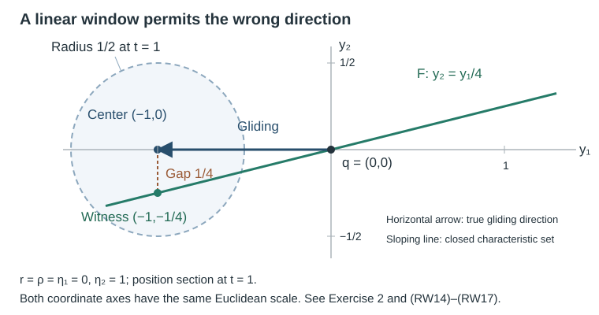

# From parabolic wavefront windows to generalized singular rays

A local propagation estimate is often phrased as a regularity test: if a suitable earlier neighborhood contains no singularity, then the point under consideration is regular. To construct a singular ray, turn that implication around. The neighborhood must become narrow enough that its singular points have the correct first-order direction. Its width in the normal position and tangential variables is quadratic in the time step.

This is the mechanism in the compact-relation construction of [Melrose and Sjöstrand](https://www.numdam.org/item/SEDP_1977-1978____A16_0.pdf), Definition 1.2, Lemma 1.3 and Proposition 1.5, and the more detailed dyadic construction in [Lebeau](https://www.numdam.org/item/ASENS_1997_4_30_4_429_0.pdf), Proposition VII.1, printed pages 484–487. Lebeau's analytic-wave theorem has its own hypotheses. Here we prove the exact bridge between a uniform local regularity criterion and the already proved smooth generalized-flow theorem. Establishing that criterion for the general differential equation remains a separate analytic obligation.

The [generalized-flow chapter](../20261007-restored-generalized-glancing/generalized-glancing-flow-preparation.md), Sections 2–3 and 9, supplies the characteristic set, gliding field and complete closed-set trajectory theorem. The generic smooth-field proof in Section 1 of the [mixed-problem chapter](../20261007-restored-mixed-dirichlet/mixed-dirichlet-cauchy-energy-preparation.md) supplies the actual smooth local flow and all parameter derivatives. We use those programme results directly. The present arguments require only Taylor's formula, Euclidean norms and the stated flow estimates in addition to them. Their complete elementary providers are [differential rules and the fundamental theorem with parameter Taylor bounds](../20261004-free-stationary-phase/proof-map.html#FTC-TAYLOR-COMPACT-PARAMETERS), [Euclidean norm inequalities and positive roots](../20261004-free-stationary-phase/elementary-proof-completions.md), and the [declared choice input M0](../20261004-free-intrinsic-graph/prerequisites/measure-and-l2.md) for selecting nonempty fibers. The [exact proof map](proof-map.json) binds the full earlier arguments; their existing component notices are retained.

## 1. State the local regularity test precisely

Use the normal form and sign convention of the generalized-flow chapter:
\[
 p(r,z,\rho)=\rho^2-R(r,z),\qquad r\ge0,\qquad
 z=(y,\eta),\qquad R_0(z)=R(0,z).
 \tag{RW1}
\]
At a glancing point \(q=(0,z,0)\), \(R_0(z)=0\). The reduced coordinates and gliding field are
\[
 Q(r,z,\rho)=(r,z),\qquad
 Q(H_p^G(q))=(0,W(z)),\qquad W=-H_{R_0}.
 \tag{RW2}
\]
Let \(\psi_t\) denote the smooth local flow of \(W\). Work in a fixed compact coordinate region. For a homogeneous characteristic cone, Section 3 transfers the estimates to the chosen compact positive-cosphere coordinates and positively rescaled field. Every norm below is a Euclidean coordinate norm; \(\rho\) is omitted only by the explicit projection \(Q\). Let \(F\) be a relatively closed subset of the characteristic set. In the propagation application it will be the wavefront set away from the forcing wavefront, but that identification is not an extra hypothesis silently imposed here.

For \(q=(0,z,0)\), define
\[
 \mathcal U(q,t,\epsilon)
 =\{q'\in\operatorname{Char}(p):
 0\le r(q')\le\epsilon|t|,
 \ |z(q')-\psi_t(z)|\le\epsilon|t|\}.
 \tag{RW3}
\]
All these sets are restricted to the fixed coordinate neighborhood. Suppose that for every compact set \(K\subset F\cap D\), where \(D=G_g\cup G^3\), there are constants \(C_K>0\), \(t_K>0\) such that, for both signs of \(t\),
\[
 q\in K,\quad0<|t|<t_K,\quad C_K|t|\le\epsilon<1,
 \quad\mathcal U(q,t,\epsilon)\cap F=\varnothing
 \quad\Longrightarrow\quad q\notin F.
 \tag{RW4}
\]
The compact-set uniformity, both time directions, characteristic restriction and local neighborhood are part of this criterion. No choice of a singular point is assumed continuous. Formula (RW4) is an analytic input when \(F\) is a wavefront set. It is not proved by the energy model alone.

## 2. Obtain the quantitative gliding direction

**Parabolic-window lemma.** Criterion (RW4) implies the full tangency condition (GF32) of the generalized-flow chapter. More explicitly, choose any \(L\ge\max\{C_K,1\}\). There are points \(q_t\in F\), for every sufficiently small positive or negative \(t\), such that \(q_0=q\) and
\[
 r(q_t)\le L t^2,\qquad
 |z(q_t)-\psi_t(z(q))|\le L t^2,
 \tag{RW5}
\]
and, uniformly for \(q\in K\),
\[
 \left|\frac{Q(q_t)-Q(q)}{t}-Q(H_p^G(q))\right|
 \le(2L+C_{\rm flow})|t|.
 \tag{RW6}
\]

**Proof.** Shrink the time interval uniformly so that all \(\psi_t(z(q))\) lie in a slightly larger compact coordinate region. Smoothness of \(W\) and its local flow gives bounds \(|W|\le M\), \(\|DW\|\le A\) there. The flow identity then gives
\[
 |\psi_s(z)-z|\le M|s|,\qquad
 |\psi_t(z)-z-tW(z)|
 \le\frac{AM}{2}t^2.
 \tag{RW7}
\]
Indeed, differentiate \(W(\psi_s(z))\): its derivative is \(DW(\psi_s(z))W(\psi_s(z))\), of norm at most \(AM\). Thus \(|W(\psi_s(z))-W(z)|\le AM|s|\). Subtract \(tW(z)\) from \(\int_0^t W(\psi_s(z))\,ds\) and integrate this bound. The same calculation with the oriented integral proves the estimate for negative \(t\). Put \(C_{\rm flow}=AM/2\).

For \(0<|t|<t_K\) and \(|t|\le1/(2L)\), take \(\epsilon=L|t|\). It satisfies every width condition in (RW4). Since \(q\in F\), the contrapositive of (RW4) says that \(\mathcal U(q,t,L|t|)\cap F\) is nonempty. Select any point in that intersection. This gives (RW5); no regularity of the selection is used. Set \(q_0=q\). The Euclidean norm of a pair is at most the sum of the norms of its components, so (RW5) and (RW7) give
\[
 |Q(q_t)-Q(q)-t(0,W(z(q)))|
 \le L t^2+L t^2+C_{\rm flow}t^2.
\]
Dividing by \(|t|\) proves (RW6). Given a target error \(\nu>0\), choose a positive \(\delta\) smaller than the uniform flow time and satisfying
\[
 \delta<t_K,\qquad \delta\le\frac1{2L},\qquad
 \delta\le\frac{\nu}{2(2L+C_{\rm flow})}.
 \tag{RW8}
\]
Then (RW6) is less than \(\nu\) for every \(0<|t|\le\delta\) and every \(q\in K\). This is precisely the compact-set tangency condition. \(\square\)

The omitted momentum is controlled as well. On a slightly larger convex coordinate patch suppose \(|\partial_rR|\le B\) and \(|d_zR_0|\le B\). Since \(H_{R_0}R_0=0\), the gliding flow preserves \(R_0\), and \(R_0(\psi_t(z(q)))=0\). Thus, using characteristic containment,
\[
 0\le\rho(q_t)^2=R(r(q_t),z(q_t))\le2BLt^2,
 \qquad |\rho(q_t)|\le\sqrt{2BL}\,|t|.
 \tag{RW9}
\]
The argument is the mean-value estimate, first in \(r\) and then in \(z\). It does not choose a signed root at a hyperbolic reflection. Only the characteristic points, their reduced coordinates and the bound on both possible normal roots are asserted.

## 3. Retain the conclusion under equivalent local formulations

An analytic estimate may use a different smooth center or different coordinates. The next observations justify the transfer rather than assuming that two flows coincide.

**Center-change lemma.** Suppose two local centers \(c_1(q,t)\), \(c_2(q,t)\) satisfy
\[
 |c_1(q,t)-c_2(q,t)|\le A_0t^2
 \tag{RW10}
\]
uniformly on the compact anchor set. A witness within reduced-coordinate distance \(L t^2\) of \(c_1\) is within distance \((L+A_0)t^2\) of \(c_2\). If the regularity criterion gives a box measured component by component, the same triangle inequality holds in each component, with the corresponding constant. This is a direct consequence of the triangle inequality, and preserves the quadratic scale.

In particular two smooth fields that agree at every anchor in \(K\) have flows from those anchors agreeing to order \(t^2\). Each flow equals its initial point plus \(t\) times its initial field plus a remainder bounded as in (RW7). Subtract the two expansions; the first-order terms cancel exactly.

**Coordinate and time-change lemma.** A smooth coordinate map on a compact patch is Lipschitz there, so it multiplies an \(O(t^2)\) witness error by a fixed constant. If the new reduced field is \(\widetilde W=aW\), where \(a\) is smooth and \(0<a_-\le a\le a_+\), a witness for the old flow at step \(s=a(q)t\) is a witness for the new flow at step \(t\), with a larger fixed quadratic constant.

**Proof.** The old center expands as \(z+sW(z)+O(s^2)\), and the new center as \(z+ta(z)W(z)+O(t^2)\). At \(s=a(z)t\) the first-order terms agree. Uniform bounds for the smooth fields and their first derivatives give a uniform \(O(t^2)\) difference. The old witness error is at most \(L a_+^2t^2\). Add the center-change bound. The smaller uniform time must satisfy \(a_+|t|<t_K\); the positive lower bound keeps the two time parameters comparable and preserves their signs. Finally, the Lipschitz coordinate change gives the stated coordinate error. \(\square\)

**The actual reduced projection.** The preceding Lipschitz argument applies to a smooth map of the reduced variables \((r,z)\). It cannot be applied without further justification to a map depending on the discarded \(\rho\): (RW9) controls that variable only to order \(|t|\). Here is a precise positive-cosphere construction which preserves the needed quadratic error.

For the homogeneous degree-two normal form, work near a nonzero glancing covector and put \(\lambda=|\eta|\). Since \(\rho=0\) at that anchor, its tangential covector is nonzero; shrink the patch so that \(\lambda\) is smooth and bounded away from zero. Choose the section \(\lambda=1\). The radial projection is \(\Pi(r,y,\eta,\rho)=(r,y,\eta/\lambda,\rho/\lambda)\), with reduced part \(\pi(r,y,\eta)=(r,y,\eta/\lambda)\). Thus its reduced part is independent of normal momentum. If \(F\) is conic, radial scaling keeps the projected witnesses in \(F\), and the normalized set \(F\cap\{\lambda=1\}\) is relatively closed. For a set not assumed conic we keep the original local coordinates and the already proved estimates; no radial invariance of that set is inferred.

To identify the field, write \(S_c(r,y,\eta,\rho)=(r,y,c\eta,c\rho)\), \(c>0\). Differentiating the degree-two homogeneity of \(p\) gives \(H_p(S_cq)=c\,DS_c(H_p(q))\), while \(\lambda(S_cq)=c\lambda(q)\). Consequently \(V=\lambda^{-1}H_p\) satisfies \(V(S_cq)=DS_c(V(q))\). Since \(\Pi S_c=\Pi\), differentiating this identity shows that \(D\Pi(V)\) is constant along each positive ray. It therefore defines a smooth projected field on the section. On the glancing set its reduced field is \(\widetilde W= D\pi(\lambda^{-1}W)\). The same calculation holds for the gliding field, whose normal components vanish there. This is an actual positive change of speed, covered by the time-change proof above.

For a normalized anchor, \(\lambda(q)=1\). The projected old center \(\pi(0,\psi_t(z(q)))\) and the local flow of \(\widetilde W\) have the same initial point and initial velocity. Both are smooth with uniformly bounded second time derivatives on a slightly larger compact patch, so the integral Taylor remainder bounds their difference by \(C t^2\), for both signs of \(t\). By (RW5), the reduced witness differs from the old center by at most \(2Lt^2\). The mean-value bound for \(\pi\), on a slightly larger convex patch avoiding \(\lambda=0\), multiplies this by a fixed constant. Adding the center error proves the quadratic estimate for the projected witness. Its normalized normal momentum is still \(O(|t|)\), by (RW9) and the lower bound for \(\lambda\). Any subsequent smooth coordinate change on this reduced normalized space has the same local Lipschitz bound. This proves the transfer actually used, with no claim of a uniform bound on unnormalized covectors or on arbitrary maps of the discarded momentum.

## 4. Use the complete closed-set trajectory theorem

**Conditional propagation theorem.** Work in a normalized clock neighborhood of the generalized-flow chapter. Suppose \(F\) is relatively closed in its characteristic set, the regularity criterion (RW4) holds uniformly on every compact subset of \(F\cap D\), and the short ordinary, reflected or diffractive characteristic segment through each point of \(F\setminus D\) lies in \(F\). Then through every point of \(F\) there is a generalized characteristic arc entirely contained in \(F\), maximally continued in both directions. At each maximal endpoint it leaves every compact subset of \(F\) in this neighborhood.

**Proof.** Section 2 gives the second hypothesis of the complete closed-set trajectory theorem, exactly (GF32), on every compact anchor set and for both time directions. The ordinary/reflected/diffractive assumption gives its first hypothesis. Relative closedness and the clock hypothesis are identical to those in that theorem. Apply its full argument from Section 9, including the compressed compactness, signed-root recovery and higher-contact derivative estimate. This yields a generalized arc, its maximal continuation and its stated escape property. No uniqueness is required. \(\square\)

If \(F=\operatorname{WF}_b(u)\setminus\operatorname{WF}_b(Pu)\), interpret relative closedness in the open phase region obtained by removing the forcing wavefront. The difference need not be closed in the original entire characteristic space. Smooth boundary data must be removed or handled in the analytic criterion before making this identification. If the equation supplies these hypotheses, the conditional theorem produces at least one singular generalized arc through each singular point. It does not say that every continuation at infinite contact is singular, and it does not construct a distribution with an arbitrarily prescribed limiting ray.

## 5. Why the two widths can give a parabolic window

[Vasy's Proposition 7.3](https://math.stanford.edu/~andras/psmcrrb.pdf), PDF page 44, uses a longitudinal step \(\delta\) and normal/tangential widths \(\epsilon\delta\), with \(C_0\delta\le\epsilon<1\). Its [December 1, 2008 correction](https://math.stanford.edu/~andras/psmc-corr.pdf), pages 1–2, repairs the omitted normal-coordinate derivative and gives an additional threshold of the form
\[
 \frac\epsilon\delta>
 \max\left\{\frac{64C_1}{c_0},
                  \left(\frac{64C_1}{c_0}\right)^2\right\},
 \qquad \delta<\frac{c_0}{64C_1},
 \tag{RW11}
\]
when \(c_0,C_1>0\). The scalar threshold calculation is explicit. Put \(b=c_0/(64C_1)>0\). Under (RW11), each of \(\delta\), \(\delta/\epsilon\) and \(\sqrt{\delta/\epsilon}\) is less than \(b\). Hence the motivational derivative lower bound \(c_0/2-4C_1(\delta+\delta/\epsilon+\sqrt{\delta/\epsilon})\) is greater than \(c_0/2-12C_1b=5c_0/16>c_0/4\). This checks the stated sufficient numerical threshold; the complete quantitative derivative mechanism is in the preceding scale lesson. The full precise argument also controls a linear mixed error by a constant times \(\sqrt{\delta/\epsilon}\). The [two-scale chapter](../20261007-restored-glancing-cutoff/glancing-cutoff-scales-preparation.md), Sections 1 and 3, proves that derivative and absorption mechanism with all constants; the [normal-energy chapter](../20261007-restored-glancing-normal-energy/glancing-normal-energy-model.md) proves an exact collar model for its energy input.

Choose a fixed large \(L\) exceeding every required lower bound on \(\epsilon/\delta\), including any bound needed to absorb the mixed error. Then \(\epsilon=L\delta\) gives
\[
 \epsilon\delta=L\delta^2,
 \qquad \sqrt{\delta/\epsilon}=L^{-1/2},
 \qquad \delta/\epsilon=L^{-1}.
 \tag{RW12}
\]
The error coefficients are made small by the fixed choice of \(L\); the window then becomes quadratic as \(\delta\downarrow0\). One also decreases \(\delta\) to ensure \(L\delta<1\), the derivative threshold and local chart containment. There is no assertion that the source remainders stay uniformly bounded as the widths shrink; the analytic estimate must retain them at each chosen fixed pair of widths.

Vasy's wave-on-corners Sobolev setup, regularizer, source terms and boundary calculus still have to be supplied in full before his criterion is an established programme input. Lebeau's Proposition VII.1 uses analytic singularities and its preceding reflection and microhyperbolic estimates; its conclusion cannot substitute for a general smooth principal-type statement. Melrose–Sjöstrand's seminar paper gives a geometric proof sketch. These distinctions identify the analytic work needed for (RW4), while the bridge proved here applies whenever its exact hypotheses have been established.

## 6. Exercises with complete solutions

### Exercise 1. Pick one uniform time

Suppose the regularity criterion has \(C_K=32\), \(t_K=1/10\), and the flow remainder constant is \(C_{\rm flow}=4\). For target error \(\nu=1/5\), choose \(L=32\). Find an explicit positive \(\delta\) that satisfies (RW8), and check the width and tangency estimates for every \(0<|t|\le\delta\).

**Solution.** The coefficient in (RW6) is \(2L+C_{\rm flow}=68\). Take
\[
 \delta=\frac1{680},\qquad
 \epsilon=32|t|\le\frac4{85}<1.
 \tag{RW13}
\]
This has \(\delta<1/10\), \(\delta\le1/64\) and \(\delta=\nu/(2\cdot68)\). Also \(C_K|t|=\epsilon\), so the criterion's lower width bound holds, including equality. The direction error is at most \(68|t|\le1/10<\nu\), for both signs of \(t\). The witness position satisfies \(r(q_t)\le32t^2\), and its tangential error from the gliding center is at most the same quantity. These are uniform statements on the given compact anchor set, without continuity of the chosen points.

### Exercise 2. A linear window permits the wrong direction

Take the homogeneous real principal-type symbol
\[
 p=\rho^2-\eta_1\eta_2,
 \qquad r\ge0,\quad (y_1,y_2,\eta_1,\eta_2)\in T^*\mathbb R^2.
 \tag{RW14}
\]
On the boundary subset \(r=\rho=\eta_1=0\), \(\eta_2=1\), compute the reduced gliding field. Fix \(\alpha=1/4\) and let \(F\) in this subset be given by \(y_2=\alpha y_1\). Show that every point of \(F\) has witnesses in a window of fixed width \(\epsilon_*|t|\), \(\epsilon_*=1/2\), for both signs of \(t\), while no generalized arc in \(F\) passes through any point. Explain why this does not contradict Section 4.

**Solution.** Here \(R=\eta_1\eta_2\), independent of \(r\). The Hamilton convention gives
\[
 H_p=2\rho\,\partial_r-\eta_2\,\partial_{y_1}
                         -\eta_1\,\partial_{y_2},
 \qquad Q(H_p^G)=-\partial_{y_1}
 \tag{RW15}
\]
on the specified subset. The normal momentum and both tangential momenta remain fixed. All its points are glancing with zero normal acceleration and infinite contact. The symbol remains real principal type there, since \(\partial_{\eta_1}p=-1\). The clock \(-y_1\) has derivative one along the gliding field.

For \(q\in F\), choose a witness with the same \(r,\rho,\eta\) and positions
\[
 (y_1(q_t),y_2(q_t))=(y_1(q)-t,\ y_2(q)-\alpha t).
 \tag{RW16}
\]
It lies in \(F\) and is characteristic. The genuine gliding center is \((y_1(q)-t,y_2(q))\), so its reduced error is exactly \(\alpha|t|\le\epsilon_*|t|\). Nevertheless, any generalized arc contained in this \(F\) must, at every point, have derivatives \(y_1'=-1\), \(y_2'=0\), by the generalized derivative condition. Differentiating its defining relation \(y_2=\alpha y_1\) would give \(0=-\alpha\), a contradiction. Thus there is no such arc.

In the displayed section, \(r=\rho=\eta_1=0\), \(\eta_2=1\), and \(q=(0,0)\) in position coordinates. The actual time-one gliding center is \((-1,0)\), the witness is \((-1,-1/4)\), and the drawn window has Euclidean radius \(1/2\). This is a coordinate section of (RW14), not a whole phase-space plot. The counterexample fails (RW4), which permits \(\epsilon=L|t|\): its required quadratic radius is \(Lt^2\). Any point \((s,\alpha s)\) has distance at least \(\alpha|t|/\sqrt{1+\alpha^2}\) from the center \((-t,0)\), since
\[
 (s+t)^2+\alpha^2s^2
 =(1+\alpha^2)\left(s+\frac{t}{1+\alpha^2}\right)^2
   +\frac{\alpha^2t^2}{1+\alpha^2}.
 \tag{RW17}
\]
For small nonzero \(t\), this linear lower bound exceeds \(Lt^2\). The parabolic window is then empty although \(q\in F\), contradicting precisely the premise (RW4). The theorem therefore does not apply. A fixed linear-width test cannot replace the quantitative tangency hypothesis.

## Sources and contribution

The freely accessible primary sources are Melrose–Sjöstrand's seminar article, Definition 1.2, Lemma 1.3 and Proposition 1.5; Lebeau's Proposition VII.1, printed 484–487; and Vasy's Proposition 7.3, PDF 44–48, with his complete December 1, 2008 correction. They supply distinct compact-relation, dyadic and positive-commutator viewpoints. Their scientific expression, PDF files and page images are not copied or textually adapted here. The generalized-flow, scale and energy programme chapters remain separately bound complete prerequisites. This proof of the quantitative bridge, constant tracking, counterexample and solved exercises was written by GPT-6.1 Sol (OpenAI), Ultra. Restoration, exact current prerequisite bindings and the explicit reduced-cosphere proof are by GPT-6 Astra (OpenAI), Ultra, October 2026. The independent exposition and coordinate diagram are CC0-1.0. The general analytic criterion, arbitrary prescribed limiting-ray distributions and whole-course source reconciliation remain open.
