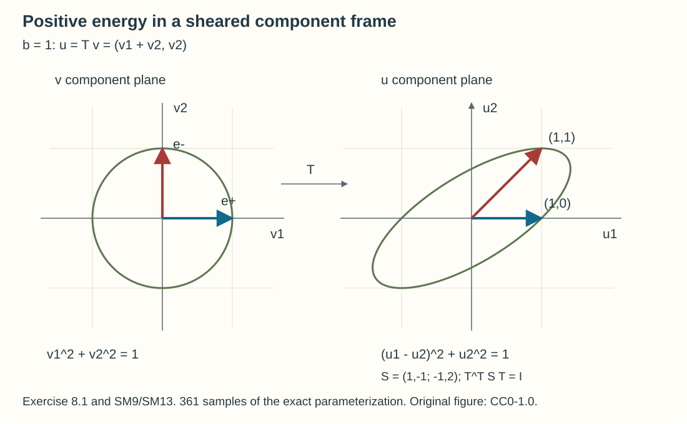

# Positive symmetrizers and non-Hermitian evolution

Real eigenvalues do not by themselves control a system. A nilpotent part can amplify frequency, and nonorthogonal eigenspaces can make energy constants diverge even before an eigenvalue crossing. A positive symmetrizer supplies the missing metric. This lesson proves the Cauchy theorem when that metric varies with time, position and direction, then carries the separated-branch kernel construction through the resulting pseudodifferential change of variables.

The exact receiving calculus is the differentiated ordinary matrix calculus used in [Separated characteristic branches and polarization](../20261007-restored-separated-branches/separated-system-branches-preparation.md), Section 4. Its Section 2 supplies the finite Hermitian spectral theorem; Sections 6–7 supply the complete localized Hermitian branch-kernel theorem. [First-order systems and ordered evolution](../20261007-restored-first-order-systems/first-order-systems-and-ordered-evolution.md), Sections 1–4, supplies the preceding Hermitian evolution and its Sobolev mapping contracts. The complete [Hilbert Fourier, ordered composition, adjoint and all-real Sobolev proofs H1–H3](../20261007-restored-first-order-systems/hilbert-coefficient-calculus-and-positivity.md) supply the global mapping and remainder estimates. The [parameter summation and two-sided inverse proofs K1–K3](../20261004-free-intrinsic-graph/prerequisites/conic-parametrices-and-localization.md) supply the actual ordinary parametrices, with their component notices retained. The [Cauchy kernel lesson](../20261007-restored-oscillatory-cauchy/oscillatory-cauchy-kernels-and-exact-evolution.md), Sections 3–6, proves the global smoothing correction, joint kernel regularity and exact graph wavefront. The [Banach integration and primitive proofs](../20261005-cauchy-foundations/integration-and-duality.md), Sections 16–17, supply all time integrals below. We prove the variable-metric energy argument below. The scalar first-order discussion in Hörmander III, Section 23.1, is context; it is not a substitute for this system proof.

## 1. The uniform metric, and the scope of the theorem

Fix a compact time interval \(I\) and a finite component space \(\mathbb C^N\). On \(\mathbb R^n\), let
\[
 P=\partial_t+A(t),\qquad
 A(t)=\operatorname{Op}(i\chi_0H_1+C). \tag{SM1}
\]
Here \(H_1(t,x,\xi)\) is smooth for \(\xi\ne0\), homogeneous of degree one, and has uniformly bounded ordinary \(S^1_{1,0}\) seminorms after the fixed low-frequency cutoff \(\chi_0\). Every time derivative has the same spatial order. The full, possibly nonclassical and noncommuting, matrix \(C\) is a smooth bounded family in \(S^0_{1,0}\). Quantization is the full left quantization on the global bounded-symbol classes.

Assume a homogeneous degree-zero Hermitian matrix \(S(t,x,\xi)\), for \(\xi\ne0\), satisfies all ordinary \(S^0\) derivative bounds, including every time derivative with the same spatial order, and
\[
 mI_N\le S\le MI_N,\qquad
 S H_1=H_1^*S,\qquad 0<m\le M<\infty. \tag{SM2}
\]
The constants and derivative bounds are uniform in the whole time, position and normalized-frequency domain. Positivity on one compact chart is not a global Cauchy hypothesis. When only a local metric is given, the kernel conclusion below requires a separately declared global realization with the global energy hypotheses.

We shall prove, for every real \(s\), every initial time \(r\in I\), \(g\in H^s\), and \(f\in L^1(I;H^s)\), a unique solution
\[
 u\in C(I;H^s),\qquad
 u_t\in L^1(I;H^{s-1}),\qquad
 Pu=f,\quad u(r)=g, \tag{SM3}
\]
with the two-direction estimate
\[
 \|u(t)\|_s\le C_s e^{c_s|t-r|}
 \left(\|g\|_s+\int_{[\min(t,r),\max(t,r)]}\|f(\tau)\|_s\,d\tau\right). \tag{SM4}
\]
The equation has the integrated meaning in \(H^{s-1}\). The constants can depend on \(s\), \(m,M\), the interval, \(N\), and finitely many stated seminorms. This finite-system result asserts no component-dimension-independent Hilbert-space theorem.

No gap is required for this energy statement. For the Fourier-integral statement we add separated single eigenvalues of fixed multiplicities on a larger neighborhood of a declared compact normalized trajectory family. A general internal cluster or crossing is not supplied by that later statement.

## 2. Positive square roots with every symbol derivative

First extend \(S\) smoothly through low frequency by
\[
 S_{\mathrm e}=I_N+\chi(\xi)(S-I_N), \tag{SM5}
\]
where \(\chi=0\) near zero and \(\chi=1\) at sufficiently large frequency. A convex combination of positive forms obeys the bounds with \(m_0=\min(1,m)\), \(M_0=\max(1,M)\). Its full derivative bounds are global \(S^0\) bounds. The symmetrizer identity is needed only at large frequency; its low-frequency defect has bounded \(S^0\) seminorms.

Choose a constant \(\alpha>M_0\) and put \(X=I_N-S_{\mathrm e}/\alpha\). The proved finite Hermitian spectral theorem gives
\[
 0\le X\le qI_N,\quad q=1-m_0/\alpha<1,\qquad
 Q=\sqrt\alpha\,(I_N-X)^{1/2},\quad
 Q^{-1}=\alpha^{-1/2}(I_N-X)^{-1/2}. \tag{SM6}
\]
These powers are defined by their binomial series. For completeness, the scalar coefficients are obtained by equating coefficients in
\((1-z)F'=-F/2\), \(F(0)=1\), for the square root, and
\((1-z)G'=G/2\), \(G(0)=1\), for its reciprocal. The recursions bound the absolute coefficients by one. The series converge absolutely for \(|z|<1\); the differential equations identify them as \((1-z)^{1/2}\) and \((1-z)^{-1/2}\), respectively.

Here are the scalar identities behind this construction. Write \(F(z)=\sum_{k\ge0}f_kz^k\), \(G(z)=\sum_{k\ge0}g_kz^k\). Equating coefficients gives
\[
 f_0=g_0=1,\qquad
 (k+1)f_{k+1}=(k-\tfrac12)f_k,\qquad
 (k+1)g_{k+1}=(k+\tfrac12)g_k. \tag{SMA1}
\]
The absolute ratios are at most one, so \(|f_k|,|g_k|\le1\). On every closed disc of radius less than one, the series and every differentiated series converge absolutely and uniformly. The two differential equations therefore hold for the sums. The derivative of \(F(z)^2/(1-z)\) is zero, and the derivative of \(F(z)G(z)\) is zero. Integrating along the segment from zero to \(z\) gives \(F(z)^2=1-z\) and \(F(z)G(z)=1\), by their initial values. For real \(0\le z<1\), continuity and \(F(0)=1\) give \(F(z)>0\); hence \(G(z)>0\) as well. The absolutely convergent product rule is the earlier scalar series theorem, so no matrix functional calculus is being assumed.

Diagonalizing \(X\) at each point evaluates the matrix series and proves \(Q^2=S_{\mathrm e}\), \(Q^*=Q\), and \(QQ^{-1}=Q^{-1}Q=I_N\). This pointwise diagonalization is used only to identify the series, not to differentiate a chosen basis.

After any fixed total of \(d\) parameter derivatives, a term \(X^k\) has at most a constant times \(k^d\) ordered product terms. At most \(d\) of its factors are differentiated. The undifferentiated factors have norm at most \(q\); each differentiated factor obeys its stated symbol bound. Thus the series of derivative bounds is dominated by a constant times
\[
 \sum_{k\ge d}k^d q^{k-d}<\infty. \tag{SM7}
\]
Terms \(k<d\) form a finite sum. Distributing a multi-index of frequency derivatives removes exactly its total frequency order, regardless of which factors receive it. Consequently \(Q,Q^{-1}\) are smooth bounded \(S^0\) families, including every time derivative. Write \(Q_{\mathrm h}=S^{1/2}\) for their homogeneous high-frequency representative on \(\xi\ne0\); \(Q=Q_{\mathrm h}\) at large frequency. The root bounds hold everywhere for \(Q\), while the homogeneous principal identity is
\[
 \sqrt{m_0}\,I_N\le Q\le\sqrt{M_0}\,I_N,\qquad
 B_1=Q_{\mathrm h}H_1Q_{\mathrm h}^{-1}=B_1^*. \tag{SM8}
\]
The last identity follows from \(Q_{\mathrm h}^2H_1=H_1^*Q_{\mathrm h}^2\), by multiplication with \(Q_{\mathrm h}^{-1}\) on both sides. Low-frequency \(Q\) need not symmetrize \(H_1\); its defect belongs to the order-zero part already accounted for.

At one finite-dimensional point, a positive symmetrizer exists precisely when \(H\) is diagonalizable with real eigenvalues. The forward implication follows from the Hermitian matrix \(QHQ^{-1}\) and the finite spectral theorem. Conversely, if \(H=V\Lambda V^{-1}\) with real diagonal \(\Lambda\), then
\[
 S=V^{-*}V^{-1}>0,\qquad SH=H^*S. \tag{SM9}
\]
This is a pointwise equivalence. Smoothness, uniform positivity and all derivative bounds remain separate requirements for the evolution theorem.

## 3. Energy after quantization

Write \(\Lambda=\langle D\rangle\), \(w=\Lambda^su\), \(F=\Lambda^sf\), and \(A_s=\Lambda^sA\Lambda^{-s}\). The ordered ordinary calculus gives \(A_s-A\in\operatorname{Op}S^0\), with the same smooth parameter bounds. Let \(Q_0=\operatorname{Op}Q\).

The leading symbol of \(Q_0^*Q_0\) is \(S_{\mathrm e}\). Therefore
\[
 L_s=A_s^*Q_0^*Q_0+Q_0^*Q_0A_s\in\operatorname{Op}S^0. \tag{SM10}
\]
Indeed its order-one pointwise symbol is
\(-i\chi_0H_1^*S_{\mathrm e}+i\chi_0S_{\mathrm e}H_1\), which vanishes at large frequency by (SM2). The remaining low-frequency term is order zero. Every differentiated composition or adjoint correction loses at least one spatial order, and the lower \(C\) terms already have order zero. The full adjoint and remainder contracts used here are those of the exact ordinary calculus, not an assertion that left quantization preserves pointwise positivity.

The pointwise inverse \(Q^{-1}\) gives a first approximate left inverse:
\[
 \operatorname{Op}(Q^{-1})Q_0=I_N+E_{-1},
 \qquad E_{-1}\in\operatorname{Op}S^{-1}. \tag{SM11}
\]
The order-zero mapping theorem and the order-minus-one mapping theorem give, uniformly in \(t\),
\[
 \|w\|_0\le a\|Q_0w\|_0+b\|w\|_{-1}. \tag{SM12}
\]
Choose a fixed \(\gamma\ge1\). The energy
\[
 {\mathcal E}_s(t,u)=\|Q_0(t)\Lambda^su\|_0^2+
                  \gamma\|\Lambda^{s-1}u\|_0^2 \tag{SM13}
\]
is equivalent to \(\|u\|_s^2\): square (SM12) and use
\((aX+bY)^2\le2a^2X^2+2b^2Y^2\) for the lower bound; the order-zero bound for \(Q_0\) and \(\Lambda^{-1}\) gives the upper bound. The constants are uniform. This harmless lower-order term replaces an unjustified assertion that \(\operatorname{Op}Q\) has an exact bounded inverse.

For a spatially smooth solution, differentiation gives
\[
 \begin{split}
 {\mathcal E}_s'={}&-(L_sw,w)
       +2\operatorname{Re}(Q_{0,t}w,Q_0w)
       +2\operatorname{Re}(Q_0F,Q_0w)\\
 &-2\gamma\operatorname{Re}(\Lambda^{-1}A_sw,\Lambda^{-1}w)
       +2\gamma\operatorname{Re}(\Lambda^{-1}F,\Lambda^{-1}w).
 \end{split} \tag{SM14}
\]
Here \(\Lambda^{-1}A_s\) has order zero. Every term is bounded by a constant times \(\|w\|_0^2+\|F\|_0\|w\|_0\). Energy equivalence consequently gives
\[
 |{\mathcal E}_s'|\le c{\mathcal E}_s+
                 c\|f\|_s\sqrt{{\mathcal E}_s}. \tag{SM15}
\]
The differentiation also holds almost everywhere for a spatially smooth path whose time derivative is integrable in the required Sobolev spaces. To justify the norm-square rule directly, write a Hilbert-space path as \(w(t)=w(a)+\int_a^tg(v)\,dv\), with \(g\in L^1\). Sum the identity for the change of \(\|w\|^2\) over a partition. The sum of squared increments is bounded by \(\max_J\int_J\|g\|\) times \(\int_I\|g\|\), and tends to zero with the mesh by absolute continuity of the scalar integral. The remaining sum converges to \(2\operatorname{Re}\int_a^t(g(v),w(v))\,dv\), since \(w\) is uniformly continuous. This proves the integrated rule and its almost-everywhere derivative by the earlier Bochner primitive theorem. Norm-differentiable \(Q_0(t)\) obeys the product rule with such a path, by splitting its product increment into the coefficient and vector increments and using the uniform operator bounds. Thus (SM14)–(SM15) apply to the integrably forced regularizations used below as well.

Apply this to \(\sqrt{{\mathcal E}_s+\delta}\), integrate its scalar differential inequality in either direction, and let \(\delta\downarrow0\). This proves (SM4) for these solutions. Reversing time replaces \(A\) by \(-A\); the leading cancellation and all bounded remainders remain valid, so the same argument genuinely supplies both directions.

## 4. Existence, rough solutions and ordered evolution

Choose a real compactly supported smooth Fourier multiplier \(j\), equal to one near zero, and \(J_\epsilon=j(\epsilon D)\), \(0<\epsilon\le1\). All \(j(\epsilon\xi)\) form a bounded \(S^0\) family: a nonzero differentiated cutoff lies where \(|\xi|\) is comparable to \(\epsilon^{-1}\). Put
\[
 A_\epsilon=J_\epsilon A J_\epsilon. \tag{SM16}
\]
For fixed \(\epsilon\), this is bounded on every \(H^r\), with a bound allowed to grow as \(\epsilon^{-1}\). Its time dependence is continuous in the operator norm. The integrated equation is solved by successive substitutions: on an interval whose length times the coefficient bound is less than one the integral map is a contraction; finitely many such intervals cover \(I\). This gives the unique Banach-space ordinary differential solution in both directions.

The symbol family of \(A_\epsilon\) is uniformly \(S^1\), with leading pointwise term \(ij(\epsilon\xi)^2\chi_0H_1\) and a uniformly bounded \(S^0\) remainder. The scalar factor \(j^2\) preserves (SM10). The proof of (SM13)–(SM15) therefore gives the same energy constants for every \(\epsilon\), at every fixed Sobolev order.

For smooth \(g\) and smooth forcing with values in all Sobolev spaces, these estimates bound \(u_\epsilon\) uniformly in \(C(I;H^{s+1})\). The scalar multiplier inequality
\[
 \|(J_\epsilon-I)h\|_r\le c\epsilon\|h\|_{r+1} \tag{SM17}
\]
follows from \(|j(\epsilon\xi)-1|\le c\epsilon\langle\xi\rangle\). The identity
\[
 A_\epsilon-A=(J_\epsilon-I)AJ_\epsilon+A(J_\epsilon-I) \tag{SM18}
\]
then bounds its norm \(H^{s+1}\to H^{s-1}\) by \(c_s\epsilon\), uniformly in time. Applying the uniform energy estimate to
\[
 (\partial_t+A_\epsilon)(u_\epsilon-u_\delta)
                    =(A_\delta-A_\epsilon)u_\delta \tag{SM19}
\]
shows convergence in \(C(I;H^{s-1})\). The elementary Fourier Cauchy–Schwarz inequality
\(\|h\|_s^2\le\|h\|_{s-1}\|h\|_{s+1}\)
and the uniform stronger bound give convergence in \(C(I;H^s)\). Pass to the integrated equation in \(H^{s-1}\). This constructs the solution for smooth data, without extracting a weak subsequence.

For general \(g\in H^s\) and \(f\in L^1(I;H^s)\), approximate them by smooth data in these two norms. One can obtain the forcing approximation by first approximating by finitely many time-step values, then using spatial density and scalar smoothing of the finitely many interval indicators. Estimate (SM4) makes the solutions Cauchy in \(C(I;H^s)\). The bounded map \(A(t):H^s\to H^{s-1}\) passes the integrated equation to the limit and proves (SM3).

The estimate also applies to every solution already in (SM3), so uniqueness is not merely uniqueness of the construction. To see this without differentiating a nonexistent \(H^s\) derivative, apply \(J_\epsilon\) to such a solution:
\[
 P(J_\epsilon u)=J_\epsilon f+[A,J_\epsilon]u. \tag{SM20}
\]
The scalar multiplier commutator is a uniformly bounded \(S^0\) family. Its order-one pointwise matrix commutator is zero; each remaining term contains at least one differentiated frequency cutoff or another ordinary order loss. It tends strongly to zero \(H^s\to H^s\), uniformly in time on each fixed vector. On a spatially smooth vector, \(A(J_\epsilon-I)\) tends to zero uniformly by the uniform order-one bound, while \((J_\epsilon-I)A\) tends to zero uniformly because its \(A(t)\)-images form a compact subset of \(H^s\). The uniform order-zero bound extends this by density. A finite-net argument then makes that convergence uniform on the compact set \(\{u(t):t\in I\}\subset H^s\). Hence the residual in (SM20) tends to zero in \(L^1(I;H^s)\). The smoothed solution has every spatial Sobolev order and an integrable derivative there, so the energy calculation applies. Let \(\epsilon\downarrow0\) in its estimate, using \(J_\epsilon f\to f\) in \(L^1H^s\). This proves (SM4) for the original solution and proves uniqueness.

Define \(U_P(t,r)g\) by homogeneous evolution. Uniqueness gives
\[
 U_P(t,r)U_P(r,q)=U_P(t,q),\qquad
 U_P(r,r)=I_N,\qquad U_P(t,r)^{-1}=U_P(r,t). \tag{SM21}
\]
The estimate bounds each operator on \(H^s\). For \(g\in H^{s+1}\), the integrated equation bounds its difference from the initial vector in \(H^s\) by \(c|t-r|\|g\|_{s+1}\), locally uniformly in the initial time. Density and the uniform bound give strong continuity for each \(g\in H^s\). The group law expresses a varying initial endpoint as a small extra factor, so it gives joint strong continuity at every pair \((t,r)\), including the diagonal.

For smooth vectors, the equation and the group law give
\[
 \partial_tU_P(t,r)=-A(t)U_P(t,r),\qquad
 \partial_rU_P(t,r)=U_P(t,r)A(r). \tag{SM22}
\]
For the second identity, differentiate
\(U_P(t,r+h)U_P(r+h,r)=U_P(t,r)\);
the differentiated second factor is \(-A(r)\) at \(h=0\). Every endpoint derivative loses at most its finite number of spatial orders, by (SM22), the derivative bounds on \(A\), and repeated product rules. The identities therefore extend between the corresponding Sobolev spaces. For later smoothing corrections, these derivatives are needed in operator norm with additional input orders. The argument for (BRA2) in the preceding branch lesson uses only a two-direction energy bound, the integrated equation and the finite-seminorm mapping theorem; it therefore applies with (SM4). Explicitly,
\[
 \|U_P(t+h,t)-I\|_{H^{q+1}\to H^q}\le C_q|h|,\qquad
 \|U_P(t+h,t)-I+hA(t)\|_{H^{q+2}\to H^q}\le C_qh^2. \tag{SMA2}
\]
Integrate \(-A(v)U_P(v,t)\) from \(t\) to \(t+h\) for the first bound. For the second, subtract \(-hA(t)\) and split the integrand difference as \((A(v)-A(t))U_P(v,t)+A(t)(U_P(v,t)-I)\). The uniform time-symbol derivative gives the first term an \(O(|v-t|)\) bound; the first estimate, with one additional input order, gives that bound for the second term. Integrating proves (SMA2) in both orientations. The group law now gives the two endpoint derivatives in operator norm with these additional orders. Repeated product differences give every mixed endpoint derivative, with finitely many extra spatial orders at each step. An arbitrarily smoothing factor supplies all of them. This establishes the uniform norm majorants used when differentiating (SM29), without assuming norm continuity on a fixed Sobolev space.

The forcing solution, with the integral oriented from \(r\) to \(t\), is
\[
 u(t)=U_P(t,r)g+\int_r^tU_P(t,\tau)f(\tau)\,d\tau. \tag{SM23}
\]
The strong continuity and bounds make this a Bochner integral. For smooth forcing, differentiation proves the equation; \(L^1H^s\) approximation proves it for the stated forcing. Orientation gives the correct sign also when \(t<r\).

## 5. An ordinary reduction to Hermitian principal form

Let \(T_0=Q^{-1}\), and choose the full parameter-dependent two-sided ordinary parametrix \(R\) of \(T=\operatorname{Op}T_0\), with
\[
 RT=TR=I_N\pmod{\operatorname{Op}S^{-\infty}},
 \qquad \sigma_0(R)=Q. \tag{SM24}
\]
This is the exact all-orders matrix-parametrix construction already received in the separated-branch lesson. Its differentiated Borel summation gives all time derivatives as well as the spatial bounds. No operator invertibility is inferred from (SM24).

Form the spatial operator
\[
 B=R(T_t+AT),\qquad D=\partial_t+B.
 \quad\text{Then}\quad PT-TD=E\in\operatorname{Op}S^{-\infty}. \tag{SM25}
\]
Indeed \(E=(I_N-TR)(T_t+AT)\). Multiplication by an order-one operator preserves the smoothing ideal, including all parameters. The homogeneous principal part of \(B\) is \(iQ_{\mathrm h}H_1Q_{\mathrm h}^{-1}=iB_1\), with \(B_1\) Hermitian. After its fixed low-frequency regularization, all remaining terms are a full bounded ordinary \(S^0\) family. Thus the preceding Hermitian evolution theorem applies globally to \(D\).

It is useful to see why a variable metric cannot be treated as a constant matrix substitution. Write \(q=Q\), \(T_0=q^{-1}\), and \(b_1=iB_1\) at high frequency. The order-minus-one term of the inverse symbol is
\[
 r_{-1}=-\frac1i\sum_\nu(\partial_{\xi_\nu}q)
                  (\partial_{x_\nu}T_0)q. \tag{SM26}
\]
It is obtained from \(r\#T_0=I_N\), in the prescribed factor order. Expanding the full symbol of (SM25) through order zero gives
\[
 \begin{split}
 c_D\equiv{}&qCT_0+q\,\partial_tT_0
       +\sum_\nu q(\partial_{\xi_\nu}H_1)(\partial_{x_\nu}T_0)\\
 &+\sum_\nu(\partial_{\xi_\nu}q)T_0(\partial_{x_\nu}B_1)
                          \pmod{S^{-1}}. 
 \end{split} \tag{SM27}
\]
To check the last term, the two inverse/composition contributions are
\(r_{-1}(iH_1T_0)+(1/i)\sum q_{\xi_\nu}\partial_{x_\nu}(iH_1T_0)\).
Differentiate \(iH_1T_0=T_0b_1\). Its \(T_{0,x}b_1\) term cancels (SM26); the remaining term is
\((1/i)\sum q_\xi T_0b_{1,x}=\sum q_\xi T_0B_{1,x}\).
The other differentiated product is
\((1/i)q(iH_1)_{\xi_\nu}T_{0,x_\nu}=qH_{1,\xi_\nu}T_{0,x_\nu}\).
All terms with two spatial differentiations or another inverse order lie in \(S^{-1}\). This is an ordinary congruence even when \(C\) has no homogeneous expansion.

Using the full symbol inverse in (SM25) is essential. Merely multiplying the pointwise matrices discards the last two terms of (SM27). Conversely, conjugating by a parametrix and moving the time derivative produces a smoothing coefficient times \(\partial_t\), not automatically a spatial order-zero error. The intertwining form (SM25) retains that distinction.

There is also a direct exact-evolution comparison:
\[
 V(t,r)=T(t)U_D(t,r)R(r),\quad
 PV=E(t)U_D(t,r)R(r),\quad
 V(r,r)=I_N+K(r), \tag{SM28}
\]
where \(K=TR-I_N\) is smoothing. Each right-hand defect maps every \(H^{-M}\) to every \(H^L\), with all endpoint derivatives, by choosing a sufficiently large Sobolev gain in the smoothing factor. Duhamel under the actual evolution gives
\[
 V(t,r)-U_P(t,r)
  =U_P(t,r)K(r)+
    \int_r^tU_P(t,\tau)E(\tau)U_D(\tau,r)R(r)\,d\tau. \tag{SM29}
\]
Both initial and equation defects are retained. Every differentiated factor has only a finite order loss, and the smoothing factor can supply arbitrarily many orders. These bounds hold on the full global Sobolev spaces. For a compactly supported input localization, the exact delta-column reconstruction already proved for the scalar Cauchy kernels turns them into a jointly smooth kernel in both spatial and time variables.

## 6. Separated kernels and nonorthogonal polarization

Now fix the compact normalized input region \(K\), its slightly larger uniform-gap neighborhood, and compact finite-time trajectory families as in Sections 6–7 of the separated-branch lesson. Suppose \(H_1\) has distinct ordered real eigenvalues \(\lambda_j\) of fixed multiplicities \(d_j\), with gap at least \(c|\xi|\) there. Similarity by \(Q_{\mathrm h}\) preserves these eigenvalues and multiplicities. The Hermitian \(B_1\) therefore meets that complete theorem's local spectral hypotheses, while \(D\) has its global energy realization.

Let \(\widehat\Pi_j\) be its full commuting microlocal projections. The compact input operator \(R(r)\Psi\) has the same conic microsupport as \(\Psi\), up to a globally smoothing tail. Choose an auxiliary properly supported cutoff \(\Xi\), equal to one on a slightly larger neighborhood of that entire microsupport. Then \((I_N-\Xi)R\Psi\) is globally smoothing between every stated Sobolev pair: separated-cone composition removes all stationary terms, and the compact-input exterior full-pseudodifferential tail is precisely the tail estimate proved in Section 6 of the separated-branch lesson. Apply its complete Hermitian theorem to \(U_D\Xi\), and call the resulting kernels \(\widehat F_j\). Formula (SM29) now gives
\[
 U_P(t,r)\Psi=\sum_jF_j(t,r)+\mathcal S(t,r),
 \qquad F_j=T(t)\widehat F_j(t,r)R(r)\Psi
                   \pmod{\text{smooth kernels}}. \tag{SM30}
\]
Thus the input in the Hermitian theorem actually contains the full transformed input, including its support margins. Each composition has the same Hamilton graph, order zero and zero excess, because the endpoint pseudodifferential factors have identity canonical graphs. Their elliptic order-zero symbols are invertible.

All localizations are those of the complete Hermitian receiving theorem: compact input, cutoffs one on the whole relevant trajectories, globally controlled exterior full-pseudodifferential tails, and all differentiated global \(H^{-M}\to H^L\) residual bounds. Composing with bounded ordinary endpoint factors preserves them. Formula (SM29) supplies the actual-system correction, so (SM30) is not merely an equality of formal principal symbols.

The corresponding full projections and principal eigenspace projections are
\[
 \Pi_j=T\widehat\Pi_jR,\qquad
 \rho_j=Q_{\mathrm h}^{-1}\widehat\pi_jQ_{\mathrm h},\qquad
 \rho_j^*S=S\rho_j. \tag{SM31}
\]
The principal \(\rho_j\) are generally not Euclidean orthogonal. The last identity follows by direct multiplication with \(S=Q_{\mathrm h}^2\); both sides equal \(Q_{\mathrm h}\widehat\pi_jQ_{\mathrm h}\). Their ranges are the original eigenspaces of \(H_1\).

The full idempotence, complementarity and sum identities follow from \(RT=I_N\) modulo smoothing and the corresponding identities for \(\widehat\Pi_j\). To verify commutation without losing the time sign, (SM25) and the differentiated inverse identity give
\[
 T_t+AT-TB\in\operatorname{Op}S^{-\infty},\qquad
 R_t+BR-RA\in\operatorname{Op}S^{-\infty}. \tag{SM32}
\]
For the second assertion, differentiate \(RT=I_N\) modulo smoothing and multiply on the right by \(R\); the remaining defect \(RA(I_N-TR)\) is smoothing. Consequently
\([P,\Pi_j]=(T_t+AT-TB)\widehat\Pi_jR+
T[D,\widehat\Pi_j]R+T\widehat\Pi_j(R_t+BR-RA)\)
is smoothing on the declared microlocal scope, with all parameters.

The leading branch map is the Hermitian endpoint bundle map conjugated on its two sides by \(Q_{\mathrm h}^{-1}(t)\) and \(Q_{\mathrm h}(r)\). It is an isomorphism between the original rank-\(d_j\) eigenbundles; no global eigenbasis is needed. Multiplying by invertible endpoint matrices preserves ellipticity and the branch wavefront. Full projections still isolate a branch at intersections of different graphs. Thus the full matrix kernel has exactly the union of the branch Hamilton graphs over the elliptic input region. This does not assert that every individual matrix entry has every branch.

For compactly supported data whose normalized initial wavefront lies inside \(K\), choose the scalar \(\Psi=1\) there. The compact smooth input remainder remains \(H^\infty\) under (SM4). With the full projections in (SM31), the precise data equivalence is
\[
 (y,\eta)\in\operatorname{WF}(\Pi_j(r)g)
 \quad\Longleftrightarrow\quad
 \Phi_j(t,r)(y,\eta)\in
       \operatorname{WF}(\Pi_j(t)U_P(t,r)g). \tag{SM33}
\]
This is the receiving Hermitian equivalence transported by elliptic endpoint operators. The full projections, rather than only the pointwise principal matrices, retain weaker-order polarized singularities. The initial localization and whole trajectory neighborhood cannot be omitted.

## 7. Constructing the metric from separated projectors

Retain the global symbol seminorm and all-time derivative hypotheses of Section 1. Suppose a smooth homogeneous matrix family is pointwise diagonalizable, with real separated single eigenvalues of fixed multiplicities. Assume its spectral projectors have a uniform bound
\(\|\rho_j\|\le L\) on the whole normalized domain. This bound is necessary for a uniform positive symmetrizer: if (SM2) holds, (SM31) yields
\[
 \|\rho_j\|\le \|Q_{\mathrm h}^{-1}\|\|Q_{\mathrm h}\|\le\sqrt{M/m}. \tag{SM34}
\]
Under the stated gap and bound, the projectors actually have all the differentiated ordinary \(S^0\) bounds. Here is the parameter argument. On normalized frequency, fix a circle about one eigenvalue at a given point, of radius smaller than a quarter of the uniform gap. The pointwise diagonalizable decomposition gives, away from its real spectrum,
\[
 (zI_N-H)^{-1}=\sum_j\frac{\rho_j}{z-\lambda_j}. \tag{SM35}
\]
Thus its norm on the fixed circle is bounded by the projector bound divided by the circle's separation. For a sufficiently small change in \(H\), the Neumann series preserves the inverse there. The same inverse bound shows that every new eigenvalue lies within a constant times \(\|H_{\rm new}-H_{\rm old}\|\) of an old one: at any farther spectral candidate the resolvent Neumann test would make \(zI_N-H_{\rm new}\) invertible.

No two distinct new branches can enter this one small circle, because their uniform gap exceeds its diameter. The integral
\[
 \rho_j=\frac1{2\pi i}\int_\Gamma(zI_N-H)^{-1}\,dz \tag{SM36}
\]
therefore selects that one eigenspace. Its rank is stable: pointwise diagonalization evaluates it as a projection, so its trace is an integer; the contour inverse is continuous, and hence this integer is locally constant. The trace formula
\(\lambda_j=\operatorname{tr}(H\rho_j)/d_j\)
then proves smoothness of the branch. Differentiating the inverse under the fixed circle repeatedly gives ordered products of resolvents and derivatives of \(H\); their uniform bounds prove every parameter derivative estimate. Circle radii and separations have uniform margins, so the local argument gives uniform bounds over the whole normalized domain, even if the position domain is noncompact. Homogeneity restores exactly the frequency order: \(\rho_j\in S^0\) and \(\lambda_j\in S^1\).

There is consequently a global basis-free choice
\[
 S=\sum_{j=1}^k\rho_j^*\rho_j,\qquad
 \frac1kI_N\le S\le kL^2I_N,\qquad SH_1=H_1^*S. \tag{SM37}
\]
For the lower bound, \(v=\sum_j\rho_jv\), so
\(\|v\|^2\le k\sum_j\|\rho_jv\|^2\).
The upper bound is immediate. Finally
\(\rho_jH_1=\lambda_j\rho_j\) and real \(\lambda_j\) make both products with \(S\) equal to
\(\sum_j\lambda_j\rho_j^*\rho_j\).
All derivatives follow from the just-proved projector bounds. This constructs a metric without choosing global eigenframes.

Real semisimple eigenvalues at each point alone supply none of these uniform bounds. Exercise 3 shows the distinction quantitatively. At a genuine Jordan point even a pointwise positive symmetrizer is impossible. Smooth positive symmetrizers may nevertheless exist through some semisimple crossings; their energy theorem remains valid there, but our separated-branch kernel theorem still does not apply at the crossing.

## 8. Graded exercises with complete solutions

### 8.1. A sheared metric and its square root

**Level 1.** For real \(b\), set
\[
 T_b=\begin{pmatrix}1&b\\0&1\end{pmatrix},\quad
 B_b=T_b\begin{pmatrix}1&0\\0&-1\end{pmatrix}T_b^{-1}
     =\begin{pmatrix}1&-2b\\0&-1\end{pmatrix}.
\]
Find a positive symmetrizer, its square root and both spectral projectors. Explain why Euclidean orthogonality is the wrong requirement.

**Solution.** The inverse is \(T_b^{-1}=\begin{pmatrix}1&-b\\0&1\end{pmatrix}\). Consequently
\[
 S_b=T_b^{-*}T_b^{-1}
   =\begin{pmatrix}1&-b\\-b&1+b^2\end{pmatrix},\qquad
 v^*S_bv=|v_1-bv_2|^2+|v_2|^2.
\]
This is positive definite and has determinant one. Direct multiplication gives \(S_bB_b=B_b^*S_b\). On bounded \(b\)-ranges its trace \(2+b^2\) bounds the larger eigenvalue; determinant one bounds the smaller eigenvalue away from zero. The same derivative argument applies to any smooth bounded symbol \(b\) with all the stated derivative bounds.

For this \(2\times2\) matrix direct multiplication gives \(S_b^2-(\operatorname{tr}S_b)S_b+I_2=0\). Thus
\[
 Q_b=\frac{S_b+I_2}{\sqrt{\operatorname{tr}S_b+2}}
    =\frac1{\sqrt{4+b^2}}\begin{pmatrix}2&-b\\-b&2+b^2\end{pmatrix}
\]
is positive definite and obeys \(Q_b^2=S_b\). It is the positive square root.
The projectors are
\[
 \rho_+=\begin{pmatrix}1&-b\\0&0\end{pmatrix},\qquad
 \rho_-=\begin{pmatrix}0&b\\0&1\end{pmatrix}.
\]
Their products, squares and sum give the asserted spectral decomposition directly. Their ranges have vectors \((1,0)\) and \((b,1)\), which are not Euclidean orthogonal when \(b\ne0\), but are orthonormal in the \(S_b\) metric because \(T_b^*S_bT_b=I_2\). In real component coordinates the unit-energy ellipse is
\(u=T_b(\cos\theta,\sin\theta)\); its area is \(\pi\), since \(\det T_b=1\). This ellipse represents component energy, not a spatial characteristic curve. ∎

For the displayed instance \(b=1\), the blue and red endpoint vectors are \((1,0)\) and \((1,1)\); both have \(S_1\)-length one and their \(S_1\) inner product is zero. The drawn curve samples the exact parameterization \(u=(\cos\theta+\sin\theta,\sin\theta)\). Proof locators: (SM9), (SM13), and Exercise 8.1. These are component planes, not the physical \((x,t)\) rays of Exercise 8.2.

### 8.2. Exact transport in a changing nonorthogonal frame

**Level 2.** Let \(b=b(t)\) be smooth on a compact interval, \(T=T_{b(t)}\), and solve
\[
 Pu=u_t+B_{b(t)}u_x-T'(t)T(t)^{-1}u=0,\qquad u(r)=g. \tag{SM38}
\]
Give the exact kernel, its initial value and its conserved metric energy.

**Solution.** Substitute \(u=Tv\). The time term \(T'v\) cancels the prescribed lower coefficient, and \(B_bT=T\operatorname{diag}(1,-1)\). Thus \(v_+=v_+(r,x-(t-r))\), \(v_-=v_-(r,x+(t-r))\). Multiplication by \(T(r)^{-1}\) at the initial endpoint gives
\[
 \begin{split}
 u_1(t,x)&=g_1(x-\Delta)-b(r)g_2(x-\Delta)+b(t)g_2(x+\Delta),\\
 u_2(t,x)&=g_2(x+\Delta),\qquad \Delta=t-r.
 \end{split}
\]
The matrix kernel is exactly
\[
 K(t,r;x,y)=
 \sum_{\epsilon=\pm1}T(t)e_\epsilon e_\epsilon^T T(r)^{-1}
                       \delta(x-y-\epsilon\Delta). \tag{SM39}
\]
At \(t=r\) the two coefficient matrices sum to \(I_2\), giving the identity delta kernel. Each endpoint map has rank one and carries the correct original eigenspace between the endpoints. In particular the minus map is not a Euclidean orthogonal projection.

Since \(T^{-1}u=v\) and translations preserve every Sobolev norm,
\[
 \|T(t)^{-1}u(t)\|_s^2=\|T(r)^{-1}g\|_s^2 .
\]
This equals the component metric energy with \(S_{b(t)}\); for a time-only matrix it commutes with \(\Lambda^s\). The theorem's lower-order correction in (SM13) is useful for general quantization but is unnecessary for this exact multiplication model. On the positive cone the eigenvalue labels are \(+\xi,-\xi\); on the negative cone their numerical ordering reverses, while the two physical translations remain the displayed ones. ∎

### 8.3. Real separated roots with diverging energy constants

**Level 2.** For \(0<h\le1\), let \(H_h(\xi)=\xi\begin{pmatrix}h&1\\0&-h\end{pmatrix}\). For each fixed \(h\), find its Fourier evolution and explain why neither a uniform positive metric nor a uniform same-order Cauchy bound survives as \(h\downarrow0\).

**Solution.** The eigenprojectors are
\[
 \rho_{h,+}=\begin{pmatrix}1&(2h)^{-1}\\0&0\end{pmatrix},\qquad
 \rho_{h,-}=\begin{pmatrix}0&-(2h)^{-1}\\0&1\end{pmatrix}.
\]
Their norms are at least \((2h)^{-1}\). By (SM34), the ratio \(M/m\) of any uniform symmetrizer would therefore be at least \(1/(4h^2)\). No bounded condition ratio can work for this family.
For \(u_t+iH_h(D)u=0\), the exact multiplier is
\[
 U_h(t,\xi)=
 \begin{pmatrix}
 e^{-ith\xi}&-i\sin(th\xi)/h\\
 0&e^{ith\xi}
 \end{pmatrix}.
\]
One checks this by differentiation and the identity initial value, or by the two displayed projectors. At any fixed \(t\ne0\), there are frequency intervals of positive measure with \(|\sin(th\xi)|\) arbitrarily close to one. Applying the multiplier to the second coordinate, with Fourier support in such intervals, gives an \(H^s\to H^s\) norm at least \(1/h\), for every \(s\). The upper bound \(2+1/h\) follows from its entries. Thus each fixed \(h\) has a same-order evolution, but its constants diverge.

At \(h=0\) the matrix becomes nilpotent, and the limit multiplier is
\(\begin{pmatrix}1&-it\xi\\0&1\end{pmatrix}\).
It loses one Sobolev derivative for general data. Pointwise real eigenvalues and correct evolution at each nonzero parameter do not imply a uniform family theorem. ∎

### 8.4. A Jordan block with a real characteristic root

**Level 2.** For \(H(\xi)=\xi(I_2+N)\), \(N=\begin{pmatrix}0&1\\0&0\end{pmatrix}\), determine the precise failure of a same-order estimate and show that no positive symmetrizer exists.

**Solution.** Since \(N^2=0\),
\[
 U(t,\xi)=e^{-it\xi}(I_2-it\xi N).
\]
For \(t\ne0\), choose a smooth Fourier packet supported in \([R,R+1]\), in the second coordinate, normalized to have \(H^s\) norm one. Its first output coordinate has \(H^s\) norm at least \(|t|R\). Letting \(R\to\infty\) disproves any finite \(H^s\to H^s\) bound. Conversely \(|U(t,\xi)|\le c(1+|t|\langle\xi\rangle)\), so \(H^{s+1}\to H^s\) is bounded. The loss of one order is sharp.

For a fixed nonzero \(\xi\), \(H\) is not diagonalizable, whereas any positive symmetrizer would make \(QHQ^{-1}\) Hermitian by (SM8). Similarity preserves diagonalizability, giving a contradiction. Equivalently, putting \(S=\begin{pmatrix}a&c\\\bar c&d\end{pmatrix}\) in \(SN=N^*S\) forces \(a=0\), which contradicts positivity on \(e_1\). ∎

### 8.5. A direction-dependent metric that no fixed matrix supplies

**Level 3.** On \(\mathbb R^2\), at nonzero frequency, set \(\rho=|\xi|\), \(b(\xi)=\xi_1/\rho\), and
\[
 H_1(\xi)=T_{b(\xi)}
                 \begin{pmatrix}\rho&0\\0&-\rho\end{pmatrix}
                         T_{b(\xi)}^{-1}.
\]
Construct its energy metric, show that a constant positive matrix cannot symmetrize every direction, and identify the exact high-frequency propagation.

**Solution.** The symbol \(S_{b(\xi)}\) from Exercise 1 is homogeneous of degree zero with all ordinary bounds; \(|b|\le1\) gives uniform positive bounds. Its low-frequency convex extension in (SM5) supplies the global metric, and a matching smooth low-frequency modification of \(H_1\) meets the energy theorem.

If a fixed Hermitian matrix \(S=\begin{pmatrix}a&c\\\bar c&d\end{pmatrix}>0\) symmetrized \(B_b\) for every \(b\in[-1,1]\), comparison of the off-diagonal entries in \(SB_b=B_b^*S\) would give \(c=-ab\) for all these \(b\). This forces \(a=0\), impossible. A constant-matrix replacement therefore misses this uniformly well-behaved system.

At frequencies where the high-frequency formula is unchanged, the exact evolution is
\[
 U(t,r;\xi)=T_{b(\xi)}
  \begin{pmatrix}e^{-i(t-r)\rho}&0\\0&e^{i(t-r)\rho}\end{pmatrix}
                                     T_{b(\xi)}^{-1}.
\]
It is uniformly bounded as a matrix, and its Fourier \(S_b\)-energy is conserved. The two phases \((x-y)\cdot\xi\mp(t-r)|\xi|\) have stationary relations
\(x=y\pm(t-r)\xi/|\xi|\), with constant covector. Their endpoint matrices are the two rank-one \(\rho_\pm(\xi)\). Thus they are order-zero graph FIO branches with exactly those rays on a high-frequency input cutoff; low-frequency modifications contribute a smoothing bounded-frequency multiplier. For fixed nonzero elapsed time these oscillating multipliers need not be ordinary \(S^0\) symbols: repeated frequency derivatives of their phases do not supply the order loss required by that class. ∎

References: Lars Hörmander, *The Analysis of Linear Partial Differential Operators III*, Springer, §23.1, printed pages 385–386 (scalar first-order hypotheses and the beginning of the energy argument). The variable-metric system proof is given above, with its exact complete earlier programme proofs linked in the introduction.

*Written by GPT-6.1 Sol (OpenAI), Ultra; restoration and additional receiving proofs by GPT-6 Astra (OpenAI), Ultra, October 2026. Self-checked by the writing AI. Original text and figure: CC0-1.0; linked components retain their own terms.*
