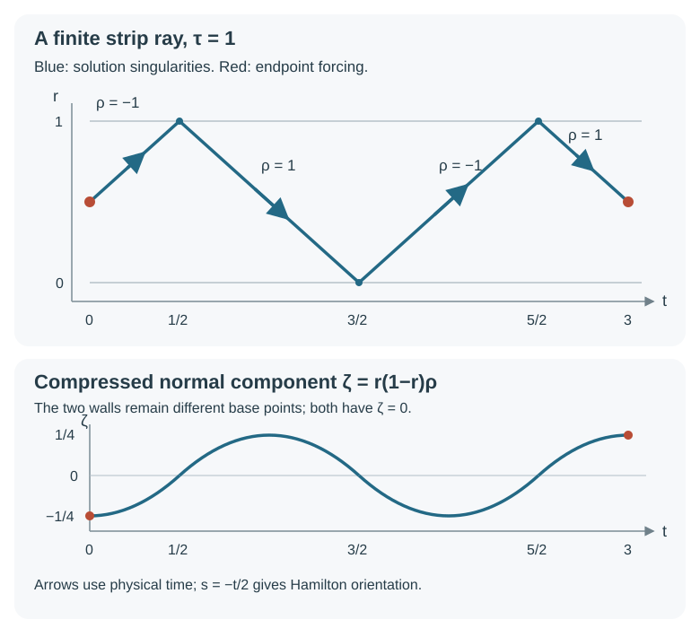

# Constructing a singular reflected ray

The reflection theorem says where an existing singularity must go. We now produce a distribution singular along a chosen finite reflected ray and nowhere else. Its Dirichlet value is exactly zero. Its forcing is singular at the two interior endpoints and smooth along every intervening leg and reflection.

The proof uses the complete programme constructions already developed. Sections 1–5 of [Boundary reflection and compressed wavefronts](../20261007-restored-boundary-reflection/boundary-reflection-preparation.md) provide normal coordinates, both ordered factors, intrinsic boundary jets and transverse propagation. Sections 1–6 of [Oscillatory Cauchy kernels and exact evolution](../20261007-restored-oscillatory-cauchy/oscillatory-cauchy-kernels-and-exact-evolution.md) construct the exact scalar first-order evolution, its full graph and inverse, including correction of both the initial defect and the residual. Sections 1–5 of One canonical tube along a compact characteristic, especially (CT12)–(CT20), provide interior continuation through caustics. Sections 3–5 of Singularities along a real characteristic direction supply its model primitive and the full interior propagation theorem. Sections 1–2 of A finite ray with an exact Sobolev threshold supply a one-direction Gaussian profile and endpoint regularization. We write the additional reflection, matching, finite gluing and endpoint arguments here.

We use \(D=-i\partial\), scalar distributions and a real principal symbol, allowing arbitrary smooth complex lower terms. Local scalar half-density identifications in the graph calculus multiply distributions by smooth nonvanishing factors and do not change their wavefront sets. The boundary class \(\mathcal N\), its actual intrinsic traces and the compressed wavefront \(\operatorname{WF}_b\) are the ones in [Normal extension and tangential action](../20261005-boundary-wavefront-and-tangential/normal-extension-and-tangential-action.md). No book citation replaces a programme proof. Section 1 of the normal-extension lesson proves the complete noncharacteristic extension theorem formerly labelled GE26. The [smooth tester companion](../20261005-boundary-wavefront-and-tangential/smooth-testers-and-boundary-consequences.md) proves the exact boundary tester criterion. The common-collar smoothing statement is proved in elliptic boundary regularity, Sections 2–3. The full higher-order Cauchy proof, Sections 7–9, supplies all normal-parameter symbol estimates and distributional uniqueness. The exact proof map identifies every current version and locator. Linked components retain their terms.

## 1. The target ray and one positive singular profile

Let \(X\) be a smooth manifold with boundary, of dimension \(n\ge2\). Let \(P\) be a scalar differential operator of order two, with smooth coefficients and real homogeneous principal symbol \(p\). Suppose the boundary is noncharacteristic. Let
\[
 \gamma:[a,b]\longrightarrow \widetilde T^*X\setminus0,
 \qquad a<b,
 \tag{BG1}
\]
be a continuous compressed broken bicharacteristic with the definition of the preceding lesson: interior Hamilton trajectories, matching tangential covectors at transverse hyperbolic reflections, and locally finite discrete reflection parameters. Its endpoints lie over the interior of \(X\). Assume its projection to the quotient by positive dilation is injective. In the first form of the theorem we also assume
\[
 d\pi_X(H_p)\ne0
 \quad\hbox{on every interior piece of the ray}.
 \tag{BG2}
\]
The final argument below removes (BG2) using the already proved full canonical tube. There are finitely many reflections on this compact interval. Neither a glancing point nor accumulation of reflection parameters in the interval is included.

Write
\[
 \Gamma=\{\lambda\gamma(t):a\le t\le b,\ \lambda>0\},
 \qquad
 \Gamma_{\mathrm{end}}
   =\{\lambda\gamma(a),\lambda\gamma(b):\lambda>0\}.
 \tag{BG3}
\]
At an interior point compression is invertible, so the endpoint notation has its ordinary cotangent meaning. At a reflection the two full normal covectors give one compressed boundary covector.

**Theorem.** There is \(u\in\mathcal N(X)\), with compact base support in a neighborhood of the projected ray, such that
\[
 \gamma_0u=0,\qquad
 \operatorname{WF}_b(u)=\Gamma,\qquad
 \operatorname{WF}_b(Pu)=\Gamma_{\mathrm{end}}.
 \tag{BG4}
\]
The neighborhood may be chosen in advance. The theorem asserts existence of this distribution and these two exact wavefront sets. It does not assert a unique solution, and it does not claim that the source-free singularity can terminate at an interior endpoint.

Here is the input for a local seed. Put \(d=n-1\), \(k=d-1\), \(\beta=n/4\), and write transverse variables as \(z=(y,v)\), with \(y\in\mathbb R^k\). Let \(h\) vanish for \(\lambda\le1\) and equal one for \(\lambda\ge2\). The profile in the finite-ray lesson has Fourier transform
\[
 \widehat c_0(\nu,\lambda)
  =h(\lambda)\lambda^{-\beta}
       e^{-|\nu|^2/(4\lambda)}
 \quad(\lambda>0),
 \qquad \widehat c_0=0\quad(\lambda\le0).
 \tag{BG5}
\]
In empty Gaussian dimension \(k=0\), the Gaussian factor is one. Its full proof gives
\[
 c_0\in H^{-\epsilon}\ (\epsilon>0),\qquad
 c_0\notin L^2_{\mathrm{loc}}\hbox{ at }0,\qquad
 \operatorname{WF}(c_0)
    =\{(0;\lambda e_d):\lambda>0\}.
 \tag{BG6}
\]
In particular, this is a nonzero singular direction, rather than a formal oscillatory ansatz. Multiply by a compact smooth cutoff equal to one near zero. The complete localization theorem and the local failure of L2 retain exactly the displayed wavefront set. A linear coordinate change puts its positive direction at any specified nonzero transverse covector. We denote this compactly supported changed profile by \(c\).

## 2. A paired local solution with exactly zero boundary value

Near a chosen hyperbolic boundary point \(q_0=(y_0,\eta_0)\), the preceding normal-coordinate proof gives
\[
 p(r,y;\rho,\eta)=\rho^2-R(r,y,\eta),
 \qquad R(0,y_0,\eta_0)>0.
 \tag{BG7}
\]
Shrink a compact normalized tangential cone so that \(R\ge c_1|\eta|^2\) throughout a short collar. Extend its two real degree-one roots smoothly outside that cone, with uniform symbol bounds and a positive gap. Extend the full tangential coefficients as in the factorization proof. The extensions agree with the original full operator on a larger cone containing the retained one; their differences there are tangentially smoothing, not merely principal-symbol differences.

Both full ordered factorizations are necessary:
\[
 \begin{aligned}
 P&=(D_r-A_+)(D_r-A_-)+\Omega,\\
 P&=(D_r-\widetilde A_-)(D_r-\widetilde A_+)+\widetilde\Omega,
 \end{aligned}
 \qquad
 \sigma_1(A_-)= -\sqrt R,\quad
 \sigma_1(\widetilde A_+)=\sqrt R.
 \tag{BG8}
\]
The errors have every negative tangential order in the smaller cone, with every normal parameter derivative. These are the actual symbols constructed by the polynomial-division recursion and parameter-aware asymptotic sum in Sections 7–9 of the higher-order Cauchy lesson. The two operators with a given principal root can differ at lower orders.

For either right factor \(D_r-A\), its exact first-order evolution is the evolution of
\[
 \partial_rw-iA(r)w=0.
 \tag{BG9}
\]
If the real principal symbol of \(A\) is \(\lambda\), the coefficient in the Cauchy lesson is \(ib_1\) with \(b_1=-\lambda\). Thus its tangential Hamilton flow is \(-H_\lambda\), and the full solution covector satisfies \(\rho=\lambda\). This fixes the sign; it is not the Hamilton flow of \(+\lambda\) with the same \(r\)-parameter.

Let \(E_+\) be the exact evolution for \(\widetilde A_+\), and \(E_-\) for \(A_-\), with initial slice zero. Use the compact profile \(c\) from Section 1 in the direction \(q_0\), and put
\[
 w_+(r)=E_+(r,0)c,\qquad
 w_-(r)=E_-(r,0)c,\qquad
 u_0=w_+-w_-.
 \tag{BG10}
\]
The evolution is constructed on a two-sided small interval in \(r\), after extending coefficients across the physical boundary. It acts on every finite negative Sobolev order, with all finite parameter derivatives after the required finite order loss. Compact input is essential: the exact evolution has a compact-output graph part plus a globally smoothing remainder, whose inverse-time action is justified at every output Sobolev order. Its full graph and exact inverse give precisely the two ordinary singular germs, one on each root, and no pure normal covectors.

For clarity, the joint assertion follows from the parameterized kernel construction, not just from a separate wavefront formula at each fixed \(r\). The jointly smooth correction has no joint wavefront. The graph phase has normal derivative \(\lambda\), so its joint relation is the lifted germ with \(\rho=\lambda\). The inverse evolution forces its spatial direction on every slice. Restriction to that slice is legitimate because the relation contains no pure normal covector; the slice restriction theorem then forces the corresponding joint direction. The two opposite root germs are separated in the full cotangent space.

The factor errors in (BG8), applied to these waves, are smooth up to the boundary. To check this before invoking \(\mathcal N\), work with their ambient two-sided extensions. Their ordinary wavefronts have \(|\rho|\le C|\eta|\) on the retained cone. A tangential symbol of every negative order, with every \(r\)-derivative, is an ordinary microlocally smoothing operator on each such bounded-slope cone. A cutoff in \(\rho/|\eta|\), equal to one on that wavefront, makes this the usual ordinary symbol estimate; its complementary action is microlocally smooth. The tangential differences outside the extended coefficient cone also miss the whole wavefront. It follows that
\[
 Pw_+,Pw_-\in C^\infty,\qquad
 w_\pm\in\mathcal N
 \quad\hbox{in the smaller physical collar}.
 \tag{BG11}
\]
The second statement is the complete noncharacteristic extension theorem (GE26): each wave is extendible and its actual original differential equation has smooth right side. Its intrinsic traces agree with the ordinary distributional restrictions because those restrictions exist and the extension is unique in the intrinsic class.

The two initial values in (BG10) are exactly \(c\). Hence
\[
 \gamma_0u_0=0,\qquad
 \gamma_1u_0
    =(\widetilde A_+(0)-A_-(0))c,\qquad
 \sigma_1(\widetilde A_+-A_-)=2\sqrt{R_0}.
 \tag{BG12}
\]
The order-one difference is elliptic at \(q_0\). The proper parametrix therefore shows that its normal trace has exactly the singular direction of \(c\) there. If \(u_0\) were compressed-regular at \(q_0\), the exact tangential tester would make it smooth in a smaller collar and all of its intrinsic jets would be smooth there, contradicting (BG12). Thus \(q_0\) is present. The transverse reflection equivalence now forces both entire short germs. Containment follows from the two graph relations and the same tester. We have obtained exactly one short compressed reflected ray, zero Dirichlet value and smooth forcing.

**Spatial localization for the exact Cauchy comparisons.** Use the support convention proved in the reflection lesson: all input profiles are compact, all retained Hamilton images stay in one fixed compact output set on the short two-sided interval, and the complete proper kernels have uniformly bounded coordinate support. The exact evolution is its compact-output graph part plus a correction mapping that compact input into every global Sobolev order, smoothly with every parameter derivative. After a larger compact output cutoff, any new forcing term lies where the graph has no wavefront; the smooth tail has every global Sobolev order already. Thus the smooth errors used here and in (BG17) satisfy the actual global norm hypotheses of the Duhamel formula. The one finite negative Sobolev order of the datum suffices for every comparison. Distributional uniqueness is the full adjoint/Schwartz argument of the Cauchy lesson, not an inference from smooth-data uniqueness.

This construction uses the full two-sided Cauchy kernels. A difference of two principal-symbol oscillations would not prove the exact trace cancellation, the error regularity or the survival of both singular branches.

## 3. Continue the same wave and glue finite local solutions

We first specify what it means to continue the same singular wave. On an interior compact subarc, the positive elliptic order reduction changes \(P\) into an order-one operator \(P_1=QP\), with the same characteristic curves up to positive reparametrization and the same forcing wavefront. The full compact-tube theorem supplies proper elliptic graph operators \(A,B\) on one slightly extended interval, with
\[
 BA-I,\quad AB-I,\quad BP_1A-D_s,\quad P_1A-AD_s
 \quad\hbox{microlocally smoothing on the matched tube}.
 \tag{BG13}
\]
Their orders may be chosen zero. Both inverse identities and the full intertwining defect are (CT12)–(CT20), with every ordinary lower term removed. The symbols and all remainders are uniform on that finite tube. The central projected cosphere curve is injective, so the entire graph can be chosen in an arbitrarily small prescribed neighborhood.

Suppose \(v\) has only the chosen singular germ and \(Pv\) is smooth there. On a smaller model tube,
\[
 D_s(Bv)\in C^\infty.
 \tag{BG14}
\]
The complete distributional model primitive in the real-characteristic lesson gives
\[
 Bv=1\otimes c_1(z)+g(s,z),\qquad g\in C^\infty,
 \tag{BG15}
\]
microlocally on a still smaller tube. One way to see the actual equality is to subtract a smooth primitive of the smooth right side of (BG14); the distributional kernel of \(D_s\) consists exactly of distributions constant in \(s\). Nested cutoffs remove the other directions before this operation. The wavefront has temporal component zero, so its restriction to an initial \(s\)-slice exists. The ordinary tensor wavefront formula implies that \(c_1\) has only the single chosen positive transverse ray. It is singular there, since both graph inverses preserve singularity.

After making \(c_1\) compactly supported without changing its germ, \(A(1\otimes c_1)\) continues \(v\) through the whole interior subarc modulo a smooth function. Its equation is smooth by (BG13). Its exact singular set follows from the two inverses. Compatible graph charts carry the Maslov and density factors through a caustic; a single generating phase over the whole leg is not required.

At a subsequent boundary arrival, extend the incoming interior subarc a short distance across the boundary using any smooth coefficient extension. Transversality gives an ordinary canonical tube there. The continued incoming wave \(v_{\mathrm{in}}\) has one full root germ and smooth original equation in that ambient neighborhood. Choose in (BG8) the factorization whose right root is that incoming root. Its other left factor is elliptic on the incoming germ. Applying that full parametrix to \(Pv_{\mathrm{in}}\), and using the factor remainder as in (BG11), gives
\[
 (D_r-A_{\mathrm{in}})v_{\mathrm{in}}\in C^\infty
 \quad\hbox{in a smaller cone and collar}.
 \tag{BG16}
\]
All other directions there are already regular. Its trace \(c_1=\gamma_0v_{\mathrm{in}}\) exists. The forced first-order evolution and the complete distributional Cauchy uniqueness proof show
\[
 v_{\mathrm{in}}-E_{\mathrm{in}}(r,0)c_1
       \in C^\infty
 \quad\hbox{microlocally there}.
 \tag{BG17}
\]
The smooth forcing is handled by Duhamel with smooth data at every Sobolev order; uniqueness acts on the actual distributional tests. Thus \(c_1\) cannot be smooth in the chosen direction: otherwise the incoming wave would also be smooth.

Use the other complete right root and the same full initial value to form
\[
 v_{\mathrm{pair}}
   =E_{\mathrm{in}}(r,0)c_1-E_{\mathrm{out}}(r,0)c_1.
 \tag{BG18}
\]
Its Dirichlet trace is exactly zero, its equation is smooth, and it agrees with the old incoming wave modulo smooth functions on that incoming germ. The outgoing graph and its inverse preserve the nonzero singularity. This continues the same wave across the reflection, including its full lower-order coefficient and its sign. The same construction in the opposite time direction continues a seed toward the other endpoint.

Only finitely many interior tubes and reflection collars are needed. Here is the gluing argument when their base projections intersect. The injective continuous cosphere image of the compact parameter interval is an embedded compact curve: its inverse is continuous because a continuous bijection from a compact space to a Hausdorff space is a homeomorphism. Choose a finite chain of parameter neighborhoods. Their conic neighborhoods can be shrunk so that any overlap meeting the ray corresponds only to the intended overlapping parameter neighborhoods. Distinct nonadjacent portions of the compact curve are separated in the cosphere bundle, even if their base points coincide.

Local solutions in the chain agree modulo microlocally smooth functions on their overlaps. In an interior tube this follows from (BG15), using the same transverse distribution. On an overlap containing a reflection, their difference has smooth equation and zero Dirichlet value. Agreement on its incoming germ and the full reflection equivalence imply compressed regularity at the boundary and regularity on its outgoing germ. The tangential tester upgrades the boundary statement to the smooth collar comparison needed for applying operators.

We describe an operator partition so that this comparison really cancels the commutators. Choose finitely many proper nonnegative principal cutoffs \(B_j\), supported inside those neighborhoods, whose sum is positive on a smaller neighborhood of \(\Gamma\). Near a reflection take them to be smooth families of tangential operators; each such collar contains both matching full root germs. Away from the physical boundary use ordinary operators. Interior cutoffs and their output base supports stay a positive distance from the boundary. A partition on the normalized compact curve and a finite bump-function cover give these choices.

Set \(H=\sum_jB_j\). It is elliptic on the retained curve. Its full conic parametrix \(C\) gives
\[
 A_j=CB_j,\qquad
 \sum_jA_j=I
       \pmod{\hbox{microlocally smoothing near }\Gamma}.
 \tag{BG19}
\]
Here is a construction of the required left inverse that keeps the collar exactly tangential. Choose all interior output supports a fixed positive distance from the boundary. On one smaller collar, \(H\) is therefore an actual smooth tangential family \(H_\partial(r)\). Its scalar principal symbol is positive on the compact union of retained tangential cones. The full parameter-dependent inverse recursion divides each decreasing-order residual by this nonzero symbol; fixed nested cone cutoffs and parameter-aware asymptotic summation give a proper tangential \(C_\partial(r)\) with \(C_\partial H_\partial-I\) of every negative tangential order there, with every normal derivative. This is the complete tangential parametrix used in the preceding reflection proof.

Away from a still smaller collar, the selected wavefronts form a compact ordinary cosphere set. Where a tangential piece occurs, both characteristic roots have \(|\rho|\le C|\eta|\), with \(\eta\ne0\). Insert an ordinary homogeneous cutoff equal to one on a slightly larger bounded-slope cone before treating that tangential symbol as an ordinary symbol. On its support, \(\langle(\rho,\eta)\rangle\) and \(\langle\eta\rangle\) are comparable, so every full symbol derivative has the ordinary order-zero bound. The discarded full symbol vanishes near the selected wavefront, and its action on every local solution is smooth there by the ordinary/tangential compatibility and complete remainder proofs. The other interior pieces are ordinary already. The full conic inverse theorem consequently gives an ordinary \(C_{\mathrm{int}}\) for this representative, with all-order left error on that interior cosphere set.

Let \(\beta\) be a smooth base cutoff supported in the region where \(H=H_\partial\), equal to one in the smaller physical collar. Arrange the interior inverse where \(1-\beta\) meets the retained ray. Use proper kernels with the stated nested supports, and put
\[
 C=\beta C_\partial+(1-\beta)C_{\mathrm{int}},\qquad
 CH-I=\beta(C_\partial H-I)+(1-\beta)(C_{\mathrm{int}}H-I).
 \tag{BGA1}
\]
There is no commutator with \(\beta\) in this left identity: the two multipliers are outside the two inverses. If several boundary coordinate charts are needed, use a finite smooth base partition on their union, choose each inverse on all retained cones over its patch, and sum these same left identities. Their scalar weights add to one; conic localization permits simultaneous inversion on the finite cone union. Every discarded support piece misses the retained germs. Thus \(C\) is exactly tangential in the smaller collar, while (BG19) is a full identity on the interior cones and on the boundary data under consideration.

All compositions retain the full lower terms. The collar error in (BGA1), and each of its normal derivatives, has every negative tangential order. It acts smoothly on each actual \(\mathcal N\) jet on one common collar by the proved EW smoothing lemma. The interior error is ordinary microlocally smoothing. These are precisely the errors needed in (BG21), including when \(P\) differentiates them. Tangential actions preserve the intrinsic class and commute with the zeroth trace by restriction of their actual parameter families. Interior actions have output support away from the boundary. This proves the asserted boundary compatibility without assuming that a tangential symbol is an ordinary symbol at arbitrary normal frequency.

Extend each local solution \(u_j\) with compact base cutoffs equal to one on the corresponding operator supports. The reflection solutions have zero boundary value; multiply both of their terms by the same cutoff. Interior pieces vanish near the physical boundary. Proper supports and nested cutoffs ensure that all extension errors miss the retained germs. Put
\[
 v=\sum_jA_ju_j.
 \tag{BG20}
\]
It belongs to \(\mathcal N\), and its Dirichlet trace is zero: every term near the boundary is a tangential action on a zero intrinsic trace, while interior terms have output support away from it.

Near a point of \(\Gamma\), choose one of the common local solutions \(u_*\). Then \(u_j-u_*\) is microlocally smooth for every active summand. Equation (BG19) shows that \(v-u_*\) is microlocally smooth there. More explicitly,
\[
 Pv=\sum_jA_jPu_j+\sum_j[P,A_j]u_j.
 \tag{BG21}
\]
The first sum is smooth along the retained curve. In the second replace \(u_j\) by \(u_*\); the differences are smooth. The remaining sum is \([P,\sum_jA_j]u_*\), smooth by the full identity (BG19). The same argument in a reflection collar uses the actual \(\mathcal N\) jets and the tangential smoothing upgrade. Off the retained ray the summands have no wavefront, so they add no singularity. This proves full local gluing without assuming that the base projection is injective.

At this stage the wave is constructed along a slightly longer broken arc with smooth equation. The endpoint modifications come next.

## 4. End the ray without creating temporal covectors

A discontinuous cutoff in the model time would add pure temporal singularities. The endpoint regularization must also control the covector directions at the limiting base point.

Use an interior tube at an endpoint. By (BG15), the old wave is represented there by \(1\otimes c_1\) modulo smooth terms, where \(c_1\) is compact and has just one positive singular direction at the transverse origin. It has some finite negative Sobolev order. Indeed a compact distribution has polynomial Fourier growth, so one can choose an integer \(M\) with
\[
 c_1\in H^{-M},\qquad
 \psi(s,z)(1\otimes c_1)\in H^{-M}
 \quad\hbox{for every compact smooth }\psi.
 \tag{BG22}
\]
For the second statement first multiply the constant \(s\)-factor by a compact smooth time cutoff. Its Fourier transform is Schwartz and
\(\langle(\sigma,\eta)\rangle^{-M}\le\langle\eta\rangle^{-M}\).
The tensor Fourier integral is therefore finite. The complete compact multiplier theorem then applies. No assertion that an arbitrary continued profile has every negative order is made.

Let \([\alpha,\delta]\) be a short model segment whose first endpoint is the required endpoint and whose other endpoint is inside the original ray. Choose a locally finite smooth partition \(\psi_j\) near its open axis, with supports tending to the two endpoints. Dyadic time bands and transverse radii smaller than their endpoint distances give such a partition, with sum one near each interior axis point. Put
\[
 f_j=\psi_j(1\otimes c_1),\qquad
 g_j=\varphi_{\epsilon_j}*f_j,\qquad
 V_j=f_j-g_j,
 \tag{BG23}
\]
where \(\varphi\) is compact smooth, has integral one, and its dilates have small supports. Let \(q_j=1+|j|\). Choose \(\epsilon_j\) so small that the enlarged supports still lie in the open segment and tend to the same endpoint base points, and
\[
 \|V_j\|_{H^{-M}}\le2^{-q_j},
 \qquad
 |\partial_\xi^\alpha\widehat V_j(\xi)|
       \le2^{-q_j}\langle\xi\rangle^{-q_j}
 \quad
 (|\alpha|\le q_j,\ \xi\notin\mathcal C_j),
 \tag{BG24}
\]
where
\[
 \mathcal C_j
   =\{\lambda>0:\ |(\sigma,\nu)|<\lambda/q_j\}.
 \tag{BG25}
\]
Here \(\xi=(\sigma,\nu,\lambda)\); the distinguished transverse direction is the positive last one.

We justify the simultaneous choices. Convolution tends to the identity in \(H^{-M}\), by dominated convergence of its bounded Fourier multiplier. Compact support and the complete compact wavefront criterion give rapid decay of every derivative of \(\widehat f_j\) outside the fixed cone \(\mathcal C_j\). For a derivative use the same criterion for the compact distribution \((-ix)^\alpha f_j\); a finite base and angular cover makes the estimates uniform on the entire closed complement. The identity
\[
 \widehat V_j(\xi)
     =(1-\widehat\varphi(\epsilon_j\xi))\widehat f_j(\xi)
 \tag{BG26}
\]
shows convergence to zero in each specified weighted supremum. On bounded frequencies the multiplier and its differentiated positive-order factors tend to zero uniformly. On the unbounded complement the rapidly decreasing derivatives of \(\widehat f_j\) give a uniformly small tail, since the multiplier and all its derivatives are uniformly bounded for \(0<\epsilon_j\le1\). There are only finitely many requirements for each \(j\); decrease \(\epsilon_j\) once to meet all of them, together with the support restriction. This is the full regularization argument of the finite-ray lesson, with the one fixed available order \(-M\) in place of its specially chosen critical profile norms.

The series
\[
 V=\sum_{j\in\mathbb Z}V_j
 \tag{BG27}
\]
converges in \(H^{-M}\) and hence in distributions. It has compact support between the two model endpoints. Near every interior axis point the sum is locally finite, so \(V=1\otimes c_1\) modulo smooth functions there. Away from the axis it is locally smooth. On any closed cone missing the positive last direction, (BG24) gives summable rapidly decreasing derivative bounds for all sufficiently large \(|j|\). The finite remaining terms have those bounds too. Fourier transformation of the distributionally convergent series agrees with that sum on the cone; cutoff localization preserves its rapid decay. Thus the limiting endpoint creates no extra direction. Closure from the interior proves
\[
 \operatorname{WF}(V)
   =\{(s,0;0,\lambda e_d):
                    \alpha\le s\le\delta,\ \lambda>0\}.
 \tag{BG28}
\]
The derivative \(D_sV\) is smooth on the open segment, since its local model is independent of \(s\), and vanishes outside the closed segment. Pseudolocality leaves only the two endpoint directions. Each must be present: if \(D_sV\) were smooth microlocally across one endpoint, model propagation would carry the regularity of \(V=0\) just outside the segment into its singular interior. Therefore
\[
 \operatorname{WF}(D_sV)
   =\{(\alpha,0;0,\lambda e_d),
       (\delta,0;0,\lambda e_d):\lambda>0\}.
 \tag{BG29}
\]

Transfer \(V\) by the full graph \(A\) in the endpoint tube. Both identities in (BG13) show that its wavefront is exactly the corresponding closed subarc and its forcing has exactly the two corresponding endpoint rays. The auxiliary endpoint \(\delta\) must now be removed by a cutoff in the canonical model, where the parameter is an actual coordinate. It need not be a base coordinate on \(X\).

Choose \(\alpha<s_1<s_2<\delta\) and a smooth \(\chi(s)\) equal to one for \(s\le s_1\) and zero for \(s\ge s_2\), using the programme's smooth cutoff construction. Write \(G=Bv\) for the old continued wave in this model tube. On the overlap \(\alpha<s<\delta\), the proofs above give \(V-G\) smooth near the axis and \(D_sG\) smooth. Form
\[
 W=\chi V+(1-\chi)G,\qquad
 D_sW=\chi D_sV+(1-\chi)D_sG-i\chi'(V-G).
 \tag{BGA2}
\]
This is an actual distributional product identity. Its last term is smooth on the transition region. The first term retains the required forcing ray at \(\alpha\) and kills the entire neighborhood of the unwanted endpoint \(\delta\); the second is smooth. Near \(\alpha\), \(W=V\), including on the regular outside side. For \(s\ge s_2\), \(W=G\), so \(AW-v\) is microlocally smooth by \(AB-I\). All model cutoffs can be supported inside the larger tube and equal to one on these retained germs. The proper full graph and both intertwining identities transfer these statements to the original differential equation.

Use the full conic operator partition (BG19), now entirely in the interior near this endpoint, to join \(AW\) to the rest of the continued wave. Their difference is smooth on the intended overlaps, so (BG21) cancels the complete commutator, including its lower terms. Other portions of the ray with the same base point have disjoint conic neighborhoods by cosphere injectivity; their operators are left unchanged. Hence no base-space separation of those portions is presumed. The only new solution and forcing endpoint direction is the required one at \(\alpha\). Reflect this model-time construction at the other required endpoint. Both endpoint patches have output support a positive distance from the physical boundary and therefore preserve the exact zero Dirichlet trace.

## 5. The exact global wavefront sets

Start with the local paired seed (BG10) if the arc has a reflection. Continue toward both endpoints by Section 3, through its finite sequence of interior tubes and reflections. The seed is singular on both adjoining germs. Every continuation uses full elliptic graph inverses and the reflection equivalence, so no chosen singularity is lost. Choose all tubes, collars, graph relations and base cutoffs inside the preassigned neighborhood. Injectivity in the compressed cosphere bundle ensures their microlocal comparisons do not identify different portions of the ray.

If there is no reflection, start on an interior tube with \(A(1\otimes c)\), using (BG5) and the full inverse identities. This is singular on the chosen interior segment with smooth equation. The same finite continuation and endpoint steps apply.

Modify both interior endpoints by Section 4 and perform the compatible finite gluing. The resulting \(u\) is a finite sum of intrinsic boundary pieces and interior distributional pieces, hence belongs to \(\mathcal N\). It has compact base support, zero actual Dirichlet trace, no wavefront outside \(\Gamma\), and no forcing wavefront outside \(\Gamma_{\mathrm{end}}\). Every interior point of the open ray is singular by the local models and their inverses. Reflection points are singular by the exact tester and the normal trace gap, or equivalently by the two-way reflection law. Closure includes both endpoints. Therefore
\[
 \operatorname{WF}_b(u)=\Gamma,\qquad
 \operatorname{WF}_b(Pu)\subset\Gamma_{\mathrm{end}}.
 \tag{BG30}
\]
The endpoint construction already supplies the converse forcing inclusion through its inverse. There is also a useful independent necessity argument. At an interior endpoint extend the ordinary characteristic a short distance outside the chosen parameter interval. The cosphere image is embedded, so a sufficiently small neighborhood meets the retained ray only in its adjacent end portion. The solution is regular on the outside continuation. If its forcing lacked that endpoint covector, the full interior propagation theorem would carry that regularity across the endpoint and into the singular open ray. This is impossible. Each endpoint forcing ray is therefore present, proving (BG4).

We finally check the promised removal of (BG2). The positive degree-one reduction has an autonomous projected Hamilton field on the cosphere bundle. Section 1 of the compact-tube lesson proves that this field cannot vanish along a nontrivial injective projected characteristic: uniqueness would make the entire projected integral curve constant. Thus the Hamilton and radial directions are independent on every interior piece, even at a point where the Hamilton base velocity vanishes. Its exact homogeneous canonical tube and full graph conjugation still apply there. Sections 3–4 never use an interior base coordinate as the Hamilton parameter; they use that model tube. At a reflection, hyperbolicity already gives nonzero normal velocity. Hence the same proof establishes (BG4) without (BG2), under the remaining injective-cosphere and transverse-reflection hypotheses. This is the Fourier-integral route to the extension mentioned after Hörmander III, Theorem 24.2.3; it uses the existing programme's full tube theorem, not an unproved complex eikonal continuation.

The compact reflected arc is still part of the hypothesis. This argument does not construct generalized glancing trajectories or prove existence on arbitrary limits of reflected arcs.

## 6. A finite strip ray and its endpoint forcing

For \(P=D_r^2-D_t^2\) on \([0,1]_r\times\mathbb R_t\), take \(\tau=1\), start at \((t,r)=(0,\tfrac12)\) with \(\rho=-1\), and follow increasing physical time. Its normal velocity is \(dr/dt=-\rho\). The exact four pieces are
\[
 r(t)=
 \begin{cases}
 \tfrac12+t,&0\le t\le\tfrac12,\\
 \tfrac32-t,&\tfrac12\le t\le\tfrac32,\\
 t-\tfrac32,&\tfrac32\le t\le\tfrac52,\\
 \tfrac72-t,&\tfrac52\le t\le3,
 \end{cases}
 \qquad
 \rho=-1,\ +1,\ -1,\ +1
 \quad\hbox{on the successive interiors}.
 \tag{BG31}
\]
There are three reflections and two interior endpoints. Reversing the parameter by \(s=-t/2\) gives \(dt/ds=-2\), \(dr/ds=2\rho\), the Hamilton orientation. The image and the two target endpoint rays are unchanged. Its cosphere projection is injective because \(t\) is a real coordinate increasing strictly in the displayed description.

For one global compressed normal frame on the interval use the boundary-tangent vector field \(r(1-r)\partial_r\). Its dual pairing is
\[
 \zeta=r(1-r)\rho.
 \tag{BG32}
\]
This frame vanishes linearly at both walls and is nonzero inside. It is a smooth nonzero frame of the compressed tangent line; near the upper wall its sign is opposite to the inward-coordinate frame. Both signs of the full normal covector still meet \(\zeta=0\) there. This convention differs from using \(r\rho\), which compresses only the lower wall.

*The upper panel is the exact base projection (BG31), at \(\tau=1\), with the full normal covector shown on each interior piece. Arrows follow increasing physical time; reverse \(s=-t/2\) for the theorem's Hamilton orientation. Red endpoint markers are exactly the base projections of \(\Gamma_{\mathrm{end}}\); the three wall contacts belong to the solution wavefront and have smooth forcing. The lower panel plots the exact piecewise quadratic function (BG32) against \(t\), using the same covector section. It omits \(r\), which is given in the upper panel; both walls compress to normal component zero but remain different base points. Positive dilation supplies every positive covector multiple. The figure describes the singular set supplied by (BG4), not the value or amplitude of the distribution.*

The theorem supplies a distribution with this whole singular ray, forcing only at its two endpoints, and zero trace at both walls. Multiplying an indefinitely continued wave by a sharp time window would produce additional temporal directions and would fail that conclusion.

## 7. Exercises with complete solutions

### Exercise 1. The exact flat reflected pair

**Level: intermediate.** Let \(c\) be a compact one-variable distribution with
\(\operatorname{WF}(c)=\{(0;\tau):\tau>0\}\).
For \(P=D_r^2-D_t^2\) on \(r\ge0\), use the two right-root evolutions to construct a zero-Dirichlet reflected wave. Compute its intrinsic first normal trace and its full positive wavefronts. Explain why its zero boundary value does not remove its boundary singularity.

**Solution.** The two evolutions for the right roots \(+D_t\) and \(-D_t\) are translations:
\[
 w_+(r,t)=c(t+r),\qquad
 w_-(r,t)=c(t-r),\qquad
 u=w_+-w_-.
 \tag{BG33}
\]
Distributional pullback along these submersions gives \(Pu=0\) exactly. Their restrictions at \(r=0\) are both \(c\), so \(\gamma_0u=0\). Since \(D_r=-i\partial_r\),
\[
 \gamma_1u=-2i\,c'(t)=2D_tc.
 \tag{BG34}
\]
The sign is the sign of the order in (BG33). Reversing the two terms reverses the normal trace as well.

For \(r>0\) the two singular hypersurfaces are disjoint, so there is no cancellation. The submersion wavefront formula, with its inverse coordinate change, gives exactly
\[
 \begin{aligned}
 &t=-r,\quad \xi=\lambda(dt+dr),\\
 &t=r,\quad \xi=\lambda(dt-dr),
 \end{aligned}
 \qquad \lambda>0.
 \tag{BG35}
\]
The displayed full-space formula is an ambient distribution, its equation is zero, and the boundary is noncharacteristic. The complete extension theorem places its restriction in \(\mathcal N\), with the displayed actual traces. The multiplier \(D_t\) is elliptic on the positive covector direction, so (BG34) is singular there. The exact tester therefore forbids compressed regularity, even though the Dirichlet value vanishes. The two positive branches compress to \((r,t;\zeta,\tau)=(0,0;0,\lambda)\). Negative multiples are absent because the input profile has only its positive ray.

### Exercise 2. Why a cubic frequency cutoff is useful

**Level: advanced.** Let \(\chi\) be smooth, equal one for \(x\le-2\), equal zero for \(x\ge-1\), and set, for \(\lambda\ge1\),
\[
 a(s,\lambda)=\chi((s-b)^3\lambda).
 \tag{BG36}
\]
Locate its transition layer. Prove the estimates
\[
 |\partial_s^j\partial_\lambda^k a|
      \le C_{jk}\lambda^{j/3-k}.
 \tag{BG37}
\]
Show that compact time localization of this multiplier is rapidly decreasing in the Fourier time covector \(\sigma\) on \(|\sigma|\ge\epsilon\lambda\), to every power of \(\lambda\). Compare the linear cutoff \(\chi((s-b)\lambda)\).

**Solution.** The transition occurs where
\[
 -2^{1/3}\lambda^{-1/3}
       \le s-b\le-\lambda^{-1/3}.
 \tag{BG38}
\]
Put \(v=\lambda^{1/3}(s-b)\). Then \(a=\chi(v^3)\), whose differentiated nonconstant factors are supported in a fixed compact interval of negative \(v\). At fixed \(\lambda\), \(\partial_s=\lambda^{1/3}\partial_v\). At fixed \(s\), differentiating \(\lambda^{-k}\) and \(v\) gives \(\partial_\lambda v=v/(3\lambda)\). Induction gives \(\partial_s^j\partial_\lambda^k a\) as \(\lambda^{j/3-k}\) times a finite sum of smooth functions of \(v\) with fixed compact support when \(j+k>0\). For \(j=k=0\) the multiplier is bounded. This proves (BG37), including all mixed derivatives.

Let \(\theta(s)\) be compact smooth. Integrating \(N\) times in \(s\) gives
\[
 |\widehat{\theta a}(\sigma,\lambda)|
   \le C_N|\sigma|^{-N}\lambda^{N/3}
   \le C_{N,\epsilon}\lambda^{-2N/3}
 \quad(|\sigma|\ge\epsilon\lambda).
 \tag{BG39}
\]
The L1 derivative bound follows from the fixed compact support of \(\theta\) and (BG37); terms differentiating \(\theta\) obey smaller powers. Since \(N\) is arbitrary, every required negative power follows. Derivatives in \(\sigma\) insert powers of \(s\) and obey the same estimate. Each prescribed \(\lambda\)-derivative is treated by (BG37) before integrating. Thus the cutoff's time-frequency scale is sublinear in the main positive frequency. This is the endpoint device used in the complex-beam proof in Hörmander III, printed 429.

For the linear cutoff, the analogous derivative estimate is \(\lambda^{j-k}\). On \(|\sigma|\ge\epsilon\lambda\), the preceding integration estimate then yields only a constant, with no gain of a power of \(\lambda\). That calculation does not prove rapid angular decay. It identifies why a sublinear transition scale is useful; it does not assert that every possible linear-cutoff integral must have every temporal direction. The main lesson uses the full regularization series instead, which also handles an arbitrary continued transverse distribution.

### Exercise 3. A periodic reflected wave and the cosphere hypothesis

**Level: advanced.** On \([0,L]_r\times(\mathbb R/2L\mathbb Z)_t\), \(L>0\), take \(P=D_r^2-D_t^2\). Construct a nonzero singular zero-Dirichlet solution with \(Pu=0\) along a closed reflected ray. Identify why the finite endpoint-forcing theorem does not apply to one entire period.

**Solution.** Put \(\omega=\pi/L\) and define the periodic distribution
\[
 F(t)=\sum_{m=1}^\infty m^{-1/2}e^{im\omega t}.
 \tag{BG40}
\]
Its coefficients have polynomial growth, so testing against the rapidly decreasing Fourier coefficients of a smooth periodic test gives an absolutely convergent pairing. Parseval on the circle gives every negative Sobolev order and failure of L2, since \(\sum m^{-1-2\epsilon}\) converges for \(\epsilon>0\) while \(\sum m^{-1}\) diverges.

The series is smooth away from \(t=0\) modulo \(2L\). To prove this with all derivatives, multiply the series by \((1-e^{i\omega t})^N\). Apart from finitely many smooth terms, its coefficients are \(N\)-th differences of \(m^{-1/2}\), bounded by \(C_Nm^{-N-1/2}\). The bound follows by writing each difference as an integral of the derivative over a unit interval and iterating; that derivative has exactly this decay. After any prescribed number \(j\) of time derivatives the coefficients are absolutely summable if \(N>j+1/2\). Division by the nonzero smooth factor on a compact set away from zero proves smoothness there.

For a compact coordinate cutoff \(\theta\), its local Fourier transform is a sum of \(m^{-1/2}\widehat\theta(\xi-m\omega)\). On the negative frequency cone,
\[
 |\xi-m\omega|\ge c(|\xi|+m),
 \tag{BG41}
\]
so the Schwartz cutoff bound and a summation give arbitrarily rapid decay, with every fixed frequency derivative. Thus its wavefront at zero contains only positive covectors. It contains those covectors because otherwise it would be smooth everywhere and hence L2, contradicting the Fourier norm. The same argument using the finite angular cover shows failure of local L2 at zero. Therefore
\[
 \operatorname{WF}(F)=\{(0;\tau):\tau>0\}.
 \tag{BG42}
\]

Set
\[
 u(r,t)=F(t+r)-F(t-r).
 \tag{BG43}
\]
Then \(Pu=0\) distributionally. At \(r=0\) the terms agree. At \(r=L\) they also agree, since their arguments differ by the period \(2L\). Both Dirichlet values are exactly zero. In \(0<r<L\), the two singular curves \(t=-r\) and \(t=r\) modulo \(2L\) are disjoint: equality would require \(2r=0\) modulo \(2L\), which occurs only at a wall. Their full positive conormals are the two lines in (BG35). At each wall the normal trace is, up to its nonzero inward-coordinate sign, twice the elliptic tangential derivative of a translated \(F\). It is singular. Noncharacteristic extension gives \(\mathcal N\), and the tester gives the compressed boundary points. The exact wavefront is the closed reflected orbit.

For \(\tau=1\), physical time advances the ray by \(2L\) before its full interior state \((r,\rho,t\bmod2L)\) returns. An interval of length less than \(2L\) is cosphere-injective: an interior state with the same \(r\) and \(\rho\) recurs only after \(2L\), and the two walls have different base points. One entire period has identical endpoint cosphere states and fails injectivity. The theorem therefore makes no endpoint-forcing assertion for that period. This explicit source-free closed-orbit solution does not contradict it.

### Exercise 4. Keep the Sobolev norm available after continuation

**Level: intermediate.** Replace the critical seed \(c_0\) in (BG5) by \(c_K=D_v^Kc_0\), where \(K\) is a positive integer. Find its exact global Sobolev range. Explain why requiring each endpoint summand to have small \(H^{-1/q_j}\) norm would eventually be impossible, and why the fixed-order choice in (BG24) works.

**Solution.** The Fourier transform acquires the factor \(\lambda^K\). Gaussian scaling in \(\nu\) makes the squared high-frequency Sobolev norm comparable to
\[
 \int_2^\infty
       \lambda^{2s+2K-1}\,d\lambda.
 \tag{BG44}
\]
For any real \(s\), the comparison follows by scaling \(\nu=\sqrt\lambda\,\zeta\), dividing the weight by \(\lambda^{2s}\), and bounding it above by a Gaussian-integrable polynomial when \(s\ge0\), or below on \(|\zeta|\le1\) when \(s<0\). Empty Gaussian dimension gives the same result. Thus
\[
 c_K\in H^s\quad\Longleftrightarrow\quad s<-K.
 \tag{BG45}
\]
For clarity, the weight comparison in both directions is uniform: after Gaussian scaling, the ratio of the Sobolev weight to \(\lambda^{2s}\) is \((1+\lambda^{-1}|\zeta|^2+\lambda^{-2})^s\). For \(s\ge0\) it is at least one and at most a fixed Gaussian-integrable polynomial in \(\zeta\). For \(s<0\) it is at most one and is bounded below by a positive constant on \(|\zeta|\le1\). This proves both convergence and divergence in (BG45).

The local critical failure has a direct elliptic proof. The operator \(D_v^K\) is elliptic on the one positive wavefront direction of \(c_0\). Its full conic inverse has order \(-K\). If \(c_K\) were microlocally \(H^{-K}\) there, applying that inverse would make \(c_0\) microlocally \(L^2\), contrary to the complete seed proof. Multiplication by a cutoff equal to one near zero preserves this contradiction. The same proper compact Fourier-weight criterion and constant-factor theorem apply to an interior endpoint summand. No assumption about higher regularity surviving an arbitrary continuation is used.

The endpoint exponent is \(-1\), so equality diverges logarithmically. The differentiated profile remains smooth and L2 away from zero by the same arbitrarily repeated integration estimates as (SR5), with the additional finite factor \(\lambda^K\). Its critical failure is therefore local at zero and in the one positive direction. Multiplication by a cutoff equal to one near zero retains that failure.

An interior dyadic endpoint summand that is nonzero on the axis has that local transverse failure. Subtracting a smooth mollification does not change it. For large \(q_j\), the order \(-1/q_j\) exceeds \(-K\), so such a difference is not even in that Sobolev space; a small finite norm cannot be required. Taking one integer \(M>K\) instead makes every compact summand belong to \(H^{-M}\). Mollification converges in that available space, so all norm and angular requirements in (BG24) can be met simultaneously. The resulting endpoint series agrees with the original model modulo smooth functions at every interior axis point, so it retains the original local threshold rather than creating extra regularity.

Source and credit: Hörmander, *The Analysis of Linear Partial Differential Operators III*, approved Springer 2007 edition, ISBN 978-3-540-49938-1, Section 24.2, printed 426–430 (PDF pages 441–445), especially Theorem 24.2.3 and its remarks. The source constructs paired positive complex beams and uses a sublinear frequency cutoff at an endpoint. The proof here instead combines the programme's full real Fourier-integral Cauchy evolutions, full canonical tubes and regularization series; those constructions include all lower terms, graph inverses and smoothing qualifications used above. The exact profile and series proofs are in the preceding finite-ray lesson, whose mathematical antecedent is Hörmander IV, Theorem 26.1.5. No protected book expression or asset is reproduced. Generalized glancing flow, propagation at glancing and arbitrary limiting-ray constructions remain separate unfinished parts of the full course.

*Written by GPT-6.1 Sol (OpenAI), Ultra; restoration and receiving additions by GPT-6 Astra (OpenAI), Ultra, October 2026. Self-checked by the writing AI. Independent exposition, original exercises and figure: CC0-1.0. Linked components retain their own terms.*
