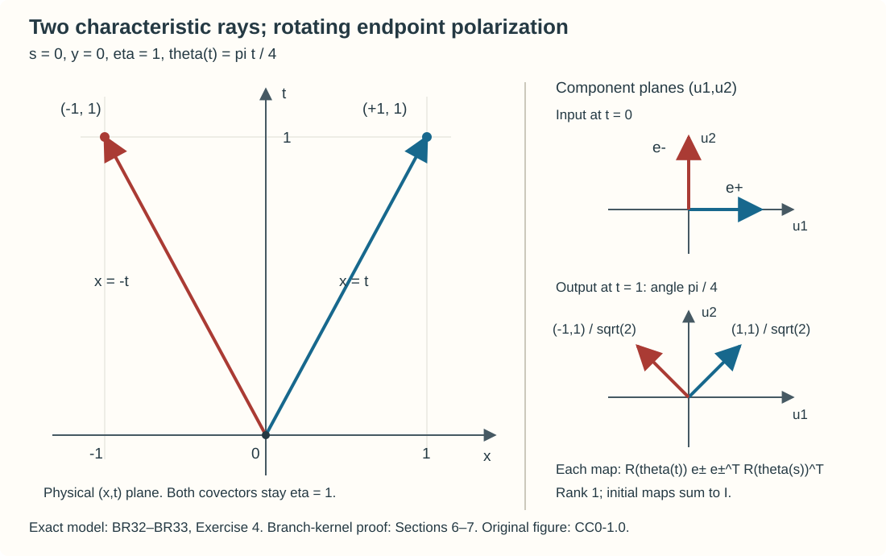

# Separated characteristic branches and polarization

The energy theorem for a Hermitian matrix principal symbol gives a two-sided evolution without choosing eigenvectors. An oscillatory description needs more structure. Each separated eigenvalue has its own Hamiltonian, and its eigenspace carries the transported vector amplitude. This lesson proves the spectral reduction and the branch kernels, including their global smoothing errors and compatibility across local eigenframes.

The analytic providers are [First-order systems and ordered evolution](../20261007-restored-first-order-systems/first-order-systems-and-ordered-evolution.md), Sections 1–4, and [Oscillatory Cauchy kernels and exact evolution](../20261007-restored-oscillatory-cauchy/oscillatory-cauchy-kernels-and-exact-evolution.md), Sections 1–6. The full [Hilbert coefficient calculus](../20261007-restored-first-order-systems/hilbert-coefficient-calculus-and-positivity.md), Sections H1–H3, supplies ordered ordinary products, differentiated remainders, adjoints and all real Sobolev bounds. [Conic parametrices and localization](../20261004-free-intrinsic-graph/prerequisites/conic-parametrices-and-localization.md), Sections K1–K4, proves support-preserving sums, both matrix inverses, proper realization and finite conic partitions. These complete programme proofs provide the calculus; the spectral reduction and branch construction are proved below. The [exact proof map](proof-map.json) binds every use and its prerequisites. Linked components retain their own notices.

Hörmander III, §23.1, Theorem 23.1.4 and the discussion on printed page 390 provide the scalar wavefront and elliptic-FIO context. That scalar result does not supply the several-branch theorem proved here.

## 1. A gap is a hypothesis on the whole parameter neighborhood

Work on a time interval and a conic neighborhood with compact normalized closure inside a larger neighborhood. A symbol of order \(m\) has, on that larger neighborhood, bounds
\[
 |\partial_t^\ell\partial_x^\alpha\partial_\xi^\beta q|
 \leq C_{\ell\alpha\beta}\langle\xi\rangle^{m-|\beta|}.
 \tag{BR1}
\]
All statements concern sufficiently large \(|\xi|\), uniformly in the time parameter. Smooth bounded-frequency changes are microlocally smoothing in this conic problem.

Let \(H_1(t,x,\xi)=H_1(t,x,\xi)^*\) be homogeneous of degree one. Assume its distinct real eigenvalues \(\lambda_1<\cdots<\lambda_k\) have fixed multiplicities \(d_1,\ldots,d_k\), and
\[
 \sum_jd_j=N,\qquad
 |\lambda_j-\lambda_l|\geq c|\xi|\quad(j\ne l).
 \tag{BR2}
\]
The multiplicities refer to a *single* eigenvalue in each branch, not a spectral cluster that may split internally. A cluster with internal crossings leads to a matrix principal block and cannot be treated by the scalar-principal Cauchy lesson merely by renaming that block.

For clarity the coefficient is
\[
 P=\partial_t+A(t),\qquad
 a=i\chi_0(\xi)H_1+C,\qquad C\in S^0,
 \tag{BR3}
\]
where \(\chi_0\) is one at large frequency. The full lower symbol \(C\) can be complex, noncommuting and nonclassical. A global realization with bounded symbol families has the energy hypotheses proved in the preceding systems lesson: the pointwise Hermitian real parts of \(a\) and \(-a\) are uniformly bounded, because \(iH_1\) is skew-Hermitian. The local symbol reduction below makes no assertion that an arbitrary local realization already has global energy or support bounds.

## 2. Smooth projections without differentiating an eigenvector choice

We give the finite-dimensional argument used at every normalized point. A Hermitian matrix has an orthonormal eigenbasis. Indeed the real Rayleigh function \(v^*Hv\) reaches its maximum on the unit sphere. At a maximizing vector \(v\), variations \(v+\epsilon w\) with \(w\perp v\), first with real and then with imaginary \(\epsilon\), give \(w^*Hv=0\). Thus \(Hv=\lambda v\). The orthogonal complement is invariant, since \(v^*Hw=(Hv)^*w=0\). Induction on the dimension proves the claim and reality of all eigenvalues.

Normalize \(\xi=\rho\omega\), \(\rho>0\), \(|\omega|=1\), and set \(h=H_1/\rho\). At one parameter point choose small, disjoint positively oriented complex circles around its distinct eigenvalues. Nearby, each circle remains a uniform distance from the spectrum. To see that the spectrum cannot escape the prescribed neighborhoods, if \(h=h_0+E\) and \(\operatorname{dist}(z,\operatorname{spec}h_0)>\|E\|\), then
\[
 z-h=(z-h_0)\bigl(I-(z-h_0)^{-1}E\bigr)
\]
is invertible by the convergent geometric series. The spectral theorem gives
\(\|(z-h_0)^{-1}\|=\operatorname{dist}(z,\operatorname{spec}h_0)^{-1}\).
The fixed circles can therefore be retained after shrinking the parameter neighborhood.

Define
\[
 \pi_j=\frac{1}{2\pi i}\int_{\Gamma_j}(z-h)^{-1}\,dz.
 \tag{BR4}
\]
Diagonalizing the matrix only at each fixed point evaluates this integral: for a real eigenvalue inside the circle the scalar integral of \((z-\mu)^{-1}\) is one, and for one outside it is zero. This follows directly by a geometric-series expansion on the circle, or on a circle translated to its center. Consequently \(\pi_j\) is the orthogonal projection onto precisely that eigenspace. It is independent of the local contour choice, satisfies
\[
 \pi_j^*=\pi_j,\quad \pi_j\pi_l=\delta_{jl}\pi_j,\quad
 \sum_j\pi_j=I,\quad H_1\pi_j=\lambda_j\pi_j.
 \tag{BR5}
\]

The resolvent is a smooth matrix function of the parameters: its entries are quotients of cofactors by a nonvanishing determinant. More quantitatively,
\(\partial(z-h)^{-1}=(z-h)^{-1}(\partial h)(z-h)^{-1}\).
Repeated differentiation gives finite sums of such ordered products. The uniform contour distance bounds every differentiated normalized projection. Its rank is its integer trace, a continuous function, hence locally constant. Under the fixed-multiplicity hypothesis,
\(\lambda_j=\operatorname{tr}(H_1\pi_j)/d_j\); the branches are smooth without selecting individual eigenvectors. Homogeneity gives \(\pi_j(t,x,\rho\omega)=\pi_j(t,x,\omega)\) and \(\lambda_j(t,x,\rho\omega)=\rho\lambda_j(t,x,\omega)\). Differentiating radial and angular coordinates gives \(\pi_j\in S^0\), \(\lambda_j\in S^1\), with all bounds (BR1). A finite cover of a compact normalized neighborhood makes these bounds uniform. The locally defined projections agree on overlaps because they select the same ordered eigenspace.

There is also an exact polynomial expression,
\[
 \pi_j=\prod_{l\ne j}
       \frac{H_1-\lambda_l I}{\lambda_j-\lambda_l}.
 \tag{BR6}
\]
On the eigenspace of \(\lambda_j\) every factor is the identity; on another eigenspace one factor is zero. All factors are polynomials in the same matrix, so they commute. Formula (BR6) does not assume the eigenspace has dimension one.

Differentiating the denominators in (BR6), or the reciprocal gap directly, gives
\[
 (\lambda_j-\lambda_l)^{-1}\in S^{-1}.
 \tag{BR7}
\]
For example its first derivative is
\(-(\lambda_j-\lambda_l)^{-2}\partial(\lambda_j-\lambda_l)\).
The general derivative is a finite sum of products of differentiated gaps divided by an additional power of the gap. The order in (BR1) is exactly \(-1-|\beta|\); time and base derivatives do not cost a frequency power. The lower bound in (BR2) is essential for uniform constants.

## 3. Local orthonormal frames and their actual domains

At one normalized point choose an \(N\) by \(d_j\) matrix \(B_j\) whose columns are an orthonormal basis of \(\operatorname{ran}\pi_j\). Keep \(B_j\) fixed on the neighboring parameter set and put
\[
 F_j=\pi_jB_j,\quad G_j=F_j^*F_j,\quad
 U_j=F_jG_j^{-1/2},\quad U=(U_1,\ldots,U_k).
 \tag{BR8}
\]
After shrinking, \(\|G_j-I\|<1/2\). The scalar binomial series for \((1+z)^{-1/2}\), applied to \(G_j-I\), converges in matrix norm. Its differentiated series converge uniformly on every smaller bound \(\|G_j-I\|\leq q<1\): differentiation of the \(m\)-th matrix power gives finitely many ordered products and at most a fixed polynomial in \(m\), which is summable against \(q^{m-r}\). Its square times \(G_j\) is the identity by multiplication of the absolutely convergent series. The spectral theorem makes it the positive inverse square root.

Here is the scalar-series input with its full matrix derivative control. Put \(a_0=1\), \(a_m=(-1)^m\binom{2m}{m}/4^m\) and \(f(z)=\sum_{m\ge0}a_mz^m\). Since \(\binom{2m}{m}\le4^m\), the series and all its derivatives converge uniformly for \(|z|\le q<1\). The recurrence \((m+1)a_{m+1}=-(m+\tfrac12)a_m\) gives \((1+z)f'(z)=-f(z)/2\). Thus the derivative of \((1+z)f(z)^2\) vanishes and its value at zero is one. This identity also follows along each radial segment by the real fundamental theorem of calculus. On the real interval \((-1,1)\), the continuous function \(f\) cannot vanish and starts at one, so it is the positive inverse square root. For a Hermitian matrix \(X\) with \(\|X\|\le q<1\), absolutely convergent products and the finite spectral theorem therefore give
\[
 f(X)^* = f(X),\qquad f(X)(I+X)f(X)=I. \tag{BRA1}
\]
For any fixed total parameter derivative order \(r\), differentiation of \(X^m\) produces at most a fixed multiple of \((1+m)^r\) ordered products. For \(m\ge r\), each has at least \(m-r\) undifferentiated factors; the differentiated factors have uniformly bounded norms on the compact parameter set. The majorant is \(C_r(1+m)^rq^{m-r}\), and the finitely many cases \(m<r\) are harmless. This is summable by the ratio test, with a ratio eventually less than a fixed number below one. Difference quotients and the fundamental theorem of calculus now justify termwise differentiation successively. Applied to \(X=G_j-I\), this proves every derivative assertion in (BR8), rather than assuming a matrix functional calculus.

It follows that \(U_j^*U_j=I_{d_j}\). Distinct ranges are orthogonal by (BR5); their dimensions sum to \(N\). Hence
\[
 U^*U=UU^*=I,\qquad
 U^*H_1U=\Lambda
       =\operatorname{diag}(\lambda_1I_{d_1},\ldots,\lambda_kI_{d_k}).
 \tag{BR9}
\]
These frames are homogeneous of degree zero and have all ordinary symbol bounds on a smaller compact normalized neighborhood. The construction works with repeated eigenvalues of fixed multiplicity. It provides a local frame, not a global trivialization of every eigenspace bundle. Exercise 3 gives an explicit complex bundle obstruction despite a uniform gap.

## 4. Remove every off-diagonal ordinary term

We use left quantization with \(D_x=-i\partial_x\). Its full ordinary product has the expansion
\[
 q\#v\sim\sum_\alpha\frac{1}{i^{|\alpha|}\alpha!}
           (\partial_\xi^\alpha q)(\partial_x^\alpha v).
 \tag{BR10}
\]
Matrix products retain this order. To apply the preceding scalar composition estimates to finite matrices, write each product entry as a finite sum over the intermediate matrix index. The integral proof and each remainder estimate apply to every summand, and summing finitely many bounds gives the matrix bound. A time derivative distributes among the factors by the ordinary product rule; the same remainder proof then applies to each differentiated term. This gives (BR10), with a remainder of order \(m+m'-L\) after all terms with \(|\alpha|<L\), for every time, base and frequency derivative. No factors may be commuted. The summation and two ordered inverse proofs cited above retain the same finite parameter seminorms.

Quantize \(U\), using proper support on the larger neighborhood, and let \(R_U\) be a full microlocal inverse, rather than just its pointwise adjoint. Its conjugation has the precise form
\[
 R_U P\,\operatorname{Op}(U)
    =\partial_t+\operatorname{Op}(q)+E_1\partial_t+E_0,\qquad
 q=R_U\#(a\# U+\partial_tU)=i\Lambda+q_0,\quad q_0\in S^0.
 \tag{BR11}
\]
Here \(E_0,E_1\) are microlocally spatially smoothing families, and \(E_1=R_U\operatorname{Op}(U)-I\). A parametrix inverse need not be an exact inverse: its smoothing defect multiplies \(\partial_t\). The symbolic coefficient calculation takes place in the algebra of evolution operators modulo operators whose spatial coefficients are smoothing, retaining this time derivative explicitly. All symbol equalities in this section take place on a fixed smaller cone; cutoffs are identically one on a neighborhood of its normalized closure. Terms supported outside that neighborhood are not declared globally smoothing.

Suppose an intermediate coefficient has diagonal blocks \(i\lambda_jI_{d_j}+c_j\), \(c_j\in S^0\), and off-diagonal part \(e\in S^{-m}\), \(m\geq0\). Set its diagonal correction blocks to zero and, at high frequency, set
\[
 K_{jl}=-\frac{e_{jl}}{i(\lambda_j-\lambda_l)}
       \quad(j\ne l),\qquad K_{jj}=0.
 \tag{BR12}
\]
Then \(K\in S^{-m-1}\) by (BR7). A fixed low-frequency cutoff gives a smooth symbol without changing the microlocal conclusion. For \(V=I+K\), the full inverse has \(V^{-1}=I-K\) modulo \(S^{-m-2}\) when \(m\geq0\), with its further terms determined by (BR10). Its conjugated coefficient is
\[
 q'=V^{-1}\#(q\#V+\partial_tV)
     =q+[i\Lambda,K]\pmod{S^{-m-1}}.
 \tag{BR13}
\]
Here the leading commutator is the pointwise one. Composition derivatives of \(i\Lambda\) against \(K\), and time derivatives of \(K\), have order \(-m-1\). Products of an order-zero lower term and \(K\) also have this order. Quadratic corrections containing the order-one principal term have order \(-2m-1\), which is at most \(-m-1\). These estimates include every parameter derivative. In an off-diagonal block,
\([i\Lambda,K]_{jl}=i(\lambda_j-\lambda_l)K_{jl}=-e_{jl}\).
Thus \(q'\) is block diagonal modulo \(S^{-m-1}\). No order-zero matrix terms within a repeated-eigenvalue block have been divided away.

Iterate this construction. After the step indexed by \(m\), the off-diagonal remainder has order \(-m-1\). Successive conjugators differ by \(S^{-m-1}\), and successive diagonal coefficients differ by \(S^{-m-1}\). In particular the principal frame remains \(U\), and each diagonal principal part remains \(i\lambda_j I_{d_j}\).

For precision, asymptotic summation here is in the complete ordinary classes, not a presumed homogeneous expansion of \(C\). At the \(m\)-th step retain the *whole* current off-diagonal symbol and divide it by the gap. To sum the successive corrections, multiply the correction of order \(-m-1\) by a cutoff that is one for \(|\xi|\geq2R_m\) and zero for \(|\xi|\leq R_m\). Choose \(R_m\) increasingly so that the correction has size at most \(2^{-m}\) in the first \(m\) seminorms of each stronger class whose order is \(-L\) with \(L<m+1\). The negative difference of orders supplies that smallness, also for derivatives falling on the cutoff. Include all time derivatives through order \(m\) in this finite list. The same radii work for the compact time family. Every fixed seminorm then has a convergent tail; after subtracting the first \(M\) terms the tail has order \(-M-1\). This is the required ordinary asymptotic sum.

Summing the conjugators and diagonal coefficients therefore yields \(T\in S^0\), principal frame \(U\), and
\[
 D=\partial_t+\operatorname{diag}
       \bigl(\operatorname{Op}(i\chi_0\lambda_j I_{d_j}+c_j)\bigr),
 \qquad PT-TD\in S^{-\infty}
 \tag{BR14}
\]
microlocally, with \(c_j\in S^0\). To verify the infinite-order identity, compare the summed symbols to a finite construction through a depth exceeding any prescribed order. The omitted conjugator has correspondingly negative order; multiplication by an order-one coefficient loses only one order, while its time derivative loses none. The finite construction already has that prescribed residual order. Since the target order was arbitrary, the residual and every differentiated family are microlocally smoothing.

The full microlocal inverse \(R\) of \(T\) exists because \(U\) is unitary. Choose the leading inverse \(U^*\) and use (BR10) recursively. If \(L\#T=I+e\) at the next negative order, add \(-eU^*\) to \(L\); if \(T\#R'=I+e'\), add \(-U^*e'\) to \(R'\). The ordered products cancel the respective leading errors, and composition derivatives gain another negative order. Summing the corrections with the same parameter rule gives both inverses to all orders. They agree modulo smoothing, since \(L=L(TR')=(LT)R'=R'\) modulo that ideal. Thus
\[
 RT=TR=I\pmod{S^{-\infty}},\qquad
 RP T-D=S_1\partial_t+S_0,\qquad S_0,S_1\in S^{-\infty}
 \tag{BR15}
\]
The second identity is microlocal, with proper quantization understood, and retains the possible smoothing coefficient of the time derivative. Indeed if \(PT-TD=E\) and \(D=\partial_t+B\), then \(S_1=RT-I\) and \(S_0=RE+(RT-I)B\); the latter is spatially smoothing because the smoothing ideal is preserved by finite-order proper composition. The identity also includes the derivative of \(T\). It is not obtained by conjugating \(A(t)\) alone.

## 5. The leading polarization coefficient, with left-quantization signs

The order-zero diagonal coefficient can be computed before the negative-order off-diagonal corrections. Let \(U_j\) be the frame in (BR8). At high frequency, modulo \(S^{-1}\), its \(j\)-th block is
\[
 c_j\equiv U_j^*CU_j
    +U_j^*\bigl(\partial_t+H_{\lambda_j}\bigr)U_j
    +\sum_\nu(\partial_{\xi_\nu}U_j^*)
                    (\lambda_jI-H_1)\partial_{x_\nu}U_j.
 \tag{BR16}
\]
Here \(H_{\lambda_j}=\sum_\nu
(\partial_{\xi_\nu}\lambda_j)\partial_{x_\nu}
-(\partial_{x_\nu}\lambda_j)\partial_{\xi_\nu}\) acts on the frame entries. The third term is retained; a rotating eigenframe is not represented by the projected original lower coefficient alone.

To check the formula, the inverse of the pointwise symbol \(U\) has first correction
\[
 r_{-1}=-\frac1i\sum_\nu
       (\partial_{\xi_\nu}U^*)(\partial_{x_\nu}U)U^*
       \pmod{S^{-2}}.
\]
This is forced by \(r\#U=I\). In \(r\#(iH_1\#U+\partial_tU+C\#U)\), retain all terms of order zero. The terms involving
\((\partial_{\xi_\nu}U^*)(\partial_{x_\nu}U)i\Lambda/i\)
cancel exactly against \(r_{-1}iH_1U\). What remains is
\[
 U^*CU+U^*\partial_tU+
 \sum_\nu U^*(\partial_{\xi_\nu}H_1)\partial_{x_\nu}U
 +\sum_\nu(\partial_{\xi_\nu}U^*)U\,\partial_{x_\nu}\Lambda.
\]
Use
\((\partial_\xi U_j^*)U_j=-U_j^*\partial_\xi U_j\), and differentiate
\(H_1U_j=\lambda_jU_j\) to obtain
\[
 U_j^*(\partial_\xi H_1)
   =(\partial_\xi\lambda_j)U_j^*
       +(\partial_\xi U_j^*)(\lambda_jI-H_1).
\]
The \(j,j\) block is exactly (BR16). The first correction \(K\) in (BR12) changes only off-diagonal blocks at order zero, by (BR13), so (BR16) is also the diagonal coefficient of the fully reduced system modulo \(S^{-1}\). Since \(C\) is allowed to be a full ordinary symbol, (BR16) is an ordinary order-zero identity modulo \(S^{-1}\); it does not assign a nonexistent homogeneous principal part to \(C\).

Changing a local frame within this eigenspace to \(U_jG_j\), with unitary \(G_j\in S^0\), changes the effective block by
\[
 q'_j=G_j^{\#-1}\#(q_j\#G_j+\partial_tG_j),\qquad
 c'_j\equiv G_j^*c_jG_j+
       G_j^*(\partial_t+H_{\lambda_j})G_j\pmod{S^{-1}}.
 \tag{BR20}
\]
The first inverse is the full ordinary symbol inverse; its leading part is \(G_j^*\). For the second identity, expand the full inverse and product through order zero as in (BR16). Since the principal block is scalar, the inverse correction cancels the product term containing \(\partial_xG_j\) next to \(i\lambda_j\), leaving exactly the Hamilton and time derivatives displayed. Under a change of eigenframe, the last term of (BR16) is conjugated by \(G_j\): additional differentiated \(G_j\) factors disappear because \((\lambda_jI-H_1)U_j=0=U_j^*(\lambda_jI-H_1)\). Thus the two computations agree.

## 6. A short-time branch kernel and its global error estimate

Here is the precise receiving theorem. Assume a global bounded-symbol realization of (BR3), so that the full system energy theorem gives \(U_P(t,s)\) on every \(H^r\) in both directions. Let \(K\) be a compact set of base points and normalized covectors, contained in the larger gap neighborhood. Let \(\Psi\) be a properly supported order-zero matrix cutoff with compact base support and conic microsupport inside \(K\). We first take a sufficiently short compact time interval such that all branch flows from \(K\) remain in one frame neighborhood; a finite cover removes this restriction below. Every frequency statement refers to nonzero covectors. The desired short-time conclusion is
\[
 U_P(t,s)\Psi
       =\sum_{j=1}^k F_j(t,s)+S(t,s),
 \qquad
 \operatorname{WF}'(F_j)\subset
       \operatorname{graph}(\Phi_j(t,s)),
 \tag{BR21}
\]
over the input microsupport. Here \(\Phi_j\) is the Hamilton flow of \(\lambda_j\), each \(F_j\) is an order-zero matrix FIO, and \(S\) has a jointly smooth kernel. The remainder has all differentiated bounds \(H^{-M}\to H^L\), for arbitrary finite \(M,L\), after the compact input localization. Its spatial output need not be compact. Endpoint time derivatives are included. A local smoothing coefficient in (BR15) alone would not prove this assertion.

We first make an auxiliary global system to which the block construction genuinely applies everywhere. Shrink the normalized frame neighborhood until \(U_0^*U\) is uniformly close to the identity, where \(U_0\) is its value at the center. The convergent power series for \(\log(I+Z)\) gives a smooth matrix \(L=\log(U_0^*U)\). To prove it is skew-Hermitian, a unitary matrix \(V\) has commuting Hermitian parts \((V+V^*)/2\) and \((V-V^*)/(2i)\). Diagonalize the first using Section 2; its eigenspaces are invariant under the second, which can then be diagonalized on each eigenspace. This gives an orthonormal eigenbasis for \(V\), with unit-modulus eigenvalues. Their logarithms in the small arc about one are imaginary, and the power series agrees with those logarithms. Thus \(L^*=-L\) and \(\exp L=U_0^*U\). Every differentiated series converges uniformly on a smaller bound \(\|Z\|\leq q<1\), by the same polynomial-times-geometric estimate used in (BR8). For completeness the logarithm identity used here follows from a scalar computation. For \(|z|<1\), let \(\ell(z)=\sum_{m\ge1}(-1)^{m+1}z^m/m\). Differentiating the absolutely convergent series gives \(\ell'(z)=(1+z)^{-1}\). On each segment \(tz\), differentiating \(\exp(\ell(tz))/(1+tz)\) gives zero; its initial value is one. Hence \(\exp\ell(z)=1+z\). If \(|1+z|=1\), then \(1=|\exp\ell(z)|=\exp(\operatorname{Re}\ell(z))\), so \(\operatorname{Re}\ell(z)=0\). Diagonalizing the unitary matrix as above evaluates the matrix series on these scalar values and proves both \(L^*=-L\) and \(\exp L=U_0^*U\). The derivative majorants just proved for (BRA1), with the additional harmless factor \(1/m\), give every matrix-logarithm derivative. The factorial majorant for the exponential gives the same control for \(\exp(\vartheta L)\).

Choose a scalar smooth cutoff \(\vartheta\), supported in this neighborhood and one on a smaller one. Set
\[
 U^{\mathrm e}=U_0\exp(\vartheta L),\qquad
 \mu_j^{\mathrm e}=\mu_j^0+\vartheta(\mu_j-\mu_j^0),
 \qquad \mu_j=\lambda_j/|\xi|.
 \tag{BR22}
\]
Extend \(\vartheta L\) and \(\vartheta(\mu_j-\mu_j^0)\) by zero. The scalar cutoff is common to every branch. Hence each extended gap is a convex combination of two positive gaps and is uniformly positive. The exponential is unitary. Outside the support, these objects are constant. They have globally bounded normalized derivatives; radial differentiation therefore gives ordinary symbol bounds. At bounded frequency, replace the exponent by \(\chi_0\vartheta L\) and regularize the degree-one symbols. This retains unitarity and all high-frequency statements.

Let \(\lambda_j^{\mathrm e}=|\xi|\mu_j^{\mathrm e}\) at high frequency, \(H_1^{\mathrm e}=U^{\mathrm e}\operatorname{diag}(\lambda_j^{\mathrm e}I_{d_j})(U^{\mathrm e})^*\), and extend \(C\) using a cutoff one on the smaller neighborhood. The resulting \(P^{\mathrm e}\) agrees microlocally with \(P\) there and has global energy estimates. Apply Sections 2–4 to this globally separated, globally framed system. All summation radii now control the global bounded symbol seminorms. The properly quantized \(T^{\mathrm e},R^{\mathrm e}\) and diagonal \(D^{\mathrm e}\) satisfy
\[
 P^{\mathrm e}T^{\mathrm e}-T^{\mathrm e}D^{\mathrm e}=E,
 \quad T^{\mathrm e}R^{\mathrm e}=I+S_0,
 \qquad E,S_0:H^{-M}\longrightarrow H^L
 \tag{BR23}
\]
for every \(M,L\), with all time derivatives. This follows because each coefficient is a global bounded \(S^{-\infty}\) family: apply the ordinary mapping theorem at a sufficiently negative order for the requested pair of Sobolev indices. Proper quantization changes the full symbol by another bounded smoothing family. The first identity is an intertwining identity and contains no uncanceled time derivative.

Each block of \(D^{\mathrm e}\) has scalar principal symbol \(\lambda_j^{\mathrm e}I_{d_j}\) and a full ordinary \(S^0\) matrix lower symbol. The preceding Cauchy kernel lesson supplies its exact evolution \(V_j^{\mathrm e}(t,s)\) and its graph FIO representation, with the complete ordered transport and all endpoint parameters. Define
\[
 W_j^{\mathrm e}
   =T^{\mathrm e}E_jV_j^{\mathrm e}E_jR^{\mathrm e}(s),
 \qquad W^{\mathrm e}=\sum_j W_j^{\mathrm e},
 \tag{BR24}
\]
where \(E_j\) denotes the constant coordinate block projection, and the block evolution acts on that block. The derivative of \(R^{\mathrm e}(s)\) is irrelevant to the equation in \(t\), but is retained when differentiating the family in \(s\). Direct differentiation gives
\(P^{\mathrm e}W^{\mathrm e}=E\,V^{\mathrm e}R^{\mathrm e}(s)\).
This has all the bounds in (BR23), since each evolution preserves every Sobolev order. Its initial value is \(I+S_0(s)\). Thus \(W^{\mathrm e}\) differs from the exact auxiliary system evolution by a globally smoothing family, by variation of constants. This use of (BR23) avoids trying to treat \(S_1\partial_t\) in (BR15) as an order-zero error.

We now localize and compare with the actual system. Choose a compact spatial output cutoff \(\varphi\) one near all the short-time branch images of \(K\), and use input and conic cutoffs with margins inside the smaller frame neighborhood. Put \(V=\varphi W^{\mathrm e}\Psi\), with the conic output cutoffs understood. These cutoffs equal one on a neighborhood of every relevant graph point. Composition of a PDO with a graph FIO has the ordered stationary expansion proved in the preceding oscillatory lessons. If the PDO symbol and all its derivatives vanish near those graph points, every term vanishes. Each remainder is of arbitrarily negative order. With compact input and spatial output support, such a remainder has all \(H^{-M}\to H^L\) bounds: the frequency integrals for any differentiated kernel converge after taking the order sufficiently negative; integrating by parts in the input frequency variables supplies arbitrary off-diagonal decay. The same argument applies to every endpoint derivative.

Consequently all differences between \(P\) and \(P^{\mathrm e}\), and all derivatives of the localization cutoffs, give smoothing residuals when applied to these branch pieces. A full PDO may also create output outside \(\operatorname{supp}\varphi\). Choose a second compact spatial cutoff \(\varphi_1\) equal to one on a neighborhood of \(\operatorname{supp}\varphi\). The preceding compact-output argument applies inside \(\operatorname{supp}\varphi_1\); outside it the source and output have a fixed positive separation. Repeated frequency integration by parts in the ordinary PDO kernel gives
\[
 \|\partial_x^\alpha\partial_z^\beta K_A(x,z)\|
 \le C_{\alpha\beta L}\langle x\rangle^{-L}
 \quad(z\in\operatorname{supp}\varphi,\ x\notin\operatorname{supp}\varphi_1), \tag{BRA4}
\]
for arbitrary \(L\), also after all time derivatives. The global symbol bounds make the constants uniform; sufficiently many integrations make the remaining frequency integral absolutely convergent. A compact cutoff in \(z\), equal to one on \(\operatorname{supp}\varphi\), makes each kernel row an \(H^M_z\) test with the same rapid \(x\) decay. Sobolev duality bounds its pairing with a compactly supported \(H^{-M}_z\) input. Every \(x\) derivative has this bound, and square integration for sufficiently large decay proves every output Sobolev order, first at integer orders and then by the Fourier weights. The compactly localized graph factor maps each Sobolev space to itself; hence composing this exterior operator with that factor retains every \(H^{-M}\to H^L\) gain. Endpoint derivatives of the graph factor lose only finitely many spatial orders, absorbed by choosing the exterior test order larger. This supplies the complete global tail estimate, including the finite matrix coefficients, with an actual positive separation.

It follows that
\[
 PV=R,\qquad V(s,s)=\Psi+B,\qquad
 B,R:H^{-M}\longrightarrow H^L
 \quad\hbox{for every }M,L.
 \tag{BR25}
\]
The two defects are distinct. Variation of constants in the actual system gives
\[
 V(t,s)-U_P(t,s)\Psi
   =U_P(t,s)B(s)+
       \int_s^t U_P(t,\tau)R(\tau,s)\,d\tau.
 \tag{BR26}
\]
All terms on the right are globally smoothing. For a chosen output index use the energy evolution at that index; its time derivatives lose only finitely many spatial orders, which can be supplied by the arbitrary smoothing gain of \(B,R\). Differentiate the integral and the two endpoint evolution equations; each derivative introduces finitely many coefficient operators and boundary terms, with the same bounds. The delta-column and Sobolev reconstruction argument of the preceding Cauchy lesson therefore gives an actual jointly smooth kernel. This proves (BR21), including the global error estimate, in a short frame tube.

The norm estimates needed for these time differentiations hold for the actual matrix-principal evolution as well. Write \(U=U_P\). The energy bounds and the integrated equation give
\[
 \|U(t+h,t)-I\|_{H^{q+1}\to H^q}\le C_q|h|,\qquad
 \|U(t+h,t)-I+hA(t)\|_{H^{q+2}\to H^q}\le C_qh^2. \tag{BRA2}
\]
Indeed \(U(t+h,t)-I=-\int_t^{t+h}A(v)U(v,t)\,dv\). Smooth time-symbol seminorms and the finite-seminorm Sobolev bound make \(A(v)-A(t)\) of norm \(O(|v-t|)\) from \(H^{q+1}\) to \(H^q\). Split \(A(v)U(v,t)-A(t)\) into \((A(v)-A(t))U(v,t)+A(t)(U(v,t)-I)\); the first estimate one spatial order higher bounds the second term. Integration over either orientation proves (BRA2). The group law then gives \(\partial_tU=-A(t)U\) and \(\partial_sU=UA(s)\) in operator norm with sufficiently many extra input orders. Repeated difference quotients distribute among finitely many factors and prove the corresponding higher mixed derivatives, with a finite additional spatial loss at each step. Every smoothing family in (BR23)–(BR26) supplies those orders, so these are norm estimates uniform on the input unit ball. The differentiated Bochner integral therefore has an integrable norm majorant on the compact time interval. Applying the delta-column construction of the preceding Cauchy lesson proves the claimed joint kernel smoothness without assuming operator-norm continuity on a fixed Sobolev space.

## 7. Glue the polarization bundles over a finite time interval

Let a compact finite-time family of all the branch trajectories from \(K\) lie inside a larger normalized neighborhood on which the fixed multiplicities and uniform gap hold. The flow bounds follow from the homogeneous degree-one Hamilton equations as in the preceding Cauchy lesson. Their images have compact normalized closure, so finitely many frame neighborhoods and sufficiently short time steps cover them. We prove why this construction does not introduce spurious paths that switch branches at an intermediate time.

In each frame patch define a full ordinary microlocal projection
\[
 \Pi_j=T E_jR,\qquad
 \Pi_j^2=\Pi_j,\quad
 \Pi_j\Pi_l=0\ (j\ne l),\quad
 \sum_j\Pi_j=I,\quad [P,\Pi_j]=0
       \pmod{S^{-\infty}}.
 \tag{BR27}
\]
All equalities concern spatial coefficients on the patch. The algebraic identities follow from \(RT=TR=I\) modulo smoothing. For the commutation identity use \(PT=TD+E\), the block diagonal form of \(D\), and differentiate the inverse family explicitly:
\[
 [P,\Pi_j]=(\partial_tT+AT-TB)E_jR
     +T E_j(\partial_tR+BR-RA)+T[B,E_j]R.
\]
Substitute \(\partial_tT+AT-TB=E\), \(D=\partial_t+B\), and differentiate \(RT=I\) modulo smoothing to obtain
\(\partial_tR+BR-RA\in S^{-\infty}\).
Indeed \((\partial_tR)T+R(\partial_tT)\) is smoothing; substituting the equation for \(T\) and multiplying by its right parametrix gives the asserted identity. Since \(BE_j=E_jB\), every displayed term is smoothing. This calculation involves the derivative of the inverse family, and does not replace a parametrix by an exact inverse.

These projections are unique to all orders with these properties and principal symbols \(\pi_j\). Here is the needed uniqueness argument. If \(\widetilde\Pi_j-\Pi_j=\delta\in S^{-m}\), \(m\geq1\), idempotence implies
\[
 \pi_j\delta+\delta\pi_j-\delta
                     \in S^{-m-1}.
 \tag{BR28}
\]
The quadratic difference has order at most \(-2m\), and products with the negative-order parts of the projections lose another order. In the eigenframe, (BR28) forces the \(j,j\) block and all blocks with neither index \(j\) to have order \(-m-1\). The commutation equations imply
\([iH_1,\delta]\in S^{-m}\): the time derivative and composition derivatives have order at most \(-m\). In a remaining \(j,l\) or \(l,j\) block, dividing this bound by the gap improves its order to \(-m-1\). Thus \(\delta\in S^{-m-1}\). Induction proves uniqueness modulo \(S^{-\infty}\). The same proof applies with every parameter derivative, because the gap reciprocal has (BR7).

Thus projections from different frames agree to all orders on their overlaps. Smooth finite partitions on the normalized cover glue their symbols. To see that the equations survive gluing, near any point replace every local representative by one fixed representative plus a smoothing symbol. The partition sums to one there; its differentiated sums are zero. All additional terms are smoothing. This gives \(\Pi_j\) on a neighborhood of the compact trajectory family, without any global eigenframe. Extend the symbols arbitrarily outside a larger neighborhood, retaining bounded symbol estimates and proper support. The identities (BR27) are asserted only near the trajectories. Operators supported outside this region become globally smoothing after composition with the compactly localized branch kernels, by the argument following (BR24).

At one short time step take a finite partition \(\{\chi_a\}\) of the input phase neighborhood, subordinate to the frame tubes, with \(\sum_a\chi_a=1\) near the full intermediate trajectory set. Quantize its symbols properly. Use the local branch kernels of Section 6 with input
\(\Pi_j(s)\operatorname{Op}(\chi_a)\Pi_j(s)\), and if needed apply \(\Pi_j(t)\) at the output. The inserted projections have the same microsupport and preserve the global residual estimates. At the initial endpoint the sum over \(a\) is \(\Pi_j(s)\) modulo smoothing; summing over \(j\) gives the identity on the required input neighborhood. Denote the resulting short-step branch families by \(F_{rj}\). They satisfy
\[
 \Pi_j(t_r)F_{rj}=F_{rj}
       =F_{rj}\Pi_j(t_{r-1})
       \pmod{\text{globally smoothing}}
 \tag{BR29}
\]
after the declared compact phase localization. Indeed in one patch the inverse and intertwiner reduce \(\Pi_j\) to \(E_j\), and \(V_j^{\mathrm e}\) acts only in that block. The local and glued projections agree to all orders; the remaining errors vanish near the graph and have the global estimates already proved. Applying an output projection adds \([P,\Pi_j]F_{rj}\) to the residual, which is smoothing for exactly the same reason.

Compose the finitely many short-step sums, inserting spatial and conic cutoffs one near the entire output microsupport of the preceding factor. The actual evolution group law and (BR26) show that their product equals \(U_P(t,s)\Psi\) modulo a globally smoothing family. Each finite product containing a smoothing factor remains smoothing, since the other factors are bounded on every Sobolev space. Expanding the product produces words in the branch indices. If two consecutive indices differ, (BR29) places
\(\Pi_j(t_r)\Pi_l(t_r)\) between the factors, and (BR27) makes that word smoothing. Only words staying in one branch remain:
\[
 U_P(t,s)\Psi
   =\sum_j F_{mj}\cdots F_{1j}\Psi+S(t,s).
 \tag{BR30}
\]
The canonical graphs in each surviving word compose with zero excess: every intermediate phase point is uniquely the Hamilton image of the input one, and the tangent intersection is transverse because every graph is a diffeomorphism. The complete ordinary graph-composition proof in the preceding oscillatory lessons then gives an order-zero FIO on
\(\operatorname{graph}(\Phi_j(t,s))\). All cutoffs are one near its full output microsupport, so their removed tails are smoothing with the stated global bounds. Reversing the time subdivision proves the same result for the other direction. On compact endpoint families choose a common sufficiently large number of affine time steps; differentiated endpoint parameters remain in the same proved symbol and remainder classes.

The transport has an invariant meaning. Here the transport map is described before multiplication by the scalar input cutoff; an elliptic scalar cutoff preserves its rank. In local frames the branch amplitude is the invertible ordered matrix transport from the scalar-principal Cauchy lesson, multiplied by its nonzero half-density factor. The endpoint frame maps identify this amplitude as
\[
 \operatorname{ran}\pi_j(s,y,\eta)
       \longrightarrow
 \operatorname{ran}\pi_j(t,\Phi_j(t,s)(y,\eta)).
 \tag{BR31}
\]
Its initial map is the identity on that eigenspace. Inverse ordered transport and bounded flow Jacobians give an inverse with uniform ordinary order-zero estimates, modulo the lower-order corrections. The map therefore has rank \(d_j\) and is elliptic as a map of these two bundles. Formula (BR20) gives the frame-change rule; frame changes at consecutive endpoints cancel in the composition. Phase and Maslov changes are those of the proved graph calculus. No globally chosen eigenvectors are needed, as Exercise 3 already requires.

The inverse assertion for a branch can be made directly at the operator level. Work near an input-output pair where the scalar input cutoff is elliptic, or choose the localization to be one near that pair. Shrinking the cone gives a uniform inverse for that scalar cutoff. Choose the two endpoint frames and restrict to the \(d_j\)-dimensional coordinate block. The forward graph amplitude there has an invertible ordinary order-zero matrix coefficient, including its nonvanishing half-density factor. The two-sided graph inverse proof in the preceding Cauchy and graph lessons applies to this square block: choose its inverse coefficient on the reversed graph, use the full graph product to identify the two order-minus-one errors, and remove them by the ordered parametrix recursion and parameter-aware summation. Restore the endpoint frame operators and sandwich by the full projections. This gives a localized reverse graph family \(G_j\) satisfying
\[
 G_jF_j=\Pi_j(s),\qquad F_jG_j=\Pi_j(t)
       \pmod{\text{smooth kernels}}. \tag{BRA3}
\]
Every equality is on the smaller declared cone, where all cutoffs are one; the other pieces have the same global smoothing bounds after compact input localization. On an overlap, the two inverses agree modulo smoothing, since \(G_j=G_j(F_j\widetilde G_j)=(G_jF_j)\widetilde G_j=\widetilde G_j\) in the projected algebra. A finite conic partition therefore gives compatible local inverses. The diagonal projection kernel is not smooth at any nonzero covector in the rank-\(d_j\) block: conjugating by the full local frame reduces it to the identity on that block modulo smoothing, and the arbitrary-cutoff diagonal Fourier proof in the preceding Cauchy lesson supplies every such direction. Thus (BRA3) gives the exact reverse wavefront implication even though \(F_j\) has rank less than \(N\) in the ambient matrix space.

On an input cone where the scalar cutoff \(\Psi\) is elliptic, the full matrix wavefront of the kernel is exactly the union of these branch graphs. The upper inclusion follows from (BR30). For the reverse inclusion, multiply the kernel at an output graph point by \(\Pi_j(t)\) and at the input by \(\Pi_j(s)\). This kills the other branches to all orders, even if their graphs happen to meet at that point. The \(j\)-th branch has the elliptic rank-\(d_j\) amplitude (BR31), so its kernel is not smooth there by the inverse graph argument in the preceding Cauchy lesson. Hence that graph point belongs to the full matrix wavefront. This does not claim that each individual matrix entry is singular there: an entry or a chosen polarization can vanish.

For compactly supported distributional data \(f\) with normalized wavefront contained in \(K\), choose a scalar \(\Psi\) one near that wavefront. The precise projected statement on a declared branch tube is this: \((y,\eta)\) belongs to \(\operatorname{WF}(\Pi_j(s)f)\) if and only if \(\Phi_j(t,s)(y,\eta)\) belongs to \(\operatorname{WF}(\Pi_j(t)U_P(t,s)f)\). Use cutoffs one near the entire intervening branch trajectory. The remainder \(f-\Psi f\) is smooth with compact support, hence belongs to every Sobolev space and stays smooth under the energy evolution. Formula (BR29) reduces the localized statement to the elliptic bundle map (BR31), whose inverse graph parametrix proves the reverse implication. These are the full projections (BR27); the pointwise principal projection alone need not detect a weaker singularity created by a negative-order correction. Initial support alone gives no such equivalence. The theorem covers compact trajectory families satisfying the gap hypothesis. Crossings and internally splitting clusters remain outside it; their energy evolution does not supply this scalar-block FIO construction.

## 8. Graded exercises with complete solutions

**Exercise 1 — intermediate: a rotating frame contributes a lower term.**
Let \(\rho=|\xi|>0\) on a fixed frequency cone and
\[
 R_\theta=\begin{pmatrix}\cos\theta&-\sin\theta\\
                          \sin\theta&\cos\theta\end{pmatrix},
 \qquad
 H_1(t,\xi)=\rho R_{\theta(t)}
                \begin{pmatrix}1&0\\0&-1\end{pmatrix}R_{\theta(t)}^T.
\]
Take \(C=0\). Compute the coefficient in the rotating frame, its first off-diagonal correction, and the exact eigenvalues when \(\theta'(t)=\omega\) is constant.

**Solution.** There are no base-variable composition corrections. For this calculation label the positive branch first and the negative branch second; (BR12) uses the signed difference for that labeling. With \(U=R_\theta\),
\[
 q=i\rho\begin{pmatrix}1&0\\0&-1\end{pmatrix}
       +\theta'\begin{pmatrix}0&-1\\1&0\end{pmatrix},
 \qquad
 K_{12}=K_{21}=\frac{\theta'}{2i\rho},\quad K_{11}=K_{22}=0.
 \tag{BR17}
\]
For the \(1,2\) block, the gap commutator equals
\(i(2\rho)\theta'/(2i\rho)=\theta'\), cancelling \(-\theta'\);
for the \(2,1\) block it equals \(-\theta'\), cancelling \(\theta'\).
The time derivative of \(K\) and all remaining products have order \(-1\). Omitting \(U^*U_t\) would incorrectly give no first correction.

For constant \(\omega\),
\[
 q=\begin{pmatrix}i\rho&-\omega\\\omega&-i\rho\end{pmatrix},
 \quad \det(\zeta I-q)=\zeta^2+\rho^2+\omega^2.
\]
Its eigenvalues are \(\pm i\sqrt{\rho^2+\omega^2}\). On the positive-\(\rho\) cone their expansions are
\(\pm i(\rho+\omega^2/(2\rho)+O(\rho^{-3}))\).
The order-zero time connection therefore affects the reduced diagonal coefficient at order minus one even though its diagonal part at order zero vanishes. The eigenvalues of the principal matrix alone do not give this full coefficient.

**Exercise 2 — intermediate: energy can survive a closing spectral gap.**
On a compact time interval containing zero, take
\[
 q(t,\xi)=it\rho\begin{pmatrix}1&0\\0&-1\end{pmatrix}
           +\omega\begin{pmatrix}0&-1\\1&0\end{pmatrix},
 \qquad \omega\ne0.
\]
Explain why the energy evolution is two-sided and why (BR12) is not uniform across \(t=0\).

**Solution.** Both summands are skew-Hermitian. After a smooth low-frequency regularization of \(\rho\), the pointwise Hermitian real part is zero, and the compact time family satisfies the ordinary order-one estimates. The preceding systems energy theorem gives both time directions, with every real Sobolev order. In this spatially constant model the Fourier evolution is unitary at each frequency, since
\(\partial_t|\widehat u|^2=-2\operatorname{Re}\langle q\widehat u,\widehat u\rangle=0\);
integrating with the Sobolev weight gives exact preservation of the Sobolev norm.

Away from zero the branch gap is \(2|t|\rho\). The correction contains
\(\omega/(2it\rho)\), which has no uniform bound, much less uniform time-derivative bounds, on an interval containing zero. The principal eigenspaces in this example are constant, so the failure is not caused by a bad eigenvector choice. What fails is the uniformly invertible off-diagonal commutator. Neither this example nor the energy theorem establishes a general crossing FIO construction.

**Exercise 3 — advanced: a uniform gap need not give a global complex frame.**
For \(\xi\in\mathbb R^3\setminus0\), set \(\rho=|\xi|\), \(\omega=\xi/\rho\), and
\[
 H_1=\rho\begin{pmatrix}
 \omega_3&\omega_1-i\omega_2\\
 \omega_1+i\omega_2&-\omega_3
 \end{pmatrix}.
 \tag{BR18}
\]
Compute its eigenprojections. Construct local positive-eigenvalue unit vectors on the northern and southern charts, and prove that no smooth nonvanishing global vector can span the positive eigenspace on the whole sphere.

**Solution.** Direct multiplication gives \(H_1^2=\rho^2I\), and its trace is zero. Its eigenvalues are \(\pm\rho\), with gap \(2\rho\), and
\(\pi_\pm=(I\pm H_1/\rho)/2\). They are smooth homogeneous projections on every nonzero covector.
The vectors
\[
 v_N=\frac{(1+\omega_3,\ \omega_1+i\omega_2)^T}
                 {\sqrt{2(1+\omega_3)}},\qquad
 v_S=\frac{(\omega_1-i\omega_2,\ 1-\omega_3)^T}
                 {\sqrt{2(1-\omega_3)}}
 \tag{BR19}
\]
have unit norm and satisfy \(H_1v=\rho v\) on their charts. Their excluded poles are respectively the south and north pole. On the equator \(\omega=(\cos\phi,\sin\phi,0)\),
\(v_N=(1,e^{i\phi})^T/\sqrt2\) and \(v_S=(e^{-i\phi},1)^T/\sqrt2\), so \(v_S=e^{-i\phi}v_N\).

Suppose a global smooth nonvanishing section exists and normalize it to unit length. On the northern closed hemisphere it equals \(a v_N\), and on the southern it equals \(b v_S\), where \(a,b\) are smooth circle-valued functions on disks. Each such function has a periodic real argument on the boundary. To prove this without a topological assumption, pull the disk back by polar coordinates and choose an argument \(\alpha_0\) of its value at the center. Define
\[
 \alpha(r,\phi)=\alpha_0+
       \int_0^r\operatorname{Im}
       \bigl(a(s,\phi)^{-1}\partial_s a(s,\phi)\bigr)\,ds.
\]
Since \(|a|=1\), its logarithmic radial derivative is purely imaginary. Differentiation shows
\(\partial_r(e^{-i\alpha}a)=0\), and the value at the center is one. Thus \(a=e^{i\alpha}\). The integrand and initial value are periodic in \(\phi\), so its boundary argument is periodic. The same construction gives a periodic boundary argument \(\beta\) for \(b\).

On the equator the proposed section gives
\(e^{i\alpha}=e^{i\beta-i\phi}\). Hence
\(\alpha-\beta+\phi\) is a continuous integer multiple of \(2\pi\), and therefore constant. Its value increases by \(2\pi\) as \(\phi\) runs from zero to \(2\pi\), because \(\alpha\) and \(\beta\) are periodic. This contradiction excludes the global section. Any global unitary diagonalizer would have such a column. Local frames and compatible bundle maps are consequently necessary even in this explicit uniformly separated Hermitian example.

**Exercise 4 — advanced: an exact two-branch kernel with rotating polarization.**
In one space dimension let \(\theta(t)\) be smooth,
\(J=\begin{pmatrix}0&-1\\1&0\end{pmatrix}\), and
\[
 P=\partial_t+
       R_{\theta(t)}\begin{pmatrix}1&0\\0&-1\end{pmatrix}
                         R_{\theta(t)}^T\partial_x-\theta'(t)J.
 \tag{BR32}
\]
Find the exact kernel, including its two endpoint polarization maps, and compare it with Exercise 1.

**Solution.** Put \(u=R_{\theta(t)}v\). The rotation satisfies
\(\partial_tR_\theta=\theta'J R_\theta\). Multiplying by \(R_\theta^T\), the time connection cancels the specified lower coefficient, leaving
\(\partial_tv+\operatorname{diag}(1,-1)\partial_xv=0\).
Therefore \(v_+(t,x)=v_+(s,x-(t-s))\) and
\(v_-(t,x)=v_-(s,x+(t-s))\). With \(e_+=(1,0)^T\), \(e_-=(0,1)^T\), the exact distribution kernel is
\[
 K(t,s;x,y)=
 \sum_{\epsilon=\pm1}
   R_{\theta(t)}e_\epsilon e_\epsilon^T R_{\theta(s)}^T
                  \delta\bigl(x-y-\epsilon(t-s)\bigr).
 \tag{BR33}
\]
Each nonzero endpoint matrix has rank one and maps the input eigenline onto the output eigenline. Its canonical graph is
\((y,\eta)\mapsto(y+\epsilon(t-s),\eta)\). On the cone \(\eta>0\), the principal eigenvalues are \(+\eta,-\eta\), with gap \(2\eta\); on the negative cone their ordered labels reverse. The physical kernel formula is valid in both cones. At \(t=s\), the sum of its endpoint projections is the identity, so the initial kernel is \(I\delta(x-y)\).

For the pictured instance \(s=0\), \(y=0\), \(\theta(t)=\pi t/4\), the two rays end at \(x=1\) and \(x=-1\) when \(t=1\), their covectors stay \(\eta=1\), and their output polarization vectors are respectively \((1,1)^T/\sqrt2\) and \((-1,1)^T/\sqrt2\). This exact model keeps the two branches distinct while their polarizations rotate. In Exercise 1 the lower coefficient was zero; its time connection survived and required negative-order corrections. Here the explicit lower coefficient cancels that connection exactly.

Figure: the horizontal axis is \(x\) and the vertical axis is \(t\), with \(s=y=0\). The arrows in the separate polarization plane represent actual vector components, not additional spatial rays. Both rank-one maps are given by (BR33); the gap is \(2\) at \(\eta=1\). Reproducible figure source and finite model checks accompany this lesson. Proof locators: Sections 6–7 and Exercise 4.

References: Lars Hörmander, *The Analysis of Linear Partial Differential Operators III*, Springer, §23.1, especially Theorem 23.1.4 and the following scalar FIO discussion on printed page 390. The complete proofs used in this system argument are written above or in the exact earlier programme lessons linked in the introduction.

*Written by GPT-6.1 Sol (OpenAI), Ultra; restoration and additional receiving proofs by GPT-6 Astra (OpenAI), Ultra, October 2026. Self-checked by the writing AI. Original text and figure: CC0-1.0; linked components retain their own terms.*
