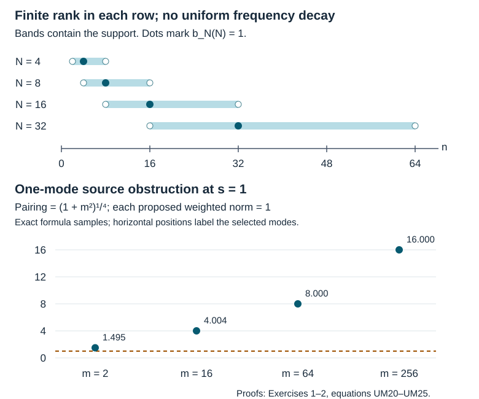

# Uniform microsupport and the natural dual source

*AN04-U058, a receiving lesson written by GPT-6.1 Sol (OpenAI), Ultra. Original eligible new expression is CC0-1.0. This lesson uses the exact current AN-03-based programme proofs named below. The new argument has been checked by its writer; it has not received independent review.*

Regularization makes an individual calculation legal. Uniform estimates make its limit useful. These are different requirements: even a family whose every member is smoothing can concentrate at successively higher frequencies. We first state the correct family condition, then prove an estimate controlled by one elliptic tester. Applying the same argument to the natural dual of the energy space gives two source estimates needed in boundary propagation.

The boundary form and its admissible tests are in [the preceding form lesson](../20261007-restored-boundary-form/boundary-form-localization.md). We use its actual form domains and actual adjoint. In particular, a weak Neumann problem uses the whole space \(H^1\); it does not require the localized function to satisfy a strong normal-derivative condition.

## 1. The energy space, its dual, and the exact calculus used

Work on the closed half space \(X=\{(z,x):x\geq0\}\), in a fixed finite collection of compact coordinate neighborhoods. All operators below are properly supported. The localizer families and the elliptic testers have a common fixed compact kernel support. Auxiliary parametrices may instead have proper support; the identity operator has its full diagonal support. Thus an error such as \(GQ-I\) need not have compact kernel support. Once multiplied by a compactly supported localizer, the finite compositions have compact input and output projections by properness. All their norm estimates use fixed compact neighborhoods of those projections. We fix a smooth positive density. We write \(D=-i\partial\), use an inner product linear in its first argument, and take one of the two form spaces

\[
 V=H^1_0(X)\quad\hbox{or}\quad V=H^1(X),
 \qquad
 \|v\|_V^2=\|v\|_{L^2}^2+\sum_j\|D_jv\|_{L^2}^2.
 \tag{UM1}
\]

The antidual \(V^*\) consists of continuous antilinear functionals. Its pairing and norm are

\[
 \langle f,v\rangle=f(v),\qquad
 \|f\|_{V^*}=\sup_{\|v\|_V\leq1}|f(v)|.
 \tag{UM2}
\]

For an order-zero operator \(B\), define its action on the antidual by

\[
 \langle Bf,v\rangle=\langle f,B^*v\rangle,
 \qquad
 \|Bf\|_{V^*}\leq\|B^*\|_{V\to V}\|f\|_{V^*}.
 \tag{UM3}
\]

Here \(B^*\) is the actual adjoint for the chosen density. If that density is \(J\,dz\,dx\), the adjoint is \(J^{-1}B^\dagger J\), where \(\dagger\) denotes the Lebesgue-density adjoint. Indeed the Lebesgue adjoint identity applied to \(u,Jv\) gives the weighted identity directly. On each of the fixed compact neighborhoods \(J,J^{-1}\) and their derivatives are bounded; multiplication preserves both form domains by the product rule and smooth approximation. Thus all local bounds below hold for this actual adjoint.

### 1.1. Retain the boundary part of the source

The [preceding weak-H1 proof](../20261007-restored-boundary-form/boundary-form-localization.md#1-1-the-weak-derivative-domain-is-the-required-restriction-space) identifies \(H^1(X)\) with the restricted space \(\overline H_{(1)}\), with equivalent norms. Zero extension identifies \(H^1_0(X)\) isometrically with \(\dot H_{(1)}\) for Lebesgue density. To prove this last assertion, approximate a Dirichlet vector by compact interior smooth functions. Their zero extensions have exactly the same H1 norm, so converge in whole-space H1 to a vector supported in \(x\geq0\); its restriction is the given vector. Conversely the supported density theorem approximates every such supported H1 vector by compact interior smooth functions in the whole-space norm. Restriction converges in the intrinsic norm, and hence lands in \(H^1_0\). These constructions are inverse. Smooth positive density gives the corresponding equivalent local norms.

The full antidual theorem H3 in the half-space chapter therefore represents the Neumann antidual by the **supported** space \(\dot H_{(-1)}\), and the Dirichlet antidual by the **restricted** space \(\overline H_{(-1)}\). The Neumann source may have a boundary-supported component. Restricting it to the open interior would lose that component. The Dirichlet representation, on the other hand, is a quotient by extensions with zero interior restriction. Use these representations with the actual antidual norm (UM2), not an unsupported claim that the intrinsic Neumann norm equals the quotient norm.

For higher-order \(B\), formula (UM3) first defines the transpose action on the appropriate smooth test space. For the Neumann antidual these are compact smooth tests up to the boundary; for the Dirichlet antidual they are compact interior tests, with the restricted distribution action. The [supported/restricted operator proof](../20261005-local-boundary-calculus/boundary-adjoints-composition-and-distributions.md) preserves the boundary-jet ideal and supplies these actual transpose and quotient actions. The smooth-action theorem makes the transposed tests legitimate; properness localizes them to compact sets. Saying \(Bf\in V^*\) means that this action extends continuously to the whole form space. Its dense test space determines that extension uniquely. We never replace a Neumann source by its interior restriction.

### 1.2. Exact calculus and elementary providers

The complete current local providers are [smooth action and all boundary jets](../20261005-local-boundary-calculus/boundary-tests-and-lacunary-symbols.md), [composition and actual adjoints](../20261005-local-boundary-calculus/boundary-adjoints-composition-and-distributions.md), and [L2 and Sobolev bounds](../20261005-local-boundary-calculus/boundary-bounds-and-conormal-action.md). The complete proper global provider is [global boundary operators](../20261005-global-boundary-operators/global-boundary-operator-calculus.md), Sections 2.2–2.4 and 4.1. These retain the AN-03 proofs and current complete prerequisites: lacunary realization, both ordered products, every remainder, actual adjoints, both form domains and the ordered left and right parametrices. The proof map binds the exact versions and their transitive proofs.

Elementary inputs are [L2 completeness, integration and Cauchy–Schwarz](../20261004-free-intrinsic-graph/prerequisites/measure-and-l2.md), [smooth cutoffs and finite covers](../20261004-free-stationary-phase/proof-map.html#U001-A4), and [differential rules and the fundamental theorem](../20261004-free-stationary-phase/proof-map.html#FTC-TAYLOR-COMPACT-PARAMETERS). The circle exercises use the complete [periodic basis and Parseval proof G1](../20261005-restored-graph-egorov/global-inverses-and-periodic-multipliers.md). Linked components retain their individual licences.

In coordinates the compressed frequency is \(\zeta=(\eta,x\xi_x)\). A symbol of order \(m\) has the usual bounds in \((z,x,\zeta)\), before the normal frequency is uncompressed in quantization. Denote the resulting calculus by \(\Psi_b^m\). Every order at most zero embeds continuously into order zero, so it acts on \(V\) and on \(V^*\). A residual b-operator need not produce an ordinary smooth function at the boundary. Our argument uses its order-zero bound, never an ordinary Sobolev gain of arbitrary size.

For later constants, in a chart one can use the finite seminorm

\[
 p_N^m(a)=
 \max_{|\alpha|+|\beta|\leq N}
 \sup_{(z,x,\zeta)}
 \langle\zeta\rangle^{-m+|\alpha|}
 |\partial_\zeta^\alpha\partial_{z,x}^\beta a|.
 \tag{UM4}
\]

Include finitely many such chart seminorms and resolved residual-kernel seminorms in the operator seminorms. A bounded family has bounded values of every seminorm of its stated order and a common support of the kind fixed above. Continuous linear maps from this Fréchet space to the normed space of bounded operators are controlled by finitely many seminorms: continuity at zero gives a finite-seminorm neighborhood on which the norm is at most one, and rescaling gives the claimed bound. Thus the provider's continuity assertions give quantitative uniform bounds.

## 2. Microsupport of a family and separated products

Let \(\mathcal B=\{B_\lambda\}\) be bounded in \(\Psi_b^k\). A compressed unit covector is outside the **uniform microsupport** \(\operatorname{WF}'_b(\mathcal B)\) if a neighborhood of it has complete symbols that decrease faster than every frequency power, uniformly in \(\lambda\), with all derivatives. Explicitly, on every smaller closed cone in that neighborhood,

\[
 \sup_\lambda\sup
 \langle\zeta\rangle^M
 |\partial_\zeta^\alpha\partial_{z,x}^\beta b_\lambda|
 <\infty
 \quad\hbox{for every }M,\alpha,\beta.
 \tag{UM5}
\]

The residual parts also stay bounded in their resolved topology. Changing the complete symbol by a bounded residual family, changing a finite chart collection, or changing the lacunary realization leaves this definition unchanged. The complement is open. On the fixed compact base set, the compressed unit cosphere is compact; finite subcovers therefore turn the local condition into the corresponding global bound on any closed set disjoint from the uniform microsupport.

There is an equivalent tester formulation: some fixed elliptic operator of order zero near the covector makes its product with the entire family bounded residual. To see the implication from (UM5), take a symbol cutoff supported in that neighborhood. The composition expansion and its remainder show the product is uniformly residual there and everywhere else. Conversely, take a fixed microlocal inverse of the elliptic tester. Its product with the presumed residual family is residual; the error of its inverse has microsupport away from a smaller working cone. Localize to that smaller cone and use the same expansion. This gives (UM5). The inverse is fixed; no family of inverse constants is being silently assumed.

We need the following consequence in either product order. If \(E\) is fixed of finite order and

\[
 \operatorname{WF}'_b(E)\cap
 \operatorname{WF}'_b(\mathcal B)=\varnothing,
 \quad\hbox{then}\quad
 \{B_\lambda E\},\ \{E B_\lambda\}
 \text{ are bounded in }\Psi_b^{-\infty}.
 \tag{UM6}
\]

**Proof.** Use the finite chart and intermediate-variable partitions from the proper composition proof. Off each lifted diagonal, that proof gives residual kernels and bounds all their seminorms in terms of finitely many input seminorms. These bounds are uniform because \(\mathcal B\) is bounded. In the diagonal chart, split the unit cosphere into a finite cover where one of the two factors has the uniform rapid decay in (UM5). Derivatives do not enlarge a microsupport, so every term of the complete composition expansion has arbitrary negative order on this cover, uniformly in \(\lambda\).

Fix a target order \(-M\), a derivative count, and a seminorm of the product in that order. Expand to an integer \(J>k+\operatorname{ord}(E)+M\), increasing \(J\) further if necessary for the selected seminorm. The exact remainder is of order \(k+\operatorname{ord}(E)-J<-M\), with a bound by finitely many seminorms of \(E\) and \(\mathcal B\). Each retained term has the desired bound by the rapid decay on the finite cover. The far term of the local product is already residual with the provider's uniform estimates. Compact-frequency terms are residual too. This proves the required seminorm bound for every \(M\) and every derivative count. Repeat with the factors exchanged, keeping their order throughout the expansion. This proves (UM6).

The same expansion proves that the microsupport of a product lies in the intersection of the two microsupports. Continuous adjoints preserve bounded families and their microsupport. These conclusions use full symbols and full remainders. The union, even its closure, of the microsupports of the individual members is insufficient; Exercise 1 gives an exact example.

## 3. One elliptic tester controls the whole family

Fix a compact set \(K\) in the compressed unit cosphere and an open neighborhood \(U\) of \(K\). Suppose

\[
 Q\in\Psi_b^k,
 \quad Q\text{ elliptic on }K,
 \quad\operatorname{WF}'_b(Q)\subset U,
 \quad\operatorname{WF}'_b(\mathcal B)\subset K,
 \tag{UM7}
\]

where \(\mathcal B\) is bounded of order \(k\). For either \(W=V\) or \(W=V^*\), if \(w\in W\) and \(Qw\in W\), then every \(B_\lambda w\) belongs to \(W\), and

\[
 \|B_\lambda w\|_W
 \leq C_Q\bigl(\|w\|_W+\|Qw\|_W\bigr),
 \qquad C_Q\text{ independent of }\lambda.
 \tag{UM8}
\]

The constant depends on finitely many order-\(k\) seminorm bounds of the family, finitely many of its uniform rapid-decay bounds away from \(K\), the fixed tester and parametrix, and the fixed support geometry. The rapid-decay bounds are part of the uniform microsupport hypothesis; boundedness in order \(k\) alone does not control them. The theorem holds for any real \(k\). Its hypothesis \(Qw\in W\) is an actual membership statement, including the Dirichlet form domain when \(W=V\).

**Proof.** The adopted parametrix construction gives \(G\in\Psi_b^{-k}\) and \(E\in\Psi_b^0\) with

\[
 GQ=I+E,\qquad
 \operatorname{WF}'_b(E)\cap K=\varnothing.
 \tag{UM9}
\]

Indeed, its localized identity is \(GQ=J+R\), where the complete symbol of \(J\) equals one near \(K\) at large frequency and \(R\) is residual. Set \(E=J-I+R\). All identities act on distributions with the proper supports stated above. Multiply on the left by \(B_\lambda\) to obtain the exact identity

\[
 B_\lambda w=B_\lambda G(Qw)-B_\lambda Ew.
 \tag{UM10}
\]

The first family is bounded of order zero by continuous composition. The second is bounded residual by (UM6). Both are therefore bounded on \(V\), with one constant for the whole family, and preserve \(H^1_0\) if that is the chosen space. Their actual adjoints are bounded on the same form space. Formula (UM3) then gives the corresponding bounds on \(V^*\). Applying these bounds to (UM10) proves both membership and (UM8). No negative-order ordinary Sobolev gain has been used.

The familiar wavefront hypothesis produces the required tester. Define \(q\notin\operatorname{WF}^{W,k}_b(w)\) to mean that some order-\(k\) elliptic tester \(A\) at \(q\) has \(Aw\in W\). If this holds throughout \(U\), choose finitely many such testers covering \(K\). Multiply them on the left by order-zero cutoffs with microsupport in \(U\); write the resulting operators as \(A_1,\ldots,A_N\). Their values on \(w\) remain in \(W\), and their ellipticity neighborhoods still cover \(K\).

Choose \(\Gamma\in\Psi_b^{-k}\), elliptic on \(K\), and set

\[
 Q=\Gamma\sum_{j=1}^N A_j^*A_j,
 \qquad
 \sigma_{b,k}(Q)=
 \sigma_{b,-k}(\Gamma)\sum_{j=1}^N|\sigma_{b,k}(A_j)|^2.
 \tag{UM11}
\]

Here the scalar principal symbols suffice; for vector-valued testers replace the squared absolute values by \(a_j^*a_j\) and require invertibility of the resulting sum. The sum is positive and nonzero on \(K\) in the scalar case, so \(Q\) is elliptic there. For general, not necessarily classical, symbols this is a statement in the symbol quotient \(S^k/S^{k-1}\). Each elliptic \(a_j\) has a lower bound \(c_j\langle\zeta\rangle^k\) in its conic neighborhood at sufficiently large frequency. A finite cover of \(K\) makes the minimum \(c_j\) positive and the maximum frequency threshold finite. Hence \(\sum a_j^*a_j\) has lower bound \(c\langle\zeta\rangle^{2k}I\) there (under the stated matrix invertibility condition), and an elliptic \(\Gamma\) gives the order-\(k\) inverse bound. The one-order-lower product error is absorbed by increasing the threshold, using the ordered inverse-series argument in Section 4.1 of the global provider. No homogeneity or pointwise choice of representative on the unit cosphere is assumed. Each \(\Gamma A_j^*\) is of order zero and acts continuously on \(W\). Therefore \(Qw\in W\). Its microsupport is in \(U\) by the product property. This constructs the tester in (UM7), proving the finite-cover wavefront version of the estimate.

Local versions use a fixed compact smooth cutoff \(\psi\) that equals one near every input and output support in the finitely many compositions. Then replace \(w\) by \(\psi w\) in (UM10). Multiplication preserves both form spaces and their antiduals. Thus the bare norms in (UM8) can be norms of these fixed localized distributions. The choice of \(\psi\) is fixed across the family; no unspecified local norm varies with \(\lambda\).

## 4. Two complete estimates for the weak source term

Let \(\mathcal A=\{A_\lambda\}\) be bounded in \(\Psi_b^s\), with uniform microsupport in \(K\). Assume each individual \(A_\lambda\) is of order at most zero. Its order-zero bounds need not be uniform. This precise regularization condition makes \(A_\lambda\), its actual adjoint and \(A_\lambda^*A_\lambda\) act on \(V\) for each parameter. Finite-frequency residual regularizations satisfy it at every target order \(s\). This section does not extend that domain assertion to arbitrary positive-order individual regularizers.

For \(u\in V\) and \(f\in V^*\), the admissible weak source term is exactly

\[
 S_\lambda=
 \langle f,A_\lambda^*A_\lambda u\rangle
 =\langle A_\lambda f,A_\lambda u\rangle.
 \tag{UM12}
\]

This follows from (UM3); every pairing is defined. No boundary integration by parts occurs.

**The half-order trade.** Choose elliptic testers \(G_u\) of order \(s-\tfrac12\) and \(G_f\) of order \(s+\tfrac12\), with microsupport in \(U\). Suppose their values belong respectively to \(V\) and \(V^*\). Define

\[
 X_{s-1/2}=\|u\|_V+\|G_u u\|_V,
 \qquad
 Y_{s+1/2}=\|f\|_{V^*}+\|G_f f\|_{V^*}.
 \tag{UM13}
\]

There is a constant \(C\), independent of \(\lambda\), such that

\[
 |S_\lambda|\leq C X_{s-1/2}Y_{s+1/2}
 \leq\frac C2\bigl(X_{s-1/2}^2+Y_{s+1/2}^2\bigr).
 \tag{UM14}
\]

**Proof.** Choose fixed \(L\in\Psi_b^{-1/2}\), elliptic near \(K\), and its right microlocal parametrix \(L_+\in\Psi_b^{1/2}\), so

\[
 LL_+=I+E_L,\qquad
 E_L\in\Psi_b^0,
 \quad\operatorname{WF}'_b(E_L)\cap K=\varnothing.
 \tag{UM15}
\]

The families \(L_+A_\lambda\) and \(L^*A_\lambda\) are bounded of orders \(s+\tfrac12\) and \(s-\tfrac12\), respectively. They have uniform microsupport in \(K\). Theorem (UM8) gives

\[
 \|L_+A_\lambda f\|_{V^*}\leq C_fY_{s+1/2},
 \qquad
 \|L^*A_\lambda u\|_V\leq C_uX_{s-1/2}.
 \tag{UM16}
\]

In particular all these values belong to the claimed spaces. Since \(L\) has nonpositive order, duality moves it across the pairing without a domain problem. Substitute \(I=LL_+-E_L\) into (UM12):

\[
 S_\lambda=
 \langle L_+A_\lambda f,L^*A_\lambda u\rangle
 -\langle f,A_\lambda^*E_L^*A_\lambda u\rangle.
 \tag{UM17}
\]

The second operator family is bounded residual: (UM6) makes \(E_L^*A_\lambda\) bounded residual, and composing with the bounded finite-order family \(A_\lambda^*\) preserves that property. Hence its norm on \(V\) is at most a fixed \(C_R\). The two terms in (UM17) are bounded by \(C_fC_uYX\) and \(C_R\|f\|_{V^*}\|u\|_V\), respectively. The latter product is at most \(C_RYX\). Taking \(C=C_fC_u+C_R\) proves (UM14), including its last elementary inequality.

**The estimate with absorption.** Instead take a tester \(F\in\Psi_b^s\), elliptic on \(K\), with microsupport in \(U\), and assume \(Ff\in V^*\). Put

\[
 Y_s=\|f\|_{V^*}+\|Ff\|_{V^*}.
 \tag{UM18}
\]

For every \(\epsilon>0\), with a constant \(C_A\) independent of \(\lambda\) and \(\epsilon\),

\[
 |S_\lambda|\leq C_A Y_s\|A_\lambda u\|_V
 \leq\epsilon\|A_\lambda u\|_V^2
       +\frac{C_A^2}{4\epsilon}Y_s^2.
 \tag{UM19}
\]

**Proof.** Apply (UM8) on the antidual to the family \(A_\lambda\) and tester \(F\). This gives \(\|A_\lambda f\|_{V^*}\leq C_A Y_s\). Pair with \(A_\lambda u\) in (UM12). The inequality \(ab\leq\epsilon b^2+a^2/(4\epsilon)\), obtained by expanding \((\sqrt\epsilon b-a/(2\sqrt\epsilon))^2\geq0\), proves the claim with its exact constant.

The two estimates answer different questions. Formula (UM14) bounds the source by lower-order information about \(u\). Formula (UM19) requires less microlocal regularity of \(f\) and retains a term at the target energy order. A separate positive estimate must absorb that term. Neither formula supplies positivity of the wave form by itself.

## 5. Three graded exercises with complete solutions

For the normalized circle measure, the earlier G1 proof gives the orthonormal basis \(e^{iny}\) and Parseval. Testing a weak derivative against a mode shows its coefficient is \(in u_n\). Conversely, if \(\sum\langle n\rangle^2|u_n|^2<\infty\), the truncated series and their derivatives are Cauchy in L2; passing the integration-by-parts identity to the limit proves the weak derivative and the H1 norm formula. Thus these truncations are dense in H1. Cauchy–Schwarz identifies its antidual norm with \((\sum\langle n\rangle^{-2}|f_n|^2)^{1/2}\): equality on each truncation follows by testing with coefficients \(\langle n\rangle^{-2}f_n\) and normalizing, then taking the limit. Conversely a bounded functional gives this same bounded sequence of finite weighted sums, and density determines the represented functional. This proves the precise sequence-space claims used in the exercises.

The circle symbols in Exercise 1 also have the stated *uniform* pseudodifferential interpretation. Apply the periodization argument G2 to a family \(a_N\) bounded in \(S^k(\mathbb R)\). For any derivative count \(a\), choose \(2r>k+a+1\). Then \(\partial_\xi^{2r}[(i\xi)^a a_N(\xi)]\) has uniformly bounded L1 norm, by the symbol estimates. Fourier inversion gives a uniform bound for \(x^{2r}\partial_x^a\mathcal F^{-1}a_N\). Consequently the kernels and every derivative decrease uniformly by every chosen power away from zero. The nonzero translates in their periodization converge with all derivatives uniformly on a smaller circle chart. They are uniformly smooth there. Cutting the zero-translate kernel off near its diagonal changes it by a uniformly Schwartz kernel: use the same bounds for every \(a,r\). Its Fourier symbol is uniformly residual, by repeated integration by parts. Thus the local complete symbols equal \(a_N\) modulo a uniformly residual family. This proves both the claimed uniform order and the claimed family microsupport for these circle multipliers; it does not infer either property merely from their finite rank.

**Exercise 1 — A bounded family of smoothing operators (foundation, 4 points).** On the circle with normalized measure, choose \(0\leq\chi\leq1\) smooth, supported in \((1/2,2)\), and equal to one near 1. Let

\[
 B_N e^{iny}=\chi(n/N)e^{iny},\qquad N=1,2,\ldots.
 \tag{UM20}
\]

Show that each member is smoothing, the family is bounded of order zero, and the family is not uniformly residual. Explain why individual microsupports cannot replace the family condition. Then multiply the symbols by \(\langle\xi\rangle^k\), with \(k>0\), and show that (UM8) cannot hold with \(Q=I\) at order \(k\).

**Solution.** Every \(B_N\) retains only finitely many Fourier modes, so its kernel is smooth and its individual microsupport is empty. The continuous symbol \(b_N(\xi)=\chi(\xi/N)\) satisfies

\[
 |\partial_\xi^j b_N|\leq C_jN^{-j}
 \leq C'_j\langle\xi\rangle^{-j}
 \quad\hbox{on its support},
 \tag{UM21}
\]

and vanishes elsewhere. The comparison is uniform because \(N/2<\xi<2N\); for \(j=0\) the bound is immediate. These are the order-zero bounds. But \(b_N(N)=1\), so \(\sup_N\sup_\xi\langle\xi\rangle^M|b_N(\xi)|=\infty\) for every \(M>0\). The positive-frequency direction lies in the uniform microsupport. All individual microsupports, and their union and closure, remain empty.

For the second family take \(u_N=\langle N\rangle^{-1}e^{iNy}\). Its \(H^1\) norm is one. The output norm is \(\langle N\rangle^k\), while \(\|u_N\|_{H^1}+\|Iu_N\|_{H^1}=2\). No fixed constant works. The missing hypothesis is an elliptic tester of the stated order \(k\). This is a counterexample to replacing that order or to replacing uniform microsupport by individual microsupport; it is not a counterexample to (UM8).

**Exercise 2 — The exact half-order balance (intermediate, 6 points).** Again use the circle. Let \(V=H^1\), whose squared antidual norm is \(\sum_n\langle n\rangle^{-2}|f_n|^2\). For finite-frequency multipliers

\[
 a_N(n)=\langle n\rangle^s\chi(n/N),
 \qquad
 S_N=\sum_n|a_N(n)|^2f_n\overline{u_n},
 \tag{UM22}
\]

derive both source estimates without pseudodifferential remainders. Show that keeping the solution at order \(s-\tfrac12\) while lowering the source order from \(s+\tfrac12\) to \(s\) fails in general.

**Solution.** Take \(L\) to be the multiplier \(\langle n\rangle^{-1/2}\) and \(L_+\) its exact inverse. Then \(E_L=0\). Weighted Cauchy–Schwarz, with \(|\chi|\leq1\), gives

\[
 |S_N|\leq
 \left(\sum_n\langle n\rangle^{2s-1}|f_n|^2\right)^{1/2}
 \left(\sum_n\langle n\rangle^{2s+1}|u_n|^2\right)^{1/2}.
 \tag{UM23}
\]

The first factor is the \(H^{-1}\) norm after applying order \(s+\tfrac12\); the second is the \(H^1\) norm after applying order \(s-\tfrac12\). Alternatively,

\[
 |S_N|\leq
 \left(\sum_n\langle n\rangle^{2s-2}|f_n|^2\right)^{1/2}
 \|A_Nu\|_{H^1}
 \leq\epsilon\|A_Nu\|_{H^1}^2
       +\frac1{4\epsilon}\sum_n\langle n\rangle^{2s-2}|f_n|^2.
 \tag{UM24}
\]

This is (UM19) with \(C_A=1\) for the weighted source norm in this exact model.

To disprove the proposed lowered-order product bound, fix a large positive integer \(m\) and put only the following Fourier coefficients to be nonzero:

\[
 f_m=\langle m\rangle^{1-s},\qquad
 u_m=\langle m\rangle^{-s-1/2},\qquad N=m.
 \tag{UM25}
\]

The source norm at order \(s\) and the solution norm at order \(s-\tfrac12\) are both one. Their source pairing has absolute value \(\langle m\rangle^{1/2}\), since \(\chi(1)=1\). Thus no constant controls that product. When \(s\geq0\), the additional bare source norm is bounded by one; when \(s\geq\tfrac12\), the additional bare solution norm is bounded by one too. Taking, for example, \(s=1\) disproves the same assertion even with both bare norms retained. Absorption is what permits the lower source order in (UM19).

**Exercise 3 — A shrinking spatial cutoff (advanced, 6 points).** Choose \(r_0>0\), a nonconstant real \(\chi\in C_c^\infty((-1,1))\), and a fixed compact smooth \(u\) equal to one near \(r_0\) on the half line. For sufficiently small \(\delta>0\), set \(A_\delta v=\chi((r-r_0)/\delta)v\). Show that the \(L^2\) norms of this family stay bounded but its \(H^1\) norms do not. Give an explicit valid upper bound and explain the consequence for two shrinking scales.

**Solution.** Multiplication has \(L^2\) norm at most \(\|\chi\|_\infty\). On the support of the shrinking cutoff, \(u=1\) and \(u'=0\). Therefore

\[
 \|(A_\delta u)'\|_{L^2}^2
 =\delta^{-1}\int_{-1}^{1}|\chi'(t)|^2\,dt,
 \qquad
 \|A_\delta\|_{H^1\to H^1}
 \geq\frac{\|\chi'\|_{L^2}}{\|u\|_{H^1}}\delta^{-1/2}.
 \tag{UM26}
\]

The derivative norm is nonzero because \(\chi\) is nonconstant. The product rule gives the sufficient, not asserted optimal, upper bound

\[
 \|A_\delta v\|_{H^1}
 \leq\left(\|\chi\|_\infty
       +\delta^{-1}\|\chi'\|_\infty\right)\|v\|_{H^1}.
 \tag{UM27}
\]

For this real multiplier the actual adjoint is itself, so its norm on the antidual equals its norm on the form space. Indeed, (UM3) gives one inequality; the explicit norm-one functional \(f_v(w)=(Av,w)_V/\|Av\|_V\), when \(Av\ne0\), gives \(\|Av\|_V=\sup_{\|f\|_{V^*}\leq1}|f(Av)|\), yielding the reverse inequality on taking the supremum over \(v\). Thus the dual family also lacks a uniform norm bound.

The derivatives of the symbol have factors \(\delta^{-j}\). For a separable two-scale symbol \(a_{\delta,\eta}=\chi_1((r-r_0)/\delta)\chi_2((z-z_0)/\eta)a_0\), with a fixed order-\(s\) symbol \(a_0\) and \(0<\delta,\eta\leq1\), the product rule gives

\[
 p_N^s(a_{\delta,\eta})
 \leq C_N\delta^{-N}\eta^{-N}p_N^s(a_0).
 \tag{UM28}
\]

This coarse bound follows by assigning at most \(N\) base derivatives to each cutoff and using the fixed derivative bounds of the cutoffs; no frequency derivative raises these factors. For a fixed tester and a fixed continuous realization of this separable model, the finitely many required off-microsupport rapid-decay and residual seminorms have analogous bounds, with their own fixed \(a_0\) constants. Thus the constant in (UM8) has a finite-power upper bound in the inverse scales. In (UM19) that constant is squared. These bounds track deterioration; they do not establish the finer compensated constants of a glancing argument. Bounded \(L^2\) norms, or shrinking supports alone, cannot justify uniform form-space constants.

## 6. What this supplies to boundary propagation

The preceding form lesson proves the legal identity

\[
 q(A_\lambda u,A_\lambda u)
 =S_\lambda+\Delta_\lambda,
 \tag{UM29}
\]

for the stated order-zero individual regularizers and the actual weak source. This lesson now bounds \(S_\lambda\) at the precise two microlocal source orders, on either form domain, with uniformity established through (UM5)–(UM10). It also gives the uniform localization tool needed to estimate operator remainders.

To obtain a lower-order bound for the whole wave form, \(\Delta_\lambda\) still needs its sharp derivative and commutator factorization: ordinary normal derivatives must be kept at most once on each factor. The coarse defect bound in the preceding lesson does not provide that half-order gain. A positive commutator estimate must then control the energy term retained by (UM19). The special shrinking glancing symbols need their own compensated seminorm estimates, and the chosen regularization needs a justified limit. The analytic empty-window criterion RW4 in [the parabolic-window lesson](../20261007-restored-parabolic-windows/parabolic-wavefront-windows-and-rays.md) remains unproved here.

## 7. Frequency drift and the missing half order

In Exercise 1, each row marks the containing band \(N/2<n<2N\) and the exact mode \(n=N\), where the multiplier equals one. The band shows the possible support, not a constant multiplier on that interval. Every row contains only finitely many integer modes, but the central modes escape to infinity. Thus individual smoothing does not give the uniform rapid-decay estimates (UM5). In Exercise 2 at \(s=1\), both proposed weighted norms equal one at each displayed integer \(m\), while the pairing equals \(\langle m\rangle^{1/2}=(1+m^2)^{1/4}\). The plotted values are exact formula samples, not a proof by numerical extrapolation; (UM25) proves unboundedness.

## Sources and contribution

The freely readable primary routes are [András Vasy, Propagation of singularities for the wave equation on manifolds with corners](https://math.stanford.edu/~andras/psmcrrb.pdf), Definition 3.12 and Lemma 3.13, PDF pages 19–20, and Lemmas 4.2 and 4.4, PDF pages 23–26; and [Richard Melrose, Chapter 5: Microlocalization](https://math.mit.edu/~rbm/iml/Chapter5.pdf), Section 5.15, especially Lemma 5.11 on PDF page 20. Vasy supplies the family and source-order arguments; Melrose explicitly leaves the stated uniform-family lemma as an exercise. The complete energy-space and antidual proof is written here, with every needed programme provider. The primary papers' further propagation results are not adopted as substitute proofs.

The AN-03-based components retain Claude Opus 5.5 (Anthropic) and Codex's original credits and notices. The approved Hörmander III, 2007 eBook, Section 18.3, remains their valid mathematical antecedent. The receiving argument and three solved exercises are by GPT-6.1 Sol (OpenAI), Ultra. Restoration, the explicit boundary-source and support conventions, all-real ellipticity clarification, periodic H1/antidual proof and frequency diagram are by GPT-6 Astra (OpenAI), Ultra, October 2026. The squared-norm wording and the norm-attaining functional in Exercise 3 are corrected explicitly; its mathematical conclusion is preserved. This independent exposition and diagram are CC0-1.0. Linked components keep their own terms. No book or paper text or page image is distributed, and no reuse permission is inferred from source access.
