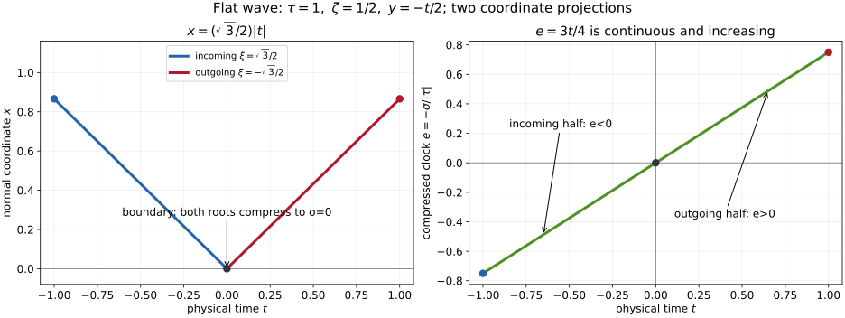

# From the weak normal criterion to transverse reflected segments

Original geometric receiving bridge. This lemma proves the passage from the stated analytic normal criterion to reflection. That criterion is supplied in U067, Sections 1–9. Strict diffraction remains separate.

The exact current proof of [U051, Section 1, RF7–RF10](../20261007-restored-boundary-reflection/boundary-reflection-preparation.md)
supplies the two normal lifts, their smooth transverse flows, invariant root
interchange and compression. Its later Dirichlet factorization is not used as a
weak Neumann estimate. The exact current U066, Section 5, IP18–IP19
supplies the interior energy-front propagation for both weak domains and all
complex finite matrix lower terms. The full weak source and both form domains
are retained throughout.

## 1. State exactly the analytic input

Let \(V=H^1_0\) or \(H^1\), \(u\in V_{\mathrm{loc}}\), and \(Pu=f\) in the
chosen natural antidual. Write \(F_k=\mathrm{WF}_b^{V,k}(u)\) and
\(S_{k+1}=\mathrm{WF}_b^{V^*,k+1}(f)\). Work in a source-regular open conic
region \(O\), with \(O\cap S_{k+1}=\varnothing\). The principal symbol is
\[
 p=\tau^2-a\xi^2-2\xi b^T\zeta-\zeta^TC\zeta,\qquad
 G=\begin{pmatrix}a&b^T\\b&C\end{pmatrix}\geq\kappa I .
 \tag{RB1}
\]
The coefficients may depend smoothly on all base variables. The lower form
contains the full matrices \(\ell,m,c\); there is no Hermitian assumption on them.

At a hyperbolic boundary point \(q\), put
\[
 d=(b^T\zeta)^2+a(\tau^2-\zeta^TC\zeta)>0,\quad
 \xi_\pm=\frac{-b^T\zeta\pm\sqrt d}{a},\quad
 H_px\big|_{\xi_\pm}=\mp2\sqrt d .
 \tag{RB2}
\]
The invariant reflection in U051 (RF9) exchanges these roots. In the U065
coordinates \(b|_{x=0}=0\), it is \(\xi\mapsto-\xi\), and the degree-zero
compressed clock
\[
 e=-\frac{\sigma}{|\tau|},\quad \sigma=x\xi,\qquad
 |\tau|^{-1}H_pe\big|_{x=0,p=0}
       =\frac{2a\xi^2}{|\tau|^2}>0
 \tag{RB3}
\]
increases at both lifts. Positivity of \(G\) implies \(\tau\ne0\) on the
nonzero characteristic set. A single sign of \(\tau\) can therefore be fixed
on a small compact normalized cone. The off-boundary cross block and time
dependence are not deleted from the flow.

Assume the following *normal criterion*, including noncharacteristic regularity
in its test region:

> For each sufficiently small compressed neighborhood \(U\) of \(q\) contained
> in \(O\), regularity of the solution on the entire characteristic incoming
> half \(U\cap\{e<0\}\), together with the source assumption above, gives
> \(q\notin F_k\). The same assertion holds with \(-e\).
> Noncharacteristic points of these neighborhoods miss \(F_k\).

More precisely, the criterion may choose a smaller test region inside \(U\);
the argument below supplies regularity on the entire incoming half of \(U\),
so it supplies that smaller region as well. No fixed norm uniform in \(k\)
is assumed. For the smooth-front version, require the criterion at every
finite order and the common-neighborhood bootstrap discussed in Section 3.

## 2. Incoming cap regularity fills the required half-neighborhood

Choose a small transverse incoming point \(r_-\) on the characteristic germ
ending at \(q\). Suppose \(r_-\notin F_k\). The source hypothesis holds along
the short germ and a slightly larger open conic tube in \(O\). By openness of
finite-order regularity, choose a relatively open cap on a transverse section
\(x=h>0\), containing \(r_-\), that misses \(F_k\).

Here is the uniform flow argument needed for a *whole* incoming half rather
than one ray. Extend the smooth principal coefficients across the face solely
to define the ordinary Hamilton flow. At the incoming lift of \(q\), (RB2)
gives a nonzero normal velocity. Normalize frequencies on the chosen compact
cone. Shrink the ordinary cotangent box so that this velocity has one sign
and magnitude bounded below by a positive number. The ordinary flow map and
the implicit function theorem for its \(x\)-coordinate give a unique smooth
intersection map from each nearby incoming characteristic point to \(x=h\).
The intersection time is bounded uniformly after the box is shrunk. Its value
at the central boundary lift is \(r_-\), and continuity places all these
intersection points in the regular cap.

The compressed characteristic set near \(q\) has exactly the two lifts in
(RB2), and no unbounded normal-frequency branch: \(p=0\) and \(G\ge\kappa I\)
give \(|(\xi,\zeta)|\le|\tau|/\sqrt\kappa\). After fixing the frequency
normalization, compactness and root separation show that the characteristic
part with \(x>0,e<0\) lies on the incoming sheet of the ordinary cotangent
box. Thus there is a compressed neighborhood \(U\) whose entire incoming
characteristic half is covered by the intersection map. This is the
one-sided sheet of U051 (RF7–RF8), expressed with the orientation of \(p\)
in (RB1).

For every point of that half, the segment to its cap point stays in the
source-regular tube and the interior. Apply U066 (IP18) to that segment.
Regularity at the cap point proves regularity at the chosen point. Hence
\[
 U\cap\{p=0,x>0,e<0\}\cap F_k=\varnothing .
 \tag{RB4}
\]
The stated noncharacteristic input fills any other points required by the
normal criterion. That criterion gives \(q\notin F_k\). Openness then gives
a small outgoing regular cap. Interior propagation extends this regularity
along the outgoing germ as long as its segment remains in \(O\).

Apply the same argument with \(-e\) to an outgoing regular cap. This proves
the converse. Boundary regularity itself implies both cap regularities by
openness, followed by interior propagation. Therefore, on one short reflected
segment, the incoming germ, compressed boundary point and outgoing germ have
the same finite-order regularity alternative:
\[
 r_-\in F_k\quad\Longleftrightarrow\quad q\in F_k
             \quad\Longleftrightarrow\quad r_+\in F_k .
 \tag{RB5}
\]
No comparison of strong Neumann traces appears in this argument.

## 3. Preserve a common neighborhood for the smooth front

The smooth front is \(F_\infty=\overline{\bigcup_{k\ge0}F_k}\), with closure
in the compressed conic region, as proved in U064 (CG3) and U066 (IP12).
Suppose first that a cap point misses \(F_\infty\). Choose a cap neighborhood
missing that closed front; it misses every \(F_k\). The flow box, source-free
tube, intersection map and compressed neighborhood \(U\) above are geometric
objects chosen once, independently of \(k\). U066 (IP19) fills their incoming
part with smooth regularity.

To infer \(q\notin F_\infty\), pointwise applications of (RB5) at every \(k\)
are insufficient: their output neighborhoods might shrink to a point.
The analytic normal estimate must therefore provide a single inner
neighborhood missing every \(F_k\), by its common-neighborhood bootstrap.
That is the precise additional analytic input in Section 1. With it, this
inner neighborhood misses \(\overline{\bigcup_kF_k}\), so \(q\notin F_\infty\).
The outgoing smooth cap and its propagation follow by openness and IP19.
The reversed normal estimate gives the converse. Thus
\[
 r_-\in F_\infty\quad\Longleftrightarrow\quad q\in F_\infty
             \quad\Longleftrightarrow\quad r_+\in F_\infty .
 \tag{RB6}
\]

A compact part of a broken ray with *locally finite transverse reflections*
contains only finitely many reflection times. Cover its ordinary pieces by
the interior propagation neighborhoods and its reflection times by the
neighborhoods just proved. Successive finite continuation proves constancy
of either front along that compact part. Increasing compact subintervals
give the connected-ray statement. A reflection accumulation at a glancing
point lies outside this argument.

## 4. An exact flat model of the clock and root exchange

For \(p=\tau^2-\xi^2-\zeta^2\), choose \(\tau=1\), \(\zeta=1/2\), and
\(v=\sqrt3/2\). Parametrize the reflected characteristic by physical time
\(t\in[-1,1]\):
\[
 x=v|t|,\quad y=-t/2,\quad
 \xi=\begin{cases}v,&t<0,\\-v,&t>0,\end{cases}\qquad
 \sigma=-\frac34t,\quad e=\frac34t .
 \tag{RB7}
\]
Each open piece is an ordinary characteristic; \(dt/ds=2\),
\(dx/ds=-2\xi\), and \(dy/ds=-2\zeta\). At the face both normal roots
compress to \(\sigma=0\), while the tangential covector is preserved.
The clock is continuous and increasing through reflection. Its normalized
Hamilton derivative at either boundary lift is \(3/2\), in agreement with
(RB3).

*Figure RB-F1.* These are the \((t,x)\) and \((t,e)\) projections of (RB7),
not the full phase space. The cap covectors and the tangential coordinate
\(y=-t/2\) are recorded above. The figure explains the geometric mechanism
of Sections 1–2; it does not supply the analytic normal estimate.

All prose and the reproducible figure in this owner integration note are
original eligible expression under CC0-1.0. Exact local provider proofs are
used directly. Approved sources and complete current programme proofs remain available.
