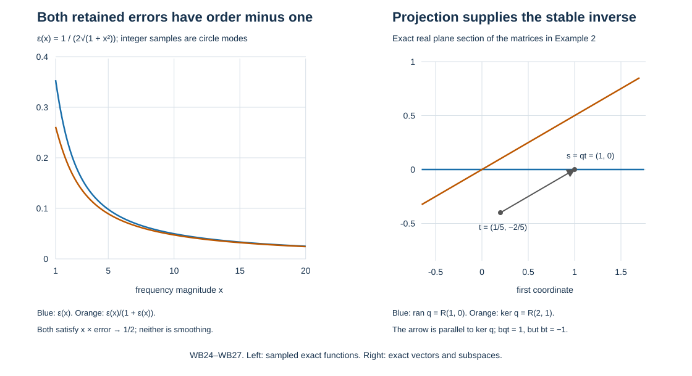

# Boundary inverses with a retained projection defect

An actual finite collar inverse produces a Cauchy matrix whose square differs from itself by an operator one weighted order lower. This companion constructs the boundary inverse under precisely that hypothesis. The smoothing right error, the order-one stable-range error and the order-one reconstruction errors are kept distinct. Every original boundary degree remains visible.

The input is the actual matrix proved in Classical boundary traces and the actual stable principal symbol, VP:T2–B1. The frozen complementing criterion and smooth stable bundle are proved in NP:M1. Complete ordinary composition, proper representation and smooth kernel ideals are P2:OP3–OP6; the actual asymptotic operator sum is K:K1–K1a; all-real Sobolev mapping is WM:W6. These exact programme proofs, including their original component licences, are connected in the proof map.

The source context is the approved Hörmander III edition, Springer 2007, ISBN 978-3-540-49938-1, Chapter 24, together with Claude's existing AN-03 *Fredholm boundary problems with first-order Calderón defects*, Sections 4–5, and *Solving an elliptic system from compatible boundary measurements*, Sections 3–4. The latter assumes a smoothing projection defect; we prove the version needed for the weaker actual defect here. This independently written exposition and its reproducible figure are CC0-1.0. Existing linked components retain their own terms.

## 1. Weighted matrices without changing the operator

Let \(Y\) be a compact smooth boundary manifold, with a fixed smooth positive density. Let \(H=\bigoplus_{a=0}^{m-1}E_a\) and \(G=\bigoplus_jG_j\), where originally every \(E_a=E_Y\). Give their components real weights \(\alpha_a\) and \(\beta_j\). In the original problem they are
\[
 \alpha_a=a,\qquad \beta_j=m_j,
 \quad \mathcal U_\sigma=\bigoplus_a H^{\sigma-\alpha_a-1/2}(Y,E_a),
 \quad \mathcal D_\sigma=\bigoplus_j H^{\sigma-\beta_j-1/2}(Y,G_j).
 \tag{WB1}
\]
The proof permits real \(m_j\); in particular it retains all original integer degrees, without an upper bound. A matrix \(A:H\to G\) has weighted order \(s\), written \(A\in\Psi^s_{\beta\leftarrow\alpha}\), if
\[
                  A_{ja}\in\Psi^{s+\beta_j-\alpha_a}_{\rm phg}.
                  \tag{WB2}
\]
These are ordinary classical tangential operators with their complete kernels, not just principal symbols. For matrices on \(H\), write \(\Psi^s_\alpha\). A smoothing matrix has a smooth kernel in every entry, independent of weights.

Matrix multiplication and actual operator composition obey the weighted rule: an intermediate index \(j\) contributes orders \((t+\gamma_i-\beta_j)+(s+\beta_j-\alpha_a)=s+t+\gamma_i-\alpha_a\). P2:OP3–OP6 proves every differentiated classical remainder and the smooth ideal entrywise. Finitely many entries therefore give
\[
 \Psi^t_{\gamma\leftarrow\beta}\Psi^s_{\beta\leftarrow\alpha}
       \subset\Psi^{s+t}_{\gamma\leftarrow\alpha},
 \qquad A:\mathcal U_\sigma\longrightarrow\mathcal D_{\sigma-s}.
 \tag{WB3}
\]
The second statement is WM:W6 at each exact exponent; the target exponent is \(\sigma-s-\beta_j-1/2\). For \(s=-1\) this is a gain of one in the common parameter. Smooth kernels map every input level to every output level by their compact smooth Fourier estimates, as WM:W1 proves.

Choose a smooth positive homogeneous radius \(\rho(y,\eta)\) on \(T^*Y\setminus0\); HT:H3 proves its construction by partitions. For a weighted order-zero principal matrix \(a\), use the pointwise normalization
\[
 D_\alpha=\operatorname{diag}(\rho^{\alpha_a}I_{E_a}),\qquad
 D_\beta=\operatorname{diag}(\rho^{\beta_j}I_{G_j}),\qquad
                       \widehat a=D_\beta^{-1}aD_\alpha.
 \tag{WB4}
\]
It is homogeneous of degree zero. These are finite-dimensional symbol maps, not substituted operators on Sobolev spaces. They require no invertible pseudodifferential order reducer or assertion about the index of such an operator. Bundle frames preserve the component grading, and the scalar diagonal weights commute with each component's frame change. Thus WB4 is globally well defined. Ordinary smooth Hermitian metrics on the finitely many component bundles can be made by summing positive local metrics with a smooth partition; positivity follows because at least one partition coefficient is positive at each point. Extend them along the rays when taking adjoints of normalized symbols.

## 2. Quantization and complete weighted sums

A smooth degree-zero normalized bundle map determines the weighted homogeneous entries by undoing WB4. Each entry of degree \(\beta_j-\alpha_a\) has every symbol derivative bound on compact normalized sets by HT:H3. Cut it off near zero frequency. In a finite collection of charts quantize it with a compact kernel cutoff, insert a real square partition on the base, and retain the exact density and source/target frame factors. P2:OP4–OP5 gives actual global classical entries. On the diagonal the square partition sums to one, so their principal matrix is exactly the prescribed one. Differences on overlaps and off the diagonal are part of their complete lower symbols and smooth kernels. This proves global weighted quantization for rectangular bundles of arbitrary ranks.

We will use the following precise summation fact. If \(A_l\in\Psi^{-l}_{\beta\leftarrow\alpha}\) for \(l\ge0\), there is a classical \(A\in\Psi^0_{\beta\leftarrow\alpha}\) such that
\[
                    A-\sum_{l<L}A_l
                        \in\Psi^{-L}_{\beta\leftarrow\alpha}
                    \quad(L\ge1).
                    \tag{WB5}
\]
Here is the adapter to the already proved K:K1a. Choose a finite cover by compact chart products near the diagonal and a partition there. Localize each whole kernel by this fixed partition. Its remainder away from the diagonal is smooth by P2:OP4. For entry \((j,a)\), the localized orders are \(\beta_j-\alpha_a-l\), so K:K1a applies with \(d=\beta_j-\alpha_a\), in every chart, using a fixed compact kernel cutoff. Sum the finite chart and entry families. After subtracting any finite initial segment, the finitely many omitted smooth off-diagonal kernels are included in the remainder, which has precisely the order in WB5. Keep \(A_0\) itself as the first term if desired and sum only the tail this way. No equality of an infinite uncut operator series, or convergence in operator norm, is asserted.

The sum is classical, although K:K1a is stated for ordinary symbols without that extra hypothesis. For a desired homogeneous length \(K\), choose \(L\ge K\). The finite sum in WB5 is classical and the remainder has order at most \(\beta_j-\alpha_a-K\) in each entry. Its homogeneous terms of losses below \(K\) are therefore the finitely many terms from indices \(l<K\). Consistency for different \(K\) follows from coefficient uniqueness: a nonzero homogeneous term cannot have strictly smaller symbol order, as scaling on a fixed nonzero covector proves. This gives every classical remainder with all derivatives. Two sums satisfying WB5 differ by every negative weighted order; each entry then has a smooth kernel by P2:OP4–OP5. WB3 also permits multiplication of WB5 on either side by a fixed weighted operator, with all its finite remainders. This is the only infinite summation used below.

## 3. The actual projection defect and complementing data

Fix the actual Cauchy operator \(C=\mathsf C_N\) for one \(N\ge1\), and the original measurement matrix \(B=(B_{ja})\). VP:T2–B1 proves
\[
 C\in\Psi^0_\alpha,
 \qquad D=C^2-C\in\Psi^{-1}_\alpha,
 \qquad B\in\Psi^0_{\beta\leftarrow\alpha}.
 \tag{WB6}
\]
Their weighted principal matrices are \(q,b\), with \(q^2=q\), and \(\operatorname{ran}q\) is the whole inward stable Cauchy bundle. At each nonzero covector assume the original complementing condition
\[
                 b|_{\operatorname{ran}q}:
                    \operatorname{ran}q\longrightarrow G_y
                      \quad\hbox{is bijective}.
                 \tag{WB7}
\]
NP:M1 supplies the smoothness of this finite inverse and the original degrees. Normalization by WB4 preserves bijectivity: \(\widehat q=D_\alpha^{-1}qD_\alpha\) is an idempotent and \(\widehat b=D_\beta^{-1}bD_\alpha\). It need not be an orthogonal projection. All subsequent \(C\)'s are the actual operator in WB6; we do not replace it by a projection with a smaller defect.

It is useful to separate the onto and one-to-one conditions. If \(\widehat b|_{\operatorname{ran}\widehat q}\) is onto, the map \(c=\widehat b\widehat q:H_y\to G_y\) is onto. Then
\[
                        t=c^*(cc^*)^{-1},\qquad ct=I_G.
                        \tag{WB8}
\]
Indeed \(\langle cc^*v,v\rangle=\|c^*v\|^2\); a vector with \(c^*v=0\) is orthogonal to the range of \(c\), hence zero. Finite-dimensional positivity makes \(cc^*\) invertible. Its inverse is smooth by the cofactor formula QF:A0. On each compact unit-cosphere set its smallest quadratic value on the unit sphere has a positive minimum, by compactness; this and the differentiated inverse identity give all bounded derivatives. The construction is degree zero and is compatible with the bundle metrics, so WB8 is a global normalized right inverse. It is not yet required to land in \(\operatorname{ran}\widehat q\).

## 4. A measured right inverse with its exact range error

Set \(A=BC^2\). Its normalized principal map is \(\widehat b\widehat q\), because \(\widehat q^2=\widehat q\). Quantize WB8, undoing the pointwise weights, to an actual \(T_0\in\Psi^0_{\alpha\leftarrow\beta}\). Define
\[
 E=I_G-AT_0\in\Psi^{-1}_\beta,
 \quad T^{[L]}=T_0\sum_{l=0}^{L-1}E^l,
 \quad AT^{[L]}=I_G-E^L.
 \tag{WB9}
\]
The last identity follows by multiplying \((I_G-E)\sum_{l<L}E^l\); no matrix factors have been commuted past \(T_0\). Each summand has weighted order \(-l\). Apply WB5 to obtain an actual classical \(T\) with the same finite expansions. Then
\[
 R_G=BC^2T-I_G\in\Psi^{-\infty}(G),
 \qquad S=CT\in\Psi^0_{\alpha\leftarrow\beta}.
 \tag{WB10}
\]
For every \(L\), \(AT-AT^{[L]}\) has weighted order \(-L\), and \(-E^L\) has that order too. Therefore the actual kernel of \(R_G\), defined by the displayed difference, is smoothing. This proves the complete error rather than replacing a finite error by zero.

Two different remaining errors satisfy the exact identities
\[
 BCS-I_G=R_G,
 \qquad CS-S=DT\in\Psi^{-1}_{\alpha\leftarrow\beta},
 \qquad BS-I_G=R_G-BDT\in\Psi^{-1}_\beta.
 \tag{WB11}
\]
Thus the measurement after \(C\) has a smoothing right error, while \(S\) lies in the stable range only to one lower order. The principal symbol of \(S\) is \(s=q\,t_0\); it obeys \(qs=s\) and \(bs=I_G\). These follow directly from WB8 and the idempotence of \(q\), without orthogonality. Example 1 proves that the order-one errors in WB11 cannot in general be called smoothing.

## 5. The left inverse of the complete column

For the one-to-one condition, consider the actual column and its normalized principal symbol
\[
 \mathcal L=\begin{pmatrix}B\\I_H-C\end{pmatrix}:H\longrightarrow G\oplus H,
 \qquad \ell=\begin{pmatrix}\widehat b\\I_H-\widehat q\end{pmatrix}.
 \tag{WB12}
\]
The target weights are the concatenated list \((\beta,\alpha)\). If \(\ell v=0\), then \(v=\widehat qv\) and \(\widehat bv=0\), so injectivity in WB7 gives \(v=0\). Conversely, if \(\widehat b\) has a nonzero kernel vector in the stable range, that vector is in the kernel of \(\ell\). Hence the exact symbol condition is injectivity of this column. Its left inverse is
\[
                         l=(\ell^*\ell)^{-1}\ell^*.
                         \tag{WB13}
\]
The positivity, smoothness and all normalized derivative bounds follow by the same unit-sphere and cofactor proof as WB8, now using \(\|\ell v\|^2>0\).

Quantize WB13 to a row \(L_0\), and put \(F=I_H-L_0\mathcal L\in\Psi^{-1}_\alpha\). The complete finite left correction is
\[
 L^{[L]}=\sum_{l=0}^{L-1}F^lL_0,
 \qquad L^{[L]}\mathcal L=I_H-F^L.
 \tag{WB14}
\]
WB5 applied to the entire row gives \((T',T'')\), with a smooth actual left error
\[
 R_H=T'B+T''(I_H-C)-I_H\in\Psi^{-\infty}(H).
 \tag{WB15}
\]
Here \(T'\in\Psi^0_{\alpha\leftarrow\beta}\) and \(T''\in\Psi^0_\alpha\). Define \(S''=T''(I_H-C)\). Its residual stable action is exactly
\[
 T'B+S''=I_H+R_H,
 \qquad S''C=-T''D\in\Psi^{-1}_\alpha.
 \tag{WB16}
\]
This construction needs only the one-to-one condition; the right construction needs only the onto condition. Neither alone proves WB7, as Example 3 verifies.

## 6. The same leading inverse and the full reconstruction

Under bijectivity, the principal maps of \(T'\) and \(S\) agree. To check every target vector, write \(g=\widehat b\widehat qv\), which is possible by surjectivity. The principal identity in WB15, applied to \(\widehat qv\), gives \(\widehat{t'}g=\widehat qv\). The right construction gives \(\widehat s g\in\operatorname{ran}\widehat q\) and \(\widehat b\widehat s g=g\), so injectivity forces \(\widehat s g=\widehat qv\) as well. Undoing the weights proves
\[
                       T'-S\in\Psi^{-1}_{\alpha\leftarrow\beta}.
                       \tag{WB17}
\]
It asserts agreement to leading order, not smoothing agreement. No quotient algebra with an idempotent \(C\) has been used.

Retain the actual remainders
\[
\begin{aligned}
 R_0&=I_H-SB-S''=(T'-S)B-R_H\in\Psi^{-1}_\alpha,\\
 R_1&=R_0+S''C\in\Psi^{-1}_\alpha.
\end{aligned}\tag{WB18}
\]
For every distributional jet vector \(U\), the exact reconstruction identity is
\[
                     U=S(BU)+S''(I_H-C)U+R_1U.
                     \tag{WB19}
\]
Expanding its right side gives \((SB+S''-S''C+R_0+S''C)U=U\). Every product is an actual proper operator on the compact manifold, so the identity holds on distributions, not merely smooth inputs. The sign in WB16 follows from \((I-C)C=C-C^2=-D\); this is the sign used in WB18.

In the original coordinates the complete entry orders are
\[
 S_{aj},T'_{aj}\in\Psi^{a-m_j}_{\rm phg},\quad
 S''_{ab},T''_{ab}\in\Psi^{a-b}_{\rm phg},\quad
 (R_i)_{ab}\in\Psi^{a-b-1}_{\rm phg}.
 \tag{WB20}
\]
The displayed orders follow directly from WB2, with no replacement of the physical jet vector or measurement. Changing the normalized metrics, radius, quantization or asymptotic sum preserves the principal map \(s\), since it is the unique inverse of \(b\) with image in \(\operatorname{ran}q\). Thus any two such \(S\)'s differ by weighted order \(-1\). An order-zero stable principal inverse is independent of these choices. No uniqueness modulo smoothing is claimed under the weaker defect hypothesis.

## 7. Sobolev reconstruction and the boundary data interface

WB3 gives, for every real \(\sigma\),
\[
\begin{aligned}
 S,T' &: \mathcal D_\sigma\longrightarrow\mathcal U_\sigma,\qquad
 S'',T'' :\mathcal U_\sigma\longrightarrow\mathcal U_\sigma,\\
 R_0,R_1,S''C &: \mathcal U_\sigma\longrightarrow\mathcal U_{\sigma+1},\\
 CS-S &: \mathcal D_\sigma\longrightarrow\mathcal U_{\sigma+1},\qquad
 BS-I_G :\mathcal D_\sigma\longrightarrow\mathcal D_{\sigma+1}.
\end{aligned}\tag{WB21}
\]
Also \(BCS-I_G\) maps \(\mathcal D_\sigma\) to \(\mathcal D_\tau\) for every real \(\sigma,\tau\), because its kernel is smooth. These statements include high boundary orders \(m_j\ge m\).

Suppose \(U\in\mathcal U_{\sigma-1}\), \(BU\in\mathcal D_\sigma\) and \((I-C)U\in\mathcal U_\sigma\). All three terms on the right of WB19 belong to \(\mathcal U_\sigma\), proving the actual one-step gain and estimate
\[
 \|U\|_{\mathcal U_\sigma}
 \le K_\sigma\bigl(\|BU\|_{\mathcal D_\sigma}
       +\|(I-C)U\|_{\mathcal U_\sigma}
       +\|U\|_{\mathcal U_{\sigma-1}}\bigr).
 \tag{WB22}
\]
The identity is already valid on distributions, so this does not assume the gained regularity beforehand. In fact WB15 gives the stronger all-level form: for any fixed \(s_0\), if \(U\in\mathcal U_{s_0}\) and both data are at level \(\sigma\), then
\[
 U=T'(BU)+T''(I-C)U-R_HU\in\mathcal U_\sigma.
 \tag{WB23}
\]
Its bound uses the smoothing norm \(R_H:\mathcal U_{s_0}\to\mathcal U_\sigma\). We keep WB22 because the order-one decomposition WB19 is the one used with the actual volume-layer identities. Every distribution on compact \(Y\) belongs to some finite negative Sobolev level, by the compact-distribution Fourier estimate in WM:W1. Thus smooth compatible data in WB23 give a smooth \(U\). The equality between smoothness and all Sobolev levels follows locally by Fourier Cauchy–Schwarz with exponent exceeding each derivative order plus \(\dim Y/2\), and by repeated integration by parts for the converse, as in P3:L1. A finite cover gives the bundle assertion.

For a volume solution, use WB19 only after proving the particular identity for \((I-C)\gamma u\) with its full forcing and error terms. That proof must retain all normal derivatives and any far tangential input of a generalized collar coefficient. Nothing in WB22 alone defines a trace of an arbitrary rough volume distribution or establishes the full elliptic boundary-wavefront theorem. Those volume estimates remain the next receiving step.

## 8. Zero-dimensional and empty cases

If \(Y\) is zero dimensional, compactness makes it a finite set. Every kernel is smooth and all Sobolev spaces are finite-dimensional spaces of sections, independent of exponent. The nonzero-covector condition is empty. For the modulo-smoothing conclusions one may take \(T=S=T'=T''=S''=0\), \(R_G=-I_G\), \(R_H=-I_H\), and \(R_0=R_1=I_H\). WB10–WB19 then hold with all remainders smoothing; all boundedness assertions are finite-dimensional and WB22 is the norm-equivalence estimate. This case makes no actual solvability assertion from an empty symbol condition. If a bundle has rank zero, the inverse on a zero-dimensional fiber in WB8 or WB13 is its unique identity map; the corresponding rectangular products and positivity assertion have their empty-space meanings. Empty \(Y\) is immediate. Thus no positive-rank determinant or nonempty cosphere is silently assumed.

## 9. Four complete calculations

**1. The order-one errors really can survive.** On the circle, let \(\varepsilon(n)=1/(2\sqrt{1+n^2})\), and define Fourier multipliers
\[
 C=\begin{pmatrix}1+\varepsilon&0\\0&\varepsilon\end{pmatrix},
 \quad q=\begin{pmatrix}1&0\\0&0\end{pmatrix},\quad B=(1,0).
 \tag{WB24}
\]
All weights are zero. The smooth frequency extension of \(\varepsilon\) is classical of order \(-1\) by the finite Taylor formula for \((1+t)^{-1/2}\). Its values satisfy \(0<\varepsilon\le1/2\). The actual defect is \(D=\operatorname{diag}(\varepsilon+\varepsilon^2,\varepsilon^2-\varepsilon)\), of order \(-1\). An exact right choice and exact left row are
\[
 T=\binom{(1+\varepsilon)^{-2}}0,\quad
 S=\binom{(1+\varepsilon)^{-1}}0,\quad
 T'=\binom10,\quad
 T''=\operatorname{diag}(0,(1-\varepsilon)^{-1}).
 \tag{WB25}
\]
The denominators are bounded away from zero. Differentiated inverse identities and finite Taylor expansion show that their smooth frequency extensions are classical order-zero symbols. Their actual circle quantization is justified by the periodization proof GE:G1–G2: for any such symbol \(a(\xi)\) and requested kernel derivative order \(h\), take \(2J>h+1\). Then \(\partial_\xi^{2J}[(i\xi)^h a(\xi)]\) is integrable. GE:G2's tested Fourier identity makes the inverse transform smooth off zero with every derivative rapidly decreasing at infinity. Splitting it into a compact distribution and a Schwartz function justifies periodization; its integer Fourier coefficient is exactly \(a(n)/(2\pi)\). The nonzero translates are a smooth kernel on each short chart, while the zero translate is the original classical multiplier kernel. This proves the full circle pseudodifferential assertion, including its smoothing contributions. Direct multiplication gives \(BCS=1\), \(T'B+T''(I-C)=I\), and \(S''=\operatorname{diag}(0,1)\). Hence
\[
 CS-S=\binom{\varepsilon/(1+\varepsilon)}0,
 \quad BS-1=-\frac{\varepsilon}{1+\varepsilon},
 \quad R_1=\operatorname{diag}\left(\frac{\varepsilon}{1+\varepsilon},\varepsilon\right).
 \tag{WB26}
\]
These entries are not smoothing: \(n\varepsilon(n)\to1/2\) and \(n\varepsilon(n)/(1+\varepsilon(n))\to1/2\). A smooth circle kernel would give faster decay than every power on its Fourier modes by repeated integration by parts. For \(U=(u_1,u_2)\), WB19 has first component \(u_1/(1+\varepsilon)+\varepsilon u_1/(1+\varepsilon)=u_1\) and second component \((1-\varepsilon)u_2+\varepsilon u_2=u_2\). Thus every retained error has an explicit role. This is an example for the abstract boundary-matrix hypotheses, not an assertion that a particular collar inverse equals WB24.

**2. The auxiliary right inverse need not be stable.** In \(\mathbb C^2\), take \(q=\begin{pmatrix}1&-2\\0&0\end{pmatrix}\) and \(b=(1,3)\). Then \(q^2=q\), \(c=bq=(1,-2)\), and WB8 gives \(t=(1,-2)^t/5\). It satisfies \(ct=1\), but it is not in the range \(\mathbb C(1,0)\) of \(q\), and \(bt=-1\). Projection gives \(s=qt=(1,0)^t\), with \(bs=1\). The left column is \(\ell=\begin{pmatrix}1&3\\0&2\\0&1\end{pmatrix}\). Its Gram matrix is \(\begin{pmatrix}1&3\\3&14\end{pmatrix}\), of determinant five, and the exact left inverse is
\[
 (\ell^*\ell)^{-1}\ell^*
       =\begin{pmatrix}1&-6/5&-3/5\\0&2/5&1/5\end{pmatrix}.
 \tag{WB27}
\]
Thus \(t'=s\) and \(s''=t''(I-q)=\begin{pmatrix}0&-3\\0&1\end{pmatrix}=I-sb\). One checks \(s''q=0\). This \(s''\) differs from \(I-q\); the measured complement is determined by \(b\). The example verifies the factor order, nonorthogonality and the unique stable leading inverse.

**3. Onto and one-to-one are different hypotheses.** Let \(H=\mathbb C^3\), \(q=\operatorname{diag}(1,1,0)\), \(G=\mathbb C\), and \(b=(1,0,0)\). The stable measurement is onto, and every \(s=(1,t,0)^t\) is a stable right inverse. It is not one-to-one, since \(e_2\) is a nonzero stable kernel vector; the column \((b,I-q)^t\) annihilates \(e_2\), so it has no left inverse. Conversely, take \(H=\mathbb C^2\), \(q=\operatorname{diag}(1,0)\), \(G=\mathbb C^2\), \(b=\operatorname{diag}(1,0)\). The stable measurement is one-to-one and the column has zero kernel, but \(bq\) has rank one and cannot have a right inverse onto \(G\). These finite examples prove why both conditions are used in WB17 and why right-inverse uniqueness fails with only surjectivity.

**4. A lower weighted order need not lower every entry below zero.** Use source weights \((0,1,2)\) and measurement weights \((0,5/2,7)\). WB20 gives order \(-5\) for the entry from the weight-seven datum to the second jet: it maps \(H^{\sigma-15/2}\) to \(H^{\sigma-5/2}\). The entry from the weight-zero datum to that jet has order two and maps \(H^{\sigma-1/2}\) to the same \(H^{\sigma-5/2}\). Both preserve the common parameter \(\sigma\). A weighted order-minus-one jet error has entry order one from weight zero to weight two, and entry order minus three in the reverse direction. WB3 sends \(\mathcal U_\sigma\) to \(\mathcal U_{\sigma+1}\) in both cases: subtracting the entry order gives exactly the required target exponent. No step relies on a false classical isomorphism of the form \(I+A^*A\) at a noninteger order.

## 10. The two roles shown in the figure

The left panel samples \(\varepsilon(x)=1/(2\sqrt{1+x^2})\) and \(\varepsilon(x)/(1+\varepsilon(x))\) for \(1\le x\le20\). The circle multipliers in Example 1 are their values at integer frequencies; both retain a nonzero order-minus-one coefficient. The right panel is the exact real plane section in Example 2. The auxiliary vector \(t=(1/5,-2/5)\) projects to \(s=(1,0)\) along the kernel line \(\mathbb R(2,1)\) of \(q\). The displayed arrow is a projection, not a time evolution. The exact matrices and formulas, rather than the samples, prove the claims. The source is [build_figure.py](figures/build_figure.py).

The actual weighted boundary inverse and its reconstruction identities are now supplied. The remaining volume-layer regularity, full elliptic boundary-wavefront theorem and final U051 receiving proof are separate obligations.
