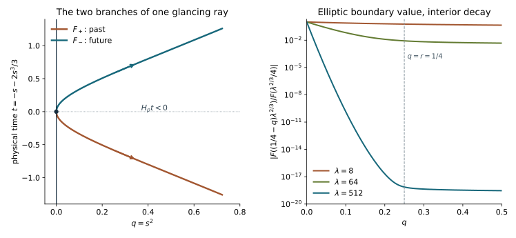

# Fourier–Airy wavefronts and physical time

The distributional kernel theorem defines the normalized Airy operators on every compact distribution. We now locate their singularities, including the limiting tangential singularities at the boundary. We then identify the sign that carries boundary singularities forward in the actual time coordinate. This supplies the smooth-past assertion needed to use [transposed boundary comparison](../20261008-transposed-boundary-uniqueness/transposed-boundary-uniqueness-and-parametrix-identification.html).

Melrose–Taylor, [*Boundary Problems for Wave Equations With Grazing and Gliding Rays*](https://mtaylor.web.unc.edu/wp-content/uploads/sites/16915/2018/04/glide.pdf), Section 6.5, is the primary antecedent for the wavefront analysis. The proof below uses the exact phases, amplitudes and Airy estimates already established in this programme and derives the time sign in our convention. No general symbolic calculus with frequency gain smaller than base loss is assumed.

Independent text, examples and figure: **CC0-1.0**. The proof map identifies exact providers; the required Lebl proofs remain external. Internal P514 closure of this export is not claimed. The complete stable incoming representation, sharp norm estimates and strict-diffraction propagation remain separate course obligations.

## 1. The normalized kernel and the receiving patch

**W0. Coordinates, modes and distributions.** Use the boundary-normal coordinates of NW:T003 and its exact weak-form transformation. They preserve the physical boundary and physical time \(t\), one component of \(y\). The real scalar wave principal symbol is
\[
 p(q,y;\rho,\xi)=\rho^2+h^{ab}(q,y)\xi_a\xi_b,
 \qquad p(dt)<0,\qquad q\ge0.                         \tag{WT1}
\]
The tangential form is Lorentzian. All smooth complex matrix lower terms remain in the operator and in the CAA amplitudes; they do not change the principal characteristic curves. Fix a sufficiently small strict-diffraction patch, where \(H_p^2q>0\) at the marked glancing covector. Shrink it when specified below, without changing it with a differentiation order.

Retain the CAA/ADT notation \(\eta=(\mu,\eta',\lambda)\), \(\lambda\ge1\), \(|\eta|\asymp\lambda\), and put \(v=\mu/\lambda\). Thus
\[
 \theta_b=S(y,\eta),\quad \det S_{y\eta}\ne0,\quad
 b=\zeta_b=-\mu\lambda^{-1/3},\quad a=\zeta(q,y,\eta),\quad
 b-a=q\lambda^{2/3}d(q,y,\widehat\eta),\quad d\ge c>0.   \tag{WT2}
\]
Here \(d\) is smooth of degree zero on the reduced cone. The last identity follows by integrating the strictly negative \(\zeta_q\); its derivatives have the same uniform bounds. Write \(F_+=F\), \(F_- =\overline F\), with the zero-free ABQ normalization
\[
 F(t)=\sqrt\pi e^{i\pi/4}\bigl(\operatorname{Ai}(t)-i\operatorname{Bi}(t)\bigr),
 \qquad F_\epsilon(t)=e^{i\epsilon\frac23(-t)^{3/2}}f_\epsilon(t)
 \quad(t<-1),\qquad \epsilon\in\{+1,-1\}.               \tag{WT3}
\]
In particular the plus label means the plus negative-ray phase in this lesson. It does not yet mean future.

For compact distributions on the model boundary define
\[
 K_\epsilon f(q,y)=(2\pi)^{-d}\int e^{i\theta(q,y,\eta)}\omega(\eta)
 \frac{g(q,y,\eta)F_\epsilon(a)+ih(q,y,\eta)F_\epsilon'(a)}{F_\epsilon(b)}
 \widehat f(\eta)\,d\eta .                              \tag{WT4}
\]
The definition is the tested limit ADT:D6, not an assertion of absolute convergence for singular data. In WT4 the letter \(d\) in \((2\pi)^{-d}\) denotes tangential dimension; the function in WT2 occurs only with arguments or as its positive coefficient. The amplitudes have orders \(0,-1/3\), and \(h_b=0\). Proper base cutoffs are understood. ADT proves a smooth normal family of distributions, every actual boundary trace, and finite tangential order for each finite collection of normal derivatives.

## 2. An exact three-part integral

**W1. Extract both oscillations where they occur.** Choose \(\chi_0=0\) on \(( -\infty,-2]\), \(\chi_0=1\) on \([-1,\infty)\), and \(\chi_1=1-\chi_0\). Put \(\psi(s)=\frac23(-s)^{3/2}\) for \(s<0\), and \(\widetilde f_\epsilon=e^{-i\epsilon\psi}F_\epsilon'\). Split the integrand into phases \(\theta,\phi_\epsilon,\Phi_\epsilon\), with amplitudes
\[
\begin{aligned}
 A_0&=\omega\chi_0(a)\frac{gF_\epsilon(a)+ihF_\epsilon'(a)}{F_\epsilon(b)},
 &\varphi_0&=\theta,\\
 A_{21}&=\omega\chi_1(a)\chi_0(b)
       \frac{gf_\epsilon(a)+ih\widetilde f_\epsilon(a)}{F_\epsilon(b)},
 &\phi_\epsilon&=\theta+\epsilon\psi(a),\\
 A_{22}&=\omega\chi_1(a)\chi_1(b)
       \frac{gf_\epsilon(a)+ih\widetilde f_\epsilon(a)}{f_\epsilon(b)},
 &\Phi_\epsilon&=\theta+\epsilon[\psi(a)-\psi(b)].
\end{aligned}                                                        \tag{WT5}
\]
Each phase is used only on its amplitude's support. Since \(a\le b\), negative-ray estimates apply to every factor in the third row. Multiplication by the exponentials in WT5 gives exactly the original integrand. There is no discarded asymptotic term.

ABQ:B2 and B4 give, with every derivative,
\[
 |f_\epsilon^{(j)}(s)|\le C_j(-s)^{-1/4-j},\quad
 |\widetilde f_\epsilon^{(j)}(s)|\le C_j(-s)^{1/4-j},\quad
 |f_\epsilon(s)|\ge c(-s)^{-1/4}\quad(s\le-1).           \tag{WT6}
\]
On the positive ray \(F_\epsilon(s)=e^{2s^{3/2}/3}u_\epsilon(s)\), where \(u_\epsilon\) is a nonvanishing symbol of order \(-1/4\). These are exact definitions with the stated differentiated estimates, rather than a finite asymptotic substitution.

**W2. Frequency derivatives, including the boundary layer.** On dyadic shells \(\lambda\asymp R\), all three amplitudes satisfy
\[
 |\partial_q^k\partial_y^\alpha\partial_\eta^\beta A_j|
 \le C_{k\alpha\beta}R^{k+2|\alpha|/3-|\beta|/3}.
 \quad
 q^L|\partial_q^k\partial_y^\alpha\partial_\eta^\beta A_0|
 \le C_{Lk\alpha\beta}R^{k-2L/3-|\beta|/3}.             \tag{WT7}
\]
We give the cancellation argument for the second estimate, since separate differentiation of numerator and denominator would lose it. Set \(\Delta=b-a\). Then \(\partial_\eta^\beta b=O(R^{2/3-|\beta|})\), whereas \(\partial_y^\alpha\partial_\eta^\beta\Delta=O(\Delta R^{-|\beta|})\) if no normal derivative is taken. A normal derivative of \(\Delta\) costs at most \(R^{2/3}\).

First take \(a\ge1\), hence \(b\ge a\). In coordinates \((b,\Delta)\), the ratio is
\[
 \frac{F_\epsilon(b-\Delta)}{F_\epsilon(b)}
 =e^{-E}\frac{u_\epsilon(b-\Delta)}{u_\epsilon(b)},\qquad
 E=\frac23\bigl[b^{3/2}-(b-\Delta)^{3/2}\bigr]
 \ge\Delta\sqrt a .                                    \tag{WT8}
\]
At fixed \(\Delta\), every positive \(b\)-derivative of \(E\) is bounded by a constant times \(E\), because \(a\ge1\): write it as the integral over \([0,\Delta]\) of a derivative of \(\sqrt{b-s}\). Every factor \(\Delta^j\partial_\Delta^j E\) is bounded by a polynomial in \(E\). The same statement holds after additional fixed-\(\Delta\) \(b\)-derivatives. The ratio of the two symbol weights is at most \(C(1+E)^{1/4}\). Its derivatives obey the same polynomial bounds, using \(a\ge1\), \(b/a\le1+\Delta/a\), and WT6's positive-ray counterpart. Leibniz's rule and \(E^m e^{-E}\le C_m\) therefore bound all compositions of \(\partial_b\) and \(\Delta\partial_\Delta\), also after multiplication by any power of \(\Delta\).

A frequency derivative supplies either a derivative of \(b\), at cost at most \(R^{-1/3}\), or a logarithmic derivative of \(\Delta\), at cost \(R^{-1}\). Higher derivatives obey the same count: \(R^{2/3-r}\le R^{-r/3}\) for \(r\ge1\). A base derivative in \(y\) supplies a logarithmic \(\Delta\)-derivative and costs no power of \(R\). A normal derivative supplies \(R^{2/3}\partial_\Delta\), whose additional \(\sqrt a\le CR^{1/3}\) costs at most one full power. For the \(hF'\) term the initial \(\sqrt a\) is canceled by \(h\)'s order \(-1/3\); derivatives give the same bounds. These statements also hold for mixed derivatives by the finite product and chain rules, including derivatives of \(d\) in WT2.

If \(-2\le a\le1\), split \(b\) into a bounded interval and \(b\ge2\). On the bounded part every Airy factor is smooth with nonzero denominator. On the unbounded part all derivatives are polynomial times \(e^{-2b^{3/2}/3}\); this controls all \(\Delta\)-weights and all powers introduced by differentiating the bounded-\(a\) cutoff. The transition between the two descriptions is compact. Finally \(q^L\le C R^{-2L/3}\Delta^L\). This proves the second bound of WT7; no fractional power was differentiated at zero.

For \(A_{22}\), the undifferentiated weight is \(((-b)/(-a))^{1/4}\le1\). Each one-variable derivative improves the negative-ray order by one, and \(-a,-b\ge1\). Thus a base derivative costs at most \(R^{2/3}\), a frequency derivative at most \(R^{-1/3}\). The extra \(\sqrt{-a}\) is again canceled by \(h\). For \(A_{21}\), every derivative of \(1/F_\epsilon(b)\) is bounded on \(b\ge-2\), with exponential decay as \(b\to+\infty\); the identical argument applies. This proves the first bound, with the slightly weaker but convenient normal exponent \(k\). Derivatives of all cutoffs satisfy the same bounds.

On a fixed \(q\ge q_0>0\), the \(A_0\) kernel is smooth by arbitrary \(L\) in WT7. On any fixed reduced cone \(v\le-\delta<0\), \(A_{21}\) and all derivatives are rapidly decreasing, because \(b\ge\delta R^{2/3}\). Hence the only limiting input directions for its possible interior singularities have \(v=0\). The third row has limiting \(v\ge0\).

## 3. The wavefront estimate without an invalid calculus shortcut

**W3. The derivatives used in integration by parts.** Every phase in WT5 has first tangential base derivatives of size \(O(R)\) and first frequency derivatives of size \(O(1)\). On its support,
\[
 \left|\partial_y^\alpha\partial_\eta^\beta
       \left(R^{-1}\partial_y\varphi\right)\right|
 +\left|\partial_y^\alpha\partial_\eta^\beta
       \partial_\eta\varphi\right|
 \le C_{\alpha\beta}R^{2|\alpha|/3-|\beta|/3}.            \tag{WT9}
\]
Here a shell parameter \(R\) is constant while differentiating. For \(\theta\) these are weaker than its ordinary homogeneous estimates. For \(\psi(a)\), a chain-rule term with \(j\) derivatives on \(a\) is a product of those derivatives times \((-a)^{3/2-j}\). When \(j=1\), use \(\sqrt{-a}\le CR^{1/3}\); when \(j\ge2\), use \(-a\ge1\). If there are \(r\) base and \(s\) frequency differentiations, this gives the bounds \(R^{1-s}\) for \(j=1\) and \(R^{2(r+s)/3-s}\) for the worst \(j\ge2\). Apply this with one distinguished base or frequency derivative to obtain WT9. The same argument applies to \(\psi(b)\), whose base derivatives vanish.

After any \(k\) normal derivatives of the full integrand, write it as \(e^{i\varphi}\) times a new amplitude. Its mixed tangential/frequency bounds are those of WT7's first inequality with some finite initial order \(m_k\). To see finiteness and the same derivative increments, expand the finite product of differentiated phase factors and use the same count. We need no order independent of \(k\). On fixed interior patches that are not rapidly decreasing, \(a\le-cq_0R^{2/3}\). For example, remove the rapidly decreasing cone \(v\le-cq_0/2\) after reducing the fixed constant \(c\) from WT2; on its complement the stated lower bound for \(-a\) holds. Consequently the normalized output gradients, including \(R^{-1}\varphi_q\), obey WT9 with ordinary base derivative bounds in \((q,y)\); the denominator phase is independent of \(q,y\). Output covectors therefore have size at most \(CR\).

**W4. A direct kernel estimate.** We use the ordinary Fourier definition of wavefront: a compactly localized distribution is regular at a nonzero covector if its Fourier transform decreases faster than every power on a conic neighborhood. For a kernel its input covector is the negative of the input Fourier covector; below we state the twisted relation, so the input is written \((w,\eta)\).

Fourier transform a compactly localized shell kernel in \((y,w)\). Its phase, with the twisted input convention, is
\[
 \varphi(q,y,\eta)-w\eta-y\xi+w\nu .                    \tag{WT10}
\]
Stationarity requires \(\nu=\eta\), \(\xi=\varphi_y\), \(w=\varphi_\eta\). On compact base sets and comparable frequency shells, a closed conic region disjoint from the limiting stationary set has a finite partition on which one of
\[
 |\nu-\eta|\ge cR,\qquad
 |\varphi_y-\xi|\ge cR,\qquad
 |\varphi_\eta-w|\ge c                               \tag{WT11}
\]
holds. This follows by contradiction and compactness after division of frequency covectors by \(R\): a sequence violating all three has a limiting stationary point. Smooth partitions can be made from these three squared gradient sizes; WT9 and the nonzero denominators give their differentiated bounds.

In the first region integrate in \(w\) with vector coefficient \((\nu-\eta)/(i|\nu-\eta|^2)\). It gains \(R^{-1}\), and only smooth base cutoffs are differentiated. In the second use \((\varphi_y-\xi)\cdot\partial_y/(i|\varphi_y-\xi|^2)\). Coefficients have size \(R^{-1}\) and base derivatives cost at most \(R^{2/3}\); its transpose gains at least \(R^{-1/3}\). In the third use \((\varphi_\eta-w)\cdot\partial_\eta/(i|\varphi_\eta-w|^2)\). Coefficients and all their frequency derivatives have orders \(0,-1/3,-2/3,\ldots\); its transpose again gains at least \(R^{-1/3}\). The quotient rule proves these assertions after arbitrary derivatives, using WT9. Thus induction gives a bound \(C_N R^{m_k-N/3}\) before the frequency volume \(O(R^d)\). Derivatives of the dyadic cutoff gain \(R^{-1}\) and do not worsen the count.

If the external Fourier covectors are much larger than \(R\), one of the first two gradients is bounded below by their size; repeat that integration enough times to obtain arbitrary decay in them as well. If the input covector is much smaller than \(R\), the first gradient works. If the output tangential covector is much smaller than \(R\), use the fixed vector \(T\) from ADT:D0–D4: \(T\varphi\ge cR\) for every row, since subtracting \(\psi(b)\) has no base effect. This also excludes a zero output tangential covector. These observations justify the comparable-shell reduction and exclude both axes of the kernel relation.

Taking \(N\) larger than any requested power and summing dyadic shells proves rapid Fourier decay. On an interior patch also Fourier transform in \(q\); use \((\varphi_q,\varphi_y)-(\rho,\xi)\) in the second gradient and W3's interior bounds. The identical argument gives the full interior wavefront relation, including the normal covector. Every integration is justified first with compact frequency support and then by the proved summable bounds. Matrix entries are finite in number.

**W5. From the kernel to arbitrary inputs, uniformly at the face.** On \(v\ge0\), define
\[
 \Phi_\epsilon(q,y,\eta)=\theta(q,y,\eta)
  +\epsilon\frac23\bigl[(-\zeta(q,y,\eta))^{3/2}
                         -(-\zeta_b(\eta))^{3/2}\bigr]. \tag{WT12}
\]
The powers here are on the attained side. Their first derivatives have continuous limits at \(v=0\). At that limit WT12 agrees to first order with the phase of \(A_{21}\). W2 makes \(A_0\) smooth in the interior and makes every fixed negative input cone rapidly decreasing in the other rows. W4 therefore proves
\[
 \operatorname{WF}(K_\epsilon f)\big|_{q>0}
 \subset\left\{\left(q,y;\partial_{q,y}\Phi_\epsilon\right):
 v\ge0,\quad (\partial_\eta\Phi_\epsilon,\eta)\in
                         \operatorname{WF}(f)\right\}. \tag{WT13}
\]
The set is understood locally with the retained compact supports and its glancing limits.

For completeness, the kernel estimate implies this mapping statement directly. Cover the compact input support and normalized cone by finitely many smaller base/cone pieces. On pieces where the input is regular, its localized Fourier transform is rapidly decreasing. On the other pieces, if the proposed output pair is outside the relation, W4 makes the corresponding localized kernel Fourier transform rapidly decreasing in both external frequencies. Pairing it with the polynomially bounded Fourier transform of the compact input converges after any output derivatives; choose the decay exponent larger than that polynomial degree, the derivative count and the integration dimension. Smooth partitions create only separated-support errors, controlled by the third integration in WT11. This is the ordinary Fourier convolution proof; it does not invoke composition in a \((1/3,2/3)\) operator calculus.

At \(q=0\) the limiting tangential relation is just the boundary graph
\[
 \kappa:(S_\eta(y,\eta),\eta)\longmapsto(y,S_y(y,\eta)). \tag{WT14}
\]
Indeed \(\theta\to S\). In the third row the two actions cancel at the face. Since \(\Delta=q\lambda^{2/3}d\), their normalized first frequency derivative difference is bounded by \(C\sqrt q\) for \(v\ge0\): use \(|\sqrt{v+qd}-\sqrt v|\le C\sqrt q\), together with bounded derivatives of \(d\). The normalized base derivative of the action is bounded by \(Cq\sqrt{v+q}\). In the second row only limiting \(v=0\) need be considered, and the same first-derivative limits hold. For its remaining negative input directions, first restrict to \(|v|<\delta\) and use continuity of \(s_+^{3/2}\)'s first derivatives; the complementary \(v\le-\delta\) is rapidly decreasing by W2. The first row has only the phase \(\theta\).

Consequently, if a closed output tangential cone is disjoint from \(\kappa\operatorname{WF}(f)\), choose one smaller cone and one \(q_*>0\) on which the separation in WT11 holds uniformly. W3–W4 apply after every number of normal derivatives on this same collar; only the constants and integration counts change. A tangential order-zero tester supported in that cone therefore gives
\[
 B(y,D_y)K_\epsilon f\in C^\infty([0,q_*)\times Y_*) .   \tag{WT15}
\]
To verify the assertion for a general smooth tester symbol, insert its Fourier kernel. Its rapidly decreasing frequency difference away from equal input/output covectors follows by base integration by parts; on the comparable cone it only inserts ordinary symbol factors into W4. The same finite partition and convolution argument applies. Fourier decay faster than every power, uniformly after each normal derivative, gives continuous mixed derivatives by absolutely convergent inverse Fourier integrals. ADT's smooth-normal distributional family identifies their boundary values. No extension across \(q=0\), normal delta term, or unproved conormal-class assumption is being used.

## 4. The relation consists of actual characteristic rays

**W6. The boundary subtraction fixes the initial point.** Put \(W_\epsilon=\theta+\epsilon\psi(\zeta)\). The exact attained eikonal identities CAA:A0 give
\[
 p(x,d_xW_\epsilon)=0,\qquad
 d_xW_\epsilon=d_x\theta-\epsilon\sqrt{-\zeta}\,d_x\zeta.
                                                                  \tag{WT16}
\]
Differentiating the first identity in \(\eta\) proves that \(\partial_\eta W_\epsilon\) is constant along its characteristic curves: its derivative along the projected Hamilton field is zero. The covector graph is invariant as well: differentiating in \(x\) gives \(W_{\epsilon,xx}p_\xi=-p_x\), exactly the momentum equation along the projected Hamilton curve. The same is true after subtracting the \(x\)-independent \(\epsilon\psi(b)\). At the boundary \(\Phi_\epsilon=S\), so the conserved input label is exactly \(w=S_\eta(y_b,\eta)\).

These curves fill the relation without an extra branch. To check this rather than assume it, the mixed derivative satisfies
\[
 \Phi_{\epsilon,y\eta}=S_{y\eta}+O(\sqrt q)
 \quad(v\ge0) .                                           \tag{WT17}
\]
The \(\theta\) error is \(O(q)\). For the action use \(\zeta_y=O(q\lambda^{2/3})\), \(\zeta_\eta=O(\lambda^{-1/3})\), \(-\zeta\ge c\lambda^{2/3}(q+v)\). Its two differentiated terms are bounded by \(Cq/\sqrt{q+v}\) and \(Cq\sqrt{q+v}\), both at most \(C\sqrt q\) on a fixed short patch. Hence the mixed matrix stays invertible. The inverse-function proof U001:P3 now gives a unique local curve \(y=y(q;w,\eta)\) for fixed labels, whenever \(q>0\). Its tangent is the Hamilton tangent by WT16, since both annihilate the same full-rank label differentials.

At the boundary \(\zeta_y=0\), and the cross-normal coefficients vanish. The second eikonal identity then gives \(\theta_q=0\). Thus the initial normal root is
\[
 \rho_\epsilon=-\epsilon\sqrt{-b}\,\zeta_q,
 \qquad \operatorname{sgn}\rho_\epsilon=\epsilon\quad(v>0).
                                                                  \tag{WT18}
\]
For \(v>0\) this is the ordinary ray from its unique boundary point. For \(v\downarrow0\), those initial covectors converge to the glancing covector. Smooth dependence of the Hamilton ODE gives the limiting actual glancing ray. Since \(H_p^2q>0\), along that ray \(q(s)=\tfrac12(H_p^2q)(0)s^2+O(s^3)\) and \(\rho(s)=(H_p^2q)(0)s/2+O(s^2)\). After shortening the patch, moving from the boundary into the interior on branch \(\epsilon\) therefore has Hamilton parameter direction \(\epsilon\). There is no second boundary encounter in this patch. This proves WT13 is a relation along the ordinary diffractive ray, not merely an exchange of the two projections of a fold.

**W7. Determine the physical future.** A nonzero null covector cannot be orthogonal to the timelike covector \(dt\): the orthogonal complement of a timelike vector for a form with one negative square is positive definite, as follows by completing the square in a basis starting with \(dt\). Therefore
\[
 H_pt\ne0,\qquad \nu=\operatorname{sgn}(H_pt)
 \quad\hbox{is constant on a sufficiently small characteristic patch}. \tag{WT19}
\]
Both boundary roots have the same sign \(\nu\), because \(H_pt\) in WT1 is independent of \(\rho\). It keeps that sign along each short ray by continuity. W6 says the Hamilton parameter from the boundary to the interior has sign \(\epsilon\); integrating \(dt/ds=H_pt\) gives
\[
 \operatorname{sgn}(t_{\rm interior}-t_{\rm boundary})=\epsilon\nu.
 \qquad \boxed{\text{The future mode is }K_\nu.}          \tag{WT20}
\]
This includes the glancing limit. The boundary-layer contribution has relation WT14 at the face and no interior singularity; it introduces no competing time direction.

## 5. Physical boundary data and a smooth past

**W8. Include the actual boundary inverse.** Let \(J\) be the boundary graph operator and \(L\) its properly supported microlocal inverse from ABI:B0–B3. Let \(Q_\epsilon\) be the proved two-sided matrix inverse of \(N_\epsilon=LM_\epsilon\). Then the actual local Poisson operators are
\[
 E_\epsilon^D=K_\epsilon L,\qquad
 E_\epsilon^N=K_\epsilon Q_\epsilon L .                  \tag{WT21}
\]
The graph relation of \(L\) is \(\kappa^{-1}\). The inverse \(Q_\epsilon\) has symbol in \(S^{-2/3}_{1/3,0}\) and is pseudolocal: off the diagonal its kernel is smooth by arbitrary frequency integration by parts; off equal covector cones its localized Fourier kernel is rapidly decreasing by base integration. Each frequency differentiation gains \(1/3\), while base derivatives cost zero, so the same elementary proof also gives the wavefront inclusion for compact distributions. Proper smoothing remainders map compact distributions to smooth functions.

Compose this inclusion and the ordinary graph inclusion with W5, using the Fourier convolution proof there to control all separated pieces. The physical boundary relation of both WT21 operators is the diagonal, uniformly after all normal derivatives. Their interior relation consists only of the branch-\(\epsilon\) ray from the physical boundary covector. Thus no model coordinate is substituted for physical time. All lower matrices in the Robin row are retained inside the proved \(Q_\epsilon\).

**W9. Smooth past, with its precise local scope.** Let physical boundary data \(f\) be compactly supported in the receiving patch and have no wavefront base point with \(t<a_0\). In particular this holds if \(\operatorname{supp}f\subset\{t\ge a_0\}\). Then
\[
 E_\nu^D f,\ E_\nu^N f\in C^\infty
 \quad\hbox{on the part of the closed receiving collar where }t<a_0.
                                                                  \tag{WT22}
\]
In the interior, a singularity would have to lie on a future ray from a singular boundary point by W5–W8, contradicting WT20. At a boundary point with \(t<a_0\), take a smaller neighborhood whose time closure remains below \(a_0\). The diagonal relation and WT15 give uniform smoothness in each tangential cone. The reduced sphere is compact; a finite set of these cones covers it, with low frequencies handled by the smooth-normal family theorem. Choose the finite cone cutoffs to sum to one on the output Fourier sphere in a smaller base patch, using K:K4. The estimates of W5 then control every high output frequency; derivatives of the auxiliary base cutoffs have separated support and the same nonstationary bounds. The minimum of the finitely many collar widths is independent of derivative order. Inverse Fourier integration proves smoothness of every mixed derivative up to the face. This proves WT22, including the uniformity needed for a smooth-past band in TBU.

Proper cutoffs and smooth remainders may produce nonzero smooth values in the past. WT22 asserts smoothness, not exact vanishing. If a time cutoff is needed, place its derivative support inside a compact part of this smooth past. For a normalized operator \(G^{\alpha\beta}\partial_{\alpha\beta}+B^\alpha\partial_\alpha+C\), the complete error is
\[
 [\mathcal P,\chi(t)]u
 =2G^{\alpha t}\chi'\partial_\alpha u
   +(G^{tt}\chi''+B^t\chi')u,                            \tag{WT23}
\]
which is smooth there. An output spatial cutoff still has its full commutator; the wavefront theorem does not declare that error smooth where it meets a singular ray. Applying TBU requires the original equation and boundary data to agree on the entire closed dependence region and requires every such cutoff error to be accounted for. WT22 supplies the outgoing Poisson part's past condition. It does not itself construct stable interior incoming data, identify a general weak solution, or prove sharp energy mapping.

## 6. Three complete exercises

### Exercise 1. Recover the exact affine relation

Take \(p=\rho^2-q\lambda^2-\mu\lambda\), \(\theta=y_1\mu+y_2\lambda\), \(\zeta=-q\lambda^{2/3}-\mu\lambda^{-1/3}\), with \(v=\mu/\lambda\ge0\). Find the input point and verify the characteristic covector.

**Solution.** WT12 becomes
\[
 \Phi_\epsilon=y_1\mu+y_2\lambda+
 \epsilon\frac{2}{3\sqrt\lambda}
       \bigl[(q\lambda+\mu)^{3/2}-\mu^{3/2}\bigr].       \tag{WT24}
\]
Differentiating in \(\mu\) at fixed \(\lambda\), and in \(\lambda\) at fixed \(\mu\), gives
\[
\begin{aligned}
 w_1&=y_1+\epsilon(\sqrt{q+v}-\sqrt v),\\
 w_2&=y_2+\frac\epsilon3\bigl[(2q-v)\sqrt{q+v}+v^{3/2}\bigr],\\
 \rho&=\epsilon\lambda\sqrt{q+v},\qquad
 (\xi_1,\xi_2)=(\mu,\lambda).
\end{aligned}                                                       \tag{WT25}
\]
Consequently \(p=\lambda^2(q+v)-q\lambda^2-\mu\lambda=0\). Both input shifts vanish at \(q=0\) and extend continuously to \(v=0\). There \(w=0\) gives \(y_1=-\epsilon\sqrt q\), \(y_2=-2\epsilon q^{3/2}/3\). Keeping only the numerator phase would omit the \(\sqrt v\) and \(v^{3/2}\) terms and would assign the wrong boundary input point.

### Exercise 2. A boundary singularity with no interior ray

In the same model take \(v=-r<0\), fixed \(r>0\), and the scalar ratio \(F((r-q)\lambda^{2/3})/F(r\lambda^{2/3})\). Explain why its boundary value survives while its interior high frequencies disappear.

**Solution.** At \(q=0\) the ratio is exactly one. For fixed \(0<q<r\), the positive-ray symbols multiply
\[
 \exp\!\left[-\frac{2\lambda}{3}
          \bigl(r^{3/2}-(r-q)^{3/2}\bigr)\right].        \tag{WT26}
\]
The coefficient in parentheses is positive. Every derivative has only polynomial frequency growth in front of that exponential, so the result decreases faster than every power. At \(q=r\) the numerator is in a bounded Airy transition; at \(q>r\) it has oscillatory polynomial size. In both cases the denominator contributes \(e^{-2r^{3/2}\lambda/3}\), again giving rapid decay on compact interior neighborhoods, with the transition covered by the full Airy bounds. The boundary singularity is therefore compatible with interior smoothness. Discarding the ratio because it is interior smoothing would destroy its actual boundary value.

### Exercise 3. The minus mode can be the future mode

Set \(t=y_1+y_2\), \(z=y_1-y_2\). Compute the time direction for the positive-\(\lambda\), \(v\ge0\) cone and the glancing ray through the origin.

**Solution.** Writing \(\mu=\tau+\kappa\), \(\lambda=\tau-\kappa\), gives
\[
 p=\rho^2-q(\tau-\kappa)^2-\tau^2+\kappa^2,\quad
 p(dt)=-1-q<0,\quad H_pt=-(1+2q)\lambda-\mu<0.         \tag{WT27}
\]
Thus \(\nu=-1\), and WT20 selects \(F_-\). At \(\mu=0,\lambda=1\), Hamilton's equations with parameter \(s\) and initial origin give
\[
 \rho=s,\quad q=s^2,\quad y_1=-s,\quad
 y_2=-\frac23s^3,\quad t=-s-\frac23s^3.                \tag{WT28}
\]
Indeed \(\dot\rho=1\), \(\dot q=2\rho\), \(\dot y_1=-1\), \(\dot y_2=-2q\). For \(s>0\) the normal root is positive but time decreases; for \(s<0\) the root is negative and movement from the boundary into that branch increases time. The signs of the root and of physical future are different data.

**F0. Exact coordinates of the figure.** The left panel is the \((q,t)\) projection WT28 for \(|s|\le0.85\), with arrows pointing away from the boundary on each branch. It omits \(z=-s+2s^3/3\), which is retained by the full formula. The right panel plots the absolute ratio in Exercise 2 with \(r=1/4\), \(\lambda=8,64,512\), and \(0\le q\le1/2\). These are numerical samples of the stated exact Airy expression, not simulated solutions of a variable-coefficient equation. The vertical line is its turning point \(q=r\). WT26 and the following proof establish the interior decay; the plot illustrates it. The [reproducible figure source](figures/build_figure.py) retains the constants and labels.
