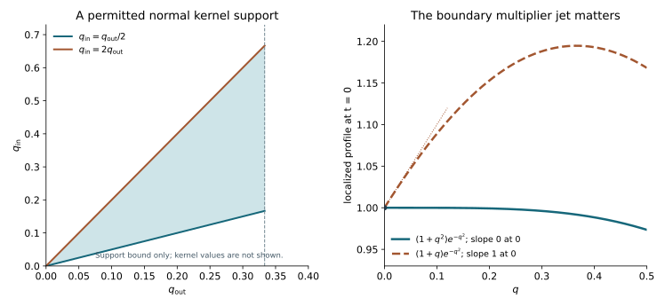

# Boundary-preserving localization of weak sources

The coercive lift WSL removes a natural-dual source, including its boundary part. The new interior source is a tangential divergence of square-integrable functions. It need not be square-integrable itself. This lesson constructs a localized representative that has an actual L2 interior source, preserves the homogeneous boundary condition and has the same microlocal energy regularity as the original solution. It therefore supplies the source class required by [IC's matrix Cauchy construction](../20261008-matrix-incoming-cauchy/matrix-cauchy-evolution-and-causal-boundary-split.html).

The mathematical antecedent for the compressed operator and its boundary jets is Hörmander, *The Analysis of Linear Partial Differential Operators III*, approved Springer 2007 edition, ISBN 978-3-540-49938-1, Section 18.3, Lemma 18.3.4 and Theorem 18.3.5, printed pages 114–115. The complete programme proofs are [LB](../20261005-local-boundary-calculus/boundary-tests-and-lacunary-symbols.md), especially Lemma 4.4 and Theorem 5.1, and [SF](../20261007-restored-sharp-form/sharp-boundary-form-defect.md), especially its patched normal commutator and mixed localization lemma. We prove the new source reduction below, rather than attribute it to those statements without an argument.

Independent exposition, exercises and illustration are **CC0-1.0**. The proof map retains the exact earlier versions and explicitly external Lebl foundations. Internal P514 closure of this export is not claimed. The final section identifies the remaining boundary propagation obligation.

## 1. The source and operator classes

**L0. One ordinary normal derivative is part of the energy norm.** Put \(X=\mathbb R_{q,+}\times\mathbb R_z^d\), \(D=-i\partial\), and use the original restricted distributions on \(q>0\). All inputs and operator kernels used in norms are localized to fixed compact base sets. Write
\[
 Y^r=L^2(\mathbb R_{q,+};H^r(\mathbb R_z^d;\mathbb C^N)),\qquad
 V=H^1_0(X;\mathbb C^N)\quad\hbox{or}\quad H^1(X;\mathbb C^N).
 \tag{BL1}
\]
The zero condition is on the physical face. The operator, after the exact [MBE Robin gauge](../20261008-matrix-boundary-energy/matrix-robin-energy-and-weak-uniqueness.html), is
\[
 P=D_q^2+T_2(q,z,D_z)+b_q(q,z)D_q+T_1(q,z,D_z)+c(q,z).
 \tag{BL2}
\]
Here \(T_2=\sum h^{ab}D_aD_b\) has real scalar smooth coefficients; \(T_1=\sum b_aD_a\) and \(b_q,c\) may have arbitrary smooth complex matrix coefficients. Coefficients and the derivatives used below are bounded. Divergence-form coefficient derivatives have been included in \(T_1\). A Lorentz signature and physical time are needed only for the later application of IC, not for the localization theorem.

Suppose \(v\in H^1\) satisfies, intrinsically,
\[
 Pv=g=F_0+\sum_{a=1}^dD_aF_a,\qquad F_a\in L^2(X),
 \qquad \gamma v=0\quad\hbox{or}\quad \gamma D_qv=0 .
 \tag{BL3}
\]
The normal condition uses WSL's graph trace, not an a priori strong derivative trace. Indeed BL2–BL3 imply \(D_q^2v\in Y^{-1}\): every tangential second derivative of an H1 function is a tangential divergence of an L2 function, including the differentiated coefficients; all first-order terms are L2.

For definiteness, a distribution has **L2 b-index \(s\)** on \(O\subset{}^bT^*X\setminus0\) if the actual localized b-testers of order \(s\) there have L2 values. The energy index uses \(V\) in place of L2, as in UM and WSL. All-order regularity is on one fixed open region. At the face the covector under consideration is
\[
 q_0=(0,z_0;\sigma=0,\eta_0),\qquad \eta_0\ne0,
 \qquad \sigma=q\xi_q.
 \tag{BL4}
\]
The same coordinate \(q\) denotes the normal base variable; \(q_0\) in BL4 denotes the fixed covector.

**L1. The mixed-space maps needed for the rough graph.** A compact properly supported \(A\in\Psi_b^0\) and its actual L2 adjoint act boundedly on \(Y^1\), hence on \(Y^{-1}\) by duality. Indeed their L2 bound is LB's order-zero theorem, and
\[
 D_aA=A D_a+[D_a,A],\qquad [D_a,A]\in\Psi_b^0
 \tag{BL5}
\]
controls every tangential first derivative. Apply the identical proof to \(A^*\); its actual density and support factors are part of LB's adjoint theorem. The duality here is that of \(Y^1,Y^{-1}\), with no integration by parts in \(q\).

If \(C\in\Psi_b^{-1}\), then
\[
 C:Y^{-1}\longrightarrow L^2,\qquad
 \|Cg\|_{L^2}\le C_C\left(\|F_0\|+\sum_a\|F_a\|\right)
 \quad\left(g=F_0+\sum_aD_aF_a\right).
 \tag{BL6}
\]
For the displayed representation, \(CD_a\in\Psi_b^0\) by the exact right tangential composition and the complete proper calculus, so each term is bounded. This also proves the first assertion for every \(g\in Y^{-1}\). To see it without an unproved decomposition theorem, set \(F_0=\Lambda_z^{-2}g\) and \(F_a=D_a\Lambda_z^{-2}g\), where \(\Lambda_z^2=1+\sum D_a^2\). Weighted Plancherel gives
\(F_0+\sum D_aF_a=g\) and
\(\|F_0\|^2+\sum\|F_a\|^2=\|g\|_{Y^{-1}}^2\).
Thus the formula extends by continuity independently of the chosen representation. These maps gain a tangential order; they assert no extra ordinary normal derivative.

## 2. A full-symbol cutoff preserving the physical face

**L2. Construction with an exact normal jet.** Choose nested relatively compact conic patches \(O_0\Subset O_1\Subset O\) about BL4, with compact base supports. After reducing a fixed collar, their boundary base-cone projections admit a cutoff independent of \(q\) near zero. There is a scalar, componentwise, compactly supported b-operator \(B\in\Psi_b^0\) such that
\[
 \operatorname{WF}'_b B\subset O,\qquad
 \operatorname{WF}'_b(B-I)\cap O_1=\varnothing,\qquad
 a(q,z,\eta,\sigma)\text{ is independent of }q\text{ near }0.
 \tag{BL7}
\]
The last clause concerns its **actual local left symbol** \(a\), including its lower terms; it is stronger than a condition on the principal symbol.

Here is the construction. Start with a smooth scalar symbol \(a^{(0)}\) supported in the chosen compressed cone, equal to one on a larger neighborhood of \(\overline{O_1}\). On a collar it is a function of \((z,\eta,\sigma)\) alone; multiply it by a normal cutoff constant near zero. Smooth low-frequency modifications do not change the asserted conic identities. Apply LB's normal-frequency convolution from Lemma 4.4, with an inverse Fourier cutoff supported so that
\[
 \tfrac12q_{\rm out}<q_{\rm in}<2q_{\rm out}.
 \tag{BL8}
\]
The convolution is in \(\sigma\) only. It therefore preserves exact independence of \(q\) in that collar. Its difference from the initial symbol is residual with every derivative, so it preserves both full microsupport assertions in BL7. Tangential proper-support cutoffs can be independent of \(q\); their full symbols and residual terms retain the same independence. A compact output cutoff in \(q<\epsilon\) then permits an input cutoff equal to one on \(q<2\epsilon\), by BL8. This last input cutoff changes no kernel there. All output cutoffs are constant near the physical face. These choices give compact input/output supports and the stated actual symbol, not merely a principal-symbol model.

The exact boundary jet formula of LB:A1 gives, for smooth \(v\),
\[
 \gamma Bv=B_0\gamma v,\qquad
 \gamma D_qBv=B_1\gamma D_qv,
 \quad B_0=\operatorname{Op}_z a(0,z,\eta,0),
 \quad B_1=\operatorname{Op}_z\bigl(a+D_\sigma a\bigr)(0,z,\eta,0).
 \tag{BL9}
\]
Both \(B_0,B_1\) have tangential order zero. The potentially additional term is exactly \(\operatorname{Op}_z(D_qa)(0,z,\eta,0)\gamma v\); it vanishes because of the full-symbol choice. The generally nonzero \(D_\sigma a\) term has not been omitted.

**L3. BL9 holds for the actual weak normal trace.** Give
\[
 \mathcal G=\{v\in H^1(X):D_q^2v\in Y^{-1}\}
 \quad\text{the norm}\quad \|v\|_{H^1}+\|D_q^2v\|_{Y^{-1}}.
 \tag{BL10}
\]
Compact smooth functions up to the face are dense locally in this graph norm. First translate inward by \(\epsilon\), then convolve in \(q\) with radius less than \(\epsilon/2\) and in \(z\) with a smooth approximate identity. Translation continuity and the Hilbert-valued L2 approximation proved in WSL:L6 give convergence of \(v,D_qv,D_av\) in L2 and \(D_q^2v\) in \(Y^{-1}\). Intrinsic derivatives commute with these operations by testing inside the positive half-space. Finally use expanding compact cutoffs. The new terms in \(D_q^2(\chi v)\) contain only \(v,D_qv\in L^2\), and tend to zero in \(Y^{-1}\); tangential multiplication is uniformly bounded there by BL5's elementary multiplier case. This proves the claimed simultaneous density without extending a normal derivative by zero.

The exact normal commutator has the form
\[
 [D_q,B]=E+ND_q,\qquad E\in\Psi_b^0,\quad N\in\Psi_b^{-1}.
 \tag{BL11}
\]
For a single left symbol, \(E=-iT_{\partial_qa}\), \(N=-iT_{\partial_\sigma a}\); SF:A1 retains all cutoff terms when patching. This identity proves \(B:H^1\to H^1\). Expanding one more normal derivative and using L1 proves \(B:\mathcal G\to\mathcal G\): terms before \(D_q^2v\) have order at most zero and hence act on \(Y^{-1}\); the remaining terms act on \(v,D_qv\in L^2\). In particular the order-minus-one terms before \(D_q^2v\) even have L2 values by BL6.

WSL:L6 makes \(\gamma D_qv\in H^{-1/2}\) continuous in BL10, while the ordinary H1 trace \(\gamma v\in H^{1/2}\) is continuous. Apply the smooth jet identities to the graph-dense approximants. The output graph convergence, these trace bounds and the tangential Sobolev maps of \(B_0,B_1\) prove BL9 on all of \(\mathcal G\). Therefore
\[
 \gamma v=0\Rightarrow\gamma Bv=0,\qquad
 \gamma D_qv=0\Rightarrow\gamma D_qBv=0.
 \tag{BL12}
\]
This proves preservation of either homogeneous domain for the rough solution in BL3.

## 3. Use the equation to remove the second normal derivative

**L4. The complete commutator decomposition.** Retain BL11 and write
\[
 [D_q,E]=E_0+E_{-1}D_q,\qquad
 [D_q,N]=N_{-1}+N_{-2}D_q,
 \tag{BL13}
\]
where the subscripts give the b-orders. Direct multiplication gives
\[
 [D_q^2,B]=(2N+N_{-2})D_q^2
                +(2E+E_{-1}+N_{-1})D_q+E_0.
 \tag{BL14}
\]
In particular, its first coefficient \(M=2N+N_{-2}\) has order minus one. Formula BL14 is an identity of actual operators. It neither drops \(N_{-2}\) nor treats an ordinary second normal derivative as an H1-to-L2 map.

The rest of \([P,B]\) is a finite sum of b-order-zero coefficients before at most one ordinary derivative, plus an order-zero term. For clarity, a principal tangential term expands exactly as
\[
 [hD_aD_b,B]=[h,B]D_aD_b+h[D_a,B]D_b+hD_a[D_b,B].
 \tag{BL15}
\]
Since \(B\) is scalar, \([h,B]\in\Psi_b^{-1}\); its composition with \(D_a\) has order zero. The other two terms have the required form after the tangential product rule. The same statement holds with matrix multiplication coefficients. For the normal lower term the complete expression is
\[
 [b_qD_q,B]=b_qE+\bigl(b_qN+[b_q,B]\bigr)D_q.
 \tag{BL16}
\]
It is of the stated class without a commutation or Hermitian assumption on any matrices. Tangential and zero-order lower terms follow from the same product identities. Thus
\[
 [P,B]=M D_q^2+K_1,\qquad
 M\in\Psi_b^{-1},\qquad K_1:H^1\longrightarrow L^2.
 \tag{BL17}
\]
Every coefficient has full microsupport within that of \(B\). The full symbol identities make every coefficient residual wherever B minus the identity is residual. The exact expansions, complete coefficient commutators and SF's mixed bound retain all remainders in these assertions.

Substitute **the equation of the original input**, \(D_q^2v=g-(P-D_q^2)v\), into BL17. Define
\[
 K=K_1-M(P-D_q^2).
 \tag{BL18}
\]
Then \(K:H^1\to L^2\). For its tangential second-order part, first compose the order-minus-one coefficient with the leftmost tangential derivative, leaving one derivative of \(v\in H^1\) on the right. Coefficient derivatives, the first normal lower term and every other first-order term have the same or lower order. This is precisely the one-ordinary-derivative bound of SF:T005. We obtain the exact reduced identity
\[
 P(Bv)=(B+M)g+Kv.
 \tag{BL19}
\]
All expressions are defined for BL3. In particular \(Mg\in L^2\) by BL6. Smooth graph approximation, or the established distributional operator identities followed by the equation, proves BL19 in the intrinsic distribution space. No extra boundary source was introduced by this calculation; L3 handles the actual boundary trace separately.

**L5. An actual L2-source representative.** Suppose \(g\) has L2 b-index zero on \(O\), and take \(B\) from L2 with kernel supports contained in the region of that assertion. The exact localization theorem gives \(Bg\in L^2\). Here its rough-input remainder can be checked explicitly. Choose one order-zero tester \(Q\), elliptic on the compact microsupport of \(B\), with \(Qg\in L^2\). The complete parametrix and separated-support calculation give \(B=HQ+R\), where \(H\) has order zero and \(R\) is residual. Then \(HQg\in L^2\), while \(Rg=RF_0+\sum RD_aF_a\in L^2\) by L1. A finite cover and the same parametrix construction supply the single tester when needed. Thus no global L2 hypothesis on \(g\) is hidden in the localization. We conclude
\[
 U=Bv\in V,\qquad PU=G\in L^2,\qquad
 G=(B+M)g+Kv,\qquad
 \|G\|\le C\left(\|Bg\|+\sum_{a=0}^d\|F_a\|+\|v\|_{H^1}\right).
 \tag{BL20}
\]
Both homogeneous boundary conditions in BL3 are preserved. For the Neumann domain, the actual graph trace of \(U\) is zero, so MBE's complete Green formula identifies its weak equation with the L2 functional \(G\), including the full normal lower coefficient. For Dirichlet tests their zero value gives the corresponding identity. Conversely the displayed equation and those traces give precisely these weak realizations. This checks the functional, not only the equation on interior tests.

## 4. Keep the microlocal energy front and source order

**L6. The localization error is regular to every b-order on one region.** On \(O_1\) the full microsupport of \(B-I\) is empty. The exact localizer/parametrix proof UM:T007 and SF's residual mixed bound give
\[
 (B-I)v\text{ has every energy b-index on }O_1.
 \tag{BL21}
\]
One can see the energy bound directly after any finite-order tester \(A\) with smaller compact microsupport. The coefficient of \(A(B-I)\) is residual. Its tangential derivatives remain residual; its normal derivative is a residual coefficient plus a residual coefficient before \(D_q\), by SF:A1. All of them have L2 values on \(v\in H^1\). This proves H1 membership and the bound, including the Dirichlet domain when chosen.

Likewise \(M\) and every coefficient of \(K\) in BL19 are residual on \(O_1\), because the complete commutator with the identity vanishes there. After a finite-order tester there are only residual coefficients before \(F_a,v,D_jv\in L^2\). Consequently
\[
 G-g\text{ has every L2 b-index on }O_1.
 \tag{BL22}
\]
For the term \((B-I)g\), use its actual divergence representation in BL3 and compose each residual coefficient with \(D_a\). The same argument applies to \(Mg\); it does not require \(g\) to be globally L2. Thus if \(g\) has L2 b-index \(s\ge0\) on \(O\), \(G\) has that index on \(O_1\), while \(U\) and \(v\) have exactly the same energy b-index \(s\) there. If all source orders are available on \(O\), they all hold on the same \(O_1\). The cutoffs and \(B\) are fixed once; finite-order constants may depend on the order.

Residual b-operators need not produce ordinary smooth functions at the face. BL21–BL22 assert exactly the energy and L2 b-regularity used here. The mixed proof retains at most one ordinary normal derivative on an H1 input.

**L7. Apply this to the entire original natural-dual source.** Let the original local weak equation be the normalized WSL form, with \(u\in V\) and \(f\in V^*\). Suppose \(f\) has \(V^*\) b-index \(s+1\), \(s\ge0\), on \(O\). Apply WSL:L1–L5 and its local version L8. They give \(u=w+v_0\), with
\[
 w:\ V\text{-index }s+1,\qquad
 Pv_0=g_0=\sum_{a,b}D_a\bigl((\delta_{ab}-h^{ab})D_bw\bigr)+\mu w,
 \qquad g_0:\ L^2\text{-index }s.
 \tag{BL23}
\]
The interior expression in BL23 is a tangential divergence of L2 functions. The full source and boundary functional have already cancelled in WSL's weak identity. The residual solution has either zero value or its actual homogeneous Robin flux, with the original complex matrix \(m_q\) retained.

For the Robin case apply MBE:B1's exact solution and test transformations \(v_0=S v\), \(\varphi=S^{-*}\psi\). The new boundary condition is \(\gamma D_qv=0\). The conjugated equation has BL2's form and the entire transformed lower terms. Its interior source is \(S^{-1}g_0\). This still has BL3's representation: write
\[
 S^{-1}D_aF_a=D_a(S^{-1}F_a)-(D_aS^{-1})F_a.
 \tag{BL24}
\]
Every new coefficient is bounded; the remainder is L2. The exact source transform and the full transformed form agree by MBE's proof, not by ignoring derivative-on-test terms. Smooth invertible matrix multiplication preserves the b-indices by the complete operator calculus. In the Dirichlet case take \(S=I\).

Choose one cutoff \(B\) as in L2. L5–L6 produce \(U\in H^1\) satisfying \(PU=G\in L^2\) with the homogeneous Dirichlet or bare Neumann condition. On the fixed inner region, for each indicated finite \(s\),
\[
 u:\ V\text{-index }s
 \quad\Longleftrightarrow\quad
 SU:\ V\text{-index }s,\qquad
 G:\ L^2\text{-index }s .
 \tag{BL25}
\]
Indeed \(u-SU=w+S(v-Bv)\); the two terms have respectively the extra energy index from WSL and every energy index from BL21. The reverse implication uses the same identity. If the source is regular at all b-orders on \(O\), the all-order equivalence holds on one fixed inner region. This removes the earlier obstacle that \(g_0\) was only microlocally L2: the new representative has a genuinely L2 source on its full localized support.

For a local equation, use WSL:L8's lift before cutting off the residual solution. Its homogeneous boundary condition permits a compact multiplier \(\chi\) with \(\partial_q\chi=0\) on the face. The complete commutator \([P,\chi]v\in L^2\) is supported away from a smaller base plateau; it must be included in \(F_0\). Extend coefficients smoothly on that plateau and retain every localization term. Choose \(B\)'s input and output supports inside the original equation patch, with the multiplier equal to one on a larger neighborhood of both. Thus the globalized BL3 agrees with the original equation wherever it is used; the commutator is neither discarded nor misidentified as a source regularity failure at the chosen covector. The exact NW coordinate, density and test normalization returns BL25 to the original weak problem.

## 5. The incoming construction is now available

**L8. Consequence for a time-dependent wave principal part.** When the principal symbol has the normalized Lorentz signature and physical time of MBE and IC, the representative \(U\) from L7 meets IC:C5's actual hypotheses. Select its genuine good energy slice, extend position by zero for Dirichlet or evenly for Neumann, and extend velocity and \(G\in L^2\) by zero. IC:C3 supplies the full matrix Cauchy solution \(V_{\rm in}\); IC:C6–C7 then give
\[
 W=H(t-r)(U-V_{\rm in})\in H^1,\qquad
 PW=0\ (q>0),\qquad W=0\ (t<r),
 \tag{BL26}
\]
with actual boundary graph traces and no time-interface delta. The new L2 source in this construction is the entire \(G\) in BL20. It is not just the original source inside a chosen frequency cone. Full Robin and coordinate transforms return the same local energy front by BL25.

This proves a source reduction for the original natural-dual problem followed by an actual causal split. It does not prove that the boundary trace of \(W\) is confined to one Fourier–Airy cone. That trace can still have complementary singularities. IC:C8's complete-data comparison requires those contributions to be excluded or controlled on the entire dependence region. Localized incoming regularity, that complementary boundary response, sharp Airy mapping and the full strict-diffractive propagation theorem therefore remain to be proved. No smoothness of the whole L2 source is assumed from its microlocal b-indices.

## 6. Three complete exercises

### Exercise 1. A bulk commutator does not certify the boundary condition

Use \(L=\partial_t^2-\partial_q^2\) and \(v(q,t)=e^{-q^2}\cos t\). Compare the local multipliers \(\chi_0=1+q^2\) and \(\chi_1=1+q\). Compute their normal traces and full bulk commutators.

**Solution.** The original normal derivative vanishes at zero. Direct differentiation gives
\[
 \partial_q(\chi_0v)|_0=0,\qquad
 \partial_q(\chi_1v)|_0=\cos t,\qquad
 [L,\chi_0]v=(8q^2-2)v,\qquad [L,\chi_1]v=4qv.
 \tag{BL27}
\]
Both bulk errors are locally L2. Only the first multiplier preserves the normal boundary condition. Multiply both by the same cutoff constant on the displayed local patch to obtain compact examples; retain its commutator outside the patch. This is the elementary normal-jet term removed by L2's exact symbol choice.

### Exercise 2. Check the second-normal-derivative coefficient

For the differential example \(P=D_q^2-(1+q)D_t^2\), take the dilation \(B=q\partial_q\). Compute \([P,B]\) and its value on a solution \(Pv=g\).

**Solution.** This \(B\) has b-order one; it tests the algebraic identity, not the order-zero bounds of the theorem. The exact equalities \([D_q,B]=D_q\) and \([-(1+q)D_t^2,B]=qD_t^2\) give
\[
 [P,B]=2D_q^2+qD_t^2,\qquad
 [P,B]v=2g+(2+3q)D_t^2v.
 \tag{BL28}
\]
The second formula substitutes \(D_q^2v=g+(1+q)D_t^2v\). Omitting the coefficient of \(D_q^2\) changes the source by \(2g\) and changes the tangential term. This verifies the purpose and sign of the equation substitution in BL18–BL19, without claiming an H1-to-L2 bound for the order-one example.

### Exercise 3. The tangential divergence can fail to be L2

On the circle with normalized measure, let \(w(q,z)=\phi(q)\sum_{k\ge1}k^{-2}e^{ikz}\), with nonzero compact smooth \(\phi\) on the half-line. Show that \(w\in H^1\), \(g=D_z^2w\notin L^2\), and one inverse tangential derivative makes \(g\) square-integrable.

**Solution.** The exact Fourier-series norm proof in UM:A2 gives the convergent energy sum
\[
 \|w\|_{H^1}^2
  =(\|\phi\|^2+\|\phi'\|^2)\sum_{k\ge1}k^{-4}
       +\|\phi\|^2\sum_{k\ge1}k^{-2}.
 \tag{BL29}
\]
The coefficient of \(g\) at every positive frequency is \(\phi\), so its squared L2 norm would contain the divergent sum \(\|\phi\|^2\sum1\). Its divergence representation is \(D_zF_1\), where \(F_1=D_zw\in L^2\). The exact tangential Fourier multiplier \(C=(1+D_z^2)^{-1/2}\) gives
\[
 \|Cg\|^2=\|\phi\|^2\sum_{k\ge1}(1+k^2)^{-1}
           \le2\|\phi\|^2<\infty.
 \tag{BL30}
\]
The bound follows from \(\sum_{k\ge1}k^{-2}\le1+\int_1^\infty x^{-2}dx=2\). This is a tangential Fourier model of the rough source. The general compressed-operator estimate, including its normal dependence, is separately proved in L1.

**F0. Exact figure coordinates.** The left panel shades the support bound \(q_{\rm out}/2\le q_{\rm in}\le2q_{\rm out}\), \(0\le q_{\rm out}\le1/3\). It shows a permitted support region, not the values of an operator kernel. The right plots \((1+q^2)e^{-q^2}\) and \((1+q)e^{-q^2}\) for \(0\le q\le1/2\), the \(t=0\) profiles of Exercise 1, with boundary slopes zero and one. The [figure script](figures/build_figure.py) retains these exact functions and constants. L2 and Exercise 1 prove the two mechanisms illustrated.
