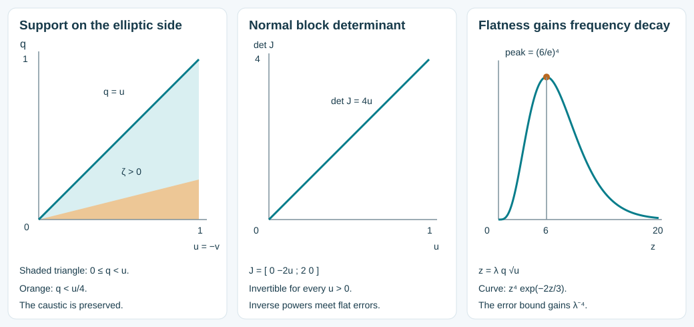

# Coupled matrix Airy amplitudes and the actual boundary kernel

The cubic phase and boundary parity theorem now let us construct amplitudes for the differential operator itself. We derive the signs from the product rule, solve the coupled matrix equations, correct every boundary jet on the side without real characteristics, and sum the amplitude orders. After normalization by the zero-free outgoing Airy mode, the resulting kernel has a smooth differential-equation error up to the physical boundary. Its exact value and conormal traces are computed below.

The scalar source for the transport construction is Melrose–Taylor, [*Boundary Problems for Wave Equations With Grazing and Gliding Rays*](https://mtaylor.web.unc.edu/wp-content/uploads/sites/16915/2018/04/glide.pdf), Sections 4.1–4.4, especially Propositions 4.4.11 and 4.4.14. We use our already proved boundary-normalized phase, [ordered matrix parity theorem](../20261008-matrix-parity-transport/matrix-parity-and-folded-transport.md), and zero-free Airy estimates. The displayed calculations specify our conventions independently. The proof map records exact prerequisites, including the explicitly external Lebl proofs. Internal P514 closure of this export is not claimed.

Independent text, proofs, exercises and figure: **CC0-1.0**. No human source text or PDF is bundled. This lesson proves a local kernel construction and its traces. Sobolev mapping into the original weak energy domain, the natural-dual source transfer, incoming estimates and strict propagation remain to be proved.

## 1. Operator, phase and amplitude degrees

**A0. The receiving contract.** Let \(x=(q,y)\), with physical side \(q\ge0\). Write a second-order system with scalar real principal part in left-coefficient form as

\[
 \mathcal P=\sum_{j,k}a^{jk}(x)D_jD_k I_N+
          \sum_j b^j(x)D_j+c(x),\qquad D_j=-i\partial_{x_j}.
 \tag{CA1}
\]

The real matrix \((a^{jk})\) is symmetric; the lower coefficients \(b^j,c\) are arbitrary smooth complex \(N\)-by-\(N\) matrices. A divergence-form scalar principal operator can be written this way by the product rule, keeping its resulting first-order terms. Define

\[
 p(x,\xi)=\sum a^{jk}\xi_j\xi_k,\qquad
 \mathcal B(\alpha,\beta)=\sum a^{jk}\alpha_j\beta_k,\qquad
 \Delta_a f=\sum a^{jk}\partial_j\partial_k f.
 \tag{CA2}
\]

Assume the strict glancing hypotheses BCP:H0. Use its real phases \(\theta,\zeta\), of degrees \(1,2/3\), and model frequencies \(\eta=(\mu,\eta',\lambda)\), \(\lambda>0\). All statements are on a smaller fixed conic neighborhood. Write \(v=\mu/\lambda\). The earlier construction gives

\[
 \theta_b=S(y,\eta),\quad \zeta_b=-\mu\lambda^{-1/3},\quad
 \det S_{y\eta}\ne0,\quad
 \zeta_q\le -c_0\lambda^{2/3}<0.
 \tag{CA3}
\]

The subscript \(b\) denotes restriction to \(q=0\); constants here and below are uniform on compact reduced patches. The attained region is \(\zeta\le0\). Its complement is described by \(q+vD(y,\eta)<0\), where \(D>0\) is smooth of degree zero. The errors

\[
 E_1=p(d\theta)-\zeta p(d\zeta),\qquad
 E_2=\mathcal B(d\theta,d\zeta)
 \tag{CA4}
\]

vanish on the attained region and have every normal jet zero at the full boundary. They have degrees \(2,5/3\). In the following formulas, differentials and derivatives of amplitudes are in \(x\) with \(\eta\) fixed.

For any smooth scalar solution \(A''(t)=tA(t)\), use the kernel factor

\[
 U(x,\eta)=e^{i\theta(x,\eta)}
       \bigl[g(x,\eta)A(\zeta)+i h(x,\eta)A'(\zeta)\bigr].
 \tag{CA5}
\]

An amplitude pair of leading degree \(m\) has \(g\) of degree \(m\) and \(h\) of degree \(m-1/3\). The coefficient \(i\) in (CA5) is part of the convention and will not be suppressed.

## 2. The full operator identity

**A1. Product rule, including every lower coefficient.** Put

\[
 T_\psi f=2\mathcal B(d\psi,df)+K_\psi f,
 \qquad K_\psi=(\Delta_a\psi)I_N+i\sum_j b^j\partial_j\psi,
 \qquad Q=p(d\zeta).
 \tag{CA6}
\]

The two transport expressions are

\[
 L_1(g,h)=T_\theta g+\zeta T_\zeta h+Qh,
 \qquad L_2(g,h)=T_\theta h-T_\zeta g.
 \tag{CA7}
\]

Direct differentiation gives the exact identity

\[
 e^{-i\theta}\mathcal P U
 =A(\zeta)\,[E_1g+2\zeta E_2h-iL_1(g,h)+\mathcal P g]
 +iA'(\zeta)\,[E_1h-2E_2g-iL_2(g,h)+\mathcal P h].
 \tag{CA8}
\]

Here \(\mathcal P g\) means the original operator applied entry by entry, with its matrix coefficients on the left. To verify all terms, first conjugate by \(e^{i\theta}\): for any matrix \(f\), the result is \(p(d\theta)f-iT_\theta f+\mathcal P f\). For \(f=gA(\zeta)\), differentiating the Airy factor twice contributes \(-\zeta QgA\) and \(-T_\zeta g A'\); the conjugated first derivative contributes \(-2iE_2gA'\). For \(f=i hA'(\zeta)\), use \(A''=\zeta A\) and \(A'''=A+\zeta A'\). These contribute \(-iQhA-i\zeta T_\zeta hA\), \(-i\zeta QhA'\), and \(2\zeta E_2hA\). Combining them with the conjugated terms gives (CA8). This proof explains both the minus sign in \(L_2\) and the extra term \(Qh\).

The degrees of \(L_1,L_2\) are \(m+1,m+2/3\). The terms \(\mathcal P g,\mathcal P h\) have degrees \(m,m-1/3\), because only base derivatives occur. Thus successive amplitude corrections decrease their degrees by one.

## 3. Lift to the characteristic manifold without a singular coefficient

**A2. The smooth signed root.** The fold \(Y:P\to (x,\eta)\) in BCP:C2–C3 has a smooth signed coordinate \(s\) satisfying

\[
 s^2=-\zeta\circ Y,\qquad
 \xi=d\theta+s,d\zeta,\qquad H_p\eta=0,
 \qquad H_ps=-Q\circ Y.
 \tag{CA9}
\]

Indeed BCP:C3 writes the pullback of \(-\zeta\) as a positive smooth factor times the square of a fold coordinate. Take its smooth positive square root times that signed coordinate, choosing the sign to give the covector in (CA9). The two branch covectors in BCP:C7 prove the identity off the fold and hence on it by continuity. Away from \(s=0\), applying \(H_p\) to \(s^2=-\zeta\) gives
\(2sH_ps=-2\mathcal B(d\theta+s,d\zeta,d\zeta)=-2sQ\).
Here \(E_2=0\) on \(P\). Smoothness extends the last identity through zero. The model frequencies are first integrals because the fixed-frequency leaves in BCP:C1 are characteristic. The degree of \(s\) is \(1/3\).

**A3. The exact transport lift.** Set \(a=g\circ Y-s h\circ Y\). Since the base projection of \(H_p\) is \(2\mathcal B(d\theta+s,d\zeta,d_x\cdot)\), expansion of (CA9) gives

\[
 H_pa+(K_\theta+sK_\zeta)a
       =L_1(g,h)\circ Y-s L_2(g,h)\circ Y.
 \tag{CA10}
\]

For example differentiating \(-s h\) contributes \(+Qh\); its last base derivative contributes \(-s^2\,2\mathcal B(d\zeta,dh)=\zeta\,2\mathcal B(d\zeta,dh)\). Multiplication by \(K_\theta+sK_\zeta\) gives \(K_\theta g+\zeta K_\zeta h+s(K_\zeta g-K_\theta h)\), in its actual order. These account for every term. The coefficient in (CA10) is smooth across the fold. No division by \(s\), singular branch divergence, or commuting matrix exponential occurs.

Conversely, any smooth \(a\) on \(P\) decomposes under the sheet exchange of \(Y\) as \(a=g\circ Y-s h\circ Y\). Even descent gives \(g\); smooth division of the odd part by \(s\), followed by even descent, gives \(h\). The complete proofs FD:D1, FD:D2 and FD:E2 provide these functions smoothly on the attained side and extend them across its boundary. If (CA10) has right side \(F_1\circ Y-sF_2\circ Y\), taking its even and odd parts shows \(L_j=F_j\) on the attained side, including the fold by continuity.

## 4. Impose the actual boundary conditions

**A4. Frequency powers in the parity conversion.** On \(K=P\cap Q\), the boundary cotangent exchange preserves \((y,\eta)\). Since \(d_y\zeta_b=0\) and \(\zeta_q\ne0\), the normal covector is \(\theta_q+s\zeta_q\); the exchange sends \(s\) to \(-s\). Define the degree-zero odd coordinate \(\tau=\lambda^{-1/3}s\). In the notation of the matrix parity theorem,

\[
 E a=g_b,\qquad O_\tau a=-\lambda^{1/3}h_b.
 \tag{CA11}
\]

Given smooth matrix boundary data, the two conditions and their equivalent parity forms are

\[
 \begin{array}{ll}
 h_b=Cg_b+d:& O_\tau a=-\lambda^{1/3}C Ea-\lambda^{1/3}d,\\[2pt]
 g_b=B\zeta_b h_b+d:& Ea=\tau^2\lambda^{1/3}B O_\tau a+d.
 \end{array}
 \tag{CA12}
\]

In the first row, \(C,d\) have degrees \(-1/3,m-1/3\); in the second, \(B,d\) have degrees \(-1/3,m\). Every product has the order displayed. In the first row the value of \(g\) at the marked point can be prescribed. In the second it must equal the specified \(d\) there.

For smooth homogeneous \(F_1,F_2\) of degrees \(m+1,m+2/3\), apply MPT:T0–T3 to (CA10), with forcing \(F_1-sF_2\). The genuine first integral \(\lambda\) makes \(\lambda^{-1}H_p\) degree zero. The glancing pair has the required distinct boundary and characteristic exchanges. MPT:P6 permits the actual primitive odd coordinate \(\tau\), even when its scale differs from a simultaneous reflection coordinate. Thus the theorem supplies a smooth homogeneous \(a\) satisfying either parity condition, with its permitted normalization. Descent in A3 yields the corresponding \(g,h\) and both transport equations on the attained region. The boundary condition initially holds where \(\mu\ge0\), which is the boundary part of that region.

## 5. Extend all boundary jets on the unattained side

**A5. Correct the zeroth boundary values.** First extend the descended \(g,h\) smoothly and homogeneously by FD:E2 on \(\lambda=1\). In the first row of (CA12), the discrepancy \(h_b-Cg_b-d\) is smooth and zero for \(v\ge0\), hence flat at \(v=0\). Subtract this discrepancy from \(h\), multiplied for \(v<0\) by \(\chi(q/(\delta|v|))\), and use zero for \(v\ge0\). Choose \(0<\delta<\inf D/2\) and \(\chi=1\) near zero with support in \((-1,1)\). The same construction corrects \(g_b-B\zeta_bh_b-d\) in the second row. Every derivative of the cutoff costs only a power of \(|v|^{-1}\), absorbed by flatness. Thus these are smooth homogeneous corrections, supported in \(q+vD<0\). They fix the boundary identity for all \(v\) and leave the attained solution unchanged. This is the supported extension argument BCP:C4, applied entry by entry.

**A6. The nonsingular elliptic-side jet recursion.** Put \(V_\psi^q=2\mathcal B(d\psi,dq)\). The coefficients of \(\partial_qg,\partial_qh\) in the coupled system are the scalar block matrix

\[
 \mathcal J=\begin{pmatrix}V_\theta^q&\zeta V_\zeta^q\\-V_\zeta^q&V_\theta^q\end{pmatrix}\otimes I_N.
 \tag{CA13}
\]

At the full boundary, (CA3)–(CA4) imply

\[
 V_\theta^q=0,\qquad V_\zeta^q=2a^{qq}\zeta_q\ne0,
 \qquad
 \mathcal J_b^{-1}=
 \begin{pmatrix}0&-(V_\zeta^q)^{-1}\\(\zeta_bV_\zeta^q)^{-1}&0\end{pmatrix}\otimes I_N
 \quad(v<0).
 \tag{CA14}
\]

For the first assertion, \(d_y\zeta_b=0\) and \(E_2|_b=0\) give \(\zeta_q\mathcal B(d\theta,dq)=0\). Positivity of \(a^{qq}\) and (CA3) give the second. Since \(\zeta_b=-v\lambda^{2/3}>0\) for \(v<0\), the inverse exists there. On the normalized slice, its derivatives have at most polynomial growth in \(|v|^{-1}\).

Prescribe the corrected zeroth jets from A5. Differentiating \(L_j(g,h)=F_j\) exactly \(k\) times in \(q\) and evaluating at zero determines the next jets by

\[
 \binom{g_{k+1}}{h_{k+1}}=
 \mathcal J_b^{-1}\left[
 \binom{\partial_q^kF_1}{\partial_q^kF_2}_{b}
       -\text{terms involving only }g_0,\ldots,g_k,h_0,\ldots,h_k
 \right].
 \tag{CA15}
\]

This notation specifies an actual recursion: in (CA7), distribute the \(k\) normal derivatives by the finite product rule, omit only the two terms collected in \(\mathcal J_b(g_{k+1},h_{k+1})^T\), and substitute the previously determined jets in every remaining term. Tangential derivatives act on those known jets. No higher jet occurs elsewhere, because the system is first order.

Each difference from the preliminary jets is flat at \(v=0\). Indeed the preliminary transport residual and all its normal derivatives at the boundary vanish for \(v>0\), where the equations hold on an open attained neighborhood. Their smooth parameter dependence makes them flat at zero. At the first step (CA14) multiplies a flat residual by a matrix with polynomial inverse-power growth. It remains flat in all derivatives. At each subsequent step subtract the preliminary recursion: the difference is a finite sum of previous flat differences, their tangential derivatives and flat residual jets, multiplied by smooth coefficients and the same inverse. Induction proves flatness of every correcting jet, with all parameter derivatives. Degree counting in (CA13) also gives \(g_k\) degree \(m\) and \(h_k\) degree \(m-1/3\) for every \(k\).

**A7. Smooth realization and quantitative residuals.** Apply the complete supported Borel construction BCP:C6 to these correcting jets, separately for \(g\) and \(h\). Its series has terms \(q^k c_k\chi(q/(\varepsilon_k|v|))/k!\), \(k\ge1\), with fixed constants \(\varepsilon_k\le\delta\) chosen to make the first \(\lfloor k/2\rfloor\) derivatives and flat weights summable. The proof there establishes all mixed convergence, exactly the prescribed jets and one common neighborhood. The corrections change neither the boundary values nor the attained functions. Consequently

\[
 L_1(g,h)-F_1=R_1,\qquad L_2(g,h)-F_2=R_2,
 \qquad \partial_q^kR_j|_{q=0}=0\quad(k\ge0),
 \tag{CA16}
\]

and \(R_j=0\) for \(\zeta\le0\). All tangential and frequency derivatives of these statements hold. Taylor's integral remainder yields bounds by \(\lambda^{m+1-|\beta|}|q|^L\) and \(\lambda^{m+2/3-|\beta|}|q|^L\), respectively, after any fixed base and frequency differentiations. The corresponding caustic flat bounds follow from the attained vanishing. This completes the homogeneous coupled transport theorem with either boundary condition, for all complex lower coefficients.

## 6. Sum the actual amplitude expansion

**A8. A common neighborhood for every order.** Take leading degree zero and boundary condition \(h_b=0\). Solve the leading homogeneous transport equations with \(g_0\) equal to \(I_N\) at the marked point. Then recursively solve

\[
 L_1(g_j,h_j)=-i\mathcal P g_{j-1},\qquad
 L_2(g_j,h_j)=-i\mathcal P h_{j-1}\quad(j\ge1),
 \tag{CA17}
\]

on the attained region and to every boundary order, retaining \(h_j|_b=0\) and choosing zero point value for \(g_j\), \(j\ge1\). The degrees are \(-j,-j-1/3\). The same neighborhood works for all \(j\). To justify this point, the flow box, fold coordinates, ordered gauge, matrix coefficients in the boundary parity equation, their invertibility neighborhoods and the wedge \(\delta\) depend only on the fixed geometry and transport operator. Inhomogeneous data affect coefficient functions and summation radii, not those geometric neighborhoods. Restrict once to a compact smaller box in these constructions. Each recurrence then has the full data required on that box, and the Borel radii can decrease with the order without shrinking the box.

Choose a smooth scalar frequency cutoff \(\chi\), zero below one and one above two, and radii \(R_j\to\infty\). Form

\[
 g=\sum_{j\ge0}\chi(\lambda/R_j)g_j,\qquad
 h=\sum_{j\ge0}\chi(\lambda/R_j)h_j.
 \tag{CA18}
\]

Here and in the local symbol assertions we work on a compact smaller reduced cone. For completeness the radii can be chosen so that, for \(j\ge2\), the first \(\lfloor j/2\rfloor\) symbol seminorms of the \(j\)-th terms in orders \(-j/2\) and \(-j/2-1/3\) are at most \(2^{-j}\). Homogeneity supplies a factor bounded by a constant times \(R_j^{-j/2}\) on the support; derivatives of the cutoff have the same symbol degree as derivatives of a homogeneous factor. Increasing \(R_j\) meets these finitely many conditions. Uniform convergence of all fixed differentiated tails follows. For each fixed \(J\), the finitely many terms with index below \(J\) differ from their homogeneous versions only in a bounded frequency range, and the tail has order \(-J\), respectively \(-J-1/3\): terms \(J\le j<2J\) already have these orders, and the remaining seminorm bounds are summable. Thus (CA18) is a classical symbol pair with the stated full expansion. All boundary identities \(h_b=0\) hold exactly term by term and under differentiated convergence.

Let \(r_{1,j},r_{2,j}\) be the homogeneous transport errors in (CA16) for order \(j\), with the forcing in (CA17) and zero forcing for \(j=0\). The radii can simultaneously be chosen to sum these two sequences in symbol orders \(1\) and \(2/3\): impose their finitely many seminorm bounds as well at each step. Define \(r_k=\sum_j\chi(\lambda/R_j)r_{k,j}\). They vanish on the attained region and have every boundary jet zero, by differentiated convergence. Comparing the full homogeneous expansions and using \((-i)(-i)=-1\) in (CA17) proves

\[
 -iL_1(g,h)+\mathcal P g=-i r_1+e_1,\qquad
 -iL_2(g,h)+\mathcal P h=-i r_2+e_2,
 \quad e_1,e_2\in S^{-\infty}.
 \tag{CA19}
\]

Indeed the coefficient at each homogeneous order is zero after subtracting \(-ir_k\); the tail estimate just proved then places the difference in every negative symbol order. The scalar cutoffs in (CA18) depend only on \(\eta\), so every base derivative in \(L_j\) and \(\mathcal P\) commutes with them. No unrecorded differentiated cutoff term is hidden in (CA19).

## 7. Why the remaining flat errors give smooth kernels

**A9. A two-variable flat estimate.** On the physical side, a smooth symbol \(r\) of order \(M\) that vanishes on \(\zeta\le0\) and has every boundary jet zero satisfies, for all \(L,K,\alpha,\beta\),

\[
 |\partial_x^\alpha\partial_\eta^\beta r|
   \le C_{\alpha\beta LK}\lambda^{M-|\beta|}q^L|v|^K,
 \qquad q\ge0,
 \tag{CA20}
\]

on a fixed smaller patch. To prove it, use \((q,y,v,\eta'/\lambda,\lambda)\) as coordinates. All normalized parameter derivatives preserve the symbol order. At \(q=0\), every normal derivative of \(r\) vanishes. At \(v=0\), for every \(q\ge0\), it also vanishes with all derivatives because \(v\ge0\) lies in the attained region. Taylor's integral formula, first in \(q\) and then in \(v\), gives \(q^L v^K\) times an integral of a mixed derivative of order \(L+K\). Its bound is a symbol bound on the same compact patch. The coordinate chain rule converts back to the displayed frequency derivatives, with the factor \(\lambda^{-|\beta|}\). This reasoning also applies to all products of \(E_1,E_2,r_1,r_2\) with the amplitudes in (CA8).

**A10. Normalized outgoing mode and exponential gain.** Let \(F\) be the zero-free Airy solution in ABQ:B1–B4, with \(F(-t)\sim t^{-1/4}e^{2it^{3/2}/3}\) as \(t\to+\infty\). The fully proved global bounds AB24 say

\[
 c\langle t\rangle^{-1/4}e^{\Psi(t)}\le |F(t)|
 \le C\langle t\rangle^{-1/4}e^{\Psi(t)},\quad
 |F^{(k)}(t)|\le C_k\langle t\rangle^{k/2-1/4}e^{\Psi(t)},
 \quad\Psi(t)=\tfrac23(t_+)^{3/2}.
 \tag{CA21}
\]

Because \(\zeta_q<0\), one has \(\zeta\le\zeta_b\) when \(q\ge0\). Thus \(F^{(k)}(\zeta)/F(\zeta_b)\), and all its base and frequency derivatives, have polynomial frequency bounds. This follows by differentiating the quotient: the inverse denominator derivatives are finite sums of products of derivatives of \(F\) divided by powers of its nonzero value. Bounds (CA21) leave the exponential factor \(e^{\Psi(\zeta)-\Psi(\zeta_b)}\le1\) in every term. All other factors are polynomial, since \(|\zeta|+|\zeta_b|\le C\lambda^{2/3}\) locally. This proof does not differentiate the nonsmooth auxiliary function \(t_+^{3/2}\); that function is used only in pointwise bounds for the smooth Airy derivatives.

Where a flat error from A9 can be nonzero, \(v<0\) and \(\zeta>0\). Put \(u=|v|\). Then \(\zeta_b=u\lambda^{2/3}\), and (CA3) implies \(0\le q\le u/c_0\) and

\[
 \Psi(\zeta_b)-\Psi(\zeta)
   \ge \tfrac23 c_0\lambda q\sqrt u.
 \tag{CA22}
\]

Indeed \(\zeta\le\lambda^{2/3}(u-c_0q)\), and
\(u^{3/2}-(u-c_0q)^{3/2}\ge c_0q\sqrt u\).
The latter follows after dividing by \(u^{3/2}\) from \((1-z)^{3/2}\le1-z\) for \(0\le z\le1\).

For every nonnegative integer \(L\), the function \(z^Le^{-c z}\) is bounded on \([0,\infty)\): differentiation puts its maximum at \(z=L/c\) if \(L>0\), and for \(L=0\) it decreases. Combining (CA20) with (CA22), choosing \(K\ge L/2\), gives an arbitrary inverse power of \(\lambda\):

\[
 q^Lu^K e^{-c\lambda q\sqrt u}
 \le C_L\lambda^{-L}u^{K-L/2}\le C_{LK}\lambda^{-L}.
 \tag{CA23}
\]

For any prescribed derivatives and desired negative order, choose \(L\) to absorb their fixed polynomial losses from (CA21) and the original symbol degree. The product rule then proves that a flat error times either normalized Airy factor is in \(S^{-\infty}\), with all base derivatives, uniformly up to \(q=0\). A rapidly decreasing symbol times either factor has the same property directly from the polynomial bound.

*These are exact coordinate and inequality diagrams for A6 and A10, using the affine normalization \(\lambda=1\), \(a^{qq}=1\), \(\zeta_q=-1\) in the first two panels. The last panel plots the bound function \(z^4e^{-2z/3}\); it is not a graph of an Airy solution. Exercise 3 gives its exact maximum.*

## 8. The kernel and its exact boundary operators

**A11. A smooth PDE remainder up to the boundary.** Let \(\omega(\eta)\) be a smooth cone cutoff, supported inside the region of the construction and zero near zero frequency. On a local output patch define the distribution kernel

\[
 K_F(x,w)=(2\pi)^{-d}\int e^{i(\theta(x,\eta)-w\cdot\eta)}
 \omega(\eta)\frac{g(x,\eta)F(\zeta)+i h(x,\eta)F'(\zeta)}{F(\zeta_b)}\,d\eta.
 \tag{CA24}
\]

This integral defines a distribution jointly in \((x,w)\), smooth in \(x\) with values in distributions in \(w\). In fact pairing first with a compactly supported smooth test in \(w\) gives its rapidly decreasing Fourier transform. To verify that bound, integration by parts gives \((1+|\eta|^2)^k\widehat f(\eta)=\widehat{(1-\Delta_w)^k f}(\eta)\), whose absolute value is bounded by the integral of \(|(1-\Delta_w)^k f|\). The same estimate holds for derivatives in auxiliary variables and uses only finitely many test-function seminorms on each compact support. All derivatives in \(x\) of the remaining factor have polynomial bounds by A10, so the integral and every such derivative converge absolutely, uniformly on compact output patches. Repeating the same argument with joint test functions proves the distribution assertion and its boundary traces. In particular the operator acts on smooth compactly supported inputs; a mapping theorem for arbitrary energy inputs is not inferred from this argument.

Apply (CA8), (CA19) and A10. Each remaining coefficient is either a rapidly decreasing symbol or a symbol flat on the boundary and zero on the attained region. Hence

\[
 \mathcal P_x K_F\in C^\infty\quad\text{up to }q=0.
 \tag{CA25}
\]

To verify smoothness directly, each derivative in \(w\) inserts a polynomial in \(\eta\); each output derivative differentiates the phase or the rapidly decreasing coefficient and costs only a fixed power. Choose decay greater than that power plus \(d+1\). Absolute integrability then gives every derivative and its continuous boundary limit. An input cutoff depending on \(w\) preserves (CA25). If an output cutoff \(\chi(x)\) is used to extend the local kernel, the exact additional term is \([\mathcal P,\chi]K_F\), supported where its derivatives are nonzero. It is retained as a localization error and is not declared smooth.

**A12. Value and conormal traces, with the full lower term.** Since \(h_b=0\), the value trace is the graph kernel with phase \(S(y,\eta)-w\eta\) and amplitude \(\omega g_b\). Write \(T_a\) for this graph integral with amplitude \(\omega a(y,\eta)\). Let the intrinsic conormal operator be

\[
 \mathcal N=\sum_j a^{qj}(0,y)D_j+R(y),
 \qquad \varphi(t)=F'(t)/F(t),
 \tag{CA26}
\]

where \(R\) is any specified smooth complex matrix. Product differentiation at the boundary gives the exact identities

\[
 K_F|_b=T_{g_b},\qquad
 \mathcal N K_F|_b=T_d+T_c\,\varphi(\zeta_b(D_w)),
 \tag{CA27}
\]

with

\[
 d=\left[-i\sum_j a^{qj}\partial_jg+Rg\right]_b,
 \qquad
 c=a^{qq}\,[\partial_qh-i\zeta_qg]_b.
 \tag{CA28}
\]

The Fourier multiplier in (CA27) acts on the input: \(\zeta_b=-\mu\lambda^{-1/3}\) is independent of \(y\). For verification, differentiating the exponential gives \(\mathcal B(dq,d\theta)g_b=0\), by (CA14). Tangential derivatives of \(h_b=0\) and of \(\zeta_b\) vanish. The remaining derivative of \(g\) gives \(d\); the normal derivative of \(ih\) contributes \(+a^{qq}h_q\) to the \(F'\) coefficient, and differentiation of \(F\) contributes \(-i a^{qq}\zeta_qg\). These are exactly (CA28), including signs and matrix order.

Here \(g_b,d\) are classical of order zero, and \(c\) is classical of order \(2/3\), with lower piece \(a^{qq}h_q\) of order \(-1/3\). The leading \(g_b\) is invertible on a smaller conic patch, since its marked value is \(I_N\). The leading part of \(c\) is \(-i a^{qq}\zeta_q(g_0)_b\), also invertible there after division by \(\lambda^{2/3}\). Equations (CA27)–(CA28) provide the actual boundary row needed for the previously constructed Airy inverse. Conjugating that row, proving the needed mapping and incoming classes, and applying it in the original weak problem remain further steps.

All calculations also hold with \(\overline F\) in place of \(F\), using the same amplitudes and replacing \(\varphi\) by its conjugate. The phase and transport equations do not require real lower coefficients. No equality between the two resulting solutions, and no uniqueness in a general weak class, is asserted.

## 9. Three solved exercises

### Exercise 1. The affine kernel has zero remainder

For \(\mathcal P_0=D_q^2-qD_{y_2}^2-D_{y_1}D_{y_2}\), take \(\theta=y_1\mu+y_2\lambda\), \(\zeta=-q\lambda^{2/3}-\mu\lambda^{-1/3}\). Find the amplitudes and boundary conormal row.

**Solution.** The exact eikonal errors are zero, \(K_\theta=K_\zeta=0\), and \(g=I_N,h=0\) solve both transport equations and \(\mathcal P_0g=\mathcal P_0h=0\). Thus the normalized factor in (CA24) solves the equation exactly. With \(\mathcal N=D_q\), formulas (CA28) give \(d=0\) and \(c=i\lambda^{2/3}I_N\). The value is the identity Fourier multiplier on the chosen cone, and the conormal row is \(i\lambda^{2/3}\varphi(-\mu\lambda^{-1/3})\), with that sign.

### Exercise 2. An exact noncommuting matrix gauge

Let \(N=\left(\begin{smallmatrix}0&1\\0&0\end{smallmatrix}\right)\), \(M=N^T\), \(H(q)=(I_2+qN)(I_2+qM)\), and \(B(q)=H'H^{-1}\). Compute \(\mathcal P=H\mathcal P_0H^{-1}\) and an exact kernel factor for it.

**Solution.** Since \(HD_qH^{-1}=D_q+iB\), the product rule gives

\[
 \mathcal P=\mathcal P_0+2iB D_q+B'-B^2.
 \tag{CA29}
\]

Use \(g=H,h=0\) and the affine phases from Exercise 1. Now \(K_\theta=0\) and \(K_\zeta=-2B\zeta_q\), so \(L_2=-2\zeta_q(H'-BH)=0\), while \(L_1=0\). Also \(H''=(B'+B^2)H\), which verifies \(\mathcal P H=0\) directly in (CA29). Thus \(H(q)e^{i\theta}F(\zeta)/F(\zeta_b)\) is an exact solution factor. At the boundary \(H=I_2\), \(H'=N+M\); for \(\mathcal N=D_q\) its row is
\(i\lambda^{2/3}\varphi(\zeta_b)I_2-i(N+M)\).
The constant lower matrix remains present. The construction used \(H'H^{-1}\) in its stated order; \(N\) and \(M\) do not commute.

### Exercise 3. The scale that converts flatness into smoothing

For \(q,u,\lambda>0\), bound \(q^4u^2e^{-(2/3)\lambda q\sqrt u}\) by an explicit constant times \(\lambda^{-4}\). Explain what this finite-power example proves about (CA23).

**Solution.** Put \(z=\lambda q\sqrt u\). The expression is exactly \(\lambda^{-4}z^4e^{-2z/3}\). Its derivative has the sign of \(4-2z/3\), so the maximum is at \(z=6\), with value \((6/e)^4\). Thus the bound is \((6/e)^4\lambda^{-4}\). This example gives four powers, not infinite smoothing by itself. For a flat error the two Taylor orders in (CA20) can be chosen arbitrarily large, which supplies every negative frequency power after any prescribed derivatives.

## 10. Exact meaning of the illustration

**A13. Figure coordinates.** The first panel is the affine slice \(\lambda=1\), with \(\zeta=-(q+v)\) and \(q\ge0\). The unattained region is the triangle \(v<0,0\le q<-v\); the diagonal \(q=-v\) is its caustic. Corrections may be supported in the smaller wedge \(q<|v|/4\), so they preserve every attained value. The horizontal coordinate is \(u=-v\), not \(v\).

For \(a^{qq}=1\), \(\zeta_q=-1\) and \(\lambda=1\), the normal block at the boundary is \(\left(\begin{smallmatrix}0&-2u\\2&0\end{smallmatrix}\right)\), with determinant \(4u\). The second panel plots that exact determinant for \(0\le u\le1\). It vanishes at glancing and is strictly positive in the elliptic region; division costs powers of \(u^{-1}\), which the flat corrections absorb.

The final panel plots \(z^4e^{-2z/3}\) on \([0,20]\) with its exact peak \((6,(6/e)^4)\). It illustrates the upper-bound mechanism in Exercise 3 and A10. It makes no claim that the bound equals a normalized Airy mode or the error of a particular operator.
