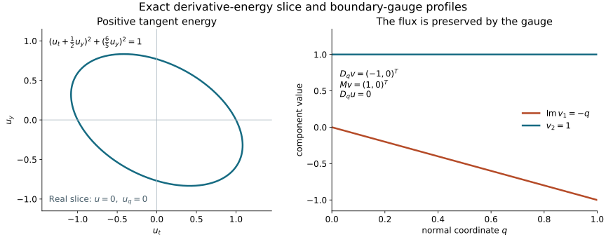

# Matrix Robin energy and uniqueness on the actual weak domain

Original text, examples and illustration: public domain (CC0).

A boundary parametrix can be compared with a weak solution only after their domains have been identified. The normal gauge used for the commutator calculation retains a Robin term. Here a different gauge removes that boundary term and keeps the resulting first normal derivative in the equation. A boundary-tangent energy current then proves comparison and uniqueness for arbitrary complex lower matrices, including time-dependent matrices.

The result applies to the entire normalized smooth wave coefficient class below. It is not restricted to the affine Airy equation or to operators obtained by conjugating that equation. It supplies the uniqueness step for a future representation with interior incoming data. Existence of that representation, its sharp mapping properties and strict glancing propagation remain separate unfinished steps.

## 1. The full weak problem

**B0. Coefficients, domains and the comparison theorem.** Write \(x=(q,z)=(q,t,y)\), where \(q\geq0\), \(y\in\mathbb R^{d-1}\), and the unknown has values in \(\mathbb C^N\), with finite \(N\). The scalar product is linear in its first entry and \(D_j=-i\partial_j\). On a finite time slab use
\[
 \mathfrak q(v,\phi)=(D_qv,D_q\phi)
  +\sum_{a,b}(h^{ab}D_bv,D_a\phi)
  +\sum_j(\ell_jD_jv,\phi)
  +\sum_j(m_jv,D_j\phi)+(cv,\phi).
 \tag{BE1}
\]
Tangential indices \(a,b\) range over \(z\); \(j\) also includes \(q\). All coefficients are smooth with bounded derivatives on the region used. The \(h^{ab}=h^{ba}\) are real scalar coefficients. The \(\ell_j,m_j,c\) are unrestricted complex matrices. Put
\[
 g^{qq}=1,\quad g^{qa}=0,\quad g^{ab}=h^{ab},
 \qquad G=-g,\qquad G^{tt}>0.
 \tag{BE2}
\]
Assume \(G\) has signature \((1,d)\), with uniform nondegeneracy and positive time margins on the slab. Thus the physical boundary is timelike. In particular \(G^{qq}=-1\) and the normal cross block vanishes throughout the collar. The coefficients may depend on every coordinate. The exact coordinate and density transformation NW:T015–T017 produces this form from the earlier wave class; its mixed tangential time coefficients and all lower terms must be retained.

The two form domains are \(V_D=H^1_0\) at the physical face and \(V_N=H^1\). Here the subscript zero means the closed zero trace condition at \(q=0\); tests are compact in the other variables and away from any artificial edge. This local notation does not impose a zero terminal-time trace. The interior differential expression is
\[
 P=D_q^2+\sum_{a,b}D_a h^{ab}D_b
       +\sum_j(\ell_j+m_j)D_j+c+\sum_j M_{D_jm_j}.
 \tag{BE3}
\]
The notation \(M_A\) denotes multiplication by \(A\). For an interior \(L^2\) source \(f\), the equation \(\mathfrak q(v,\phi)=(f,\phi)\) for every legal test has boundary condition
\[
 \gamma v=0\quad(D),\qquad
 \gamma(D_qv+m_qv)=0\ \hbox{in }H^{-1/2}_z\quad(N).
 \tag{BE4}
\]
Indeed \(P v=f\) gives \(D_q^2v\in L^2_qH^{-1}_z\) locally. The graph trace and signed Green identity in WSL:L6–L7 therefore apply to the actual flux. The positive trace is in \(H^{1/2}_z\), by NCQ:N3. Conversely, the interior equation and the indicated boundary condition imply the full weak identity, by that Green formula and density.

We prove the following statement. If \(v\in H^1\), \(Pv=f\in L^2\), either condition BE4 holds, and \(v=0\) before \(t=a\), then a weighted energy estimate holds on every smaller finite slab. For spatially compact support it is a global slab estimate. It also holds on shrinking spatial balls with positive outgoing artificial flux. In particular two \(H^1_{\rm loc}\) solutions of the same full weak equation, with the same past and the same boundary data, agree locally in their domain of dependence. The common forcing may be any natural antidual \(F\in V_D^*\) or \(V_N^*\): its difference is zero. We do not assert an \(H^1\) estimate for an arbitrary *difference* of natural-dual sources.

The proof map supplies the exact earlier results. The mathematical antecedent for the Lorentz current and retarded commutator is Hörmander, *The Analysis of Linear Partial Differential Operators III*, Section 24.1, through the complete earlier [mixed Dirichlet lesson](../20261007-restored-mixed-dirichlet/mixed-dirichlet-cauchy-energy-preparation.html). The normal commutant lesson proves the ordered gauge and both-slot coefficient law. The matrix Robin argument here is independent receiving exposition. Required Lebl foundations remain explicitly external; internal P514 closure of this CC0-only export is not claimed.

## 2. Remove the boundary coefficient, not an interior term

**B1. An invertible boundary gauge.** Set \(M(z)=m_q(0,z)\). Choose a real smooth bounded \(\rho(q)\), equal to \(q\) near zero and constant beyond a slightly larger collar, and solve
\[
 \partial_q S=-i\rho'(q)M(z)S,\qquad S(0,z)=I.
 \qquad S=\exp(-i\rho(q)M(z)).
 \tag{BE5}
\]
The exponential formula is justified by its absolutely convergent power series, or by the ordered construction NCQ:N1. Matrices at different \(z\) need not commute. On a fixed collar the factorial bounds give \(S,S^{-1}\) and every fixed derivative bounded; the inverse is \(\exp(i\rho M)\). Derivatives in \(z\) differentiate every ordered factor in each power. They cannot in general be computed by commuting \(\partial_zM\) through \(M\).

Use \(v=Su\), \(\phi=S^{-*}\psi\), and
\[
 \mathfrak q'(u,\psi)=\mathfrak q(Su,S^{-*}\psi),
 \qquad F'(\psi)=F(S^{-*}\psi).
 \tag{BE6}
\]
These are bounded invertible maps on each form domain. For an interior source \(F=(f,\cdot)\), its new value is \(S^{-1}f\). The principal coefficients remain \(g^{ij}I\). The exact lower coefficients, from the product rule in both slots, are
\[
 \begin{aligned}
 \ell'_j&=S^{-1}\ell_jS-\sum_i(D_iS^{-1})g^{ij}S,\\
 m'_i&=S^{-1}m_iS+\sum_jS^{-1}g^{ij}(D_jS),\\
 c'&=S^{-1}cS+\sum_jS^{-1}\ell_j(D_jS)
       -\sum_i(D_iS^{-1})m_iS
       -\sum_{i,j}(D_iS^{-1})g^{ij}(D_jS).
 \end{aligned}\tag{BE7}
\]
The sign in the last two lines follows from \((D_iS^{-*})^*=-D_iS^{-1}\). Thus no adjoint or lower matrix has been silently omitted.

Since \(D_qS|_0=-M\) and \(S|_0=I\),
\[
 m'_q|_0=0,\quad \ell'_q|_0=\ell_q|_0-m_q|_0,\qquad
 D_qv+m_qv=S(D_qu+m'_qu).
 \tag{BE8}
\]
Multiplication commutes with the positive and graph traces by NCQ:N3. Consequently the transformed natural boundary condition is exactly \(\gamma D_qu=0\). The Dirichlet condition stays \(\gamma u=0\). The full natural antidual has been transformed, including its possible boundary functional.

In the interior, the first normal derivative has coefficient
\[
 K'=S^{-1}(\ell_q+m_q)S+2S^{-1}D_qS.
 \tag{BE9}
\]
It generally does not vanish. Its value on the boundary is \(\ell_q-m_q\). Requiring both \(K'|_0=0\) and \(m'_q|_0=0\), for a boundary-identity gauge, would require \(\ell_q|_0=m_q|_0\). The previous interior normal gauge and the present boundary gauge solve different equations.

**B2. The transformed differential equation and its exact domain.** Integrate the derivative-on-test lower terms in \(\mathfrak q'\). Their physical boundary term vanishes because \(m'_q|_0=0\). In ordinary derivatives, with the sign \(D=-i\partial\), the equation is
\[
 Lu:=P'u=\sum_{\alpha,\beta}G^{\alpha\beta}
             \partial_\alpha\partial_\beta u
              +\sum_\alpha B^\alpha\partial_\alpha u+Cu=S^{-1}f,
 \tag{BE10}
\]
where
\[
 B^q=-i(\ell'_q+m'_q),\qquad
 B^b=-\sum_a(\partial_a h^{ab})I-i(\ell'_b+m'_b),\qquad
 C=c'-i\sum_j\partial_jm'_j .
 \tag{BE11}
\]
Here \(L=P'=S^{-1}PS\); no further change of sign is made. The principal ordinary-derivative matrix is \(G=-g\) and has positive time coefficient. All \(B^\alpha,C\) are bounded complex matrices. Their first-order action is bounded \(H^1\to L^2\). In particular the surviving normal derivative causes no loss in the energy estimate.

For \(u\in H^1\) with \(Lu\in L^2\), the exact identity is
\[
 \mathfrak q'(u,\psi)=(Lu,\psi)-i\langle\gamma D_qu,\gamma\psi\rangle .
 \tag{BE12}
\]
The pairing is \(H^{-1/2},H^{1/2}\), linear in its first entry. This is WSL:L6 applied to \(D_qu+m'_qu\), whose trace equals that of \(D_qu\). The equality first holds on compact smooth tests and then on the form domain by continuity. Thus BE10 with the actual Dirichlet or bare Neumann trace is equivalent to the transformed full weak problem.

## 3. A tangent current has no physical boundary loss

**B3. Positivity and the matrix identity.** Take the real vector field
\[
 W=\sum_\alpha G^{\alpha t}\partial_\alpha,\qquad W^q=0,
 \qquad W^t=G^{tt}>0.
 \tag{BE13}
\]
It is the metric dual of \(dt\) and is future timelike. For a smooth vector \(u\), write \(u_\alpha=\partial_\alpha u\) and define the real current
\[
 J^\alpha=2\operatorname{Re}\langle G^{\alpha\beta}u_\beta,Wu\rangle
       -W^\alpha G^{\beta\gamma}\langle u_\beta,u_\gamma\rangle
       +W^\alpha|u|^2 .
 \tag{BE14}
\]
Repeated indices are summed. The middle sum is real because \(G\) is real symmetric. This is the scalar Lorentz current summed over the components, without diagonalizing any lower matrix.

To see its positivity directly, split \(G\) into time and spatial blocks
\(G=\begin{pmatrix}A&b^T\\ b&C_s\end{pmatrix}\), \(A>0\).
Completing the square in the quadratic form shows that \(C_s-bb^T/A\) is negative definite: its graph is the \(G\)-orthogonal complement of the positive time covector, and \(G\) has precisely one positive direction. Equivalently this is the finite-dimensional proof DC:T008. Direct expansion gives
\[
 J^t=|A u_t+b\cdot d_su|^2
       +\sum_{i,j}(bb^T-AC_s)_{ij}\langle\partial_i u,\partial_j u\rangle
       +A|u|^2.
 \tag{BE15}
\]
This sum is positive definite. Uniform coefficient and cone bounds therefore give
\[
 c_0(|du|^2+|u|^2)\leq J^t\leq C_0(|du|^2+|u|^2).
 \tag{BE16}
\]
For any outward future timelike conormal \(n\), the same Lorentz bilinear inequality DC:T008 gives \(n_\alpha J^\alpha\geq0\), including the mass term since \(n(W)>0\).

Differentiate BE14. The two terms with a second derivative in \(Wu\) cancel the corresponding derivative of the quadratic sum, by interchanging the symmetric indices. The remaining identity is
\[
 \partial_\alpha J^\alpha=2\operatorname{Re}\langle Lu,Wu\rangle+\mathcal R(u),
 \qquad |\mathcal R(u)|\leq C_1(|du|^2+|u|^2),
 \tag{BE17}
\]
with the full remainder
\[
 \begin{aligned}
 \mathcal R={}&2\operatorname{Re}\langle(\partial_\alpha G^{\alpha\beta})u_\beta,Wu\rangle
 +2\operatorname{Re}\langle G^{\alpha\beta}u_\beta,
                              (\partial_\alpha W^\gamma)u_\gamma\rangle\\
 &-(\partial_\alpha W^\alpha)G^{\beta\gamma}\langle u_\beta,u_\gamma\rangle
   -W^\alpha(\partial_\alpha G^{\beta\gamma})\langle u_\beta,u_\gamma\rangle\\
 &+(\partial_\alpha W^\alpha)|u|^2+2\operatorname{Re}\langle u,Wu\rangle
   -2\operatorname{Re}\langle B^\alpha u_\alpha+Cu,Wu\rangle .
 \end{aligned}\tag{BE18}
\]
Every product on the right has at most one derivative on either factor of \(u\). Bounded coefficients and \(2ab\leq a^2+b^2\) give the stated bound; no Hermitian assumption is used.

At the physical face, whose outward conormal is \(-dq\),
\[
 J^q=-2\operatorname{Re}\langle u_q,Wu\rangle=0.
 \tag{BE19}
\]
For Neumann data \(u_q=0\). For Dirichlet data, the tangential derivatives of \(\gamma u=0\) vanish and \(W\) is tangent, so \(Wu=0\). These are exact equalities for smooth inputs. Section 5 justifies their use for rough weak solutions.

## 4. Weighted energy and the actual cutoff equation

**B4. The smooth estimate.** Let \(u\) be spatially compact, zero before \(a\), and satisfy one of the two homogeneous boundary conditions. Multiply BE17 by \(e^{-\lambda(t-a)}\) and integrate over \(a<t<T\). The graph divergence formula DC:D1 gives
\[
 \lambda\int_a^T\!\!\int e^{-\lambda(t-a)}J^t
    +e^{-\lambda(T-a)}\int_{t=T}J^t
 =\int_a^T\!\!\int e^{-\lambda(t-a)}
           \{2\operatorname{Re}\langle Lu,Wu\rangle+\mathcal R\}.
 \tag{BE20}
\]
The initial flux and the physical boundary flux are zero. Young's inequality gives
\(2|Lu||Wu|\leq\varepsilon\lambda|du|^2+C_\varepsilon\lambda^{-1}|Lu|^2\).
Choose \(\varepsilon\) using \(c_0\), then \(\lambda_0\) using \(C_1\).
For every \(\lambda\geq\lambda_0\), with constants independent of \(\lambda,T\) inside the fixed coefficient slab,
\[
 \lambda\|u\|_{H^1_\lambda(a,T)}^2
  +e^{-\lambda(T-a)}E_u(T)
 \leq {C\over\lambda}\|Lu\|_{L^2_\lambda(a,T)}^2,
 \quad
 E_u(T)=\int_{t=T}(|du|^2+|u|^2).
 \tag{BE21}
\]
The weighted norms integrate precisely \(e^{-\lambda(t-a)}\) times the indicated squared functions and first derivatives; they do not differentiate the weight. Nonzero smooth initial data contribute their initial current on the right. Compact spatial support can be replaced by decay and cutoff convergence whenever the displayed norms and errors converge.

No cutoff error is suppressed. If \(\chi\) is a real smooth scalar cutoff with \(\partial_q\chi|_0=0\), then both homogeneous boundary conditions are preserved, and
\[
 L(\chi u)=\chi Lu+
  2G^{\alpha\beta}(\partial_\alpha\chi)\partial_\beta u
  +\{G^{\alpha\beta}\partial_\alpha\partial_\beta\chi
                      +B^\alpha\partial_\alpha\chi\}u .
 \tag{BE22}
\]
The additional terms are in \(L^2\) for \(u\in H^1\). They must be included as forcing unless their support is outside the comparison region. In the original gauge the same assertion follows from \(v=S u\); scalar cutoffs commute with \(S\). A Dirichlet cutoff need not satisfy the normal derivative restriction.

## 5. Pass to the genuine weak solution

**B5. Retarded tangential regularization and an \(H^2\) bridge.** Suppose \(u\in H^1\), \(Lu=g\in L^2\), and the homogeneous boundary condition holds as the actual trace of Section 2. For compactly localized inputs use
\[
 J_\epsilon u(q,z)=\int\eta(h)u(q,z-\epsilon h)\,dh,\qquad
 \eta\in C_c^\infty,\quad\int\eta=1,\quad
 h_t>0\text{ on }\operatorname{supp}\eta .
 \tag{BE23}
\]
This convolution preserves vanishing past. Translation continuity and the bounded integral of \(\eta\) show \(J_\epsilon u\to u\) in \(H^1\). It commutes with the positive trace by \(H^1\) density. It also commutes with the graph trace by WSL:L6 density and its bounded action on \(L^2_qH^{-1}_z\). Because the normal trace is now exactly zero, it remains zero after convolution. No Robin defect is discarded.

The equation BE10 gives \(\partial_q^2u\in L^2_qH^{-1}_z\) on smaller slabs: every tangential second derivative maps \(H^1_z\) to \(H^{-1}_z\), all first derivatives are in \(L^2\), and the normal coefficient is the constant \(-1\). For fixed \(\epsilon>0\), convolution sends tangential \(H^{-1}\) into every finite tangential Sobolev order on the localized region. Thus \(J_\epsilon u\in H^2\): its tangential second and mixed first-normal derivatives are \(L^2\), as is \(\partial_q^2J_\epsilon u\). Arbitrarily high normal regularity is not needed.

For completeness the full coefficient commutator, with \(A\) a scalar or matrix and \(w\in L^2\), is
\[
 [A,J_\epsilon]\partial_b w(z)
 =\int\left\{
 {A(z)-A(z-\epsilon h)\over\epsilon}\partial_b\eta(h)
       +(\partial_bA)(z-\epsilon h)\eta(h)\right\}w(z-\epsilon h)\,dh .
 \tag{BE24}
\]
It follows by integration by parts in \(h_b\), first on smooth \(w\). Its \(L^2\) norm is bounded uniformly by
\(\|\nabla_zA\|_\infty(\int|h||\partial_b\eta|+\int|\eta|)\|w\|_2\).
For smooth \(w\) the limiting coefficient vanishes because
\(\int h_j\partial_b\eta=-\delta_{jb}\int\eta\).
The mean value formula, translation convergence and this uniform bound extend strong convergence to zero to every \(L^2\) input by density. The argument is uniform in \(q\) and integrates in \(q\). The simpler commutator \([A,J_\epsilon]w\) also tends to zero in \(L^2\).

The only pure normal second derivative of \(L\) has constant coefficient and commutes with \(J_\epsilon\). Each other second-order term is tangential, so BE24 applies to an actual \(L^2\) first derivative of \(u\). The matrix first-order normal term uses the simpler commutator on \(u_q\). Consequently
\[
 LJ_\epsilon u=J_\epsilon g+[L,J_\epsilon]u
       \longrightarrow g\quad\hbox{in }L^2
 \tag{BE25}
\]
on the slab in question, after the exact localization BE22 when needed.

We still must justify the smooth energy inequality for these \(H^2\) functions with their exact traces. A Dirichlet \(H^2\) function has an odd \(H^2\) extension through \(q=0\). Its value has no jump because its trace is zero; its normal derivative is even and has no jump. A Neumann \(H^2\) function has an even \(H^2\) extension: its value is continuous and the odd normal derivative has zero trace. These assertions follow distributionally by integrating on the two half-spaces: the boundary delta in a first derivative is the value jump, and the boundary delta in its next derivative is the corresponding first-derivative jump. Tangential first-derivative traces match as well; in the odd case they vanish as tangential derivatives of the zero trace. The trace assertions and unrestricted \(H^2\) density used here were proved in NCQ:N3.

Convolve the extensions with a kernel even in \(q\), and with a past-supported tangential kernel. Odd or even parity and past support remain exact. Restriction to \(q\geq0\) gives smooth functions converging in \(H^2\) on the chosen slabs, still satisfying the boundary condition. Near a terminal level take a slightly smaller slab, so no extension through the unavailable future is needed. The current and its flux on \(t=T\) converge along almost every terminal level, since \(H^2\) convergence gives \(L^2\) convergence of all first derivatives in space-time and hence an almost-everywhere subsequence of their spatial \(L^2\) norms. Passing in BE21 first for these \(H^2\) approximations proves that inequality for \(J_\epsilon u\) at almost every terminal level.

Finally \(J_\epsilon u\to u\) in \(H^1\) and BE25 holds in \(L^2\). Choose a sequence \(\epsilon\downarrow0\) with summable squared errors. Fubini gives spatial \(L^2\) convergence of \(u\) and its first derivatives for almost every \(t\). Remove also the countable union of exceptional levels from the preceding approximation step. Weighted source integrals converge uniformly in their upper limit, since the squared integrands converge in \(L^1\). Therefore BE21 holds for \(u\) at almost every \(T\). In particular,
\[
 \lambda\|u\|_{H^1_\lambda(a,T_0)}^2
 +\mathop{\rm ess\,sup}_{a<t<T_0}
        e^{-\lambda(t-a)}E_u(t)
 \leq {C'\over\lambda}\|g\|_{L^2_\lambda(a,T_0)}^2 .
 \tag{BE26}
\]
For the integral term take terminal levels increasing to \(T_0\); for the essential supremum use the common upper bound in BE21. Increase the constant by two to combine them. This gives an essential energy bound; a continuous energy representative is not being assumed or claimed in this proof. In particular \(g=0\) implies \(u=0\).

## 6. Local comparison and general common forcing

**B6. Artificial faces and finite propagation.** Let \(s=(q,y)\), take a center \(s_0=(0,y_0)\) on the physical face, and use a cone-shaped region
\[
 \Omega_R=\{q>0,\ a<t<a+R/v_0,\quad
                   |s-s_0|<R-v_0(t-a)\}.
 \tag{BE27}
\]
Only compact truncations below the tip are needed. Uniform Lorentz bounds allow \(v_0\) so large that
\(n=v_0dt+d|s-s_0|\) is future timelike on the lateral face: its square is at least \(c v_0^2-Cv_0-C>0\), and its time orientation is positive for large \(v_0\). Its contraction with \(J\) is nonnegative by B3. Thus this artificial flux can be kept on the left of BE20 and discarded in the resulting inequality.

This argument is valid even at intersections of faces. Multiply the weighted identity in the surrounding slab by a smooth nonincreasing approximation of the indicator of
\(|s-s_0|+v_0(t-a)<R\). The extra term is a nonnegative multiple of \(n\cdot J\). The radial function is smooth on each transition layer away from the cone tip; the cutoff is constant near its center. Drop the nonnegative term before passing to the indicator limit. Dominated convergence in the volume proves the inequality; no artificial-face trace of a rough solution is required. This is the complete cutoff divergence argument of DC:D1 in the present zero physical flux case.

For a rough solution defined near a compact truncated cone, first work with radius \(R'<R\). Choose a smooth localization equal to one on a neighborhood of its closure, with zero normal derivative at the physical boundary; radial spatial cutoffs centered at \(s_0\), constant near the center, have this property. Its derivative supports are separated from that closure. For sufficiently small retarded convolutions those supports do not meet the region being estimated. Hence every term in BE22 is accounted for and none contributes there. The commutator convergence BE25 holds on the surrounding neighborhood, so the preceding \(H^2\) approximation and limit apply. Then increase \(R'\) to \(R\) and exhaust time levels below the tip. The resulting estimate uses only the source in \(\Omega_R\) and the initial data on its base.

In particular if \(Lu=0\) in \(\Omega_R\), the homogeneous physical boundary condition holds, and \(u=0\) in a past neighborhood of the base, then \(u=0\) in \(\Omega_R\). The same proof treats an interior center by omitting the physical face. The small cone statement is invariant under the actual boundary-preserving coordinate and gauge maps: their \(H^1\) isomorphisms, density factors and antidual law are NW:T011, NW:T016–T017 and BE6. No canonical Fourier integral map is being substituted for this coordinate statement.

**B7. The comparison applies to the original natural antidual.** Suppose
\(\mathfrak q(v_1,\phi)=F(\phi)=\mathfrak q(v_2,\phi)\)
on all tests of the same actual domain, with \(v_1-v_2=0\) in the prescribed past. The functional \(F\) can have a boundary component and need not have an interior \(L^2\) representative. Subtract the identities before any source regularization:
\[
 w=v_1-v_2\in H^1_{\rm loc},\qquad
 \mathfrak q(w,\phi)=0,\qquad Pw=0.
 \tag{BE28}
\]
Now the difference has the interior source zero, so WSL:L6–L7 supplies its homogeneous natural flux, or its Dirichlet trace is zero by subtraction. The gauge of B1, followed by B5–B6, gives \(w=0\) in every corresponding comparison cone. This proves uniqueness for a common arbitrary natural-dual source without assigning an \(L^2\) norm to that source.

If instead the difference of the two complete functionals is represented by an interior \(f\in L^2\) and their boundary data agree, BE26 gives the quantitative comparison
\[
 \|w\|_{H^1_\lambda(a,T)}
       \leq {C\over\lambda}\|f\|_{L^2_\lambda(a,T)}
 \tag{BE29}
\]
for spatially compact differences, and the analogous cone estimate. The bounded \(H^1\) maps \(S,S^{-1}\) give constants independent of \(\lambda\): the norms weight the product-rule estimates without differentiating the weight. The original first normal derivative and all matrix time derivatives remain in those constants.

Thus an exact representation, once constructed in the same weak space with the same full functional, boundary data and past, equals the given weak solution. A formal kernel identity, distributional boundary matching alone, or an unproved energy mapping statement does not yet meet those hypotheses. The model obstruction in the Airy energy lesson remains: general completeness cannot require two individually tempered boundary-normalized coefficients.

## 7. Three solved exercises

### Exercise 1. Can one gauge remove both normal coefficients?

At the boundary prescribe arbitrary matrices \(L_0=\ell_q|_0\) and \(M_0=m_q|_0\). For a smooth invertible \(S\) with \(S|_0=I\), determine when both the natural Robin coefficient and the interior first-normal coefficient vanish after conjugation.

**Solution.** Write \(A=D_qS|_0\). The two transformed coefficients are \(M_0+A\) and \(L_0+M_0+2A\). The first forces \(A=-M_0\); substitution in the second gives \(L_0-M_0\). Hence both can vanish exactly when \(L_0=M_0\). This condition is also sufficient at the boundary, by BE5. To remove both throughout a collar would require the corresponding equality of the full coefficients there and the interior gauge equation; a boundary equality alone does not assert that stronger result. For \(L_0=0\), \(M_0\ne0\), the retained boundary value of \(K'\) is \(-M_0\).

### Exercise 2. A time-dependent matrix that cannot be commuted

Take \(h^{tt}=-1\), all other tangential spatial coefficients the identity, \(\ell_j=0\), \(m_q=M(t)\), all other \(m_j=0\), \(c=0\), where
\[
 M(t)=\begin{pmatrix}t&1\\-t^2&-t\end{pmatrix}.
 \qquad P=D_q^2-D_t^2+\sum_yD_y^2+M(t)D_q.
 \tag{BE30}
\]
On a bounded collar take \(\rho(q)=q\). Compute the gauge, the transformed operator and the boundary trace without commuting \(M\) with \(M_t\).

**Solution.** Direct multiplication gives
\(M^2=0\), \(MM_t=-M\), \(M_tM=M\). Thus
\(S=I-iqM\), \(S^{-1}=I+iqM\), and \(S_t=-iqM_t\).
The often tempting formula \(-iqM_tS\) differs from the true derivative by \(-q^2M\). Conjugating in the displayed order gives
\[
 \begin{aligned}
 S^{-1}PS={}&D_q^2-D_t^2+\sum_yD_y^2-MD_q\\
 &+(2qM_t-2iq^2M)D_t-iqM_{tt}+q^2MM_{tt}.
 \end{aligned}\tag{BE31}
\]
Indeed \(D_qS=-M\), \(D_q^2S=0\), \(D_tS=-qM_t\), and \(D_t^2S=iqM_{tt}\); insert these into the product expansion of \(P(Su)\). The normal zeroth-order terms vanish because \(M^2=0\). The time coefficient is \(-2S^{-1}D_tS=2qM_t-2iq^2M\); the final two terms are \(-S^{-1}D_t^2S\). The full normal flux satisfies \(D_q(Su)+M(Su)=S D_qu\), so the new boundary condition is exactly \(D_qu|_0=0\). The \(-MD_q\) term remains. Both-slot and source transformation are still BE6, not an \(L^2\)-unitary conjugation.

### Exercise 3. Subtract smooth boundary data before comparison

Let \(b(z)\) or \(\beta(z)\) be smooth compactly supported boundary data, zero in the prescribed past. Give a lifting in the original variables for either \(\gamma v=b\) or \(\gamma(D_qv+m_qv)=\beta\), and state the entire equation for the residual.

**Solution.** Choose a smooth normal cutoff \(\theta\), equal to one near zero. For Dirichlet data put \(e_D=\theta(q)b(z)\). For natural flux data put \(e_N=iq\theta(q)\beta(z)\). The latter has value zero and \(D_qe_N|_0=\beta\), so its \(m_qe_N\) trace is zero. Each lifting is smooth, compact in the localized variables and retains the past support. For \(w=v-e_D\) or \(w=v-e_N\),
\[
 Pw=f-Pe_D\quad\hbox{or}\quad Pw=f-Pe_N,
 \tag{BE32}
\]
with the corresponding homogeneous actual boundary condition. Every derivative of the lifting and every lower coefficient is included in \(Pe\). In weak form the natural source subtracts \(\mathfrak q(e_N,\cdot)\), whose Green boundary term is \(-i\langle\beta,\gamma\cdot\rangle\). Applying B1–B7 to the residual is therefore legitimate when the displayed interior forcing is \(L^2\). This smooth lifting does not assert an optimal finite-order boundary-data estimate.

## 8. See the energy and the boundary gauge

**F0. Figure coordinates.** The left panel fixes \(G^{tt}=1\), \(G^{ty}=\beta=1/2\), \(G^{yy}=\beta^2-c^2\), \(c=6/5\), \(G^{qq}=-1\). In the real derivative slice \(u_q=u=0\), BE15 is exactly \((u_t+\beta u_y)^2+c^2u_y^2\). The curve is its unit ellipse, parameterized by \(u_y=\sin\vartheta/c\), \(u_t=\cos\vartheta-\beta\sin\vartheta/c\). It is a derivative-energy slice, not a wavefront or a ray plot. The right panel uses Exercise 2 at \(t=0\), \(u(q)=(0,1)^T\): \(v=Su=(-iq,1)^T\). It plots \(\operatorname{Im}v_1=-q\) and \(v_2=1\) on \(0\leq q\leq1\). The original jet has \(D_qv=(-1,0)^T\), \(Mv=(1,0)^T\), while the new jet has \(D_qu=0\). These are exact gauge profiles, not an assertion that the profiles solve the time-dependent PDE.

The [reproducible generator](figures/build_figure.py), [finite algebra checks](check_models.py), [proof review](proof-review.json) and source record accompany the complete argument. The checks test the current, signs and the noncommuting example; they do not substitute for the weak limiting and uniqueness proofs.
