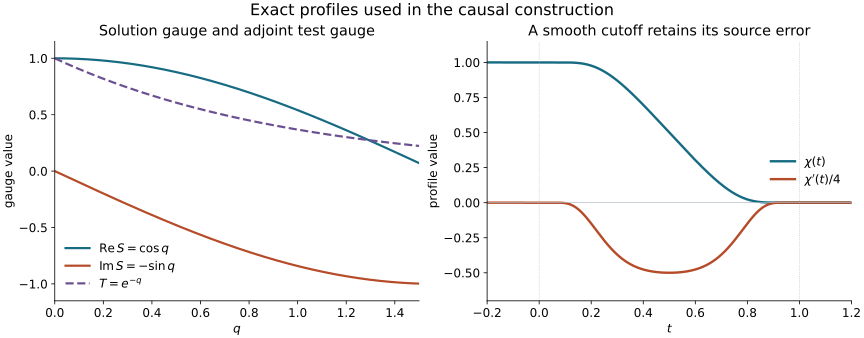

# Causal matrix Robin existence and regularity

Original text, examples and illustration: public domain (CC0).

The [matrix energy lesson](../20261008-matrix-boundary-energy/matrix-robin-energy-and-weak-uniqueness.html) proves uniqueness on the actual weak boundary domain. We now construct the solution. The essential extra point is the adjoint boundary condition: even when the solution satisfies bare Neumann data, its adjoint test generally satisfies a matrix Robin condition. A second, explicitly ordered gauge removes that test condition before the one-sided Sobolev estimate is applied.

The construction gives supported solutions at every real nonnegative Sobolev order, recovers the actual weak boundary condition, continues through finite time slabs and proves smooth error correction. It keeps arbitrary complex matrix lower terms and time dependence. Sharp Airy mapping, the stable incoming-plus-boundary representation and strict glancing propagation remain unfinished.

## 1. The theorem and its precise source class

**C0. The normalized problem.** Retain the full form, domains and coefficients of MBE:B0–B2. After its boundary gauge, the ordinary differential equation is
\[
 Lu=G^{\alpha\beta}\partial_\alpha\partial_\beta u
       +B^\alpha\partial_\alpha u+Cu=f,
 \quad G^{qq}=-1,\quad G^{qa}=0,\quad G^{tt}>0.
 \tag{CE1}
\]
Here \(q\geq0\), \(z=(t,y)\), \(G\) is real symmetric Lorentz of signature \((1,d)\), \(a\) is tangential, and \(B^\alpha,C\) are arbitrary complex \(N\)-by-\(N\) matrices. The actual homogeneous condition is
\[
 \gamma u=0\quad(D),\qquad \gamma\partial_qu=0\quad(N).
 \tag{CE2}
\]
The second equality is initially understood in the negative-half graph trace of WSL:L6. Undoing the first gauge recovers the full original Robin flux, not an independently imposed normal derivative.

First work with a model on the entire spatial half-space. All coefficient derivatives and Lorentz margins are uniformly bounded on the finite time region used. For the Fourier argument, extend the coefficients in tangential variables so that each is a fixed constant plus a smooth function compactly supported in \(z\), with all partial Fourier decay bounds uniform in \(q\). Such model extensions are constructed locally in C6. Constant matrices are allowed among the lower terms. Extend all coefficients smoothly beyond the time region before using any whole-space tangential multiplier.

For every real \(s\geq0\), suppose \(f\) is in the restriction space
\(\overline H^s(q>0,t,y)\), has support \(t\geq a\), and is spatially compact on each finite time slab. The restriction space is the quotient of full-space \(H^s\) by extensions supported on the other side of \(q=0\); it does not mean zero extension in \(q\). On each finite time slab there is a unique
\[
 u\in\overline H^{s+1}_{\mathrm{loc}},\qquad
 u=0\text{ for }t<a,\qquad Lu=f,\qquad \text{CE2}.
 \tag{CE3}
\]
The equation holds across \(t=a\), with no initial delta source. The solution is spatially compact on finite slabs by finite propagation. For the local theorem, source cutoffs need only be compactly supported in a slightly larger coordinate patch; all conclusions concern the smaller agreement and dependence region.

The theorem prescribes homogeneous boundary data. Smooth inhomogeneous Dirichlet or original Robin data are treated in C8 by an exact lifting. No optimal finite-order nonhomogeneous boundary exponent is asserted here. Nor does this theorem assert that every natural-dual source has an \(H^1\) solution: the existence hypothesis is the displayed interior Sobolev class. Uniqueness for identical arbitrary natural-dual forcing remains the larger statement already proved in MBE:B7.

The [proof map](proof-map.json) records exact providers. HC:M1–M3 proves the supported/restricted Hilbert scales and one-sided multipliers; HC:M6 proves differential normal recovery, including finite matrix coefficients. SY:C0–C1 proves complex Hahn–Banach and Hilbert representation. DC:T020–T023 supplies the full Fourier commutator argument from Hörmander III, Section 24.1, as independently proved in the [mixed Dirichlet lesson](../20261007-restored-mixed-dirichlet/mixed-dirichlet-cauchy-energy-preparation.html). The present adjoint matrix boundary argument and its receiving proofs are written here in full. External Lebl foundations retain their recorded status; internal P514 closure of this CC0-only export is not claimed.

## 2. The adjoint has its own boundary condition

**C1. The exact Green form.** With the scalar product linear in its first entry, the formal interior adjoint is
\[
 L^*v=\partial_\alpha\partial_\beta(G^{\alpha\beta}v)
            -\partial_\alpha(B^{\alpha *}v)+C^*v.
 \tag{CE4}
\]
Thus its ordinary first- and zeroth-order coefficients are
\[
 \widetilde B^\beta=2\sum_\alpha(\partial_\alpha G^{\alpha\beta})I-B^{\beta *},
 \qquad
 \widetilde C=\sum_{\alpha,\beta}\partial_\alpha\partial_\beta G^{\alpha\beta}I
                         -\sum_\alpha\partial_\alpha B^{\alpha *}+C^*.
 \tag{CE5}
\]
In particular \(\widetilde B^q=-B^{q*}\); the normal principal coefficient is constant and the cross block is zero. For compact smooth inputs, integration on \(q>0\), with outward conormal \(-dq\), gives
\[
 (Lu,v)-(u,L^*v)
    =\langle\gamma u_q,\gamma v\rangle
       -\langle\gamma u,\gamma(v_q+B^{q*}v)\rangle.
 \tag{CE6}
\]
Indeed the normal principal term contributes
\(u_q\overline v-u\overline{v_q}\) at zero, whereas \(B^q\partial_qu\) contributes
\(-\langle B^qu,v\rangle\). Tangential integrations have no physical boundary term. This proves the formula including its matrix order and sign.

The compatible adjoint test conditions are therefore
\[
 \gamma v=0\quad(D^*),\qquad
 \gamma(v_q+H(z)v)=0\quad(N^*),\qquad H(z)=B^q(0,z)^*.
 \tag{CE7}
\]
Bare Neumann tests would in general leave the \(B^q\) boundary term.

In the natural case choose a bounded smooth real \(\rho(q)\), equal to \(q\) near zero and constant outside a collar, and put
\[
 T_q=-\rho'(q)H(z)T,\quad T(0,z)=I,\qquad
 T=\exp(-\rho H),\qquad v=Tw,\qquad \mathcal A=T^{-1}L^*T .
 \tag{CE8}
\]
NCQ:N1's ordered factorial argument proves smoothness, invertibility and bounds on all required derivatives of \(T,T^{-1}\). At the boundary \(v_q+Hv=w_q\). Thus CE7 becomes the exact condition \(\gamma w_q=0\). In the Dirichlet case set \(T=I\), \(\mathcal A=L^*\) and keep \(\gamma w=0\).

The full conjugated expression is
\[
 \begin{aligned}
 \mathcal A&=G^{\alpha\beta}\partial_\alpha\partial_\beta
                       +\mathcal B^\beta\partial_\beta+\mathcal C,\\
 \mathcal B^\beta&=T^{-1}\widetilde B^\beta T
                       +2T^{-1}G^{\alpha\beta}(\partial_\alpha T),\\
 \mathcal C&=T^{-1}\left\{G^{\alpha\beta}\partial_\alpha\partial_\beta T
                   +\widetilde B^\alpha\partial_\alpha T+\widetilde C T\right\}.
 \end{aligned}\tag{CE9}
\]
These are product expansions in the stated order. The principal matrix and its normal block are unchanged. The lower matrices retain every time derivative of \(T\).

A constant tangential value of \(H\) gives a \(q\)-dependent but tangentially constant \(T\). In general \(H-H_\infty\) is compactly supported in \(z\), so \(T-T_\infty(q)\) is supported in that same compact set. All its \(z\)-derivatives have uniform bounds in \(q\). Hence the conjugated coefficients still have the partial Fourier bounds needed below. They need not be compactly supported in \(q\).

## 3. The backward estimate at every real tangential order

**C2. Reverse time before taking duals.** Translate \(a\) to zero and let \(0<\tau_0\leq1\). Let \(w\) be smooth, compact in \(q\), rapidly decreasing tangentially, zero for \(t\geq\tau_0\), and satisfy the bare homogeneous condition for \(\mathcal A\). Apply the tangent-current proof MBE:B3–B4 in reversed time. Its physical flux is still zero; its past-directed multiplier has positive reversed time flux. With the weight \(e^{\lambda(t-\tau_0)}\), integrate over \(q>0,t>0\). The terminal energy is zero and the initial outward reversed-time flux is nonnegative. Dropping that flux and setting \(\lambda=1/\tau_0\) gives
\[
 \tau_0^{-1}\bigl(\|dw\|_Q^2+\|w\|_Q^2\bigr)
                  \leq C\tau_0\|\mathcal A w\|_Q^2,
 \quad Q=\{q>0,t>0\},\quad 0<\tau_0\leq\tau_* .
 \tag{CE10}
\]
On the support in \(Q\), the weight lies between \(e^{-1}\) and \(1\). The same coefficient bounds control the time-reversed operator. No sign condition on a lower matrix is used.

**C3. One-sided multipliers and the full matrix commutator.** For dual covariables \((\theta,\eta)\) of \((t,y)\), put
\[
 h(\eta)=(1+|\eta|^2)^{1/2},\quad
 R=(h^2+\theta^2)^{1/2},\quad
 e_\sigma(\theta,\eta)=(h-i\theta)^\sigma,\quad E_\sigma=e_\sigma(D_z).
 \tag{CE11}
\]
Use the right-half-plane logarithm; \(\sigma\) is any real number. HC:M1 proves that \(E_\sigma,E_{-\sigma}\) preserve terminal support and act as inverse isometries
\[
 E_\sigma:\overline H^\sigma(t>0,y)\longrightarrow L^2(t>0,y).
 \tag{CE12}
\]
Their full-space moduli are \(R^\sigma\). HC:M2 identifies the antidual as the full-space supported space \(\dot H^{-\sigma}\), supported in \(t\geq0\). These statements also hold in \(L^2_q\) and for finite vector coefficients.

Here is the estimate needed for variable matrices, with \(\zeta,\vartheta\) denoting complete tangential frequency vectors and \(\delta=\zeta-\vartheta\):
\[
 R(\vartheta)\left|
          {e_\sigma(\zeta)\over e_\sigma(\vartheta)}-1\right|
       \leq C_\sigma|\delta|\langle\delta\rangle^{|\sigma-1|}.
 \tag{CE13}
\]
The first derivative of \(e_\sigma\) is bounded by \(C_\sigma R^{\sigma-1}\), since \(|\nabla h|\leq1\) and the complex power is taken in the fixed right half-plane. Integrate that derivative along the segment between the frequencies. The inequalities
\(R(\vartheta+\rho\delta)\leq\sqrt2R(\vartheta)\langle\delta\rangle\)
and the reverse comparison, \(0\leq\rho\leq1\), prove CE13 for every real \(\sigma\). For \(\sigma=0\) the left side vanishes.

For a coefficient matrix \(A(q,z)\), subtract its tangential constant part. Repeated integration by parts gives
\(\|\widehat A_q(\delta)\|\leq C_k\langle\delta\rangle^{-k}\), uniformly in \(q\), for every fixed \(k\). The exact Fourier kernel of
\(E_\sigma[A,E_{-\sigma}]\partial_b\), \(b\) tangential, is
\[
 (2\pi)^{-d}\left\{{e_\sigma(\zeta)\over e_\sigma(\vartheta)}-1\right\}
                         i\vartheta_b\,\widehat A_q(\delta).
 \tag{CE14}
\]
Its operator norm is bounded by an integrable function of \(\delta\), by CE13 and \(|\vartheta_b|\leq R(\vartheta)\). Both kernel marginals have the same finite bound. Cauchy–Schwarz in the integral with this majorant, then integration in the other variable, proves its \(L^2\) bound. Omitting \(\partial_b\) only improves the estimate since \(R\geq1\). Constant matrix parts commute with the scalar multipliers and contribute zero.

The pure normal second derivative of \(\mathcal A\) has constant coefficient. Each remaining second-order term is tangential, so absorb one of its two derivatives in CE14. Lower normal terms leave precisely one actual normal derivative on the input. Therefore, as an exact operator identity with uniformly bounded tangential operators,
\[
 K_\sigma=E_\sigma[\mathcal A,E_{-\sigma}]
       =\sum_\alpha A_{\sigma,\alpha}\partial_\alpha+A_{\sigma,0},
 \qquad
 \|K_\sigma W\|_Q\leq C_\sigma(\|dW\|_Q+\|W\|_Q).
 \tag{CE15}
\]
Every constituent preserves terminal support. Its value for \(t>0\) depends only on input values there. To use the full-space Fourier bound, extend the actual \(L^2\) first derivatives of \(W\) by zero from \(t>0\); do not differentiate that extension. This proves CE15 on \(Q\), with no initial delta and no assumed support for \(W\) at negative times.

Set \(W=E_\sigma w\). It remains smooth, rapidly decreasing, terminally supported and in the same bare boundary domain because \(E_\sigma\) commutes with \(q\)-derivatives and traces. The exact equation is
\[
 \mathcal A W=E_\sigma\mathcal A w-K_\sigma W.
 \tag{CE16}
\]
Apply CE10, square the triangle bound and absorb
\(C_\sigma\tau_0(\|dW\|^2+\|W\|^2)\)
into its left side for \(0<\tau_0\leq\tau_\sigma\). The allowed \(\tau_\sigma>0\) depends on the fixed order. Since \(E_1=h(D_y)-\partial_t\), its \(L^2(Q)\) norm is bounded by the first derivative norm, and \(E_{\sigma+1}w=E_1W\). Smooth multiplication by \(T,T^{-1}\) is bounded on every restricted tangential Sobolev space: apply the full-space multiplication bound to extensions and infimize over them. Consequently
\[
 \|v\|_{L^2_q\overline H^{\sigma+1}_z}
       \leq C_\sigma\tau_0
             \|L^*v\|_{L^2_q\overline H^\sigma_z},
 \qquad v=Tw,\quad 0<\tau_0\leq\tau_\sigma .
 \tag{CE17}
\]
The right side uses \(\mathcal A w=T^{-1}L^*v\); it does not replace this by a scalar adjoint. The estimate holds for every smooth compact test obeying CE7 and vanishing after \(\tau_0\).

## 4. One supported solution from one Hilbert extension

**C4. Construction without an assumed inverse.** Let \(s\geq0\). The source hypothesis gives
\[
 f\in L^2(q>0;\dot H^s_z),\qquad
 \|f\|_{L^2_q H^s_z}\leq\|f\|_{\overline H^s(q>0,z)}.
 \tag{CE18}
\]
For any full-space extension, the tangential Fourier weight of order \(s\) is bounded by the full weight of that order. Integrate first in \(q\), restrict to \(q>0\), and infimize over extensions. The prescribed vanishing for negative time gives the dot support in \(z\). No positive-order zero extension through \(q=0\) is used.

For smooth compact tests \(v\) satisfying CE7 and \(v=0\) for \(t\geq\tau_0\), define on the image of \(L^*\)
\[
 \ell(L^*v)=(f,v).
 \tag{CE19}
\]
Use CE17 at \(\sigma=-s-1\) and the supported/restricted pairing HC:M2:
\[
 |\ell(L^*v)|\leq C_s\tau_0\|f\|_{L^2_qH^s_z}
                   \|L^*v\|_{L^2_q\overline H^{-s-1}_z}.
 \tag{CE20}
\]
In particular a zero image has zero functional, so the definition is independent of the test representative. Extend this conjugate-linear functional from its linear image to the whole Hilbert space
\(\mathcal H=L^2_q\overline H^{-s-1}_z\)
with the same bound. The complex Hahn–Banach proof SY:C0 applies to its conjugate. It requires neither closed range nor surjectivity of \(L^*\).

The Hilbert representation SY:C1 and HC:M2 identify the extension with a single vector distribution
\[
 u\in L^2_q\dot H^{s+1}_z,\qquad
 \|u\|_{L^2_qH^{s+1}_z}\leq C_s\tau_0\|f\|_{L^2_qH^s_z},
 \qquad (u,L^*v)=(f,v).
 \tag{CE21}
\]
One representation is made on the full Hilbert space, not an unrelated choice at each \(q\). It gives \(u=0\) for \(t<0\). The construction does not prescribe its values beyond \(\tau_0\), where the test class no longer determines an equation.

Interior tests satisfy either adjoint boundary condition automatically. They prove \(Lu=f\) on \(q>0,t<\tau_0\), also across \(t=0\): the supported/restricted pairings in CE21 are the full distributional pairings, and tests can cross zero. Thus no initial source supported at \(t=0\) is present.

**C5. Recover all missing normal derivatives and the actual trace.** Apply HC:M6 with normal variable \(q\), order two, seed \((r_1,q_1)=(0,s+1)\), forcing pair \((r_2,q_2)=(s+2,0)\), and target \((a_1,b_1)=(s+1,0)\). Its three inequalities are
\[
 s+1\leq s+2,\qquad s+1\leq s+1,\qquad s+1\leq s+2 .
 \tag{CE22}
\]
The leading normal matrix is \(-I\) in ordinary derivatives, or \(I\) in \(D_q^2\); the theorem covers either invertible normalization. Its proof explicitly permits arbitrary finite smooth matrices and retains all localization commutators. Therefore
\[
 u\in\overline H^{s+1}_{\mathrm{loc}}(q\geq0,t<\tau_0).
 \tag{CE23}
\]
In particular \(u\in H^1_{\rm loc}\), \(\gamma u\in H^{1/2}_{\rm loc}\), and the equation gives the actual graph trace \(\gamma u_q\in H^{-1/2}_{\rm loc}\). These are the traces used in CE6.

For this regularity CE6 still holds with any compact smooth test, using \(Lu=f\). To justify it, write the normal principal term as a derivative of \(u_q\) and use WSL:L6's graph Green identity; use \(H^1\) density for the other once-integrated terms and the positive trace. Tangential integration is distributional against a smooth compact test. The result is exactly
\[
 (u,L^*v)=(f,v)-\langle\gamma u_q,\gamma v\rangle
                      +\langle\gamma u,\gamma(v_q+Hv)\rangle .
 \tag{CE24}
\]
No unavailable pointwise normal derivative is introduced.

For Dirichlet tests, CE21 and CE24 give \(\langle\gamma u,\gamma v_q\rangle=0\). Every compact smooth boundary function is \(\gamma v_q\) of a legal test \(v=q\theta(q)b(z)\), so \(\gamma u=0\). For natural tests, they give \(\langle\gamma u_q,\gamma v\rangle=0\). Every compact smooth boundary \(b\), with time support below \(\tau_0\), is realized by \(v=\theta(q)T(q,z)b(z)\), where \(\theta=1\) near zero. Its derivative is \(-Hb\) at zero, so it satisfies CE7 and has value \(b\). Hence \(\gamma u_q=0\). These identities hold across the initial time as well.

MBE:B2 now identifies the entire weak equation on the original form domain. Undo its solution gauge, including the antidual action, to recover the original matrix Robin problem. This completes local supported existence and actual boundary recovery for every \(s\geq0\).

## 5. Local models, finite propagation and continuation

**C6. Agreement patches and compact support.** At a boundary point in the normalized coordinates, freeze \(G\) at that point and blend the nearby coefficients to the frozen constants using a smooth cutoff supported in a sufficiently small chart. The fixed normal coefficient \(-1\) and zero normal cross block remain exact. Nondegenerate Lorentz signature and \(G^{tt}>0\) are open conditions; a sufficiently small uniform neighborhood of the frozen matrix, containing the entire interpolation segment, preserves them. Extend all lower matrices with smooth cutoffs. Their derivatives remain bounded. The resulting global half-space model agrees with the local problem on a smaller chart and has the Fourier properties of C0. MBE:B1's solution gauge and C1's test gauge preserve these properties, as proved in C1.

Localize the source with a smooth cutoff equal to one on a still smaller agreement region, retaining its zero past. The source is compactly contained at the artificial coordinate edges, so its zero continuation there is an ordinary smooth localization in the restriction Sobolev space. Keep its restriction meaning at the physical face. Construct the model solution by C4–C5. It solves the original equation and boundary condition on the agreement region. Differences of two such realizations have zero equation, zero boundary data and zero past on their common dependence cones, so MBE:B6–B7 proves equality there. No equation for a cutoff of a solution is silently substituted.

For the global model, choose a uniform speed \(v_0\) making all shrinking-cone conormals future timelike, as in MBE:B6. If the source has spatial support in a compact set \(K\) during \(a\leq t\leq A\), the solution vanishes whenever
\[
 \operatorname{dist}(s,K)>v_0(t-a),\qquad s=(q,y),\quad a<t<A.
 \tag{CE25}
\]
Indeed a backward cone from such a point has base on the zero past and misses the source. Its physical boundary carries the homogeneous condition, and its artificial flux is nonnegative. The same current proof works if a cone centered in the interior meets the physical face: the artificial conormal is still future timelike and the physical flux is still zero. For preliminary rough-solution localization choose a cutoff constant in \(q\) near the physical face and equal to one near the compact cone, rather than a radial cutoff about that interior center. Its derivative supports can again be separated from the cone. Exhaust compact truncated cones and use MBE:B6's commutator and indicator limits. This argument uses only local \(H^1\), already obtained in C5. Thus spatial compactness is proved rather than assumed of the Hilbert extension. On any smaller finite time slab, finite local covers of this compact spatial support give the required global finite Sobolev norms.

**C7. Continue without inserting an initial jump.** Fix a real \(s\geq0\) and a finite target time in the global model already extended in C0. The coefficient bounds in C2–C3 have a common finite bound on a slightly larger time region, so a common positive construction width \(\delta_s\) can be chosen for all translated starts there. Localize the source smoothly beyond that larger region when a full finite norm is needed. All constants depend on the fixed order and coefficient region.

Suppose the residual \(f_{\rm res}\) is zero before \(c\). Construct its solution \(u_c\) for \(t<c+\delta_s\). Choose a smooth temporal cutoff \(\chi\), equal to one below \(c+\delta_s/3\), zero above \(c+2\delta_s/3\), and put \(w_c=\chi u_c\), using its already zero past. The full error is
\[
 f_{\rm new}=f_{\rm res}-Lw_c
    =(1-\chi)f_{\rm res}
       -2G^{\alpha t}\chi'\partial_\alpha u_c
       -(G^{tt}\chi''+B^t\chi')u_c .
 \tag{CE26}
\]
It is in the same \(\overline H^s\) class and is zero before \(c+\delta_s/3\). The product \(w_c\) is in \(\overline H^{s+1}\); it is cut off inside the interval on which that regularity is known, so extending it by zero through the future edge introduces no jump. Since \(\partial_q\chi=0\), both homogeneous boundary conditions are preserved exactly. In the original gauge, the same temporal cutoff preserves the full Robin flux.

Only finitely many such corrections are needed on the target slab. Their sum solves the original equation there, has zero past and the required homogeneous boundary condition, and belongs to \(\overline H^{s+1}_{\rm loc}\). Spatial compactness follows at every step from C6 and remains compact for the finite sum. Finite larger slabs exhaust all future times on which the coefficients are defined; uniqueness MBE:B7 makes their solutions agree. No uniform construction width over all real \(s\) is asserted.

For a local physical problem the same continuation is used only inside its common agreement and dependence region. On a compact spatial manifold with boundary covered by normalized models of C0 with one fixed time variable, a finite cover of each time slice gives the corresponding semiglobal solution. Use C6 at the boundary. The interior model takes \(q\in\mathbb R\), drops CE7 and the trace-recovery step, and uses the same dual construction without a physical face. Its normal-step estimates are the full-space versions of HC:M3 and HC:M6, obtained from the identical Fourier weights and derivative identities. To glue, shrink the finitely many level patches so their closures stay in the existence regions. Each pairwise overlap on the level slice is compact; local uniqueness gives equality in a neighborhood of it. A finite minimum of these overlap neighborhoods supplies one common time band. Disjoint closed level patches keep disjoint short bands. Glue there, apply CE26 with the common time variable, and repeat. Every cutoff has zero normal derivative at the physical face because that time variable is tangential in the C0 form. The compact finite-slab bounds make the number of corrections finite. This assertion includes the stated normalized-model cover hypothesis; it does not assume an additional coordinate-normalization theorem for a different coefficient class.

## 6. Smooth correction and consistency across orders

**C8. One solution at all orders.** If \(f\) is smooth up to the physical face and zero in the prescribed past, compact localization gives the source hypotheses at every finite \(s\). For each nonnegative integer \(k\), C4–C7 constructs a solution in \(\overline H^{k+1}_{\rm loc}\) on any fixed finite slab. Their differences satisfy the same actual weak equation and vanish in the past, so MBE:B7 identifies all of them with the \(s=0\) solution. The high-order interval may be built from more bands; uniqueness compares the completed finite-slab solutions, not only their first small bands.

Membership in all these local Sobolev spaces implies smoothness up to the boundary. On a smaller chart extend at a sufficiently high finite order. Fourier inversion and Cauchy–Schwarz give
\(\int |\xi|^j|\widehat U(\xi)|\,d\xi<\infty\)
when the order is greater than \(j+(d+1)/2\). The same integrable majorant gives continuity of the \(j\)-th derivatives by dominated convergence. Restrict to the closed half-space. Increasing the order gives all \(j\), and the derivatives agree as distributions, hence as continuous functions on overlaps. Thus the one supported solution is \(C^\infty\).

Smooth inhomogeneous original boundary data are handled before the construction. MBE:X3 gives
\[
 e_D=\theta(q)b(z),\qquad
 e_N=iq\theta(q)\beta(z),
 \quad \gamma e_D=b,\quad
 \gamma(D_qe_N+m_qe_N)=\beta .
 \tag{CE27}
\]
Here \(\theta=1\) near zero, and the data are smoothly localized and zero in the prescribed past. Subtract the full \(Pe_D\) or \(Pe_N\) from the interior forcing, solve the homogeneous problem, then add the lifting. Every lower coefficient and lifting derivative is retained. This proves a supported smooth solution for smooth residual interior and boundary data, with the original Robin flux.

More generally, suppose an actual \(H^1\) solution has smooth equation and boundary data in a dependence region and is smooth in a past band there. Multiply it by a temporal cutoff whose derivative lies in that smooth band, and subtract the corresponding cutoff boundary lifting. The commutator CE26 is then smooth where it is used. The resulting zero-past problem has smooth forcing and homogeneous boundary data. The smooth solution just constructed agrees with it by MBE:B7. Hence the original solution is smooth in the future dependence region. Spatial cutoff errors are included and kept outside the smaller cones exactly as in MBE:B6.

This supplies the smooth correction and regularity step needed when a future parametrix has a smooth residual. It does not prove that the Airy parametrix acts in the required energy space or supplies every incoming solution; those remain necessary parts of the representation theorem.

## 7. Three solved exercises

### Exercise 1. A Neumann problem with a non-Neumann adjoint

Let \(A=\begin{pmatrix}i&1\\0&-i\end{pmatrix}\) be constant and
\(L=-\partial_q^2+\partial_t^2+A\partial_q\), with \(u_q|_0=0\). Determine the adjoint boundary condition, its gauge and the entire conjugated adjoint.

**Solution.** Formula CE4 gives \(L^*=-\partial_q^2+\partial_t^2-A^*\partial_q\). The boundary condition is \(v_q+A^*v=0\), not bare Neumann. Set \(T=e^{-qA^*}\) on a bounded collar. Then
\[
 T^{-1}L^*T=-\partial_q^2+\partial_t^2+A^*\partial_q,
 \qquad v_q+A^*v=T w_q .
 \tag{CE28}
\]
Indeed \(T_q=-A^*T\), \(T_{qq}=(A^*)^2T\); the two zeroth-order contributions cancel, and the first-normal coefficient is \(2A^*-A^*=A^*\). This example is bounded on a fixed collar; the \(\rho\) cutoff of C1 gives a globally bounded gauge and its exact additional lower terms outside that collar. Imposing \(v_q=0\) directly would leave the nonzero boundary pairing \(-\langle Au,v\rangle\) in CE6.

### Exercise 2. Why a time-dependent test gauge needs all its derivatives

Put
\[
 H(t)=\begin{pmatrix}t&1\\-t^2&-t\end{pmatrix},\qquad
 \mathcal L=-\partial_q^2+\partial_t^2-H(t)\partial_q,
 \qquad T=I-qH(t).
 \tag{CE29}
\]
Compute \(T^{-1}\mathcal L T\) and check the transformed boundary condition \(v_q+Hv=0\).

**Solution.** Direct multiplication gives \(H^2=0\), \(HH_t=-H\), \(H_tH=H\), so \(T^{-1}=I+qH\). Expanding in the written order yields
\[
 T^{-1}\mathcal L T
  =-\partial_q^2+\partial_t^2+H\partial_q
       +(-2qH_t+2q^2H)\partial_t
       -qH_{tt}-q^2HH_{tt}.
 \tag{CE30}
\]
The normal zeroth-order terms vanish. The time coefficient is \(2T^{-1}T_t=-2qH_t-2q^2HH_t\), and the zeroth-order coefficient is \(T^{-1}T_{tt}\). Thus all the displayed signs follow from the noncommuting products. Finally \(T_q+HT=-H+H(I-qH)=0\), so \(v_q+Hv=T w_q\). Removing the test Robin condition does not remove the time-dependent lower terms.

### Exercise 3. One continuation step retains a first-order source error

For the operator in Exercise 1, let \(Lu=f\), \(u_q|_0=0\), and let \(\chi=\chi(t)\) be a smooth temporal cutoff. Compute the exact new source and decide whether a jump cutoff would be admissible.

**Solution.** The only temporal terms of the operator are \(\partial_t^2\), so
\[
 f-L(\chi u)=(1-\chi)f-2\chi'u_t-\chi''u.
 \tag{CE31}
\]
The term \(A\partial_q\) commutes with \(\chi\); the boundary trace is \((\chi u)_q|_0=\chi u_q|_0=0\). If \(u\in H^{s+1}\), both smooth-cutoff error terms belong to \(H^s\). A step function would introduce distributions supported at the cutoff time through \(\chi'\) and \(\chi''\); the stated \(H^s\) source class would no longer follow. Cutting off strictly within the known smooth multiplier region and regularity interval, as in C7, prevents that defect.

## 8. The two different normalizations

**F0. Figure coordinates.** The left panel is an exact constant real scalar slice of the two matrix mechanisms. For original conormal \(D_qv+mv\), take \(m=1\): the solution gauge is \(S(q)=e^{-iq}\), and its real and imaginary parts are \(\cos q,-\sin q\). For an adjoint condition \(v_q+hv=0\), take \(h=1\): the test gauge is \(T(q)=e^{-q}\). Both fix the boundary value, but their defining derivatives and the boundary operators they remove differ. The right panel uses the explicit smooth transition
\(\chi(t)=a(1-t)/(a(t)+a(1-t))\), where \(a(t)=0\) for \(t\leq0\) and \(a(t)=e^{-1/t}\) for \(t>0\). Every positive-side derivative of \(a\) is a polynomial in \(1/t\) times \(e^{-1/t}\), by induction. All tend to zero: for \(r=1/t\), the exponential series gives \(e^r\geq r^m/m!\), and \(m\) can exceed each fixed polynomial degree. Thus \(a\) is smooth with all jets zero at zero. The quotient is smooth because at least one of \(t,1-t\) is positive, so its denominator is positive. It is one for \(t\leq0\) and zero for \(t\geq1\). The plot shows \(\chi\) and \(\chi'/4\) on \([-1/5,6/5]\), with the latter scaling stated in the legend. The exact residual formula is CE31. The curve is a cutoff profile, not a computed wave solution.

See the [reproducible generator](figures/build_figure.py), [finite identity checks](check_models.py), [proof review](proof-review.json) and source record. The Hilbert extension, normal recovery, actual boundary identification and finite-time assembly are mathematical proofs in this lesson, not conclusions drawn from the plots or the finite checks.
