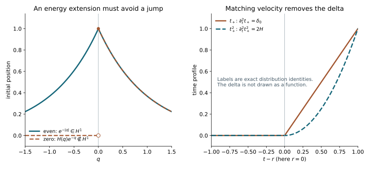

# Matrix Cauchy evolution and the causal boundary split

An incoming solution should be constructed from interior Cauchy data. Requiring two individually tempered boundary-normalized Airy inputs would exclude the finite-energy examples in AES. We instead construct the full-space matrix evolution in its actual energy norm, match both initial jets, and obtain a causal boundary correction by subtraction.

The construction of an interior solution followed by a boundary correction is motivated by Melrose–Taylor, [*Boundary Problems for Wave Equations With Grazing and Gliding Rays*](https://mtaylor.web.unc.edu/wp-content/uploads/sites/16915/2018/04/glide.pdf), Section 7.4. The proofs below retain arbitrary smooth complex matrix lower terms, rough energy slices, the exact time-interface distribution and the weak Robin trace. The scalar Cauchy theorem used in the construction is proved in HC; it is not silently applied to a system.

Independent exposition, examples and illustration: **CC0-1.0**. Exact providers are in the proof map, including the explicitly external Lebl foundations. Internal P514 closure of this export is not claimed. The final section states precisely when the Airy comparison applies; it does not presume that all boundary data lie in one glancing cone.

## 1. The complete interior matrix equation

**C0. A scalar wave principal part and matrix perturbation.** Write \(x\in\mathbb R^n\), with physical time \(t\), and consider
\[
 Lu=a\,u_{tt}+2a\beta^j u_{tx_j}
       +(a\beta^i\beta^j-A^{ij})u_{x_ix_j}
       +B^t u_t+B^j u_{x_j}+Cu=f .                     \tag{IC1}
\]
The functions \(a,\beta,A\) are real scalar coefficients; \(A\) is symmetric. On every finite time interval they and every derivative are bounded, and
\[
 a\ge c>0,\qquad A^{ij}\xi_i\xi_j\ge c|\xi|^2 .       \tag{IC2}
\]
The coefficients \(B^t,B^j,C\) are arbitrary smooth complex \(N\)-by-\(N\) matrices with the same bounded-derivative property. No symmetry or commutation condition is imposed on them. Define
\[
 X^s=H^{s+1}(\mathbb R^n;\mathbb C^N)\oplus H^s(\mathbb R^n;\mathbb C^N),
 \qquad U=(u,u_t),\qquad s\in\mathbb R .              \tag{IC3}
\]
The norm is the sum, or equivalently the square-sum, of the two indicated norms.

Let \(L_0\) be IC1 without the three matrix lower-order terms, acting componentwise. In the \(D=-i\partial\) convention, the monic operator \(-a^{-1}L_0\) has principal roots
\[
 \lambda_\pm(t,x,\xi)=-\beta\cdot\xi
          \ \pm\sqrt{A^{ij}\xi_i\xi_j/a}.              \tag{IC4}
\]
They are real, ordinary homogeneous symbols of degree one, uniformly separated by \(c'|\xi|\). Differentiating the positive square root on the unit sphere proves all symbol bounds; IC2 keeps its denominator bounded away from zero. Thus every hypothesis of HC:G1–G4 holds for this scalar operator. Its initial \(D_t\)-datum is \(-i u_t\), so its two-jet norm is exactly IC3 up to the fixed norm convention.

**C1. The scalar two-time evolution and its forcing formula.** Let \(S_0(t,r)\) be the componentwise homogeneous Cauchy evolution on IC3. The scalar theorem, reversed in time when needed, proves existence, uniqueness and
\[
 \|S_0(t,r)\|_{X^s\to X^s}\le M_{s,I}
 \quad(t,r\in I),\qquad
 S_0(t,r)S_0(r,v)=S_0(t,v),\quad S_0(r,r)=I .           \tag{IC5}
\]
The composition identity follows by uniqueness with the same intermediate jets. Strong continuity in the first parameter is part of HC. For the second parameter use
\(S_0(t,r+h)-S_0(t,r)=S_0(t,r)[S_0(r,r+h)-I]\), and the reversed strong continuity, first on smooth data and then by the uniform bound and density. This also proves joint strong continuity.

On smooth data the generator is
\[
 \mathcal A_0(t)(u,v)=\left(v,
 -2\beta^j\partial_jv
 -a^{-1}(a\beta^i\beta^j-A^{ij})\partial_{ij}u\right),
 \qquad \mathcal A_0:X^s\longrightarrow X^{s-1}.       \tag{IC6}
\]
Density and boundedness extend the integrated generator identity to all \(X^s\). Consequently for \(F\in L^1(I;X^s)\), the integral
\(Z(t)=\int_r^t S_0(t,\sigma)F(\sigma)\,d\sigma\) is a Bochner integral in \(X^s\), continuous in \(t\), and satisfies \(Z_t=\mathcal A_0 Z+F\) in \(L^1X^{s-1}\). Here and below integrals with \(t<r\) are oriented. To prove the derivative assertion, approximate \(F\) in \(L^1X^s\) by smooth finite sums of smooth spatial vectors. Differentiate their integrals using IC6, then pass in the integrated equation by IC5 and the bounded map in IC6. This accounts for both moving endpoints and avoids differentiating an arbitrary operator-norm continuous family.

## 2. Retain the ordered matrix perturbation

**C2. A convergent Volterra series in the exact energy scale.** Set
\[
 \mathcal V(t)(u,v)=
 \left(0,-a^{-1}(B^t v+B^j\partial_j u+Cu)\right),
 \qquad F(t)=(0,a^{-1}f(t)).                           \tag{IC7}
\]
Smooth multiplication and the ordinary Sobolev maps prove \(\mathcal V(t):X^s\to X^s\) bounded for every real \(s\), uniformly on \(I\). Every coefficient product keeps its displayed order. In particular the surviving first normal derivative is part of \(B^j\partial_j u\), and is bounded by the first component's \(H^{s+1}\) norm.

For \(t\ge r\), define
\[
 U_0(t)=S_0(t,r)U_r+\int_r^t S_0(t,\sigma)F(\sigma)\,d\sigma,
 \qquad (\mathcal T U)(t)=\int_r^t S_0(t,\sigma)\mathcal V(\sigma)U(\sigma)\,d\sigma .
                                                                  \tag{IC8}
\]
If \(K\) bounds \(\mathcal V\) and \(M=M_{s,I}\), iteration over the ordered simplex gives
\[
 \|\mathcal T^j U\|_{C([r,r+T];X^s)}
       \le\frac{(MKT)^j}{j!}\|U\|_{C([r,r+T];X^s)}.    \tag{IC9}
\]
This is proved by induction: integrate the preceding bound \((MK(\sigma-r))^{j-1}/(j-1)!\) once more. Each nested integral exists by the Bochner integral and strongly measurable operator-action proofs CE:H4 and CE:H6. The induction supplies its integrable norm bound; no interchange of vector integrals is needed. Hence
\[
 U=\sum_{j=0}^{\infty}\mathcal T^j U_0
 \quad\hbox{converges in }C(I;X^s),\qquad U=U_0+\mathcal T U. \tag{IC10}
\]
For reversed time the identical proof uses \(|t-r|\) and the oriented integral. If two solutions of IC10 have the same data, their difference equals \(\mathcal T^j\) of itself for every \(j\); IC9 makes it zero. No finite-time commutativity or smallness assumption is needed.

**C3. The full all-real Cauchy theorem.** For every real \(s\), initial data \(U_r\in X^s\), and \(f\in L^1(I;H^s)\), IC10 is the unique solution
\[
 u\in C(I;H^{s+1}),\qquad u_t\in C(I;H^s),\qquad
 u_{tt}\in L^1(I;H^{s-1})                             \tag{IC11}
\]
of IC1 and the two initial conditions. It obeys
\[
 \sup_{t\in I}\bigl(\|u(t)\|_{H^{s+1}}+\|u_t(t)\|_{H^s}\bigr)
 \le C_{s,I}\left(\|u(r)\|_{H^{s+1}}+\|u_t(r)\|_{H^s}
                      +\|f\|_{L^1(I;H^s)}\right).     \tag{IC12}
\]
Indeed IC9 sums to an exponential bound times the IC5 bound for \(U_0\). C1 gives the integrated equation in \(X^{s-1}\); its first component says precisely that the second component is \(u_t\), and its second gives IC1. It also yields the last assertion of IC11.

Conversely a solution in IC11 satisfies variation of constants. For smooth vectors differentiate \(S_0(r,t)U(t)\) using IC5–IC6, and integrate. For general vectors, this computation holds in \(X^{s-2}\) after ordinary spatial regularization and approximation of the integrable source. Every product has a uniform map between the stated scales, so the integrated identity passes to the limit. Equivalently apply the scalar forced Cauchy uniqueness theorem to the equation \(U_t-\mathcal A_0 U=\mathcal VU+F\). Thus it satisfies IC10 and is unique.

The homogeneous full evolution \(S(t,r)\) has IC5's restart, inverse and joint strong-continuity properties by the same uniqueness and density argument. Solutions constructed at different Sobolev orders agree at a common lower order. Data in every spatial Sobolev space and forcing smooth in time with values in every such space therefore give one solution at all orders. Differentiating IC1 then gives every time derivative; the Fourier Sobolev embedding proof gives ordinary smoothness. This includes compact smooth data and forcing. None of these statements assumes a scalar matrix lower part.

## 3. Extending the physical patch and its initial data

**C4. A bounded full-space equation with the correct local coefficients.** In the normalized boundary chart \(x=(q,z)\), \(q\ge0\), MBE gives \(G^{qq}=-1\), \(G^{qt}=G^{qz}=0\), \(G^{tt}>0\), with one positive principal square. Complete the time square:
\[
 a=G^{tt},\quad \beta^j=G^{tj}/a,\quad
 A^{ij}=a\beta^i\beta^j-G^{ij}.
 \qquad \beta^q=0,\quad A^{qq}=1,\quad A^{qz}=0.       \tag{IC13}
\]
The spatial matrix \(A\) is positive definite. To verify this, subtract the multiple \(\beta\cdot\xi\) from the time variable in the principal quadratic form. Its sole positive square is the time square; the remaining spatial form must be negative definite because the principal form is nondegenerate. Compactness gives uniform positive bounds after shrinking the patch.

Extend the smooth coefficients a short distance to \(q<0\) by the parameter-dependent smooth extension theorem FD:E2. Continuity preserves the strict positive bounds there. Preserve \(\beta^q=0,A^{qq}=1,A^{qz}=0\) identically, and extend only the other coefficients. On a slightly larger compact patch blend \(a\) and the tangential block of \(A\) with positive constants using a smooth cutoff; their convex combinations stay positive. Blend \(\beta\) with a constant and extend the full lower matrices with smooth cutoffs. Reconstruct \(G^{ij}=a\beta^i\beta^j-A^{ij}\). This gives IC1–IC2 globally in space, agrees with every original coefficient on the required patch, and preserves the normalized physical face. All derivative bounds on the finite time interval follow from compactness and constant coefficients outside a compact set.

If the original solution is local, first multiply it by a spatial cutoff equal to one on the closed region to be used. In the Robin gauge require \(\partial_q\chi=0\) at \(q=0\); then bare Neumann data are preserved. Dirichlet data are preserved by any smooth multiplier. The exact new source is
\[
 L(\chi u)=\chi Lu+2G^{\alpha\beta}(\partial_\alpha\chi)\partial_\beta u
       +\bigl(G^{\alpha\beta}\partial_{\alpha\beta}\chi
                        +B^\alpha\partial_\alpha\chi\bigr)u .      \tag{IC14}
\]
For \(u\in H^1\) it is in \(L^2\) whenever \(Lu\in L^2\). Every mixed coefficient is present in IC14. No assertion about a smaller region discards this source outside that region.

For the remainder of the causal-split theorem take such compactly localized data on the half-space and its finite time interval. Write \(H=L^2(\mathbb R^n_+)\) and \(V=H^1_0\) for the Dirichlet face or \(V=H^1\) for the natural face; the zero condition refers to the physical face. The chosen cutoffs handle artificial edges.

**C5. Initial traces at good energy slices and a stable extension.** Suppose
\[
 u\in H^1(I\times\mathbb R^n_+;\mathbb C^N),\qquad Lu=f\in L^2,
 \qquad \gamma u=0\ \hbox{or}\ \gamma u_q=0 .          \tag{IC15}
\]
The second condition in IC15 is the actual graph trace from WSL:L6–L7, after the exact MBE boundary gauge. Then \(u\in L^2(I;V)\), \(u_t\in L^2(I;H)\), and the weak equation gives \(u_{tt}\in L^2(I;V^*)\). Here is the needed mapping check. Integrate every spatial second derivative once onto a test in \(V\); coefficient derivatives give additional first-order terms, all bounded by \(\|u\|_V\). The physical normal boundary term vanishes by the chosen domain. The mixed time-space derivative is the spatial derivative of \(u_t\); its normal coefficient is zero because \(\beta^q=0\), so it gives a \(V^*\) functional bounded by \(\|u_t\|_H\), with the full tangential coefficient derivative retained. Matrix lower terms and \(f\) have the same bound. Multiplication by \(a^{-1}\) is bounded on \(V\) and hence on its dual. This proves the assertion with the actual weak test domain.

The Bochner primitive and distributional-constant arguments CE:H7 and CE:H10 now give continuous representatives
\[
 u\in C(I;H),\qquad u_t\in C(I;V^*) .                 \tag{IC16}
\]
For almost every \(r\in I\), these representatives coincide with the Fubini slices, and
\(u(r)\in V\), \(u_t(r)\in H\). Choose such a single slice. This choice does not presume strong energy continuity of the original solution at every time.

Extend \(u(r)\) to full space by zero in the Dirichlet case and by even reflection in the Neumann case. The first map is bounded \(H^1_0\to H^1\); the second is bounded \(H^1\to H^1\), with norm at most \(\sqrt2\). For a direct proof, start with smooth half-space functions. Zero trace cancels the interface term for zero extension. Under even reflection the values on the two sides agree, so integration by parts creates no delta; the normal derivative is the reflected derivative with its sign changed. Tangential derivatives are evenly reflected. Integrating their squared norms gives the stated factors. Smooth density and the proved half-space trace theorem extend these identities to the stated spaces. Extend \(u_t(r)\in H\) and \(f\in L^2\) by zero; their \(L^2\) norms are unchanged. On finite time intervals \(L^2_tL^2_x\subset L^1_tL^2_x\) by Cauchy–Schwarz.

Apply C3 at \(s=0\) to the extended coefficients and data. The resulting full-space solution \(v\) has
\[
 v\in C(I;H^1(\mathbb R^n)),\quad v_t\in C(I;L^2(\mathbb R^n)),
 \quad Lv=f\ \hbox{on the physical patch},\quad
 v(r)=u(r),\quad v_t(r)=u_t(r)\quad(q>0).              \tag{IC17}
\]
Its norm is bounded by IC12 and the preceding extension constants. This is a stable interior construction, without division by an exponentially growing or decaying boundary mode. A different admissible extension can change \(v\); the correction defined next changes with it, and their sum is fixed.

## 4. Matching two jets removes the time-interface source

**C6. The causal difference and its exact interior equation.** On \(t>r\), let \(h=u-v|_{q>0}\), and extend it by zero for \(t<r\):
\[
 w=H(t-r)h .                                          \tag{IC18}
\]
Since \(h\in H^1\) and its actual time value in \(H\) is zero at \(r\), this extension belongs to \(H^1\) on a shorter time slab crossing \(r\). Indeed, integration by parts in time gives no interface term; its weak time derivative is the zero extension of \(h_t\), and spatial derivatives commute with this extension. All these derivatives are in \(L^2\). Thus the statement follows directly from the weak-derivative definition of \(H^1\).

In the open physical interior, \(Lh=0\) and both time jets are zero. The second jet is genuine: IC16 identifies \(u_t(r)\) as a continuous \(V^*\) value, and IC17 identifies \(v_t(r)\) even in \(H\). For spatial tests supported away from the physical face, the equation gives the needed \(H^{-1}_{\rm loc}\) derivative and its integration by parts. In general, with initial jets \(h_0,h_1\), the time-interface terms of the ordinary-derivative operator are
\[
 L(H(t-r)h)-H(t-r)Lh
 =a(r)h_0\,\delta'_r+
 \bigl[a(r)h_1+2G^{tj}(r)\partial_jh_0
                     +(B^t(r)-a_t(r))h_0\bigr]\delta_r .           \tag{IC19}
\]
Here \(j\) is spatial, and this displayed formula is an interior distribution identity. To derive it, use \(\partial_t(Hh)=Hh_t+h_0\delta_r\), then differentiate once more. The coefficient identity \(a(t)\delta'_r=a(r)\delta'_r-a_t(r)\delta_r\) gives the last scalar term. Each mixed derivative contributes \(2G^{tj}(r)\partial_jh_0\delta_r\), and the time lower matrix gives \(B^t(r)h_0\delta_r\). Approximation of the weak jets, or the Bochner integration identity tested in space, gives the same formula in the weak distribution topology.

Both jets in IC19 vanish for IC18. Therefore
\[
 w\in H^1,\qquad Lw=0\quad(q>0),\qquad w=0\quad(t<r),
 \qquad u=v+w\quad(t>r).                              \tag{IC20}
\]
The calculation has not declared a boundary corner term zero: the physical boundary data are recovered next from the actual trace of \(w\).

**C7. The canonical boundary datum at the time corner.** The value trace of \(w\) belongs to \(H^{1/2}_{\rm loc}(\mathbb R_t\times\mathbb R_z^{n-1})\). Its normal trace belongs to \(H^{-1/2}_{\rm loc}\): apply WSL:L6 to IC20, retaining all tangential second derivatives and matrix lower terms in the normal graph equation. These traces are local and preserve base support. Thus the Dirichlet correction datum \(b=\gamma w\), or the ordinary normal datum \(n=\gamma w_q\), satisfies
\[
\begin{array}{lll}
 b\in H^{1/2}_{\rm loc},& b=0\ (t<r),& b=-\gamma v\ (t>r),\\
 n\in H^{-1/2}_{\rm loc},& n=0\ (t<r),& n=-\gamma v_q\ (t>r).
\end{array}                                                       \tag{IC21}
\]
The corresponding row is used for the boundary domain in IC15. The normal datum is defined by the trace of IC18; we have not multiplied an arbitrary rough boundary distribution by a Heaviside function.

There is no ambiguity supported only at \(t=r\). In fact the only \(H^{-1/2}_{\rm loc}(t,z)\) distribution supported on that hyperplane is zero. Here is a proof at the borderline order. Localize to compact support. A distribution of finite order \(m\) supported on the hyperplane is a finite sum \(\sum_{j=0}^m\delta_r^{(j)}T_j(z)\). To obtain this expression, Taylor expand a test through order \(m\) in \(t-r\). The distribution annihilates the remainder: insert a cutoff \(\chi((t-r)/\epsilon)\) equal to one on its support; every derivative through order \(m\) of \((t-r)^{m+1}\chi((t-r)/\epsilon)\) tends uniformly to zero on the fixed compact set. The finite-order bound proves annihilation, leaving precisely the finite Taylor jets and hence the stated sum.

If the highest nonzero term is \(j\), its tangential Fourier transform is nonzero and bounded away from zero on some bounded open set of \(z\)-frequencies. Lower terms are bounded there. For sufficiently large \(|\tau|\), the full Fourier polynomial therefore has modulus at least \(c|\tau|^j\) on a smaller such set. Its squared \(H^{-1/2}\) norm dominates
\[
 c\int_1^\infty \tau^{2j-1}\,d\tau=\infty,            \tag{IC22}
\]
a contradiction. This also excludes such a distribution in \(H^{1/2}\). Consequently IC21 specifies the unique extension with its indicated Sobolev order. A boundary delta cannot be added at the time corner while retaining that order.

In the bare Neumann gauge the full weak functional of the correction is
\[
 \mathfrak q'(w,\psi)=-\langle n,\gamma\psi\rangle,
 \qquad \gamma D_qw=-i n .                            \tag{IC23}
\]
This is the exact Green identity MBE:B2, not an interior equation substituted for a weak one. In the Dirichlet case the tests have zero boundary value and the corresponding homogeneous interior weak identity holds, while the solution value is \(b\).

To return to the original normalized Robin equation, MBE:B1 uses the original solution \(U=Su\) and tests \(\phi=S^{-*}\psi\). The incoming initial data therefore transform by
\[
 u(r)=S(r)^{-1}U(r),\qquad
 u_t(r)=S(r)^{-1}U_t(r)-S(r)^{-1}S_t(r)S(r)^{-1}U(r). \tag{IC24}
\]
Retain the second term, and retain every lower coefficient in BE7. Since \(S|_{q=0}=I\), the transformed Robin conormal is exactly \(D_q\); the original conormal datum of \(Sw\) is \(-i n\) in the normalized convention. The weak test transformation in IC23 retains the full boundary functional. NW's coordinate and scalar normalizations likewise act on both tests and data as proved there; an unscaled original flux is not identified with \(n\).

## 5. Where the outgoing Airy comparison now applies

**C8. Match the entire correction datum on the dependence region.** Let a closed local dependence region fit inside an AWT receiving patch, with an earlier open band in \(t<r\). Suppose the complete correction datum from IC21, after the compact support localizations being used, has wavefront in the cone on which the actual boundary inverse is valid. In particular the complete boundary errors of that inverse must be smooth on the face of this dependence region. Suppose also that output-cutoff derivatives are outside that closed region, or their full commutator errors have been proved smooth there. These are hypotheses about the whole comparison region and datum, not just one covector.

Use the physical future mode \(\nu=\operatorname{sgn}(H_p t)\), and put
\[
 W_D=E_\nu^D b,\qquad W_N=E_\nu^N(-i n).              \tag{IC25}
\]
The input in the second formula is the \(D_q\)-conormal datum, so the factor \(-i\) is compulsory. ADT supplies finite tangential order, the actual traces and the smooth equation residual. AWT gives smoothness in the earlier band because the data in IC21 are supported in \(t\ge r\). Their boundary discrepancies are smooth by the complete-data hypothesis. TBU's transposed comparison on this closed region now yields
\[
 w-W_D\in C^\infty\quad\hbox{or}\quad w-W_N\in C^\infty,
 \qquad u=v+W_D+C^\infty\quad\hbox{or}\quad u=v+W_N+C^\infty. \tag{IC26}
\]
In particular the displayed Airy correction inherits local \(H^1\) membership from the actual \(w\); no sharp input-to-energy bound was assumed. The construction uses one stable full-space incoming solution and one boundary correction. It does not require the two normalized Airy coefficients excluded by AES:E9.

For a general solution, IC20–IC24 hold in the stated \(L^2\)-interior-source class, but the complete-data cone hypothesis in C8 is not automatic. A source or boundary remainder that is merely smooth at one covector is insufficient for TBU's full dependence-region comparison. Nor does WSL's general natural-dual lift automatically supply the \(L^2\) source assumed in IC15: its remaining tangential derivatives have their explicitly weaker order. Microlocal source reduction, localization of incoming data and exclusion of the complementary boundary response remain necessary for the full strict-diffraction theorem. IC12 is the sharp ordinary Cauchy energy-scale estimate; it is not the unfinished sharp Fourier–Airy mapping estimate.

## 6. Three complete exercises

### Exercise 1. Time-dependent matrices require ordered evolution

Consider spatially constant vectors solving \(u_{tt}+(A+tB)u_t=0\). Compare the velocity evolution with \(\exp(-tA-t^2B/2)\) through order three.

**Solution.** Write \(u_t(t)=V(t)u_t(0)\), \(V(0)=I\). Matching coefficients in \(V'=-(A+tB)V\) gives
\[
 V(t)=I-tA+\frac{t^2}{2}(A^2-B)
       +\frac{t^3}{6}(-A^3+AB+2BA)+O(t^4).            \tag{IC27}
\]
The cubic coefficient of the proposed exponential is \(-A^3/6+(AB+BA)/4\). Thus
\[
 V(t)-e^{-tA-t^2B/2}=\frac{t^3}{12}(BA-AB)+O(t^4).   \tag{IC28}
\]
For \(A=\left(\begin{smallmatrix}0&1\\0&0\end{smallmatrix}\right)\), \(B=\left(\begin{smallmatrix}0&0\\1&0\end{smallmatrix}\right)\), the commutator is \(\operatorname{diag}(-1,1)\), so the error is nonzero. IC9 retains the correctly ordered products at every order. Integrating \(V(t)u_t(0)\) gives the position with its independently prescribed initial value.

### Exercise 2. Matching only the value leaves a delta source

For \(L=\partial_t^2-\partial_q^2\), let \(h(t,q)=t\alpha(q)\) for \(t>0\), where \(\alpha\) is nonzero smooth and compactly supported away from the physical face. Compute the equation of its zero extension and compare with \(h=t^2\alpha\).

**Solution.** Both functions have zero initial value. The first has initial velocity \(\alpha\), so
\[
 L(t_+\alpha)=\delta_0(t)\alpha(q)-t_+\alpha''(q),
 \qquad L(t_+^2\alpha)=2H(t)\alpha(q)-t_+^2\alpha''(q). \tag{IC29}
\]
The second has both jets zero and therefore no interface delta. These identities follow by testing \(\partial_t^2 t_+\) and \(\partial_t^2t_+^2\) against a compact smooth time test and integrating twice. Their spatial derivatives are ordinary multiplication by \(\alpha''\). Thus even when the zero extension is \(H^1\), its equation can acquire a nonzero interior initial source. The second matching condition in C6 cannot be omitted.

### Exercise 3. The Neumann energy extension need not be zero extension

Take \(f(q)=e^{-q}\) on \(q>0\). Compare its even and zero extensions as full-line initial positions.

**Solution.** The half-line function belongs to \(H^1\), with squared norm
\(\int_0^\infty(e^{-2q}+e^{-2q})\,dq=1\). Its even extension is \(e^{-|q|}\), whose weak derivative is \(-\operatorname{sgn}(q)e^{-|q|}\). It has no delta because its value is continuous, and its squared \(H^1\) norm is two. The zero extension is \(H(q)e^{-q}\), whose derivative is \(\delta_0-H(q)e^{-q}\); it is not \(H^1\). The initial position for a Neumann energy solution is allowed to have nonzero boundary value, so zero extension would incorrectly discard legitimate data. This example concerns the energy position space; it does not prescribe an initial strong normal derivative or an extra corner compatibility condition.

**F0. Exact coordinates of the figure.** The left panel plots \(e^{-|q|}\) and \(H(q)e^{-q}\) for \(-1.5\le q\le1.5\); open and filled circles distinguish the jump of the latter at zero. The right plots \(t_+\) and \(t_+^2\) for \(-1\le t\le1\). Its labels give their distributional second derivatives, \(\delta_0\) and \(2H\), not numerical approximations to a delta. The equations and norm calculations in Exercises 2–3 prove the assertions illustrated. The [figure script](figures/build_figure.py) retains the exact functions and endpoints.
