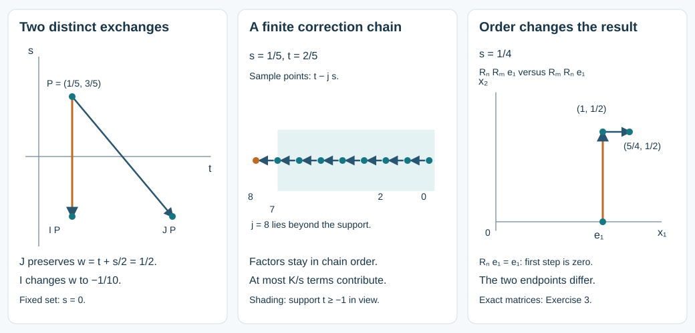

# Matrix parity equations and transport across a boundary fold

At a glancing boundary, the same function must satisfy two different requirements: it is transported along characteristic curves, and its two boundary values obey a parity condition. The two exchanges of sheets are distinct. Solving an ordinary differential equation on each sheet separately does not impose the boundary condition. This lesson proves the missing compatibility theorem for arbitrary finite complex matrices, including an inhomogeneous equation and both useful types of boundary condition.

The scalar antecedents are Melrose and Taylor, [*Boundary Problems for Wave Equations With Grazing and Gliding Rays*](https://mtaylor.web.unc.edu/wp-content/uploads/sites/16915/2018/04/glide.pdf), Section 2.8, Proposition 2.8.2 and Exercise 2.8.14; Section 4.4 explains their use in transport. Our sign of the odd part is defined below. We give independent proofs, keep every product in its actual order, and state the normalization permitted by each condition. The earlier [simultaneous reflection theorem](../20261005-restored-simultaneous-reflections/simultaneous-reflections-and-flat-corrections.md) and [smooth descent theorem](../20261005-restored-smooth-descent/folds-reflections-and-uniform-descent.md) supply the coordinates and extension through the image of a fold. The [proof map](proof-map.json) identifies the exact prerequisites. Some transitive elementary proofs remain explicit external Lebl dependencies; this export does not claim internal P514 closure.

Independent mathematical text, examples and illustration: **CC0-1.0**. No human source text or source PDF is included. This result supplies smooth transport with boundary compatibility. Construction of the differential-operator amplitude expansion, all its remainders, and transfer to the original weak boundary problem remain separate obligations.

## 1. The two exchanges and the exact assertions

**P0. Matrix parity contracts.** Work near the origin in coordinates \((t,z,s)\), where \(z\) denotes any finite collection of real spectator parameters. Put

\[
 I(t,z,s)=(t,z,-s),\qquad J(t,z,s)=(t+s,z,-s),\qquad w=t+s/2.
 \tag{MP1}
\]

Both maps are involutions. Their common fixed set is \(S=\{s=0\}\), but their minus-one lines are respectively \(\mathbb R\partial_s\) and \(\mathbb R(\partial_s-\tfrac12\partial_t)\). The coordinate \(w\) and the quantity \(s^2\) are invariant under \(J\). For a smooth \(N\)-by-\(M\) complex matrix function \(a\), define

\[
 E a=\frac{a+a\circ I}{2},\qquad
 O a=\frac{a-a\circ I}{2s}
       =\frac12\int_{-1}^{1}\partial_s a(t,z,us)\,du.
 \tag{MP2}
\]

The integral defines the value at \(s=0\); both parts are smooth and \(I\)-invariant. We use matrix multiplication on the left throughout.

Given smooth \(I\)-invariant \(N\)-by-\(N\) matrices \(C,B\) and \(N\)-by-\(M\) matrices \(f,d\), the following two local existence statements hold:

\[
 \begin{array}{ll}
 \text{(A)}& a\circ J=a,\qquad Oa=C\,Ea+f;\\[2pt]
 \text{(B)}& a\circ J=a,\qquad Ea=s^2B\,Oa+d.
 \end{array}
 \tag{MP3}
\]

In (A), the value \(a(0,z,0)=A_*(z)\) can be prescribed as any smooth matrix on the transverse parameter slice. In (B), the whole value on \(S\) is forced: \(a(t,z,0)=d(t,z,0)\). In particular an extra condition \(a(0,0,0)=I_N\), when \(M=N\), is possible in (B) only if \(d(0,0,0)=I_N\). In either case the construction is joint smooth in all parameters, on one neighborhood. No uniqueness assertion is needed.

*The first panel shows the two different sheet exchanges at exactly specified points. The middle panel shows the actual backward translation used to correct a flat error, not a characteristic flow. The last panel compares two matrix products on the same vector; their different endpoints display the order that the proof must retain. Sections 4 and 9 explain the coordinates and constants.*

## 2. A matrix differential equation with all parameters

**P1. Ordered integration.** For smooth matrices \(K(t,z)\), the equation \(U'=KU\), \(U(0,z)=I_N\), has a smooth invertible solution on a common small parameter box. To see this without assuming commutation, start with the identity and successively insert the integral operator \(V\mapsto\int_0^tK(v,z)V(v,z)\,dv\). The resulting series is

\[
 U(t,z)=I_N+\sum_{n\ge1}
 \int_0^t\!dv_1\int_0^{v_1}\!dv_2\cdots\int_0^{v_{n-1}}\!dv_n\,
 K(v_1,z)K(v_2,z)\cdots K(v_n,z).
 \tag{MP4}
\]

For negative \(t\) the integrals are oriented; replacing their variables by \(t u_j\) gives the same ordered simplex \(0\le u_n\le\cdots\le u_1\le1\). Its volume is \(1/n!\), by induction integrating the volume of a scaled simplex. On a compact box, if \(\|K\|\le L\), the norm of term \(n\) is at most \((L|t|)^n/n!\). For any fixed number \(r\) of parameter derivatives, the product rule gives at most \(n^r\) times a constant to the power \(n\) in the numerator, still divided by \(n!\). The ratio of successive majorants tends to zero. Thus every such differentiated series converges uniformly. The fundamental theorem of calculus applied to finite sums and then to their uniformly converging derivatives identifies the actual parameter derivatives. Differentiating the integral equation gives \(U'=KU\); successive differentiation of this equation gives all joint \(t,z\) derivatives. This proves smoothness.

The same series argument solves \(V'=-VK\), \(V(0)=I_N\), with the factors in the other order. The product rule gives \((VU)'=0\), hence \(VU=I_N\). A square matrix with a left inverse is invertible: its kernel is zero, so its columns form a basis in the finite-dimensional space. Thus \(V=U^{-1}\). For the inhomogeneous equation and arbitrary initial matrix \(A_*\),

\[
 a'=Ka+g,\qquad
 a(t,z)=U(t,z)\left[A_*(z)+\int_0^t U(v,z)^{-1}g(v,z)\,dv\right].
 \tag{MP5}
\]

Differentiation verifies the formula and the initial value. Multiplying the difference of two solutions by \(U^{-1}\) proves uniqueness for this differential equation. No exponential of a matrix integral has been substituted for the ordered series.

## 3. Solve every Taylor coefficient

**P2. Formal parity with a differential leading equation.** A \(J\)-invariant formal expression has the form

\[
 a(t,z,s)\sim\sum_{j\ge0}s^{2j}a_j(t+s/2,z).
 \tag{MP6}
\]

Here coefficients are Taylor coefficients, without factorials. Expand \(C\sim\sum_{k\ge0}s^{2k}C_k(t,z)\) and similarly \(f\). In (MP6), the coefficient of \(s^{2p}\) in \(Ea\) and in \(Oa\), respectively, is

\[
 E_p=\sum_{j=0}^{p}\frac{\partial_t^{2p-2j}a_j}{2^{2p-2j}(2p-2j)!},\qquad
 O_p=\sum_{j=0}^{p}\frac{\partial_t^{2p-2j+1}a_j}{2^{2p-2j+1}(2p-2j+1)!}.
 \tag{MP7}
\]

These follow by adding or subtracting the Taylor expansions at \(t+s/2\) and \(t-s/2\). The coefficient equation for (A) is \(O_p=\sum_{k=0}^p C_k E_{p-k}+f_p\). Its unknown highest coefficient occurs only in \(\tfrac12\partial_t a_p-C_0a_p\). Consequently it is a linear matrix differential equation

\[
 \tfrac12\partial_t a_p-C_0a_p
 =f_p+\sum_{k=1}^pC_k E_{p-k}
   +C_0(E_p-a_p)-(O_p-\tfrac12\partial_t a_p).
 \tag{MP8}
\]

Every term on the right involves only \(a_j\) with \(j<p\). At \(p=0\) the right side is \(f_0\). Use (MP5) with \(K=2C_0\), first prescribing \(a_0(0,z)=A_*(z)\), and, for example, \(a_p(0,z)=0\) for \(p>0\). Induction constructs all coefficients smoothly on the same smaller \(t,z\) box: every integral starts at \(0\) and stays in that box. Their derivatives may grow with \(p\); no convergence of the formal series is asserted.

**P3. Formal parity with an algebraic leading equation.** For (B), expand \(B,d\) in even powers of \(s\). The coefficient equation is

\[
 a_p=d_p-(E_p-a_p)+\sum_{k+j=p-1}B_k O_j,
 \tag{MP9}
\]

where the sum is empty for \(p=0\). All terms on the right depend on earlier \(a_j\), so this determines the sequence algebraically, starting with \(a_0=d_0\). This is also a proof of the necessary normalization stated in Section 1.

**P4. Smooth realization preserving the second exchange.** The complete parameter Borel construction SI:J3 in the reflection lesson gives a smooth function \(v(w,z,s)\), even in \(s\), with coefficients \(a_j(w,z)s^{2j}\). Explicitly it sums \(\chi(s/\varepsilon_j)a_j(w,z)s^{2j}\), with \(\chi\) even and \(\varepsilon_j\) chosen so that each sufficiently high summand and its first \(j\) derivatives are bounded by \(2^{-j}\) on a fixed smaller box. The quoted proof establishes all differentiated convergence and all prescribed jets. Set \(a^0(t,z,s)=v(t+s/2,z,s)\). Then \(a^0\circ J=a^0\) exactly. The error in the chosen equation is smooth, \(I\)-invariant and flat on \(S\), because every coefficient equation holds identically in \(t,z\). Thus every mixed derivative of the error vanishes there. The remaining task is to correct this actual flat error while preserving \(J\)-invariance.

## 4. An ordered inverse for the flat error

**P5. Both flat equations have a common construction.** Suppose the right side \(f\) in (A), or \(d\) in (B), is flat on \(S\). Multiply that right side and the coefficient matrix by an even cutoff supported in a compact coordinate box and equal to one on the box where the equation is required. Extend by zero. This preserves smoothness, parity and flatness of the right side. Let its \(t\)-support lie in \([-T,T]\), and restrict the initial point to a smaller box. All matrix derivatives of the coefficient are bounded globally there.

For a \(J\)-invariant function, \(a(t,z,-s)=a(t-s,z,s)\). On \(s>0\), the desired equation therefore becomes

\[
 a(t,z,s)=R(t,z,s)a(t-s,z,s)+q(t,z,s),
 \tag{MP10}
\]

with the following ordered coefficients:

\[
 \begin{array}{lll}
 \text{(A)}&R=(I_N-sC)^{-1}(I_N+sC),&q=2s(I_N-sC)^{-1}f;\\[2pt]
 \text{(B)}&R=-(I_N-sB)^{-1}(I_N+sB),&q=2(I_N-sB)^{-1}d.
 \end{array}
 \tag{MP11}
\]

Shrink \(|s|\) so that \(\|sC\|,\|sB\|\le1/2\). The geometric matrix series proves invertibility and the bound \(\|(I_N-sC)^{-1}\|\le2\), and likewise for \(B\). The adjugate formula with nonzero determinant proves smoothness; differentiating the inverse identity bounds every derivative on this fixed strip. There is a constant \(L\) such that

\[
 \|R\|\le1+L|s|,\qquad
 R=I_N+O(s)\ \text{in (A)},\qquad R=-I_N+O(s)\ \text{in (B)}.
 \tag{MP12}
\]

Write \(R_j=R(t-js,z,s)\), \(q_j=q(t-js,z,s)\), and set \(P_0=I_N\), \(P_j=R_0R_1\cdots R_{j-1}\) for \(j\ge1\). Define

\[
 a_+(t,z,s)=\sum_{j\ge0}P_j(t,z,s)q_j(t,z,s),\qquad s>0.
 \tag{MP13}
\]

Only \(O(1/s)\) terms can be nonzero: the points \(t-js\) eventually lie below \(-T\). Near any point with \(s>0\), the same finite index lies strictly beyond the support for all nearby points. Thus the sum is locally finite and smooth away from \(S\); no differentiation of an integer stopping time is involved. Shifting the sum by one index proves (MP10), with every matrix factor still on the left in its displayed order.

Here are the estimates needed at \(S\). For all potentially nonzero terms, \(j\le K/s\) with one fixed \(K\). Products over any subinterval of the factors have norm at most \((1+Ls)^{K/s}\le e^{LK}\); the last inequality follows from \(1+x\le e^x\), for \(x\ge0\), or its power-series proof. For a multi-index \(\alpha\) in \((t,z,s)\), differentiating \(R(t-js,z,s)\) of total order \(r=|\alpha|\) introduces at most \(r\) factors of \(j\). Hence

\[
 \|D^\alpha R_j\|\le C_r s^{-r},\qquad
 \|D^\alpha P_j\|\le C_r s^{-2r},\qquad j\le K/s,
 \tag{MP14}
\]

with a harmless larger constant for \(r=0\). For the second bound, the product rule distributes at most \(r\) differentiated positions among at most \(K/s\) factors, in at most \(C_r(1+j)^r\) ways. Their differentiated norms have total loss at most \(s^{-r}\). The undifferentiated factors between them form at most \(r+1\) consecutive products, each bounded by the preceding exponential estimate. This proves the stated loss without commuting any factors.

Flatness and Taylor's integral remainder give \(\|D^\beta q(t,z,s)\|\le C_{r,M}|s|^M\) for any prescribed \(r,M\). The chain rule for \(q_j\), with \(j\le K/s\), loses at most \(s^{-r}\). Since the input estimate permits every power, it follows that \(\|D^\beta q_j\|\le C_{r,M}s^M\) for any desired \(M\) and all \(|\beta|\le r\). Combining the product rule, (MP14) and the number of summands proves

\[
 \|D^\alpha a_+(t,z,s)\|\le C_{r,M}s^{M-2r-1},\qquad |\alpha|\le r.
 \tag{MP15}
\]

For each derivative order and each desired positive power, choose \(M\) larger accordingly. Every derivative then tends to zero, faster than that power, uniformly in the other variables on a smaller box. Extend to negative \(s\) by

\[
 a(t,z,s)=a_+(t+s,z,-s)\quad(s<0),\qquad a(t,z,0)=0,
 \tag{MP16}
\]

and use \(a=a_+\) for positive \(s\). The chain rule preserves all flat bounds on the negative side. The two sides are smooth together: the fundamental theorem of calculus along each coordinate segment identifies successive derivatives across zero, since the one-sided derivatives have the same zero limits. Induction gives every mixed derivative. The extension is \(J\)-invariant by its definition. Both equations in (MP3) are \(I\)-invariant expressions, so their validity for positive \(s\) proves it for negative \(s\), and continuity proves it at zero.

This constructs a flat solution of either flat equation. Apply it to the negative of the error of \(a^0\) from Section 3 and add the correction. The correction changes no Taylor coefficient or normalization. Statements (A) and (B) are proved on an actual common neighborhood, not merely as formal identities.

## 5. Parameters, conic degree and invertible values

**P6. The uniform form of the theorem.** Compact parameter boxes were used only to obtain finite seminorms; all constructions were joint smooth in those parameters. The coordinate theorem SI:M0 puts any pair of smooth involutions with a common fixed hypersurface and distinct reflection lines into (MP1). Transporting the equation to these coordinates therefore gives the same result, with \(s\) interpreted as the chosen odd boundary defining coordinate. If another odd defining coordinate is \(\tau=s h\), with \(h\) smooth, even and nonzero, its odd part is \(O_\tau a=h^{-1}Oa\); the coefficients are rescaled accordingly. This follows directly from (MP2).

Suppose in addition there is a common positive degree-one variable \(\lambda\), invariant under both exchanges. Work on \(\lambda=1\), using the homogeneous simultaneous coordinates of SI:H1. If the unknown and right side have the same degree \(m\), the coefficient matrices have degree zero, and \(s,t,z\) are reduced, degree-zero coordinates, construct the solution there and extend by \(a(\lambda,t,z,s)=\lambda^m a(1,t,z,s)\). This proves the homogeneous version, including all derivatives. On a compact reduced cone its symbol bounds follow by differentiating this identity: a covariable derivative lowers degree by one, and base derivatives preserve it. This statement uses a common invariant \(\lambda\); it does not assume that an arbitrary physical frequency coordinate is invariant.

When \(N=M\) and the permitted value at the marked point is invertible, continuity of the determinant gives invertibility on a smaller neighborhood. The first contract allows that value to be prescribed; the second requires it from \(d\). This is a local assertion and places no restriction on the matrices away from the chosen neighborhood.

## 6. Ordered gauge and the boundary equations

**T0. The geometric transport setting.** Let \(P\) be a smooth manifold carrying a nonvanishing vector field \(X\), and let \(K\subset P\) be a hypersurface. Assume a local characteristic quotient \(\pi:P\to Z\) is given: in a smooth flow box it is projection onto the coordinates constant along \(X\). Suppose \(\pi|_K\) is a fold, its sheet exchange is \(J\), and \(K\) also carries a second fold exchange \(I\) with the same fixed set and a distinct reflection line. The normal form (MP1) is taken on \(K\). These are the precise hypotheses needed below. The glancing pair theorem proves them for the characteristic and boundary quotients of the strict glancing model and its canonical images.

For arbitrary smooth \(N\)-by-\(N\) matrices \(G\) and smooth \(N\)-by-\(M\) data \(F\) on \(P\), consider

\[
 Xa+Ga=F.
 \tag{MP17}
\]

In the flow coordinate \(\tau\), apply P1 to obtain an invertible matrix \(H\) with \(XH+GH=0\), and a particular solution \(a^1\) with \(Xa^1+Ga^1=F\). Initial data on a transverse slice can be chosen so that \(H\) equals the identity and \(a^1=0\) at the marked point. The exact reduction is

\[
 a=a^1+Hu,\qquad Xa+Ga-F=H Xu.
 \tag{MP18}
\]

The characteristic equation is therefore equivalent to \(Xu=0\). A boundary function \(u_K\) arises as the restriction of such a local smooth \(u\) if and only if \(u_K\circ J=u_K\). Necessity follows because the two points exchanged by \(J\) have the same \(\pi\)-value. For sufficiency, use fold coordinates on \(K\), where \(\pi|_K\) is \((w,z,s)\mapsto(w,z,s^2)\). A smooth even function in \(s\) descends smoothly to the attained half-space and has a smooth extension to a full neighborhood in \(Z\), by the complete square-descent and extension proofs FD:D2 and FD:E2. Apply that theorem to every entry of \(u_K\). Pulling the extension back by \(\pi\) gives the desired \(u\). No uniqueness is asserted on the unattained side of the quotient.

**T1. The boundary odd part is prescribed.** On \(K\), impose \(Oa=C Ea+d\), with \(C,d\) even under \(I\). Write \(H_E=EH\), \(H_O=OH\), and similarly for other matrices. Direct multiplication gives, in exactly this order,

\[
 E(Hu)=H_E Eu+s^2H_O Ou,\qquad
 O(Hu)=H_E Ou+H_O Eu.
 \tag{MP19}
\]

Set \(M=H_E-s^2C H_O\). Since \(M=H\) on \(S\), it is invertible near the marked point. The boundary equation is equivalent to

\[
 Ou=\widetilde C Eu+\widetilde f,\qquad
 \widetilde C=M^{-1}(C H_E-H_O),\quad
 \widetilde f=M^{-1}(d-Oa^1+C Ea^1).
 \tag{MP20}
\]

Every coefficient on the right is even. Apply (A), prescribing the permitted point value of \(u\), and then extend through the quotient as in T0. Formula (MP18) gives a smooth solution of both the transport and boundary equations. In particular any value of \(a\) at the marked point can be prescribed, because \(H\) there is invertible and \(a^1\) is known. The matrix inverse in (MP20) is on the left; changing that position would change the equation.

**T2. The boundary even part is prescribed.** Instead impose \(Ea=s^2B Oa+d\). Set \(M=H_E-s^2B H_O\), again invertible. Substitution of (MP19) gives

\[
 Eu=s^2\widetilde B Ou+\widetilde d,\qquad
 \widetilde B=M^{-1}(B H_E-H_O),\quad
 \widetilde d=M^{-1}(d-Ea^1+s^2B Oa^1).
 \tag{MP21}
\]

Apply (B), extend through the quotient, and use (MP18). This gives a smooth solution with the mandatory trace \(a|_S=d|_S\). In particular it is an invertible matrix near the marked point if that forced value is invertible. The existence assertion places no incompatible extra normalization on the solution.

## 7. Homogeneous transport and its precise scope

**T3. Conic transport.** Assume the setting of T0 is conic, the pair of boundary exchanges satisfies the homogeneous reflection theorem, and a common positive degree-one \(\lambda\) is constant along \(X\) and invariant under both exchanges. For a degree-zero \(X\), degree-zero \(G,C,B\), and degree-\(m\) data \(F,d\), perform the construction on \(\lambda=1\) and extend \(H\) with degree zero and \(a^1,u,a\) with degree \(m\). The quotient extension in T0 is performed on the same slice before homogeneity is restored. Thus every equation and its boundary condition are preserved.

For a quadratic principal symbol \(p\), its Hamilton field has degree one as an operator on homogeneous functions. Taking \(X=\lambda^{-1}H_p\), dividing the zeroth-order matrix coefficient and right side by \(\lambda\), reduces an equation with coefficient degree one and forcing degree \(m+1\) to this setting. In the canonical model of the glancing pair theorem, \(p_F=\sigma^2-r\lambda^2-\mu\lambda\), the coordinate \(\lambda\) is constant along its Hamilton field and both boundary exchanges. Its pullback to the actual pair remains a common first integral: the actual characteristic field differs from the model field by the nonzero defining factor already proved there. Consequently this conic version applies to the strict characteristic-boundary pair.

The result establishes ordered matrix transport on the actual characteristic manifold, together with either stated smooth boundary parity equation. To turn it into a complete Airy amplitude construction one must still derive the particular lifted coefficient matrices from the differential operator, convert the chosen odd coordinate into the cubic-phase amplitude convention, extend every transport error with the required boundary jets, sum the amplitude orders, and prove the exact PDE and weak-domain remainders. None of those conclusions follows merely from the smooth existence theorem proved here.

## 8. Three solved exercises

### Exercise 1. A noncommuting smooth solution

Let

\[
 N=\begin{pmatrix}0&1\\0&0\end{pmatrix},\qquad
 M=\begin{pmatrix}0&0\\1&0\end{pmatrix},\qquad
 H(v)=(I_2+vN)(I_2+vM).
 \tag{MP22}
\]

Construct an exact \(J\)-invariant solution of (A) normalized at the origin, with coefficients smooth through \(s=0\).

**Solution.** Put \(a(t,s)=H(t+s/2)\). Then \(a\circ J=a\), and since \(H(v)=I_2+v(N+M)+v^2NM\),

\[
 Ea=H(t)+\frac{s^2}{4}NM,\qquad
 Oa=\frac{N+M}{2}+tNM.
 \tag{MP23}
\]

The first matrix is the identity at \((0,0)\), so it is invertible nearby. Set \(C=(Oa)(Ea)^{-1}\) and \(f=0\). These are smooth even functions of \(s\), and the equation follows in its correct order. The prescribed value is \(a(0,0)=I_2\). More generally \(H^{-1}=(I_2-vM)(I_2-vN)\), so \(H'=K(v)H\) with \(K(v)=H'(v)H(v)^{-1}\). This also gives an explicit ordered transport gauge. Both nilpotent factors have determinant one, which verifies invertibility for every real \(v\).

### Exercise 2. Detect an impossible normalization

In (B), take \(B=0\) and \(d(t,s)=tI_N\). Can the solution have value \(I_N\) at the origin? Find a solution with its correct value.

**Solution.** At \(s=0\) the equation forces \(a(t,0)=tI_N\); hence the value at the origin is zero, so the proposed normalization is impossible. The exact solution \(a(t,s)=(t+s/2)I_N\) is \(J\)-invariant, has \(Ea=tI_N\) and \(Oa=I_N/2\). This verifies the condition and the forced value without an asymptotic argument.

### Exercise 3. The order of two correction steps

For the matrices in (MP22), let \(R_N=(I_2-sN)^{-1}(I_2+sN)\) and similarly \(R_M\). Compute both products and their action on \(e_1=(1,0)^T\) when \(s=1/4\).

**Solution.** Since \(N^2=M^2=0\), the inverses are \(I_2+sN\) and \(I_2+sM\). Therefore

\[
 R_NR_M=I_2+2s(N+M)+4s^2NM,\qquad
 R_MR_N=I_2+2s(N+M)+4s^2MN.
 \tag{MP24}
\]

Their difference is \(4s^2(NM-MN)=4s^2\operatorname{diag}(1,-1)\). In the stated case the two output vectors are \((5/4,1/2)^T\) and \((1,1/2)^T\), respectively. The recurrence (MP10) orders factors by their positions along the chain; it permits no rearrangement even when all individual matrices are smooth and close to the identity.

## 9. What the figure records

**F0. Exact coordinates and projections.** In the first panel the starting point is \((t,s)=(1/5,3/5)\). The \(I\)-image is \((1/5,-3/5)\), whose \(w\)-value is \(-1/10\), whereas the \(J\)-image is \((4/5,-3/5)\), with the original \(w=1/2\). The segment to the \(J\)-image lies in a fiber of \(w\); the segment to the \(I\)-image keeps \(t\) fixed. Neither segment is a characteristic trajectory.

In the middle panel \(s=1/5\) and \(t=2/5\). The plotted points \(t-js\), for \(j=0,\ldots,8\), run from \(2/5\) to \(-6/5\); a right side supported in \([-1,1]\) vanishes beyond the marked support. Each arrow records one substitution in (MP10). A smooth supported right side also vanishes at the endpoints of its support; including that endpoint among the possible summands merely overestimates their number.

The final panel plots the two broken segments obtained by applying \(R_M\) then \(R_N\), or \(R_N\) then \(R_M\), to \(e_1\), with \(s=1/4\). The second path has a stationary first step because \(Ne_1=0\). The endpoints are exactly those in Exercise 3. This is a finite-dimensional matrix illustration of the ordered products in P5 and T1–T2; it asserts no extra geometric or PDE theorem.
