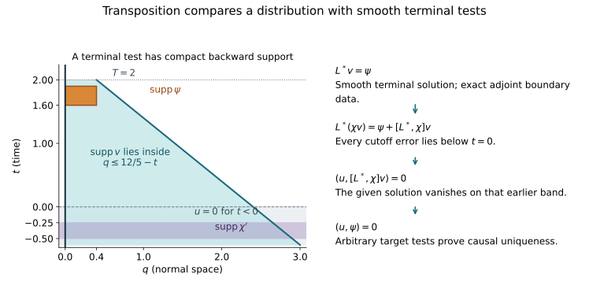

# Transposed boundary uniqueness and parametrix identification

Original text, examples and illustration: public domain (CC0).

A boundary parametrix may be well defined on distributions before its energy norm is known. Comparing it with an energy solution by an energy uniqueness theorem would then assume the missing conclusion. We instead solve a smooth terminal adjoint problem and use its solution as a test. The resulting uniqueness theorem applies to finite tangential-order distributions, includes the exact matrix boundary condition, and identifies a parametrix with an existing solution once their full residual and past conditions match.

The earlier [causal existence proof](../20261008-matrix-boundary-existence/causal-matrix-robin-existence-and-regularity.html) supplies the smooth adjoint solution. The [energy proof](../20261008-matrix-boundary-energy/matrix-robin-energy-and-weak-uniqueness.html) fixes the original weak form and its boundary gauge. We retain that entire coefficient class and every natural-dual source action.

## 1. The distribution class and the exact test domain

**T0. Pairing up to the physical face.** Work first in a global half-space model of MEX:C0. After the solution boundary gauge, write
\[
 L=G^{\alpha\beta}\partial_\alpha\partial_\beta
       +B^\alpha\partial_\alpha+C,\qquad
 G^{qq}=-1,\quad G^{qa}=0,\quad G^{tt}>0,
 \qquad H(z)=B^q(0,z)^* .                         \tag{TU1}
\]
All the smoothness, uniform Lorentz margins, finite matrix rank and coefficient extension hypotheses of that theorem apply. The physical variable is \(q\geq0\); \(z=(t,y)\). Coefficients and lower matrices may depend on time. Fix a finite time interval \(I\).

Say \(u\) has **locally finite tangential order** if, after compact localization in \(q,z\), it belongs to \(L^2_qH^{-M}_z\) for some \(M\geq0\) depending on the localization. In particular it pairs with smooth compact tests up to \(q=0\):
\[
 |(u,v)|\leq \|u\|_{L^2_qH^{-M}_z}
                       \|v\|_{L^2_qH^M_z}.       \tag{TU2}
\]
We use a scalar product linear in \(u\), conjugate-linear in \(v\). Thus \((u,L^*v)\) is defined without taking a boundary trace of \(u\). Local \(H^1\) functions belong to this class. So do the localized Fourier–Airy outputs in ADT:D7: its finite-loss estimate at normal derivative order zero gives one uniform negative tangential Sobolev exponent on each compact collar. Smooth normal families with that estimate may be added to \(H^1\) functions. Smooth multipliers preserve the class by the all-real Sobolev multiplication bound HC:M1–M2, applied uniformly on compact normal intervals.

The legal adjoint tests are \(v\in C^\infty_c(\overline\Omega\cap\{t\in I\};\mathbb C^N)\) satisfying
\[
 v|_{q=0}=0\quad(D^*),\qquad
 (v_q+Hv)|_{q=0}=0\quad(N^*).                     \tag{TU3}
\]
MEX:C1 proves these precise conditions from the full formal adjoint; in general \(N^*\) is not bare Neumann. The phrase **homogeneous transposed equation** will mean
\[
                 (u,L^*v)=0
       \quad\hbox{for every test in TU3}.          \tag{TU4}
\]
It includes the boundary condition. The interior equation alone is a weaker statement.

No distribution supported solely at \(q=0\) is added to the class by choosing a different extension: \(u\) is the specified \(L^2_qH^{-M}_z\) object on \(q>0\), paired by that integral up to zero. The boundary contributions are prescribed explicitly below.

## 2. A compact smooth terminal test

**T1. Solve the actual adjoint boundary problem.** Let \(\psi\) be any smooth compact vector function on the closed half-space, with time support strictly before \(T\in I\). Choose \(a_0<T\) in \(I\). There is a smooth \(v\) on the closed slab \(a_0<t<T+\epsilon\) such that
\[
 L^*v=\psi,\qquad v=0\ \hbox{for }t\geq T,
 \qquad v\hbox{ satisfies TU3}.                   \tag{TU5}
\]
On every smaller closed time slab its spatial support is compact.

Here are the reductions checking that MEX applies. Its full adjoint expansion gives ordinary coefficients
\[
 \widetilde B^\beta=2\partial_\alpha G^{\alpha\beta}I-B^{\beta *},
 \qquad
 \widetilde C=\partial_\alpha\partial_\beta G^{\alpha\beta}I
                    -\partial_\alpha B^{\alpha *}+C^* .
                                                        \tag{TU6}
\]
Put \(t'=T-t\). Then \(\partial_t=-\partial_{t'}\): a mixed principal coefficient \(G^{tj}\) changes sign and \(G^{tt}\) does not. This coordinate reflection preserves Lorentz signature, the constant normal block, all bounded coefficient hypotheses and positivity of the time covector. The first time coefficient changes sign; no matrix coefficient is discarded.

In the natural case put \(v=T_Hw\), where
\[
 T_H(q,z)=e^{-\rho(q)H(z)},\qquad
 \rho=q\hbox{ near }0,\quad \rho\hbox{ bounded and constant far from }0.
                                                        \tag{TU7}
\]
The exact product formula MEX:CE9 includes every derivative of this matrix. It gives a normalized wave operator for \(w\) with arbitrary smooth lower matrices and bare condition \(w_q|_0=0\). The gauge and inverse preserve the coefficient hypotheses, including the uniform partial Fourier bounds. In the Dirichlet case use the identity gauge. Apply MEX:C4–C8 in reversed time, with smooth source \(T_H^{-1}\psi\), zero past in \(t'\), and the chosen bare condition. Its all-order agreement proves smoothness including at the terminal time. Return to \(v\). Multiplication by \(T_H\) does not enlarge supports.

MEX:C6's finite propagation gives a uniform speed \(c\) on this finite coefficient region. If the spatial projection of \(\operatorname{supp}\psi\) is \(K\), then
\[
 \operatorname{supp}v\cap\{a_0\leq t\leq T\}
 \ \subset\
 \{(t,s):a_0\leq t\leq T,\ \operatorname{dist}(s,K)\leq c(T-t)\},
 \quad s=(q,y).                                  \tag{TU8}
\]
This closed set is compact. For a smaller source support one may use the smaller union of backward dependence cones from its points. The larger bound TU8 suffices here. This proof constructs the terminal test, rather than assuming an inverse of \(L^*\).

**T2. Causal uniqueness without an energy hypothesis.** Suppose \(u\) has locally finite tangential order, satisfies TU4 in \(I\times\mathbb R^d_+\), and is zero for \(t<a\), where \(a\) is an interior point of \(I\). Then \(u=0\) throughout \(I\).

To prove this, choose any smooth compact \(\psi\) whose time support is after some \(a_1<a\) and before \(T\in I\). Construct \(v\) by T1 on a slab beginning strictly before \(a_1\). Choose a real smooth \(\chi(t)\) with \(\chi=0\) before \(a_1\), \(\chi=1\) for \(t\geq a_2\), where \(a_1<a_2<a\), and choose \(\psi\) to be supported in \(t>a_2\). The product \(\chi v\) is a smooth compact test. Its time support is compact because \(v\) is zero after \(T\); its spatial support is compact by TU8. It satisfies TU3 because \(\partial_q\chi=0\). There is no need to cut off a noncompact spatial tail.

The full commutator is
\[
 [L^*,\chi]v
     =2G^{\alpha t}\chi'\partial_\alpha v
          +(G^{tt}\chi''+\widetilde B^t\chi')v .   \tag{TU9}
\]
This follows directly by differentiating the product with the ordinary expression TU6. Every term has time support below \(a\). Consequently TU4 and \(u=0\) there give
\[
 0=(u,L^*(\chi v))
   =(u,\chi\psi)+(u,[L^*,\chi]v)
   =(u,\psi).                                    \tag{TU10}
\]
The pairings are legitimate by TU2 on the single compact support just constructed. Interior \(\psi\) are arbitrary after \(a\), and before \(a\) the distribution already vanishes. Thus \(u=0\). Smooth tests meeting the physical face give the same conclusion for its specified integral realization. No boundary trace, normal derivative, or \(H^1\) bound for \(u\) was required.

## 3. Local dependence regions

**T3. Localization uses support of the adjoint solution.** Let the coefficients, equation and boundary test identity be given only on an agreement region. Suppose a compact target set has its closed backward dependence region down to an earlier zero-past band strictly inside that agreement region, except for the allowed physical face. Extend coefficients by the near-constant construction MEX:C6. Apply T1 to a target test \(\psi\).

Finite propagation confines \(v\), in the time slab being used, to the closed backward region. Choose a compact spatial cutoff equal to one on a neighborhood of that set. Near the physical boundary choose it constant in the normal variable where it varies tangentially; it then preserves TU3. Such a cutoff exists by a finite collar cover of the compact set and an interior cutoff away from the face. Its derivative supports are disjoint from \(\operatorname{supp}v\), and hence also from the support of every derivative of the smooth \(v\). Therefore every commutator term with this cutoff is exactly zero. The time cutoff proof TU9–TU10 now uses only legal tests in the agreement region.

This proves local uniqueness in the stated dependence region. It does not assert that a microlocal cutoff of \(u\) satisfies a homogeneous equation. When a spatial or frequency cutoff acts on a candidate instead, its full commutator must be retained. A local smoothness conclusion also requires the hypotheses on a neighborhood of the closed dependence region, not merely at its target point.

## 4. Smooth data and a smooth past force smoothness

**T4. Boundary data in transposed form.** Suppose \(u\) has locally finite tangential order. Prescribe smooth \(f\) and smooth boundary data \(b\) or \(n\) by
\[
 \begin{aligned}
 (u,L^*v)&=(f,v)+\langle b,v_q|_0\rangle &&(D^*),\\
 (u,L^*v)&=(f,v)-\langle n,v|_0\rangle &&(N^*).
 \end{aligned}                                   \tag{TU11}
\]
For functions with actual traces this says \(Lu=f\), \(u|_0=b\), or \(u_q|_0=n\). For the present class TU11 is the hypothesis; no unproved trace theorem is being used. The signs follow from MEX:CE6:
\[
 (Lu,v)-(u,L^*v)
   =\langle u_q|_0,v|_0\rangle
        -\langle u|_0,(v_q+Hv)|_0\rangle .         \tag{TU12}
\]

Assume in addition that \(u\) is smooth up to the boundary on a past band throughout the dependence region under consideration. Then it is smooth in its future dependence region. First choose \(\chi(t)\) zero before that band, one after it, with derivatives inside the band. Multiplication of TU11 by testing against \(\chi v\) gives the same identity for \(\chi u\), with data \(\chi b\) or \(\chi n\) and interior source
\[
 g=\chi f+[L,\chi]u,\qquad
 [L,\chi]u=2G^{\alpha t}\chi'\partial_\alpha u
                 +(G^{tt}\chi''+B^t\chi')u.       \tag{TU13}
\]
One may first interpret the commutator distributionally using the formal adjoint; the only derivatives of \(u\) that remain are multiplied by derivatives of \(\chi\), where \(u\) is smooth. Thus \(g\) is smooth and zero in the earlier past. The boundary test remains legal because \(\chi_q=0\). For local data, extend their smooth restrictions from a slightly larger closed dependence neighborhood, with cutoffs equal to one there; T3 removes the exterior effects.

The exact smooth liftings for the normalized boundary data are
\[
 e_D=\theta(q)\chi b,\qquad
 e_N=q\theta(q)\chi n,\qquad \theta=1\hbox{ near }0.
                                                        \tag{TU14}
\]
Their value and normal derivative are respectively the prescribed data. Subtract the full \(Le_D\) or \(Le_N\) from \(g\). MEX:C8 produces a smooth supported solution of the remaining homogeneous boundary problem. Add the lifting and call the result \(h\). Then \(h\) has exactly the same transposed data as \(\chi u\), so \(\chi u-h\) satisfies TU4 and has zero past. T2, or its localized version T3, gives \(\chi u=h\). Since \(\chi=1\) on the desired future region, \(u\) is smooth there.

All statements return to the original matrix Robin condition by the invertible solution gauge of MBE:B1. It transforms both weak slots and the full source functional. Thus the assertion includes arbitrary smooth matrix Robin coefficients and time dependence, not merely scalar or self-adjoint boundary problems.

## 5. Identifying a distributional parametrix

**T5. Cancel the entire source before comparing.** Let \(U\) be an actual local \(H^1\) solution of the full weak problem in the normalized variables. Its source may be any fixed natural-dual functional \(F\). The full form identity MBE:B2 and the boundary pairing TU12 give
\[
                 (U,L^*v)=F(v)\qquad(v\hbox{ in TU3}).
                                                        \tag{TU15}
\]
Integrate the first derivatives of \(U\) in the weak form onto the smooth test. These integrations use only \(U\in H^1\), its positive value trace, and smooth-test density. For Dirichlet, the value traces of both \(U\) and \(v\) vanish. For the normalized natural form, whose derivative-on-test normal lower coefficient vanishes at the face, the remaining boundary pairing is \(-\langle U|_0,v_q+Hv\rangle=0\). The interior expression is exactly \((U,L^*v)\), including every lower term. When a graph normal trace is also available, subtracting \(\langle U_q|_0,v|_0\rangle\) from TU12 gives the same identity; that trace is not required for this proof. No interior \(L^2\) representative of \(F\) is assumed.

Let \(W\) have locally finite tangential order and suppose, on a neighborhood of a closed dependence region,
\[
 \begin{aligned}
 (W,L^*v)-F(v)&=(r,v)+\langle d,v_q|_0\rangle &&(D^*),\\
 (W,L^*v)-F(v)&=(r,v)-\langle e,v|_0\rangle &&(N^*),
 \end{aligned}                                   \tag{TU16}
\]
where \(r,d,e\) are smooth. Require also that \(W-U\) is smooth on a past band in that region. Then
\[
                   W-U\in C^\infty
       \quad\hbox{up to the physical boundary on the smaller future region}.
                                                        \tag{TU17}
\]
Indeed subtract TU15 from TU16. The full functional \(F\), including all derivative-on-test and boundary parts, cancels. The difference satisfies exactly T4 with smooth data and smooth past, so T4 proves TU17. In particular \(W\) belongs to the same local energy space as \(U\), and subtracting the smooth difference recovers the actual weak solution.

This conclusion does not supply a uniform sharp Sobolev estimate for arbitrary parametrix input. It establishes energy membership for a candidate whose full data and past already match an existing energy solution. Nor may “smooth residual” in TU16 mean only a vanished principal symbol, a finite-order error, or an omitted localization commutator. Those would change the hypothesis.

**T6. The Fourier–Airy traces give the required Green identity.** The operators in ADT:D6–D9 act as smooth normal families of tangential distributions and have genuine value and full conormal traces. After the MBE solution gauge, their output \(w\) still has that property. On a compact collar, all its required normal derivatives have finite tangential order, by the same ADT estimates.

All data in the following calculation are in the normalized TU1 weak form. If the initial operator has a different normal coefficient, first use NW:T015–T017's exact pullback and test multiplication, retaining the Jacobian, elliptic scalar factor and full boundary functional. Its spatial flow preserves the normal coordinate and time. Pullback of a tangential test by that smooth family of diffeomorphisms, with its Jacobian, preserves bounded compact test families after any fixed number of normal derivatives. The distribution-family chain rule, or HC:M4's uniform Sobolev coordinate bound, therefore preserves the class used here. In particular the normalized datum below is the transformed datum; it is not silently identified with an unscaled original conormal source.

For a smooth compact test \(v(q,z)\), the scalar pairing \(\langle w(q),v(q)\rangle_z\) is smooth in \(q\), with derivative
\[
 \frac{d}{dq}\langle w(q),v(q)\rangle_z
       =\langle w_q(q),v(q)\rangle_z
                       +\langle w(q),v_q(q)\rangle_z .    \tag{TU18}
\]
To see the product rule, subtract at \(q+h\) and \(q\), separate the two differences, and use differentiability of the distribution family and of the test in their defining topologies. Uniform finite-order bounds on a compact interval control the mixed remainder. Integrating the scalar identity twice handles \(-\partial_q^2\); one integration handles \(B^q\partial_q\). Tangential derivatives are integrated against smooth tests by their distributional definition. Because the normal principal block is constant and all normal cross terms are zero, the result is precisely TU12, with the actual distributional traces. No absolute convergence of an untested Fourier integral is used.

Thus an ADT Dirichlet parametrix has TU11 with its actual value data and residual. A Robin parametrix has it with the actual transformed ordinary normal datum: the original conormal \(D_qW+m_qW=\beta\), with \(D_q=-i\partial_q\), becomes \(\partial_qw|_0=i\beta\), since the solution gauge is the identity at the boundary. The same statement holds modulo the explicitly smooth trace errors. Smooth PDE and boundary errors therefore have exactly the meaning required in TU16.

An incoming interior solution can be added to this boundary candidate. Its full source and boundary contributions must be included before cancellation. The remaining application is to construct that stable incoming solution and prove the correct past and wavefront assertions for the chosen outgoing Fourier–Airy operator on the required dependence region. ADT alone establishes neither assertion. Artificial cutoff errors must remain smooth there or be supported outside its backward dependence region. Once these hypotheses are proved, T5 supplies the previously missing comparison without assuming the candidate's \(H^1\) membership.

## 6. Three solved exercises

### Exercise 1. Homogeneous boundary data do not select a time direction

For \(L=-\partial_q^2+\partial_t^2\), check the equation and boundary data of
\[
 w_N=\delta(t-q)+\delta(t+q),\qquad
 w_D=\delta(t-q)-\delta(t+q),\qquad q\geq0.         \tag{TU19}
\]
Explain why they do not contradict T2.

**Solution.** Each summand has identical second \(q\)- and \(t\)-derivatives, so \(Lw_N=Lw_D=0\). At zero,
\(w_D|_0=\delta(t)-\delta(t)=0\), and
\((w_N)_q|_0=-\delta'(t)+\delta'(t)=0\).
Translation of a delta is smooth as a distribution-valued function of \(q\), by differentiating its pairing with a test. On a compact normal interval its tangential \(H^{-M}\) norm is uniformly finite for \(M>1/2\), since the Fourier transform has modulus at most two and \(\int_{\mathbb R}(1+\tau^2)^{-M}d\tau<\infty\). The last integral is bounded on \([-1,1]\) and has an integrable power tail. Thus both examples are in the stated class and satisfy the corresponding homogeneous transposed identity. They are singular on their two characteristic rays and do not have a zero past on the whole half-space: the ray \(t=-q\) reaches arbitrarily negative times. A local target dependence region crossing that ray also fails the required zero-past or smooth-past hypothesis. The time condition cannot be dropped.

### Exercise 2. A natural-dual boundary source fixes a sign

Suppose the normalized natural weak source is
\(F(v)=\langle\beta,v|_0\rangle\), with
\(\beta\in H^{-1/2}_{\mathrm{comp}}\) on the boundary. The interior equation is \(LU=0\). Which ordinary normal datum must a candidate match?

**Solution.** The natural form is
\(\mathfrak q(U,v)=(LU,v)-\langle U_q|_0,v|_0\rangle\).
It therefore requires \(U_q|_0=-\beta\). This is a valid natural-dual source by the positive \(H^{1/2}\) trace bound and its dual pairing. A candidate with the same datum has
\((W,L^*v)=\langle\beta,v|_0\rangle\) for legal adjoint tests, up to its stated smooth residuals. Subtracting \(F\) cancels the whole rough boundary term. A candidate with \(W_q|_0=+\beta\) instead leaves \(-2\langle\beta,v|_0\rangle\), which need not be smooth. Checking only \(LW=0\) would miss this error; T5 would not apply.

### Exercise 3. Locate every term created by the terminal cutoff

Let \(v\) solve TU5. Take \(\chi=0\) for \(t\leq-1/2\), \(\chi=1\) for \(t\geq-1/4\), and let \(u=0\) for \(t<0\). Assume \(\psi\) is supported in \(0<t<2\). Compute the error made by replacing \(v\) with \(\chi v\).

**Solution.** It is exactly TU9: its second-order contribution is
\(2G^{\alpha t}\chi'\partial_\alpha v+G^{tt}\chi''v\);
its lower contribution is \(\widetilde B^t\chi'v\).
The matrix \(\widetilde C\) commutes with the scalar \(\chi\), so creates no additional term. Every error is supported in
\(-1/2\leq t\leq-1/4\), where \(u=0\); the error pairing is zero. The datum term is \(\chi\psi=\psi\). Finally
\((\chi v)_q+H\chi v=\chi(v_q+Hv)\) at the face, so the adjoint domain is unchanged. This verifies TU10 with every mixed principal and first-order coefficient retained.

## 7. The support mechanism

**F0. Exact coordinates of the figure.** The horizontal coordinate is the normal spatial coordinate \(q\geq0\), and the vertical coordinate is time \(t\). The orange test support is the closed rectangle \(0\leq q\leq2/5\), \(8/5\leq t\leq19/10\); the test is smooth and compactly supported inside its allowed neighborhood. Choose terminal time \(T=2\) and a coefficient region with speed bound \(c=1\). Formula TU8 gives the displayed conservative support envelope \(0\leq q\leq12/5-t\), for \(-3/5\leq t\leq2\). It is not an assertion that the adjoint solution is nonzero throughout that envelope. The earlier cutoff derivative band is \(-1/2\leq t\leq-1/4\), contained in the zero-past region \(t<0\). All cutoff errors pair with zero there. The physical boundary is \(q=0\); the terminal test retains the Dirichlet or exact matrix Robin adjoint condition along that boundary. The figure illustrates the fully proved support argument, not a simulated solution.

The [figure generator](figures/build_figure.py) preserves these rational coordinates. [Exact checks](check_models.py) verify the product identities and plotted endpoints; the duality and regularity proofs are T0–T6.

Richard Melrose and Michael Taylor, [*Boundary Problems for Wave Equations With Grazing and Gliding Rays*](https://mtaylor.web.unc.edu/wp-content/uploads/sites/16915/2018/04/glide.pdf), §§7.3–7.4, motivates comparing parametrices through smooth residuals and past behavior. The argument here uses the programme's complete matrix existence and adjoint-domain proofs, extending comparison to the stated distribution class. Its proof map gives exact earlier providers and source record gives credit. Required Lebl foundations remain external; internal P514 closure of this CC0-only export is not claimed. Stable incoming representation, the requisite Fourier–Airy past and wavefront results, sharp mapping, strict propagation and the full course remain unfinished.
