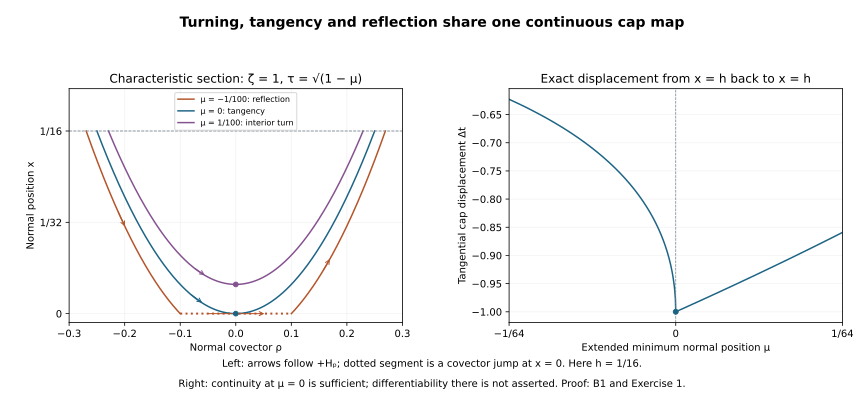

# Dirichlet diffraction on one open region

Independent exposition, proofs, exercises and illustration: GPT-6 Astra (OpenAI), Ultra, 9 October 2026. CC0-1.0.

A gain at one point, repeated on smaller neighborhoods, need not remove that point from the smooth wavefront set. We instead fix a geometric region and improve the order at every point of that region. The cutoffs and constants can depend on the order; the region and the final tester do not.

The antecedent is Lars Hörmander, *The Analysis of Linear Partial Differential Operators III*, approved Springer 2007 eBook, Section 24.4, especially the accessible-region argument on printed page 448 and the induction on pages 449–451. We retain complex matrix lower terms, the actual H1 solution and an L2 source that may be rough in the normal variable. The localized half-gain, [full incoming estimate](../20261009-incoming-support-estimate/incoming-root-estimates-on-the-full-support.md), [elliptic correction theorem](../20261009-elliptic-correction-regularity/elliptic-corrections-in-the-original-energy-norm.md), and volume and boundary reconstruction provide the exact earlier analytic components. The [proof map](proof-map.json) records their complete dependencies. Lebl's transitive proofs remain external; internal P514 closure of this export is not claimed.

## 1. The theorem and the common-region requirement

**B0. The Dirichlet receiving theorem.** Work in a compact coordinate patch of the half-space, with \(D=-i\partial\), finite component space \(\mathbb C^n\), and
\[
 P=D_x^2-R(x,z,D_z),\qquad
 \sigma_2(R)=r(x,z,\eta)I_n,\qquad p=\rho^2-r .
 \tag{DB1}
\]
The principal \(r\) is real and quadratic in \(\eta\); all smooth lower coefficients may be complex matrices. Suppose \(u\) is locally H1, \(Pu=f\in L^2\), and on an open conic parameter region \(W\), with \(\eta\ne0\),
\[
 \chi f\in L^2_xH^m_z\quad(\text{every }m\in\mathbb R),
 \qquad
 \chi(0)\gamma u\in H^m_z\quad(\text{every }m\in\mathbb R)
 \tag{DB2}
\]
for every scalar proper tangential order-zero test \(\chi\) compactly supported there. Boundary cutoffs in the second assertion are supported in \(W\cap\{x=0\}\). All actual lower terms and cutoff remainders remain. At \(a=(0,z_*,\eta_*)\), assume
\[
 r(a)=0,\qquad r_x(a)>0 .
 \tag{DB3}
\]
Assume a point of the short negative-normal interior characteristic germ through \(a\) is ordinarily regular for \(u\), with the intervening projection contained in \(W\). Choose an open regular cap \(\Gamma\) on a small interior slice around that point. Source regularity in (DB2) implies ordinary source smoothness at every finite-normal covector with nonzero tangential component, so ordinary matrix propagation permits this choice along the germ.

We prove that a fixed open parameter neighborhood \(W_0\) of \(a\) has
\[
 \chi u\in\mathcal X_s\quad\text{for every real }s
 \quad\text{and every such }\chi\text{ with support in }W_0,
 \qquad
 \|v\|_{\mathcal X_s}^2
   =\|\Lambda^sv\|_2^2+\|\Lambda^{s-1}D_xv\|_2^2 ,
 \quad \Lambda=\langle D_z\rangle .
 \tag{DB4}
\]
Thus one fixed smaller compressed neighborhood has every H1-based compressed order. This is a Dirichlet statement with microlocally smooth value data, including zero data. It does not replace a Neumann or Robin condition by a value condition.

## 2. Fix the accessible region before choosing an order

**B1. Geometry through a transverse reflection or a strict tangency.** Shrink a normalized coordinate box so that \(r_x\ge c|\eta|^2>0\), tangential covector lengths remain comparable on the short flow segments, and the box and all needed arcs project inside \(W\). For the full Hamilton flow,
\[
 \dot x=2\rho,\qquad \dot\rho=r_x,\qquad
 \ddot x=2r_x>0 .
 \tag{DB5}
\]
The normal coordinate is strictly convex along each extended short characteristic. A negative branch followed backward goes into the interior and meets the regular slice transversely. ISE:I1 proves that its entire nearby family meets \(\Gamma\), with the full intervening path inside the source region.

For the positive branch, follow the extended smooth flow backward. There are three local cases. Its minimum normal coordinate \(\mu\) can be positive, zero or negative. For \(\mu>0\), it turns in the interior and continues to the negative branch. For \(\mu=0\), it touches the boundary at the unique strict glancing point. For \(\mu<0\), the positive branch meets the face transversely before reaching its extended minimum. At that face replace \(\rho\) by \(-\rho\), keeping the base point and tangential covector, and continue backward on the negative branch. This is the exact root reflection for (DB1).

We justify the continuity needed at \(\mu=0\). The equation \(\rho=0\) is transverse to the extended flow by (DB5). The smooth implicit-function theorem therefore supplies a smooth minimum section and a smooth minimum time for all nearby full covectors. Write the normal coordinate along a trajectory, with time centered at its minimum, as
\[
 x(t)=\mu+t^2 b(t),\qquad
 b(t)=\int_0^1(1-v)x''(vt)\,dv,\qquad 0<c_1\le b\le c_2 .
 \tag{DB6}
\]
All parameters of the initial covector are retained in \(b\). The bounds hold on one compact normalized box. A boundary hit when \(\mu<0\) has \(|t|\le\sqrt{|\mu|/c_1}\); its normal covector is \(O(\sqrt{|\mu|})\). Therefore both its location and the reflected covector approach the minimum covector as \(\mu\uparrow0\). Smooth flow dependence after that hit, followed by the transverse intersection with the fixed interior slice, proves continuity of the broken hitting map at tangency. For \(\mu>0\) it is the ordinary smooth flow. No differentiability of the broken hitting time at \(\mu=0\) is asserted.

Define \(W_0\) locally as follows. A parameter point with \(r\ge0\) belongs to \(W_0\) when each characteristic lift
\[
 (x,z;\pm\sqrt{r(x,z,\eta)},\eta)
 \tag{DB7}
\]
is reached from \(\Gamma\) by one of these short paths, staying over \(W\), with at most one transverse reflection or one tangency. Include the nearby \(r<0\) points, which have no real lifts. Use the chosen small flow box for these paths. Transverse hitting, the continuity just proved, and continuity of the roots at \(r=0\) show that \(W_0\) is relatively open and contains \(a\). To check openness with the entire-path condition, cover the compact path by finitely many open sets whose closures project inside \(W\); continuous nearby paths stay in their union, and their cap endpoint remains in the open set \(\Gamma\). Positive homogeneity gives an open conic region after removing the normalization.

Two properties of this definition will be used. Every negative lift over \(W_0\) is reached without a reflection. Any positive lift whose backward path touches a boundary glancing point \(b\) has \(b\in W_0\): the path from \(\Gamma\) to that point is a subpath, and its two lifts coincide. A broken path has at most one boundary event, since \(\rho\) increases along the short ordinary pieces and changes from negative to positive at a forward reflection. These properties prevent the induction from asking for regularity at a glancing point outside its region.

## 3. The elliptic boundary step on the actual rough domain

**B2. A full derivative at a boundary point where \(r<0\).** Fix \(s\ge1\), and assume the local input property
\[
 \chi u\in\mathcal X_s
       \quad\text{for all compactly supported tangential tests in }W_0 .
 \tag{DB8}
\]
Near a boundary parameter point with \(r<0\), we prove \(\chi u\in\mathcal X_{s+1}\) on a smaller neighborhood. Only the data (DB2), the actual H1 domain and (DB8) are used.

Choose an inner scalar tangential cutoff \(A\), with normal support in a small collar and full symbol supported in that elliptic cone, and an outer cutoff controlling its support and all derivatives. Put \(v=Au\), periodically embedded in a larger tangential chart and extended by zero past its compact positive normal support. Its complete equation is
\[
 P v=A f+[P,A]u,\qquad
 [P,A]u=-2iA_xD_xu-A_{xx}u-[R,A]u .
 \tag{DB9}
\]
The scalar principal symbol makes \([R,A]\) order one. Outer factorization and (DB8) put the right side in \(L^2_xH^{s-1}_z\); tangentially smoothing remainders act on the original H1 input and need not be smooth in \(x\). They have every required tangential order, which is sufficient here.

Extend the full tangential coefficients to the globally elliptic cylinder used in EW:P2–P4, retaining the leading normal coefficient \(I_n\). In this case the construction is especially direct: on a narrow cone combine \(-r\) with a frozen positive multiple of \(|\eta|^2\), retaining all lower matrix terms by smooth cutoffs. The full principal polynomial stays uniformly positive scalar for real normal frequency. The stable principal Cauchy space consists of
\[
 (h,i\sqrt{-r_0}\,h),\qquad h\in\mathbb C^n ,
 \tag{DB10}
\]
so Dirichlet evaluation is a bijection on it. The exact compact-chart quantization and its full residuals are those of EW:P2–P4. Denote the auxiliary polynomial by \(P_e\). Since its top normal coefficient is still \(I_n\), \((P_e-P)A\) is tangentially smoothing, with no second normal derivative. Thus the actual auxiliary forcing and datum satisfy
\[
 F_e=P_ev\in L^2_xH^{s-1}_z,\qquad
 g_e=\gamma v=A(0)\gamma u\in H^\infty .
 \tag{DB11}
\]
All tangential inputs on the auxiliary compact boundary are included.

We first reach a legitimate domain for the volume reconstruction. The actual \(v\) is H1 and \(D_x^2v=R_ev+F_e\in L^2_xH^{-1}_z\). The restriction-space normal recovery MH:R1–R2, with the pure normal polynomial \(D_x^2\), gives
\[
 v\in\overline H_{(2,-1)} .
 \tag{DB12}
\]
This is the one-step normal recovery proved in EW:L3; its Fourier weights are \(q^2\lambda^{-1}\), with \(q=\langle(\rho,\eta)\rangle\). It does not use zero extension as a bounded positive-order extension. The actual trace agrees with the H1 trace by the mixed trace identification.

Use the exact left identity VB16, at normal index two:
\[
 v=\Phi F_e+\Lambda_D g_e+\mathscr Kv,\qquad
 \Phi:L^2_xH^t_z\longrightarrow\overline H_{(2,t)},\qquad
 \mathscr K:\overline H_{(2,t)}
                   \longrightarrow\overline H_{(3,t)}
                   \subset\overline H_{(2,t+1)} .
 \tag{DB13}
\]
Here \(\Lambda_D\) is VB's Dirichlet layer, not the tangential Fourier multiplier. Its arbitrary real output split maps the smooth \(g_e\) into every displayed target. The left error has only its proved one-order gain; it has not been called smoothing. The last inclusion follows from \(q\ge\lambda\), and holds after taking restriction infima.

The first two terms of (DB13) belong to \(\overline H_{(2,s-1)}\). Starting at \(t=-1\), the same distributional identity improves the tangential index to \(\min(t+1,s-1)\). A finite number of repetitions reaches \(s-1\), including a fractional last step by embedding. No new source is formed during this repetition. Finally
\[
 \overline H_{(2,s-1)}\subset\mathcal X_{s+1},
 \quad
 \lambda^{s+1}\le q^2\lambda^{s-1},\qquad
 |\rho|\lambda^s\le q^2\lambda^{s-1}.
 \tag{DB14}
\]
Derivative restriction and the infimum over extensions prove the second component as well. Thus the elliptic boundary step applies to the original rough normal source, without an unproved membership in the intrinsic smooth-source class.

## 4. A transverse boundary point has every tangential order

**B3. Use the value datum after the incoming factor.** Let \(b\in W_0\cap\{x=0,r>0\}\). Its negative germ comes from \(\Gamma\), so it is ordinarily regular by interior propagation and (DB2). On a sufficiently small closed hyperbolic collar, ISE:I0–I6 construct a full positive root \(A_+\) and prove
\[
 \phi(D_x-A_+)u\in L^2_xH^m_z
                      \quad\text{for every }m
 \tag{DB15}
\]
for all smaller tests in that collar. More explicitly, the geometric incoming-tube and matrix-factor constructions in ISE apply here with a positive root gap; the tangency part of its geometry is unnecessary. The family of negative lifts meets \(\Gamma\) by B1 and transversality. One may choose the root on the union of the incoming tubes and the short collar used below.

Put \(L_+=D_x-A_+\). Transport a scalar boundary cutoff by this positive-root evolution. The complete matrix construction ISE:I3, with the sign of its real scalar root changed, gives a proper matrix family \(Q_+\), elliptic on a smaller outgoing tube, with
\[
 [L_+,Q_+]\in C^\infty_x\Psi^{-\infty}_{\rm tan},
 \qquad Q_+(0)=Q_0 .
 \tag{DB16}
\]
Its matrix commutator, all lower corrections and exact initial operator are retained. Set \(h=Q_+u\). Then
\[
 L_+h=Q_+L_+u+[L_+,Q_+]u,\qquad
 h(0)=Q_0\gamma u .
 \tag{DB17}
\]
The right side is \(L^2_xH^m_z\) for every \(m\), by (DB15) on its entire support. The actual initial trace is smooth by (DB2). The exact oriented evolution and weak uniqueness proof ISE:I4 now give \(h\in C_xH^m_z\) for every \(m\). Its equation gives \(D_xh\in L^2_xH^{m-1}_z\). Full tangential division by \(Q_+\), including its normal derivative and its smoothing errors on \(u,D_xu\), proves all \(\mathcal X_m\) orders on a smaller collar. Thus the complete matrix Dirichlet reflection step is available on the actual H1 domain. It does not invoke a scalar reflection theorem for a matrix lower-order system.

## 5. Recover a tangential norm from interior propagation

**B4. Account for the large normal frequencies.** Fix an interior parameter point in \(W_0\), and retain (DB8). Let \(q=s+1/2\). Suppose ordinary microlocal H\(^{q}\) regularity of \(u\) is known at every characteristic lift over that point. We prove a tangentially localized \(\mathcal X_q\) norm near it.

First, a compactly based ordinary operator \(B\) of order \(-k\), \(k\ge0\), has the anisotropic bound
\[
 B:L^2_xH^t_z\longrightarrow L^2_xH^{t+k}_z
                  \quad(t\in\mathbb R).
 \tag{DB18}
\]
Here is a direct proof for the needed full-frequency operators. For its left symbol, Fourier transformation in the compact base gives a kernel bounded by
\[
 |\widehat b(\zeta-\zeta',\zeta')|
       \le C_N\langle\zeta-\zeta'\rangle^{-N}
                            \langle\zeta'\rangle^{-k},
 \qquad \zeta=(\rho,\eta).
 \tag{DB19}
\]
Multiplying by \(\langle\eta\rangle^{t+k}\langle\eta'\rangle^{-t}\), the tangential Peetre inequality bounds the resulting factor by a fixed power of \(\langle\zeta-\zeta'\rangle\): indeed
\(\langle\eta\rangle^{t+k}/\langle\eta'\rangle^{t+k}\)
costs at most \(\langle\eta-\eta'\rangle^{|t+k|}\), and
\(\langle\eta'\rangle^k\le\langle\zeta'\rangle^k\).
Choose \(N\) larger than this power plus the full dimension and apply the two Schur integrals. Compact input cutoffs and smoothing proper-kernel terms satisfy the same estimate. Truncation followed by the uniform bound identifies the actual operator on L2-based distributions. In particular \(D_xB\) has the same bound with \(k-1\) when \(k\ge1\).

Choose a scalar tangential cutoff \(\chi\) supported away from the face and inside \(W_0\), and set \(v=\chi u\). Its full-space equation, after a slightly larger compact localization, has
\[
 Pv=\chi f+[P,\chi]u\in L^2_xH^{s-1}_z .
 \tag{DB20}
\]
As in (DB9), this includes both normal derivatives of \(\chi\) and the full matrix commutator. Choose \(C\) so large that \(p\) is elliptic where \(|\rho|\ge C\langle\eta\rangle\). A full ordinary matrix parametrix with a high-normal output cutoff gives
\[
 E_{\rm hi}v=B_{-2}Pv+Sv,\qquad B_{-2}\in\Psi^{-2},
 \quad S\in\Psi^{-\infty},
 \tag{DB21}
\]
on a smaller base patch. Complete symbol recursion and proper off-support estimates give the displayed smoothing remainder, including the derivatives of all enlarged cutoffs. Formula (DB18) and (DB20) put this high-normal piece in \(\mathcal X_{s+1}\).

The remaining normalized frequencies have \(|\rho|\le2C\langle\eta\rangle\). Source regularity (DB2) implies ordinary smoothness of \(f\) on this finite-normal cone: all compact tangential derivatives are L2, hence L1, and their Fourier estimates decay arbitrarily in \(\eta\), which is comparable to the full frequency on that cone. The ordinary elliptic parametrix makes \(u\) smooth at its noncharacteristic points. At its characteristic points use the assumed H\(^{q}\) regularity. Compactness of the normal interval and openness of ordinary H\(^{q}\) regularity give one slightly smaller parameter patch with
\[
 E_{\rm lo}v\in H^q,\qquad E_{\rm lo}=I-E_{\rm hi}
                \quad\text{on the smaller patch}.
 \tag{DB22}
\]
Separated cone remainders are fully smoothing by the ordinary calculus. For \(q\ge1\), the weights \(\lambda^q\) and \(|\rho|\lambda^{q-1}\) are bounded by a constant times \(\langle(\rho,\eta)\rangle^q\), so this piece is in \(\mathcal X_q\). Combining (DB21)–(DB22) proves the claimed local norm. This step neither discards pure normal frequencies nor assumes that the rough normal source is ordinarily smooth there.

Conversely, a tangential \(\mathcal X_q\) norm implies ordinary H\(^{q}\) regularity on every smaller finite-normal cone: insert its full-frequency cutoff and use \(\langle(\rho,\eta)\rangle^q\lesssim\langle\eta\rangle^q\) there. Tangential elliptic division and separated-frequency estimates transfer this assertion from an elliptic tangential tester to the original \(u\).

## 6. Improve the order throughout the same region

**B5. Induction over the whole open set.** Define the statement
\[
 \mathsf P(s):\quad
   \chi u\in\mathcal X_s
   \text{ for every scalar proper test compactly supported in }W_0 .
 \tag{DB23}
\]
The actual H1 input proves \(\mathsf P(1)\). Assume \(\mathsf P(s)\) for \(s\ge1\).

At every boundary glancing parameter point in \(W_0\), B1 supplies a regular negative germ. The same source and value-data hypotheses hold there, and \(r_x>0\). Choose a small parameter neighborhood contained in \(W_0\). ISE proves the full incoming norms on both SDC supports, after the damping constant for this \(s\) has been fixed. LG:L0–L6 therefore give an elliptic tangential tester with \(\mathcal X_{s+1/2}\) output at that point. The chosen tester and its support may depend on both the point and \(s\).

At a boundary elliptic point, B2 gives the stronger \(\mathcal X_{s+1}\) result. At a boundary hyperbolic point, B3 gives every tangential order. Thus each boundary point of \(W_0\) has a neighborhood on which the desired \(\mathcal X_{s+1/2}\) localization holds.

Consider an interior characteristic lift over \(W_0\), and follow its B1 path backward to \(\Gamma\). If there is no boundary event, ordinary matrix propagation gives smoothness along the entire path. A transverse event is passed using B3: on its outgoing germ \(u\) is ordinarily smooth by the last paragraph of B4, and propagation supplies the rest of the path. If the event is a tangency, it is a boundary glancing point of \(W_0\) by B1. Its just-proved local gain gives ordinary H\(^{s+1/2}\) regularity at a nearby positive interior point of the outgoing arc. Ordinary real-principal matrix propagation carries that finite order to the chosen lift; the intervening compact arc is interior and its source is smooth. The incoming side is already smooth from \(\Gamma\). All characteristic lifts are therefore H\(^{s+1/2}\). B4 supplies a local \(\mathcal X_{s+1/2}\) tester at each interior parameter point, including points with no real lift.

Finally take any test \(\chi\) with compact normalized support in \(W_0\). The neighborhoods just obtained form an open cover of that compact set. Choose a finite subcover and a conic partition subordinate to it. Full tangential elliptic parametrices express \(\chi u\) as a finite sum of order-zero operators applied to the locally controlled outputs, plus a tangentially smoothing family on the original H1 input. Differentiating this identity in \(x\) adds the order-zero derivatives of the coefficients and the smoothing derivative; all are bounded in the required \(L^2H^{s-1/2}\) space. Thus
\[
 \mathsf P(s)\Longrightarrow\mathsf P(s+1/2),
 \qquad \mathsf P(1+j/2)\quad(j=0,1,2,\ldots).
 \tag{DB24}
\]
Monotonicity of the Sobolev weights proves (DB4) for every real \(s\).

The quantifiers matter. Every induction step proves regularity at *all* points of the same \(W_0\). Only then is a compact target covered. There is no infinite intersection of progressively smaller neighborhoods of \(a\), and no uniform bound in \(s\), in the number of local patches, or in the damping constant has been assumed.

## 7. Return to the original compressed energy front

**B6. One compressed neighborhood for every energy order.** Choose a fixed tangential cutoff \(\chi\) supported in \(W_0\) and equal to one on a larger neighborhood of \(a\). Fix a small compressed cone
\[
 O_b:\quad x\ge0,\quad (x,z,\eta)\text{ in that inner region},
                 \qquad |\sigma|<c\langle\eta\rangle,
 \quad \sigma=x\rho .
 \tag{DB25}
\]
At high frequency the inhomogeneous bracket can be replaced by \(|\eta|\). Take its base support small enough that the full compact input of every chosen strong kernel lies inside the normal plateau of \(\chi\). The strong ratio cutoff may be fixed near input/output normal ratio one. All later order-\(m\) testers have microsupport in the same slightly larger compressed cone and are elliptic on \(O_b\).

The full compressed composition theorem gives, for such a tester \(T\) of order \(m\ge0\),
\[
 \|Tu\|_{H^1}
     \le C_{T,\chi}\bigl(\|\chi u\|_{\mathcal X_{m+1}}
                                      +\|u\|_{H^1(K)}\bigr)
 \tag{DB26}
\]
with a fixed larger compact input set \(K\). We spell out the order comparison. On its cone, the compressed frequency norm \(\langle(\sigma,\eta)\rangle\) is bounded by a constant times \(\langle\eta\rangle\). Complete composition with a tangential order reducer therefore puts \(T\Lambda^{-m}\) in the strong order-zero class. All product remainders have the same or lower order, since differentiated cone cutoffs stay in a slightly larger cone. The strong L2 bound then controls \(Tu\) by the tangential \(m\)-norm. Applying \(D_z\) costs one order.

For the unweighted normal derivative retain the exact normal commutator from LB:A1 and LB:H1:
\[
 D_xTu=T D_xu+E_Tu+N_TD_xu,\qquad
 \operatorname{ord}E_T=m,\quad
 \operatorname{ord}N_T=m-1 .
 \tag{DB27}
\]
The term \(N_TD_xu\) is essential. The same order-reducer argument controls the three terms by the \(\mathcal X_{m+1}\) norm. To insert \(\chi\), use the full compressed/tangential composition with its plateau on the complete kernel input region. Outside its tangential microsupport the separated-frequency remainder belongs to every negative compressed order. Its full normal commutator has precisely the same two types as (DB27), so it maps the original compact H1 input to H1. The low-frequency and proper kernel terms have these bounds as well. This proves (DB26) for the actual operators, rather than for their principal symbols alone.

Choose a fixed order-zero elliptic test on \(O_b\) and multiply it by the complete compressed order reducers of every integer order. Formula (DB4) and (DB26) prove every compressed H1 order throughout \(O_b\), independently of the order. Equivalently no finite-order energy front meets \(O_b\); its smaller closure misses the closure of their union. This is the smooth-front criterion of IP:A1 and the compressed regularity theorem.

**B7. The original weak Dirichlet problem and both tangent germs.** Start with the original smooth-coefficient finite matrix weak problem in \(V=H^1_0\), with real scalar principal symbol and all lower terms, including derivatives on the test function, and the actual natural-dual forcing. Suppose its smooth source front is absent on the relevant open compressed region. BPL supplies the actual boundary-preserving H1 representative \(U\) with \(PU=F\in L^2\); the representative has the same indicated energy front. NR:N8 removes the normal first-order coefficient by its full smooth matrix gauge, preserving the Dirichlet value.

Use the actual correction of LG:L7 and ECR:M7:
\[
 Z=r_+QE e_+F,\qquad W=U-Z .
 \tag{DB28}
\]
Then \(W\) is H1, \(PW\) satisfies (DB2) on one fixed parameter neighborhood, and its value trace is microlocally smooth. The correction is ordinarily regular near the characteristic set, and is regular in every original compressed H1 order on one fixed neighborhood. Hence an ordinarily regular incoming germ of the original solution gives the germ required for \(W\). Apply B0–B6 to \(W\). Adding \(Z\), and then undoing the exact source representative and matrix gauge, proves absence of the original smooth Dirichlet energy front at the strict anchor. For the \(H^1_0\) norm the actual boundary value is zero: the domain-preserving compressed tests have boundary action on \(\gamma U=0\), so their H1 outputs belong to \(H^1_0\). A smooth nonzero trace of \(W\) alone is not used as a zero trace.

The other tangent germ follows without a selfadjointness assumption. Complex conjugation sends \((u,f,P)\) to \((\overline u,\overline f,\overline P)\), with \(D\) changed to \(-D\) in the complete differential expression. Because the principal polynomial is quadratic, its value at the reversed full covector is unchanged. All lower matrices are conjugated with their correct derivative signs and remain in the admitted class. The outgoing positive-normal germ becomes a negative-normal germ at tangential covector \(-\eta_*\). The actual Dirichlet domain and natural-dual equation conjugate together; for the functional use the conjugate of its value on the conjugate test. The just-proved assertion therefore applies to that germ as well.

Consequently, writing \(F_D=\operatorname{WF}^{H^1_0,\infty}_b(u)\) in the original source-regular region and \(q\) for a strict diffractive point,
\[
 q\in F_D\quad\Longrightarrow\quad
   \pi\!\left(\exp(tH_p)\widetilde q\right)\in F_D
                          \quad (|t|<\epsilon),
 \tag{DB29}
\]
after the exact normal-form coordinate and nonzero parameter changes. For each punctured side, a regular point would contradict the corresponding germ theorem; the central point is the hypothesis. Shrink \(\epsilon\) once so the whole arc stays in the source region. This supplies the strict diffractive singular-segment input for the Dirichlet domain. The Neumann/Robin boundary form, full two-domain propagation theorem, sharp Airy mapping and remaining course obligations are not declared complete.

## 8. Three solved exercises

### Exercise 1. A continuous hitting map with a square-root corner

Take \(p=\rho^2-[x\zeta^2+\tau^2-\zeta^2]\), coordinates \((x,t,y;\rho,\tau,\zeta)\), and \(\zeta=1\). Put \(\mu=1-\tau^2\) and \(h=1/16\). Compute the path between its incoming and outgoing hits of \(x=h\), allowing a reflection when \(\mu<0\).

**Solution.** Hamilton's equations give \(\dot\rho=1\), \(\dot x=2\rho\), \(\dot t=-2\tau\), and \(\dot y=2(1-x)\). With \(\rho\) as parameter,
\[
 x=\mu+\rho^2,\quad
 t=t_c-2\tau\rho,\quad
 y=y_c+2(1-\mu)\rho-\tfrac23\rho^3 .
 \tag{DB30}
\]
For \(\mu\ge0\), the physical path runs from \(\rho=-a\) to \(a\), \(a=\sqrt{h-\mu}\). For \(\mu<0\), put \(b=\sqrt{-\mu}\): the two physical pieces are \([-a,-b]\) and \([b,a]\), with the base coordinates continued continuously across reflection and the normal covector jumping from \(-b\) to \(b\). The reflection is not an ordinary Hamilton interval. Set \(b=0\) when \(\mu\ge0\). The complete tangential increments are
\[
 \Delta t=-4\sqrt{1-\mu}\,(a-b),\qquad
 \Delta y=4(1-\mu)(a-b)-\tfrac43(a^3-b^3).
 \tag{DB31}
\]
Both are continuous at zero because \(b\to0\), although the derivative of the square-root term from the negative side diverges. This is the continuity used in B1. At \(\mu=0\), the minimum is the boundary tangency; at \(\mu>0\) it is an interior turn. Every value used in the figure has \(|\mu|\le1/64<h\).

### Exercise 2. A finite error is enough for a tangential gain

In B2 let \(s=9/4\). Starting only with \(\overline H_{(2,-1)}\), list the indices obtained from the exact identity and identify the final \(\mathcal X\) order.

**Solution.** The data term has order \((2,s-1)=(2,5/4)\). The left error gains one ordinary order and hence one tangential order while keeping the ordinary index two. The successive tangential indices are
\[
 -1,\quad 0,\quad 1,\quad 5/4 .
 \tag{DB32}
\]
Thus three uses of the same identity give \(\overline H_{(2,5/4)}\subset\mathcal X_{13/4}\). The third use is an embedding of the error's available index two into the requested index \(5/4\), not an assumption of a fractional symbolic expansion. This stronger elliptic gain contains the \(\mathcal X_{11/4}\) order needed by the global half-step.

### Exercise 3. Every finite order at a point is insufficient

Construct an L2 function which belongs to H\(^{m}\) on some neighborhood of zero for every fixed integer \(m\), but is not smooth on any neighborhood of zero.

**Solution.** Let \(x_n=2^{-n}\), \(r_n=2^{-n-3}\), \(n\ge1\), and choose a nonnegative smooth cutoff \(\psi\), supported in \((-1,1)\) and equal to one near zero. The intervals \((x_n-r_n,x_n+r_n)\) are pairwise disjoint. Put
\[
 f_n(x)=\psi((x-x_n)/r_n)|x-x_n|^{n+1/2},\qquad
 a_n=\frac{2^{-n}}{1+\max_{0\le j\le n}\|D^jf_n\|_2},
 \qquad v=\sum_{n\ge1}a_nf_n .
 \tag{DB33}
\]
For \(j\le n\), the local power after differentiation is at least \(1/2\), so the indicated derivatives are L2. The cutoff derivatives are supported away from the center and are smooth. Hence \(a_n>0\), and the series converges in L2 with summable norms. For fixed \(m\), its tail \(n\ge m\) converges in H\(^{m}\), since every derivative norm through \(m\) is bounded by \(2^{-n}\). Choose a neighborhood of zero excluding the finitely many earlier supports; on it \(v\) equals that tail. This proves the finite-order claim, including distributional differentiation by convergence.

Near \(x_n\), all other summands vanish and \(v=a_n|x-x_n|^{n+1/2}\). Its derivative of order \(n+1\) is a nonzero multiple of a one-sided power \(|x-x_n|^{-1/2}\), so it is neither bounded nor locally L2. Thus \(v\) is not smooth in any neighborhood of zero, and it is not H\(^{n+1}\) at \(x_n\). These points accumulate at zero. This is why the closure of the union of finite-order fronts cannot be replaced by their union, and why B5 proves the same-region assertion before using B6.

## 9. Exact geometry of the common region

**F0. Coordinates and interpretation.** The left panel plots \(x=\mu+\rho^2\) for \(\mu=-1/100,0,1/100\), restricted to \(0\le x\le1/16\). Arrows follow increasing \(\rho\), the positive Hamilton orientation in Exercise 1. The dotted boundary segment for \(\mu<0\) is the covector jump at reflection; it is not a base path or an ordinary Hamilton arc. The right panel plots the exact \(\Delta t\) in (DB31) for \(-1/64\le\mu\le1/64\). It shows continuity of the full cap displacement across tangency, with no claim of differentiability there. The omitted \(y\)-increment is explicitly retained in (DB31). The [figure generator](figures/build_figure.py) preserves the constants and formulas.
