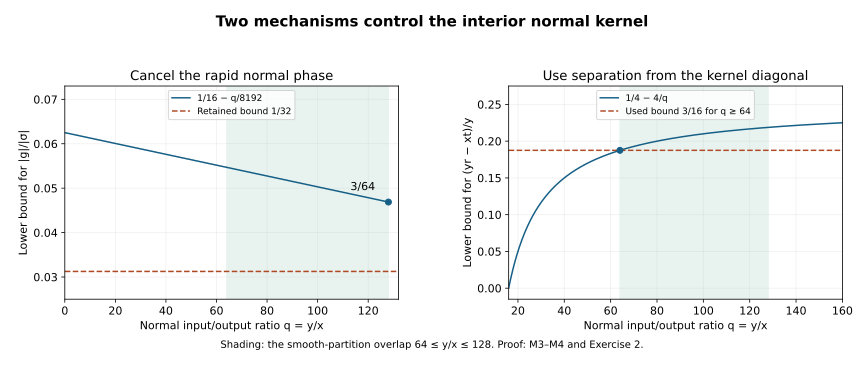

# Elliptic corrections in the original boundary energy norm

Original exposition, proofs, exercises and illustration: GPT-6 Astra (OpenAI), Ultra, 9 October 2026. CC0-1.0.

Subtracting a normal elliptic correction prepares a smooth tangential forcing term, but a propagation argument must eventually return to the original solution. This lesson proves that the correction has every compressed Sobolev order in the original H1 energy norm. Its proof controls the interior kernel on the whole shrinking collar; smooth boundary traces alone do not supply that control.

Use \(D=-i\partial\), \(x\ge0\) normal, \(z\in\mathbb R^d\) tangential, and Lebesgue measure \(dx\,dz\). Bundle matrices are allowed throughout. The [incoming-trace proof](../20261009-incoming-boundary-traces/incoming-field-boundary-traces.md) supplies the normal Fourier profile estimates; the zero-extension proof supplies the exact source split. The [local compressed calculus](../20261005-local-boundary-calculus/boundary-tests-and-lacunary-symbols.md), its [bounds](../20261005-local-boundary-calculus/boundary-bounds-and-conormal-action.md), and [ordered composition](../20261005-global-boundary-operators/global-boundary-operator-calculus.md) supply the actual testers and remainders. The localized diffraction estimate, especially LG:L7, is the receiving application.

Mathematical antecedent: Lars Hörmander, *The Analysis of Linear Partial Differential Operators III*, approved 2007 eBook, Section 24.4, the reduction and estimates on printed pages 448–449. The compressed regularity and original-energy transfer below are proved here from the exact earlier programme components; no book citation replaces a proof. Transitive Lebl prerequisites remain external author-edition dependencies, so internal P514 closure of this export is not claimed.

## 1. The statement and the fixed neighborhoods

**M0. The interior mapping theorem.** Write \(e_+\) for zero extension and \(r_+\) for restriction to the positive half-space. Let \(F\) be compactly supported L2. Suppose it has every compressed L2 order on one fixed open conic neighborhood \(O\) of
\[
 b=(0,z_0;\sigma=0,\eta_0),\qquad \eta_0\ne0.
 \tag{EC1}
\]
Precisely, every proper compressed tester of finite order with full microsupport compactly inside \(O\), after compact base localization, maps \(F\) into L2. Residual full symbols and their actual kernels are included in this convention. Let \(A\) be a properly supported ordinary matrix pseudodifferential operator, smooth across \(x=0\), of order \(m<-1/2\). Then there is one fixed smaller neighborhood \(O_1\) of \(b\), independent of the requested order, on which
\[
 r_+A e_+F\quad\hbox{has every compressed L2 order}.
 \tag{EC2}
\]
In particular, for an ordinary \(A\) of order minus two,
\[
 r_+A e_+F\quad\hbox{has every compressed order in H1 on }O_1.
 \tag{EC3}
\]
H1 here uses the unweighted normal derivative and all tangential derivatives. It is the actual half-space energy space, not the H1 space of the zero extension. No homogeneous boundary value is assumed or concluded in (EC3).

Choose the scalar, strongly supported compressed cutoff \(B\) of ZE:Z0. Its full microsupport is inside \(O\), and its full symbol is one modulo order minus infinity on a smaller base patch and tangential cone for \(|\sigma|\le3\delta\langle\eta\rangle\), with fixed \(0<\delta<1\). Put \(R=I-B\). Strong support means that the normal input/output ratio lies in \([1/2,2]\); an auxiliary smooth cutoff supported in \([1/4,4]\) may therefore be inserted in its exact kernel. The identity part is supported on ratio one. Full left-symbol conversion retains the residual terms. Thus the full symbol \(a_R\) is order zero, and is order minus infinity on that smaller low-\(\sigma\) region, with all derivatives.

Fix output testers \(C_N\), for each nonnegative integer \(N\), by the same strong-support construction from scalar symbols of order \(N\), elliptic near \(b\), supported at high frequency in a small tangential cone and
\[
 |\nu|\le\delta'\langle\theta\rangle,
 \qquad 0<\delta'\le\delta/16384.
 \tag{EC4}
\]
Their common elliptic region is fixed. Multiplying the normal kernel by the fixed ratio cutoff convolves the full symbol in \(\nu\); its tails outside a slightly larger cone are residual, as proved in LB:S4. We keep the original amplitude representation, including that cutoff, in the estimates below. Low total frequencies are residual compressed operators. Such residual output terms applied to the L2 function \(r_+Ae_+RF\) already have every compressed L2 order, by the full order-zero calculus.

Compact nested base cutoffs are chosen once. The input of \(A\) outside the larger base patch is separated from its small output patch, so its kernel there is smooth with all derivatives. On the compact L2 input it produces a smooth function with every ordinary derivative bounded. All its compressed orders are therefore L2, by M2 below. We may consequently insert an input cutoff into the larger patch where the stated low-\(\sigma\) residual property holds. It is retained in the amplitudes below. This also handles intermediate tangential base variables outside the chosen patch. None of these separations is asserted to make an actual remainder vanish.

## 2. A profile estimate with a moving center

**M1. The full ordinary profile.** In a local left quantization write the full symbol as \(a(x',z',\eta,\rho)\). Smooth proper-support cutoffs can remain as separate kernel factors. Define
\[
 k(x',z',\eta,s)=\frac1{2\pi}
       \int e^{-is\rho}a(x',z',\eta,\rho)\,d\rho,
 \qquad \lambda_\eta=\langle\eta\rangle.
 \tag{EC5}
\]
Partial Plancherel gives, for every finite collection of base and frequency derivatives and every integer \(j\ge0\),
\[
 \bigl\|(s\partial_s)^j
       \partial_{x',z'}^\beta\partial_\eta^\alpha k
       \bigr\|_{L^2_s}
 \le C_{j\alpha\beta}\lambda_\eta^{m+1/2-|\alpha|}.
 \tag{EC6}
\]
Indeed \(s\partial_s\) corresponds to \(-\partial_\rho(\rho\,\cdot)\), which preserves order \(m\). The squared frequency bound is the convergent integral of \((\lambda_\eta^2+\rho^2)^{m-|\alpha|}\); substituting \(\rho=\lambda_\eta v\) gives its exact scaling. This is IT:T1 with the ordinary output base point kept as a parameter. Uniform frequency regularization and its L2 limit justify the identity even when the integral in (EC5) is not absolutely convergent.

For fixed \(x>0\) and \(t,r\in[1/4,4]\), translation and scaling give
\[
 \|k(xt,z',\eta,yr-xt)\|_{L^2_{y>0}}
       \le r^{-1/2}C\lambda_\eta^{m+1/2}.
 \tag{EC7}
\]
It is enough to integrate over the entire real \(s\)-line after \(s=yr-xt\). Factors \(y^j\) are harmless on the fixed compact input set. Consequently the same estimate holds for \(y^j\partial_{x'}^j k\), with the derivative taken at fixed \(s\). All constants are uniform as \(x\downarrow0\).

## 3. The globally regular part of the source

**M2. Compressed derivatives of the good part.** The source hypothesis and the full symbol of \(B\) imply that every word in
\[
 V=xD_x,\quad D_{z_1},\ldots,D_{z_d}
 \quad\hbox{applied to }BF\hbox{ is L2}.
 \tag{EC8}
\]
Each such word composed with \(B\) is a tester of finite order supported inside \(O\), with its residual kernel retained. Multiplying by any of the fixed base cutoffs preserves (EC8).

These derivatives commute with zero extension in the distributional sense. For \(V\), test the weak derivative using a cutoff that removes \(0<x<\epsilon\). Its derivative error has the form \(x\chi'_\epsilon h\) on an interval of length at most \(2\epsilon\); paired with a bounded test it is bounded by \(C\sqrt\epsilon\|h\|_{L^2(0,2\epsilon)}\), which tends to zero. This proves the identity for \(h\) and \(Vh\) in L2; iteration applies to (EC8). Tangential derivatives commute immediately by their distributional definition.

The ordinary commutators, in left symbols, are
\[
 [V,A]=\operatorname{Op}\bigl(-ix\partial_xa
                                      +i\rho\partial_\rho a\bigr),
 \qquad [D_{z_j},A]=\operatorname{Op}(-i\partial_{z_j}a),
 \tag{EC9}
\]
modulo the actual smooth terms from proper cutoffs, which have the same bounds. Both preserve ordinary order \(m\). Repeated commutation therefore expresses each word applied to \(Ae_+BF\) as a finite sum of operators of order at most \(m<0\) applied to zero extensions of the L2 functions in (EC8). Ordinary Sobolev boundedness gives L2 for every word, also after restriction.

Here is why words suffice for arbitrary compressed tests. Relative to \(dx\,dz\), \(V^*=V-i\), and
\[
 E_b=1+V^*V+\sum_jD_{z_j}^2
 \tag{EC10}
\]
is a compressed elliptic differential operator of order two. On each fixed compact patch its principal symbol is \(\sigma^2+|\eta|^2\). The complete compressed parametrix of \(E_b^l\) expresses an order-\(N\) tester, for \(2l\ge N\), as an order-at-most-zero operator times \(E_b^l\), plus a residual, with all cutoffs included. Both operators are L2 bounded by the proved compressed calculus. A slightly larger base cutoff receives their proper kernels. Thus the word bounds give every compressed order of \(r_+Ae_+BF\). This argument also proves the smooth-kernel assertion used in M0.

## 4. Comparable normal distances

**M3. A vector field that cancels the ordinary normal phase.** It remains to bound \(C_Nr_+Ae_+RF\). Let \((x,z)\) be the output, \((x',z')\) the input of \(C_N\), \((u,w)\) the input of \(A\), and \((y,v)\) the input of \(R\). Set
\[
 x'=xt,\qquad u=yr.
 \tag{EC11}
\]
The two compressed kernel densities become \(dx'/x=dt\) and \(du/u=dr/r\). There is no remaining inverse power of \(x\) or \(y\) in the measure. Before normal Fourier inversion the full phase is
\[
 \begin{split}
 \Phi={}&(z-z')\cdot\theta+(z'-w)\cdot\eta
                       +(w-v)\cdot\zeta\\
       &+(1-t)\nu+(xt-yr)\rho+(1-1/r)\sigma.
 \end{split}\tag{EC12}
\]
Choose a smooth partition \(\psi(y/x)+(1-\psi(y/x))=1\), with \(\psi=1\) for \(y/x\le64\) and \(\psi=0\) for \(y/x\ge128\). This partition is differentiated only in \(t,r,z',w\), never in \(x\) or \(y\), in the present L2 estimate.

On the support of the first part the vector field
\[
 \mathcal V=(y/x)\partial_t+\partial_r
 \quad\hbox{satisfies}\quad
 \mathcal V\Phi=\sigma/r^2-(y/x)\nu=:g,
 \qquad \mathcal V(xt-yr)=0.
 \tag{EC13}
\]
Its coefficients are bounded by 128. For the near tangential-frequency region choose the partition sufficiently small that \(\langle\zeta\rangle\ge\langle\theta\rangle/2\), all three tangential frequencies are comparable, and the input direction remains in the prescribed larger cone. In the high-input region \(|\sigma|\ge\delta\langle\zeta\rangle\), equations (EC4) and (EC13) imply
\[
 |g|\ge |\sigma|/16-128\delta'\langle\theta\rangle
       \ge 3|\sigma|/64\ge |\sigma|/32.
 \tag{EC14}
\]
The signs of \(\sigma\) and \(\nu\) need not agree. This is the triangle inequality, not a sign restriction.

Use \((ig)^{-1}\mathcal V\) to integrate by parts in \(t,r\), with its full formal transpose acting on the amplitude. Each repetition supplies \(|\sigma|^{-1}\). Derivatives of \(g\) are bounded by constants times \(|\sigma|\); derivatives of its reciprocal satisfy the required inverse bounds. The compact ratio cutoffs remove endpoint terms. The derivative of \(dr/r\) is part of the differentiated amplitude.

Crucially, on the profile in (EC7) this field acts as
\[
 \mathcal V\,k(xt,z',\eta,yr-xt)
          =y\,(\partial_{x'}k)(xt,z',\eta,yr-xt)
          \quad\hbox{at fixed }s.
 \tag{EC15}
\]
It does not differentiate the rapid normal profile variable. The same identity can be applied before normal Fourier inversion, since the \(\rho\)-phase is exactly canceled in (EC13); this avoids any unjustified separate derivative of a merely L2 profile. Derivatives of \(a_R(yr,w,\zeta,\sigma)\) contribute \(y\partial_u\), which is uniformly bounded on the compact patch. Derivatives of the ordinary proper cutoffs contribute bounded factors as well. After any fixed number \(J\) of integrations, the resulting input-\(y\) L2 amplitude is bounded by
\[
 C_J\langle\theta\rangle^N
       \lambda_\eta^{m+1/2}|\sigma|^{-J}.
 \tag{EC16}
\]
All differentiated base and tangential-frequency versions needed below have the same estimate with the corresponding symbol orders. This is uniform down to the boundary.

## 5. Inputs farther from the boundary

**M4. Euler derivatives control the separated profile.** The second partition term is supported where \(y\ge64x\). For every retained \(t,r\),
\[
 s=yr-xt\ge y/4-4x\ge3y/16,
       \qquad s\le4y,
       \qquad y/s\le16/3.
 \tag{EC17}
\]
After the ordinary normal Fourier integral has been taken, the remaining normal phase is \((1-t)\nu+(1-1/r)\sigma\). Its \(r\)-derivative is exactly \(\sigma/r^2\). Integrate by parts with \(r^2(i\sigma)^{-1}\partial_r\).

A derivative of the profile now contributes \(y\partial_s\). This is safe precisely because of (EC17). For each integer \(j\), \(s^j\partial_s^j\) is the polynomial \(\prod_{h=0}^{j-1}(s\partial_s-h)\) in the Euler derivative. Hence
\[
 y^j\partial_s^j k=(y/s)^j
           \prod_{h=0}^{j-1}(s\partial_s-h)k.
 \tag{EC18}
\]
Equations (EC6), (EC7) and (EC17) bound the input-\(y\) L2 norm of every such term by \(C_j\lambda_\eta^{m+1/2}\). All derivatives of the other amplitudes, cutoffs and \(1/r\) are bounded as in M3. Thus (EC16) holds in this region too. This argument includes \(x\downarrow0\) with fixed positive input \(y\), and also the transition where both vanish. It never replaces the moving interior profile by its boundary value.

## 6. Integrate every frequency and identify the actual operator

**M5. Complete L2 kernel bounds.** We supply the frequency and limit details for M3–M4. The input variables \(y,v\), output base \(x,z\), and the intermediate bases \(z',w\) are confined to fixed compact sets. For a kernel amplitude its \(L^2_{y,v}\) norm is at most its uniform \(L^2_y\) bound times the square root of the finite \(v\)-volume. Minkowski's integral inequality then allows integration of these norms in \(t,r,z',w\) and all frequencies. This inequality follows directly by pairing the integral against a unit L2 function, applying Cauchy–Schwarz to each amplitude, and then using the Hilbert representation theorem; it does not require pointwise bounds on the rough source.

In the near-frequency part, \(\theta,\eta,\zeta\) have one common dyadic size \(\Lambda\ge1\). Split \(\sigma\) smoothly at \(\delta\langle\zeta\rangle\) and \(2\delta\langle\zeta\rangle\). The low part has an arbitrarily small factor \(\Lambda^{-L}\) from the full residual symbol of \(R\). The three tangential frequency volumes are bounded by \(C\Lambda^{3d}\), the \(\nu\)-volume by \(C\Lambda\), and the low \(\sigma\)-volume by \(C\Lambda\). Since \(m+1/2<0\), the profile norm is bounded above by a constant. The contribution is therefore at most
\[
 C_L\Lambda^{3d+2+N-L}.
 \tag{EC19}
\]
For the high part, (EC16) and \(\int_{|\sigma|\ge c\Lambda}|\sigma|^{-J}d\sigma\le C_J\Lambda^{1-J}\), \(J>1\), give the same bound with \(L\) replaced by \(J\). Choose the exponent larger than \(3d+2+N\); the sum over dyadic \(\Lambda\) converges.

In the complementary tangential-frequency part put \(S=1+|\theta|+|\eta|+|\zeta|\). At least one of \(|\eta-\theta|\) and \(|\zeta-\eta|\) is bounded below by a fixed positive multiple of \(S\). To see this, if both were a small fraction of \(S\), the three frequencies would be comparable and lie in the near part after enlarging its inner cutoff slightly. A smooth two-piece partition assigns the large difference. Integration in \(z'\) or \(w\), respectively, gives \(S^{-L}\) for any \(L\); the full differentiated amplitudes obey (EC6). Boundary terms vanish because of the proper compact cutoffs.

For \(|\sigma|\le2S\), the frequency volumes now give the bound (EC19) with \(\Lambda=S\), without needing the residual source property. For \(|\sigma|\ge S\), M3 has \(|(y/x)\nu|\le128\delta'S\), so \(|g|\ge |\sigma|/32\); M4 has the exact \(\sigma/r^2\) derivative. Apply an additional \(J\) normal integrations. The dyadic contribution is bounded by
\[
 C_{LJ}S^{3d+2+N-L-J}.
 \tag{EC20}
\]
Taking \(L,J\) large proves integrability of this entire part. Smooth overlapping cutoffs include the transition regions. All base differentiations used in the tangential integrations preserve the symbol estimates; the two normal arguments include every derivative falling on these cutoffs.

One may first insert smooth compact frequency cutoffs. A normal cutoff \(\chi(\rho/T)\) has uniformly bounded Euler derivatives \((\rho\partial_\rho)^j\), precisely the bounds used in (EC6). The integrations just described do not differentiate the other frequency cutoffs. Their bounds give uniform tails in the remaining frequency variables. Normal profile convergence is in L2 by Plancherel. Consequently the composed kernel has a genuine \(L^2_{y,v}\) limit, uniformly bounded for \((x,z)\) in its compact positive output patch. Integrating that bound over \((x,z)\) makes the kernel Hilbert–Schmidt. In particular,
\[
 \|C_Nr_+Ae_+RF\|_{L^2}
          \le C_N\|F\|_{L^2}.
 \tag{EC21}
\]
This is a bound for the bad-source term; the constants may depend on \(N\), the fixed cutoffs and finitely many symbol seminorms.

On smooth inputs compactly supported in the open half-space the regularized kernel limit agrees with ordinary and compressed quantization, by their oscillatory integral definitions. Such inputs are dense in L2. Both \(R\) and \(A\) are L2 bounded, zero extension is isometric, and restriction is bounded. The output \(C_N\) acts continuously on distributions on the interior; its adjoint on an interior compact test has normal support bounded away from zero, by strong support. Thus the L2 kernel limit agrees distributionally with the actual composed operator on every L2 input. This proves (EC21) for the specified actual representatives, not a separately selected extension.

Combine (EC21) with M2. Every \(C_Nr_+Ae_+F\) is L2. To pass from these chosen testers to every tester on a fixed smaller \(O_1\), use the full compressed elliptic division for \(C_M\), choosing \(M\) at least the order of the desired tester. The quotient has order at most zero and the remainder is residual, both acting on an L2 input with fixed proper support. The elliptic regions of all \(C_M\) were chosen the same in M0. This proves (EC2) on one common neighborhood for all orders.

## 7. Recover the unweighted normal derivative and the original front

**M6. The H1 conclusion.** Now let \(A\) have ordinary order minus two and put \(Z=r_+Ae_+F\). The full ordinary operators \(D_xA\) and \(D_{z_j}A\) have order minus one, including their differentiated matrix coefficients and proper cutoffs. All satisfy the strict threshold in M0. By M5, \(Z,D_xZ,D_{z_j}Z\) have every compressed L2 order on the same smaller neighborhood; a finite intersection supplies one neighborhood for this finite list.

For a compressed tester \(T\) supported in a further smaller fixed neighborhood, the exact normal commutator has the form proved in the local calculus:
\[
 D_xTZ=T D_xZ+E_TZ+N_TD_xZ,
 \qquad E_T\in\Psi_b^{\operatorname{ord}T},\quad
 N_T\in\Psi_b^{\operatorname{ord}T-1}.
 \tag{EC22}
\]
The full microsupports of the two coefficients remain in that of \(T\), modulo residual terms. Tangential commutation has only the coefficient derivative of the same order. Every term on the right is L2 by (EC2). Residual terms are also L2: \(Z\) and all its first derivatives are globally L2 since \(Ae_+F\in H^2\). Thus \(TZ\) and all its unweighted weak first derivatives are L2 on the half-space. This is exactly (EC3). There is no normal integration by parts across a boundary value and no discarded delta term.

**M7. Apply the theorem to the actual diffraction correction.** In LG:L7 the actual BPL representative satisfies \(PU=F\in L^2\), and the full source \(F\) has every compressed L2 order on a fixed neighborhood. Its correction is
\[
 Z=r_+QE e_+F,\qquad W=U-Z,
 \tag{EC23}
\]
where the ordinary normal-cap operator \(QE\) has order minus two. Its full symbol, both normal caps, low-frequency modifications, smooth coefficient extensions and proper cutoffs meet M0. Hence \(Z\) has every compressed H1 order on a fixed smaller neighborhood. For every finite real order \(s\), ordinary compressed elliptic division from an integer order above \(s\) gives the same conclusion at order \(s\). It follows by subtraction in the actual H1 space that
\[
 \operatorname{WF}_{b,H^1}^{s}(U)\cap O_1
     =\operatorname{WF}_{b,H^1}^{s}(W)\cap O_1
       \quad\hbox{for every }s.
 \tag{EC24}
\]
Here absence from \(\operatorname{WF}_{b,H^1}^{s}\) means that a compressed tester elliptic of order \(s\) puts the distribution in H1 near the point. For either direction in (EC24), choose the common tester supplied by the compressed parametrix on the intersection of its elliptic region with \(O_1\). Its action on \(Z\) is H1 by M6; adding or subtracting it preserves H1. This proves the equality without assuming identical testers for \(U\) and \(W\).

The earlier actual source and trace statements LG26–LG27 remain valid. This supplement closes their missing interior energy comparison. It does not supply the incoming-support hypothesis LG4, an iteration on a common propagation neighborhood, or the Neumann/Robin boundary form estimate. Those remain required for strict diffraction of the original solution. No claim of full propagation or full-course completion follows merely from (EC24).

## 8. Three solved exercises

### Exercise 1. Exact profile orders for a simple inverse

For \(a(\eta,\rho)=(\lambda^2+\rho^2)^{-1}\), \(\lambda=\langle\eta\rangle\), compute the normal profile and the L2 norms for this order-minus-two operator and its first normal derivative.

**Solution.** Fourier transformation of \(e^{-\lambda|s|}\), integrating the two elementary half-line exponentials, gives \(2\lambda/(\lambda^2+\rho^2)\). Fourier inversion therefore gives
\[
 k(s)=\frac{e^{-\lambda|s|}}{2\lambda},\qquad
 D_xk(u-x)=i\partial_sk(s)
          =-\frac i2\operatorname{sgn}(s)e^{-\lambda|s|}.
 \tag{EC25}
\]
The derivative identity is a weak identity; the continuous original profile has no jump delta in its first derivative. Integrating the squared absolute values on both half-lines yields
\[
 \|k\|_2=\frac1{2\lambda^{3/2}},\qquad
 \|D_xk\|_2=\frac1{2\lambda^{1/2}}.
 \tag{EC26}
\]
These are exactly the powers \(m+1/2\) for \(m=-2\) and \(m=-1\). Translation of the center to \(xt\) leaves these whole-line norms unchanged; restriction after \(s=yr-xt\) contributes at most \(r^{-1/2}\).

### Exercise 2. Check both overlap constants

Verify the quantitative estimates used where the two normal partitions overlap, \(64\le y/x\le128\). Explain why one cannot use the same unmodified profile differentiation argument in both regions.

**Solution.** Put \(q=y/x\). In the comparable region \(|\nu/\sigma|\le2\delta'/\delta\le1/8192\), and \(r^{-2}\ge1/16\). Therefore
\[
 |g|/|\sigma|\ge1/16-q/8192\ge3/64>1/32.
 \tag{EC27}
\]
In the farther-input region,
\[
 (yr-xt)/y\ge1/4-4/q\ge3/16.
 \tag{EC28}
\]
Near the ordinary kernel diagonal the ratio \(y/s\) can be arbitrarily large, so direct \(r\)-differentiation would not be controlled by the Euler estimate. M3 instead cancels the normal phase exactly. When \(q\) is unbounded, the coefficient \(q\) in that canceling field is unbounded; M4 instead uses the positive separation (EC28). Their smooth overlap retains both valid bounds and introduces no derivative of \(q\) in the variables of integration.

### Exercise 3. Smooth traces do not imply smooth interior tangential dependence

On the circle with normalized measure let \(f(z)=\sum_{n\ge1}n^{-3}e^{inz}\). Choose a nonzero smooth compact normal cutoff \(\chi\), equal to one near zero, and set \(u(x,z)=x^2\chi(x)f(z)\). Prove that \(u\in H^2\), both its value and normal derivative traces vanish, and its third tangential derivative is not L2 on any sufficiently small collar.

**Solution.** Partial Plancherel gives \(\|f\|_{H^2}^2=\sum_{n\ge1}\langle n\rangle^4n^{-6}<\infty\): the summand is bounded by \(4n^{-2}\). The product rule and the smooth compact normal factor put all ordinary derivatives of total order at most two in L2. Finite Fourier sums converge to \(u\) in H2; each has both traces zero because of \(x^2\). Continuity of the actual H2 traces therefore gives zero traces for \(u\). On \(0<x<c\) where \(\chi=1\), the squared norm of the third tangential derivative would be
\[
 \int_0^c x^4\,dx\sum_{n\ge1}n^6n^{-6}
       =\frac{c^5}{5}\sum_{n\ge1}1=\infty.
 \tag{EC29}
\]
This proves the claimed failure. It does not contradict M0, which requires the actual source's compressed regularity. It explains why the earlier correction's H2 bound and two smooth traces were insufficient evidence for the additional interior conclusion.

## 9. The two quantitative mechanisms

**F0. Exact coordinates and bounds.** The horizontal variable in both panels is \(q=y/x\), for positive \(x\). The left panel plots the proved lower bound \(1/16-q/8192\) for \(|g|/|\sigma|\) on \(0\le q\le128\); the limiting value at zero is included continuously. The dashed line is the weaker retained bound \(1/32\). The right panel plots \(1/4-4/q\) for \(s/y\) on \(16\le q\le160\); the part \(q\ge64\) is the region used by M4. The shaded interval \([64,128]\) is their smooth-partition overlap. These are lower bounds under (EC4), not measurements of a PDE solution. The [reproducible figure source](figures/build_figure.py) preserves every coordinate and constant.
