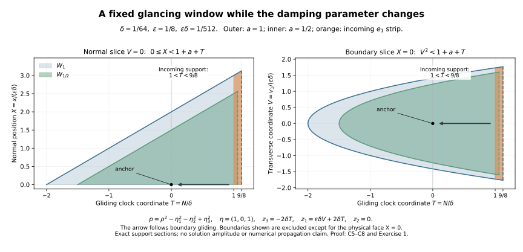

# Scalar boundary propagation through general glancing

Independent exposition, proofs, exercises and illustration: GPT-6 Astra (OpenAI), Ultra, 9 October 2026. CC0-1.0.

The quadratic form of a scalar differential operator need not be a wave metric. Its boundary can still be noncharacteristic, its tangential Hamilton field can still move, and its singularities can still propagate through glancing. We prove the missing local estimate for this class and then assemble the general Dirichlet propagation theorem. No positive spatial energy or physical time coordinate is assumed.

The primary antecedent is Hörmander, *The Analysis of Linear Partial Differential Operators III*, approved Springer 2007 edition, §24.5, Proposition 24.5.1, Lemma 24.5.2 and Theorem 24.5.3, printed pages 455–459. Our proof uses the actual normal graph identity, characteristic completion and finite-order localization already established in the programme. A separate parameter in the flat cutoff lets every Sobolev step use the same geometric region.

The earlier [scalar reflection theorem](../20261007-restored-boundary-reflection/boundary-reflection-preparation.html), rough-data normal recovery, [finite-order Dirichlet comparison](../20261009-robin-diffraction-comparison/robin-diffraction-by-dirichlet-comparison.html), characteristic completion and [generalized-flow construction](../20261007-restored-generalized-glancing/generalized-glancing-flow-preparation.html) retain their exact hypotheses. The proof map binds their current versions. Required Lebl proofs remain external; internal P514 closure of this export is not claimed.

## 1. The scalar problem and the exact conclusion

**C0. General noncharacteristic Dirichlet data.** Let \(P\) be a scalar differential operator of order two on a smooth manifold with a smooth boundary. Its coefficients are smooth, its principal symbol \(p\) is real, and
\[
 p(x,\nu)\ne0\quad(0\ne\nu\in N_x^*\partial X).
 \tag{GS1}
\]
The full quadratic form may be indefinite or degenerate away from its normal coefficient. Lower coefficients may be complex. Use the programme's intrinsic noncharacteristic extension class \(\mathcal N\), with its actual compressed wavefront set and normal traces, and suppose
\[
 u,f\in\mathcal N,\qquad Pu=f,\qquad \gamma_0u=g.
 \tag{GS2}
\]
Let \(O\) be an open conic region avoiding the data singularities: the compressed front of \(f\) in the interior and at the face, and the ordinary front of \(g\) at the face.

**Theorem.** Every point of \(\operatorname{WF}_b(u)\cap O\) lies on a short compressed generalized bicharacteristic contained in that same singular set. Its interior points are characteristic; boundary points are hyperbolic or glancing. At an interior radial Hamilton point, or a nondiffractive glancing point with radial gliding field, the normalized curve may be constant. Away from these exceptional states, singular arcs continue through finite endpoints that remain in a compact subset of the source-free characteristic region. At infinite contact, existence of a singular continuation is asserted; uniqueness is not assumed.

This is the general scalar Dirichlet statement. The previous weak-wave theorem also covers its separate natural Robin domain. No Robin conclusion for every scalar operator in (GS1) is inferred here.

## 2. A finite starting order for the actual distribution

**C1. Normalize and recover normal derivatives.** RF:T001–T004 constructs boundary coordinates, even for a degenerate full quadratic form, in which a constant sign change gives
\[
 P=D_x^2+C(x,z)D_x-R_1(x,z,D_z),\qquad
 p=\rho^2-r(x,z,\eta),\quad x\ge0,\quad \eta\ne0.
 \tag{GS3}
\]
The construction is a base coordinate change with the full differential operator retained. The principal tangential symbol \(r\) is real and quadratic, with no definiteness requirement. Apply the exact scalar case of NR:N8: solve \(S_x=-iCS/2,\ S(0,z)=1\), and replace \(u\) by \(S^{-1}u\). The transformed operator is \(D_x^2-R\), with principal symbol still (GS3). The value trace is unchanged. Smooth invertible multiplication and the coordinate law preserve the intrinsic class, all relevant fronts and the data-free region.

Fix a compact tangential cone at a data-regular boundary point. EW:S1–S2 and A1–A2 give one collar on which all localized forcing terms are smooth and every tangentially smoothing family applied to an intrinsic jet of \(u\) is smooth. These statements include the pure-normal guard and full parameter-dependent remainders.

A compact localization of \(u\) has finite distribution order, hence lies in a restriction space \(\overline H_{(a,0)}\) for some finite negative \(a\), by EW:L1. The first normal-recovery stage EW:L2–L3 uses only the invertible highest normal coefficient, not ellipticity. Its exact localized equation and normal interpolation give
\[
 (a_j,t_j)=(a+j,-j),\qquad a_j+t_j=a.
 \tag{GS4}
\]
More directly, each step is \((a_j,t_j)\mapsto(a_j+1,t_j-1)\), as proved in EW16. Take finitely many steps until \(a_j\ge2\). Then for a finite real \(s=a_j+t_j\),
\[
 u\in\mathcal X_s\ \text{locally},\qquad
 \|v\|_{\mathcal X_s}^2
  =\|\Lambda^sv\|_2^2+\|\Lambda^{s-1}D_xv\|_2^2,
 \qquad \Lambda=\langle D_z\rangle .
 \tag{GS5}
\]
Indeed the restriction Fourier weights satisfy
\(\lambda^s\le Q^{a_j}\lambda^{t_j}\) and
\(|\rho|\lambda^{s-1}\le Q^{a_j}\lambda^{t_j}\), where
\(Q=\langle(\rho,\eta)\rangle,\lambda=\langle\eta\rangle\).
Take extension infima. The initial finite order and number of normal steps can be fixed on a larger compact patch; their constants may vary with the inner test.

All traces used next are the original intrinsic traces. RDC:R1 proves their identification, their all-real bounds and the exact commutations
\[
 \gamma(Av)=A(0)\gamma v,\qquad
 \gamma D_x(Av)=A(0)\gamma D_xv-iA_x(0)\gamma v.
 \tag{GS6}
\]
Thus rough initial order has not been replaced by a new boundary realization.

## 3. Characteristic completion at a nonstationary glancing point

**C2. The accessible zero can be tangential.** Suppose
\[
 r(0,z_0,\eta_0)=0,\qquad H_{r_0}(z_0,\eta_0)
   \text{ is not radial},\qquad r_0=r|_{x=0}.
 \tag{GS7}
\]
Then \(d_{z,\eta}r_0\ne0\). On a positive homogeneous section, the normalized function \(r/\lambda^2\) has a nonzero tangential differential at this point: its radial derivative vanishes on \(r=0\), so a nonzero differential cannot disappear merely by removing the radial coordinate.

Consequently SDC:S3–S6 applies at this zero by moving in a tangential direction, regardless of the sign of \(r_x\). For real scalar coefficients of degrees \(1-j-k\), a characteristic identity
\[
 A(\rho)=\sum_{j,k=0}^1 a_{jk}\rho^{j+k}
          =-\psi(\rho)^2\quad\text{when }\rho^2=r
 \tag{GS8}
\]
therefore has the complete extension
\[
 A(\rho)+(\psi_0+\rho\psi_1)^2
       -h(\rho^2-r)\le0\quad(\rho\in\mathbb R),
 \quad \deg(\psi_0,\psi_1,h)=(1/2,-1/2,-1).
 \tag{GS9}
\]
The square-root descent, flat-error majorant and both signs of \(r\) are exactly those of SDC:S5–S6. A squared support cutoff inside a slightly larger patch preserves this inequality for either sign of \(\rho^2-r\).

Here is its operator use for the present data. Quantize the complete array \(A_{jk}\), the row \((\psi_0,\psi_1)\) and a selfadjoint tangential \(G\) of order minus one with symbol \(h\). Form the ordered entries
\[
 \begin{pmatrix}
 A_{00}+\Psi_0^*\Psi_0+GR_{\rm pr}
   &A_{01}+\Psi_0^*\Psi_1\\
 A_{10}+\Psi_1^*\Psi_0&A_{11}+\Psi_1^*\Psi_1-G
 \end{pmatrix},
 \tag{GS10}
\]
where \(R_{\rm pr}\) is the real divergence-form principal tangential operator. Its weighted block symbol is nonpositive by (GS9). SDQ:W2 bounds the full array by \(C\|w\|_{\mathcal X_0}^2\), including all ordered lower terms. SDQ:W3 expands its normal commutator, also bounded at that norm. For an actual \(H^2\) input with \(Pw=F\), normal integration gives
\[
 (D_xw,D_xGw)-(Rw,Gw)
       =(F,Gw)-i\langle\gamma D_xw,G(0)\gamma w\rangle .
 \tag{GS11}
\]
The difference \(R-R_{\rm pr}\) is tangential of order one; its pairing with \(G\) is bounded by \(C\|w\|_2^2\). Equations (GS10)–(GS11) prove the quadratic completion estimate with the actual source pairing and actual boundary cross pairing retained. Thus this use does not invoke SDQ:W5 with its narrower strict-diffraction hypothesis. It uses that proof's ordered array and the more general accessible zero just verified.

## 4. A tangential commutant gives a genuine half-order gain

**C3. The regularized estimate.** Work on a fixed conic parameter region \(W\), with all forcing tests tangentially smooth in \(L^2_x\) and all value-data tests smooth. Suppose \(u\in\mathcal X_s\) there. Let real homogeneous symbols \(q,v,b,e\), of degrees \(0,0,1/2,1/2\), be supported inside that region, with \(q=v^2\) everywhere, and
\[
 H_pq+M\lambda q=-\psi^2-b^2+e^2
                  \quad\text{on }p=0.
 \tag{GS12}
\]
Here \(q\) is independent of \(\rho\), \(\psi\) has degree \(1/2\), and the coefficients are supported in a patch satisfying (GS7). Assume an actual \(E\in\Psi_{\rm tan}^{1/2}\) with principal symbol \(e\) has \(Eu\in L^2H^s\). The damping constant \(M\) is chosen below. Then any \(B\in\Psi_{\rm tan}^{1/2}\) with principal symbol \(b\) satisfies locally
\[
 Bu\in L^2H^s.
 \tag{GS13}
\]
All assertions concern fixed supports; low-frequency and properly supported remainders are included.

Choose a full scalar cutoff \(\chi=I\) on a neighborhood of the displayed supports and all completion supports. Set
\[
 W_\epsilon=\frac{\Lambda^s}{1+\epsilon^2|D_z|^2},
 \quad w_\epsilon=W_\epsilon\chi u,\quad
 Pw_\epsilon=F_\epsilon+Z_\epsilon w_\epsilon,
 \quad F_\epsilon=W_\epsilon\{\chi Pu+[P,\chi]u\}.
 \tag{GS14}
\]
The exact commutator is
\([P,\chi]=-2i\chi_xD_x-\chi_{xx}-[R,\chi]\).
RDC:R3, UMD:D6 and LG:L1–L3 prove, at every real starting order,
\[
 w_\epsilon\in H^2\ (\epsilon>0),\quad
 \|w_\epsilon\|_{\mathcal X_0}
 +\|Pw_\epsilon\|_{L^2H^{-1}}
 +\|\gamma D_xw_\epsilon\|_{H^{-3/2}}\le C_s.
 \tag{GS15}
\]
The value trace is uniformly smooth. The full \(Z_\epsilon\) is uniformly of order one with Hermitian part of order zero. Every localized pairing of \(F_\epsilon\) with an order-zero tangential test or an order-minus-one completion test is uniformly bounded. For clarity, the cutoff part has coefficients smoothing on the testing microsupport and acts on \(u,D_xu\) at their finite known orders; repeated tangential composition to sufficiently high order proves that bound. It does not require a uniform global \(L^2\) norm of \(F_\epsilon\).

Use an actual selfadjoint tangential \(Q\) with principal symbol \(q\); its normal coefficient is zero. NR:N3 gives
\[
 2\operatorname{Im}(Pw_\epsilon,Qw_\epsilon)
    =2\operatorname{Re}
       \langle Q(0)\gamma w_\epsilon,\gamma D_xw_\epsilon\rangle
       +\mathcal C[w_\epsilon].
 \tag{GS16}
\]
The boundary term is bounded by (GS15) and the smooth value trace. With \(R_a=(R-R^*)/(2i)\) and
\(Z_{\epsilon a}=(Z_\epsilon-Z_\epsilon^*)/(2i)\), let \(k_\epsilon\) be their real uniformly order-one leading symbol modulo order zero, as in UMD:D1. Extend \(\lambda\) positively away from the chosen cone and quantize it to a selfadjoint tangential \(L\) of order one. It is comparable to the Sobolev frequency \(\langle\eta\rangle\) at high frequency but need not equal it. Choose \(M\) so that
\[
 h_\epsilon=M+2k_\epsilon/\lambda\ge1.
 \tag{GS17}
\]
UMD:D1 supplies a uniformly bounded smooth positive square root, including all parameter derivatives. Since \(q=v^2\) is a nonnegative tangential symbol everywhere,
\[
 \mathcal D_\epsilon[w]
 :=\operatorname{Re}((ML+2R_a+2Z_{\epsilon a})w,Qw)
 \ge-C\|w\|_2^2.
 \tag{GS18}
\]
Indeed quantize the symbol \(\lambda^{1/2}\sqrt{h_\epsilon}\,v\). Its norm square has the same order-one principal symbol as the form on the left; the full ordered difference has order zero, uniformly. The ordinary Sobolev bound controls that difference. No sign of \(r\) enters this argument.

Subtract \(2\operatorname{Im}(Z_\epsilon w,Qw)\) from the volume array in (GS16), add \(\mathcal D_\epsilon[w]+\|Bw\|^2-\|Ew\|^2\), and retain every ordered term. NR:N5 and the scalar leading part of UMD:D6 show that its characteristic polynomial is
\[
 H_pq-2qk_\epsilon
 +(M\lambda+2k_\epsilon)q+b^2-e^2
       =-\psi^2.
 \tag{GS19}
\]
The only cross coefficient comes from \(Q_xD_x\); all lower terms have the mixed orders required in (GS10). Apply C2. The source pairing in (GS11) splits into \(F_\epsilon\) and \(Z_\epsilon w\). The former is controlled as above, and the latter by
\(\|\Lambda^{-1}Z_\epsilon w\|\,\|\Lambda Gw\|
\le C\|w\|_2^2\).
The boundary pairing in (GS11) is bounded by (GS15). Substituting (GS16) and (GS18), then dropping the additional nonnegative completion square, gives
\[
 \|Bw_\epsilon\|_2^2\le\|Ew_\epsilon\|_2^2+C_s.
 \tag{GS20}
\]
The incoming term is bounded because
\(EW_\epsilon\chi u=W_\epsilon\chi Eu+[E,W_\epsilon\chi]u\).
The commutator has uniform tangential order \(s-1/2\); separated products are smoothing on the finite-order input. Thus the assumed \(Eu\in L^2H^s\) suffices. Distributional convergence of \(w_\epsilon\) and the proved bounded-norm limit argument give \(B\Lambda^s\chi u\in L^2\). Commuting the weight and applying full tangential parametrices proves (GS13).

Where \(b\) is elliptic this gains \(u\in L^2H^{s+1/2}\). It also gains the normal component of \(\mathcal X_{s+1/2}\). For a smaller localized input \(w=Ku\), the exact equation gives
\(D_x^2w\in L^2H^{s-3/2}\): \(Rw\) uses the new value order, the localized source is smooth, and cutoff terms on \(D_xu\) have the old order \(s-1\), which is sufficient. Use RDC:R1's two-jet extension \(w(x)\mapsto3w(-x)-2w(-2x)\) for \(x<0\). Its value and second-derivative bounds hold separately in these two tangential spaces. It creates no boundary delta, since the old finite-order normal domain already provides both matching traces. The full Fourier inequality
\[
 2\rho^2\lambda^{2s-1}
       \le\lambda^{2s+1}+\rho^4\lambda^{2s-3}
 \tag{GS21}
\]
therefore gives \(D_xw\in L^2H^{s-1/2}\). This proves the complete mixed half-gain without assuming a positive spatial quadratic form.

## 5. A homogeneous clock and exact transverse functions

**C4. Flow coordinates on the boundary cosphere.** Fix a compact set \(K\) of glancing anchors satisfying (GS7), normalized by a smooth positive homogeneous function \(\lambda(\eta)=1\). The projected field
\[
 W=\Pi_*(\lambda^{-1}H_{r_0})
 \tag{GS22}
\]
is nonzero. Here \(\Pi\) is positive radial projection to the chosen section. The smooth local flow proof in DC:T005 and the inverse function argument give flow coordinates \((N,v_1,\ldots,v_{2d-2})\) with \(WN=1,\ Wv_j=0\). Only the coordinate-box flow construction is used; its later temporal and Lorentz hypotheses play no role. Choose a small transverse hyperplane, flow it, and invert the resulting map; its differential consists of the transverse basis and the nonzero field. Differentiating the flow identities proves the displayed equations. Extend these functions homogeneously of degree zero.

For an anchor \(a\), set
\[
 \Theta=N-N(a),\qquad
 \omega=\sum_j(v_j-v_j(a))^2,\qquad
 H_{r_0}N=\lambda,\quad H_{r_0}\omega=0.
 \tag{GS23}
\]
On a fixed larger compact chart, coordinate and inverse-coordinate derivatives are bounded. Thus \(\sqrt\omega\) measures transverse distance, and
\[
 |r_0|\le C\lambda^2\sqrt\omega,\qquad
 |\partial_z\omega|+\lambda|\partial_\eta\omega|
          \le C\sqrt\omega .
 \tag{GS24}
\]
For the first bound, the curve \(v=v(a)\) is the characteristic orbit through \(a\), so \(r_0=0\) along it. Taylor's integral formula in the transverse coordinates bounds \(r_0/\lambda^2\) by their distance. The second bound follows directly by differentiating the sum of squares. Smooth dependence of the flows and a finite chart cover make all geometric constants uniform over \(K\).

## 6. The escape function controls both real normal roots

**C5. Two widths and the full normal derivative.** Take \(0<\varepsilon<\varepsilon_0\), \(0<\delta<c\varepsilon\), with the constant \(c\) chosen below, and put
\[
 \phi=-\Theta+\frac{x}{\varepsilon}
                 +\frac{\omega}{\delta\varepsilon^2}.
 \tag{GS25}
\]
If \(\Theta\le(1+\varepsilon)\delta\) and \(\phi\le2\delta\), then
\[
 0\le x\le4\varepsilon\delta,\qquad
 \omega\le4\varepsilon^2\delta^2,\qquad
 |\rho|\le C\lambda\sqrt{\varepsilon\delta}\quad(p=0).
 \tag{GS26}
\]
The first two follow by adding \(\Theta\) to (GS25). The third uses
\(|r-r_0|\le Cx\lambda^2\) and (GS24).

The actual Hamilton derivative is
\[
 H_p\phi=H_rN+\frac{2\rho}{\varepsilon}
                    -\frac{H_r\omega}{\delta\varepsilon^2}.
 \tag{GS27}
\]
In particular the signed normal term is retained. Smoothness and (GS23)–(GS24) give
\[
 H_rN=\lambda+O(x\lambda),\qquad
 H_r\omega=O(x\lambda\sqrt\omega).
 \tag{GS28}
\]
Consequently on both characteristic roots in (GS26),
\[
 |H_p\phi-\lambda|
    \le C\lambda\{\varepsilon\delta+\sqrt{\delta/\varepsilon}
                            +\delta\}.
 \tag{GS29}
\]
Choose \(c\) and then a fixed upper bound for \(\delta\) so the braces with their constant are at most \(1/2\). We obtain \(H_p\phi\ge\lambda/2\) uniformly on these supports. This choice depends on the geometry, not the Sobolev order. It works when \(\varepsilon=L\delta\) with any fixed sufficiently large \(L\), after decreasing the common allowed step.

## 7. Smooth squares and a damping parameter independent of the support

**C6. Complete commutant symbols.** Let \(\chi_0(v)=e^{-1/v}\) for \(v>0\), zero otherwise. Put
\(\chi_1(h)=\chi_0(h)/(\chi_0(h)+\chi_0(1-h))\).
Then \(\chi_1\) is zero for \(h\le0\), one for \(h\ge1\), increasing, and its derivative is supported in \([0,1]\). The flat powers and square roots of \(\chi_0,\chi_0',\chi_1,\chi_1'\) are smooth by SDC:S1. For \(\chi_1'\), differentiate its quotient: the numerator is a sum of two nonnegative products of \(\chi_0,\chi_0'\), and the denominator is positive. The same flat estimates apply at both ends.

For \(0\le a\le1\) and a large parameter \(A\ge1\), define
\[
 v_a=\frac{1+a-\phi/\delta}{A},\quad
 h_a=\frac{\delta-\Theta}{\varepsilon\delta}+a,\quad
 q_a=\chi_0(v_a)\chi_1(h_a).
 \tag{GS30}
\]
Its positivity set \(W_a\) does not depend on \(A\). Its closure is inside \(W_{a'}\) whenever \(a<a'\), within one fixed compact coordinate patch. Outer support cutoffs are chosen identically one on a larger neighborhood of all these sets; the inequalities (GS26) put their derivative supports outside the assertion region. Thus the formulas below are actual global symbols there after proper localization.

The characteristic incoming and gain squares are
\[
 e_a^2=\frac{\chi_0(v_a)\chi_1'(h_a)H_rN}{\varepsilon\delta},
 \qquad
 b_a^2=\frac{\lambda}{4A\delta}\chi_0'(v_a)\chi_1(h_a).
 \tag{GS31}
\]
The factor \(H_rN\) is positive on the retained parameter patch, by (GS28). Both square roots are smooth homogeneous symbols of degree \(1/2\). Since \(\chi_0(v)=v^2\chi_0'(v)\),
\[
 H_pq_a+M\lambda q_a=-\psi_a^2-b_a^2+e_a^2,\qquad
 \psi_a^2=\chi_0'(v_a)\chi_1(h_a)
 \left(\frac{H_p\phi}{A\delta}
               -M\lambda v_a^2-\frac{\lambda}{4A\delta}\right)
 \tag{GS32}
\]
on the characteristic set. On these supports \(0<v_a<4/A\). Choose
\[
 A\ge \max(1,128M\delta).
 \tag{GS33}
\]
Then the parentheses in (GS32) are at least \(\lambda/(8A\delta)\) at both real roots. The positive square root of that factor is smooth on a neighborhood of the characteristic part of the support. Multiply it by the flat square roots of \(\chi_0'\chi_1\), and extend with a cutoff supported in that neighborhood. This constructs a real smooth \(\psi_a\) with the required characteristic values. Points of the parameter support without real roots impose no values. Compactness and the strict positive margin give a neighborhood of every limiting characteristic point, so the construction remains smooth through root merging. Its degree is \(1/2\).

Finally \(q_a\) has the smooth square root \(\sqrt{\chi_0(v_a)}\sqrt{\chi_1(h_a)}\) everywhere. Thus all hypotheses of C3 are satisfied. Increasing \(M\) changes \(A\) and the numerical constants, while leaving \(W_a\), the incoming support location and the final output neighborhood unchanged.

## 8. Locate the entire incoming term

**C7. Its support lies in the asserted window.** If \(e_a\ne0\), then \(0<h_a<1\), hence
\[
 |\Theta-\delta|\le\varepsilon\delta,\qquad
 0\le x\le4\varepsilon\delta,\qquad
 \sqrt\omega\le2\varepsilon\delta.
 \tag{GS34}
\]
In flow coordinates the point \(\exp(\delta W)a\) has \(N=N(a)+\delta\) and \(v=v(a)\). Bounded derivatives of the inverse chart therefore give
\[
 \operatorname{dist}_{\rm section}
       ((z,\eta/\lambda),\exp(\delta W)a)
                   \le C_0\varepsilon\delta .
 \tag{GS35}
\]
This concerns the whole support, including both normal lifts and the boundary. Suppose that the larger closed window with constants \(5\) and \(2C_0\), respectively, contains no projected singularity of \(u\). RF:T010–T011 and EW:S2 then give smooth tangential outputs there on the common collar, including all intrinsic normal jets. Interior points use the full normal-frequency criterion and the pure-normal guard from the same proofs. A finite cover of the compact support yields \(E_au\in L^2H^m\) for every \(m\), for the actual full proper operator \(E_a\). Its separated residuals are smoothing on that collar.

The larger window supplies room for cutoffs; absence just at its center would not justify this step. All intermediate \(a\in[0,1]\) have the same stated enclosing window.

## 9. Gain every order on one fixed neighborhood

**C8. The order parameter does not shrink the conclusion.** C1 gives one finite starting order on a neighborhood of \(\overline W_1\). For any fixed integer \(k\), take
\[
 a_j=1-\frac{j}{2k},\qquad j=0,\ldots,k .
 \tag{GS36}
\]
Suppose every test compactly supported in \(W_{a_j}\) puts \(u\) in \(\mathcal X_{s+j/2}\). Choose a commutant parameter strictly between \(a_{j+1}\) and \(a_j\). Its full support, completion supports and all normal derivatives fit inside \(W_{a_j}\), and \(b\) is elliptic throughout \(\overline W_{a_{j+1}}\). Choose \(M\) for this order, then \(A\) by (GS33). C7 controls the full incoming term. C3 gives the mixed half-gain locally at every point of \(\overline W_{a_{j+1}}\); a finite partition and full tangential parametrices control any test there. Thus induction gives all orders \(s+k/2\) on \(W_{1/2}\), the same region for every \(k\).

The compactness statement uses compactly supported normalized tests. A slightly larger parameter chart and the strict inequalities between the \(a_j\) give actual support separation at each step; constants may depend on \(k\). Only the final region is fixed.

The equation now supplies every normal derivative on any fixed smaller test: \(D_x^2u=Ru+f\), and differentiation gives \(D_x^3u=R_xu+RD_xu+D_xf\), with all subsequent derivatives obtained by the full finite Leibniz sum. Smooth localized forcing and tangentially smoothing jet errors remain controlled on the same collar by C1. The all-order Sobolev embedding proved earlier therefore makes the output smooth up to \(x=0\). Since the anchor belongs to \(W_{1/2}\), the exact tangential tester criterion excludes it from \(\operatorname{WF}_b(u)\).

## 10. Uniform windows in both directions

**C9. Discharge the geometric tangency hypothesis.** Combining C4–C8 gives constants \(C_K,t_K>0\), uniform on a compact set of nonradial glancing anchors, with the following property: absence of singular points in the window of radius \(\epsilon |t|\) and normal width \(\epsilon |t|\), centered on the normalized gliding flow at signed time \(t\), implies regularity at its anchor whenever
\[
 0<|t|<t_K,\qquad C_K|t|\le\epsilon<\epsilon_K.
 \tag{GS37}
\]
Indeed for the backward gliding direction \(W\), take \(\delta=|t|\) and \(\varepsilon\) equal to \(\epsilon\) divided by one fixed number larger than both constants in C7. The geometric requirement \(\delta<c\varepsilon\) becomes the lower bound in (GS37). All constants can be fixed before the Sobolev iteration because (GS33) absorbs its changing \(M\). This verifies the quantitative relation between the two small parameters, rather than only a separate small-step statement for each width.

For the other direction, conjugate the actual scalar equation. With \(D=-i\partial\), its principal quadratic symbol is unchanged and every lower coefficient is conjugated with its derivative sign retained. The Fourier identity
\(\widehat{\overline v}(\xi)=\overline{\widehat v(-\xi)}\)
and the real compressed coordinate law show that both solution and data fronts are carried to their antipodes. The antipodal map reverses the Hamilton orientation for a real quadratic symbol. Apply the proved direction to this transformed equation and return. A common minimum of the two allowable steps and maximum of their constants gives (GS37) in both directions.

For widths up to one, a window contains any smaller admissible fixed-width window; enlarging it cannot create an obstruction to this implication. Thus (GS37) is precisely the local RW4 criterion after the fixed coordinate and speed changes of PW:T009–T011. Taking \(\epsilon=L|t|\), with \(L>C_K\), its contrapositive yields singular witnesses with normal and tangential errors \(O(t^2)\). PW:T004–T008 gives the full first-order directional condition, including the \(O(|t|)\) bound for either normal root. This applies to \(G_g\cup G^3\), with infinite contact included.

## 11. Assemble the general scalar propagation theorem

**C10. Every analytic hypothesis concerns the same front.** In the data-free region put
\[
 F=\operatorname{WF}_b(u)\cap O,\qquad
 \widetilde F=\operatorname{Char}(p)\cap\pi^{-1}(F).
 \tag{GS38}
\]
Interior elliptic regularity and RF:T012–T013 put \(F\) in the compressed characteristic set. At hyperbolic boundary points its lift includes both roots. Relative closedness follows from the defining wavefront set on \(O\). On compact normalized boundary patches the estimate
\[
 |\rho|^2=r(x,z,\eta)\le C|\eta|^2\quad(p=0)
 \tag{GS39}
\]
bounds all lifts; no positive lower bound on the whole quadratic form is required. Thus the compact-lift and closed-set hypotheses are satisfied.

Away from nondiffractive glancing, all short singular segments are already proved for this class. RP:P0–P5 supplies ordinary scalar propagation. RF:T020–T033 supplies the full transverse Dirichlet reflection with actual intrinsic traces. At strict diffraction, RDC:R0–R5 applies to (GS3) and the finite starting order C1: that comparison theorem allows an arbitrary real quadratic \(r\), not only the later wave application. Its forcing and value-data assumptions hold by C1, and its normal and tangential smoothness gives exactly the boundary criterion here. If a tangent germ were regular it would make the anchor regular. Conjugation treats the opposite germ; interior propagation then gives the entire short tangent segment through a singular anchor. These uses retain the same scalar operator, its complete lower terms and the same source-free region.

At a nondiffractive glancing anchor with nonradial gliding field, C9 discharges the remaining quantitative tangency hypothesis. PW:T012 and GGL:T040–T045 now apply with precisely \(\widetilde F\). They prove convergence of the approximate curves, signed-root recovery across accumulating reflections and the actual generalized derivative. Projection supplies the short singular arc asserted in C0.

The remaining exceptional points need no false clock. If the interior Hamilton field is radial, its full orbit stays on the positive fiber ray locally by homogeneity; the conic front contains it. Its normalized image is constant. If the nondiffractive gliding field is radial, its boundary orbit similarly stays on the fiber ray, with zero normal position and momentum. Homogeneity preserves the nondiffractive sign or zero of \(r_x\) there. This is the allowed generalized gliding orbit and lies in the conic singular set. A zero field gives the constant full orbit. These cases complete the local theorem.

## 12. Continuation and the limitation of a local clock

**C11. Continue through regular phase regions.** At ordinary, transverse, strict diffractive and strict gliding joins, the earlier ordinary uniqueness, prescribed reflected root, tangent flow and gliding energy arguments identify the joining state. At \(G^3\), GGL:T044 proves the limiting estimates
\(|\rho(s)|=O(|s-s_0|^2)\), \(x(s)=O(|s-s_0|^3)\).
Thus any supplied outgoing singular continuation has the required joining derivative. This includes infinite contact without asserting uniqueness.

Choose compatible local positive homogeneous normalizations on a compact phase neighborhood. Their factors and inverse factors are bounded, and the projected Hamilton and gliding fields have bounded coefficients. GGL:T013–T014 gives a uniform compressed Lipschitz bound through reflections. A finite endpoint of a singular arc that stays in such a compact source-free neighborhood has a unique compressed limit. Relative closedness puts that limit in \(F\). At a nonexceptional state C10 supplies an outgoing singular arc, and the joining argument extends the original one.

Successive choices can make a maximal continuation, exactly by the endpoint-capacity construction GSR:T6 on each nonexceptional region; that construction uses local extension and a bounded parameter on finite intervals, not its later physical-time argument. The finite compact exit-buffer argument is valid here too. We do **not** infer that an infinite-parameter ray must leave every compact set: the general scalar problem has no global monotone physical clock. Periodic motion or approach to an exceptional stationary normalized state is not ruled out by this theorem.

This proves the general scalar Dirichlet propagation of C0 with its radial qualification. The separate construction of distributions on prescribed limiting broken rays, sharp Airy energy mapping and all other remaining HIII21/23/24 and HIV25/26 obligations remain active.

## 13. Three solved exercises

### Exercise 1. A glancing clock for an ultrahyperbolic symbol

Take \(z=(z_1,z_2,z_3)\), \(\eta=(\eta_1,\eta_2,\eta_3)\), and
\[
 p=\rho^2-r,\quad
 r=\eta_1^2+\eta_2^2-\eta_3^2+\kappa x\eta_3^2,\quad
 \lambda=\eta_3>0,\quad
 N=-z_3/2.
 \tag{GS40}
\]
At \(x=0,\eta=(1,0,1)\), construct the transverse functions in C4 and check the full error in (GS27).

**Solution.** The principal form at the anchor has two positive and two negative directions, so it is not a Lorentz wave form. Put
\[
 a=\eta_1/\eta_3,\quad b=\eta_2/\eta_3,\quad
 v_1=z_1+az_3,\quad v_2=z_2+bz_3,\quad
 \omega=v_1^2+v_2^2+(a-1)^2+b^2.
 \tag{GS41}
\]
The boundary flow has \(H_{r_0}z=(2\eta_1,2\eta_2,-2\eta_3)\), with constant momenta. Hence \(H_{r_0}N=\lambda\), all four transverse functions are invariant, and their differentials together with \(dN\) are independent on the section. Also
\(r_0/\lambda^2=2(a-1)+(a-1)^2+b^2\), giving the stated transverse bound.
For the full symbol,
\[
 H_rN=(1-\kappa x)\lambda,\qquad
 H_r\omega=4\kappa x\lambda(av_1+bv_2),
\]
so
\[
 H_p\phi=(1-\kappa x)\lambda+\frac{2\rho}{\varepsilon}
       -\frac{4\kappa x\lambda(av_1+bv_2)}
                         {\delta\varepsilon^2}.
 \tag{GS42}
\]
These are exact identities, including the normal term and variable-normal tangential error. For \(\kappa=0\), the boundary gliding flow in the normalized parameter is \(z=(-2s,0,2s)\), so \(N=-s\). The incoming window is centered at its negative time, \(N=\delta\).

### Exercise 2. Damping can grow without changing the support

Suppose \(M=10^4,\delta=1/64,\varepsilon=1/8\), and the geometric estimate \(H_p\phi\ge\lambda/2\) is valid on the chosen characteristic support. Give an admissible \(A\), bound the remaining square in (GS32), and identify the common region after twenty half-steps.

**Solution.** Equation (GS33) allows \(A=20000\). Since \(v_a^2\le16/A^2\),
\[
 A\delta\left(\frac{H_p\phi}{A\delta}
       -M\lambda v_a^2-\frac{\lambda}{4A\delta}\right)
 \ge\lambda\left(\frac14-\frac{16M\delta}{A}\right)
 =\frac{\lambda}{8}.
 \tag{GS43}
\]
Thus the positive margin is explicit. For twenty steps choose \(a_j=1-j/40\), ending at \(1/2\), and intermediate commutant parameters between consecutive values. Later damping constants may require larger \(A\); the positivity sets are still \(W_a\). The final gain is ten tangential orders and the final region is \(W_{1/2}\). The numerical choices here check damping only; the geometric hypothesis in the question must still be established by C5 for the actual operator.

### Exercise 3. A radial singularity needs no fictitious clock

On \(x\ge0\), let
\[
 P=D_x^2-yD_y^2+2iD_y,\qquad u=x\delta(y).
 \tag{GS44}
\]
Verify the homogeneous Dirichlet equation and describe its boundary characteristic at \(y=0,\eta\ne0\).

**Solution.** With \(D=-i\partial\), the operator is
\(-\partial_x^2+y\partial_y^2+2\partial_y\).
The test-function identity
\(\langle y\delta'',\varphi\rangle=(y\varphi)''(0)=2\varphi'(0)
 =\langle-2\delta',\varphi\rangle\)
therefore gives \(Pu=0\). Its intrinsic value trace is zero and its normal derivative trace is \(-i\delta(y)\).

Here is a direct check of the intrinsic class. Evaluation of a conormal test at \(y=0\) is continuous into the one-dimensional conormal test space: the tangential Sobolev estimate controls this evaluation and every normal-weighted derivative. Apply the continuous smooth-function dual action CNF:U4 to the normal function \(x\). Their composition defines \(x\delta(y)\) in \(\mathcal A'\), with the stated interior action and traces. Moreover \((xD_x+i)u=0\). This boundary-tangent operator has compressed principal symbol \(\zeta=x\rho\), so it is elliptic wherever the compressed normal component is nonzero. The full boundary parametrix GB:E1–E3, its residual dual action, and the intrinsic wavefront criterion exclude those covectors. Thus only nonzero tangential boundary covectors can remain, exactly the defining condition for \(\mathcal N\). Cutoff errors are outside the smaller tested region.

The principal symbol is \(p=\rho^2-y\eta^2\). At \(x=0,y=0,\rho=0\),
\[
 H_p=\eta^2\partial_\eta,\qquad r_x=0.
 \tag{GS45}
\]
This field is radial, so its positive normalized orbit is a single point. The nonzero normal trace is singular there: localizing \(\delta(y)\) leaves a Fourier transform constant in \(\eta\), and the ordinary elliptic tester criterion cannot make it smooth. The intrinsic trace inclusion consequently puts that boundary point in \(\operatorname{WF}_b(u)\). Thus a source-free boundary singularity can have a stationary normalized generalized ray. C0 includes it; a claim of motion with a nonvanishing physical clock would be false.

## 14. The same support at every Sobolev order

**F0. Coordinates and meaning.** The two panels are exact slices of the positivity sets in (GS30), with the ultrahyperbolic model of Exercise 1 at \(\kappa=0\) and anchor \(\eta=(1,0,1)\). Put \(\delta=1/64,\varepsilon=1/8\), \(T=N/\delta\), \(X=x/(\varepsilon\delta)\), and \(V=v_1/(\varepsilon\delta)\), with the other three transverse functions zero. Then
\[
 W_a=\{X\ge0,\quad T<1+a\varepsilon,\quad
                     X+V^2<1+a+T\}.
 \tag{GS46}
\]
The left panel sets \(V=0\); the right sets \(X=0\). The larger outline is \(a=1\), the inner outline \(a=1/2\), and the shaded incoming strip for \(e_1\) is \(1<T<1+\varepsilon\). The arrow follows the gliding direction, toward decreasing \(T\). At this frequency the omitted coordinates satisfy \(z_3=-2\delta T\), \(z_1=\varepsilon\delta V+2\delta T\), \(z_2=0\). These are support sections, not a solution intensity or an asserted numerical PDE estimate. The [figure source](figures/build_figure.py) retains every scale and boundary.
