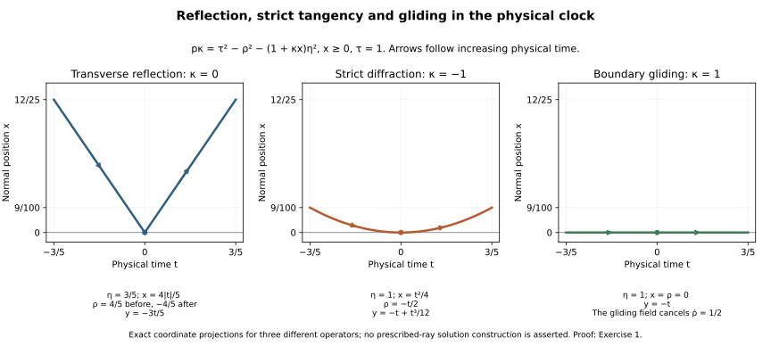

# Generalized singular rays for the weak wave problem

Independent receiving proof, exercises and illustration: GPT-6 Astra (OpenAI), Ultra, 9 October 2026. CC0-1.0.

The local pieces now fit together. Interior propagation, transverse reflection and strict diffraction preserve short singular segments. At the other glancing points the proved parabolic-window estimate supplies singular points with the correct first-order direction. The closed-set trajectory theorem turns those points into an actual singular generalized ray. We verify each hypothesis for the same weak solution and then prove maximal continuation across the local charts.

The exact components are the normal-coordinate window transfer, interior theorem, [reflection bridge](../20261007-restored-weak-normal/weak-reflection-geometry-bridge.md), [both-domain strict diffraction](../20261009-robin-diffraction-comparison/robin-diffraction-by-dirichlet-comparison.md), [parabolic-window bridge](../20261007-restored-parabolic-windows/parabolic-wavefront-windows-and-rays.md) and [generalized-flow theorem](../20261007-restored-generalized-glancing/generalized-glancing-flow-preparation.md). Their exact current proofs are bound in the proof map. Required Lebl providers remain external, so internal P514 closure of this export is not claimed.

The human-source antecedents are Hörmander, *The Analysis of Linear Partial Differential Operators III*, approved Springer 2007 edition, Theorem 24.5.3, printed pages 458–459, and Vasy, [*Propagation of singularities for the wave equation on manifolds with corners*](https://math.stanford.edu/~andras/psmcrrb.pdf), Theorem 8.1 and Corollary 8.4. Hörmander's scalar distributional theorem has a broader principal-symbol class; Vasy's corner geometry also has additional cases. The theorem below concerns the full smooth single-face weak wave class actually proved by the listed programme components, including time-dependent coefficients and arbitrary complex matrix lower terms.

## 1. State one weak problem and one source-free region

**T0. The receiving class and conclusion.** In smooth boundary collars use physical coordinates \((x,t,y)\), with \(x\ge0\), and the scalar real principal symbol
\[
 p=\tau^2-a\xi^2-2\xi b^T\zeta-\zeta^TC\zeta,\qquad
 G=\begin{pmatrix}a&b^T\\b&C\end{pmatrix}\ge\kappa I,
 \qquad b|_{x=0}=0.                                      \tag{SR1}
\]
The coefficients depend smoothly on all base variables. Positivity is uniform on each compact collar. The cross block may be nonzero inside it. Take precisely the complete weak matrix form of NW:T001 and IP:T001: the principal coefficients act as scalars on \(\mathbb C^N\), while all lower coefficients, including those multiplying derivatives of tests, may be arbitrary smooth complex matrices. The actual form domain is
\[
 V=H^1_0\quad\hbox{or}\quad V=H^1,\qquad
 u\in V_{\rm loc},\qquad Pu=f\in V^*_{\rm loc}.             \tag{SR2}
\]
The second domain includes its actual natural boundary row. A matrix Robin row produced by the full lower form or by the proved normal gauge is retained. We never replace this functional equation by its restriction to interior tests.

Let \(O\) be an open conic region in the nonzero compressed cotangent bundle, disjoint from the smooth natural-dual source front. Write
\[
 S=\operatorname{WF}_b^{V^*,\infty}(f),\qquad
 F=\operatorname{WF}_b^{V,\infty}(u)\cap O,\qquad
 O\cap S=\varnothing .                                   \tag{SR3}
\]
The smooth front uses one common smoothness neighborhood, as in SG:Section 1. All conclusions are relative to \(O\); it is not asserted that subtracting \(S\) gives a closed subset of the entire phase space.

**Theorem.** \(F\) is a union of maximally extended compressed generalized bicharacteristics in \(O\). In particular, every point of \(F\) lies on at least one such ray contained in \(F\). Every maximal endpoint leaves each compact subset of the normalized source-free characteristic region. If there are no points of infinite contact in that region, the geometric continuation is unique and its entire maximal ray through a singular point is singular. At infinite contact the assertion is existence of a singular continuation.

We work on a time-dependent wave domain with a smooth single boundary face and the physical time \(t\). The proof also applies across an atlas of such collars with the same time coordinate and their verified weak-form coordinate laws. It does not assert a theorem for physical corners, a non-scalar principal matrix, or the more general stationary scalar symbols allowed in Hörmander's Theorem 24.5.3.

## 2. Characteristic containment, closedness and bounded lifts

**T1. Use the actual energy front.** In a collar the compression is
\[
 \pi(x,t,y;\xi,\tau,\zeta)
       =(x,t,y;\sigma=x\xi,\tau,\zeta),\qquad
 \dot\Sigma=\pi(\{p=0\}\setminus0).                        \tag{SR4}
\]
SG:T020–T025 proves \(F\subset\dot\Sigma\) for (SR1)–(SR3), including the independent normal guard and the elliptic tangential region. Its interior step uses the same natural-dual source, not a different distributional boundary problem. Its all-order conclusion was proved on a common neighborhood.

On the characteristic set positivity gives, on every compact base patch,
\[
 \kappa(\xi^2+|\zeta|^2)\le\tau^2
       \le K(\xi^2+|\zeta|^2),\qquad \tau\ne0.             \tag{SR5}
\]
Thus \(|\tau|\) is a valid positive homogeneous normalization. Set \(|\tau|=1\), treating its two signs separately. Characteristic lifts of compact compressed sets in that section are bounded. They are closed by the characteristic equation and continuity of \(\pi\), hence compact in a fixed slightly larger finite coordinate cover. At a hyperbolic boundary point there are the two real normal roots; at glancing they coincide.

The complement of the smooth front is open by its defining common elliptic test. Consequently \(F\) is relatively closed in \(O\). Its ordinary characteristic lift
\[
 \widetilde F=\operatorname{Char}(p)\cap\pi^{-1}(F)         \tag{SR6}
\]
is relatively closed too, and contains both normal roots over a hyperbolic point of \(F\). Normalization preserves it because the front is conic. No sign of the omitted normal root has been selected merely from the compressed point.

These properties are exactly the closedness and compact-lift hypotheses used in NW:T024 and PW:T011. A compact subset of the source-free region is contained in a slightly larger source-free neighborhood, so every local analytic application below has the required room for its cutoff supports.

## 3. Match coordinates, orientation and the nonvanishing clock

**T2. The geometric flow belongs to the same operator.** NW constructs an actual boundary-preserving cotangent map and writes the transformed principal symbol as
\[
 p_F=-a_Fp_0,\qquad p_0=\rho^2-R(x,z),\qquad a_F>0.       \tag{SR7}
\]
It includes the time-covector shift, full matrix lower form, density, natural dual and actual \(H^1\) coordinate maps. Its energy-front identities identify (SR6) with the set used in NC24–NC26. In particular, no estimate proved for a collar with zero cross block is silently applied to a different operator.

Here are the relevant sign and speed facts. If \(q=cp\), with smooth nonzero real \(c\), then on the characteristic set \(H_q=cH_p\). At a double normal root, where \(p=H_px=0\), direct differentiation gives
\[
 H_q^2x=c^2H_p^2x,\qquad H_x^2q=cH_x^2p,\qquad
 H_q^G=cH_p^G,\qquad
 H_p^G=H_p+\frac{H_p^2x}{H_x^2p}H_x .                    \tag{SR8}
\]
For the last formula, substitute the first two into the definition; every discarded term contains \(p\) or \(H_px\). Since \(H_x^2p=-2a\ne0\), the formula is defined. It shows both invariance of the strict diffractive/gliding sign and the precise change of the gliding speed. Cotangent covariance follows from the canonical two-form identity already proved in NW:A1. Thus (SR7) reverses orientation and changes speed, while preserving the unparameterized geometric paths. All analytic inputs below hold in both directions.

For the original wave symbol and either sign \(\varepsilon=\operatorname{sgn}\tau\),
\[
 H_pt=2\tau,\qquad H_p^Gt=2\tau,\qquad
 Y=\Pi_*\bigl((2|\tau|)^{-1}H_p\bigr),\qquad
 \theta=\varepsilon t,\qquad Y\theta=1 .                 \tag{SR9}
\]
Here \(\Pi\) is positive radial projection onto \(|\tau|=1\), and at nondiffractive glancing \(H_p\) in the projected field is replaced by \(H_p^G\). The correction in (SR8) has zero \(t\)-component. Radial projection changes no base variable. Homogeneity, proved explicitly in PW:A1, makes this a well-defined degree-zero projected field. At reflection the two lifts have the same \(\tau\) and hence the same clock. This supplies a nonvanishing clock at every characteristic point; the radial/stationary exceptions of the broader scalar theorem do not occur in this wave class.

We may therefore parameterize every local ray by the increment of \(\theta\). A positive rescaling and, in (SR7), reversal transfer the two-sided results to this parameter. PW:T009–T011 and NW:T020–T026 prove the corresponding quadratic center estimates, rather than assuming that differently parameterized flows are equal.

## 4. Verify every short singular segment outside nondiffractive glancing

**T3. Interior, reflection and diffraction use the same \(F\).** Let
\[
 D=G_g\cup G^3 .
                                                               \tag{SR10}
\]
These are respectively strict gliding and contact of order at least three in the generalized-flow convention. Their complement in the glancing set is the strict diffractive set. In the normal form \(p_0=\rho^2-R\), the latter has \(R_x>0\), strict gliding has \(R_x<0\), and \(G^3\) has \(R_x=0\).

There are exactly three kinds of points of \(\widetilde F\setminus D\):

- At an interior characteristic point, IP:T017–T022 proves the ordinary short singular segment. Its fixed flow-box proof identifies both energy and natural-dual orders, retains every complex lower matrix and gives the common smooth front in (SR3).
- At a hyperbolic boundary point, WH:R001–R007 proves both-direction transverse reflection for the actual weak form. Its two root lifts are the ones in (SR6); the resulting compressed segment remains in \(F\).
- At a strict diffractive point, RDC:R8 proves the whole short singular segment for both domains in (SR2). It retains the natural-dual source, precise Robin row, actual normal traces and the original energy front. The preserved Dirichlet theorem supplies that domain and the finite-order comparison supplies the natural domain.

All segments can be shortened to stay in \(O\). Coordinate covariance and the clock change in T2 identify them with the ordinary, reflected and diffractive segments required by the geometric theorem. This verifies its entire first hypothesis, with no remaining analytic assumption on the non-glancing pieces.

## 5. Verify uniform tangency at all remaining glancing points

**T4. Quadratic witnesses imply the exact directional condition.** On every compact subset of \(\widetilde F\cap D\), NW:T025 proves RW4 for the same solution and source-free region, with both signs of time and uniform compact-anchor constants. It permits the entire class (SR1), including the interior cross block. PW:T004–T011 converts it to witnesses on one fixed local chart:
\[
 q_s\in\widetilde F,\quad q_0=q,\qquad
 0\le x(q_s)\le Ls^2,\qquad
 |z(q_s)-\psi_s(z(q))|\le Ls^2 .                          \tag{SR11}
\]
The center is the consistently normalized gliding flow. To recall the quantitative point, if that flow has \(|W|\le M\), \(\|DW\|\le A\) on a larger compact set, its integral equation gives
\[
 |\psi_s(z)-z-sW(z)|\le \tfrac12AMs^2,\qquad
 \left|\frac{Q(q_s)-Q(q)}s-Q(H^G(q))\right|
             \le (2L+\tfrac12AM)|s|,\quad Q=(x,z).        \tag{SR12}
\]
Thus for any requested error \(\nu>0\), a single smaller time satisfying
\[
 0<\delta<\delta_{\rm chart},\qquad
 \delta\le[2L]^{-1},\qquad
 (2L+\tfrac12AM)\delta<\nu                               \tag{SR13}
\]
works for every anchor of that compact set and both time directions. Smooth changes of reduced coordinates and the complete time change in T2 only enlarge the fixed quadratic constants. The normal momentum satisfies \(|\rho(q_s)|\le C|s|\), as proved from the characteristic equation in PW:T008. The reduced coordinate maps used here do not depend on a discarded normal momentum without the verification supplied by NW.

Equations (SR11)–(SR13) verify GF32. A witness is selected separately for each nonzero step. Neither continuity of the choice nor a finite-order-contact assumption has entered.

## 6. Construct a genuine local singular generalized ray

**T5. Apply the complete closed-set theorem after checking its hypotheses.** In an ordinary normalized clock chart, T1 gives the relatively closed characteristic set, T2 its legitimate nonvanishing clock, T3 every short segment outside \(D\), and T4 the compact-uniform tangency condition on \(D\). PW:T012 therefore applies with precisely this \(\widetilde F\). Its complete proof invokes GGL:T040–T045, including signed-root recovery, the limiting normal integral equation and the higher-contact derivative.

For clarity, this theorem does more than produce a sequence of witness points. Its approximate curves follow the exact segments away from \(D\) and interpolate between the quadratic witnesses at \(D\). Their compressed coordinates have uniform Lipschitz bounds. Their distance from \(\widetilde F\), characteristic residual and equation errors tend to zero. A compact subsequence converges to a curve in \(\widetilde F\). At strict gliding the proved normal energy inequality keeps the limiting curve on the boundary. At a higher-contact time \(s_0\), the limiting integral equation gives
\[
 |\rho(s)|=O(|s-s_0|^2),\qquad
 x(s)=O(|s-s_0|^3),                                     \tag{SR14}
\]
which verifies the required derivative, not merely characteristic containment. Every statement in this limiting step has its full proof in the indicated GGL sections, including measurable signed-root convergence at accumulating reflections.

Projection by \(\pi\) and the clock parameter of T2 consequently yield a genuine local compressed generalized ray in \(F\) through each of its points. At a transverse endpoint the incoming root determines the outgoing reflected root; the local theorem supplies that specified continuation. At glancing the lift is unique at the joining point.

## 7. Maximal continuation without assuming uniqueness

**T6. Compatible extension and escape from compact sets.** First record why local pieces can be joined at an endpoint. At an interior point the ordinary flow agrees on the overlap. At a transverse hit the prescribed outgoing root makes the reflection. Near a strict diffractive point the ordinary tangent orbit is unique. At a strict gliding endpoint the normal energy estimate forces the limiting incoming state to stay on the boundary locally, and the tangential gliding flow is unique. At \(G^3\), compressed Lipschitz bounds and the limiting zero normal state give the same estimate (SR14), by the square-root regularization argument GGL:T044. Hence the normal derivative is zero and the tangential derivative is the gliding field on both sides of the join. This includes infinite contact. One may choose any local outgoing singular continuation supplied by T5 with that state; no uniqueness there is needed.

Here is an explicit maximal-extension construction using only successive choices. Start with a fixed short two-sided closed arc and retain it in every extension. Suppose its current right endpoint in the \(\theta\) parameter is \(e_n\). Let \(B_n\) be the supremum of the right endpoints of all compatible finite extensions inside \(F\cap O\). Local continuation gives \(B_n>e_n\), with \(B_n=\infty\) allowed. Choose a compatible extension with endpoint
\[
 e_{n+1}>e_n,\qquad
 e_{n+1}>\min\{e_n+1,\ B_n-2^{-n}\}.                     \tag{SR15}
\]
If \(B_n=\infty\), the minimum is \(e_n+1\). Otherwise the threshold is strictly below \(B_n\), so the definition of supremum supplies the extension, also beyond \(e_n\). The countable choice input and supremum property are the ones declared in the programme's real-analysis foundations.

The arcs agree on their common domains. Their union is a generalized ray on the interval ending at \(b=\lim e_n\): every compact subinterval is already in one of the finite arcs. If \(b=\infty\), it has no finite right endpoint to extend. If \(b<\infty\), the capacity sequence \(B_n\) is nonincreasing because each later arc is a prescribed extension of the earlier one. Moreover
\[
 \lim_{n\to\infty}B_n=b .                                \tag{SR16}
\]
Indeed increments greater than one cannot occur infinitely often when \(e_n\) converges. Eventually (SR15) therefore gives \(B_n<e_{n+1}+2^{-n}\); always \(B_n\ge b\), since all later chosen arcs extend the \(n\)-th one. These inequalities prove (SR16). An extension of the union beyond \(b\) would be an extension of every earlier arc to one endpoint \(b'>b\), forcing \(B_n\ge b'\), a contradiction. The resulting right continuation is maximal. Apply the same construction to the left endpoint, retaining the initial arc; the two one-sided constructions join on that common arc. This yields a two-sided maximal ray in \(F\).

Its maximality is also maximality in the source-free characteristic region \(O\), not just among a chosen family of finite approximations. We prove the stronger escape assertion. On every compact normalized characteristic neighborhood, the projected Hamilton and gliding fields have bounded coefficients. At transverse reflection the compressed coordinates have no jump. GGL:T013–T014 and the smooth compact coordinate changes therefore give a uniform compressed Lipschitz bound on all generalized arcs while they remain in that neighborhood.

Let \(K\) be a compact subset of \(O\cap\dot\Sigma\) in \(|\tau|=1\). Choose a slightly larger compact source-free neighborhood \(K'\) with \(K\) in its interior. A finite coordinate cover provides a positive buffer \(d\) and a speed bound \(C\): an arc starting in \(K\) cannot leave \(K'\) in clock time less than \(d/C\). This follows by the first exit argument in each chart, using displacement at most \(C|s-s_0|\); take the minimum buffer and maximum bound over the finite cover.

If \(b<\infty\) and the arc visited \(K\) at times arbitrarily close to \(b\), one such time would be within \(d/(2C)\) of \(b\). The whole remaining tail would lie in \(K'\). The same local bounds make it Cauchy at \(b\), so compactness supplies a unique limit \(q_b\in K'\). Relative closedness gives \(q_b\in F\). T5 and the joining argument above continue it past \(b\), contradicting (SR16). Consequently the ray eventually avoids \(K\). If \(b=\infty\), the identity
\[
 \theta(\gamma(s))=\theta(\gamma(0))+s                   \tag{SR17}
\]
and boundedness of \(\theta\) on \(K\) give the same eventual avoidance. The left endpoint is identical after reversing the parameter.

In particular, any putative extension as a geometric ray within \(O\) would give a finite endpoint limit in a compact neighborhood of that point, which has just been excluded. Thus the singular ray is maximally extended in \(O\). A different continuation can still exist at an earlier infinite-contact point; maximality never means uniqueness.

## 8. The union theorem and its quantifiers

**T7. Complete the receiving theorem.** Every constructed ray lies in \(F\), and T5–T6 construct one through every point of \(F\). Taking their union proves the theorem in T0. All statements are for the full vector front; the lower matrix terms may move singularity between components.

Suppose now that the region has no infinite-contact points. GGL:T025–T026 proves local finite-contact uniqueness; ordinary, transverse, diffractive and strict gliding uniqueness cover the other points. With the fixed clock, two rays through the same state coincide wherever both are defined, by continuing that local uniqueness across their common interval. The singular ray from T6 must therefore be the unique maximal geometric ray in \(O\). If the latter extended farther within \(O\), its finite endpoint limit would contradict the escape just proved. Hence the whole unique ray is singular.

One useful consequence needs no uniqueness. Let \(A\subset O\) be an open region where \(u\) is smoothly regular. If every maximal generalized ray in \(O\) through a point \(q\) meets \(A\), then
\[
 q\notin\operatorname{WF}_b^{V,\infty}(u).                \tag{SR18}
\]
Otherwise T6 would provide a maximal ray through \(q\) contained in \(F\), which cannot meet \(A\). In a finite-contact region it suffices to check the unique ray. At infinite contact, regularity on just one possible continuation does not satisfy this premise.

This completes generalized singular propagation for (SR1)–(SR3). The broader scalar distributional coefficient class, distributions realizing prescribed limiting broken rays, sharp Airy energy mapping, and all remaining HIII21/23/24 and HIV25/26 obligations remain part of the full AN-04 goal. No completion of those tasks is inferred from this theorem.

## 9. Three solved exercises

### Exercise 1. Three exact motions with one physical clock

For \(x\ge0\), consider \(p_\kappa=\tau^2-\rho^2-(1+\kappa x)\eta^2\), where the collars are small enough that \(1+\kappa x>0\). Use physical time \(t\), \(\tau=1\), and \(D=-i\partial\). Verify the following reflected, tangent and gliding motions, including their spatial coordinate and normal momentum.

**Solution.** The physical-time interior equations are
\[
 \dot x=-\rho,\qquad \dot\rho=\tfrac12\kappa\eta^2,\qquad
 \dot y=-(1+\kappa x)\eta,\qquad
 \dot\tau=\dot\eta=0.                                    \tag{SR19}
\]
For \(\kappa=0\), take \(\eta=3/5\). The reflected motion is
\[
 x(t)=\tfrac45|t|,\quad y(t)=-\tfrac35t,\quad
 \rho(t)=
 \begin{cases}4/5,&t<0,\\-4/5,&t>0.\end{cases}            \tag{SR20}
\]
Each side solves (SR19), and \(p_0=1-16/25-9/25=0\). At zero only the normal root changes. Compression is continuous, and both branches have \(dt/dt=1\).

For \(\kappa=-1\), take \(\eta=1\). The strict tangent motion is
\[
 x(t)=t^2/4,\qquad \rho(t)=-t/2,\qquad
 y(t)=-t+t^3/12.                                         \tag{SR21}
\]
Substitution proves every equation (SR19) and \(p_{-1}=0\). Its normal acceleration is positive. At \(\kappa=1,\eta=1\), the generalized gliding motion is \(x=\rho=0,\ y=-t\). It is characteristic and follows the gliding field. It does not solve the interior equation \(\dot\rho=1/2\); the gliding correction cancels that normal acceleration at the boundary. These are three different operators and geometric cases, not three competing continuations of the same strict point.

### Exercise 2. A change of speed changes the quadratic constant

On the line take \(W=\partial_z\), \(\widetilde W=(2+z)\partial_z\), with anchor \(z=0\). An old witness at step \(h\) has reduced-coordinate error at most \(3h^2\). Compare the old center at \(h=2s\) with the new center for \(|s|\le1/4\), and allow a subsequent coordinate map of Lipschitz constant two.

**Solution.** The two centers are \(2s\) and \(2(e^s-1)\). The integral Taylor remainder gives, for both signs,
\[
 |2(e^s-1)-2s|\le e^{1/4}s^2 .                           \tag{SR22}
\]
Their initial velocities agree, while their exact parameterizations do not. The old witness error is \(3(2s)^2=12s^2\). Adding (SR22) gives \((12+e^{1/4})s^2\); the coordinate map changes this to at most \((24+2e^{1/4})s^2\). The time interval must also stay inside the old existence interval and where \(2+z>0\). If the change of field has negative sign, both directions are interchanged; a one-direction estimate would not suffice.

### Exercise 3. A finite endpoint cannot stay in a regular phase region

Suppose an already singular generalized arc has parameter \(s<1\), lies eventually in a compact source-free phase neighborhood, and has compressed Lipschitz constant five there. Show that it has one endpoint limit and explain why infinite contact does not obstruct extension.

**Solution.** For \(s_n\uparrow1\), the values are Cauchy because
\[
 d(\gamma(s_n),\gamma(s_m))\le5|s_n-s_m|,\qquad
 d(\gamma(s),q_*)\le5(1-s).                              \tag{SR23}
\]
Compactness gives the limit \(q_*\), and the bound shows independence of the sequence. Relative closedness gives \(q_*\in F\). The local singular-trajectory theorem supplies an outgoing arc at \(q_*\). At infinite contact it may not be unique, but its normal derivative and tangential gliding derivative have the required joining values by (SR14). Choosing one therefore extends the original arc. Such an endpoint cannot be a maximal one. No assertion that every possible outgoing branch is singular is needed.

## 10. Exact normal-position projections

**F0. Coordinates and interpretation.** Each panel displays \((t,x(t))\) from Exercise 1 for \(-3/5\le t\le3/5\); arrows follow increasing physical time. The first uses \(\kappa=0,\eta=3/5\), the second \(\kappa=-1,\eta=1\), and the third \(\kappa=1,\eta=1\); all have \(\tau=1\). The formulas for the omitted \(y\) coordinate and normal covector are included in the panel labels. The boundary is \(x=0\). The plots show exact geometric motions and the gliding correction, not an asserted construction of solutions singular on arbitrary prescribed rays. The [generator](figures/build_figure.py) preserves every coordinate and constant.
