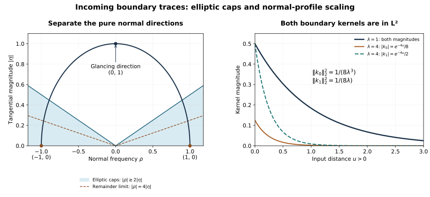

# Boundary traces of the incoming field

The incoming-field theorem carries the full-space solution through a strict glancing tangency. Its ordinary wavefront conclusion allows pure normal covectors, so restriction to the boundary requires another argument. This supplement supplies that argument for both the value and the actual weak normal trace. It does not yet prove that boundary data outside the Airy patch have a harmless response inside that patch.

**Original exposition, proofs, exercises and figure: CC0-1.0.** The source antecedents are the approved Hörmander III treatment of compressed quantization and the exact programme proofs linked below. Those books remain admitted sources. Required Lebl proofs remain external author-edition dependencies: this export does not claim internal P514 closure. See the proof map, source credit and [review](proof-review.json).

## 1. The precise trace statement

**T0. Fixed source neighborhood and ordinary operator.** Write \(q\geq0\) for the physical normal coordinate, \(z\in\mathbb R^d\) for all tangential coordinates, including time, and \(D=-i\partial\). The compressed normal frequency is \(\sigma=q\rho\); \(\eta\) is tangential frequency. Fix
\[
 b_0=(0,z_0;0,\eta_0),\qquad \eta_0\ne0.
 \tag{IT1}
\]
Let \(g\) be compactly supported and L2 on the half-space. Assume that it has every compressed L2 order on one fixed neighborhood \(O\) of \(b_0\), in the sense used in ZE:Z0–Z1. Let \(e^+g\) denote its zero extension. If \(Q\) is a properly supported ordinary matrix pseudodifferential operator of order \(m<-1/2\), then
\[
 (z_0,\eta_0)\notin\operatorname{WF}(\gamma Qe^+g).
 \tag{IT2}
\]
Here \(\gamma\) is the continuous Sobolev trace: locally \(Qe^+g\in H^{-m}\), and \(-m>1/2\). No restriction of \(e^+g\) itself is asserted. In particular, (IT2) applies to \(Q\in\Psi^{-2}\) and to \(D_qQ\in\Psi^{-1}\), with the derivative taken on the output of the full-space operator.

All supports below lie in fixed compact coordinate patches. Nested cutoffs separate the receiving face patch from irrelevant input points. The ordinary full-symbol reduction, Sobolev bounds and pseudolocality are the complete earlier ordinary calculus; the full compressed cutoff and its actual L2 action are ZE:Z1 and LB. Every estimate below is entrywise for finite matrices, hence also holds in matrix norm.

## 2. A normal Fourier profile in L2

**T1. The profile estimate.** Put \(\lambda=\langle\eta\rangle\). A full left symbol \(a(q,z,\eta,\rho)\in S^m\), evaluated at \(q=0\), gives the boundary kernel
\[
 k(z,\eta,u)=\frac1{2\pi}\int_{\mathbb R}
       e^{-iu\rho}a(0,z,\eta,\rho)\,d\rho,\qquad u>0.
 \tag{IT3}
\]
This is initially a partial Fourier transform in L2, rather than an absolutely convergent integral at \(u=0\). For every \(j,\alpha,\beta\),
\[
 \left\|(u\partial_u)^j\partial_\eta^\alpha
                 \partial_z^\beta k(z,\eta,u)\right\|_{L^2(\mathbb R_u)}
       \le C_{j\alpha\beta}\lambda^{m+1/2-|\alpha|}.
 \tag{IT4}
\]
Indeed, the corresponding symbol after \(j\) Euler derivatives is
\((-\partial_\rho\rho)^j\partial_\eta^\alpha\partial_z^\beta a\). The notation means repeated application of \(a\mapsto-\partial_\rho(\rho a)\); this preserves the indicated symbol order. Plancherel and the symbol bound give
\[
 \int_{\mathbb R}(\lambda^2+\rho^2)^{m-|\alpha|}\,d\rho
 =\lambda^{2m-2|\alpha|+1}
       \int_{\mathbb R}(1+s^2)^{m-|\alpha|}\,ds<\infty.
 \tag{IT5}
\]
For \(|s|\ge1\) the integrand is bounded by a constant times
\(|s|^{2m-2|\alpha|}\), whose integral converges since its exponent is less than \(-1\); it is bounded on \([-1,1]\). This proves (IT4), including all parameter derivatives.

The calculation is valid distributionally. To justify ordinary integrations first, multiply the symbol by a smooth cutoff in the full frequency \((\eta,\rho)\), equal to one near zero and tending to one as its radius increases. Every expression \((\rho\partial_\rho)^j\) applied to this cutoff is uniformly bounded, and its frequency derivatives have the ordinary decreasing-order bounds; the corresponding symbol estimates and (IT4) are uniform. Dominated convergence in the squared symbol integral proves convergence in L2 for each displayed derivative. Tangential regularizers have the same property on compact parameter sets.

On \(1/4\le r\le4\), the change \(u=q'r\) now gives, uniformly in \(r\),
\[
 \|\partial_r^j\partial_z^\beta k(z,\eta,q'r)\|_{L^2(dq')}
       \le C_{j\beta}\lambda^{m+1/2}.
 \tag{IT6}
\]
Here \(r\partial_r=u\partial_u\), and the Jacobian in the L2 norm contributes \(r^{-1/2}\). Smooth compact normal cutoffs preserve the bound by the product rule. Because \(m+1/2<0\), its right side is bounded as \(\eta\) varies. There is no need for a pointwise value of \(k\) at \(u=0\).

## 3. Split the source using the full compressed symbol

**T2. The part whose tangential derivatives are controlled.** Choose the strongly lacunary scalar \(B\in\Psi_b^0\) constructed in ZE:Z1. Its full microsupport is in \(O\), and its full symbol is one modulo a symbol of every negative order on a smaller fixed collar, a fixed cone about \(\eta_0\), and
\[
 |\sigma|\le3\delta|\eta|,\qquad \delta>0.
 \tag{IT7}
\]
Write \(R=I-B\). After the fixed receiving localization, every tangential derivative of \(Bg\) belongs to L2. This uses full compressed order bounds, since a tangential derivative of order \(j\) has compressed order \(j\). It does not use an ordinary normal derivative of \(g\).

The good part \(\gamma Qe^+(Bg)\) is tangentially smooth. To see this for every integer \(j\), commute \(D_z^\alpha\), \(|\alpha|\le j\), through \(Q\). Each commutator differentiates the full symbol in \(z\) and still has order \(m\); the remaining tangential derivatives act on \(Bg\). They commute with \(e^+\). Ordinary Sobolev continuity therefore puts each resulting output in \(H^{-m}\), and the trace theorem puts its boundary value in \(H^{-m-1/2}\). Thus all tangential derivatives of the localized trace are in a fixed Sobolev space. Weighted Fourier Cauchy–Schwarz, with sufficiently many derivatives, gives a smooth function.

Terms outside the fixed input collar and tangential base patch are also smooth at the receiving face patch. The kernel of the ordinary \(Q\), with those separated input and output supports, is smooth with every derivative bounded on the compact supports; pairing these derivatives with an L2 input is justified by Cauchy–Schwarz. Consequently it remains to estimate the trace of the actual \(R\) kernel where its full symbol \(a_R\) is residual on (IT7). No remainder has been discarded.

## 4. Compose the profile with the actual remainder kernel

**T3. Exact normal rescaling.** The full compressed kernel from intermediate \((u,w)\) to input \((q',v)\) is
\[
 \frac1{(2\pi)^{d+1}u}
 \int e^{\,i[(w-v)\cdot\zeta+(1-q'/u)\sigma]}
                   a_R(u,w,\zeta,\sigma)\,d\zeta\,d\sigma .
 \tag{IT8}
\]
As in ZE:Z2, insert a smooth normal-ratio cutoff supported where
\(1/4< u/q'<4\), equal to one on the actual kernel support.
It also preserves the identity kernel at ratio one. Insert this cutoff before frequency regularization. This procedure represents the actual operator in the limit, including the identity part of \(R\).

Fourier transformation of the localized boundary output at frequency \(\theta\), followed by \(u=q'r\), produces the phase
\[
 \Phi=z\cdot(\eta-\theta)+w\cdot(\zeta-\eta)-v\cdot\zeta
                +(1-r^{-1})\sigma,\qquad
 \partial_r\Phi=\sigma/r^2 .
 \tag{IT9}
\]
The amplitude contains \(k(z,\eta,q'r)a_R(q'r,w,\zeta,\sigma)\), the fixed cutoffs, and \(1/r\), because \(du/u=dr/r\). All \(r\) derivatives of the profile satisfy (IT6). An \(r\) derivative of the symbol contributes \(q'\partial_u a_R\), with no negative power of \(q'\). On the compact collar these remain order-zero symbol bounds, or arbitrary negative orders on (IT7). The same statements hold for all \(z,w\) derivatives.

We will estimate the Fourier kernel \(K_\theta(q',v)\) in L2 of the compact input variables, not pointwise in \(q'\). For any finite integral of such amplitudes,
\[
 \left\|\int h(\omega,\cdot)\,d\omega\right\|_2
       \le\int\|h(\omega,\cdot)\|_2\,d\omega .
 \tag{IT10}
\]
For completeness, pair the left integral with an arbitrary L2 test of norm one, move the finite integral past the pairing, and use Cauchy–Schwarz. Taking the supremum over the tests proves the inequality. Approximation by finite simple functions and completeness extend it whenever the right side is finite. The estimates next prove precisely that finiteness, uniformly in the regularizers.

## 5. All tangential and normal frequency regions

**T4. Rapid boundary Fourier decay.** Let \(\theta\) lie in a sufficiently small fixed cone about \(\eta_0\), \(|\theta|\ge1\), and put \(\Lambda=\langle\theta\rangle\). Split the \((\eta,\zeta)\) variables by
\[
 |\eta-\theta|+|\zeta-\eta|\le a\Lambda
       \quad\hbox{or its complement},\qquad 0<a\ll1.
 \tag{IT11}
\]
Use a smooth partition with a slightly larger near region. In the near region both frequencies have size comparable to \(\Lambda\), lie in the cone in (IT7), and range over a volume \(O(\Lambda^{2d})\).

For \(|\sigma|\le2\delta|\zeta|\), the full remainder symbol and all needed derivatives have size \(O(\Lambda^{-L})\) for every \(L\). Its \(\sigma\) interval has length \(O(\Lambda)\). Equations (IT6) and (IT10) give
\[
 \|K_{\theta,\mathrm{near,low}}\|_2
       \le C_L\Lambda^{2d+1+m+1/2-L}.
 \tag{IT12}
\]
On the other near piece, \(|\sigma|\ge\delta|\zeta|\ge c\Lambda\). Integrate \(L\) times in \(r\), using
\(e^{i\Phi}=r^2(i\sigma)^{-1}\partial_r e^{i\Phi}\).
There are no endpoint terms because the ratio cutoff is compactly supported in \((1/4,4)\). Each resulting amplitude has L2 norm at most
\(C_L|\sigma|^{-L}\Lambda^{m+1/2}\). For \(L>1\), integrating \(\sigma\) gives \(C_L\Lambda^{1-L}\), and hence the same arbitrarily decreasing bound as (IT12). Smooth partitions in \(\sigma/|\zeta|\) are independent of \(r\).

On the far tangential region put \(S=\Lambda+|\eta|+|\zeta|\). The triangle inequality implies
\[
 \max\{|\eta-\theta|,|\zeta-\eta|\}\ge c_a S .
 \tag{IT13}
\]
Indeed \(S\le3\Lambda+2(|\eta-\theta|+|\zeta-\eta|)\), while the far condition bounds \(\Lambda\) by a constant times the sum of these two differences. Partition this region into the two cases in (IT13). In the first integrate in \(z\) using its phase gradient \(\eta-\theta\); in the second integrate in \(w\) using \(\zeta-\eta\). After \(L\) integrations this contributes \(S^{-L}\). All base derivatives preserve (IT6) and the order-zero bounds for \(a_R\).

For \(|\sigma|\le2S\), its interval length is \(O(S)\); since
\(\langle\eta\rangle^{m+1/2}\le1\), the resulting bound is
\[
 C_L\int_{\mathbb R^{2d}}S^{1-L}\,d\eta\,d\zeta
       \le C'_L\Lambda^{2d+1-L}\quad(L>2d+1).
 \tag{IT14}
\]
For \(|\sigma|\ge S\), add \(J>1\) integrations in \(r\). Integrating
\(|\sigma|^{-J}\) first yields \(C_JS^{1-J}\), so the bound is
\(C_{LJ}\Lambda^{2d+1-L-J}\) when the exponent is integrable.
The last integrals follow by scaling \((\eta,\zeta)=\Lambda(\eta',\zeta')\) and comparison on radial shells in dimension \(2d\). Choose \(L\) as large as needed; there is no upper limit on the available symbol derivatives.

Compact \(z,w,r,v\) integrations only change these constants. Both partitions can be selected with constants independent of \(\theta\) in one fixed smaller cone. We have proved, for every \(M\),
\[
 \|K_\theta\|_{L^2(dq'\,dv)}
       \le C_M\langle\theta\rangle^{-M}.
 \tag{IT15}
\]

**T5. Identification with the actual Sobolev trace.** First perform the calculation with compact full-frequency regularizers and smooth inputs supported away from \(q'=0\). All integrations then have their literal meanings. The full compressed kernel and its ratio cutoff have the actual L2 limit from LB and ZE, with uniform order-zero bounds. For \(Q\), right composition with the ordinary full-frequency cutoff gives precisely the regularized left symbol, a uniform \(L^2\to H^{-m}\) bound and strong convergence on every L2 input. The profile regularizers have the uniform bounds and L2 limits from T1. Thus (IT12)–(IT15), including all integrations by parts, pass to the distributional composite kernel; (IT10) supplies the required uniform integrable majorants. One can first remove the \(Q\) regularizer for each fixed compressed regularizer and then remove the latter. The bounds above hold uniformly in both radii.

Finally approximate an arbitrary compact L2 input by smooth interior inputs in L2. The actual operator \(R\) is bounded on L2; extension by zero is an L2 isometry; \(Q:L^2\to H^{-m}\) and \(\gamma:H^{-m}\to H^{-m-1/2}\) are continuous locally. Hence these traces converge to the actual trace in (IT2). Pairing \(K_\theta\) with the input also converges uniformly after multiplication by any power of \(\langle\theta\rangle\), by (IT15) and Cauchy–Schwarz. These limits are the same distribution. The fixed-cutoff Fourier definition of wavefront therefore proves (IT2), with one fixed base patch and cone for all orders. Together with T2 this completes the trace theorem.

## 6. Separate the large normal frequencies of the incoming solution

**T6. The elliptic normal caps.** Apply the theorem to the normalized incoming field \(V\in H^1_{\rm loc}\) from IC and ZE. Its complete equation is
\[
 PV=e^+G,\qquad
 P=D_q^2+T_2(q,z,D_z)+b_q(q,z)D_q+T_1+c ,
 \quad p=\rho^2+r(q,z,\eta).
 \tag{IT16}
\]
The principal symbol is scalar and real; all smooth complex matrix lower terms are retained. The compact L2 source \(G\) is the entire BPL source, with every compressed order on the fixed \(O\). At the glancing point \(r(0,z_0,\eta_0)=0\). ZE proves ordinary regularity of \(V\) at \((0,z_0;0,\eta_0)\), and ordinary regularity of \(e^+G\) at every finite normal lift.

On a fixed base patch, \(|r|\le C_0|\eta|^2\). Choose \(C\) with \(C^2>2C_0\). Then \(p\) is elliptic on both normal caps \(|\rho|\ge C|\eta|\), uniformly by a positive multiple of \(\rho^2+|\eta|^2\). The complete ordinary matrix parametrix [K:K2–K3](../20261004-free-intrinsic-graph/prerequisites/conic-parametrices-and-localization.md) gives a properly supported \(Q\in\Psi^{-2}\) such that \(I-QP\) is microlocally smoothing on slightly smaller caps. Choose the construction so that its residual microsupport on the receiving base patch lies in \(|\rho|\le2C|\eta|\). Low frequencies contribute smooth terms.

Take a compact cutoff \(\chi=1\) on a larger patch than the receiving one. Define the actual distributions
\[
 h=P(\chi V)=e^+(\chi G)+[P,\chi]V,\qquad
 w=\chi V-Qh .
 \tag{IT17}
\]
Both summands of \(h\) are L2: the commutator has order one. The cutoffs are full-space smooth and \(\chi e^+G=e^+(\chi|_{q\ge0}G)\). The separated-support kernel of \(Q\) sends \([P,\chi]V\) to a smooth function on the receiving patch, including all its boundary derivatives. Thus (IT17) gives there
\[
 V=Qe^+(\chi G)+w+\text{a smooth function},\qquad
 \operatorname{WF}(w)\subset\{|\rho|\le2C|\eta|\}.
 \tag{IT18}
\]
The second assertion follows directly from \(w=(I-QP)(\chi V)\). It is an ordinary wavefront assertion on a full neighborhood of the face, and excludes pure normal covectors.

At the central tangential covector, \(V\) is regular for \(\rho=0\) by ZE. For every finite \(\rho\ne0\), \(p=\rho^2\ne0\), and the ordinary elliptic parametrix and source regularity give the same conclusion. Ordinary pseudolocality gives regularity of \(Qh\) at these lifts as well; the commutator support is separated. Consequently \(w\) is regular at every lift of \((z_0,\eta_0)\) that remains in its finite-normal cone. That normalized lift set is compact. A finite subcover of the ordinary regularity neighborhoods supplies one receiving tangential neighborhood, rather than neighborhoods shrinking with an unbounded normal frequency.

The smooth pullback theorem [FC:S1–S3](../20261005-restored-first-order-cauchy/smooth-pullback-and-time-slices.md) now applies to \(w\) and \(D_qw\). Its wavefront inclusion gives
\[
 (z_0,\eta_0)\notin
       \operatorname{WF}(\gamma w)\cup
       \operatorname{WF}(\gamma D_qw).
 \tag{IT19}
\]
This use of pullback is justified for \(w\); applying it directly to \(V\) before removing the normal caps would not be justified.

## 7. The trace in the weak boundary equation

**T7. Identification of the normal graph trace.** The equation (IT16) implies
\[
 D_qV\in L^2,\qquad
 D_q^2V\in L^2_qH^{-1}_z .
 \tag{IT20}
\]
Indeed every second tangential derivative of an H1 function is a tangential derivative of an L2 function; coefficient derivatives and the remaining terms are L2. Local smooth multipliers act on \(H^{-1}_z\) by the dual of the H1 product rule. The graph trace WSL:L6 therefore defines \(\gamma D_qV\in H^{-1/2}_{\rm loc}\), with its actual Green identity. We must identify this trace in the decomposition (IT18).

The term \(Qe^+(\chi G)\) is H2, so its normal derivative is H1. Smooth full-space approximation converges in H2 and hence in both graph norms of WSL:L6. Its ordinary Sobolev trace and graph trace consequently agree.

For \(w\), localize on a smaller compact patch and choose an ordinary full Fourier multiplier \(A(\rho,\theta)\) equal to one on its wavefront cone and supported in \(|\rho|\le C_1\langle\theta\rangle\). By the finite-normal assertion in (IT18), this writes the localized \(w\) as \(f=A(D)w\) plus a smooth function. The multiplier and its derivatives have ordinary order zero: in its transition region \(|\rho|\) and \(\langle\theta\rangle\) are comparable. Let smooth \(w_n\to w\) in H1 and set \(f_n=A(D)w_n\). The support condition proves
\[
 \|\langle D_z\rangle^{-1}D_q^2(f_n-f)\|_2
       \le C_1\|D_q(w_n-w)\|_2\,\|A\|_\infty .
 \tag{IT21}
\]
This follows from \(\rho^4/\langle\theta\rangle^2\le C_1^2\rho^2\) on the multiplier support. Thus the normal derivatives converge in both graph norms, and their graph traces converge in \(H^{-1/2}\).

The ordinary Fourier restriction of \(D_qf\) is equally continuous in this H1 norm. With \(\lambda=\langle\theta\rangle\), Cauchy–Schwarz gives, up to the fixed Fourier normalization,
\[
 \left|\int \rho\,\widehat f(\rho,\theta)\,d\rho\right|^2
 \le
 \left(\int_{|\rho|\le C_1\lambda}
               \frac{\rho^2}{\lambda^2+\rho^2}\,d\rho\right)
 \left(\int(\lambda^2+\rho^2)|\widehat f|^2\,d\rho\right),
 \quad
 \int_{|\rho|\le C_1\lambda}
        \frac{\rho^2}{\lambda^2+\rho^2}\,d\rho
       =2\lambda(C_1-\arctan C_1).
 \tag{IT22}
\]
Multiplication by the squared \(H^{-1/2}\) weight \(\lambda^{-1}\) and integration in \(\theta\) prove the continuity. This Fourier restriction is the pullback from FC:S1: insert compact smooth frequency cutoffs in that defining integral, and pass to the displayed weighted L2 limit. Therefore both traces agree on the smooth \(f_n\) and have the same limit. Smooth remainders cause no ambiguity. The value trace agrees as well, by its H1 trace continuity or FC:S8.

We have identified, rather than renamed, the graph trace in (IT20) with the sum of the two traces used in (IT18)–(IT19). No derivative was passed through \(e^+\); in particular no boundary delta was omitted.

## 8. Apply the result to the actual boundary datum

**T8. Incoming boundary regularity and its exact scope.** Apply T0–T5 to \(Q\) and \(D_qQ\) in (IT18). Their orders are \(-2\) and \(-1\), respectively. Combine (IT19) and T7 to obtain
\[
 (z_0,\eta_0)\notin
       \operatorname{WF}(\gamma V)\cup
       \operatorname{WF}(\gamma D_qV).
 \tag{IT23}
\]
These are the actual traces of the actual incoming solution, under the BPL source and ZE incoming regularity hypotheses. Pure normal singularities of the full-space source and field were permitted throughout.

Near the glancing contact the initial time \(r\) in IC is strictly earlier, so the causal correction \(W=H(t-r)(U-V)\) equals \(U-V\) on a neighborhood of that contact. In the Dirichlet problem its imposed value is \(-\gamma V\). In the normalized Neumann problem its imposed \(D_q\) datum is \(-\gamma D_qV\). Only the imposed datum is identified this way: a homogeneous Dirichlet condition does not also set the normal derivative of \(U\) to zero. In terms of IC's physical normal derivative \(n=\gamma\partial_qW\), the \(D_q\) datum is \(-in\).

Both imposed data are thus microlocally smooth at \((z_0,\eta_0)\). The original smooth matrix Robin gauge preserves this conclusion: if \(U=S v\), then its face traces are \(S_0\gamma v\) and \(S_0\gamma D_qv+(D_qS)_0\gamma v\). Multiplication by smooth matrices preserves wavefront containment and the displayed matrix order is retained.

The next problem is the response to the remaining boundary frequencies and the cutoff errors on the complete closed dependence region. The complete-data condition of IC:C8 and TBU:T3 is still required for the Airy comparison. A datum being smooth at one covector does not by itself prove that this complementary response is smooth there. Sharp Airy energy mapping, strict propagation for the original weak solution and the remaining full course requirements are not concluded by (IT23).

## 9. Three solved exercises

### Exercise 1. Compute both kernels and their exact L2 scaling

For \(\lambda>0\), let \(Q_\lambda=(D_q^2+\lambda^2)^{-1}\) on the full normal line. Compute the kernels taking a source at \(u>0\) to \(\gamma Q_\lambda\) and \(\gamma D_qQ_\lambda\), including their signs and squared L2 norms.

**Solution.** The full-line Green kernel is \(G_\lambda(s)=e^{-\lambda|s|}/(2\lambda)\). It solves \((-\partial_s^2+\lambda^2)G=0\) off zero. It is continuous there and its derivative jump is \(-1\), so its distributional second derivative has delta coefficient \(-1\); therefore the equation is exactly \(\delta_0\). Exponential decay gives uniqueness of this inverse on the Fourier multiplier side. At output zero, \(s=-u<0\), and hence
\[
 k_0(u)=\frac{e^{-\lambda u}}{2\lambda},\qquad
 k_1(u)=-\frac{i}{2}e^{-\lambda u},\qquad
 \|k_0\|_2^2=\frac1{8\lambda^3},\quad
 \|k_1\|_2^2=\frac1{8\lambda}.
 \tag{IT24}
\]
These are exactly the squared powers predicted by (IT4) for orders \(-2\) and \(-1\). The minus sign in \(k_1\) comes from differentiating at the negative argument. Taking a symmetric value of a formal boundary symbol integral would lose that one-sided sign.

### Exercise 2. Why the ordinary H1 norm alone does not control the normal trace

Verify the integral and bound in (IT22), and exhibit smooth functions with bounded H1 norm whose normal traces have unbounded \(H^{-1/2}\) norm.

**Solution.** Substitute \(\rho=\lambda s\) and integrate \(s^2/(1+s^2)=1-(1+s^2)^{-1}\) to obtain \(2\lambda(C_1-\arctan C_1)\). The squared \(H^{-1/2}\) weight cancels this single factor of \(\lambda\), giving the claimed bound for functions in the finite-normal cone.

Choose compact smooth \(\psi\) with \(\psi'(0)\ne0\), and a nonzero compact smooth tangential \(\phi\). For positive integers \(j\) put
\[
 f_j(q,z)=j^{-1/2}\psi(jq)\phi(z),\qquad
 \|f_j\|_2^2=j^{-2}\|\psi\|_2^2\|\phi\|_2^2,\qquad
 \|\partial_qf_j\|_2^2=\|\psi'\|_2^2\|\phi\|_2^2 .
 \tag{IT25}
\]
Each tangential derivative has squared L2 norm proportional to \(j^{-2}\). Thus the H1 norms are bounded, while
\(\gamma D_qf_j=-i j^{1/2}\psi'(0)\phi\) has \(H^{-1/2}\) norm tending to infinity. The missing condition is control of the graph derivative or the finite-normal cone; T7 supplies it rather than assuming an H1 normal trace theorem.

### Exercise 3. Keep the Robin sign and matrix order

Let \(M\) be a smooth matrix and \(S(q,z)=\exp(-iqM(z))\). Show how \(D_qU+MU=0\) at the face becomes the bare condition for \(v\) when \(U=Sv\). For constant matrices
\[
 M=\begin{pmatrix}0&1\\1&0\end{pmatrix},\qquad
 B=\begin{pmatrix}0&1\\0&0\end{pmatrix},
 \tag{IT26}
\]
compute the first normal derivative of \(S^{-1}BS\) at zero.

**Solution.** The exponential series gives \(S_0=I\), \((\partial_qS)_0=-iM\), and \((D_qS)_0=-M\). Therefore
\(\gamma(D_qU+MU)=\gamma D_qv\), with the order of the factors fixed by the product rule. Both traces in (IT23) retain their regularity after this change. For the displayed matrices,
\[
 [M,B]=\begin{pmatrix}-1&0\\0&1\end{pmatrix},
 \qquad
 \partial_q(S^{-1}BS)|_0=i[M,B].
 \tag{IT27}
\]
Thus the transformed lower terms generally change even though the face trace simplifies. Replacing this ordered conjugation by \(B\) would erase a nonzero coefficient.

## 10. Exact figure and dependency scope

**F0. Exact coordinates of the figure.** The left panel uses \((\rho,|\eta|)\) as a frequency projection, with the unit semicircle \(\rho^2+|\eta|^2=1\). For the model wave symbol \(\rho^2+\xi^2-\tau^2\), \(|\eta|^2=\tau^2+\xi^2\), the region \(|\rho|\ge2|\eta|\) satisfies \(p\ge(3/5)(\rho^2+|\eta|^2)\). The outer normal region is therefore elliptic for every tangential direction. The lines \(|\rho|=2|\eta|\) and \(|\rho|=4|\eta|\) mark a possible parametrix overlap; the remainder is allowed only in \(|\rho|\le4|\eta|\). The marked point \((0,1)\) represents the glancing tangential direction \(\tau=\xi=1/\sqrt2\). The endpoints \((\pm1,0)\) are the pure normal directions.

The right panel plots the exact magnitudes \(e^{-\lambda u}/(2\lambda)\) and \(e^{-\lambda u}/2\) from Exercise 1 for \(\lambda=1,4\), \(0\le u\le3\). They coincide for \(\lambda=1\); their distinct normalization for \(\lambda=4\) is visible. This positive resolvent illustrates normal-profile integrability and its scaling; it is not asserted to be the complete inverse of the wave operator. The [figure script](figures/build_figure.py) retains the coordinates, functions and labels.

The proof map binds the full profile calculation, all frequency regions, actual operator limits, elliptic normal decomposition and weak trace identification to exact earlier proofs. Its transitive external dependencies stay external. The [algebra checks](model-check.json) supplement the analytic proofs above; finite model checks do not certify the general theorem.
