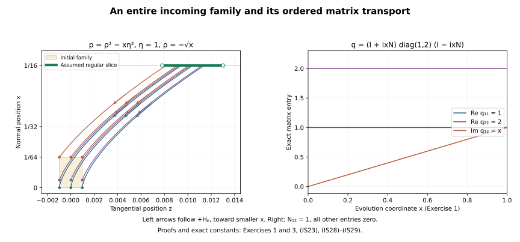

# Incoming root estimates on the full diffraction support

Independent exposition, proofs, exercises and illustration: GPT-6 Astra (OpenAI), Ultra, 9 October 2026. CC0-1.0.

A diffraction estimate uses an incoming first-order factor on an entire conic support. Knowing the principal square root, or knowing regularity at one arbitrary spacetime covector, does not establish that norm. We construct the full matrix factor, transport its cutoff with the matrix commutator retained, identify the actual weak Cauchy trace, and prove the required norm from a regular incoming germ.

The mathematical antecedent is Lars Hörmander, *The Analysis of Linear Partial Differential Operators III*, approved Springer 2007 eBook, Section 24.4, equation (24.4.14) and its justification on printed pages 448–449. The complete proofs used here are the [ordered calculus and systems evolution](../20261007-restored-first-order-systems/first-order-systems-and-ordered-evolution.md), [matrix oscillatory Cauchy construction](../20261007-restored-oscillatory-cauchy/oscillatory-cauchy-kernels-and-exact-evolution.md), [ordered graph transport](../20261005-restored-graph-egorov/graph-operators-continuity-and-egorov.md), and [normal root algebra](../20261007-restored-boundary-reflection/boundary-reflection-preparation.md). The actual weak trace is supplied by WSL:L6. We give the receiving matrix and rough-source arguments below. The proof map retains exact earlier providers; transitive Lebl proofs remain external. Internal P514 closure of this export is not claimed.

## 1. What the incoming hypothesis means

**I0. The receiving statement.** Work in a compact collar with normal coordinate \(x\ge0\), tangential coordinates \(z\), finite component space \(\mathbb C^n\), and \(D=-i\partial\). Let
\[
 P=D_x^2-R(x,z,D_z),\qquad \sigma_2(R)=r(x,z,\eta)I_n,
 \qquad p=\rho^2-r,
 \tag{IS1}
\]
where \(r\) is real and quadratic in \(\eta\), and all lower coefficients are arbitrary smooth complex matrices. An initial normal first-order coefficient can first be removed by the exact gauge NR:N8, retaining the resulting boundary condition; no boundary condition is used in this incoming lemma.

Suppose \(u\) is locally H1, \(Pu=f\in L^2\), and on one fixed open conic parameter neighborhood \(\Omega\),
\[
 \chi f\in L^2_xH^m_z\quad\hbox{for every real }m
 \quad\hbox{and every proper scalar tangential test }\chi
 \hbox{ compactly supported in }\Omega.
 \tag{IS2}
\]
All cutoffs have fixed compact base support. Take a strict anchor \(a=(0,z_*,\eta_*)\), with \(\eta_*\ne0\), \(r(a)=0\), and \(r_x(a)>0\). Its negative-normal characteristic germ lies in the interior. Assume one point on a sufficiently short such germ, with the intervening parameter projection inside \(\Omega\), is ordinarily regular for \(u\). Equivalently after shortening along the source-free ordinary characteristic, there is an open conic regular neighborhood \(\Gamma_1\) around its lift on a small positive slice \(x=x_1\). Condition (IS2) excludes the ordinary source wavefront at its finite-normal characteristic lifts: compact localization and arbitrary tangential derivatives give arbitrary Fourier decay on every cone with \(\eta\ne0\). Ordinary real-principal propagation justifies the shortening, with all complex matrix lower terms retained.

There is a fixed smaller parameter neighborhood \(\Omega_0\) of \(a\) with the following property. For every compact normalized conic set \(K\) contained in \(\Omega_0\cap\{r>0\}\), one can choose a full positive-root factor \(A_+\in\Psi^1_{\rm tan}\) near \(K\), with scalar principal symbol \(+\sqrt r\), such that every tangential test \(\phi\) supported in the interior of \(K\) satisfies
\[
 \phi(D_x-A_+)u\in L^2_xH^m_z
                         \quad\hbox{for every real }m.
 \tag{IS3}
\]
Here “compact normalized” means compact after setting \(|\eta|=1\), including the allowed face \(x=0\). The chosen set has a positive lower bound \(r\ge c_K|\eta|^2\). Constants and the extended full factors may depend on \(K\); no uniform bound as \(c_K\downarrow0\) is asserted. The neighborhood \(\Omega_0\) and the source and regular-germ assumptions are fixed independently of the Sobolev order.

## 2. A regular slice sees every sufficiently near negative lift

**I1. The complete incoming tube stays in the source region.** Normalize the initial tangential covector near \(\eta_*\). On a sufficiently small compact neighborhood of the strict arc, \(r_x\ge c|\eta|^2>0\), and covector lengths stay comparable by the smooth homogeneous flow bounds. Under the reversed Hamilton flow,
\[
 \frac{dx}{ds}=-2\rho,\qquad
 \frac{d\rho}{ds}=-r_x.
 \tag{IS4}
\]
If the initial lift is negative, \(\rho=-\sqrt r\le0\), its normal component decreases and its base normal coordinate increases. At the anchor the initial first derivative of \(x\) vanishes but the second is \(2r_x>0\). Thus every punctured reversed arc from the anchor is interior. No reflection is needed on this negative branch.

Choose a short reference hitting time at which the anchor's reversed orbit reaches \(x_1>0\) inside \(\Gamma_1\). At that hit \(\rho<0\), so the derivative of \(x\) along the reversed flow is strictly positive. Smooth dependence and the implicit-function theorem give a smooth hitting time and hitting map for all full initial covectors in a neighborhood of the anchor. On their characteristic negative lifts this gives
\[
 (x,z,\eta)\longmapsto
    \exp(-s(x,z,\eta)H_p)(x,z;-\sqrt r,\eta)
                         \in\Gamma_1\cap\{x=x_1\}.
 \tag{IS5}
\]
The square root is continuous up to \(r=0\), which is enough to choose one common \(\Omega_0\) for this image assertion. It is smooth on each compact \(K\) used in I0. The whole normalized reference arc is compact and lies over \(\Omega\); a finite open cover and continuous dependence keep every shortened nearby arc over \(\Omega\) as well. Shrink \(\Omega_0\) so that its base normal coordinates are less than \(x_1/2\). On negative initial lifts (IS4) keeps the entire reversed arc in \(x\ge0\). Positive homogeneity supplies the unnormalized statement, with the corresponding inverse scaling of Hamilton time.

For each point of a given \(K\), a small neighborhood has a closed incoming tube to \(x_1\) on which \(r\) stays uniformly positive. It can be prolonged a little beyond the target normal coordinate and beyond \(x_1\), still inside the hyperbolic and source regions. At a target on \(x=0\), only the positive-side prolongation is required. At an interior target choose a lower endpoint \(a_j>0\) slightly below it. Compactness gives finitely many such tubes, on intervals \([a_j,x_1+\epsilon_j]\). One must not continue an interior target's tube all the way to the face if it would meet a turning point first.

On the negative characteristic graph, dividing Hamilton's equations by \(2\rho\) gives the normal-coordinate flow
\[
 \frac{dz}{dx}=\partial_\eta\sqrt r,
 \qquad \frac{d\eta}{dx}=-\partial_z\sqrt r.
 \tag{IS6}
\]
It is the flow of \(\partial_x-H_{\lambda_-}\), with \(\lambda_-=-\sqrt r\). Increasing \(x\) here is opposite to the Hamilton orientation on the negative branch. This sign determines the factor that carries the incoming information.

## 3. Construct the actual matrix roots

**I2. Exact cancellation of the normal coefficient.** On a neighborhood of the finite union of tubes, extend \(r\) with a scalar cutoff to a positive symbol on the whole tangential chart, equal to \(r\) on a larger neighborhood of those tubes and bounded below by a positive multiple of \(\langle\eta\rangle^2\). A convex combination with a fixed positive quadratic symbol preserves positivity where the cutoff changes. Complete the low frequencies smoothly. Extend all lower tangential matrix coefficients as bounded symbol families. Denote the resulting full tangential operator by \(R_e\), and put \(P_e=D_x^2-R_e\). On the selected tubes \(P_e-P\) has a tangentially smoothing full symbol; it has no normal derivative. Fixed proper realizations retain their actual smooth kernel errors.

Construct \(A_+\) with principal symbol \(+\sqrt r\), and impose \(A_-=-A_+\) as an exact operator equality. Direct multiplication gives
\[
 P_e=(D_x-A_-)(D_x-A_+)+S,
 \qquad
 S=A_+^2-i\partial_xA_+-R_e.
 \tag{IS7}
\]
The normal coefficient is exactly zero before symbolic approximation. To make \(S\) tangentially smoothing, begin with a smooth positive square root \(\lambda_+\) at high frequency. Its initial defect has order one. If a partial construction has full defect symbol \(d_j\in S^{1-j}\), add a correction of order \(-j\) with symbol
\[
 b_j=-\frac{d_j}{2\lambda_+}
                  \quad\hbox{at high frequency}.
 \tag{IS8}
\]
Division is scalar, with a uniform root gap on the extended family. In the two products with \(A_+\), the leading contribution is exactly \(2\lambda_+b_j=-d_j\). Every composition derivative, the normal derivative of \(b_j\), products with the previous order-zero lower part, and \(b_j^2\), have order at most \(-j\). Thus the new defect drops one order. The full matrix products retain their order; no lower matrices are diagonalized or commuted.

Parameter-aware symbol summation, with frequency radii independent of \(x\), produces an actual \(A_+\) whose defect belongs to every negative order with all normal derivatives. Comparison with each finite partial construction proves this assertion for the full ordinary symbol, without assuming that its lower terms are classical. Reimpose \(A_-=-A_+\) on the sum. Consequently
\[
 S\in C^\infty_x\Psi^{-\infty}_{\rm tan},\qquad
 \sigma_1(A_\pm)=\pm\sqrt r\,I_n
                   \quad\hbox{on every selected tube}.
 \tag{IS9}
\]
This is the ordered Riccati construction behind RF:A2, now with the positive root in the right factor, precisely the ordering needed in (IS3).

## 4. Transport the cutoff with its matrix commutator

**I3. A complete commuting test.** Put \(L_-=D_x-A_-\). For each of I1's finite tubes choose a scalar tangential cutoff \(Q_1\) on \(x=x_1\), whose full symbol is supported in the regular slice cone and is one near the tube's selected hitting image. There is a proper matrix family \(Q(x)\in\Psi^0_{\rm tan}\), elliptic on a smaller tube, with
\[
 [L_-,Q]\in C^\infty_x\Psi^{-\infty}_{\rm tan},
                      \qquad Q(x_1)=Q_1.
 \tag{IS10}
\]
Its full microsupport stays in the fixed larger tube modulo smoothing. The equality at the slice is an actual operator equality.

Here is the full matrix construction. Write the left symbol of \(A_-\) as \(\lambda I_n+c\), with real scalar \(\lambda\) of order one, homogeneous at high frequency, and full matrix \(c\in S^0\). For a symbol \(q\) of order \(-j\), the leading commutator at that same order is \(-i\mathcal Tq\), where
\[
 \mathcal Tq=(\partial_x-H_\lambda)q-i[c,q].
 \tag{IS11}
\]
All other composition terms lose at least one order. This follows by inserting the first left-composition term: \([\lambda,q]\) contributes \(-iH_\lambda q\), while multiplication by \(c\) contributes its genuine matrix commutator. Dropping \([c,q]\) would be wrong for a matrix correction.

The leading scalar symbol is the transport of the symbol of \(Q_1\) by \(\partial_x-H_\lambda\); its matrix commutator is zero. Its full commutator defect therefore has order minus one. At a later step with defect \(d_j\in S^{-j}\), solve \(\mathcal Tq_j=-id_j\) with zero initial value. Along a characteristic let \(M'=icM\), \(M(x_1)=I_n\). The ordered inverse satisfies \((M^{-1})'=-iM^{-1}c\), and the solution is
\[
 q_j(x)=M(x)\left[
        \int_{x_1}^{x}M(v)^{-1}(-id_j(v))M(v)\,dv
                    \right]M(x)^{-1}.
 \tag{IS12}
\]
All coefficients are evaluated along that characteristic. Differentiation proves (IS12) and the sign in (IS11). The ordered matrix ODE proof gives uniform symbol bounds for \(M,M^{-1}\); a frequency derivative of the homogeneous flow gains the compensating inverse degree. Differentiating (IS12), including both endpoint terms, gives \(q_j\in S^{-j}\) with every normal-parameter derivative. Correcting by this term makes the commutator defect order \(-j-1\).

Choose support-preserving full representatives of the defects. Their finite symbolic expressions vanish outside the transported support, and the difference from the actual composition is smoothing by the complete remainder theorem. Formula (IS12) then has that same transported support. Summing with parameter-independent radii preserves all zero initial correction values and gives a full smoothing commutator. Quantize with fixed proper cutoffs. Any initial smoothing discrepancy is removed by subtracting a smooth family equal to that discrepancy near \(x_1\); its commutator remains smoothing. This proves (IS10), including compact input/output support for the smoothing errors. The leading scalar symbol remains one on the smaller tube, so the full matrix \(Q\) is elliptic there.

## 5. Identify the actual weak first-order solution

**I4. The equation and its actual trace.** Define on one of the intervals of I1
\[
 v=(D_x-A_+)u,\quad w=Qv,
 \qquad
 L_-w=g:=Qf+Q(P_e-P)u-QSu+[L_-,Q]v.
 \tag{IS13}
\]
This is an exact distributional identity. The input is H1, so \(v\in L^2_xL^2_z\). Every term of \(g\) lies in \(L^2_xH^m_z\) for every \(m\): insert a larger scalar test equal to one on \(Q\)'s full microsupport before \(f\) and use (IS2); the separated remainder is smoothing. The other three coefficients in (IS13) are tangentially smoothing on the actual compact L2 inputs. The full root extension discrepancy is retained in \(Q(P_e-P)u\); it is not set to zero. All norms include the whole closed tube interval.

Since \(A_-\) has order one, (IS13) gives
\[
 w\in L^2_xL^2_z,\qquad
 D_xw\in L^2_xH^{-1}_z,\qquad
 w(x_1)\in H^{-1/2}_z.
 \tag{IS14}
\]
The last is the actual graph trace proved by WSL:L6 or LG:L1. Also \(w\) has the absolutely continuous \(H^{-1}\)-valued representative obtained by integrating its derivative; its value agrees with that trace. This representative follows by testing the distributional derivative against a countable dense set of Sobolev vectors, integrating the scalar identities, and using the Hilbert representation theorem. Approximation in the two norms identifies the values. The same observations apply to \(v\): its full equation has right side in \(L^2H^{-1}\), because \((P_e-P)u\) has tangential order two on H1. Thus trace commutation gives \(w(x_1)=Q_1v(x_1)\). The slice distribution is compactly supported in the fixed output support of \(Q_1\).

Let \(E_-(x,y)\) be the exact all-real Sobolev evolution for \(D_x-A_-\). The scalar real principal symbol and bounded complex order-zero part give both time orientations in the systems theorem: the Hermitian parts of \(\pm iA_-\) are order zero. Its actual solution with the trace in (IS14) and source \(g\) is
\[
 w(x)=E_-(x,x_1)w(x_1)
              +i\int_{x_1}^{x}E_-(x,y)g(y)\,dy.
 \tag{IS15}
\]
The integral is oriented for \(x<x_1\). The factor \(i\) is required by \(D=-i\partial\). The constructed right side is continuous in \(H^{-1/2}\); the integral alone is continuous in every \(H^m\), since \(g\in L^2H^m\subset L^1H^m\) on the finite interval.

For completeness, uniqueness identifies (IS15) with the actual weak \(w\), rather than with a new solution selected by a formal trace. The difference has zero trace, is continuous in \(H^{-1}\), and satisfies \(D_xh=A_-h\) distributionally. For a smooth terminal Sobolev vector \(\varphi\), use
\[
 \varphi_x=E_-(x_1,x)^*\varphi,
                   \qquad \partial_x\varphi_x=iA_-^*\varphi_x.
 \tag{IS16}
\]
The linear-first pairing has derivative zero: the contribution from \(h'=iA_-h\) cancels the conjugate-linear contribution from (IS16). The pairing is absolutely continuous, first after Fourier regularization, and then by the finite Sobolev mapping bounds and density. Choose the test order high enough to pair the actual derivative, which is in a fixed negative Sobolev space. Its value at \(x_1\) is zero, so all smooth-vector pairings vanish at every \(x\). Hence \(h=0\). This also establishes the stronger continuous representative of the original \(w\).

## 6. Recover a smooth slice without assuming it

**I5. Separate the tangentially regular forcing contribution.** Write (IS15) as \(w=h+s\), with homogeneous part \(h=E_-(x,x_1)w(x_1)\). The source contribution \(s\) is continuous in every tangential Sobolev space. After compact base localization, all tangential derivatives are L2 in spacetime and therefore L1. Integration by parts in the tangential Fourier transform gives arbitrary frequency decay uniformly in the normal Fourier variable. In particular \(s\) has no ordinary wavefront covector with nonzero tangential component. Pure normal wavefront is allowed; no smooth normal-source hypothesis has been inserted.

The homogeneous part has ordinary spacetime wavefront contained in
\[
 \rho=\lambda_-(x,z,\eta),\qquad \eta\ne0.
 \tag{IS17}
\]
Here is the receiving justification. The complete matrix Cauchy kernel has local phases \(S(x,x_1,z,\theta)-y\cdot\theta\), smooth in both evolution parameters, with \(S_x=\lambda_-(x,z,S_z)\), and an order-zero full matrix amplitude. Its phase estimates keep \(|S_z|\) comparable to \(|\theta|\). After a compact output localization, outside (IS17) either a normal or a tangential phase derivative is bounded below by a positive multiple of the frequency. Repeated integration by parts, taking more derivatives than the finite order of the compact datum, proves rapid Fourier decay there. The parameter-smooth residual has every global output Sobolev order by the exact evolution correction theorem. A finite collection of short-time graph charts gives the result on the whole interval. In particular no pure normal direction remains for \(h\). This uses the full matrix amplitude; its lower matrices do not change the scalar graph.

The original \(u\) is ordinarily regular on \(\Gamma_1\). Applying \(D_x-A_+\) and the tangential \(Q\) preserves ordinary regularity there. This assertion concerns a finite-normal cone with \(\eta\ne0\): insert a full-frequency cutoff equal to one on a larger such cone, where the tangential symbols are ordinary symbols after the cutoff. In the complementary composition, the separated full frequencies give arbitrarily smoothing terms. For very large input normal frequency use integration in the smooth normal coefficient variable; for separated tangential frequencies use the tangential composition variables. Every differentiation is controlled by the original symbol seminorms and the compact input's finite distributional order. The full ordinary remainder estimate proves the assertion. It does not declare a tangential symbol to be an ordinary full-frequency symbol near a pure normal direction.

Thus \(w\), and hence \(h=w-s\), is regular at every negative graph lift over the microsupport of \(Q_1\), on the slice \(x=x_1\). This slice is interior to the slightly prolonged interval chosen in I1. All its other normal lifts for \(h\) are regular by (IS17), and no pure normal lift exists. The transverse pullback theorem therefore gives tangential regularity of the actual trace of \(h\) over that entire slice microsupport. The pullback equals its continuous Sobolev value by the programme trace-identification theorem. Since \(s(x_1)=0\), this trace is exactly \(w(x_1)\).

Outside the microsupport of \(Q_1\), the identity \(w(x_1)=Q_1v(x_1)\) is tangentially smoothing on the known \(H^{-1/2}\) trace. Therefore \(w(x_1)\) is smooth everywhere and, by compact support, belongs to every global \(H^m\). The all-order bounds in (IS15) now prove
\[
 Q(D_x-A_+)u=w\in C_xH^m_z
                           \quad\hbox{for every real }m.
 \tag{IS18}
\]
This derives the needed smooth slice from the incoming spacetime regularity and the actual equation. It never takes a smooth trace of \(u\) from regularity at only one normal lift, and it allows the original source to be rough in \(x\).

## 7. Cover the full support and use the actual corrected solution

**I6. Finite covering gives the incoming norm.** For a fixed \(K\), use I1's finite tube cover and I2's single full root construction on their union. Let \(Q_j\) be I3's tests, elliptic on their smaller target patches. Choose a smooth conic partition on a neighborhood of the normalized support of \(\phi\). Full tangential elliptic parametrices give
\[
 \phi v=\sum_j B_jQ_jv+Tv,
           \qquad B_j\in\Psi^0_{\rm tan},\quad
                  T\in\Psi^{-\infty}_{\rm tan}.
 \tag{IS19}
\]
Each coefficient is a smooth normal family supported in the appropriate interval. The finite partition contains the compact-frequency contribution in \(T\). All proper kernel errors have the same smoothing bounds; the full symbol equality, not merely principal equality, is used. Equation (IS18) bounds each \(B_jQ_jv\) in \(L^2_xH^m_z\); the residual acts on the actual L2 input \(v\). This proves (IS3) on the entire support of \(\phi\).

For the two incoming supports of SDC:S8, choose \(K\) containing their union and a slightly larger neighborhood, still inside \(\Omega_0\cap\{r>0\}\). The strict commutant construction permits its parameter to be made small enough to lie inside the fixed \(\Omega_0\), after its damping constant is fixed. Its retained incoming support satisfies a positive bound \(r\ge c_\alpha|\eta|^2\). The full \(A_+\) above is an admissible choice for both factors in LG4. For every finite order \(s\),
\[
 \phi_\alpha(D_x-A_+)u\in L^2_xH^s_z,
                              \qquad \alpha=1,2.
 \tag{IS20}
\]
The construction is fixed for these two supports before taking any Sobolev norms. Rechoosing the commutants for a later damping constant may change \(K\) and its constants, but not the source and geometric neighborhood \(\Omega_0\).

**I7. Return to the original weak-source reduction.** LG:L7 and ECR:M7 furnish the actual objects
\[
 PU=F\in L^2,\qquad
 Z=r_+QE e_+F,\qquad W=U-Z,
 \tag{IS21}
\]
with \(PW\) tangentially regular in every \(L^2H^m\) on one fixed neighborhood. The normal-cap correction is ordinarily regular near the characteristic set, so a regular incoming germ of \(U\) is a regular incoming germ of \(W\). It also preserves every original compressed H1 order by ECR:M7. Therefore I0–I6 apply to \(W\), with its exact source, complete matrix coefficients and all localization terms retained. They verify LG4 on both entire chosen supports.

For the Dirichlet reduction, LG:L7 already proves that the actual value trace of \(W\) is tangentially smooth. Consequently the finite-order theorem LG:L0 now has a proved incoming hypothesis: whenever its remaining local mixed-norm hypothesis holds at order \(s\), it gives
\[
 KW\in\mathcal X_{s+1/2},\qquad
 \gamma D_xW\in H^{s-1/2}
                      \quad\hbox{near the strict anchor}.
 \tag{IS22}
\]
No incoming condition has been added beyond the regular incoming germ and the source neighborhood stated in I0. This result does not itself prove that iteration of (IS22) keeps one common propagation neighborhood, nor that the surviving Neumann/Robin boundary form has the necessary estimate. In the Neumann/Robin reduction I0–I6 still control the incoming factor, but they do not convert its boundary datum into a smooth Dirichlet value. Full strict propagation and the full AN-04 objective remain active.

## 8. Three solved exercises

### Exercise 1. A matrix cutoff cannot satisfy only scalar transport

Let \(N=\left(\begin{smallmatrix}0&1\\0&0\end{smallmatrix}\right)\), \(B=\operatorname{diag}(1,2)\), and \(c=N\), with no tangential dependence. Solve \(q'-i[N,q]=0\), \(q(0)=B\).

**Solution.** Since \(N^2=0\), the ordered fundamental matrix and its inverse are \(M=I+ixN\), \(M^{-1}=I-ixN\). The products \(NB=2N\), \(BN=N\), and \(NBN=0\) give
\[
 q=MBM^{-1}=B+ixN,
       \qquad q'=iN=i[N,q],\qquad \det q=2.
 \tag{IS23}
\]
Thus the symbol stays invertible but acquires a nonzero matrix entry. The constant choice \(q=B\), which would solve the scalar transport equation, has defect \(-i[N,B]=-iN\ne0\). In I3 the leading cutoff is scalar, but its lower corrections need not be; their matrix transport cannot be discarded.

### Exercise 2. A principal-root factor retains an outgoing singularity

On \(\mathbb R_x\times\mathbb T_z\), retain the same nilpotent \(N\), and put \(A_+=D_zI+N\), \(A_-=-A_+\). Compute \(P\) and an H1 homogeneous solution for which the full incoming factor vanishes but its principal-only replacement is not tangentially H2.

**Solution.** Ordered multiplication gives
\[
 P=(D_x+A_+)(D_x-A_+)
             =D_x^2-D_z^2I-2ND_z,
 \tag{IS24}
\]
because \(N\) is constant and \(N^2=0\). In the cone \(\eta>0\), the right factor has the positive principal root. Let \(e_2=(0,1)^T\), and take \(h(z)=\sum_{n\ge1}n^{-2}e^{inz}\). It is H1 and is not H2, by partial Plancherel. The function
\[
 u(x,z)=(I+ixN)e_2\,h(z+x)
 \tag{IS25}
\]
is locally H1, including on every finite normal interval. Differentiating in the distributional sense gives \(D_xu=(D_zI+N)u\). Hence \(Pu=0\) and \((D_x-A_+)u=0\). But
\[
 (D_x-D_zI)u=Nu=e_1h(z+x),
       \qquad \sum_{n\ge1}\langle n\rangle^4n^{-4}=\infty.
 \tag{IS26}
\]
The principal-only expression fails the order-two incoming norm on every positive-length normal interval. This is a hyperbolic local example illustrating the exact factor required on the incoming support; it does not assert strict glancing for (IS24).

### Exercise 3. Check an entire incoming family against a regular slice

For \(p=\rho^2-x\eta^2\), \(\eta=1\), find the negative branch through \((x,z)=(a,z_0)\), \(a\ge0\), as it is followed toward \(x_1=1/16\). Bound all hitting points when \(0\le a\le1/64\) and \(|z_0|\le1/1024\).

**Solution.** Hamilton's equations are
\[
 \dot x=2\rho,\quad \dot\rho=\eta^2,
          \quad \dot z=-2x\eta,\quad\dot\eta=0.
 \tag{IS27}
\]
On the negative graph \(\rho=-\sqrt x\), division gives \(dz/dx=\sqrt x\). Integration yields
\[
 z(x)=z_0+\frac23(x^{3/2}-a^{3/2}),\qquad
 z(x_1)=z_0+\frac1{96}-\frac23a^{3/2}.
 \tag{IS28}
\]
This direction of increasing \(x\) reverses \(H_p\). The reference germ from the strict anchor reaches \(z=1/96\). For every specified initial point,
\[
 \left|z(x_1)-\frac1{96}\right|
 \le\frac1{1024}+\frac1{768}
       =\frac7{3072}<\frac1{384}.
 \tag{IS29}
\]
Thus the entire family enters the fixed open slice window of radius \(1/384\), not merely its central ray. The compact sets used in I0 stay a positive distance from \(a=0\); the plotted limiting anchor explains the common neighborhood choice. The positive square root and the normal-coordinate flow are smooth on each such compact hyperbolic set.

## 9. Exact geometry and ordered transport

**F0. Coordinates and interpretation.** The left panel plots (IS28) in physical base coordinates \((z,x)\) for \(a=0,1/256,1/64\) and \(z_0=-1/1024,0,1/1024\), from \(x=a\) to \(x=1/16\). The pale rectangle is the tested initial family. The green top segment is the assumed regular slice window \(|z-1/96|<1/384\); endpoint markers are open. Arrows point toward decreasing \(x\), the positive Hamilton direction on this negative branch. They therefore point from the regular slice toward the tested points. The right panel gives the exact entries \(\operatorname{Re}q_{11}=1\), \(\operatorname{Re}q_{22}=2\), and \(\operatorname{Im}q_{12}=x\) from (IS23), for \(0\le x\le1\). The independent right-panel parameter is the evolution coordinate of Exercise 1. These are exact formulas and an assumed regularity region, not numerical propagation evidence. The [figure script](figures/build_figure.py) retains every constant.
