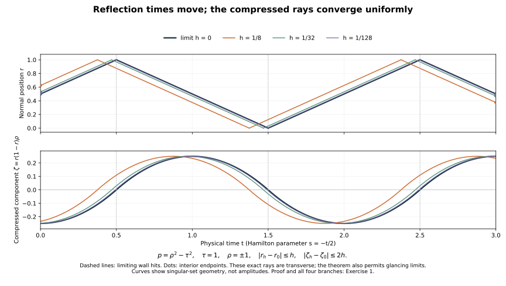

# Distributions on limiting broken rays

Independent exposition, proofs, exercises and illustration: GPT-6 Astra (OpenAI), Ultra, 9 October 2026. CC0-1.0.

A propagation theorem constrains existing singularities. A realization theorem constructs them on a specified curve. We now pass from the programme's finite reflected-ray construction to limits of those rays. The limit hypothesis matters: this argument does not realize an arbitrary generalized bicharacteristic.

The primary antecedent is Hörmander, *The Analysis of Linear Partial Differential Operators III*, approved Springer 2007 edition, Theorem 24.5.4, printed pages 459–460. The exposition below supplies the complete-space argument, its smooth test families, the order calculation at changing sections, and the precise way propagation fills the target curve.

The [finite broken-ray construction](../20261007-restored-prescribed-broken-rays/prescribed-broken-rays-preparation.html), single-direction profile, [general scalar propagation theorem](../20261009-general-scalar-boundary/scalar-boundary-propagation-through-general-glancing.html), and [generalized-flow proof](../20261007-restored-generalized-glancing/generalized-glancing-flow-preparation.html) are used with their full operators and actual traces. The [proof map](proof-map.json) pins the earlier arguments. Required Lebl proofs remain external; internal P514 closure of this export is not claimed.

## 1. The prescribed limit and the exact conclusion

**T0. Hypotheses and assertion.** Let \(P\) be a scalar differential operator of order two on an \(n\)-dimensional smooth manifold \(X\), \(n\ge2\), with smooth coefficients, real principal symbol and noncharacteristic boundary. Complex lower coefficients are allowed. Suppose compressed broken bicharacteristic arcs
\[
 \gamma_j:[a,b]\longrightarrow\widetilde T^*X\setminus0
 \tag{LR1}
\]
converge uniformly, after positive normalization, to a compressed generalized bicharacteristic \(\gamma\). Each approximating arc has locally finite transverse reflections and its ordinary pieces have nonzero Hamilton base velocity. The normalized limit is injective, \(a<b\), and its two endpoints lie over \(X^\circ\).

Write \(\Gamma\) for the positive cone over the limit image and \(F\) for the two endpoint rays. Given any neighborhood of its compact base projection, there is a compactly supported continuous function \(u\), supported in that neighborhood, whose actual intrinsic extension belongs to \(\mathcal N(X)\), and
\[
 \gamma_0u=0,\qquad
 \operatorname{WF}_b(u)=\Gamma,\qquad
 \operatorname{WF}_b(Pu)=F.
 \tag{LR2}
\]
Continuity is a convenience of the construction. The equalities concern the full wavefront sets, including boundary points and both endpoints, and not just a chosen covector where the distribution is singular.

## 2. Use embedded approximating arcs

**T1. Eventual injectivity.** We may discard finitely many terms and assume that the normalized \(\gamma_j\) are injective. Here is why uniform convergence to the embedded limit is enough in this setting.

The ordinary normalized Hamilton flow and the transverse reflected continuation have uniqueness in both directions. A return to a previously visited normalized state therefore produces a periodic broken orbit; the entire approximating image is the image of one period. If there were self-intersections for arbitrarily large \(j\), choose parameters \(s_j<t_j\) with equal states. Compactness gives convergent subsequences. If their limits were different, uniform convergence would contradict injectivity of \(\gamma\). Thus \(t_j-s_j\to0\). Uniform convergence to a continuous curve implies equicontinuity along this tail, so
\[
 \operatorname{diam}\gamma_j([s_j,t_j])\longrightarrow0.
 \tag{LR3}
\]
Periodicity makes this the diameter of the entire \(\gamma_j([a,b])\). Its limit cannot be the nonconstant injective image of \(\gamma\). This contradiction proves the assertion. Uniqueness here is only for ordinary and transverse broken rays; no uniqueness at infinite glancing contact has been inserted.

Choose one compact base set \(K\) inside the prescribed neighborhood, with room around the limiting image. Uniform convergence puts every sufficiently late approximating arc and all its sufficiently small construction neighborhoods in the interior of \(K\).

## 3. Smooth families that test a finite list of estimates

**T2. A controlled family on one finite broken ray.** Fix an embedded finite broken arc \(\beta\) with interior endpoints and nonzero Hamilton base velocity. Set the integer
\[
 s=n+4.
 \tag{LR4}
\]
At any chosen interior point of the arc, the finite-ray Gaussian proof supplies a compact transverse profile \(c\) with just its chosen positive wavefront direction, such that
\[
 c\in H^{s-\epsilon}\quad(\epsilon>0),\qquad
 c\text{ is not microlocally }H^s
       \text{ at that direction}.
 \tag{LR5}
\]
Explicitly replace the exponent \(n/4\) in the proved profile by \(s+n/4\); SR:X1 proves the exact threshold and the localization argument SR:P6–P7 proves its local failure. Multiply a frequency-regularized profile by one fixed base cutoff equal to one near its singular base point:
\[
 c_\epsilon=\theta\,\chi(\epsilon D)c,\qquad
 \chi\in C_c^\infty,\quad\chi=1\text{ near }0,\quad
 0<\epsilon\le1.
 \tag{LR6}
\]
This converges in distributions and is uniformly bounded in \(H^{s-1}\). In every closed base/conic region missing the single positive direction it is uniformly smooth. The differentiated Fourier localization proof gives this last statement: on the separated cone the original Fourier transforms decay to every order; on its complement the cutoff convolution kernel decays to every order. The symbols \(\chi(\epsilon\eta)\) have bounded order-zero seminorms uniformly in \(\epsilon\).

Apply the full finite chain of Cauchy evolutions, interior continuations and boundary-compatible partitions in BG:T005–T025 to this same datum. All choices are fixed for this arc and independent of \(\epsilon\). Every reflection pairs the two full right-root evolutions with exactly the same complete trace, so the Dirichlet value is zero for every \(\epsilon\).

We need a fixed regularity order, even if a late approximating arc has many reflections. The relevant transfers between transverse base sections have graph order zero. To check the order rather than accumulate trace losses, put \(d=n-1\). The first-order Cauchy kernel has \(d\) phase variables and amplitude order zero on a base of dimension \(n+d\); its Lagrangian order is
\[
 0+\frac d2-\frac{n+d}{4}=-\frac14.
 \tag{LR7}
\]
Restricting the output to a section transverse to the Hamilton base velocity removes one base variable, adds \(1/4\) to this order and gives a canonical graph of order zero. The phase restriction is noncharacteristic: the Hamilton direction crosses the section, so its relation has no forbidden conormal and no excess. If one phase chart degenerates, the complete stationary-phase changes and graph composition already proved in the programme retain this order, the density and Maslov factors. Both inverse graphs are available. Thus any finite number of these transfers preserves \(H^{s-1}\), with a constant that may depend on the arc but no loss proportional to its number of legs.

The initial solution kernel of order \(-1/4\) also retains that order when composed with each full interior graph of order zero. Thus the preceding section calculation applies throughout the finite chain. On a reflection collar, differentiating the exact first-order equation \(l\) times costs at most \(l\) tangential orders, with the full finite coefficient Leibniz sum. On any other transverse section chart, differentiating its kernel in the section parameter has the same bound: each differentiated homogeneous phase contributes one frequency factor, and differentiated amplitudes retain their parameter symbol bounds. Hence the \(l\)-th parameter derivative is a graph family of order at most \(l\). Integration over the fixed compact parameter interval gives uniform joint \(H^{s-1}\) bounds. Ordinary graph operators and the finite tangential partition preserve these bounds. Since \(s-1>n/2\), the actual compact Sobolev embedding gives a uniform \(C^0\) bound.

All equation defects on the open ray are uniformly smooth. Indeed each complete factor, graph intertwining or partition defect is smoothing on the retained microlocal input. Applying its full kernel estimates to the bounded \(H^{s-1}\) data controls every output derivative. This is the operator form of the cancellation in BG21, including all normal jets. The same estimates give uniform smoothness after any test whose microsupport misses the retained ray.

For the present purpose we can end this family inside arbitrarily small conic neighborhoods of the two endpoints. In the interior endpoint tubes use fixed smooth cutoffs in the canonical time coordinate, equal to one on the retained middle interval and zero just outside it. Their derivative terms have wavefront only in those endpoint neighborhoods. Transfer with the full graph and glue by BG19–BG21; all endpoint modifications have interior output support. We obtain
\[
 u_\epsilon\in C_c^\infty(K),\qquad
 u_\epsilon|_{\partial X}=0,\qquad
 \sup_\epsilon\|u_\epsilon\|_{C^0}<\infty .
 \tag{LR8}
\]
Any finite collection of solution tests separated from the arc and forcing tests separated from these endpoint neighborhoods has uniformly bounded smooth-output seminorms. The smooth forcing away from the endpoint neighborhoods is also uniformly bounded with every derivative.

Finally the distributional limit \(v\) is not microlocally \(H^s\) at the chosen interior seed. The construction equals its seed modulo a smoothing operator there, and the inverse graph of order zero would otherwise put \(c\) in \(H^s\), contradicting (LR5). If a compact interior cutoff \(\zeta\) is one near that point, then
\[
 \sup_{\epsilon>0}\|\zeta u_\epsilon\|_{H^s}=\infty .
 \tag{LR9}
\]
A bounded subsequence converging distributionally would have an \(H^s\) limit with that bound, by the complete Fourier bounded-norm limit proof, and would contradict the preceding conclusion. No constant uniform over different approximating rays is needed.

## 4. A countable space containing the eventual distribution

**T3. The tests and their domains.** We now define a linear space \(\mathcal F\) of continuous functions supported in \(K\), zero on the physical boundary. In addition to the supremum norm, impose the following countable families of finite seminorms:

1. Every derivative supremum of \(Pu\) on compact coordinate sets avoiding the two endpoint base points, including closed boundary collars.
2. Every derivative supremum of \(A(Pu)\) for interior properly supported order-zero tests whose microsupport is compactly separated from \(F\).
3. Every derivative supremum of \(Au\) for interior properly supported order-zero tests whose microsupport is compactly separated from \(\Gamma\).
4. Every derivative supremum of \(Bu\) for smooth properly supported tangential families in boundary charts whose parameter microsupport misses the tangential projection of \(\Gamma\) in that collar.

The first family interprets \(Pu\) initially in the interior and requires its indicated smooth extension up to the face. Interior tests stay a positive distance from the face. Tangential tests act directly by their proper transposed kernel on the continuous parameter family \(u(x,\cdot)\); normal derivatives of their output are required by the stated seminorms.

Here is a specific countable choice. Use a countable relatively compact coordinate atlas, rational compact boxes and rational angular balls with closure inside the indicated open complements. Put a fixed smooth order-zero symbol equal to one on a smaller box and angular ball and supported in the larger one, and use nested proper-support cutoffs. Include every integer derivative order and a countable compact exhaustion of every output chart. Near the boundary first choose a compact collar and an angular tangential section; all characteristic lifts there have bounded normal slope. Exhaust all smaller collars. These choices cover every excluded covector.

The actual full parametrices and finite-cover tester argument show that these tests suffice for the stated wavefront containments. Smoothness of \(Pu\) on a whole neighborhood of the boundary gives \(Pu\in\mathcal N\) there; away from the boundary it is an ordinary distribution. The complete noncharacteristic extension BW:N1–N3 therefore gives \(u\in\mathcal N\). Its traces agree with the continuous value, so the zeroth trace is zero. To see that agreement directly, finite-order normal recovery gives the actual distributional trace as a positive normal approximate-delta limit; uniform continuity of \(u\) gives the same limit. The interior and exact boundary tangential tester criteria now give
\[
 \operatorname{WF}_b(u)\subset\Gamma,\qquad
 \operatorname{WF}_b(Pu)\subset F,\qquad
 \gamma_0u=0
       \quad(u\in\mathcal F).
 \tag{LR10}
\]
There is no assertion that a continuous function alone belongs to the intrinsic class: its noncharacteristic equation near the boundary is essential.

## 5. Completeness and the finite-seminorm consequence

**T4. Completeness with the stated tests.** Enumerate the seminorms as \(p_0,p_1,\ldots\), with \(p_0=\|\cdot\|_{C^0}\), and replace them by their increasing finite sums if needed. The metric
\[
 d(u,v)=\sum_{k=0}^\infty2^{-k-1}
                  \min(1,p_k(u-v))
 \tag{LR11}
\]
induces exactly this seminorm topology, by the finite initial-sum and geometric-tail argument TG:B2–B3.

A Cauchy sequence first converges uniformly to a continuous \(u\), supported in \(K\) and zero on the boundary. It also converges in distributions. Each ordinary differential expression and interior proper test therefore converges distributionally to that same expression applied to \(u\). Every selected smooth-output derivative converges uniformly on its compact set. Passing the uniform limits through the coordinate fundamental theorem of calculus identifies all these derivative limits with the derivatives of the limiting output. Thus the required outputs are smooth, including their one-sided limits at the face.

For a tangential family this identification is equally direct: its proper transpose sends a compact test to a smooth compact input test, so uniform convergence of \(u\) gives distributional convergence of \(Bu\). The smooth limits consequently equal this actual output. The limiting forcing satisfies the noncharacteristic hypothesis in T3; this supplies the same intrinsic extension and actual trace without presupposing convergence in an unspecified topology on \(\mathcal N\). Every defining seminorm converges and is finite. Hence \(\mathcal F\) is complete for (LR11).

**T5. A local Sobolev bound would involve only finitely many tests.** Fix a properly supported interior order-zero test \(Z\) with compact output support. Suppose every \(u\in\mathcal F\) had \(Zu\in H^s\). The sets
\[
 E_m=\{u\in\mathcal F:\|Zu\|_{H^s}\le m\},
          \qquad m=1,2,\ldots
 \tag{LR12}
\]
are closed. In fact convergence in \(\mathcal F\) gives distributional convergence of \(Zu\), with one fixed compact output support. Testing against a cutoff times each Fourier exponential gives pointwise convergence of its Fourier transforms. Fatou's inequality applied to their nonnegative squared modulus times the Sobolev weight makes the norm lower semicontinuous. They cover \(\mathcal F\). The complete-metric Baire proof TG:B1 therefore gives an \(E_m\) with interior. There are \(u_0\), a finite maximum \(q\) of defining seminorms, and \(\delta>0\), with
\[
 u_0+\{w:q(w)<\delta\}\subset E_m .
 \tag{LR13}
\]
We may include \(p_0\) in \(q\). Both \(u_0+w\) and \(u_0\) have norm at most \(m\), so \(\|Zw\|_{H^s}\le2m\) on this neighborhood. Apply that estimate to \(\delta w/(2q(w))\) when \(w\ne0\). This proves the actual finite estimate
\[
 \|Zw\|_{H^s}\le\frac{4m}{\delta}\,q(w)
                       \quad(w\in\mathcal F).
 \tag{LR14}
\]
The zero case is immediate. This proves the needed consequence directly from Baire; no unproved closed-graph theorem is being used.

## 6. Violate that estimate with a sufficiently close broken ray

**T6. A singular point away from the endpoints.** The initial endpoint of \(\gamma\) is interior. Choose a smaller nonempty ordinary subarc just after it, still separated from both endpoint states. Its normalized Hamilton field is nonzero, since an injective ordinary orbit cannot hit a stationary normalized state. Choose a nonendpoint state \(q\) there and a properly supported interior order-zero test \(Z\), elliptic at \(q\), with compact microsupport in a small conic neighborhood disjoint from both endpoint rays. Compact output support is understood. This choice separates covectors rather than requiring distinct base points: the Hamilton base velocity of the limiting ray may vanish, and other ray portions may have the same base projection.

Suppose every member of \(\mathcal F\) were microlocally \(H^s\) on this small interior state neighborhood. Shrink \(Z\) inside it; a full parametrix and compact cover give \(Zu\in H^s\) for every \(u\in\mathcal F\). T5 yields the finite estimate (LR14).

The finitely many tests in that estimate have compact microsupports separated from the prohibited limiting sets. Uniform convergence allows a sufficiently late embedded \(\gamma_j\) to avoid all those microsupports, and places its endpoint states in arbitrarily small neighborhoods of \(F\). Its chosen seed state lies where \(Z\) is elliptic. The finitely many forcing base compacts in family 1 avoid the endpoint base points; choose the endpoint construction neighborhoods still smaller so they miss these compacts. The tangential tests are also separated after shrinking to the fixed compact collar: bounded characteristic slope makes the normalized tangential projection continuous on the relevant compact characteristic set.

Apply T2 to this one arc, with endpoint caps chosen inside those neighborhoods. Every \(u_\epsilon\) is smooth, compactly supported in \(K\), and has exactly zero boundary value, hence belongs to \(\mathcal F\). T2 gives
\[
 \sup_\epsilon q(u_\epsilon)<\infty,\qquad
 \sup_\epsilon\|Zu_\epsilon\|_{H^s}=\infty .
 \tag{LR15}
\]
The second assertion follows from the inverse-graph failure at the seed, where \(Z\) is elliptic. This contradicts (LR14). Consequently some \(u\in\mathcal F\) is singular at a state in that interior neighborhood, and its singular set is not confined to \(F\).

## 7. Why propagation fills this particular curve

**T7. No stationary obstruction on the embedded limit.** At an interior radial point the normalized ordinary flow is stationary and unique. At a nondiffractive radial gliding point the generalized-flow energy and comparison proof GGL:T016–T022 forces the generalized arc to be its gliding orbit. At \(G^3\), the comparison forcing along that radial gliding orbit is identically zero: \(r_x=0\) is preserved under positive dilation. The exact comparison estimate then makes both normal components and the tangential difference vanish. At strict gliding the energy estimate and ordinary gliding uniqueness give the same conclusion. Its normalized image is constant. None of these cases can occur on the injective nonconstant \(\gamma\).

Set
\[
 S=\{t\in(a,b):\gamma(t)\in\operatorname{WF}_b(u)\}.
 \tag{LR16}
\]
It is relatively closed, and T6 makes it nonempty. It is also open. GSP:C10 supplies a local singular generalized arc through any of its points, entirely inside \(\Gamma\) by (LR10). In ordinary, transverse and strict-diffractive neighborhoods the local uniqueness and joining rules identify its two sides with the corresponding target subarc. In a strict-gliding or \(G^3\) neighborhood, the nonradial tangential clock is strictly monotone on both arcs; all nearby characteristic lifts have the same signed clock speed after a common orientation choice. The embedded target identifies each state with one parameter, so a two-sided singular arc through the state contains a relatively open target interval. No uniqueness among curves outside \(\Gamma\) is needed at infinite contact.

The interval \((a,b)\) is connected by the elementary interval proof, so a nonempty relatively open and closed subset is the whole interval. Closure of the wavefront includes both endpoints. Together with (LR10) this proves
\[
 \operatorname{WF}_b(u)=\Gamma.
 \tag{LR17}
\]

**T8. Both endpoint sources are necessary.** Near each endpoint the target lies in the physical interior. Extend its ordinary characteristic a little beyond the prescribed interval. Embeddedness and ordinary flow uniqueness give a small conic neighborhood in which the outside continuation is disjoint from \(\Gamma\). The solution is regular there by (LR10). If \(Pu\) lacked that endpoint covector, the complete interior propagation theorem would carry this regularity across the endpoint into the singular target interior. This contradicts (LR17). Thus both endpoint rays belong to the forcing wavefront. Its reverse containment was already proved in (LR10), giving
\[
 \operatorname{WF}_b(Pu)=F.
 \tag{LR18}
\]
T3 supplies the intrinsic domain and zero actual value trace. This completes (LR2), with compact support inside the prescribed neighborhood.

## 8. Three solved exercises

### Exercise 1. Compression makes nearby reflection times compatible

For \(P=D_r^2-D_t^2\) on \(0\le r\le1\), set \(\tau=1\), let \(0\le h\le1/8\), and on \(0\le t\le3\) define the reflected ray by
\[
 r_h(t)=T(t+\tfrac12+h),\qquad
 T(v)=1-|1-(v\bmod2)|,\qquad
 \rho_h=-r_h'(t).
 \tag{LR19}
\]
Use the compressed component \(\zeta_h=r_h(1-r_h)\rho_h\), set to zero at each wall hit. Prove uniform convergence to \(h=0\), even though the uncompressed normal momenta jump at different times.

**Solution.** The triangular function \(T\) is continuous and one-Lipschitz, so \(|r_h-r_0|\le h\). If both points lie on matching branches, \(\rho_h=\rho_0\) and the derivative of \(r(1-r)\) has absolute value at most one, giving \(|\zeta_h-\zeta_0|\le h\). If their branches differ, the two arguments straddle one wall hit and both normal distances to that wall are at most \(h\). Each \(|\zeta|\) is at most that distance, hence
\[
 |r_h-r_0|\le h,\qquad
 |\zeta_h-\zeta_0|\le2h.
 \tag{LR20}
\]
The reflection times are \(1/2-h,3/2-h,5/2-h\). The endpoints have \(r_h(0)=1/2+h\) and \(r_h(3)=1/2-h\), both interior. The coordinate \(t\) proves cosphere injectivity. Hamilton orientation is obtained by \(s=-t/2\); \(\tau=1\), \(\rho_h=\pm1\) satisfies \(p=0\). This is an exact example of the theorem's limiting hypothesis. Its limit has transverse reflections; the theorem also permits generalized glancing limits.

### Exercise 2. Extract the finite estimate without a closed-graph theorem

Suppose (LR13) holds for a linear map \(L\) into a normed space, with \(E_m=\{\|Lu\|\le m\}\), and \(q\) includes a norm. Derive a global bound and explain which constant is needed.

**Solution.** Subtract \(Lu_0\) from \(L(u_0+w)\) to get \(\|Lw\|\le2m\) when \(q(w)<\delta\). For \(w\ne0\), the multiple \(w'=\delta w/(2q(w))\) has \(q(w')=\delta/2\). Therefore \(\|Lw\|\le4m q(w)/\delta\). The zero vector satisfies the same estimate. A strict inequality defining the neighborhood is respected; scaling to its boundary without a limit argument would not justify the intermediate step.

### Exercise 3. A uniformly low-order family with an unbounded critical norm

In one transverse dimension take
\[
 \widehat c_\epsilon(\lambda)
   =\mathbf1_{\{\lambda\ge2\}}\lambda^{-s-1/2}e^{-\epsilon\lambda},
     \qquad s\ge1,\quad0<\epsilon<1/4 .
 \tag{LR21}
\]
Estimate its squared homogeneous norms at orders \(s-1\) and \(s\). This exercise isolates the frequency estimate; it is not the compactly localized smooth seed used in T2.

**Solution.** With the common Plancherel factor suppressed, the lower-order norm is at most
\[
 \int_2^\infty\lambda^{-3}e^{-2\epsilon\lambda}\,d\lambda
 \le\int_2^\infty\lambda^{-3}\,d\lambda=\frac18.
 \tag{LR22}
\]
At the critical order restrict to \(2\le\lambda\le1/(2\epsilon)\). There \(e^{-2\epsilon\lambda}\ge e^{-1}\), so
\[
 \int_2^\infty\lambda^{-1}e^{-2\epsilon\lambda}\,d\lambda
 \ge e^{-1}\log\frac1{4\epsilon}\longrightarrow\infty.
 \tag{LR23}
\]
Because \(\lambda\ge2\), the corresponding inhomogeneous weights are comparable by constants depending only on \(s\). The lower-order bound and critical divergence therefore hold in those norms too.

## 9. Exact convergence of a family of reflected rays

**F0. Coordinates and meaning.** The panels use exactly (LR19)–(LR20) for \(h=0,1/8,1/32,1/128\). The top panel is the normal position \(r_h\); the bottom is the compressed normal component \(\zeta_h=r_h(1-r_h)\rho_h\). Both retain physical time \(t\), with omitted covector \(\tau=1\). Full normal momenta have magnitude one and reverse at the marked walls. Endpoints remain interior. The dashed vertical lines are the three limiting reflection times; the perturbed reflections occur earlier by \(h\). The lower curves meet zero at both walls, as required by this compressed frame. These are exact singular-set geometries supplied by the theorem, not computed solution amplitudes. The [figure source](figures/build_figure.py) includes the exact piecewise formulas.

The construction proves the prescribed limiting-ray obligation. It does not remove its approximation or injectivity hypotheses. Sharp Airy energy mapping, the separate Tricomi regimes and every remaining HIII21/23/24 and HIV25/26 requirement stay active.
