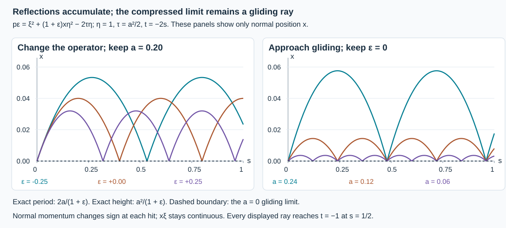

# Stable observation regions for boundary rays

Suppose every maximally continued boundary ray meeting a target region also meets an observation region. A small smooth change of the operator preserves that access on compact target sets. The proof must allow an unbounded number of reflections, limiting gliding motion, stationary normalized rays and nonunique continuation at infinite contact.

We prove the complete geometric statement, including a bounded normalized travel time. The antecedent is Hörmander, *The Analysis of Linear Partial Differential Operators III*, approved corrected edition reprinted in 2007, Lemma 24.7.2, printed pages 466–467. The text and illustration here are independent. This result supplies the geometric part of parameter-dependent propagation; the uniform analytic estimate is a separate obligation.

The exact earlier [generalized-flow proof](../20261007-restored-generalized-glancing/generalized-glancing-flow-preparation.html) supplies local existence, reflected compactness and the glancing comparison estimates. The [boundary normalization](../20261007-restored-boundary-reflection/boundary-reflection-preparation.html) and [finite smooth-flow proof](../20261005-restored-phase-space/finite-coordinate-flows.html) supply their parameter-dependent coordinate and ODE inputs. The proof map records the complete receiving dependencies. Required Lebl foundations remain external; internal P514 closure of this CC0-only export is not claimed.

## 1. What has to remain stable

**S0. The geometric contract.** Let \(P_a\) be a smooth family of scalar second-order operators, with real quadratic principal symbols \(p_a\), for \(a\) near zero in \(\mathbb R^\ell\). Lower coefficients may be complex. The boundary is noncharacteristic for \(P_0\). On every compact working patch this remains true for all sufficiently small \(a\). Rays of \(P_a\) are considered as long as they remain in that geometric domain.

Work on positive normalized compressed covectors: positive fiber dilations are identified. Open conic sets below mean open sets on this normalized space. Let
\[
 \Gamma_1,\Gamma_2\subset\Gamma
 \tag{PS1}
\]
be open. Assume that every maximally continued compressed generalized characteristic of \(P_0\) in \(\Gamma\) that meets \(\Gamma_1\) meets \(\Gamma_2\). The quantifier is over every continuation, not a chosen trajectory at an infinite-contact point. Stationary normalized trajectories count as trajectories.

For every compact \(K_1\subset\Gamma_1\), we will find
\[
 K\Subset\Gamma,\qquad K_2\Subset\Gamma_2,\qquad
 \delta>0,\quad T<\infty
 \tag{PS2}
\]
such that every maximal \(P_a\) arc through a point of \(K_1\), for \(|a|<\delta\), has a subarc joining that point to \(K_2\), lying entirely in \(K\). In the fixed positive normalized Hamilton parameter chosen below, its travel time is at most \(T\), in either direction:
\[
 \gamma(0)\in K_1,\qquad \gamma(t_*)\in K_2,\qquad
 |t_*|\le T,\qquad
 \gamma([\min(0,t_*),\max(0,t_*)])\subset K.
 \tag{PS3}
\]
The target points need only be characteristic for the current operator. If a neighborhood of \(K_1\) contains no \(P_0\) characteristic, compactness gives the vacuous assertion for small parameters.

## 2. Actual normalized equations near the boundary

**S1. Smooth coordinates for the whole family.** On a compact boundary patch, the normal-coordinate construction RF:T001–T004 uses the nonzero highest normal coefficient and a smooth local ODE. The full parameter-flow theorem therefore makes its coordinate maps and inverses smooth in \(a\). A positive principal factor and a constant sign put the characteristic equation into
\[
 p_a=\xi^2-r_a(x,y,\eta),\qquad x\ge0.
 \tag{PS4}
\]
All relevant derivatives of \(r_a\) converge uniformly on compact normalized sets as \(a\to0\). Coordinate maps induce the exact compressed cotangent changes already proved in the boundary calculus. They tend smoothly to the maps at zero, so compactness or convergence in these charts is the same as in the original fixed compressed space.

The constant sign is fixed on each chosen patch. If it is negative, the displayed normal-form Hamilton parameter reverses the original orientation. Retain that sign on returning to the original parameter. Every estimate below is two-sided, and the access conclusion allows either direction, so this reversal changes no assertion.

At a nonzero characteristic above this patch, \(\eta\ne0\): otherwise homogeneity and (PS4) give \(\xi=0\) too. Put \(\lambda=|\eta|\), \(\omega=\eta/\lambda\), \(v=\xi/\lambda\), and use the projected vector field \(\lambda^{-1}H_{p_a}\). Its normalized equations, on an ordinary segment, are
\[
 \begin{aligned}
 \dot x&=2v,&
 \dot y&=-(r_a)_\eta(x,y,\omega),\\
 \dot\omega&=(r_a)_y(x,y,\omega)-h_a\omega,&
 \dot v&=(r_a)_x(x,y,\omega)-h_av,\\
 h_a&=\omega\cdot(r_a)_y(x,y,\omega),&
 v^2&=r_a(x,y,\omega).
 \end{aligned}
 \tag{PS5}
\]
To check the normalization, the unnormalized equations after multiplication by \(\lambda^{-1}\) give \(\dot\eta=\lambda(r_a)_y(x,y,\omega)\), hence \(\dot\lambda/\lambda=h_a\). Differentiating \(\eta/\lambda\) and \(\xi/\lambda\) gives (PS5). Euler's degree-two identity gives \(\omega\cdot(r_a)_\eta=2r_a\), so differentiating the last equality in (PS5) on either side gives the same expression \(2v(r_a)_x-2h_av^2\). Also \(|\omega|=1\) is preserved.

Write \(z=(y,\omega)\) in a sphere chart. Its equation is \(\dot z=F_a(x,z)\), independent of the sign of \(v\). At reflection, only \(v\) changes, from the negative to the positive root. At nondiffractive glancing, \(x=v=0\), the gliding rule sets both normal derivatives to zero and uses \(F_a(0,z)\). At \(r_{a,x}=0\), this agrees with the ordinary derivative at that instant.

**S2. A consistent parameter and uniform bounds.** After accounting for the fixed orientation sign just stated, local normalized parameters differ by positive smooth factors bounded above and below on compact characteristic sets. Choose a smooth positive homogeneous scale in each chart, invariant under the boundary root exchange, and combine its square by a smooth base partition. Each local scale can be taken from the squared normal-root coordinate plus a positive tangential norm. The root exchange fixes the base and preserves each local scale at the boundary, so the sum preserves that property. Its positive square root provides a global scale on the selected conic region. Outside the boundary charts use an ordinary positive cotangent norm. The choices may depend smoothly on \(a\); all comparisons and their inverse bounds are uniform on compact sets.

Use the resulting projected Hamilton parameter throughout the theorem. In computations we may return to (PS5), with a uniformly positive change of time. At reflection that time factor has matching one-sided values; at glancing it has the same limiting value on both roots. Thus these changes preserve the generalized derivative and all finite travel-time bounds.

The compressed coordinate \(\kappa=xv\) satisfies
\[
 \dot\kappa=2v^2+x(r_a)_x-h_a\kappa.
 \tag{PS6}
\]
On a fixed compact normalized set, \(x,z,\kappa,v^2\) are uniformly Lipschitz, and
\[
 \big||v(t)|-|v(s)|\big|\le C|t-s|^{1/2}.
 \tag{PS7}
\]
Indeed (PS5)–(PS6) give bounded derivatives on every ordinary or gliding part and bounded one-sided derivatives at reflections. The integrated one-sided argument GGL:T013 applies across accumulating reflection times; it needs no bound on their number. At a reflection \(x=0\), so \(\kappa\) and \(v^2\) are continuous. The square-root inequality \(|\sqrt A-\sqrt B|\le\sqrt{|A-B|}\) gives (PS7). All constants are controlled by finitely many coefficients on that compact set, uniformly for small \(a\).

## 3. Limits when the operator changes

**S3. The compactness statement.** Suppose \(a_j\to0\), and generalized \(P_{a_j}\) arcs are defined on one compact time interval and stay in one compact normalized region. There is a subsequence converging uniformly in compressed coordinates. Every such limit is a generalized \(P_0\) arc.

For the first conclusion apply (PS7) and the preceding Lipschitz bounds to a countable dense time set. Successive compact coordinate subsequences and a diagonal choice give convergence on that dense set. A finite grid of mesh smaller than \(\epsilon/(3C)\) then gives uniform convergence. Finite charts cover the compact region, and the convergent coordinate changes identify the same limit on overlaps. The characteristic identity passes to the limit:
\[
 v_j^2=r_{a_j}(x_j,z_j)\longrightarrow r_0(x,z).
 \tag{PS8}
\]
For \(x>0\), \(\kappa/x\) determines the signed root. At the boundary the two hyperbolic roots are precisely the identified reflected states. The next three steps verify the derivative law; characteristic containment alone is insufficient.

**S4. Interior and transverse reflection limits.** At an interior time the signed states converge and the smooth integral equations pass to the limit. At a limiting hyperbolic boundary point, the two roots have a uniform positive separation. The simple hitting equation \(x(t)=0\), with \(\dot x=2v\ne0\), has a smooth parameter-dependent hitting time by the exact implicit-function proof. The incoming and outgoing data converge with the prescribed root exchange. A sufficiently short neighborhood contains exactly one such reflection. This proves both the reflected limiting law and ordinary convergence away from that hit, with the same complete equations.

**S5. Strict diffractive and strict gliding limits.** Near strict diffraction, \((r_0)_x>0\). For small parameters and small \(|v|\),
\[
 (r_a)_x-h_av\ge c>0.
 \tag{PS9}
\]
The normal momentum increases on ordinary pieces, and a reflection makes a positive jump. There can be at most one reflection in this neighborhood. If the limit has \(x(0)=v(0)=0\), integrate \(\dot x=2v\) and (PS9) in both directions: \(x(t)\ge ct^2\) in the limit. Thus any approximating reflection in that interval must tend to zero time, and its jump tends to zero by (PS8). The integral equations pass through it. The limiting curve is the unique ordinary tangent curve, with both sides interior.

Near strict gliding, \((r_0)_x<0\). The normal energy
\[
 E=v^2-x(r_a)_x
 \tag{PS10}
\]
is comparable to \(v^2+x\), uniformly on a smaller compact patch. On ordinary parts,
\[
 \dot E=-2h_av^2-x\,\frac{d}{dt}(r_a)_x,\qquad
 |\dot E|\le C E.
 \tag{PS11}
\]
Here the derivative of \((r_a)_x\) is uniformly bounded by (PS5), and reflection preserves \(E\). On gliding parts \(E=0\). The full integrated energy argument GGL:T016–T017 therefore gives \(E(t)\le e^{C|t|}E(0)\) in both directions. Initial energies tending to zero force \(x,v\to0\) uniformly; the tangential integral equations tend to \(\dot z=F_0(0,z)\). This proves the strict gliding limiting law, without differentiating a discontinuous normal sign.

**S6. Infinite contact and stationary states.** At a remaining glancing limit, \((r_0)_x(0,z_0)=0\). Let \(\bar z_a\) solve \(\dot{\bar z}_a=F_a(0,\bar z_a)\), starting at the same tangential initial point, and put
\[
 e_a(t)=(r_a)_x(0,\bar z_a(t)),\qquad
 f_a(t)=|z_a(t)-\bar z_a(t)|.
 \tag{PS12}
\]
The exact one-sided comparison inequalities are
\[
 \dot x\le2|v|,\qquad
 (|v|)^{\displaystyle\cdot}\le |e_a|+C(x+|v|+f_a),
 \qquad \dot f_a\le C(f_a+x).
 \tag{PS13}
\]
At reflection \(|v|\) is continuous; on a gliding part its derivative is zero. Smoothness supplies the other coefficient bounds. The additional \(C|v|\) is the actual normalization term from (PS5).

Use the cooperative linear comparison from GGL:T019–T020, with this extra nonnegative diagonal coefficient. Its exponential still has nonnegative entries. The path from the forcing in the \(v\) equation to \(x\) requires one integration, and the path to \(f\) requires two; the same convergent matrix series proves
\[
 \begin{aligned}
 x(t)&\le Ce^{Ct}\left[x(0)+t|v(0)|
                       +\int_0^t(t-s)|e_a(s)|\,ds\right],\\
 |v(t)|&\le Ce^{Ct}\left[x(0)+|v(0)|
                       +\int_0^t|e_a(s)|\,ds\right],\\
 f_a(t)&\le Ce^{Ct}\left[tx(0)+t^2|v(0)|
                       +\int_0^t(t-s)^2|e_a(s)|\,ds\right].
 \end{aligned}
 \tag{PS14}
\]
The strict first-crossing argument and limit of positive initial margins are exactly those proved in that provider; a diagonal coefficient does not change any sign or shortest matrix path. Reverse time for the negative side.

Smooth parameter dependence gives \(e_{a_j}\to e_0\) on a common smaller interval. Since \(e_0(0)=0\), \(|e_0(t)|\le C|t|\). Pass to the limit in (PS14), using \(x_j(0),|v_j(0)|\to0\). We obtain
\[
 x(t)=O(|t|^3),\qquad |v(t)|=O(t^2),\qquad
 z(t)-\bar z_0(t)=O(|t|^4).
 \tag{PS15}
\]
Thus the limiting lifted normal derivatives at zero are both zero and the tangential derivative is \(F_0(0,z_0)\), exactly the generalized glancing derivative. This works at infinite contact and across any accumulated reflections. It does not claim uniqueness there.

If the normalized gliding field vanishes at this initial state, its smooth boundary flow is constant, so \(e_0\equiv0\). The comparison then forces the constant continuation. Strict gliding uses (PS11) for the same conclusion. Interior radial Hamilton points give stationary projected ordinary flows. These cases are included in compactness and local existence, not removed from the access hypothesis.

## 4. Uniform local lifetime and compact escape

**S7. A buffer supplies time, even at glancing.** Let \(L\) be compact inside a larger compact phase neighborhood \(L^+\) whose interior contains \(L\). The positive distance of \(L\) from the complement of \(L^+\), and the uniform compressed velocity bound, give a number \(\tau_L>0\). Any existing arc through \(L\) can be followed for at least \(\tau_L\) in each direction before it can leave \(L^+\), for all sufficiently small parameters.

Here is why a short local existence interval cannot invalidate this statement. GGL:T036 gives an arc from every state, including stationary and infinite-contact states. Extend an existing arc while it stays in the larger patch. If its parameter interval had a finite endpoint there, (PS7) would give a compressed limit. The interior, reflection, strict and higher-contact arguments in S4–S6 give the correct joining root or derivative. Local existence from that limit continues the original arc. The endpoint-capacity construction of GGL:T037, or successive extensions approaching the supremum of such endpoints, therefore supplies the claimed lifetime. Constants in the buffer and velocity bound are uniform; no uniform bound on reflection count or on a nonzero gliding speed is required.

Consequently a maximal finite endpoint in an open phase domain leaves every compact subset of that domain. Infinite-time confinement is possible and is not excluded by this conclusion.

## 5. Compact observation and bounded travel time

**S8. Assume the conclusion fails.** Choose compact exhaustions
\[
 L_m\subset\operatorname{int}L_{m+1}\Subset\Gamma,\qquad
 M_m\subset\operatorname{int}M_{m+1}\Subset\Gamma_2,
 \tag{PS16}
\]
whose interiors cover the respective sets. Arrange \(K_1\subset\operatorname{int}L_1\). These follow from a countable precompact atlas and the already proved compact-exhaustion construction. The empty observation case needs no special argument: its compact exhaustion may be empty.

If (PS2)–(PS3) fails, for every \(j\) choose \(|a_j|<1/j\) and a maximal arc \(\gamma_j\) with \(\gamma_j(0)\in K_1\), having no subarc from time zero to \(M_j\) that lies in \(L_j\) and has normalized length at most \(j\). Choose the parameter bound even smaller, if necessary, so the normal-coordinate class and uniform coefficient bounds are valid on \(L_j\). Failure for all proposed constants permits this choice.

For \(m\le j\), take the component containing zero of
\[
 \{t:\gamma_j(t)\in\operatorname{int}L_m\}
       =(-\alpha_{j,m},\beta_{j,m})
       \quad\hbox{on that component}.
 \tag{PS17}
\]
Endpoints may be infinite. The intervals are nested as \(m\) increases. S7 supplies a positive common interval around zero for each fixed \(m\). Pass to a diagonal subsequence so that all endpoints have limits in \([0,\infty]\), and then so that the compressed curves converge uniformly on every compact time interval strictly inside each limiting interval. S3 applies, because the corresponding curves stay in \(L_m\).

Write the limiting endpoints as \(\alpha_m,\beta_m\), and put
\[
 \alpha=\sup_m\alpha_m,\qquad \beta=\sup_m\beta_m,\qquad
 I=(-\alpha,\beta).
 \tag{PS18}
\]
The limits on overlapping time intervals agree because they are limits of the same subsequence. They define one generalized \(P_0\) arc \(\gamma:I\to\Gamma\), with \(\gamma(0)\in K_1\). Every compact time interval in \(I\) is contained in one of the nested limiting intervals and hence has its image in some \(L_m\). At no point have we assumed continuity of the first exit time.

**S9. The limit avoids the observation set.** Suppose \(\gamma(t)\in\Gamma_2\). Choose \(m\) large enough that \(t\) is strictly inside the limiting interval for \(L_m\), and \(\gamma(t)\in\operatorname{int}M_m\); enlarge the two indices to a common one. For sufficiently large \(j\), uniform convergence gives \(\gamma_j(t)\in M_m\subset M_j\). The whole subarc between zero and \(t\) lies in \(L_m\subset L_j\), and \(|t|<j\). This contradicts the choice of \(\gamma_j\). Hence
\[
 \gamma(I)\cap\Gamma_2=\varnothing.
 \tag{PS19}
\]

**S10. Its finite endpoints are genuinely maximal.** Suppose \(\beta<\infty\) and \(\gamma\) admits continuation in \(\Gamma\) beyond \(\beta\). Then it has a limiting endpoint \(q\in\Gamma\). Choose a small compact neighborhood of \(q\) with a positive buffer inside \(\operatorname{int}L_m\), increasing \(m\) if necessary. A tail \(\gamma([t_0,\beta))\), and also the compact earlier segment \(\gamma([0,t_0])\), lie in \(\operatorname{int}L_m\).

The uniform buffer argument S7 gives an \(\epsilon>0\) for arcs starting sufficiently close to \(q\). Fix \(t\in(t_0,\beta)\) with \(\beta-t<\epsilon/2\). Uniform convergence on \([0,t]\), using a possibly larger exhaustion index for that compact time interval, puts \(\gamma_j([0,t])\) in \(\operatorname{int}L_m\) for all large \(j\), and puts \(\gamma_j(t)\) in the selected buffer. Thus \(\gamma_j\) stays in \(\operatorname{int}L_m\) until at least \(t+\epsilon\). This implies
\[
 \beta_m=\lim_j\beta_{j,m}\ge t+\epsilon>\beta,
 \tag{PS20}
\]
contradicting (PS18). The negative endpoint is identical with time reversed. Therefore every finite endpoint of \(\gamma\) is maximal in \(\Gamma\); an infinite endpoint has no further finite parameter endpoint to extend. The curve is maximally continued in the exact sense of S0.

It meets \(K_1\subset\Gamma_1\) and avoids \(\Gamma_2\), contradicting the original access hypothesis. This proves (PS2)–(PS3), including finite \(T\). Omitting the travel-time assertion gives the stated compact-access lemma of the source.

**S11. The quantifiers and their limits.** The constants depend on the compact target set, the open geometric regions and the smooth family. They are uniform in \(|a|<\delta\) and in every allowed generalized continuation. They need not be effective numerical bounds from finite derivatives alone: the global access hypothesis is qualitative. All radial and stationary exceptions were tested by that hypothesis, and no finite-contact or unique-flow assumption was added. The proof concerns geometry only; it does not yet give a uniform norm estimate for \(P_a u\), an observation of \(u\), and an ambient Banach norm.

## 6. Many reflections can still have a stable limit

**F0. Exact family behind the plot.** For \(x\ge0\), tangential coordinates \((t,y)\), and their covectors \((\tau,\eta)\), take
\[
 p_\epsilon=\xi^2+(1+\epsilon)x\eta^2-2\tau\eta,
 \qquad k=1+\epsilon>0.
 \tag{PS21}
\]
Fix \(\eta=1,\ \tau=a^2/2\). On each reflected excursion starting with outgoing normal momentum \(a>0\), write \(s=nL+\sigma\), \(0\le\sigma<L=2a/k\). Hamilton's equations have the exact solution
\[
 \begin{aligned}
 x(s)&=2a\sigma-k\sigma^2,&
 \xi(s)&=a-k\sigma,&t(s)&=-2s,\\
 y(s)&=n\,\frac{2a^3}{3k}
       +2ka\sigma^2-\frac23k^2\sigma^3-a^2\sigma .
 \end{aligned}
 \tag{PS22}
\]
At each hit, the two normal roots \(-a,+a\) are identified by compression. Both \(x\) and \(y\) are continuous; \(x\xi\) is zero there. When \(a\to0\), these rays converge uniformly on compact \(s\) intervals to \(x=\xi=\tau=y=0,\ t=-2s,\eta=1\), the gliding ray. The plotted normal heights are exactly (PS22), with the indicated \(a,\epsilon\); the other coordinates are given here rather than suppressed without explanation. This is ray geometry, not wave amplitude. The parameter \(s\) is Hamilton time on this fixed \(\eta=1\) slice.

## 7. Exercises with complete solutions

### Exercise 1. A uniform bound without a reflection-count bound

For (PS21) with \(|\epsilon|\le1/4\), prove the period and height formulas, bound the normal position and compressed momentum as \(a\to0\), and locate the observation time \(t=-1\).

**Solution.** Hamilton's equations give \(x'=2\xi,\ \xi'=-k,\ t'=-2,\ y'=2kx-a^2\); \(\tau,\eta\) are constant. Their integrals are (PS22), and \(\xi^2+kx=a^2=2\tau\eta\). The next positive zero of \(x\) is \(L=2a/k\); its vertex is at \(\sigma=a/k\), with height \(a^2/k\). Hence
\[
 0\le x\le\frac43a^2,\qquad |\xi|\le a,\qquad
 |x\xi|\le\frac43a^3,\qquad |y'|\le a^2.
 \tag{PS23}
\]
The last inequality uses \(0\le kx\le a^2\). Consequently \(|y(s)|\le a^2|s|\) from \(y(0)=0\). The number of hits on a fixed positive interval tends to infinity as \(a\downarrow0\), because \(L\to0\), but all displayed coordinate bounds are uniform for the allowed \(\epsilon\). Every displayed ray reaches \(t=-1\) at \(s=1/2\), independent of both parameters. This example establishes access for this exact family; it is not an assertion about all covectors in an unspecified open observation problem.

### Exercise 2. Why the limiting operator must satisfy access

Consider the glancing covectors \(x=\xi=\tau=0,\eta=1\) for
\[
 q_\epsilon=\xi^2+x\eta^2-2\epsilon\tau\eta.
 \tag{PS24}
\]
Starting at \(t=y=0\), determine the boundary gliding motion and the time needed to reach \(t=-1\) for \(\epsilon>0\). Explain the failure of a uniform conclusion at \(\epsilon=0\).

**Solution.** In the normal form, \(r_\epsilon=2\epsilon\tau\eta-x\eta^2\), so \(r_x=-1\) on the chosen slice. It is strict gliding. Its tangential equations give
\[
 x=\xi=\tau=y=0,\qquad \eta=1,\qquad t(s)=-2\epsilon s.
 \tag{PS25}
\]
For \(\epsilon>0\), the observation time is \(1/(2\epsilon)\), unbounded as \(\epsilon\downarrow0\). At zero the normalized gliding ray is constant at \(t=0\); it never reaches a neighborhood of \(t=-1\). Thus the access hypothesis for the limiting operator is false. Checking that each nonzero parameter separately has some access cannot replace that hypothesis.

### Exercise 3. First exits need not converge

Let \(q_b(s)=(s-1)^2+b\), with \(0\le b<1/2\), start at \(s=0\), and let the open scalar region be \(U=(0,2)\). Compute the right endpoint of the component of \(q_b^{-1}(U)\) containing zero.

**Solution.** For \(b>0\), the path never hits zero and its first upper exit is at \(s=1+\sqrt{2-b}\). For \(b=0\), it touches the excluded lower boundary at \(s=1\), so the component containing zero ends there. Therefore
\[
 \lim_{b\downarrow0}\bigl(1+\sqrt{2-b}\bigr)
       =1+\sqrt2\ne1.
 \tag{PS26}
\]
The paths and every derivative converge uniformly on compact intervals. Their exit times nevertheless do not converge to the exit time of the limiting path. S8–S10 use subsequential endpoint limits, nested compact regions and positive buffers; they never assume this false continuity statement.

The next analytic work must turn scalar boundary propagation into one estimate uniform in the parameter, with actual boundary data and all lower coefficients retained. The subsequent wave-equation application, sharp general Airy energy mapping and remaining full AN-04 requirements also stay active. Original expression and the reproducible figure are CC0-1.0; linked components retain their actual terms.
