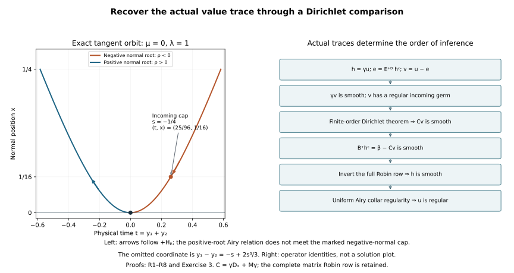

# Robin diffraction by Dirichlet comparison

Independent exposition, proofs, exercises and illustration: GPT-6 Astra (OpenAI), Ultra, 9 October 2026. CC0-1.0.

The surviving Robin boundary form need not have a favorable sign. We instead subtract a single outgoing Dirichlet parametrix formed from the solution's actual value trace. The difference has smooth value data and a regular incoming germ. Its regularity identifies the actual conormal trace with the already constructed invertible Airy boundary row. That inverse makes the value trace smooth and completes the comparison.

This requires a Dirichlet theorem for a distribution that initially has only finite tangential Sobolev order. We prove that extension first, including the normal trace, the actual regularized equation and the same-region induction. No energy bound for the subtracted parametrix is assumed before the comparison. The exact earlier [Dirichlet theorem](../20261009-dirichlet-diffraction-bootstrap/dirichlet-diffraction-on-one-open-region.md), distributional Airy kernels, [ray relation](../20261008-airy-wavefront-time/fourier-airy-wavefronts-and-time-direction.md) and actual conormal inverse provide the components. Their exact versions and transitive proofs are in the proof map. Lebl providers remain external; internal P514 closure of this export is not claimed.

The source antecedents are Hörmander, *The Analysis of Linear Partial Differential Operators III*, approved Springer 2007 edition, §24.4, printed pages 448–451, for the accessible-region induction, and Melrose–Taylor, [*Boundary Problems for Wave Equations With Grazing and Gliding Rays*](https://mtaylor.web.unc.edu/wp-content/uploads/sites/16915/2018/04/glide.pdf), §8.1, for reduction to an invertible conormal row. The finite-order receiving argument and its use with the actual weak matrix problem are written out below.

## 1. The finite-order Dirichlet comparison class

**R0. What is assumed before any gain.** Work on a compact patch of the half-space \(x\ge0\), with \(D=-i\partial\), finite coefficient space \(\mathbb C^N\), and
\[
 P=D_x^2-R(x,z,D_z),\qquad \sigma_2(R)=r(x,z,\eta)I_N,
 \qquad p=\rho^2-r,\qquad
 \|v\|_{\mathcal X_s}^2=\|\Lambda^sv\|_2^2+
                    \|\Lambda^{s-1}D_xv\|_2^2,
 \quad\Lambda=\langle D_z\rangle .                         \tag{RC1}
\]
The scalar principal polynomial is real and quadratic. All lower coefficients are arbitrary smooth complex matrices. Proper localizations and their parameter derivatives are part of every operator. A distribution \(v\) belongs locally to \(\mathcal X_t\) for some finite real \(t\). On one fixed open conic parameter region \(W\), with \(\eta\ne0\), assume
\[
 \chi Pv\in L^2_xH^m_z\quad(m\in\mathbb R),\qquad
 \chi(0)\gamma v\in H^m_z\quad(m\in\mathbb R)              \tag{RC2}
\]
for every scalar tangential test compactly supported there. The value trace in (RC2) is the actual trace constructed in R1. At the marked boundary point \(a\), \(r(a)=0\) and \(r_x(a)>0\). A short negative-normal interior characteristic germ from \(a\) is ordinarily regular for \(v\), and its intervening projection stays inside \(W\).

We prove that one open parameter neighborhood \(W_0\) of \(a\) satisfies
\[
 \chi v\in\mathcal X_m\quad(m\in\mathbb R),\qquad
 \gamma D_xv\in H^\infty\text{ locally on }W_0\cap\{x=0\}.
                                                               \tag{RC3}
\]
As throughout the programme, \(H^\infty\) means all real orders on one fixed smaller microlocal region. It is not an intersection of neighborhoods chosen separately for each order. Tangentially smoothing families can act on the finite negative input order \(t\); they are not claimed to smooth its normal variable.

## 2. Actual traces and an elliptic domain at every real order

**R1. Normal recovery without a positive tangential index.** If \(v\in\mathcal X_s\) and \(Pv\in L^2H^{s-2}\) on a localized patch, the equation gives
\[
 D_x^2v=Rv+Pv\in L^2H^{s-2},\qquad
 \gamma v\in H^{s-1/2},\qquad
 \gamma D_xv\in H^{s-3/2}.                                \tag{RC4}
\]
The last two statements follow from the proved unequal-order trace inequality LG:L1, applied first with orders \(s,s-1\), and then with \(s-1,s-2\). That proof uses Fourier truncation and the absolutely continuous normal representative. It holds for every real \(s\). It also identifies these traces with distributional normal limits whenever those limits are already available. Thus sums and differences with the ADT Airy family have their actual traces.

Here is an explicit restriction-space domain for the elliptic reconstruction. For an input \(w\) compact in the positive normal direction define
\[
 Ew(x)=
 \begin{cases}w(x),&x\ge0,\\3w(-x)-2w(-2x),&x<0.\end{cases} \tag{RC5}
\]
The coefficients make both the value and first derivative agree at zero: \(3-2=1\) and \(-3+4=1\). Apply this first to tangentially truncated smooth approximants. For \(j=0,1,2\), a change of variable bounds the negative-half norm of \(D_x^jEw\), in any fixed tangential Sobolev space, by the sum of the positive-half norms with factors \(3\) and \(2^{j+1-1/2}\). In particular the extension is bounded for the three norms
\[
 \|w\|_{L^2H^s},\qquad
 \|D_xw\|_{L^2H^{s-1}},\qquad
 \|D_x^2w\|_{L^2H^{s-2}} .                                \tag{RC6}
\]
This passes to rough inputs: after applying \(\Lambda^{s-2}\), the input is \(H^2\) in the normal variable with values in \(L^2_z\). Its two normal traces exist, and (RC5) matches them. Distributional differentiation consequently creates neither a delta nor a derivative of a delta at zero. Tangential smoothing and normal \(H^2\) approximation give the asserted bounds in all three norms. Cutoffs at the outer edge have the same bounds by the product rule.

Full Fourier transformation of this extension, with \(Q=\langle(\rho,\eta)\rangle\) and \(\lambda=\langle\eta\rangle\), uses the exact identity
\[
 Q^4\lambda^{2s-4}
  =\lambda^{2s}+2\rho^2\lambda^{2s-2}
                         +\rho^4\lambda^{2s-4}.           \tag{RC7}
\]
Hence \(w\in\overline H_{(2,s-2)}\), with a bound by (RC6). This is an actual extension proof; it is not positive-order zero extension.

All trace commutations used below hold in these spaces. For a tangential family \(A(x)\), they are
\[
 \gamma(Av)=A(0)\gamma v,\qquad
 \gamma D_x(Av)=A(0)\gamma D_xv-iA_x(0)\gamma v.             \tag{RC8}
\]
Indeed \(D_x(Av)=A D_xv-iA_xv\) distributionally. Tangential Fourier truncation, the parameter Sobolev bounds and the two trace limits of (RC4) prove (RC8). Equivalently \(v,D_xv\) have absolutely continuous representatives in sufficiently negative fixed Sobolev spaces, where multiplication by the smooth operator family and evaluation commute. This proof includes every normal derivative of a cutoff.

## 3. The incoming estimate also starts at finite negative order

**R2. Identify the same weak evolution at its actual trace.** Fix a compact incoming support where \(r\ge c|\eta|^2>0\). The geometric tubes, full matrix roots \(A_\pm\), and transported matrix test \(Q_-\) from ISE:I1–I3 depend on the operator and support, not on \(v\)'s initial Sobolev order. Use exactly those full constructions, including \(A_-=-A_+\), every lower transport correction and the root-extension error. Put
\[
 b=s-1,\quad z=(D_x-A_+)v,\quad h=Q_-z,\qquad
 (D_x-A_-)h=g .                                           \tag{RC9}
\]
For \(v\in\mathcal X_s\), \(z,h\in L^2H^b\). The complete right side is ISE's expression
\[
 g=Q_-Pv+Q_-(P_e-P)v-Q_-S v+[D_x-A_-,Q_-]z .              \tag{RC10}
\]
All its terms have every tangential \(L^2H^m\) order. The first uses (RC2) on a larger support; the other coefficients are full tangentially smoothing families acting on \(v,D_xv\) at their known finite orders. Separated input errors have the same property. Since \(A_-\) has order one, \(D_xh\in L^2H^{b-1}\), and LG:L1 gives the actual trace \(h(x_1)\in H^{b-1/2}\). The uncut factor \(z\) has a trace too: its equation has finite order \(L^2H^{s-2}\), including the nonlocalized \(P_e-P\). Formula (RC8) identifies \(h(x_1)=Q_-(x_1)z(x_1)\).

The exact all-real Sobolev evolution satisfies
\[
 h(x)=E_-(x,x_1)h(x_1)+i\int_{x_1}^{x}E_-(x,y)g(y)\,dy.   \tag{RC11}
\]
To justify this for the actual \(h\), it has an absolutely continuous \(H^{b-1}\) representative from its distributional derivative. The right side has the same trace and solves the same equation. Pair their difference with the backward adjoint evolution \(\phi_x=E_-(x_1,x)^*\phi\). Its derivative is \(iA_-^*\phi_x\). The derivative of the linear-first pairing vanishes, since \(h'=iA_-h\). Choose the smooth test order higher than the finite negative orders of the difference and its derivative. Fourier approximation and the all-real evolution bounds justify the product rule and its limit. Zero initial value then proves uniqueness. This is ISE:I4's argument at the shifted index \(b\), with the indices displayed rather than an assumed \(L^2\) input.

The source integral is continuous in every tangential \(H^m\). The homogeneous part has the full matrix Cauchy wavefront graph \(\rho=-\sqrt r\), no pure normal wavefront, and a compact finite-order datum. ISE:I5's Fourier proof applies to that datum by choosing more integrations than its finite order. Regularity on the incoming cap therefore makes its transverse slice trace smooth. That trace equals the actual Sobolev trace by FC:S8. Outside the terminal test's microsupport, \(h(x_1)=Q_-(x_1)z(x_1)\) is smoothing on the now known finite-order trace. Thus the whole compact terminal datum is smooth. Formula (RC11) and the full finite parametrix cover in ISE:I6 give
\[
 \phi(D_x-A_+)v\in L^2H^m\quad\text{for every }m             \tag{RC12}
\]
on each entire selected incoming support. No strong normal regularity for the source is required.

## 4. The localized half-gain uses only the regularized H2 input

**R3. Retain the complete equation when the original input is rough.** Suppose all tests in an open region put \(v\) in \(\mathcal X_s\), for any real \(s\). Choose the two SDC commutants with UMD's sufficiently large damping constant, and a scalar \(\chi\) equal to one on a larger neighborhood of all their supports. Define
\[
 W_\epsilon=\frac{\Lambda^s}{1+\epsilon^2|D_z|^2},\qquad
 v_\epsilon=W_\epsilon\chi v,
\quad Pv_\epsilon=g_\epsilon+Z_\epsilon v_\epsilon,
\quad Z_\epsilon=[P,W_\epsilon]W_\epsilon^{-1},             \tag{RC13}
\]
where, exactly,
\[
 g_\epsilon=W_\epsilon\chi Pv+W_\epsilon[P,\chi]v,
\qquad [P,\chi]v=-2i\chi_xD_xv-\chi_{xx}v-[R,\chi]v .    \tag{RC14}
\]
For fixed \(\epsilon>0\), the weight has order \(s-2\). Thus \(v_\epsilon\in L^2H^2\), \(D_xv_\epsilon\in L^2H^1\), and \(g_\epsilon\in L^2H^1\) locally after outer cutoffs. The exact equation gives \(D_x^2v_\epsilon\in L^2\). So this actual input is \(H^2\), regardless of the sign of \(s\).

Uniformly as \(\epsilon\downarrow0\), the same symbol bounds give
\[
 \|v_\epsilon\|_{\mathcal X_0}
 +\|Pv_\epsilon\|_{L^2H^{-1}}\le C_s,\qquad
 \|\gamma D_xv_\epsilon\|_{H^{-3/2}}\le C_s .              \tag{RC15}
\]
The last bound is LG:L1; the value trace is bounded in every \(H^m\) by (RC2), (RC8) and the uniform order-\(s\) weight. The scalar symbol of \(W_\epsilon\) makes \(Z_\epsilon\) uniformly order one with Hermitian part order zero, by the full UMD:D6 remainder proof for every real \(s\).

Every localized source pairing in LG:L3 remains bounded. In fact \(J^*W_\epsilon[P,\chi]\) has tangentially smoothing coefficients on both \(v\) and \(D_xv\), because the full \(\chi-I\) symbol is smoothing on the support of \(J\). Its arbitrary-order bound now acts on the finite norms \(L^2H^t,L^2H^{t-1}\) instead of \(H^1,L^2\). The number of integrations can be increased by \(|t|+1\); all symbol remainders permit this. Moving only tangential adjoints retains the exact normal terms and creates no boundary integral of the rough source.

Apply NR's full identity to \(v_\epsilon\in H^2\), not to an unproved energy realization of \(v\). UMD's ordered matrix damping and the two scalar completions then give precisely LG20. The completion Green error pairs the uniformly \(H^{-3/2}\) normal trace with the smooth value trace. Choosing \(A(0)=-T^*T\) retains the favorable normal square exactly. All remaining value terms are bounded. The incoming term is bounded using (RC12) and the full commutator in LG21, whose order-\(s\) coefficients act on the assumed \(\mathcal X_s\) input. We obtain
\[
 \|K v_\epsilon\|_{\mathcal X_{1/2}}
          +\sum_{\alpha=1}^2\|T_\alpha\gamma D_xv_\epsilon\|_2
 \le C_s .                                               \tag{RC16}
\]
The lower-order corrections, matrix commutators and all proper remainders are exactly the earlier ones. Their receiving norms have just been verified for this larger input class.

Fourier dominated convergence gives \(v_\epsilon\to\Lambda^s\chi v\) in \(\mathcal X_0\). The distributional bounded-norm argument of LG:L6, full tangential parametrices and (RC8) therefore prove
\[
 Kv\in\mathcal X_{s+1/2},\qquad
 \gamma D_xv\in H^{s-1/2}\text{ microlocally at the anchor}.
                                                               \tag{RC17}
\]
This proves the half-gain for every finite starting order. It does not apply a weak form with an inadmissible test to \(v\).

## 5. The other parts of the common region

**R4. Elliptic, transverse and interior receiving estimates.** We spell out the two places where DDB's original positive starting index needs a change.

At an elliptic boundary point \(r<0\), assume \(\chi v\in\mathcal X_s\) locally. The complete cutoff equation (RC14) has forcing \(L^2H^{s-1}\). Use DDB:B2's full elliptic auxiliary cylinder with the stable Dirichlet evaluation isomorphism. Its extension error has no \(D_x^2\) term and is tangentially smoothing on the finite-order input. R1 puts \(Av\in\overline H_{(2,s-2)}\), with its actual trace. The exact VB identity gives
\[
 Av=\Phi F_e+\Lambda_D\gamma Av+\mathscr K Av,
\quad \Phi F_e+\Lambda_D\gamma Av\in\overline H_{(2,s-1)},
\quad \mathscr K:\overline H_{(2,s-2)}\longrightarrow
                                  \overline H_{(2,s-1)} . \tag{RC18}
\]
The last map uses its proved gain of one ordinary order and \(Q\ge\lambda\). Thus one use of the actual identity yields \(Av\in\overline H_{(2,s-1)}\subset\mathcal X_{s+1}\), for every real \(s\). The VB domain has normal index two throughout, as required; its tangential index may be negative. All whole-cylinder source terms and traces have been included.

At a transverse hyperbolic boundary point, R2 gives the complete incoming factor in all tangential orders. Transport the positive-root test as in DDB:B3. The equation for \(Q_+v\) has tangentially regular forcing and actual smooth initial value \(Q_+(0)\gamma v\). The uniqueness argument of (RC11), now started at its finite negative trace order and with the positive root, gives \(Q_+v\in C_xH^m\) for every \(m\). The equation gives its normal derivative in \(L^2H^{m-1}\). Full tangential division proves all \(\mathcal X_m\) orders locally. Complex matrix lower terms have remained in both evolutions.

At an interior point the high-normal part of DDB:B4 is unchanged: for every real \(s\), its order-minus-two parametrix maps the cutoff source \(L^2H^{s-1}\) into \(L^2H^{s+1}\), with the derivative in \(L^2H^s\). Its proof of the anisotropic bound holds for every real input order. Proper smoothing errors act on a compact distribution of finite order. On the remaining cone \( |\rho|\le C\lambda\), for every real \(q\),
\[
 Q\asymp\lambda,\qquad
 \lambda^q+|\rho|\lambda^{q-1}\le C_q Q^q .                \tag{RC19}
\]
Consequently ordinary \(H^q\) regularity on that finite-normal cone yields both \(\mathcal X_q\) components after the full low-normal cutoff. Terms in which \(D_x\) differentiates the cutoff are lower order; their separated proper remainders act on the finite-order input. A finite cover of the normalized normal-frequency interval gives one local parameter patch. This replaces the shortcut \(q\ge1\) in DDB:B4 by the explicit cone comparison (RC19). Conversely \(\mathcal X_q\) implies ordinary \(H^q\) on any smaller finite-normal cone by \(Q^q\asymp\lambda^q\), for every real \(q\).

## 6. Iterate over one open region, starting where the distribution lies

**R5. The finite-order Dirichlet theorem.** Choose the accessible open region \(W_0\) of DDB:B1 using the regular incoming cap and the source region in (RC2). It is fixed independently of order. Every negative branch reaches that cap, and any glancing event on a positive branch has its anchor in \(W_0\). Those are geometric facts about the continuous broken cap map, proved there for all three minimum cases.

Let \(\mathsf P(s)\) mean that every scalar tangential test compactly supported in \(W_0\) puts \(v\) in \(\mathcal X_s\). The finite-order hypothesis gives \(\mathsf P(t)\). Suppose \(\mathsf P(s)\) holds. At every glancing boundary point, R2 supplies the whole incoming supports after the damping constant for \(s\) is fixed, and R3 gives a local half-gain. R4 treats elliptic and hyperbolic boundary points. For an interior characteristic lift, follow its accessible path backwards. If no boundary event occurs, ordinary matrix propagation from the regular cap gives smoothness. A transverse event is passed by R4. At a tangent event, the just-proved gain at its anchor in \(W_0\) gives ordinary \(H^{s+1/2}\) at a positive interior point of that outgoing arc. Ordinary matrix propagation transports that finite order to the specified lift. R4 then recovers the tangential norm at the interior parameter point.

The local output neighborhoods cover the compact normalized support of any chosen test. A finite conic partition and full tangential parametrices express that test as a sum of the controlled tests plus tangentially smoothing families on the original finite-order input. Their normal derivatives have the same bounds; differentiating also acts on \(D_xv\), whose finite order is known. Thus
\[
 \mathsf P(s)\Longrightarrow\mathsf P(s+1/2),\qquad
 \mathsf P(t+j/2)\quad(j=0,1,2,\ldots).                    \tag{RC20}
\]
Order monotonicity proves the first assertion in (RC3). For its normal trace, choose any boundary test with support in \(W_0\), enlarge it once within \(W_0\), and use the equation together with the established arbitrarily high tangential orders. Formula (RC4) then gives every \(H^m\) order of its actual normal trace. Compactness supplies a fixed smaller boundary patch for all such tests. This proves (RC3). Every cutoff can depend on the order during an estimate; the region does not.

## 7. Subtract one actual boundary value, not two hypothetical mode inputs

**R6. A comparison distribution with verified hypotheses.** Now let \(u\in H^1\), \(Pu=f\in L^2\), and suppose every tangential localization of \(f\) has all \(L^2H^m\) orders on a fixed region of a strict diffractive point. Let its actual Robin datum be smooth there:
\[
 \beta=\gamma D_xu+M(z)\gamma u\in H^\infty,
\qquad M\in C^\infty(Y;\mathbb C^{N\times N}).             \tag{RC21}
\]
No selfadjointness is imposed on \(M\). Assume a regular negative-normal incoming germ for \(u\). The normalized principal symbol and physical boundary are those of the previously constructed Airy kernel; exact normal coordinates and positive normalization are retained.

Put \(h=\gamma u\in H^{1/2}\). Choose nested compact boundary cutoffs so that the retained datum \(h_c\) equals \(h\) microlocally on an open boundary region \(V\) about the anchor and is supported inside the Airy construction patch. Use the plus normal-root mode, not a label chosen from physical time. With ABI's properly localized graph inverse \(L\), define
\[
 e=E_+^D h_c=K_+Lh_c,\qquad v=u-e .                      \tag{RC22}
\]
All intermediate distributions are compactly supported by the fixed larger input cutoffs in ADT:D9. The exact ADT theorem gives a smooth normal family of distributions, its actual value and conormal traces, and a smooth PDE residual for \(e\) on the output patch. In particular, on compact subpatches there is a finite \(m_0\) such that \(e,D_xe,D_x^2e\in C_xH^{-m_0}_z\). This also follows from ADT:D7's finite-loss bounds for the fixed collection of derivatives \(j\le2\). Hence \(e\in\mathcal X_{-m_0}\), and \(v\) has the finite starting order required by R0.

On a smaller fixed boundary region and collar, the actual identities are
\[
 Pv=f-S h_c,\qquad
 \gamma v=h-JLh_c\in H^\infty,\qquad
 \mathscr C e=\mathcal B_+h_c\text{ at the face},
\quad\mathscr C= D_x+M .                                 \tag{RC23}
\]
Here \(S\) has a smooth kernel up to the face, including every derivative. Boundary equalities allow the smooth microlocal errors specified by ABI:B3 and ADT:D9; these are applied to the fixed compact finite-order datum. They are not untracked errors. Since the localized parametrix is used on an output plateau, any outer cutoff contributes exactly \([P,\chi_{\rm out}]e\), supported away from this collar and its chosen short paths. It is retained outside the assertion region.

Choose that plateau before the incoming cap, making the cap and its full path lie inside it. The AWT:W5–W6 kernel relation for \(K_+\) consists of the positive-normal branch and its glancing limits. On a sufficiently short normalized collar, \(r_x>0\), so this branch has positive normal covector once in the interior. Negative-input elliptic boundary layers create no additional interior branch, as proved in AWT:W2 and W5. Therefore \(e\) is ordinarily regular on a small negative-normal cap, for every compact distributional \(h_c\). The original regular germ makes \(v\) regular there as well.

Shrink the common parameter source region so that its boundary portion lies in \(V\). Equations (RC23) give exactly (RC2), and the finite starting order and incoming cap were just verified. R5 therefore gives all tangential mixed orders for \(v\) and smooth actual traces on one fixed smaller boundary region. This comparison uses only the actual \(h_c\); it makes no assertion that two independently tempered boundary-normalized inputs represent every energy solution.

## 8. The boundary inverse closes the Robin comparison

**R7. Recover the value before claiming an energy map.** By (RC21), (RC23) and R5,
\[
 \mathcal B_+h_c
   =\beta-\mathscr C v\pmod {C^\infty}
                 \in H^\infty\text{ on a fixed boundary region}. \tag{RC24}
\]
Every term is its actual distributional trace. In particular, multiplication by \(M\) acts on the value trace in its displayed order. ABI:B4–B7 proves the localized two-sided conormal inverse \(\mathcal Q=JQL\), including the full \(M\), with no symmetry or commutativity requirement. Its receiving estimate, for nested tests \(B_0,B_1\), is
\[
 \|B_0h_c\|_{H^m}
 \le C_m\bigl(\|B_1\mathcal B_+h_c\|_{H^{m-2/3}}
                              +\|h_c\|_{H^{-A}}\bigr).   \tag{RC25}
\]
Choose any fixed finite \(A\) for the compact datum. The proof is a distributional parametrix identity and does not assume that the left norm is finite. The same fixed tests are allowed for all \(m\). Thus (RC24) makes \(h_c\), and hence the actual \(h\), microlocally smooth on one fixed smaller boundary region.

AWT:W5's uniform boundary-collar assertion now applies to \(K_+Lh_c\). Its input outside this smooth region is separated by the exact graph relation; the kernel estimates give all normal and tangential derivatives after a smaller tangential output test on one fixed collar. The output \(e\) is therefore tangentially smooth there, with every normal derivative, despite other singularities of the retained boundary datum. Together with R5 for \(v\), this proves
\[
 \chi u\in\mathcal X_m\quad(m\in\mathbb R)
       \text{ on one fixed neighborhood of the strict anchor}. \tag{RC26}
\]
Since \(u\) is the original H1 input of this receiving step, DDB:B6's complete compressed order comparison gives a fixed compressed cone free of its smooth H1 energy front. Its full unweighted normal commutator is retained. The argument does not claim a sharp H1 mapping theorem for \(E_+^D\) on arbitrary boundary data. The particular comparison has established the regularity it needs before using the final H1 energy conclusion.

## 9. Return to the original weak problem and both tangent germs

**R8. Strict diffraction for the natural domain.** Start with the original smooth-coefficient weak matrix wave problem on \(V=H^1\), with scalar real wave principal symbol, all complex lower terms including derivatives on tests, and the actual source in \(V^*\). Suppose its smooth source front is absent on an open compressed region. BPL:L7–L8 gives a boundary-preserving actual H1 representative \(U\) with \(PU=F\in L^2\), the same energy front and the appropriate homogeneous boundary condition. The exact coordinate, density and test changes are part of that theorem. If needed, NR:N8 removes the normal first-order coefficient. This replaces bare Neumann by its precise matrix Robin row; it does not erase that row.

Apply the actual normal-cap correction of LG:L7 and ECR:M7:
\[
 Z=r_+Q E e_+F,\qquad W=U-Z,
\quad PW\in L^2H^m\text{ tangentially for every }m .       \tag{RC27}
\]
The statement holds on one fixed smaller parameter region. The actual value and normal traces of \(Z\) are tangentially smooth there, and \(Z\) is regular in every original compressed H1 order on one fixed cone. Thus \(W\in H^1\) has smooth inhomogeneous Robin datum with the full row retained, and the same regular incoming characteristic germ whenever the original solution has one. R6–R7 apply to \(W\). Adding \(Z\), undoing the ordered gauge, and undoing BPL and the coordinate transformations gives absence of the original smooth \(H^1\)-based boundary front at the strict anchor.

The other germ follows by conjugating the entire normalized equation. With \(D=-i\partial\), conjugation changes \(D\) to \(-D\); the quadratic real principal polynomial is invariant under full covector reversal. All lower coefficients and derivative signs are transformed, remaining in the allowed complex matrix class. For the boundary row, explicitly,
\[
 D_xu+Mu=\beta
 \quad\Longrightarrow\quad
 D_x\overline u-\overline M\,\overline u=-\overline\beta . \tag{RC28}
\]
The natural-dual functional conjugates by applying it to the conjugated test and conjugating the value. The \(H^1\) domain is preserved. An outgoing regular germ at tangential covector \(\eta_*\) becomes the negative-normal incoming germ at \(-\eta_*\). The proved theorem applies with Robin matrix \(-\overline M\). Returning gives the opposite-germ conclusion without a selfadjointness assumption.

Let \(F_V=\operatorname{WF}_b^{V,\infty}(u)\) on the original source-regular region. The present result for \(V=H^1\), together with DDB:B7 for \(V=H^1_0\), proves at a strict diffractive point \(q\), with its unique characteristic lift \(\widetilde q\),
\[
 q\in F_V\quad\Longrightarrow\quad
 \pi\bigl(\exp(tH_p)\widetilde q\bigr)\in F_V
                          \quad(|t|<\varepsilon).         \tag{RC29}
\]
Choose \(\varepsilon\) once so that the whole short arc stays inside the actual source-regular region. A regular punctured point on either side would, by interior propagation along the intervening branch and the corresponding germ theorem, make \(q\) regular, a contradiction. The middle point is the hypothesis. Exact nonzero Hamilton parameter changes from normalization are retained. This proves the strict diffractive singular-segment input for both original weak domains. It does not yet establish the full generalized singular trajectories, the sharp Airy energy estimates or completion of AN-04.

## 10. Three solved exercises

### Exercise 1. Why both extension coefficients are necessary

For \(w(x)=a+bx+cx^2\) near zero, compute the negative-side polynomial in (RC5). Determine the delta terms in its first two distributional derivatives, and compare extension by \(w(-x)\).

**Solution.** The polynomial is
\[
 3w(-x)-2w(-2x)=a+bx-5cx^2\quad(x<0).                    \tag{RC30}
\]
Its value and first derivative match \(a,b\), so the first and second distributional derivatives have no boundary delta terms. The second derivative can jump from \(-10c\) to \(2c\), which is allowed in \(L^2\) on a compact interval. A cutoff away from zero makes the example compact without changing these jets. For even reflection the left derivative is \(-b\); the first derivative has no delta because the values agree, but the second derivative has the term \(2b\delta_0\). Thus even extension does not give an H2 extension for arbitrary nonzero first jet.

### Exercise 2. Count the finite steps without shrinking the region

Suppose the comparison distribution starts in \(\mathcal X_{-7/3}\). List the first eight half-step indices and find how many gains reach H1. Explain which neighborhood is common.

**Solution.** Including the initial index, they are
\[
 -\tfrac73,-\tfrac{11}6,-\tfrac43,-\tfrac56,-\tfrac13,
            \tfrac16,\tfrac23,\tfrac76 .                  \tag{RC31}
\]
Seven gains reach \(7/6\ge1\), hence \(\mathcal X_1=H^1\) after any compact test supported in \(W_0\). Six gains reach only \(2/3\). Every implication in (RC20) concerns all points of that same \(W_0\); the finite cover of a test's support is chosen after the local estimates. This calculation does not replace that quantifier argument by an intersection of eight neighborhoods.

### Exercise 3. A full matrix Robin row survives the comparison

Take \(P_0=D_x^2-xD_{y_2}^2-D_{y_1}D_{y_2}\), \(\lambda>0\), \(\mu\) dual to \(y_1\), and \(b=-\mu\lambda^{-1/3}\). Let \(F\) be the proved zero-free outgoing Airy function, \(\varphi=F'/F\), and let \(M\) be a constant two-by-two matrix with \(M^2=0\). Compute the conormal row of
\[
 e(x,\eta)=\frac{F(-x\lambda^{2/3}+b)}{F(b)}h(\eta) .     \tag{RC32}
\]

**Solution.** Its value is \(h\), and \(D_xe|_0=i\lambda^{2/3}\varphi(b)h=:nh\). Hence the full row is \((nI+M)h\), and, since \(n\ne0\),
\[
 (nI+M)^{-1}=n^{-1}I-n^{-2}M .                             \tag{RC33}
\]
Both ordered products are identity by \(M^2=0\). Dropping \(M\) leaves the nonzero inverse error \(n^{-1}M\). For a solution with smooth \(\beta\), the comparison gives \((nI+M)h=\beta-\mathscr C v\); the inverse is applied to that complete row. Conjugation changes it as in (RC28), not merely by conjugating \(n\) while leaving the Robin coefficient fixed.

## 11. The geometry and the proved comparison

**F0. Coordinates and meanings.** The left panel is the exact \((t,x)\) projection of the affine tangent orbit in Exercise 3 at \(\mu=0,\lambda=1\), with Hamilton parameter \(s\): \(x=s^2\), normal covector \(\rho=s\), and physical time \(t=y_1+y_2=-s-2s^3/3\). The omitted spatial coordinate is \(y_1-y_2=-s+2s^3/3\). The two colors distinguish negative and positive normal roots; they do not infer future from the plus-mode label. The marked cap is \(s=-1/4\), \(x=1/16\), \(t=25/96\). The outgoing positive-root Airy relation does not meet that cap.

The right panel gives the actual comparison identities (RC22)–(RC25) and the order of inference. It is an operator diagram, not a PDE solution plot. The [figure generator](figures/build_figure.py) retains the exact coordinates, cap and labels. This closes strict diffraction for the original two weak domains by comparison and boundary inversion; no new sign estimate for the standalone Robin quadratic form is asserted. All nine approved books remain valid. The full programme goal remains active.
