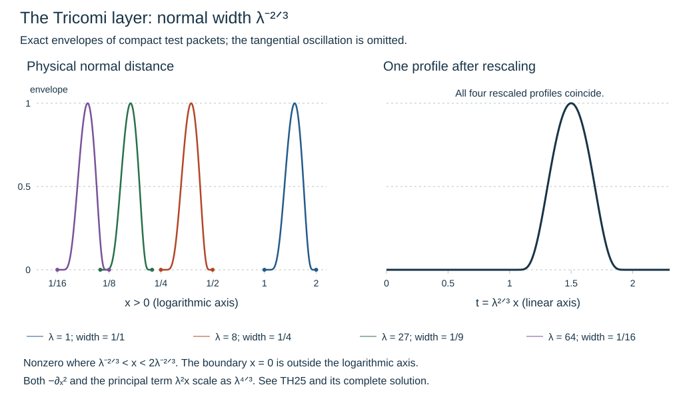

# Regularity at an elliptic Tricomi boundary

Independent exposition, proofs, exercises and illustration: GPT-6 Astra (OpenAI), Ultra, 9 October 2026. CC0-1.0.

At a Tricomi boundary, tangential ellipticity can vanish linearly in the normal coordinate. Ordinary elliptic estimates then lose their uniform constant. The replacement proved here controls two normal derivatives, one normal derivative with two thirds of a tangential derivative, and four thirds of a tangential derivative. These estimates imply full boundary regularity where the tangential principal symbol stays on the elliptic side.

The primary antecedent is Hörmander, *The Analysis of Linear Partial Differential Operators III*, approved Springer 2007 edition, Definition 24.6.1, Theorem 24.6.2 and Lemmas 24.6.3–24.6.4, printed pages 461–464. We give the weighted inequalities, full boundary energy identity, rough regularization and microlocal iteration explicitly. The distinct diffractive Tricomi construction remains a separate obligation.

The exact earlier inputs are the [sharp lower bound and all-real operator bounds](../20261005-cauchy-foundations/sharp-lower-bound.md), [intrinsic extension and tangential action](../20261005-boundary-wavefront-and-tangential/normal-extension-and-tangential-action.md), and the normal-recovery, fixed-collar and actual-trace proofs bound through [general scalar propagation](../20261009-general-scalar-boundary/scalar-boundary-propagation-through-general-glancing.html). The proof map gives their exact versions and transitive prerequisites. Required Lebl proofs remain external; internal P514 closure of this export is not claimed.

## 1. The boundary region and the theorem

**H0. Actual data and the elliptic-side condition.** Write the normal variable as \(x\ge0\), the tangential variables as \(y\in\mathbb R^d\), and \(D=-i\partial\). The boundary is noncharacteristic. Use the already proved boundary-preserving normalization to write the real quadratic principal symbol as
\[
 p(x,y,\xi,\eta)=\xi^2-r(x,y,\eta).
 \tag{TH1}
\]
All smooth complex lower coefficients are retained. A glancing state \(q=(y_0,\eta_0)\), \(\eta_0\ne0\), belongs to the hypoelliptic region considered here when
\[
 r(0,q)=0,\qquad r_x(0,q)<0,\qquad
 r(0,y,\eta)\le0\text{ in a conic neighborhood of }q .
 \tag{TH2}
\]
This is the gliding region outside the closure of the hyperbolic set \(r(0)>0\). Compactness on a smaller unit-covector patch and Taylor's formula give constants \(c,h>0\) such that
\[
 -r(x,y,\eta)\ge c x|\eta|^2,\qquad 0\le x<h
 \tag{TH3}
\]
there. Indeed \(r_x\le-c|\eta|^2\) on this entire smaller collar, and integration from \(0\) retains the nonpositive initial value.

Let \(u,f\in\mathcal N(X)\) be the actual intrinsic distributions, \(Pu=f\), and let \(h_0=\gamma_0u\) be the actual value trace. We prove
\[
 q\notin\operatorname{WF}_b(u)
 \quad\Longleftrightarrow\quad
 q\notin\operatorname{WF}_b(f)\cup\operatorname{WF}(h_0).
 \tag{TH4}
\]
Strictly elliptic boundary states have the earlier elliptic result; the new estimate concerns the degenerating boundary in (TH2). A point with nearby hyperbolic states does not satisfy the hypothesis.

## 2. Weighted control in the normal variable

**W1. A weighted half-line inequality.** If \(v\) is smooth and compactly supported on the closed half-line and \(a>0\), then
\[
 \|v\|_{L^2_x}\le
 9\|x^a v\|_{L^2_x}^{1/(a+1)}
   \|v'\|_{L^2_x}^{a/(a+1)}.
 \tag{TH5}
\]
There is no zero boundary-value assumption. Choose the continuous cutoff equal to one on \([0,1]\), linear from one to zero on \([1,2]\), and zero after \(2\). Put \(w=\chi v\). Then
\(\|v-w\|\le\|x^av\|\) and
\(\|w'\|\le\|v'\|+\|x^av\|\).
Piecewise integration of \((x|w|^2)'\), with zero endpoint terms, gives
\(\|w\|^2\le4\|w\|\|w'\|\), since \(x\le2\) on its support. Thus \(\|v\|\le5\|x^av\|+4\|v'\|\).
Apply this to \(v(x/\lambda)\) and cancel \(\lambda^{1/2}\). The right side becomes
\(5\lambda^a\|x^av\|+4\lambda^{-1}\|v'\|\).
Taking \(\lambda^{a+1}=\|v'\|/\|x^av\|\) proves (TH5). If either norm is zero, compact support or positivity of \(x^a\) makes \(v=0\), which handles that case.

Put \(\Lambda=\langle D_y\rangle\) and
\(\|v\|_t=\|\Lambda^t v\|_{L^2_{x,y}}\); boundary norms will be denoted \(|g|_t\). Fourier transformation in \(y\), (TH5), and Hölder with exponents \(a+1\) and \((a+1)/a\) give
\[
 \|v\|_t\le9\|x^av\|_{t_0}^{1/(a+1)}
                  \|v'\|_{t_1}^{a/(a+1)},\qquad
 t=\frac{t_0+a t_1}{a+1}.
 \tag{TH6}
\]
The Fourier weight factors into precisely these two powers; squaring before integration makes Hölder applicable. All transforms, product integrals and limiting versions use the proved Plancherel and measure results.

## 3. Boundary traces and interpolation without a boundary condition

**W2. The two interpolation facts.** Integration of \((|v|^2)'\) gives
\(|v(0)|^2\le2\|v\|\|v'\|\). Fourier transformation and Cauchy–Schwarz consequently give
\[
 |\gamma_0v|_{(t_0+t_1)/2}^2
       \le2\|v\|_{t_0}\|v'\|_{t_1}.
 \tag{TH7}
\]
It is important that the value is the actual endpoint limit. The estimate extends by completion to the indicated graph norms, using simultaneous smooth approximation.

We also need \(\|v'\|^2\le C\|v\|\|v''\|\) on the half-line, for arbitrary boundary values. Extend to \(x<0\) by \(3v(-x)-2v(-2x)\). The value and first derivative match at zero because \(3-2=1\) and \(-3+4=1\). The piecewise second derivative is its distributional second derivative: integration by parts on the two half-lines has no jump term. Direct changes of variable bound both the extended zeroth and second derivative norms by fixed multiples of the original ones. The whole-line Fourier inequality \(\|V'\|^2\le\|V\|\|V''\|\) proves the assertion. The same construction for tangential Fourier transforms proves its Hilbert-valued version.

Finally, for \(b>0\), \(0<\theta<1\), Fourier Hölder gives
\[
 \|v\|_{\theta b}\le\|v\|_0^{1-\theta}\|v\|_b^\theta .
 \tag{TH8}
\]
Young's inequality turns this into a small multiple of the higher norm plus a finite multiple of the lower one. These interpolation arguments do not impose a fictitious homogeneous boundary condition.

## 4. The full energy identity

**E0. Use a self-adjoint tangential principal part.** First suppose (TH3) holds globally for the tangential symbols on \(0\le x\le h\), with uniform ordinary symbol bounds. Let \(a=-r\) be real and let
\[
 A(x)=\tfrac12\{\operatorname{Op}(a(x))+
                       \operatorname{Op}(a(x))^*\},\qquad
 Q=-\partial_x^2+A(x).
 \tag{TH9}
\]
The complete adjoint calculus makes \(A\) self-adjoint on smooth tests, with symbol \(a+S^1\), uniformly with its normal derivatives. This choice moves only tangential order-one terms from the full operator into the lower part. No real lower-coefficient assumption is introduced.

Take \(v\) smooth with support away from \(x=h\), and let \(g=v(0)\). Integration in \(x\), using self-adjointness at every \(x\), yields the exact identity
\[
 \begin{split}
 \|Qv\|_0^2={}&\|v''\|_0^2+\|Av\|_0^2
       +2\int_0^h(A v',v')_y\,dx
       -\int_0^h(A''v,v)_y\,dx\\
 &+2\operatorname{Re}(v'(0),A(0)g)_y
       -(A'(0)g,g)_y .
 \end{split}
 \tag{TH10}
\]
Our inner product is linear in its first argument. To check every sign, expand the squared norm. In the cross term,
\(-2\operatorname{Re}(v'',Av)\) becomes
\(2\operatorname{Re}(v'(0),A(0)g)+2\int(Av',v')+
2\operatorname{Re}\int(v',A'v)\).
The last integrand is the derivative of \((v,A'v)\) minus \((v,A''v)\). Its endpoint at zero is \(-(A'(0)g,g)\). These are all boundary terms.

The actual operator is \(P=Q+B_0(x,y,D_y)\partial_x+B_1(x,y,D_y)\), with \(B_j\) of tangential order \(j\). This includes its original differential lower terms and the adjoint correction. We first estimate \(Q\), then absorb both lower terms.

## 5. Recover two thirds of a tangential derivative of the normal derivative

**E1. Positivity with its lower-order error.** The sharp lower bound CE:G9, applied to the nonnegative symbol \(a-cx|\eta|^2\), gives
\[
 \int(Av',v')\,dx\ge
       c\|x^{1/2}v'\|_1^2-C\|v'\|_{1/2}^2-C\|v'\|_0^2.
 \tag{TH11}
\]
The last term covers the replacement of \(|\eta|\) by \(\langle\eta\rangle\) and bounded \(x\). Normal derivatives of \(A\) have order two, so
\(|\int(A''v,v)|\le C\|v\|_1^2\).
At the boundary, order-two continuity and Fourier duality give
\[
 |(v'(0),A(0)g)|\le C|\gamma_0v'|_{1/3}|g|_{5/3},
 \qquad |(A'(0)g,g)|\le C|g|_1^2 .
 \tag{TH12}
\]
This explains why an estimate for nonzero value data cannot simply omit the boundary pairings.

Apply (TH6) to \(v'\), with \(a=1/2,t_0=1,t_1=0\). Apply (TH7) to \(v'\), with indices \(2/3,0\). They give
\[
 \|v'\|_{2/3}^2\le C\big(\|x^{1/2}v'\|_1^2+\|v''\|_0^2\big),
 \qquad
 |\gamma_0v'|_{1/3}^2\le2\|v'\|_{2/3}\|v''\|_0 .
 \tag{TH13}
\]
The half-order term in (TH11) interpolates between \(0\) and \(2/3\). Choose its higher-norm coefficient small relative to (TH13). Use Young on (TH12) with another sufficiently small coefficient. Equations (TH10)–(TH13), after these absorptions, imply
\[
 \|v''\|_0^2+\|Av\|_0^2+
       \|x^{1/2}v'\|_1^2+\|v'\|_{2/3}^2
 \le C\{\|Qv\|_0^2+\|v\|_1^2+\|v'\|_0^2+|g|_{5/3}^2\}.
 \tag{TH14}
\]
Every constant depends on finitely many symbol bounds and the positive constant \(c\), not on \(v\).

## 6. Recover four thirds of a tangential derivative

**E2. The weighted second-order term.** At each fixed \(x\), the full conjugate \(\Lambda A\Lambda^{-1}\) has principal symbol \(a\) and an order-one error. Applying the same sharp lower bound to its quadratic pairing with \(\Lambda v\) gives
\[
 c x\|v(x)\|_{H_y^2}^2
       \le\operatorname{Re}(Av(x),\Lambda^2v(x))_y
                  +C\|v(x)\|_{H_y^{3/2}}^2 .
 \tag{TH15}
\]
An additional \(C\|v(x)\|_{H_y^1}^2\) may be absorbed into the displayed last term. Multiply by \(x\) and integrate. Fourier Cauchy–Schwarz gives
\(\|x^{1/2}v\|_{3/2}^2\le\|xv\|_2\|v\|_1\).
Therefore, cancelling \(\|xv\|_2\) when it is nonzero, we obtain
\[
 \|xv\|_2\le C\{\|Av\|_0+\|v\|_1\}.
 \tag{TH16}
\]
The zero case already satisfies this estimate.

Now (TH6) with \(a=1,t_0=2,t_1=2/3\) gives
\(\|v\|_{4/3}^2\le C\|xv\|_2\|v'\|_{2/3}\).
Combine this with (TH14)–(TH16). Interpolate \(\|v\|_1\) between orders \(0,4/3\), and use W2 to interpolate \(\|v'\|_0\) between the zeroth and second normal norms. Absorb the higher terms, in that order. With
\[
 E_s(v)=\|v''\|_s+\|v'\|_{s+2/3}
                 +\|v\|_{s+4/3}+\|xv\|_{s+2},
 \tag{TH17}
\]
the result is
\[
 E_0(v)\le C\{\|Qv\|_0+\|v\|_0+|g|_{5/3}\}.
 \tag{TH18}
\]
All intermediate norms are controlled before their absorption; no circular assertion of an unproved weighted derivative bound is used.

## 7. Complex lower terms and all real orders

**E3. The estimate for the actual operator.** Ordinary continuity gives
\(\|B_0v'+B_1v\|_0\le C(\|v'\|_0+\|v\|_1)\).
The two interpolations just used bound this by \(\epsilon E_0(v)+C_\epsilon\|v\|_0\). Thus (TH18) absorbs every complex lower term of \(P\).

For any real \(s\), conjugate by \(\Lambda^s\). The full ordinary composition proof makes
\(\Lambda^sP\Lambda^{-s}-P\) a tangential operator of order one plus a tangential operator of order at most zero times \(\partial_x\). Indeed the second normal derivative commutes with \(\Lambda^s\); differentiating a tangential symbol in a commutator lowers its order by one, including the complete remainder. The preceding absorption applies to this full conjugated operator. Since \(x,\partial_x\) commute with \(\Lambda^s\), and its trace is \(\Lambda^s g\), we obtain
\[
 E_s(v)\le C_s\{\|Pv\|_s+\|v\|_s+|\gamma_0v|_{s+5/3}\},
                       \qquad s\in\mathbb R .
 \tag{TH19}
\]
This proves a sufficient \(s+5/3\) value-trace norm; no optimal boundary-data exponent is asserted. The anisotropic interior gain will have a sharp model in Exercise 3.

## 8. Apply the estimate to rough distributions

**R0. Tangential regularization with the commutator retained.** Suppose \(v\) has compact support in the normal collar, belongs to \(H^2_xH_y^{-N}\) for some finite \(N\), has
\[
 v\in L^2_xH_y^{s+1},\quad
 v'\in L^2_xH_y^{s-1},\quad
 Pv\in L^2_xH_y^s,\quad
 \gamma_0v\in H_y^{s+5/3}.
 \tag{TH20}
\]
Take \(S_\epsilon=\widehat\rho(\epsilon D_y)\), where \(\rho\) is a smooth compactly supported convolution kernel with integral one. For \(0<\epsilon\le1\), its symbols are bounded in \(S^0\), each operator is tangentially smoothing, and it converges to the identity on every Sobolev space in which its input lies. These assertions follow from differentiation of its Schwartz Fourier transform, Plancherel and dominated convergence.

The full uniform composition theorem gives
\[
 [P,S_\epsilon]=C_{\epsilon,1}
                       +C_{\epsilon,-1}\partial_x,
 \quad C_{\epsilon,1}\in\Psi^1,\quad
 C_{\epsilon,-1}\in\Psi^{-1},
 \tag{TH21}
\]
bounded in those classes. Here \(S_\epsilon\) is independent of \(x\), so the highest normal term commutes exactly. The \(B_0\) commutator has order minus one. Thus \(PS_\epsilon v\) is uniformly in the right-hand space of (TH19), by (TH20). Trace commutation is exact. The \(H^2_x\) regularity of \(S_\epsilon v\), with every tangential order, permits (TH19): use the two-jet extension in W2, smooth in the normal coordinate, restrict and pass to the limit in all finitely required norms and traces. A cutoff beyond the common support restores normal compactness. The trace estimate (TH7) justifies this limit; exact preservation of zero trace is unnecessary because (TH19) includes its value term.

Consequently \(E_s(S_\epsilon v)\) is uniformly bounded. The complete weak bounded-norm limit argument, or Fourier Fatou after testing compact normal charts, gives finite \(E_s(v)\). Weighted multiplication \(x\) is continuous in distributions and identifies its fourth term. This proves the rough version without first assuming the gained regularity.

## 9. Localize the principal symbol and the actual data

**R1. A global comparison symbol with a local purpose.** Shrink the patch in (TH2) once. Choose a real tangential conic cutoff equal to one on a larger patch than the eventual conclusion and supported where (TH3) holds. For high frequencies extend \(a=-r\) by a convex combination with \(c_0x|\eta|^2\), with \(0<c_0<c\). The resulting real \(S^2\) symbol satisfies the global inequality needed in E0 and agrees with \(a\) on the smaller patch. Smooth low frequencies arbitrarily; their uniformly smoothing contribution is an allowed lower term. Extend coefficients and cut off beyond a fixed slightly larger normal collar. These operations retain uniform symbol bounds. The comparison operator \(\widetilde P\) equals the full original \(P\) microlocally on the retained collar, including all its lower coefficients.

At a data-regular state in (TH4), the exact boundary tester criterion and the fixed-collar theorem EW:S1–S2 give a compact conic patch and one collar where localized \(f\) is smooth with all normal derivatives. The actual value trace is regular on the same smaller tangential patch. The pure-normal guard in that theorem is retained: a tangentially smoothing remainder acting on an intrinsic jet is smooth on this collar with every normal derivative.

Choose a fixed normal cutoff equal to one near the face and with derivative support in the collar interior. In that derivative support, (TH3) makes \(p=\xi^2+a\) elliptic at every real normal lift of the retained tangential directions. Ordinary elliptic regularity, the data test and the pure-normal guard therefore make the localized normal-cutoff errors smooth to every order. Cover its compact normal support by finitely many elliptic patches; no estimate at the degenerate face is used for these errors.

## 10. A finite gain iterated on one final cone

**R2. The full localization and regularity induction.** We spell out the rough starting point. Compact localization gives finite distribution order. The noncharacteristic normal-recovery proof EW:L1–L3, used in GSP:C1 before any characteristic estimate, improves the normal restriction index by one while losing one tangential index. After finitely many steps it is at least two. If that norm is \(\overline H_{(a,t)}\) with \(a\ge2\), then
\(|\xi|^j\langle\eta\rangle^{a+t-j}\le
\langle(\xi,\eta)\rangle^a\langle\eta\rangle^t\) for \(j=0,1,2\).
Taking the restriction extension infimum gives the corresponding actual \(L^2\) derivative bounds. In particular, on a compact larger patch there is a finite \(\sigma\) with \(E_\sigma\) finite and with two normal derivatives in a finite negative tangential order. The value and derivative traces are the original intrinsic ones, by the actual-trace comparison and (TH7).

For one gain step take nested proper tangential cutoffs \(A,B\), independent of \(x\) near the face, with \(B=1\) on a neighborhood of the microsupport of \(A\). Let \(v=\chi(x)Au\). The full equation is
\[
 \widetilde P v=\chi A f+
        \chi[\widetilde P,A]Bu+
        [\widetilde P,\chi]Au+\mathcal R u .
 \tag{TH22}
\]
The remainder \(\mathcal R u\) includes the comparison-symbol difference and the complementary input \(1-B\), with every proper-kernel error. It is tangentially smoothing on the chosen patch, with every normal jet, because the complete symbols have separated microsupports. The fixed-collar intrinsic estimate in R1 makes this an actual smooth output, not just a formal smoothing symbol.

The normal-cutoff term is smooth by R1. The first term is smooth by the forcing test. The commutator has tangential order one on \(Bu\), and tangential order minus one on \(\partial_x(Bu)\). Its uniform finite-order estimate follows from the full composition formula just as in (TH21). Thus if \(E_\sigma(Bu)\) is finite, its right side belongs to \(L^2_xH_y^{\sigma+1/3}\): it uses \(Bu\) at order \(\sigma+4/3\) and \(\partial_x Bu\) only at order \(\sigma-2/3\). The latter is weaker than its known order \(\sigma+2/3\).

Moreover \(v\) already has order \(\sigma+4/3\), and \(v'\) at least order \(\sigma+2/3\), so (TH20) holds with \(s=\sigma+1/3\). The trace \(\gamma_0v=A(0)h_0\) is smooth. R0 therefore gives
\[
 E_\sigma(Bu)<\infty\quad\Longrightarrow\quad
 E_{\sigma+1/3}(Au)<\infty .
 \tag{TH23}
\]
Terms differentiating a normal-dependent proper cutoff are handled in the interior smooth-error region just described; the boundary symbols themselves were chosen independent of \(x\).

Fix one inner compact conic patch before choosing the requested order. For each finite target order, insert finitely many nested cutoffs between that same inner patch and the larger data-regular patch. Apply (TH23) the required finite number of times. Constants and intermediate cutoffs may depend on that order; the inner patch and its collar do not. This proves every tangential Sobolev order there for \(u,u',u''\).

The equation solves for \(u''\) with coefficient one. Differentiating it \(k\) times in \(x\) expresses \(u^{(k+2)}\) through normal derivatives up to \(k+1\), tangential operators of order at most two, smooth coefficient derivatives and \(f^{(k)}\). Induction gives every normal derivative with every tangential Sobolev order. Fourier Sobolev embedding in the tangential variables and the one-dimensional fundamental theorem in \(x\) then give an actual smooth function up to the boundary after the inner test. All proper remainders have the same collar property. This is precisely absence from the boundary wavefront.

## 11. Finish both implications

**R3. Equality with the data front.** R2 proves the direction in (TH4) from regular data to regular solution. Conversely a boundary tester making \(u\) smooth on a collar also makes \(Pu\) smooth microlocally there: commute the complete differential operator past a smaller tester, using the full tangential calculus and all normal derivatives. The actual trace of that smooth localized representative is smooth and equals the localized original trace. The exact tester criterion consequently gives
\[
 \operatorname{WF}_b(Pu)\cup\operatorname{WF}(\gamma_0u)
                  \subset\operatorname{WF}_b(u)
 \tag{TH24}
\]
on this boundary patch. This proves (TH4) and the claimed equality on the hypoelliptic set.

The proof includes arbitrary complex lower coefficients and actual distributional data. It imposes neither an energy-solution hypothesis nor a new boundary realization. It also explains why a gliding curve by itself does not force a singularity in this region: regular forcing and regular value trace force regularity instead.

## 12. Three solved exercises

### Exercise 1. Find the two fractional indices

Starting with control of \(x^{1/2}\Lambda v'\) and \(v''\), determine the tangential order gained by \(v'\). Then combine it with control of \(x\Lambda^2v\) to find the order gained by \(v\). Give the resulting trace order of \(v'\).

**Solution.** In (TH6), \(a=1/2,t_0=1,t_1=0\) gives \(t=2/3\). Apply it again with \(a=1,t_0=2,t_1=2/3\), giving \(t=4/3\). Equation (TH7) applied to \(v'\) with orders \(2/3,0\) gives boundary order \(1/3\). Pairing that trace with a boundary operator of order two requires value data of order \(2-1/3=5/3\). These are sufficient exponents for this proof.

### Exercise 2. The boundary energy term has a visible size

For the one-frequency model \(Q=-d^2/dx^2+4x\), take \(v=e^{-x}\). Check (TH10), including its boundary term.

**Solution.** Here \(v''=v\), \(Av=4xv\), \(A'=4\), \(A''=A(0)=0\), and \(g=1\). The elementary integrals are
\(\int_0^\infty e^{-2x}dx=1/2\),
\(\int_0^\infty xe^{-2x}dx=1/4\) and
\(\int_0^\infty x^2e^{-2x}dx=1/4\), by two integrations by parts. Thus
\(\|Qv\|^2=\int(4x-1)^2e^{-2x}dx=5/2\).
The terms on the right of (TH10) are \(1/2+4+2-4=5/2\). Omitting the last term would give \(13/2\), so its sign and presence matter. Exponential decay justifies the endpoint at infinity; compact cutoffs and dominated convergence give the same identity from the compact-support case.

### Exercise 3. The normal layer fixes the four-thirds gain

For \(Q=-\partial_x^2+x|D_y|^2\), choose nonzero \(\phi\in C_c^\infty(\mathbb R)\) with support in \([1,2]\) and nonzero smooth compactly supported \(\psi\) in tangential space, and put
\[
 v_\lambda(x,y)=\phi(\lambda^{2/3}x)\psi(y)e^{i\lambda y_1},
                          \qquad \lambda\ge1 .
 \tag{TH25}
\]
Show that a uniform estimate with \(\|v\|_{4/3+\epsilon}\) on the left and only \(\|Qv\|_0+\|v\|_0\) on the right cannot hold for \(\epsilon>0\), even with zero value trace.

**Solution.** The support is at distance comparable to \(\lambda^{-2/3}\) from the face, and its trace is zero. A change of normal variable gives \(\|v_\lambda\|_0=C\lambda^{-1/3}\). Tangential Fourier translation and rapid decay of \(\widehat\psi\) give \(\|v_\lambda\|_t\asymp\lambda^t\|v_\lambda\|_0\) for fixed \(t\ge0\): a fixed frequency ball with positive Fourier mass gives the lower bound, and splitting into \(|\eta-\lambda e_1|\le\lambda/2\) and its rapidly decreasing complement gives the upper bound.

Both \(-\partial_x^2\) and the principal \(\lambda^2x\) term scale by \(\lambda^{4/3}\). The terms differentiating \(\psi\) are at most \(C\lambda^{1/3}\|v_\lambda\|_0\). Hence \(\|Qv_\lambda\|_0\le C\lambda^{4/3}\|v_\lambda\|_0\). A gain \(4/3+\epsilon\) would imply \(\lambda^\epsilon\le C\), a contradiction. This proves sharpness of the interior tangential gain in this model, without asserting optimality of the nonzero boundary-data norm in (TH19).

## 13. The normal layer and its exact scaling

**F0. What the figure represents.** The profiles are exactly
\(\phi(t)=\exp(4-1/((t-1)(2-t)))\) for \(1<t<2\), zero otherwise, evaluated at \(t=\lambda^{2/3}x\). They are normalized normal envelopes of (TH25), with \(\lambda=1,8,27,64\). The tangential factor and oscillation are omitted. The support endpoints are \(x=\lambda^{-2/3},2\lambda^{-2/3}\). The first horizontal axis is logarithmic in \(x\); the boundary \(x=0\) lies outside that axis. The second panel uses the linear coordinate \(t=\lambda^{2/3}x\); every envelope is then the same curve. This illustrates the precise competing derivative and potential scales, not an Airy solution or numerical PDE experiment. The [reproducible source](figures/build_figure.py) retains the function and all constants.

This completes the elliptic-side Tricomi regularity theorem. The separate diffractive Tricomi singularity construction, sharp general Airy energy mapping, parameter-dependent propagation and every remaining full AN-04 requirement stay active.
