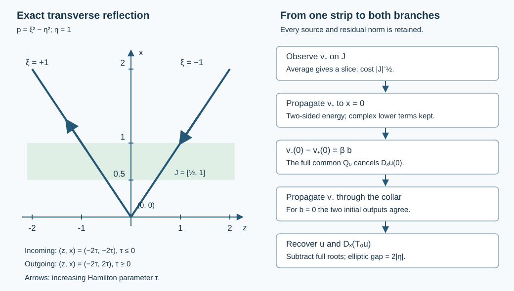

# Uniform transverse reflection with actual strip observations

This lesson makes the transverse reflection argument quantitative for a compact smooth family of scalar operators. It proves a uniform estimate from one observed branch on a positive normal strip, the actual tested forcing, the actual Dirichlet value and a coarse mixed norm. The parameter neighborhood and geometric cutoffs are fixed before the desired Sobolev order is chosen.

The starting point is Hörmander, *The Analysis of Linear Partial Differential Operators III*, §24.2, Theorem 24.2.1, and the parameter question in Proposition 24.7.1′. The exact approved 2007 edition is an admitted source. The argument below is independent exposition using the programme's complete [reflection proof](../20261007-restored-boundary-reflection/boundary-reflection-preparation.html), ordered Cauchy calculus and uniform glancing estimates. The last is needed only to identify the remaining assembly problem.

## 1. Fix the geometry before the regularity order

**R0. The precise input.** Write \(D_x=-i\partial_x\). Let \(a\) range over a compact parameter set contained in an open smooth parameter domain. On a fixed collar \(0\le x\le L\), \(z\in\mathbb R^d\), \(d\ge1\), suppose the scalar differential family has the normal form
\[
 P_a=D_x^2+C_a(x,z)D_x+B_a(x,z,D_z),\qquad
 \sigma_2(B_a)=-r_a(x,z,\eta),\qquad
 r_a\ge c|\eta|^2
 \tag{UR1}
\]
on a fixed open conic patch containing the compact tubes used below. Here \(c>0\), \(C_a\) has tangential order zero, and \(B_a\) has order two. All lower coefficients may be complex. Bounds on every coefficient derivative hold uniformly on the indicated compact sets. The real quadratic principal part, noncharacteristic face and smooth dependence are the same hypotheses as RF:T001–T004. Those proofs construct normal coordinates by a smooth transverse Hamilton flow; applying their derivative equations also to \(a\) gives a common local coordinate family. Alternatively (UR1) can be given at the outset. We make no assertion at a glancing point where its strict inequality fails.

Choose all input and output base supports inside one larger compact tangential set. Proper kernel cutoffs can enlarge that set by a fixed amount; include the enlargement from the start. In the estimate, \(u\) is smooth on the closed collar and compactly supported in this larger set, \(f=P_a u\), and \(b=u|_{x=0}\). For real \(s\), define
\[
 \|u\|_{X_s(I)}^2
 =\int_I\bigl(\|u(x)\|_{H^s_z}^2+
                    \|D_xu(x)\|_{H^{s-1}_z}^2\bigr)\,dx,
 \qquad X_s=X_s([0,L]).
 \tag{UR2}
\]
The tangential Sobolev norm is the Fourier norm with multiplier
\(\Lambda^s=(1+|D_z|^2)^{s/2}\). This input norm controls the actual first normal derivative; mere tangential smoothing will never be used to create such control. We prove estimates for smooth inputs, so no graph-density assertion is needed.

## 2. Uniform full operators, including their errors

**R1. Construct both orderings.** The positive square root of \(r_a\) and all its derivatives have uniform order-one symbol bounds on the patch, and the two principal roots have gap at least \(2\sqrt c|\eta|\). Extend \(r_a\) by a convex combination with a fixed positive multiple of \(|\eta|^2\), then complete the low frequencies smoothly. Cut off the other coefficients in a larger base set. The full differential expression agrees with the original one near the chosen cone. Its local discrepancies after a test in that cone are tangentially smoothing coefficients on the finite normal jets.

The complete ordered recursion RF:A2, HC:F1 gives
\[
 P_a=(D_x-A_{+,a})(D_x-A_{-,a})+\Omega_a
     =(D_x-\widetilde A_{-,a})(D_x-\widetilde A_{+,a})
           +\widetilde\Omega_a ,
 \tag{UR3}
\]
microlocally there. All four factors have their indicated real principal roots \(\pm\sqrt{r_a}\); their order-zero parts need not agree. Both defects are tangentially smoothing and contain no normal derivative.

Here is the exact normal-degree check, before any asymptotic approximation:
\[
 A_{+,a}=-C_a-A_{-,a},\qquad
 P_a-(D_x-A_{+,a})(D_x-A_{-,a})
 =B_a-i\partial_xA_{-,a}+C_aA_{-,a}+A_{-,a}^{\,2}.
 \tag{UR4}
\]
Starting with the negative principal root, divide the leading remaining error by twice that root with a minus sign. A defect of order \(2-N\) is removed by a correction of order \(1-N\); its derivative and all lower product terms have order at most \(1-N\). For \(N\ge1\) its square does too. The gap bounds all differentiated divisions uniformly. The parameter-aware symbol summation in HC:F1 uses the seminorms of every \(x\)- and \(a\)-derivative on the compact set. Reimposing the first equality of (UR4) on the summed actual operators cancels the normal coefficient exactly. Comparison with every finite stage proves the complete smoothing remainder. Start again with the positive right root for the second ordering. This constructs both factorizations uniformly; it does not exchange already constructed factors.

**R2. Prescribe the same full initial test.** Choose a scalar proper order-zero operator \(Q_0\), independent of \(a\), elliptic on a smaller compact boundary patch. Transport its principal symbol along the two real root flows:
\[
 (\partial_x-H_{\lambda_{+,a}})q_{+,0}=0,\qquad
 (\partial_x-H_{\lambda_{-,a}})q_{-,0}=0,\qquad
 \lambda_{\pm,a}=\pm\sqrt{r_a}.
 \tag{UR5}
\]
The smooth flow proof and its differentiated equations on a compact set give uniform solutions on one short collar. Choose that collar, the initial support, and a slightly larger tube for every parameter before specifying any Sobolev order. Uniform strict gaps and compact containment are open conditions.

At each lower symbol order the leading commutator is
\(-i(\partial_x-H_\lambda)\) on the correction. The scalar lower terms enter only at the next order. Solve the inhomogeneous transport equation with the corresponding prescribed initial coefficient of \(Q_0\). The full parameter summation in HC:P3 gives proper operators \(Q_{+,a},Q_{-,a}\). Their initial errors are smoothing families; subtract those errors times a fixed normal cutoff equal to one near zero. Commuting that correction with the first-order operator remains tangentially smoothing. Thus, with \(L_{+,a}=D_x-A_{+,a}\) and \(L_{-,a}=D_x-\widetilde A_{-,a}\),
\[
 [L_{+,a},Q_{+,a}],\ [L_{-,a},Q_{-,a}]
       \in\Psi^{-\infty}_{\rm tan},
 \qquad Q_{+,a}(0)=Q_{-,a}(0)=Q_0
 \tag{UR6}
\]
as full operator equalities at the boundary. Complete proper realizations and their support errors are part of these families. Their full smoothing seminorms are bounded uniformly; equality only of principal symbols would be insufficient.

**R3. Retain the actual forcing and normal jets.** Define
\[
 v_+=Q_{+,a}(D_x-A_{-,a})u,\qquad
 v_-=Q_{-,a}(D_x-\widetilde A_{+,a})u .
 \tag{UR7}
\]
For an exactly extended factorization, direct multiplication gives
\[
 \begin{aligned}
 L_{+,a}v_+&=Q_{+,a}f-Q_{+,a}\Omega_a u
                 +[L_{+,a},Q_{+,a}](D_x-A_{-,a})u,\\
 L_{-,a}v_-&=Q_{-,a}f-Q_{-,a}\widetilde\Omega_a u
                 +[L_{-,a},Q_{-,a}](D_x-\widetilde A_{+,a})u .
 \end{aligned}
 \tag{UR8}
\]
The difference between the local original expression and its complete extension adds only smoothing tangential coefficients on \(u,D_xu\). The normal leading coefficient is exactly one in both, so no second normal derivative is introduced by this comparison. Absorb those coefficients, every proper kernel error and the displayed defects into actual families \(E_{\pm,0,a},E_{\pm,1,a}\). The result is
\[
 L_{\pm,a}v_\pm=F_\pm
 =Q_{\pm,a}f+E_{\pm,0,a}u+E_{\pm,1,a}D_xu .
 \tag{UR9}
\]
For every real \(s,t\), the Fourier multiplier conjugations of the \(E\)'s have uniformly bounded order-zero symbol seminorms. The full ordinary composition and boundedness proofs, used also in UGE:L2, give
\[
 \|F_\pm\|_{L^2([0,L];H^{t-1}_z)}
 \le \|Q_{\pm,a}f\|_{L^2([0,L];H^{t-1}_z)}
       +C_{s,t}\|u\|_{X_s}.
 \tag{UR10}
\]
This proves a bound on the actual error functions, rather than dropping a smoothing remainder. It uses exactly one controlled normal derivative. There is no conclusion about additional normal regularity of \(f\).

## 3. First-order energy in both directions

**R4. Complex lower terms remain in the constant.** Consider \(L=D_x-A(x)\), where \(A\) is any of the two scalar first-order generators above, and \(Lv=F\). Put \(w=\Lambda^\rho v\), \(G=\Lambda^\rho F\), \(A_\rho=\Lambda^\rho A\Lambda^{-\rho}\). The complete adjoint and product calculus shows that
\[
 A_\rho-A_\rho^*\in\Psi^0,\qquad
 \|A_\rho-A_\rho^*\|_{L^2\to L^2}\le 2K_\rho ,
 \tag{UR11}
\]
uniformly in \(x,a\): its order-one principal symbol cancels because it is real. All remaining order-zero terms, including complex lower terms and the conjugation terms, have bounded finitely many symbol derivatives. The proved packet bound controls their norm. The same calculation applies to proper support errors.

Since \(D_xv=Av+F\), one has \(\partial_xw=iA_\rho w+iG\). Taking the derivative of the squared norm and using (UR11) yields
\[
 \left|\partial_x\|w\|^2\right|
 \le 2K_\rho\|w\|^2+2\|G\|\|w\|.
 \tag{UR12}
\]
For \(e_\epsilon=(\|w\|^2+\epsilon^2)^{1/2}\), this implies
\(|e_\epsilon'|\le K_\rho e_\epsilon+\|G\|\).
Multiply the one-sided inequality by the integrating factor on the interval between \(x\) and \(y\), in either orientation, integrate, and let \(\epsilon\) decrease to zero. Consequently
\[
 \|v(x)\|_{H^\rho}
 \le e^{K_\rho|x-y|}
       \left(\|v(y)\|_{H^\rho}
           +\int_{\min(x,y)}^{\max(x,y)}\|F(q)\|_{H^\rho}\,dq\right).
 \tag{UR13}
\]
All differentiations are legitimate for the present smooth compact inputs and their proper outputs. This is also the scalar first-order case of HC:E1, with both time directions made explicit.

**R5. An observed strip supplies a slice.** Fix a closed interval \(J\subset(0,L)\) of positive length, independent of \(a,s,t\). Continuity and the integral mean inequality provide \(y_*\in J\) with
\[
 \|v_+(y_*)\|_{H^{t-1}}
 \le |J|^{-1/2}\|v_+\|_{L^2(J;H^{t-1})}.
 \tag{UR14}
\]
Indeed otherwise the square of the left side would exceed the squared average at every point, contradicting integration. If necessary take a sequence approaching the infimum and use compactness of \(J\). No fixed or parameter-independent selected slice is assumed. Substituting this slice into (UR13) and applying Cauchy–Schwarz to the source integral gives the uniform bound
\[
 \|v_+\|_{L^\infty([0,L];H^{t-1})}
 \le e^{K_{t-1}L}
   \left(|J|^{-1/2}\|v_+\|_{L^2(J;H^{t-1})}
           +\sqrt L\|F_+\|_{L^2([0,L];H^{t-1})}\right).
 \tag{UR15}
\]
The dependence on strip width is explicit. The energy constant is independent of the slice selected by averaging.

## 4. Transfer the data and recover the solution

**R6. The boundary identity cancels the unknown derivative.** Evaluation of (UR7) at zero and the exact equality in (UR6) give
\[
 v_-(0)-v_+(0)=\beta_a b,\qquad
 \beta_a=Q_0\bigl(A_{-,a}(0)-\widetilde A_{+,a}(0)\bigr).
 \tag{UR16}
\]
This is an equality of actual smooth functions. In particular \(b=0\) makes the difference exactly zero. Applying (UR13) forward to \(v_-\), and then (UR15), proves
\[
 \begin{aligned}
 \|v_+\|_{L^\infty H^{t-1}}+\|v_-\|_{L^\infty H^{t-1}}
 \le C_t\bigl(&|J|^{-1/2}\|v_+\|_{L^2(J;H^{t-1})}\\
 &+\sqrt L(\|F_+\|_{L^2H^{t-1}}+\|F_-\|_{L^2H^{t-1}})
       +\|\beta_a b\|_{H^{t-1}}\bigr).
 \end{aligned}
 \tag{UR17}
\]
The omitted normal interval in this formula is \([0,L]\). Starting with \(v_-\) instead proves the same inequality with that branch observed; (UR16) is used with the opposite sign.

**R7. Use the complete root gap.** On some fixed \(0\le x\le L_0\le L\), both transported tests remain elliptic on a common smaller patch. This follows from their common initial ellipticity and compact smooth dependence. Choose nested proper tangential order-zero tests \(T_0,T_1,T_2\), independent of \(a\), with compact microsupport there. Each outer test has full symbol one near the inner test's microsupport, modulo smoothing proper support terms; all \(x\)-derivative supports of the inner test lie in the same outer region. They may be constructed from one smooth cutoff in the common open patch and two larger cutoffs. Their geometry is fixed for all regularity orders.

Uniform parametrices of \(Q_{\pm,a}\), composed with an outer \(T_j\), give actual identities
\[
 \begin{aligned}
 T_j(D_x-A_{-,a})u&=G_{+,j,a}v_++R_{+,j,0,a}u+R_{+,j,1,a}D_xu,\\
 T_j(D_x-\widetilde A_{+,a})u
   &=G_{-,j,a}v_-+R_{-,j,0,a}u+R_{-,j,1,a}D_xu .
 \end{aligned}
 \tag{UR18}
\]
The \(G\)'s have order zero and the \(R\)'s are tangentially smoothing. The complete construction is the same as RF:T026, with uniform seminorms: the leading inverses have a common lower bound, successive defects lose order, and parameter summation retains all derivatives. As in (UR10), each remainder in \(L^2H^{t-1}\) is bounded by \(C_{s,t}\|u\|_{X_s}\).

Subtract (UR18). The normal derivatives cancel. The remaining tangential operator is elliptic of order one:
\[
 D_a^{\rm gap}=\widetilde A_{+,a}-A_{-,a},\qquad
 \sigma_1(D_a^{\rm gap})=2\sqrt{r_a}\ge2\sqrt c|\eta|.
 \tag{UR19}
\]
An order-minus-one local parametrix for \(T_2D_a^{\rm gap}\), elliptic near the support of \(T_1\), yields \(T_1u\) modulo a smoothing operator on \(u\). Low frequencies are included in that actual remainder. Therefore, writing
\(V_t=\|v_+\|_{L^\infty H^{t-1}}+\|v_-\|_{L^\infty H^{t-1}}\),
\[
 \|T_1u\|_{L^2([0,L_0];H^t)}
 \le C_{s,t}\bigl(\sqrt{L_0}V_t+\|u\|_{X_s}\bigr).
 \tag{UR20}
\]
The order-minus-one mapping follows by conjugating with \(\Lambda^t,\Lambda^{1-t}\) and applying the same order-zero bound.

To recover the normal derivative of the inner localized solution, use the exact product identity
\[
 D_x(T_0u)=T_0(D_x-A_{-,a})u+
                T_0A_{-,a}u-i(\partial_xT_0)u .
 \tag{UR21}
\]
Insert the outer test \(T_1\) before \(u\) in the last two terms by a complete local parametrix; the discrepancies are tangentially smoothing on \(u\). Their norms are controlled by \(X_s\). The order-one term maps \(H^t\) to \(H^{t-1}\); the derivative of \(T_0\) has order zero. The first term is controlled by (UR18). Combining these facts with (UR20), and using an outer cutoff also for the order-zero \(T_0u\) term, gives
\[
 \|T_0u\|_{X_t([0,L_0])}
 \le C_{s,t}\bigl(V_t+\|u\|_{X_s}\bigr).
 \tag{UR22}
\]
Constants here may depend on the fixed collar lengths. This argument proves the integrated normal-derivative bound stated in (UR22); it does not infer a supremum normal-derivative bound from the coarse input.

## 5. The uniform reflection estimate and its scope

**R8. Assemble the actual norms.** Fix any real \(s\) and finite \(t\ge s\). Substitute (UR10) into (UR17), then use (UR22). There is a constant independent of \(a,u\) such that
\[
 \begin{aligned}
 \|T_0u\|_{X_t([0,L_0])}\le C_{s,t}\bigl(
 &|J|^{-1/2}\|Q_{+,a}(D_x-A_{-,a})u\|_{L^2(J;H^{t-1})}\\
 &+\sqrt L\,\|Q_{+,a}P_a u\|_{L^2([0,L];H^{t-1})}\\
 &+\sqrt L\,\|Q_{-,a}P_a u\|_{L^2([0,L];H^{t-1})}\\
 &+\|\beta_a b\|_{H^{t-1}}+\|u\|_{X_s}\bigr).
 \end{aligned}
 \tag{UR23}
\]
One may observe the minus branch instead. For homogeneous Dirichlet values the boundary term vanishes exactly. Every factor, commutant and parametrix used above was constructed with all parameter derivatives on one fixed geometric neighborhood. Raising \(t\) changes the finite seminorm bounds and \(C_{s,t}\), not that neighborhood, the strip, the root gap or the principal supports.

**R9. What remains before the global observation theorem.** This is a local uniform transverse reflection estimate with the displayed actual branch and source tests. Those tests depend smoothly on the coefficients. The right side has not yet been replaced by one fixed admissible compressed source test and one prescribed ordinary or compressed observation test on an arbitrary global observation region. Passing from such tests to (UR23), and combining the result with the uniform glancing, elliptic and interior estimates along the compact ray-access geometry, remain required steps for HIII24.7.1′. In particular, regularity at one interior covector alone is not a numerical bound for the whole strip norm in (UR23).

The proof used no ordinary normal derivatives of \(f\). It did use the full coarse \(X_s\) norm and every residual contribution in (UR9) and (UR18). The separate admissible regularization and scalar source-test lessons provide local graph inputs under their exact support hypotheses; the remaining interfaces must preserve those hypotheses. There is no claim of full-course completion, global scalar-test assembly or internal P514 closure for an export with external human foundations.

## 6. Three complete checks

### Exercise 1. A flat reflected mode and the strip-width factor

On the tangential circle of length \(2\pi\), let \(k\) be a positive integer, \(c>0\), \(\kappa=ck\), and \(P=D_x^2-c^2D_z^2\). Take \(u=\sin(\kappa x)e^{ikz}\). Compute both tested branches on this one mode, using \(Q_+=Q_-=1\), and determine the exact strip dependence.

**Solution.** The function has zero Dirichlet value and \(Pu=0\), since both \(D_x^2u\) and \(c^2D_z^2u\) equal \(\kappa^2u\). On the mode the right factors are \(A_-=-\kappa\) and \(\widetilde A_+=\kappa\). Hence
\[
 v_+=-\!i\kappa e^{i\kappa x}e^{ikz},\qquad
 v_-=-\!i\kappa e^{-i\kappa x}e^{ikz},\qquad
 v_+(0)=v_-(0)=-i\kappa e^{ikz}.
 \tag{UR24}
\]
For any real \(\rho\), the squared \(H^\rho\) norm of either branch is
\(2\pi\kappa^2(1+k^2)^\rho\), independent of \(x\). Its squared strip norm is exactly \(|J|\) times that number. Thus (UR14) is an equality and the factor \(|J|^{-1/2}\) cannot be replaced by a bound independent of shrinking strip width. The two coefficients in the exponential expansion of \(u\) have ratio \(-1\), whereas the two branch outputs agree at zero. These are different quantities.

### Exercise 2. A complex order-zero term affects reverse propagation

For one Fourier mode let \(A=\lambda+i\mu\), with real constants \(\lambda,\mu\), and solve \((D_x-A)v=0\). Find the exact growth in either direction and the constant in the energy inequality.

**Solution.** Direct differentiation gives
\[
 v(x)=e^{i\lambda(x-y)-\mu(x-y)}v(y),\qquad
 |v(x)|=e^{-\mu(x-y)}|v(y)|,\qquad
 A-A^*=2i\mu .
 \tag{UR25}
\]
Thus \(K=|\mu|\) is valid in (UR11)–(UR13). If \(\mu>0\), the solution decays forward but grows when propagated backward; if \(\mu<0\), the roles reverse. The derivative of its squared norm is exactly \(-2\mu|v|^2\). Keeping only the real principal part would miss this factor. This exercise concerns the first-order energy statement and does not assume that two arbitrarily chosen lower root terms factor the same second-order operator.

### Exercise 3. Equal principal initial symbols do not cancel the derivative

Suppose that \(Q_+(0)=Q_0\) but \(Q_-(0)=Q_0+R_0\), where \(R_0\) is smoothing. Compute the boundary difference. Show why the extra term need not vanish for zero Dirichlet data, using \(R_0\) as projection onto one circle mode.

**Solution.** Expanding both definitions without dropping the smoothing term gives
\[
 v_-(0)-v_+(0)
 =Q_0(A_-(0)-\widetilde A_+(0))b+
                    R_0(D_xu(0)-\widetilde A_+(0)b).
 \tag{UR26}
\]
Let \(R_0\) be the orthogonal projection onto \(e^{ikz}\); its kernel
\((2\pi)^{-1}e^{ik(z-w)}\) is smooth. For
\(u_N=Nx\chi(x)e^{ikz}\), with \(\chi=1\) near zero, \(b=0\) but
\[
 R_0D_xu_N(0)=-iN e^{ikz},\qquad
 \|R_0D_xu_N(0)\|_{H^\rho}
   =|N|\sqrt{2\pi}(1+k^2)^{\rho/2}.
 \tag{UR27}
\]
Therefore the extra term cannot be set to zero merely from \(b=0\). This example diagnoses the exact identity; it does not claim that the coarse norm of \(u_N\) stays bounded as \(N\) grows. Subtracting a smoothing normal family with initial value \(R_0\) restores equality of the full initial tests. Its first-order commutator remains smoothing, precisely as in R2.

## 7. What the diagram shows

**F0. Exact rays and the data transfer.** In the left panel the flat principal symbol is \(p=\xi^2-\eta^2\), with \(\eta=1\). A single Hamilton-oriented reflected ray has incoming points \((z,x)=(-2\tau,-2\tau)\) for \(-1\le\tau\le0\), normal covector \(\xi=-1\), and outgoing points \((z,x)=(-2\tau,2\tau)\) for \(0\le\tau\le1\), normal covector \(\xi=1\). Tangential covector and boundary point agree. The horizontal band is exactly \(J=[1/2,1]\) in the \(x\) coordinate. It observes one transported branch; either branch may be selected. The arrows follow increasing Hamilton parameter, not an unspecified physical time.

The right panel records the order of the proof: average the actual strip output, propagate it to zero, use the exact identity (UR16), propagate the other output and invert the root gap. The curve is a base projection, not a wavefront amplitude plot. Reproducible [figure source](figures/build_figure.py), [exact checks](check_models.py), proof map, [receiving review](proof-review.json) and source record accompany the lesson.

The independently written lesson, exercises and original figure are CC0. Earlier programme components retain their recorded terms. Lebl's foundational proofs remain explicitly external author-edition dependencies; they are not included in this CC0 payload. Reading and ordinary citation of the approved source books remain valid.
