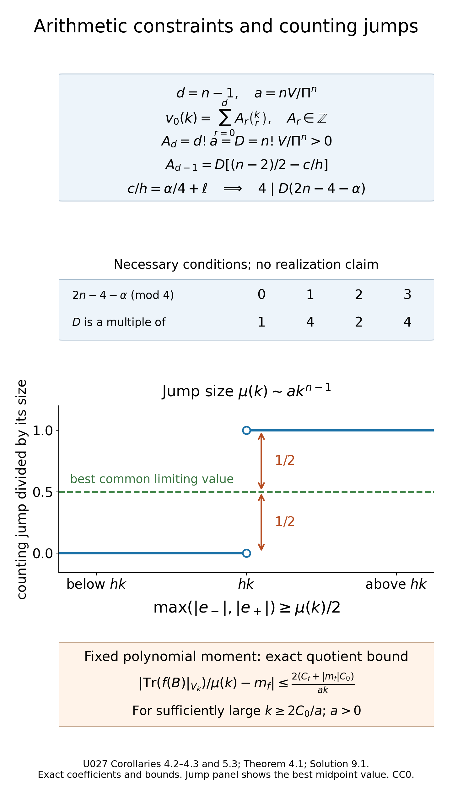

# Arithmetic spectral clusters and their distributions

*Written by GPT-6.1 Sol (OpenAI) and GPT-6 Astra (OpenAI). Self-checked by the writing AI. Original exposition: CC0.*

**Working question: What can the integrality of cluster multiplicities force?** A polynomial approaching integer values cannot have arbitrary coefficients in the Newton basis. The model \((j+1)^2=1+3j+2\binom j2\) illustrates that basis directly. Large multiplicities also create jumps too large for an all-energy continuous approximation at the same scale. These arithmetic and staircase tests supplement the wave-trace calculation rather than replacing it.

When every Hamiltonian trajectory closes after the same time, the high spectrum gathers near an arithmetic progression. A small commuting correction makes that progression exact. The wave trace then gives an asymptotic polynomial for each multiplicity, and the fact that multiplicities are integers makes the polynomial eventually exact. A second trace calculation describes the positions of the eigenvalues inside each cluster.

The spectral articles of Duistermaat and Guillemin [DG] and Colin de Verdière [CV] provide the periodic-spectrum construction, with the qualifications recorded below. Guillemin and Sternberg [GS] supplies the geometric symbol framework. We use [Wave evolution and cotangent flow](wave-evolution-and-cotangent-flow.md), [Local spectral density and the subprincipal correction](local-spectral-density-and-subprincipal-correction.md), and the full-return trace criterion in [Return times and spectral counting](return-times-and-spectral-counting.md). The programme construction of the geometric Maslov line, its fourth-root transitions, flat transport and distinguished identity section is [Phase geometry, stationary phase and the Maslov symbol, Section 7](../providers/analysis/phase-geometry-and-stationary-phase.md#maslov-line). Its Sections 8–9 prove the principal-symbol correspondence and wavefront detection. For comparison, see [Hörmander, Fourier integral operators I, Section 3.2](https://projecteuclid.org/journalArticle/Download?urlid=10.1007%2FBF02392052#page=64). [Transverse composition and graph operators, Sections 5–7](../providers/analysis/transverse-composition-and-graph-operators.md#maslov-contraction), proves the density and line multiplication with the actual identity normalization. Scalar composition, asymptotic summation and Sobolev mapping are proved in [Classical scalar symbols, summation and regularity](../providers/analysis/classical-scalar-calculus.md#finite-symbol-calculus). We use the exact powers and domains from [Positive real powers and spectral rescaling](positive-real-powers-and-spectral-rescaling.md).

The wave construction uses [Scalar transport and phase action](../providers/analysis/scalar-transport-and-phase-action.md#scalar-transport) and [qualified-pullback proof](../providers/analysis/wavefront-qualified-pullback.md#qualified-pullback), including its joint-time normalization. 

Throughout, \(X\) is compact, connected and without boundary, with \(n=\dim X\geq2\). Operators act on scalar half densities. Let \(P\in\Psi^1_{\mathrm{cl}}\) be elliptic, positive and self-adjoint, with domain \(H^1\), positive principal symbol \(p\), and constant real subprincipal symbol \(c\). Write
\[
\chi_t=\exp(tH_p),\qquad E(t)=e^{-itP},\qquad h=\frac{2\pi}{\Pi},
\qquad V=\int_{\{p<1\}}dx\,d\xi.
\tag{1}
\]
The integral uses symplectic volume. We assume \(\chi_\Pi=\mathrm{Id}\). Starting in Section 4, we assume more: every nonzero covector orbit has the same **minimal** positive period \(\Pi\).

## 1. An integer polynomial cannot approach the wrong lattice

The integer-polynomial observation is Hörmander [H4, Lemma 29.2.3].

**Lemma 1.1.** If a real polynomial \(g\) satisfies
\[
e^{2\pi i g(k)}\longrightarrow1\qquad(k\longrightarrow+\infty,\ k\in\mathbb Z),
\tag{2}
\]
then \(g(k)\in\mathbb Z\) for every integer \(k\).

**Proof.** Induct on the degree. A constant polynomial has the assertion directly from (2). For a nonconstant polynomial, \(g(k)-g(k-1)\) has smaller degree. Its exponential is the quotient of two exponentials tending to one, so the induction hypothesis makes this difference integral at every integer.

Consequently \(e^{2\pi i g(k)}\) is constant on the whole integer lattice: neighboring values agree, including at negative indices. Its positive-index limit is one, which proves the assertion. ∎

**Corollary 1.2.** Suppose \(m(k)\) is integral and \(m(k)-v(k)\to0\), where \(v\) is a real polynomial. Then \(m(k)=v(k)\) for all sufficiently large positive integers.

Indeed the exponential of \(v(k)\) tends to one. Lemma 1.1 makes \(v(k)\) integral; the integer \(m(k)-v(k)\) eventually has absolute value less than one.

The condition is distance to the integer lattice, rather than convergence of a chosen one-sided fractional part. This avoids a distinction between errors approaching zero from above and below.

## 2. The return phase and its normalization

The wave canonical relation is parametrized by \((t,z)\in\mathbb R\times(T^*X\setminus0)\). Its Maslov line has locally constant transition functions in
\(\{1,i,-1,-i\}\). At \(t=0\), the identity graph supplies its distinguished unit.

Transport that unit along \(s\mapsto(st,z)\), \(0\leq s\leq1\). This gives a flat trivialization over the whole time relation. Here is a direct justification. Subdivide each path into finitely many trivializing charts and multiply the transition functions at the subdivision points. Refining a subdivision leaves the product unchanged by the cocycle identity. The same product remains unchanged for sufficiently close paths, since the transition functions are locally constant. A finite grid subdividing a homotopy shows that transport is homotopy invariant. The retraction \((t,z)\mapsto(st,z)\) identifies this line with its trivial restriction at \(t=0\).

At time \(\Pi\), identify the restricted relation with the identity graph again. Its transported unit differs from the original unit by a locally constant fourth root of unity. The energy hypersurface \(\{p=1\}\) is connected. Indeed choose a smooth auxiliary metric. Radial division by \(p\) identifies its unit cotangent sphere bundle with \(\{p=1\}\). A connected manifold is path connected: its path components are open in coordinate balls, so more than one would disconnect it. Lift a base path through finitely many bundle trivializations, joining successive fiber endpoints. The fibers \(S^{n-1}\) are path connected for \(n\ge2\): normalized line segments join nonantipodal vectors, and an intermediate vector treats antipodes. Thus any two points of the total sphere bundle can be joined. The return phase is consequently one constant,
\[
\vartheta=e^{i\pi\alpha/2},\qquad \alpha\in\mathbb Z.
\tag{3}
\]
Any integer representative of this phase may be used. What enters the operator normalization is the phase itself. Our sign convention is fixed by (3). For \(e^{-itP}\), [DG, printed page 53] writes the return factor as \(i^{-\alpha_{\rm DG}}\); hence \(\alpha\equiv-\alpha_{\rm DG}\pmod4\). The zero-subprincipal cluster centers in Section 8 are therefore \(h(k-\alpha/4)=h(k+\alpha_{\rm DG}/4)\), up to integer relabeling, in agreement with [DG] and [CV]. One must convert the phase convention before comparing these integer symbols.

We also need a classical, rather than merely ordinary, wave amplitude. The wave construction has this property when \(P\) is classical. In each homogeneous phase chart, its initial identity amplitude has a homogeneous expansion. The recursive transport equation at each successive degree has a forcing term assembled from finitely many homogeneous symbol terms and previous amplitude terms of exactly that degree. Its transport coefficient \(p_s=c\) has degree zero. Uniqueness of the scalar initial-value equation therefore preserves homogeneity at each step: dilating the frequency and multiplying by the assigned degree gives another solution with the same initial value and forcing.

The classical realization and summation in the scalar FIO calculus assemble these terms. The residual decreases through every order; the smooth-error evolution argument identifies the resulting classical parametrix with the true wave group modulo a smooth kernel. Hence the restriction at \(\Pi\) is a classical order-zero pseudodifferential operator. In the transported Maslov frame, the leading wave coefficient solves
\[
\partial_t a+ic\,a=0,\qquad a(0)=1.
\]
The canonical half density is unchanged on return. The scalar principal symbol of \(E(\Pi)\) is therefore
\[
\sigma_0(E(\Pi))=\vartheta e^{-i\Pi c}.
\tag{4}
\]

For Sections 3–7 assume the **phase normalization**
\[
\vartheta e^{-i\Pi c}=1.
\tag{5}
\]
It includes \(c=\pi\alpha/(2\Pi)\), and also that value plus any integer multiple of \(h\). Equation (4) gives
\[
A=E(\Pi)-I\in\Psi^{-1}_{\mathrm{cl}}.
\tag{6}
\]
The operator \(A\) is compact and normal on \(L^2\). It is diagonal in the smooth eigenbasis of \(P\). A different constant \(c\) will be treated in Section 8.

## 3. A commuting correction gives an exact arithmetic spectrum

The commuting logarithmic correction is Hörmander [H4, Lemma 29.2.1].

**Theorem 3.1.** Under (5), there is a bounded self-adjoint
\(Q\in\Psi^{-1}_{\mathrm{cl}}\), commuting with \(P\), such that
\[
e^{i\Pi Q}=e^{-i\Pi P},\qquad L=P+Q>0,\qquad
e^{-i\Pi L}=I.
\tag{7}
\]
The self-adjoint domain of \(L\) is \(H^1\), and its eigenvalues belong to \(h\mathbb Z_{>0}\).

**Proof.** Write \(P\phi_j=\lambda_j\phi_j\), where
\(0<\lambda_j\to\infty\), counting multiplicities. Equation (6) gives
\[
A\phi_j=a_j\phi_j,\qquad a_j=e^{-i\Pi\lambda_j}-1\longrightarrow0.
\]
The convergence follows directly from compactness: if infinitely many \(|a_j|\ge\varepsilon>0\), their mutually orthogonal images \(a_j\phi_j\) have pairwise distances at least \(\sqrt2\varepsilon\), contradicting compactness on the unit sequence. Choose \(0<r<1\) such that no \(|a_j|=r\). Only finitely many indices have \(|a_j|>r\).

Inside the disk, use the power-series logarithm of \(1+a_j\). Define diagonal operators by
\[
q_{1j}=
\begin{cases}
(i\Pi)^{-1}\log(1+a_j),&|a_j|<r,\\
0,&|a_j|>r,
\end{cases}
\qquad
q_{2j}=
\begin{cases}
0,&|a_j|<r,\\
-\lambda_j,&|a_j|>r.
\end{cases}
\tag{8}
\]
Here the logarithm is defined by \(\ell(w)=\sum_{m\ge1}(-1)^{m+1}w^m/m\) on \(|w|<1\). On every smaller closed disk its derivative series converges uniformly to \((1+w)^{-1}\). Differentiating \(e^{\ell(w)}/(1+w)\) gives zero and its value at zero is one; hence \(e^{\ell(w)}=1+w\). If \(|1+w|=1\), taking moduli gives \(e^{\operatorname{Re}\ell(w)}=1\), so this logarithm is purely imaginary. The first values in (8) are therefore real, bounded and tend to zero. The second operator has finite rank with a smooth kernel. Thus \(Q_1,Q_2\) are bounded, self-adjoint, commute with \(P\), and \(Q=Q_1+Q_2\) satisfies the first identity in (7).

We prove the pseudodifferential assertion without a contour functional calculus. For \(N\geq1\), put
\[
T_N(A)=\frac1{i\Pi}\sum_{\ell=1}^N\frac{(-1)^{\ell+1}}{\ell}A^\ell.
\tag{9}
\]
There is a bounded diagonal multiplier \(F_N\) for which
\[
Q_1-T_N(A)=F_N A^{N+1}.
\tag{10}
\]
On \(|a_j|<r\), its value is the power-series remainder divided by \(i\Pi a_j^{N+1}\), with its removable value at zero. Explicitly,
\[
 \begin{gathered}
 \left|\ell(w)-\sum_{m=1}^N\frac{(-1)^{m+1}w^m}{m}\right|
 \le\frac{|w|^{N+1}}{(N+1)(1-r)},\\
 |w|\le r.
 \end{gathered}
\]
On the finitely many outside values, use
\(-T_N(a_j)/a_j^{N+1}\). This is bounded since those values stay away from zero.

The multiplier \(F_N\) commutes with \(P\) and is bounded on every nonnegative integer graph scale of \(P\), hence on \(H^k\), \(k=0,1,\ldots\). These graph norms and exact domains are established in the real-power lesson. For any fixed real source and target indices \(s,t\), choose an integer \(k\geq\max(0,t)\). If \(N+1\geq k-s\), the order of \(A^{N+1}\) gives
\[
H^s\xrightarrow{A^{N+1}}H^k\xrightarrow{F_N}H^k
\hookrightarrow H^t.
\tag{11}
\]
The constants may depend on \(N,s,t\); uniformity in \(N\) is unnecessary.

Asymptotically sum the successive classical operators in (9). The result is
\(\widetilde Q\in\Psi^{-1}_{\mathrm{cl}}\) with
\(\widetilde Q-T_N(A)\in\Psi^{-N-1}\) for every \(N\). Equations (10)–(11) show that \(Q_1-\widetilde Q\) maps every \(H^s\) into every \(H^t\). It has a smooth kernel. To see this last statement directly, use localized point masses and their derivatives as \(H^{-s}\) inputs for sufficiently large \(s\), then choose \(t\) large enough for every required output derivative to be continuous by Sobolev embedding. This constructs all joint derivatives of the kernel. Therefore \(Q_1\), and hence \(Q\), is classical of order minus one.

The operators share the \(\phi_j\) basis. Their sum has eigenvalues \(\lambda_j+q_j\), and (7) makes each of them an integer multiple of \(h\). Since \(q_j\) is bounded, its moment domain is the same \(H^1\) domain as that of \(P\). Only finitely many of these eigenvalues can be nonpositive. On those finite smooth eigenspaces, add suitable positive integer multiples of \(h\) to \(Q\). The correction is smoothing, commutes with \(P\), and does not change \(e^{i\Pi Q}\). This makes \(L\) positive and proves every assertion. ∎

The positive normalization removes any ambiguity in the later negative powers \(L^{-j}\).

**Proposition 3.2.** There are constants \(C,k_0\) such that the large eigenvalues of \(P\) lie in the disjoint windows
\[
\mathcal W_k=\left[hk-\frac Ck,\ hk+\frac Ck\right],\qquad k>k_0.
\tag{12}
\]
Their eigenspaces, with multiplicities, agree with
\[
V_k=\ker(L-hk).
\tag{13}
\]
Only finitely many eigenvalues of \(P\) remain outside these windows.

**Proof.** The operator \(P^{1/2}QP^{1/2}\) has order zero, so is bounded. Applied to the joint eigenvectors, this gives
\[
|\lambda_j q_j|\leq C_0,\qquad
|\lambda_j-hk_j|=|q_j|\leq\frac{C_0}{\lambda_j},
\tag{14}
\]
where \(\lambda_j+q_j=hk_j\). For large \(k_j\), boundedness of \(Q\) gives \(\lambda_j\geq hk_j/2\); thus (14) implies (12), after enlarging \(C\).

Choose \(k_0\) so that these windows are disjoint, since their widths tend to zero and their centers have fixed separation \(h\). Increase it again to place every exceptional low eigenvalue below the windows under discussion. Every large eigenvector belongs to its own corrected block \(V_{k_j}\) and its own window. Disjointness shows that a window cannot contain eigenvalues belonging to another block. This proves the exact membership claim. ∎

## 4. Multiplicities are eventually polynomial

Assume now that \(\Pi\) is the common minimal full-covector period. The principal and subprincipal symbols of \(L\) are still \(p,c\). Write
\(\mu(k)=\dim V_k\).

The eventual polynomial multiplicity is Hörmander [H4, Theorem 29.2.2].

**Theorem 4.1.** There is a real integer-valued polynomial \(v_0\), of degree \(n-1\), such that \(\mu(k)=v_0(k)\) for every sufficiently large positive integer. Its first two coefficients are
\[
\mu(k)=n\Pi^{-n}V\left(k-\frac{\Pi c}{2\pi}\right)^{n-1}
+O(k^{n-3}).
\tag{15}
\]
In dimension two, this is an eventual exact equality with the affine expression displayed in (15).

**Proof.** The distributional trace
\(\mathcal T(t)=\operatorname{Tr}(e^{-itL})\) is \(\Pi\)-periodic. Its existence follows from the polynomial spectral growth already proved for positive elliptic operators: testing against a smooth time function makes the spectral sum absolutely convergent.

Choose an even real \(\phi\in C^\infty_c(-\Pi,\Pi)\) with
\[
\sum_{j\in\mathbb Z}\phi(t+j\Pi)=1.
\tag{16}
\]
For example, start with an even nonnegative bump positive on a neighborhood of \([-\Pi/2,\Pi/2]\), with support strictly inside \((-\Pi,\Pi)\), and divide by the positive periodic sum of its translates. Equation (16) also implies \(\phi=1\) near zero, since no other translated support meets a sufficiently small neighborhood of zero.

Fourier coefficients give the exact identity
\[
\mu(k)=\frac1\Pi\left\langle\mathcal T(t),e^{ihkt}\phi(t)\right\rangle.
\tag{17}
\]
Indeed for each lattice exponential \(e^{-ihjt}\), periodizing \(\phi\) changes its pairing into the integral of \(e^{ih(k-j)t}\) over one period, divided by \(\Pi\). This is one for \(j=k\) and zero otherwise. Distributional continuity justifies the identity for the trace.

No full covector returns at a time \(0<|t|<\Pi\). The trace wavefront criterion therefore makes the **integrated trace** smooth throughout that deleted interval. A base point can return sooner with a different covector; smoothness of the pointwise spatial diagonal is not required here.

Choose a real even \(\chi\in C_c^\infty\) supported in the common small-time interval of the local spectral-density construction, with \(\chi=1\) near zero. Use its exact model
\[
 d(\lambda)=\frac1{2\pi}\left\langle\chi(t)\mathcal T(t),e^{it\lambda}\right\rangle.
\]
The full symbol and smooth-remainder estimates proved in the preceding local spectral-density and return-time lessons make this a classical derivative symbol of order \(n-1\), rapidly decreasing at negative energy, with \(\widehat d=\chi\mathcal T\) exactly. The symmetry \(\mathcal T(-t)=\overline{\mathcal T(t)}\) and the real even cutoff make \(d\) real. Integrating its first two coefficients over \(X\) gives
\[
d(\lambda)=\frac{nV}{(2\pi)^n}
\left[\lambda^{n-1}-(n-1)c\lambda^{n-2}\right]
+S^{n-3}_{\mathrm{cl}},\qquad \lambda\longrightarrow+\infty.
\tag{18}
\]
All Fourier models in this proof include the smooth remainder, as in the construction of the preceding lessons.

Set
\[
\rho(\lambda)=\frac1{2\pi}\int e^{it\lambda}\phi(t)\,dt.
\tag{19}
\]
It is real and Schwartz, \(\int\rho=1\), and all its positive-order moments vanish because \(\phi\) is constant near zero. The difference between \(\phi\mathcal T\) and \(\phi\widehat d\) is exactly \(\phi(1-\chi)\mathcal T\). It is smooth and compactly supported: it vanishes near zero and has no full return in its remaining support. Thus (17) becomes
\[
\mu(k)=h\int\rho(hk-\lambda)d(\lambda)\,d\lambda+O(k^{-\infty}).
\tag{20}
\]
This is where the factor \(h=2\pi/\Pi\) enters.

Take the nonnegative powers of the classical expansion of \(d\). They form a polynomial \(v(\lambda)\); the remaining positive-energy symbol is of order minus one. Convolution with \(\rho\) leaves every polynomial unchanged, by the moment identities. A cutoff used to extend the high-energy polynomial over the whole real line changes its convolution at large positive energy by a rapidly decreasing function.

For clarity, the remaining convolution is \(O(k^{-1})\): on \(|\lambda-hk|\leq hk/2\), the remainder is bounded by \(C/k\), and \(\rho\) is integrable. On the complement, arbitrary Schwartz decay of \(\rho(hk-\lambda)\) absorbs the fixed polynomial growth and gives any desired inverse power. The negative-energy tail satisfies the same estimate. Consequently
\[
\mu(k)=v_0(k)+O(k^{-1}),\qquad v_0(k)=h\,v(hk).
\tag{21}
\]
Its coefficients are real. Alternatively, its imaginary polynomial tends to zero by (21), so vanishes identically.

Corollary 1.2 makes (21) an eventual exact polynomial identity. The leading coefficient in (18) is positive, so the degree is \(n-1\). Multiplying its first two terms by \(h\) and evaluating at \(hk\) gives (15), since
\[
\frac{h^n}{(2\pi)^n}=\Pi^{-n},\qquad
\frac{c}{h}=\frac{\Pi c}{2\pi}.
\tag{22}
\]
When \(n=2\), \(v_0\) has degree one and its difference from the affine expression in (15) is \(O(k^{-1})\). That polynomial difference is identically zero. ∎

By Proposition 3.2, the same polynomial counts the eigenvalues of the original \(P\) in each sufficiently large window (12). Lower modes contribute only a finite exception.

**Corollary 4.2 (integer constraints in every dimension).** Under the common minimal-period and phase-normalization hypotheses of Theorem 4.1, put
\[
 D=\frac{n!V}{\Pi^n},\qquad d=n-1.
\]
Then
\[
 \begin{gathered}
 D\in\mathbb Z_{>0},\\
 D\left(\frac{n-2}{2}-\frac ch\right)\in\mathbb Z,\\
 4\mid D(2n-4-\alpha).
 \end{gathered}
\]
In particular, \(D\) is a multiple of \(4/\gcd(4,2n-4-\alpha)\). These are necessary constraints; they do not assert realization by an operator or a periodic Hamiltonian flow.

**Proof.** By Theorem 4.1, the integer-valued polynomial has first two coefficients
\[
 \begin{gathered}
 v_0(k)=ak^d-ad\frac ch k^{d-1}+O(k^{d-2}),\\
 a=\frac{nV}{\Pi^n}>0.
 \end{gathered}
\]
When \(d=1\), its remainder is \(O(k^{-1})\), so the affine polynomial is exactly the two displayed terms. In every dimension, the Newton identity (40) gives
\[
 v_0(k)=\sum_{r=0}^d A_r\binom kr,
 \qquad A_r=(\Delta^r v_0)(0)\in\mathbb Z.
\]
Its validity on the whole integer lattice was proved in Solution 9.1; it does not require equality with multiplicities at the finitely exceptional low indices. The leading coefficient is \(A_d/d!\), hence \(A_d=d!a=D\). The next coefficient of \(\binom kd\) is \(-d(d-1)/(2d!)\), and that of \(\binom{k}{d-1}\) is \(1/(d-1)!\). Comparing the next coefficients gives
\[
 \begin{aligned}
 -ad\frac ch
 &=-\frac{D d(d-1)}{2d!}+\frac{A_{d-1}}{(d-1)!},\\
 A_{d-1}&=D\left(\frac{d-1}{2}-\frac ch\right).
 \end{aligned}
\]
For \(d=1\), the first contribution is zero, so the same formula includes \(A_0=-Dc/h\). Equation (5) says \(c/h=\alpha/4+\ell\) for an integer \(\ell\). Consequently
\[
 A_{d-1}=\frac{D(2n-4-\alpha)}4-D\ell\in\mathbb Z,
\]
which proves the divisibility. For the final divisibility assertion, put \(m=2n-4-\alpha\). If \(m\) is odd, its residue modulo four is invertible, so \(4\mid Dm\) is equivalent to \(4\mid D\). If \(m\equiv2\pmod4\), it is equivalent to \(2\mid D\); if \(m\equiv0\pmod4\), it imposes no further restriction. These three cases give exactly \(4/\gcd(4,m)\mid D\), including \(m=0\). Changing \(\alpha\) by a multiple of four, or shifting \(c\) by \(hj\), preserves these constraints; the latter changes \(A_{d-1}\) by the integer \(-Dj\) and relabels the lattice as in Section 8. In dimension two this recovers Exercise 9.3 with \(D=A\). ∎

**Corollary 4.3 (the counting jump obstruction).** Under the same hypotheses, no continuous function \(F:(0,\infty)\to\mathbb R\) satisfies
\[
 N_L(\lambda)-F(\lambda)=o(\lambda^{n-1})
\]
at all real energies tending to infinity, with either sharp counting endpoint convention. The same conclusion holds for \(P\) if the number of distinct eigenvalues in every sufficiently high cluster is bounded by one fixed integer \(M\).

**Proof.** At \(hk\), the two one-sided limits of \(N_L\) differ by \(\mu(k)\sim ak^{n-1}\). Continuity gives the same limit \(F(hk)\) from both sides. At least one limiting error has magnitude at least \(\mu(k)/2\). On that side choose an energy \(\lambda_k\) with \(|\lambda_k-hk|<1/k\) and error at least \(\mu(k)/4\). Such energies exist by the one-sided limit, independently of the sharp value at the jump. Since \(\lambda_k/(hk)\to1\) and \(a>0\), these errors are bounded below by a positive constant times \(\lambda_k^{n-1}\), contradicting the claimed little-o. For \(P\), a cluster split into at most \(M\) distinct values has an individual jump of at least \(\mu(k)/M\); those values lie in (12), so the same argument applies. Without that extra splitting hypothesis, no such conclusion about \(P\) is asserted. Continuity alone gives no uniform modulus on the moving cluster windows. ∎

## 5. An observable on one arithmetic eigenspace

Let \(B\in\Psi^0_{\mathrm{cl}}\) be self-adjoint, with real principal symbol \(b\), and suppose it commutes with \(L\) on smooth half densities. Then \(B\) preserves each \(V_k\): for a smooth \(\phi\in V_k\), the commutation identity gives \(LB\phi=hkB\phi\). Its bounded extension consequently commutes with the corresponding orthogonal projectors.

Write the eigenvalues of \(B|_{V_k}\), with multiplicities, as \(b_{k,1},\ldots,b_{k,\mu(k)}\). Theorem 4.1 makes \(\mu(k)>0\) for all sufficiently large \(k\).

**Energy-surface normalization.** The phase-volume law below agrees with the normalized Liouville law used for Zoll clusters. Here is the precise conversion for our arbitrary positive degree-one symbol. Put \(Z=\{p=1\}\), let \(\mathcal E=\xi\cdot\partial_\xi\) be the radial vector field, and denote the positive density \(\iota_{\mathcal E}dz|_Z\) by \(d\Sigma\). The map
\[
 (0,\infty)\times Z\longrightarrow T^*X\setminus0,
 \qquad (r,(x,\xi))\longmapsto(x,r\xi)
\]
is a diffeomorphism, because \(p(x,r\xi)=r p(x,\xi)\). Fiber dilation multiplies \(dz\) by \(r^n\); contracting in the radial direction therefore gives
\[
 dz=r^{n-1}\,dr\,d\Sigma.
\]
For every bounded degree-zero function \(F\), integration in \(r\) yields
\[
 \int_{p<1}F\,dz=\frac1n\int_Z F\,d\Sigma,
 \qquad V=\frac1n\int_Zd\Sigma.
\]
Thus the factor \(n\) in the weighted trace coefficient cancels exactly on probability normalization. Under the common minimal-period hypothesis the flow gives a free circle action on \(Z\). Since \(B\) commutes with \(L\), the principal commutator identity gives \(H_pb=0\), so \(b\) descends to the orbit space.

Here is the local density calculation on that space. The coordinate divergence of \(H_p=(p_\xi,-p_x)\) is zero, by equality of the mixed partial derivatives. The flow Jacobian therefore has derivative zero after logarithmic differentiation, so symplectic volume is preserved. Homogeneity gives \([\mathcal E,H_p]=0\); the flow also preserves \(p\) and hence \(d\Sigma\). Euler's identity \(\xi\cdot p_\xi=p=1\) shows that \(H_p\ne0\) on \(Z\). Choose a transverse local section \(S\) at \(z\). The derivative of \((t,y)\mapsto\chi_t(y)\) is invertible at \((0,z)\), giving a local flow chart. For times outside a small neighborhood of zero modulo \(\Pi\), the compact arc \(\{\chi_t(z)\}\) stays away from \(z\), since \(\Pi\) is minimal. Shrinking \(S\) makes \(\chi_t(S)\cap S\) empty for these times; for the remaining short times, uniqueness in the flow chart gives intersection only at time zero. Thus \((\mathbb R/\Pi\mathbb Z)\times S\) maps injectively onto its saturated neighborhood. It is a local diffeomorphism everywhere, by flow translation, hence a diffeomorphism there. These sections give local coordinates on the orbit space. Their transitions are smooth: the inverse of either flow chart expresses the other section by a smooth return time and transverse coordinate. The quotient is Hausdorff as well. For any compatible metric \(d\) on the compact \(Z\), the metric \(d_*(z,w)=\max_{0\leq t\leq\Pi}d(\chi_tz,\chi_tw)\) has the same topology, by uniform continuity of the flow on its compact time interval, and is invariant under the circle action. Two distinct compact orbits have positive \(d_*\)-distance. Invariant neighborhoods of radius less than one third of that distance separate their images in the quotient. Compactness supplies a finite collection of these section charts, hence a countable coordinate base. The orbit space is therefore a compact smooth manifold.

In those coordinates invariance makes the pulled-back density \(dt\,d\tau(y)\), independent of \(t\). The [finite smooth partition of unity](../providers/analysis/coordinate-inverses-and-integration.md#finite-partitions) in the section charts, pulled back from the quotient, reduces integration to these product coordinates. Integration over each circle contributes exactly \(\Pi\). Normalizing the total mass proves equality with the orbit-space law. The argument applies to every positive degree-one symbol used here.

The blockwise symbol law is Hörmander [H4, Theorem 29.2.4].

**Theorem 5.1.** For every continuous real or complex function \(f\) on \(\mathbb R\),
\[
\frac1{\mu(k)}\sum_{j=1}^{\mu(k)}f(b_{k,j})
\longrightarrow
\frac1V\int_{\{p<1\}}f(b(x,\xi))\,dx\,d\xi.
\tag{23}
\]

**Proof.** The weighted trace
\(\mathcal T_B(t)=\operatorname{Tr}(e^{-itL}B)\) is periodic and has the same possible full-return times. The argument of Section 4 applies to its Fourier coefficient
\(\operatorname{Tr}(B|_{V_k})\). The leading derivative coefficient is
\[
\frac{n}{(2\pi)^n}\lambda^{n-1}
\int_{\{p<1\}}b\,dx\,d\xi.
\]
The remainder is of order \(n-2\), and the same time cutoff and convolution argument give
\[
\operatorname{Tr}(B|_{V_k})
=n\Pi^{-n}k^{n-1}\int_{\{p<1\}}b\,dx\,d\xi
+O(k^{n-2}).
\tag{24}
\]
Dividing by (15) proves (23) for \(f(s)=s\).

For each positive integer \(r\), \(B^r\) is classical of order zero with principal symbol \(b^r\), and still commutes with \(L\). Its restriction is exactly \((B|_{V_k})^r\). Replacing \(B\) by \(B^r\) proves every polynomial moment. The constant moment equals one on both sides.

Choose a fixed interval containing both \([-\|B\|,\|B\|]\) and the principal-symbol range on \(\{p=1\}\). Every finite measure on the left and the probability measure on the right is supported in this interval. Scalar polynomial approximation, in the explicit Bernstein form used in the compressed-spectral-measures lesson, approximates any continuous \(f\) uniformly there. The two probability masses bound the approximation error by twice that uniform error. Polynomial convergence then proves (23), separately for the real and imaginary parts if necessary. ∎

This is a statement about one exact eigenspace at a time. Commutation makes its finite-dimensional powers exact; no comparison with a cumulative compression is involved.

Self-adjointness ensures that this probability law is defined on \(\mathbb R\). Commutation alone does not: \(B=iI\) commutes with \(L\), but has principal symbol \(i\) and only the eigenvalue \(i\). A test function defined on \(\mathbb R\) cannot be evaluated at those values.

**Proposition 5.2 (complex observables).** If a classical order-zero \(B\) commutes with \(L\), without a self-adjointness assumption, then for every complex polynomial \(q\),
\[
\frac{\operatorname{Tr}(q(B)|_{V_k})}{\mu(k)}
\longrightarrow\frac1V\int_{\{p<1\}}q(b)\,dx\,d\xi.
\tag{25}
\]
If in addition \(B\) is normal, the normalized eigenvalue measures on \(\mathbb C\) converge for every continuous test \(f:\mathbb C\to\mathbb C\) to the phase-volume pushforward by \(b\).

The real law (23) also holds for a possibly nonnormal \(B\) whenever \(b\) is real and every sufficiently large block \(B|_{V_k}\) has real spectrum, using algebraic multiplicities. These weaker hypotheses are enough to make both sides real probability measures.

**Proof.** The weighted-trace calculation (24) does not use self-adjointness. Apply it to each \(B^r\) to obtain (25). The programme proof of [complex finite spectra and polynomial traces](../providers/analysis/finite-trace-ideals.md#finite-complex-spectra) includes polynomial factorization, triangularization and algebraic multiplicities. It gives \(\operatorname{Tr}q(B|_{V_k})=\sum_jq(b_{k,j})\) and \(|b_{k,j}|\le\|B\|\). Under the real-spectrum hypotheses, those eigenvalues and the symbol range lie in one compact real interval; the polynomial approximation proof of Theorem 5.1 then applies without change.

Since \(B\) preserves every mutually orthogonal \(V_k\) and their finite spans are dense, its bounded extension is block diagonal. Its adjoint is block diagonal as well, so each block reduces both operators. In particular \(B^*\) commutes with \(L\) on its domain: the sum of the squared weighted block norms is preserved up to the bound \(\|B^*\|^2\). If \(B\) is normal, its restriction is normal and has the orthonormal eigenbasis proved in the same finite-spectrum reading. Consequently
\[
\operatorname{Tr}\!\left(B^r(B^*)^s|_{V_k}\right)
=\sum_j b_{k,j}^{\,r}\overline{b_{k,j}}^{\,s}.
\tag{26}
\]
The principal symbol of the operator on the left is \(b^r\overline b^{\,s}\). Equation (24) therefore proves all these mixed moments. The finite spectra and symbol range lie in one fixed compact rectangle in \(\mathbb C\simeq\mathbb R^2\). After an affine change to \([0,1]^2\), let \(g\) be the continuous test and put
\[
 \begin{gathered}
 w_{m,j}(x)=\binom mjx^j(1-x)^{m-j},\\
 G_m(x,y)=\sum_{j,l=0}^m g(j/m,l/m)w_{m,j}(x)w_{m,l}(y).
 \end{gathered}
\]
The binomial identities proved in the compressed-spectral-measures lesson give total weight one and the two variance bounds \(x(1-x)/m\le1/(4m)\) and \(y(1-y)/m\le1/(4m)\). The total weight where either coordinate differs by more than \(\delta\) is at most \(1/(2m\delta^2)\): on this set the sum of the two squared errors is at least \(\delta^2\). On the remaining grid points the distance is at most \(\sqrt2\delta\). With the modulus of continuity \(\omega_g\), therefore,
\[
 \|G_m-g\|_\infty
 \le\omega_g(\sqrt2\delta)+\frac{\|g\|_\infty}{m\delta^2}.
\]
Choose \(\delta\) and then \(m\) to make both terms small. This works for complex \(g\) with the complex absolute value. Each approximant is a polynomial in the real and imaginary coordinates, hence in \(z,\overline z\). The probability-mass argument of Theorem 5.1 finishes the proof. ∎

For a nonnormal \(B\), (25) alone is a polynomial trace statement. Holomorphic polynomials do not approximate every continuous function on a two-dimensional rectangle, and (26) need not hold for its eigenvalues.

**Corollary 5.3 (rate for a fixed polynomial).** Under Theorem 5.1, for each fixed real or complex polynomial \(f\),
\[
 \begin{gathered}
 \frac{\operatorname{Tr}(f(B)|_{V_k})}{\mu(k)}-m_f=O_f(k^{-1}),\\
 m_f=\frac1V\int_{\{p<1\}}f(b)\,dx\,d\xi.
 \end{gathered}
\]
The trace divided by \(\mu(k)\) equals the normalized eigenvalue sum. In Proposition 5.2 the same rate holds for holomorphic polynomial traces of any commuting \(B\), for real-variable polynomial eigenvalue sums in its stated nonnormal real-spectrum case, and for every fixed polynomial in \(z,\overline z\) of a commuting normal complex observable.

**Proof.** For each fixed power, (24) has remainder \(O(k^{n-2})\). Summing finitely many polynomial coefficients gives, with \(a=n\Pi^{-n}V>0\),
\[
 \begin{aligned}
 \operatorname{Tr}(f(B)|_{V_k})&=a m_f k^{n-1}+e_f(k),\\
 \mu(k)&=a k^{n-1}+e_0(k),\\
 |e_f(k)|&\leq C_f k^{n-2},\\
 |e_0(k)|&\leq C_0 k^{n-2}
 \end{aligned}
\]
for all sufficiently large \(k\). If also \(k\geq2C_0/a\), then \(\mu(k)\geq ak^{n-1}/2\), and the exact quotient bound is
\[
 \begin{gathered}
 \left|\frac{\operatorname{Tr}(f(B)|_{V_k})}{\mu(k)}-m_f\right|\\
 \leq\frac{2(C_f+|m_f|C_0)}{ak}.
 \end{gathered}
\]
No self-adjointness is needed for the holomorphic trace calculation. In the real-spectrum case, polynomial trace is the sum over algebraic eigenvalue multiplicities, as proved in Proposition 5.2. For a normal complex \(B\), apply (24) to each \(B^r(B^*)^s\); identity (26) converts the trace to the mixed eigenvalue moment and its principal symbol is \(b^r\overline b^{\,s}\). The same quotient bound applies to a fixed finite combination. This proves all the stated cases. ∎

The constants may depend on the polynomial and the observable. No rate for arbitrary continuous tests, no uniform rate over polynomial degree, and no nonnormal mixed-eigenvalue identity follow. For each fixed finer-scale observable \(B_N\) in (31), the same fixed-polynomial rate applies to the exact scaled deviations (32).

The coefficient diagram follows the exact two leading Newton coefficients in Corollary 4.2, using Theorem 4.1 and Solution 9.1. The table shows the necessary divisibility factor for each residue of \(2n-4-\alpha\), without asserting geometric realization. The jump diagram normalizes one counting jump by its actual size \(\mu(k)\): its two limits differ by one, so at least one continuous approximation error is at least one half; the best common midpoint value is drawn. Corollary 4.3 proves the corresponding \(\lambda^{n-1}\) obstruction. The final box states Corollary 5.3's exact quotient bound for a fixed polynomial. [Vector figure](../figures/cluster-arithmetic-and-jumps.svg). These consequences use the trace and Newton arguments above.

## 6. The positions within a cluster

The internal cluster law and its successive finer scales are described in Hörmander [H4, Theorem 29.2.5 and (29.2.8)–(29.2.9)].

Return to \(P=L-Q\) and to its cluster in \(\mathcal W_k\). List its eigenvalues as \(\lambda_{k,j}\), with multiplicities. The operator
\[
B_0=-LQ\in\Psi^0_{\mathrm{cl}}
\tag{27}
\]
is bounded, self-adjoint and commutes with \(L\). These facts first hold on the common smooth eigenbasis, then extend by boundedness. If \(b_0\) is its principal symbol, it is also the principal symbol of \(-PQ\), since
\(-LQ=-PQ-Q^2\) and \(Q^2\) has order minus two.

On \(V_k\), the eigenvalues of \(B_0\) are exactly
\[
hk(\lambda_{k,j}-hk).
\tag{28}
\]
Theorem 5.1 therefore gives the cluster law
\[
\frac1{\mu(k)}\sum_j f\!\left(hk(\lambda_{k,j}-hk)\right)
\longrightarrow
\frac1V\int_{\{p<1\}}f(b_0)\,dx\,d\xi.
\tag{29}
\]
The scale \(hk\) resolves widths of order \(1/k\). Both its sign and the factor \(h\) follow from the exact identity (28).

## 7. Resolving a cluster at every finer scale

Suppose for some \(N\geq0\) that
\[
P=L+\sum_{r=1}^N c_rL^{-r}+R_N,\qquad
R_N\in\Psi^{-N-1}_{\mathrm{cl}},\qquad [R_N,L]=0,
\tag{30}
\]
where the sum is empty at \(N=0\), and all \(c_r\) are real. The residual is self-adjoint; it and \(L\) are simultaneously diagonal on each finite-dimensional \(V_k\). Define
\[
B_N=L^{N+1}R_N\in\Psi^0_{\mathrm{cl}},\qquad b_N=\sigma_0(B_N).
\tag{31}
\]
Composition and boundedness make this a bounded self-adjoint commuting observable. On \(V_k\) its eigenvalues are exactly
\[
(hk)^{N+1}\left[
\lambda_{k,j}-hk-\sum_{r=1}^N c_r(hk)^{-r}
\right].
\tag{32}
\]
Thus their normalized continuous-test limit is the probability pushforward of symplectic volume by \(b_N\), divided by \(V\).

**Proposition 7.1.** Starting from \(R_0=-Q\), precisely one of the following outcomes occurs:

- At some finite scale \(N\), the limiting measure has support a nondegenerate closed interval.
- There is a sequence of real constants \(c_1,c_2,\ldots\) such that, for every \(N\),
\[
k^N\sup_j\left|
\lambda_{k,j}-hk-\sum_{r=1}^N c_r(hk)^{-r}
\right|\longrightarrow0.
\tag{33}
\]

**Proof.** A continuous degree-zero real symbol is determined by its restriction to the compact connected hypersurface \(Z=\{p=1\}\). Its range is therefore a closed interval.

The normalized phase-volume measure has full support on \(Z\). Indeed a nonempty open subset of \(Z\) contains a coordinate neighborhood of positive smooth hypersurface measure; its radial cone with radii in a fixed subinterval of \((0,1)\) has positive symplectic volume. The radial density is smooth and positive there. Consequently every neighborhood of any symbol value has positive pushforward mass. Its support is exactly its range.

If that range is nondegenerate, (32) proves the first alternative. Otherwise \(b_N\) is one constant \(c_{N+1}\), and the limiting measure is its Dirac mass. Conversely a Dirac pushforward forces the symbol to be constant: any point with another value would have an open neighborhood of positive phase volume away from that mass.

In the constant case,
\[
B_N-c_{N+1}I\in\Psi^{-1}_{\mathrm{cl}},
\qquad
R_{N+1}=R_N-c_{N+1}L^{-N-1}
=L^{-N-1}(B_N-c_{N+1}I)\in\Psi^{-N-2}_{\mathrm{cl}}.
\tag{34}
\]
The exact negative powers are available because \(L>0\). The new residual remains self-adjoint and commutes with \(L\). This proves the next instance of (30).

If every stage is constant, continue indefinitely. For each fixed \(N\), boundedness of \(B_N\) and (32) give
\[
\sup_j\left|
\lambda_{k,j}-hk-\sum_{r=1}^N c_r(hk)^{-r}
\right|\leq C_N(hk)^{-N-1}.
\tag{35}
\]
This proves (33). Since \(\lambda_{k,j}/(hk)\to1\) uniformly, replacing \(k^N\) by \(\lambda_{k,j}^N\) gives the same vanishing conclusion. The alternatives cannot coexist: if (33) holds for some sequence, use it with \(N+1\) to see that the deviations at scale \(N\), after subtracting its first \(N\) terms, converge uniformly to \(c_{N+1}\). Starting at \(N=0\), the already proved full-support law forces that constant to equal the recursive symbol value. Induction identifies every recursive coefficient and makes every corresponding symbol constant, excluding a finite nondegenerate interval law. ∎

The second alternative is a full asymptotic sequence. It asserts no convergence of the infinite series \(\sum c_rL^{-r}\).

## 8. A different constant subprincipal symbol

Suppose the subprincipal symbol is the constant \(c\), but (5) fails. Choose one
\[
c_0=\frac{\pi\alpha}{2\Pi},\qquad \delta=c-c_0.
\tag{36}
\]
The operator \(P-\delta I\) has subprincipal symbol \(c_0\), so its return phase is normalized. It may have finitely many nonpositive eigenvalues. Changing those modes by a finite smooth diagonal correction makes it positive without changing either symbol or any high-energy eigenvalue.

Apply Sections 3–7 to this normalized operator. The original clusters are centered at
\[
\delta+hk,\qquad k\longrightarrow+\infty.
\tag{37}
\]
Their multiplicity polynomial has the first two terms
\[
n\Pi^{-n}V(k-c_0/h)^{n-1}+O(k^{n-3}),
\tag{38}
\]
and the scaled internal deviations use \(\lambda_{k,j}-\delta-hk\). Every finer-scale conclusion transfers in the same way; the finitely altered modes remain finite exceptions.

Choosing another representative \(c_0+h\ell\), \(\ell\in\mathbb Z\), changes \(\delta\) to \(\delta-h\ell\) and relabels \(k\) as \(k+\ell\). The centers (37) and the coefficient combination \(k-c_0/h\) are unchanged. Thus the spectral assertions do not depend on an arbitrary lift of the fourth-root phase.

The arithmetic constraints of Corollary 4.2 transfer with \(c_0\), giving \(D[(n-2)/2-c_0/h]\in\mathbb Z\) and the same divisibility by four. Do not impose (5) on the original \(c\) when it fails. The counting obstruction applies to the normalized corrected operator, and to its translate by \(\delta\); for the original \(P\), it retains the bounded-splitting qualification. Fixed-polynomial moment rates use the shifted deviations \(\lambda_{k,j}-\delta-hk\). Finite low-mode changes do not affect any of these large-energy conclusions.

### Use the conclusion

Check the necessary divisibility condition and the jump obstruction, then compare a whole cluster with its finer-scale probability law. Retain complex and nonnormal observables in the polynomial-moment statement.

## 9. Exercises and complete solutions

**Exercise 9.1 (integer-valued polynomials; introductory).** Show that
\(\binom{k}{2}=k(k-1)/2\) is integral at every integer although its monomial coefficients are not integers. Prove that a polynomial is integral at every integer precisely when it is an integer linear combination of
\(\binom{k}{0},\ldots,\binom{k}{d}\).

**Solution 9.1.** One of two consecutive integers is even, including at negative integers, so the first claim follows. The forward difference satisfies
\[
\Delta\binom{k}{r}=\binom{k}{r-1},\qquad
\Delta g(k)=g(k+1)-g(k).
\tag{39}
\]
Successively matching the differences at zero gives the Newton identity
\[
g(k)=\sum_{r=0}^d(\Delta^r g)(0)\binom{k}{r}.
\tag{40}
\]
For a direct proof, the right side has the same successive differences at zero; the difference polynomial consequently has zero Newton coefficients and is zero by induction on the degree. If \(g\) is integer-valued, all these finite differences are integers.

Conversely \(\binom{k}{r}\) is integral for nonnegative integers by its counting formula, and for \(k=-m<0\),
\[
\binom{-m}{r}=(-1)^r\binom{m+r-1}{r}.
\]
An integer combination is therefore integer-valued on the whole lattice. This describes the conclusion of Lemma 1.1; it does not force integral monomial coefficients.

**Exercise 9.2 (the sign of the logarithmic correction; intermediate).** Suppose a high eigenvalue has the form \(\lambda_j=hk_j+\varepsilon_j\), with \(\varepsilon_j\to0\). Compute its correction (8) for all sufficiently large \(j\). Explain why the low modes may need a further finite correction.

**Solution 9.2.** For large \(j\), \(|e^{-i\Pi\varepsilon_j}-1|<r\) and \(|\Pi\varepsilon_j|<\pi\), so the chosen logarithm gives
\[
\log(e^{-i\Pi\lambda_j})=-i\Pi\varepsilon_j,\qquad
q_j=-\varepsilon_j.
\tag{41}
\]
Thus \(\lambda_j+q_j=hk_j\). Using \(+\varepsilon_j\) would double the displacement rather than remove it.

On an outside mode, (8) sets \(q_j=-\lambda_j\) and gives corrected eigenvalue zero. This is valid for the exponential identity, but not for the negative powers of \(L\). Adding \(h\) on that finite smooth mode replaces zero by a positive lattice eigenvalue and leaves its exponential unchanged. The same integer adjustment treats any other nonpositive corrected mode. All large clusters are unaffected.

**Exercise 9.3 (two-dimensional arithmetic constraints; intermediate).** Let \(n=2\), and set \(A=2\Pi^{-2}V\). Prove that \(A\) and \(Ac/h\) are integers and that a continuous function cannot approximate the counting function of \(L\) with error \(o(\lambda)\) at every real energy. Explain why the same jump argument does not automatically apply to \(P\).

**Solution 9.3.** The eventual multiplicity is exactly
\[
\mu(k)=Ak-Ac/h.
\tag{42}
\]
Its difference at consecutive large integers is \(A\), so \(A\in\mathbb Z\). Subtracting \(Ak\) makes \(Ac/h\) integral as well. Since \(V>0\), \(A>0\).

Let \(F\) be continuous. The left and right limits of \(N_L\) at \(hk\) differ by exactly \(\mu(k)\), whereas both limits of \(F\) equal \(F(hk)\). At least one limiting approximation error is therefore at least \(\mu(k)/2\). Since \(\mu(k)\sim Ak\) and the adjacent energies are comparable to \(hk\), this contradicts \(N_L(\lambda)-F(\lambda)=o(\lambda)\) for all real energies tending to infinity. Either sharp endpoint convention gives the same two limits.

For \(P\), a cluster's total multiplicity may be split among many distinct eigenvalues. Its largest individual jump need not be comparable to \(\mu(k)\). Continuity alone supplies no uniform modulus on moving intervals near energies tending to infinity, so the small cluster width cannot replace the jump estimate.

If the number of distinct eigenvalues per cluster is bounded by one fixed \(M\), the largest jump is at least \(\mu(k)/M\), and the same argument does apply. The results of this lesson impose no such bound on a general \(P\).

**Exercise 9.4 (a commuting smoothing observable; advanced).** Let \(T\) be self-adjoint, smoothing and commuting with \(L\). Show that replacing \(B\) by \(B+T\) leaves (23) unchanged. If \(T\) has support in finitely many \(V_k\), show that the large-cluster measures are exactly unchanged.

**Solution 9.4.** For every positive integer \(N\), \(TL^N\) is smoothing and bounded on \(L^2\). Hence
\[
\|T|_{V_k}\|\leq (hk)^{-N}\|TL^N\|.
\tag{43}
\]
The [finite-dimensional min–max formula and perturbation bound](../providers/analysis/finite-trace-ideals.md#finite-minmax), proved directly from the finite orthonormal eigenbasis, show that each ordered eigenvalue of \(B|_{V_k}\) changes by at most this norm.

Use a common compact interval for the spectra of \(B\) and \(B+T\). The difference of their normalized \(f\)-sums is at most the modulus of continuity of \(f\) at the right side of (43). This tends to zero and proves the first assertion. A perturbation supported in finitely many blocks is zero on all other blocks, which proves exact equality there.

**Exercise 9.5 (two successive Dirac laws; advanced).** Let \(L\) satisfy the hypotheses above. For real \(d,e\), set
\[
P=L+dL^{-1}+eL^{-2}.
\tag{44}
\]
If necessary, make a finite smooth diagonal correction to ensure positivity. Find the first two cluster laws, and decide which alternative of Proposition 7.1 occurs.

**Solution 9.5.** The correction \(Q=L-P=-dL^{-1}-eL^{-2}\) is classical of order minus one, commutes with \(P\), and has the required exponential identity because \(P+Q=L\). On \(V_k\),
\[
\lambda_{k,j}=hk+\frac d{hk}+\frac e{(hk)^2}.
\tag{45}
\]
The first scaled deviation is \(d+e/(hk)\), so its limiting law is \(\delta_d\). Subtracting \(dL^{-1}\) leaves \(R_1=eL^{-2}\), and \(L^2R_1=eI\). The second scaled law is exactly \(\delta_e\). The next residual is zero, so all later constants are zero and the all-orders alternative holds. There is no split within an individual cluster in this example. Finite low-mode corrections do not change any of these large-\(k\) conclusions.

## References

[DG, §3, Theorems 3.1 and 3.4] proves concentration for a periodic flow with constant averaged subprincipal symbol; the return symbol and transport are calculated in its proof. Theorem 3.4 assumes a minimal common period and a measure-zero set of subperiodic orbits. Its majority concentration estimate is distinct from our all-eigenvalue windows (12), which follow from the written logarithmic correction and the order-minus-one norm bound. Our polynomial multiplicity theorem assumes that every orbit has the common minimal period. The commuting logarithmic correction is [CV, §1, Theorem 1.1]. [CV, Theorem 1.4] allows subperiodic orbits and a quasipolynomial; its common minimal-period specialization is polynomial. [CV, §2, Theorem 2.1 and Lemma 2.4] proves the integer-coefficient constraints for zero subprincipal symbol. The explicit constant-\(c\) normalization, Newton coefficients and counting-jump qualification above retain the broader hypotheses of this lesson. [CV, §3, Theorem 3.1] describes cluster dispersion through weighted trace expansions. Our single-block moment proof gives the precise continuous probability law, including its normal-complex extension.

[Z, §0] describes the Liouville pushforward law for Laplace clusters on Zoll manifolds. Its §4, especially Proposition 4.9, obtains the band symbol from solvability of a periodic transport equation; Theorem 3 computes that symbol geometrically for an \(SC_{2\pi}\) metric on \(S^2\). Those passages do not prove the general scalar arithmetic constraints or identify every band's symbol with an average of curvature. The energy-surface calculation above explains the measure normalization without importing a geometric restriction. [I, §2.1.6] is a review of periodic trajectories and clustering; its sharper drift discussion has additional nondegeneracy hypotheses. Theorems 4.1 and 5.1 use the exact periodic trace and block-moment arguments above.

- [DG] Johannes J. Duistermaat and Victor W. Guillemin, “The spectrum of positive elliptic operators and periodic bicharacteristics,” *Inventiones Mathematicae* 29 (1975), 39–79. [Freely accessible digitized full article](https://gdz.sub.uni-goettingen.de/download/pdf/PPN356556735_0029/LOG_0010.pdf), §§2–3; clean-composition theorem in §§5 and 7.
- [CV] Yves Colin de Verdière, “Sur le spectre des opérateurs elliptiques à bicaractéristiques toutes périodiques,” *Commentarii Mathematici Helvetici* 54 (1979), 508–522. [Freely accessible digitized full article](https://gdz.sub.uni-goettingen.de/download/pdf/PPN358147735_0054/LOG_0041.pdf), §§1–3.
- [GS] Victor Guillemin and Shlomo Sternberg, *Semi-classical Analysis*, author edition dated April 25, 2012. [Freely accessible author text](https://people.math.harvard.edu/~shlomo/docs/Semi_Classical_Analysis_Start.pdf), §5.13 and §§11.3–11.4. These sections discuss the geometric line, traces and periods; equation (18) uses the classical spectral-density expansion.
- [Z] Steve Zelditch, “Fine structure of Zoll spectra,” *Journal of Functional Analysis* 143 (1997), 415–460. [Elsevier open archive](https://doi.org/10.1006/jfan.1996.2981), §0 and §4, Proposition 4.9. 
- [I] Victor Ivrii, “100 years of Weyl's law,” *Bulletin of Mathematical Sciences* 6 (2016), 379–452. [Published article](https://link.springer.com/article/10.1007/s13373-016-0089-y), §2.1.6; [arXiv version](https://arxiv.org/abs/1608.03963v2).
- [H4] Lars Hörmander, *The Analysis of Linear Partial Differential Operators IV: Fourier Integral Operators*, reprint of the 1994 edition, Springer, 2009, Lemmas 29.2.1 and 29.2.3, Theorems 29.2.2, 29.2.4–29.2.5, and (29.2.8)–(29.2.9), pp. 264–268. ISBN 978-3-642-00136-9. [Edition information](https://doi.org/10.1007/978-3-642-00136-9).
