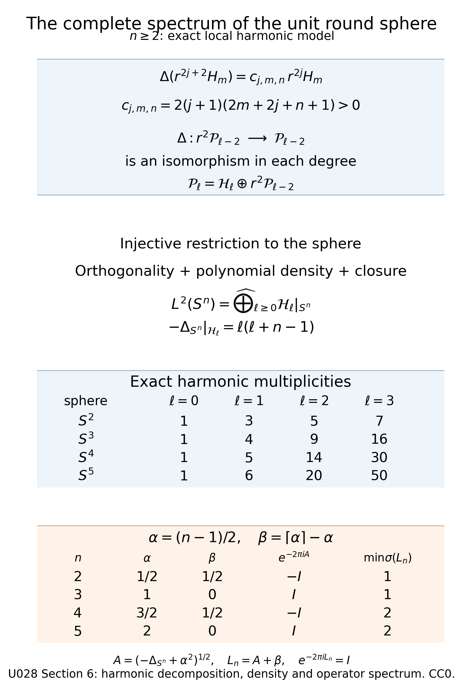

# Averaging a perturbation around closed trajectories

*Written by GPT-6.1 Sol (OpenAI) and GPT-6 Astra (OpenAI). Self-checked by the writing AI. Original exposition: CC0.*

**Working question: What survives averaging a perturbation along a closed trajectory?** An orbit average records the part of the perturbation that commutes with the periodic model. The oscillating remainder is removed by a unitary conjugation with a controlled lower-order error. On the round sphere, exact harmonic multiplicities and the square-root phase provide a concrete check of the cluster normalization before the general averaged staircase is used.

A periodic principal flow lets us average a lower-order perturbation along each closed trajectory. The average commutes with the exact arithmetic spectral model. A unitary change of variables removes the remaining order-zero part, leaving an error of order minus one. This produces a counting approximation that remembers the distribution of the orbit averages inside each cluster.

The free clustering article of Sher, Uribe and Villegas-Blas [SUV] supplies the comparison with averaging on Zoll manifolds. Duistermaat and Guillemin [DG], Colin de Verdière [CV] and the open text of Guillemin and Sternberg [GS] provide the periodic spectral background. We use the exact lattice operator, multiplicity polynomial and single-cluster probability law from [Arithmetic spectral clusters and their distributions](arithmetic-spectral-clusters-and-their-distributions.md), the powers and domains from [Positive real powers and spectral rescaling](positive-real-powers-and-spectral-rescaling.md), and [Wave evolution and cotangent flow](wave-evolution-and-cotangent-flow.md). The ordered symbol rule is proved in [Transverse composition and graph operators, Section 9, (G17)](../providers/analysis/transverse-composition-and-graph-operators.md#graph-egorov), after its actual composition and adjoint proofs. The underlying wave construction uses the written [scalar-transport proof](../providers/analysis/scalar-transport-and-phase-action.md#scalar-transport) and [qualified-pullback proof](../providers/analysis/wavefront-qualified-pullback.md#qualified-pullback). Scalar composition and summation are proved in [Classical scalar symbols, summation and regularity](../providers/analysis/classical-scalar-calculus.md#finite-symbol-calculus).

Throughout, \(X\) is compact, connected and without boundary, and \(n=\dim X\geq2\). Operators act on scalar half densities. Let \(L>0\) be a self-adjoint classical elliptic operator of order one, with domain \(H^1\), positive principal symbol \(p\), constant subprincipal symbol \(c\), and
\[
e^{-i\Pi L}=I,\qquad h=\frac{2\pi}{\Pi},\qquad
\chi_t=\exp(tH_p).
\tag{1}
\]
Every nonzero covector orbit has the same minimal period \(\Pi\). Write
\[
\mathcal V_k=\ker(L-hk),\quad \mu(k)=\dim\mathcal V_k,\quad
\mathcal W=\int_{\{p<1\}}dx\,d\xi.
\tag{2}
\]
Empty low eigenspaces are allowed. For all sufficiently large integers \(k\), the preceding lesson proves that \(\mu(k)\) is a positive polynomial of degree \(n-1\), with
\[
\mu(k)=w(k)+O(k^{n-3}),\qquad
w(k)=n\Pi^{-n}\mathcal W\left(k-\frac c h\right)^{n-1}.
\tag{3}
\]
When \(n=2\), \(\mu(k)=w(k)\) exactly for all large \(k\). Fix \(k_0\) beyond these finite exceptions, increasing it so \(w(k)>0\).

Let \(V\in\Psi^0_{\mathrm{cl}}\) be self-adjoint, with real principal symbol \(v\). Here is the precise bounded-perturbation argument used throughout. If \(A=A^*\) and \(D=D^*\) is bounded, the adjoint identity shows that \(y\in\mathcal D((A+D)^*)\) exactly when the functional \(u\mapsto(Au,y)\) is bounded in \(\|u\|\): subtract the bounded term \((Du,y)\). Thus \(\mathcal D((A+D)^*)=\mathcal D(A)\) and \((A+D)^*=A+D\) there. Applying this with \(A=L,D=V\) gives domain \(H^1\).

Choose \(a>\|D\|\) for any bounded self-adjoint perturbation \(D\) of \(L\) below. The exact factorization on \(H^1\) is
\[
 L+D+a=\bigl(I+D(L+a)^{-1}\bigr)(L+a).
\]
Since \(\|D(L+a)^{-1}\|\le\|D\|/a<1\), the inverse of the first factor is its norm-convergent geometric series; multiplying its finite partial sums verifies the inverse identity in the limit. Hence
\[
 \begin{aligned}
 K&=(L+D+a)^{-1}\\
 &=(L+a)^{-1}\bigl(I+D(L+a)^{-1}\bigr)^{-1}
 \end{aligned}
\]
is compact and injective. It is self-adjoint: for \(f=(L+D+a)u\) and \(g=(L+D+a)v\), symmetry gives \((Kf,g)=(f,Kg)\). Its quadratic form is \((Kf,f)=(u,(L+D+a)u)\ge0\). The [written positive compact spectral and inverse-domain proof](../providers/analysis/compact-spectrum-domains.md#the-positive-compact-spectral-proof) supplies a complete eigenbasis, finite multiplicities and eigenvalues of \(L+D\) tending to infinity. Elliptic regularity makes the eigenvectors smooth for the classical perturbations used here. This proves compact resolvent and discreteness in the exact generality used in the count comparison. There are only finitely many eigenvalues below zero.

## 1. The orbit average and an exact commutator

Set
\[
V_t=e^{itL}Ve^{-itL},\qquad
B=\frac1\Pi\int_0^\Pi V_t\,dt.
\tag{4}
\]
The graph form of Egorov's theorem makes \(V_t\) a smooth classical order-zero family, with principal symbol \(v\circ\chi_t\). To check its convention, the right factor \(e^{-itL}\) has graph \(\chi_t\), and the left factor is its exact inverse. The ordered symbol formula is therefore \(v(\chi_t z)\).

The parameter proof in that programme reading reduces the composed identity graph to a fixed phase. Its classical amplitude and every differentiated remainder therefore retain their symbol orders on compact time intervals. This fixed final graph is essential: differentiating an arbitrary moving-graph kernel may raise its order. Here differentiation agrees with
\[
\frac{dV_t}{dt}=i[L,V_t].
\tag{5}
\]
This commutator has order zero. Integration in (4) is legitimate in the classical symbol seminorms and in bounded operators on every \(H^s\). More explicitly, on a compact time interval the smooth symbol family has uniformly continuous values in each fixed seminorm. Its Riemann sums are Cauchy in that seminorm, by the uniform modulus of continuity times the interval length. Integrate each homogeneous term and its remainder; their uniform bounds preserve the classical expansion. The finite-seminorm Sobolev bound gives the same limit in operator norm on \(H^s\). The smooth kernel remainder and its derivatives integrate by the identical compact-interval estimate. The double integral in (7) follows by the same argument.

The family is \(\Pi\)-periodic. Translating its integration interval shows that \(B\) commutes with every \(e^{isL}\), hence with \(L\) on \(H^1\). It is self-adjoint and classical of order zero, with principal symbol
\[
b(z)=\frac1\Pi\int_0^\Pi v(\chi_t z)\,dt.
\tag{6}
\]
This symbol is constant along each orbit. Define a self-adjoint order-zero operator
\[
S=-\frac1\Pi\int_0^\Pi\int_0^t V_s\,ds\,dt
  =-\frac1\Pi\int_0^\Pi(\Pi-s)V_s\,ds.
\tag{7}
\]
Equations (5) and (7), first on smooth half densities, give
\[
[iS,L]
=\frac1\Pi\int_0^\Pi\int_0^t i[L,V_s]\,ds\,dt
=B-V.
\tag{8}
\]
The sign comes from interchanging the commutator members. This is an exact operator identity.

There is also an exact block verification that fixes the sign and shows which part survives. Let \(\mathsf P_k\) be the orthogonal projection onto \(\mathcal V_k\). On a finite sum of eigenspaces,
\[
 \mathsf P_k V_t\mathsf P_\ell
 =e^{ih(k-\ell)t}\mathsf P_kV\mathsf P_\ell.
\]
Integration over \([0,\Pi]\), using \(h\Pi=2\pi\), gives
\[
\begin{aligned}
 \mathsf P_kB\mathsf P_\ell
 &=\mathbf1_{\{k=\ell\}}\mathsf P_kV\mathsf P_k,\\
 \mathsf P_kS\mathsf P_\ell
 &=-\frac{i}{h(k-\ell)}\mathsf P_kV\mathsf P_\ell
 \quad(k\ne\ell),\\
 \mathsf P_kS\mathsf P_k
 &=-\frac\Pi2\mathsf P_kV\mathsf P_k.
\end{aligned}
\]
Indeed \(\int_0^\Pi(\Pi-t)e^{iat}\,dt=-\Pi/(ia)\) when \(a=h(k-\ell)\ne0\). Multiplying the off-diagonal formula for \(S\) by \(i(h\ell-hk)\) gives \(-\mathsf P_kV\mathsf P_\ell\); the diagonal commutator is zero. This proves (8) on the spectral core, and continuity \(H^1\to L^2\) proves it on the full domain. Moreover,
\[
 B=\sum_k\mathsf P_kV\mathsf P_k
\]
in the strong operator topology: orthogonality bounds every partial sum by \(\|V\|\), and the squared norm of its tail on \(u\) is at most \(\|V\|^2\sum_{k\text{ in the tail}}\|\mathsf P_ku\|^2\). The diagonal term in \(S\) is harmless because it commutes with \(L\). This calculation supplies the exact operator averaging identity; the preceding classical Egorov argument supplies the symbol and Sobolev regularity that the matrix calculation alone would not establish.

## 2. Conjugation by a bounded generator

On each real Sobolev space \(H^s\), the exponential series converges in operator norm and gives
\[
\|e^{itS}\|_{H^s\to H^s}\leq
\exp\!\left(|t|\,\|S\|_{H^s\to H^s}\right).
\tag{9}
\]
The extensions agree on smooth half densities and thus on common distribution domains. On \(L^2\), termwise adjoints of the norm-convergent series give \((e^{itS})^*=e^{-itS}\). The absolutely convergent Cauchy product equals the identity: its degree-\(m\) coefficient for \(m>0\) is \(\sum_{j=0}^m(-1)^j/(j!(m-j)!)=0\). This proves unitarity directly. The same product on \(H^s\) gives its inverse there, so it preserves \(H^1\) and \(C^\infty\).

**Proposition 2.1.** For scalar \(A\in\Psi^\gamma_{\mathrm{cl}}\), the conjugate \(e^{iS}Ae^{-iS}\) is classical of order \(\gamma\), with asymptotic expansion
\[
e^{iS}Ae^{-iS}\sim
\sum_{j=0}^\infty\frac1{j!}(\operatorname{ad}iS)^jA,
\qquad (\operatorname{ad}iS)A=[iS,A].
\tag{10}
\]
No convergence of the infinite series is asserted.

**Proof.** Scalar principal symbols commute, so the \(j\)-th iterated commutator has order \(\gamma-j\). Differentiating \(A(t)=e^{itS}Ae^{-itS}\) on smooth inputs gives
\[
A^{(j)}(t)=e^{itS}(\operatorname{ad}iS)^jA\,e^{-itS}.
\tag{11}
\]
The bounds (9) make these derivatives continuous between the Sobolev spaces permitted by their order. Iterating the fundamental theorem of calculus gives Taylor's formula with its integral remainder; interchanging the continuous integrals over their finite simplex gives the weight \((1-t)^N/N!\). Thus
\[
A(1)-\sum_{j=0}^N\frac{(\operatorname{ad}iS)^jA}{j!}
=\frac1{N!}\int_0^1(1-t)^N
e^{itS}(\operatorname{ad}iS)^{N+1}A\,e^{-itS}\,dt.
\tag{12}
\]
The remainder maps \(H^s\) to \(H^{s-\gamma+N+1}\).

Classically sum the terms to construct \(C\) with expansion (10). Its difference from the same finite sum has order \(\gamma-N-1\). Given real \(s,r\), choose \(N\) with \(s-\gamma+N+1\geq r\). Then \(A(1)-C:H^s\to H^r\) is continuous. This difference has a smooth kernel: localized point masses and their derivatives lie in sufficiently negative Sobolev spaces, and sufficiently positive target spaces allow every required kernel derivative to be evaluated continuously. Thus \(A(1)=C\) modulo a smooth kernel. ∎

Applying this proposition to \(L+V\), the terms of orders one and zero are \(L+V+[iS,L]=L+B\). Consequently, with \(U=e^{iS}\),
\[
U(L+V)U^*=L+B+R,\qquad
R\in\Psi^{-1}_{\mathrm{cl}},\qquad R=R^*.
\tag{13}
\]
Both sides have exact self-adjoint domain \(H^1\), since \(U\) preserves it. The residual is bounded; its equality and symmetry on smooth inputs extend to \(L^2\).

## 3. A form bound and comparison counts

The exact positive powers give a bounded self-adjoint operator
\[
C_R=L^{1/2}RL^{1/2}\in\Psi^0_{\mathrm{cl}}.
\tag{14}
\]
The identity \(R=L^{-1/2}C_RL^{-1/2}\) holds first on smooth inputs and then on \(L^2\), by boundedness. For \(C\geq\|C_R\|\), it gives
\[
-CL^{-1}\leq R\leq CL^{-1},\qquad
L+B-CL^{-1}\leq U(L+V)U^*\leq L+B+CL^{-1}.
\tag{15}
\]
These are quadratic-form inequalities on the common operator domain \(H^1\).

The required variational comparison follows directly from the discrete spectrum. For a lower-bounded operator with compact resolvent and increasing eigenvalues \(\lambda_j\),
\[
\lambda_j=
\inf_{\substack{F\subset\mathcal D\\ \dim F=j}}\ 
\sup_{0\ne u\in F}\frac{(Au,u)}{\|u\|^2}.
\tag{16}
\]
The span of the first \(j\) eigenvectors proves one bound. Every \(j\)-dimensional subspace has a nonzero vector perpendicular to the first \(j-1\) eigenvectors, whose spectral expansion proves the other bound. The quadratic-form sum converges absolutely on the operator domain. Inequalities on the same domain therefore order each eigenvalue; counts reverse that order.

Let \(N(\lambda)\) count eigenvalues of \(L+V\) not exceeding \(\lambda\). Equations (13) and (15) give
\[
N_{L+B+CL^{-1}}(\lambda)\leq N(\lambda)
\leq N_{L+B-CL^{-1}}(\lambda).
\tag{17}
\]
For all sufficiently large \(k\), write \(b_{k,j}\) for the eigenvalues of \(B|_{\mathcal V_k}\), and set
\[
\rho_k=\frac1{\mu(k)}\sum_{j=1}^{\mu(k)}\delta_{b_{k,j}},
\qquad \theta_k(s)=\rho_k((-\infty,s]).
\tag{18}
\]
The single-cluster theorem gives weak convergence to
\[
\rho(f)=\frac1{\mathcal W}\int_{\{p<1\}}f(b(z))\,dz,
\qquad \theta(s)=\rho((-\infty,s]).
\tag{19}
\]
Choose \([-M,M]\) containing all large-block spectra and the range of \(b\).

The comparison eigenvalues on \(\mathcal V_k\) are \(hk+b_{k,j}\pm C/(hk)\). For large \(\lambda\), every low comparison mode is fully counted; its finite total dimension is \(N_0\). Thus
\[
\begin{aligned}
N_0+\sum_{k>k_0}\mu(k)\,
\theta_k\!\left(\lambda-hk-\frac C{hk}\right)&\leq N(\lambda),\\
N(\lambda)&\leq N_0+\sum_{k>k_0}\mu(k)\,
\theta_k\!\left(\lambda-hk+\frac C{hk}\right).
\end{aligned}
\tag{20}
\]
Every sum is finite, and all endpoint counts are closed.

## 4. Uniform distribution bounds, including atoms

Weak convergence need not give convergence of distribution functions at their jumps.

**Lemma 4.1.** For probability measures \(\rho_k\) in a common compact interval converging weakly to \(\rho\), every \(\varepsilon>0\) admits a threshold beyond which
\[
\theta(s-\varepsilon)-\varepsilon
\leq\theta_k(s)
\leq\theta(s+\varepsilon)+\varepsilon
\qquad(s\in\mathbb R).
\tag{21}
\]

**Proof.** Choose smooth nondecreasing \(\psi:\mathbb R\to[0,1]\), zero at arguments at most \(-\varepsilon\) and one at arguments at least zero. Then
\[
\theta_k(s)\leq\int\psi(s-t)\,d\rho_k(t).
\tag{22}
\]
Weak convergence gives pointwise convergence of these integrals. Their Lipschitz constants in \(s\) are bounded by \(\|\psi'\|_\infty\). A finite net upgrades convergence to uniform convergence on a compact interval: make both Lipschitz errors small, then choose a common threshold for its finitely many nodes. Outside a larger fixed interval, the integrals and distribution functions are identically zero or one. Thus convergence is uniform on \(\mathbb R\).

For large \(k\), (22) is at most
\(\int\psi(s-t)\,d\rho(t)+\varepsilon\leq\theta(s+\varepsilon)+\varepsilon\).
For the other bound, \(\psi(s-t-\varepsilon)\leq\mathbf1_{\{t\leq s\}}\), while its integral against \(\rho\) is at least \(\theta(s-\varepsilon)\). Apply the same uniform convergence. The endpoint values of \(\psi\) retain atoms at the displayed endpoints. ∎

If \(\rho\) has no atoms, \(\theta\) is continuous and constant outside a compact interval, hence uniformly continuous. Equation (21) then implies
\[
\sup_s|\theta_k(s)-\theta(s)|\longrightarrow0.
\tag{23}
\]
Absolute continuity of \(\rho\) is unnecessary.

## 5. The averaged staircase

Define an increasing function
\[
N_a(\lambda)=\sum_{k>k_0}w(k)\theta(\lambda-hk).
\tag{24}
\]
The choice of the finite initial threshold affects it only by a bounded high-energy term.

**Theorem 5.1.** For every \(\delta>0\),
\[
\begin{aligned}
\limsup_{\lambda\to+\infty}\lambda^{1-n}
\bigl(N(\lambda)-N_a(\lambda+\delta)\bigr)&\leq0,\\
\liminf_{\lambda\to+\infty}\lambda^{1-n}
\bigl(N(\lambda)-N_a(\lambda-\delta)\bigr)&\geq0.
\end{aligned}
\tag{25}
\]
If \(\rho\) has no atoms, then
\[
N(\lambda)-N_a(\lambda)=o(\lambda^{n-1}).
\tag{26}
\]

**Proof.** Fix \(\delta>0\) and arbitrarily small \(0<\varepsilon<\min(1,\delta/3)\). Choose \(K_\varepsilon\) so (21) holds and \(C/(hk)\leq\varepsilon\) for \(k>K_\varepsilon\). The comparison summands in (20) are bounded below and above by
\[
\mu(k)\bigl[\theta(\lambda-hk-\delta)-\varepsilon\bigr],
\qquad
\mu(k)\bigl[\theta(\lambda-hk+\delta)+\varepsilon\bigr].
\tag{27}
\]

Only a bounded number of summands require these error terms. Enlarge \(k_0\) once so \(C/(hk)\leq1\). Outside
\[
|\lambda-hk|\leq M+\delta+1,
\tag{28}
\]
the empirical comparison function and the corresponding shifted limit function are both exactly zero or both exactly one. Their difference is zero. The lattice centers in (28) occupy an interval of fixed length, so their number is bounded independently of \(\lambda\), and each has multiplicity \(O(\lambda^{n-1})\). Finitely many \(k\leq K_\varepsilon\) cause no persistent error: at sufficiently large energy, their counts are exactly full.

Consequently
\[
\begin{aligned}
N(\lambda)&\leq N_0+\sum_{k>k_0}\mu(k)\theta(\lambda-hk+\delta)
+C_\delta\varepsilon\lambda^{n-1},\\
N(\lambda)&\geq N_0+\sum_{k>k_0}\mu(k)\theta(\lambda-hk-\delta)
-C_\delta\varepsilon\lambda^{n-1}.
\end{aligned}
\tag{29}
\]
The constant \(C_\delta\) is independent of the sufficiently small \(\varepsilon\).

Replacing \(\mu(k)\) by \(w(k)\) costs \(O(\lambda^{n-2})\) when \(n\geq3\): only \(k=O(\lambda)\) contribute, and sum (3). For \(n=2\), the eventual equality in (3) makes this replacement exact beyond the fixed threshold. The remaining \(N_0\) is \(O(1)=o(\lambda^{n-1})\). Divide (29) by \(\lambda^{n-1}\), take the indicated limits, and let \(\varepsilon\) decrease to zero. This proves (25).

If \(\rho\) is atom-free, let
\(\omega_\theta(r)=\sup_{|s-t|\leq r}|\theta(s)-\theta(t)|\).
For \(0<\delta\leq1\),
\[
N_a(\lambda+\delta)-N_a(\lambda-\delta)
=\sum_{k>k_0}w(k)
[\theta(\lambda+\delta-hk)-\theta(\lambda-\delta-hk)].
\tag{30}
\]
Only uniformly finitely many lattice centers contribute; each weight is at most \(C\lambda^{n-1}\). Thus (30) is bounded by
\(C\lambda^{n-1}\omega_\theta(2\delta)\), with \(C\) independent of \(\delta\leq1\). Use (25) to bound the upper limits of both signed differences \(N-N_a\) and \(N_a-N\) by this quantity. Let \(\delta\) decrease to zero, proving (26). ∎

Adding an \(\varepsilon\mu(k)\) error to every fully counted earlier cluster would instead produce \(\varepsilon\lambda^n\), which does not prove the theorem. The exact cancellations outside (28) prevent that error.

## 6. Great-circle averages on the round sphere

Let \(X=S^2\) have its unit round metric, with \(-\Delta_{S^2}\geq0\). Identify functions and half densities using Riemannian volume, and set
\[
L=\left(-\Delta_{S^2}+\frac14\right)^{1/2}+\frac12.
\tag{31}
\]
We verify its exact spectrum. Let \(\mathcal P_\ell\) be homogeneous polynomials of degree \(\ell\) in three variables, and \(\mathcal H_\ell\) their harmonic subspace. Put \(r=|x|\). Inductively,
\[
\mathcal P_\ell=\mathcal H_\ell\oplus r^2\mathcal P_{\ell-2}.
\tag{32}
\]
Negative-degree spaces are zero. To prove the step, the earlier decompositions express \(\mathcal P_{\ell-2}\) as a direct sum of \(r^{2j}H_m\), \(H_m\in\mathcal H_m\), \(m+2j=\ell-2\). Direct differentiation gives
\[
\Delta_{\mathbb R^3}(r^{2j+2}H_m)
=2(j+1)(2m+2j+3)r^{2j}H_m.
\tag{33}
\]
All coefficients are positive. Therefore the Laplacian maps \(r^2\mathcal P_{\ell-2}\) isomorphically onto \(\mathcal P_{\ell-2}\). Subtract the unique \(r^2Q\) with the same Laplacian as the given degree-\(\ell\) polynomial. Its remainder is harmonic, and injectivity proves directness.

Polar coordinates give
\[
-\Delta_{S^2}(H_\ell|_{S^2})=\ell(\ell+1)H_\ell|_{S^2},
\quad
\dim\mathcal H_\ell=
\binom{\ell+2}{2}-\binom{\ell}{2}=2\ell+1.
\tag{34}
\]
The second binomial is zero for \(\ell<2\). Restriction of a homogeneous harmonic polynomial is injective. These spaces are orthogonal by Green's identity and complete: (32) decomposes every polynomial restriction; polynomial restrictions are dense in continuous functions by radial extension to a cube and tensor Bernstein approximation, using the sum of the three coordinate variance bounds. Continuous functions are dense in \(L^2(S^2)\). Thus this is the full spectral description.

The operator in parentheses in (31) has eigenvalues \((\ell+1/2)^2\). Hence
\[
L|_{\mathcal H_\ell}=\ell+1,\qquad \mu(k)=2k-1\quad(k\geq1).
\tag{35}
\]
The real-power theorem gives domain \(H^1\) and principal symbol \(p=|\xi|\). The half-density Laplacian has zero subprincipal symbol: conjugation by \(|g|^{1/4}\) gives the degree-one left-symbol term
\(-i(\partial_i g^{ij})\xi_j\), canceled by
\((i/2)\partial_x\partial_\xi(g^{ij}\xi_i\xi_j)\).
Thus \(L\) has subprincipal symbol \(c=1/2\). Unit-speed covector geodesics return minimally after \(\Pi=2\pi\); (35) also gives \(e^{-2\pi iL}=I\). The phase volume is \(\mathcal W=4\pi^2\), so (3) agrees exactly with \(w(k)=2k-1\).

For \(V\) multiplication by \(x_3^2\), a great circle with oriented normal \(\nu\) is \(x(t)=e\cos t+f\sin t\), with \(e,f,\nu\) an oriented orthonormal frame. Its orbit mean is
\[
b(\nu)=\frac{e_3^2+f_3^2}{2}=\frac{1-\nu_3^2}{2}.
\tag{36}
\]
The normalized phase-volume law of
\(\nu=x\times\xi^\sharp/|\xi|\) is uniform sphere probability. Rotation preserves phase volume and carries this map equivariantly, so the law is rotation invariant. To verify uniqueness, every spherical cap of a fixed radius has the same mass. Integrate its centers against normalized area and use Fubini: its mass must equal its area probability. Averaging a continuous function over shrinking caps converges uniformly to that function. Fubini then shows that its integral against the invariant law equals its area integral.

For normalized area, \(u=\nu_3\) is uniform on \([-1,1]\), since the area element in \((u,\varphi)\) is \(du\,d\varphi\). Therefore
\[
\theta(s)=
\begin{cases}
0,&s<0,\\
1-\sqrt{1-2s},&0\leq s\leq\tfrac12,\\
1,&s>\tfrac12.
\end{cases}
\tag{37}
\]
In the middle range, \(b\leq s\) means \(|u|\geq\sqrt{1-2s}\). Neither endpoint has an atom. The density \((1-2s)^{-1/2}\) on \((0,1/2)\) has integral one. The count satisfies
\[
N_{L+x_3^2}(\lambda)=
\sum_{k\geq1}(2k-1)\theta(\lambda-k)+o(\lambda).
\tag{38}
\]
Extending the sum through finitely many low blocks costs only \(O(1)\).

### The spectral lattice in every sphere dimension

The same square-root comparison applies to the unit round sphere \(S^n\) for every \(n\geq2\). We now extend the preceding polynomial argument directly to this round model, including completeness and the operator spectrum. The programme's elliptic Sobolev-domain and real-power results retain their existing analytic scope. The local harmonic interface to be proved is that restrictions of degree-\(\ell\) homogeneous harmonic polynomials in \(\mathbb R^{n+1}\) form a complete orthogonal collection of eigenspaces, with

\[
 -\Delta_{S^n}|_{\mathcal H_\ell}=\ell(\ell+n-1),\qquad
 m_n(\ell)=\dim\mathcal H_\ell
 =\binom{\ell+n}{n}-\binom{\ell+n-2}{n},\qquad \ell\geq0.
\]

The second binomial is zero for \(\ell=0,1\). A list of harmonic eigenfunctions alone would not exclude additional spectrum. The following proof establishes the full interface, after which the retained arithmetic applies without a planned harmonic-spectrum input.

**The harmonic decomposition in every dimension.** For this proof, let \(\mathcal P_\ell\) be the complex homogeneous polynomials on \(\mathbb R^{n+1}\), and \(\mathcal H_\ell=\ker(\Delta:\mathcal P_\ell\to\mathcal P_{\ell-2})\), with negative-degree spaces zero. Euler's identity gives \(x\cdot\nabla H_m=mH_m\) for \(H_m\in\mathcal H_m\). Since
\[
 \nabla r^a=ar^{a-2}x,\qquad
 \Delta r^a=a(a+n-1)r^{a-2},
\]
the product rule at \(a=2j+2\) gives
\[
 \begin{gathered}
 \Delta(r^{2j+2}H_m)\\
 =2(j+1)(2m+2j+n+1)r^{2j}H_m,\\
 j\geq0.
 \end{gathered}
\]
Every coefficient is strictly positive. Induct on \(\ell\) to obtain the decomposition (32) in this ambient dimension. Degrees zero and one are harmonic. At the inductive step, the lower-degree decomposition writes \(\mathcal P_{\ell-2}\) as the direct sum of \(r^{2j}\mathcal H_m\) with \(m+2j=\ell-2\). The displayed coefficients make
\[
 \Delta:r^2\mathcal P_{\ell-2}\longrightarrow\mathcal P_{\ell-2}
\]
an isomorphism. For any \(P\in\mathcal P_\ell\), subtract the unique \(r^2Q\) whose Laplacian equals \(\Delta P\). The remainder is harmonic, and injectivity of this isomorphism makes the sum direct. Thus
\[
 \begin{gathered}
 \mathcal P_\ell=\mathcal H_\ell\oplus r^2\mathcal P_{\ell-2},\\
 \dim\mathcal H_\ell=
 \binom{\ell+n}{n}-\binom{\ell+n-2}{n}.
 \end{gathered}
\]
Restriction to the sphere is injective: a homogeneous polynomial vanishing there vanishes at every nonzero point by homogeneity, and hence everywhere. For completeness, the polar metric is \(dr^2+r^2g_{S^n}\): differentiating \(x=r\omega\) gives the radial unit vector orthogonal to the angular tangent vectors. Its volume density is \(r^n dr\,d\sigma\) by the determinant. Integration by parts in coordinates gives the metric Laplacian \(|g|^{-1/2}\partial_i(|g|^{1/2}g^{ij}\partial_j)\), and substituting this block metric gives
\[
 \Delta_{\mathbb R^{n+1}}
 =\partial_r^2+\frac nr\partial_r+r^{-2}\Delta_{S^n}.
\]
Applying it to \(r^\ell H_\ell|_{S^n}\) proves the displayed eigenvalue \(\ell(\ell+n-1)\). The dimension of \(\mathcal P_\ell\) is the number of nonnegative exponent vectors summing to \(\ell\). A row of \(\ell\) marks and \(n\) separators encodes each vector uniquely, giving \(\binom{\ell+n}{n}\). This verifies the dimension formula used above. These eigenvalues are strictly increasing in \(\ell\). Coordinate integration by parts, using a smooth partition of unity and cancellation of its summed derivatives, gives
\[
 \int_{S^n}(-\Delta f)\overline g\,d\sigma
 =\int_{S^n}\langle\nabla f,\overline{\nabla g}\rangle\,d\sigma
 =\int_{S^n}f\,\overline{-\Delta g}\,d\sigma.
\]
Applying this to two harmonic restrictions proves orthogonality. This also proves positivity and symmetry in the operator argument below.

**Density, including the approximation estimate.** Iterating the direct decomposition expresses every polynomial restriction as a finite sum of harmonic restrictions. Given \(f\in C(S^n)\), extend it to the cube \([-1,1]^{n+1}\) by
\[
 F(x)=\begin{cases}
 \min(1,|x|)f(x/|x|),&x\ne0,\\
 0,&x=0.
 \end{cases}
\]
It agrees with \(f\) on the sphere and is continuous, including at zero since \(|F(x)|\leq |x|\|f\|_\infty\) there. Put \(G(t)=F(2t-1)\) on \([0,1]^{n+1}\). The tensor Bernstein polynomial \(B_MG(t)\) is the expectation of \(G(J_1/M,\ldots,J_{n+1}/M)\), where the independent \(J_i\) have binomial parameters \((M,t_i)\). Their coordinate variances are at most \(1/(4M)\). For every \(\eta>0\), Chebyshev and the union bound give
\[
 \mathbb P\!\left(\max_i|J_i/M-t_i|>\eta\right)
 \leq\frac{n+1}{4M\eta^2}.
\]
Off this event the physical cube distance is at most \(2\sqrt{n+1}\eta\). If \(\omega_F\) is the Euclidean modulus of continuity, the resulting uniform bound is
\[
 \begin{gathered}
 \sup_t|B_MG(t)-G(t)|\\
 \leq\omega_F(2\sqrt{n+1}\eta)
       +\frac{(n+1)\|F\|_\infty}{2M\eta^2}.
 \end{gathered}
\]
First choose \(\eta\) small, then \(M\) large. This proves uniform polynomial approximation on the sphere and hence density of the harmonic restrictions in \(C(S^n)\).

To pass to \(L^2\), use the written [Euclidean finite-norm density proof](../providers/analysis/euclidean-approximation-and-convolution.md#finite-p-density) and [surface-coordinate and finite-partition construction](../providers/analysis/coordinate-inverses-and-integration.md#finite-partitions). Multiply an arbitrary sphere \(L^2\) function by a finite smooth partition subordinate to relatively compact coordinate patches. Each coordinate piece has compact support inside its chart. On a fixed larger compact chart set, the smooth surface density is bounded above and below by positive constants, so weighted and ordinary \(L^2\) norms are comparable. Approximate the piece by Euclidean compact smooth functions in \(L^2\), multiplying the approximants by a fixed chart cutoff equal to one on its support. This retains convergence and makes extension by zero smooth on the sphere. Summing the finitely many approximants proves that smooth, hence continuous, functions are dense in sphere \(L^2\). The uniform polynomial approximation above now proves that the harmonic restrictions are a complete orthogonal collection in \(L^2(S^n)\).

**The full operator spectrum.** Start \(-\Delta_{S^n}\) on smooth functions. It is densely defined, symmetric and nonnegative by the just-proved Green identity. Define \(D\) to be the diagonal operator on the complete harmonic decomposition, with eigenvalues \(\ell(\ell+n-1)\) and domain consisting exactly of the vectors satisfying
\[
 \sum_{\ell\geq0}
 [\ell(\ell+n-1)]^2\|\mathsf P_\ell u\|_2^2<\infty,
\]
where \(\mathsf P_\ell\) is the orthogonal projection onto the harmonic restrictions. Testing the adjoint against each basis vector forces its image coordinates to be these real eigenvalues times the coordinates of its input. Such an image is in \(L^2\) exactly on the displayed domain; there the pairing identity holds by Cauchy–Schwarz. Thus \(D=D^*\). Finite harmonic sums approximate every vector in this domain in graph norm, by truncating the two convergent squared sums. For smooth \(u\), integration by parts identifies the coefficients of \(-\Delta u\) with those of \(Du\); Parseval gives the domain condition and equality. Hence the smooth operator is contained in the closed operator \(D\), while its graph closure contains the graph closure of all finite harmonic sums, which is \(D\). Both inclusions prove that its closure is exactly \(D\), with no separate deficiency-index theorem. The eigenvalues tend to infinity with finite multiplicities, so the diagonal resolvent is compact and there is no additional spectrum. The [classical scalar elliptic-domain proof](../providers/analysis/classical-scalar-calculus.md) and the preceding real-power lesson identify the usual domain as \(H^2\) and the square-root domain as \(H^1\). This completes the local harmonic-spectrum proof. ∎

This proof extends the original \(S^2\) argument for this round model. The elliptic course's programme carrier retains its actual writing state; no foreign proof or provider completion is being claimed. The following square-root shifts, multiplicity products and classical and quantum phases remain exactly those of the model.

Set \(\alpha=(n-1)/2\) and, for a fixed \(c>0\), let \(A_c=(-\Delta_{S^n}+c)^{1/2}\). The positive spectral square root acts on the same eigenspaces, so

\[
 a_c(\ell)=\sqrt{\ell(\ell+n-1)+c}
 =\sqrt{(\ell+\alpha)^2+c-\alpha^2}.
\]

At \(c=\alpha^2\), every eigenvalue is exactly \(\ell+\alpha\). For any other fixed \(c>0\), rationalizing gives, for \(\ell\geq1\),

\[
 a_c(\ell)-(\ell+\alpha)
 =\frac{c-\alpha^2}{\sqrt{(\ell+\alpha)^2+c-\alpha^2}+\ell+\alpha},\qquad
 |a_c(\ell)-\ell-\alpha|
 \leq\frac{|c-\alpha^2|}{\ell+\alpha}.
\]

Thus the displacement is \(O(\ell^{-1})\), with its sign fixed by \(c-\alpha^2\). The finitely many low degrees require no asymptotic claim, and their multiplicities remain unchanged.

Expanding the binomials, including degrees zero and one directly, gives the exact polynomial

\[
 m_n(\ell)=\frac{2\ell+n-1}{(n-1)!}
              \prod_{r=1}^{n-2}(\ell+r).
\]

For \(n=2\) the product is empty and equals one. In the natural spectral coordinate \(\kappa=\ell+\alpha\), this becomes

\[
 m_n(\ell)=\frac{2\kappa}{(n-1)!}
              \prod_{r=1}^{n-2}(\kappa+r-\alpha).
\]

The shifts \(r-\alpha\) sum to zero. Hence for \(n\geq3\) the coefficient of \(\kappa^{n-2}\) vanishes, and

\[
 m_n(\ell)=\frac{2}{(n-1)!}\kappa^{n-1}
                  +O(\kappa^{n-3}).
\]

For \(n=2\), the exact formula is \(m_2(\ell)=2\kappa\). The first three dimension examples are \(2\ell+1\), \((\ell+1)^2\), and \((2\ell+3)(\ell+1)(\ell+2)/6\).

The spectral phase of the unshifted exact model is

\[
 e^{-2\pi i A_{\alpha^2}}=(-1)^{n-1}I.
\]

Indeed each eigenspace has multiplier \(e^{-2\pi i(\ell+\alpha)}\), and completeness supplies the operator identity. If an integer lattice is wanted, put \(\beta=\lceil\alpha\rceil-\alpha\), which is zero or one half. Then \(L_n=A_{\alpha^2}+\beta\) has eigenvalues \(\ell+\lceil\alpha\rceil\) and \(e^{-2\pi iL_n}=I\). Formula (31) is precisely the case \(n=2\).

The corresponding classical period is also \(2\pi\). At a unit tangent vector \(v\perp x\), the round geodesic and its tangent are

\[
 x(t)=x\cos t+v\sin t,\qquad
 v(t)=-x\sin t+v\cos t.
\]

Both vectors return exactly when \(\cos t=1\) and \(\sin t=0\), whose least positive solution is \(2\pi\). The metric identifies the tangent with its covector, so this is a full phase-space return. The phase factor \((-1)^{n-1}\) above records why the classical period need not make the unshifted quantum evolution the identity.

The proof diagram records the positive Laplacian coefficient, the direct decomposition, injective restriction and complete orthogonal spectral resolution proved above. The multiplicity table contains exact values of the retained binomial formula. The phase table uses the exact \(\alpha=(n-1)/2\), \(\beta=\lceil\alpha\rceil-\alpha\), unshifted phase \((-1)^{n-1}\), and lowest eigenvalue of \(L_n\); the additive shift is retained in every dimension. Section 6, “The harmonic decomposition,” “Density” and “The full operator spectrum,” supplies the proof, and the displayed square-root and phase formulas supply the model constants. [Vector figure](../figures/sphere-harmonics-and-phase.svg). This is a local extension of the course's polynomial argument, with no historical novelty claim.

### Use the conclusion

Use the complete local round-sphere proof to check the quantum return phase in every dimension. Then distinguish the averaged principal observable, the conjugation error and the distribution bounds at atoms.

## 7. Exercises with complete solutions

**Exercise 7.1 (the commutator sign; introductory).** Suppose \(\Pi=2\pi\) and \(V_t=V_0\cos t+V_1\sin t\) is the exact evolved self-adjoint family. Find \(B,S\) and check (8).

**Solution 7.1.** The two period integrals vanish, so \(B=0\). Integration by parts gives
\[
\int_0^{2\pi}(2\pi-s)\cos s\,ds=0,\qquad
\int_0^{2\pi}(2\pi-s)\sin s\,ds=2\pi.
\tag{39}
\]
Hence \(S=-V_1\). Comparing derivatives of the assumed evolution gives
\(i[L,V_0]=V_1\) and \(i[L,V_1]=-V_0\). Thus
\([iS,L]=-i[V_1,L]=i[L,V_1]=-V_0=B-V_0\).

**Exercise 7.2 (the first residual symbol; intermediate).** With \(s\) the principal symbol of \(S\), find the order-minus-one principal symbol of \(R\). Explain the exact domain in (13).

**Solution 7.2.** Retain the first commutator of \(V\) and the second of \(L\); all further terms have order at most minus two. Equation (8) gives
\[
R\equiv[iS,V]+\frac12[iS,[iS,L]]
=\frac12[iS,V+B]\pmod{\Psi^{-2}_{\mathrm{cl}}},
\qquad
r_{-1}=\frac12\{s,v+b\}.
\tag{40}
\]
The scalar rule \(i[S,A]_{\mathrm{prin}}=\{s,a\}\) uses
\(\{s,a\}=s_\xi a_x-s_x a_\xi\), consistent with \(D=-i\partial\).
Its order is minus one. The exponential and its inverse are bounded on \(H^1\), so \(U(H^1)=H^1\). A unitary conjugate of \(L+V\) has that domain. Bounded self-adjoint \(B+R\) also leaves the domain of \(L\) equal to \(H^1\).

**Exercise 7.3 (an atomic obstruction; intermediate).** In (31), take \(V=dL^{-1}\), \(0<d<1/2\). Find \(\rho,N_a\) and \(N(K)-N_a(K)\) at positive integer energies \(K\). Does (26) hold?

**Solution 7.3.** The order-zero principal symbol is zero, and \(B=V\) since it commutes with \(L\). Thus \(\rho=\delta_0\) and
\(\theta(s)=\mathbf1_{\{s\geq0\}}\). Including all positive blocks,
\[
N_a(K)=K^2,\qquad N(K)=(K-1)^2,\qquad
N(K)-N_a(K)=-2K+1.
\tag{41}
\]
Indeed the true eigenvalue of block \(k\) is \(k+d/k\). Every \(k\leq K-1\) is below \(K\), and every \(k\geq K\) is above it. The normalized difference tends to \(-2\), so (26) fails. A different finite threshold changes only a bounded constant. The shifted bounds remain valid because \(d/k\) eventually lies below every fixed positive shift.

**Exercise 7.4 (quantitative distribution information; advanced).** Suppose additionally, for \(\beta>0\) and \(0<\alpha\leq1\),
\[
\sup_s|\theta_k(s)-\theta(s)|\leq Ck^{-\beta},
\qquad |\theta(s)-\theta(t)|\leq C|s-t|^\alpha.
\tag{42}
\]
Prove
\[
N(\lambda)-N_a(\lambda)
=O\!\left(\lambda^{n-1-\min(1,\alpha,\beta)}\right).
\tag{43}
\]

**Solution 7.4.** On each active block of (20), replacing the empirical law costs \(O(k^{-\beta})\), and the shift \(C/(hk)\) costs \(O(k^{-\alpha})\). There are uniformly finitely many active blocks, with \(k\) comparable to \(\lambda\) and multiplicities \(O(\lambda^{n-1})\). Their total error is
\(O(\lambda^{n-1-\beta}+\lambda^{n-1-\alpha})\).
Earlier full blocks and later empty blocks agree exactly, so contribute neither error. Multiplicity replacement adds \(O(\lambda^{n-2})\) when \(n\geq3\), and no eventual error for \(n=2\). Finite low modes add \(O(1)\), covered by (43) since its exponent is nonnegative. Taking the largest bound proves the formula. Weak convergence alone does not supply the additional rate (42).

**Exercise 7.5 (a term invisible to the orbit average; advanced).** On \(S^2\), take the multiplication potential \(a x_3+d x_3^2\), \(a\in\mathbb R\), \(d>0\). Find its orbit law and averaged count. Prove that adding the linear term changes the count by \(o(\lambda)\).

**Solution 7.5.** A great circle has \(x_3(t)=e_3\cos t+f_3\sin t\), whose mean is zero. Its mean square is (36). Hence
\[
b(\nu)=\frac d2(1-\nu_3^2),\qquad
N_a(\lambda)=\sum_{k\geq1}(2k-1)
\theta\!\left(\frac{\lambda-k}{d}\right),
\tag{44}
\]
where \(\theta\) is the unscaled law (37). This law is atom-free and independent of \(a\). Theorem 5.1 gives the same \(N_a\), up to \(o(\lambda)\), for \(L+a x_3+d x_3^2\) and \(L+d x_3^2\). Subtracting proves the assertion. Individual eigenvalues may still change.

## References

The normal-form source has a different order convention. [SUV, §3.1, Proposition 3.1] treats the order-two Laplacian plus an order-zero, possibly complex potential; its proof is explicitly a sketch of an iteration producing a commuting term and a smoothing residual. For the scalar order-one model here, (4)–(8) and the block verification solve the commutator exactly, and Proposition 2.1 proves the required classical conjugation with an order-minus-one residual. The form comparison and distribution argument then establish the full atom-qualified counting statement. No all-orders smoothing normal form is needed. [SUV, §5.1] identifies the space of oriented great circles on \(S^2\) and its averaging transform; our direct great-circle computation obtains (36)–(37). The full harmonic-spectrum proof and the shifts in every dimension \(n\) are the local arguments of Section 6.

[CV, §§1–3] supplies the lattice and single-cluster setting used in the preceding lesson. [Z, §4, Proposition 4.9] explains the periodic transport obstruction for a Zoll Laplacian's band symbol; its geometric Theorem 3 is restricted to \(S^2\). Those results contextualize the averaging mechanism without replacing the exact bounded-generator and domain argument here. [GS, §10.2] constructs an unscaled-time semiclassical pseudodifferential family. The Hamiltonian-graph evolution required in (4) instead uses the classical construction and Egorov adapter in the linked course prerequisites; §§11.3–11.4 of [GS] are trace and mapping-torus background.

- [SUV] David Sher, Alejandro Uribe and Carlos Villegas-Blas, “On the pseudospectra of Schrödinger operators on Zoll manifolds,” arXiv:1812.01769v1 (2018). [Freely accessible full preprint](https://arxiv.org/abs/1812.01769v1), §§3.1 and 5.1.
- [CV] Yves Colin de Verdière, “Sur le spectre des opérateurs elliptiques à bicaractéristiques toutes périodiques,” *Commentarii Mathematici Helvetici* 54 (1979), 508–522. [Freely accessible digitized full article](https://gdz.sub.uni-goettingen.de/download/pdf/PPN358147735_0054/LOG_0041.pdf), §§1–3.
- [GS] Victor Guillemin and Shlomo Sternberg, *Semi-classical Analysis*, author edition dated April 25, 2012. [Freely accessible author text](https://people.math.harvard.edu/~shlomo/docs/Semi_Classical_Analysis_Start.pdf), §10.2 and §§11.3–11.4.
- [DG] Johannes J. Duistermaat and Victor W. Guillemin, “The spectrum of positive elliptic operators and periodic bicharacteristics,” *Inventiones Mathematicae* 29 (1975), 39–79. [Freely accessible digitized full article](https://gdz.sub.uni-goettingen.de/download/pdf/PPN356556735_0029/LOG_0010.pdf), §3.
- [Z] Steve Zelditch, “Fine structure of Zoll spectra,” *Journal of Functional Analysis* 143 (1997), 415–460. [Elsevier open archive](https://doi.org/10.1006/jfan.1996.2981), §4, Proposition 4.9. 
